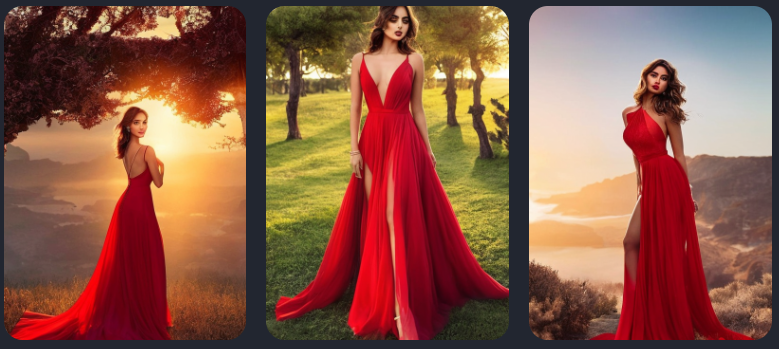
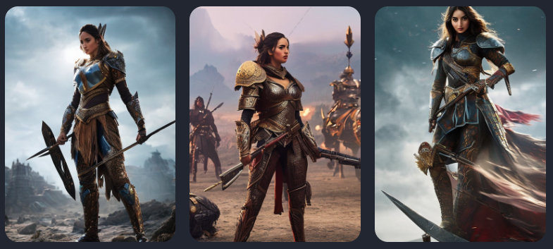
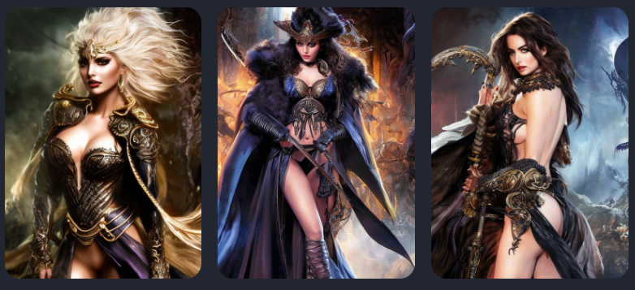

# 怎么使用ChatGPT来帮助我们生成提示词

## Close-up illustration

有==三种重要的技术==可以从`ChatGPT`中梳理出高质量的提示词：

- **指定图像样式**。我们需要指定一种特定类型的图像。在本例子中，作者将要求**逼真的特写插图** “*photorealistic close-up illustration”*。
- **确定主题**。作者将以女演员**安娜·德·阿玛斯**为主题。这样做的原因是**演员名**是一个**强关键字**。它不仅会改变脸（有意），还会严重影响风格（无意）。如果主题不固定，`ChatGPT`将在每个提示中使用不同的女主角。
- **Prime with examples**。最后，给出两个示例`prompts`。

把这些放在一起，我们发给`ChatGPT`的语句是：

> Examples of high quality prompt for **stunning close-up photorealistic illustration of Ana de Armas** for text-to-image models (Stable Diffusion, midjourney or Dalle2) are
>
> – *portrait of beautiful happy young ana de armas, ethereal, realistic anime, trending on pixiv, detailed, clean lines, sharp lines, crisp lines, award winning illustration, masterpiece, 4k, eugene de blaas and ross tran, vibrant color scheme, intricately detailed*
>
> – *alberto seveso and geo2099 style, A highly detailed and hyper realistic portrait of a gorgeous young ana de armas, lisa frank, trending on artstation, butterflies, floral, sharp focus, studio photo, intricate details, highly detailed, by Tvera and wlop and artgerm*
>
> Give me more examples.

`ChatGPT`的回答是：

> - A stunning close-up illustration of Ana de Armas in a dramatic, dark and moody style, inspired by the work of Simon Stålenhag, with intricate details and a sense of mystery.
> - A photorealistic, highly detailed illustration of Ana de Armas in a vintage Hollywood style, reminiscent of the golden age of cinema, with a focus on glamour and elegance.
> - A close-up illustration of Ana de Armas in a neo-noir style, reminiscent of the film noir genre, with a focus on shadows, contrasts, and a sense of danger.

作者把这些提示放在`Stable Diffusion v1.5`中，使用25步的`DPM++ 2M Karras`采样器，`CFG`为7，图像大小为512\*704，使用以下通用否定提示：*ugly, tiling, poorly drawn hands, poorly drawn feet, poorly drawn face, out of frame, extra limbs, disfigured, deformed, body out of frame, bad anatomy, watermark, signature, cut off, low contrast, underexposed, overexposed, bad art, beginner, amateur, distorted face*。

从ChatGPT的回答中，我们可以学到很多！

## Full-body illustration

现在让我们改进`ChatGPT`提示，梳理出==全身画像的提示==。我们所需要做的就是在问题和提示示例中添加“*full-body”*。

> Examples of high quality prompt for **stunning photorealistic full body illustration of ana de armas** for text-to-image models (Stable Diffusion, midjourney or Dalle2) are
>
>
> f*ull body portrait of beautiful happy young ana de armas, ethereal, realistic anime, trending on pixiv, detailed, clean lines, sharp lines, crisp lines, award winning illustration, masterpiece, 4k, eugene de blaas and ross tran, vibrant color scheme, intricately detailed*
>
> *full body portrait of a gorgeous young ana de armas, A highly detailed and hyper realistic lisa frank, trending on artstation, butterflies, floral, sharp focus, studio photo, intricate details, highly detailed, by Tvera and wlop and artgerm, alberto seveso and geo2099 style,*
>
> Give me more examples

如果我们喜欢`ChatGPT`给出的特定提示，我们可以这样：**I like the third one. Can you give me more examples like that?**

## 总结

`ChatGPT`可以为SD生成高质量的提示吗？答案是肯定的。但你需要遵循以下三个原则：

- 指定图像风格
- 确定主题
- 用示例启动