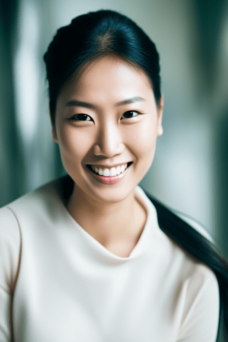
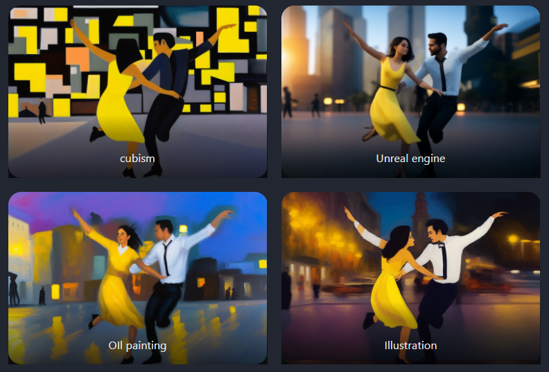

# Depth-to-image快速入门

在`Stable Diffusion v2`中，**Depth-to-image** (`Depth2img`)是一个被低估的模型。它是对 [image-to-image](https://stable-diffusion-art.com/how-to-use-img2img-to-turn-an-amateur-drawing-to-professional-with-stable-diffusion-image-to-image/)（`img2img`）的增强，在生成新图像时利用了**深度信息**。

有了**depth-to-image**，我们可以更好地控制分别合成**主体**和**背景**。比如说，我们可以把《爱乐之城》中的浪漫场面变成**摔跤比赛**

稍后我们将讨论**更多细节**，但现在只将**depth-to-image**视为**image-to-image**的增强版本。它们可以以完全相同的方式，使用给定图像和文本提示，生成新图像。例如，我们使用提示词：*photo of two men wrestling*。下面是重绘幅度从`0.4`到`1.0`的结果。

在低重绘强度下，图像变化不够；在高重绘强度下，我们确实看到两个摔跤手，但**原始构图**丢失了。**Depth-to-image** 解决了这个问题。我们可以把重绘强度一直调到`1`，而不会失去原始的构图。

## Depth-to-image的工作原理

回想一下，在`image-to-image`中，**SD**以**图像**和**提示词**作为输入，最终图像在颜色和形状上与**输入图像**相似。

在`depth-to-image`中，**SD**同样以图像和提示符作为输入，但该模型首先使用[MIDaS](https://github.com/isl-org/MiDaS)估计**输入图像的深度图**。然后，深度图被**SD**用作图像生成的**额外条件**。换句话说，`depth-to-image`使用三种条件来生成新图像：

- 文本提示
- 原始图像
- 深度图

有了深度图，模型对**场景的三维构成**有了一定的了解，前景对象和背景可以分离。

## 下载depth-to-image

首先，下载[模型文件](https://huggingface.co/stabilityai/stable-diffusion-2-depth/resolve/main/512-depth-ema.ckpt)，然后下载[参数文件](https://raw.githubusercontent.com/Stability-AI/stablediffusion/main/configs/stable-diffusion/v2-midas-inference.yaml)，并将其重命名为 *512-depth-ema.yaml*。将它们都放在模型目录中：*stable-diffusion-webui/models/Stable-diffusion*。

像使用`checkPont`模型文件一样，进行使用。请注意，**深度模型**可用于**image-to-image**和**inpainting**，但不能用于**text-to-image**。

> 从模型名称可以看出，这是一个**512模型**。这意味着当新图像的至少一面是512像素时，效果最好。

## 实战

我们有一张图片，如下：

我们想要一些变化，比如把他变成一个亚洲女人。但是我们已经在为他设计了很多**额外的元素**，所以我们不希望这个人的形状改变。使用`image-to-image`，在尽可能保持原有构造的情况下，最后得到的最佳效果如下：

> Prompt: *a beautiful happy asian woman with perfect detailed eyes, detailed facial feature, detailed skin, natural lighting, long hair*. 
>
> Denoising strength: 0.58

现在的困境是：将重绘强度增加到`1`，会得到我们想要的结果，但我们会失去原来的形状：

使用==深度图像模型==将允许我们将**重绘强度**设置为`1`，而不会丢失原始形状：

> 请注意，男人的形状被完整地保存了下来，并且SD不知怎么地找到了如何渲染长发的方法。

## 其他优点

`depth-to-image`的一个优点是：可以在不损失**构图**的情况下，将重绘强度一直调到`1`。这使得将场景转换为不同的风格变得容易。

使用`SD`很难生成**特定的人体姿势**。使用`depth-to-image`，我们可以使用**带有想要的姿势的照片**作为基础图像。将**重绘强度**设置为`1`，姿势将完全保留。照片可以是电影场景、一幅画，也可以是你用手机拍的照片，不再有多余的四肢，奇怪的手和无休止的`Inpainting`来固定姿势。

