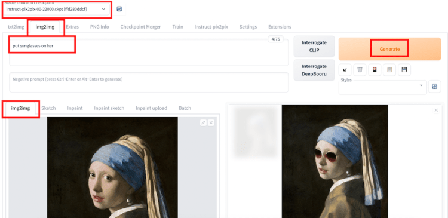

# Instruct Pix2Pix: Edit and stylize photos with text

==Instruct Pix2Pix==是一个Stable Diffusion model，用**用户的文字指令**就能编辑图像。

## Instruct pix2pix能做什么？

这是一种**编辑照片的创新方式**，只需告诉它你想要修改什么。例如，假设我们想把下面图片中的马变成龙。

我们可以简单地把图像给模型，然后说：*Turn the horse into a dragon*。该模型将把马变成龙，同时保持图像的其余部分完整。

## 下载Instruct pix2pix

[下载地址](https://huggingface.co/timbrooks/instruct-pix2pix/resolve/main/instruct-pix2pix-00-22000.ckpt)

将检查点文件放在以下文件夹中：*stable-diffusion-webui/models/Stable-diffusion*

## 使用

- 选择**Instruct Pix2Pix**模型

- 换到**img2img**选项卡，上传源图片

- 在提示框中键入指令：Put a sunglasses on her

- 生成

  

## Instruct-pix2pix的参数

以下是可能需要更改的重要参数：

- **output Batch**：4，每次编辑可能非常不同。确保每次至少生成几个，并选择一个有效的。
- **Sampling steps**：20~30
- **Seed**：编辑将随着种子值而改变。当想要生成不同的编辑结果时，使用随机种子；在拨动参数（提示符、文本CFG和图像CFG）时，使用`-1`。
- **Text CFG**：与**text-to-image**的CFG相同。如果希望编辑遵循提示，增加它的值。
- **Image CFG**：与text CFG对应。如果减少编辑量，增加它的值。

## 使用instruct pix2pix的一些想法

一些编辑，尤其是那些与颜色有关的编辑可能会产生`bleeding`**伪影**，在大部分情况下，这些伪影无伤大雅。但在不可接受的应用程序中，我们可以使用**遮罩**来限制变化的区域。

**Instruct pix2pix**在产生风格照片时，比 使用模型的[image-to-image](https://stable-diffusion-art.com/stylize-images/)更好。这是因为它在编辑后==很好地保留了原始内容==：

## 指令模板:star:

下面是一个指令模板列表：

- Change the Style to (an artist or style name)
- Have her/him (doing something)
- Make her/him look like (an object or person)
- Turn the (something in the photo) into a (new object)
- Add a (object)
- Add a (object) on (something in the photo)
- Replace the (object) with (another object)
- Put them in (a scene or background)
- Make it (a place, background or weather)
- Apply (a emotion or something on a person)