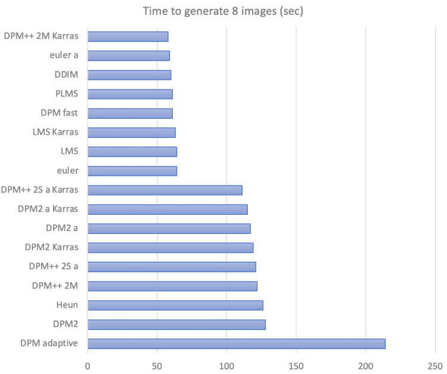
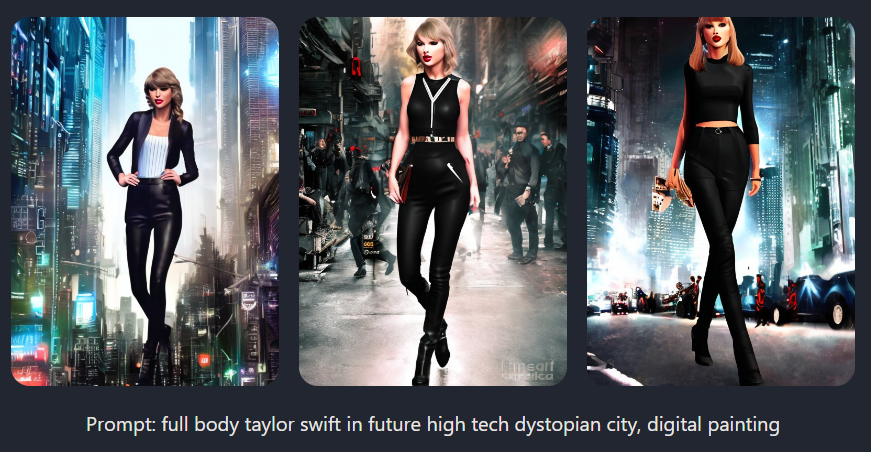
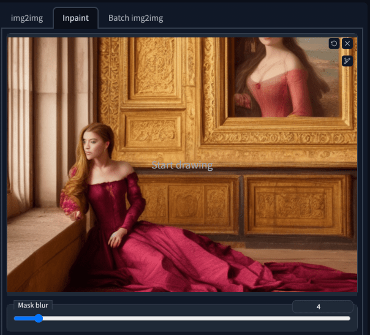

# SD参数指南

## 1. CFG Scale

全称是**Classifier Free Guidance scale**，用于控制模型应该在多大程度上遵守我们的提示。

| Value |                                                          |
| ----- | -------------------------------------------------------- |
| 1     | Mostly ignore your prompt.                               |
| 3     | Be more creative.                                        |
| 7     | A good balance between following the prompt and freedom. |
| 16    | Adhere more to prompt                                    |
| 30    | Strictly follow the prompt.                              |

> 一般建议使用`7`
>
> 

## 2. 采样次数 Sampling steps

**质量**随着**采样次数**的增加而提高。通常使用**欧拉采样器**，20次就足以获得**高质量、清晰的图像**。虽然采样更多，图像仍然会发生微妙的变化——内容会变得不同，但不一定是更高的质量。

> 一般建议采样20次。如果怀疑质量较低，可以调整到更高的采用次数。
>
> 

## 3. 采样方法 Sampling methods

哪个方法产生的图片质量最好，使用哪一个方法，没有定式。但在时间上，不同的采用方法的复杂度是相对固定的：

> 一般建议：20 steps with ==Euler==.

## 4. Seed

都是学计算机的，不用解释了。

> 设置为`-1`来进行探索，生成不同的图像。
>
> 设置为其他值，则固定结果，进行微调。

## 5. Other

| 参数          |                    |
| ------------- | ------------------ |
| Image size    | 图像大小           |
| Batch size    | 每次生成的图像数量 |
| Restore faces | 修复脸部           |

------

# CheckPoints模型

> 有很多漏洞，或者说很不学术，只是为了让我这种小白，可以有个浅显的理解和认知

==模型==`Models`，有时称为**检查点**（`checkpoint files`），是预训练的SD权重，用于生成一般或特定类型的图像。

一个模型能生成什么样的图像取决于**用来训练它们的数据**。如果训练数据中没有猫，模型将无法生成猫的图像。同样，如果只用猫的图像训练一个模型，它只会生成猫。

## 1. Fine-tuned models:star:

**微调**`Fine-tuning`是机器学习中的一种常见技术——它需要一个**在广泛数据集上训练的模型**，并在狭窄的数据集上进行训练。==经过微调的模型==将倾向于生成与我们的数据集相似的图像，同时保持**原始模型的多功能性**。

有三种方法来生成`fine-tuning methods`：

- Additional training：通过用我们**感兴趣的额外数据集**训练一个**基本模型**来实现的。例如，可以使用**额外的老爷车数据集**来训练`Stable Diffusion v1.5`，从而使**汽车的美学**偏向于老爷车。
- DeamBooth：最初由谷歌开发，是一种将**自定义主题**注入到`text-to-image models`的技术。这个技术可以只使用3-5个自定义主题的图像。用Dreambooth训练的模型需要**一个特殊的关键字**来调节模型。
- 文本反转`textual inversion`（也就是`embedding`）：其目标与`Dreambooth`类似，仅通过几个示例图像将**自定义主题**注入模型，并为新对象专门创建一个新关键字。在保持模型其余部分不变的同时，只对**文本嵌入网络**（` text embedding network`）进行微调。

## 2. 模型v1

有成千上万个微调过的SD模型，这个数字每天都在增加。以下是可用于一般用途的模型列表。

- [Stable diffusion v1.4](https://huggingface.co/CompVis/stable-diffusion-v-1-4-original/resolve/main/sd-v1-4.ckpt)：由Stability AI于2022年8月发布的v1.4模型被认为是第一个公开可用的稳定扩散模型。大多数情况下，使用它就足够了

- [Stable diffusion v1.5](https://huggingface.co/runwayml/stable-diffusion-v1-5/resolve/main/v1-5-pruned-emaonly.ckpt)：与`v1.4`相比，它产生的结果略有不同，但不清楚它们是否更好。与`v1.4`一样，可以将`v1.5`视为通用模型

- [F222](https://huggingface.co/acheong08/f222/blob/main/f222.ckpt)：`F222`最初是为生成裸体而训练的，有助于生成美丽的女性。有趣的是，它也很擅长制作美观的衣服。它很容易产生裸体（所以请在正面提示词中加入 `NFSW` 哦）。

- [Anything V3](https://huggingface.co/Linaqruf/anything-v3.0/resolve/main/anything-v3-fp16-pruned.safetensors)：一个特殊用途的模型，经过训练可以生成**高质量的动画风格图像**。一个缺点是（或许不是？），它产生的女性身材不成比例，可以用`F222`对它进行微调。

- [Open Journey](https://huggingface.co/prompthero/openjourney/resolve/main/mdjrny-v4.ckpt)：它具有不同的审美，是一个很好的通用模型。触发提示词：`mdjrny-v4 style`

- [DreamShaper](https://civitai.com/api/download/models/5636?type=Pruned%20Model&format=SafeTensor)：`Dreamshaper`模型是微调的**肖像插图风格**，画风处于现实和CG之间。

  

- [ChilloutMix](https://civitai.com/models/6424/chilloutmix)：`ChilloutMix`是一个特殊的模型，用于生成**照片质量的亚洲女性**。它就像亚洲版的`F222`。与`embedding` `ulzzang-6500-v1`一起使用，生成像k-pop一样的女孩。像`F222`一样，它有时也会生成裸体。

  

- [Waifu-diffusion](https://huggingface.co/hakurei/waifu-diffusion)：日式动画风

  

- [Robo Diffusion](https://huggingface.co/nousr/robo-diffusion)：一个有趣的机器人风格的模型

  

- [Mo-di-diffusion](https://huggingface.co/nitrosocke/mo-di-diffusion)：皮克斯迪士尼风格。Use keywords: `modern disney style`

  

- [wlop model](https://huggingface.co/SirVeggie/wlop/resolve/main/wlop-any.ckpt)：鬼刀插画风格，有配套的[embedding](https://huggingface.co/datasets/Nerfgun3/wlop_style/resolve/main/wlop_style.pt)

  

- [Inkpunk Diffusion](https://huggingface.co/Envvi/Inkpunk-Diffusion)：`Inkpunk Diffusion`是一个`dreambooth`训练的模型，具有非常独特的插图风格。Use keyword: `nvinkpunk`

  

## 3. 模型v2

`Stability AI`发布了一系列新的模型v2。到目前为止，已经发布了2.0和2.1模型。v2模型的主要变化是：

- 除了512*512像素外，还提供更高分辨率的768\*768像素版本。
- 不能搞黄色了

## 4. 如何使用模型

将下载好的模型文件放在下列文件夹下：*stable-diffusion-webui/models/Stable-diffusion/*。

## 5. 混合两个模型:star:

如果要合并两个模型，请在**模型合并**页签，在**模型A**和**模型B**中选择需要合并的两个模型。通过调整倍率（`M`）来调整两个模型的相对权重。在按下`Run`后，新的合并模型将产生。

### 5.1 合并实例

以下是使用**倍率0.5**，来合并`F222`和`Anything V3`的示例图像：

## 6. 训练自己的CheckPoints

> [Todo](https://stable-diffusion-art.com/dreambooth/)

## 7. 其他模型类型

有四种主要类型的文件可以称为**模型**。为了防止混淆，我们需要理解各自的区别：

- **Checkpoint models**：这些是==真正的稳定扩散模型==。它们包含生成图像所需的所有内容，不需要额外的文件。它们很大，通常为2~7GB。（这就是本节我们所介绍的）
- **[Textual inversions](https://stable-diffusion-art.com/embedding/)** (**embeddings**) ：它们是定义**新关键字**，来生成**新对象或样式**的小文件。它们很小，通常为10~100 KB。必须将它们与检查点模型一起使用。
- **LoRA models**：它们是检查点模型的**小补丁文件**，用于**修改样式**。它们通常为10~200mb。必须将它们与检查点模型一起使用。
- **[Hypernetworks](https://stable-diffusion-art.com/hypernetwork/)**：它们是添加到**检查点模型**中的**附加网络模块**。它们通常是5~300 MB。必须与检查点模型一起使用它们。

------

# 提示Prompts:star:

> Stable Diffusion内部存在一个名为`token`的对象，但注意，我们的提示词`word`和这个`token`并不一定是一一对应的关系，例如：SD不理解dreambeach这个提示词，会将其分为两个`token`，分别代表`dream`和`beach`

## 1. 提示的构成

关于提示的重要性，我想是不言而喻的。首先，我们需要了解一个好的提示，应该如何构建。有一些经过验证的技术可以生成**高质量的特定图像**。

### 1.1 主题内容Subject

> ==***The subject is what you want to see in the image***==

`Subject`是我们要生成图像的==主要内容==，我们是要绘制美少女，还是要绘制一个可爱的猫，她们在什么地方，又在做什么表情。

> 一个示例`Subject`：*Emma Watson as a powerful mysterious sorceress, casting lightning magic, detailed clothing*。
>
> 

我们在书写`Subject`时，有一些简单的建议：

- 在描述`Subject`时要详细而具体。
- 使用括号`()`来增加其强度，或使用`[]`来减少其强度。
- 使用**名人的名字**来构建我们的`Subject`，可以得到**高质量结果**，但会**失去自由度**

### 1.2 绘画类别Medium

`Medium`定义了我们作品的类别，在视觉效果上，会呈现不同的艺术风格。常见的`Medium`有：

- **Portrait**：将图像集中在**面部/头像**上

- **Digital painting**：数字艺术
- **photograph**：照片风格
- **oil painting**：油画
- **Concept art**：插图风格，2D
- **Ultra realistic illustration**：**非常逼真的绘画，很适合用来画人**
- **Underwater portrait**：在画人的时候使用，模拟人在水中的表现，例如：头发会飘浮起来
- **Underwater steampunk**： *underwater with wash color*
- etc.

> 添加`Medium`：*Emma Watson as a powerful mysterious sorceress, casting lightning magic, detailed clothing, **digital painting***
>
> 

### 1.3 绘制风格Style

`Style`可以进一步完善**美术风格**。推荐的`Style`提示词有：

- **hyperrealistic**： 增加细节和分辨率 :star:
- **pop-art**： Pop艺术风格
- **Modernist**：色彩鲜艳，对比度高
- **art nouveau**：添加装饰和细节，建筑风格
- **full body**：全身像
- etc.

> 我们可以尝试混合`style`

> 加上hyperrealistic, fantasy, surrealist, full body：*Emma Watson as a powerful mysterious sorceress, casting lightning magic, detailed clothing, digital painting, **hyperrealistic, fantasy, Surrealist, full body***
>
> 

### 1.4 作者Artist

在提示词中提到艺术家会产生强烈的效果。我们研究他们的作品，根据我们的需要，做出明智的选择。下面给出一些有名的作者：

- **John Collier**： 9世纪肖像画家——似乎能给画面添加`elegancy`（优雅？）
- **Stanley Artgerm Lau**：强烈的**现实主义现代绘画**
- **Frida Kahlo**：继承了`Collier`的肖像风格，绘制风格更加独特——有时会导致**相框**`picture frame`
- **John Singer Sargent**：适合与**女子肖像**搭配使用，可以产生**19世纪的精致服装**，有些**印象派色彩**
- **Alphonse Mucha**：独特风格的2D肖像画
- etc.

关于`Artist`和`Medium`、`Style`，我们应该使用风格配套的，这样才能产生好的图像——`photograph`这种`Medium`就不应该和**梵高**配合在一起使用。

> 艺术家的名字是一个非常强大的风格修改器——明智地使用。

> *Emma Watson as a powerful mysterious sorceress, casting lightning magic, detailed clothing, digital painting, hyperrealistic, fantasy, Surrealist, full body, **by Stanley Artgerm Lau and Alphonse Mucha***
>
> 

### 1.5 网站Website

使用一个**图像网站**作为提示词，也会产生强大的效果——特别是那些拥有自己风格的网站，像`Artstation`和`Deviant Art`这样的小众图形网站。下面给出一些有名的网站：

- **pixiv**：日本动漫风格
- **pixabay**： Commercial stock photo style
- **artstation**：现代插画，幻想
- **Deviant Art**
- etc.

> *Emma Watson as a powerful mysterious sorceress, casting lightning magic, detailed clothing, digital painting, hyperrealistic, fantasy, Surrealist, full body, by Stanley Artgerm Lau and Alphonse Mucha, **artstation***
>
> 
>
> 这不是一个很大的变化，但图像看起来确实像在`Artstation`上看到的那样。

### 1.6 Resolution

不能简单理解为分辨率，这里直接给出大佬给的提示词：

- **unreal engine**：非常逼真和详细的3D画面
- **sharp focus**：增加分辨率
- **8k**：提高分辨率
- **vray**：3D rendering best for objects, landscape and building.

> *Emma Watson as a powerful mysterious sorceress, casting lightning magic, detailed clothing, digital painting, hyperrealistic, fantasy, Surrealist, full body, by Stanley Artgerm Lau and Alphonse Mucha, artstation, **highly detailed, sharp focus***
>
> 
>
> 也许不是很大的影响，因为之前的图像已经非常清晰和详细了，但补充一下也无妨。

### 1.7 Additional details

| keyword            | Note                                                         |
| ------------------ | ------------------------------------------------------------ |
| **dramatic**       | 增加面部的情感表现力。整体上大幅增加照片的潜力/可变性`variability` |
| **silk**           | 在衣服上添加丝绸                                             |
| **expansive**      | 背景更开阔，`subject`更小                                    |
| **low angle shot** | 从低角度拍摄                                                 |
| **god rays**       | 破云而出的阳光                                               |
| **psychedelic**    | 失真的鲜艳色彩                                               |

`Additional details`是为了修改图像而添加的**甜味剂**`sweeteners`。

> *Emma Watson as a powerful mysterious sorceress, casting lightning magic, detailed clothing, digital painting, hyperrealistic, fantasy, Surrealist, full body, by Stanley Artgerm Lau and Alphonse Mucha, artstation, highly detailed, sharp focus, **sci-fi, stunningly beautiful, dystopian***
>
> 

### 1.8 色彩Color

可以通过添加**颜色关键字**来控制**图像的整体颜色**——指定的颜色可以显示为色调或对象的主体颜色。

- **iridescent gold**：金色
- **silver**：银色
- **vintage**：年代感

> *Emma Watson as a powerful mysterious sorceress, casting lightning magic, detailed clothing, digital painting, hyperrealistic, fantasy, Surrealist, full body, by Stanley Artgerm Lau and Alphonse Mucha, artstation, highly detailed, sharp focus, sci-fi, stunningly beautiful, dystopian, **iridescent gold***
>
> 

### 1.9 光影Lighting

`Lighting`可以对图像的外观产生巨大的影响。让我们在提示词中添加电影般的灯光和黑暗。

> *Emma Watson as a powerful mysterious sorceress, casting lightning magic, detailed clothing, digital painting, hyperrealistic, fantasy, Surrealist, full body, by Stanley Artgerm Lau and Alphonse Mucha, artstation, highly detailed, sharp focus, sci-fi, stunningly beautiful, dystopian, iridescent gold, **cinematic lighting, dark***
>
> 

## 2. 负面提示词 Negative prompt

使用**负面提示**是引导图像生成的另一个好方法，但不是放进想要的东西，而是放进不想要的东西。它们可以是物体，也可以是样式和不需要的属性——例如，`ugly`，`deformed`。

负面提示词一般是通用的，例如：*ugly, tiling, poorly drawn hands, poorly drawn feet, poorly drawn face, out of frame, extra limbs, disfigured, deformed, body out of frame, bad anatomy, watermark, signature, cut off, low contrast, underexposed, overexposed, bad art, beginner, amateur, distorted face, blurry, draft, grainy*

> 

### 2.1 如何使用负面提示词:star:

:one:第一个明显的用法是删除不想在图像中看到的内容。具体例子见[How to use negative prompts?](https://stable-diffusion-art.com/how-to-use-negative-prompts/)。

:two:用**负面提示**做**细微的改变** ——不需要删除任何东西，只需要对`subjects`做一些细微的改变。

有时候使用负面提示词也无法完全满足我们的要求，甚至随着强度提示，图像会发生剧烈变化，如下所示：当ear的强度指定为`1.9`时，整个图像的构成都发生了变化，这显然不是我们想要的。

我们怎么能避免图像变化呢？一个小窍门是使用==提示词迭代技术==：首先使用**无意义的单词**作为**否定提示**，然后在后面的采样步骤切换到(ear:1.9)，例如：*[the: (ear:1.9): 0.5]*。

> 这背后的原因是**扩散过程**在开始阶段是最重要的。后面的步骤只是对细节进行更精细的调整，比如**毛发覆盖耳朵**。
>
> 

:three:用**负面提示词**来改变风格。在**正面提示词**中添加太多，可能会**混淆扩散器**，导致描述的泛化——本来我们使用提示词就是为了约束AI的想象，但提示词过多会导致**约束混乱**。

### 2.2 通用的负面提示词

- ugly, disfigured, deformed （丑陋，毁容，畸形）
- underexposed, overexposed（曝光不足、曝光过度）
- low contrast（低对比度）
- 一个流行的通用负面提示词：*ugly, tiling, poorly drawn hands, poorly drawn feet, poorly drawn face, out of frame, extra limbs, disfigured, deformed, body out of frame, blurry, bad anatomy, blurred, watermark, grainy, signature, cut off, draft* （丑陋，平纹，画得不好的手，画得不好的脚，画得不好的脸，画框外，多余的四肢，毁容，变形，身体画框外，模糊，糟糕的解剖结构，模糊，水印，颗粒状，符号，剪切，草稿）
- `blurry, blurred, grainy, draft` 这些会改变图像风格的负面提示词要谨慎使用
- 因此，==一个更好的通用负面提示词==是：*ugly, tiling, poorly drawn hands, poorly drawn feet, poorly drawn face, out of frame, extra limbs, disfigured, deformed, body out of frame, bad anatomy, watermark, signature, cut off, low contrast, underexposed, overexposed, bad art, beginner, amateur, distorted face*

## 3. 构建高质量的提示词

### 3.1 迭代构建

我们可以把**提示词的构建**看作一个**迭代的过程**：

1. 从一个只有`subject`、`medium`和`style`的简单提示开始
2. 每次至少生成4张图片，看看能得到什么
3. 效果没达标，则添加最多2个提示词，生成4张图片，看看能得到什么
4. 效果没达标，继续3，否则结束。

### 3.2 使用负面提示词

我们可以使用一个通用的负面提示。这些提示词可以是你想避免的物体或身体部位。例如，**手的绘制**存在明显Bug时，我们可以在**负面提示词**中加入`Hand`。

> **负面提示词**在很多时候是**不可缺少的**，可以从这个[例子](https://stable-diffusion-art.com/how-negative-prompt-work/)中看出。

## 4. 提示词技术 Prompting techniques

### 4.1 提示词权重

我们可以通过语法（提示词：因子）来调整**提示词的权重**。因子是一个值，小于1表示不太重要，大于1表示比较重要。

> **dog**, autumn in paris, ornate, beautiful, atmosphere, vibe, mist, smoke, fire, chimney, rain, wet, pristine, puddles, melting, dripping, snow, creek, lush, ice, bridge, forest, roses, flowers, by stanley artgerm lau, greg rutkowski, thomas kindkade, alphonse mucha, loish, norman rockwell.
>
> 

### 4.2 () and []

调整提示词强度的一个等效方法是使用`()`和`[]`。(keyword)将提示词的强度增加1.1倍，与(keyword:1.1)相同。[keyword] 将强度降低0.9倍，与(keyword:0.9)相同。我们也可以嵌套使用，其效果是乘法。

> (keyword): 1.1
>
> ((keyword)): 1.21
>
> (((keyword))): 1.33

### 4.3 混合和迁移

==提示词混合==可以用来混合两个描述同一对象的提示词要素，例如：*white|yellow flower*，会生成黄色和白色混合的花。

==提示词迁移==则是连续生成具有多个不同特征的对象，不断迁移，例如：[white|red|bule] flower，会先生成白花，再生成红花，再生成蓝花。

### 4.4 提示词迭代

你可以混合两个关键词，其语法是：

> [keyword1 : keyword2: factor]

例如，我们使用：*Oil painting portrait of [Joe Biden: Donald Trump: 0.5]*，进行30次采样，前15次是：*Oil painting portrait of Joe Biden*；后15次是：*Oil painting portrait of Donald Trump*。

我们注意到**特朗普**身穿白色西装，这更像是**拜登**的打扮。这是一个完美的例子，说明了提示词混合的==一个非常重要的规则==： 第一个提示词决定了**全局的构成**——早期的扩散步骤设定了整体构图；后期的步骤（第二个提示词）则完善了细节。

## 5. 关联效应

### 5.1 属性关联

有些属性是==强相关的==——当你指定了一个，你就会得到另一个。假设我们想生成**蓝眼睛的女人**的照片：*a young female with **blue eyes**, highlights in hair, sitting outside restaurant, wearing a white outfit, side light*。

如果我们改成**棕色眼睛**呢？

在提示的任何地方，都没有指明**种族**。但是因为有蓝眼睛的人主要是欧洲人，所以生成了白种人。棕色眼睛在不同种族中更常见，所以你会看到一个更多样化的种族样本。

> 刻板印象和偏见是人工智能模型的一个大话题

## 5.2 名人姓名的关联

每个提示词都有一些无意的联想。对于名人的名字来说，这一点尤其明显。一些演员在拍照时喜欢摆出某些姿势或穿上某些衣服，因此在训练数据中也是如此——如果Taylor（在训练数据中）总是翘着二郎腿，模型也会认为翘二郎腿的就是Taylor。

==姿势和装着==是全局性的构成。如果你想要她的脸，但不想要她的姿势，你可以在以后的取样步骤中使用关键词混合来把她换进来，例如：[Trump:Taylor swift:0.1]

### 5.3 艺术家的关联

19世纪捷克画家Alphonse Mucha在**肖像生成**中是一个很受欢迎的提示词，因为这个名字有助于产生有趣的点缀，而且他的风格与**数字插图**融合得非常好，但它也经常在背景中留下标志性的**圆形或圆顶形图案**。

## 6.  Embedding are keywords

嵌入物`Embeddings`，是**文本反转**的结果，是提示词的组合。

`Style-Empire`是常用的一个嵌入物，因为它能为**人像图像**添加暗色调，并创造有趣的照明效果。由于它是在有夜间街景的图片上训练的，我们可以使用它增加一些黑色，也许还有建筑物和街道。

## X. Nenly的提示词笔记

- 提示词类别

  - 内容型提示词

  - 标准化提示词

- 提示词语法

  - 权重（优先级）增减

- 书写提示词的模版

  - 通用模版

- 借助工具

  - 利用提示词工具，以“选取”的方式完成提示词撰写

    - 一个工具箱：http://www.atoolbox.net/Tool.php?Id=1101

    - AI词语加速器：https://ai.dawnmark.cn/

  - 不要被已有的词条限制了思维

- 抄作业

  - 参考一些模型网站的例图与提示词记录网站的成品

    - OpenArt：https://openart.ai/

    - ArtHubAi：https://arthub.ai/

  - 按照需要参考内容/标准化提示词

# 采样器

> 详见[如何选取采样器](https://stable-diffusion-art.com/samplers/)

ToDo

## X. 使用建议

1. 如果想使用一些快速、融合、新颖、质量不错的东西，那么很好的选择是：
   - **DPM++ 2M Karras**：20~30 steps
   - **UniPC**：20~30 steps
2. 如果想要**高质量的图像**，而不关心收敛，好的选择是：
   - **DPM++ SDE Karras**：8~12 steps
   - **DDIM**：10~15 steps
3. 如果喜欢稳定的、可复制的图像，请避免使用任何ancestral  samplers
4. 如果喜欢简单的东西，**Euler**和**Heun**是不错的选择
   - 使用**Heun**时，可以减少迭代次数，以节省时间

# InPainting技术

`Inpainting`是一种用来**修补图像小缺陷**的方法。

## 1. 基本的InPainting

> 将使用一个实例来进行说明

首先，我们使用提示词：*[emma watson: amber heard: 0.5], (long hair:0.5), headLeaf, wearing stola, vast roman palace, large window, medieval renaissance palace, ((large room)), 4k, arstation, intricate, elegant, highly detailed*，来生成一个初始图像。

这是一个很好的图像，但我想解决以下问题：

- 脸看起来不自然
- 右臂不见了

### 1.1 使用inpainting模型

对于`Inpainting`模型，我们可以有两种采纳方案：

- 一个专门用于`Inpainting`的 [Stable Diffusion model](https://huggingface.co/runwayml/stable-diffusion-inpainting)
- 使用生成图像的checkpoint模型（即使用这个模型生成图像，也用它来作为`Inpainting`模型）

> 对于`Inpainting`模型，我们吧把它放在：stable-diffusion-webui/models/Stable-diffusion

### 1.2 创建inpaint蒙版

在`AUTOMATIC1111 GUI`中，选择**`img2img`选项卡**，并选择**`Inpaint`子选项卡**。将图像上传到画布上：

我们将同时在**右臂和脸**上进行`Inpainting`。使用**画笔工具**创建一个蒙版`mask`——这是我们想要`SD`来重新生成图像的区域。

### 1.3 InPainting设置:star:

- **提示词**：可以重用**原来的提示**来修复缺陷——这就像在一个特定区域生成多个图像一样。
- **图像大小**：需要将图像大小调整为与原始图像相同
- **面部修复**：如果正在绘制人脸，我们可以打开**面部修复**。（注意这个选项可能会产生不自然的外观。它还可能生成与模型风格不一致的内容。）
- **遮罩内容**`Mask Content`：如果我们希望**重绘结果**以原始内容的颜色和形状为指导，请选择`original`
  - 在大多数情况下，将使用`Original`和改变**重绘幅度**`denoising strength`，来达到不同的效果。
  - 如果想再生一些**与原始内容完全不同的东西**，可以使用==潜变量噪声==或==潜变量值零==，例如切除肢体或隐藏一只手。
- **重绘幅度**`denoising strength`：重绘幅度控制着结果与原始图像相比会有多大的变化。当你把它设为`0`时，什么都不会改变；将其设置为`1`时，将获得一个不相关的`inpainting`。`0.75`是一个建议值。
- **批次数量**`Batch size`：确保一次生成几个图像，以便可以选择最好的图像。将种子设置为-1，这样每个图像都是不同的。
- **重绘区域**：重绘大面积区域时选择**全图**，重绘小面积区域时选择**仅蒙版**

### 1.4 迭代

重复上诉过程，直到结果满足我们的要求。

## 2. 添加新的对象

我们想给图像添加一些新的东西。让我们尝试在图片中添加**一个扇子**。首先，将图像上传到画布上，并在**胸部和右臂**周围创建一个遮罩。在**原始提示的开头**添加**手持风扇的提示**。提示词为：*(holding a hand fan: 1.2), [emma watson: amber heard: 0.5], (long hair:0.5), headLeaf, wearing stola, vast roman palace, large window, medieval renaissance palace, ((large room)), 4k, arstation, intricate, elegant, highly detailed*。

向**原始提示**添加**新对象的提示**可以确保样式的一致性。我们可以调整提示字权重（`1.2`以上），使扇子显示。将遮罩内容设置为==潜变量噪声==。调整**重绘幅度**和`CFG`比例，以微调所绘制的图像。经过反复实验，结果如下：

## 3. 探索Inpainting参数

**遮罩内容**控制**遮罩区域的初始化方式**：

- 填充：用高度模糊的原始图像进行全局重绘。
- 原图：Unmodified。
- 潜变量噪声：用`fill`方法初始化遮罩区域，并在`latent space`中加入随机噪声。
- 潜变量数值零：：用`fill`方法初始化遮罩区域，不添加噪声。

下面是四个方法各自在采样之前的**初始掩码内容**：

## 4. inpainting技巧

- 一次只重绘一个小区域
- 在90%的情况下，将**遮罩内容**设置为`Original`（原图），并调整**重绘幅度**。
- 也可以试试其他的遮罩内容选项，看看哪个最好。
-  直接使用`PS`也是个不错的选择

## 5. 实战教程

[Inpainting修复多余肢体](https://stable-diffusion-art.com/inpainting-remove-extra-limbs/)

[Inpainting抠图](https://stable-diffusion-art.com/how-to-remove-a-person-with-ai-inpainting/)

# **Embedding**技术（**textual inversion**）

## 1. 什么是**Embedding**？

`Embedding`是文本反转（`textual inversion`）的结果，==一种在模型中定义**新关键词**而不修改模型的方法==。该方法因其能够以**3~5个样本图像**为模型注入新的样式或对象而受到关注。

**文本反转**的神奇之处不在于添加新样式或对象的能力，其他微调方法也可以做到这一点，甚至更好。关键是它可以在不改变模型的情况下做到这一点。

## 2. 哪里找到Embedding

[Face站](https://huggingface.co/sd-concepts-library?sort_models=likes#models)

[C站](https://civitai.com/)

## 3. 怎么使用Embeddings

1. 首先，从[概念库](https://huggingface.co/sd-concepts-library)下载一个`.bin`嵌入文件，例如：*learned_embedds.bin*。

2. 接下来，将文件重命名为要使用的关键字——它必须是模型中不存在的东西。*Marc allante.bin*是个不错的选择。

3. 将其放在GUI工作目录中的embeddings文件夹中：*stable-diffusion-webui/embeddings*

4. 重新启动GUI。在启动终端中，我们应该看到如下消息：*Loaded a total of 1 textual inversion embeddings. Embeddings: marc_allante*

5. 使用文件名作为提示词：*(`marc_allante:1.2)` a dog*

   - 即使少了一个字母，`embeddings`也不会起作用。此外，我们不能在`v2`中使用`v1 embeddings`

   

垃圾桶和复制按钮之间有一个按钮，看起来像一个小`ipod`。单击它，我们将看到**所有可用的嵌入**。它们都在`text Inversion`选项卡下，单击其中任何一个都会将其插入到提示词中。

## 4. 推荐Embeddings

- [wlop_style](https://huggingface.co/datasets/Nerfgun3/wlop_style/resolve/main/wlop_style.pt)：能够渲染一些不错的鬼刀插图风格，和[wlop_model](https://huggingface.co/SirVeggie/wlop/resolve/main/wlop-any.ckpt)一起使用，效果最好

  

- [Kuvshinov](https://huggingface.co/sd-concepts-library/kuvshinov/resolve/main/learned_embeds.bin)：Kuvshinov is a Russian illustration

  

## 5. embedding，dreambooth，hypernetwork间的区别

稳定扩散模型的微调有三种常用方法：textual inversion (embedding)，[dreambooth](https://stable-diffusion-art.com/dreambooth/) and hypernetwork.

**embedding**：在不改变模型的情况下定义新的关键字，来描述一个新的概念。嵌入向量存储在`.bin`或`.pt`文件中。它的文件大小非常小，通常小于100 kB

**Dreambooth**：通过对整个模型进行微调，注入新的概念。文件大小是典型的`Stable Diffusion`，大约2~4 GB。文件扩展名与其他模型相同，为`.ckpt`

**Hypernetwork**：是附加在稳定扩散模型**去噪单元**上的==附加网络==。其目的是在不更改模型的情况下对模型进行微调。文件大小一般为100 MB左右。

# VAE技术

`VAE`是SD1.4或1.5模型的部分更新，将使眼睛渲染的更好。VAE代表**变分自动编码器**（`variational autoencoder`）。它是神经网络模型的一部分，对图像进行**编码和解码**，使其与较小的潜在空间相匹配，从而使计算速度更快。

我们不需要安装一个VAE文件来运行Stable Diffusion，我们使用的任何模型，无论是`v1`, `v2`还是自定义，都已经有一个**默认的VAE**。当人们说下载和使用VAE时，他们指的是使用**它的改进版本**。

==改进的VAE==可以更好地从潜在空间对图像进行解码。细节得到了更好的恢复，因此它有助于渲染眼睛和文本。**Stability AI** 发布了两个版本的**微调VAE解码器**，[EMA](https://huggingface.co/stabilityai/sd-vae-ft-ema-original/resolve/main/vae-ft-ema-560000-ema-pruned.ckpt)（Exponential Moving Average）和[MSE](https://huggingface.co/stabilityai/sd-vae-ft-mse-original/resolve/main/vae-ft-mse-840000-ema-pruned.ckpt)（ Mean Square Error ）。

> ==EMA的图像更清晰，而MSE的图像更平滑==
>
> 改进的VAE表现都不差：要么做得更好，要么什么都不做。

将下载的VAE文件放入目录：*stable-diffusion-webui/models/VAE*。要使用VAE，请转到**设置选项卡**，并单击左侧的**Stabe Diffusion**部分，找到`SD VAE`部分。在下拉菜单中，选择想要使用的VAE文件。

# 参考资料	

- [Nenly的B站教程](https://www.bilibili.com/video/BV12X4y1r7QB/?spm_id_from=333.788&vd_source=e2a58daa685fa13d99286660e00518e4)
- [stable-diffusion-art](https://stable-diffusion-art.com/how-to-come-up-with-good-prompts-for-ai-image-generation/)

