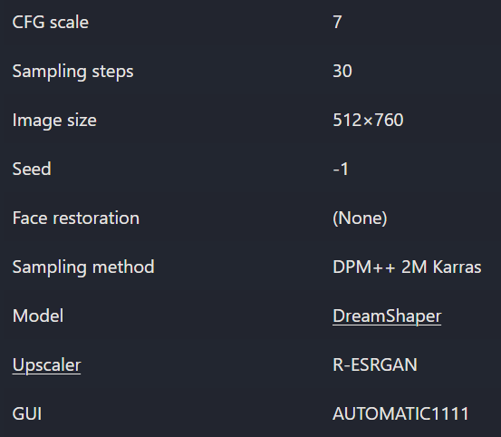
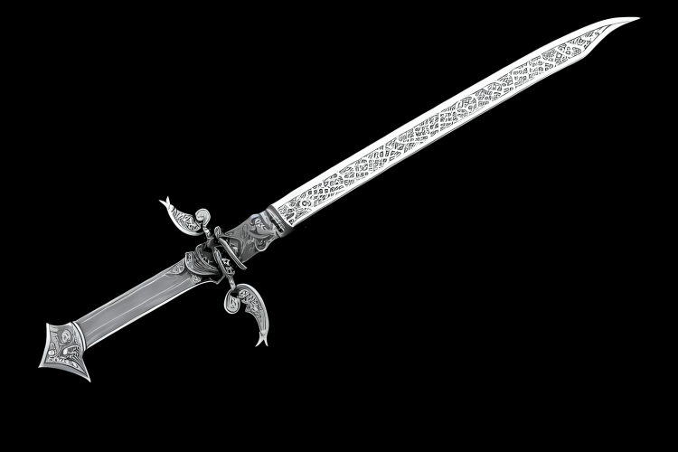
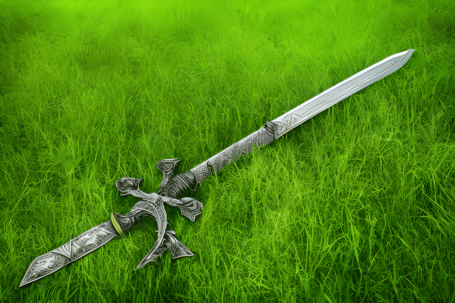
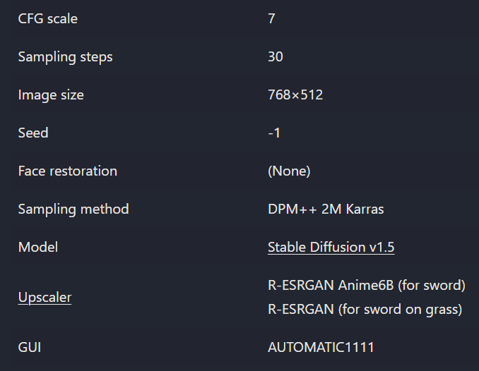
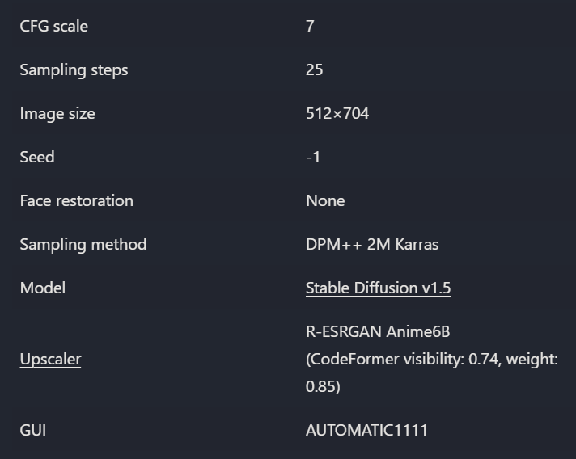
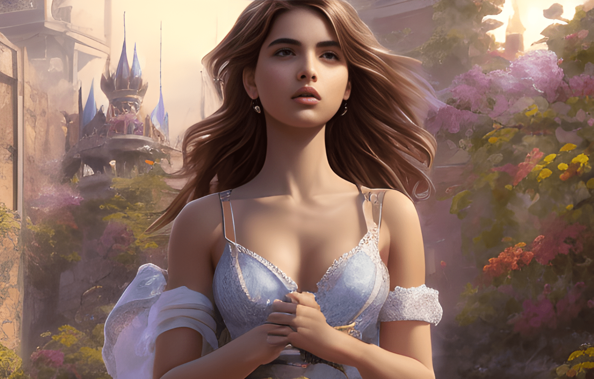
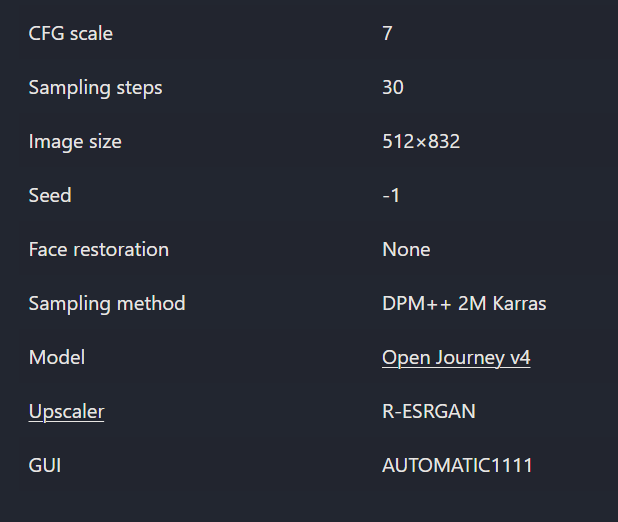
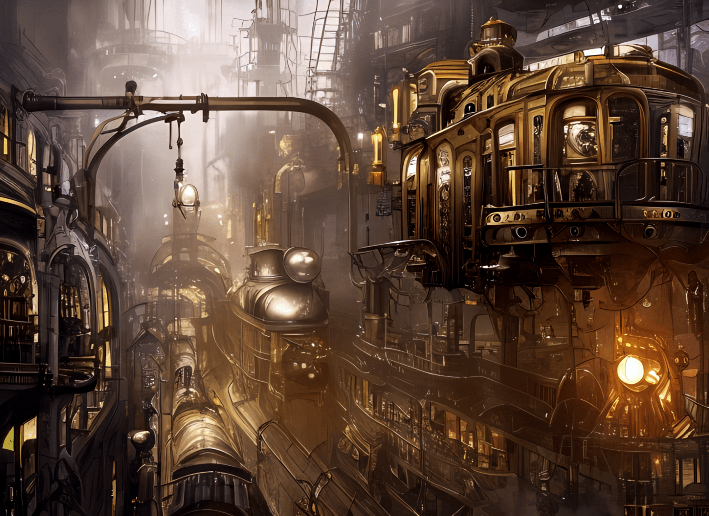
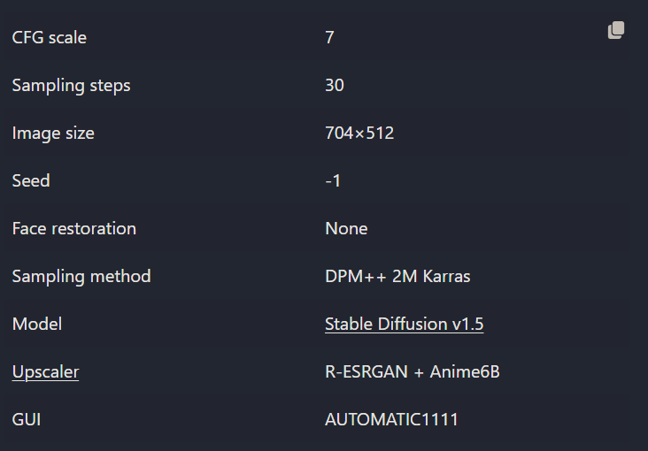

## 幻想肖像 Fantasy psychedelic portrait

这主要是==Josephine Wall==的风格，但与**Russ Mills**混合。` Portrait`（肖像）是两者的共同主题，他们混合得相当好——用花、叶、藤蔓和鸟类进行不可思议的点缀，让人看了很着迷。

正面提示词：*fully body fantasy female, heavenly, epic, highly detailed, by russ mills, by josephine wall, by Edwin Deakin*

负面提示词：*ugly, tiling, poorly drawn hands, poorly drawn feet, poorly drawn face, out of frame, extra limbs, disfigured, deformed, body out of frame, bad anatomy, watermark, signature, cut off, low contrast, underexposed, overexposed, bad art, beginner, amateur, distorted face*

## 锋利的刀 Sharp blades

这些剑是用**image-to-image**的方式创作的：它确实需要更多的工作，但会得到永远无法单独使用**text-to-image**制作的图像。

|  |  |
| --------------------------------------- | --------------------------------------- |

sword提示词：*highly detailed pattern ornated fantasy sword with (sharp: 1.2) blade, metallic titanium blade, cross guard, grip with cross pattern, circular pommel, video game, artstation, black background*

grass提示词：*close view green grass field texture background*

## 花花女孩 Flowery girl

正面提示词：*full body portrait of a gorgeous young ana de armas, A highly detailed and hyper realistic lisa frank, trending on artstation, butterflies, floral, sharp focus, studio photo, intricate details, highly detailed, by Tvera and wlop and artgerm, alberto seveso and geo2099 style*

负面提示词：*ugly, tiling, poorly drawn hands, poorly drawn feet, poorly drawn face, out of frame, extra limbs, disfigured, deformed, body out of frame, bad anatomy, watermark, signature, cut off, low contrast, underexposed, overexposed, bad art, beginner, amateur, distorted face*

## Portraits in Midjourney style

正面提示词：*A digital painting of [blake lively:Ana de Armas:0.8 ] in street cityscape background, happy, full-body, contemporary top, dress, (stocking:1.2), by Artgerm, Guangjian, artstation, soft eyes, extremely detailed face, stunningly beautiful, highly detailed, sharp focus, radiant light rays, cinematic lighting, colorful, volumetric light*

负面提示词：*ugly, disfigured, deformed, cropped*

## 未来城市

==蒸汽朋克风格的颠覆性未来城市==。

正面提示词：*polished copper metallic steampunk city , buildings, retrofuturism, like lady mechanika, victorian city, fantasy, biomechanical railroad, cinematic lighting*

