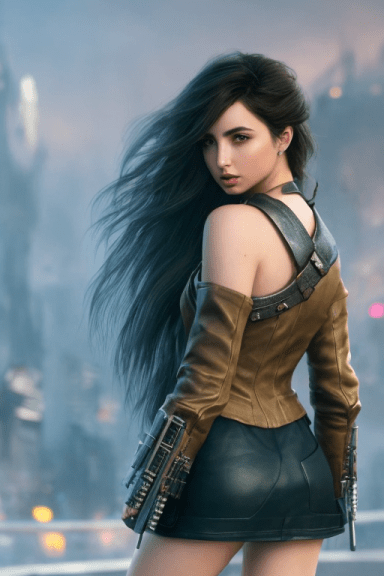

# How to use outpainting to extend images

`SD`有个功能可以用来**向任何方向扩展图像**，被称为`outpainting `。

第一步是准备好图像。我将使用`Stable Diffusion`生成的图像。在本教程中，我们将使用[下面的图像](https://stable-diffusion-art.com/wp-content/uploads/2023/01/01316-2271173312-A-digital-artstationd-dystopia-art-looking-side-way-fantasy_1.5-painting-of-Ana-de-Armas_-emma-watson_-0.8-in-street_1.5-1.png)作为起点。

转到**图片信息选项卡**。将图像从本地存储拖放到画布区域，生成参数应该出现在右侧：

然后，我们需要选择一个合适的模型。为了样式的一致性，应该使用**生成图像的相同模型**。例如，我使用`F222`模型，所以我将使用**相同的模型**进行`outpainting`。

> 如果我们使用的是基础模型`v1.4`和`v1.5`，或者使用的是照片，我们也可以使用 [v1 inpainting model](https://stable-diffusion-art.com/inpainting_basics/#Use_an_inpainting_model_optional)。它应该会产生更好的结果。

将 **resize mode**模式设置为**crop and resize** ，使长宽比不会改变。将seed设置为`-1`以每次获得不同的结果。J将重绘幅度设置为`0.6`（后续需要反复测试，以获得最佳效果）。其余部分可以使用标准的**text-to-image**设置。为了完整起见，下面是我使用的：

- Sampling method: DPM++ 2M Karras

- Sampling Steps: 30

- Batch size: 4

  

向下滚动，我们可以看到一个**Script下拉框**。有两种选择：`outpainting mk2`和` poor man’s outpainting`。`outpainting mk2`的效果不是很好，选择` poor man’s outpainting`。

为遮罩内容选择` fill`，在绘制之前，它将使用**图像的平均颜色**填充扩展区域。最好一次只画一个方向，我选择右边作为这张图的`outpainting`方向。

最后点击生成。后续可以迭代`outpainting`，然后使用`InPainting`来解决BUG，具体见[教程](https://stable-diffusion-art.com/outpainting/)。

