# 使用SD生成动画2

## 1.  Deforum插件安装

[见原文](https://stable-diffusion-art.com/deforum/)

> 注意：**the extension folder has to be named '==deforum==' or '==deforum-for-automatic1111-webui=='**


> 可能存在的问题解决方法：https://blog.csdn.net/suoxiao777/article/details/106278730


## 2. 生成一个测试视频

首先，找到Deforum插件选项卡进入。

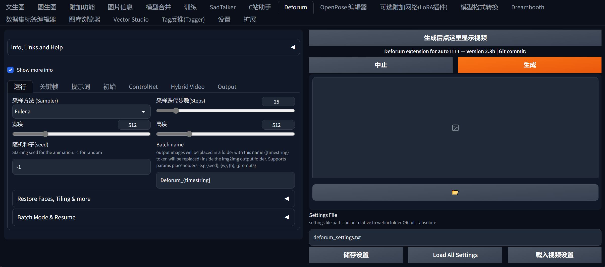

页面的下半部分是 ==Motion 选项卡==，这里是设置摄像机参数的地方。其中，**最大帧数**是视频的帧数——更高的值使视频更长。

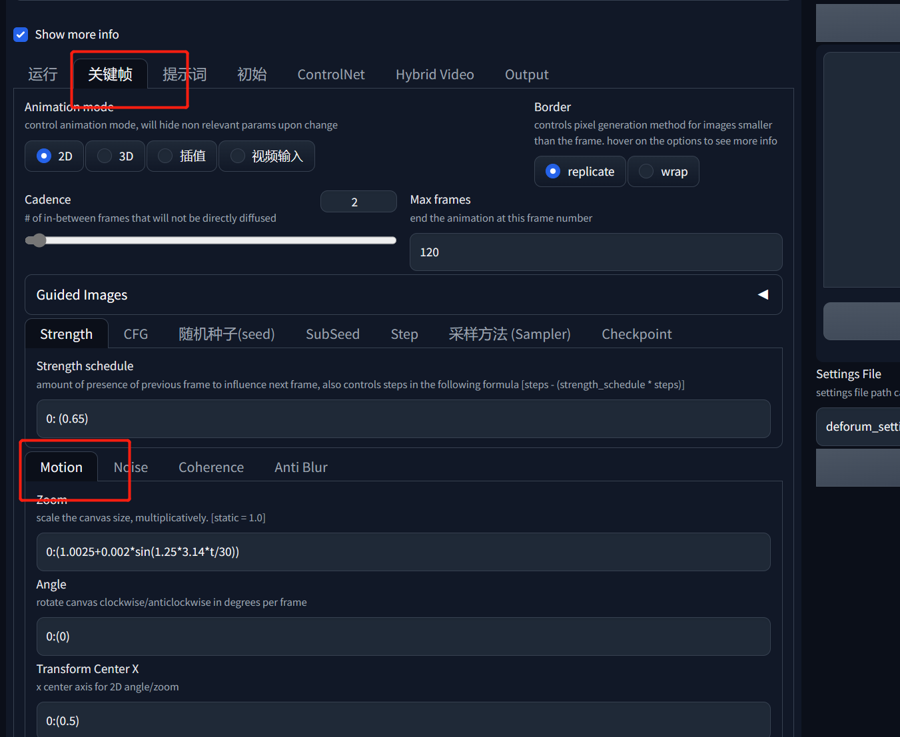

> 这么多参数，我们这里使用默认值


导航到**“提示词”选项卡**。我们会看到一个提示词列表，每个提示前面都有一个数字——数字是**提示生效的帧数**。

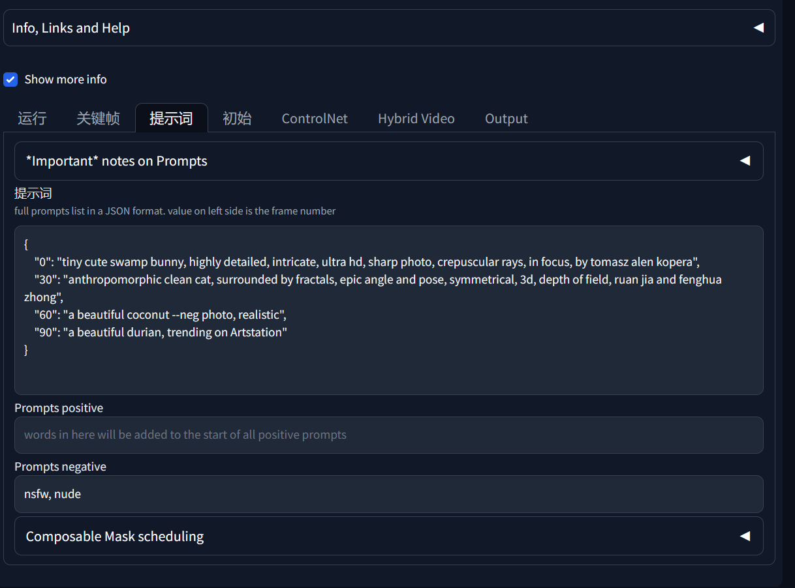

单击 **Generate** 开始生成视频，完成后，单击 Generate 按钮上方的按钮查看视频。


## 3. 基本设置

### 运动设置

运动设置是 Deforum 中最常用的一些选项。您可以通过简单地更改它们和提示来制作像样的视频。因此，您应该很好地掌握运动设置的工作原理以及它们的作用。

让我们介绍两种最常用的**动画模式**

- **2D** – 将图像视为 2D 并执行各种变换，如缩放和旋转以创建运动幻觉。
- **3D** – 将图像视为 3D 场景的视图。您可以在任何 3D 操作中移动相机的视口。

### 二维运动设置

使用**2D Zoom （缩放功能）**放大或缩小图像。使用大于 1 的缩放值进行放大，小于 1 进行缩小。该值离 1 越远，缩放速度越快。默认情况下，缩放聚焦在中心。**可以通过设置Transform Center X**和**Transform Center Y**来控制焦点。


使用**2D Angle**旋转图像。正值逆时针旋转图像，负值顺时针旋转图像。值越大，图像旋转得越快。默认情况下，旋转围绕图像的中心。**可以通过设置Transform Center X**和**Transform Center Y**来控制旋转中心。


使用 **Translation X** 将图像横向移动。正值将图像向右移动，负值将图像向左移动。


**变换中心**用于改变缩放和/或旋转的焦点。X 和 Y 的默认值为 0.5，即图像的中心。(X, Y) = (0, 0) 是左上角，(1, 1) 是右下角。

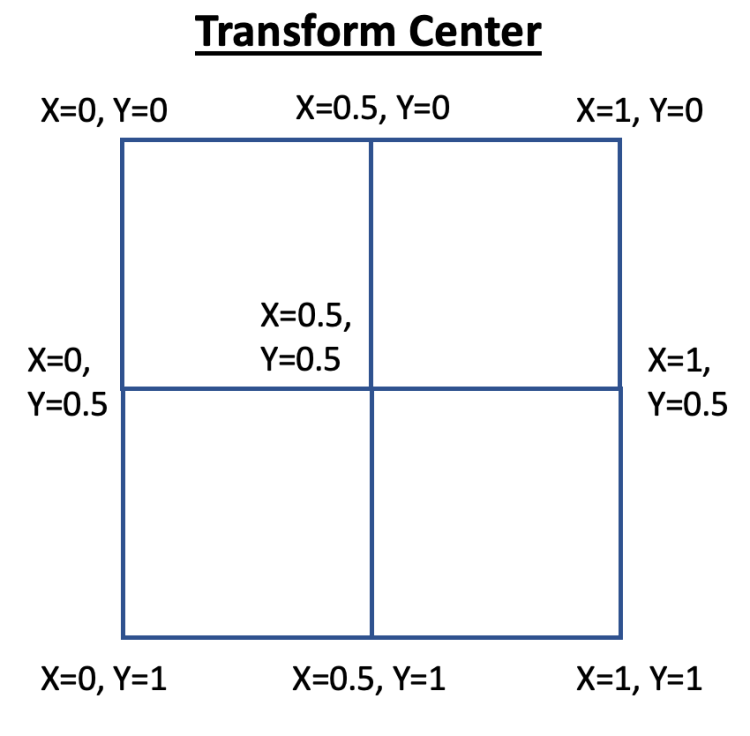


**Perspective flip**对图像执行类似 3D 的变换，以创建一些很酷的效果。我们需要选择**启用透视翻转**以启用这些选项。


| theta: 12                                          | phi: 12                                          | gamma: 12                                          |
| -------------------------------------------------- | ------------------------------------------------ | -------------------------------------------------- |
| 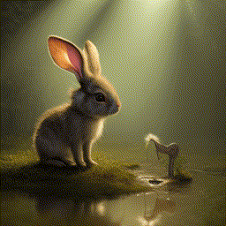 |  |  |


### 3D 运动设置

Translation X 将相机向侧面移动。正值将相机向右移动，负值将相机向左移动。


3D 中的**Translation Z**类似于 2D 运动中的**zoom**。**Rotation X**绕 X 轴旋转相机。

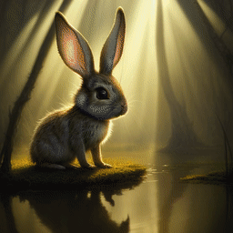

### 运动时间表

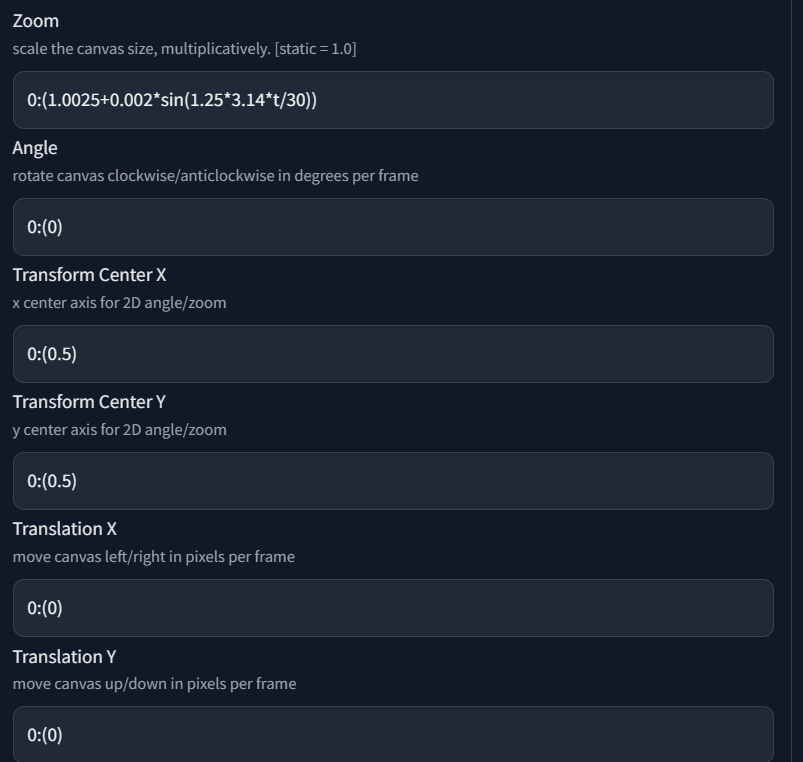

每个条目由两个数字组成：`frame`——生效的帧数，`value`——生效的值。每个条目的帧数和值必须用冒号分隔，值必须用括号括起来。

```
frame1:(value1), frame2:(value2), frame3:(value3), ...
```

当有两个条目或更多条目时，这意味着两个帧之间的插值。例如，Zoom中使用的以下公式意味着在前 100 帧中将Zoom值从 1 逐渐增加到 1.02，并在接下来的 100 帧中将Zoom值减小回 1。

```
0:(1), 100:(1.02), 200:(1)
```

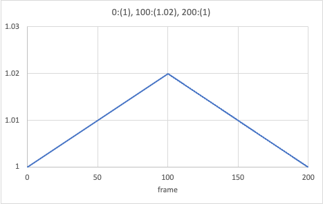

如果你想让一个新的缩放值从第 100 帧开始生效，你可以这样写：

```
0:(1), 99:(1), 100:(1.02), 150:(1.02), 151:(1), 200:(1)
```

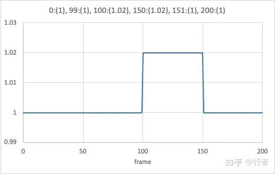

> ==第一个条目必须是第 0 帧==


## 4. 一个循序渐进的例子

**初始图像**是我们在 **deforum 视频**中可以完全控制的少数几件事之一。它也可以说是**最重要的一个**，因为它为动画的其余部分设置了基调和颜色。花点时间在**txt2img**选项卡中生成一个好的起始图像。看到喜欢的图像后，请记下**种子值**。

在**“ Deforum 提示词”**选项卡中输入提示：

```
{
    "0": "portrait of henry cavill as james bond, casino, key art, sprinting, palm trees, highly detailed, digital painting, artstation, concept art, cinematic lighting, sharp focus, illustration, by gaston bussiere alphonse mucha --neg deformed, disfigured",
    "50": "anthropomorphic clean cat, surrounded by fractals, epic angle and pose, symmetrical, 3d, depth of field, ruan jia and fenghua zhong"
}
```

现在转到**“RUN”**选项卡，选择 Protogen 模型，将种子设置为 2020548858。

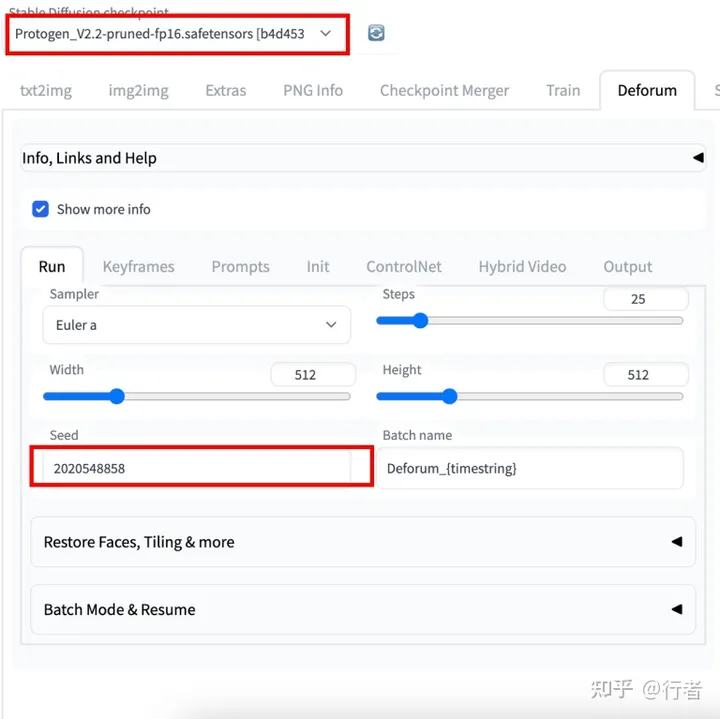


因为我的詹姆斯邦德在初始图像中面向左侧，所以让相机向右移动很好。我们将使用**3D 动画模型。**在**关键帧**选项卡中，

- 选择**3D**动画模式。
- **将最大帧**设置为 100。这是为了生成足够的帧以查看前两个提示

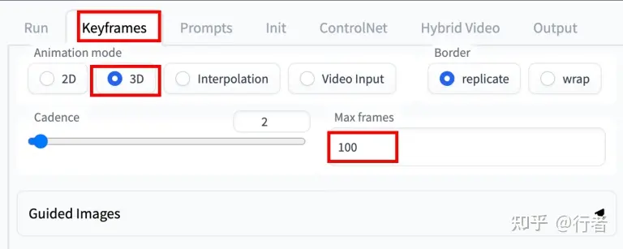

进行一系列运动设置。不断修改，直到视频变得让我们满意。

