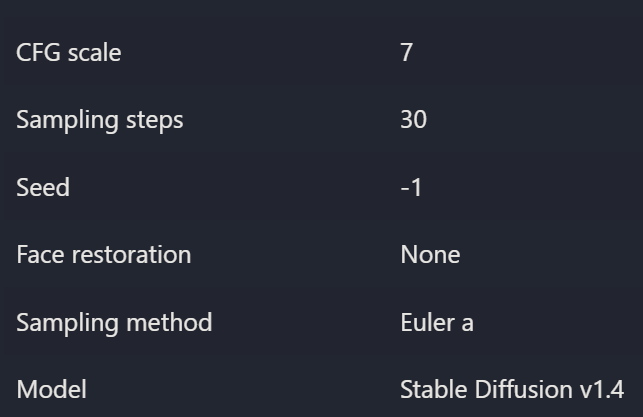
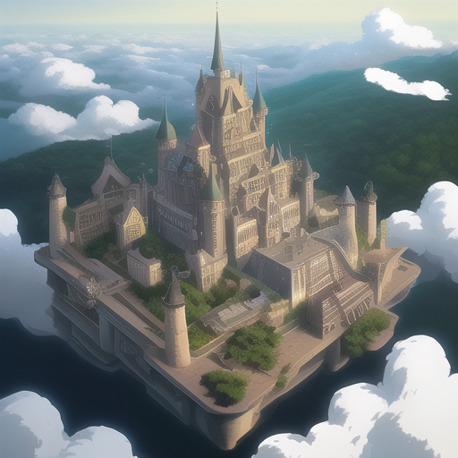
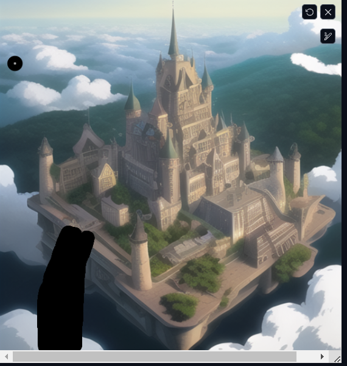
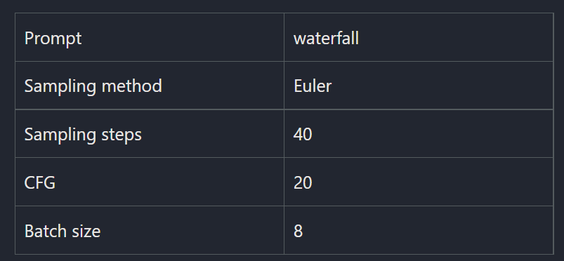
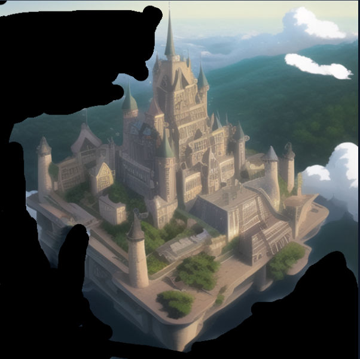
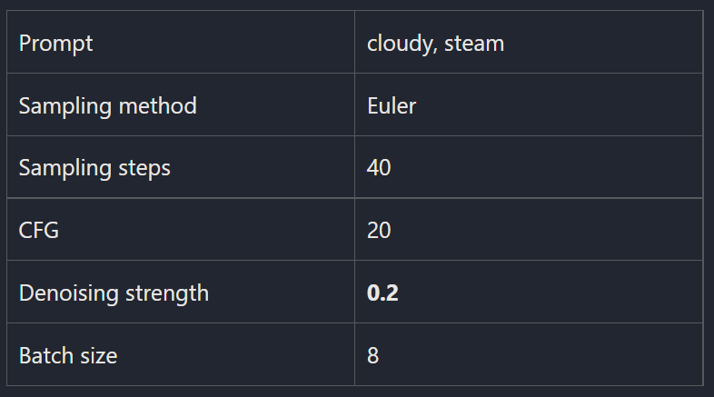

## 基本图形生成

**正面关键词**：retro – futurism steam punk castle on a mountain in clouds with lots of details look from above, rule of thirds golden ratio, vibrant colors, fake detail, trending pixiv fanbox, acrylic palette knife, style of makoto shinkai studio ghibli genshin impact james gilleard greg rutkowski chiho aoshima

**负面关键词**：

> 我使用的模型是 chilloutmix_NiPrunedFp32Fix.safetensors

## Step 1: Add a waterfall

我们将使用`inpainting`来添加瀑布，按照如下设置：

不断生成，直到我们看到满意的：

这张图片将作为**GIF动画**的基础图片。在下一步中，我们将创建这个图像的小变化，并将它们用作动画GIF的帧。

## Step 2: Animate the water fall and the clouds

GIF动画就是一系列连续显示的图像。为了创造一种动画的感觉，图像之间的变化应该是**微妙但明显的**。为此，我们首先将**带有瀑布的城堡图像**拖放到`inpainting`中，并添加如下蒙版和设置：

我们不想过多地改变图像，所以使用像0.2这样的低去噪强度非常重要。我们需要精心挑选想要用于动画GIF的图像，大概5到10个图像，把它们保存到你的电脑里。

## Step 3: Create the animated GIF

现在我们将制作动画GIF。在本教程中，我们将使用免费网站 [ezgif.com](https://ezgif.com/maker)。这里给出原博客作者的结果：

