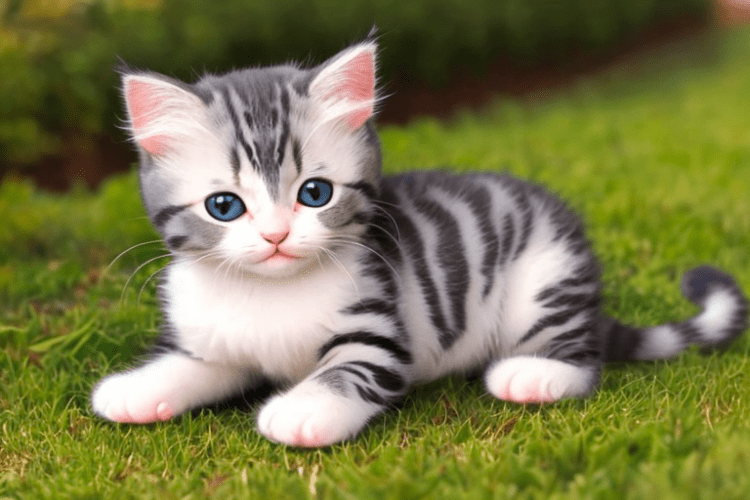

## Realistic wildlife animals

由于目标是生成逼真的照片图像，你需要包括关键字 “==photo==”，提示词看着像：*photo of …*。

首先，你需要选择你的主题，例如：

- Lion
- Pack of wolf
- Red panda

**场景**控制着背景和环境。由于联想效应，如果你不添加场景关键字，你通常会得到野生动物的自然栖息地。

- snow
- river
- tree
- forest
- grassland, grass field
- on a couch

**灯光**对图像的外观有很大的影响。良好的灯光使图像变得有趣：

- dark studio
- rim lighting
- sunset
- dramatic lighting

使用与生成**现实人物**相似的现实关键词，例如:

- dslr
- ultra quality
- film grain
- 8K UHD

根据我的经验，这些关键字并不总是越多越好。使用其中的一些已经可以达到目的了。使用过多可能会导致解剖学不良——我怀疑这些关键词中的许多都与人类照片有关，可能会损害动物照片。==以下短语可以增强野生动物图像的美感：==

- National Geographic Wildlife photo of the year     国家地理年度野生动物照片
- The American Landscape Contest     美国景观设计大赛
- Wildlife photography contest      野生动物摄影比赛

### Examples of realistic animal images

Model: [Realistic Vision v2.0](https://civitai.com/models/4201/realistic-vision-v20)

Prompt:

> National Geographic Wildlife photo of the year, elephant trunk pointing up in new york city, night, dark studio, depth of field, trunk pointing up

Negative prompt:

> deformed, disfigured, underexposed, overexposed

## Cute animals

如果你只是想生成一些可爱的动物图片，一个非常简单的提示：**cute**

Model: [DreamShaper](https://civitai.com/models/4384/dreamshaper)

Prompt:

> A cute kitten

您还可以添加关键字来进一步修改相同模型的样式。

Model: [DreamShaper](https://civitai.com/models/4384/dreamshaper)

Prompt:

> a cute kitty, (extremely detailed CG unity 8k wallpaper), professional majestic impressionism oil painting

Negative prompt:

> cartoon, 3d, disfigured, deformed [easynegative](https://civitai.com/models/7808/easynegative)

### Chinese Zodiac LoRA

 [Chinese Zodiac LoRA](https://civitai.com/models/15246)以卡通形式生成可爱的动物。我们可以修改下面的提示以生成其他动物。这个模型推荐的动物是猪、熊、鸡、猴、羊、马、蛇、龙、兔、虎、牛和老鼠。

Prompt:

> pig, Exquisite City, (sky:1.3), (Miniature tree:1.3),Miniature object, many flowers, glowing mushrooms, (creek:1.3), lots of fruits, cute colorful animal protagonist, Firefly,meteor, Colorful cloud,Complicated background, rainbow, studio lighting, auora, rim light <lora:Chinese zodiac:1>

Negative prompt:

> Void background,black background

## Animal vector art

我们可以生成不同风格的矢量动物。

下面的示例使用带有简单提示符的动画模型。许多动画模特都会与人打交道，尤其是女孩，==所以在否定提示中使用关键词 *people* 和 *girl*只能得到动物==。

Model: [MeinaMix](https://civitai.com/models/7240/meinamix)

Prompt:

> vector art of a horse, white background

Negative prompt:

> bad art, amateur, girl, people, riding

## Controlling poses

我们可以使用 ControlNet 使动物使用人类的姿势，虽然看起来很奇怪。

ControlNet: [OpenPose](https://stable-diffusion-art.com/controlnet/#OpenPose_detector)

Model: [Realistic Vision v2](https://civitai.com/models/4201/realistic-vision-v20)

Prompt:

> National Geographic Wildlife photo of the year, a siberian cat, evening light, sunset, rim lighting

Negative prompt:

> deformed, disfigured

