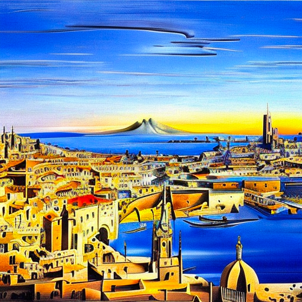

# Medium

| keyword                          | Note                                                       | Example                                        | ResultImg                                                    |
| -------------------------------- | ---------------------------------------------------------- | ---------------------------------------------- | ------------------------------------------------------------ |
| **Portrait**                     | 将图像集中在**面部/头像**上                                |                                                |                                                              |
| **Digital painting**             | 数字艺术                                                   |                                                |  |
| **oil painting**                 | 油画                                                       |                                                |                                                              |
| **Concept art**                  | 插图风格，2D                                               |                                                |                                                              |
| **Ultra realistic illustration** | 非常逼真的绘画，很适合用来画人                             |                                                |                                                              |
| **Underwater portrait**          | 在画人的时候使用，模拟人在水中的表现，例如：头发会飘浮起来 |                                                |                                                              |
| **photograph**                   | 照片风格                                                   |                                                |                                                              |
| **Underwater steampunk**         | underwater with wash color                                 |                                                |                                                              |
| **Black and white photo**        | 黑白照片                                                   | **Black and white photo** of a beautiful city. |                        |
| **Polaroid**                     | 从==宝丽来相机==拍照                                       | **Polaroid** of a beautiful girl               |                       |
| **Movie still**                  | 电影镜头                                                   | **Movie still** of a beautiful city            |                       |
| **Tattoo art**                   | 纹身艺术                                                   | **Tattoo art** of a beautiful woman            |                       |
| **Pixel art**                    | 像素风格                                                   | **Pixel art** of a beautiful woman             |                       |
| **Sticker illustration**         | 贴纸风格的图像                                             | **Sticker illustration** of a beautiful city   |                       |
| **Pop-up paper card**            | Pop-up风格                                                 | pop up paper card of a beautiful woman city.   |                       |

# Style

| keyword                   | Note                                           | Example                                        | ResultImg                               |
| ------------------------- | ---------------------------------------------- | ---------------------------------------------- | --------------------------------------- |
| **hyperrealistic**        | ==增加细节和分辨率== :star:                    |                                                |                                         |
| **Modernist**             | ==色彩鲜艳，对比度高==                         |                                                |                                         |
| **art nouveau**           | 添加装饰和细节，建筑风格                       |                                                |                                         |
| **Watercolor**            | 水彩是一种很容易添加到插图的图像效果。         | **Watercolor art** of a beautiful city         |  |
| **Digital art Behance**   | Behance 是一个分享艺术设计的网站。             | **digital art behance** of a beautiful city.   |   |
| **Academicism painting**  | 欧洲的古典造型                                 | **Academicism painting** of a beautiful woman  |   |
| **Pop-art**               | Add ==bold colors== in the illustration style. | **Pop-art** of a beautiful woman               |   |
| **Surrealism painting**   | ==超现实主义绘画==为你的图像添加奇怪的东西。   | **Surrealism painting** of a beautiful woman   |   |
| **Art deco illustration** | ==装饰艺术==使用几何形状和明亮的颜色。         | **art deco illustration** of a beautiful woman |   |
| **Avant-garde painting**  | 前卫艺术                                       | **Avant-garde painting** of a beautiful woman  |   |
| **Classicism painting**   | 古典主义的特点是**古希腊风格**                 | **lassicism painting** of a beautiful city     |   |
| **Op Art**                | ==光学艺术==：添加简单的几何图案               | **Op Art** of a beautiful woman                |   |

# Artist

| keyword                 | Note                                                         | Example                                                   | ResultImg                               |
| ----------------------- | ------------------------------------------------------------ | --------------------------------------------------------- | --------------------------------------- |
| **John Collier**        | 9世纪肖像画家——似乎能给画面添加`elegancy`（优雅？）          | a beautiful woman by **John Collier**                     |    |
| **Stanley Artgerm Lau** | 强烈的**现实主义现代绘画**                                   |                                                           |                                         |
| **Frida Kahlo**         | 继承了`Collier`的肖像风格，绘制风格更加独特——有时会导致**相框**`picture frame` |                                                           |                                         |
| **John Singer Sargent** | 适合与**女子肖像**搭配使用，可以产生**19世纪的精致服装**，有些**印象派色彩** | Painting of a beautiful woman by **John Singer Sargent.** |   |
| **Alphonse Mucha**      | 独特风格的2D肖像画                                           | a beautiful city by **Alphonse Mucha**                    |  |
| **Takashi Murakami**    | **丰富多彩的卡通艺术**                                       | a beautiful woman by **Takashi Murakami**                 |    |
| **Salvador Dali**       | 超现实的梦幻图像                                             | Painting of a beautiful city by **Salvador Dali**         |    |
| **Brad Rigney**         | Brad Rigney 是==幻想主题==的概念艺术家。                     | A beautiful city by **Brad Rigney**.                      |   |
| **Andrew Warhol**       | 在插图风格中添加了饱和色彩。                                 | A beautiful city by **Andrew Warhol**                     |   |
| **Android Jones**       | 添加了多彩美丽的点缀                                         | A beautiful woman by **Android Jones**                    |   |

# Character

用提示语把某人塑造成角色：

> \__a person’s name___ as ____a character_____

| keyword                 | Note                                         | Example                                                      | ResultImg                              |
| ----------------------- | -------------------------------------------- | ------------------------------------------------------------ | -------------------------------------- |
| **Edward Scissorhands** | "丧"风格                                     | A beautiful woman as Edward Scissorhands, horror movie still, russ mills |  |
| **Captain Jack**        | 杰克船长，海盗风                             | Portrait of beautiful woman as captain jack of pirate of the Caribbean （pirate of the Caribbean：加勒比海盗） |  |
| **Construction worker** | 职业：工人。==可以把人固定在一个特定的职业== | A beautiful woman as construction worker, helmet, safety jacket, by Android Jones |  |
| **Chinese Princess**    | 成为皇室成员                                 | A beautiful woman as chinese princess, by Huang Guangjian    |  |

# Website

| keyword        | Note                         |
| -------------- | ---------------------------- |
| **pixiv**      | 日本动漫风格                 |
| **pixabay**    | Commercial stock photo style |
| **artstation** | 现代插画，幻想               |

# Resolution

| keyword           | Note                                                   |
| ----------------- | ------------------------------------------------------ |
| **unreal engine** | 非常逼真和详细的3D画面                                 |
| **sharp focus**   | 增加分辨率                                             |
| **8k**            | 提高分辨率                                             |
| **vray**          | 3D rendering best for objects, landscape and building. |

# Color

| keyword             | Note                   |
| ------------------- | ---------------------- |
| **iridescent gold** | Shinny gold   金色     |
| **silver**          | Silver color    银色   |
| **vintage**         | vintage effect  年代感 |

# Additional details

| keyword            | Note                                                         |
| ------------------ | ------------------------------------------------------------ |
| **dramatic**       | 增加面部的情感表现力。整体上大幅增加照片的潜力/可变性`variability` |
| **silk**           | 在衣服上添加丝绸                                             |
| **expansive**      | 背景更开阔，`subject`更小                                    |
| **low angle shot** | 从低角度拍摄                                                 |
| **god rays**       | 破云而出的阳光                                               |
| **psychedelic**    | 失真的鲜艳色彩                                               |

