# 模型搭配指南

## urbansamuraiv0.14.safetensors  [LoRA]  {Cloth}

整体风格：城市牛仔，工装裤，防爆衣。[下载地址](https://civitai.com/models/23337/urban-samurai-or-v014-or-clothing-lora)

搭配大模型（推荐）：皆可，真实感模型最佳

**Key prompt**:  *urbansamurai, techwear*

**Negative prompt**:  *((mask))*

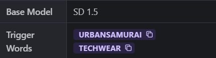

> ==Prompt== :  *urbansamurai, far shot, best quality, fullbody, a woman with fur cat - ears, wearing a green techwear jacket and orange cut top and black pants, a crystal necklace, big warm grin, bob cut, long legs, on the street, sunny \<lora:urbansamuraiv0.14-000002:0.72\>*
>
> ==Negative prompt==: *paintings, sketches, (worst quality:2), (low quality:2), (normal quality:2), dot, mole, lowres, normal quality, monochrome, grayscale, lowres, text, error, cropped, worst quality, low quality, jpeg artifacts, ugly, duplicate, morbid, mutilated, out of frame, extra fingers, mutated hands, poorly drawn hands, poorly drawn face, mutation, deformed, blurry, dehydrated, bad anatomy, bad proportions, extra limbs, cloned face, disfigured, gross proportions, malformed limbs, missing arms, missing legs, extra arms, extra legs, fused fingers, too many fingers, long neck, username, watermark, signature, (mole:1.4),NSFW, watermark,((mask))*
>
> **Size**: 512x1088, **Seed**: 509252637, **Steps**: 20, **Sampler**: DPM++ SDE Karras, **CFG scale**: 7, **Model hash**: 0bcee2e498, **Hires steps**: 14, **Hires upscale**: 1.6, **Hires upscaler**: R-ESRGAN 4x+ Anime6B, **Denoising strength**: 0.43
>
> 

## 2DspriteV2.safetensors [LoRA] {Style}

整体风格：`2D sprited`风格，推荐权重：`0.6`。[下载地址](https://civitai.com/models/23167/2d-sprite-style)

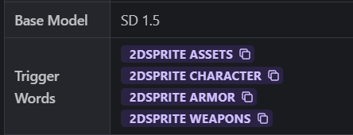

> \<lora:2DspriteV2:0.6\>,2dsprite character male, warrior, (best quality), (best faces)
>
> ==Negative prompt==: lowres, ((bad anatomy)), ((bad hands)), text, missing finger, extra digits, fewer digits, blurry, ((mutated hands and fingers)), (poorly drawn face), ((mutation)), ((deformed face)), (ugly), ((bad proportions)), ((extra limbs)), extra face, (double head), (extra head), ((extra feet)), monster, logo, cropped, worst quality, low quality, normal quality, jpeg, humpbacked, long body, long neck, ((jpeg artifacts))
>
> **ENSD**: 31337, **Size**: 768x768, **Seed**: 3963790378, **Model**: ==revAnimated_v11==, **Steps**: 30, **Sampler**: DPM++ 2M Karras, **CFG scale**: 7, **Clip skip**: 2
>
> 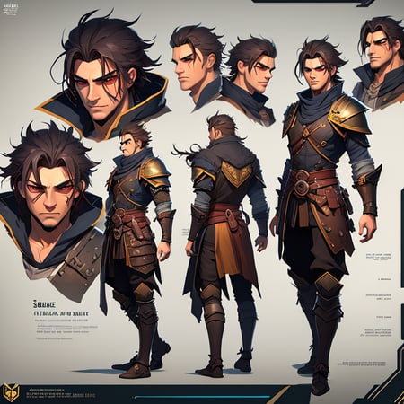

## revAnimated_v11.safetensors [SD] {Fantasy Anime}

==生成图像的风格==：幻想、动漫、半现实主义、风景优美。[下载地址](https://civitai.com/models/7371?modelVersionId=19575)

如果你想**动漫-2.5 D 类型**的开头提示词，这个模型喜欢: *((best quality)), ((masterpiece)), (detailed)*。这个模型很适合人像  **PORTRAITS**。

推荐的VAE：[orangemix.vae.pt](https://huggingface.co/WarriorMama777/OrangeMixs/blob/main/VAEs/orangemix.vae.pt)、[kl-f8-anime2.ckpt](https://huggingface.co/hakurei/waifu-diffusion-v1-4/tree/main/vae)、[Blessed2.vae.pt](https://huggingface.co/NoCrypt/blessed_vae/blob/main/blessed2.vae.pt)

> ==prompt==：masterpiece, best quality, (extremely detailed CG unity 8k wallpaper), (best quality), (best illustration), (best shadow), absurdres, realistic lighting, (Abyss), beautiful detailed glow, art by PeterMohrBacher,
>
> ==Negative prompt==:  (bad-image-v2-39000, bad_prompt_version2, bad-hands-5, EasyNegative, NG_DeepNegative_V1_4T, bad-artist-anime:0.7),(worst quality, low quality:1.3), (depth of field, blurry:1.2), (greyscale, monochrome:1.1), nose, cropped, lowres, text, jpeg artifacts, signature, watermark, username, blurry, artist name, trademark, watermark, title, (tan, muscular, loli, petite, child, infant, toddlers, chibi, sd character:1.1), multiple view, Reference sheet, long neck
>
> **Size**: 512x512, **Seed**: 89471028, **Model**: 1REVA_REV_1.1c, **Steps**: 80, **Sampler**: DPM++ 2M Karras, **CFG scale**: 9.5, **Clip skip**: 2, **Model hash**: acfd73b8a7, Hires upscale: 1.5, **Hires upscaler**: Remacri Upscaler, **Denoising strength**: 0.45
>
> 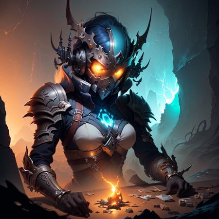

## suikamixHentaiMode_suikamixVer2Pruned.safetensors [SD] {日系少女}

主要用于生成日系动漫风的少女。[下载地址](https://civitai.com/models/25178/suikamix)

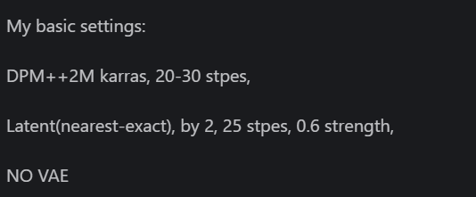

> prompt：masterpiece, best quality,full body,small breast,2 young girls, ruammei fashion with different color, standing, looking at viewer,\<lora:ruanmei_2:0.8>,night,sidewalk,wall,neon,
>
> ==Negative prompt==:  (easynegative),(ng_deepnegative_v1_75t),(worst quality, low quality:1.4),((watermark:1.4)),((signature:1.4)),nostril,nose,loli,child,
>
> **Size**: 620x880, **Seed**: 8538767, **Model**: SuikaMix_ver2, **Steps**: 30, **Sampler**: DPM++ 2M Karras, **CFG scale**: 10, **Clip skip**: 2, **Model hash**: 92917424a4, **Hires steps**: 25, Hires upscale: 2, **Hires upscaler**: Latent (nearest-exact), **Denoising strength**: 0.6
>
> 

## irene_v70.safetensors [LoRA] {韩国美女}

==超级优质的韩国美女LoRA==。[下载地址](https://civitai.com/models/11096?modelVersionId=20090)

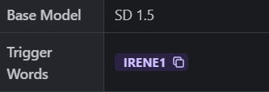

>  ==prompt==：hyper realistic lifelike texture dramatic lighting unrealengine trending on artstation,award winning photo,nikon RAW photo,8 k,Fujifilm XT3,masterpiece, best quality, realistic, photorealistic,ultra detailed,extremely detailed face, solo,1girl,standing, fashionable and trendy atmosphere, walk-in closet, designer clothing and accessories, high-end makeup products, and a stylish expression on her face,irene1, \<lora:irene_v70:1>
>
> ==Negative prompt==:  (worst quality:2), (low quality:2), (normal quality:2), lowres, normal quality, ((monochrome)), ((grayscale)), skin spots, acnes, skin blemishes, age spot, glans,extra fingers,fewer fingers,strange fingers,bad hand,(((nsfw))),
>
> **ENSD**: -1, **Size**: 512x768, **Seed**: 3077762748, **Steps**: 40, **Sampler**: DPM++ 2M Karras, **CFG scale**: 8, **Model hash**: 7234b76e42, **Hires steps**: 20, **Hires upscale**: 1.5, **Hires upscaler**: ESRGAN_4x, **Denoising strength**: 0.5
>
> 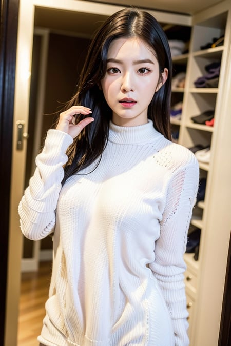

## aniflatmixAnimeFlatColorStyle_v20.safetensors [SD] {日式平涂风}

本模型旨在复现==精美的平涂风动画图片==。[下载地址](https://civitai.com/models/24387/aniflatmix-anime-flat-color-style-mix)

你可以使用如`ligne claire`、`lineart` 或`monochrome`等tag来实现更多风格！

> ==prompt==：masterpiece, best quality, 1girl, city pop, night, neon light, looking at another, upper body, vector illustration, jacket, light smile, blunt bangs, long hair
>
> ==Negative prompt==:  EasyNegative, badhandv4, monochrome
>
> **ENSD**: 31337, **Size**: 512x768, **Seed**: 2147596964, **Steps**: 20, **Sampler**: DPM++ 2M Karras, **CFG scale**: 7, **Clip skip**: 2, **Model hash**: b0d25db787, **Hires steps**: 10, **Hires upscale**: 2.5, **Hires upscaler**: 4x-UltraSharp, **Denoising strength**: 0.2
>
> 

## superPoseBookVol1_poseBookVol1 [ControlNet]

这是一个由30个姿势组成的包。[下载地址](https://civitai.com/models/13647/super-pose-book-vol1-controlnet)

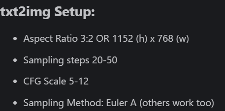

### ControlNet Setup

- 将ZIP文件下载到电脑上并解压到一个文件夹中，你会发现里面有姿势文件和样本图像。
- 在automatic1111的webui中，启用ControlNet。
- 将**姿势文件**加载到ControlNet中，确保将preprocessor设置为 "无"，模型设置为 "==control_sd15_openpose=="
- Weight: 1 | Guidance Strength: 1

> ==prompt==:solo,woman, (Gloria Tang Tsz-kei), with long wavy hair, (parted lips,light smile),(shiny skin:1.1), blush, skindentation, 160cm, wearing a grey skirt and shouder less top, sneakers and earrings, looking at the camera, portrait, photo referenced, best quality, ultra high res, (photorealistic), (detailed face and eyes), \<lora:GEMTKV11:1>
>
> ==Negative prompt==:  paintings, sketches, simple background, (worst quality:2), (low quality:2), (normal quality:2), lowres, normal quality, ((monochrome)), ((grayscale)), skin spots, acnes, skin blemishes, age spot,(tennis racket, holding),(squatting), wrinkled skin, (all fours), (shaded face:1.3), (upside-down,red eyes), (grin:1.25),rope,moon,covered nipples, missing legs, extra legs, mutated hands, fused fingers, (too many fingers), (long neck:1.3),(hat),from behind, watermark,nail polish, multiple hands, ((bra))
>
> **Size**: 768x1152, **Seed**: 1331859749, **Model**: chilloutmix_NiPrunedFp32Fix, **Steps**: 50, **Sampler**: Euler a, **CFG scale**: 7, **Clip skip**: 2, **Mask blur**: 4, **Model hash**: fc2511737a, **ControlNet-0 Model**: control_sd15_openpose [fef5e48e], **Denoising strength**: 0.7, **ControlNet-0 Module**: openpose, **ControlNet-0 Weight**: 1, **ControlNet-0 Enabled**: True, **ControlNet-0 Guidance Strength**: 1
>
> 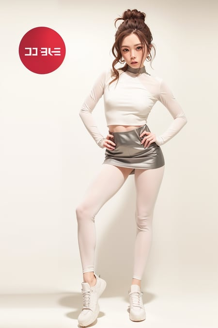

## zposePlayfulPosesPose_volume1Png.zip [ControlNet]

下载压缩文件。里面有20个用于摆造型的.png和.json文件。[下载地址](https://civitai.com/models/14368/zpose-playful-poses-pose-helper)

下载该压缩文件。里面是你将指示 controlnet 使用的姿势，而不是从现有图像中生成一个姿势。像通常那样制作你的提示。通过提示让模特知道，这是一个（坐着/躺着/腿张开）的姿势，以帮助它前进。在控制网设置中，为预处理器选择 "无"，为模型选择 "openpose"。根据模型想要的难度调整重量。提供的姿势图片是512x768的长宽比2:3。你可以用你喜欢的程序裁剪或添加到现有的图像中，以定制你的构图。.json文件可以用OpenPose Editor扩展名加载，并根据你的口味进行修改。

## jwy___v1.safetensors [LoRA] {韩国美女}

==超级优质的韩国美女LoRA==。[下载地址](https://civitai.com/models/18809/jang-won-young)

推荐大模型：**chilloutmix_NiPrunedFp32Fix**等真实感模型

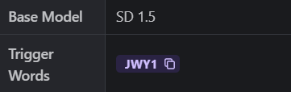

>  ==prompt==：Nikon RAW photo,8 k,Fujifilm XT3,masterpiece, best quality, realistic, photorealistic,ultra detailed,1girl,solo,close up portrait,standing, beautiful blue sky,serene expression, luxury red dress, surrounded by a sea of grass,jwy1, \<lora:jwy___v1:1>
>
> ==Negative prompt==: (worst quality:2), (low quality:2), (normal quality:2), lowres, normal quality,bad-artist ,((monochrome)), ((grayscale)),bad anatomy,skin spots, acnes, skin blemishes, age spot, glans,extra fingers,fewer fingers,strange fingers,bad hand, bad-artist
>
> **ENSD**: -1, **Size**: 512x768, **Seed**: 3376224125, **Steps**: 40, Sampler: DPM++ 2M Karras, **CFG scale**: 7.5, **Clip skip**: 2, **Model hash**: 1558219e26, **Hires steps**: 20, **Hires upscale**: 1.5, **Hires upscaler**: ESRGAN_4x, **Denoising strength**: 0.5

## iu_v35.safetensors [LoRA] {韩国美女}

==超级优质的韩国美女LoRA==。[下载地址](https://civitai.com/models/11722/iu)

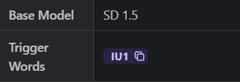

> ==prompt==：nikon RAW photo,8 k,Fujifilm XT3,masterpiece, best quality, 1girl,solo,realistic, photorealistic,ultra detailed,diamond stud earrings, long straight black hair, hazel eyes, serious expression, slender figure, wearing a black blazer and white blouse, standing against a city skyline at night,iu1, \<lora:iu_v35:1>,\<lora:lightAndShadow_v10:0.7>
>
> ==Negative prompt==: (worst quality:2), (low quality:2), (normal quality:2), lowres, normal quality, ((monochrome)), ((grayscale)), skin spots, acnes, skin blemishes, age spot, glans,extra fingers,fewer fingers,strange fingers,bad hand,
>
> **ENSD**: -1, **Size**: 512x768, **Seed**: 1492306006, **Steps**: 40, **Sampler**: DPM++ 2M Karras, **CFG scale**: 8, **Model hash**: 7234b76e42, **Hires steps**: 16, **Hires upscale**: 1.5, **Hires upscaler**: ESRGAN_4x, **Denoising strength**: 0.5
>
> 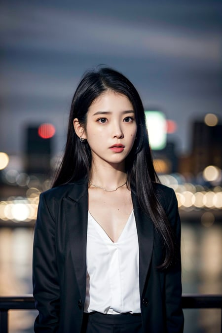

## dreamshaper_5BakedVae.safetensors [SD] {CG感}

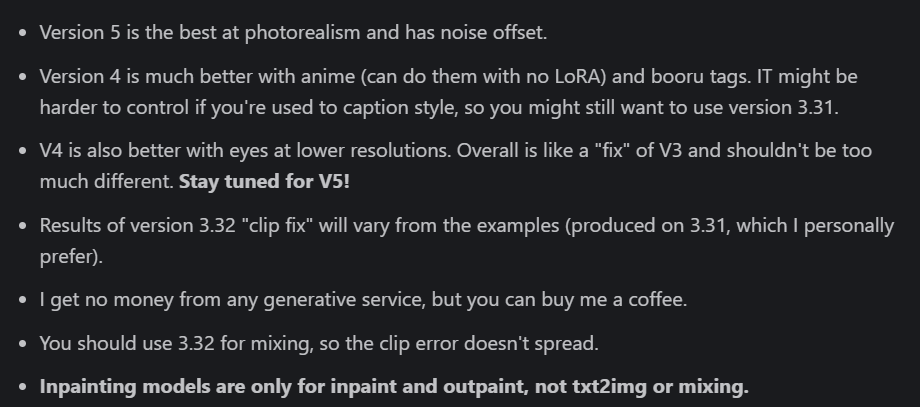

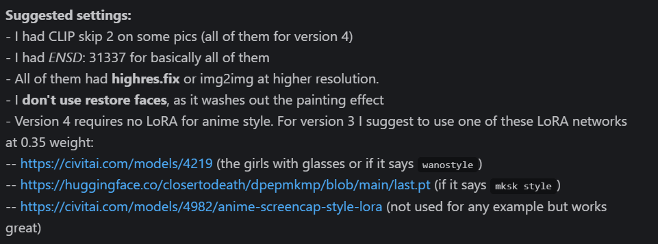

[下载地址](https://civitai.com/models/4384?modelVersionId=43888)

>  ==prompt==：8k portrait of beautiful cyborg with brown hair, intricate, elegant, highly detailed, majestic, digital photography, art by artgerm and ruan jia and greg rutkowski surreal painting gold butterfly filigree, broken glass, (masterpiece, sidelighting, finely detailed beautiful eyes: 1.2), hdr,
>
> ==Negative prompt==: canvas frame, cartoon, 3d, ((disfigured)), ((bad art)), ((deformed)),((extra limbs)),((close up)),((b&w)), weird colors, blurry, (((duplicate))), ((morbid)), ((mutilated)), [out of frame], extra fingers, mutated hands, ((poorly drawn hands)), ((poorly drawn face)), (((mutation))), (((deformed))), ((ugly)), blurry, ((bad anatomy)), (((bad proportions))), ((extra limbs)), cloned face, (((disfigured))), out of frame, ugly, extra limbs, (bad anatomy), gross proportions, (malformed limbs), ((missing arms)), ((missing legs)), (((extra arms))), (((extra legs))), mutated hands, (fused fingers), (too many fingers), (((long neck))), signature, video game, ugly, tiling, poorly drawn hands, poorly drawn feet, poorly drawn face, out of frame, mutation, mutated, extra limbs, extra legs, extra arms, disfigured, deformed, cross-eye, body out of frame, blurry, bad art, bad anatomy, 3d render
>
> **ENSD**: 31337, **Size**: 512x960, **Seed**: 132340231, Model: DreamShaper_5_beta2_BakedVae, **Steps**: 25, **Sampler**: DPM++ SDE Karras, **CFG scale**: 7, **Clip skip**: 2, **Model hash**: 6d492d946c, **Hires steps**: 25, **Hires upscale**: 1.8, **Hires upscaler**: Latent (bicubic antialiased), **Denoising strength**: 0.5
>
> 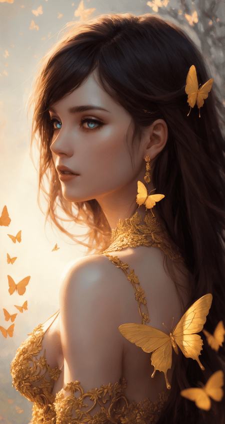

## Vehicle.safetensors [LoRA]  {玩具车}

可以出各种卡通的和不卡通的车车。 关键词可以加**cyberpunk** ，其他的随便试试把。[下载地址](cyberpunk)

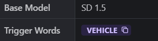

> ==prompt==：masterpiece, best quality, 1vehicle, cyberpunk,siple design,3d,
>  \<lora:Vehicle:1>
>
> ==Negative prompt==: easynegative
>
> **ENSD**: 31337, **Size**: 768x512, **Seed**: 3296160148, **Model**: revAnimated_v11, **Steps**: 30, **Sampler**: Euler a, **CFG scale**: 7, **Clip skip**: 2, **Model hash**: d725be5d18, **Hires steps**: 30, **Hires upscale**: 2, **Hires upscaler**: Latent, **Denoising strength**: 0.3
>
> 

## sxz-wowicons-v2-new.safetensors [LoRA]  {技能图标}

用[Luma ](https://civitai.com/models/25831/sxz-luma)和  [AOM2](https://civitai.com/models/4451/abyssorangemix2-hardcore)生成样品图像。[下载地址](https://civitai.com/models/45713/sxz-wow-icons-style)

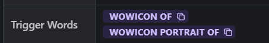

> ==prompt== ：wowicon portrait of demon girl with glowing yellow eyes and dark cyan hair, angry smirk, v-shaped eyebrows, red demon horns, red lips, makeup, parted lips, teeth, pale skin, border \<lora:sxz-wowicons-v2-new:0.75>
>
> ==Negative prompt==: (easynegative:0.8)
>
> **ENSD**: 31337, **Size**: 640x640, **Seed**: 2378407042, **Model**: Luma 0.97, **Steps**: 25, **Sampler**: DPM++ 2M alt Karras, **CFG scale**: 7, **Clip skip**: 2, **Model hash**: 3709e3c3c9
>
> 

## sxzLuma_097.safetensors [SD]

==基于动画的半现实混合==。 [下载地址](https://civitai.com/models/25831/sxz-luma)

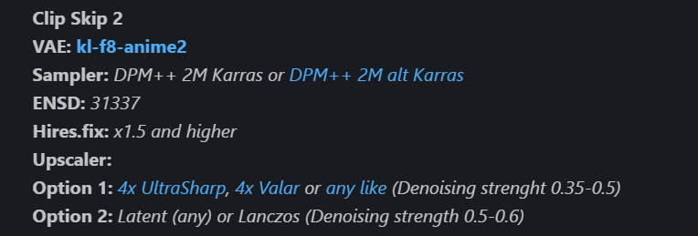

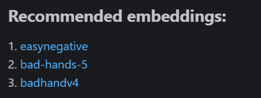

> ==prompt==：1girl, cowboy shot of redhead pirate, long green coat, sea, storm, dark atmosphere, volumetric lighting, best quality, masterpiece, chromatic aberration, realistic
>
> ==Negative prompt==: easynegative, badhandv4, loli, kid, child, young, low quality, close up, monochrome, censored, cropped, (nsfw, naked, nude, pussy, breasts, nipples)
>
> **ENSD**: 31337, **Size**: 512x768, **Seed**: 327363327, **Model:** Luma 0.97, **Steps**: 30, **Sampler**: DPM++ 2M Karras, **CFG scale**: 7, **Clip skip**: 2, **Model hash**: 3709e3c3c9, **Hires steps**: 15, **Hires upscale**: 2, **Hires upscaler**: 4x_Valar, **Denoising strength**: 0.45
>
> 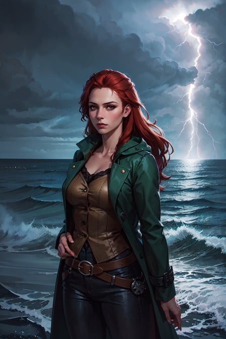

## shirt_tug.safetensors [LoRA] {服装}

==衬衫拔河姿势==的LORA模型，建议LORA重量： 0.5 ~ 1.5，默认权重1应该足够好。如果这个姿势没有显示出来，可以尝试更大的权重。

触发词： shirt, naked shirt, shirt tug

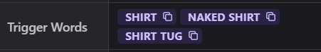

> ==prompt==：masterpiece, best quality, highres,  1girl, shirt, naked shirt, shirt tug \<lora:shirt_tug:1.6>
>
> ==Negative prompt==: nsfw, extra hands, too many arms, extra arms, bar censor, censoring, lowres, bad anatomy, bad hands, text, error, missing fingers, extra digit, fewer digits, cropped, worst quality, low quality, normal quality, jpeg artifacts, signature, watermark, username, blurry, simple background, disfigured face, missing fingers, extra leg, ugly, frills
>
> **ENSD**: 31337, **Size**: 512x768, **Seed**: 230120053, **Model**: schoolAnime_schoolAnime, **Steps**: 30, **Sampler**: DPM++ 2M Karras, **CFG scale**: 11, **Clip skip**: 2, **Model hash**: 36b0e74c02
>
> 

## zposeFightingStyles1_1_trainingData.zip [ControlNet]

战斗Pose。[下载地址](https://civitai.com/models/11573/zpose-fighting-styles-1-pose-helper)

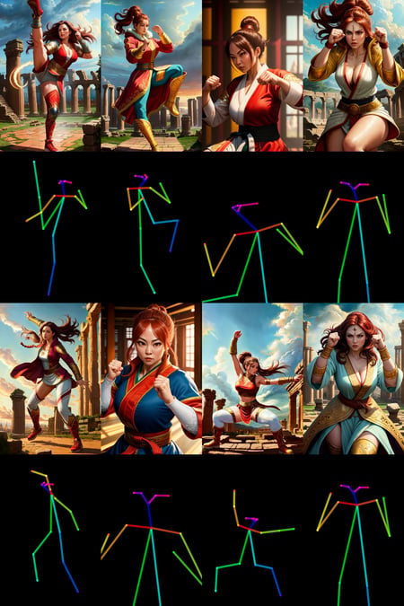

## GTSv4.safetensors [LoRA] {日系动画}

巨大的少女。[下载地址](https://civitai.com/models/25306/giantess-or-concept)

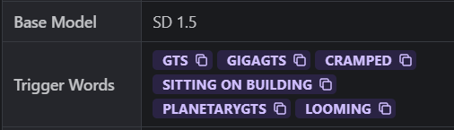

关键词描述：

- "GTS"：产生大致是建筑大小的女孩

- "GigaGTS"：产生城市大小的女孩，使用（城市景观、风景）或其他土地特征，如（河流、山脉）来帮助指导它。

- "PlanetaryGTS"：产生在地球顶部或周围的女孩，使用（外太空、地球）或类似的标签来帮助指导它。

- "Looming"：产生透视镜头以帮助建立女孩和观众之间的比例，使用（从下往上，脸部有阴影，全身）。

- "Sitting on building"：默认情况下，女孩在被引导时通常坐在地上，这将有助于让她们在建筑物上摆出更像椅子的姿势。
- "Cramped "：产生的女孩被困在尺寸不足的房间里，描述所需的姿势和房间应该有的任何特征。(室内）有帮助，似乎在水平画布上效果最好。

建议的附加标签：*aerial view, city, building, skyscraper, from above, from below, giantess, destruction, rubble, shrunken "object", full body*（鸟瞰、城市、建筑、摩天大楼、从上到下、女巨人、破坏、瓦砾、缩小的 "物体"、全身）。

与大多数其他LoRA搭配使用效果良好。推荐 0.8~1 的强度。

> ==prompt==：(extremely detailed CG unity 8k wallpaper),(masterpiece), (best quality), (ultra-detailed), (best illustration),(best shadow), (sharp eyeliner, eyeshadow, detailed eyes:1.2), (indoors, cramped:1.2),BREAK (Suomi:1.2), on back, touching ceiling, full body,\<lora:GTSv4:1> ,\<lora:(p)Suomi:1>
>
> ==Negative prompt==: (multiple views:1.2), (worst quality, low quality:1.4), (realistic, lip, nose:1.0), (dusty sunbeams:1.0), (depth of field, bokeh, blurry:1.4), (greyscale, monochrome:1.0), text, title, logo, signature
>
> **ENSD**: 31337, **Size**: 640x512, **Seed**: 1326524052, **Model**: mokoumixv1_prunedfp16, **Steps**: 30, **Sampler**: DPM++ 2M Karras, **CFG scale**: 5, Clip skip: 2, **Model hash**: 51020e5323, **Hires steps**: 15, **Hires resize**: 1152x896, **Hires upscaler**: R-ESRGAN 4x+ Anime6B, **Denoising strength**: 0.4
>
> 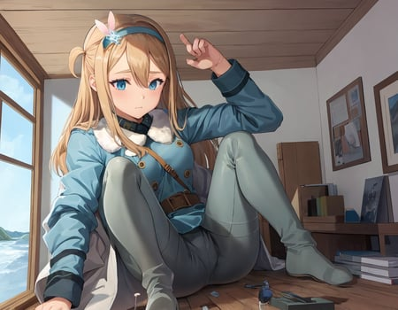

## CounterfeitV30_v30.safetensors [SD]

==高品质的动漫风格模型==。 [下载地址](https://civitai.com/models/4468/counterfeit-v30)

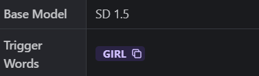

> ==prompt==：((masterpiece, best quality)), (solo, dark-red short hair cute detailed eyes face:1.5, chest armor and elbow armor, dark-green skirt:1.2, black inner clothes, knee pads, fishnet stockings, short black-cloak), runeblader gripping a flame-wind magic-sword
>
> ==Negative prompt==: nsfw, (EasyNegative, badhandv4:1.5, extra fingers, fewer fingers, missing hands, rope, accessory, jewelry, text:2.0, bikini, bare chest, fish, long skirt), glasses, animal ear, blood
>
> **Size**: 512x768, **Seed**: 2127603275, **Model**: CounterfeitV30_v30, **Steps**: 40, **Sampler**: DDIM, **CFG scale**: 10, **Clip skip**: 2, **Model hash**: cbfba64e66, **Hires steps**: 10, **Hires upscale:** 1.5, **Hires upscaler**: Latent, **Denoising strength**: 0.45
>
> 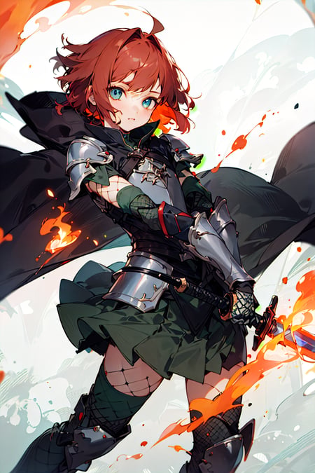

## hanfu_v30.safetensors [LoRA] {汉服}

==高质量汉服lora模型，感受汉服之美==。 [下载地址](https://civitai.com/models/15365?modelVersionId=54777)

**基础模型BaseModel:** [**chilloutmix**](https://civitai.com/models/6424/chilloutmix)、Basil mix、cardosAnime、meinamix、RealisticVision

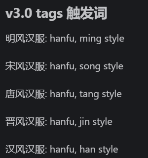

> ==prompt==：(8k, best quality, masterpiece:1.2), (realistic, photo-realistic:1.2)1girl,perfect face, perfect eyes,pureerosface_v1, hanfu, ming style, ming dynasty, ming clothing,pink top, black bottom,\<lora:hanfu_v30:0.6>
>
> ==Negative prompt==: (EasyNegative:1.2),(Bad_Prompt_v2:0.8),(Bad_Hands_5),sketch by Bad_Artist, (worst quality, low quality:1.4), (bad anatomy), watermark, signature, text, logo,contact, (extra limbs),Six fingers,Low quality fingers,monochrome,(((missing arms))),(((missing legs))), (((extra arms))),(((extra legs))),less fingers,lowres, bad anatomy, bad hands, text, error, missing fingers, extra digit, fewer digits, cropped, worst quality, low quality, normal quality, jpeg artifacts, signature, watermark, username, (depth of field, bokeh, blurry:1.4),blurry background,bandages,
>
> **Size**: 512x768, **Seed**: 2672449396, **Model**: chilloutmix_, **Steps**: 30, **Sampler**: DPM++ SDE Karras, **CFG scale**: 8, **Model hash**: a757fe8b3d, **Cutoff strong**: False, **Cutoff weight**: 0.5, **Hires upscale**: 2, **Cutoff enabled**: True, **Cutoff padding**: _</w>, **Cutoff targets**: "['pink top', 'black bottom']", **Hires upscaler**: R-ESRGAN 4x+, **Face restoration**: CodeFormer, **Denoising strength**: 0.5, **Cutoff interpolation**: lerp, **Cutoff disable_for_neg**: True

## CommonTaiwaneseFood_24.safetensors [LoRA] {美食}

作者用了16种不同的台湾食物来训练这个LoRA。[下载地址](https://civitai.com/models/21079/common-taiwanese-food-or)。下面是一个关键词列表:

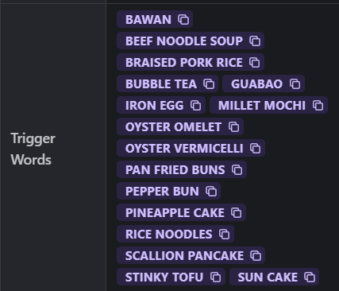

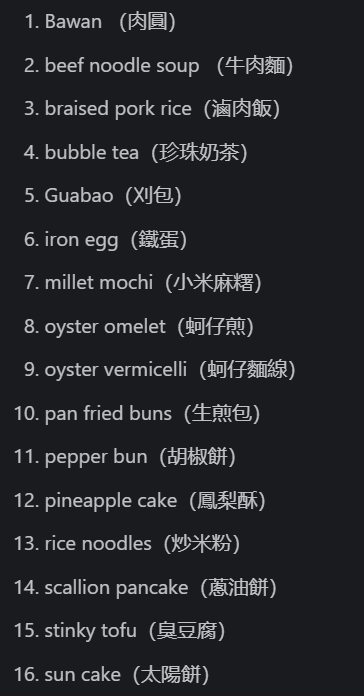

> ==prompt==：a bowl of braised pork rice, egg, vegetable, ((masterpiece)),illustration,high detail, soft lighting, delicious, colorful, aesthetically pleasing, studio lighting, trending \<lora:CommonTaiwaneseFood_24:1>
>
> ==Negative prompt==: text, close up, cropped, out of frame, worst quality, low quality, jpeg artifacts, ugly, duplicate, morbid, mutilated, deformed, blurry, bad proportions, disfigured, gross proportions
>
> **Size**: 512x640, **Seed**: 3175442871, **Model**: anythingV33_fp16, **Steps**: 30, **Sampler**: DPM++ 2M Karras, **CFG scale**: 5.5, **Model hash**: 812cd9f9d9

## Sakura[Boruto]V2.safetensors [LoRA] {春野樱}

建议权重在0.6和0.8左右。 [下载地址](https://civitai.com/models/53464/sakura-sakura-haruno-boruto-naruto-next-generations)

作者还确保在她的衣服上添加了一个宇智波斑的符号，当角度是` from behind`，触发词是`uchiha crest`。

==以下是服装的基本提示==：*masterpiece, absurdres ,1girl, haruno sakura,forehead mark, red hairband, red sleeveless dress, navel, white pants, bracelet, cowboy shot, outdoors, looking at viewer,  smile*。

==以下是背面拍摄的提示==：*masterpiece, absurdres ,1girl, haruno sakura,forehead mark, red sleeveless dress ,red hairband,    bracelet, white pants, from behind, uchiha crest,  looking at viewer, looking back, outdoors* 

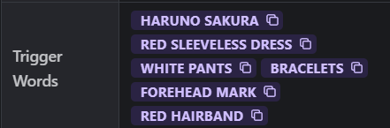

> ==prompt==：masterpiece, absurdres ,1girl, haruno sakura,forehead mark, red hairband, red sleeveless dress, white pants,navel,   groin,   bracelet, looking at viewer, crossed arms, smile, cherry blossoms, wind, floating hair, 
>
> ==Negative prompt==: EasyNegative, lowres, bad anatomy, bad hands, text, error, missing fingers, extra digit, fewer digits, cropped, (worst quality:1.2), low quality, normal quality, jpeg artifacts, signature, watermark, username, blurry, lowres graffiti, (low quality lowres simple background:1.1)
>
> **ENSD**: 31337, **Size**: 512x768, **Seed**: 2384249377, **Model**: yesmix_v15, **Steps**: 20, **Sampler**: DPM++ 2M Karras, **CFG scale**: 7, **Clip skip**: 2, **Model hash**: f713bab753, **Hires steps**: 15, **Hires upscale**: 2, **Hires upscaler**: realesr-animevideov3, **Denoising strength**: 0.45
>
> 

## bbMIXRUIS_v10.safetensors [SD] {日漫}

- **USE VAE "clearvae_main.safetensors"**

**Negative**

- (EasyNegative, badhandv4)

高质量日系风格。[下载地址](https://civitai.com/models/53084/bb-mix-ruis)

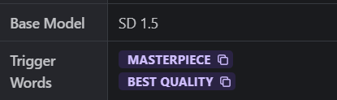

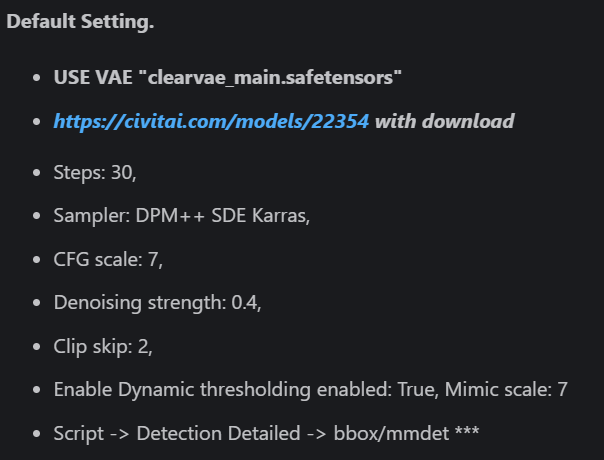

>  ==prompt==：absurdres, highres, ultra detailed, (1girl:1.3), mature female:1.49, BREAK Zentangle, structured patterns, meditative drawing, intricate designs, focus and relaxation, creative doodling, artistic expression BREAK typography, lettering art, calligraphy, expressive fonts, visual language, graphic design, creative communication
>
> ==Negative prompt==: EasyNegative,deepnegativet, badhandv4, artist name, signture, extra fingers, fewer fingers, blurry, watermark, logo, nsfw, nipples, ((eyelashes)), ((speech bubble))
>
> **VAE**: clearvae_main, **Size**: 512x768, **Seed**: 3047560430, **Model**: Stable-diffusion_5.CIVITAI_BB-MIX-RUIS, **Steps**: 30, **Sampler**: DPM++ SDE Karras, **CFG scale**: 7, **Clip skip**: 2, **Model hash**: be65eaa662, **Denoising strength**: 0.4
>
> 

## xrs2.0.safetensors [LoRA] {连环画}

20世纪初叶，在上海形成并开始广泛流传的通俗图画读物始称**连环画**，俗称“**小人书**”。中华人民共和国成立后，连环画作为一种通俗的传播文化的艺术形式得到迅速发展，形成中国现代美术的一个主要画种。谨以此LOAR模型纪念这种离我们越来越远的艺术风格。 [下载地址](https://civitai.com/models/18323/xiaorenshu)

> shz,((best quality)), ((masterpiece)), (detailed), realistic, multiple boys,(riding horse),mustache,   looking at viewer, outdoors,house,  amy,horse
>
> Negative prompt: easynegative, bad_prompt_version2, ng_deepnegative_v1_75t
>
> **ENSD**: 31337, **Size**: 512x768, **Seed**: 3836055402, **Steps**: 25, **Sampler**: DPM++ SDE Karras, **CFG scale**: 5, **Clip skip**: 2, **Model hash**: 5efb10a9e1, **Hires steps**: 10, **Hires upscale**: 2, **AddNet Enabled**: True, **AddNet Model 1**: ==xrs2.0-000016==(97413ad0d80d), **Hires upscaler**: SwinIR_4x, **AddNet Module 1**: LoRA, **AddNet Weight A 1**: 0.9, A**ddNet Weight B 1**: 0.9, **Denoising strength**: 0.45
>
> 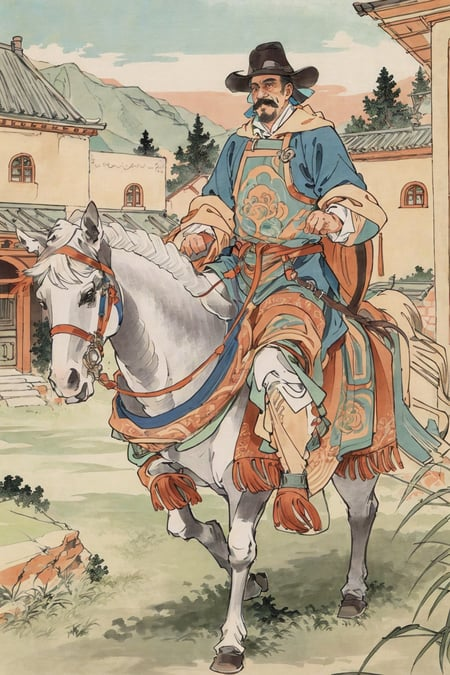

## Colorwater_v3.safetensors [LoRA] {水彩}

[下载地址](https://civitai.com/models/16055?modelVersionId=21173)

> ==prompt==：(masterpiece, realistic:1.4), (extremely intricate:1.2)>, close shot , portrait,(upper body:1.2), (from front:1.3), 191971 dress, backless dress, (long dress:1.2), very long hair, breasts, bare shoulders, sky, ocean, water, looking at viewer, italian, head tilt, wind, cloud, sunlight, outdoor, 1girl, solo, BREAK, cinematic light, ultra high res, 8k uhd, film grain, perfect anatomy, exquisitely detailed skin, best shadow, delicate, RAW,highres,
>
> ==Negative prompt==: (worst quality, low quality:1.4), (depth of field, blurry:1.2), (greyscale, monochrome:1.1), 3D face, cropped, lowres, text, jpeg artifacts, signature, watermark, username, blurry, artist name, trademark, watermark, title, multiple view, Reference sheet, curvy, plump, fat, muscular female, strabismus, nsfw, nipple, navel, bare thighs, midriff, bare legs, hat,animal ears,
>
> **ENSD**: 31337, **Size**: 512x768, **Seed**: 93308052, **Steps**: 20, **Sampler**: DPM++ 2M Karras, **CFG scale**: 4, **Clip skip**: 2, **Model hash**: f773383dbc, **Hires steps**: 10, **Hires upscale**: 2, **AddNet Enabled**: True, **AddNet Model 1**: try2(91184b428ad3), **Hires upscaler**: SwinIR_4x, **AddNet Module 1**: LoRA, **AddNet Weight A 1**: 0.9, **AddNet Weight B 1**: 0.9, **Denoising strength**: 0.4
>
> 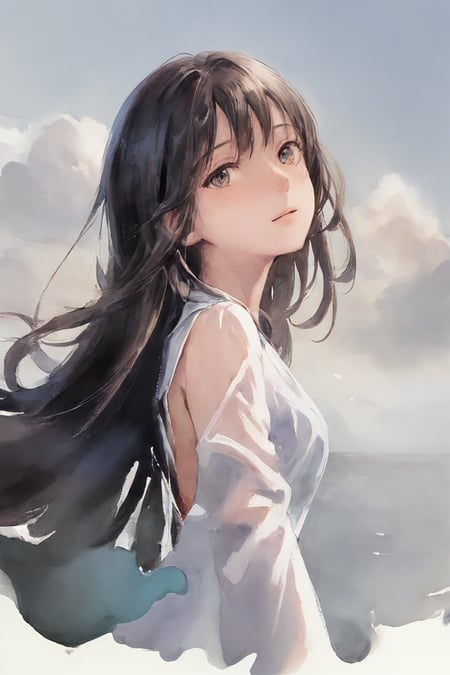

## threeDelicacyWonton_v2.safetensors [SD] {水墨日漫}

[下载地址](https://civitai.com/models/20330/three-delicacy-wonton-mix)

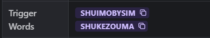

> ==prompt==：1girl, (fox ears:1.1), shirakami fubuki, looking at viewer, jewelry, ribbon, ribbon-trimmed sleeves, long hair, white, aqua eyes, watercolor (medium), colored pencil (medium), green bow, (blue rose:1.1), earrings, mountain, dusk, autumn leaves, ((autumn)), chinese clothes, clouds, east asian architecture, bird, expressionless, building, red rose, rose, snow, snowflakes, fire, (nagishiro mito:1.2), sky, blue sky, red moon, fox tail, fox mask, red dress, wet, rain, water, white flower, blue flower, yellow flower, shooting star, starry sky, tree, green background, rainbow, blood, house, street, (river:0.8), (ocean:0.8),(waterfall:0.8), hand on own chest, lamppost, lights, (night:1.255), hitodama
>
> ==Negative prompt==: EasyNegative, sketch by bad-artist-anime, (bad_prompt:0.8), bad-image-v2-39000, sketch by bad-artist, cat ears, animal ears, fake animal ears, furry, furry female, 3d, (low quality, worst quality, umbrella, human ears:1.4), (bad anatomy), extra digit, fewer digits,painting
>
> **ENSD**: 31337, **Size**: 768x768, **Seed**: 94170564, **Model**: BWM-NEF DPAnimesili 3FWonton+MSG+landscape, **Score**: 8.82, **Steps**: 26, **Sampler**: DPM++ 2M Karras, **CFG scale**: 11.5, **Clip skip**: 2, **Model hash**: 7e934c9547, **Hires steps**: 20, **Hires upscale**: 2, **Hires upscaler**: Latent, **Denoising strength**: 0.49
>
> 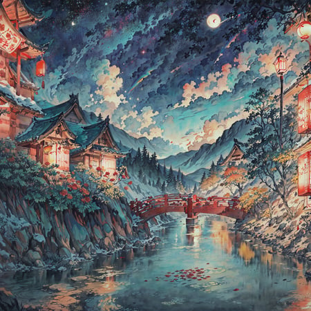

## blindbox_v1_mix.safetensors [LoRA] {扭蛋风}

- checkpoint : [RevAnimated](https://civitai.com/models/7371/rev-animated) or other you like

[下载地址](https://civitai.com/models/25995/blindbox)

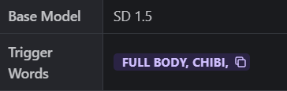

> ==prompt== ：(masterpiece),(best quality),(ultra-detailed), (full body:1.2),1girl,chibi,cute, smile, open mouth,flower, outdoors, playing guitar, music, beret, holding guitar, jacket, blush, tree, :3, shirt, short hair, cherry blossoms, green headwear, blurry, brown hair, blush stickers, long sleeves, bangs, headphones, black hair, pink flower,(beautiful detailed face), (beautiful detailed eyes),\<lora:blindbox_v1_mix:1>,
>
> ==Negative prompt==: (low quality:1.3), (worst quality:1.3)
>
> **ENSD**: 31337, **Size**: 576x768, **Seed**: 941189224, **Model**: revAnimated_v11, **Steps**: 28, **Sampler**: Euler a, **CFG scale**: 7, **Clip skip**: 2, **Model hash**: d725be5d18, **Hires upscale**: 1.5, **Hires upscaler**: Latent (bicubic antialiased), **Denoising strength**: 0.5
>
> 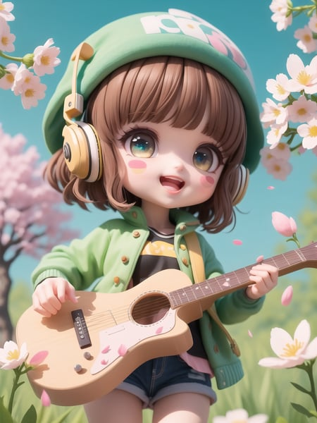

## nightSkyYOZORAStyle_yozoraV1Origin.safetensors [SD] {高精度模型}

==YOZORA是一个追求完美的模型==，充满了个人喜好。我使用我喜欢的图像训练它，这使它具有无与伦比的细节和完成度。它可以为你提供非常精致的人物形象。

==为了获得最佳效果，请确保你的最终分辨率>1536x1024。这对于生成精美的插图是必要的==

下面是一些推荐的参数设置：

- Clip skip： 建议设置为不低于2。YOZORA已经具有丰富的细节，设置为1可能会使图像显得杂乱无章，令人困惑。

- 分辨率： YOZORA可能不适合生成小图像，因为极端的细节水平可能会变得过于拥挤。建议不要使用Hires.fix来生成大型图像。较大的分辨率相当于较大的画布，使YOZORA更容易捕捉到细节。建议使用1536 x 1024或更高的Hires.fix。
- 负面的提示： 建议使用EasyNegative来提供简短而精确的描述。

>  ==prompt==：(Golden Ratio:1.2),(rose graffiti:1.2),(fault color:1.3),[(white background:1.4)::10], (full body:1.2),(ultra-detailed:1.3),(tarot:1.6),(the magician (tarot):1.6),(paper:1.2),(fairy:1.6),(fairy wings:1.2),full body, standing in the air,(cool:1.2),(red long hair),(butterfly hair ornaments),(flower hair ornaments:1.0),((sandal,Locket)),(colorful cocktail long dress:1.0)+(Loose sleeves coat :1.3)+(floting colorful tassel and ribbon :1.2),(White stockings:1.2),(colorful ink paper flower grow on the face:1.2),(colorful flower sea:1.3),(chaotic geometric images:1.3),(nagative space:0.8),(drawing board:1.3),(ether colorful ink flowing:1.3)
>
> ==Negative prompt==: nsfw,(Golden:1.3),Gold,yallow,(((pubic))), ((((pubic_hair)))),sketch, duplicate, ugly, huge eyes, text, logo, monochrome, worst face, (bad and mutated hands:1.3), (worst quality:2.0), (low quality:2.0), (blurry:2.0), horror, geometry, bad_prompt, (bad hands), (missing fingers), multiple limbs, bad anatomy, (interlocked fingers:1.2),(interlocked leg:1.2), Ugly Fingers, (extra digit and hands and fingers and legs and arms:1.4), crown braid,, (deformed fingers:1.2), (long fingers:1.2),succubus wings,horn,succubus horn,succubus hairstyle, (bad-artist-anime), bad-artist, bad hand,masterpiece,best quality,(white hair:1.4),black hair
>
> Steps: 25, Sampler: DPM++ 2M, CFG scale: 8
>
> 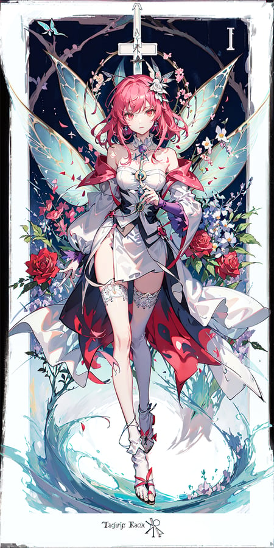

## hipoly_3dcg_v7-epoch-000012.safetensors [LoRA]

这是一个在高多边形三维模型图像上训练的LoRA。它可以提供干净、高分辨率的皮肤和头发材料，以及详细的服装元素。[下载地址](https://civitai.com/models/8730/hipoly-3d-model-lora)

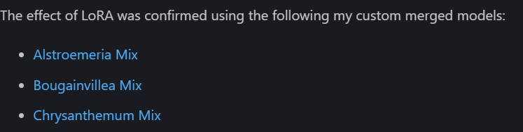

> \<lora:hipoly3DModelLora_v20:0.7>,1girl, looking at viewer,upper body, 3D, realistic,large breasts, excessively frilled princess dress, draped clothes, jewelry, ornament, flower, lace trim,masterpiece, best quality, 8k, detailed skin texture, detailed cloth texture,  beautiful detailed face, intricate details, ultra detailed,rim lighting, side lighting, cinematic light, ultra high res, 8k uhd, film grain,best shadow, delicate, RAW
>
> Negative prompt: [:EasyNegative:0.5], extra fingers,fewer fingers, cowboy,  mole,  freckles,  facepaint, (simple background:1.3),
>
> ENSD: 31337, Size: 512x896, Seed: 126391336, Model: models_02_25D_AlstroemeriaMix-fp16, Steps: 20, Sampler: UniPC, CFG scale: 10, Clip skip: 2, Model hash: 8be1721acb, Hires upscale: 1.5, Hires upscaler: Latent, Denoising strength: 0.6
>
> 

## CenterCutOutV1.safetensors [LoRA] {服装}

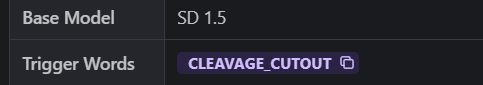

> masterpiece,1girl,   cleavage cutout,  \<lora:CenterCutOutV1:0.75> ,1girl, wedding dress, navel,((small breasts)), navel,
>
> Negative prompt: animal ears,EasyNegative, bad-artist-anime ,bad-artist, bad_prompt_version2
>
> ENSD: 31337, Size: 1024x1280, Seed: 2345926994, Steps: 20, Sampler: Euler a, CFG scale: 7, Clip skip: 2, Mask blur: 4, Model hash: 01b259805e, Denoising strength: 0.75
>
> 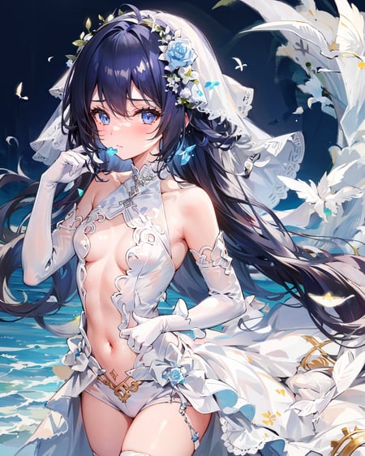

## Nipple-15.safetensors [LoRA] {嘿嘿嘿}

[下载地址](https://civitai.com/models/52606?modelVersionId=57011)

> pezon, \<lora:Nipple-15:1>,china dress,huge breasts,thick thighs, supermarket background
>
> Negative prompt: easynegative, bad-hands-5,black hair
>
> Size: 512x512, Seed: 3752905465, Model: abyssorangemix2_Hard, Steps: 20, Sampler: DPM++ 2M Karras, CFG scale: 7, Model hash: cadf2c6654
>
> 

## logogotypes.safetensors [LoRA] {艺术符号}

此 LoRa 模型经过专门训练，可用于创建徽标和排版组合。如果您的品牌需要高质量的设计，那么此模型非常适合您。[下载地址](https://civitai.com/models/50944/logogotypes)

**Trigger words for prompts:**

*logogotypes, simple background, white background, monochrome, greyscale, english text, no humans, parody, cover, text focus, letter a, fake cover, logo, title, letter b, pokemon creature, trembling, bug, antennae, silhouette, letter c, weapon, multiple boys, ground vehicle, motor vehicle, car, vehicle focus, barcode, heart, letter d, cover page, boy, bird, logo parody, letter e, arrow symbol, letter f, emblem, letter g, album cover, letter h, letter i, letter j, magazine cover, letter k, fork, sunglasses, hat, mario, letter l, food, fruit, apple, girl, solo, letter m, tree, comic, letter n, letter o, copyright name, gears, letter p, moon, crescent moon, letter q, letter r, letter s, letter t, letter u, wings, star symbol, remilia scarlet, facial hair, mustache, letter v, letter w, panda, letter xyz, style parody, title parody*

> \<lora:logogotypes_v10:1> logogotypes, bird, monochrome,
>
> Size: 1024x1024, Seed: 2568235753, Model: v2-1_768-ema-pruned, Score: 3.11, Steps: 20, Sampler: Euler a, CFG scale: 7, Model hash: dcd690123c
>
> 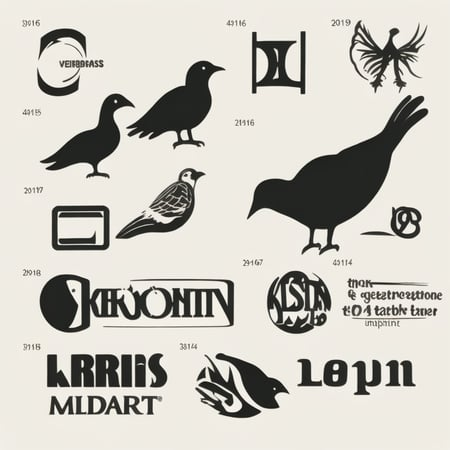

|                           模型名字                           | 类型 | 配合模型                                                     | 配合模块                                                     | 介绍                                                         | 触发词                  |                                                       原网址 |
| :----------------------------------------------------------: | ---- | ------------------------------------------------------------ | ------------------------------------------------------------ | ------------------------------------------------------------ | ----------------------- | -----------------------------------------------------------: |
|                    **512-depth-ema.ckpt**                    | SD   | 无                                                           | 512-depth-ema.yaml                                           | 用于**image-to-image**和**inpainting**，但不能用于**text-to-image** | 无                      | https://huggingface.co/stabilityai/stable-diffusion-2-depth/resolve/main/512-depth-ema.ckpt |
|              **instruct-pix2pix-00-22000.ckpt**              | SD   | 无                                                           | 无                                                           | 这是一种**编辑照片的创新方式**，只需告诉它你想要修改什么     | 无                      | https://huggingface.co/timbrooks/instruct-pix2pix/resolve/main/instruct-pix2pix-00-22000.ckpt |
|                       **sd-v1-4.ckpt**                       | SD   | 无                                                           | 无                                                           | 第一个公开可用的稳定扩散模型。通用模型                       | 无                      | https://huggingface.co/CompVis/stable-diffusion-v-1-4-original/resolve/main/sd-v1-4.ckpt |
|                 **v1-5-pruned-emaonly.ckpt**                 | SD   | 无                                                           | 无                                                           | 与`v1.4`一样，可以将`v1.5`视为通用模型                       | 无                      | https://huggingface.co/runwayml/stable-diffusion-v1-5/resolve/main/v1-5-pruned-emaonly.ckpt |
|                        **f222.ckpt**                         | SD   | 无                                                           | 无                                                           | 为生成裸体而训练的，有助于生成美丽的女性                     | 无                      |    https://huggingface.co/acheong08/f222/blob/main/f222.ckpt |
|           **anything-v3-fp16-pruned.safetensors**            | SD   | 无                                                           | 无                                                           | 经过训练可以生成**高质量的动画风格图像**。可以用F222对它进行微调 | 无                      | https://huggingface.co/Linaqruf/anything-v3.0/resolve/main/anything-v3-fp16-pruned.safetensors |
|                      **mdjrny-v4.ckpt**                      | SD   | 无                                                           | 无                                                           | 一个很好的通用模型                                           | **mdjrny-v4 style**     | [https://civitai.com/api/download/models/5636?type=Pruned%20Model&format=SafeTensor](https://civitai.com/api/download/models/5636?type=Pruned Model&format=SafeTensor) |
|                    **chomni.safetensors**                    | SD   | **embedding** `ulzzang-6500-v1`                              | 无                                                           | 用于生成**照片质量的亚洲女性**。与`embedding` `ulzzang-6500-v1`一起使用，生成像k-pop一样的女孩 | 无                      | https://huggingface.co/nolanaatama/chomni/blob/main/chomni.safetensors |
|                   **wd-v1-3-float32.ckpt**                   | SD   | 无                                                           | 无                                                           | 日式动画风                                                   | 无                      | https://huggingface.co/hakurei/waifu-diffusion-v1-3/resolve/main/wd-v1-3-float32.ckpt |
|                  **robo-diffusion-v1.ckpt**                  | SD   | 无                                                           | 无                                                           | 一个有趣的机器人风格的模型                                   | 无                      | https://huggingface.co/nousr/robo-diffusion/blob/main/models/robo-diffusion-v1.ckpt |
|                   **moDi-v1-pruned.ckpt**                    | SD   | 无                                                           | 无                                                           | 皮克斯迪士尼风格                                             | **modern disney style** | https://huggingface.co/nitrosocke/mo-di-diffusion/blob/main/moDi-v1-pruned.ckpt |
|                      **wlop-any.ckpt**                       | SD   | **embedding** wlop_style.pt                                  | 无                                                           | 鬼刀插画风格                                                 | 无                      | https://huggingface.co/SirVeggie/wlop/resolve/main/wlop-any.ckpt |
|                **inkpunk-diffusion-v1.ckpt**                 | SD   | 无                                                           | 无                                                           | 具有非常独特的赛博朋克风格                                   | **nvinkpunk**           | https://huggingface.co/Envvi/Inkpunk-Diffusion/blob/main/inkpunk-diffusion-v1.ckpt |
|                **3Guofeng3_v33.safetensors**                 | SD   | [LoRA: MoXinV1.safetensors](https://civitai.com/models/12597/moxin)[LoRA: shukezouma_v1_1.safetensors](https://civitai.com/models/12597?modelVersionId=20143) |  | 可以绘制出中国水墨画主题                                     | **shukezouma**          |                             https://civitai.com/models/10415 |
| **abyssorangemix2SFW_abyssorangemix2Sfw-inpainting.safetensors** | SD   | [VAE : orangemix.vae.pt]()                                   |                                                              | 日本动画                                                     | 无                      |          https://civitai.com/models/4437?modelVersionId=8480 |
