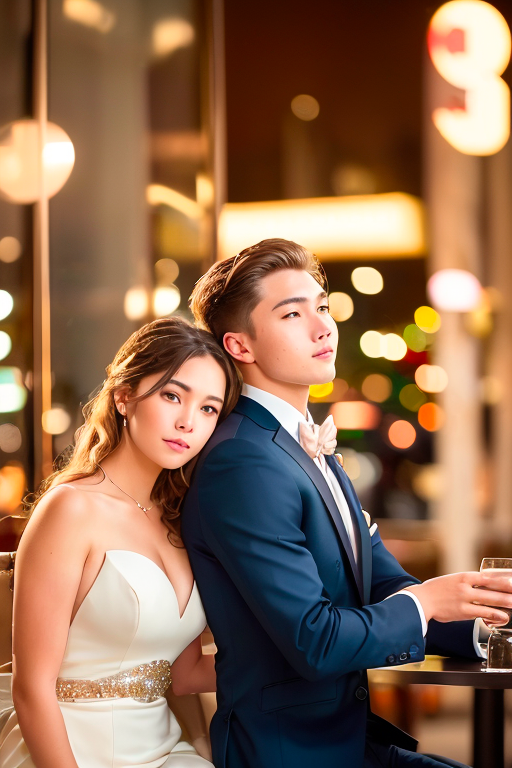

# 如何在SD中生成逼真的人物

> 翻译自[stable-diffusion-art博客](https://stable-diffusion-art.com/realistic-people/)

## 1. 提示词Prompt

在本节中，我们将逐步学习如何为**逼真的照片风格**构建**高质量的提示**。让我们从一个简单的提示开始（使用`v1.5`基本模型）。

> **Prompt**: photo of young woman, highlight hair, sitting outside restaurant, wearing dress
>
> **Model**: Stable Diffusion v1.5
>
> **Sampling method**: DPM++ 2M Karras
>
> **Sampling steps**: 20
>
> **CFG Scale**: 7
>
> **Size**: 512×768
>
> 

可以看到，效果并不好。

### 1.1 负面提示词 Negative prompt

让我们添加否定提示词，目的是产生更好的解剖和引导远离非现实的风格。负面提示：*disfigured, ugly, bad, immature, cartoon, anime, 3d, painting, b&w*（毁容，丑陋，坏，不成熟，卡通，动漫，3d，绘画，黑白）。

它确实起到了一些作用：女性看起来更好，上半身看起来不错。但下半身的解剖结构仍有问题，还有很大的改进空间。

### 1.2 Lighting keywords

摄影师工作的很大一部分是设置**良好的照明**。这同样适用于SD。让我们添加一些照明关键字和一个控制视角的关键字。

- rim lighting
- studio lighting
- looking at the camera

> **Prompt**： *photo of young woman, highlight hair, sitting outside restaurant, wearing dress, **rim lighting, studio lighting, looking at the camera***
>
> **Negative prompt**： *disfigured, ugly, bad, immature, cartoon, anime, 3d, painting, b&w*
>
> 

画面质量提升，但解剖结构依然不太对（这个问题，后续解决）。

### 1.3 Camera keywords

关键词：*dslr, ultra quality, 8K, UHD*，可以提高图像质量。

> **Prompt**： *photo of young woman, highlight hair, sitting outside restaurant, wearing dress, rim lighting, studio lighting, looking at the camera, **dslr, ultra quality, sharp focus, tack sharp, dof, film grain, Fujifilm XT3, crystal clear, 8K UHD***
>
> **Negative prompt**： *disfigured, ugly, bad, immature, cartoon, anime, 3d, painting, b&w*
>
> 

不能说它们一定更好，但把它们包括进来肯定没有坏处

### 1.4 面部细节 Facial details

最后，一些关键词可以作为甜味剂来描述**眼睛和皮肤**。这些关键词的目的是渲染一个**更真实的脸**。

- highly detailed glossy eyes
- high detailed skin
- skin pores

使用这些关键词的副作用是：拉近拍摄对象与相机的距离

> **Prompt**： *photo of young woman, highlight hair, sitting outside restaurant, wearing dress, rim lighting, studio lighting, looking at the camera, dslr, ultra quality, sharp focus, tack sharp, dof, film grain, Fujifilm XT3, crystal clear, 8K UHD, highly detailed glossy eyes, high detailed skin, skin pores*
>
> **Negative prompt**： *disfigured, ugly, bad, immature, cartoon, anime, 3d, painting, b&w*
>
> 

基础模型可以生成这些高质量的逼真图，我们还没有使用特殊的逼真模型。

### 1.5 Controlling faces

我们如果想在多个图像中生成**相同的外观**，其中一个诀窍就是利用名人（不使用专门的`lora`模型）。但我们通常不想直接使用，因为他们太容易辨认了，我们需要一张有特色的新面孔。对于这个问题，我们可以使用**提示词迭代**技术：*[person 1: person2: factor]*。

> **Prompt**： *photo of young woman, **[Ana de Armas:Emma Watson:0.5]**, highlight hair, sitting outside restaurant, wearing dress, rim lighting, studio lighting, looking at the camera, dslr, ultra quality, sharp focus, tack sharp, dof, film grain, Fujifilm XT3, crystal clear, 8K UHD, highly detailed glossy eyes, high detailed skin, skin pores*
>
> **Negative prompt**： *disfigured, ugly, bad, immature, cartoon, anime, 3d, painting, b&w*
>
> 

但名人通常会带来联想效应，比如明星一般在舞台上，因此上诉图片中的背景发生了剧烈变化。为了防止这种联想，我们可以使用**提示词迭代的高级应用**：**[woman:Ana de Armas:0.4]**

> **Prompt**： *photo of young woman, **[**woman:Ana de Armas:0.4**]**, highlight hair, sitting outside restaurant, wearing dress, rim lighting, studio lighting, looking at the camera, dslr, ultra quality, sharp focus, tack sharp, dof, film grain, Fujifilm XT3, crystal clear, 8K UHD, highly detailed glossy eyes, high detailed skin, skin pores*
>
> **Negative prompt**： *disfigured, ugly, bad, immature, cartoon, anime, 3d, painting, b&w*
>
> 

使用这种技术，==我们可以在一定程度上控制面部的同时，保持构图==。

### 1.6 Inpainting

> 关于如何使用Inpainting，看我的其他文章

我们可以使用**旧有的提示词**，也可以像下面一样做出修改，以期待获得**明星脸**

> photo of young **[Emma Watson: Ana de Armas: 0.4]**, highlight hair, sitting outside restaurant, wearing dress, rim lighting, studio lighting, looking at the camera, dslr, ultra quality, sharp focus, tack sharp, dof, film grain, Fujifilm XT3, crystal clear, 8K UHD, highly detailed glossy eyes, high detailed skin, skin pores

## 2. 模型

到目前为止，我们只使用了`Stable Diffusion v1.5`基本模型来生成真实的人物。有些模型是经过专门训练来生成逼真图像的，当使用它们时，图像质量会更好：

- [F222](https://huggingface.co/acheong08/f222/resolve/main/f222.ckpt)：生成穿着华丽的衣服的人
- [Hassan blend 1.4](https://huggingface.co/hassanblend/hassanblend1.4/resolve/main/HassanBlend1.4_Safe.safetensors)：
- [Realistic Vision v2](https://civitai.com/api/download/models/29460)：一个全面的模型，用于生成照片风格的图像。除了写实的人物，它也适用于动物和场景。根据大佬的经验，解剖结构（`anatomy`）非常好。
- [Chillout Mix](https://civitai.com/api/download/models/11745)：Chillout Mix是F222的亚洲版本。它被训练来生成照片风格的亚洲人。
- [Dreamlike Photoreal](https://huggingface.co/dreamlike-art/dreamlike-photoreal-2.0/resolve/main/dreamlike-photoreal-2.0.ckpt)：Dreamlike Photoreal是一个全方位的照片风格模型。肖像图像往往有点饱和。
- [URPM](https://civitai.com/api/download/models/15640)：图像类似于Realistic Vision v2，但有点更抛光（` polished`）。

## 3. LoRA, hypernetwork, textual inversion

通过使用lora、超网络、文本反转，来进一步提高模型效果。

- [Korean aesthetic](https://civitai.com/models/8109/ulzzang-6500-korean-doll-aesthetic)：生成韩国明星脸

- [epi_noiseoffset](https://civitai.com/models/13941/epinoiseoffset)：是一种LoRA模型，它可以在SD中引导更暗的图像。使用暗关键词，如dark studio, night, dimly lit等。

  

- 名人Lora：[Alizée Jacotey](https://civitai.com/models/11217/alizee-jacotey-french-singer)、[Natalie Portman「LoRa」](https://civitai.com/models/9421/natalie-portmanlora)

-  [Chinese Han outfit](https://civitai.com/models/15365/hanfu)：一个LoRA模型。在生成汉服方面非常出色。

## 4. Controlling poses

==ControlNet==已经成为控制**人体姿势**和**肖像构图**的标准方法。

> 如何获得参考图像呢?一个简单的方法是去[Unsplash](https://unsplash.com/)这样的免费照片网站，搜索关键字，如男人，女人，站，坐等，然后我们会找到一张张构图正确的图片。

没有`ControlNet`，几乎不可能控制场景中**两个或更多人的构图和姿势**。现在，我们只需找到一个参考图像，就可以开始工作了。

| Reference image                                              | Result                                                       |
| ------------------------------------------------------------ | ------------------------------------------------------------ |
|  |  |

## 5. Upscaler

==SD v1模型==的原生分辨率为512*512像素。为了防止tiling等问题，我们应该将至少一个维度设置为**512像素**。

我们可以使用 [AI upscalers](https://stable-diffusion-art.com/ai-upscaler/) 来放大图像，而不用担心会变得模糊。在真实照片上使用放大器的几点建议：

- Most upscalers alter the image.
- 尝试使用两种更高级的放大器。第一个是像Lanczos这样的传统方法。第二个是像R-ESRGAN这样的人工智能升级版。
- 可以扩展到比需要的分辨率更大，然后缩小到目标分辨率

### 5.1 解决放大器引入的误差

- 为了去除伪影，可以使用**低降噪强度**（例如0.1~0.3）进行[image-to-image](https://stable-diffusion-art.com/how-to-use-img2img-to-turn-an-amateur-drawing-to-professional-with-stable-diffusion-image-to-image/)，同时保持==提示相同==。这个技巧可以让模型生成与模型风格一致的细节，同时不会过多改变图像。缺点是：图像会略有改变，这取决于你使用的`denoising strength`。

- 当使用`ControlNet`时，可以不使用放大器，而是直接生成最终分辨率的图像——因为`ControlNet`修复了姿势，并防止了常见的问题。

  

## Summary

Below are some take-homes.

- Start with the boilerplate prompt and the negative prompt at the beginning of the Models section. You can customize the image by changing
  - **Ethnicity** – African American, Hispanic, Russian, European…
  - **Hairstyle** – long, short, bun, ponytail, braid…
  - **Outfits** – dress, top, jeans, jackets. Go to the website of your favorite clothing store and get some keyword ideas.
  - **Activity** – What he or she is doing
  - **Surroundings** – Busy street, inside a house, on a beach…
- Choose a model
  - **F222** or **Realistic Vision v2** for balanced, realistic people.
  - **Hassan Blend v1.4** or **URPM** for a more polished look.
  - **Chillout Mix** for Asians.
  - **SD 1.5** if you want to show off your supreme prompting skill…
- Throw in a [LoRA](https://stable-diffusion-art.com/lora/), [textual inversion](https://stable-diffusion-art.com/embedding/) or [hypernetwork](https://stable-diffusion-art.com/hypernetwork/) to dial in an effect you want.
- Aim for good composition. Don’t be afraid to use multiple rounds of [inpainting](https://stable-diffusion-art.com/inpainting_basics/) to fix defects or regenerate faces.
- Use [ControlNet](https://stable-diffusion-art.com/controlnet/) with a stock photo to achieve good pose and composition.
- Be gentle with AI upscalers.
