# Lecture 1

结合神经网络的渲染的两个问题：1、实时性。2、需要手动调整、选择。

# Lecture 2——基础知识回顾

## 基本渲染管线

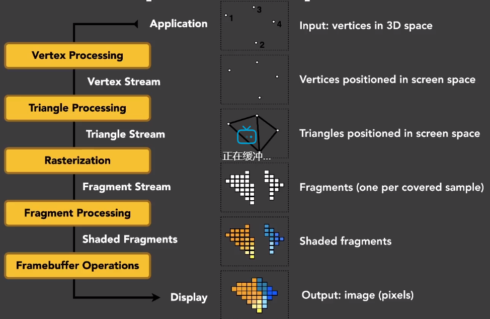

## OpenGL

垂直同步和双重渲染。

# Lecture3——Real-Time Shadows 1

## Shadow Map

主要问题：自遮挡、阴影贴图的分辨率问题。

### 一点数学

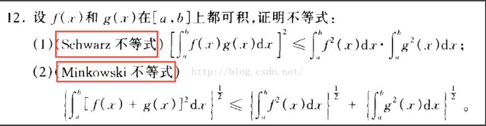

在实时渲染中，我们不关心不等式，而是关心==约等于==。==一个重要的约等式==：

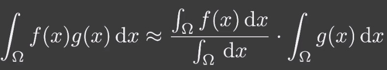

 这个分母的理由：是为了==归一化==。**什么时候这个不等式比较准确**？（两者其一就可）

- 实际积分域比较小
- $g(x)$比较光滑（min，max差别不大）

那么，考虑上节课的公式：

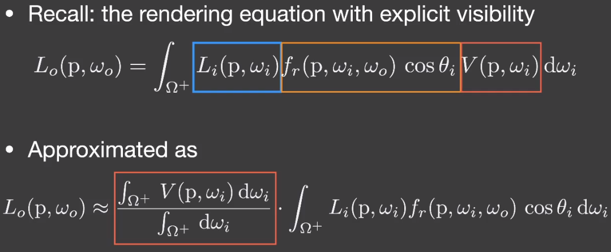

对于上诉公式，具体考虑精确条件：（两者其一就可）

- Small support（point / directional lighting）（小的积分域）
- Smooth integrand。（diffuse bsdf / constant randiance area lighting）

所以**SM**对环境光（积分域大）和Gloosy BRDF（不光滑）就不太适用。

## Percentage closer soft shadows

### Percentage Closer Filtering

PCF的设计是为了抗锯齿。

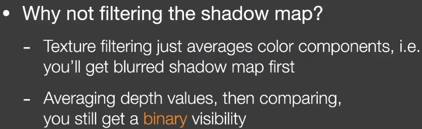

对于每一个像素，让它的深度和多个**SM**的`texel`进行比较，获得多个比较结果，然后对结果和进行平均。

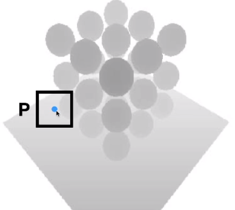

所以**PCF**平均的是**深度比较**的结果。

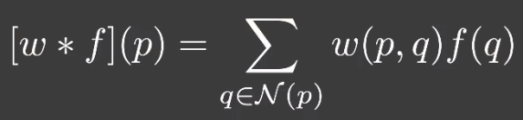

PCF的问题，RTR4中也说过：其模糊区域是固定的。

### Percentage closer soft shadows

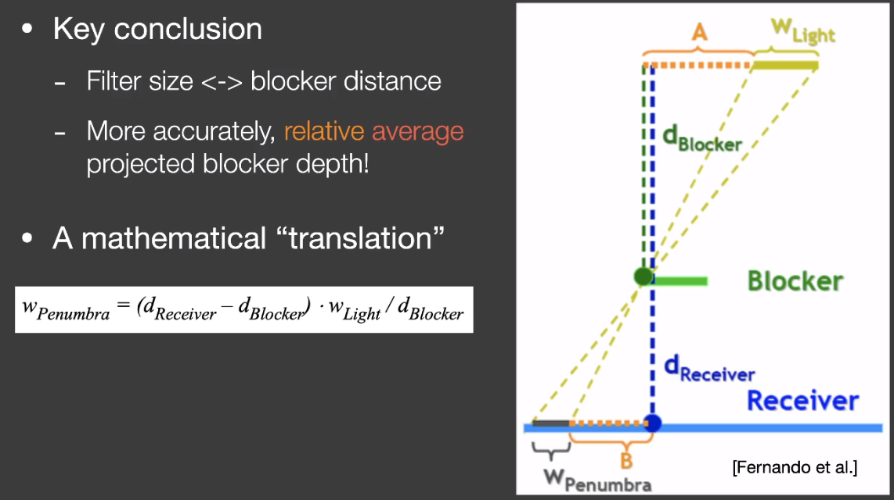

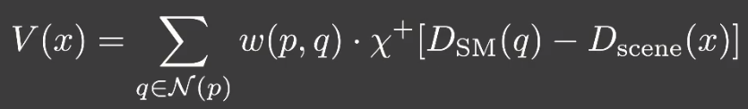

算法的整个流程：

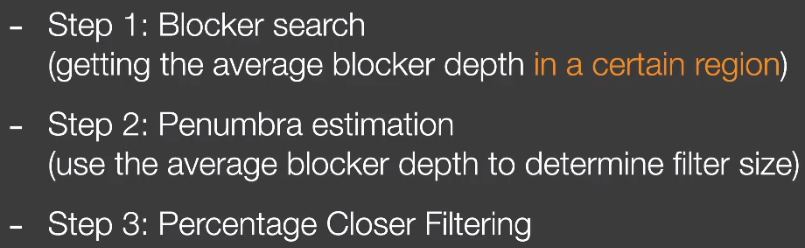

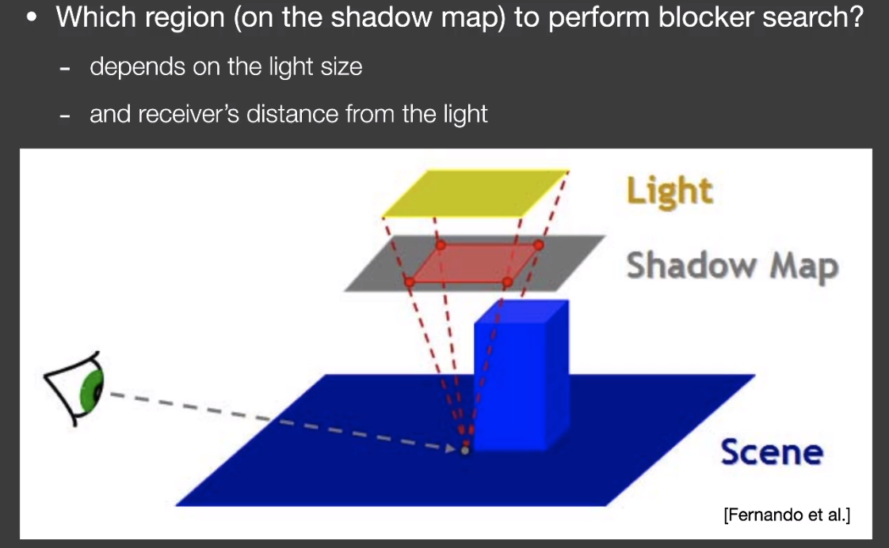

# Lecture4——Real-Time Shadows 2

对于PCSS，主要的性能限制是第一步和第三步。

## Variance Soft Shadow Mapping

对于PCSS，我们其实就是要知道渲染点在指定范围内的深度排名，那么我们就可以假设这个排名分布是符合**正态分布**的，而对于正态分布，其特征是由均值和方差决定的，所以我们就可以通过这些近似，避免多次访问ShadowMap求和做均值。

核心思路：

- 快速计算获得区域内深度的均值和方差。
- 对于均值：硬件的`MipMap`，Summed Area Tables
- 方差：$Var(X)=E(X^2)-E^2(X)$，所以我们需要一张深度平方的`ShadowMap`。
- 所以问题变成了：我们求正态曲线下，小于x的面积。

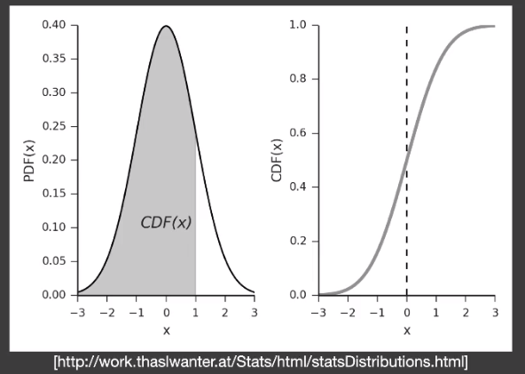

- 正态分布的CDF没有解析解，只有数值解，如果觉得计算麻烦（打表更麻烦），可以使用如下不等式进行近似。

    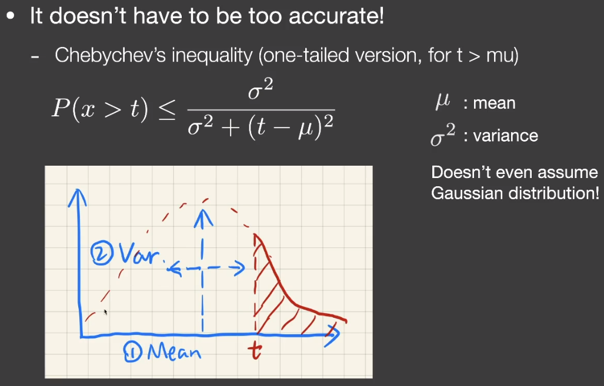

回到第一步

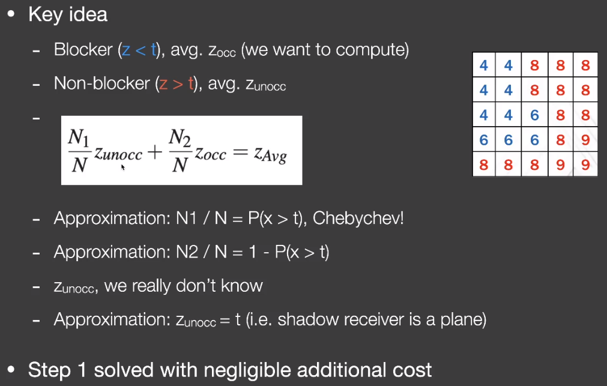

## MIPMAP and Summed-Area Variance Shadow Maps

都是为了解决==范围查询==的问题。 

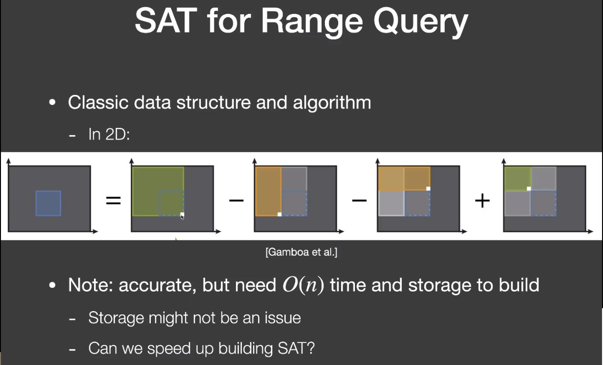

## Moment Shadow mapping

VSSM因为有很多近似，所以问题也不少

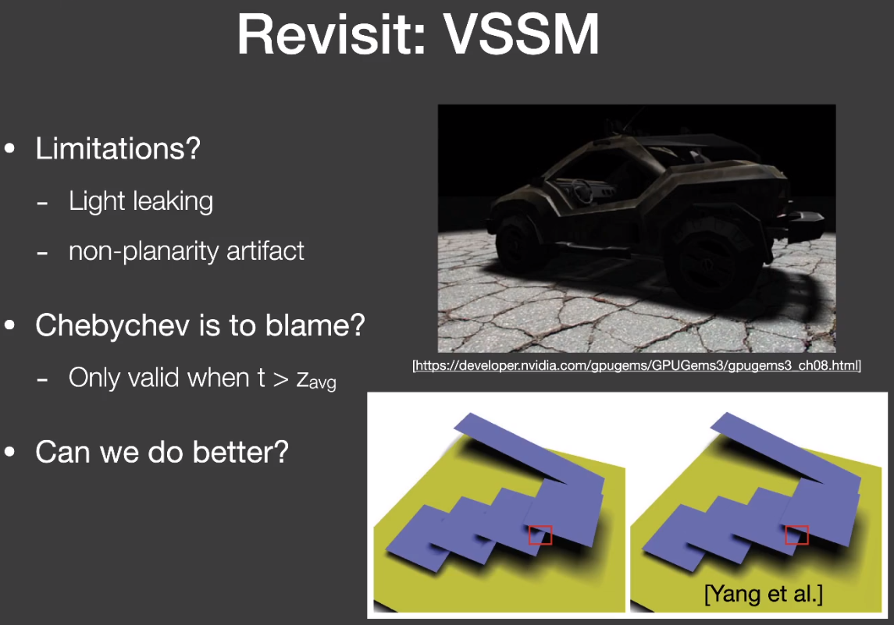

为了解决这些问题，可以使用更高阶的矩`moment`，

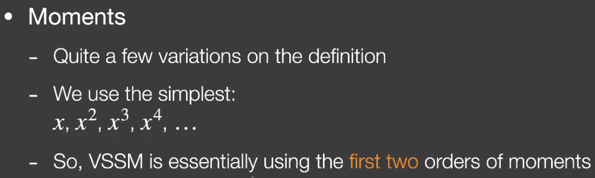

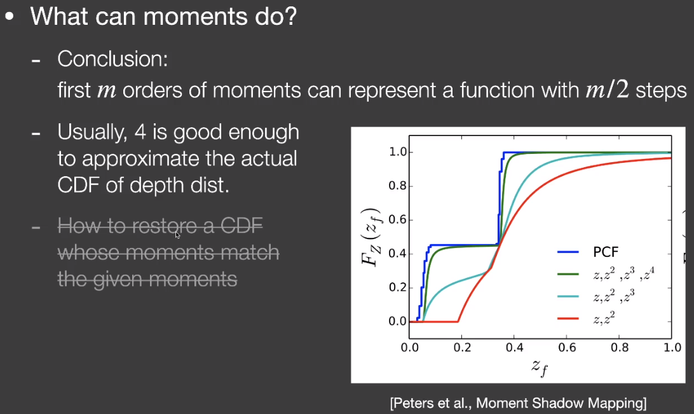