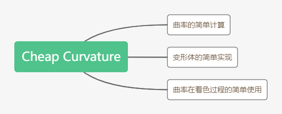

# Cheap Curvature代码解析

作者：Nimitz，网址：https://www.shadertoy.com/view/Xts3WM

标签：3d，cheap，curvature

简介：主要是对曲率的简单计算




#### 相机的简单设置

在相机的常规设置上，加上了鼠标点击的控制，较为简单。

#### 射线步进

```c
float map(vec3 p)
{
    p.x += sin(p.y*4.+time+sin(p.z))*0.15;
    //
    float d = length(p)-1.;
    float st = sin(time*0.42)*.5+0.5; 
    const float frq = 10.;
    d += sin(p.x*frq + time*.3 + sin(p.z*frq+time*.5+sin(p.y*frq+time*.7)))*0.075*st;
    
    return d;
}
```

常规的RayMarching步骤，比较特殊的是Map函数——为了更好体现曲率的作用。粗看之下，完全不知道讲的啥玩意，来逐句分析。

```c
p.x += sin(p.y*4.+time+sin(p.z))*0.15;
```

​	第一句的作用主要是对变形体进行一个整体的坐标迁移（随时间变化），如果没有此句，则将会在某个时刻呈现为完整的球体。个人总结：非核心代码，但加上，会增强球体的变形感。

```c
float d = length(p)-1.;
```

​	对3D SDF了解的话，一眼就能看出此句就是Sphere的SDF，那么作用很明显：决定了变形体整体的大小（球的半径）

```c
//f=A*sin(B*x+C)
float st = sin(time*0.42)*.5+0.5; 
```

​	st的作用根据最后一句可以明显得出：变形的程度——A

```c
//f=A*sin(B*x+C)
const float frq = 10.;
```

​	frg很明显是频率的缩写，根据最后一句，其效果也容易得出：控制变形的步长——B

```c
d += sin(p.x*frq + time*.3 + sin(p.z*frq+time*.5+sin(p.y*frq+time*.7)))*0.075*st;
```

​	核心代码：在正常的球体距离d的基础上加上一个嵌套的三角函数


#### 颜色计算

``` c
vec3 pos = ro+rz*rd;
float crv;
vec3 nor = norcurv(pos, crv);
crv = curv2(pos, 0.01);
vec3 ligt = normalize( vec3(.0, 1., 0.) );
float dif = clamp(dot( nor, ligt ), 0., 1.);
float bac = clamp( dot( nor, -ligt), 0.0, 1.0 );
float spe = pow(clamp( dot( reflect(rd,nor), ligt ), 0.0, 1.0 ),400.);
float fre = pow( clamp(1.0+dot(nor,rd),0.0,1.0), 2.0 );
vec3 brdf = vec3(0.10,0.11,0.13);
brdf += bac*vec3(0.1);
brdf += dif*vec3(1.00,0.90,0.60);
col = abs(sin(vec3(0.2,0.5,.9)+clamp(crv*80.,0.,1.)*1.2));
col = mix(col,texture(iChannel0,reflect(rd,nor)).rgb,.5);
col = col*brdf + col*spe +.3*fre*mix(col,vec3(1),0.5);
col *= smoothstep(-1.,-.9,sin(crv*200.))*0.15+0.85;
```

​	一开始是常见的操作：pos更新，dif、bac、spec、fre项的计算，还计算了曲率。第一个col计算式，是根据曲率进行颜色过渡，所以，扭曲的峰谷是蓝色，峰顶是黄色。第二个col式是让球体拥有一定的反射效果（反射周围的环境）。后面两个是效果的结合以及微调。


#### 曲率计算

``` c
//Curvature only, 5 taps, with epsilon width as input
float curv(in vec3 p, in float w)
{
    vec2 e = vec2(-1., 1.)*w;   
    
    float t1 = map(p + e.yxx), t2 = map(p + e.xxy);
    float t3 = map(p + e.xyx), t4 = map(p + e.yyy);
    
    return .25/e.y*(t1 + t2 + t3 + t4 - 4.0*map(p));
}

//Curvature in 7-tap (more accurate)
float curv2(in vec3 p, in float w)
{
    vec3 e = vec3(w, 0, 0);
    
    float t1 = map(p + e.xyy), t2 = map(p - e.xyy);
    float t3 = map(p + e.yxy), t4 = map(p - e.yxy);
    float t5 = map(p + e.yyx), t6 = map(p - e.yyx);
    
    return .25/e.x*(t1 + t2 + t3 + t4 + t5 + t6 - 6.0*map(p));
}
```

