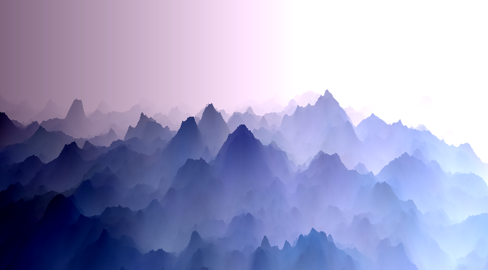
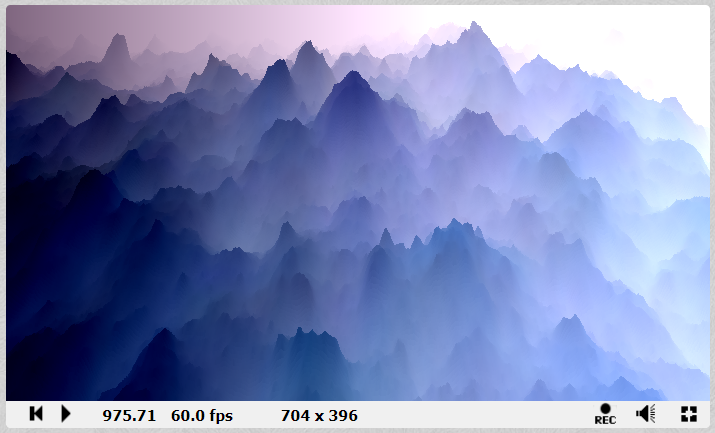

# Mystery Mountains

 作者：Dave_Hoskins，网址：https://www.shadertoy.com/view/llsGW7



## 核心

```c++
// Add texture layers of differing frequencies and magnitudes...
#define F +texture(iChannel0,.3+p.xz*s/3e3)/(s+=s) 
...
t = F F F F F F F F;
```

类似随机布朗函数的过程，不过这里我们进行采样的，不是某个噪声函数，而是纹理。所以我们这里要不断改变的是采样的`UV`和幅度值（$1/(s+=s)$）。这样得到我们的`t`。

## 主函数

```c++
void mainImage( out vec4 c, vec2 w )
{
    vec4 p=vec4(w/iResolution.xy,1,1)-.5,d=p,t;
    p.z += iTime*20.;d.y-=.4;
    
    for(float i=1.5;i>0.;i-=.002)
    {
        float s=.5;
        t = F F F F F F F F;
        c =1.+d.x-t*i; c.y-=.1;
        if(t.x>p.y*.007 + 2.1)break;
        p += d;
    }
}
```

我们进行逐行分析，首先第一行：先是得到我们的UV，并转换为当前的世界坐标值`p`$(u,v,1,1)$；然后初始化射线步进的步长`d`；最后是`t`的声明。

```c++
vec4 p=vec4(w/iResolution.xy,1,1)-.5,d=p,t;
```

第二行：移动我们的观察位置；`d.y-=0.4`让我们的整体观察方向是朝下，例如我们设置为`0.7`，效果就变成了。这样的话，其实我们这步就相当于旋转相机的朝向了。



进入的我们的射线步进过程。`s`就是我们随机布朗函数的核心参数（决定了曲线的自相似性）。然后是使用宏进行这个过程。

```c++
c =1.+d.x-t*i; c.y-=.1;
```

这个是根据我们的`t`进行颜色计算。根据我的分析，`d.x`和`t*i`（核心还是步进过程）决定我们的颜色变化的平滑程度（前者更是作用不大）。`t*i`造成目前这种，山峰顶是黑色，而往下逐渐变白的情况。仔细看下代码，也很容易看出，越早结束循环，c的值越小（因为`t*i`越大）。`c.y-=0.1`决定整体色调：上图是紫色，是因为我们减去了`G`通道。

```c++
if(t.x>p.y*.007 + 2.1)break;
p += d;
```

这也是本代码的核心，毕竟决定如何结束步进过程。这里我们取`t.x`（不具备特殊性）作为高度值和当前位置的高度进行比较，但注意要乘上`0.007`进行单位转化，以及加上海平面`2.1`。

最后则是步进更新。