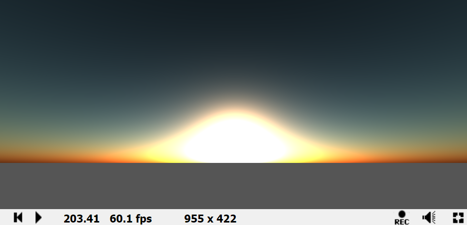

# Faster atmospheric scattering

作者：16807，**网址**：https://www.shadertoy.com/view/3dBSDW




## 代码规范设置和一些常量、类

```c++
#ifdef GL_ES
#define _in(T) const in T
#define _inout(T) inout T
#define _out(T) out T
#define _begin(type) type (
#define _end )
#define mul(a, b) (a) * (b)
#endif

#define PI 3.14159265359

// Shadertoy specific uniforms
#define u_res iResolution
#define u_time iTime
#define u_mouse iMouse
```

然后是三个类：射线类，球类，平面类：

```c++
struct ray_t {
	vec3 origin;
	vec3 direction;
};
#define BIAS 1e-4 // small offset to avoid self-intersections

struct sphere_t {
	vec3 origin;
	float radius;
	int material;
};

struct plane_t {
	vec3 direction;
	float distance;
	int material;
};
```

下面是瑞利散射和米氏散射的散射系数（海平面处，单位是米）、尺寸高度、相位函数：

```c++
// scattering coefficients at sea level (m)
const vec3 betaR = vec3(5.5e-6, 13.0e-6, 22.4e-6); // Rayleigh 
const vec3 betaM = vec3(21e-6); // Mie

// scale height (m)
// thickness of the atmosphere if its density were uniform
const float hR = 7994.0; // Rayleigh
const float hM = 1200.0; // Mie

float rayleigh_phase_func(float mu)
{
	return
			3. * (1. + mu*mu)
	/ //------------------------
				(16. * PI);
}

// Henyey-Greenstein phase function factor [-1, 1]
// represents the average cosine of the scattered directions
// 0 is isotropic scattering
// > 1 is forward scattering, < 1 is backwards
const float g = 0.76;
float henyey_greenstein_phase_func(float mu)
{
	return
						(1. - g*g)
	/ //---------------------------------------------
		((4. + PI) * pow(1. + g*g - 2.*g*mu, 1.5));
}

// Schlick Phase Function factor
// Pharr and  Humphreys [2004] equivalence to g above
const float k = 1.55*g - 0.55 * (g*g*g);
float schlick_phase_func(float mu)
{
	return
					(1. - k*k)
	/ //-------------------------------------------
		(4. * PI * (1. + k*mu) * (1. + k*mu));
}
```

然后是大气模型的一些参数，包括（以m作为单位）：地球半径、大气半径、太阳设置（方向、亮度）；以及采样数（视图方向（主）、以及计算散射光的（副））

```c++
const float earth_radius = 6360e3; // (m)
const float atmosphere_radius = 6420e3; // (m)

vec3 sun_dir = vec3(0, 1, 0);
const float sun_power = 20.0;

const sphere_t atmosphere = _begin(sphere_t)
	vec3(0, 0, 0), atmosphere_radius, 0
_end;

const int num_samples = 16;
const int num_samples_light = 8;
```


## 从主函数开始

首先是根据屏幕坐标和相机参数，求得NDC和相机坐标：

```c++
vec2 aspect_ratio = vec2(u_res.x / u_res.y, 1);
float fov = tan(radians(45.0));
vec2 point_ndc = fragCoord.xy / u_res.xy;
vec3 point_cam = vec3((2.0 * point_ndc - 1.0) * aspect_ratio * fov, -1.0);
```

根据时间，旋转我们的$Vector_{sum}$，模拟日升日落：

```c++
// sun
mat3 rot = rotate_around_x(-abs(sin(u_time / 2.)) * 90.);
sun_dir *= rot;
```

下面的分支决定我们是采取哪种视角观看，这里我们分析正常相机视角。我们在海平面以上1m处，略微抬头，看向远处（$-z$方向）：

```c++
vec3 eye = vec3 (0, earth_radius + 1., 0);
vec3 look_at = vec3 (0, earth_radius + 1.5, -1);

ray_t ray = get_primary_ray(point_cam, eye, look_at);
```

之后，我们来分析主渲染的部分。


## 主渲染：get_incident_light

这里使用的技术和思路，都是课程里面的`C++实现`转换而来。唯一的问题在于我们处理散射光的计算时，不是使用的传统的`ray marching`过程，我们来看看这个函数：

```c++
float approx_air_column_density_ratio_along_2d_ray_for_curved_world(
    float x_start, // distance along path from closest approach at which we start the raymarch
    float x_stop,  // distance along path from closest approach at which we stop the raymarch
    float z2,      // distance at closest approach, squared
    float r,       // radius of the planet
    float H        // scale height of the planet's atmosphere
){
    
    // GUIDE TO VARIABLE NAMES:
    //  "x*" distance along the ray from closest approach
    //  "z*" distance from the center of the world at closest approach
    //  "r*" distance ("radius") from the center of the world
    //  "h*" distance ("height") from the surface of the world
    //  "*b" variable at which the slope and intercept of the height approximation is sampled
    //  "*0" variable at which the surface of the world occurs
    //  "*1" variable at which the top of the atmosphere occurs
    //  "*2" the square of a variable
    //  "d*dx" a derivative, a rate of change over distance along the ray

    float a = 0.45;
    float b = 0.45;

    float x0 = sqrt(max(r *r -z2, 0.));
    // if ray is obstructed
    if (x_start < x0 && -x0 < x_stop && z2 < r*r)
    {
        // return ludicrously big number to represent obstruction
        return 1e20;
    }
    
    float r1      = r + 6.*H;
    float x1      = sqrt(max(r1*r1-z2, 0.));
    float xb      = x0+(x1-x0)*b;
    float rb2     = xb*xb + z2;
    float rb      = sqrt(rb2);
    float d2hdx2  = z2 / sqrt(rb2*rb2*rb2);
    float dhdx    = xb / rb; 
    float hb      = rb - r;
    float dx0     = x0          -xb;
    float dx_stop = abs(x_stop )-xb;
    float dx_start= abs(x_start)-xb;
    float h0      = (0.5 * a * d2hdx2 * dx0      + dhdx) * dx0      + hb;
    float h_stop  = (0.5 * a * d2hdx2 * dx_stop  + dhdx) * dx_stop  + hb;
    float h_start = (0.5 * a * d2hdx2 * dx_start + dhdx) * dx_start + hb;

    float rho0  = exp(-h0/H);
    float sigma = 
        sign(x_stop ) * max(H/dhdx * (rho0 - exp(-h_stop /H)), 0.) 
      - sign(x_start) * max(H/dhdx * (rho0 - exp(-h_start/H)), 0.);

    // NOTE: we clamp the result to prevent the generation of inifinities and nans, 
    // which can cause graphical artifacts.
    return min(abs(sigma),1e20);
}
```

//todo


## 工具函数

首先是：绕X轴旋转（太阳的升起和落下）、获取主射线、获取球与射线的交点：

```c++
mat3 rotate_around_x(_in(float) angle_degrees)
{
	float angle = radians(angle_degrees);
	float _sin = sin(angle);
	float _cos = cos(angle);
	return mat3(1, 0, 0, 0, _cos, -_sin, 0, _sin, _cos);
}


ray_t get_primary_ray(
	_in(vec3) cam_local_point,
	_inout(vec3) cam_origin,
	_inout(vec3) cam_look_at
){
	vec3 fwd = normalize(cam_look_at - cam_origin);
	vec3 up = vec3(0, 1, 0);
	vec3 right = cross(up, fwd);
	up = cross(fwd, right);

	ray_t r = _begin(ray_t)
		cam_origin,
		normalize(fwd + up * cam_local_point.y + right * cam_local_point.x)
		_end;
	return r;
}

bool isect_sphere(_in(ray_t) ray, _in(sphere_t) sphere, _inout(float) t0, _inout(float) t1)
{
	vec3 rc = sphere.origin - ray.origin;
	float radius2 = sphere.radius * sphere.radius;
	float tca = dot(rc, ray.direction);
	float d2 = dot(rc, rc) - tca * tca;
	if (d2 > radius2) return false;
	float thc = sqrt(radius2 - d2);
	t0 = tca - thc;
	t1 = tca + thc;

	return true;
}
```


