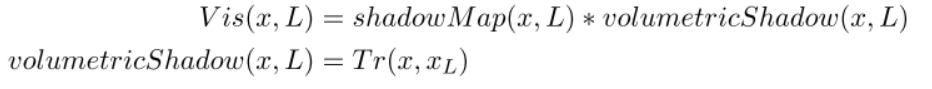

# VolumetricIntegration

作者：SebH，网址：https://www.shadertoy.com/view/XlBSRz

关键词：体积渲染、参与介质


介绍：

这里有一个演示，介绍了带有阴影的`single`体积渲染。我还加入了我在SIGGRAPH 15演讲中提出的改进的**散射积分**。关于我开发的Frostbite新的体积测量系统。见幻灯片28，网址是http://www.frostbite.com/2015/08/physically-based-unified-volumetric-rendering-in-frostbite/

基本上，它改进了每一步的、与消光有关的散射积分。差别主要体现在一些具有很强散射值的参与介质上。我已经设置了一些预定义的设置，供你在下面查看（以呈现它所改善的情况）。

- D_DEMO_SHOW_IMPROVEMENT_xxx：显示改善（在屏幕的右侧）。你仍然可以看到由于体积阴影和我们为它采取的低量采样而产生的混叠。
- D_DEMO_SHOW_IMPROVEMENT_xxx_NOVOLUMETRICSHADOW：和上面一样，但没有体积阴影。

为了提高体积渲染的准确性，我将光线行进的步骤限制在一个**最大距离**。**体积阴影的计算**是通过向**光线**行进，来评估每个视图光线步骤的**透射率**。


## 一些宏设置

```c++
// Apply noise on top of the height fog?  
//在高度雾的基础上应用噪音
#define D_FOG_NOISE 1.0

// Height fog multiplier to show off improvement with new integration formula
//高度雾乘法器展示改进与新的积分公式
#define D_STRONG_FOG 0.0

// Enable/disable volumetric shadow (single scattering shadow)
//启用/禁用体积阴影（单一散射阴影）。
#define D_VOLUME_SHADOW_ENABLE 1

// Use imporved scattering?
// In this mode it is full screen and can be toggle on/off.
//是否使用放大的散射？
#define D_USE_IMPROVE_INTEGRATION 1

// 用于控制透射率是在散射之前还是之后更新（当不使用改进的积分时）。
// 如果是0，强散射的参与介质将不会是能量守恒的
// 如果是1，参与的介质将看起来太暗，特别是在强消光的情况下（与它应该是的情况相比）。
// 如果不使用改进的散射积分，则只需切换可见性。
#define D_UPDATE_TRANS_FIRST 0

//在墙壁上应用凹凸贴图
#define D_DETAILED_WALLS 0

//用来限制射线行进的长度。需要用于体积计算
#define D_MAX_STEP_LENGTH_ENABLE 1

//光源的颜色和位置
#define LPOS vec3( 20.0+15.0*sin(iTime), 15.0+12.0*cos(iTime),-20.0)
#define LCOL (600.0*vec3( 1.0, 0.9, 0.5))
```

## 从主函数开始

首先是求UV坐标，并转换为$[-1,1]$，这里额外的操作是考虑屏幕的长宽比，来使UV独立于它：

```c++
vec2 uv = fragCoord.xy / iResolution.xy;

float hfactor = float(iResolution.y) / float(iResolution.x); // make it screen ratio independent
vec2 uv2 = vec2(2.0, 2.0*hfactor) * fragCoord.xy / iResolution.xy - vec2(1.0, hfactor);
```

然后是根据相机设置，获取射线的初始点`o`和方向`d`，这里很简单，因为相机的三个`vector`是固定的。此外，还要根据鼠标点击的位置，修改相机的位置。最后，对一个在后面要使用的变量`finalPos`，进行赋值（等于相机位置）：

```c
vec3 camPos = vec3( 20.0, 18.0,-50.0);
if(iMouse.x+iMouse.y > 0.0) // to handle first loading and see somthing on screen
	camPos += vec3(0.05,0.12,0.0)*(vec3(iMouse.x, iMouse.y, 0.0)-vec3(iResolution.xy*0.5, 0.0));
vec3 camX   = vec3( 1.0, 0.0, 0.0);
vec3 camY   = vec3( 0.0, 1.0, 0.0);
vec3 camZ   = vec3( 0.0, 0.0, 1.0);

vec3 rO = camPos;
vec3 rD = normalize(uv2.x*camX + uv2.y*camY + camZ);
vec3 finalPos = rO;
```

之后，是进行**主要的渲染操作**（这个函数之后分析），来得到`albedo`、`normal`、`scatTrans`：

```c++
vec3 albedo = vec3( 0.0, 0.0, 0.0 );
vec3 normal = vec3( 0.0, 0.0, 0.0 );
vec4 scatTrans = vec4( 0.0, 0.0, 0.0, 0.0 );
traceScene( fragCoord.x>(iResolution.x/2.0),
	rO, rD, finalPos, normal, albedo, scatTrans);
```


## 转入traceScene

在具体分析之前，我们已经可以知道，第一个布尔参数`improvedScattering`的作用是：进行效果对比，让左右两边的渲染效果不一致。

先是四个变量：第一个应该是**迭代次数**；第二个按照其命名方式，应该是**散射参数**$\sigma_s$；第三个则应该是消光参数$\sigma_t$；第四个则明显是**光源位置**。

```c++
const int numIter = 100;
	
float sigmaS = 0.0;
float sigmaE = 0.0;

vec3 lightPos = LPOS;
```

然后的两个变量，应该是初始的消光率，和散射光的值：

```c++
// Initialise volumetric scattering integration (to view)
float transmittance = 1.0;
vec3 scatteredLight = vec3(0.0, 0.0, 0.0);
```

进入循环前的最后四个变量：第一个明显是已经移动的距离；第二个是材质ID；第三个是当前射线步进的位置；第四个是步长。

```c++
float d = 1.0; // hack: always have a first step of 1 unit to go further
float material = 0.0;
vec3 p = vec3(0.0, 0.0, 0.0);
float dd = 0.0;
```

### 进入循环

首先是固定的**位置更新**：

```c++
vec3 p = rO + d*rD;
```

### 分析getParticipatingMedia

然后是根据之前的`sigmaS`和`sigmaE`，调用`getParticipatingMedia(out float sigmaS, out float sigmaE, in vec3 pos)`来获取参与介质的对应值：

```c++
// To simplify: wavelength independent scattering and extinction
void getParticipatingMedia(out float sigmaS, out float sigmaE, in vec3 pos)
{
    float heightFog = 7.0 + D_FOG_NOISE*3.0*clamp(displacementSimple(pos.xz*0.005 + iTime*0.01),0.0,1.0);
    heightFog = 0.3*clamp((heightFog-pos.y)*1.0, 0.0, 1.0);
    
    const float fogFactor = 1.0 + D_STRONG_FOG * 5.0;
    
    const float sphereRadius = 5.0;
    float sphereFog = clamp((sphereRadius-length(pos-vec3(20.0,19.0,-17.0)))/sphereRadius, 0.0,1.0);
    
    const float constantFog = 0.02;

    sigmaS = constantFog + heightFog*fogFactor + sphereFog;
   
    const float sigmaA = 0.0;
    sigmaE = max(0.000000001, sigmaA + sigmaS); // to avoid division by zero extinction
}
```

首先，一开始的两行，是求得高度雾：

```c++
float heightFog = 7.0 + D_FOG_NOISE*3.0*clamp(displacementSimple(pos.xz*0.005 + iTime*0.01),0.0,1.0);
heightFog = 0.3*clamp((heightFog-pos.y)*1.0, 0.0, 1.0);
```

- 第一行：`7.0`是雾的固定值，也就是雾平面的高度，然后加上后面的扰动。对于扰动，`D_FOG_NOISE`按照之前的解释，应该是非0即1（虽然它是浮点值），来决定是否应用噪声；`3.0`则应该是扰动的尺度——**噪声高低之差**；`displacementSimple`其实就是**随机布朗函数**，产生连续的噪声扰动，参数也很容易理解，`pos`只取`xz`是因为雾平面是在`X-Z`坐标上，所以不要`Y`，`0.005`应该是来决定**噪声的密度**（下图是`0.05`的情况）。`clamp`让波动在合理的范围内。

    

- 第二行：`clamp`操作是为了根据`pos.y`舍弃那些太远的雾。我们发出一条射线，虽然迭代允许了很多次，但实际上绝大部分都是无用的。这里其实和**求SDF，发现距离还太远，然后继续**的过程类似。`heightFog-pos.y`（倒过来是绝对错误的）也保证在达到正确结果之前，clamp的结果永远是零，就不会对最终结果产生影响。

然后是求`fogFactor`，其实就是应用高度雾乘法器，对符合标准的高度雾进行缩放

```c++
 const float fogFactor = 1.0 + D_STRONG_FOG * 5.0;
```

求中间那个球体的对应值以及恒定雾（所以整个场景都**灰蒙蒙**的感觉），这里很简单，就不分析了：

```c++
const float sphereRadius = 5.0;
float sphereFog = clamp((sphereRadius-length(pos-vec3(20.0,19.0,-17.0)))/sphereRadius, 0.0,1.0);

const float constantFog = 0.02;
```

然后求我们参与介质的散射系数，很简单，就是加法：

```c++
sigmaS = constantFog + heightFog*fogFactor + sphereFog;
```

最后是求消光系数，这里不考虑吸收系数（设置为`0`）:

```c++
const float sigmaA = 0.0;
sigmaE = max(0.000000001, sigmaA + sigmaS); // to avoid division by zero extinction
```

### 更新消光率

第一个`#ifdef`，其实就是：自由模式下全分辨率正常渲染；其它情况，则需要根据左右屏，采取不同的渲染策略，只是为了对比效果：

```c++
#ifdef D_DEMO_FREE
        if(D_USE_IMPROVE_INTEGRATION>0) // freedom/tweakable version
#else
        if(improvedScattering)
#endif
```

首先，让我们看看`improvedScattering`下的处理

```c
if(improvedScattering)
{
    // See slide 28 at http://www.frostbite.com/2015/08/physically-based-unified-volumetric-rendering-in-frostbite/
    vec3 S = evaluateLight(p) * sigmaS * phaseFunction()* volumetricShadow(p,lightPos);// incoming light
    vec3 Sint = (S - S * exp(-sigmaE * dd)) / sigmaE; // integrate along the current step segment
    scatteredLight += transmittance * Sint; // accumulate and also take into account the transmittance from previous steps

    // Evaluate transmittance to view independentely
    transmittance *= exp(-sigmaE * dd);
}
```

#### 函数分析1

当然，具体分析之前，我们还是要看看那些新出现的函数。第一个是` evaluateLight（p）`，非常简单，就是**距离衰减**：

```
vec3 evaluateLight(in vec3 pos)
{
    vec3 lightPos = LPOS;
    vec3 lightCol = LCOL;
    vec3 L = lightPos-pos;
    return lightCol * 1.0/dot(L,L);
}
```

而`phaseFunction()`则是简单采取**恒定的相位函数**：

```c++
float phaseFunction()
{
    return 1.0/(4.0*3.14);
}
```

最后一个是` volumetricShadow(p,lightPos)`，其实从当前点，向光源进行射线步进，在这个过程中，黎曼和求积分，获得消光率`Tr`，将其作为阴影项，直接返回。当然，这里我们只迭代进行16次，且固定步长。

```c++
float volumetricShadow(in vec3 from, in vec3 to)
{
#if D_VOLUME_SHADOW_ENABLE
    const float numStep = 16.0; // quality control. Bump to avoid shadow alisaing
    float shadow = 1.0;
    float sigmaS = 0.0;
    float sigmaE = 0.0;
    float dd = length(to-from) / numStep;
    for(float s=0.5; s<(numStep-0.1); s+=1.0)// start at 0.5 to sample at center of integral part
    {
        vec3 pos = from + (to-from)*(s/(numStep));
        getParticipatingMedia(sigmaS, sigmaE, pos);
        shadow *= exp(-sigmaE * dd);
    }
    return shadow;
#else
    return 1.0;
#endif
}
```




其实就是上诉过程，但由于我们这里的场景没有实体物体，所以不需要考虑`shadowMap`的`0-1`可见性。

#### 回到调用处

函数分析完毕，那么第一行的作用就很明显了，求的是$L_{scat}(x,w_i) *\sigma_s$。

```c
vec3 S = evaluateLight(p) * sigmaS * phaseFunction()* volumetricShadow(p,lightPos);// incoming light
```


第二行是什么，暂时未看懂，但应该就是积分优化的地方。//todo。这里是能量守恒的积分方法，具体可以见论文阅读下的`Physically Based Sky, Atmosphere and Cloud Rendering in Frostbite`。

```c++
vec3 Sint = (S - S * exp(-sigmaE * dd)) / sigmaE; // integrate along the current step segment
...
//某个设置下的计算方式，这个符合我们学习到的经典公式
scatteredLight += sigmaS * evaluateLight(p) * phaseFunction() * volumetricShadow(p,lightPos) * transmittance * dd;
```

第三行：通过之前的计算，乘上消光率，得到这个位置的，来自光源的散射光，并累加。

```c++
 scatteredLight += transmittance * Sint; // accumulate and also take into account the transmittance from previous steps
```

第四行最为简单，就是**更新消光率**（view ray上的）

```c++
  // Evaluate transmittance to view independentely
    transmittance *= exp(-sigmaE * dd);
```

### 更新步长

```c++
dd = getClosestDistance(p, material);
if(dd<0.2)
    break; // give back a lot of performance without too much visual loss
d += dd;
```

逻辑很简单，唯一的问题就是新的函数`getClosestDistance(p, material)`。仔细一看，其实就是我们经常见的、类似`iBox`的塑形函数。主要是判断当前点离场景中几何实体的最大距离，如果小于阈值，则更新步长（步长会不断变小）和材质，否则则会依然以步长为1进行射线步进。

```c++
float getClosestDistance(vec3 p, out float material)
{
	float d = 0.0;
#if D_MAX_STEP_LENGTH_ENABLE
    float minD = 1.0; // restrict max step for better scattering evaluation
#else
	float minD = 10000000.0;
#endif
	material = 0.0;
    
    float yNoise = 0.0;
    float xNoise = 0.0;
    float zNoise = 0.0;
#if D_DETAILED_WALLS
    yNoise = 1.0*clamp(displacementSimple(p.xz*0.005),0.0,1.0);
    xNoise = 2.0*clamp(displacementSimple(p.zy*0.005),0.0,1.0);
    zNoise = 0.5*clamp(displacementSimple(p.xy*0.01),0.0,1.0);
#endif
    
	d = max(0.0, p.y - yNoise);
	if(d<minD)
	{
		minD = d;
		material = 2.0;
	}
	
	d = max(0.0,p.x - xNoise);
	if(d<minD)
	{
		minD = d;
		material = 1.0;
	}
	
	d = max(0.0,40.0-p.x - xNoise);
	if(d<minD)
	{
		minD = d;
		material = 1.0;
	}
	
	d = max(0.0,-p.z - zNoise);
	if(d<minD)
	{
		minD = d;
		material = 3.0;
    }
    
	return minD;
}
```

### 填充变量

首先，是计算`albedo`，这里我们就是分析新的函数`getSceneColor(p, material)`，结合上面的那个最近距离函数，我们可以知道：材质为`1.0`，就是场景中的红墙（X方向）；`2.0`则是绿顶（Y方向），当然目前的设置看不到；`3.0`则是后面那个看着像空洞的蓝墙（Z方向）

```c++
vec3 getSceneColor(vec3 p, float material)
{
	if(material==1.0)
	{
		return vec3(1.0, 0.5, 0.5);
	}
	else if(material==2.0)
	{
		return vec3(0.5, 1.0, 0.5);
	}
	else if(material==3.0)
	{
		return vec3(0.5, 0.5, 1.0);
	}
	
	return vec3(0.0, 0.0, 0.0);
}
```

然后是更新最终位置，然后用这个值计算法线，也就是新的函数`calcNormal`。计算方式则是我们经常见的方法，而这里使用`getClosestDistance`，也间接证明了其就是类似`iBox`的函数。

```c++
finalPos = rO + d*rD;
    
normal = calcNormal(finalPos);
```

```c++
vec3 calcNormal( in vec3 pos)
{
    float material = 0.0;
    vec3 eps = vec3(0.3,0.0,0.0);
	return normalize( vec3(
           getClosestDistance(pos+eps.xyy, material) - getClosestDistance(pos-eps.xyy, material),
           getClosestDistance(pos+eps.yxy, material) - getClosestDistance(pos-eps.yxy, material),
           getClosestDistance(pos+eps.yyx, material) - getClosestDistance(pos-eps.yyx, material) ) );

}
```

最后用散射光和透射率填充最后一个需要计算的变量`scatTrans`。

```c++
scatTrans = vec4(scatteredLight, transmittance);
```


## 回到主函数

首先，是计算终点的贡献（在射线步进的过程中，最后一步，即到达终点，是不会继续计算的），所以我们需要：

```c++
//lighting
vec3 color = (albedo/3.14) * evaluateLight(finalPos, normal) * volumetricShadow(finalPos, LPOS);
// Apply scattering/transmittance
color = color * scatTrans.w + scatTrans.xyz;
```

第一行，其实就是$albedo/\pi*light*visable$。需要注意的这里的`evaluateLight(finalPos, normal)`和之前不一样，具有新的法线参数。逻辑其实挺简单，就是之前的计算方式得到的光强，乘上一个余弦项（lightV和normal的夹角）。

```c++
vec3 evaluateLight(in vec3 pos, in vec3 normal)
{
    vec3 lightPos = LPOS;
    vec3 L = lightPos-pos;
    float distanceToL = length(L);
    vec3 Lnorm = L/distanceToL;
    return max(0.0,dot(normal,Lnorm)) * evaluateLight(pos);
}
```

第二行也很简单，就是上一步的得到的终点值，再乘上最终消光率，加上之前的累积散射光。

最后一步就是伽马校正：

```
color = pow(color, vec3(1.0/2.2)); // simple linear to gamma, exposure of 1.0
```

> 如果需要对比效果，则中间需要产生黑边：
>
> ```c++
> #ifndef D_DEMO_FREE
>     // Separation line
>     if(abs(fragCoord.x-(iResolution.x*0.5))<0.6)
>         color.r = 0.5;
> #endif
> ```


## 结语

研究生以来，很久没有如此细致的阅读这样一份`shader Toy`代码（将近400行）。但这次阅读也是获益良多，对于体积渲染有了更深一步的理解。