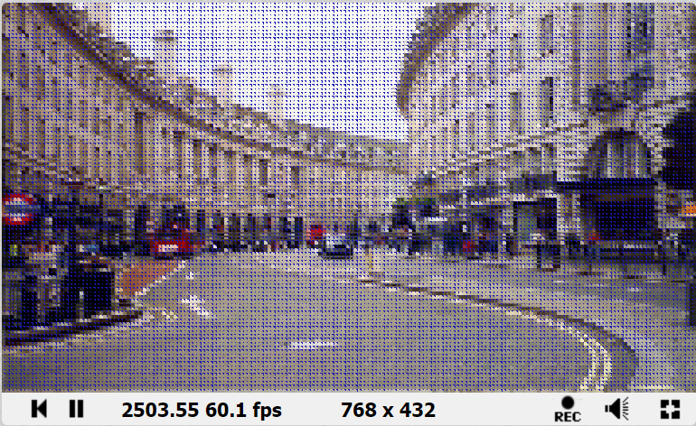
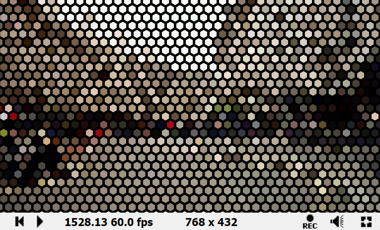

# 像素化型后处理

## Pixelize Quad

### Common

```
#define _PixelSize (1000.)
#define _PixelRatio (1.)
#define _PixelScaleX (30. * sin(iTime))
#define _PixelScaleY (30. * sin(iTime))
```

### Image

```c++
vec2 RectPixelizeUV(vec2 uv)
{
    float pixelScale = 1.0 / _PixelSize;
    
    vec2 coord = vec2(pixelScale * _PixelScaleX * floor(uv.x / (pixelScale *_PixelScaleX)), 
    (pixelScale * _PixelRatio *_PixelScaleY) * floor(uv.y / (pixelScale *_PixelRatio 
    * _PixelScaleY)));

	return  coord;
}

void mainImage( out vec4 fragColor, in vec2 fragCoord )
{
    // Normalized pixel coordinates (from 0 to 1)
    vec2 uv = fragCoord/iResolution.xy;

    // Time varying pixel color
    vec3 col = texture(iChannel0, RectPixelizeUV(uv)).xyz;  
    
    // Output to screen
    fragColor = vec4(col,1.0);
}
```

### 结果


## Pixelize Led

### Common

```c++
#define _PixelSize (100.)
#define _PixelRatio (3.)
#define _LedRadius (4.)
#define _BackgroundColor vec4(0, 1. * sin(iTime), 0., 0.9)
```

### Image

```c++
vec2 RectPixelizeUV(vec2 uv)
{
    float pixelScale = 1.0 / _PixelSize;
    
    vec2 coord = vec2(pixelScale * floor(uv.x / (pixelScale)), 
    (pixelScale * _PixelRatio) * floor(uv.y / (pixelScale *_PixelRatio 
    )));

	return  coord;
}

void mainImage( out vec4 fragColor, in vec2 fragCoord )
{
    // Normalized pixel coordinates (from 0 to 1)
    vec2 uv = fragCoord/iResolution.xy;
    
    // 实现矩形像素
    vec2 new_uv = RectPixelizeUV(uv);
    vec4 col = texture(iChannel0, new_uv);
    
    // 计算矩形像素坐标
    vec2 coord = uv * vec2(_PixelSize, _PixelSize / _PixelRatio);
    
    // 横纵坐标强度渐变
    float ledX = abs(sin(coord.x * 3.1415)) * 1.5;
    float ledY = abs(sin(coord.y * 3.1415)) * 1.5;
    
    // 求解LedValue
    float ledValue = ledX * ledY;
    
    // led半径校正
    float radius = step(ledValue, _LedRadius);
    
    //最终颜色 = 基础led颜色 + 渐变led颜色 + 背景颜色
    col = ((1. - radius) * col) + ((col * ledValue) * radius)
    + radius * (1. - ledValue) *  _BackgroundColor;
    
    
    // Output to screen
    fragColor = col;
}
```

### 结果


## Pixelize Leaf

### Common

```c++
#define _PixelSize (400. + 300. * sin(iTime))
#define _PixelRatio (2.)
#define _PixelScaleX (0.3)
#define _PixelScaleY (0.3)
```

### Image

```c++
vec3 TrianglePixelizeUV(vec2 uv)
{
    vec2 pixelScale = _PixelSize * vec2(_PixelScaleX, _PixelScaleY / _PixelRatio);
    
    //乘以缩放，向下取整，再除以缩放，得到分段UV
    vec2 coord = floor(uv * pixelScale) / pixelScale;
    
    uv -= coord;
    uv *= pixelScale;
    
    //进行像素偏移处理
    coord +=
            vec2(step((1. - uv.y), uv.x) / (pixelScale.x), //leaf X
            step(uv.x, uv.y) / (pixelScale.y) // leaf y
            );
    vec3 col = texture(iChannel0, coord).xyz;
    return col;
    
}

void mainImage( out vec4 fragColor, in vec2 fragCoord )
{
    // Normalized pixel coordinates (from 0 to 1)
    vec2 uv = fragCoord/iResolution.xy;

    // Time varying pixel color
    vec3 col = TrianglePixelizeUV(uv);

    // Output to screen
    fragColor = vec4(col,1.0);
}
```

### 结果


## Circle Pixelize

### Common

```c
#define _PixelSize (10000.)
#define _PixelRatio (iResolution.y / iResolution.x)
#define _PixelScaleX (30.3)
#define _PixelIntervalX (100.1)
#define _PixelIntervalY (100.1)

#define MAX_RADIUS (0.317)
#define _BackgroundColor vec4(0.1, 0.1, 0.7, 1.);
```

### Image

```c++
vec3 CirclePixelize(vec2 uv)
{
    float pixelScale = 1. / _PixelSize;
    uv.x = uv.x / _PixelRatio;
    
    //x和y坐标分别除以缩放系数，在用floor向下取整，再乘以缩放系数，得到分段UV
    vec2 coord = vec2(_PixelIntervalX *  floor(uv.x / (pixelScale * _PixelIntervalX))
    , (_PixelIntervalY)* floor(uv.y / (pixelScale * _PixelIntervalY)));

    //求解圆心坐标
    vec2 circleCenter = coord * pixelScale + pixelScale * 0.5;
    
    //计算当前uv值隔圆心的距离，并乘以缩放系数
    float dist = length(uv - circleCenter) * _PixelScaleX;
    
    //圆心坐标乘以缩放系数
    circleCenter.x *= _PixelRatio;

    //采样
    vec4 screenColor = texture(iChannel0, circleCenter);

    //对于距离大于半径的像素，替换为背景色
    if (dist > MAX_RADIUS)  screenColor = _BackgroundColor;

    return screenColor.xyz;
}


void mainImage( out vec4 fragColor, in vec2 fragCoord )
{
    // Normalized pixel coordinates (from 0 to 1)
    vec2 uv = fragCoord/iResolution.xy;

    // Time varying pixel color
    vec3 col = CirclePixelize(uv);

    // Output to screen
    fragColor = vec4(col,1.0);
}
```

### 结果




## Pixelize Diamond

### Common

```c++
#define _PixelSize (5000. + 3000. * sin(iTime))
```

### Image

```c++
vec3 DiamondPixelizeUV(vec2 uv)
{
    vec2 pixelSize = 10. / iResolution.xy * _PixelSize;
    vec2 coord = uv * pixelSize;
    
    //计算当前Diamond的朝向
    int direction = int(dot(fract(coord), vec2(1., 1.)) >= 1.0) + 2 * int(dot(fract(coord), vec2(1., -1.)) >= 0.0);

    //进行向下取整
    coord = floor(coord);

    //处理Diamond的四个方向
    if (direction == 0) coord += vec2(0, 0.5);
    if(direction == 1) coord += vec2(0.5, 1);
    if(direction == 2) coord += vec2(0.5, 0);
    if(direction == 3) coord += vec2(1, 0.5);

    //最终缩放uv
    coord /= pixelSize;
    
    vec3 col = texture(iChannel0, coord).xyz;
   
    return col;
}


void mainImage( out vec4 fragColor, in vec2 fragCoord )
{
    // Normalized pixel coordinates (from 0 to 1)
    vec2 uv = fragCoord/iResolution.xy;

    // Time varying pixel color
    vec3 col = DiamondPixelizeUV(uv);

    // Output to screen
    fragColor = vec4(col,1.0);
}
```

### 结果


## Sector Pixelize

类似于CirclePixelize，唯一区别代码如下：

```c
 //求解扇形坐标
vec2 circleCenter = coord * pixelScale;    
```


## Pixelize Triangle

和PixelizeLeaf一致。


## Pixelize Hexagon

### Common

```c
#define _PixelSize (0.043 + 0.03 * sin(iTime))
#define _PixelRatio (2.)
#define _PixelScaleX (3.)
#define _PixelScaleY (3.)

float HexDist(vec2 a, vec2 b)
{
    vec2 p = abs(b - a);
    float s = 0.5;
    float c = 0.8660254;

    float diagDist = s * p.x + c * p.y;
    return max(diagDist, p.x) / c;
}
	
vec2 NearestHex(float s, vec2 st)
{
    float h = 0.5 * s;
    float r = 0.8660254 * s;
    float b = s + 2.0 * h;
    float a = 2.0 * r;
    float m = h / r;

    vec2 sect = st / vec2(2.0 * r, h + s);
    vec2 sectPxl = mod(st, vec2(2.0 * r, h + s));

    float aSection = mod(floor(sect.y), 2.0);

    vec2 coord = floor(sect);
    if (aSection > 0.0)
    {
        if(sectPxl.y < (h - sectPxl.x * m))
        {
            coord -= 1.0;
        }
        else if(sectPxl.y < (-h + sectPxl.x * m))
        {
            coord.y -= 1.0;
        }
    }
    else
    {
        if(sectPxl.x > r)
        {
            if(sectPxl.y < (2.0 * h - sectPxl.x * m))
            {
                coord.y -= 1.0;
            }
        }
        else
        {
            if(sectPxl.y < (sectPxl.x * m))
            {
                coord.y -= 1.0;
            }
            else
            {
                coord.x -= 1.0;
            }
        }
    }

    float xoff = mod(coord.y, 2.0) * r;
    return vec2(coord.x * 2.0 * r - xoff, coord.y * (h + s)) + vec2(r * 2.0, s);
}

```

### Image

```c
vec3 HexagonPixelizeUV(vec2 uv)
{
    vec2 ratio = vec2(_PixelRatio * _PixelScaleX, _PixelScaleY);
    vec2 nearest = NearestHex(_PixelSize, uv * ratio);
    vec3 finalColor = texture(iChannel0, nearest / ratio).xyz;
    return finalColor;
}


void mainImage( out vec4 fragColor, in vec2 fragCoord )
{
    // Normalized pixel coordinates (from 0 to 1)
    vec2 uv = fragCoord/iResolution.xy;

    // Time varying pixel color
    vec3 col = HexagonPixelizeUV(uv);

    // Output to screen
    fragColor = vec4(col,1.0);
}
```

### 结果


## Pixelize HexagonGrid

### Common

```c++
#define _PixelSize (0.043 + 0.03 * sin(iTime))
#define _PixelRatio (2.)
#define _PixelScaleX (3.)
#define _PixelScaleY (3.)
#define _GridWidth (1.3)

float HexDist(vec2 a, vec2 b)
{
    vec2 p = abs(b - a);
    float s = 0.5;
    float c = 0.8660254;

    float diagDist = s * p.x + c * p.y;
    return max(diagDist, p.x) / c;
}
	
vec2 NearestHex(float s, vec2 st)
{
    float h = 0.5 * s;
    float r = 0.8660254 * s;
    float b = s + 2.0 * h;
    float a = 2.0 * r;
    float m = h / r;

    vec2 sect = st / vec2(2.0 * r, h + s);
    vec2 sectPxl = mod(st, vec2(2.0 * r, h + s));

    float aSection = mod(floor(sect.y), 2.0);

    vec2 coord = floor(sect);
    if (aSection > 0.0)
    {
        if(sectPxl.y < (h - sectPxl.x * m))
        {
            coord -= 1.0;
        }
        else if(sectPxl.y < (-h + sectPxl.x * m))
        {
            coord.y -= 1.0;
        }
    }
    else
    {
        if(sectPxl.x > r)
        {
            if(sectPxl.y < (2.0 * h - sectPxl.x * m))
            {
                coord.y -= 1.0;
            }
        }
        else
        {
            if(sectPxl.y < (sectPxl.x * m))
            {
                coord.y -= 1.0;
            }
            else
            {
                coord.x -= 1.0;
            }
        }
    }

    float xoff = mod(coord.y, 2.0) * r;
    return vec2(coord.x * 2.0 * r - xoff, coord.y * (h + s)) + vec2(r * 2.0, s);
}

```

### Image

```
vec3 HexagonPixelizeUV(vec2 uv)
{
    float pixelSize = _PixelSize * iResolution.x * 0.2;
    vec2 nearest = NearestHex(pixelSize, uv * iResolution.xy);
    vec3 finalColor = texture(iChannel0, nearest / iResolution.xy).xyz;
    
    float dist = HexDist(uv * iResolution.xy, nearest);
    
    float interiorSize = pixelSize;
    float interior = 1.0 - smoothstep(interiorSize - 0.8, interiorSize, dist *  _GridWidth);
    
    
    return finalColor * interior;
}


void mainImage( out vec4 fragColor, in vec2 fragCoord )
{
    // Normalized pixel coordinates (from 0 to 1)
    vec2 uv = fragCoord/iResolution.xy;

    // Time varying pixel color
    vec3 col = HexagonPixelizeUV(uv);

    // Output to screen
    fragColor = vec4(col,1.0);
}
```

### 结果

