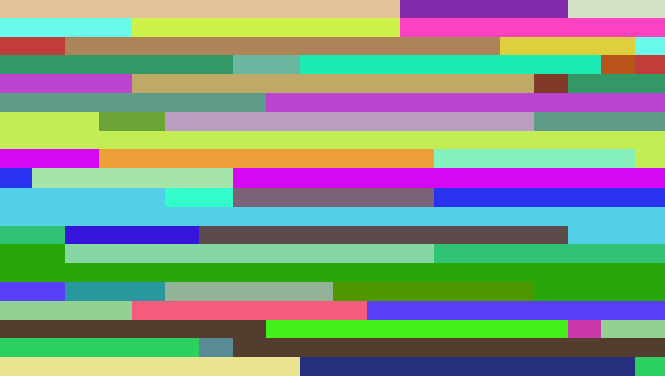
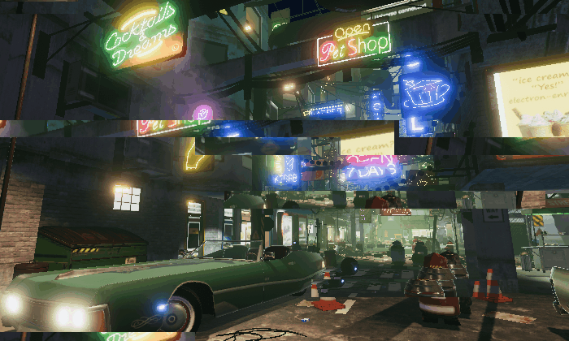
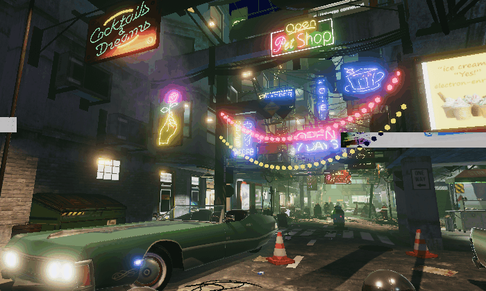

# 故障艺术


## RGB颜色分离故障（RGB Split Glitch）

#### Common

```c++
#define IDENSITY (0.091)
#define PATTERRN (2)
#define AMPLITUDE (3.0)

float randomNoise(float x, float y)
{
	return fract(sin(dot(vec2(x, y), vec2(12.9898, 78.233))) * 43758.5453);
}
```

#### Image

```c++
float getSplitAmount()
{
    #if PATTERRN > 1
        float splitA = (1. + sin(iTime * 6.)) * 0.5;
        splitA *= 1.0 + sin(iTime * 16.) * 0.5;
        splitA *= 1.0 + sin(iTime * 19.) * 0.5;
        splitA *= 1.0 + sin(iTime * 27.) * 0.5;
        splitA = pow(splitA, AMPLITUDE);
        splitA *= (0.05 * IDENSITY);
        return splitA;
    #else
        return IDENSITY * randomNoise(iTime, 2.);
    #endif
    
}

vec3 Frag_Horizontal(vec2 uv)
{
    float splitamout = getSplitAmount();
    vec3 col;
    
    col.r = texture(iChannel0, uv + vec2(splitamout, 0.0)).r + splitamout;
    col.g = texture(iChannel0, uv + vec2(0.0, 0.0)).g;
    col.b = texture(iChannel0, uv - vec2(splitamout, 0.0)).b + splitamout;
    
    return col;
}

vec3 Frag_Vertical(vec2 uv)
{
    float splitamout = getSplitAmount();
    vec3 col;
    
    col.r = texture(iChannel0, uv + vec2(0.0, splitamout)).r;
    col.g = texture(iChannel0, uv + vec2(0.0, 0.0)).g;
    col.b = texture(iChannel0, uv - vec2(0.0, splitamout)).b;
    
    return col;
}

vec3 Frag_Horizontal_Vertical(vec2 uv)
{
    float splitamout = getSplitAmount();
    vec3 col;
    
    col.r = texture(iChannel0, uv + vec2(splitamout, splitamout)).r;
    col.g = texture(iChannel0, uv + vec2(0.0, 0.0)).g;
    col.b = texture(iChannel0, uv - vec2(splitamout, splitamout)).b;
    
    return col;
}

void mainImage( out vec4 fragColor, in vec2 fragCoord )
{
    // Normalized pixel coordinates (from 0 to 1)
    vec2 uv = fragCoord/iResolution.xy;

    // Time varying pixel color
    vec3 col = Frag_Horizontal(uv);

    // Output to screen
    fragColor = vec4(col,1.0);
}
```

#### 结果


## 错位图块故障（Image Block Glitch）

### 基础版本的错位图块故障（Image Block Glitch）

#### Common

```c++
#define BLOCK_SIZE (10.0)
#define SPEED (10.1)
```

#### Image

```c++
float randomNoise(vec2 seed)
{
    return fract(sin(dot(seed * floor(iTime * SPEED), vec2(17.13, 3.71))) * 43758.5453123);
}


float hash11(float p)
{
    p = fract(p * .1031);
    p *= p + 33.33;
    p *= p + p;
    return fract(p);
}

vec3 ImageBlockGlitch_BASE(vec2 uv)
{
    vec2 block = vec2(randomNoise(floor(uv * vec2(BLOCK_SIZE))));
    float dis = pow(block.x, 8.) * pow(block.x, 3.);
    vec3 col;
    
    col.r = texture(iChannel0, uv).r;
    col.g = texture(iChannel0, uv + vec2(dis * 0.05 * hash11(block.y + iTime), 0.0)).g;
    col.b = texture(iChannel0, uv - vec2(dis * 0.05 * hash11(block.y + iTime), 0.0)).b;
    
    return col;
}

void mainImage( out vec4 fragColor, in vec2 fragCoord )
{
    // Normalized pixel coordinates (from 0 to 1)
    vec2 uv = fragCoord/iResolution.xy;

    // Time varying pixel color
    vec3 col = ImageBlockGlitch_BASE(uv);

    // Output to screen
    fragColor = vec4(col,1.0);
}
```

#### 结果


### 结合RGB Split的错位图块故障（Image Block Glitch）

#### Common

```c++
#define BLOCK_SIZE (10.0)
#define SPEED (12.1)

#define _MaxRGBSplitX (2.)
#define _MaxRGBSplitY (2.)
```

#### Image

```c++
float randomNoise(vec2 seed)
{
    return fract(sin(dot(seed * floor(iTime * SPEED), vec2(17.13, 3.71))) * 43758.5453123);
}


float randomNoise(float seed)
{
	return randomNoise(vec2(seed, 1.0));
}

vec3 ImageBlockGlitch_RGB(vec2 uv)
{
    vec2 block = vec2(randomNoise(floor(uv * vec2(BLOCK_SIZE))));
    float displaceNoise = pow(block.x, 8.0) * pow(block.x, 3.0);
	float splitRGBNoise = pow(randomNoise(7.2341), 15.0);
	float offsetX = displaceNoise - splitRGBNoise * _MaxRGBSplitX;
	float offsetY = displaceNoise - splitRGBNoise * _MaxRGBSplitY;

	float noiseX = 0.05 * randomNoise(13.0);
	float noiseY = 0.05 * randomNoise(7.0);
	vec2 offset = vec2(offsetX * noiseX, offsetY * noiseY);
    vec3 col;
    
    col.r = texture(iChannel0, uv).r;
    col.g = texture(iChannel0, uv + offset).g;
    col.b = texture(iChannel0, uv - offset).b;
    
    return col;
}

void mainImage( out vec4 fragColor, in vec2 fragCoord )
{
    // Normalized pixel coordinates (from 0 to 1)
    vec2 uv = fragCoord/iResolution.xy;

    // Time varying pixel color
    vec3 col = ImageBlockGlitch_RGB(uv);

    // Output to screen
    fragColor = vec4(col,1.0);
}
```

#### 结果


### 进阶版的错位图块故障（Image Block Glitch）

#### Common

```c++
#define SPEED (10.1)
#define _Fade (1.)
#define _Offset (10.)


#define _BlockLayer1_U (5.)
#define _BlockLayer1_V (9.5)

#define _BlockLayer2_U (15.)
#define _BlockLayer2_V (15.)

#define _BlockLayer1_Indensity (6.)
#define _BlockLayer2_Indensity (4.)

#define _RGBSplit_Indensity (4.)
```

#### Image

```c++
float randomNoise(vec2 seed)
{
    return fract(sin(dot(seed * floor(iTime * SPEED), vec2(127.13, 311.71))) * 43758.5453123);
}


float randomNoise(float seed)
{
	return randomNoise(vec2(seed, 1.0));
}

vec4 ImageBlockGlitch_HIGH(vec2 uv)
{
    vec2 blockLayer1 = floor(uv * vec2(_BlockLayer1_U, _BlockLayer1_V));
    vec2 blockLayer2 = floor(uv * vec2(_BlockLayer2_U, _BlockLayer2_V));
    //return vec4(blockLayer1, blockLayer2);
    
    float lineNoise1 = pow(randomNoise(blockLayer1), _BlockLayer1_Indensity);
    float lineNoise2 = pow(randomNoise(blockLayer2), _BlockLayer2_Indensity);
    float RGBSplitNoise = pow(randomNoise(5.1379), 7.1) * _RGBSplit_Indensity;
    float lineNoise = lineNoise1 * lineNoise2 * _Offset - RGBSplitNoise;
    //return vec4(lineNoise);
    
    vec4 colR = texture(iChannel0, uv);
    vec4 colG = texture(iChannel0, uv + vec2(lineNoise * 0.05 * randomNoise(7.), 0.));
    vec4 colB = texture(iChannel0, uv - vec2(lineNoise * 0.05 * randomNoise(23.), 0.));
    
    vec4 re = vec4(vec3(colR.x, colG.y, colB.z), colR.a + colG.a + colB.a);
    re = mix(colR, re, _Fade);
    return re;
}

void mainImage( out vec4 fragColor, in vec2 fragCoord )
{
    // Normalized pixel coordinates (from 0 to 1)
    vec2 uv = fragCoord/iResolution.xy;

    // Time varying pixel color
    vec4 col = ImageBlockGlitch_HIGH(uv);

    // Output to screen
    fragColor = col;
}
```

#### 结果


## 错位线条故障（Line Block Glitch）

#### Common

```c++
#define _LinesWidth (0.8) //越小越宽
#define _Amount (0.3) //控制线条数量，1就无了
#define _Offset (0.9) //控制线条的强度
#define _Alpha (0.9) //混合比例

float randomNoise(vec2 seed)
{
    return fract(sin(dot(seed, vec2(1.9898, 7.233))) * 43758.5453123);
}

float trunc(float x, float num_levels)
{
    return floor(x * num_levels) / num_levels;
}

vec2 trunc(vec2 x, vec2 num_levels)
{
    return floor(x * num_levels) / num_levels;
}

vec3 rgb2yuv(vec3 rgb)
{
    vec3 yuv;
    yuv.x = dot(rgb, vec3(0.299, 0.587, 0.114));
    yuv.y = dot(rgb, vec3(-0.14713, -0.28886, 0.436));
    yuv.z = dot(rgb, vec3(0.615, -0.51499, -0.10001));
    return yuv;
}
	
vec3 yuv2rgb(vec3 yuv)
{
    vec3 rgb;
    rgb.r = yuv.x + yuv.z * 1.13983;
    rgb.g = yuv.x + dot(vec2(-0.39465, -0.58060), yuv.yz);
    rgb.b = yuv.x + yuv.y * 2.03211;
    return rgb;
}
```

#### Image

```c++
vec3 LineBlockGlitch(vec2 uv)
{
    float truncTime = trunc(iTime, 4.0);
    float uv_trunc = randomNoise(trunc(uv.yy, vec2(8., 8.)) + vec2(100.0 * truncTime));
    //return vec3(uv_trunc); ------------------------------1
    
    float uv_randomTrunc = 6. * trunc(iTime, 24. * uv_trunc);
    //return vec3(uv_randomTrunc); ------------------------2
    
    float blockLine_random = 0.5 * randomNoise(trunc(uv.yy + uv_randomTrunc, vec2(8. * _LinesWidth, 8. * _LinesWidth)));
    blockLine_random += 0.5 * randomNoise(trunc(uv.yy + uv_randomTrunc, vec2(7., 7.)));
    blockLine_random = blockLine_random * 2.0 - 1.0;	
    blockLine_random = sign(blockLine_random) * clamp((abs(blockLine_random) - _Amount) / (0.4), 0., 1.);
    blockLine_random = mix(0., blockLine_random, _Offset);
    //return vec3(blockLine_random);-----------------------3
    
    vec2 uv_blockLine = uv;
    uv_blockLine = clamp(uv_blockLine + vec2(0.1 * blockLine_random, 0.), 0., 1.);
    
    vec3 col = texture(iChannel0, abs(uv_blockLine)).xyz;
    //return col; -----------------------------------------4
    
    col = rgb2yuv(col);
    col.y /= 2. - 3. * abs(blockLine_random) * clamp(0.5 -  blockLine_random, 0., 1.); //Chrominance
    col.z += 3.25 *  blockLine_random * clamp( blockLine_random - .5, 0., 1.);  //Chroma
    col = yuv2rgb(col);
    col = pow(col, vec3(1. / 2.2));
    
    vec3 ori_col = texture(iChannel0, uv).xyz;
    return mix(ori_col, col, vec3(_Alpha));
    
}

void mainImage( out vec4 fragColor, in vec2 fragCoord )
{
    // Normalized pixel coordinates (from 0 to 1)
    vec2 uv = fragCoord/iResolution.xy;

    // Time varying pixel color
    vec3 col = LineBlockGlitch(uv);

    // Output to screen
    fragColor = vec4(col,1.0);
}
```

#### 结果


## 图块抖动故障（Tile Jitter Glitch）

#### Common

```c++
#define IS_DYMIC 0
#define IS_HOR 1
#define SPLIT_DIR 1
#define _Frequency (30.)
#define _SplittingNumber (8.)
#define _JitterSpeed (25.4)
#define _JitterAmount (67.)
#define pixelSizeX (1. / iResolution.x)
```

#### Image

```c++
vec3 TileJitterGlitch(vec2 uv)
{
    float str;
    #if IS_DYMIC
        str = 1.;
    #else
        str = 0.5 + 0.5 * cos(iTime * _Frequency);
    #endif
    
    float dir;
    #if SPLIT_DIR
        dir = mod(uv.y * _SplittingNumber, 2.);
    #else
        dir = mod(uv.x * _SplittingNumber, 2.);
    #endif
    
    if(dir < 1.)
    {
        #if IS_HOR
            uv.x += pixelSizeX * cos(iTime * _JitterSpeed) * _JitterAmount * str;
        #else
            uv.y += pixelSizeX * cos(iTime * _JitterSpeed) * _JitterAmount * str;
        #endif
    }
    return texture(iChannel0, uv).xyz;
}

void mainImage( out vec4 fragColor, in vec2 fragCoord )
{
    // Normalized pixel coordinates (from 0 to 1)
    vec2 uv = fragCoord/iResolution.xy;

    // Time varying pixel color
    vec3 col = TileJitterGlitch(uv);

    // Output to screen
    fragColor = vec4(col,1.0);
}
```

#### 结果


## 扫描线抖动故障（Scan Line Jitter Glitch）

### Common

```
#define _DIR 0  //方向
#define _ScanLineJitter_Y (sin(iTime))  //效果程度
#define _ScanLineJitter_X (1. / iResolution.x * 10.)  //偏移程度
```

### Image

```c++
float randomNoise(float x, float y)
{
	return fract(sin(dot(vec2(x, y), vec2(12.9898, 78.233))) * 43758.5453);
}

vec3 ScanLineJitter(vec2 uv)
{
    #if _DIR
        float jitter = randomNoise(uv.x, iTime) * 2. - 1.;
    #else
        float jitter = randomNoise(uv.y, iTime) * 2. - 1.;
    #endif
    
    jitter *= step(_ScanLineJitter_Y, abs(jitter)) * _ScanLineJitter_X;
    
    vec3 col = texture(iChannel0, fract(uv + vec2(jitter, 0))).xyz;
    return col;
}


void mainImage( out vec4 fragColor, in vec2 fragCoord )
{
    // Normalized pixel coordinates (from 0 to 1)
    vec2 uv = fragCoord/iResolution.xy;

    // Time varying pixel color
    vec3 col = ScanLineJitter(uv);

    // Output to screen
    fragColor = vec4(col,1.0);
}
```

### 结果


## 数字条纹故障（Digital Stripe Glitch）

数字条纹故障（Digital Stripe Glitch）同样是出镜率较高的Glitch系后处理特效之一。例如在《赛博朋克2077》的gameplay中，就可以到它的身影：


图 《赛博朋克2077》中的数字条纹故障（Digital Stripe Glitch）特效 @ CD Projekt

数字条纹故障（Digital Stripe Glitch）需在Runtime层完成noise Texture的生成，然后传入GPU中进行最终的运算和渲染呈现。

Runtime的核心思路为基于随机数进行随机颜色条纹贴图的生成，实现代码如下：

    for (int y = 0; y < _noiseTexture.height; y++)
    {
        for (int x = 0; x < _noiseTexture.width; x++)
        {
            //随机值若大于给定strip随机阈值，重新随机颜色
            if (UnityEngine.Random.value > stripLength)
            {
                color = XPostProcessingUtility.RandomColor();
            }
            //设置贴图像素值
            _noiseTexture.SetPixel(x, y, color);
        }
    }


生成的图片如下：



Shader层面的实现则分为两个主要部分，分别是uv偏移，以及可选的基于废弃帧的插值不足：

	half4 Frag(VaryingsDefault i): SV_Target
	{
		// 基础数据准备
		 half4 stripNoise = SAMPLE_TEXTURE2D(_NoiseTex, sampler_NoiseTex, i.texcoord);
		 half threshold = 1.001 - _Indensity * 1.001;
	
		// uv偏移
		half uvShift = step(threshold, pow(abs(stripNoise.x), 3));
		float2 uv = frac(i.texcoord + stripNoise.yz * uvShift);
		half4 source = SAMPLE_TEXTURE2D(_MainTex, sampler_MainTex, uv);
	
	    #ifndef NEED_TRASH_FRAME
		    return source;
	    #endif 	
	
		// 基于废弃帧插值
		half stripIndensity = step(threshold, pow(abs(stripNoise.w), 3)) * _StripColorAdjustIndensity;
		half3 color = lerp(source, _StripColorAdjustColor, stripIndensity).rgb;
		return float4(color, source.a);
	}


得到的不进行废弃帧插值的渲染表现如下：



进行废弃帧插值的渲染表现如下。除了下图中采用的类似反色的偏移颜色，也可以实现出基于RGB颜色随机，或者进行颜色空间转换后的色度校正后的偏移颜色：



数字条纹故障（Digital Stripe Glitch）后处理完整的实现源码可见：

<https://github.com/QianMo/X-PostProcessing-Library/tree/master/Assets/X-PostProcessing/Effects/GlitchDigitalStripe>


## 模拟噪点故障（Analog Noise Glitch）

### Common

```c++
#define _Speed (0.1)
#define _LuminanceJitterThreshold (0.5)
#define _Fading (0.7)

vec2 Speed()
{
    return vec2(_Speed, _Speed);
}
```

### Image

```c++
float randomNoise(vec2 c)
{
    return fract(sin(dot(c.xy, vec2(12.9898, 78.233))) * 43758.5453);
}

vec2 iTimeV2()
{
    return vec2(iTime, iTime);
}


vec3 AnalogNoiseGlitch(vec2 uv)
{
    float noiseX = randomNoise(iTimeV2() * Speed() + uv);
    float noiseY = randomNoise(iTimeV2() * Speed() - uv);
    float noiseZ = randomNoise(iTimeV2() * Speed() + uv);
    
    vec3 col = texture(iChannel0, uv).xyz;
    vec3 noise_col = col;
    
    float luminance = dot(noise_col, vec3(0.22, 0.707, 0.071));
    
    if(randomNoise(vec2(iTime * _Speed, iTime * _Speed)) > _LuminanceJitterThreshold)
    {
        noise_col = vec3(luminance, luminance, luminance);
    }
    
    
    noise_col += 0.25 * vec3(noiseX, noiseY, noiseZ) - 0.125;
    
    noise_col = mix(col, noise_col, _Fading);
    return noise_col;
}

void mainImage( out vec4 fragColor, in vec2 fragCoord )
{
    // Normalized pixel coordinates (from 0 to 1)
    vec2 uv = fragCoord/iResolution.xy;

    // Time varying pixel color
    vec3 col = AnalogNoiseGlitch(uv);  
    
    // Output to screen
    fragColor = vec4(col,1.0);
}
```

### 结果


## 屏幕跳跃故障（Screen Jump Glitch）

### Common

```c++
#define _DIR 1
#define _JumpIndensity (0.2)
#define _JumpTime (10. * iTime)
```

### Image

```c++
vec3 ScreenJumpGlitch(vec2 uv)
{
    #if _DIR
        float jump = mix(uv.y, fract(uv.y + _JumpTime), _JumpIndensity);
        vec3 col = texture(iChannel0, fract(vec2(uv.x, jump))).xyz;
    #else
        float jump = mix(uv.x, fract(uv.x + _JumpTime), _JumpIndensity);
        vec3 col = texture(iChannel0, fract(vec2(jump, uv.y))).xyz;
    #endif
    return col;
}

void mainImage( out vec4 fragColor, in vec2 fragCoord )
{
    // Normalized pixel coordinates (from 0 to 1)
    vec2 uv = fragCoord/iResolution.xy;

    // Time varying pixel color
    vec3 col = ScreenJumpGlitch(uv);  
    
    // Output to screen
    fragColor = vec4(col,1.0);
}
```

### 结果


## 屏幕抖动故障（Screen Shake Glitch）

### Common

```c++
#define _DIR 1
#define _ScreenShake (0.2)
```

### Image

```c++
float randomNoise(float x, float y)
{
	return fract(sin(dot(vec2(x, y), vec2(12.9898, 78.233))) * 43758.5453);
}

vec3 ScreenShakeGlitch(vec2 uv)
{
    float shake = (randomNoise(iTime, 2.) - 0.5) * _ScreenShake;
    #if _DIR  
        vec3 col = texture(iChannel0, fract(vec2(uv.x, uv.y + shake))).xyz;
    #else
        vec3 col = texture(iChannel0, fract(vec2(uv.x + shake, uv.y))).xyz;
    #endif
    return col;
}

void mainImage( out vec4 fragColor, in vec2 fragCoord )
{
    // Normalized pixel coordinates (from 0 to 1)
    vec2 uv = fragCoord/iResolution.xy;

    // Time varying pixel color
    vec3 col = ScreenShakeGlitch(uv);  
    
    // Output to screen
    fragColor = vec4(col,1.0);
}
```

### 结果


## 波动抖动故障（Wave Jitter Glitch）

###  噪声生成函数库 XNoiseLibrary

对此，XPL参考了[paper《Simplex noise demystified 》](http://www.itn.liu.se/\~stegu/simplexnoise/simplexnoise.pdf)、[webgl-noise库](https://github.com/ashima/webgl-noise)和[NoiseShader库](https://github.com/keijiro/NoiseShader)，实现一个单文件版的多维度噪声生成库 **[[XNoiseLibrary](https://github.com/QianMo/X-PostProcessing-Library/blob/master/Assets/X-PostProcessing/Shaders/XNoiseLibrary.hlsl)]**。

XNoiseLibrary具有如下三种类型的Noise噪声生成函数：

-   2D/3D/4D Simplex Noise

-   2D/3D textureless classic Noise

-   Re-oriented 4 / 8-Point BCC Noise

XNoiseLibrary的优势在于使用较为方便，直接include单个文件XNoiseLibrary.hlsl即可进行其中封装的多版本噪声函数的调用。

XNoiseLibrary的实现源码可见：

<https://github.com/QianMo/X-PostProcessing-Library/blob/master/Assets/X-PostProcessing/Shaders/XNoiseLibrary.hlsl>

<br>

### 波动抖动故障（Wave Jitter Glitch）的实现算法

#### Common

```c++
#define _DIR 1
#define _Speed (0.2)
#define strength (2. * cos(iTime))
#define _Amount (2. * sin(iTime))

#define NOISE_SIMPLEX_1_DIV_289 0.00346020761245674740484429065744

vec2 mod289(vec2 x)
{
	return x - floor(x * NOISE_SIMPLEX_1_DIV_289) * 289.0;
}

vec3 mod289(vec3 x)
{
	return x - floor(x * NOISE_SIMPLEX_1_DIV_289) * 289.0;
}

vec3 permute(vec3 x)
{
	return mod289(x * x * 34.0 + x);
}

vec3 taylorInvSqrt(vec3 r)
{
	return 1.79284291400159 - 0.85373472095314 * r;
}

float snoise(vec2 v)
{
	const vec4 C = vec4(0.211324865405187, // (3.0-sqrt(3.0))/6.0
	0.366025403784439, // 0.5*(sqrt(3.0)-1.0)
	- 0.577350269189626, // -1.0 + 2.0 * C.x
	0.024390243902439); // 1.0 / 41.0
	// First corner
	vec2 i = floor(v + dot(v, C.yy));
	vec2 x0 = v - i + dot(i, C.xx);
	
	// Other corners
	vec2 i1;
	i1.x = step(x0.y, x0.x);
	i1.y = 1.0 - i1.x;
	
	// x1 = x0 - i1  + 1.0 * C.xx;
	// x2 = x0 - 1.0 + 2.0 * C.xx;
	vec2 x1 = x0 + C.xx - i1;
	vec2 x2 = x0 + C.zz;
	
	// Permutations
	i = mod289(i); // Avoid truncation effects in permutation
	vec3 p = permute(permute(i.y + vec3(0.0, i1.y, 1.0)) 
    + i.x + vec3(0.0, i1.x, 1.0));
	
	vec3 m = max(0.5 - vec3(dot(x0, x0), dot(x1, x1), dot(x2, x2)), 0.0);
	m = m * m;
	m = m * m;
	
	// Gradients: 41 points uniformly over a line, mapped onto a diamond.
	// The ring size 17*17 = 289 is close to a multiple of 41 (41*7 = 287)
	vec3 x = 2.0 * fract(p * C.www) - 1.0;
	vec3 h = abs(x) - 0.5;
	vec3 ox = floor(x + 0.5);
	vec3 a0 = x - ox;
	
	// Normalise gradients implicitly by scaling m
	m *= taylorInvSqrt(a0 * a0 + h * h);
	
	// Compute final noise value at P
	vec3 g;
	g.x = a0.x * x0.x + h.x * x0.y;
	g.y = a0.y * x1.x + h.y * x1.y;
	g.z = a0.z * x2.x + h.z * x2.y;
	return 130.0 * dot(m, g);
}

```

#### Image

```
vec3 WaveJitterGlitch(vec2 uv)
{
    float uv_y = uv.y * iResolution.y;
    float noise_wave_1 = snoise(vec2(uv_y * 0.01, iTime * _Speed * 20.))
    * (strength * _Amount * 32.);
    float noise_wave_2 = snoise(vec2(uv_y * 0.02, iTime * _Speed * 10.))
    * (strength * _Amount * 4.);
    float noise_wave_x = noise_wave_1 / iResolution.x;
    float uv_x = uv.x + noise_wave_x;
    vec3 col = texture(iChannel0, vec2(uv_x, uv.y)).xyz;
    return col;
    
}

void mainImage( out vec4 fragColor, in vec2 fragCoord )
{
    // Normalized pixel coordinates (from 0 to 1)
    vec2 uv = fragCoord/iResolution.xy;

    // Time varying pixel color
    vec3 col = WaveJitterGlitch(uv);  
    
    // Output to screen
    fragColor = vec4(col,1.0);
}
```

#### 结果


# 总结


故障艺术追求“故障”带来的独特美感。近年来，故障艺术已经成为了赛博朋克风格电影和游戏作品中的核心艺术风格之一。而随着各种相关影视作品和游戏作品的不断发布，故障艺术的表现风格也引起了电商、综艺、快消等行业的广泛效仿。

在看完上述十种不同的故障艺术算法后，我们可以提炼一下，若要在屏幕空间实现故障艺术风格的渲染表现，算法核心在于四点：

-   **噪声函数的选择**：噪声函数是生成各式的干扰信号的源头。

-   **uv抖动方式的选择**：将噪声函数作用于屏幕空间uv后，基于新的uv进行采样，以产生故障的抖动表现。

-   **采样通道的选择**：对RGB分别采样，或者选取特定通道进行采样，以实现多种风格的故障表现。

-   **颜色空间的转换**：善用YUV、CMY、HSV、YIQ、YCbCr
    、YC1C2等空间与RGB空间之间的转换，以实现多种风格的故障表现。

熟知上述四种故障艺术的算法要点，加上一点创意，配合周边算法，则可以创造出更多富有表现力的故障艺术特效。


<br>

# Reference


[1] Jackson R. The Glitch Aesthetic[J]. 2011.
https://scholarworks.gsu.edu/cgi/viewcontent.cgi?article=1081&context=communication_theses

[2] den Heijer E. Evolving glitch art[C]//International Conference on
Evolutionary and Biologically Inspired Music and Art. Springer, Berlin,
Heidelberg, 2013: 109-120.

[3] https://zh.wikipedia.org/wiki/%E8%B5%9B%E5%8D%9A%E6%9C%8B%E5%85%8B

[4] https://github.com/keijiro/KinoGlitch

[5] https://github.com/ashima/webgl-noise

[6] https://github.com/keijiro/NoiseShader

[7] https://wallpaperswise.com/new-20-blade-runner-wallpapers/

[8] http://www.itn.liu.se/\~stegu/simplexnoise/simplexnoise.pdf

[9] 题图来自《Cyberpunk 2077》