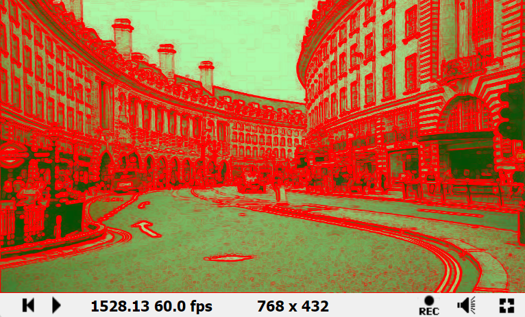
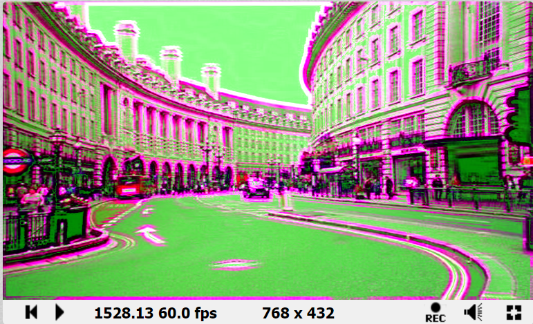
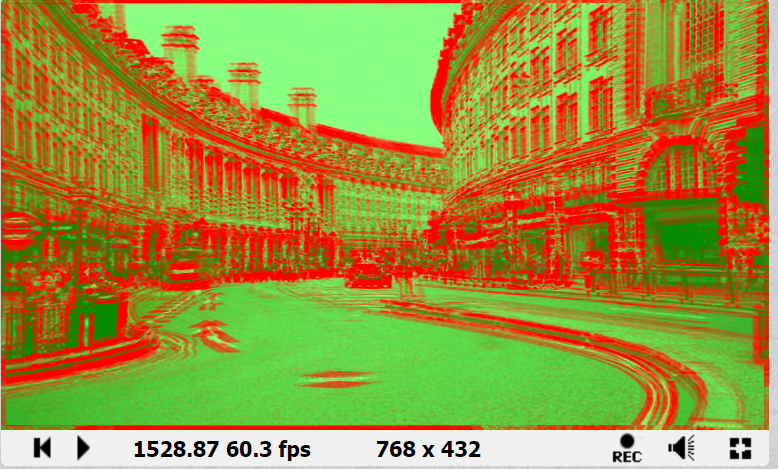
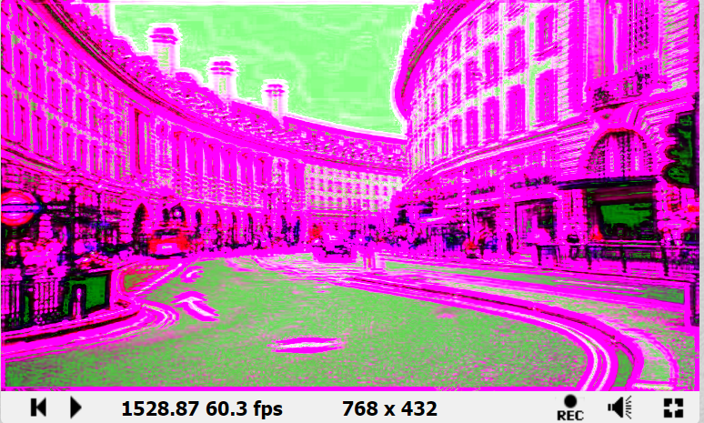

# 边缘检测

## Edge Detection Sobel

### Common

```c++
#define _EdgeColor vec4(1., 0., 0., 1.)
#define _BackgroundColor vec4(0., 1., 0., 1.)
#define _EdgeWidth (1.)
#define _BackgroundFade (0.3)

float intensity(in vec4 color)
{
    return sqrt((color.x * color.x) + (color.y * color.y) + (color.z * color.z));
}
```

### Image

```c++
float sobel(float stepx, float stepy, vec2 center)
{
    // get samples around pixel
    float topLeft = intensity(texture(iChannel0, center + vec2(-stepx, stepy)));
    float midLeft = intensity(texture(iChannel0, center + vec2(-stepx, 0)));
    float bottomLeft = intensity(texture(iChannel0, center + vec2(-stepx, -stepy)));
    float midTop = intensity(texture(iChannel0, center + vec2(0, stepy)));
    float midBottom = intensity(texture(iChannel0, center + vec2(0, -stepy)));
    float topRight = intensity(texture(iChannel0, center + vec2(stepx, stepy)));
    float midRight = intensity(texture(iChannel0, center + vec2(stepx, 0)));
    float bottomRight = intensity(texture(iChannel0, center + vec2(stepx, -stepy)));

    // Sobel masks (see http://en.wikipedia.org/wiki/Sobel_operator)
    //        1 0 -1     -1 -2 -1
    //    X = 2 0 -2  Y = 0  0  0
    //        1 0 -1      1  2  1

    // Gx = sum(kernelX[i][j]*image[i][j])
    float Gx = topLeft + 2.0 * midLeft + bottomLeft - topRight - 2.0 * midRight - bottomRight;
    // Gy = sum(kernelY[i][j]*image[i][j]);
    float Gy = -topLeft - 2.0 * midTop - topRight + bottomLeft + 2.0 * midBottom + bottomRight;
    float sobelGradient = sqrt((Gx * Gx) + (Gy * Gy));
    return sobelGradient;
}


vec3 EdgeDetectionSobel(vec2 uv)
{
    vec4 col = texture(iChannel0, uv);
    float sobelGradient = sobel(_EdgeWidth / iResolution.x, _EdgeWidth / iResolution.y, uv);
    vec4 back_col = mix(col, _BackgroundColor, _BackgroundFade);
    vec3 edge_col = mix(back_col.rgb, _EdgeColor.rgb, sobelGradient);
    return edge_col;
    
}

void mainImage( out vec4 fragColor, in vec2 fragCoord )
{
    // Normalized pixel coordinates (from 0 to 1)
    vec2 uv = fragCoord/iResolution.xy;

    // Time varying pixel color
    vec3 col = EdgeDetectionSobel(uv);

    // Output to screen
    fragColor = vec4(col,1.0);
}
```

### 结果




## Edge Detection Sobel Neon

### Common

```c
#define _EdgeColor vec4(1., 0., 0., 1.)
#define _BackgroundColor vec4(0., 1., 0., 1.)
#define _EdgeWidth (5.)
#define _BackgroundFade (0.5)
#define _Brigtness (1.1)

float intensity(in vec4 color)
{
    return sqrt((color.x * color.x) + (color.y * color.y) + (color.z * color.z));
}
```

### Image

```c++
float sobel(float stepx, float stepy, vec2 center)
{
    // get samples around pixel
    float topLeft = intensity(texture(iChannel0, center + vec2(-stepx, stepy)));
    float midLeft = intensity(texture(iChannel0, center + vec2(-stepx, 0)));
    float bottomLeft = intensity(texture(iChannel0, center + vec2(-stepx, -stepy)));
    float midTop = intensity(texture(iChannel0, center + vec2(0, stepy)));
    float midBottom = intensity(texture(iChannel0, center + vec2(0, -stepy)));
    float topRight = intensity(texture(iChannel0, center + vec2(stepx, stepy)));
    float midRight = intensity(texture(iChannel0, center + vec2(stepx, 0)));
    float bottomRight = intensity(texture(iChannel0, center + vec2(stepx, -stepy)));

    // Sobel masks (see http://en.wikipedia.org/wiki/Sobel_operator)
    //        1 0 -1     -1 -2 -1
    //    X = 2 0 -2  Y = 0  0  0
    //        1 0 -1      1  2  1

    // Gx = sum(kernelX[i][j]*image[i][j])
    float Gx = topLeft + 2.0 * midLeft + bottomLeft - topRight - 2.0 * midRight - bottomRight;
    // Gy = sum(kernelY[i][j]*image[i][j]);
    float Gy = -topLeft - 2.0 * midTop - topRight + bottomLeft + 2.0 * midBottom + bottomRight;
    float sobelGradient = sqrt((Gx * Gx) + (Gy * Gy));
    return sobelGradient;
}


vec3 EdgeDetectionSobel(vec2 uv)
{
    vec4 col = texture(iChannel0, uv);
    float sobelGradient = sobel(_EdgeWidth / iResolution.x, _EdgeWidth / iResolution.y, uv);
    vec4 back_col = mix(col, _BackgroundColor, _BackgroundFade);
    vec3 edge_col = mix(back_col.rgb, col.rgb, sobelGradient);
    return edge_col * _Brigtness;
    
}

void mainImage( out vec4 fragColor, in vec2 fragCoord )
{
    // Normalized pixel coordinates (from 0 to 1)
    vec2 uv = fragCoord/iResolution.xy;

    // Time varying pixel color
    vec3 col = EdgeDetectionSobel(uv);

    // Output to screen
    fragColor = vec4(col,1.0);
}
```

### 结果




## Edge Detection Roberts

### Common

```
#define _EdgeColor vec4(1., 0., 0., 1.)
#define _BackgroundColor vec4(0., 1., 0., 1.)
#define _EdgeWidth (5.)
#define _BackgroundFade (0.5)
#define _Brigtness (1.1)

float intensity(in vec4 color)
{
    return sqrt((color.x * color.x) + (color.y * color.y) + (color.z * color.z));
}
```

### Image

```c++
float sobel(float stepx, float stepy, vec2 center)
{
    // get samples around pixel
    float topLeft = intensity(texture(iChannel0, center + vec2(-stepx, stepy)));
    float bottomLeft = intensity(texture(iChannel0, center + vec2(-stepx, -stepy)));
    float topRight = intensity(texture(iChannel0, center + vec2(stepx, stepy)));
    float bottomRight = intensity(texture(iChannel0, center + vec2(stepx, -stepy)));

    // Roberts Operator
    //X = -1   0      Y = 0  -1
    //     0   1          1   0
        
    // Gx = sum(kernelX[i][j]*image[i][j])
    float Gx = -1.0 * topLeft + 1.0 * bottomRight;

    // Gy = sum(kernelY[i][j]*image[i][j]);
    float Gy = -1.0 * topRight + 1.0 * bottomLeft;
    
    float sobelGradient = sqrt((Gx * Gx) + (Gy * Gy));
    return sobelGradient;
}


vec3 EdgeDetectionSobel(vec2 uv)
{
    vec4 col = texture(iChannel0, uv);
    float sobelGradient = sobel(_EdgeWidth / iResolution.x, _EdgeWidth / iResolution.y, uv);
    vec4 back_col = mix(col, _BackgroundColor, _BackgroundFade);
    vec3 edge_col = mix(back_col.rgb, _EdgeColor.rgb, sobelGradient);
    return edge_col * _Brigtness;
    
}

void mainImage( out vec4 fragColor, in vec2 fragCoord )
{
    // Normalized pixel coordinates (from 0 to 1)
    vec2 uv = fragCoord/iResolution.xy;

    // Time varying pixel color
    vec3 col = EdgeDetectionSobel(uv);

    // Output to screen
    fragColor = vec4(col,1.0);
}
```

### 结果




## Edge Detection Scharr

### Common

```c
#define _EdgeColor vec4(1., 0., 0., 1.)
#define _BackgroundColor vec4(0., 1., 0., 1.)
#define _EdgeWidth (5.)
#define _BackgroundFade (0.5)
#define _Brigtness (1.1)

float intensity(in vec4 color)
{
    return sqrt((color.x * color.x) + (color.y * color.y) + (color.z * color.z));
}

```

### Image

```c++
float sobel(float stepx, float stepy, vec2 center)
{
    // get samples around pixel
    float topLeft = intensity(texture(iChannel0, center + vec2(-stepx, stepy)));
    float midLeft = intensity(texture(iChannel0, center + vec2(-stepx, 0)));
    float bottomLeft = intensity(texture(iChannel0, center + vec2(-stepx, -stepy)));
    float midTop = intensity(texture(iChannel0, center + vec2(0, stepy)));
    float midBottom = intensity(texture(iChannel0, center + vec2(0, -stepy)));
    float topRight = intensity(texture(iChannel0, center + vec2(stepx, stepy)));
    float midRight = intensity(texture(iChannel0, center + vec2(stepx, 0)));
    float bottomRight = intensity(texture(iChannel0, center + vec2(stepx, -stepy)));

    // scharr masks ( http://en.wikipedia.org/wiki/Sobel_operator#Alternative_operators)
    //        3 0 -3        3 10   3
    //    X = 10 0 -10  Y = 0  0   0
    //        3 0 -3        -3 -10 -3

    // Gx = sum(kernelX[i][j]*image[i][j]);
    float Gx = 3.0* topLeft + 10.0 * midLeft + 3.0 * bottomLeft -3.0* topRight - 10.0 * midRight - 3.0* bottomRight;
    // Gy = sum(kernelY[i][j]*image[i][j]);
    float Gy = 3.0 * topLeft + 10.0 * midTop + 3.0 * topRight -3.0* bottomLeft - 10.0 * midBottom -3.0* bottomRight;

    float scharrGradient = sqrt((Gx * Gx) + (Gy * Gy));
    return scharrGradient;
}


vec3 EdgeDetectionSobel(vec2 uv)
{
    vec4 col = texture(iChannel0, uv);
    float sobelGradient = sobel(_EdgeWidth / iResolution.x, _EdgeWidth / iResolution.y, uv);
    vec4 back_col = mix(col, _BackgroundColor, _BackgroundFade);
    vec3 edge_col = mix(back_col.rgb, col.rgb, sobelGradient);
    return edge_col * _Brigtness;
    
}

void mainImage( out vec4 fragColor, in vec2 fragCoord )
{
    // Normalized pixel coordinates (from 0 to 1)
    vec2 uv = fragCoord/iResolution.xy;

    // Time varying pixel color
    vec3 col = EdgeDetectionSobel(uv);

    // Output to screen
    fragColor = vec4(col,1.0);
}
```

### 结果

