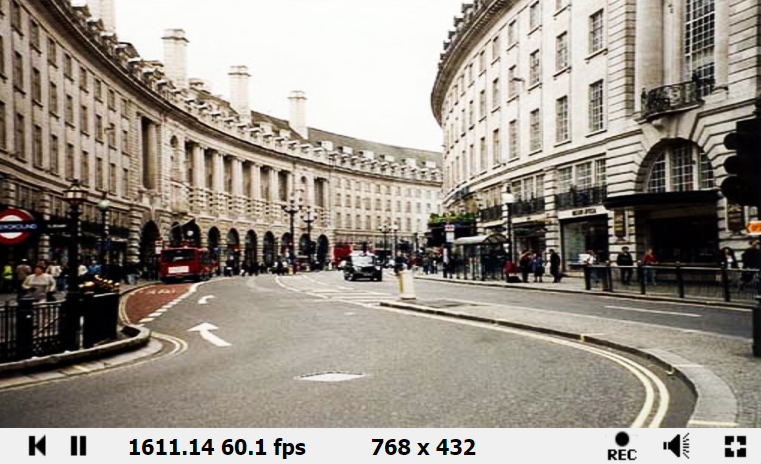

# 色彩调整

## Bleach By pass（漂白）

### Common

```c
#define _Indensity (0.9)

float luminance(vec3 col)
{
    return dot(col, vec3(0.222, 0.707, 0.071));
}
```

### Image

```c++
vec3 BleachBypass(vec2 uv)
{
    vec4 col = texture(iChannel0, uv);
    float lum = luminance(col.rgb);
    vec3 blend = vec3(lum, lum, lum);
    
    float L = min(1., max(0., 10. * (lum - 0.45)));
    vec3 result1 = 2. * col.rgb * blend;
    vec3 result2 = 1.0 - 2. * (1. - blend) * (1. - col.rgb);
    vec3 new_col = mix(result1, result2, L);
    return mix(col.rgb, new_col, _Indensity);
}

void mainImage( out vec4 fragColor, in vec2 fragCoord )
{
    // Normalized pixel coordinates (from 0 to 1)
    vec2 uv = fragCoord/iResolution.xy;

    // Time varying pixel color
    vec3 col = BleachBypass(uv);

    // Output to screen
    fragColor = vec4(col,1.0);
}
```

### 结果

