> 本文主要基于B站大佬的学习笔记，源地址：https://www.bilibili.com/read/readlist/rl220905

## 1. 打印函数UE_LOG

简单使用：

```c++
UE_LOG(LogTemp, Log, TEXT("Test"));
```

如果想要定义不同的日志类型则可以如下操作：

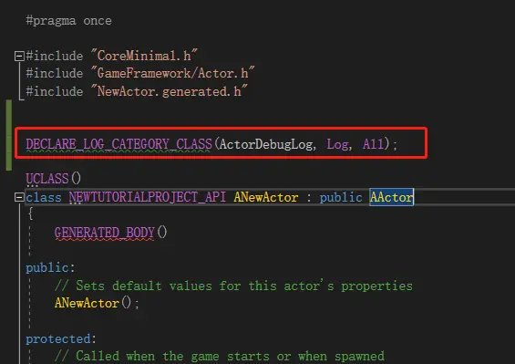

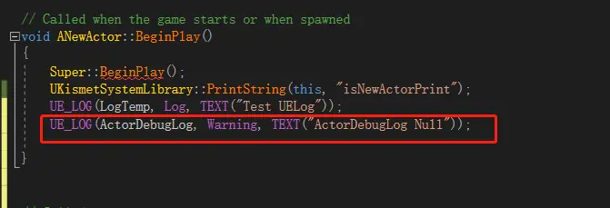

**FString**与其他的变量组合可以使用以下方法：

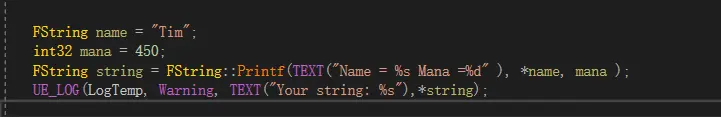


## 2. 初步使用C++类

首先，创建一个C++类选择Object：

```c
#include "GameFramework/Actor.h"
#include "MyActor.generated.h"

UCLASS()
class AMyActor : public AActor
{
    GENERATED_BODY()

public:
    // 设置该Actor属性的默认值
    AMyActor();

    // 每一帧都调用
    virtual void Tick( float DeltaSeconds ) override;

protected:
    // 游戏开始或产生时调用
    virtual void BeginPlay() override;
};
```

> 注意：头文件包含时需要注意generated.h必须是最后面包含的

来到编辑器我们右击先前创建的Object发现并不能创建基于此C++类的蓝图，回到编译器，按照如下修改，并且编译：


再回到编辑器查看，可以进行创建蓝图了：


> 可以使用==ClassViewer==窗口来进行筛选 筛选出可以进行创建蓝图处理的类。使用这样的方式在项目比较大的时候可以比较方便操作。
>
> ==ClassViewer==在窗口->开发者工具->类查看器

### 在蓝图中访问UPROPERTY


宏中的==EditAnywhere==表示可编辑，而`BlueprintReadWrite`则代表的是蓝图可以访问该变量，此时，该蓝图：


这边对于宏的定义做以下解释：

- EditAnywhere: 任何地方可以编辑。


- EditDefaultsOnly: 只能设置默认值。


- EditInstanceOnly: 实例化的时候设置，也就是在场景中的对象。


- BlueprintReadWrite: 蓝图可读写访问


- BlueprintReadOnly: 蓝图只读


- Category:  在蓝图节点搜索中的一个索引
  

### C++实例化UObject

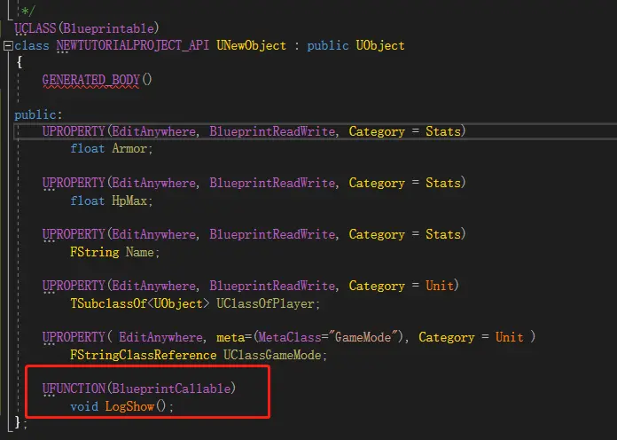

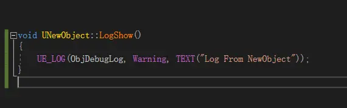

在GameMode中添加代码：

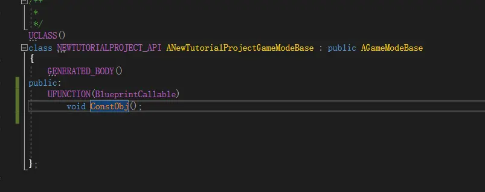

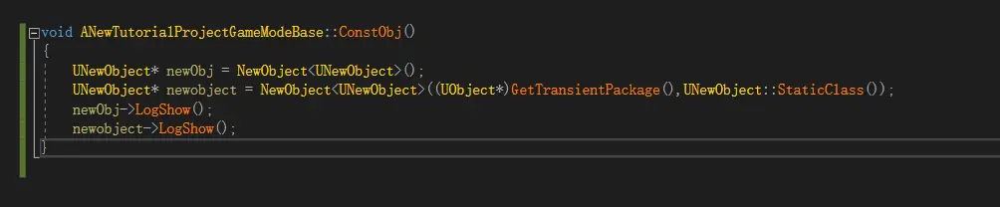

蓝图方法

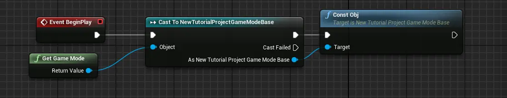

### 销毁UObject类

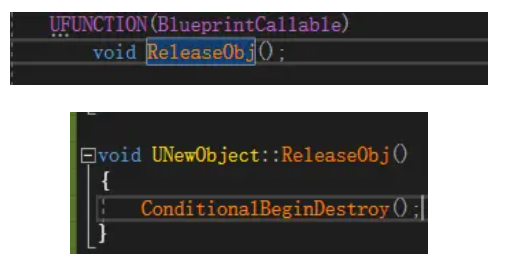

### 创建结构体

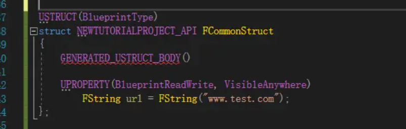

### 创建枚举

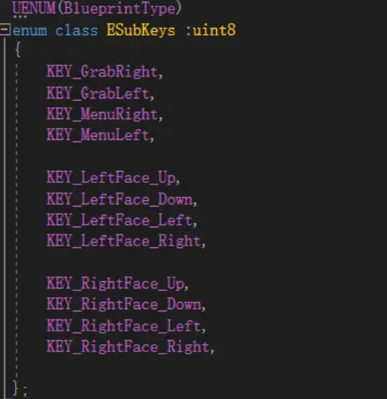


## 3. 内存管理，智能指针以及调试

### 非托管内存-malloc()/free()的使用

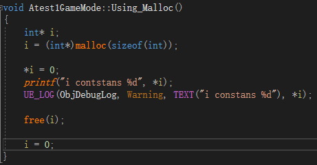

并且在关卡蓝图中调用：


可见非托管内存的申请和释放方法需要自己来处理。我们使用malloc()来申请内存，使用完毕后用free()来释放。需要特别说明的是调用free()之后，指针会断开与原来内存地址的连接，i=0 则是将指针指向一个空引用，这是为了清除掉i指针，让i指针不会去引用到任何有效内存片段。

### NewObject<>和ConstructObject<>的使用

在UE4中自动使用**托管内存**，要在引擎中使用的对象的任何分配，大部分都使用NewObject() 或SpawnActor()函数来完成

前面有提过在C++中实例化Object,这边取当时的代码：

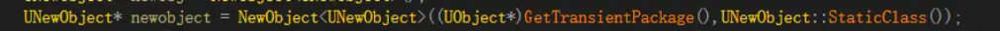

这里，UAction: : StaticClass ()为 UAction 对象获得一个基本的 UClass * 。 NewObject 的第一个参数是 GetTransientPackage () ，它只检索游戏的 transient 包。 ==UE4中的一个包(UPackage)只是一个数据集合==。 这里我们使用 Transient 包来存储**堆分配**的数据。 您还可以使用 ==Blueprints== 中的 UPROPERTY () TSubclass Of a actor 来选择 UClass 实例。

> 第三个可选参数：https://docs.unrealengine.com/latest/INT/Programming/UnrealArchitecture/Objects/Creation/index.html#objectflags

还有一个非常类似于 NewObject 的函数名为 ConstructObject。 ConstructObject 在构造中提供了更多的参数，如果需要初始化某些属性，它很有用。 否则，NewObject 就足以完成功能。

### 释放内存

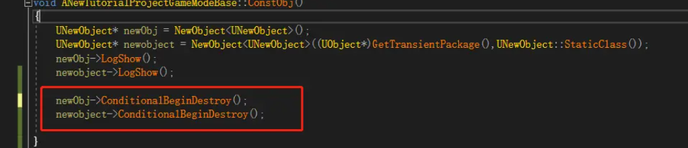


## 4. Actor和Component

### 使用`SpawnActor`来实例化`Actor`

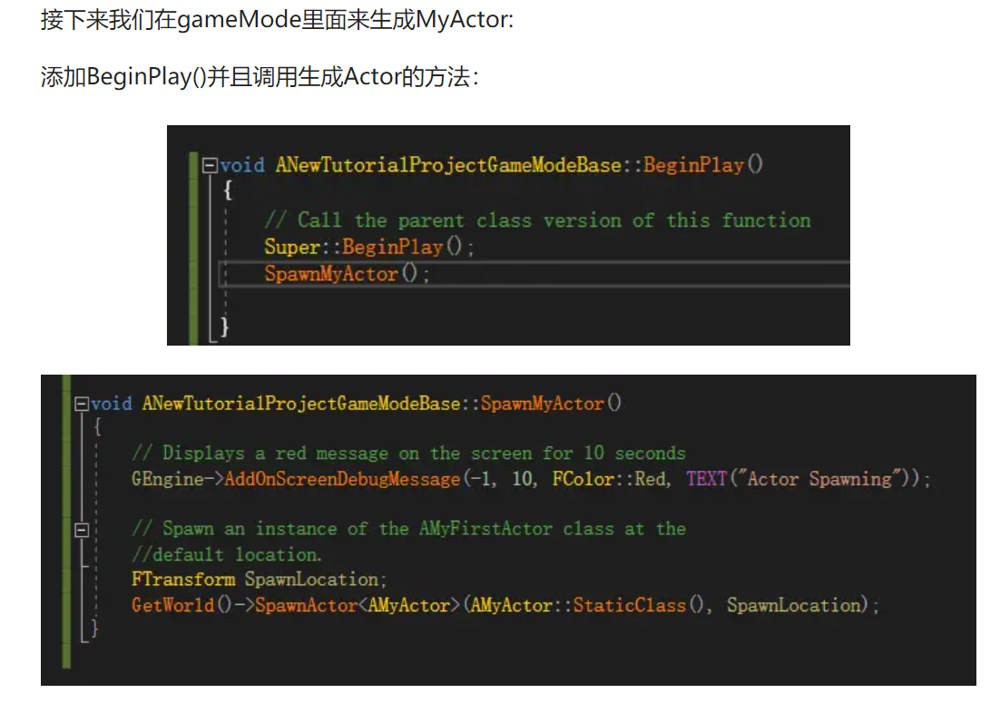

```c++
void Atest1GameMode::BeginPlay()
{
	Super::BeginPlay();
	SpawnMyActor();
}

//test1
void Atest1GameMode::SpawnMyActor()
{
	GEngine->AddOnScreenDebugMessage(-1, 10, FColor::Red, TEXT("Actor xxxxxxx"));

	FTransform SpawnLocation;
	GetWorld()->SpawnActor<AMyCharacter>(AMyCharacter::StaticClass(), SpawnLocation);
}
```

> 和之前的章节是没有联系的

### 创建一个UFUNCTION

以前面创建的`MyCharacter`为例子

添加代码：

```c++
//MyCharacter.h
UFUNCTION(BlueprintCallable,Category = "MyActor")
	void SayHello();
	
//MyCharacter.cpp
#include "Runtime/Engine/Classes/Kismet/KismetSystemLibrary.h"  
...
void AMyCharacter::SayHello()
{
	UKismetSystemLibrary::PrintString(this, "hello I am MyActor!");
}
```

`UFUNCTION ()`实际上是一个` c++ 函数`，但是有额外的**元数据**使它可以被 Blueprints 访问。 这对于允许设计人员访问程序开发人员编写的函数是非常有用的。

### 使用Destroy、SetLifeSpan和计时器来销毁Actor

==使用Destroy和计时器来销毁Actor==，添加如下代码：

```c++
//XXXGameMode.h

UPROPERTY()
	AMyCharacter* SpawnedActor;

UFUNCTION()
	void DestroyActorFunction();
	
//XXXGameMode.cpp
void Atest1GameMode::DestroyActorFunction()
{
	if (SpawnedActor)
	{
		GEngine->AddOnScreenDebugMessage(-1, 10, FColor::Red, TEXT("Actor Destroyed"));
		SpawnedActor->Destroy();
	}
}
```

修改之前的`SpawnMyActor()`如下：

```c++
void Atest1GameMode::SpawnMyActor()
{
	GEngine->AddOnScreenDebugMessage(-1, 10, FColor::Red, TEXT("Actor xxxxxxx"));


	FTransform SpawnLocation;
	SpawnedActor = GetWorld()->SpawnActor<AMyCharacter>(AMyCharacter::StaticClass(), SpawnLocation);

	FTimerHandle Timer;
	GetWorldTimerManager().SetTimer(Timer, this, &Atest1GameMode::DestroyActorFunction, 10);
}
```

==使用SetLifeSpan来使Actor在一段时间后销毁==，添加如下代码：

```c++
// Called when the game starts or when spawned
void AMyCharacter::BeginPlay()
{
	Super::BeginPlay();
	SetLifeSpan(5);
}
```

编译完成后我们拖拽一个`MyActor`进去场景中，我们会发现这个场景中的所有`MyActor` 都会在`5s`之后被销毁掉。

### 通过组件实现Actor功能

没有组件的`自定义Actor`没有位置，也不能附加到其他Actor身上。 如果没有==根组件==，则 `Actor` 没有基转换，因此没有位置。 因此，大多数参与者要求至少有一个**组件**是有用的。我们可以通过组合创建自定义的 Actors，方法是向 Actor 添加一些组件，其中每个组件提供一些所需的功能。在`MyCharacter`中添加代码：

```c++
//MyCharacter.h
UPROPERTY()
	UStaticMeshComponent* Mesh;
	
//MyCharacter.cpp
AMyCharacter::AMyCharacter()
{
 	// Set this character to call Tick() every frame.  You can turn this off to improve performance if you don't need it.
	PrimaryActorTick.bCanEverTick = true;

	Mesh = CreateDefaultSubobject<UStaticMeshComponent>("BaseMeshComponent");

}
```

编译完成后点击场景中的`MyCharacter`可以发现它具有了**旋转量**，**位置信息**等其他属性 ，这些属性来自于 `StaticMeshComponent`组件

添加到类声明中的 `UPROPERTY 宏`是一个指针，用于保存我们用作 `Actor 子对象`的组件：使用 `UPROPERTY ()宏`可以确保**在指针中声明的对象**被认为是引用的，并且不会在我们没操作时被垃圾收集（即删除） ，从而留下悬空的指针。我们使用的是 `Static Mesh` 组件，但是 Actor 组件的任何子类都可以工作。 注意，星号是按照 Epic 的样式指南连接到变量类型的。

在构造函数中，我们使用模板函数模板类 `TReturnType * CreateDefaulttSubobject (FName subjectname，bool bTransient false)`初始化指针到一个已知的有效值。

这个函数负责调用**引擎代码**来适当地初始化组件，并返回一个指向新构造的对象的指针，这样我们就可以给组件指针一个默认值。 这一点很重要，因为它确保了指针在任何时候都有一个有效值，从而最小化了未初始化内存解引用的风险。

函数是根据要创建的对象类型进行模板化的，但是也有两个参数——第一个参数是子对象的名称，理想情况下子对象应该是人类可读的，第二个参数是对象是否应该是暂时的（也就是说，不要随父对象一起保存）。

> 注意：我在实际操作时，由于生成的`MyCharacter`类，继承的是`Character`，默认自带` Static Mesh`，所以上诉操作是不必要的。

### 使用FObjectFinder读取资源、继承Actor

资源引用信息查找的方法：这边首先开启一下引擎内容的显示

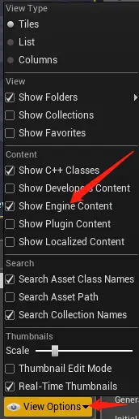

在内容浏览器找到cube：


右键菜单点击复制引用 即可复制 ` StaticMesh'/Engine/BasicShapes/Cube.Cube'
`

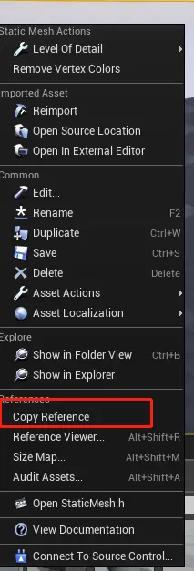

在`MyActor`中添加代码：

```c++
AMyActor::AMyActor()
{
 	// Set this actor to call Tick() every frame.  You can turn this off to improve performance if you don't need it.
	PrimaryActorTick.bCanEverTick = true;

	Mesh = CreateDefaultSubobject<UStaticMeshComponent>("BaseMeshComponent");

	auto MeshAsset = ConstructorHelpers::FObjectFinder<UStaticMesh>(TEXT("StaticMesh'/Engine/BasicShapes/Cube.Cube'"));

	if (MeshAsset.Object != nullptr) {
		Mesh->SetStaticMesh(MeshAsset.Object);
	}
}
```

我们创建 `FObjectFinder` 类的一个实例，传入我们试图**加载的资源类型**作为模板参数。`FObjectFinder`是一个帮助我们加载资源的类模板。 当我们构造它时，我们传入一个字符串，该字符串包含我们试图加载的资源的路径。字符串的格式为`"{ ObjectType }'/path/to/Asset.Asset'”` 注意字符串中**单引号**的使用。

要获取编辑器中已经存在的资产的字符串，可以在 Content Browser 中右键单击该资产并选择 Copy Reference。 这样你就可以把字符串粘贴到你的代码中。我们使用来自 c++ 11的 ==auto 关键字==，以避免在它的声明中输入我们的整个对象类型; 编译器为我们推断出它。

`FObjectFinder类`有一个名为 Object 的属性，该属性要么具有指向所需资源的指针，要么在找不到该资源时为 ==NULL==。

这意味着我们可以根据 nullptr 检查它，如果它不是 null，那么使用 SetStaticMesh 将它分配给 Mesh。

结果：此时`MyActor`的实例在场景中，不再是一个点，而是一个正方体。

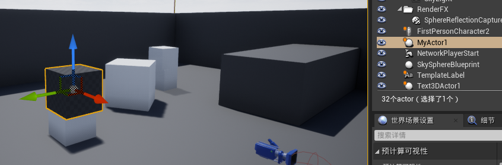

#### 注意

为了能够一步步正常做，所以这里开始新建了基于`Actor`的`MyActor`。并以此进行实验。


### 附加组件来创建层次结构

在从**组件**创建`自定义 Actors` 时，重要的是要考虑**附加的概念**。 附加组件会创建一种关系，其中应用于**父组件**的转换也会影响附加到父组件的**组件**。

创建一个新的Actor：

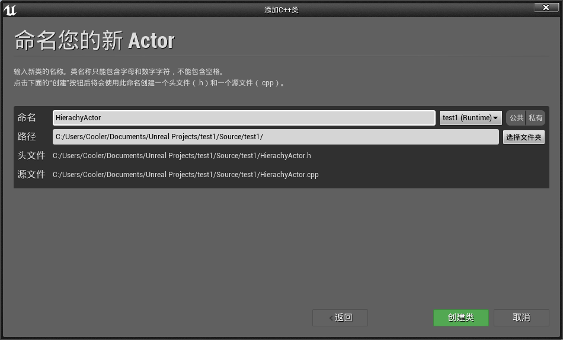

添加代码：

```c++
//HierachyActor.h
class TEST1_API AHierachyActor : public AActor
{
	GENERATED_BODY()
	
public:	
	// Sets default values for this actor's properties
	AHierachyActor();

	UPROPERTY(VisibleAnywhere)
		USceneComponent* Root;
	
	UPROPERTY(VisibleAnywhere)
		USceneComponent* ChildSceneComponent;
	
	UPROPERTY(VisibleAnywhere)
		UStaticMeshComponent* BoxOne;
	
	UPROPERTY(VisibleAnywhere)
		UStaticMeshComponent* BoxTwo;

protected:
```

```c++
//HierachyActor.cpp
// Sets default values
AHierachyActor::AHierachyActor()
{
 	// Set this actor to call Tick() every frame.  You can turn this off to improve performance if you don't need it.
	PrimaryActorTick.bCanEverTick = true;

	//create four subObjects
	Root = CreateDefaultSubobject<USceneComponent>("Root");
	ChildSceneComponent = CreateDefaultSubobject<USceneComponent>("ChildSceneComponent");
	BoxOne = CreateDefaultSubobject<UStaticMeshComponent>("BoxOne");
	BoxTwo = CreateDefaultSubobject<UStaticMeshComponent>("BoxTwo");

	//Give both boxes a mesh
	auto MeshAsset = ConstructorHelpers::FObjectFinder<UStaticMesh>(TEXT("StaticMesh'/Engine/BasicShapes/Cube.Cube'"));

	if (MeshAsset.Object != nullptr) {
		BoxOne->SetStaticMesh(MeshAsset.Object);
		BoxTwo->SetStaticMesh(MeshAsset.Object);
	}

	RootComponent = Root;

	//set up the object's hierarchy
	BoxOne->AttachToComponent(Root, FAttachmentTransformRules::SnapToTargetIncludingScale);
	BoxTwo->AttachToComponent(ChildSceneComponent, FAttachmentTransformRules::SnapToTargetIncludingScale);

	ChildSceneComponent->AttachToComponent(Root, FAttachmentTransformRules::SnapToTargetIncludingScale);

	//Offset and Scale the Child from the root
	ChildSceneComponent->SetRelativeTransform(FTransform(FRotator(0, 0, 0), FVector(250, 0, 0), FVector(0.1f)));
}
```

查看编辑器：

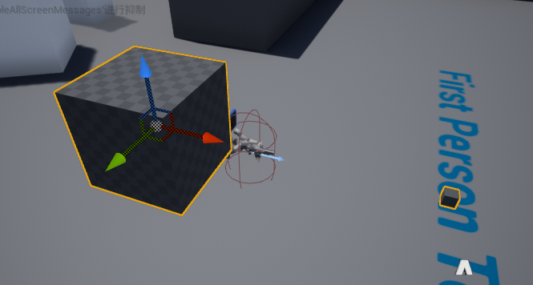

像往常一样，我们为`Actor`创建一些标记的` UPROPERTY `组件。 在本例中，我们向**标记**添加了一个额外的参数` VisibleAnywhere` ，这样我们就可以在` Details 选项卡`中查看变量。 我们创建了两个**场景组件**和两个**静态网格组件**。

在构造函数中，我们像往常一样为每个组件创建默认子对象。然后我们加载静态网格，如果加载成功，分配给两个静态网格组件，使他们有一个可视化的表示。然后，我们通过==附加组件==在 Actor 中构建层次结构。我们将第一个场景组件设置为 Actor 根目录。 此组件将确定应用于**层次结构**中所有其他组件的**转换**。

然后我们将第一个盒子附加到新的根组件上，并将第二个场景组件父元素附加到第一个。我们将第二个框附加到我们的子场景组件，以演示如何更改该场景组件上的变换影响其子组件，但没有在对象中的其他组件。最后，我们设置场景组件的相对变换，使其移动到离原点一定距离的地方，并且是比例尺的十分之一。


### 创建一个自定义的ActorComponent

`ActorComponent`是实现在**Actor之间共享**的公共功能的简单方法。 Actor组件不会被呈现，但是仍然可以执行诸如**订阅事件**或者与Actor内部的其他组件**通信**之类的操作。

创建一个ActorComponent：

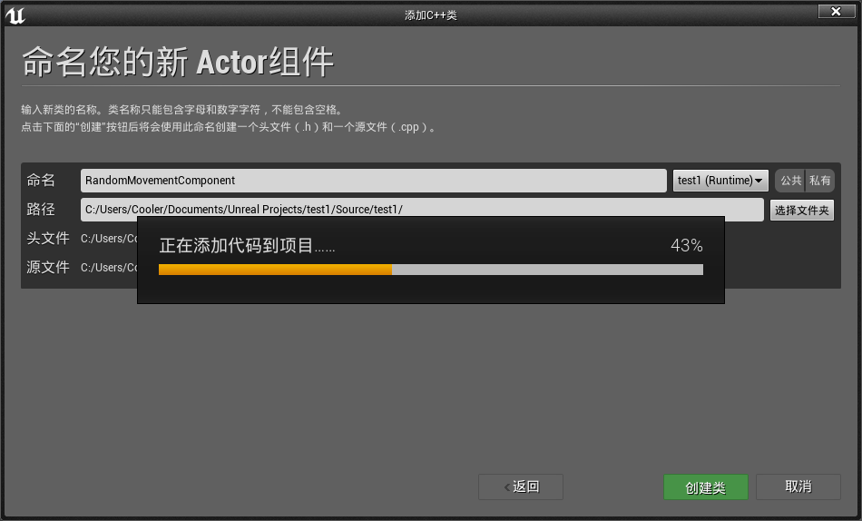

添加代码：

```c++
//RandomMovementComponent.h
public:	
	// Sets default values for this component's properties
	URandomMovementComponent();

	UPROPERTY()
		float MovementRadius;
```

```c++
//RandomMovementComponent.cpp

// Sets default values for this component's properties
URandomMovementComponent::URandomMovementComponent()
{
	// Set this component to be initialized when the game starts, and to be ticked every frame.  You can turn these features
	// off to improve performance if you don't need them.
	PrimaryComponentTick.bCanEverTick = true;

	// ...
	MovementRadius = 5.0f;
}

// Called every frame
void URandomMovementComponent::TickComponent(float DeltaTime, ELevelTick TickType, FActorComponentTickFunction* ThisTickFunction)
{
	Super::TickComponent(DeltaTime, TickType, ThisTickFunction);

	AActor* Parent = GetOwner();

	if (Parent)
	{
		//find a new Position for the object to go to
		auto NewPos = Parent->GetActorLocation() + FVector(FMath::FRandRange(-1, 1) * MovementRadius
			, FMath::FRandRange(-1, 1) * MovementRadius, FMath::FRandRange(-1, 1) * MovementRadius);
		//update the object's position
		Parent->SetActorLocation(NewPos);
	}
	// ...
}

```

打开编辑器，然后，在 `Details 选项卡` 将 Transform 组件的 `Mobility 属性`设置为 Moveable:

随便创建一个空的Actor添加组件 **一个Cube**和**自定义组件**：

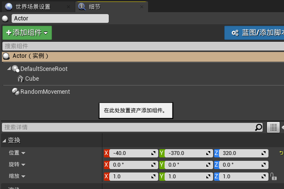

运行之后我们就会看到这个Actor随机移动的现象。

回顾一下：

首先，我们在组件声明中使用的 `UCLASS 宏`中添加一些说明符。 将 `blueprintspawnablcomponent` 添加到==类的元值==中，意味着**组件的实例**可以添加到编辑器中的 ==Blueprint 类==中。 ==类组说明符==允许我们指出我们的组件属于类列表中的哪个类别:

```c++
UCLASS( ClassGroup=(Custom), meta=(BlueprintSpawnableComponent) )
```

将 **MovementRadius** 作为属性添加到新组件中，可以让我们指定组件在一个框架中允许徘徊的距离。在构造函数中，我们将该属性初始化为一个安全的默认值。==Tickcomponent== 是引擎调用的每一帧的函数，就像 Tick 是 Actors 的函数一样。 在它的实现中，我们检索组件所有者的当前位置，也就是包含我们组件的 Actor，并在 world space 中生成一个偏移量:

我们将随机偏移量添加到当前位置，以确定新位置并将所属参与者移动到该位置。 这会导致演员的位置随机地从一个画面转到另一个画面，然后跳舞。


### 创建一个自定义的SceneComponent

SceneComponent 具有好几种作用：

- 用来标定位置


- 用来装载其他组件


- 实现比较多的组合功能


我们创建一个SceneComponent用来生成Actor：

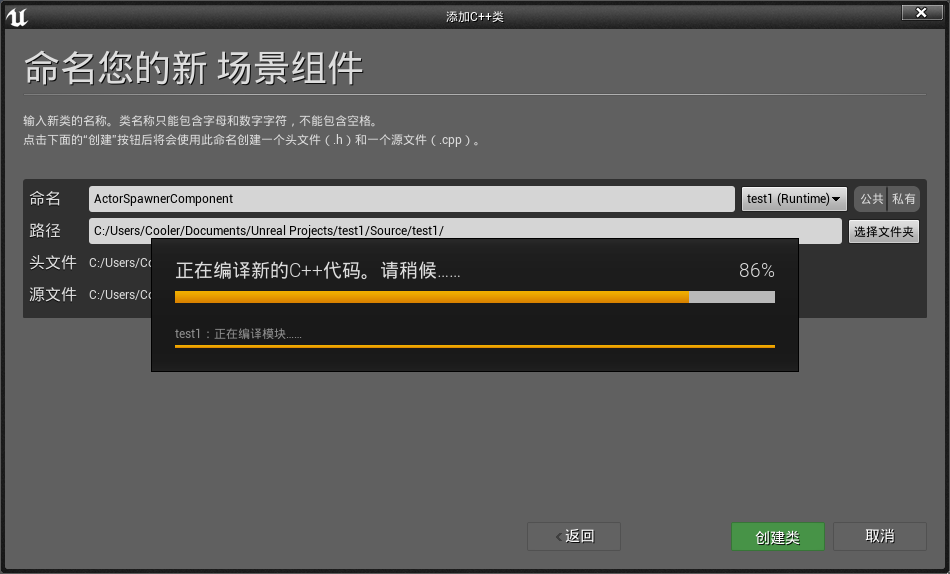

添加代码：

```c++
//ActorSpawnerComponent.h

UFUNCTION(BlueprintCallable,Category=Cookbook)
		void Spawn();

UPROPERTY(EditAnywhere)
    	TSubclassOf<AActor> ActorToSpawn;
```

```c++
//ActorSpawnerComponent.cpp

void UActorSpawnerComponent::Spawn()
{
	UWorld* TheWorld = GetWorld();
	if (TheWorld != nullptr)
	{
		FTransform ComponentTransform(this->GetComponentTransform());
		TheWorld->SpawnActor(ActorToSpawn, &ComponentTransform);
	}
}
```

编译之后打开编辑器，将组件添加进Actor ，并且设置生成目标类：


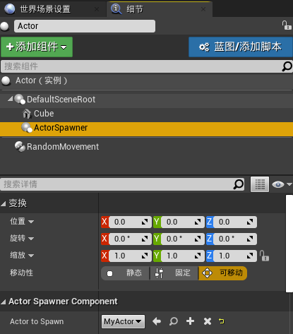

我们创建了` Spawn UFUNCTION `和一个名为` ActorToSpawn` 的变量。`ActorToSpawn` 属于 ==TSubclassOf 类型==，这是一种模板类型，允许我们将指针限制为基类或其子类。 这也意味着在编辑器中，我们将得到一个预过滤的类列表，以便从中选择，防止我们意外地分配一个无效的值：

在 **Spawn 函数**的实现中，我们可以访问我们的==世界==。 从这里，我们检查它的有效性。SpawnActor 需要一个 FTransform * 来指定产生新参与者的位置，因此我们创建一个新的**堆栈变量**来包含当前组件的转换的副本。

```c++
FTransform ComponentTransform(this->GetComponentTransform());
```

如果 TheWorld 是有效的，我们请求它生成一个指定 ActorToSpawn子类的实例，并传入我们刚刚创建的 FTransform 的地址，该地址现在包含新参与者所需的位置。


### 为RPG创建一个InventoryComponent(背包组件)

这个例子中会涉及创建的类会比较多，所以新建一个文件夹（`RPG`）来创建这些类：

创建新C++类：

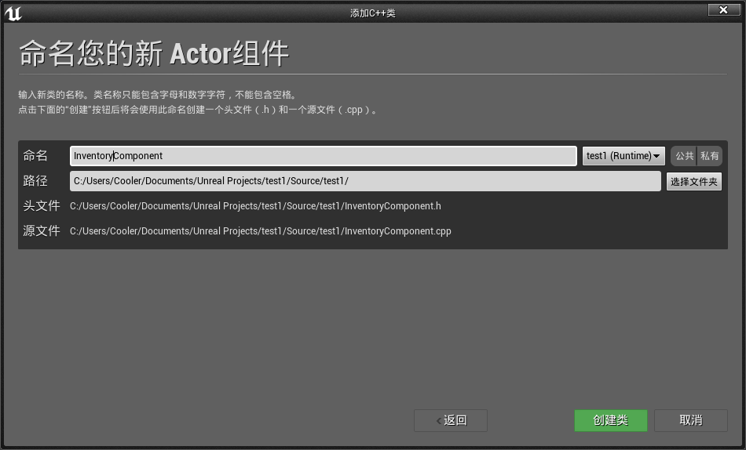

(下图实际错了，应该是`staticMeshActor`作为父类)


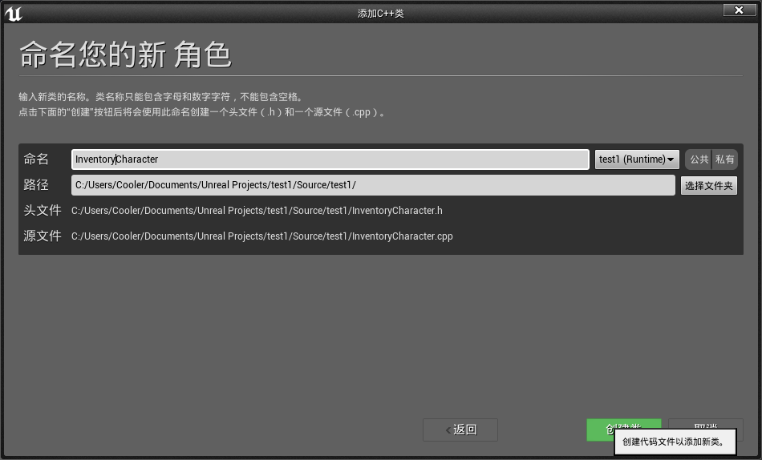


添加代码：

 ==InventoryActor.h==（背包里的物体）

```c++
UCLASS()
class TEST1_API AInventoryStaticMeshActor : public AStaticMeshActor
{
	GENERATED_BODY()
public:
	AInventoryStaticMeshActor();
	virtual void PickUp();
	virtual void PutDown(FTransform TargetLocation);
	
};
```

==InventoryActor.cpp==

```c++
// Fill out your copyright notice in the Description page of Project Settings.


#include "InventoryStaticMeshActor.h"

#include "Engine/CollisionProfile.h"
#include "Components/StaticMeshComponent.h"

AInventoryStaticMeshActor::AInventoryStaticMeshActor() :Super()
{
	PrimaryActorTick.bCanEverTick = true;
	auto MeshAsset = ConstructorHelpers::FObjectFinder<UStaticMesh>(TEXT("StaticMesh'/Engine/BasicShapes/Cube.Cube'"));

	if (MeshAsset.Object != nullptr)
	{
		GetStaticMeshComponent()->SetStaticMesh(MeshAsset.Object);
		GetStaticMeshComponent()->SetCollisionProfileName(UCollisionProfile::Pawn_ProfileName);
	}

	GetStaticMeshComponent()->SetMobility(EComponentMobility::Movable);

	SetActorEnableCollision(true);
	
}

void AInventoryStaticMeshActor::PickUp()
{
	SetActorTickEnabled(false);
	SetActorHiddenInGame(true);
	SetActorEnableCollision(false);
}

void AInventoryStaticMeshActor::PutDown(FTransform TargetLocation)
{
	SetActorTickEnabled(true);
	SetActorHiddenInGame(false);
	SetActorEnableCollision(true);
	SetActorLocation(TargetLocation.GetLocation());
}
```

==InventoryComponent.h== （背包对象）

```c++
// Fill out your copyright notice in the Description page of Project Settings.

#pragma once

#include "CoreMinimal.h"
#include "Components/ActorComponent.h"
#include "InventoryStaticMeshActor.h"

#include "InventoryComponent.generated.h"


UCLASS( ClassGroup=(Custom), meta=(BlueprintSpawnableComponent) )
class TEST1_API UInventoryComponent : public UActorComponent
{
	GENERATED_BODY()

public:	
	// Sets default values for this component's properties
	UInventoryComponent();

	UPROPERTY()
		TArray<AInventoryStaticMeshActor*> CurrentInventory;

	UFUNCTION()
		int32 AddToInventory(AInventoryStaticMeshActor* ActorToAdd);

	UFUNCTION()
		void RemoveFromInventory(AInventoryStaticMeshActor* ActorToRemove);

protected:
	// Called when the game starts
	virtual void BeginPlay() override;

public:	
	// Called every frame
	virtual void TickComponent(float DeltaTime, ELevelTick TickType, FActorComponentTickFunction* ThisTickFunction) override;

		
};
```

==InventoryComponent.cpp== 

```c++
int32 UInventoryComponent::AddToInventory(AInventoryStaticMeshActor* ActorToAdd)
{
	return CurrentInventory.Add(ActorToAdd);
}

void UInventoryComponent::RemoveFromInventory(AInventoryStaticMeshActor* ActorToRemove)
{
	CurrentInventory.Remove(ActorToRemove);
}
```

==InventoryCharacter.h== （角色对象）

```c++
// Fill out your copyright notice in the Description page of Project Settings.

#pragma once

#include "CoreMinimal.h"
#include "GameFramework/Character.h"
#include "InventoryStaticMeshActor.h"
#include "InventoryComponent.h"
#include "InventoryCharacter.generated.h"

UCLASS()
class TEST1_API AInventoryCharacter : public ACharacter
{
	GENERATED_BODY()

public:
	// Sets default values for this character's properties
	AInventoryCharacter();
	UPROPERTY()
		UInventoryComponent* MyInventory;
    
    //丢弃背包物体
	UFUNCTION()
		void DropItem();
	
    //捡起背包物体
	UFUNCTION()
		void TakeItem(AInventoryStaticMeshActor* InventoryItem);
    
    //碰到背包物体，捡起
	UFUNCTION()
		virtual void NotifyHit(class UPrimitiveComponent* MyComp, AActor* Other, class UPrimitiveComponent* OtherComp,
			bool beSelfMoved, FVector HitLocation, FVector HitNormal, FVector NormalImpulse, const FHitResult& Hit) override;

	

	UFUNCTION()
		void MoveForward(float AxisValue);

	UFUNCTION()
		void MoveRight(float AxisValue);

	UFUNCTION()
		void PitchCamera(float AxisValue);

	UFUNCTION()
		void YawCamera(float AxisValue);
	
protected:
	// Called when the game starts or when spawned
	virtual void BeginPlay() override;

public:	
	// Called every frame
	virtual void Tick(float DeltaTime) override;

	// Called to bind functionality to input
	virtual void SetupPlayerInputComponent(class UInputComponent* PlayerInputComponent) override;

private:
	FVector Movementinput;
	FVector CameraInput;

};

```

==InventoryCharacter.cpp==

```c++
// Fill out your copyright notice in the Description page of Project Settings.


#include "InventoryCharacter.h"

// Sets default values
AInventoryCharacter::AInventoryCharacter()
{
 	// Set this character to call Tick() every frame.  You can turn this off to improve performance if you don't need it.
	PrimaryActorTick.bCanEverTick = true;

	MyInventory = CreateDefaultSubobject<UInventoryComponent>("MyInventory");

}

void AInventoryCharacter::DropItem()
{
	if (MyInventory->CurrentInventory.Num() == 0)
	{
		return;
	}
	AInventoryStaticMeshActor* Item = MyInventory->CurrentInventory.Last();
	MyInventory->RemoveFromInventory(Item);

	FVector ItemOrigin;
	FVector ItemBounds;
	Item->GetActorBounds(false, ItemOrigin, ItemBounds);

	FTransform PutDownLocation = GetTransform() + FTransform(RootComponent->GetForwardVector() * ItemBounds.GetMax());
	Item->PutDown(PutDownLocation);

}

void AInventoryCharacter::TakeItem(AInventoryStaticMeshActor* InventoryItem)
{
	InventoryItem->PickUp();
	MyInventory->AddToInventory(InventoryItem);
}

void AInventoryCharacter::NotifyHit(class UPrimitiveComponent* MyComp, AActor* Other, class UPrimitiveComponent* OtherComp,
	bool beSelfMoved, FVector HitLocation, FVector HitNormal, FVector NormalImpulse, const FHitResult& Hit)
{
	AInventoryStaticMeshActor* InventoryItem = Cast<AInventoryStaticMeshActor>(Other);
	if (InventoryItem != nullptr)
	{
		TakeItem(InventoryItem);
	}
}

void AInventoryCharacter::MoveForward(float AxisValue)
{
	Movementinput.X = FMath::Clamp<float>(AxisValue, -1.0f, 1.0f);
}

void AInventoryCharacter::MoveRight(float AxisValue)
{
	Movementinput.Y = FMath::Clamp<float>(AxisValue, -1.0f, 1.0f);
}

void AInventoryCharacter::PitchCamera(float AxisValue)
{
	CameraInput.Y = AxisValue;
}

void AInventoryCharacter::YawCamera(float AxisValue)
{
	CameraInput.X = AxisValue;
}

// Called when the game starts or when spawned
void AInventoryCharacter::BeginPlay()
{
	Super::BeginPlay();
	
}

// Called every frame
void AInventoryCharacter::Tick(float DeltaTime)
{
	Super::Tick(DeltaTime);
	if (!Movementinput.IsZero())
	{
		Movementinput *= 100;
		FVector InputVector = FVector(0, 0, 0);
		InputVector += GetActorForwardVector() * Movementinput.X * DeltaTime;
		InputVector += GetActorRightVector() * Movementinput.Y * DeltaTime;
		AddMovementInput(InputVector);
	}

	if (!CameraInput.IsNearlyZero())
	{
		FRotator NewRotation = GetActorRotation();
		NewRotation.Pitch += CameraInput.X;
		NewRotation.Yaw += CameraInput.Y;

		APlayerController* MyPlayerController = Cast<APlayerController>(GetController());
		if (MyPlayerController != nullptr)
		{
			MyPlayerController->AddYawInput(CameraInput.X);
			MyPlayerController->AddPitchInput(CameraInput.Y);
		}
		SetActorRotation(NewRotation);
	}
}

// Called to bind functionality to input
void AInventoryCharacter::SetupPlayerInputComponent(UInputComponent* PlayerInputComponent)
{
	Super::SetupPlayerInputComponent(PlayerInputComponent);

	PlayerInputComponent->BindAction("DropItem", EInputEvent::IE_Pressed, this, &AInventoryCharacter::DropItem);

	PlayerInputComponent->BindAxis("MoveForward", this, &AInventoryCharacter::MoveForward);
	PlayerInputComponent->BindAxis("MoveRight", this, &AInventoryCharacter::MoveRight);
	PlayerInputComponent->BindAxis("CameraPitch", this, &AInventoryCharacter::PitchCamera);
	PlayerInputComponent->BindAxis("CameraYaw", this, &AInventoryCharacter::YawCamera);
}
```

==InventoryGameMode.cpp==（游戏模式）

```c++
#include "InventoryGameMode.h"

AInventoryGameMode::AInventoryGameMode()
{
	DefaultPawnClass = AInventoryCharacter::StaticClass();
}
```


项目设置中设置按键输入：
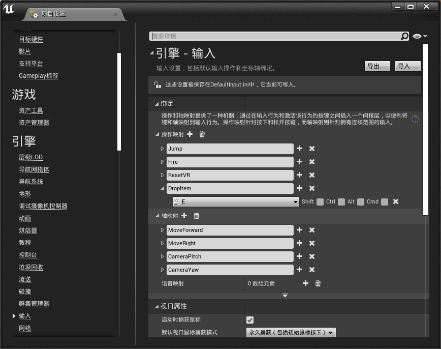

在场景中摆放2个`InventoryActor`，进行测试。


### 创建一个OrbitingMovementComponent

这个例子中我们会创建一个==轨道运动==的组件

这个组件类似于 ==RotatingMovementComponent==，因为它的设计目的是使用特定的方式移动它所包含的组件。 在这种情况下，它将移动**任何附加组件**在一个轨道上，围绕一个固定的点，在一个固定的距离。

例如，一个盾牌，围绕一个角色旋转的动作（亚瑟？）。

创建新C++类:

==OrbitingMovementComponent.h==

```c++
UPROPERTY()
	bool RotateToFaceOutwards;

UPROPERTY()
    float RotationSpeed;

UPROPERTY()
    float OrbitDistance;

	float CurrentValue;
```

==OrbitingMovementComponent.cpp==

```c++
// Fill out your copyright notice in the Description page of Project Settings.


#include "OrbitingMovementComponent.h"

// Sets default values for this component's properties
UOrbitingMovementComponent::UOrbitingMovementComponent()
{
	// Set this component to be initialized when the game starts, and to be ticked every frame.  You can turn these features
	// off to improve performance if you don't need them.
	PrimaryComponentTick.bCanEverTick = true;

	// ...
	RotationSpeed = 5;
	OrbitDistance = 100;
	CurrentValue = 0;
	RotateToFaceOutwards = true;
}


// Called when the game starts
void UOrbitingMovementComponent::BeginPlay()
{
	Super::BeginPlay();

	// ...
	
}


// Called every frame
void UOrbitingMovementComponent::TickComponent(float DeltaTime, ELevelTick TickType, FActorComponentTickFunction* ThisTickFunction)
{
	Super::TickComponent(DeltaTime, TickType, ThisTickFunction);

	// ...
	float CurrentValueInRadians = FMath::DegreesToRadians<float>(CurrentValue);

	SetRelativeLocation(FVector(OrbitDistance * FMath::Cos(CurrentValueInRadians)
		, OrbitDistance * FMath::Sin(CurrentValueInRadians), GetRelativeLocation().Z));
	if (RotateToFaceOutwards)
	{
		FVector LookDir = GetRelativeLocation().GetSafeNormal();
		FRotator LookAtRot = LookDir.Rotation();
		SetRelativeRotation(LookAtRot);
	}
		
	CurrentValue = FMath::Fmod(CurrentValue + (RotationSpeed * DeltaTime), 360);
		
}

```

我们可以创建一个空的==蓝图Actor==来进行测试：
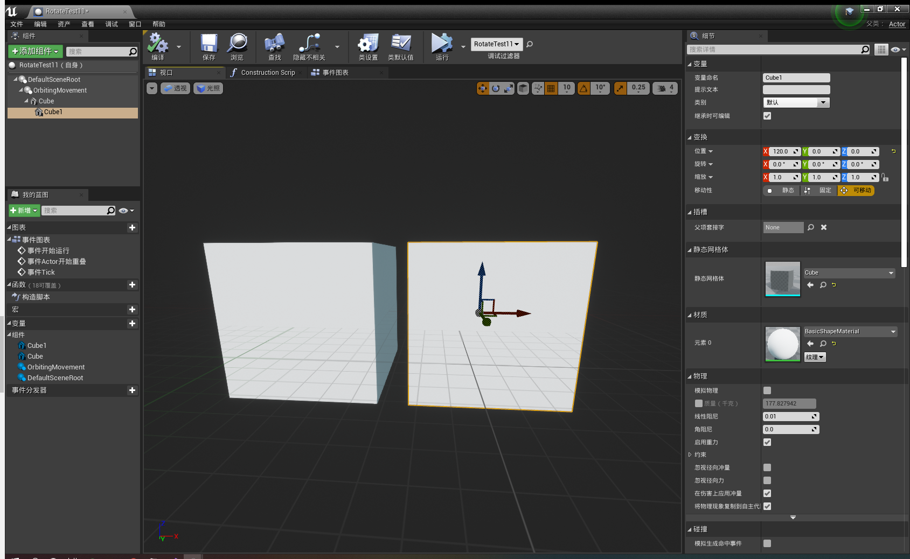

运行后结果如下：

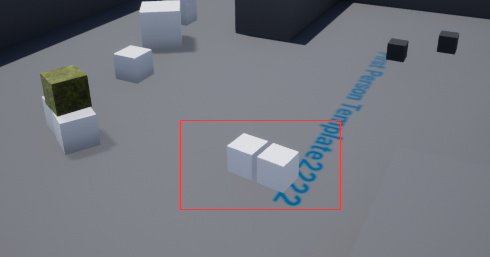

我们可以看到两个方块绕某个点在旋转


添加到组件的属性是我们用来自定义组件的圆周运动的**基本参数**。

- RotateToFaceOutwards 指定组件在每次更新时是否面向旋转中心。 
- RotationSpeed是组件每秒旋转的度数。

- OrbitDistance 表示旋转的部件必须从原点移动的距离。 
- Currentvalue 是以度为单位的当前旋转位置。

在构造函数内部，我们为新组件建立一些健全的默认值。

在 TickComponent 函数中，我们计算组件的位置和旋转。下一步的公式要求我们的角度用弧度而不是度来表示。 弧度用来描述角度。 首先，我们使用 `DegreesToRadians `函数将当前的度值转换为弧度。`SetRelativeLocation` 函数使用圆周运动的一般方程，即 Pos () cos (以弧度表示) ，sin (以弧度表示)。 我们保留每个对象的 z 轴位置。

下一步是将对象旋转回原点(或者直接离开原点)。 只有当 `RotateToFaceOutwards`为真时，才会计算这个值，这涉及到获取组件到其父组件的相对偏移量，并基于从父组件到当前相对偏移量的向量创建一个旋转器。 然后我们将相对旋转设置为产生的旋转体。

最后，我们以度为单位增加当前值，使其每秒移动 RotationSpeed 单位，将结果值锁定在0到360之间，以允许旋转循环。


### 创建一个产生单位的建筑

创建两个Actor：
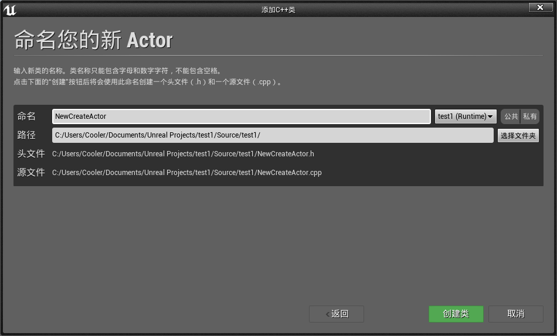