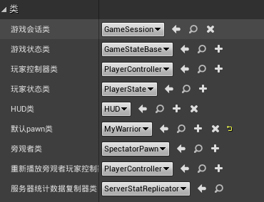

# UE4中处理事件和代理

## 处理通过虚函数实现的事件

Unreal 提供的一些 `Actor` 和 `Component` 类包括**虚函数**形式的事件处理程序。 这一小节将讲述如何通过重写问题中的**虚拟函数**来自定义这些处理程序。创建新类：


添加代码：

==MyTriggerVolume.h==

```c++
// Fill out your copyright notice in the Description page of Project Settings.

#pragma once

#include "CoreMinimal.h"
#include "GameFramework/Actor.h"
#include "Components/BoxComponent.h"
#include "MyTriggerVolume.generated.h"

UCLASS()
class TEST1_API AMyTriggerVolume : public AActor
{
	GENERATED_BODY()
	
public:	
	// Sets default values for this actor's properties
	AMyTriggerVolume();

	UPROPERTY()
		UBoxComponent* TriggerZone;

	UFUNCTION()
		virtual void NotifyActorBeginOverlap(AActor* OtherActor)override;

	UFUNCTION()
		virtual void NotifyActorEndOverlap(AActor* OtherActor)override;

protected:
	// Called when the game starts or when spawned
	virtual void BeginPlay() override;

public:	
	// Called every frame
	virtual void Tick(float DeltaTime) override;

};
```

==MyTriggerVolume.cpp==

```c++
// Fill out your copyright notice in the Description page of Project Settings.


#include "MyTriggerVolume.h"
#include "Engine/Engine.h"

// Sets default values
AMyTriggerVolume::AMyTriggerVolume()
{
 	// Set this actor to call Tick() every frame.  You can turn this off to improve performance if you don't need it.
	PrimaryActorTick.bCanEverTick = true;

	TriggerZone = CreateDefaultSubobject<UBoxComponent>("TriggerZone");
	TriggerZone->SetBoxExtent(FVector(200, 200, 100));
}

void AMyTriggerVolume::NotifyActorBeginOverlap(AActor* OtherActor)
{
	auto Messsage = FString::Printf(TEXT("%s entered me"), *(OtherActor->GetName()));
	GEngine->AddOnScreenDebugMessage(-1, 1, FColor::Red, Messsage);
}

void AMyTriggerVolume::NotifyActorEndOverlap(AActor* OtherActor)
{
	auto Messsage = FString::Printf(TEXT("%s left me"), *(OtherActor->GetName()));
	GEngine->AddOnScreenDebugMessage(-1, 1, FColor::Red, Messsage);
}

// Called when the game starts or when spawned
void AMyTriggerVolume::BeginPlay()
{
	Super::BeginPlay();
	
}

// Called every frame
void AMyTriggerVolume::Tick(float DeltaTime)
{
	Super::Tick(DeltaTime);

}
```

运行结果如下：


在这个例子中，我们首先声明一个` UPROPERTY` 来保存对组件子对象的引用。 

然后创建两个 UFUNCTION 声明。 这些被标记为虚拟和重写，以便编译器理解我们想要替换父实现，并且我们的函数实现可以依次替换。

在对象的构造函数中，我们使用 CreateDefaultSubobject 函数创建子对象。 然后，我们通过 SetBoxExtent 函数使用一个分别包含 x、 y 和 z 大小的 FVector 来设置盒子的区段(大小)。

在函数的实现中，我们从一些预设的文本创建一个 FString，并使用 FString: : Printf 函数替换一些数据参数。 注意，Actor-GetName ()函数也返回一个 FString，并在传递到 FString: : Printf 之前使用 * 操作符解除引用。 不这样做会导致错误。

然后将这个 FString 传递给全局引擎函数 ==AddOnScreenDebugMessage==，以在屏幕上显示这些信息。

方法的第一个参数告诉引擎允许重复字符串，第二个参数是以秒为单位显示消息的时间长度，第三个参数是颜色，第四个参数是要打印的实际字符串。 尽管可能不会创建一个额外的变量，而只是将信息放在函数调用中，但这会使代码更难阅读。

现在，当Actor的某个组件与其他组件重叠时，它的 UpdateOverlapsfunction 将调用NotifyActorBeginOverlap，虚拟函数调度将调用我们的定制实现。


## 创建绑定到UFUNCTION的代理

指针是一个强大的工具，因为我们能够在运行时分配它们，并可以改变它们在内存中指向的位置。 除了标准类型之外，我们还可以创建**指向函数的指针**，但是这些原始函数指针不适合使用，原因有很多。==代理是一个更安全的函数指针版本==，它使我们能够灵活地调用函数，而不必知道哪个函数被赋值，直到被调用的那一刻。 这种灵活性是选择代理而非静态函数的主要原因之一。 这个例子将会讲述如何将 `UFUNCTION` 关联到代理，以便在执行代理时调用该代理。

我们将使用到上一个例子中创建的`MyTriggerVolume`，和Demo中已有的`InventoryGameMode`来进行该例子的讲解：

首先创建新类：


==MyTriggerVolume.cpp==

```c++
void AMyTriggerVolume::NotifyActorBeginOverlap(AActor* OtherActor)
{
	auto Messsage = FString::Printf(TEXT("%s entered me"), *(OtherActor->GetName()));
	GEngine->AddOnScreenDebugMessage(-1, 1, FColor::Red, Messsage);

	//Call our Delegate
	UWorld* TheWorld = GetWorld();

	if (TheWorld != nullptr)
	{
		AGameModeBase* GameMode = UGameplayStatics::GetGameMode(TheWorld);
		AInventoryGameMode* MyGameMode = Cast<AInventoryGameMode>(GameMode);
		if (MyGameMode != nullptr)
		{
			MyGameMode->MyStandardDelegate.ExecuteIfBound();
		}
	}
}
```

==InventoryGameMode.h==

```c++
// Fill out your copyright notice in the Description page of Project Settings.

#pragma once

#include "CoreMinimal.h"
#include "GameFramework/GameModeBase.h"
#include "InventoryCharacter.h"
#include "InventoryGameMode.generated.h"

DECLARE_DELEGATE(FStandardDelegateSignature)
/**
 * 
 */
UCLASS()
class TEST1_API AInventoryGameMode : public AGameModeBase
{
	GENERATED_BODY()
	
public:
	AInventoryGameMode();

	FStandardDelegateSignature MyStandardDelegate;
};

```

==DelegateListener.h==

```c

	UFUNCTION()
		void EnableLight();

	UPROPERTY()
		UPointLightComponent* PointLight;

```

==DelegateListener.cpp==

```c
// Fill out your copyright notice in the Description page of Project Settings.


#include "DelegateListener.h"
#include "Kismet/GameplayStatics.h"
#include "GameFramework/GameModeBase.h"
#include "InventoryGameMode.h"


// Sets default values
ADelegateListener::ADelegateListener()
{
 	// Set this actor to call Tick() every frame.  You can turn this off to improve performance if you don't need it.
	PrimaryActorTick.bCanEverTick = true;

	PointLight = CreateDefaultSubobject<UPointLightComponent>("PointLight");

	RootComponent = PointLight;

	PointLight->SetVisibility(false);

	PointLight->SetLightColor(FLinearColor::Blue);

}

void ADelegateListener::EnableLight()
{
	PointLight->SetVisibility(true);
}

// Called when the game starts or when spawned
void ADelegateListener::BeginPlay()
{
	Super::BeginPlay();

	UWorld* TheWorld = GetWorld();
	if (TheWorld != nullptr)
	{
		AGameModeBase* GameMode = UGameplayStatics::GetGameMode(TheWorld);
		AInventoryGameMode* MyGameMode = Cast<AInventoryGameMode>(GameMode);
		if (MyGameMode != nullptr)
		{
			MyGameMode->MyStandardDelegate.BindUObject(this, &ADelegateListener::EnableLight);
		}
	}
	
}


// Called every frame
void ADelegateListener::Tick(float DeltaTime)
{
	Super::Tick(DeltaTime);

}
```

`委托`：


## 注销代理

我们使用代理来处理事件时，有时需要**删除绑定**。 这就像设置一个函数指针对象到` nullptr`，这样它就不再引用已经被删除的对象。上一例子中，`DelegateListener`对EndPlay进行重写代码如下：

 ==DelegateListener.h==

```c++
virtual void EndPlay(const EEndPlayReason::Type EndPlayReason) override;
```

==DelegateListener.cpp==

```c++
void ADelegateListener::EndPlay(const EEndPlayReason::Type EndPlayReason)
{
	Super::EndPlay(EndPlayReason);
	UWorld* TheWorld = GetWorld();

	if (TheWorld != nullptr)
	{
		AGameModeBase* GameMode = UGameplayStatics::GetGameMode(TheWorld);
		AInventoryGameMode* MyGameMode = Cast<AInventoryGameMode>(GameMode);
		if (MyGameMode != nullptr)
		{
			MyGameMode->MyStandardDelegate->Unbind();
		}
	}
}
```

这样可以做到当`Actor`销毁时代理自动注销。

总结：

这个例子结合了本章到目前为止的两个以前的例子。 我们重写 `EndPlay`，这是一个实现为虚函数的事件，这样我们就可以在 `DelegateListener` 销毁后执行代码。 如果没有这样做，代理就会像指针一样晃动，在 DelegateListener 销毁后使其处于无效状态。 使用 BindUObject ()有助于避免大多数这类情况，只有少数不幸的计时情况可能会导致对对象的调用被标记为销毁。 即使在使用 BindUObject ()时，手动解除代理绑定仍然是一个很好的习惯，因为当这些计时错误导致 bug 时，几乎不用去猜测是否是他们的锅。


## 创建接受输入参数的代理

前面例子主要是没有接受任何输入参数的代理，这个例子会讲解如何更改代理的签名让其接受某些输入。我们还是使用上面例子中的`GameMode`

创建一个新类：


添加代码：

==MyTriggerVolume.cpp==

```c++
void AMyTriggerVolume::NotifyActorBeginOverlap(AActor* OtherActor)
{
	auto Messsage = FString::Printf(TEXT("%s entered me"), *(OtherActor->GetName()));
	GEngine->AddOnScreenDebugMessage(-1, 1, FColor::Red, Messsage);

	//Call our Delegate
	UWorld* TheWorld = GetWorld();

	if (TheWorld != nullptr)
	{
		AGameModeBase* GameMode = UGameplayStatics::GetGameMode(TheWorld);
		AInventoryGameMode* MyGameMode = Cast<AInventoryGameMode>(GameMode);
		if (MyGameMode != nullptr)
		{
			MyGameMode->MyStandardDelegate.ExecuteIfBound();

			auto Color = FLinearColor(1, 0, 0, 1);
			MyGameMode->MyParameterDelegate.ExecuteIfBound(Color);
		}
	}
}
```

==InventoryGameMode.h==

```c++
DECLARE_DELEGATE(FStandardDelegateSignature)
DECLARE_DELEGATE_OneParam(FParamDelegateSignature, FLinearColor)
/**
 * 
 */
UCLASS()
class NEWTUTORIALPROJECT_API AInventoryGameMode : public AGameModeBase
{
    GENERATED_BODY()
public:
    AInventoryGameMode();
    
    FStandardDelegateSignature MyStandardDelegate;
    
    FParamDelegateSignature MyParameterDelegate;
};
```

==ParamDelegateListener.h==

```c++
// Fill out your copyright notice in the Description page of Project Settings.

#pragma once

#include "CoreMinimal.h"
#include "GameFramework/Actor.h"
#include "Components/PointLightComponent.h"
#include "ParamDelegateListener.generated.h"

UCLASS()
class TEST1_API AParamDelegateListener : public AActor
{
	GENERATED_BODY()
	
public:	
	// Sets default values for this actor's properties
	AParamDelegateListener();

protected:
	// Called when the game starts or when spawned
	virtual void BeginPlay() override;

public:	
	// Called every frame
	virtual void Tick(float DeltaTime) override;

	UFUNCTION()
		void SetLightColor(FLinearColor LightColor);

	UPROPERTY()
		UPointLightComponent* PointLight;

	UFUNCTION()
		virtual void EndPlay(const EEndPlayReason::Type EndPlayReason) override;

};
```

==ParamDelegateListener.cpp==

```c++
// Fill out your copyright notice in the Description page of Project Settings.


#include "ParamDelegateListener.h"
#include "Kismet/GameplayStatics.h"
#include "InventoryGameMode.h"

// Sets default values
AParamDelegateListener::AParamDelegateListener()
{
 	// Set this actor to call Tick() every frame.  You can turn this off to improve performance if you don't need it.
	PrimaryActorTick.bCanEverTick = true;

	PointLight = CreateDefaultSubobject<UPointLightComponent>("PointLight");
	RootComponent = PointLight;

}

// Called when the game starts or when spawned
void AParamDelegateListener::BeginPlay()
{
	Super::BeginPlay();
	
	UWorld* TheWorld = GetWorld();
	if (TheWorld != nullptr)
	{
		AGameModeBase* GameMode = UGameplayStatics::GetGameMode(TheWorld);
		AInventoryGameMode* MyGameMode = Cast<AInventoryGameMode>(GameMode);

		if (MyGameMode != nullptr)
		{
			MyGameMode->MyParameterDelegate.BindUObject(this, &AParamDelegateListener::SetLightColor);
		}

	}
}

// Called every frame
void AParamDelegateListener::Tick(float DeltaTime)
{
	Super::Tick(DeltaTime);

}

void AParamDelegateListener::SetLightColor(FLinearColor LightColor)
{
	PointLight->SetLightColor(LightColor);
}

void AParamDelegateListener::EndPlay(const EEndPlayReason::Type EndPlayReason)
{
	Super::EndPlay(EndPlayReason);
	UWorld* TheWorld = GetWorld();

	if (TheWorld != nullptr)
	{
		AGameModeBase* GameMode = UGameplayStatics::GetGameMode(TheWorld);
		AInventoryGameMode* MyGameMode = Cast<AInventoryGameMode>(GameMode);

		if (MyGameMode != nullptr)
		{
			MyGameMode->MyParameterDelegate.Unbind();
        }
	}
}
```

编译完成后将ParamDelegateListener拖拽到场景中：


新的代理签名使用稍微不同的宏进行声明。 注意 `DECLARE delegate OneParam` 结尾的 OneParam 后缀。 

我们还需要指定参数的类型。 就像我们创建一个没有参数的代理一样，我们可以创建一个代理实例作为 GameMode 类的成员。然后，我们创建一个新类型的 `DelegateListener`: 它期望将一个参数传递到它绑定到代理的函数中。 当我们为代理调用 ExecuteIfBound ()方法时，我们需要传入将插入到函数参数中的值。

在我们绑定的函数内部，我们使用参数来设置光线的颜色。 这意味着 `TriggerVolume` 不需要知道关于 `ParamDelegateListener` 的任何信息就可以调用它上面的函数。该代理允许我们最小化两个类之间的耦合。


## 使用代理绑定传递有效负载数据

我们将上一例子中的代码进行一些小修改：

```c++
// Called when the game starts or when spawned
void AParamDelegateListener::BeginPlay()
{
	Super::BeginPlay();
	
	UWorld* TheWorld = GetWorld();
	if (TheWorld != nullptr)
	{
		AGameModeBase* GameMode = UGameplayStatics::GetGameMode(TheWorld);
		AInventoryGameMode* MyGameMode = Cast<AInventoryGameMode>(GameMode);

		if (MyGameMode != nullptr)
		{
			MyGameMode->MyParameterDelegate.BindUObject(this, &AParamDelegateListener::SetLightColor,false);
		}

	}
}

// Called every frame
void AParamDelegateListener::Tick(float DeltaTime)
{
	Super::Tick(DeltaTime);

}

void AParamDelegateListener::SetLightColor(FLinearColor LightColor, bool EnableLight)
{
	PointLight->SetLightColor(LightColor);
	PointLight->SetVisibility(EnableLight);
}
```


当我们将函数绑定到代理时，我们指定了一些额外的数据（在这种情况下，布尔值为 false）。 我们可以以这种方式传递多达四个“ ==payload==”变量。 在所使用的 DECLARE delegate * 宏中声明任何参数后，它们将应用于函数。

我们更改代理的函数签名，以便它能够接受额外的参数。

在函数内部，我们使用额外的参数来打开或关闭灯光，具体取决于编译时的值为 true 或 false。

我们不需要更改对 ExecuteIfBound 的调用: 代理系统自动应用参数，这些参数首先通过 ExecuteIfBound 传入。 然后，它应用任何有效负载参数，这些参数始终在调用 BindUObject 的函数引用之后指定。


## 创建多播代理

到目前为止，我们在本章中使用的**标准代理**本质上是**函数指针**：它们允许您对一个特定的**对象实例**调用一个特定的函数。 ==多播代理==是函数指针的集合，每个指针都可能位于不同的对象上，所有这些指针都将在广播代理时调用。本例子之前我们已经处理通过**虚函数**实现的事件，知道了如何创建` TriggerVolume` ，本例将它用于**广播多播代理**。

创建新类：


==InventoryGameMode.h==

```c++
DECLARE_DELEGATE(FStandardDelegateSignature)
DECLARE_DELEGATE_OneParam(FParamDelegateSignature,FLinearColor)
DECLARE_MULTICAST_DELEGATE(FMulticastDelegateSignature)
/**
 * 
 */
UCLASS()
class TEST1_API AInventoryGameMode : public AGameModeBase
{
	GENERATED_BODY()
	
public:
	AInventoryGameMode();

	FStandardDelegateSignature MyStandardDelegate;

	FParamDelegateSignature MyParameterDelegate;

	FMulticastDelegateSignature MyMulticastDelegate;
};

```

==MyTriggerVolume.cpp==

```c++
if (TheWorld != nullptr)
{
    AGameModeBase* GameMode = UGameplayStatics::GetGameMode(TheWorld);
    AInventoryGameMode* MyGameMode = Cast<AInventoryGameMode>(GameMode);
    if (MyGameMode != nullptr)
    {
        MyGameMode->MyStandardDelegate.ExecuteIfBound();

        auto Color = FLinearColor(1, 0, 0, 1);
        MyGameMode->MyParameterDelegate.ExecuteIfBound(Color);

        MyGameMode->MyMulticastDelegate.Broadcast();
	}
}
```

==MulticastDelegateListener.h==

```c++
// Fill out your copyright notice in the Description page of Project Settings.

#pragma once

#include "CoreMinimal.h"
#include "GameFramework/Actor.h"
#include "Components/PointLightComponent.h"
#include "MulticastDelegateListener.generated.h"

UCLASS()
class TEST1_API AMulticastDelegateListener : public AActor
{
	GENERATED_BODY()
	
public:	
	// Sets default values for this actor's properties
	AMulticastDelegateListener();

	UFUNCTION()
		void Togglelight();

	UFUNCTION()
		virtual void EndPlay(const EEndPlayReason::Type EndPlayReason)override;

	UPROPERTY()
		UPointLightComponent* PointLight;

	FDelegateHandle MyDelegateHandle;

protected:
	// Called when the game starts or when spawned
	virtual void BeginPlay() override;

public:	
	// Called every frame
	virtual void Tick(float DeltaTime) override;

};
```

==MulticastDelegateListener.cpp==

```c++
// Fill out your copyright notice in the Description page of Project Settings.


#include "MulticastDelegateListener.h"
#include "Kismet/GameplayStatics.h"
#include "InventoryGameMode.h"

// Sets default values
AMulticastDelegateListener::AMulticastDelegateListener()
{
 	// Set this actor to call Tick() every frame.  You can turn this off to improve performance if you don't need it.
	PrimaryActorTick.bCanEverTick = true;
	PointLight = CreateDefaultSubobject<UPointLightComponent>("Pointlight");
	RootComponent = PointLight;

}

void AMulticastDelegateListener::Togglelight()
{
	PointLight->ToggleVisibility();
}

void AMulticastDelegateListener::EndPlay(const EEndPlayReason::Type EndPlayReason)
{
	Super::EndPlay(EndPlayReason);

	UWorld* TheWorld = GetWorld();

	if (TheWorld != nullptr)
	{
		AGameModeBase* GameMode = UGameplayStatics::GetGameMode(TheWorld);
		AInventoryGameMode* MyGameMode = Cast<AInventoryGameMode>(GameMode);

		if (MyGameMode != nullptr)
		{
			MyGameMode->MyMulticastDelegate.Remove(MyDelegateHandle);
		}
	}
}


// Called when the game starts or when spawned
void AMulticastDelegateListener::BeginPlay()
{
	Super::BeginPlay();
	
	UWorld* TheWorld = GetWorld();
	if (TheWorld != nullptr)
	{
		AGameModeBase* GameMode = UGameplayStatics::GetGameMode(TheWorld);
		AInventoryGameMode* MyGameMode = Cast<AInventoryGameMode>(GameMode);

		if (MyGameMode != nullptr)
		{
			MyDelegateHandle = MyGameMode->MyMulticastDelegate.AddUObject(this, &AMulticastDelegateListener::Togglelight);
		}

	}
}

// Called every frame
void AMulticastDelegateListener::Tick(float DeltaTime)
{
	Super::Tick(DeltaTime);

}
```

编译后在编辑器中将4个MultiCastDelegateListener拖拽到创建中：角色进入触发体后四个灯同时灭掉了；角色出来触发体再重新进去四个灯又同时亮了：


以下做一个小验证，将前面例子中的蓝灯再复制一个，运行程序让角色走进触发体中：


可以看到后来复制出来的才有效果，这个验证说明，这个**非多播代理**只有**最后一个绑定的代理的对象**才能绑定成功，出现新的绑定，之前的绑定会被作废。

------

正如我们可能期望的那样，代理类型需要显式声明为多播代理，而不是标准的单绑定代理。 我们的新 Listener 类与最初的 DelegateListener 非常相似。 主要的区别是，我们需要在` FDelegateHandle` 中存储对代理实例的引用。

当参与者被销毁时，我们使用存储的 FDelegateHandle 作为 Remove ()的参数，从绑定到代理的函数列表中安全地删除自己。

`Broadcast ()`函数是` ExecuteIfBound ()`的==多播等价物==。 与标准代理不同，不需要事先检查代理是否绑定，或者是否使用诸如 ExecuteIfBound 之类的调用进行绑定。` Broadcast ()`是安全的，可以运行，不管绑定了多少个函数，甚至不绑定任何函数。

当我们在场景中有多个多播监听器实例时，它们各自向 GameMode 中实现的多播代理注册。 然后，当 TriggerVolume  进入一个角色时，它广播该代理，并通知每个监听器，使其切换相关点灯的可见性。

多播代理可以采用与标准代理完全相同的方式接受参数。


## 创建自定义事件

自定义代理非常有用，但是它们的一个局限性是：可以由**其他第三方类**在外部广播；也就是说，它们的 `execute / broadcast` 方法是可公开访问的。

有时，我们可能需要一个代理，该代理可由**其他类**在外部**分配**，但只能由**包含它们的类**广播。 这是事件的主要目的。

这一小节，还是基于前面的`GameMode`和`MyTriggerVolume`来进行。创建新类：


添加代码:

==MyTriggerVolume.h==

```c++
DECLARE_EVENT(AMyTriggerVolume, FPlayerEntered)

UCLASS()
class TEST1_API AMyTriggerVolume : public AActor
{
......
	FPlayerEntered OnPlayerEntered;
......
```

==MyTriggerVolume.cpp==

```c++
...
MyGameMode->MyMulticastDelegate.Broadcast();
OnPlayerEntered.Broadcast();
...
```

==TriggerVolEventListener.h==

```c++
// Fill out your copyright notice in the Description page of Project Settings.

#pragma once

#include "CoreMinimal.h"
#include "GameFramework/Actor.h"
#include "MyTriggerVolume.h"
#include "Components/PointLightComponent.h"
#include "TriggerVolEventListener.generated.h"

UCLASS()
class TEST1_API ATriggerVolEventListener : public AActor
{
	GENERATED_BODY()
	
public:	
	// Sets default values for this actor's properties
	ATriggerVolEventListener();

	UPROPERTY()
		UPointLightComponent* PointLight;

	UPROPERTY(EditAnywhere)
		AMyTriggerVolume* TriggerEventSource;

	UFUNCTION()
		void OnTriggerEvent();

protected:
	// Called when the game starts or when spawned
	virtual void BeginPlay() override;

public:	
	// Called every frame
	virtual void Tick(float DeltaTime) override;

};
```

==TriggerVolEventListener.cpp==

```c++
// Fill out your copyright notice in the Description page of Project Settings.


#include "TriggerVolEventListener.h"

// Sets default values
ATriggerVolEventListener::ATriggerVolEventListener()
{
 	// Set this actor to call Tick() every frame.  You can turn this off to improve performance if you don't need it.
	PrimaryActorTick.bCanEverTick = true;
	PointLight = CreateDefaultSubobject<UPointLightComponent>("PointlightX");
	RootComponent = PointLight;
}

ATriggerVolEventListener::OnTriggerEvent()
{
	PointLight->SetLightColor(FLinearColor(0, 1, 0, 1));
}

// Called when the game starts or when spawned
void ATriggerVolEventListener::BeginPlay()
{
	Super::BeginPlay();

	if (TriggerEventSource != nullptr)
	{
		TriggerEventSource->OnPlayerEntered.AddUObject(this, &ATriggerVolEventListener::OnTriggerEvent);
	}
	
}

```

编译完成后。在编辑器中我们拖拽一个`TriggerVolEventListener`到场景中，并且选取`MyTriggerVolume`。运行程序后，角色进去触发体后，`TriggerVolEventListener`中的灯就亮起来了。


与所有其他类型的**代理**一样，==事件==需要它们自己的**特殊宏函数**。 第一个参数是要将事件实现到的==类==。 这将是唯一能够调用 `Broadcast ()`的类，因此要确保它是正确的类。 第二个参数是新事件函数签名的类型名称。 我们将这种类型的实例添加到类中。 **虚幻文档**建议把` On<x>` 作为一个**变数命名原则**。


当某些内容与我们的 TriggerVolume 重叠时，我们在自己的事件实例上调用 Broadcast ()。 在新类中，我们创建一个点光源作为被触发事件的视觉表示。

我们还创建了一个指向 `TriggerVolume` 的指针来监听事件。 我们将 `UPROPERTY` 标记为 `EditAnywhere`，因为这允许我们在编辑器中设置它，而不必使用 GetAllActorsOfClass 或其他方法通过编程获取引用。

最后一个是我们的事件处理程序，用于当有东西进入 TriggerVolume 时进行处理。 我们像往常一样在构造函数中创建和初始化点光源。 当游戏启动时，监听器检查 TriggerVolume 引用是否有效，然后将 OnTriggerEvent 函数绑定到 TriggerVolume 事件。 在 OnTriggerEvent 中，我们将灯的颜色更改为绿色。 当某个东西进入 TriggerVolume 时，它会导致 TriggerVolume 在其自己的事件上调用广播。 然后调用我们的 TriggerVolEventListener 的绑定方法，改变灯的颜色。


## 创建一个钟表盘的时间处理器

这个例子将会讲述如何使用前面例子中引入的概念来创建一个`Actor`，告知**其他Actor**游戏中的时间流逝。

创建新类：


添加代码：

==TimeOfDayHandler.h==

```c++
// Fill out your copyright notice in the Description page of Project Settings.

#pragma once

#include "CoreMinimal.h"
#include "GameFramework/Actor.h"
#include "TimeOfDayHandler.generated.h"

DECLARE_MULTICAST_DELEGATE_TwoParams(FOnTimeChangedSignature,int32,int32)

UCLASS()
class TEST1_API ATimeOfDayHandler : public AActor
{
	GENERATED_BODY()
	
public:	
	// Sets default values for this actor's properties
	ATimeOfDayHandler();

	FOnTimeChangedSignature OnTimeChanged;

	UPROPERTY()
		int32 TimeScale;
	UPROPERTY()
		int32 Hours;
	UPROPERTY()
		int32 Minutes;
	UPROPERTY()
		float ElapsedSeconds;

protected:
	// Called when the game starts or when spawned
	virtual void BeginPlay() override;

public:	
	// Called every frame
	virtual void Tick(float DeltaTime) override;

};

```

==TimeOfDayHandler.cpp==

```c++
// Fill out your copyright notice in the Description page of Project Settings.


#include "TimeOfDayHandler.h"

// Sets default values
ATimeOfDayHandler::ATimeOfDayHandler()
{
 	// Set this actor to call Tick() every frame.  You can turn this off to improve performance if you don't need it.
	PrimaryActorTick.bCanEverTick = true;
	TimeScale = 0;
	Hours = 0;
	Minutes = 0;
	ElapsedSeconds = 0;
}

// Called when the game starts or when spawned
void ATimeOfDayHandler::BeginPlay()
{
	Super::BeginPlay();
	
}

// Called every frame
void ATimeOfDayHandler::Tick(float DeltaTime)
{
	Super::Tick(DeltaTime);

	ElapsedSeconds += (DeltaTime * TimeScale);
	if (ElapsedSeconds > 60)
	{
		ElapsedSeconds -= 60;
		Minutes++;

		if (Minutes > 60)
		{
			Hours++;
			Minutes -= 60;
		}

		OnTimeChanged.Broadcast(Hours, Minutes);
	}
}
```

==Clock.h==

```c++
// Fill out your copyright notice in the Description page of Project Settings.

#pragma once

#include "CoreMinimal.h"
#include "GameFramework/Actor.h"
#include "Components/StaticMeshComponent.h"
#include "Components/SceneComponent.h"
#include "Clock.generated.h"

UCLASS()
class TEST1_API AClock : public AActor
{
	GENERATED_BODY()
	
public:	
	// Sets default values for this actor's properties
	AClock();

	UPROPERTY()
		USceneComponent* RootSceneComponent;

	UPROPERTY()
		UStaticMeshComponent* ClockFace;

	UPROPERTY()
		USceneComponent* HourHandle;

	UPROPERTY()
		UStaticMeshComponent* HourHand;

	UPROPERTY()
		USceneComponent* MinuteHandle;

	UPROPERTY()
		UStaticMeshComponent* MinuteHand;

	UFUNCTION()
		void TimeChanged(int32 Hours, int32 Minutes);

	FDelegateHandle MyDelegateHandle;

protected:
	// Called when the game starts or when spawned
	virtual void BeginPlay() override;

public:	
	// Called every frame
	virtual void Tick(float DeltaTime) override;

};
```

==Clock.cpp==

```c++
// Fill out your copyright notice in the Description page of Project Settings.


#include "Clock.h"
#include "Kismet/GameplayStatics.h"
#include "TimeOfDayHandler.h"

// Sets default values
AClock::AClock()
{
 	// Set this actor to call Tick() every frame.  You can turn this off to improve performance if you don't need it.
	PrimaryActorTick.bCanEverTick = true;
	RootSceneComponent = CreateDefaultSubobject<USceneComponent>("RootSceneComponent");
	ClockFace = CreateDefaultSubobject<UStaticMeshComponent>("ClockFace");
	
	HourHandle = CreateDefaultSubobject<USceneComponent>("HourHandle");
	HourHand = CreateDefaultSubobject<UStaticMeshComponent>("HourHand");

	MinuteHandle = CreateDefaultSubobject<USceneComponent>("MinuteHandle");
	MinuteHand = CreateDefaultSubobject<UStaticMeshComponent>("MinuteHand");

	auto MeshAsset = ConstructorHelpers::FObjectFinder<UStaticMesh>(TEXT("StaticMesh'/Engine/BasicShapes/Cylinder.Cylinder'"));

	if (MeshAsset.Object != nullptr)
	{
		ClockFace->SetStaticMesh(MeshAsset.Object);
		HourHand->SetStaticMesh(MeshAsset.Object);
		MinuteHand->SetStaticMesh(MeshAsset.Object);
	}

	RootComponent = RootSceneComponent;

	HourHand->AttachToComponent(HourHandle, FAttachmentTransformRules::KeepRelativeTransform);

	MinuteHand->AttachToComponent(MinuteHandle, FAttachmentTransformRules::KeepRelativeTransform);

	HourHandle->AttachToComponent(RootSceneComponent, FAttachmentTransformRules::KeepRelativeTransform);

	MinuteHandle->AttachToComponent(RootSceneComponent, FAttachmentTransformRules::KeepRelativeTransform);

	ClockFace->AttachToComponent(RootSceneComponent, FAttachmentTransformRules::KeepRelativeTransform);

	ClockFace->SetRelativeTransform(FTransform(FRotator(90, 0, 0), FVector(10, 0, 0), FVector(2, 2, 0.1)));

	HourHand->SetRelativeTransform(FTransform(FRotator(0, 0, 0), FVector(0, 0, 25), FVector(0.1, 0.1, 0.5)));

	MinuteHand->SetRelativeTransform(FTransform(FRotator(0, 0, 0), FVector(0, 0, 50), FVector(0.1, 0.1, 1)));
}

void AClock::TimeChanged(int32 Hours, int32 Minutes)
{
	HourHandle->SetRelativeRotation(FRotator(0, 0, 30 * Hours));
	MinuteHandle->SetRelativeRotation(FRotator(0, 0, 30 * Minutes));
}

// Called when the game starts or when spawned
void AClock::BeginPlay()
{
	Super::BeginPlay();

	TArray<AActor*> TimeOfDayHandlers;

	UGameplayStatics::GetAllActorsOfClass(GetWorld(), ATimeOfDayHandler::StaticClass(), TimeOfDayHandlers);

	if (TimeOfDayHandlers.Num() != 0)
	{
		auto TimeOfDayHandler = Cast<ATimeOfDayHandler>(TimeOfDayHandlers[0]);
		MyDelegateHandle = TimeOfDayHandler->OnTimeChanged.AddUObject(this, &AClock::TimeChanged);
	}
	
}

// Called every frame
void AClock::Tick(float DeltaTime)
{
	Super::Tick(DeltaTime);

}
```

运行结果：


`TimeOfdayHandler `包含一个接受两个参数的代理，因此使用了宏的两个变量。 我们的类包含用于存储小时、分钟和秒的变量，以及时间刻度(timeScale) ，它是一个加速因子，用于加快测试目的的时间。 在处理程序的 Tick 函数中，我们根据自上一帧以来经过的时间累计经过的秒数。 我们检查经过的时间是否超过60秒。 如果是，我们减去60，然后增加分钟。 同样的情况也发生在《分钟》上: 如果超过60分钟，我们减去60分钟，然后增加。 如果更新了“分钟”或“时间” ，我们将广播代理，以让订阅该代理的任何对象知道时间已更改。

==时钟Actor==使用一系列场景组件和静态网格，以建立一个网格层次结构，类似于一个时钟面。 在时钟构造函数中，我们在层次结构中生成组件，并设置它们的初始刻度和旋转。 在 BeginPlay 中，使用 `GetAllActorsOfClass ()`获取所有时间处理程序。 如果至少有一个 TimeOfDayHandler，则时钟访问第一个，并订阅其 TimeChanged 事件。 当时间改变事件触发时，时钟会根据当前时间设置的小时分钟数，转动时针和分针。


## 创建一个重新生成的拾取道具

这个例子将会讲述如何创建一个**拾取道具**，它会在一定的时间后重生，适合作为第一人称射击游戏的弹药或者其他**可拾取道具**

首先，创建新类：


添加代码：

==Pickup.h==

```c++
// Fill out your copyright notice in the Description page of Project Settings.

#pragma once

#include "CoreMinimal.h"
#include "GameFramework/Actor.h"
#include "GameFramework/RotatingMovementComponent.h"
#include "Components/StaticMeshComponent.h"
#include "Pickup.generated.h"

DECLARE_DELEGATE(FPickedupEventSignature)
UCLASS()
class TEST1_API APickup : public AActor
{
	GENERATED_BODY()
	
public:	
	// Sets default values for this actor's properties
	APickup();

	virtual void NotifyActorBeginOverlap(AActor* OtherActor)override;

	UPROPERTY()
		UStaticMeshComponent* MyMesh;

	UPROPERTY()
		URotatingMovementComponent* RotatingComponent;

	FPickedupEventSignature OnPickedUp;
protected:
	// Called when the game starts or when spawned
	virtual void BeginPlay() override;

public:	
	// Called every frame
	virtual void Tick(float DeltaTime) override;

};
```

==Pickup.cpp==

```c++
// Fill out your copyright notice in the Description page of Project Settings.


#include "Pickup.h"

// Sets default values
APickup::APickup()
{
 	// Set this actor to call Tick() every frame.  You can turn this off to improve performance if you don't need it.
	PrimaryActorTick.bCanEverTick = true;
	MyMesh = CreateDefaultSubobject<UStaticMeshComponent>("MyMesh");

	RotatingComponent = CreateDefaultSubobject<URotatingMovementComponent>("RotatingC");

	auto MeshAsset = ConstructorHelpers::FObjectFinder<UStaticMesh>(TEXT("StaticMesh'/Engine/BasicShapes/Cube.Cube'"));

	if(MeshAsset.Object!= nullptr)
	{
		MyMesh->SetStaticMesh(MeshAsset.Object);
	}

	MyMesh->SetCollisionProfileName(TEXT("OverlapAllDynamic"));
	RotatingComponent->RotationRate = FRotator(10, 0, 10);
}

void APickup::NotifyActorBeginOverlap(AActor* OtherActor)
{
	OnPickedUp.ExecuteIfBound();
}

// Called when the game starts or when spawned
void APickup::BeginPlay()
{
	Super::BeginPlay();
	
}

// Called every frame
void APickup::Tick(float DeltaTime)
{
	Super::Tick(DeltaTime);

}
```

==PickupSpawner.h==

```c++
// Fill out your copyright notice in the Description page of Project Settings.

#pragma once

#include "CoreMinimal.h"
#include "Pickup.h"
#include "GameFramework/Actor.h"
#include "Components/SceneComponent.h"
#include "PickupSpawner.generated.h"

UCLASS()
class TEST1_API APickupSpawner : public AActor
{
	GENERATED_BODY()
	
public:	
	// Sets default values for this actor's properties
	APickupSpawner();

	UPROPERTY()
		USceneComponent* SpawnLocation;

	UFUNCTION()
		void PickupCollected();

	UFUNCTION()
		void SpawnPickup();

	UPROPERTY()
		APickup* currentPickup;

	FTimerHandle MyTimer;

protected:
	// Called when the game starts or when spawned
	virtual void BeginPlay() override;

public:	
	// Called every frame
	virtual void Tick(float DeltaTime) override;

};
```

==PickupSpawner.cpp==

```c++
// Fill out your copyright notice in the Description page of Project Settings.


#include "PickupSpawner.h"
#include "Pickup.h"

// Sets default values
APickupSpawner::APickupSpawner()
{
 	// Set this actor to call Tick() every frame.  You can turn this off to improve performance if you don't need it.
	PrimaryActorTick.bCanEverTick = true;
	SpawnLocation = CreateDefaultSubobject<USceneComponent>("SpawnLocation");
}

void APickupSpawner::PickupCollected()
{
	GetWorld()->GetTimerManager().SetTimer(MyTimer, this, &APickupSpawner::SpawnPickup, 10, false);
	currentPickup->OnPickedUp.Unbind();
	currentPickup->Destroy();
}

void APickupSpawner::SpawnPickup()
{
	UWorld* TheWorld = GetWorld();
	if (TheWorld != nullptr)
	{
		currentPickup = TheWorld->SpawnActor<APickup>(APickup::StaticClass(), GetTransform());

		currentPickup->OnPickedUp.BindUObject(this, &APickupSpawner::PickupCollected);
	}
}


// Called when the game starts or when spawned
void APickupSpawner::BeginPlay()
{
	Super::BeginPlay();
	SpawnPickup();
	
}

// Called every frame
void APickupSpawner::Tick(float DeltaTime)
{
	Super::Tick(DeltaTime);

}

```

编译完之后，在编辑器中将PickupSpawner拖拽到场景中，运行之后我们会看到生成了一个Pickup：


我们将角色移动到Pickup上会发现Pickup被销毁掉，也就是所谓的被拾取：


等待10s,会发现又生成了一个新的Pickup


总结：

像往常一样，我们需要在我们的Pickup里面创建一个代理，我们的 Spawner 可以订阅，这样它就知道什么时候玩家拾取Pickup。 Pickup还包含一个**静态网格**作为**视觉表示**，和一个==旋转 / 移动组件==，使网格旋转作为一种方式吸引玩家的注意力。 在 Pickup 构造函数中，我们加载引擎的一个内置网格作为我们的视觉表示。 我们指定网格将与其他物体重叠，然后在 x 轴和 z 轴上将网格的旋转速率设置为每秒10个单位。 当玩家重叠拾取时，它从第一步开始就发射它的 PickedUp 代理。

这个 `PickupSpawner` 使用了一个场景组件来指定在哪里产生Actor。 它有一个这样做的函数，以及一个标记的 UPROPERTY 引用，该引用指向当前产生的拾取。 在 `PickupSpawner` 构造函数中，我们总是将组件初始化。 当游戏开始时，Spawner 运行它的 SpawnPickup 功能。 这个函数生成我们的 Pickup 的一个实例，然后将 APickupSpawner: : PickupCollected 绑定到新实例上的 onpickedp 函数。 它还存储对当前实例的引用。

当 PickupCollected 运行后，玩家已碰到的Pickup，一个计时器创建后重新等待10秒钟后生成Pickup。 现有的绑定到被收集的拾取器的代理被删除，然后Pickup被销毁。 10秒后，计时器启动，再次运行 SpawnActor，这将创建一个新的Pickup。


# 输入与碰撞

## 轴映射-FPS角色的键盘、鼠标和游戏手柄输入

输入映射有两种类型：==轴映射==和==动作映射==。 轴映射是一个输入，你可以按住它一段==延长的时间==来获得它们的效果(例如，按住 w 键来移动玩家) ，而 Action 映射是==一次性的输入==(例如按下 游戏手柄上的 a 按钮或键盘上的空格键来让玩家跳转)。 在本例中，我们将讲述如何设置键盘、鼠标和游戏轴映射输入控件来移动 FPS 角色。

创建新类:


并且创建一个基于`Warrior`的蓝图类 ，和一个新的GameMode：


将GameMode_BP作为目前的GameMode：


设置GameMode_BP属性：




然后打开项目设置的Input,我们可以看到有我们之前设置的按键映射，这些我们不需要理会，我们往后添加这次新增的映射：


在C++中添加代码：

==Warrior.h==

```c++
// Fill out your copyright notice in the Description page of Project Settings.

#pragma once

#include "CoreMinimal.h"
#include "GameFramework/Character.h"
#include "Warrior.generated.h"

UCLASS()
class TEST1_API AWarrior : public ACharacter
{
	GENERATED_BODY()

public:
	// Sets default values for this character's properties
	AWarrior();

protected:
	// Called when the game starts or when spawned
	virtual void BeginPlay() override;

public:	
	// Called every frame
	virtual void Tick(float DeltaTime) override;

	// Called to bind functionality to input
	virtual void SetupPlayerInputComponent(class UInputComponent* PlayerInputComponent) override;

	//移动函数
	UFUNCTION()
		void Forward(float amount);

	UFUNCTION()
		void Back(float amount);

	UFUNCTION()
		void Right(float amount);

	UFUNCTION()
		void Left(float amount);
};
```

==Warrior.cpp==

```c++
// Fill out your copyright notice in the Description page of Project Settings.


#include "Warrior.h"

// Sets default values
AWarrior::AWarrior()
{
 	// Set this character to call Tick() every frame.  You can turn this off to improve performance if you don't need it.
	PrimaryActorTick.bCanEverTick = true;

}

// Called when the game starts or when spawned
void AWarrior::BeginPlay()
{
	Super::BeginPlay();
	
}

// Called every frame
void AWarrior::Tick(float DeltaTime)
{
	Super::Tick(DeltaTime);

}

// Called to bind functionality to input
void AWarrior::SetupPlayerInputComponent(UInputComponent* PlayerInputComponent)
{
	Super::SetupPlayerInputComponent(PlayerInputComponent);

	check(PlayerInputComponent);
	PlayerInputComponent->BindAxis("Forward", this, &AWarrior::Forward);
	PlayerInputComponent->BindAxis("Back", this, &AWarrior::Back);
	PlayerInputComponent->BindAxis("Right", this, &AWarrior::Right);
	PlayerInputComponent->BindAxis("Left", this, &AWarrior::Left);
}

void AWarrior::Forward(float amount)
{
	AddMovementInput(GetActorForwardVector(), amount);
}

void AWarrior::Back(float amount)
{
	AddMovementInput(-GetActorForwardVector(), amount);
}

void AWarrior::Right(float amount)
{
	AddMovementInput(GetActorRightVector(), amount);
}

void AWarrior::Left(float amount)
{
	AddMovementInput(-GetActorRightVector(), amount);
}

```

编译完之后运行我们就可以使用WASD或者是游戏手柄的方向键来控制角色的移动了。

UE4引擎允许将**输入事件**直接连接到`C++ 函数调用`。 输入事件调用的函数是某个类的成员函数。 在前面的例子中，我们将按下 w 键指向 `warrior: : Forward C++ 函数`。 调用 AWarrior: : Forward   的实例是路由控制器输入的实例。 这是由 GameMode 类中作为玩家角色的对象设置控制的。


## 轴映射-归一化输入

我们根据上一个例子不难验证出，右1.0和前1.0的输入实际上总和为2.0个单位的速度。 这意味着相对于纯粹的向前、向后、向左或向右的方向移动，它可以移动得更快。 我们真正应该做的是钳住任何输入值，导致超过1.0单位的速度，同时保持方向的输入指示。 我们可以通过存储以前的输入值并重写`: : Tick ()`函数来实现这一点。

修改一下代码：

 ==Warrior.h==

```c++
...
FVector2D lastInput;
...
```

 ==Warrior.cpp==

```c++
// Called every frame
void AWarrior::Tick(float DeltaTime)
{
	Super::Tick(DeltaTime);
	float len = lastInput.Size();

	if (len > 1.f)
	{
		lastInput /= len;
	}
	AddMovementInput(GetActorForwardVector(), lastInput.Y);
	AddMovementInput(GetActorRightVector(), lastInput.X);
	lastInput = FVector2D::ZeroVector;
}
...
void AWarrior::Forward(float amount)
{
	//AddMovementInput(GetActorForwardVector(), amount);
	lastInput.Y += amount;
}

void AWarrior::Back(float amount)
{
	//AddMovementInput(-GetActorForwardVector(), amount);
	lastInput.Y -= amount;
}
...
```

编译后运行程序，我们会发现同时按下W和A的时候并速度不会变为2倍。


## 动作映射-一个FPS角色的单按钮响应

动作映射用于处理单个按钮的按压(不是按住的按钮)。 对于应该按住的按钮，应该使用轴映射。接着上一例的Warrior我们继续添加一个动作映射，来实现角色的跳跃逻辑。先添加一个动作映射，设置按键：


添加代码：

```c++
// Called to bind functionality to input
void AWarrior::SetupPlayerInputComponent(UInputComponent* PlayerInputComponent)
{
	Super::SetupPlayerInputComponent(PlayerInputComponent);

	check(PlayerInputComponent);
	PlayerInputComponent->BindAxis("Forward", this, &AWarrior::Forward);
	PlayerInputComponent->BindAxis("Back", this, &AWarrior::Back);
	PlayerInputComponent->BindAxis("Right", this, &AWarrior::Right);
	PlayerInputComponent->BindAxis("Left", this, &AWarrior::Left);
	PlayerInputComponent->BindAction("Jump", IE_Pressed, this, &AWarrior::Jump);
}
```

编译后运行就可以按空格键让角色跳起。

当我们使用我们的操作时，我们正在调用的 Jump 函数在添加对它的引用时已经存在。 这是因为 Character 类已经包含了它的实现。 请注意，默认的实现并不像一个通常的跳，它更像是一个上升和浮动的行动。


## 从C++中添加轴和动作映射

==轴映射==和==动作映射==可以通过 **UE4编辑器**添加到游戏中，通常设计师也会这样做，但我们也可以直接从C++代码中添加它们。由于与C++函数的连接来自C++代码，所以你可能会发现在 c + + 中定义轴和动作映射更方便。

首先我们需要一个想要添加一些 Axis 和 Action 映射的 UE4项目。 如果要通过 C++ 代码添加轴和动作，可以删除设置 | 项目设置 | Input 中列出的现有轴和动作映射。

要添加自定义的轴和动作映射，需要了解两个 c++ 函数: `UPlayerInput: : AddAxisMapping` 和 `UPlayerInput: : AddActionMapping`。 这些是在 UPlayerInput 对象上可用的成员函数。 对象位于 PlayerController 对象内部，可以通过以下代码访问:

`GetWorld()->GetFirstPlayerController()->PlayerInput`

如果不想单独访问玩家控制器，也可以使用 `UPlayerInput `的两个**静态成员函数**来创建轴和动作映射:

`UPlayerInput::AddEngineDefineAxisMapping()`

`UPlayerInput::AddEngineDefineActionMapping()`

我们将上一例子中Jump从项目设置中删除，可见运行后不可以再使用空格来跳跃了。接着我们添加代码：

==Warrior.cpp==

```c++
#include "GameFramework/PlayerInput.h"
...
// Called to bind functionality to input
void AWarrior::SetupPlayerInputComponent(UInputComponent* PlayerInputComponent)
{
	Super::SetupPlayerInputComponent(PlayerInputComponent);

	check(PlayerInputComponent);
	PlayerInputComponent->BindAxis("Forward", this, &AWarrior::Forward);
	PlayerInputComponent->BindAxis("Back", this, &AWarrior::Back);
	PlayerInputComponent->BindAxis("Right", this, &AWarrior::Right);
	PlayerInputComponent->BindAxis("Left", this, &AWarrior::Left);
	PlayerInputComponent->BindAction("Jump", IE_Pressed, this, &AWarrior::Jump);

	FInputActionKeyMapping jump("Jump", EKeys::SpaceBar, 0, 0, 0, 0);
	UPlayerInput::AddEngineDefinedActionMapping(jump);
}
```

方法参数说明：

这将包括动作的字符串名称、要按的键(使用 EKeys enum) ，以及是否应该按住 Shift、 Ctrl、 Alt 或 cmd (Mac)来触发事件。对于 action key 映射，定义如下的 `FInputActionKeyMapping`，这将包括动作的字符串名称、要按的键，以及是否应该使用 Shift、 Ctrl、 Alt 或 cmd (Mac)来触发事件。

编译后运行可以发现，又可以使用空格来跳跃了。


> Action 和 Axis Mapping 注册函数允许我们直接从C++代码设置输入映射。
>
> C++编码的输入映射本质上与在设置 | 项目设置 | 输入对话框中输入输入映射相同。


## 鼠标UI输入处理

当使用 `Unreal Motion Graphics (UMG)工具包`时，您会发现鼠标事件非常容易处理。 我们可以注册 C++ 函数，以便在鼠标点击后运行，或者与 ==UMG 组件==进行其他类型的交互。

通常，事件注册将通过蓝图完成；但是，在这一节将概述如何编写C++函数并将其连接到 UMG 事件。首先创建新GameMode类：


创建一个UMG蓝图：


在里面添加一个按钮：


添加代码：

==FPSGameMode.h==

```c++
// Fill out your copyright notice in the Description page of Project Settings.

#pragma once

#include "CoreMinimal.h"
#include "GameFramework/GameModeBase.h"
#include "FPSGameMode.generated.h"

/**
 * 
 */
UCLASS()
class TEST1_API AFPSGameMode : public AGameModeBase
{
	GENERATED_BODY()
	
public:
	virtual void BeginPlay()override;

	UFUNCTION(BlueprintCallable, Category = "UIFuncs")
		void ButtonClicked();

	UPROPERTY(EditAnywhere, BlueprintReadWrite, Category = "UI");
		TSubclassOf<class UUserWidget> Widget;
};
```

==FPSGameMode.cpp==

```c++
// Fill out your copyright notice in the Description page of Project Settings.


#include "FPSGameMode.h"
#include "Blueprint/UserWidget.h"

void AFPSGameMode::BeginPlay()
{
	Super::BeginPlay();

	if (Widget)
	{
		UUserWidget* menu = CreateWidget<UUserWidget>(GetWorld(), Widget);

		if (menu)
		{
			menu->AddToViewport();
			GetWorld()->GetFirstPlayerController()->bShowMouseCursor = true;
		}
	}
}

void AFPSGameMode::ButtonClicked()
{
	UE_LOG(LogTemp, Warning, TEXT("UI Button Clicked"));
}
```

==build.cs== 中添加项：


UI蓝图中添加代码：


创建一个基于FPSGameMode的蓝图并设置：


运行程序后我们点击按钮，结果如下：


## UMG键盘用户界面快捷键

每个用户界面都需要与之关联的快捷键。 要将它们编程到 UMG 接口中，我们可以简单地将==某些组合键==连接到==动作映射==。 当动作触发时，只需调用 UI 按钮本身触发的 Blueprints 函数。

这边我们还是使用前面例子中的Warrior来进行讲解，在绑定按钮的位置添加代码：

```c++
// Called to bind functionality to input
void AWarrior::SetupPlayerInputComponent(UInputComponent* PlayerInputComponent)
{
	Super::SetupPlayerInputComponent(PlayerInputComponent);

	check(PlayerInputComponent);
	PlayerInputComponent->BindAxis("Forward", this, &AWarrior::Forward);
	PlayerInputComponent->BindAxis("Back", this, &AWarrior::Back);
	PlayerInputComponent->BindAxis("Right", this, &AWarrior::Right);
	PlayerInputComponent->BindAxis("Left", this, &AWarrior::Left);
	PlayerInputComponent->BindAction("Jump", IE_Pressed, this, &AWarrior::Jump);

	FInputActionKeyMapping jump("Jump", EKeys::SpaceBar, 0, 0, 0, 0);
	UPlayerInput::AddEngineDefinedActionMapping(jump);

	FInputActionKeyMapping hotKey_UIButton_Spell("HotKey_UIButton_Spell", EKeys::Q, 0, 0, 0, 0);
	UPlayerInput::AddEngineDefinedActionMapping(hotKey_UIButton_Spell);

	auto GameMode = Cast<AFPSGameMode>(GetWorld()->GetAuthGameMode());
	auto Func = &AFPSGameMode::ButtonClicked;
	if (GameMode && Func)
	{
		PlayerInputComponent->BindAction("HotKey_UIButton_Spell", IE_Pressed, GameMode, Func);
	}
}
```

编译后我们运行程序并且按下键盘的Q键，可见效果和点击UMG上按钮的效果是一样的。


将 Action Mapping 与 UI 调用的函数短路连接起来，可以很好地在游戏程序中实现热键。


## 使用Ignore让碰撞的对象彼此穿透

[碰撞设置](https://docs.unrealengine.com/zh-CN/InteractiveExperiences/Physics/Collision/Overview/index.html)相当容易。 碰撞有三类 :

- 忽略(`Ignore`)：在没有任何通知的情况下相互通过的碰撞。
- 重叠(`Overlap`)： 触发 OnBeginOverlap 和 OnEndOverlap 事件的冲突。 允许使用重叠设置对象的相互渗透。
- 阻塞(`Block`)：阻止所有相互穿透的碰撞，并阻止物体彼此重叠。

对象被分类为许多对象类型之一。 特定 Blueprint 的组件的冲突设置允许您将对象分类为您选择的对象类型，以及指定该对象如何与所有其他类型的对象相冲突。 这采用 Blueprint Editor 的 Details | Collision 部分中的表格格式。操作方法:

-  打开编辑器，针对我们希望其他对象简单地通过和忽略的对象。 在 Components 列表下，选择要为其进行程序设置的组件。
- 选中组件后，查看 Details  (通常在右边)。 在碰撞预设下，选择碰撞预设或自定义预设
- 如果选择 NoCollision 预置，可以将其保留在该预置，并且所有的冲突都将被忽略。
- 如果你选择了 Custom... 预设，那么选择以下任意一个:
    - 下拉菜单下的 NoCollision Enabled。
    - 在  Collision Enabled involving Queries下选择碰撞模式，并确保为每个对象类型选中 Ignore 复选框，您希望它忽略碰撞。
        

> 忽略(Ignore)的碰撞将不会触发任何事件或阻止标记为这样的物体之间的穿透。 注意，如果对象 a 被设置为忽略对象 b，那么对象 b 是否被设置为忽略对象 a 并不重要。 ==只要其中一方设定忽视另一方，他们就会相互忽视==。


## 使用重叠的碰撞拾取物体

**拾取物品**是一件非常重要的事情。 这个例子将概述如何使用 Actor 组件上的 `Overlap` 事件来实现拾取。

首先打开项目设置的==碰撞设置==，添加一个 `Object Channel`：


往场景中添加一个立方体，并且设置：


添加代码：

==Warrior.h==

```c++
UFUNCTION(BlueprintNativeEvent, Category = Collision)
		void OnOverlapsBegin(UPrimitiveComponent* Comp,
                        AActor* OtherActor,
                        UPrimitiveComponent* OtherComp,
                        int32 OtherBodyIndex,
                        bool bFromSweep,
                        const FHitResult& SweepResult);

UFUNCTION(BlueprintNativeEvent, Category = Collision)
        void OnOverlapsEnd(UPrimitiveComponent* Comp,
                           AActor* OtherActor,
                           UPrimitiveComponent* OtherComp,
                           int32 OtherBodyIndex,);

virtual void PostInitializeComponents()override;
```

==Warrior.cpp==

```c++
#include "Components/CapsuleComponent.h"
...
void AWarrior::OnOverlapsBegin_Implementation(UPrimitiveComponent* Comp, AActor* OtherActor, UPrimitiveComponent* OtherComp, int32 OtherBodyIndex, bool bFromSweep, const FHitResult& SweepResult)
{
	UE_LOG(LogTemp, Warning, TEXT("Overlaps warrior begin"));
}

void AWarrior::OnOverlapsEnd_Implementation(UPrimitiveComponent* Comp, AActor* OtherActor, UPrimitiveComponent* OtherComp, int32 OtherBodyIndex)
{
	UE_LOG(LogTemp, Warning, TEXT("Overlaps warrior end"));
}

void AWarrior::PostInitializeComponents()
{
	Super::PostInitializeComponents();

	if (RootComponent)
	{
		GetCapsuleComponent()->OnComponentBeginOverlap.AddDynamic(this, &AWarrior::OnOverlapsBegin);
		GetCapsuleComponent()->OnComponentEndOverlap.AddDynamic(this, &AWarrior::OnOverlapsEnd);
	}
}
```

编译完后，将角色移动到立方体上的时候，现象如下：


引擎引发的重叠事件允许代码在两个 UE4 Actor 组件重叠时运行，而不会阻止对象的相互穿透。

这里的实现，有点委托的意味。

#### BlueprintNativeEvent

官方的解释是，如果定义函数`UFUNCATION`时使用**BlueprintNativeEvent**标识，表示期望该函数在蓝图被重写(override)（这里的重写指的是定义一个自定义事件Custom Event），同时又拥有C++的实现方法，那么定义函数时，除了自身的方法名以外，还需要加一个后缀_Implementation，并在C++实现这个函数

这样以后，会优先调用蓝图中的Event，如果蓝图中该Event没有方法体，则调用C++的方法_Implementation。


## 使用Block实现防碰撞互穿

Block意味着 Actor 部件将被阻止在引擎中相互穿透，并且在发现碰撞之后，两个原始形状之间的任何碰撞都将被解决，而不是重叠。

将上一例的立方体设置改为：


我们会发现角色无法从该立方体上穿透了。

当物体相互阻塞时，就不允许它们互相穿透。 任何相互渗透都将被自动解析，对象将相互碰撞。 这是经常引起许多头痛的细节之一。 要让对象真正互相碰撞，必须将它们都设置为Block。

另外，当两个对象相互碰撞时，可以重写 `OnComponentHit` 函数来运行代码。 这与 `OnComponentBeginOverlap` 不同。
