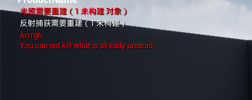
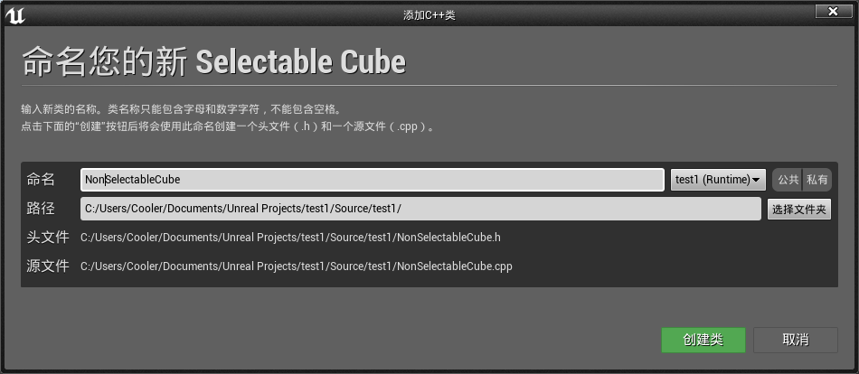
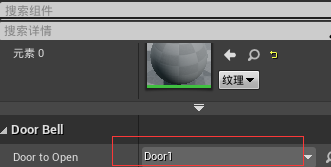
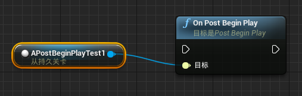

# 类与接口之间的通信-C++部分

## 创建一个UInterface

==UInterfaces== 是一系列的类，它们协同工作，使类在多个类层次结构中表现出多态行为。 本例讲述了纯粹用代码创建 `UInterface` 所涉及的基本步骤。首先创建一个新类：


添加代码：

==MyInterface.h==

```c++
// Fill out your copyright notice in the Description page of Project Settings.

#pragma once

#include "CoreMinimal.h"
#include "UObject/Interface.h"
#include "MyInterface.generated.h"

// This class does not need to be modified.
UINTERFACE(MinimalAPI)
class UMyInterface : public UInterface
{
	GENERATED_BODY()
};

/**
 * 
 */
class TEST1_API IMyInterface
{
	GENERATED_BODY()

	// Add interface functions to this class. This is the class that will be inherited to implement this interface.
public:
	FString GetTestName();

};

```

==MyInterface.cpp==

```c++
// Fill out your copyright notice in the Description page of Project Settings.


#include "MyInterface.h"

// Add default functionality here for any IMyInterface functions that are not pure virtual.

FString IMyInterface::GetTestName()
{
	unimplemented();
	return FString();
}  
```

对于从使用 UCLASS 的 UObject 继承的类，我们需要使用 `UINTERFACE 宏`来声明我们的`新 UINTERFACE`。 ==传入类说明符 MinialAPI== 只会导出**类的类型信息**供其他模块使用。

```c++
// This class does not need to be modified.
UINTERFACE(MinimalAPI)
class UMyInterface : public UInterface
{
	GENERATED_BODY()
};
```

接口的 UObject 部分的基类是 UInterface。就像 UCLASS 类型一样，我们需要在类体中放置一个宏，以便将自动生成的代码插入其中。 该宏是 UInterfaces  的 `GENERATED_BODY()`。 宏必须放在类主体的开头。

第二个类也被标记为 NEWTUTORIALPROJECT_API，并以特定的方式命名。

```c++
class TEST1_API IMyInterface
{
	GENERATED_BODY()

	// Add interface functions to this class. This is the class that will be inherited to implement this interface.
public:
	virtual FString GetTestName();

};
```

请注意，UInterface 派生类和标准类具有相同的名称，但前缀不同。 Uinterface ==派生类==具有前缀 `u`，==标准类==具有前缀 `i`。 这一点很重要，因为 Unreal Header 工具希望类能够根据它生成的代码来命名，以便正常工作。

普通的本机 Interface 类需要自己的自动生成内容，我们使用 GENERATED_BODY ()宏包括这些内容。我们声明继承接口的类应该在 IInterface 中实现的函数。在实现文件中，我们实现了 UInterface 的构造函数，因为它是由 Unreal Header Tool 声明的，并且需要一个实现。

我们还为 GetTestName ()函数创建了一个默认实现。 否则，编译中的链接阶段将失败。 此默认实现使用 ==unimplemented ()宏==，该宏将在执行代码行时，发出调试语句。


## 在对象上实现UInterface

上面例子我们已经创建了一个 `UInterface`，我们可以说一个对象已经定义或实现了它们的所有函数。 在这个例子中，我们将看到如何做到这一点。创建新类：


添加代码：

==SingleInterfaceActor.h==

```c++
// Fill out your copyright notice in the Description page of Project Settings.

#pragma once

#include "CoreMinimal.h"
#include "GameFramework/Actor.h"
#include "MyInterface.h"
#include "SingleInterfaceActor.generated.h"

UCLASS()
class TEST1_API ASingleInterfaceActor : public AActor, public IMyInterface
{
	GENERATED_BODY()
	
public:	
	// Sets default values for this actor's properties
	ASingleInterfaceActor();

protected:
	// Called when the game starts or when spawned
	virtual void BeginPlay() override;

public:	
	// Called every frame
	virtual void Tick(float DeltaTime);

	FString GetTestName()override;

};
```

==SingleInterfaceActor.cpp==

```c++
FString ASingleInterfaceActor::GetTestName()
{
	return IMyInterface::GetTestName();
}
```

在实现接口的方式上，C++ 使用了多重继承接口，所以我们在这里利用这种机制来声明我们的 SingleInterfaceActor 类，在这里我们添加了公共的 IMyInterface。

我们从 `IInterface` 而不是 `UInterface` 继承，以防止 `SingleInterfaceActor` 继承 UObject 的两个副本。

假设该接口声明了一个虚函数，如果我们希望自己实现该函数，就需要使用重载说明符重新声明该函数。在实现文件中，我们实现了重写的虚函数。在函数覆盖内部，为了演示的目的，我们调用函数的基本 IInterface 实现。 或者，我们可以编写自己的实现，完全避免调用基类。

调用父类方法时我们使用 IInterface: : Specifier 而不是 Super，因为 Super 指的是类的父类 UClass，而 IInterfaces 不是 UClasses (因此没有 u 前缀)。我们可以根据需要在对象上实现第二个或多个 IInterfaces。


## 检查类是否实现了UInterface

在编写C++代码时，最好是保持在使用之前确保某些内容已经存在编程想法。 在本例中我们将看到如何检查特定对象是否实现了特定的 UInterface。

创建新的GameMode：


添加代码：

==InterfaceGameMode.cpp==

```c++
// Fill out your copyright notice in the Description page of Project Settings.


#include "InterfaceGameMode.h"
#include "SingleInterfaceActor.h"
#include "Engine/Engine.h"

void AInterfaceGameMode::BeginPlay()
{
	Super::BeginPlay();

	FTransform SpawnLocation;
	ASingleInterfaceActor* spawnActor = GetWorld()->SpawnActor<ASingleInterfaceActor>(ASingleInterfaceActor::StaticClass(), SpawnLocation);

	UClass* ActorClass = spawnActor->GetClass();

	if (ActorClass->ImplementsInterface(UMyInterface::StaticClass()))
	{
		GEngine->AddOnScreenDebugMessage(-1, 10, FColor::Red, TEXT("xxxxx"));
	}
}
```

编译运行后：


在 BeginPlay 中，我们创建了一个空的 FTransform 对象，对于所有平移和旋转组件，该对象的默认值为0，因此我们不需要显式设置它们中的任何一个。

然后，我们使用 UWorld 中的 SpawnActor 函数，这样我们就可以创建 SingleActorInterface 的一个实例，将指向该实例的指针存储到一个临时变量中。

然后，我们在实例上使用 GetClass ()来获得对其关联的 UClass 的引用。 我们需要一个对 UClass 的引用，因为这个对象包含了对象的所有反射数据。

反射数据包括对象上所有 UPROPERTY 的名称和类型、对象的继承层次结构以及它实现的所有接口的列表。因此，我们可以在 UClass 上调用 ImplementsInterface () ，如果对象实现了相关的 UInterface，那么返回 true。如果对象实现了接口，并因此从 ImplementsInterface 返回 true，那么我们将向屏幕输出一条消息。


## 使用UInterface来统一对象数组:star:


作为开发人员，UInterfaces 提供的一个==优势==是**能够将实现公共接口的异构对象集合视为同一对象的集合**，使用 ==Cast== 来处理转换。

添加代码到GameMode中：

 ==InterfaceGameMode.h==

```c++
TArray<IMyInterface*> MyInterfaceInstances;
```

 ==InterfaceGameMode.cpp==

```c++
// Fill out your copyright notice in the Description page of Project Settings.


#include "InterfaceGameMode.h"
#include "SingleInterfaceActor.h"
#include "Engine/Engine.h"
#include "EngineUtils.h"

void AInterfaceGameMode::BeginPlay()
{
	Super::BeginPlay();

	FTransform SpawnLocation;
	ASingleInterfaceActor* spawnActor = GetWorld()->SpawnActor<ASingleInterfaceActor>(ASingleInterfaceActor::StaticClass(), SpawnLocation);

	UClass* ActorClass = spawnActor->GetClass();

	if (ActorClass->ImplementsInterface(UMyInterface::StaticClass()))
	{
		GEngine->AddOnScreenDebugMessage(-1, 10, FColor::Red, TEXT("xxxxx"));
	}

	for (TActorIterator<AActor> It(GetWorld(), AActor::StaticClass());It;++It)
	{
		AActor* Actor = *It;

		IMyInterface* MyInterfaceInstance = Cast<IMyInterface>(Actor);

		if (MyInterfaceInstance)
		{
			MyInterfaceInstances.Add(MyInterfaceInstance);
		}
	}

	FString Message = FString::Printf(TEXT("%d actors implement the interface"), MyInterfaceInstances.Num());

	GEngine->AddOnScreenDebugMessage(-1, 10, FColor::Red, Message);
}
```

编译运行后：


我们创建一个指向 MyInterface 实现的指针数组。在 BeginPlay 中，我们使用 TActorIterator<AActor> 获取场景中的所有 Actor 实例。具有如下构造函数:

```c++
explicit TActorIterator( UWorld* InWorld,TSubclassOf<ActorType>InClass = ActorType::StaticClass() ): Super(InWorld, InClass )
{
//
}
```

  期望有一个`UWorld`来执行操作，以及一个` UClass` 实例来指定我们感兴趣的 Actor 类型。`ActorIterator `是一个迭代器，类似于 STL 迭代器类型。 

在循环中，我们取消引用迭代器以获得一个 Actor 指针。然后我们尝试将其强制转换为我们的接口; 这将返回一个指向接口的指针，如果它实现了它，否则它将返回 nullptr。因此，我们可以检查接口指针是否为空，如果不是，我们可以将接口指针引用添加到数组中。

最后，一旦我们遍历了 TActorIterator 中的所有参与者，我们就可以在屏幕上显示一条消息，该消息显示实现该界面的项数。


## 从C++调用本地UInterface函数

我们也可以使用C++从其他类调用**本地 UInterface 函数**。 例如，在本例中，如果对象实现了特定的接口，我们将对其进行调用。

首先创建新类：


添加代码：

==AntiGravityVolume.h==

```c++
// Fill out your copyright notice in the Description page of Project Settings.

#pragma once

#include "CoreMinimal.h"
#include "GameFramework/Actor.h"
#include "Components/BoxComponent.h"
#include "AntiGravityVolume.generated.h"

UCLASS()
class TEST1_API AAntiGravityVolume : public AActor
{
	GENERATED_BODY()
	
public:	
	// Sets default values for this actor's properties
	AAntiGravityVolume();

	UPROPERTY()
		UBoxComponent* CollisionComponent;

	virtual void NotifyActorBeginOverlap(AActor* OtherActor)override;

	virtual void NotifyActorEndOverlap(AActor* OtherActor)override;

protected:
	// Called when the game starts or when spawned
	virtual void BeginPlay() override;

public:	
	// Called every frame
	virtual void Tick(float DeltaTime) override;

};
```

==AntiGravityVolume.cpp==

```c++
// Sets default values
AAntiGravityVolume::AAntiGravityVolume()
{
 	// Set this actor to call Tick() every frame.  You can turn this off to improve performance if you don't need it.
	PrimaryActorTick.bCanEverTick = true;

	CollisionComponent = CreateDefaultSubobject<UBoxComponent>("CollisionComponent");
	CollisionComponent->SetBoxExtent(FVector(200, 200, 400));
	RootComponent = CollisionComponent;

}

void AAntiGravityVolume::NotifyActorBeginOverlap(AActor* OtherActor)
{
	II_GravityObject* GravityObject = Cast<II_GravityObject>(OtherActor);
	if (GravityObject != nullptr)
	{
		GravityObject->DisableGravity();
	}
}

void AAntiGravityVolume::NotifyActorEndOverlap(AActor* OtherActor)
{
	II_GravityObject* GravityObject = Cast<II_GravityObject>(OtherActor);
	if (GravityObject != nullptr)
	{
		GravityObject->EnableGravity();
	}
}
```

==PhysicsCube.h==

```c++
//记得继承接口，,public II_GravityObject
UStaticMeshComponent* MyMesh;
```

==PhysicsCube.cpp==

```c++
// Sets default values
APhysicsCube::APhysicsCube()
{
 	// Set this actor to call Tick() every frame.  You can turn this off to improve performance if you don't need it.
	PrimaryActorTick.bCanEverTick = true;

	MyMesh = CreateDefaultSubobject<UStaticMeshComponent>("MyMesh");

	auto MeshAsset = ConstructorHelpers::FObjectFinder<UStaticMesh>(TEXT("StaticMesh'/Engine/BasicShapes/Cube.Cube'"));
	if (MeshAsset.Object != nullptr)
	{
		MyMesh->SetStaticMesh(MeshAsset.Object);
	}

	MyMesh->SetMobility(EComponentMobility::Movable);
	MyMesh->SetSimulatePhysics(true);
	SetActorEnableCollision(true);

}
```

==I_GravityObject.h==

```c++
virtual void EnableGravity();
virtual void DisableGravity();
```

==I_GravityObject.cpp==

```c++
// Fill out your copyright notice in the Description page of Project Settings.


#include "I_GravityObject.h"
#include "Components/PrimitiveComponent.h"
#include "Engine/Engine.h"
// Add default functionality here for any II_GravityObject functions that are not pure virtual.

void II_GravityObject::EnableGravity()
{
	AActor* ThisAsActor = Cast<AActor>(this);
	if (ThisAsActor != nullptr)
	{
		TArray<UPrimitiveComponent*> PrimitiveComponents;
		ThisAsActor->GetComponents(PrimitiveComponents);
		for (UPrimitiveComponent* comp : PrimitiveComponents)
		{
			comp->SetEnableGravity(true);
		}
		GEngine->AddOnScreenDebugMessage(-1, 1, FColor::Red, TEXT("Enable Gravity"));
	}
}

void II_GravityObject::DisableGravity()
{
	AActor* ThisAsActor = Cast<AActor>(this);
	if (ThisAsActor != nullptr)
	{
		TArray<UPrimitiveComponent*> PrimitiveComponents;
		ThisAsActor->GetComponents(PrimitiveComponents);
		for (UPrimitiveComponent* comp : PrimitiveComponents)
		{
			comp->SetEnableGravity(false);
		}
		GEngine->AddOnScreenDebugMessage(-1, 1, FColor::Red, TEXT("Disable Gravity"));
	}
}
```

编译完成后，我们在场景中做如下布局：


运行之后我们可以看到，方块落下的时候进入触发体时会失去重力作用，等离开触发体是又恢复重力作用。


我们创建了一个新的 Actor 类，并添加了一个 box 组件，以使 Actor 能够与角色发生重叠事件。 如果我们想使用二分空间划分定义功能来定义卷的形状，可以使用子类 AVolume (见 Modes 选项卡的 Geometry in the place 部分)。

NotifyActorBeginOverlap 和 NotifyActorEndOverlap 被重写，以便在对象进入或离开反重力卷区域时执行操作。在 NotifyActorBeginOverlap 实现中，我们尝试将与我们重叠的对象强制转换为一个 IGravityObject 指针。 这将测试所涉及的对象是否实现接口。 如果指针有效，那么对象确实实现了接口，因此使用接口指针调用对象上的 Interface 方法是安全的。

假设我们在 NotifyActorBeginOverlap 中，我们想禁用对象上的重力，因此我们称之为 DisableGravity ()。 在 NotifyActorEndOverlap 内部，我们执行相同的检查，但是我们重新启用对象的重力。 在 DisableGravity 的默认实现中，我们将(this 指针)强制转换为一个 actor。 这允许我们确认接口仅在 Actor 子类上实现，并调用在 Actor 中定义的方法。

如果指针是有效的，那么我们就知道我们是一个 Actor，因此我们可以使用 GetComponents<class ComponentType> ()从我们自己那里获得特定类型的所有组件的 TArray。 Getcomponents 是一个模板函数。 它需要一些模板参数，如下所示:

```c++
template<class T, class AllocatorType> voidGetComponents(TArray<T*, AllocatorType>&OutComponents)const
```

自2014年版本的标准以来，C++支持在编译时扣除模板参数。 这意味着，如果编译器能够根据我们提供的正常函数参数计算出模板参数，那么在调用函数时，我们就不需要实际指定模板参数。

Tarray 的默认实现是 template<typename T, typename Allocator = FDefaultAllocator> class TArray这意味着我们不需要在默认情况下指定一个分配器.因此我们在声明数组时只需使用 TArray<UPrimitiveComponent*>当 TArray 被传递到 GetComponents 函数时，编译器知道它实际上是 TArray<UPrimitiveComponent* ，FDefaultAllocator>，并且它能够使用 UPrimitiveComponent和 FDefaultAllocator 填充模板参数 t 和 AllocatorType，因此这两个都不需要作为函数调用的模板参数。

Getcomponents 迭代 Actor 拥有的组件，并且继承自类型名 t 的任何组件都有指向它们的指针存储在 PrimitiveComponents数组中。使用基于范围的 for 循环(c + + 的另一个新特性) ，我们可以遍历函数放置到 TArray 中的组件，而无需使用传统的 for 循环结构。

每个组件都有SetableGravity(false)调用它们，这使得引力失效。同样，EnableGravity 函数迭代包含在 actor 中的所有基本组件，并使用 SetableGravity (true)启用重力。


## 相互继承UInterface

有时，我们可能需要创建一个专门针对更通用的 UInterface 的 UInterface。 本例讲述了如何使用 UInterfaces 的继承来专门化一个 Killable 接口，该接口具有不死界面，不能通过正常方式杀死它。

创建新类：


添加代码：

==Killable.h==

```c++
// Fill out your copyright notice in the Description page of Project Settings.

#pragma once

#include "CoreMinimal.h"
#include "UObject/Interface.h"
#include "Killable.generated.h"

// This class does not need to be modified.
UINTERFACE(meta = (CannotImplementInterfaceInBlueprint))
class UKillable : public UInterface
{
	GENERATED_BODY()
};

/**
 * 
 */
class TEST1_API IKillable
{
	GENERATED_BODY()

	// Add interface functions to this class. This is the class that will be inherited to implement this interface.
public:
	UFUNCTION(BlueprintCallable, Category = Killable)
		virtual bool IsDead();

	UFUNCTION(BlueprintCallable, Category = Killable)
		virtual void Die();
};
```

==Killable.cpp==

```c++
// Fill out your copyright notice in the Description page of Project Settings.


#include "Killable.h"
#include "Engine/Engine.h"

// Add default functionality here for any IKillable functions that are not pure virtual.

bool IKillable::IsDead()
{
	return false;
}

void IKillable::Die()
{
	GEngine->AddOnScreenDebugMessage(-1, 1, FColor::Red, TEXT("Arrrgh"));

	AActor* Me = Cast<AActor>(this);

	if (Me)
	{
		Me->Destroy();
	}
}
```

==UnDead.h==

```c++
// Fill out your copyright notice in the Description page of Project Settings.

#pragma once

#include "CoreMinimal.h"
#include "UObject/Interface.h"
#include "Killable.h"
#include "UnDead.generated.h"

// This class does not need to be modified.
UINTERFACE(MinimalAPI)
class UUnDead : public UKillable
{
	GENERATED_BODY()
};

/**
 * 
 */
class TEST1_API IUnDead : public IKillable
{
	GENERATED_BODY()

	// Add interface functions to this class. This is the class that will be inherited to implement this interface.
public:
	virtual bool IsDead()override;
	virtual void Die()override;
	virtual void Turn();
	virtual void Banish();
};
```

==UnDead.cpp==

```c++
// Fill out your copyright notice in the Description page of Project Settings.


#include "UnDead.h"
#include "Engine/Engine.h"
// Add default functionality here for any IUnDead functions that are not pure virtual.

bool IUnDead::IsDead()
{
	return true;
}

void IUnDead::Die()
{
	GEngine->AddOnScreenDebugMessage(-1, 1, FColor::Red, "You can not kill what is already undead");
}

void IUnDead::Turn()
{
	GEngine->AddOnScreenDebugMessage(-1, 1, FColor::Red, "I am fleeing!");
}

void IUnDead::Banish()
{
	AActor* Me = Cast<AActor>(this);
	if (Me)
	{
		Me->Destroy();
	}
}
```

==Snail.h==

```c++
UCLASS()
class TEST1_API ASnail : public AActor,public IKillable
    ...
```

==Zombie.h==

```c++
UCLASS()
class TEST1_API AZombie : public AActor,public IUnDead
    ...
```

编译完成后拖拽Snail和Zombie进入场景，然后在关卡蓝图中获得引用并调用Die函数：


运行结果如下：



为了能够在 Level Blueprint 中测试这个例子，我们需要使接口函数可以通过 Blueprint 调用，因此我们需要在 UFUNCTION 上使用 BlueprintCallable 说明符。

但是，在 `UInterface` 中，编译器预期该接口默认可以通过C++和 Blueprint 实现。 这与 `BlueprintCallable` 相冲突，==后者只是说可以从 Blueprint 调用该函数，而不是在其中重写该函数。==

我们可以通过将接口标记为 ==CannotImplementInterfaceInBlueprint== 来解决这个冲突。 这样就可以使用 BlueprintCallable 作为我们的 UFUNCTION 规范，而不是 BlueprintImplementableEvent (由于允许通过 Blueprint 覆盖函数的额外代码，该事件有额外的开销)。

我们将 IsDead 和 Die 定义为 virtual，以允许在继承此类的另一个 c + + 类中重写它们。 在我们的默认接口实现中，IsDead 总是返回 false。 Die 的默认实现向屏幕打印死亡消息，然后销毁实现此接口的对象(如果它是 Actor)。

我们现在可以创建一个名为UnDead的第二个接口，它继承自 Killable。 我们在类声明中使用 public UKillable / public IKillable 来表示这一点。当然，因此，我们需要包含定义 Killable 接口的头文件。 我们的新接口覆盖了 Killable 定义的两个函数，以提供更合适的 isdead / die for Undead 的定义。 

我们还可以为Zomie特定的函数指定默认实现，即 Turn ()和Banish()。 当Zombie被转化时，他们逃跑了，为了演示的目的，我们在屏幕上打印一条信息。 然而，如果一个不死生物被放逐，他们就会被消灭得无影无踪。

为了测试我们的实现，我们创建了两个 Actors，它们分别从两个接口中的一个继承。 在我们将每个参与者的实例添加到我们的级别之后，我们使用 Level Blueprint 来访问级别的 BeginPlay 事件。 当级别开始运行时，我们使用一个消息调用来尝试并调用实例上的 Die 函数。

打印出来的消息是不同的，并且对应于两个函数实现，这表明 Zombie 的 Die 实现是不同的，并且覆盖了 Snail 的。


## 在C++中重写UInterface函数

允许C++中继承的 UInterfaces 的一个**作用**是，我们可以覆盖子类和 Blueprint 中的默认实现。 这个例子会讲述怎么做。遵循上个例子中的 UInterface 函数，其中已经创建了一个 Physics Cube，这个例子仍然会用到。

新建类：


其中新建一个PhysicsCube的子类：


再基于SelectableCube新建一个子类：



添加代码：

==Selectable.h==

```c++
virtual bool TrySelect();

virtual bool IsSelectable();

virtual void Deselect();
```

==Selectable.cpp==

```c++
// Fill out your copyright notice in the Description page of Project Settings.


#include "Selectable.h"

// Add default functionality here for any ISelectable functions that are not pure virtual.
bool ISelectable::IsSelectable()
{
	GEngine->AddOnScreenDebugMessage(-1, 1, FColor::Red, "Selectable");
	return true;
}

bool ISelectable::TrySelect()
{
	GEngine->AddOnScreenDebugMessage(-1, 1, FColor::Red, "Accepting Selection");
	return true;
}

void ISelectable::Deselect()
{
	unimplemented();
}
```

==SelectableCube.h==

```c++
// Fill out your copyright notice in the Description page of Project Settings.

#pragma once

#include "CoreMinimal.h"
#include "PhysicsCube.h"
#include "Selectable.h"
#include "SelectableCube.generated.h"

/**
 * 
 */
UCLASS()
class TEST1_API ASelectableCube : public APhysicsCube,public ISelectable
{
	GENERATED_BODY()

public:
    ASelectableCube();
    
	virtual void NotifyHit(class UPrimitiveComponent* MyComp, AActor* Other, class UPrimitiveComponent* OtherComp, bool bSelfMoved, FVector HitLocation, FVector HitNormal, FVector NormalImpulse, const FHitResult& Hit)override;

	
};
```

==SelectableCube.cpp==

```c++
// Fill out your copyright notice in the Description page of Project Settings.


#include "SelectableCube.h"


ASelectableCube::ASelectableCube():Super()
{
	MyMesh->SetNotifyRigidBodyCollision(true);
}

void ASelectableCube::NotifyHit(class UPrimitiveComponent* MyComp, AActor* Other, class UPrimitiveComponent* OtherComp, bool bSelfMoved, FVector HitLocation, FVector HitNormal, FVector NormalImpulse, const FHitResult& Hit)
{
	if (ISelectable::IsSelectable())
	{
		TrySelect();
	}
}
```

==NonSelectableCube.h==

```c++
// Fill out your copyright notice in the Description page of Project Settings.

#pragma once

#include "CoreMinimal.h"
#include "SelectableCube.h"
#include "NonSelectableCube.generated.h"

/**
 * 
 */
UCLASS()
class TEST1_API ANonSelectableCube : public ASelectableCube
{
	GENERATED_BODY()

public:
	virtual bool TrySelect()override;
	virtual bool IsSelectable()override;
	virtual void Deselect()override;

	virtual void NotifyHit(class UPrimitiveComponent* MyComp, AActor* Other, class UPrimitiveComponent* OtherComp
		, bool bSelfMoved, FVector HitLocation, FVector HitNormal, FVector NormalImpulse, const FHitResult& Hit)override;
	
};
```

==NonSelectableCube.cpp==

```c++
// Fill out your copyright notice in the Description page of Project Settings.


#include "NonSelectableCube.h"
#include "Engine/Engine.h"

bool ANonSelectableCube::IsSelectable()
{
	GEngine->AddOnScreenDebugMessage(-1, 1, FColor::Red, "Not Selectable");
	return false;
}

bool ANonSelectableCube::TrySelect()
{
	GEngine->AddOnScreenDebugMessage(-1, 1, FColor::Red, "Refusing Selection");
	return false;
}

void ANonSelectableCube::Deselect()
{
	unimplemented();
}

void ANonSelectableCube::NotifyHit(class UPrimitiveComponent* MyComp, AActor* Other, class UPrimitiveComponent* OtherComp, bool bSelfMoved, FVector HitLocation, FVector HitNormal, FVector NormalImpulse, const FHitResult& Hit)
{
	if (IsSelectable())
	{
		TrySelect();
	}
}
```

运行结果：

NonSelectableCube落地时：


SelectableCube落地时：


我们在 Selectable 接口中创建了三个函数。 IsSelectable 返回一个布尔值来指示对象是否可选择。 我们也可以避免这种情况，只需使用 TrySelect，因为它返回一个布尔值来表示成功，但是，我们可能想知道您的 UI 中的对象是否是一个有效的选择，而不必实际尝试它。

TrySelect 实际上尝试选择对象。 没有明确的契约强迫用户在尝试选择对象时尊重 IsSelectable，因此命名 TrySelect 是为了告知选择可能不总是成功。

最后，取消选择是一个函数，它允许对象处理丢失选择的Actor。 这可能涉及更改 UI 元素、停止声音或其他视觉效果，或者简单地从单元周围移除选择轮廓。

函数的缺省实现为 IsSelectable 返回 true (缺省值为任何对象都是可选择的) ，为 TrySelect 返回 true (选择尝试总是成功) ，并且如果类未实现 Deselect 调用，则发出调试语句。

我们还可以将取消选择实现为纯虚函数。 SelectableCube 是从 PhysicsCube 继承而来的一个新类，但也实现了 ISelectable 接口。 它还覆盖 NotifyHit，这是一个在 AActor 中定义的虚拟函数，当参与者经历刚体冲突时会触发。

我们从 PhysicsCube 调用构造函数，并在 SelectableCube 的实现中使用 Super ()构造函数调用。 然后我们添加我们自己的实现，它在我们的静态网格实例上调用 ==SetNotifyRigidBodyCollision (true)==。 这是必要的，因为在默认情况下，刚体(比如带有碰撞的 PrimitiveComponent)不会触发 Hit 事件作为性能优化。 因此，我们重写的 NotifyHit 函数将永远不会被调用。

在 NotifyHit 的实现中，我们调用了一些 ISelectable 接口函数。 既然我们知道我们是从 ISelectable 继承的对象，我们就不需要强制转换到 ISelectable * 来调用它们。

我们检查对象是否可以用 ISelectable 选择，如果可以，我们将尝试使用 TrySelect 实际执行选择。 NonSelectableCube 继承自 SelectableCube，因此我们可以强制对象永远不可选择。

我们通过再次覆盖 ISelectable 接口函数来实现这一点。 在 ANonselectableCube: : IsSelectable ()中，我们将一条消息打印到屏幕上，这样我们就可以验证函数是否正在被调用，然后返回 false 以表明对象根本不可选择。

由于不可能选择 `NonselectableCube`，因此`取消选择`调用 `unimplemented ()` ，这将抛出一个**语句警告**，说明函数没有得到实现。现在，在运行程序时，每次 SelectableCube / NonSelectableCube 击中另一个对象，造成刚体冲突时，相关的参与者将尝试选择自己，并将消息打印到屏幕上。


## 使用UInterfaces实现简单的交互系统

这个例子将讲述如何结合许多其他例子来演示一个==简单的交互系统==，以及一个带有交互式门铃的门，来使门打开。另外这个例子要求使用 Action 绑定。 

首先创建新类：


添加代码：

==Interactable.h==

```c++
UFUNCTION(BlueprintNativeEvent, BlueprintCallable, Category = Interactable)
		bool CanInteract();
UFUNCTION(BlueprintNativeEvent, BlueprintCallable, Category = Interactable)
        void PerformInteract();
```

==Openable.h==

```c++
UFUNCTION(BlueprintNativeEvent, BlueprintCallable, Category = Openable)
		void Open();
```

==DoorBell.h==

```c++
// Fill out your copyright notice in the Description page of Project Settings.

#pragma once

#include "CoreMinimal.h"
#include "Engine/StaticMeshActor.h"
#include "Interactable.h"
#include "DoorBell.generated.h"

UCLASS()
class TEST1_API ADoorBell :  public AStaticMeshActor, public IInteractable
{
	GENERATED_BODY()
	
public:	
	// Sets default values for this actor's properties
	ADoorBell();

	virtual bool CanInteract_Implementation()override;
	virtual void PerformInteract_Implementation()override;

	UPROPERTY(BlueprintReadWrite, EditAnywhere)
		AActor* DoorToOpen;

private:
	bool HasBeenPushed;
};
```

==DoorBell.cpp==

```c++
// Fill out your copyright notice in the Description page of Project Settings.


#include "DoorBell.h"
#include "Engine/StaticMeshActor.h"
#include "Components/StaticMeshComponent.h"
#include "Openable.h"

// Sets default values
ADoorBell::ADoorBell()
{
 	// Set this actor to call Tick() every frame.  You can turn this off to improve performance if you don't need it.
	PrimaryActorTick.bCanEverTick = true;

	HasBeenPushed = false;

	auto MeshAsset=ConstructorHelpers::FObjectFinder<UStaticMesh>(TEXT("StaticMesh'/Engine/BasicShapes/Cube.Cube'"));

	UStaticMeshComponent* SM = GetStaticMeshComponent();

	if (SM != nullptr)
	{
		if (MeshAsset.Object != nullptr)
		{
			SM->SetStaticMesh(MeshAsset.Object);
			SM->SetGenerateOverlapEvents(true);
		}

		SM->SetMobility(EComponentMobility::Movable);
		SM->SetWorldScale3D(FVector(0.5, 0.5, 0.5));
	}

	SetActorEnableCollision(true);
	DoorToOpen = nullptr;
}

bool ADoorBell::CanInteract_Implementation()
{
	return !HasBeenPushed;
}

void ADoorBell::PerformInteract_Implementation()
{
	HasBeenPushed = true;
	if (DoorToOpen->GetClass()->ImplementsInterface(UOpenable::StaticClass()))
	{
		IOpenable::Execute_Open(DoorToOpen);
	}
}
```

==Door.h==

```c++
// Fill out your copyright notice in the Description page of Project Settings.

#pragma once

#include "CoreMinimal.h"
#include "Engine/StaticMeshActor.h"
#include "Interactable.h"
#include "Openable.h"
#include "Door.generated.h"

UCLASS()
class TEST1_API ADoor : public AStaticMeshActor,public IInteractable,public IOpenable
{
	GENERATED_BODY()
	
public:	
	// Sets default values for this actor's properties
	ADoor();

	UFUNCTION()
		virtual bool CanInteract_Implementation()override;

	UFUNCTION()
		virtual void PerformInteract_Implementation()override;

	UFUNCTION()
		virtual void Open_Implementation()override;

};
```

==Door.cpp==

```c++
// Fill out your copyright notice in the Description page of Project Settings.


#include "Door.h"
#include "Engine/StaticMesh.h"
#include "Components/StaticMeshComponent.h"
#include "Openable.h"

// Sets default values
ADoor::ADoor()
{
 	// Set this actor to call Tick() every frame.  You can turn this off to improve performance if you don't need it.
	PrimaryActorTick.bCanEverTick = true;

	auto MeshAsset = ConstructorHelpers::FObjectFinder<UStaticMesh>(TEXT("StaticMesh'/Engine/BasicShapes/Cube.Cube'"));

	UStaticMeshComponent* SM = GetStaticMeshComponent();

	if (SM != nullptr)
	{
		if (MeshAsset.Object != nullptr)
		{
			SM->SetStaticMesh(MeshAsset.Object);
			SM->SetGenerateOverlapEvents(true);
		}

		SM->SetMobility(EComponentMobility::Movable);
		SM->SetWorldScale3D(FVector(0.3, 2, 3));
	}

	SetActorEnableCollision(true);

}

bool ADoor::CanInteract_Implementation()
{
	return true;
}

void ADoor::PerformInteract_Implementation()
{
	GEngine->AddOnScreenDebugMessage(-1, 5, FColor::Red, TEXT("The door refuses to budge. Perhaps there is a hidden switch nearby ? "));
}

void ADoor::Open_Implementation()
{
	AddActorLocalOffset(FVector(0, 0, 200));
}

```

==InteractingPawn.h==

```c++
// Fill out your copyright notice in the Description page of Project Settings.

#pragma once

#include "CoreMinimal.h"
#include "GameFramework/DefaultPawn.h"
#include "InteratingPawn.generated.h"

UCLASS()
class TEST1_API AInteratingPawn : public ADefaultPawn
{
	GENERATED_BODY()

public:
	// Sets default values for this pawn's properties
	AInteratingPawn();
	
	void TryInteract();


public:	

	// Called to bind functionality to input
	virtual void SetupPlayerInputComponent(class UInputComponent* PlayerInputComponent) override;

};
```

==InteractingPawn.cpp==

```c++
// Fill out your copyright notice in the Description page of Project Settings.


#include "InteratingPawn.h"
#include "CollisionQueryParams.h"
#include "WorldCollision.h"
#include "Camera/PlayerCameraManager.h"
#include "GameFramework/PlayerController.h"
#include "Interactable.h"
#include "GameFramework/PlayerInput.h"


// Sets default values
AInteratingPawn::AInteratingPawn()
{
 	// Set this pawn to call Tick() every frame.  You can turn this off to improve performance if you don't need it.
	PrimaryActorTick.bCanEverTick = true;

}


void AInteratingPawn::TryInteract()
{
	APlayerController* MyController = Cast<APlayerController>(Controller);

	if (MyController)
	{
		APlayerCameraManager* MyCameraManager = MyController->PlayerCameraManager;

		auto StartLocation = MyCameraManager->GetCameraLocation();
		auto EndLocation = StartLocation + (MyCameraManager->GetActorForwardVector() * 100);

		FCollisionObjectQueryParams Params;
		FHitResult HitResult;

		GetWorld()->SweepSingleByObjectType(HitResult, StartLocation,
			EndLocation,
			FQuat::Identity,
			FCollisionObjectQueryParams(FCollisionObjectQueryParams::AllObjects),
			FCollisionShape::MakeSphere(25),
			FCollisionQueryParams(FName("Interaction"), true, this));
		
		if (HitResult.Actor != nullptr)
		{
			auto Class = HitResult.Actor->GetClass();
			if (Class->ImplementsInterface(UInteractable::StaticClass()))
			{
				if (IInteractable::Execute_CanInteract(HitResult.Actor.Get()))
				{
					IInteractable::Execute_PerformInteract(HitResult.Actor.Get());
				}
			}
		}
	}
}


// Called to bind functionality to input
void AInteratingPawn::SetupPlayerInputComponent(UInputComponent* PlayerInputComponent)
{
	Super::SetupPlayerInputComponent(PlayerInputComponent);

	PlayerInputComponent->BindAction("Interact", IE_Pressed, this, &AInteratingPawn::TryInteract);
	FInputActionKeyMapping interact("Interact", EKeys::F, 0, 0, 0, 0);
	UPlayerInput::AddEngineDefinedActionMapping(interact);

}
```

布局场景：


设置`Doorbell`：



运行程序后将人物移动到门铃旁边按下F：


与前面的例子一样，我们将 UFUNCTION 标记为 BlueprintNativeEvent 和 BlueprintCallable，以允许用`C++`或 Blueprint 实现 UInterface，并允许用任意一种方法调用函数。

为了方便起见，我们创建了基于 StaticMeshActor 的 DoorBell，并且有了门铃实现可互换接口。 在 DoorBell 的构造函数中，我们将 HasBeenPushed 和 DoorToOpen 初始化为默认的安全值。

- 在 `CanInteract `的实现中，我们返回 HasBeenPushed 的相反值，这样一旦按下按钮，它就不能与之交互。


- 在 `perminteract` 内部，我们检查是否有要打开的 door 对象的引用。 如果我们有一个有效的引用，我们验证门参与者实现了 `Openable`，然后我们在门上调用 Open 函数。 

在 Door 中，我们实现了可互操作性和可开启性，并重写了每个函数的功能。

- 我们将 CanInteract 的 Door 实现定义为与缺省实现相同。 在 perminteract 中，我们向用户显示一条消息。 在 Open 内部，我们使用 AddActorLocalOffset 将门移开一定距离。 有了蓝图中的时间轴或者线性插值，我们可以使这个过渡平稳而不是传送。


最后，我们创建一个新的角色，使玩家可以实际上与物体互动。 我们创建一个 TryInteract 函数，将其绑定到重写的 `SetupPlayerInputComponent` 函数中的` Interact 输入操作`。

这意味着当玩家执行绑定到 Interact 的输入时，我们的 TryInteract 函数将运行。 Tryinteract 获得对 PlayerController 的引用。程序可以通过 PlayerController 检索到相机，因此我们可以访问相机的当前位置和旋转。 我们使用相机的位置创建开始点和结束点，然后在远离相机位置的前进方向创建100个单元，并将这些单元传递到 `GetWorld: :SweepSingleByObjectType`。 这个函数接受许多参数。 

- Hitresult 是一个变量，它允许函数返回被跟踪的任何对象的信息。 
- ==CollisionObjectQueryParams 允许我们指定是对动态、静态项目感兴趣，还是对两者都感兴趣==。

- 我们利用 MakeSphere 函数通过形状来实现球体轨迹。 球体轨迹允许稍微更多的人为错误，通过定义一个圆柱体来检查对象，而不是一条直线。 考虑到玩家可能不会直接看你的对象，你可以适当地调整球体的半径。


- 最后一个参数 `SweepSingleByObjectType`是一个给跟踪命名的结构体，它允许我们指定我们是否正在碰撞一个复杂的碰撞几何体，最重要的是，它允许我们指定我们想要忽略启动跟踪的对象。


如果 HitResult 在跟踪完成后包含一个参与者，那么我们检查参与者是否实现了我们的接口，然后尝试在它上面调用 CanInteract。 如果参与者表示是，那么它就可以与之交互，因此我们会告诉它实际执行交互。


> 最后这一步的流程：按下`F`后，会以玩家为中心，生成一个球形的碰撞体，如果存在符合条件的触发体，返回结果中的`Actor`，可以进行访问，然后检查其是否实现了可交互接口。


# 类与接口之间的通信-蓝图部分

## 向Blueprint暴露UInterface方法

之前我们已经说过C++中定义和使用 UInterface的 方法，但是它们也应该可以从 Blueprint 中访问。 否则，使用蓝图的设计师或其他人将无法与我们的 UInterface 进行交互。 本例子讲述了如何从 Blueprint 系统中可调用的接口调用函数。

首先创建新类：


添加代码：

==APostBeginPlayTest.h==

```c++
UCLASS()
class TEST1_API AAPostBeginPlayTest : public AActor,public IPostBeginPlay
{
    ....
}
```

==PostBeginPlay.h==

```c++
// Fill out your copyright notice in the Description page of Project Settings.

#pragma once

#include "CoreMinimal.h"
#include "UObject/Interface.h"
#include "PostBeginPlay.generated.h"

// This class does not need to be modified.
UINTERFACE(meta = (CannotImplementInterfaceInBlueprint))
class UPostBeginPlay : public UInterface
{
	GENERATED_BODY()
};

/**
 * 
 */
class TEST1_API IPostBeginPlay
{
	GENERATED_BODY()

	// Add interface functions to this class. This is the class that will be inherited to implement this interface.
public:

	UFUNCTION(BlueprintCallable, Category = Test)
		virtual void OnPostBeginPlay();
};
```

打开关卡蓝图，将场景中的`APostBebinPlayTest1` 引用到，并且调用接口方法：




UInterface / IInterface pair 函数与其他例子中的函数类似，其中 `UInterface` 包含反射信息和其他数据，`IInterface` 作为实际的接口类，可以从其中继承。

允许 IInterface 中的函数暴露给 Blueprint 的最重要的元素是 UFUNCTION 说明符。 Blueprintcallable 将此函数标记为可以从 Blueprint 系统调用的函数。

以任何方式暴露给 Blueprint 的任何函数都需要一个 Category 值。 此类别值指定函数将在上下文菜单中列出的标题。

函数还必须标记为虚拟的——这是为了让通过本机代码实现接口的类能够覆盖其内部函数的实现。 如果没有虚拟说明符，Unreal Header 工具将给出一个错误，表明您必须添加 virtual 或 BlueprintImplementableEvent 作为 UFUNCTION 说明符。

原因在于，如果没有这两者中的任何一个，那么在 C++ (由于缺少 virtual)或 Blueprint (由于 BlueprintImplementableEvent缺少)中，接口函数将无法重写。 不能重写但只能继承的接口实用程序有限，因此 Epic 选择不在 UInterfaces 中支持它。

然后我们提供 OnPostBeginPlay 函数的默认实现，它使用 GEngine 指针显示调试消息，确认该函数已被调用。


## 在Bluprint中实现UInterface函数

Unreal 中 UInterface 的一个关键优势是用户可以在编辑器中实现 UInterface 函数。 这意味着接口可以在 Blueprint 中实现，而不需要任何C++代码，这对设计人员很有帮助。

首先创建新类：


添加代码：

==AttackAvoider.h==

```c++
UFUNCTION(BlueprintImplementableEvent, BlueprintCallable, Category = AttackAvoider)
		void AttackIncoming(AActor* AttackActor);
```

在编辑器中新建一个Actor


点击类设置，添加Interface，选择我们先前创建的：


添加蓝图：


运行程序后：


创建 UInterface / Iinterface 的方式与我们在本章中看到的其他方法完全相同。 但是，当我们向接口添加一个函数时，我们使用一个新的 UFUNCTION 说明符 ==BlueprintImplementableEvent==。 `Blueprintimplementableevent` 告诉 Unreal Header 工具生成代码，创建一个**空存根函数**，该函数可以由 Blueprint 实现。 我们不需要为这个函数提供一个**默认的 c + + 实现**，我们在 Blueprint 内部实现了这个接口，它以一种允许我们在 Blueprint 中定义其实现的方式向我们公开了这个函数。 头工具创建的自动生成代码将对 UInterface 函数的调用转发到 Blueprint 实现。

通过 Blueprints 重写 C++ UInterface 函数展示了如何在 C++ 中定义 UInterface 函数的默认实现，然后在 Blueprint 中有选择地重写它。


## 创建可以在Blueprint中重写C++ UInterface函数实现

就像前面的例子一样，UInterfaces 是有用的，但是如果设计人员不能使用它们的功能，那么这个实用程序就会受到严重的限制。

前面的配方，从本地基类将 UInterface 方法暴露到 Blueprints，讲述了如何从 Blueprint 调用C++UInterface 函数; 这个例子讲述了如何用自己的定制 Blueprint-only 函数替换 UInterface 函数的实现。

首先创建新类：


添加代码：(这次为了方便我把实现都写在了C++中)

==Wearable.h==

```c++
UFUNCTION(BlueprintNativeEvent, BlueprintCallable, Category = Wearable)
		int32 GetStrengthRequirement();

UFUNCTION(BlueprintNativeEvent, BlueprintCallable, Category = Wearable)
        bool CanEquip(APawn* Wearer);

UFUNCTION(BlueprintNativeEvent, BlueprintCallable, Category = Wearable)
        void OnEquip(APawn* Wearer);
```

==Boots.h==

```c++
// Fill out your copyright notice in the Description page of Project Settings.

#pragma once

#include "CoreMinimal.h"
#include "GameFramework/Actor.h"
#include "Wearable.h"
#include "Engine/Engine.h"
#include "Boots.generated.h"

UCLASS()
class TEST1_API ABoots : public AActor, public IWearable
{
	GENERATED_BODY()
	
public:	
	// Sets default values for this actor's properties
	ABoots();

protected:
	// Called when the game starts or when spawned
	virtual void BeginPlay() override;

public:	
	// Called every frame
	virtual void Tick(float DeltaTime) override;

	virtual void OnEquip_Implementation(APawn* Wearer)override
	{
		GEngine->AddOnScreenDebugMessage(-1, 1, FColor::Red, "Item being worn");
	}

	virtual bool CanEquip_Implementation(APawn* Wearer)override
	{
		return true;
	}

	virtual int32 GetStrengthRequirement_Implementation()override
	{
		return 0;
	}

};

```

创建一个Actor并添加Interface:


添加蓝图代码：


然后在场景中布局：


在关卡中获得引用并调用方法：


运行结果如下：


这个例子同时使用两个 UFUNCTION 说明符: `BlueprintNativeEvent` 和 `BlueprintCallable`。 `Blueprintcallable` 是在 Blueprint Editor 中将 UFUNCTION 标记为可见和可调用的一种方法。

BlueprintNativeEvent表示一个 UFUNCTION，该函数具有默认的C++(本机代码)实现，但在 Blueprint 中也是可重写的。 它是虚函数和 BlueprintImplementableEvent 的组合。

为了使这种机制发挥作用，Unreal Header 工具生成函数的主体，以便函数的Blueprint 版本在它存在的情况下被调用; 否则，它会将方法调用发送到本地实现。

Boots 类实现了 IWarable，覆盖了默认功能。 相比之下，Clothes 也实现了 IWearable，但是它对 Blueprint 中定义的 OnEquip 有一个覆盖的实现。 当我们使用级别蓝图来为两个参与者调用 OnEquip 时，可以验证这一点。


## 从C++调用蓝图定义的接口函数

之前的例子关注的是C++在 Blueprint 中的可用性，比如能够从 Blueprint 中的C++调用函数，以及用 Blueprint 覆盖C++函数，但这个例子讲述的是相反的: ==从C++调用 Blueprint 定义的接口函数==。

首先创建新类：


添加代码：

==Talker.h==

```c++
UFUNCTION(BlueprintNativeEvent, BlueprintCallable, Category = Talk)
		void StartTalking();
```

==TalkingMesh.h==

```c++
// Fill out your copyright notice in the Description page of Project Settings.

#pragma once

#include "CoreMinimal.h"
#include "Engine/StaticMeshActor.h"
#include "Talker.h"
#include "TalkingMesh.generated.h"

/**
 * 
 */
UCLASS()
class TEST1_API ATalkingMesh : public AStaticMeshActor, public ITalker
{
	GENERATED_BODY()

public:
	ATalkingMesh();
	void StartTalking_Implementation();
	
};
```

==TalkingMesh.cpp==

```c++
// Fill out your copyright notice in the Description page of Project Settings.


#include "TalkingMesh.h"
#include "Engine/StaticMesh.h"
#include "Components/StaticMeshComponent.h"
#include "Engine/Engine.h"


ATalkingMesh::ATalkingMesh() :Super()
{
	auto MeshAsset = ConstructorHelpers::FObjectFinder<UStaticMesh>(TEXT("StaticMesh'/Engine/BasicShapes/Cube.Cube'"));

	UStaticMeshComponent* SM = GetStaticMeshComponent();

	if (SM != nullptr)
	{
		if (MeshAsset.Object != nullptr)
		{
			SM->SetStaticMesh(MeshAsset.Object);
            SM->SetGenerateOverlapEvents(true);
		}
		SM->SetMobility(EComponentMobility::Movable);
	}

	SetActorEnableCollision(true);
}

void ATalkingMesh::StartTalking_Implementation()
{
	GEngine->AddOnScreenDebugMessage(-1, 1, FColor::Red, TEXT("Hello there. What is your name?"));
}
```

==TalkingPawn.h==

```c++
// Fill out your copyright notice in the Description page of Project Settings.

#pragma once

#include "CoreMinimal.h"
#include "GameFramework/DefaultPawn.h"
#include "Components/BoxComponent.h"
#include "TalkingPawn.generated.h"

/**
 * 
 */
UCLASS()
class TEST1_API ATalkingPawn : public ADefaultPawn
{
	GENERATED_BODY()

public:
	ATalkingPawn();

	UPROPERTY()
		UBoxComponent* TalkColider;

	UFUNCTION()
		void OnTalkOverlap(UPrimitiveComponent* OverlappedComponent, AActor* OtherActor,UPrimitiveComponent* OtherComp, int32 otherBodyIndex, bool bFromSweep, const FHitResult& SweepResult);
	
};
```

==TalkingPawn.cpp==

```c++
// Fill out your copyright notice in the Description page of Project Settings.


#include "TalkingPawn.h"
#include "Talker.h"

ATalkingPawn::ATalkingPawn()
{
	PrimaryActorTick.bCanEverTick = true;
	TalkColider = CreateDefaultSubobject<UBoxComponent>("TalkCollider");
	TalkColider->SetBoxExtent(FVector(200, 200, 100));

	TalkColider->OnComponentBeginOverlap.AddDynamic(this, &ATalkingPawn::OnTalkOverlap);
	TalkColider->AttachToComponent(RootComponent, FAttachmentTransformRules::SnapToTargetIncludingScale);
}

void ATalkingPawn::OnTalkOverlap(UPrimitiveComponent* OverlappedComponent, AActor* OtherActor,UPrimitiveComponent* OtherComp,int32 otherBodyIndex, bool bFromSweep, const FHitResult& SweepResult)
{
	auto Class = OtherActor->GetClass();
	if (Class->ImplementsInterface(UTalker::StaticClass()))
	{
		ITalker::Execute_StartTalking(OtherActor);
	}
}
```

设置一下默认角色：


场景中布局：


运行后当角色靠近方块，会打印语句：


创建一个基于TakingMesh的蓝图类，并添加代码：


运行后角色靠近的打印语句改变：

这是因为方法在蓝图中被重写。


继续修改代码：

右击节点点击调用父类方法


此时运行结果如下：


像往常一样，我们创建一个新的接口，然后向 IInterface 类添加一些函数定义。 我们使用 `BlueprintNativeEvent `说明符表示我们希望在C++中声明一个默认实现，然后可以在 Blueprint 中重写该实现。 我们创建一个新类(为方便起见从 StaticMeshActor 继承)并在其上实现接口。

在新类构造函数的实现中，我们加载了一个静态网格，并像往常一样设置了碰撞。 然后，我们为接口函数添加一个实现，它只是将一条消息打印到屏幕上。

如果我们在一个成熟的项目中使用它，我们可以播放动画，播放音频，改变用户界面，以及任何其他必要的东西来启动与你的谈话者的对话。

不过，在这一点上，我们还没有任何实际的东西可以在我们的TalkingMesh上称为 StartTalking。 实现这一点的最简单方法是创建一个新的 Pawn 子类(同样，为方便起见从 DefaultPawn 继承) ，它可以开始与任何与它相冲突的 Talker 参与者进行对话。

为了实现这一点，我们创建了一个新的 BoxComponent，以确定触发对话的半径。 像往常一样，它是一个 UPROPERTY，所以它不会被垃圾收集。 我们还为一个函数创建了定义，当新的 BoxComponent 与场景中的另一个 Actor 重叠时，这个函数将被触发。

我们 TalkingPawn 的构造函数初始化新的 BoxComponent，并适当地设置它的区段。 构造函数还将 OnTalkOverlap 函数绑定为事件处理程序，以处理 BoxComponent 的冲突。 它还将盒子组件附加到我们的 RootComponent 上，这样当玩家在关卡上移动时，它就可以跟随玩家角色的其余部分移动。

在 OnTalkOverlap 中，我们需要检查另一个参与者是否实现了 Talker 接口。 最可靠的方法是使用 UClass 中的 ImplementsInterface 函数。 该函数使用 Unreal Header Tool 在编译期间生成的类信息，并正确处理C++和 blueprint 实现的接口。

如果函数返回 true，我们可以使用 IInterface 中包含的一个特殊的自动生成函数来调用我们在实例上选择的 interface 方法。 这是表单 IInterface: : Execute_functionname 的静态方法。 在我们的实例中，我们的 IInterface 是 ITalker，函数是 StartTalking，因此我们要调用的函数是 ITalker: : Execute_StartTalking ()。

我们需要这个函数的原因是，当一个接口在 Blueprint 中实现时，这个关系实际上并不是在编译时建立的。 因此，C++ 没有意识到接口是实现的，所以我们不能将 Blueprint 类强制转换为 IInterface 来直接调用函数。

Execute 函数获取一个指向实现该接口的对象的指针，并调用许多内部方法来调用所需函数的 Blueprint 实现。

当我们控制角色走动时，当它的 BoxComponent 与其他对象重叠时，自定义的角色会不断地收到通知。 如果他们实现了 UTalker / ITalker 接口，角色就会尝试在有接口的 Actor 实例上调用 StartTalking，然后在屏幕上打印相应的消息。
