# C++与UE4的集成-内容开发部分

| BlueprintType |
| ------------- |
| Blueprintable |
|               |
|               |


## 使用类或结构作为蓝图变量

在C++中声明的类型不会自动合并到 Blueprint 中用作变量。本例讲述了如何使它们可访问，以便我们可以使用自定义本机代码类型作为 Blueprint 函数参数。

创建新类：
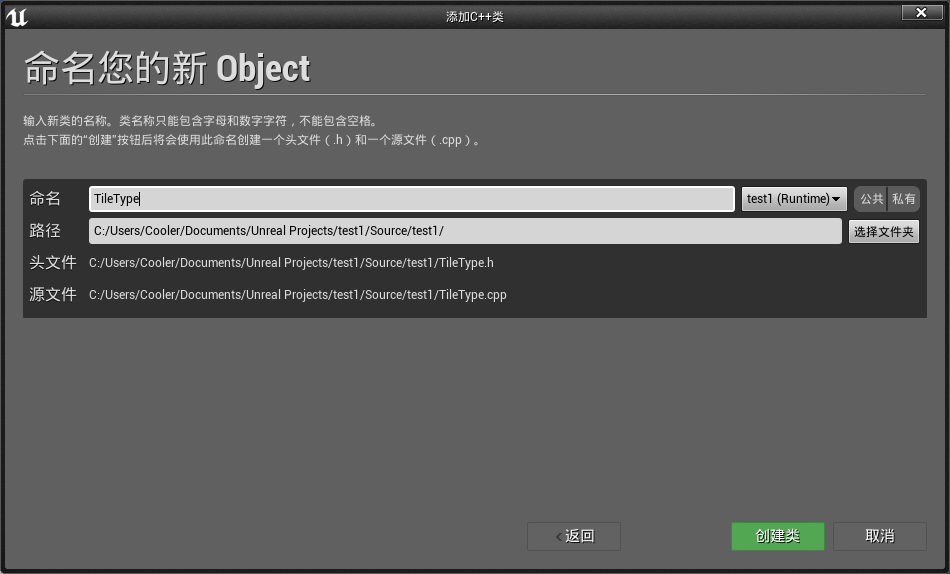

添加代码:

==TileType.h==

```c++
public:
	UPROPERTY()
		int32 MovementCost;
	UPROPERTY()
		bool CanBeBuiltOn;
	UPROPERTY()
		FString TileName;
```

打开某个蓝图，新建一个变量发现无法找到该类。

对代码进行修改并重新编译：

```c++
UCLASS(BlueprintType)
class TEST1_API UTileType : public UObject
{
...
```

这时候蓝图中变量就可以找到这个类型了：

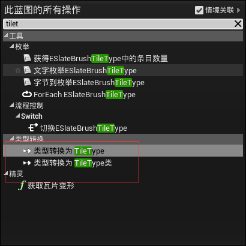


## 创建可以在蓝图中子类化的类或结构

虽然我们的重点一直是使用C++ ，==一个更标准的工作流程==是：实现核心的游戏功能以及性能至关重要的代码在C++，并公开这些功能的蓝图，以允许设计师开发原型游戏，然后可以由程序员重构额外的蓝图功能，或推回到C++层。 因此，最常见的任务之一是以 Blueprint 系统可见的方式标记类和结构。

首先新建新类：

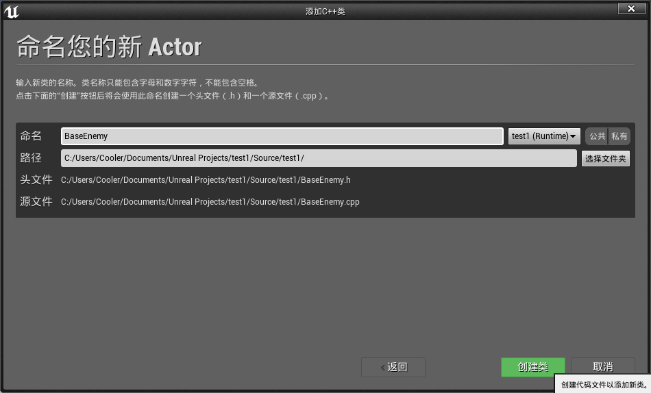

添加代码：

==BaseEnemy.h==

```c++
UPROPERTY()
		FString WeaponName;

UPROPERTY()
		int32 MaximumHealth;
```

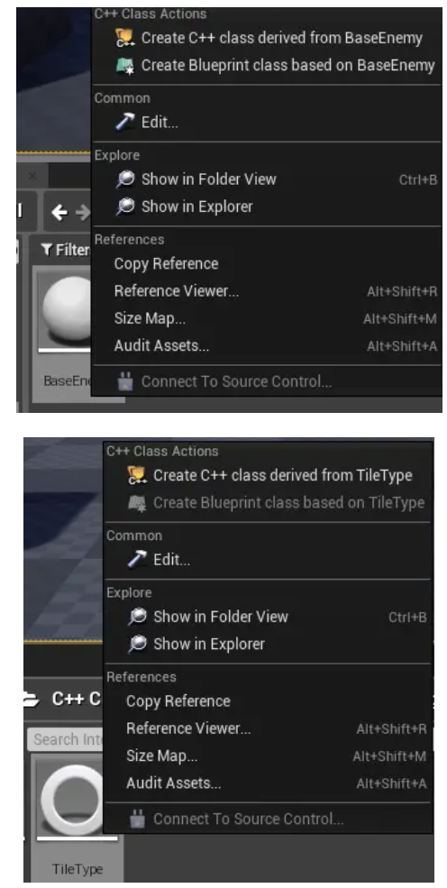

对比以下可以发现原来的`TileType` 不能创建**子类蓝图**。

这是因为`BaseEnemy`是基于父类Actor的，Actor 具有`Blueprintable`的宏指定。
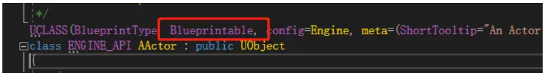

所以我们再次修改以下TileType代码加上Blueprintable的宏指定：

```c++
UCLASS(BlueprintType,Blueprintable)
```

编译之后我们看到TileType也可以创建蓝图子类了：

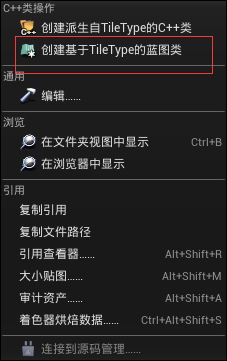


## 创建可以在蓝图中实现的事件

虽然将类标记为 `BlueprintType` 或 `Blueprintable` 允许我们在 Blueprint 中传递类的实例，或者使用 Blueprint 类对类型进行子类化，但这些说明符实际上并没有说明成员函数或变量，以及它们是否应该公开给 Blueprint。这个例子讲述了如何标记函数，以便可以在 Blueprint 图中调用该函数。

创建新类：


添加代码：

==SlidingDoor.h==

```c++
// Fill out your copyright notice in the Description page of Project Settings.

#pragma once

#include "CoreMinimal.h"
#include "Engine/StaticMeshActor.h"
#include "SlidingDoor.generated.h"

/**
 * 
 */
UCLASS()
class TEST1_API ASlidingDoor : public AStaticMeshActor
{
	GENERATED_BODY()
public:
	ASlidingDoor();

protected:
	virtual void BeginPlay()override;

public:
	virtual void Tick(float DeltaSeconds)override;

	UFUNCTION(BlueprintCallable, Category = Door)
		void Open();

	UPROPERTY()
		bool IsOpen;

	UPROPERTY()
		FVector TargetLocation;
};
```

==SlidingDoor.cpp==

```c++
// Fill out your copyright notice in the Description page of Project Settings.


#include "SlidingDoor.h"
#include "Engine/Engine.h"
#include "Components/StaticMeshComponent.h"

ASlidingDoor::ASlidingDoor()
{
	PrimaryActorTick.bCanEverTick = true;

	auto MeshAsset = ConstructorHelpers::FObjectFinder<UStaticMesh>(TEXT("StaticMesh'/Engine/BasicShapes/Cube.Cube'"));

	UStaticMeshComponent* SM = GetStaticMeshComponent();

	if (SM != nullptr)
	{
		if (MeshAsset.Object != nullptr)
		{
			SM->SetStaticMesh(MeshAsset.Object);
			SM->SetGenerateOverlapEvents(true);
		}
		SM->SetMobility(EComponentMobility::Movable);
		SM->SetWorldScale3D(FVector(0.3, 2, 3));
	}

	SetActorEnableCollision(true);

	IsOpen = false;
	PrimaryActorTick.bStartWithTickEnabled = true;
}

void ASlidingDoor::BeginPlay()
{
	Super::BeginPlay();
}

void ASlidingDoor::Tick(float DeltaSeconds)
{
	Super::Tick(DeltaSeconds);

	if (IsOpen)
	{
		SetActorLocation(FMath::Lerp(GetActorLocation(), TargetLocation, 0.05));
	}
}

void ASlidingDoor::Open()
{
	TargetLocation = ActorToWorld().TransformPositionNoScale(FVector(0, 0, 200));
	IsOpen = true;
}
```

编译完成后再场景中布局：

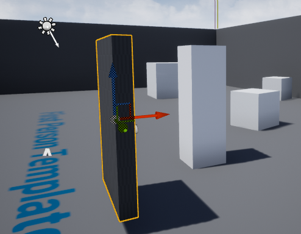

并添加代码到关卡蓝图：

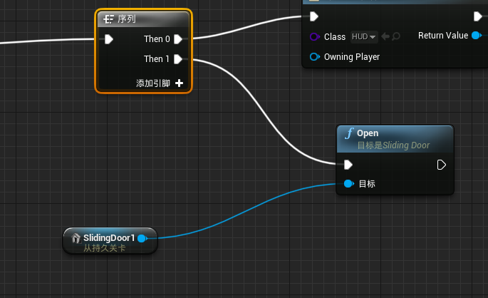

运行看到门开启了：（调用了C++的函数）

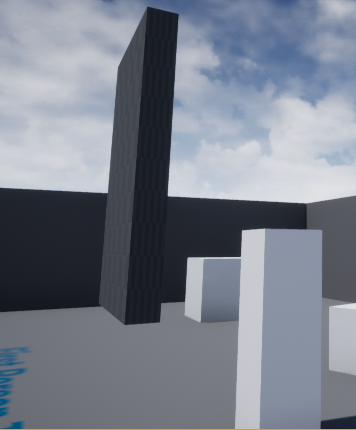


## 创建可以在蓝图中调用的事件

C++与 Blueprint 更紧密集成的另一种方式是通过创建可以在本机代码中实现 Blueprint 的函数。 这允许程序员指定一个事件并调用它，而不需要知道任何关于实现的信息。 然后，类可以在 Blueprint 中被子类化，生产团队的另一个成员可以实现事件的处理程序，而无需编译C++

首先创建一个新类：


添加代码：

==Spotter.h==

```c++
UFUNCTION(BlueprintImplementableEvent)
		void OnPlayetSpotter(APawn* Player
```

==Spotter.cpp==

```c++
// Fill out your copyright notice in the Description page of Project Settings.


#include "Spotter.h"
#include "DrawDebugHelpers.h"

ASpotter::ASpotter()
{
	PrimaryActorTick.bCanEverTick = true;

	auto MeshAsset = ConstructorHelpers::FObjectFinder<UStaticMesh>(TEXT("StaticMesh'/Engine/BasicShapes/Cube.Cube'"));

	UStaticMeshComponent* SM = GetStaticMeshComponent();

	if (SM != nullptr)
	{
		if (MeshAsset.Object != nullptr)
		{
			SM->SetStaticMesh(MeshAsset.Object);
			SM->SetGenerateOverlapEvents(true);
		}
		SM->SetMobility(EComponentMobility::Movable);
		SM->SetRelativeRotation(FRotator(90, 0, 0));
	}

}

void ASpotter::Tick(float DeltaSeconds)
{
	Super::Tick(DeltaSeconds);

	auto EndLocation = GetActorLocation() + ActorToWorld().TransformVector(FVector(0, 0, 200));

	FHitResult hitResult;
	GetWorld()->SweepSingleByChannel(hitResult, GetActorLocation(), EndLocation, FQuat::Identity,
		ECC_Camera, FCollisionShape::MakeSphere(25),
		FCollisionQueryParams("Spot", true, this));

	APawn* SpottedPlayer = Cast<APawn>(hitResult.Actor.Get());

	if (SpottedPlayer != nullptr)
	{
		OnPlayetSpotter(SpottedPlayer);
	}

	DrawDebugLine(GetWorld(), GetActorLocation(), EndLocation, FColor::Red);
}
```

拖入场景：

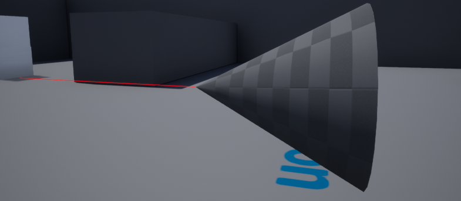

创建一个基于它的蓝图类，在蓝图中重写函数：

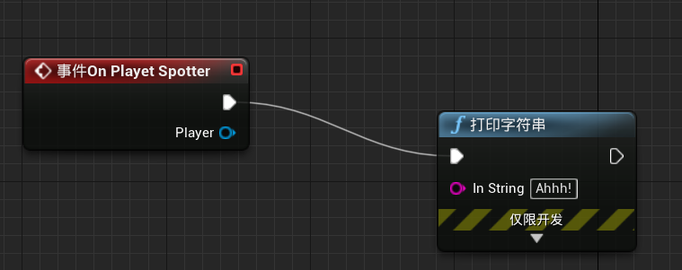

在蓝图子类时，会打印字符串，而C++类并无事发生。

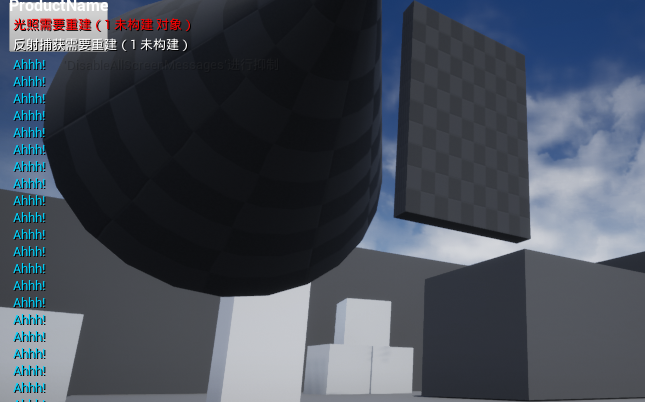


## 向蓝图公开多种类型的委托（代理）

==多播代理==是向多个对象广播事件的一种很好的方式，这些对象可以监听或订阅相关事件。如果我们拥有一个C++模块，该模块生成可能是任意的参与者希望得到通知的事件，那么它们就特别有价值。本例讲述了如何在C++中创建一个多播代理，该委托可以在运行时通知一组其他参与者。

首先创建新类：
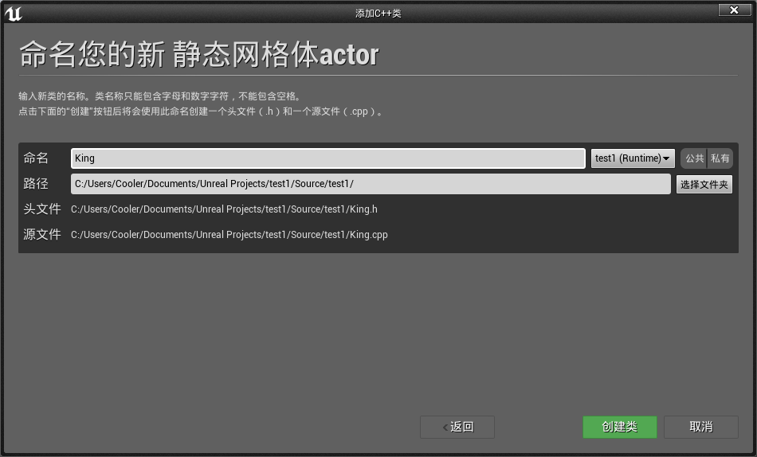


添加代码：

==King.h==

```c++
DECLARE_DYNAMIC_MULTICAST_DELEGATE_OneParam(FOnkingDeathSignature, AKing*, DeadKing);

UCLASS()
class TEST1_API AKing : public AStaticMeshActor
{
	GENERATED_BODY()
	
public:
	AKing();

	UFUNCTION(BlueprintCallable, Category = King)
		void Die();

	UPROPERTY(BlueprintAssignable)
		FOnkingDeathSignature OnKingDeath;
};
```

==King.cpp==

```c++
// Fill out your copyright notice in the Description page of Project Settings.
#include "King.h"

AKing::AKing()
{
	PrimaryActorTick.bCanEverTick = true;

	auto MeshAsset = ConstructorHelpers::FObjectFinder<UStaticMesh>(TEXT("StaticMesh'/Engine/BasicShapes/Cone.Cone'"));
	UStaticMeshComponent* SM = GetStaticMeshComponent();

	if (SM != nullptr)
	{
		if (MeshAsset.Object != nullptr)
		{
			SM->SetStaticMesh(MeshAsset.Object);
			SM->SetGenerateOverlapEvents(true);
		}
		SM->SetMobility(EComponentMobility::Movable);
	}
}

void AKing::Die()
{
	OnKingDeath.Broadcast(this);
}
```

==Peasant.h==

```c++
UFUNCTION(BlueprintCallable, Category = Peasant)
		void Flee(AKing* DeadKing);
```

==Peasant.cpp==

```c++
// Fill out your copyright notice in the Description page of Project Settings.


#include "Peasant.h"

APeasant::APeasant()
{
	PrimaryActorTick.bCanEverTick = true;

	auto MeshAsset = ConstructorHelpers::FObjectFinder<UStaticMesh>(TEXT("StaticMesh'/Engine/BasicShapes/Cube.Cube'"));

	UStaticMeshComponent* SM = GetStaticMeshComponent();

	if (SM != nullptr)
	{
		if (MeshAsset.Object != nullptr)
		{
			SM->SetStaticMesh(MeshAsset.Object);
			SM->SetGenerateOverlapEvents(true);
		}
		SM->SetMobility(EComponentMobility::Movable);
	}
}

void APeasant::Flee(AKing* DeadKing)
{
	GEngine->AddOnScreenDebugMessage(-1, 2, FColor::Red, TEXT("Waily Waily"));

	FVector FleeVector = GetActorLocation() - DeadKing->GetActorLocation();

	FleeVector.Normalize();

	FleeVector *= 500;

	SetActorLocation(GetActorLocation() + FleeVector);
}
```

编译完成后创建一个基于Peasant的蓝图类：

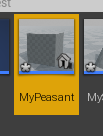

添加蓝图代码：

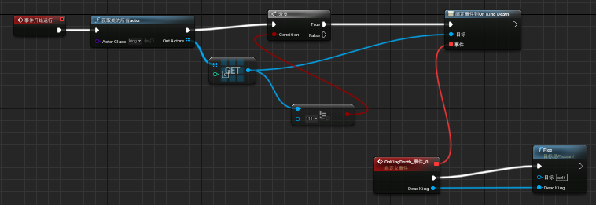


在场景中布局：

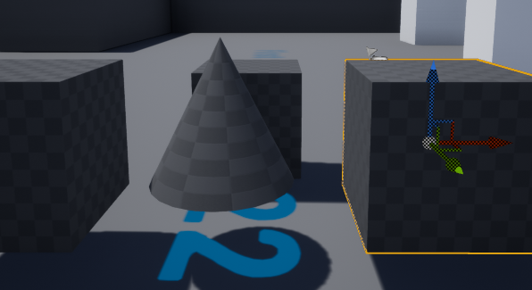

在关卡蓝图上引用King并设置开启后3s 调用King的Die函数：

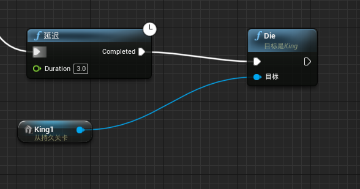

运行结果如下：

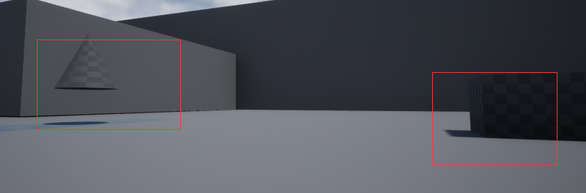

我们创建了一个新的 Actor (为了方便起见，基于 StaticMeshActor，因为它省去了为 Actor 可视化表示声明或创建一个 Static Mesh 组件的麻烦)。我们使用 ==DECLARE_DYNAMIC_MULTICAST_DELEGATE_ONEPARAM== 宏声明一个动态多播委托。

动态多播委托允许任意数量的对象订阅(监听)和取消订阅(停止监听) ，这样当委托被广播时它们就会得到通知。该宏接受许多参数——正在创建的新委托签名的类型名称、签名参数的类型，然后是签名参数的名称。

我们还为 King 添加了一个函数，Die()。 因为我们希望将函数暴露给 BlueprintCallable 以进行原型设计，所以我们将其标记为 BlueprintCallable。

我们之前使用的 DECLARE_DYNAMIC_MULTICAST_DELEGATE_ONEPARAM宏只声明了一个类型; 它没有声明委托的实例，所以我们现在这样做，引用我们在调用该宏时提供的类型名称。

动态多播委托可以在其 UPROPERTY 声明中标记为 ==BlueprintAssignable==。 这表明 Blueprint 系统可以动态地将事件分配给调用委托的 Broadcast 函数时要调用的委托。

像往常一样，我们为King分配了一个简单的网格，以便在游戏场景中有一个视觉表示。

在 Die 函数中，我们在自己的委托上，调用 Broadcast。 我们指定委托将具有一个参数，该参数是指向死亡的 king 的指针，因此我们将这个指针作为参数传递给广播函数。

如果要销毁国王，而不是在它死亡时播放动画或其他效果，则需要更改委托的声明并传递不同的类型。 例如，可以使用 FVector，直接通过死去国王的位置，这样农民仍然可以适当地逃离。 如果不这样做，可能会遇到这样的情况: 在调用 Broadcast 时 King 指针是有效的，但是对 Actor: : Destroy ()的调用在执行绑定函数之前使其无效。

在下一个 StaticMeshActor 子类中，我们通常使用不同于 King 的形状来初始化静态网格组件。在实现农民逃离功能的内部，我们通过在屏幕上打印消息来模拟农民播放声音。然后我们计算一个矢量，让农民逃离，首先找到一个矢量从死去的国王到这个农民的位置。我们将向量标准化以检索指向同一方向的单位向量(长度为1)。缩放归一化矢量并将其添加到我们当前位置计算出一个固定距离的位置，在农民直接逃离死去的国王的确切方向。然后使用 SetActorLocation 将农民传送到那个位置。

如果使用的是一个带有人工智能控制器的角色，我们可以让农民探路者到达目标位置而不是传送。 或者，我们可以使用一个在农民的Tick中调用的 Lerp 函数来使他们顺利滑行，而不是直接跳到某个位置。


## 创建可以在蓝图中使用的C++枚举

枚举在C++中通常用作Switch语句的标志或输入。 但是，如果希望从 Blueprint 向C++传递 enum 值或从 C++ 传递 enum 值，该怎么办？ 或者，如果希望在 Blueprint 中使用来自 c + + 的枚举的 switch 语句，如何让 Blueprint 编辑器知道枚举应该在编辑器中可访问？ 本例讲述了如何使 enum 在 Blueprint 中可见。

创建新类：


添加代码:

==Tree.h==

```c++
UENUM(BlueprintType)
enum TreeType
{
	Tree_Poplar,
	Tree_Spruce,
	Tree_Redwood
};

UCLASS()
class TEST1_API ATree : public AStaticMeshActor
{
	GENERATED_BODY()
public:
	ATree();

	UPROPERTY(BlueprintReadWrite)
		TEnumAsByte<TreeType> Type;
	
};
```

==Tree.cpp==

```
老生常谈
```

创建蓝图类，布局场景：

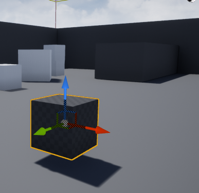

添加蓝图代码：

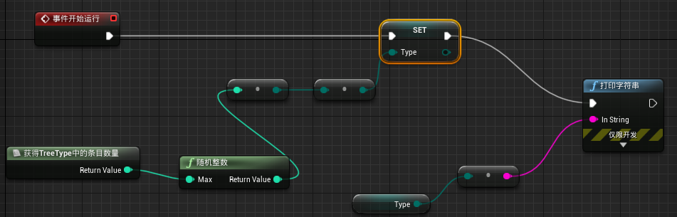

运行后结果如下：

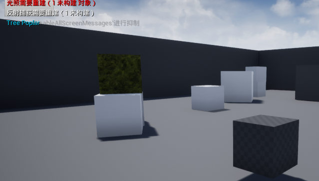


## 在编辑器的不同位置编辑类属性

在使用 Unreal 进行开发时，程序员通常会在C++中的 Actors 或其他对象上实现属性，并在编辑器中将属性显示出来供设计人员使用。 但是，有时候，查看属性或使其可编辑是有意义的，但仅限于对象的默认状态。 有时，该属性只能在运行时使用C++中指定的默认值进行修改。 不过有一些说明符可以帮助我们在属性可用时进行限制。

当指定 UPROPERTY 时，我们可以在 Unreal 编辑器中指定我们希望该值可用的位置。

==Visible* 前缀==表示可以在 Details 面板中查看指定对象的值。 但是，该值是不可编辑的。这并不意味着变量是一个 const 限定符; 但是，代码可以更改值。

==Edit * 前缀==表示可以在编辑器内的 Details 面板中更改属性。

==Instanceonly== 作为后缀表示：该属性仅显示在放置到游戏中的类的实例的 Details 面板中。 例如，它们不会在 Blueprint 编辑器的 Class Defaults 部分可见。

==Defaultsonly== 与 InstanceOnly相反，它只显示在 Class Defaults 部分，不能在级别中的单个实例上查看。

==Anywhere== 后缀是前两个后缀的组合—— UPROPERTY 将在所有 Details 面板中可见，这些面板检查对象的默认值或级别中的特定实例。


## 在蓝图编辑器图表中使属性可访问

我们在前面的例子中提到的说明符都很好，但是它们只在 **Details 面板**中控制 ==UPROPERTY 的可见性==。 默认情况下，即使适当地使用了这些说明符，UPROPERTY 也不能在**实际的编辑器图**中显示或访问，以便在运行时使用。 其他说明符，可以与前面配方中的说明符一起使用，以便与事件图中的属性进行交互。

作为 UPROPERTY 说明符，==BlueprintReadWrite== 向 Unreal Header 工具指出，属性应该同时公开 Get 和 Set 操作，以便在 Blueprints 中使用。

顾名思义，==BlueprintReadOnly== 是一个指示符，只允许 Blueprint 检索属性的值; 永远不要设置它。BlueprintReadOnly 在属性由本机代码设置时非常有用，但是在 Blueprint 中应该可以访问。

需要注意的是 BlueprintReadWrite 和 BlueprintReadOnly 没有在 Details 面板或编辑器的 My Blueprint 部分指定任何关于可访问属性的内容： **这些说明符只控制用于 Blueprint 图形的 Getter / Setter 节点的生成。**


## 从编辑器响应属性更改事件

当一个设计者改变一个在关卡中的角色的属性时，立即显示这个改变的任何可视化结果，而不仅仅是在模拟或播放关卡时，这通常是很重要的。 当使用 Details 面板进行更改时，编辑器会发出一个名为 ==PostEditChangeProperty== 的特殊事件，该事件使**类实例**有机会响应正在编辑的属性。 本例讲述了如何处理 PostEditChangeProperty以获得编辑器中的即时反馈。

拿以前一个类进行实验：

```c++
//.h
UPROPERTY(EditAnywhere)
		bool ShowStaticMesh = true;

virtual void PostEditChangeProperty(FPropertyChangedEvent& PropertyChangedEvent)override;

//.cpp
void ATree::PostEditChangeProperty(FPropertyChangedEvent& PropertyChangedEvent)
{
	if (PropertyChangedEvent.Property != nullptr)
	{
		const FName PropertyName(PropertyChangedEvent.Property->GetName());

		if (PropertyName == GET_MEMBER_NAME_CHECKED(ATree, ShowStaticMesh))
		{
			UStaticMeshComponent* SM = GetStaticMeshComponent();

			if (SM != nullptr)
			{
				SM->SetVisibility(ShowStaticMesh);
			}
		}
	}

	Super::PostEditChangeProperty(PropertyChangedEvent);
}
```

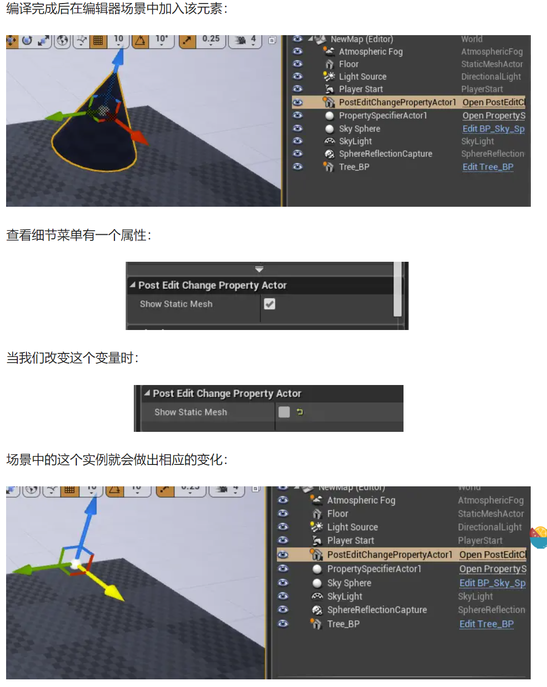

我们基于 StaticMeshActor 创建了一个新的 Actor，以便通过 Static Mesh 轻松访问可视化表示。添加 UPROPERTY 是为了给我们一个要更改的属性，这会触发 PostEditChangeProperty 事件。

==PostEditChangeProperty== 是 Actor 中定义的虚函数。因此，我们在类中覆盖函数。在类构造函数中，我们像往常一样初始化网格，并设置 bool 属性的默认状态以匹配它所控制的组件的可见性。在 PostEditChangeProperty 内部，我们首先检查该属性是否有效。

假设是，我们使用 GetFName ()检索属性的名称。引擎在内部将 FNames 存储为惟一值表。接下来，我们需要使用 ==GET_MENVER_NAME_CHECKED 宏==。 宏接受许多参数。第一个参数是要检查的类的名称，第二个参数是要检查的类的属性。

宏将在编译时验证类是否包含由名称指定的成员。我们将宏返回的类成员名称与属性包含的名称进行比较。如果它们是相同的，那么我们验证 StaticMeshComponent 初始化是否正确。如果是，我们将其可见性设置为匹配 ShowStaticMesh 布尔值。


## 实现本机代码构造脚本

在 Blueprint 中，==构建脚本是一个事件图==，它可以在**附加对象**的属性发生变化时运行——无论是在编辑器视图窗口中拖动，还是通过**详细信息面板**中的直接条目进行变化。 例如，**构造脚本**允许有关对象根据其新位置重新构建自身，或者根据用户选择的选项更改其包含的组件。 在C++中使用 Unreal 引擎进行编码时，等价的概念是 ==OnConstruction 函数==。
	新建C++类：
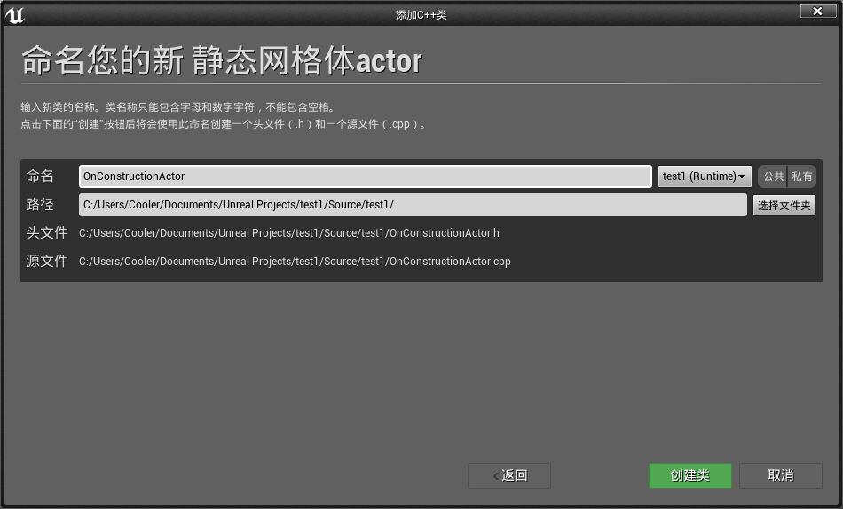

添加代码:

==OnConstructionActor.h==

```c++
virtual void OnConstruction(const FTransform& Transform)override;

UPROPERTY(EditAnywhere)
    bool ShowStaticMesh;
```

==OnConstructionActor.cpp==

```c++
void AOnConstructionActor::OnConstruction(const FTransform& Transform)
{
	GetStaticMeshComponent()->SetVisibility(ShowStaticMesh);
}
```

改变细节面板变量：

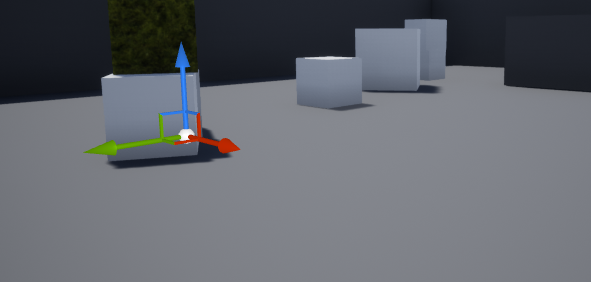

改变细节面板变量：

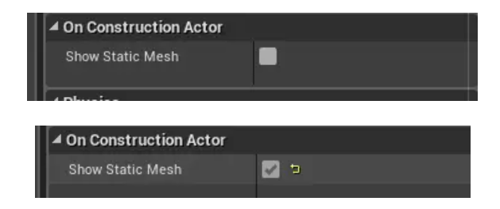

可见性发生了变化：

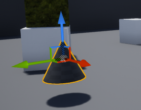

我们基于 StaticMeshActor 创建了一个新的 Actor，以便通过 Static Mesh 轻松访问可视化表示。添加 UPROPERTY 是为了给我们一个要更改的属性，这会触发 PostEditChangeProperty 事件。

==OnConstruction== 是 Actor 中定义的虚函数。因此，我们在类中覆盖函数。在类构造函数中，我们像往常一样初始化网格，并设置 bool 属性的默认状态以匹配它所控制的组件的可见性。

==在 OnConstruction 内部，参与者使用所需的任何属性重新构建自己==。对于这个简单的示例，我们将网格的可见性设置为与 ShowStaticMesh 属性的值相匹配。这也可以扩展到根据 ShowStaticMesh 变量的值更改其他值。我们没有像前面的例子那样对更改的特定属性进行显式过滤。

OnConstruction 脚本对于在对象上更改的每个属性全部运行。它没有办法测试哪个属性是刚刚编辑的，因此我们需要明智地将==计算密集型代码==放在其中。


# C++与UE4的集成-编辑器的拓展部分

## 创建新的编辑器模块

之后的例子都与特定于**编辑器模式**的代码和引擎模块进行交互。因此，创建一个只在引擎以编辑器模式运行时才会加载的新模块被认为是一种良好的做法，这样我们就可以将所有仅用于编辑器的代码放入其中。

使用文本编辑器打开：

```c++
{
	"FileVersion": 3,
	"EngineAssociation": "4.25",
	"Category": "",
	"Description": "",
	"Modules": [
		{
			"Name": "test1",
			"Type": "Runtime",
			"LoadingPhase": "Default",
			"AdditionalDependencies": [
				"Engine",
				"CoreUObject"
			]
		}
	],
	"Plugins": [
		{
			"Name": "StaticMeshEditorExtension",
			"Enabled": true
		},
		{
			"Name": "VariantManager",
			"Enabled": true
		},
		{
			"Name": "Text3D",
			"Enabled": true
		}
	]
}
```

添加模块：

```c++
"Modules": [
		{
			"Name": "test1",
			"Type": "Runtime",
			"LoadingPhase": "Default",
			"AdditionalDependencies": [
				"Engine",
				"CoreUObject"
			]
		},
		{
			"Name": "test1Editor",
			"Type": "Editor",
			"LoadingPhase": "PostEngineInit",
			"AddtionalDependencies": [
				"Engine",
				"CoreUObject"
			]
		}
	],
```

重新生成代码：

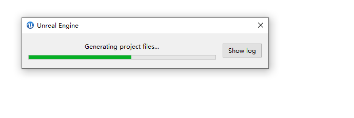

在Source文件夹中创建新文件夹：

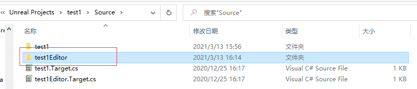

文件夹中新建一个空txt文件并且重命名：

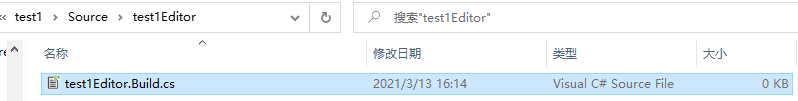

修改新生成的Target.cs文件：

```c++

using UnrealBuildTool;
using System.Collections.Generic;

public class test1EditorTarget : TargetRules
{
	public test1EditorTarget(TargetInfo Target) : base(Target)
	{
		Type = TargetType.Editor;
		DefaultBuildSettings = BuildSettingsVersion.V2;
		ExtraModuleNames.Add("test1");
		ExtraModuleNames.AddRange(new string[] { "test1Editor" });
	}
}
```

修改新建的Build.cs文件：

```c++
using UnrealBuildTool;

public class test1Editor : ModuleRules
{
    public test1Editor(ReadOnlyTargetRules Target) :
    base(Target)
    {
        PCHUsage = PCHUsageMode.UseExplicitOrSharedPCHs;

        PublicDependencyModuleNames.AddRange(new string[] {"Core",
                                            "CoreUObject", "Engine", "InputCore", "RHI", "RenderCore",
                                            "ShaderCore", "MainFrame", "AssetTools", "AppFramework",
                                            "PropertyEditor"});

        PublicDependencyModuleNames.Add("test1");

        PrivateDependencyModuleNames.AddRange(new string[] {
                                    "UnrealEd", "Slate", "SlateCore", "EditorStyle",
                                    "GraphEditor", "BlueprintGraph" });
    }

}
```

再创建两个文件：

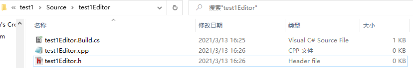

重新生成代码：

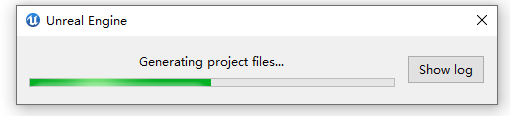


添加代码：

==test1Editor.h==

```c++
#pragma once

#include "Engine.h"
#include "Modules/ModuleInterface.h"
#include "Modules/ModuleManager.h"
#include "UnrealEd.h"


class Ftest1EditorModule : public IModuleInterface
{

};

```

==test1Editor.cpp==

```c++
#include "test1Editor.h"
#include "Modules/ModuleManager.h"
#include "Modules/ModuleInterface.h"

IMPLEMENT_GAME_MODULE(Ftest1EditorModule,test1Editor)
```

编译一下，成功即可 ：

