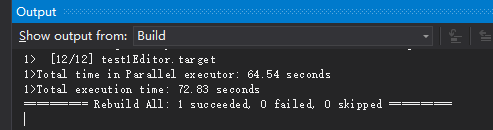
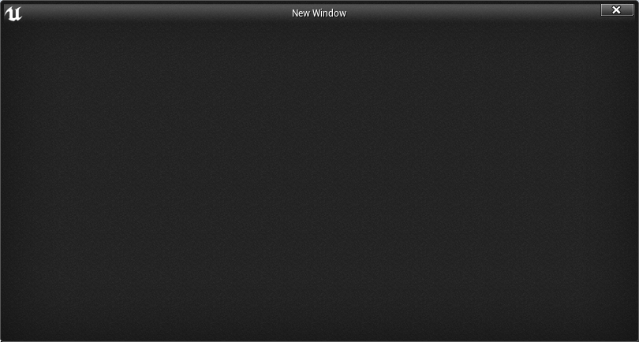

# C++与UE4的集成-内容开发部分

| BlueprintType |
| ------------- |
| Blueprintable |
|               |
|               |


## 使用类或结构作为蓝图变量

在C++中声明的类型不会自动合并到 Blueprint 中用作变量。本例讲述了如何使它们可访问，以便我们可以使用自定义本机代码类型作为 Blueprint 函数参数。

创建新类：


添加代码:

==TileType.h==

```c++
public:
	UPROPERTY()
		int32 MovementCost;
	UPROPERTY()
		bool CanBeBuiltOn;
	UPROPERTY()
		FString TileName;
```

打开某个蓝图，新建一个变量发现无法找到该类。

对代码进行修改并重新编译：

```c++
UCLASS(BlueprintType)
class TEST1_API UTileType : public UObject
{
...
```

这时候蓝图中变量就可以找到这个类型了：


## 创建可以在蓝图中子类化的类或结构

虽然我们的重点一直是使用C++ ，==一个更标准的工作流程==是：实现核心的游戏功能以及性能至关重要的代码在C++，并公开这些功能的蓝图，以允许设计师开发原型游戏，然后可以由程序员重构额外的蓝图功能，或推回到C++层。 因此，最常见的任务之一是以 Blueprint 系统可见的方式标记类和结构。

首先新建新类：


添加代码：

==BaseEnemy.h==

```c++
UPROPERTY()
		FString WeaponName;

UPROPERTY()
		int32 MaximumHealth;
```


对比以下可以发现原来的`TileType` 不能创建**子类蓝图**。

这是因为`BaseEnemy`是基于父类Actor的，Actor 具有`Blueprintable`的宏指定。


所以我们再次修改以下TileType代码加上Blueprintable的宏指定：

```c++
UCLASS(BlueprintType,Blueprintable)
```

编译之后我们看到TileType也可以创建蓝图子类了：


## 创建可以在蓝图中实现的事件

虽然将类标记为 `BlueprintType` 或 `Blueprintable` 允许我们在 Blueprint 中传递类的实例，或者使用 Blueprint 类对类型进行子类化，但这些说明符实际上并没有说明成员函数或变量，以及它们是否应该公开给 Blueprint。这个例子讲述了如何标记函数，以便可以在 Blueprint 图中调用该函数。

创建新类：


添加代码：

==SlidingDoor.h==

```c++
// Fill out your copyright notice in the Description page of Project Settings.

#pragma once

#include "CoreMinimal.h"
#include "Engine/StaticMeshActor.h"
#include "SlidingDoor.generated.h"

/**
 * 
 */
UCLASS()
class TEST1_API ASlidingDoor : public AStaticMeshActor
{
	GENERATED_BODY()
public:
	ASlidingDoor();

protected:
	virtual void BeginPlay()override;

public:
	virtual void Tick(float DeltaSeconds)override;

	UFUNCTION(BlueprintCallable, Category = Door)
		void Open();

	UPROPERTY()
		bool IsOpen;

	UPROPERTY()
		FVector TargetLocation;
};
```

==SlidingDoor.cpp==

```c++
// Fill out your copyright notice in the Description page of Project Settings.


#include "SlidingDoor.h"
#include "Engine/Engine.h"
#include "Components/StaticMeshComponent.h"

ASlidingDoor::ASlidingDoor()
{
	PrimaryActorTick.bCanEverTick = true;

	auto MeshAsset = ConstructorHelpers::FObjectFinder<UStaticMesh>(TEXT("StaticMesh'/Engine/BasicShapes/Cube.Cube'"));

	UStaticMeshComponent* SM = GetStaticMeshComponent();

	if (SM != nullptr)
	{
		if (MeshAsset.Object != nullptr)
		{
			SM->SetStaticMesh(MeshAsset.Object);
			SM->SetGenerateOverlapEvents(true);
		}
		SM->SetMobility(EComponentMobility::Movable);
		SM->SetWorldScale3D(FVector(0.3, 2, 3));
	}

	SetActorEnableCollision(true);

	IsOpen = false;
	PrimaryActorTick.bStartWithTickEnabled = true;
}

void ASlidingDoor::BeginPlay()
{
	Super::BeginPlay();
}

void ASlidingDoor::Tick(float DeltaSeconds)
{
	Super::Tick(DeltaSeconds);

	if (IsOpen)
	{
		SetActorLocation(FMath::Lerp(GetActorLocation(), TargetLocation, 0.05));
	}
}

void ASlidingDoor::Open()
{
	TargetLocation = ActorToWorld().TransformPositionNoScale(FVector(0, 0, 200));
	IsOpen = true;
}
```

编译完成后再场景中布局：


并添加代码到关卡蓝图：


运行看到门开启了：（调用了C++的函数）


## 创建可以在蓝图中调用的事件

C++与 Blueprint 更紧密集成的另一种方式是通过创建可以在本机代码中实现 Blueprint 的函数。 这允许程序员指定一个事件并调用它，而不需要知道任何关于实现的信息。 然后，类可以在 Blueprint 中被子类化，生产团队的另一个成员可以实现事件的处理程序，而无需编译C++

首先创建一个新类：


添加代码：

==Spotter.h==

```c++
UFUNCTION(BlueprintImplementableEvent)
		void OnPlayetSpotter(APawn* Player
```

==Spotter.cpp==

```c++
// Fill out your copyright notice in the Description page of Project Settings.


#include "Spotter.h"
#include "DrawDebugHelpers.h"

ASpotter::ASpotter()
{
	PrimaryActorTick.bCanEverTick = true;

	auto MeshAsset = ConstructorHelpers::FObjectFinder<UStaticMesh>(TEXT("StaticMesh'/Engine/BasicShapes/Cube.Cube'"));

	UStaticMeshComponent* SM = GetStaticMeshComponent();

	if (SM != nullptr)
	{
		if (MeshAsset.Object != nullptr)
		{
			SM->SetStaticMesh(MeshAsset.Object);
			SM->SetGenerateOverlapEvents(true);
		}
		SM->SetMobility(EComponentMobility::Movable);
		SM->SetRelativeRotation(FRotator(90, 0, 0));
	}

}

void ASpotter::Tick(float DeltaSeconds)
{
	Super::Tick(DeltaSeconds);

	auto EndLocation = GetActorLocation() + ActorToWorld().TransformVector(FVector(0, 0, 200));

	FHitResult hitResult;
	GetWorld()->SweepSingleByChannel(hitResult, GetActorLocation(), EndLocation, FQuat::Identity,
		ECC_Camera, FCollisionShape::MakeSphere(25),
		FCollisionQueryParams("Spot", true, this));

	APawn* SpottedPlayer = Cast<APawn>(hitResult.Actor.Get());

	if (SpottedPlayer != nullptr)
	{
		OnPlayetSpotter(SpottedPlayer);
	}

	DrawDebugLine(GetWorld(), GetActorLocation(), EndLocation, FColor::Red);
}
```

拖入场景：


创建一个基于它的蓝图类，在蓝图中重写函数：


在蓝图子类时，会打印字符串，而C++类并无事发生。


## 向蓝图公开多种类型的委托（代理）

==多播代理==是向多个对象广播事件的一种很好的方式，这些对象可以监听或订阅相关事件。如果我们拥有一个C++模块，该模块生成可能是任意的参与者希望得到通知的事件，那么它们就特别有价值。本例讲述了如何在C++中创建一个多播代理，该委托可以在运行时通知一组其他参与者。

首先创建新类：


添加代码：

==King.h==

```c++
DECLARE_DYNAMIC_MULTICAST_DELEGATE_OneParam(FOnkingDeathSignature, AKing*, DeadKing);

UCLASS()
class TEST1_API AKing : public AStaticMeshActor
{
	GENERATED_BODY()
	
public:
	AKing();

	UFUNCTION(BlueprintCallable, Category = King)
		void Die();

	UPROPERTY(BlueprintAssignable)
		FOnkingDeathSignature OnKingDeath;
};
```

==King.cpp==

```c++
// Fill out your copyright notice in the Description page of Project Settings.
#include "King.h"

AKing::AKing()
{
	PrimaryActorTick.bCanEverTick = true;

	auto MeshAsset = ConstructorHelpers::FObjectFinder<UStaticMesh>(TEXT("StaticMesh'/Engine/BasicShapes/Cone.Cone'"));
	UStaticMeshComponent* SM = GetStaticMeshComponent();

	if (SM != nullptr)
	{
		if (MeshAsset.Object != nullptr)
		{
			SM->SetStaticMesh(MeshAsset.Object);
			SM->SetGenerateOverlapEvents(true);
		}
		SM->SetMobility(EComponentMobility::Movable);
	}
}

void AKing::Die()
{
	OnKingDeath.Broadcast(this);
}
```

==Peasant.h==

```c++
UFUNCTION(BlueprintCallable, Category = Peasant)
		void Flee(AKing* DeadKing);
```

==Peasant.cpp==

```c++
// Fill out your copyright notice in the Description page of Project Settings.


#include "Peasant.h"

APeasant::APeasant()
{
	PrimaryActorTick.bCanEverTick = true;

	auto MeshAsset = ConstructorHelpers::FObjectFinder<UStaticMesh>(TEXT("StaticMesh'/Engine/BasicShapes/Cube.Cube'"));

	UStaticMeshComponent* SM = GetStaticMeshComponent();

	if (SM != nullptr)
	{
		if (MeshAsset.Object != nullptr)
		{
			SM->SetStaticMesh(MeshAsset.Object);
			SM->SetGenerateOverlapEvents(true);
		}
		SM->SetMobility(EComponentMobility::Movable);
	}
}

void APeasant::Flee(AKing* DeadKing)
{
	GEngine->AddOnScreenDebugMessage(-1, 2, FColor::Red, TEXT("Waily Waily"));

	FVector FleeVector = GetActorLocation() - DeadKing->GetActorLocation();

	FleeVector.Normalize();

	FleeVector *= 500;

	SetActorLocation(GetActorLocation() + FleeVector);
}
```

编译完成后创建一个基于Peasant的蓝图类：


添加蓝图代码：


在场景中布局：


在关卡蓝图上引用King并设置开启后3s 调用King的Die函数：


运行结果如下：


我们创建了一个新的 Actor (为了方便起见，基于 StaticMeshActor，因为它省去了为 Actor 可视化表示声明或创建一个 Static Mesh 组件的麻烦)。我们使用 ==DECLARE_DYNAMIC_MULTICAST_DELEGATE_ONEPARAM== 宏声明一个动态多播委托。

动态多播委托允许任意数量的对象订阅(监听)和取消订阅(停止监听) ，这样当委托被广播时它们就会得到通知。该宏接受许多参数——正在创建的新委托签名的类型名称、签名参数的类型，然后是签名参数的名称。

我们还为 King 添加了一个函数，Die()。 因为我们希望将函数暴露给 BlueprintCallable 以进行原型设计，所以我们将其标记为 BlueprintCallable。

我们之前使用的 DECLARE_DYNAMIC_MULTICAST_DELEGATE_ONEPARAM宏只声明了一个类型; 它没有声明委托的实例，所以我们现在这样做，引用我们在调用该宏时提供的类型名称。

动态多播委托可以在其 UPROPERTY 声明中标记为 ==BlueprintAssignable==。 这表明 Blueprint 系统可以动态地将事件分配给调用委托的 Broadcast 函数时要调用的委托。

像往常一样，我们为King分配了一个简单的网格，以便在游戏场景中有一个视觉表示。

在 Die 函数中，我们在自己的委托上，调用 Broadcast。 我们指定委托将具有一个参数，该参数是指向死亡的 king 的指针，因此我们将这个指针作为参数传递给广播函数。

如果要销毁国王，而不是在它死亡时播放动画或其他效果，则需要更改委托的声明并传递不同的类型。 例如，可以使用 FVector，直接通过死去国王的位置，这样农民仍然可以适当地逃离。 如果不这样做，可能会遇到这样的情况: 在调用 Broadcast 时 King 指针是有效的，但是对 Actor: : Destroy ()的调用在执行绑定函数之前使其无效。

在下一个 StaticMeshActor 子类中，我们通常使用不同于 King 的形状来初始化静态网格组件。在实现农民逃离功能的内部，我们通过在屏幕上打印消息来模拟农民播放声音。然后我们计算一个矢量，让农民逃离，首先找到一个矢量从死去的国王到这个农民的位置。我们将向量标准化以检索指向同一方向的单位向量(长度为1)。缩放归一化矢量并将其添加到我们当前位置计算出一个固定距离的位置，在农民直接逃离死去的国王的确切方向。然后使用 SetActorLocation 将农民传送到那个位置。

如果使用的是一个带有人工智能控制器的角色，我们可以让农民探路者到达目标位置而不是传送。 或者，我们可以使用一个在农民的Tick中调用的 Lerp 函数来使他们顺利滑行，而不是直接跳到某个位置。


## 创建可以在蓝图中使用的C++枚举

枚举在C++中通常用作Switch语句的标志或输入。 但是，如果希望从 Blueprint 向C++传递 enum 值或从 C++ 传递 enum 值，该怎么办？ 或者，如果希望在 Blueprint 中使用来自 c + + 的枚举的 switch 语句，如何让 Blueprint 编辑器知道枚举应该在编辑器中可访问？ 本例讲述了如何使 enum 在 Blueprint 中可见。

创建新类：


添加代码:

==Tree.h==

```c++
UENUM(BlueprintType)
enum TreeType
{
	Tree_Poplar,
	Tree_Spruce,
	Tree_Redwood
};

UCLASS()
class TEST1_API ATree : public AStaticMeshActor
{
	GENERATED_BODY()
public:
	ATree();

	UPROPERTY(BlueprintReadWrite)
		TEnumAsByte<TreeType> Type;
	
};
```

==Tree.cpp==

```
老生常谈
```

创建蓝图类，布局场景：


添加蓝图代码：


运行后结果如下：


## 在编辑器的不同位置编辑类属性

在使用 Unreal 进行开发时，程序员通常会在C++中的 Actors 或其他对象上实现属性，并在编辑器中将属性显示出来供设计人员使用。 但是，有时候，查看属性或使其可编辑是有意义的，但仅限于对象的默认状态。 有时，该属性只能在运行时使用C++中指定的默认值进行修改。 不过有一些说明符可以帮助我们在属性可用时进行限制。

当指定 UPROPERTY 时，我们可以在 Unreal 编辑器中指定我们希望该值可用的位置。

==Visible* 前缀==表示可以在 Details 面板中查看指定对象的值。 但是，该值是不可编辑的。这并不意味着变量是一个 const 限定符; 但是，代码可以更改值。

==Edit * 前缀==表示可以在编辑器内的 Details 面板中更改属性。

==Instanceonly== 作为后缀表示：该属性仅显示在放置到游戏中的类的实例的 Details 面板中。 例如，它们不会在 Blueprint 编辑器的 Class Defaults 部分可见。

==Defaultsonly== 与 InstanceOnly相反，它只显示在 Class Defaults 部分，不能在级别中的单个实例上查看。

==Anywhere== 后缀是前两个后缀的组合—— UPROPERTY 将在所有 Details 面板中可见，这些面板检查对象的默认值或级别中的特定实例。


## 在蓝图编辑器图表中使属性可访问

我们在前面的例子中提到的说明符都很好，但是它们只在 **Details 面板**中控制 ==UPROPERTY 的可见性==。 默认情况下，即使适当地使用了这些说明符，UPROPERTY 也不能在**实际的编辑器图**中显示或访问，以便在运行时使用。 其他说明符，可以与前面配方中的说明符一起使用，以便与事件图中的属性进行交互。

作为 UPROPERTY 说明符，==BlueprintReadWrite== 向 Unreal Header 工具指出，属性应该同时公开 Get 和 Set 操作，以便在 Blueprints 中使用。

顾名思义，==BlueprintReadOnly== 是一个指示符，只允许 Blueprint 检索属性的值; 永远不要设置它。BlueprintReadOnly 在属性由本机代码设置时非常有用，但是在 Blueprint 中应该可以访问。

需要注意的是 BlueprintReadWrite 和 BlueprintReadOnly 没有在 Details 面板或编辑器的 My Blueprint 部分指定任何关于可访问属性的内容： **这些说明符只控制用于 Blueprint 图形的 Getter / Setter 节点的生成。**


## 从编辑器响应属性更改事件

当一个设计者改变一个在关卡中的角色的属性时，立即显示这个改变的任何可视化结果，而不仅仅是在模拟或播放关卡时，这通常是很重要的。 当使用 Details 面板进行更改时，编辑器会发出一个名为 ==PostEditChangeProperty== 的特殊事件，该事件使**类实例**有机会响应正在编辑的属性。 本例讲述了如何处理 PostEditChangeProperty以获得编辑器中的即时反馈。

拿以前一个类进行实验：

```c++
//.h
UPROPERTY(EditAnywhere)
		bool ShowStaticMesh = true;

virtual void PostEditChangeProperty(FPropertyChangedEvent& PropertyChangedEvent)override;

//.cpp
void ATree::PostEditChangeProperty(FPropertyChangedEvent& PropertyChangedEvent)
{
	if (PropertyChangedEvent.Property != nullptr)
	{
		const FName PropertyName(PropertyChangedEvent.Property->GetName());

		if (PropertyName == GET_MEMBER_NAME_CHECKED(ATree, ShowStaticMesh))
		{
			UStaticMeshComponent* SM = GetStaticMeshComponent();

			if (SM != nullptr)
			{
				SM->SetVisibility(ShowStaticMesh);
			}
		}
	}

	Super::PostEditChangeProperty(PropertyChangedEvent);
}
```


我们基于 StaticMeshActor 创建了一个新的 Actor，以便通过 Static Mesh 轻松访问可视化表示。添加 UPROPERTY 是为了给我们一个要更改的属性，这会触发 PostEditChangeProperty 事件。

==PostEditChangeProperty== 是 Actor 中定义的虚函数。因此，我们在类中覆盖函数。在类构造函数中，我们像往常一样初始化网格，并设置 bool 属性的默认状态以匹配它所控制的组件的可见性。在 PostEditChangeProperty 内部，我们首先检查该属性是否有效。

假设是，我们使用 GetFName ()检索属性的名称。引擎在内部将 FNames 存储为惟一值表。接下来，我们需要使用 ==GET_MENVER_NAME_CHECKED 宏==。 宏接受许多参数。第一个参数是要检查的类的名称，第二个参数是要检查的类的属性。

宏将在编译时验证类是否包含由名称指定的成员。我们将宏返回的类成员名称与属性包含的名称进行比较。如果它们是相同的，那么我们验证 StaticMeshComponent 初始化是否正确。如果是，我们将其可见性设置为匹配 ShowStaticMesh 布尔值。


## 实现本机代码构造脚本

在 Blueprint 中，==构建脚本是一个事件图==，它可以在**附加对象**的属性发生变化时运行——无论是在编辑器视图窗口中拖动，还是通过**详细信息面板**中的直接条目进行变化。 例如，**构造脚本**允许有关对象根据其新位置重新构建自身，或者根据用户选择的选项更改其包含的组件。 在C++中使用 Unreal 引擎进行编码时，等价的概念是 ==OnConstruction 函数==。
	新建C++类：


添加代码:

==OnConstructionActor.h==

```c++
virtual void OnConstruction(const FTransform& Transform)override;

UPROPERTY(EditAnywhere)
    bool ShowStaticMesh;
```

==OnConstructionActor.cpp==

```c++
void AOnConstructionActor::OnConstruction(const FTransform& Transform)
{
	GetStaticMeshComponent()->SetVisibility(ShowStaticMesh);
}
```

改变细节面板变量：


改变细节面板变量：


可见性发生了变化：


我们基于 StaticMeshActor 创建了一个新的 Actor，以便通过 Static Mesh 轻松访问可视化表示。添加 UPROPERTY 是为了给我们一个要更改的属性，这会触发 PostEditChangeProperty 事件。

==OnConstruction== 是 Actor 中定义的虚函数。因此，我们在类中覆盖函数。在类构造函数中，我们像往常一样初始化网格，并设置 bool 属性的默认状态以匹配它所控制的组件的可见性。

==在 OnConstruction 内部，参与者使用所需的任何属性重新构建自己==。对于这个简单的示例，我们将网格的可见性设置为与 ShowStaticMesh 属性的值相匹配。这也可以扩展到根据 ShowStaticMesh 变量的值更改其他值。我们没有像前面的例子那样对更改的特定属性进行显式过滤。

OnConstruction 脚本对于在对象上更改的每个属性全部运行。它没有办法测试哪个属性是刚刚编辑的，因此我们需要明智地将==计算密集型代码==放在其中。


# C++与UE4的集成-编辑器的拓展部分

## 创建新的编辑器模块

之后的例子都与特定于**编辑器模式**的代码和引擎模块进行交互。因此，创建一个只在引擎以编辑器模式运行时才会加载的新模块被认为是一种良好的做法，这样我们就可以将所有仅用于编辑器的代码放入其中。

使用文本编辑器打开：

```c++
{
	"FileVersion": 3,
	"EngineAssociation": "4.25",
	"Category": "",
	"Description": "",
	"Modules": [
		{
			"Name": "test1",
			"Type": "Runtime",
			"LoadingPhase": "Default",
			"AdditionalDependencies": [
				"Engine",
				"CoreUObject"
			]
		}
	],
	"Plugins": [
		{
			"Name": "StaticMeshEditorExtension",
			"Enabled": true
		},
		{
			"Name": "VariantManager",
			"Enabled": true
		},
		{
			"Name": "Text3D",
			"Enabled": true
		}
	]
}
```

添加模块：

```c++
"Modules": [
		{
			"Name": "test1",
			"Type": "Runtime",
			"LoadingPhase": "Default",
			"AdditionalDependencies": [
				"Engine",
				"CoreUObject"
			]
		},
		{
			"Name": "test1Editor",
			"Type": "Editor",
			"LoadingPhase": "PostEngineInit",
			"AddtionalDependencies": [
				"Engine",
				"CoreUObject"
			]
		}
	],
```

重新生成代码：


在Source文件夹中创建新文件夹：


文件夹中新建一个空txt文件并且重命名：


修改新生成的Target.cs文件：

```c++

using UnrealBuildTool;
using System.Collections.Generic;

public class test1EditorTarget : TargetRules
{
	public test1EditorTarget(TargetInfo Target) : base(Target)
	{
		Type = TargetType.Editor;
		DefaultBuildSettings = BuildSettingsVersion.V2;
		ExtraModuleNames.Add("test1");
		ExtraModuleNames.AddRange(new string[] { "test1Editor" });
	}
}
```

修改新建的Build.cs文件：

```c++
using UnrealBuildTool;

public class test1Editor : ModuleRules
{
    public test1Editor(ReadOnlyTargetRules Target) :
    base(Target)
    {
        PCHUsage = PCHUsageMode.UseExplicitOrSharedPCHs;

        PublicDependencyModuleNames.AddRange(new string[] {"Core",
                                            "CoreUObject", "Engine", "InputCore", "RHI", "RenderCore",
                                            "ShaderCore", "MainFrame", "AssetTools", "AppFramework",
                                            "PropertyEditor"});

        PublicDependencyModuleNames.Add("test1");

        PrivateDependencyModuleNames.AddRange(new string[] {
                                    "UnrealEd", "Slate", "SlateCore", "EditorStyle",
                                    "GraphEditor", "BlueprintGraph" });
    }

}
```

再创建两个文件：


重新生成代码：


添加代码：

==test1Editor.h==

```c++
#pragma once

#include "Engine.h"
#include "Modules/ModuleInterface.h"
#include "Modules/ModuleManager.h"
#include "UnrealEd.h"


class Ftest1EditorModule : public IModuleInterface
{

};

```

==test1Editor.cpp==

```c++
#include "test1Editor.h"
#include "Modules/ModuleManager.h"
#include "Modules/ModuleInterface.h"

IMPLEMENT_GAME_MODULE(Ftest1EditorModule,test1Editor)
```

编译一下，成功即可 ：




## 创建新的工具栏

如果已经在编辑器中创建了一个用于显示的自定义工具或窗口，那么我们需要某种方法来让用户显示它。 最简单的方法是创建一个==工具栏定制==，添加一个新的工具栏按钮，并在单击时显示窗口。 按照前面的例子创建一个新的引擎模块，因为我们需要它，来初始化**自定义工具栏**。

添加文件到目录中：


添加代码：

==NewCommands.h==

```c++
#pragma once
#include "Framework/Commands/Commands.h"
#include "Framework/Commands/UICommandInfo.h"
#include "EditorStyleSet.h"


class FNewCommands :public TCommands<FNewCommands>
{
public:
	FNewCommands() :TCommands<FNewCommands>(
		FName(TEXT("UE4_test1")),
		FText::FromString("New Commands"),
		NAME_None,
		FEditorStyle::GetStyleSetName())
	{};

	virtual void RegisterCommands()override;

	TSharedPtr<FUICommandInfo> MyButton;
	TSharedPtr<FUICommandInfo> MyMenubutton;

};
```

==NewCommands.cpp==

```c++
#include "NewCommands.h"

void FNewCommands::RegisterCommands()
{
#define LOCTEXT_NAMESPACE ""
	UI_COMMAND(MyButton, "New", "Demo New Toolbar Command", EUserInterfaceActionType::Button, FInputGesture());
	UI_COMMAND(MyMenubutton, "New", "Demo New Toolbar Command", EUserInterfaceActionType::Button, FInputGesture());
#undef LOCTEXT_NAMESPACE
}
```

==test1Editor.h==

```c++
#pragma once
#include "Engine.h"
#include "Modules/ModuleInterface.h"
#include "Modules/ModuleManager.h"
#include "NewCommands.h"
#include "UnrealEd.h"


class Ftest1EditorModule : public IModuleInterface
{
	virtual void StartupModule()override;
	virtual void ShutdownModule()override;

	TSharedPtr<FExtender> ToolbarExtender;
	TSharedPtr<const FExtensionBase> Extension;

	void MuButton_Clicked()
	{
		TSharedRef<SWindow> NewWindow = SNew(SWindow).Title(FText::FromString(TEXT("New Window"))).ClientSize(FVector2D(800, 400)).SupportsMaximize(false).SupportsMinimize(false);
		IMainFrameModule& MainFrameModule2  = FModuleManager::LoadModuleChecked<IMainFrameModule>(TEXT("MainFrame"));
		if (MainFrameModule2.GetParentWindow().IsValid())
		{
			FSlateApplication::Get().AddWindowAsNativeChild(NewWindow, MainFrameModule2.GetParentWindow().ToSharedRef());
		}
		else {
			FSlateApplication::Get().AddWindow(NewWindow);
		}
	};

	void AddToolbarExtension(FToolBarBuilder& builder)
	{
		FSlateIcon IconBrush = FSlateIcon(FEditorStyle::GetStyleSetName(), "LevelEditor.ViewOptions", "LevelEditor.ViewOptions.Small");
		builder.AddToolBarButton(FNewCommands::Get().MyButton, NAME_None, FText::FromString("My Button")
			, FText::FromString("Click me to display a message"), IconBrush, NAME_None);
	};

};
```

==test1Editor.cpp==

```c++
#include "test1Editor.h"
#include "Modules/ModuleManager.h"
#include "LevelEditor.h"
#include "Modules/ModuleInterface.h"

IMPLEMENT_GAME_MODULE(Ftest1EditorModule,test1Editor)

void Ftest1EditorModule::StartupModule()
{
	FNewCommands::Register();

	TSharedPtr<FUICommandList> CommandList = MakeShareable(new FUICommandList());

	CommandList->MapAction(FNewCommands::Get().MyButton, FExecuteAction::CreateRaw(this, &Ftest1EditorModule::MyButton_Clicked), FCanExecuteAction());

	ToolbarExtender = MakeShareable(new FExtender());

	FLevelEditorModule& LevelEditorModule = FModuleManager::LoadModuleChecked<FLevelEditorModule>("LevelEditor");
	
	Extension = ToolbarExtender->AddToolBarExtension("Compile", EExtensionHook::Before, CommandList, FToolBarExtensionDelegate::CreateRaw(this, &Ftest1EditorModule::AddToolbarExtension));

	LevelEditorModule.GetToolBarExtensibilityManager()->AddExtender(ToolbarExtender);
}

void Ftest1EditorModule::ShutdownModule()
{
	ToolbarExtender->RemoveExtension(Extension.ToSharedRef());

	Extension.Reset();

	ToolbarExtender.Reset();
}
```

编译完成后我们打开编辑器会看到顶部菜单栏：


点击后会弹出新的窗口：




Unreal 的编辑器 UI 基于==命令==的概念。 **命令是一种设计模式**，允许 UI 和它需要执行的操作之间进行更松散的耦合。要创建包含一组命令的类，必须从 `TCommands `继承。

==Tcommands 是一个模板类==，它利用了**奇异递归模板模式控制协议**(CRTP)。CRTP通常用于 `Slate UI` 代码中，作为创建编译时多态性的一种方法。在 FNewCommands 构造函数的初始化器列表中，我们**委托调用**父类构造函数，传入一些参数：

- 第一个参数是**命令集的名称**，是一个简单的 FName。
- 第二个参数是**工具提示**，因此，使用 FText，以便在必要时支持本地化。
- 如果有一个命令的父组，第三个参数包含组的名称。 否则，它包含` NAME_None`。
- 构造函数的最后一个参数是` Slate Style Set`，它包含命令集将要使用的任何命令图标。

==RegisterCommands ()函数==允许 TCommands 派生类创建它们需要的任何命令对象。 从该函数返回的 `FUICommandInfo 实例`作为**成员**存储在 Commands 类中，以便可以将 UI 元素或函数绑定到命令。这就是为什么我们有成员变量 `TSharedPtr<FUICommandInfo> MyButton`。

在类的实现中，我们只需要在 RegisterCommands 中创建命令。用于创建 **FUICommandInfo 实例**的 ==UI_COMMAND 宏==希望定义一个**本地化名称空间**，即使它只是一个空的默认名称空间。 因此，我们需要将 UI_COMMAND 调用包含在 #defines 中，以便为` LOCTEXT_NAMESPACE`设置一个有效值，即使我们不打算使用本地化。实际的 UI_COMMAND宏需要一些参数:

- 第一个参数是用于存储 FUICommandInfo 的变量
- 第二个参数是命令的可读名称
- 第三个参数是命令的描述
- 第四个参数是 ==EUserInterfaceActionType==。此枚举实质上指定了正在创建的按钮类型。 它支持 Button、 ToggleButton、 RadioButton 和 Check 等有效类型。按钮(Button)是简单的通用按钮；切换按钮(ToggleButton)存储开关状态；单选按钮(RadioButton)与切换按钮类似，但与其他单选按钮组合在一起，一次只能启用一个单选按钮；最后，复选框(Check)会显示一个与按钮相邻的只读复选框。

- 最后一个参数是输入，或者是激活命令所需的键的组合。此参数主要用于定义链接到相关命令的**热键的组合键**，而不是用于定义按钮。因此，我们使用一个空的 `InputGesture`。


所以，我们现在有了一组命令，但是我们还没有告诉引擎我们想要将这组命令添加到工具栏上显示的命令中。 我们也没有设置当点击按钮时会发生什么。 为此，我们需要在模块开始时执行一些初始化，因此我们将一些代码放入 `StartupModule / ShutdownModule` 函数中。

在 StartupModule 内部，我们对前面定义的命令类调用**静态 Register 函数**。然后，我们创建一个共享的指针，指向一个使用 ==MakeShareable 函数==的命令列表。

在命令列表中，我们使用 ==MapAction== ，为` FNewCommands `成员的 `UICommandInfo 对象`和调用命令时要执行的**实际函数**之间创建**映射或关联**。

- Mapaction 的第一个参数是` FUICommandInfo 对象`，我们可以使用它的静态` Get ()方法`从 FNewCommands 检索实例——==FNewCommands 是作为单例实现的==。
- MapAction 函数的第二个参数是在执行命令时，调用的**函数的委托**。因为 test1EditorModule 是一个原始的C++类，而不是 UObject，而且我们希望调用一个成员函数，而不是一个静态函数，所以我们使用 ==CreateRaw== 创建一个绑定到原始C++成员函数的新委托。

- ==CreateRaw== 需要一个指向对象实例的指针，以及一个函数引用，来调用该指针。

- MapAction 的第三个参数是一个**调用的委托**，用于测试该操作是否可以执行。 因为我们希望该命令始终可执行，所以可以使用一个总是返回` true `的**简单预定义委托**。


通过在我们的命令和它应该调用的操作之间创建一个关联，我们现在需要实际告诉扩展系统：我们想要向工具栏添加新的命令。我们可以通过 ==FExtender 类==实现这一点，该类可用于扩展菜单、上下文菜单或工具栏。我们最初创建一个 `FExtender 实例`作为一个共享指针，这样当模块关闭时，我们的扩展不会被初始化。

然后，我们在新的扩展程序上调用 `AddToolBarExtension`，将结果存储在一个共享指针中，这样我们就可以在模块未初始化时删除它：

- 第一个参数是要添加扩展的**扩展点的名称**。为了找到要**放置扩展**的位置，首先需要打开编辑器 UI 中扩展点的显示。

    为此，在编辑器的编辑菜单中打开 Editor Preferences:


​	将其勾选：


​	然后重启编辑器，会出现一些绿色的字，如下：


绿色的文本表示`UIExtensionPoint`，文本的值是我们应该提供给AddToolBarExtension函数的字符串。我们将把扩展添加到编译扩展点。需要注意的是，将工具栏扩展添加到菜单扩展点将会失败，反之亦然。

- AddToolBarExtension的第二个参数是一个相对于指定扩展点的**位置锚**。我们已经选择了`FExtensionHook::Before`，因此我们的图标将显示在Compile点之前。


- 下一个参数是包含**映射操作**的命令列表。


- 最后一个参数是一个委托，它负责在扩展点和我们前面指定的锚点，向工具栏实际添加**UI控件**。委托绑定到一个具有void (*func)形式的函数(`FToolBarBuilder和Builder`)。在本例中，它是一个名为AddToolBarExtension的函数，该函数在我们的模块类中定义。


当调用该函数时，调用添加UI元素的构建器上的命令将把这些元素应用到我们指定的UI中的位置。最后，我们需要在这个函数中加载==level editor模块==，以便能够将扩展程序添加到**level editor中的主工具栏**。

通常，我们可以使用==ModuleManager==加载模块并返回对它的引用。有了这个引用，我们就可以获得模块的**工具栏扩展性管理器**，并告诉它添加我们的扩展器。虽然一开始这看起来很麻烦，但是如果您想在不同的编辑器窗口之间创建一致的UI布局，那么您可以将相同的工具栏扩展应用于不同模块中的多个工具栏。

与初始化扩展对应的当然是在卸载模块时删除它。为此，我们从Extender中删除扩展，然后将Extender和Extension的共享指针设为null，从而回收它们的内存分配。

编辑器模块中的`AddToolBarExtension函数`负责向工具栏实际添加可以调用命令的UI元素。它通过调用作为函数参数传入的`FToolBarBuilder实例`上的函数来实现这一点。首先，我们使用==FSlateIcon构造函数==为新工具栏按钮检索一个适当的图标。然后，加载图标后，我们在构建器实例上调用`AddToolBarButton`。AddToolbarButton有许多参数。

- 第一个参数是要绑定到的命令——与我们在前面将操作绑定到命令时访问的MyButton成员相同。
- 第二个参数是我们前面指定的扩展钩子的一个覆盖，但是我们不想覆盖它，所以我们可以使用NAME_None。
- 第三个参数是我们创建的新按钮的标签覆盖。
- 参数4是新按钮的工具提示。
- 倒数第二个参数是按钮的图标，
- 最后一个参数是一个名称....


## 创建新的菜单项

创建新菜单项的工作流程与创建新工具栏按钮的工作流程几乎完全相同，所以这个例子将建立在前一个菜单之上，并讲述如何将在其中创建的命令添加到菜单而不是工具栏中。

首先添加一个函数到test1EditorModule中。

```c++
void AddMenuExtension(FMenuBuilder& builder)
{
	FSlateIcon IconBrush = FSlateIcon(FEditorStyle::GetStyleSetName(), "LevelEditor.ViewOptions", 			  "LevelEditor.ViewOptions.Small");
	builder.AddMenuEntry(FNewCommands::Get().MyMenubutton);
}
```

test1Editor.cpp中添加代码：

```c++
Extension = ToolbarExtender->AddToolBarExtension("Compile", EExtensionHook::Before, CommandList, FToolBarExtensionDelegate::CreateRaw(this, &Ftest1EditorModule::AddToolbarExtension));

LevelEditorModule.GetToolBarExtensibilityManager()->AddExtender(ToolbarExtender);

Extension = ToolbarExtender->AddMenuExtension("LevelEditor", EExtensionHook::Before, CommandList, FMenuExtensionDelegate::CreateRaw(this, &Ftest1EditorModule::AddMenuExtension));

LevelEditorModule.GetMenuExtensibilityManager()->AddExtender(ToolbarExtender);
```

编译后重新启动编辑器，就可以看到新的按钮别添加在Window里面的LevelEditor之前了：


我们会注意到 ==ToolbarExtender== 的类型是 ==FExtender== ，而不是 `FToolbarExtender` 或者 `FMenuExtender。`

它使用一个通用的 FExtender 类而不是一个特定的子类，这个框架允许我们创建一系列的**命令函数映射**，可以在菜单或者工具栏上使用。 实际添加 UI 控件的委托（在本例中为 AddMenuExtension）可以将这些控件链接到来自 FExtender 的命令子集。 这样，我们就不需要为不同类型的扩展使用不同的 TCommands 类，并且我们可以将这些命令放置到单个中心类中，而不用考虑这些命令是从 UI 实现. 


本例添加菜单按钮，与添加工具栏按钮的不同之处在于：用 `AddMenuExtension` 而不是 `AddToolBarExtension`  ，创建一个可以绑定到 `FMenuExtensionDelegate` 而不是` FToolbarExtensionDelegate` 的函数，将扩展程序添加到菜单扩展性管理器而不是工具栏扩展性管理器


## 创建新的编辑器窗口

当我们拥有一个具有用户可配置设置的新工具，可能希望向使用自定义编辑器的人显示某些信息时，自定义编辑器窗口非常有用。 在开始之前，需要已经做过了前面例子的代码添加，确保已经拥有了一个编辑器模块。 阅读创建新菜单条目或创建新的工具栏按钮例子，这样就可以在编辑器中创建一个按钮来启动我们的新窗口。

在前面例子中我们已经实现了点击以下按钮可开启一个新的窗口。

我们稍微修改一下代码：

```c++
void MyButton_Clicked()
{
    TSharedRef<SWindow> NewWindow = SNew(SWindow).Title(FText::FromString(TEXT("New Window"))).ClientSize(FVector2D(800, 400))
    .SupportsMaximize(false).SupportsMinimize(false)[SNew(SVerticalBox) + SVerticalBox::Slot().HAlign(HAlign_Center).VAlign(VAlign_Center)
    [SNew(STextBlock).Text(FText::FromString(TEXT("Hello from Slate")))]];
    
    IMainFrameModule& MainFrameModule2 = FModuleManager::LoadModuleChecked<IMainFrameModule>(TEXT("MainFrame"));
   
    if (MainFrameModule2.GetParentWindow().IsValid())
    {
    	FSlateApplication::Get().AddWindowAsNativeChild(NewWindow, 	MainFrameModule2.GetParentWindow().ToSharedRef());
    }
    else {
   		FSlateApplication::Get().AddWindow(NewWindow);
	}
};
```

编译完成后，重启编辑器，点击按钮，打开窗口结果如下：


新编辑器窗口不会显示自己，因此，在这个例子之前，应该实现一个**自定义菜单**，或**工具栏按钮**，或**控制台命令**，来触新窗口的显示。

所有的部件通常以 ==TSharedRef== 或 ==TSharedPtr== 的形式进行交互。函数的作用是：返回一个 `TSharedRef`，这个 `TSharedRef` 被模板化在所请求的Slate部件类上。

正如我们前面提到的，Slate 部件有许多它们实现的函数，这些函数都返回函数被调用的对象。 这允许在创建时使用**方法链接**来配置对象。这就是小部件的 Slate 语法 `<Widget>.Property(Value).Property(Value)`.

本例中在**Slate部件**上设置的属性包括：窗口标题、窗口大小以及窗口是否可以最大化和最小化。一旦所有必要属性都设置完毕，可以使用==括号操作符([])==指定放置在部件内的内容，例如，图片或标签。

**窗口是一个顶级SLate部件**，只有一个插槽用于子窗口，因此我们不需要自己为它添加插槽。 通过在一对**方括号**中创建内容，我们将内容放入该槽中。我们创建的内容是 ==SVerticalBox==，它是一个小部件，可以有任意数量的插槽用于在垂直列表中显示的子小部件。

对于要放入垂直列表中的每个小部件，我们需要创建一个 ==slot==。最简单的方法是使用**重载的 + 运算符**和 ==SVerticalBox: : Slot ()==函数。Slot ()会像其他窗口一样返回一个窗口小部件，因此我们可以像在窗口上那样设置它的属性。这个配方使用 **HAlign** 和 **VAlign** 将槽的内容集中在水平轴和垂直轴上。

Slot 有一个子窗口小部件，它是在==[]操作符==中创建的，就像 SWindow 操作符一样。在 Slot 内容中，我们创建一个带有一些自定义文本的文本块。我们的新窗口现在添加了它的子窗口小部件，但是它还没有显示，因为它还没有被添加到窗口层次结构中。

==主框架模块==`IMainFrameModule`用于检查我们是否有一个顶级编辑器窗口，如果它存在，我们的新窗口将作为子窗口添加。

如果没有顶级窗口作为子窗口添加，那么我们使用 **Slate Application 单例模式**来添加没有父窗口的窗口。如果想看看我们创建的窗口的层次结构，可以使用 Slate Widget Reflector，它可以通过 ==Window | Developer Tools | Widget Reflector== 访问。选择 **Pick Painted Widget** 并将光标悬停在自定义窗口中心的文本上，将能够看到窗口和自定义 Widget 添加到它的层次结构中:


## 创建新的资源类型

在项目的某个阶段，我们可能需要创建一个新的==自定义 Asset 类==，例如，将会话数据存储在 RPG 中的 Asset。 要正确地将它们与 **Content Browser** 集成，需要创建一个新的 Asset 类型。

创建新类：


添加代码：

==MyCustomAsset.h==

```c++
UPROPERTY(EditAnywhere, Category = "Custom Asset")
    FString Name;
```

==MyFactory.h==

```c++
UCLASS()
class TEST1_API UCustomAssetFactory : public UFactory
{
	GENERATED_BODY()
	
public:
	UCustomAssetFactory();
    
    virtual bool ShouldShowInNewMenu()const;

	virtual UObject* FactoryCreateNew(UClass* InClass, UObject* InParent, FName InName, EObjectFlags Flags
		, UObject* Context, FFeedbackContext* Warn, FName CallingContext)override;
};
```

==MyFactory.cpp==

```c++
// Fill out your copyright notice in the Description page of Project Settings.
#include "CustomAssetFactory.h"
#include "MyCustomAsset.h"

UCustomAssetFactory::UCustomAssetFactory() :Super()
{
	bCreateNew = true;
	bEditAfterNew = true;
	SupportedClass = UMyCustomAsset::StaticClass();
}

bool UCustomAssetFactory::ShouldShowInNewMenu()const
{
	return true;
}

UObject* UCustomAssetFactory::FactoryCreateNew(UClass* InClass, UObject* InParent, FName InName, EObjectFlags Flags, UObject* Context, FFeedbackContext* Warn, FName CallingContext)
{
	auto NewObjectAsset = NewObject<UMyCustomAsset>(InParent, InClass, InName, Flags);
	return NewObjectAsset;
}
```

==MyCustomAsset_AssetTypeAction.cpp==

```c++
// Fill out your copyright notice in the Description page of Project Settings.

#pragma once

#include "CoreMinimal.h"
#include "AssetTypeActions_Base.h"
#include "MyCustomAsset.h"
/**
 * 
 */
class TEST1_API MyCustomAsset_AssetTypeAction: public FAssetTypeActions_Base
{
public:
	virtual FText GetName() const override { return NSLOCTEXT("AssetTypeActions", "AssetTypeActions_StateMachine", "State Machine"); }
	virtual FColor GetTypeColor() const override { return FColor(139, 119, 101); }
	virtual UClass* GetSupportedClass() const override { return UMyCustomAsset::StaticClass(); }
	virtual void OpenAssetEditor(const TArray<UObject*>& InObjects, TSharedPtr<class IToolkitHost> EditWithinLevelEditor = TSharedPtr<IToolkitHost>()) override {}
	virtual uint32 GetCategories() override { return EAssetTypeCategories::Gameplay; }
};
```

编译完成后，打开编辑器，在内容浏览器中点击右键，可以看到我们的自定义新资源类型就创建好了：


总结：

==第一个类==是在运行时可以存在于游戏中的实际对象。 比如：纹理，数据文件，或曲线数据。这里是一个 FString 属性，包含一个名称。该属性被标记为 UPROPERTY，以便保留在内存中，另外还标记为 ==EditAnywhere==，以便可以在默认对象和它的实例上编辑该属性。

==第二个类==是 `Factory`。Unreal 使用 ==Factory 设计模式==来创建资源实例。这意味着有一个通用的基类 Factory，它使用虚方法来声明对象创建的接口，然后 Factory 子类负责创建有问题的实际对象。

使用 UFactory 作为我们的基类，我们包含适当的头部。构造函数被重写了，因为在==缺省构造函数==运行之后，我们需要为新 Factory设置一些属性。

- `bCreateNew` 表示工厂当前能够从头创建问题对象的新实例。

- `bEditAfterNew` 表示我们希望在创建后立即编辑新创建的对象。

- `SupportedClass` 变量是 UClass 的一个实例，其中包含关于工厂将创建的对象类型信息。

我们的 UFactory 子类最重要的功能是实际的工厂方法 ——==FactoryCreateNew==。FactoryCreateNew 负责确定应该创建的对象类型，并使用 ==NewObject== 构造该类型的实例。 它将许多参数传递给 NewObject 调用。

- InClass 是将要构造的对象的类。 
- InParent 是应该包含将要创建的新对象的对象。 如果没有指定，则假定该对象进入 Transient 包，这意味着它不会被自动保存。 
- Name 是要创建的对象的名称。
- Flags是创建标志的位掩码，它有一些作用,比如：使对象在包含它的包之外可见。

在 FactoryCreateNew 中，可以决定实例化哪个子类。 还可以执行其他初始化; 例如，如果有需要手动实例化或初始化的子对象，可以在这里添加它们。

这个函数的引擎代码示例如下:

```c++
UObject* UCameraAnimFactory::FactoryCreateNew(UClass* Class,UObject* InParent,FName Name,EObjectFlags Flags,UObject* Context,FFeedbackContext* Warn)
{
        UCameraAnim* NewCamAnim =

        NewObject<UCameraAnim>(InParent, Class, Name, Flags); NewCamAnim->CameraInterpGroup =

        NewObject<UInterpGroupCamera>(NewCamAnim);

        NewCamAnim->CameraInterpGroup->GroupName = Name;

        return NewCamAnim;
}
```

正如我们所看到的，还有第二个调用 NewObject 来填充 NewCamAnim 实例的 CameraInterpGroup 成员。

实际效果，需要参考[自定义资源](https://blog.csdn.net/qq_29667889/article/details/109307203)


## 创建自定义上下文菜单项

自定义资源类型通常具有我们希望能够在其上执行的特殊功能。 例如，将图像转换为Base64是一个我们不希望添加到任何其他资源类型的选项。 我们可以为特定的资源类型创建自定义上下文菜单项，以使用户能够访问这些功能。


添加代码：

==MyCustomAssetActions.h==

```c++
// Fill out your copyright notice in the Description page of Project Settings.

#pragma once

#include "CoreMinimal.h"
#include "AssetTypeActions_Base.h"
#include "Editor/MainFrame/Public/Interfaces/IMainFrameModule.h"

/**
 * 
 */
class TEST1EDITOR_API MyCustomAssetActions: public FAssetTypeActions_Base
{
public:
	virtual bool HasActions(const TArray<UObject*>& InObjects)const override;

	virtual void GetActions(const TArray<UObject*>& InObjects, FMenuBuilder& MenuBuilder) override;

	virtual FText GetName()const override;

	virtual UClass* GetSupportedClass() const override;

	virtual FColor GetTypeColor() const override;

	virtual uint32 GetCategories() override;

	void MyCustomAssetContext_Clicked()
	{
		TSharedRef<SWindow> CookbookWindow = SNew(SWindow)
			.Title(FText::FromString(TEXT("CustomAsset Window")))
			.ClientSize(FVector2D(800, 400))
			.SupportsMaximize(false)
			.SupportsMinimize(false);
		IMainFrameModule& MainFrameModule = FModuleManager::LoadModuleChecked<IMainFrameModule>(TEXT("MainFrame"));

		if (MainFrameModule.GetParentWindow().IsValid())
		{
			FSlateApplication::Get().AddWindowAsNativeChild(CookbookWindow, MainFrameModule.GetParentWindow().ToSharedRef());
		}
		else
		{
		FSlateApplication::Get().AddWindow(CookbookWindow);
		}

	};	
};
```

==MyCustomAssetActions.cpp==

```c++

```

实验室太热了，结束吧，这节。