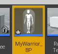
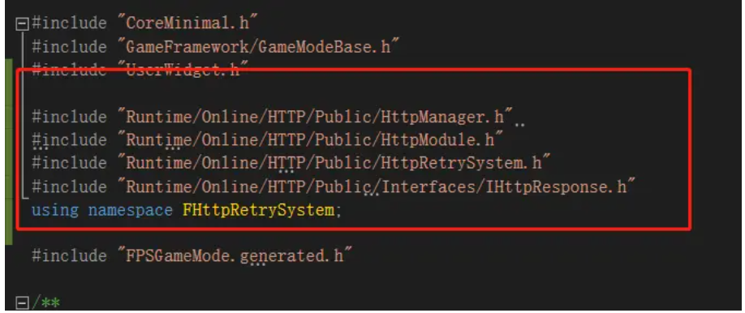
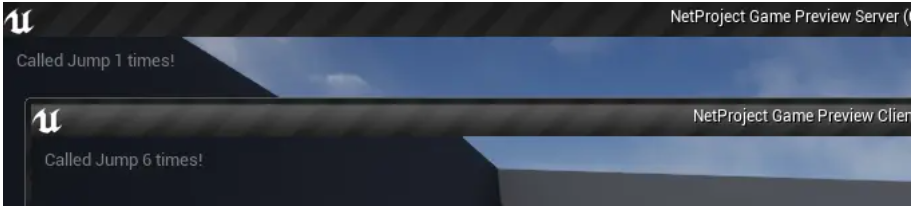

# 使用UE4的API

## Core/Logging API——定义自定义日志类别

UE4本身定义了几个日志类别，包括` LogActor `这样的类别，它有任何与 Actor 类有关的日志消息，以及 `LogAnimation`，它记录有关动画的消息。 通常，UE4为每个模块定义一个单独的日志类别。 这允许开发人员将他们的日志消息输出到不同的日志流。 每个日志流的名称前缀为输出的消息，如下面的引擎日志消息示例所示:


这些日志消息是引擎的示例，每个日志消息都以日志类别作为前缀。 警告信息以黄色显示，前面也添加了警告。示例代码倾向于使用 ==LogTemp== 来处理 UE4项目自己的消息，如下所示：

```c++
UE_LOG( LogTemp, Warning, TEXT("Message %d"), 1);
```

自定义日志类别的实现方法在以前的例子中有纪录过操作步骤，这边做一些消息说明：

- 首先我们是用以下方法来声明新的Log类型：

    ```c++
    DECLARE_LOG_CATEGORY_EXTERN(LogName, Log, All);
    ```

- 是在 `AssertionMacros.h` 所定义的，该声明有三个参数，如下：

    - `CategoryName`：这是正在定义的日志类别名称（此处为 LogName）
    - `Defaultverbosity`：这是对日志消息使用的默认描述
    - `CompileTimeVerbosity`：这是用于编译代码的描述

- 我们通常将声明Log的语句放在项目的头文件中

- 此外在cpp文件添加语句：

    ```c++
    DEFINE_LOG_CATEGORY(LogCh11);
    ```

- 这样我们可以在我们自己的脚本中使用这个日志类别。我们可以在项目中所有需要使用到自定义Log的类中，包含项目头文件，然后使用如下语句来打印日志：

    ```c++
    UE_LOG(LogCh11, Display, TEXT("log is working" ) );
    ```


总结：

日志记录的工作方式是：将消息输出到输出日志`(Window | Developer Tools | Output Log)`以及文件中。 输出到输出日志的所有信息也会镜像到项目的/Saved/Logs 文件夹中的一个简单文本文件。最近的一个命名为 YourProjectName.log。

 我们可以使用以下控制台命令从编辑器内部启用或禁止特定日志通道的日志消息:

```c++
Log LogName off // 停止 LogName（日志名称）从输出处显示

Log LogName Log //  再次打开 LogName（日志名称）的输出
```

如果希望编辑某些内置日志类型的输出级别的初始值，可以使用C++类为 engine.ini 配置文件创建更改。 可以更改 engine.ini 配置文件中的初始值。更多详细信息 : https://wiki.unrealengine.com/logs,_printing_messages_to_yourself_during_runtime。

UE_LOG 将其输出发送到“输出窗口”。 除此之外，如果希望使用更专门的 ==Message Log 窗口==，可以使用 ==FMessageLog 对象==写入输出消息、写入消息日志和输出窗口。 下一个例子将会进行具体讲述。


## Core/Logging API —— 将消息写入消息日志

==FMessageLog== 是一个**object**，它允许将输出消息同时写入**消息日志** `(Window | Developer Tools | Message Log)`和**输出日志** `(Window | Developer Tools | Output Log)`。

准备好项目和一些消息日志。 在 UE4编辑器中显示消息日志(Window | Developer Tools | Message Log)。添加 #define 到您的==主头文件(ProjectName.h)== ，将 `LOCTEXT_NAMESPACE `定义：

==test1.h==

```c++
#pragma once

#include "CoreMinimal.h"

#define LOCTEXT_NAMESPACE "NewNameSpace"
```

这个 # define 由 **LOCTEXT ()宏**使用，我们用它来生成 **FText 对象**，但是在输出消息中看不到。通过在某个非常全局的地方构造来声明你的 **FMessageLog**。 可以在 ProjectName.h 文件中使用 extern。 

然后，创建我们的 **FMessageLog**。 并将其注册到 `MessageLogModule`。 一定要给记录器一个清晰和唯一的名称。 日志的类别将出现在日志消息的左侧的 **Output Log** 中。 

添加代码：

==test1.h==

```c++
#pragma once

#include "CoreMinimal.h"

#define LOCTEXT_NAMESPACE "NewNameSpace"

#define FTEXT(x) LOCTEXT(x,x)

extern FName LoggerName;

void CreateLog(FName logName);
```

==test1.cpp==

```c++
// Copyright Epic Games, Inc. All Rights Reserved.

#include "test1.h"
#include "Modules/ModuleManager.h"
#include "MessageLog/Public/MessageLogModule.h"

IMPLEMENT_PRIMARY_GAME_MODULE( FDefaultGameModuleImpl, test1, "test1" );

FName LoggerName("MessageLog NewLog");

void CreateLog(FName logName)
{
	FMessageLogModule& MessageLogModule = FModuleManager::LoadModuleChecked<FMessageLogModule>("MessageLog");
	
	FMessageLogInitializationOptions Initoptions;

	Initoptions.bShowPages = true;

	Initoptions.bShowFilters = true;

	FText LogListName = FTEXT("NewMessageLog");

	MessageLogModule.RegisterLogListing(logName, LogListName, Initoptions);
}
```

然后，回到代码中的某个地方，实际创建日志并使用它。 例如：

```c++
extern "C"
{
	extern FName LoggerName;
	extern void CreateLog(FName logName);
}
...
CreateLog(LoggerName);
FMessageLog logger(LoggerName);
logger.Warning(FText::FromString("xx，sss"));
```

这段代码使用了我们前面定义的 FTEXT ()宏。 确保它在我们的代码库中。这个例子使用消息日志显示一条消息。 


在初始化检索原始消息日志的副本之后，再次构造消息日志。 例如，可以在代码中的任何位置编写以下代码: 

```c++
FMessageLog (LoggerName).Info(FTEXT("a MES")) ;
```


## 使用FRotator旋转


```c++
auto theWorld = GetWorld();
FRotator rotator(0, theWorld->TimeSeconds, 0);
GetOwner()->SetActorRotation(rotator);
```


## 使用FQuat旋转

四元组听起来很高端，但是它们非常容易使用。 你可以通过观看下面的视频来回顾一下它们背后的理论数学:

- 理解四元组: http://gdcvault.com/play/1017653/math-for-game-programmers-Understanding


但是，我们不会在这里介绍数学背景知识。 使用上个例子的RotateActorComponent：

```c++
FQuat quat = FQuat(FVector(0, 1, 0), GetWorld()->TimeSeconds * PI / 4.f);
GetOwner()->SetActorRotation(quat);
```

四元数有点奇怪，但是使用它们非常简单。 如果 v 是要旋转的轴，而 θ 是旋转角的大小，那么我们得到了以下四元数分量的公式：


举个例子，旋转


以 π/2 的角度，将具有以下四元组:


四元数的四个分量中的三个==(x、 y 和 z)==定义了要旋转的轴（以旋转角度的一半的正弦为标准)），而第四个分量==(w)==只有要旋转的角度的一半的余弦值。

作为向量本身的四元数可以旋转。 只需提取四元数的(x，y，z)分量，将其归一化，然后旋转该向量。 以期望的旋转角度从新的单位矢量构造一个新的四元数。

四元数相乘表示随后发生的一系列旋转。 例如，围绕 x 轴旋转45度，然后围绕 y 轴旋转45度，将由以下组成:

```c++
FQuat( FVector( 1, 0, 0 ), PI/4.f )*FQuat( FVector( 0, 1, 0 ), PI/4.f );
```

注意这边用的运算符是* ，数值不需要计算正弦余弦的乘法，只需要填角度值，函数内部会做计算：


## 使用FRotationMatrix 使一个对象转向另一个对象

==FRotationMatrix==提供了一系列==::Make*  矩阵结构==。 它们易于使用，而且对于让一个物体面对另一个物体很有用。 假设你有两个对象，其中一个紧跟着另一个。 **我们希望跟随者的旋转始终面对它所跟随的东西**。 FRotationMatrix 的构造方法使这一过程变得容易。

首先创建新的类：


添加代码：

==FollowActorComponent.h==

```c++
UPROPERTY(EditAnywhere)
		AActor* target;
```

==FollowActorComponent.cpp==

```c++
// Called every frame
void UFollowActorComponent::TickComponent(float DeltaTime, ELevelTick TickType, FActorComponentTickFunction* ThisTickFunction)
{
	Super::TickComponent(DeltaTime, TickType, ThisTickFunction);

	// ...
	FVector toFollow = target->GetActorLocation() - GetOwner()->GetActorLocation();
	FMatrix rotationMatrix = FRotationMatrix::MakeFromXY(toFollow, GetOwner()->GetActorRightVector());
	GetOwner()->SetActorRotation(rotationMatrix.Rotator());
}
```

通过调用正确的函数可以让一个对象看到另一个对象，这取决于对象的计算方向。 通常，我们需要重新定位 x 轴(向前) ，同时指定 y 轴(右)或 z 轴(向上)向量`（FRotationMatrix: : MakeFromXY ()）`。 例如，为了让一个参与者沿着一个 `lookAlong` 向量的方向看，让它的右边朝右，我们为它构造并设置 FRotationMatrix，如下所示:

```c++
FRotationMatrix rotationMatrix = FRotationMatrix::MakeFromXY(lookAlong, right );
actor->SetActorRotation( rotationMatrix.Rotator() );
```


## GameplayAbilities API——通过游戏控制触发Actor的游戏可玩性

游戏可玩性 API 可以用来附加 C++ 函数，来调用特定的按钮按压，触发游戏单元在游戏过程中显示其能力，以响应击键事件。 本例讲述了如何做到这一点。

在这里我们需要使用以下几个对象:

- UGameplayAbility 类ーー这是派生 UGameplayAbility 类的 c + + 类实例所需要的，每个能力都有一个派生类:


- 定义每种能力的作用 .h 和.cpp 通过重写可用的函数，比如 UGameplayAbility: : ActivateAbility，UGameplayAbility: : InputPressed，UGameplayAbility: : CheckCost，UGameplayAbility: : ApplyCost，UGameplayAbility: : : ApplyCost，UGameplayAbility: : ApplyCooldown，等等


- 是一个 DataAsset 派生对象，它包含一系列 enum'd 命令值，以及相应的 UGameplayAbility 派生类的蓝图，这些类定义了特定输入命令的行为。 每个可玩性都是通过按键或鼠标点击启动的，这是在 DefaultInput.ini 中设置的。


在下面的代码中，我们将为一个 Warrior 类对象实现一个名为 UGameplayAbility_Attack 的 UGameplayAbility 派生。 我们将把这个游戏性功能附加到输入命令字符串 Ability1中，我们将在**鼠标左键点击**上激活它:

在这之前我们需要将引用模块添加上，在Build.cs中添加：

```c++
PublicDependencyModuleNames.AddRange(new string[] { "GameplayAbilities", "GameplayTags", "GameplayTasks" });
```

然后在编辑器中找到插件并打开，然后重启编辑器：


创建新C++类：


我们需要重写以下内容:

- UGameplayAbility_Attack::CanActicateAbility：来指示何时允许行动者调用该能力。


- UGameplayAbility_Attack::CheckCost函数：用来指示玩家是否可以使用某个技能。这非常重要，因为如果返回false，能力调用将失败。


- UGameplayAbility_Attack::ActivateAbility：是执行时，他们的攻击能力被激活。


- UGameplayAbility_Attack::InputPressed：成员函数和响应键输入事件分配给能力


添加代码：

==UGameplayAbility_Attack.h==

```c++
// Fill out your copyright notice in the Description page of Project Settings.

#pragma once

#include "CoreMinimal.h"
#include "Abilities/GameplayAbility.h"
#include "GameplayAbility_Attack.generated.h"

/**
 * 
 */
UCLASS()
class TEST1_API UGameplayAbility_Attack : public UGameplayAbility
{
	GENERATED_BODY()
public:

	virtual bool CanActivateAbility(const FGameplayAbilitySpecHandle Handle, const FGameplayAbilityActorInfo* ActorInfo, const FGameplayTagContainer* SourceTags /* = nullptr */, const FGameplayTagContainer* TargetTags /* = nullptr */, OUT FGameplayTagContainer* OptionalRelevantTags /* = nullptr */)
	{
		UE_LOG(LogTemp, Warning, TEXT("ability_attackCanActiveAbility"));
		return true;
	}

	virtual bool CheckCost(const FGameplayAbilitySpecHandle Handle, const FGameplayAbilityActorInfo* ActorInfo, OUT FGameplayTagContainer* OptionalRelevantTags /* = nullptr */)
	{

		UE_LOG(LogTemp, Warning, TEXT("ability_attack CheckCost"));
		return true;
	}

	virtual void ActivateAbility(const FGameplayAbilitySpecHandle Handle, const FGameplayAbilityActorInfo* ActorInfo, const FGameplayAbilityActivationInfo ActivationInfo, const FGameplayEventData* TriggerEventData)
	{
		UE_LOG(LogTemp, Warning, TEXT("ability_attack()_swing"));
		Super::ActivateAbility(Handle, ActorInfo, ActivationInfo, TriggerEventData);
	}

	virtual void InputPressed(const FGameplayAbilitySpecHandle Handle, const FGameplayAbilityActorInfo* ActorInfo, const FGameplayAbilityActivationInfo ActivationInfo)
	{
		UE_LOG(LogTemp, Warning, TEXT("ability_attack inputpressed"));
		Super::InputPressed(Handle, ActorInfo, ActivationInfo);
	}
};
```

编译完成后在编辑器中，创建资源：


选择如下类型：


打开资源，点击加号添加我们刚才新建的类：


新建一个Character 类 Warrior。由于Demo之前的例子有创建过，所以这边直接使用这个类来添加代码。我们得确保我们Actor类派生也来自`UAbilitySystemInterface`接口。这对于调用`Cast(yourActor))->GetAbilitySystemComponent()`非常重要。

```c++
#include "GameplayAbilitySet.h"
#include "AbilitySystemInterface.h"
...
#define FS(x,...) FString::Printf( TEXT(x), __VA_ARGS__)
UCLASS()
class TEST1_API AWarrior : public ACharacter, public IAbilitySystemInterface
...
UPROPERTY(EditAnywhere, BlueprintReadWrite, Category = Stats)
		UGameplayAbilitySet* gameplayAbilitySet;

UPROPERTY(EditAnywhere, BlueprintReadWrite, Category = Stats)
		UAbilitySystemComponent* AbilitySystemComponent;

virtual UAbilitySystemComponent* GetAbilitySystemComponent() const
{
		return AbilitySystemComponent;
}

```

接着我们创建一个基于Warrior的蓝图类：



打开并设置：


设置GameMode默认角色：


添加代码：

```c++
#include "GameplayAbilitySet.h"
#include "AbilitySystemInterface.h"
#include "AbilitySystemComponent.h"
#include "Warrior.generated.h"
```

==.cpp==

```c++
// Called to bind functionality to input
void AWarrior::SetupPlayerInputComponent(UInputComponent* PlayerInputComponent)
{
	Super::SetupPlayerInputComponent(PlayerInputComponent);

	// Connect the class's AbilitySystemComponent to the actor's input component
	AbilitySystemComponent->BindToInputComponent(PlayerInputComponent);

	for (const FGameplayAbilityBindInfo& bindInfo : gameplayAbilitySet->Abilities)
	{
		FGameplayAbilitySpec spec(bindInfo.GameplayAbilityClass->GetDefaultObject<UGameplayAbility>(), 1, (int32)bindInfo.Command);

		FGameplayAbilitySpecHandle abilityHandle = AbilitySystemComponent->GiveAbility(spec);

		int32 AbilityID = (int32)bindInfo.Command;

		FGameplayAbilityInputBinds inputBinds(
			FS("Confirm Targetting_%s_%s", *GetName(), *bindInfo.GameplayAbilityClass->GetName()),
			FS("CancelTargetting_%s_%s", *GetName(), *bindInfo.GameplayAbilityClass->GetName()),
			"EGameplayAbilityInputBinds",
			AbilityID, AbilityID
		);
		AbilitySystemComponent->BindAbilityActivationToInputComponent(PlayerInputComponent, inputBinds);
		AbilitySystemComponent->TryActivateAbility(abilityHandle, 1);
	}
...
}
```

我们必须通过对 UAbilitySystemComponent: : GiveAbility (spec)的一系列调用，将一组 UGameplayAbility 对象分类，并链接到我们的==参与者的 UAbilitySystemComponent 对象==，并适当构造 FGameplayAbilitySpec 对象。 

这样做的目的是用这一系列的 GameplayAbilities来装饰我们的Actor。 每个 UGameplayAbility 的功能，以及它的消耗、冷却和激活，都整齐地包含在您将构造的 UGameplayAbility 类派生中。

不要使用游戏可玩性设置GameplayAbilitySet: : GiveAbilities ()成员函数。因为它不允许我们访问游戏可玩性设置的 `FGameplayAbilitySpecHandle`，我们以后实际需要这些对象来绑定和调用输入组件的功能。我们需要仔细地在 GameplayAbility.h 头文件中编写一系列其他可用的函数，包括以下的实现:

- SendGameplayEvent：这是一个通知游戏可玩性的函数，通知一些一般的游戏事件已经发生。
- CancelAbility: 这是一个函数，用于中途停止某个功能的使用，并给予该异能一个中断状态。

 在 UGameplayAbility 类声明的底部附近有一些现有的 UPROPERTY 说明符，它们可以在添加或删除某些游戏标签时激活或取消该能力。 参见下面的GameplayTags API-附加游戏标签到一个Actor的例子了解更多细节。

GameplayAbility API 是一个丰富的、交织在一起的对象和函数系列。 探索游戏效果、游戏标签和游戏任务，以及它们如何与 UGameplayAbility 类集成，以充分探索该库所提供的功能。 


## 使用属性集实现统计

==GameplayAbility API== 允许我们将一组属性（即 UAttributeSet）关联到 Actor。 UAttributeSet 描述的属性适合游戏中的属性，如 Hp，Mana，Speed，Armor，AttackDamage等。 我们可以定义所有参与者共有的单个游戏范围的属性集，也可以定义适用于不同类型Actor的多个不同的属性集。

组件是我们需要添加到我们的Actor中的第一个东西，以使他们能够使用 GameplayAbilityAPI 和 UAttributeSet 类。 要定义自定义 UAttributeSet，只需从 UAttributeSet 基类派生，并使用自己的一系列 UPROPERTY 成员扩展基类。 之后，必须用 Actor 类的 `AbilitySystemComponent` 注册自定义属性集。


添加代码:

GameUnitAttributeSet.h:

```c++
// Fill out your copyright notice in the Description page of Project Settings.

#pragma once

#include "CoreMinimal.h"
#include "AttributeSet.h"
#include "GameUnitAttributeSet.generated.h"

/**
 * 
 */
UCLASS()
class NEWTUTORIALPROJECT_API UGameUnitAttributeSet : public UAttributeSet
{
    GENERATED_BODY()
    
public: 
    UPROPERTY(EditAnywhere, BlueprintReadWrite, Category = GameUnitAttributes) 
        float Hp;

    UPROPERTY(EditAnywhere, BlueprintReadWrite, Category = GameUnitAttributes) 
        float Mana;

    UPROPERTY(EditAnywhere, BlueprintReadWrite, Category = GameUnitAttributes) 
        float Speed;
};
```

然后我们继续使用上一例子使用到的Warrior，添加声明(如果已有则忽略)：

```c++
virtual void PostInitializeComponents() override;
```

==Warrior.cpp:==


注意: 可以将此调用放在 PostInitializeComponents()中的某个位置，或放在稍后调用的代码中。

一旦注册了 UAttributeSet，就可以继续下一个例子，并对属性集中的某些元素应用游戏 / 效果。确保我们的 Actor 类对象通过从其派生来实现 IAbilitySystemInterface。 这一点非常重要，因为 UAbilitySet 对象将尝试强制转换为 IAbilitySystemInterface，以便在代码中的不同位置对其调用 GetAbilitySystemComponent ()。

总结：

==UAttributeSets== 只允许枚举和定义不同Actor的属性。 游戏效果将是我们修改特定参与者属性的方法。我们可以编写 GameplayEffects 的定义，这些定义将作用于 AbilitySystemComponent 的 AttributeSet 集合。 

我们还可以为在特定时间运行或跟踪特定事件的通用函数编写 GameplayTasks，甚至可以响应标记添加(GameplayTagResponTable.cpp)。 我们可以定义游戏标签来修改游戏可玩性行为，以及在游戏过程中选择和匹配游戏单位。


## 实现与游戏玩家效果的增益

Buff 是一种效果，它从游戏单元的**属性集**中（==AttributeSet==）引入一个临时的、永久的或者重复出现的变化。 增益可以是好的也可以是坏的，提供奖励或惩罚。 例如，你可能有一个增益效果，让单位的速度减慢到一半，一个天使的翅膀增加单位速度2倍，或者一个增益效果，每5秒恢复5 hp，持续3分钟。 

`GameplayEffect`会影响**属性集**中的**个人游戏操作属性**，该属性会附加到Actor的`AbilitySystemComponent`的`UAttributeSet组件`上。在接下来的步骤中，我们将构建一个快速的GameplayEffect，治疗50点的选中单位的属性集：

本例还是使用上个例子中使用的Warrior。

在==Warrior.h==中添加声明：

```c++
void TestGameplayEffect();
```

在==Warrior.cpp==中添加实现：

```c++
inline UGameplayEffect* ConstructGameplayEffect(FString name)
{
    return NewObject<UGameplayEffect>(GetTransientPackage(), FName(*name));
}

inline FGameplayModifierInfo& AddModifier(
    UGameplayEffect* Effect, UProperty* Property,
    EGameplayModOp::Type Op,
    const FGameplayEffectModifierMagnitude& Magnitude)
{
    int32 index = Effect->Modifiers.Num();
    Effect->Modifiers.SetNum(index + 1);
    FGameplayModifierInfo& Info = Effect->Modifiers[index];
    Info.ModifierMagnitude = Magnitude;
    Info.ModifierOp = Op;
    Info.Attribute.SetUProperty(Property);
    return Info;
}

void AWarrior::TestGameplayEffect()
{
    // Construct & retrieve UProperty to affect
    UGameplayEffect* RecoverHP = ConstructGameplayEffect("RecoverHP");

    // Compile-time checked retrieval of Hp UPROPERTY()
    // from our UGameUnitAttributeSet class (listed in
    // UGameUnitAttributeSet.h)
    UProperty* hpProperty = FindFieldChecked<UProperty>(UGameUnitAttributeSet::StaticClass(), GET_MEMBER_NAME_CHECKED(UGameUnitAttributeSet, Hp));
}
```

我们可以使用 AddModifier 函数更改 GameUnitAttributeSet 的 Hp 字段，如下所示：

```c++
AddModifier(RecoverHP, hpProperty, EGameplayModOp::Additive, FScalableFloat(50.f));
```

填写 GameplayEffect 的其他属性，包括诸如 DurationPolicy 和 ChanceToApplyToTarget 这样的字段，或者任何其他我们想修改的字段，如下所示：

```c++
// .. for a fixed-duration of 10 seconds ..
RecoverHP->DurationPolicy = EGameplayEffectDurationType::HasDuration;
RecoverHP->DurationMagnitude = FScalableFloat(10.f);

// .. with 100% chance of success ..
RecoverHP->ChanceToApplyToTarget = 1.f;

// .. with recurrency (Period) of 0.5 seconds
RecoverHP->Period = 0.5f;
```

将效果应用于您选择的 AbilitySystemComponent。 底层的 UAttributeSet 将受到调用的影响和修改，如下面的代码所示：

```c++
FActiveGameplayEffectHandle recoverHpEffectHandle =AbilitySystemComponent->ApplyGameplayEffectToTarget(RecoverHP, AbilitySystemComponent, 1.f);
```

GameplayEffects 是简单的小对象，影响改变一个Actor的AttributeSet。GameplayEffects可以在一段时间内发生一次或重复。我们可以很快地编写输入效果，而且GameplayEffects类的创建是内嵌的。

另外，一旦游戏效果被激活，我们将会收到一个 FActiveGameplayEffectHandle。 我们可以使用此句柄附加一个函数委托，以便在效果结束时使用 **FActiveGameplayEffectHandle** 的 `OnRemovedDelegate` 成员运行。 例如，可以调用以下代码：

```c++
FOnActiveGameplayEffectRemoved* ep = AbilitySystemComponent->OnGameplayEffectRemovedDelegate(recoverHpEffectHandle);

if (ep)
{
	ep->AddLambda([]()
        {
            UE_LOG(LogTemp, Warning, TEXT("Recover effect has been removed."), 1);
        });
}
```


## GameplayTask API —— 通过游戏任务来触发事件

GameTasks是用来包装一些可重复使用的对象的游戏性功能。 要使用它们，只需从 UGameplayTask 基类派生，并重写您希望实现的一些成员函数。

创建新类：


添加代码:

==GameplayTask_CreateParticles.h==

```c++
// Fill out your copyright notice in the Description page of Project Settings.

#pragma once

#include "CoreMinimal.h"
#include "GameplayTask.h"
#include "Particles/ParticleSystem.h"
#include "GameplayTask_CreateParticles.generated.h"

/**
 * 
 */
UCLASS()
class NEWTUTORIALPROJECT_API UGameplayTask_CreateParticles : public UGameplayTask
{
    GENERATED_BODY()
public: 
    virtual void Activate();

    // A static constructor for an instance of a
    // UGameplayTask_CreateEmitter instance, // including args of (what class of emitter, where to
    // create it). 
    UFUNCTION(BlueprintCallable, Category = "GameplayTasks", meta = (AdvancedDisplay = "TaskOwner", DefaultToSelf = "TaskOwner", BlueprintInternalUseOnly = "TRUE")) 
        static UGameplayTask_CreateParticles* ConstructTask( TScriptInterface<IGameplayTaskOwnerInterface> TaskOwner, UParticleSystem* particleSystem, FVector location);

    UParticleSystem* ParticleSystem;
    FVector Location;
    
};
```

==GameplayTask_CreateParticles.cpp==

```c++
/ Fill out your copyright notice in the Description page of Project Settings.

#include "GameplayTask_CreateParticles.h"
#include "Kismet/GameplayStatics.h"
 

// Like a constructor.
UGameplayTask_CreateParticles* UGameplayTask_CreateParticles::ConstructTask( TScriptInterface<IGameplayTaskOwnerInterface> TaskOwner, UParticleSystem* particleSystem, FVector location)
{ 
    UGameplayTask_CreateParticles* task =NewTask<UGameplayTask_CreateParticles>(TaskOwner); 
    // Fill fields 
    if (task)
    { 
        task->ParticleSystem = particleSystem; 
        task->Location = location; 
    } 
    return task;
}

void UGameplayTask_CreateParticles::Activate()
{
    Super::Activate();
    UGameplayStatics::SpawnEmitterAtLocation(GetWorld(),ParticleSystem, Location);
}
```

Warrior.h中添加接口实现：


并添加声明：

```c++

   //
    UPROPERTY(EditAnywhere, BlueprintReadWrite, Category = Stats)
        UGameplayTasksComponent* GameplayTasksComponent;

    // This is the particleSystem that we create with the
    // GameplayTask_CreateParticles object.
    UPROPERTY(EditAnywhere, BlueprintReadWrite, Category = Stats)
        UParticleSystem* particleSystem;

```

构造函数添加：

```c++
AWarrior::AWarrior()
{
    // Set this character to call Tick() every frame.  You can turn this off to improve performance if you don't need it.
    PrimaryActorTick.bCanEverTick = true;
    lastInput = FVector2D::ZeroVector;

    AbilitySystemComponent = CreateDefaultSubobject<UAbilitySystemComponent>("UAbilitySystemComponent");
    GameplayTasksComponent = CreateDefaultSubobject<UGameplayTasksComponent>("UGameplayTasksComponent");

}
```

在Warrior.h添加几个关于GameplayTaskOwnerInterface的声明：

```c++
virtual UGameplayTasksComponent* GetGameplayTasksComponent(const UGameplayTask& Task) const 
    {
        return GameplayTasksComponent;
    }

    // This gets called both when task starts and when task gets
    // resumed.
    // Check Task.GetStatus() if you want to differentiate.
    virtual void OnTaskActivated(UGameplayTask& Task) { }
    virtual void OnTaskDeactivated(UGameplayTask& Task) { }

    virtual AActor* GetOwnerActor(const UGameplayTask* Task) const
    {
        return Task->GetOwnerActor(); // This will give us the
        // accurate answer for the Task..
    }
```

编译完成后打开编辑器==MyWarrior_BP==，按如下设置：


我们可以简单的使用蓝图代码来调用GameTask：


也可以使用C++来进行调用：

```c++
// Called when the game starts or when spawned
void AWarrior::BeginPlay()
{
    Super::BeginPlay();
    UGameplayTask_CreateParticles* task =UGameplayTask_CreateParticles::ConstructTask(this,particleSystem, FVector(200.f, 0.f, 200.f));

    if (GameplayTasksComponent && task)
    {
        GameplayTasksComponent->AddTaskReadyForActivation(*task);
    }
}
```


此代码在 Actor 类派生中的任何地方运行，必须要在初始化 GameplayTaskComponent 之后的任何时间(PostInitializeComponents ()之后的任何时间)

总结：

GameplayTasks是通过GameplayTasksComponent注册的位于一个Actor 中。 我们可以激活任何数量的游戏任务在任何时间在游戏中触发他们的效果。 游戏任务也可以启动游戏效应来改变 AbilitySystemsComponents 的属性。

我们可以在游戏中为任意数量的事件派生游戏任务。 更重要的是，我们可以重写更多的虚函数以挂接到附加功能。


## HTTP API —— 使用 web 请求下载网页

当我们维护记分板，访问数据库或其他需要定期访问服务器的 HTTP 请求时，您可以使用 HTTP API 执行此类 web 请求任务。

首先我们需要该Build.cs添加HTTP API的引用：

```c++
   PublicDependencyModuleNames.AddRange(new string[] { "HTTP" });
```

在当前使用的==GameMode类==添加包含头文件：


使用以下代码来进行实例化==IHttpRequest==

```c++
TSharedRef<IHttpRequest>http=FHttpModule::Get().CreateRequest();
```

==FHttpModule==是一个单例对象。 它的一个副本存在于与 FHttpModule 类的所有交互中的整个程序中。将我们运行的函数附加到 **IHttpRequest 对象**的 `FHttpRequestCompleteDelegate` 上，该对象具有以下声明：

```c++
void HttpRequestComplete( FHttpRequestPtr request,FHttpResponsePtr response, bool success );
```

该委托在 ==IHttpRequest 对象==中作为 `http->OnProcessRequestComplete ()`找到:

```c++
HttpRequestCompleteDelegate& delegate = http->OnProcessRequestComplete();
```

有几种方法可以将回调函数附加到委托。 我们可以使用以下方法：

- 使用 `delegate. BindLambda ()`的 lambda：

    ```c++
    TSharedRef<IHttpRequest> http = FHttpModule::Get().CreateRequest();
    
    FHttpRequestCompleteDelegate& delegate = http -> OnProcessRequestComplete();
    
    delegate.BindLambda(
        // Anonymous, inlined code function (aka lambda)
        [](FHttpRequestPtr request, FHttpResponsePtr response, bool success) -> void
        {
        UE_LOG(LogTemp, Warning, TEXT("Http Response: %d, %s"),request->GetResponse()->GetResponseCode(),*request->GetResponse()->GetContentAsString());
    });
    
    http->SetURL(TEXT("http://unrealengine.com"));
    
    http->ProcessRequest();
    ```

将以上代码添加到GameMode的`BeginPlay`中，编译完成后运行，查看`Output Log`结果如下：


这是通过Http访问**UE官网**返回的数据显示的 ==HTML unrealengine.com 内容==。在这个例子中，它是一个 web 页面，但是我们可以很容易地将它指向 CSV 文件、文本文档或其他任何东西，以获取我们的项目的信息

Http 对象是我们发送 HTTP 请求到服务器，并获得 ==HTTP 响应==所需的全部内容。例如，将分数提交给一个高分数表，或者从服务器检索要在游戏中显示的文本。它们被铺设成一个访问的 URL 和一个在**请求完成时**运行的函数回调。 
最后，他们通过 FManager 发送。 当 web 服务器响应时，将调用回调函数，并显示 HTTP 响应的结果。

除了使用Lambda来绑定，还有其他方法可以将**回调函数**绑定到委托：

- 使用 UObject 的成员函数：

    ```c++
    delegate.BindUObject(this, &AFPSGameMode::HttpRequestComplete);
    ```

    ```c++
    void AFPSGameMode::HttpRequestComplete(FHttpRequestPtr request, FHttpResponsePtr response, bool success)
    {
        UE_LOG(LogTemp, Warning, TEXT("Http Response: %d, %s"), request->GetResponse()->GetResponseCode(), *request->GetResponse()->GetContentAsString());
    }
    ```

    > 注意：这里的方法不能使用UFUNCTION() 。 命令请求与所有 UCLASS、 USTRUCT 或 UENUM 的参数冲突。

- 对于任何普通的C++对象的成员函数，使用==.BindRaw==：

    ```c++
    PlainObject* plainObject = new PlainObject();
    delegate.BindRaw( plainObject, &PlainObject::httpHandler );
    ```

    使用这种方法我们必须确保我们的 plainObject 在 HTTP 请求完成时，引用内存中的有效对象。 这意味着不能在 plainObject 上使用 ==TAutoPtr==，因为它会在声明 plainObject 的块的末尾释放 plainObject，但这可能发生在 HTTP 请求完成之前。

- 使用静态函数==.BindStatic==：

    ```c++
     delegate.BindStatic(&httpHandler);
    ```

    ```c++
    static void httpHandler(FHttpRequestPtr request, FHttpResponsePtr response, bool success);
    ```

    ```c++
    void AFPSGameMode::httpHandler(FHttpRequestPtr request, FHttpResponsePtr response, bool success)
    {
        UE_LOG(LogTemp, Warning, TEXT("Http Response: %d, %s"), request->GetResponse()->GetResponseCode(), *request->GetResponse()->GetContentAsString());
    }
    ```

当对一个对象使用委托回调时，我们要确保==正在调用的对象实例==至少在 `HttpResponse` 从服务器返回之前一直存在。 处理 `HttpRequest `需要实时运行。 这毕竟是一个网页请求，相当于等待网页加载。

我们必须确保在调用 HttpHandler 函数期间，回调函数的对象实例没有释放。 当 HTTP 请求完成回调返回时，对象必须仍然在内存中。不能简单地期望 HttpResponse 函数在附加了回调函数和调用 ProcessRequest ()之后立即发生。使用引用计数的 UObject 实例附加 HttpHandler 成员函数是一个好方法，可以确保对象在 HTTP 请求完成之前保留在内存中。

在本章的示例代码中，我们可以在  FPSGameMode.cpp 文件中看到所有四种可能的使用方式的示例。我们可以通过下面的成员函数设置额外的 HTTP 请求参数：

- Setverb () ，用于更改是否在 HTTP 请求中使用 GET 或 POST 方法
- SetHeaders () ， 修改成我们需要的请求头


## HTTP API —— 显示下载的进度

来自 HTTP API 的 ==IHttpRequest==  将通过对 `FHttpRequestProgressDelegate `的回调报告 ==HTTP 下载进度==，该回调可以通过 ==OnRequestProgress ()==访问。 我们可以附加到 `OnRequestProgress ()`的委托函数的声明如下：

```c++
HandleRequestProgress( FHttpRequestPtr request, int32 sentBytes, int32 receivedBytes )
```

我们可以编写的函数的三个参数包括原始 IHttpRequest 对象、发送的字节和到目前为止接收到的字节。 这个函数会周期性地被回调，直到 IHttpRequest 对象完成，也就是在调用附加到 OnProcessRequestComplete ()的函数时。 可以使用传递给 HandleRequestProgress 函数的值查找进度。

我们需要一个网络连接来验证这个例子。 我们将从公共服务器请求一个文件。我们也可以使用公共服务器或我们自己的专用服务器来发送 HTTP 请求。

在这个例子中，我们将一个回调函数绑定到 OnRequestProgress ()委托，以显示从服务器下载的文件的进度。 准备好一个项目，我们可以编写一段代码来执行 IHttpRequest，并且有一个界面来显示百分比进度。

我们选择绑定Lambda来进行讲述：

```c++
http->OnRequestProgress().BindLambda(
        [this](FHttpRequestPtr request, int32 sentBytes, int32 receivedBytes)-> void
    {
        int32 contentLen =request->GetResponse()->GetContentLength();
        float percentComplete = 100.f * receivedBytes /contentLen;

        UE_LOG(LogTemp, Warning, TEXT("Progress sent=%d bytes /received = %d / %d bytes[%.0f%%]"), sentBytes, receivedBytes,contentLen, percentComplete);
    });
```

使用 http->ProcessRequest()来进行验证。编译完成后我们运行程序，查看OutputLog：


==OnRequestProgress ()==回调会随着发送的字节和接收到的 HTTP 进度而被激发。 我们将通过计算`(float) receivedBytes / totalLen` 来计算完成下载的总百分比，其中 totalLen 是以字节为单位的 HTTP 响应的总长度。 使用附加到 OnRequestProgress ()委托回调的 lambda 函数，我们可以通过文本显示信息。


# UE4中的多人联网

## 测试客户端和服务器联网

在开发网络游戏时， 不需要使用两台独立的电脑，Unreal 提供了一个简单的方法，可以测试多个端的逻辑。为了测试的方便我们本章例子用引擎自带的第三人称模板来进行验证。设置玩家数：


运行，可以看到两个角色在场景中，我们之后的例子就可以这样进行测试。除了场景中的角色外，还有另一个被称为 ==NetworkPlayerStart== 的物体，新加入的网络玩家将在这里产生：


## 通过网络同步属性

为了确保客户机和服务器上的值相同，我们使用了复制过程。 在这个例子中让我们创建一个变量来存储每个玩家在游戏中跳跃的次数:

编译后，运行按空格键跳跃，结果如下：


资源复制在理论上是简单的。 每当一个变量改变了它的值，网络就应该通知所有的客户端这个变化，然后更新这个变量。 这通常用于像血量这样的值。

当我们像这样注册一个变量时，这个变量应该只由服务器修改，然后复制到其他客户机。 要标记要复制的内容，我们使用 UPROPERTY 中的 ==Replicated 说明符==。

在将某个内容标记为 Replicated 之后，我们必须定义一个名为 ==GetLifetimeReplicatedProps== 的新函数，它不需要在头文件中声明。 在这个函数内部，我们使用 ==DOREPLIFETIME 宏==来声明，每当服务器上的 JumpCount 变量发生更改时，所有客户机也需要修改值。

在 Jump 函数内部，我们添加了一些新的功能，但是我们首先检查 ==Role 变量==，以确定是否应该发生某些事情。 角色权限是最高级别，这意味着它是**服务器**。 这确保了我们的功能只会发生一次而不是多次。

对于那些想要给他们的代码添加一些优化的代码，可以使用下面的代码来代替我们现在使用的 DOREPLIFETIME 宏：

==NetProjectCharacter.h==

```c++
 UPROPERTY(Replicated, EditAnywhere)
        uint32 JumpCount;
 
   void Jump() override;
```

==NetProjectCharacter.cpp==


```c++
void ANetProjectCharacter::Jump()
{
    Super::Jump();
    JumpCount++;

    if (Role == ROLE_Authority)
    {
        // Only print function once
        GEngine->AddOnScreenDebugMessage(-1, 5.0f,FColor::Green,FString::Printf(TEXT("%s called Jump %d times!"),*GetName(), JumpCount));
    }

}
```

修改按键绑定函数：


```c++
void ANetProjectCharacter::GetLifetimeReplicatedProps(TArray<FLifetimeProperty>&OutLifetimeProps) const
{
    Super::GetLifetimeReplicatedProps(OutLifetimeProps);

    // Replicate to every client
    //
    DOREPLIFETIME(ANetProjectCharacter, JumpCount);
}
```

这使得该值只能在其他客户机上复制，而不能在原始值上复制，跳过了原始值的复制使得性能优化。这样做的一大好处是：可以==节省带宽==。因为我们已经确定具有该参与者的自治代理版本的客户端不需要了解此属性（例如，该客户端直接出于预测目的设置此属性）。另一个好处是，对于客户端不接收此属性的服务器，服务器将不会踩在该客户端的本地副本上。

更多的关于DOREPLIFETIME： https://www.unrealengine.com/en-US/blog/network-tips-and-tricks.

快速浏览一下当前支持的条件列表：

> COND_InitialOnly-此属性将仅尝试在初始束上发送
>
> COND_OwnerOnly-此属性只会发送给演员的所有者
>
> COND_SkipOwner-此属性发送给所有者以外的每个连接
>
> COND_SimulatedOnly-此属性将仅发送给模拟角色
>
> COND_AutonomousOnly-此属性将仅发送给自治角色
>
> COND_SimulatedOrPhysics-此属性将发送给模拟OR bRepPhysics参与者
>
> COND_InitialOrOwner-此属性将在初始数据包上发送，或发送给角色所有者
>
> COND_Custom-此属性没有特殊条件，但希望能够通过SetCustomIsActiveOverride启用/禁用
>

==DOREPLIFETIME_ACTIVE_OVERRIDE宏==：

```c++
DOREPLIFETIME_CONDITION(ANetProjectCharacter, JumpCount, COND_SkipOwner);
```

现在，仅当`bReplicateMovement`为true时，属性ReplicatedMovement才会复制。为什么不一直使用此宏？避免使用此方法的主要原因有两个：

- 如果自定义条件值发生很大变化，则可能会使速度变慢。
- 不能使用会因连接而改变的条件（请不要在此处检查RemoteRole）。

属性复制条件在控制与性能之间取得了很好的平衡。它们使引擎有机会优化检查和发送许多连接的属性所花费的时间，同时仍使程序员可以精确控制属性的复制方式和时间。


## 通过网络同步事件

在这个例子中，我们将看到一个复制与一个**简单的 pickup 对象**一起使用的示例 。

首先创建一个新类：


添加代码：

==CollectibleObject.h==

```c++
// Fill out your copyright notice in the Description page of Project Settings.

#pragma once

#include "CoreMinimal.h"
#include "GameFramework/Actor.h"
#include "CollectibleObject.generated.h"

UCLASS()
class NETPROJECT_API ACollectibleObject : public AActor
{
    GENERATED_BODY()
    
public: 
    // Sets default values for this actor's properties
    ACollectibleObject();

    // Event called when something starts to overlaps the // sphere collider // Note: UFUNCTION required for replication callbacks 
    UFUNCTION() 
        void OnBeginOverlap(class UPrimitiveComponent* HitComp, class AActor* OtherActor, class UPrimitiveComponent* OtherComp, int32 OtherBodyIndex, bool bFromSweep, const FHitResult& SweepResult);

// Our server function to update the score.
    UFUNCTION(Reliable, Server, WithValidation) 
        void UpdateScore(int32 Amount);

    void UpdateScore_Implementation(int32 Amount);
    bool UpdateScore_Validate(int32 Amount);


protected:
    // Called when the game starts or when spawned
    virtual void BeginPlay() override;

public: 
    // Called every frame
    virtual void Tick(float DeltaTime) override;
};
```

==CollectibleObject.cpp==

```c++
#include "CollectibleObject.h"
#include "Components/SphereComponent.h"
#include "ConstructorHelpers.h"
#include "Components/StaticMeshComponent.h"
#include "Engine/Engine.h"


// Sets default values
ACollectibleObject::ACollectibleObject()
{
    // Set this actor to call Tick() every frame.  You can turn this off to improve performance if you don't need it.
    PrimaryActorTick.bCanEverTick = true;


    // Must be true for an Actor to replicate anything 
    bReplicates = true;

    // Create a sphere collider for players to hit 
    USphereComponent * SphereCollider = CreateDefaultSubobject<USphereComponent>(TEXT("SphereComponent"));

    // Sets the root of our object to be the sphere collider 
    RootComponent = SphereCollider;

    // Sets the size of our collider to have a radius of // 64 units 
    SphereCollider->InitSphereRadius(64.0f);

    // Makes it so that OnBeginOverlap will be called // whenever something hits this. 
    SphereCollider->OnComponentBeginOverlap.AddDynamic(this, &ACollectibleObject::OnBeginOverlap);

    // Create a visual to make it easier to see 
    UStaticMeshComponent * SphereVisual = CreateDefaultSubobject<UStaticMeshComponent>(TEXT("Static Mesh"));

    // Attach the static mesh to the root
    SphereVisual->SetupAttachment(RootComponent);

    // Get a reference to a sphere mesh
    auto MeshAsset = ConstructorHelpers::FObjectFinder<UStaticMesh>(TEXT("StaticMesh'/Engine/BasicShapes/Sphere.Sphere'"));

    // Assign the mesh if valid 
    if (MeshAsset.Object != nullptr) 
    { 
        SphereVisual->SetStaticMesh(MeshAsset.Object); 
    }

    // Resize to be smaller than the larger sphere collider
    SphereVisual->SetWorldScale3D(FVector(0.5f));


}

void ACollectibleObject::OnBeginOverlap(class UPrimitiveComponent* HitComp, class AActor* OtherActor, class UPrimitiveComponent* OtherComp, int32 OtherBodyIndex, bool bFromSweep, const FHitResult& SweepResult)
{
 
    // If I am the server
    if (Role == ROLE_Authority)
    {
        // Then a coin will be gained!
        UpdateScore(1);
        Destroy();
    }
}

 

void ACollectibleObject::UpdateScore_Implementation(int32 Amount)
{
    if (GEngine)
    {
        GEngine->AddOnScreenDebugMessage(-1, 5.0f, FColor::Green, "Collected!");
    }
}

bool ACollectibleObject::UpdateScore_Validate(int32 Amount)
{
    return true;
}

// Called when the game starts or when spawned
void ACollectibleObject::BeginPlay()
{
    Super::BeginPlay();
    
}

// Called every frame
void ACollectibleObject::Tick(float DeltaTime)
{
    Super::Tick(DeltaTime);

}
```

编译完后布局场景：


两个玩家的拾取事件都会触发并且同步：


在 CollectibleObject 类的构造函数中，我们确保要复制对象。 然后，我们创建一个球体碰撞器，当 OnBeginOverlap 函数与另一个对象碰撞时，我们通过侦听器告诉它调用该函数。 为此，我们使用 OnComponentBeginOverlap 函数。

在此之后，在 OnBeginOverlap 函数中，我们首先检查当前是否在服务器上。 我们不希望事情被多次调用，我们希望服务器告诉其他客户机我们更新了分数。我们还调用 UpdateScore 函数。 这个函数添加了以下功能说明符：

- Reliable: 无论网络错误或带宽问题如何，该功能将通过网络复制并保证到达。 它要求我们选择 Client 或 Server 作为附加说明符。
- Server: 指定只能在服务器上调用该函数。 添加一个附加函数，该函数的末尾有 Implementation，这是实现应该发生的地方。 自动生成的代码将根据需要使用此函数。
- WithValidation: 添加需要在结尾使用 Validate 实现的附加函数。 这个函数将接受与给定函数相同的参数，但是将返回一个 bool，它指示对主函数的调用是否应该发生。

调用 UpdateScore，然后调用我们创建的 UpdateScore_Implementation()，它会显示一条消息，说我们已经通过打印一些文本收集了对象，就像我们之前使用的那样。最后，UpdateScore_Validate 函数是必需的，它只是告诉游戏：我们应该始终运行 UpdateScore 函数的实现。


## 处理UI网络事件

因为每个玩家都有自己的屏幕，所以他们的用户界面只显示与他们相关的信息是必要的。 在本例中，我们将看到如何处理 UI 网络事件。

首先我们要先在build.cs文件中添加模块引用：

```c++
PrivateDependencyModuleNames.AddRange(new string[] { "Slate", "SlateCore" });
```

创建新类：


将之前例子中的跳跃打印注释掉：


修改NetProjectGameMode和NetWorkHUD代码：

 ==NetProjectGameMode.h==

```c++
// Copyright 1998-2018 Epic Games, Inc. All Rights Reserved.

#pragma once

#include "CoreMinimal.h"
#include "GameFramework/GameModeBase.h"
#include "NetProjectGameMode.generated.h"

UCLASS(minimalapi)
class ANetProjectGameMode : public AGameModeBase
{
    GENERATED_BODY()

public:
    ANetProjectGameMode();

};
```

 ==NetProjectGameMode.cpp==

```c++
// Copyright 1998-2018 Epic Games, Inc. All Rights Reserved.

#include "NetProjectGameMode.h"
#include "NetProjectCharacter.h"
#include "NetworkHUD.h"
#include "UObject/ConstructorHelpers.h"

ANetProjectGameMode::ANetProjectGameMode()
{
    // set default pawn class to our Blueprinted character
    static ConstructorHelpers::FClassFinder<APawn> PlayerPawnBPClass(TEXT("/Game/ThirdPersonCPP/Blueprints/ThirdPersonCharacter"));
    if (PlayerPawnBPClass.Class != NULL)
    {
        DefaultPawnClass = PlayerPawnBPClass.Class;
    }

    HUDClass = ANetworkHUD::StaticClass();
}
```

==NetWorkHUD.h==

```c++
// Fill out your copyright notice in the Description page of Project Settings.

#pragma once

#include "CoreMinimal.h"
#include "GameFramework/HUD.h"
#include "NetworkHUD.generated.h"

/**
 * 
 */
UCLASS()
class NETPROJECT_API ANetworkHUD : public AHUD
{
    GENERATED_BODY()
    
public:
    virtual void DrawHUD() override;
};
```

==NetWorkHUD.cpp==

```c++
// Fill out your copyright notice in the Description page of Project Settings.

#include "NetworkHUD.h"
#include "Engine/Canvas.h"
#include "NetProjectCharacter.h"
#include "Engine/Engine.h"

void ANetworkHUD::DrawHUD()
{
    Super::DrawHUD();

    ANetProjectCharacter* PlayerCharacter = Cast<ANetProjectCharacter>(GetOwningPawn());

    if (PlayerCharacter)
    { 
        Canvas->DrawText(GEngine->GetMediumFont(), FString::Printf(TEXT("Called Jump %d times!"), PlayerCharacter->JumpCount), 10, 10); 
    }

}
```

译完成后，我们可以看到原来的打印信息被HUD绘制在做上方：



GetOwningPawn() 将返回一个指向 HUD 所连接的 Pawn 类的指针。 我们将其强制转换为**自定义字符派生类**，然后可以访问该类具有的属性。 在我们的例子中，我们使用了之前添加了 Replicated 标记的变量，它允许 HUD 根据我们使用的屏幕正确地更新。
