# 控制NPC的AI

## 添加导航网格、创建黑板、行为树

==导航网格==(也称为 `Nav Mesh`)是AI-controlled 单位。我们找到如下网格体：

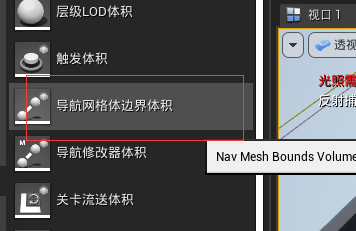

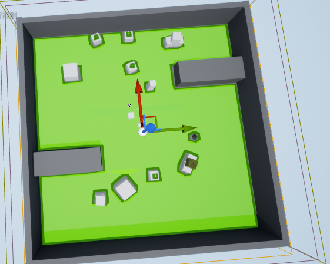

导航网不会阻止玩家角色(或其他实体)踩在某个几何体上，但是它可以引导AI控制的实体去他们能去和不能去的地方。

==Blackboard== 是一个容器，用于存放**行为树**中经常使用的变量。 这些数据用于决策目的，无论是一个AI还是一组其他AI。 我们将在这里创建一个 Blackboard，我们将在未来的例子中使用它。

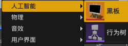

添加一个键。并且保存：

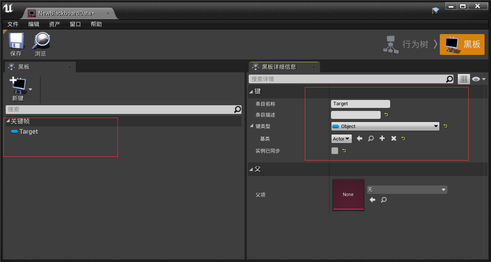

在这个例子中，我们创建了一个黑板，稍后我们将在代码中使用它来设置和获取游戏中的值，我们将在**行为树**中使用它。

 如果==黑板==是AI的==共享内存==，那么==行为树==就是人工智能的==处理器==，它将包含人工智能的逻辑。 它做出决定，然后根据这些决定行动，使人工智能能够在游戏运行时做一些实际的事情。 在这个例子中，我们将创建一个行为树，然后分配它的黑板。

创建行为树：

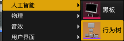

打开后，在 `Details `选项卡下，打开 ==AI | Behavior Tree== 部分，验证 Blackboard Asset 属性设置为 `EnemyBlackboard`。 应该注意到 Keys 下面列出的 Target 属性。 如果没有，关闭编辑器再次打开：

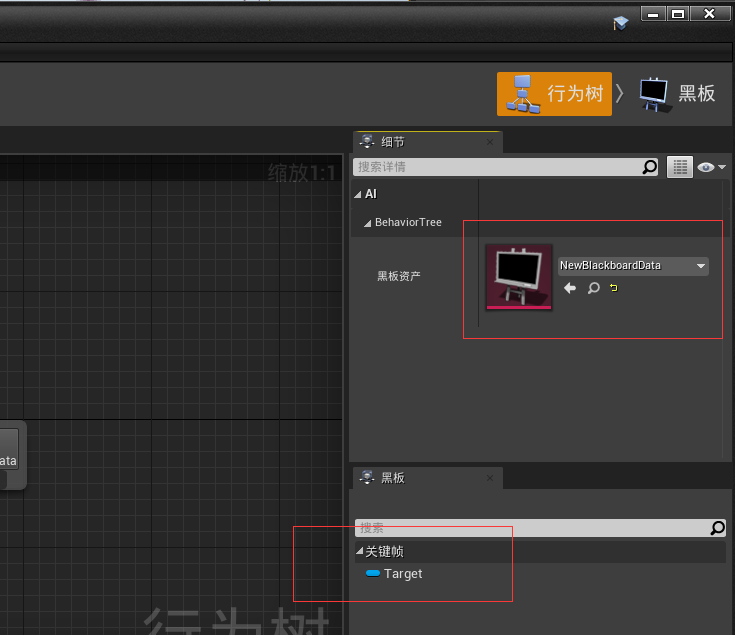

在这个例子中，我们创建了一个行为树，这是 AI 系统所需要的，以便它能够完成任务和其他各种功能。 在未来的例子中，我们将使用它来创建我们自己的自定义角色类。


## 连接行为树到角色

==行为树==选择由**AI控制的单元**，在任何给定时刻展示的行为。 行为树的构造相对简单，但是要让其中一个运行起来还有很多工作要做。 我们还必须熟悉可用于构建行为树的组件，以便有效地完成这项工作。

**行为树**对于定义 NPC 行为是非常有用的，这种行为比简单地向目标移动更加多样化。

我们需要在==.build.cs==添加以下模块的引用：

        PublicDependencyModuleNames.AddRange(new string[] { "AIModule", "GameplayTasks" });

然后创建新的C++类：
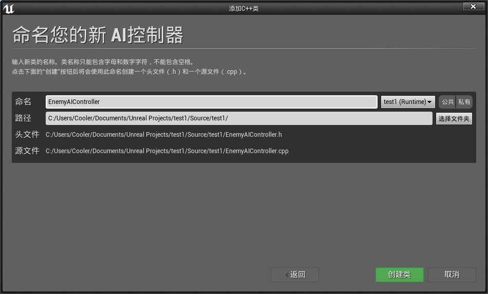

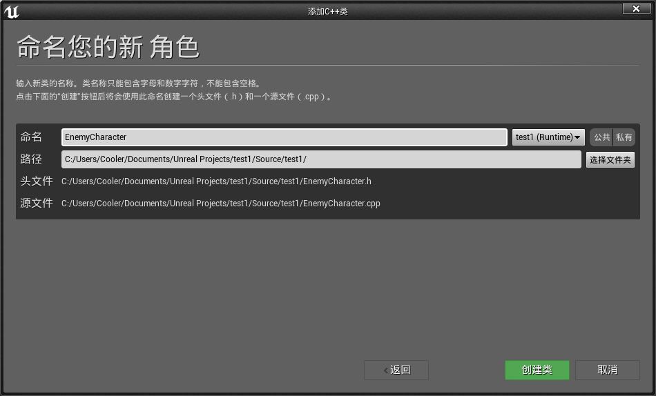

添加代码：

==EnemyAIController.h==

```c++
// Fill out your copyright notice in the Description page of Project Settings.

#pragma once

#include "CoreMinimal.h"
#include "BehaviorTree/BehaviorTreeComponent.h"
#include "BehaviorTree/BlackboardComponent.h"
#include "AIController.h"
#include "EnemyAIController.generated.h"

/**
 * 
 */
UCLASS()
class TEST1_API AEnemyAIController : public AAIController
{
	GENERATED_BODY()

private:
	UBehaviorTreeComponent* BehaviorComp;
	UBlackboardComponent* BlackboardComp;

public:
	AEnemyAIController();

	virtual void OnPossess(APawn* InPawn)override;

	FBlackboard::FKey TargetKeyID;
	
};
```

==EnemyAIController.cpp==

```c++
// Fill out your copyright notice in the Description page of Project Settings.


#include "EnemyAIController.h"
#include "EnemyCharacter.h"
#include "BehaviorTree/BehaviorTree.h"

AEnemyAIController::AEnemyAIController()
{
	BehaviorComp = CreateDefaultSubobject<UBehaviorTreeComponent>(TEXT("BehaviorComp"));
	BlackboardComp = CreateDefaultSubobject<UBlackboardComponent>(TEXT("BlackboardComp"));
}

void AEnemyAIController::OnPossess(APawn* InPawn)
{
	Super::Possess(InPawn);

	auto Character = Cast<AEnemyCharacter>(InPawn);

	if (Character && Character->EnemyBehaviorTree)
	{
		BlackboardComp->InitializeBlackboard(*Character->EnemyBehaviorTree->BlackboardAsset);
		TargetKeyID = BlackboardComp->GetKeyID("Target");
		BehaviorComp->StartTree(*Character->EnemyBehaviorTree);
	}
}
```

==EnemyCharacter.h==

```c++
UPROPERTY(EditAnywhere, Category = Behavior)
		class UBehaviorTree* EnemyBehaviorTree;
```

然后，我们为刚才创建的两个类创建一个 Blueprint 版本，并分配变量：

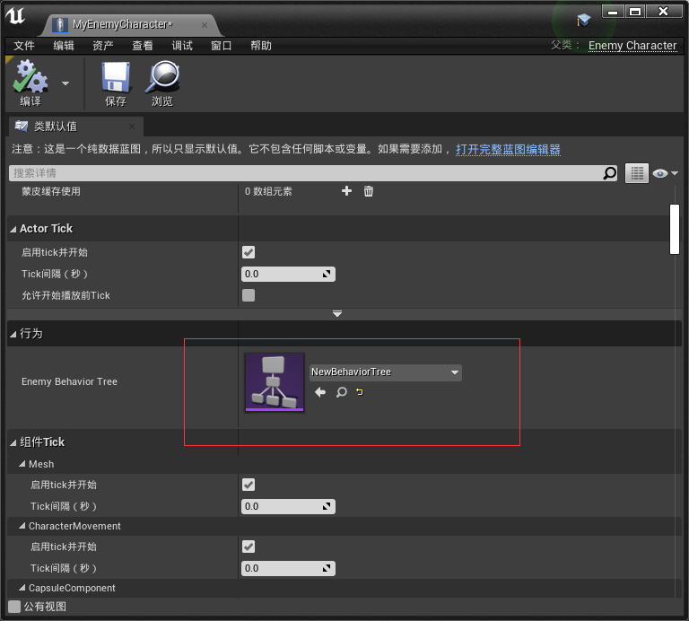

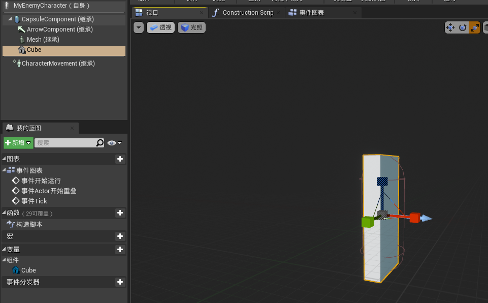

有了这个，我们就建立了AI角色、AI控制器和行为树之间的连接。

总结：

我们创建的==AI控制器类==将同时添加行为树和黑板。

行为树连接到AI控制器，而AI控制器又连接到角色。 我们将通过行为树，在图中输入任务和服务节点来控制字符的行为。==一个行为树包含六种不同类型的节点==，如下所示:

- Task：==任务节点==是行为树中包含要运行的 Blueprint 代码的紫色节点。 这是AI控制的单元必须要做的事情（代码方面）。 任务必须返回 true 或 false，这取决于任务是否成功（通过在结束处提供 ==FinishExecution ()节点==）。
- Decorator：只是节点执行的布尔条件。 它检查一个条件，并且通常在选择器或序列块中使用。
- Service:：这将在计时时，运行一些 Blueprint 代码。 这些节点的刻度间隔可以调整(例如，它可以比每帧的刻度慢，每10秒)。 你可以使用这些查询场景更新，一个新的对手追逐，等等。 Blackboard 可用于存储查询的信息。 服务节点在结束时没有 FinishExecute ()调用。
- Selector：它从左到右运行所有子树，直到遇到成功。 当它遇到一个成功，执行回到树。
- Sequence:：从左到右运行所有子树，直到遇到故障。 遇到失败时，执行将返回到树中。
- Simple Parallel： 它与子树(灰色)并行地运行单个任务(紫色)。
    

## 创建BTServer

服务附加到行为树中的节点，并将按照它们定义的频率执行; 也就是说，只要它们的分支正在执行。 与其他行为树系统中的并行节点类似，这些节点通常用于进行检查和更新黑板，我们将在本例中使用它来找到我们的角色并将其分配给黑板。

创建新的C++类：

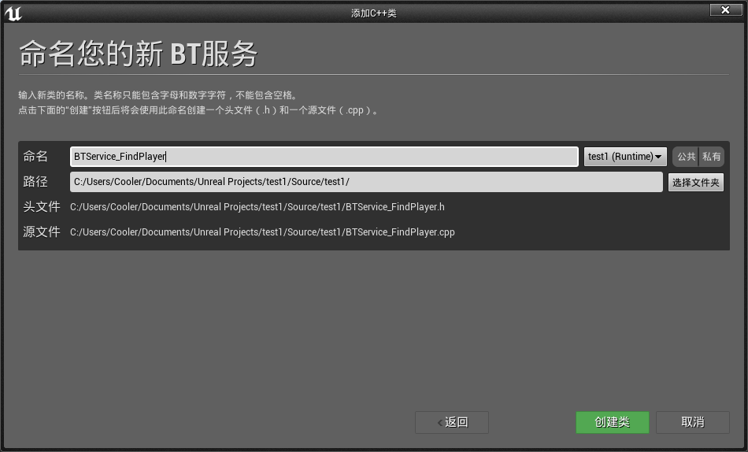

添加代码：

==BTService_FindPlayer.h==

```c++
// Fill out your copyright notice in the Description page of Project Settings.

#pragma once

#include "CoreMinimal.h"
#include "BehaviorTree/BTService.h"
#include "BehaviorTree/BehaviorTreeComponent.h"
#include "BTService_FindPlayer.generated.h"

/**
 * 
 */
UCLASS()
class TEST1_API UBTService_FindPlayer : public UBTService
{
	GENERATED_BODY()

public:
	UBTService_FindPlayer();

	virtual void TickNode(UBehaviorTreeComponent& OwnerComp, uint8* NodeMemory, float DeltaSeconds) override;
	
};
```

==BTService_FindPlayer.cpp==

```c++
// Fill out your copyright notice in the Description page of Project Settings.


#include "BTService_FindPlayer.h"
#include "EnemyAIController.h"
#include "BehaviorTree/Blackboard/BlackboardKeyType_Object.h"

UBTService_FindPlayer::UBTService_FindPlayer()
{
	bCreateNodeInstance = true;
}

void UBTService_FindPlayer::TickNode(UBehaviorTreeComponent& OwnerComp, uint8* NodeMemory, float DeltaSeconds)
{
	Super::TickNode(OwnerComp, NodeMemory, DeltaSeconds);

	auto EnemyAIController = Cast<AEnemyAIController>(OwnerComp.GetAIOwner());
	if (EnemyAIController)
	{
		OwnerComp.GetBlackboardComponent()->SetValue<UBlackboardKeyType_Object>(EnemyAIController->TargetKeyID, EnemyAIController);
		UE_LOG(LogTemp, Warning, TEXT("Target has been set!"));
	}
}
```

编译完成后我们在行为树上添加：

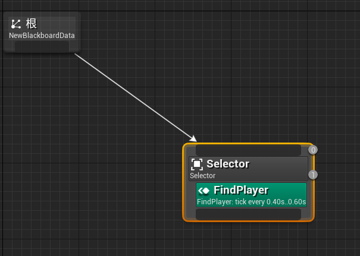

我们的行为树将继续调用 Selector，因为没有其他节点可供它跳转。其中BlackBoard与C++中一个映射：

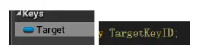

比如黑板中变量名为Value 那么C++中的变量就是ValueKeyID。


## 创建BTTask

除了服务，我们还有 Task，它是行为树的叶节点。 这些都是实际执行行为的东西。 在我们的例子中，我们将让我们的 AI 跟随我们的玩家角色。

创建新C++类：
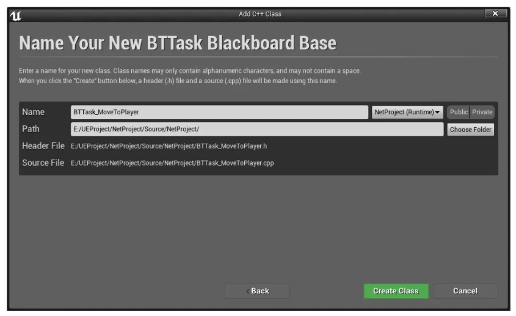

添加代码：

==BTTask_MoveToPlayer.h==

```c++
// Fill out your copyright notice in the Description page of Project Settings.

#pragma once

#include "CoreMinimal.h"
#include "BehaviorTree/Tasks/BTTask_BlackboardBase.h"
#include "BTTask_MoveToPlayer.generated.h"

/**
 * 
 */
UCLASS()
class NETPROJECT_API UBTTask_MoveToPlayer : public UBTTask_BlackboardBase
{
    GENERATED_BODY()
    
    
public:
    /** starts this task, should return Succeeded, Failed or InProgress * (use FinishLatentTask() when returning InProgress) * this function should be considered as const (don't modify state of object) if node is not instanced! */
    virtual EBTNodeResult::Type ExecuteTask(UBehaviorTreeComponent& OwnerComp, uint8* NodeMemory) override;
    
};
```

==BTTask_MoveToPlayer.cpp==

```c++
// Fill out your copyright notice in the Description page of Project Settings.

#include "BTTask_MoveToPlayer.h"
#include "EnemyAIController.h"
#include "GameFramework/Character.h"
#include "BehaviorTree/Blackboard/BlackboardKeyType_Object.h"


EBTNodeResult::Type UBTTask_MoveToPlayer::ExecuteTask(UBehaviorTreeComponent& OwnerComp, uint8* NodeMemory)
{
    auto EnemyController = Cast<AEnemyAIController>(OwnerComp.GetAIOwner()); auto Blackboard = OwnerComp.GetBlackboardComponent();

    ACharacter * Target = Cast<ACharacter>(Blackboard->GetValue<UBlackboardKeyType_Object>(EnemyController->TargetKeyID));

    if (Target) { EnemyController->MoveToActor(Target, 50.0f); return EBTNodeResult::Succeeded; }

    return EBTNodeResult::Failed;
}
```

编译完成后我们在行为树中添加：

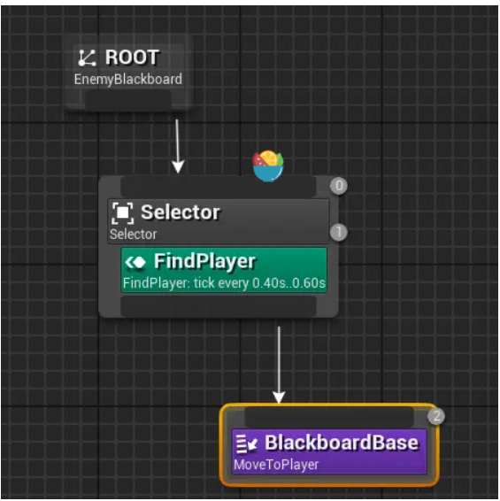

运行程序后，我们会看到AI角色会跟随玩家的角色。

这个例子采用了我们已经介绍过的所有例子，并将它们全部编译在一起。 只要 BehaviorTree 在这个状态内，ExecuteTask 方法就会被调用。 这个函数要求我们返回一个 EBTNodeResult，它应该返回 Succeed、 Failed 或 InProgress，以让 BehaviorTree 知道我们是否可以更改状态。

在我们的例子中，我们首先获得 EnemyController 和 Target 对象，这样我们就可以确定我们想要移动的对象和我们想要移动的对象。 只要这些属性有效，我们就可以调用 MoveToActor 函数。
