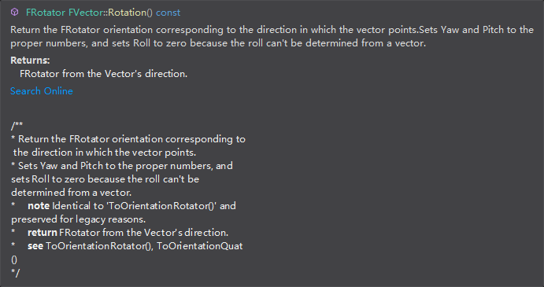
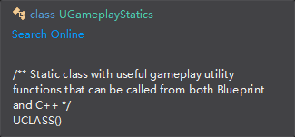
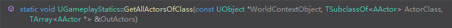

# 物体

## Actor

| 函数名                                         | 大概作用                            |
| ---------------------------------------------- | ----------------------------------- |
| GetActorLocation()                             | 获得自身的世界位置                  |
| SetActorLocation(NewPos)                       | 设置自身的世界位置                  |
| GetComponentTransform()                        | 获取自身的Transform                 |
| SetActorTickEnabled(false);                    | 设置Actor能否响应Tick               |
| SetActorHiddenInGame(true);                    | 设置Actor是否可见                   |
| SetActorEnableCollision(true);                 | 设置Actor是否开启触发               |
| GetActorBounds(false, ItemOrigin, ItemBounds); | 返回组成Actor的所有组件组成的AABB盒 |
| GetTransform()                                 | 得到世界坐标下Transform的位置       |
| GetActorForwardVector()                        | 获得前向向量                        |
| GetActorRightVector()                          | 获得右向向量                        |
| GetActorRotation()                             | 获得旋转角度                        |
| SetActorRotation(NewRotation);                 | 设置旋转角度                        |

| 成员名        | 大概含义      |
| ------------- | ------------- |
| RootComponent | Actor的根组件 |
|               |               |
|               |               |


## Pawn

| 函数名                         | 大概作用               |
| ------------------------------ | ---------------------- |
| AddMovementInput(InputVector); | 让Pawn向前移动指定距离 |
| GetController()                | 获取控制器             |
|                                |                        |


## PlayController

| 函数名                                             | 大概作用 |
| -------------------------------------------------- | -------- |
| AddYawInput(CameraInput.X);                        |          |
| AddPitchInput(CameraInput.Y);                      |          |
| AddMovementInput(GetActorForwardVector(), amount); |          |


# 组件

## 静态网格

==UStaticMeshComponent* Mesh;==

| 函数名                                                       | 大概作用                                                     |
| ------------------------------------------------------------ | ------------------------------------------------------------ |
| SetStaticMesh(MeshAsset.Object);                             | 指定静态网格                                                 |
| AttachToComponent(Root, FAttachmentTransformRules::SnapToTargetIncludingScale); | 作为子组件附加到`root`上，后面一个参数感觉大多数情况不用改变 |
| SetCollisionProfileName(UCollisionProfile::Pawn_ProfileName); | 暂定                                                         |
| SetMobility(EComponentMobility::Movable);                    | 设置网格组件的移动性                                         |

## 场景组件

==USceneComponent* Root;==

| 函数名                                                       | 大概作用                                                     |
| ------------------------------------------------------------ | ------------------------------------------------------------ |
| AttachToComponent(Root, FAttachmentTransformRules::SnapToTargetIncludingScale); | 作为子组件附加到`root`上，后面一个参数感觉大多数情况不用改变 |
| SetRelativeTransform(FTransform(FRotator(0, 0, 0), FVector(250, 0, 0), FVector(0.1f))); | 设置场景组件的相对变换（相对于父物体）                       |
| SetRelativeLocation(FVector(OrbitDistance * FMath::Cos(CurrentValueInRadians), OrbitDistance * FMath::Sin(CurrentValueInRadians), GetRelativeLocation().Z)); | 设置场景组件的相对位移（相对于父物体）                       |
| GetForwardVector()                                           | 得到向前向量                                                 |

## 输入组件

==UInputComponent* PlayerInputComponent；==

| 函数名                                                       | 大概作用               |
| ------------------------------------------------------------ | ---------------------- |
| BindAction("DropItem", EInputEvent::IE_Pressed, this, &AInventoryCharacter::DropItem); | 绑定函数和`Action`输入 |
| BindAxis("MoveForward", this, &AInventoryCharacter::MoveForward); | 绑定函数和`Axis`输入   |
|                                                              |                        |

## 粒子组件

==UParticleSystemComponent* SpawnPoint;==

| 函数名                              | 大概作用                           |
| ----------------------------------- | ---------------------------------- |
| SetTemplate(ParticleSystem.Object); | 设置粒子系统组件使用的**粒子系统** |
|                                     |                                    |
|                                     |                                    |

## Box组件

==UBoxComponent* TriggerZone;==

简单的盒型触发器。

| 函数名                                | 大概作用     |
| ------------------------------------- | ------------ |
| SetBoxExtent(FVector(200, 200, 100)); | 设置范围大小 |
|                                       |              |
|                                       |              |

## 点光源组件

==UPointLightComponent* PointLight;==

| 函数名                             | 大概作用   |
| ---------------------------------- | ---------- |
| SetVisibility(false);              | 设置可见性 |
| SetLightColor(FLinearColor::Blue); | 设置颜色   |
|                                    |            |

## 旋转-位移组件

==URotatingMovementComponent* RotatingComponent;==

控制父物体移动，旋转

```c++
#include "GameFramework/RotatingMovementComponent.h"
```

| 成员名       | 大概作用   |
| ------------ | ---------- |
| RotationRate | 旋转的速度 |
|              |            |
|              |            |


# 宏

## UCLASS

==UCLASS( ClassGroup=(Custom), meta=(BlueprintSpawnableComponent) )==

 `blueprintspawnablcomponent` 添加到==类的元值==中，意味着**组件的实例**可以添加到编辑器中的 ==Blueprint 类==中；==类组说明符==`ClassGroup`允许我们指出我们的组件属于类列表中的哪个类别:


# 类型

### TSubclassOf 类型

```c++
UPROPERTY(EditAnywhere)
    	TSubclassOf<AActor> ActorToSpawn;c
```

这是一种模板类型，允许我们将指针限制为**基类**或其**子类**。 这也意味着在编辑器中，我们将得到一个**预过滤的类列表**，以便从中选择，防止我们意外地分配一个无效的值。

### FVector类型

| 函数名           | 大概作用                                                     |
| ---------------- | ------------------------------------------------------------ |
| GetSafeNormal(); | 获得向量的归一化版本                                         |
| Rotation();      |  |
|                  |                                                              |

### FTimerManager

| 函数名                                                       | 大概作用                                       |
| ------------------------------------------------------------ | ---------------------------------------------- |
| SetTimer(SpawnTimerHandle, this, &ANewCreateActor::SpawnUnit, SpawnInterval, true); | 设置一个计时器，每隔指定时间间隔，调用指定函数 |
|                                                              |                                                |
|                                                              |                                                |

### UGameplayStatics



| 函数名                                                       | 大概作用                     |
| ------------------------------------------------------------ | ---------------------------- |
| GetGameMode(TheWorld);                                       | 返回当前的基础游戏模式       |
|  | 获取场景下指定类型的所有实例 |
|                                                              |                              |

### FSimpleDelegate（委托）

| 函数名                                              | 大概作用                         |
| --------------------------------------------------- | -------------------------------- |
| ExecuteIfBound();                                   | 仅使用于**没有返回值**的委托函数 |
| BindUObject(this, &ADelegateListener::EnableLight); | 绑定指定函数到这个委托           |
| Unbind();                                           | 解绑                             |

### TBaseMulticastDelegate（组播委托）

| 函数名                                                      | 大概作用                 |
| ----------------------------------------------------------- | ------------------------ |
| Broadcast();                                                | 广播，通知各个委托接收者 |
| Remove(MyDelegateHandle);                                   | 移除对应的成员           |
| AddUObject(this, &AMulticastDelegateListener::Togglelight); | 添加对应的成员           |


# 工具函数

| 函数名                                                       | 大概作用                                                     |
| ------------------------------------------------------------ | ------------------------------------------------------------ |
| GEngine->AddOnScreenDebugMessage(-1, 10, FColor::Red, TEXT("Actor")); | 在场景屏幕上的指定位置和指定颜色，打印指定字符。             |
| GetWorld()->SpawnActor<AMyCharacter>(AMyCharacter::StaticClass(), SpawnLocation); | 在场景的指定位置上，安置一个指定类型的Actor                  |
| GetWorldTimerManager().SetTimer(Timer, this, &Atest1GameMode::DestroyActorFunction, 10); | 在指定时间（10秒）后，调用相应函数                           |
| SetLifeSpan(5);                                              | 设置对象的生命周期（5秒）                                    |
| CreateDefaultSubobject<UStaticMeshComponent>("BaseMeshComponent"); | 初始化一个指向指定类型的指针，这里是静态网格                 |
| ConstructorHelpers::FObjectFinder<UStaticMesh>                 (TEXT("StaticMesh'/Engine/BasicShapes/Cube.Cube'")); | 帮助我们加载资源；传入一个字符串，该字符串包含我们试图加载的资源的路径 |
| GetOwner();                                                  | 获取自己父物体的指针                                         |
| GetWorld();                                                  | 获取当前世界的指针                                           |
| Cast<APlayerController>(GetController())                     | 动态投影`Cast`一个类型安全的物体                             |

