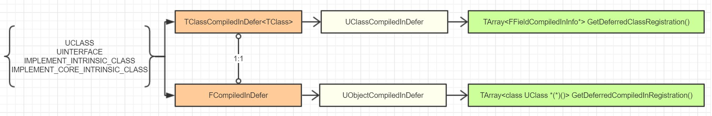

# UObject（一）开篇

> UE生UObject，UObject生万物


在上个`GamePlay`专题，谈到UE创建**游戏世界**的时候([GamePlay架构（一）Actor和Component](https://zhuanlan.zhihu.com/p/22833151))，简单的介绍了一下`UObject`的功能：


> 藉着UObject提供的元数据、反射生成、GC垃圾回收、序列化、编辑器可见、Class Default Object等，UE可以构建一个Object运行的世界。（后续会有一个大长篇深挖UObject）

那么从本专题开始，我们将开始慢慢的填这个大坑。正所谓，千里之堤溃于蚁穴，万丈高塔始于垒土。在阅读分析游戏引擎源码的时候，又或者是想要扩展引擎功能，如果对于引擎底层对象创建的机制不太清楚，则常常会有点力不从心，因为**功能模块**的运行机制、数据流程、资源的加载释放时机，往往也都是依赖于**对象的生命周期**。而如果想要实现一个自己的游戏引擎，从一开始，也都得设计一个完善的对象管理机制，然后慢慢的在其上叠加功能，这个对象模型设计实现的如何，往往决定了一款引擎的基因。


## 愿景目标

本专题的内容主要是用于提升UE开发者，或者游戏引擎研究爱好者的内功，所以并不适合所有读者。在此需要明示本专题后续篇章（大概10~20篇）的目标愿景，以后不再赘述。

1. 专注于UE的UObject及其周边的系统，在介绍构建对象系统的时候，虽然会涉及到引擎的启动流程，但是并不详细介绍（留待后续专题探讨）。本专题的重点是介绍UE4中的UObject系统，理论上，读完该篇章，你应该可以心里比较有数的在别的引擎里也实现出一套类似的系统。
2. 本专题的内容对于你使用蓝图实现游戏逻辑几乎“无用”，对正常的表层C++开发也基本上提升不大。本专题只是让你安心一些而已。
3. 我，先声明，本专题为了详细的讨论机制，在91.233%的情况下我会显得比较罗嗦，会引用罗列大量的引擎源码。如同开篇所说，毕竟是在探讨最最底层的的源码，再粗旷的泛泛而谈也没啥意思。


## 前置知识

本专题的学习探讨门槛比较高，在开始本专题之前，需要你先掌握以下知识：

1. 优秀的C++语言能力。虽然不需要你“精通”C++，但是需要你熟练掌握C++11、模板、宏、对象内存模型和基本的各种规则机制。
2. 本专题也涉及到对象反射，所以也需要你对编译原理、元数据、程序结构有一定的了解。如果对其他编程语言（java,c#）的反射熟悉的话，对理解本专题也是一大助力。
3. 对多线程编程比较熟悉，知道并掌握各种线程同步机制。UE用多线程并行优化了很多任务，其中就包括GC，所以不可避免的需要你掌握相关的知识。
4. 对C++内存分配管理也比较熟悉，知道一些STL基本的内存分配器，也知道各种内存分配管理的意义和技术，如引用技术，GC等。

为了更好的理解本专题内容，有必要的时候，我也会在每一个篇章开头简单介绍一下C++的一些知识要点。不过还是需要你自己去搜索查阅学习其他更系统的C++资料。

## 对象模型

先问一个问题，为什么需要有一个统一的基类：Object？甚至，我们在编程语言中也常常见到这种模式，比如Java中的object、C#的object，甚至一些纯对象的脚本语言（Ruby里连数字123都是对象）。刚接触UE的人，看到UE里的Object，可能觉得这没什么，好像就自然而然应该有应该是这样，但是做过游戏引擎的人就知道，这里面蕴含了很多设计思想和权衡。

大部分的游戏引擎底层都是C++，而C++作为一个下接操作系统硬件底层，上接用户逻辑的编程语言，为了适应各种环境，不为你不需要的东西付代价，C++是并没有提供原生GC的。STL库的那些智能指针更多只是在C++的语言层面上再提供一些小辅助。在最开始设计游戏引擎的时候，你不光要考虑该引擎所面对的用户群体和针对的游戏重点，更要开始考虑你所能利用到的都有什么内存管理方式。简单说一下其他游戏引擎在这方便的情况：

- **Cocos**系列，最早是cocos-iphone扎根于objective-c，所以用的**引用技术**，后来有cocos2dx了，为了照顾老用户的使用习惯，几乎是机械翻译了objective-c的内存管理机制，搞出了一个CCObject，里面只有Retain/Release，因为还是太过粗糙，也常常还是出现各种内存泄漏问题，用的时候也是得处处小心，漏掉一个就敢泄漏给你看，而且追查起来非常困难。没看人家objective-c自己后来都搞了一个ARC来减轻大家的工作了嘛。
- **Unity**底层源码我没看过不得而知，不过上层脚本C#是基于Mono的已经实现完善的语言原生管理机制，对游戏对象的内存管理倒也确实是省心了非常多，缺点也是如果想要更精细的控制的时候就有点力不从心。
- **其他引擎**，用的还是C++提供了的那些，顶多自己再定制一些管理辅助类。比如KlayGE就是利用了boost的智能指针，CryEngine用的也是智能指针，我的Medusa引擎也是比较简单的采用的C++智能指针的方案。对象的分配释放也往往需要用户手动管理控制。
- **在这就不得不提到Qt里的QObject**，Qt虽然是处于跟UE不同的GUI框架领域，但是设计的思想却有些殊途同归，Qt里根据QObject基类构建出来的ObjectModel为UI的复杂构建和通信提供了许多了非常便利急需的功能。比如**信号**和**槽**的设计就常常让人们津津乐道，而且在编辑中也可以非常方便的查看对象的属性。Qt的流行，QObject应该功不可没。
- **UE**的Object系统无疑是最强大的。实际上UE能实践出这么一套UObject是非常非常了不起的，更何况还有GC和**HotReload**的黑科技。在大型游戏引擎的领域尝试引入一整套UObject系统，对于整个业界也都是有非常大的启发。

**那么引入一个Object的根基类设计到底有什么深远的影响，我们又付出了什么代价？** **得到：**

1. **万物可追踪。**有了一个统一基类Object，我们就可以根据一个object类型指针追踪到所有的派生对象。如果愿意，我们都可以把当前的所有对象都遍历出来。按照纯面向对象的思想，万物皆是对象，所以有一个基类Object会大大方便管理。如果再加上一些机制，我们甚至可以把系统中的所有对象的引用图给展示出来。
2. **通用的属性和接口。**得益于继承机制，我们可以在object里加上我们想应用于所有对象的属性和接口，包括但不限于：Equals、Clone、GetHashCode、ToString、GetName、GetMetaData等等。代码只要写一遍，所有的对象就都可以应用上了。
3. **统一的内存分配释放。**实际上Cocos2dx里的CCObject的目的就是如此，可惜就是实现得不够好而已。用引用计数方案的话，你可以在Object上添加Retain+1/Release-1的接口；用GC的方案，你也有了一个统一Object可以引用，所以这也是为何几乎所有支持GC的语言都会设计出来一个Object基类的原因了。
4. **统一的序列化模型。**如果想要让系统里的各种类型对象支持序列化，那么你要嘛针对各种类型分别写一套（如protobuf就是用程序生成了序列化代码），要嘛就得利用模板和宏各种标记识别（我自己Medusa引擎里实现的序列化模块Siren就是如此实现的），而如果有了一个Object基类，最差的我们就可以利用上继承机制把统一的序列化代码放到Object里面去。而如果再加上设计良好的反射机制，实现序列化就更加的方便了。
5. **统计功能。**比如说我们想统计看看整个程序跑下来，哪种对象分配了最多次，哪种对象分配的时间最长，哪种对象存活的时间最长。等等其他很便利的功能，在有了可追踪和统一接口的基础上，我们也能方便的实现出来。
6. **调试的便利。**比如对于一块泄漏了的内存数据，如果是多类型对象，你可能压根没法知道它是哪个对象。但是如果你知道它是Object基类下的一个子类对象，你可以把地址转换为一个Object指针，然后就可以一目了然的查看对象属性了。
7. **为反射提供便利。**如果没有一个统一Object，你就很难为各种对象实现GetType接口，否则你就得在每个子类里都定义实现一遍，用宏也只是稍微缓解治标不治本。
8. **UI编辑的便利。**和编辑器集成的时候，为了让UI的属性面板控件能编辑各种对象。不光需要反射功能的支持，还需要引用一个统一Object指针。否则想象一下如果用一个void* Object，你还得额外添加一个ObjectType枚举用来转换成正确类型的C++对象，而且只能支持特定类型的C++类型对象。

**代价：**

1. **臃肿的Object。**这算是继承的祖传老毛病了，我们越想为所有对象提供额外功能，我们就越会在Object里堆积大量的函数接口和成员属性。久而久之，这个Object身上就挂满了各种代码，可理解性就大大降低。Java和C#里的Object比较简单，看起来只有个位数的接口，那是因为有C++在JVM和CLR的背后默默的干着那些脏活累活，没显示出来给你看而已。而UE在原生的的C++基础上开始搭建这么一套系统，就是如今这么一个重量级的UObject了，大几十个接口，很少有人能全部掌握。
2. **不必要的内存负担。**有时候有些属性并不是所有对象都用的到，但是因为不确定，为了所有对象在需要的时候就可以有，你还是不得不放在Object里面。比如说一个最简单的void* UserData，看起来为所有对象附加一个void*数据也挺合理的，用的时候设置取出就好了。但是其实有些类型对象可能一辈子都用不到，用不到的属性，却还占用着内存，就是浪费。所以在一个统一的Object里加数据，就得非常的克制，不然所有的对象都不得不得多一份占用。
3. **多重继承的限制。**比如C多重继承于A和B，以前A和B都不是Object的时候还好，虽然大家对C++里的多重继承不太推荐使用，但是基本上也是不会有大的使用问题的。然后现在A和B都继承于Object了，现在让C想多重继承于A和B，就得面临一个尴尬的局面，变成菱形继承了！而甭管用不用得上全部用虚继承显然也是不靠谱的。所以一般有object基类的编程语言，都是直接限制多重继承，改为多重实现接口，避免了数据被继承多份的问题。
4. **类型系统的割裂。**除非是像java和C#那样，对用户隐藏整个背后系统，否则用户在面对原生C++类型和Object类型时，就不得不去思考划分对象类型。两套系统在交叉引用、互相加载释放、消息通信、内存分配时采用的机制和规则也是大不一样的。哪些对象应该继承于Object，哪些不用；哪些可以GC，哪些只能用智能指针管理；C++对象里new了Object对象该怎么管理，Object对象里new了C++对象什么时候释放？这些都是强加给用户思考的问题。

著名的沃斯基·索德曾经说过，设计就是权衡的艺术。那些得到的UE已经想要攥在手里了，而那些代价我们也得想办法去尽量降低和规避：

1. **针对太过复杂的Object基类**，虽然我常常夸UE的设计优雅卓越，但是我这里要黑一下UE，感觉UE的Object基类已经有点破罐子破摔了，能非常明显的感觉到了进化留下的痕迹，一个UObject你给我分了三层继承：（UObjectBase->UObjectBaseUtility->UObject），关键是头两层你还都没有子类。而Object相关的Flags常常竟然把32位都给占完了也是牛。念在UE提供了那么多的UObject功能模块实现，类声明里大几十个方法我们也只好忍了吧。这一块太过底层，估计也不敢大刀阔斧的整改，只能期待UE5再说了。
2. **sizeof(UObject)==56**。56个字节相对来说应该还是可以接受，关掉Stat的话还能再少一个指针大小。当然这里并没有考虑到外围Class系统的内存占用，但是光光一个对象基础的数据占用56字节起步的话，我觉得已经非常优秀了。10000个对象是546K，1百万个对象是53M。一方面游戏里的对象其实数量没有那么多，对于百万粒子那种也可以用原生的C++对象优化，另一方面现在各个平台内存也越来越宽裕了，所以这个问题已经解决得在可接受范围内了。
3. **规避多重继承**，UE在BP里提供的也是多重继承Interface的方案。在C++层面上，我们只能尽量规避不要多重继承多个UObject子类，实在想要实现功能复用，也可以采用组合的组件模式，或者把共同逻辑写在C++的类型上，比如UE中众多的F开头的类就是如此的功能类。总之这个问题，好在我们可以用方式规避掉。
4. **只能多学习了。**没办法，现实就是不完美的。越是设计精巧的系统就越是难以理解。不过一方面UE提倡在BP里实现游戏逻辑，C++充当BP的VM，就可以完全对用户隐藏掉复杂性。另一方面，UE在UObject上也提供了大量的辅助设计，如UCLASS等各种宏的便利，NewObject方便接口，UHT的自动分析生成代码，尽量避免用户直接涉及到UObject的内部细节。所以单从一个使用者的角度来说，如今的状态已经挺友好的了，Object工作的挺好，几乎不需要去操心或者帮它补漏。至于想理解的更深层次的话，就只能靠开发者们更用心的学习了。

权衡的结果大家也都知道了，UE下定雄心选择了开始搭建Object，提供了那么多我们日常使用的功能。我的Medusa引擎也是非常艳羡UE那么多便利的功能，但是让我从头开始去再去搭建一套，限于精力有限，我是不敢去做的。光一个GC就得有大量的算法权衡，多线程处理的各种细节和各种优化，更何况再融合了反射、序列化、CDO、统计，想实现得既优雅又性能优越就真的是一件非常不容易的事，代码写完之后还得需要大量的测试和修复才能慢慢稳定下来能用。信任感的建立是很难的，一旦出现对象被释放掉了或者没有释放，你第一时间怀疑的应该是你的使用有问题，而如果UE给你的印象是怀疑UE的Object实现内部有bug，那你就会逐渐的倾向于弃用UE的那一套，开始撸起袖子自己管理C++对象了。


## 总结

本文作为专题的开篇，唠了些书写背景的闲话，也闲聊了一下其他游戏引擎是怎么看待游戏内对象管理这回事的。每款游戏引擎都有自己的产生背景和侧重点，再加上设计的理念也不一样，所以就会产生各种各样的架构。接着探讨了设计一个Object系统有哪些好处和缺点，我不知道UE最初的UObject设计是从何而来的，但是如果没有UObject，没有了富饶的土壤，想要有繁茂的森林就比较困难了。各引擎的开发团队竞赛的时候，大家其实水平都差不了多少，同样想支持一个最新功能的时候，我利用上了统一的Object机制开发用了一周上线；你因为少了一些代码上的便利，还得自己手动管理内存，写序列化，再撸编辑器支持，代码写了两周，修复Bug用了2周，交付用户使用的时候，代码的接口因为不能反射也不是那么易用，慢慢的竞争优势就弱了。没那么方便调试统计，开发者修复bug起来就费劲，埋的Bug多了，用户觉得你越来越不稳定，引擎的生命力就是这么一步步一点点枯萎掉的。所以不要觉得引擎只要堆积功能就行了，一开始有个好的结构是重中之重。

闲话说完才可以开始之后的一个个功能的详细叙述。那么亲爱的读者们，请跟着我的脚步，重走UE曾经走过的路，让我们试着从头开始搭建一个Object系统，一步步的让她羽翼丰满多才多艺。


# UObject（二）类型系统概述

## 引言

上一篇我们谈到了在游戏引擎，或者在程序和高级编程语言中，设计一个**统一对象模型**得到的好处，和要付出的代价，以及在UE里是怎么对之尽量降低规避的。那么从本篇开始，我们就开始谈谈如何开始构建这么一个对象模型，并在此之上逐渐扩展以适应引擎的各种功能需求的。

众所周知，一般游戏引擎最底层面对的都是操作系统API，硬件SDK，所能借助到的工具也往往只有C++本身。所以考虑从原生的C++基础上，搭建对象系统，往往得从头开始造轮子，最底层也是最核心的机制当然必须得掌控在自己的手中，以后升级改善增加功能也才能不受限制。

那么，从头开始的话，Object系统有那么多功能：GC，反射，序列化，编辑器支持……应该从哪一个开始？哪一个是必需的？GC不是，因为大不了我可以直接`new/delete`或者**智能指针引用技术**，毕竟别的很多引擎也都是这么干的。**序列化**也不是，大不了每个子类里手写数据排布，麻烦是麻烦，但是功能上也是可以实现的。编辑器支持，默认类对象，统计等都是之后额外附加的功能了。那你说==反射==为何是必需的？大多数游戏引擎用的C++没有反射，不也都用得好好的？确实也如此，不利用反射的那些功能，不动态根据类型创建对象，不遍历属性成员，不根据名字调用函数，大不了手写绕一下，没有过不去的坎。但是既然上文已经论述了一个统一Object模型的好处，那么**如果在Object身上不加上反射，无疑就像是砍掉了Object的一双翅膀**，让它只能在地上行走，而不能在更宽阔空间内发挥威力。还有另一个方面的考虑是，反射作为底层的系统，如果实现完善了，也可以大大裨益其他系统的实现，比如有了反射，实现序列化起来就很方便了；有没有反射，也关系到GC实现时的方案选择，完全是两种套路。简单举个例，反射里对每个object有个class对象保存信息，所以理论上class身上就可以保存所有该类型的object指针引用，这个信息GC就可以利用起来实现一些功能；而没有这个class对象的话，GC的实现就得走别的方案路子了。所以说是先实现反射，有了一个更加扎实的对象系统基础后，再在此之上实现GC才更加的明智。


## 类型系统

虽然之上一直用反射的术语来描述我们熟知的那一套运行时得到类型信息的系统，动态创建类对象等，但是其实**“反射”只是在“类型系统”之后实现的附加功能**，人们往往都太过注重最后表露的强大功能，而把朴实的本质支撑给忘记了。想想看，如果我实现了**class类**提供**Object的类型信息**，但是不提供动态创建，动态调用函数等功能，请问还有没有意义？其实还仍然是非常有意义的，光光是提供了一个类型信息，就提供了一个Object之外的静态信息载体，也能构建起来object之间的派生从属关系，想想UE里如果去掉了根据名字创建类对象的能力，是会损失一些便利功能，但确实也还没有到元气大伤的程度，GC依然能跑得起来。

所以以后更多**用“类型系统”这个更精确的术语来表述object之外的类型信息构建**，而**用“反射”这个术语来描述运行时得到类型的功能**，通过类型信息反过来创建对象，读取修改属性，调用方法的功能行为。反射更多是一种行为能力，更偏向动词。类型系统指的是程序运行空间内构建出来的类型信息树组织，


## C# Type

因C++本身运行时类型系统的疲弱，所以我们首先拿一个已经实现完善的语言，来看看其最后成果是什么样子。这里选择了C#而不是java，是因为我认为C#比java更强大优雅（不辩），Unity用C#作为脚本语言，UE本身也是用C#作为**编译UBT**的实现语言。

在C#里，你可以通过以下一行代码方便的得到类型信息：

```c#
Type type = obj.GetType();  //or typeof(MyClass)
```


本篇不是C#反射教程（关心的自己去找相关教程），但这里还是简单提一下我们需要关注的：

1. Assembly是**程序集**的意思，通常指的是一个dll。
2. Module是程序集内部的子模块划分。
3. Type就是我们最关心的Class对象了，完整描述了一个对象的类型信息。并且Type之间也可以通过BaseType，DeclaringType之类的属性来互相形成Type关系图。
4. ConstructorInfo描述了Type中的构造函数，可以通过调用它来调用特定的构造函数。
5. EventInfo描述了Type中定义的event事件（UE中的delegate大概）
6. FiedInfo描述了Type中的字段，就是C++的成员变量，得到之后可以动态读取修改值
7. PropertyInfo描述了Type中的属性，类比C++中的get/set方法组合，得到后可以获取设置属性值。
8. MethodInfo描述了Type中的方法。获得方法后就可以动态调用了。
9. ParameterInfo描述了方法中的一个个参数。
10. Attributes指的是Type之上附加的特性，这个C++里并没有，可以简单理解为类上的定义的元数据信息。

可以看到C#里的Type几乎提供了一切信息数据，简直就像是把编译器编译后的数据都给暴露出来了给你。实际上C#的反射还可以提供其他更高级的功能，比如运行时动态创建出新的类，动态Emit编译代码，不过这些都是后话了（在以后讲解蓝图时应该还会提到）。当前来说，我希望读者们能有一个大概的印象就是，**用代码声明定义出来的类型，当然可以通过一种数据结构完整描述出来，并在运行时再得到**。

## C++ RTTI

而谈到C++中的**运行时类型系统**，我们一般会说==RTTI==（Run-Time Type Identification），只提供了两个最基本的操作符：

### typeid

这个关键字的主要作用就是用于让用户知道是什么类型，并提供一些基本对比和`name`方法，作用也顶多只是让用户判断从属于不同的类型，所以其实说起来`type_info`的应用并不广泛，一**般来说也只是把它当作编译器提供的一个唯一类型Id**。

```c#
const std::type_info& info = typeid(MyClass);

class type_info
{
public:
    type_info(type_info const&) = delete;
    type_info& operator=(type_info const&) = delete;
    size_t hash_code() const throw();
    bool operator==(type_info const& _Other) const throw();
    bool operator!=(type_info const& _Other) const throw();
    bool before(type_info const& _Other) const throw();
    char const* name() const throw();
};
```

### dynamic_cast

该转换符用于**将一个指向派生类的基类指针或引用转换为派生类的指针或引用**，使用条件是**只能用于含有虚函数的类**。转换引用失败会抛出**bad_cast异常**，转换指针失败会返回`null`。

```c++
Base* base = new Derived();
Derived* p = dynamic_cast<Derived>(base);
if(p)
	{...}
else
	{...}
```

`dynamic_cast`**内部机制其实也是利用虚函数表里的类型信息来判断一个基类指针是否指向一个派生类对象**。其目的更多是用于在运行时判断对象指针是否为特定一个子类的对象。

其他的比如运用模板，宏标记就都是编译期的手段了。C++在RTTI方面也确实是非常的薄弱，传说中的标准反射提案也遥遥无期，所以大家就都得八仙过海各显神通，采用各种方式模拟实现了。C++都能用于去实现别的语言底层，不就是多一个轮子的事嘛。


## C++当前实现反射的方案

既然C++本身没提供足够的类型信息，那我们就采用各种其他各种额外方式来搜集，并保存构建起来，之后供程序使用。根据搜集信息的方式不同，C++的反射方案也有以下流派：


### 宏

基本思想是采用手动标记。在程序中用手动的方式注册各个类，方法，数据。大概就像这样：

```cpp
struct Test
{
    Declare_Struct(Test);
    Define_Field(1, int, a)
    Define_Field(2, int, b)
    Define_Field(3, int, c)
    Define_Metadata(3)
};
```

用宏偷梁换柱的把正常的声明换成自己的结构。简单可见这种方式还比较的原始，写起来也非常的繁琐。因此往往用的不多。更重要的是往往需要打破常规的书写方式，因此常常被摒弃掉。


### 模板

C++中的模板是应该也可以算是最大区别于别的语言的一个大杀器了，引导其强大的编译器类型识别能力构建出相应的数据结构，理论上也是可以实现出一定的类型系统。举一个Github实现比较优雅的C++RTTI反射库做例子：[rttr](https://link.zhihu.com/?target=https%3A//github.com/rttrorg/rttr)


```cpp
#include <rttr/registration>
using namespace rttr;
struct MyStruct { MyStruct() {}; void func(double) {}; int data; };
RTTR_REGISTRATION
{
    registration::class_<MyStruct>("MyStruct")
         .constructor<>()
         .property("data", &MyStruct::data)
         .method("func", &MyStruct::func);
}
```

说实话，这写得已经非常简洁优雅了。算得上是达到了C++模板应用的巅峰。但是可以看到，仍然需要一个个的手动去定义类并获取方法属性注册。优点是轻量程序内就能直接内嵌，缺点是不适合懒人。


### 编译器数据分析

还有些人就想到既然C++编译器编译完整个代码，那肯定是有完整类型信息数据的。那能否把它们转换保存起来供程序使用呢？事实上这也是可行的，比如@vczh的GacUI里就分析了VC编译生成后pdb文件，然后抽取出类型定义的信息实现反射。VC确实也提供了IDiaDataSource COM组件用来读取pdb文件的内容。用法可以参考：[GacUI Demo：PDB Viewer（分析pdb文件并获取C++类声明的详细内容）](https://link.zhihu.com/?target=http%3A//www.cppblog.com/vczh/archive/2011/12/30/163200.html)。

理论上来说，只要你能获取到跟编译器同级别的类型信息，你基本上就像是全知了。但是缺点是分析编译器的生成数据，太过依赖平台（比如只能VC编译，换了Clang就是另一套方案），分析提取的过程往往也比较麻烦艰深，在正常的编译前需要多加一个编译流程。但优点也是得到的数据最是全面。这种方案也因为太过麻烦，所以业内用的人不多。

### 工具生成代码

自然的有些人就又想到，既然宏和模板的方法，太过麻烦。那我能不能写一个工具来自动完成呢？只要分析好C++代码文件，或者分析编译器数据也行，然后用预定义好的规则生成相应的C++代码来跟源文件对应上。一个好例子就是**Qt里面的反射**：

```c++
#include <QObject>
class MyClass : public QObject
{
    Q_OBJECT
　　Q_PROPERTY(int Member1 READ Member1 WRITE setMember1 )
　　Q_PROPERTY(int Member2 READ Member2 WRITE setMember2 )
　　Q_PROPERTY(QString MEMBER3 READ Member3 WRITE setMember3 )
　　public:
　　    explicit MyClass(QObject *parent = 0);
　　signals:
　　public slots:
　　public:
　　　 Q_INVOKABLE int Member1();
　　　 Q_INVOKABLE int Member2();
　　　 Q_INVOKABLE QString Member3();
　　　 Q_INVOKABLE void setMember1( int mem1 );
　　　 Q_INVOKABLE void setMember2( int mem2 );
　　　 Q_INVOKABLE void setMember3( const QString& mem3 );
　　　 Q_INVOKABLE int func( QString flag );
　　private:
　　　 int m_member1;
　　　 int m_member2;
　　　 QString m_member3;
　};
```

大概过程是Qt利用基于moc(meta object compiler)实现，用一个**元对象编译器**在程序编译前，分析C++源文件，识别一些特殊的宏Q_OBJECT、Q_PROPERTY、Q_INVOKABLE……然后生成相应的moc文件，之后再一起全部编译链接。

## UE里UHT的方案

不用多说，你们也能想到UE当前的方案也是如此，实现在**C++源文件**中**空的宏**做标记，然后用==UHT分析==生成`generated.h/.cpp`文件，之后再一起编译。

```c++
UCLASS()
class HELLO_API UMyClass : public UObject
{
	GENERATED_BODY()
public:
	UPROPERTY(BlueprintReadWrite, Category = "Test")
	float Score;

	UFUNCTION(BlueprintCallable, Category = "Test")
	void CallableFuncTest();

	UFUNCTION(BlueprintNativeEvent, Category = "Test")
	void NativeFuncTest();

	UFUNCTION(BlueprintImplementableEvent, Category = "Test")
	void ImplementableFuncTest();
};
```

这种方式的优点是能够比较小的对C++代码做修改，所要做的只是在代码里加一些空标记，并没有破坏原来的类声明结构，而且能够以比较友好的方式把**元数据**和**代码**关联在一起，生成的代码再复杂也可以对用户隐藏起来。一方面分析源码得力的话能够得到和编译器差不多的信息，还能通过自己的一些自定义标记来提供更多生成代码的指导。缺点是实现起来其实也是挺累人的，完整的C++的语法分析往往是超级复杂的，所以限制是自己写的分析器只能分析一些简单的C++语法规则和宏标记，如果用户使用比较复杂的语法时候，比如用#if /#endif包裹一些声明，就会让自己的分析器出错了，还好这种情况不多。关于多一次编译的问题，也可以通过自定义编译器的编译脚本UBT来规避。

如果是熟悉C#的朋友，一眼就能看出来这和C#的Attribute的语法简直差不多一模一样，所以UE也是吸收了C#语法反射的一些优雅写法，并利用上了C++的宏魔法，当然生成的代码里模板肯定也是少不了的。采取众长最后确定了这种类型信息搜集方案。

## 总结

本篇主要是解释了为何要以**类型系统**作为**搭建Object系统**的第一步，并描绘了C#语言里完善的类型系统看起来是什么样子，接着讨论了C++当前的RTTI工具，然后环顾一下当前C++业内的各种反射方案。知道别人家是什么样子，知道自己现在手里有啥，知道当前业内别人家是怎么尝试解决这个问题的，才能心中有数知道为何UE选择了目前的方案，知道UE的这套方案在业内算是什么水平。

依然说些废话，笔者一向认为想解释清楚一件东西，更多的应该是解释清楚背后的各种概念。否则对着源码，罗列出来各个类，说一下每个接口的作用，数据互相怎么引用，流程是怎么跑的，你能很快的就知道一大堆信息。你只是知道了What，How，但是还挡不住别人问一句Why。而功力的提升就在于问一个个why中，A办法能做，B办法也行，那为什么最后选了C方法？想要回答这个问题，你就得朔古至今，旁征博引，了解各种方法的理念，优劣点，偏重倾向，综合起来才能更好的进行权衡。而设计，就是权衡的艺术。这么写起来也确实有点慢，但是个人权衡一下还是系统性更加的重要。宁愿慢点，质量第一。


# UObject（三）类型系统设定和结构

## 引言

上篇我们谈到了为何设计一个**Object系统**要从**类型系统**开始做起，并探讨了C#的实现，以及C++中各种方案的对比，最后得到的结论是UE采用UHT的方式搜集并生成反射所需代码。接下来我们就应该开始着手设计真正的类型系统结构。

在之后的叙述中，我会同时用两个视角来考察UE的这套Object系统：

- 一是以一个通用的游戏引擎开发者角度来从零开始设计，设想我们正在自己实现一套游戏引擎（或者别的需要Object系统的框架），在体悟UE的Object系统的同时，思考哪些是真正的核心部分，哪些是后续的锦上添花。踏出一条重建Object系统的路来。
- 二是以当前UE4的现状来考量。UE的Object系统从UE3时代就已经存在了（再远的UE3有知道的前辈还望告知），历经风雨，修修补补，又经过UE4的大改造，所以一些代码读起来很是诘屈聱牙，笔者也并不敢说通晓每一行代码写成那样的原由，只能尽量从UE的角度去思考这么写有什么用意和作用。同时我们也要记得UE是很博大精深没错，但并不代表每一行代码都完美。整体结构上很优雅完善，但也同样有很多小漏洞和缺陷，也并不是所有的实现都是最优的。所以也支持读者们在了解的基础上进行源码改造，符合自己本身的开发需求。

PS：类型系统不可避免的谈到==UHT==（`Unreal Header Tool`，一个分析**源码标记**并生成代码的工具），但本专题不会详细叙述UHT的具体工作流程和原理，只假定它万事如我心意，UHT的具体分析后续会有特定章节讨论。


## 设定

先假定我们已经接受了**UE的设定**：在c++写的class（struct一样，只是默认public而已）的头上加**宏标记**，在其**成员变量**和**成员函数**也同样加上宏标记，大概就是类似`C#Attribute`的语法。**宏的参数**可以按照我们自定的语法写上内容。在UE里我们就可以看到这些**宏标记**：

```c++
#define UPROPERTY(...)
#define UFUNCTION(...)
#define USTRUCT(...)
#define UMETA(...)
#define UPARAM(...)
#define UENUM(...)
#define UDELEGATE(...)
#define UCLASS(...) BODY_MACRO_COMBINE(CURRENT_FILE_ID,_,__LINE__,_PROLOG)
#define UINTERFACE(...) UCLASS()
```

真正编译的时候，大体上都是一些空宏。UCLASS有些特殊，一般情况下最后也都是空宏，另外一些情况下会生成一些特定的事件参数声明等等。不过这暂时跟本文的重点无关。这里重点有两点，一是**我们可以通过给类、枚举、属性、函数加上特定的宏来标记更多的元数据**；二是在有必要的时候这些标记宏甚至也可以安插进生成的代码来合成编译。

我们也暂时不用管UHT到底应该怎么实现，就也先假定有那么一个工具会在每次编译前扫描我们的代码，获知那些标记宏的位置和内容，并紧接着分析下一行代码的声明含义，最后生成我们所需要的代码。还有两个小问题是：

❓**为何是生成代码而不是数据文件？**

毕竟C++平台和C#平台不一样，同时在引用1里的[UnrealPropertySystem(Reflection)](https://link.zhihu.com/?target=https%3A//www.unrealengine.com/blog/unreal-property-system-reflection)里也提到了最重要的区分之处：

> One of the major benefits of storing the reflection data as generated C++ code is that it is guaranteed to be in sync with the binary. You can never load stale or out of date reflection data since it’s compiled in with the rest of the engine code, and it computes member offsets/etc… at startup using C++ expressions, rather than trying to reverse engineer the packing behavior of a particular platform/compiler/optimization combo. UHT is also built as a standalone program that doesn’t consume any generated headers, so it avoids the chicken-and-egg issues that were a common complaint with the script compiler in UE3.

简单来说就是**避免了不一致性**，否则又得有机制去保证数据文件和代码能匹配上。同时跨平台需求也很难保证结构间的偏移在各个平台编译器优化的不同导致得差异。所以还不如简单生成代码文件一起编译进去得了。

❓**如果标记应该分析哪个文件？**

既然是C++了，那么生成的代码自然也差不多是`.h` `.cpp`的组合。假设我们为类A生成了A.generated.h和A.generated.cpp（按照UE习俗，名字无所谓）。此时`A.h`一般也都需要`Include "A.generated.h"`，比如类A的宏标记生成的代码如果想跟`A.generated.h`里我们生成的代码来个里应外合的话。另一方面，用户对背后的代码生成应该是保持最小惊讶的，用户写下了`A.h`，他在使用的时候自然也会想`include "A.h"`，所以这个时候我们的`A.generated.h`就得找个方式一起安插进来，最方便的方式莫过于直接让`A.h` include `A.generated.h`了。那既然每个需要分析的文件最后都会include这么一个`*.generated.h`，那自然就可以把它本身就当作一种标记了。所以UE目前的方案是：**每个要分析的文件加上该Include并且规定只能当作最后一个include**，因为他也担心会有各种宏定义顺序产生的问题。

```text
#include "FileName.generated.h"
```

如果你一开始想的是给每个文件也标记个空宏，其实倒也无不可，只不过没有UE这么简洁。但是比如说你想控制你的代码分析工具在分析某个特定文件的时候专门定制化一些逻辑，那这种像是C#里AssemblyAttribute的文件宏标记就显示出作用了。UHT目前不需要所以没做罢了。

## 结构

在接受了设定之后，是不是觉得本来这个写法有点怪的Hello类看起来也有点可爱呢？

```text
#include "Hello.generated.h"
UClass()
class Hello
{
public:
    UPROPERTY()
    int Count;
    UFUNCTION()
    void Say();
};
```

先什么都不管，假装UHT已经为我们搜集了完善的信息，然后这些信息在代码里应该怎么储存？这就要谈到一些基本的程序结构了。一个程序，简单来说，可以认为是由众多的类型和函数嵌套组成的，类型有基础类型，枚举，类；类里面能够再定义字段和函数，甚至是子类型；函数有输入和输出，其内部也依然可以定义子类型。这是C++的规则，但你在支持的时候就可以在上面进行缩减，比如你就可以不支持函数内定义的类型。先来看看UE里形成的结构：


C++有声明和定义之分，图中黄色的的都可以看作是声明，而**绿色的UProperty**可以看作是**字段的定义**。在声明里，我们也可以把类型分为**可聚合其他成员的类型**和**“原子”类型**。

- 聚合类型（UStruct）：
  - UFunction，只可包含属性作为函数的输入输出参数
  - UScriptStruct，只可包含属性，可以理解为C++中的POD struct，在UE里，你可以看作是一种“轻量”UObject，拥有和UObject一样的反射支持，序列化，复制等。但是和普通UObject不同的是，其不受GC控制，你需要自己控制内存分配和释放。
  - UClass，可包含属性和函数，是我们平常接触到最多的类型
- 原子类型：
  - UEnum，支持普通的枚举和enum class。
  - int，FString等基础类型没必要特别声明，因为可以简单的枚举出来，可以通过不同的UProperty子类来支持。

把**聚合类型**们统一起来，就形成了**UStruct基类**，可以把一些通用的添加属性等方法放在里面，同时可以实现继承。UStruct这个名字确实比较容易引起歧义，因为实际上C++中**USTRUCT宏**生成了**类型数据**是用`UScriptStruct`来表示的。

还有个类型比较特殊，那就是接口，可以继承多个接口。跟C++中的虚类一样，不同的是UE中的接口只可以包含函数。一般来说，我们自己定义的普通类要继承于`UObject`，特殊一点，如果是想把这个类当作一个接口，则需要继承于UInterface。但是记得，生成的类型数据依然用`UClass`存储。从“#define UINTERFACE(...) UCLASS()”就可以看出来，Interface其实就是一个特殊点的类。`UClass`里通过保存一个`TArray<FImplementedInterface> Interfaces`数组，其子项又包含`UClass* Class`来支持查询当前类实现了那些接口。

最后是定义，在UE里是`UProperty`，可以理解为用一个类型定义多个个字段“type instance;”。UE有Property，其Property有子类，子类之多，一屏列不下。实际深入代码的话，会发现UProperty通过模板实例化出特别多的子类，简单的如UBoolProperty、UStrProperty，复杂的如UMapProperty、UDelegateProperty、UObjectProperty。后续再一一展开。

元数据`UMetaData`其实就是个`TMap<FName, FString>`的键值对，用于为编辑器提供分类、友好名字、提示等信息，最终发布的时候不会包含此信息。

为了加深一下概念，我列举一些UE里的用法，把图和代码加解释一起关联起来理解的会更深刻些：

```cpp
#include "Hello.generated.h"
UENUM()
namespace ESearchCase
{
	enum Type
	{
		CaseSensitive,
		IgnoreCase,
	};
}

UENUM(BlueprintType)
enum class EMyEnum : uint8
{
	MY_Dance 	UMETA(DisplayName = "Dance"),
	MY_Rain 	UMETA(DisplayName = "Rain"),
	MY_Song		UMETA(DisplayName = "Song")
};

USTRUCT()
struct HELLO_API FMyStruct
{
	GENERATED_USTRUCT_BODY()
	
	UPROPERTY(BlueprintReadWrite)
	float Score;
};

UCLASS()
class HELLO_API UMyClass : public UObject
{
	GENERATED_BODY()
public:
	UPROPERTY(BlueprintReadWrite, Category = "Hello")
	float Score;

	UFUNCTION(BlueprintCallable, Category = "Hello")
	void CallableFuncTest();
	
	UFUNCTION(BlueprintCallable, Category = "Hello")
	void OutCallableFuncTest(float& outParam);

	UFUNCTION(BlueprintCallable, Category = "Hello")
	void RefCallableFuncTest(UPARAM(ref) float& refParam);

	UFUNCTION(BlueprintNativeEvent, Category = "Hello")
	void NativeFuncTest();

	UFUNCTION(BlueprintImplementableEvent, Category = "Hello")
	void ImplementableFuncTest();
};

UINTERFACE()
class UMyInterface : public UInterface
{
	GENERATED_UINTERFACE_BODY()
};

class IMyInterface
{
	GENERATED_IINTERFACE_BODY()

	UFUNCTION(BlueprintImplementableEvent)
	void BPFunc() const;

	virtual void SelfFunc() const {}
};
```

先不用去管宏里面参数的含义，目前先形成大局的印象。但是注意，我这里没有提到蓝图里可以创建的枚举、接口、结构、类等。它们也都是相应的从各自UEnum、UScriptStruct、UClass再派生出来。这个留待之后再讲。读者们需要明白的是，一旦我们能够用数据来表达类型了，我们就可以自定义出不同的数据来动态创建出不同的其他类型。

❓**思考：为什么还需要基类UField？**
UStruct好理解，表示聚合类型。那为什么不直接UProperty、UStruct、UEnum继承于UObject？在笔者看来，主要有三点：

1. 为了统一所有的类型数据，如果所有的类型数据类都有个基类的话，那么我们就很容易用一个数组把所有的类型数据都引用起来，可以方便的遍历。另外也关乎到一个顺序的问题，比如在类型A里定义了P1、F1、P2、F2，属性和函数交叉着定义，在生成类型A的类型数据UClass内部就也可以是以同样的顺序，以后要是想回溯出来一份定义，也可以跟原始的代码顺序一致，如果是用属性和函数分开保存的话，就会麻烦一些。
2. 如上图可见，所有的不管是声明还是定义（UProperty、UStruct、UEnum），都可以附加一份额外元数据UMetaData，所以应该在它们的基类里保存。
3. 方便添加一些额外的方法，比如加个Print方法打印出各个字段的声明，就可以在UField里加上虚方法，然后在子类里重载实现。

**UField名字顾名思义，就是不管是声明还是定义，都可以看作是类型系统里的一个字段**，或者叫领域也行，术语不同，但能理解到一个更抽象统一的意思就行。

❓**思考：为什么UField要继承于UObject？**
这问题，其实也是在问，为什么类型数据也要同样继承于UObject？反过来问，如果不继承会怎么样？把继承链断开，类型数据自成一派，其实也未尝不可。我们来列举一下UObject身上有哪些功能，看看哪些是类型系统所需要的。

- GC，可有可无，类型数据一开始分配了就可以不释放，当前GC也是利用了类型系统来支持对象引用遍历
- 反射，略
- 编辑器集成，也可以没有，编辑器就是利用类型数据来进行集成编辑的，当然当我们在蓝图里创建函数变量等操作其实也可以看作就是在编辑类型数据。
- CDO，不需要，每个类型的类型数据一般只有一份，CDO是用在对象身上的
- 序列化，必须有，类型数据当然需要保存下来，比如蓝图创建的类型。
- Replicate，用处不大，因为目前网络间的复制也是利用了类型数据来进行的，类型数据本身的字段的改变复制想来好像没有什么应用场景
- RPC，也无所谓
- 自动属性更新，也不需要，类型数据一般不会那么频繁变动
- 统计，可有可无

总结下来，发现序列化是最重要的功能，GC和其他一些功能算是锦上添花。所以归结起来可有可无再加上一些必要功能，本着统一的思想，就让所有类型数据也都继承于UObject了，这样序列化等操作也不需要写两套。虽然这看起来不是那么的纯粹，但是总体上来说利大于弊。在对象上，你可以用`Instance->GetClass()`来获得UClass对象，在UClass本身上调用`GetClass()`返回的是自己本身，这样可以用来区分对象和类型数据。

## 总结

UE的这套**类型数据组织架构**，以我目前的了解和知识，私以为优雅程度有80/100分。大体上可用，没什么问题，从UE3时代修修改改过来，我觉得已经很不容易了。只是很多地方从技术角度上来说，不是那么的纯粹，比如接口的类型数据也依然是UClass，但是却又不允许包含属性，这个从结构上就没有做限制，只能通过UHT检查和代码中类型判断来区分；又比如UStruct里包含的是UField链表，其实隐含的意思就是UStruct里既可以有嵌套类型又可以有属性，灵活的同时也少了限制，嵌套类型目前是没有了，但是UFunction也只能包含属性，UScriptStruct只有属性而不能有函数；还有UStruct里用UStruct* SuperStruct指向继承的基类。但是UFunction的基Function是什么意义？所以之后如有含糊之时，读者朋友们可以用下面这个图结构来清醒一下：


可以简单理解这就是UE想表达的真正含义。UMetaData虽然在UPackage里用TMap<UObject*，TMap<FName, FString>>来映射，但是实际上也只有UField里有GetMetaData的接口，所以一般UMetaData也只是跟UField关联罢了。UStruct包含UProperty，UClass和UScriptStruct又包含UFunction，这才是一般实操时用到的数据关联。

含糊之处当然无伤大雅，只不过如果读者作为一个通用引擎研究开发者而言，也要认识到UE的系统的不足之处，不可一一照抄。读者如果自己想要实现的话，左右有两种方向，**一种是向着类型单一，但是更多用逻辑来控制，比如C#的类型系统，一个Type之下可以获得各种FieldInfo、MethodInfo等**；==另一种是向着类型细分，用结构来限制，比如增加UScriptInterface来表达Interface的元数据，把包含属性和函数的功能封装成PropertyMap和FunctionMap，然后让UScriptStruct、UFunction、UClass拥有PropertyMap，让UClass，UScriptInterface拥有FunctionMap==。都有各自的利弊和灵活度不同，这里就不展开一一细说了，读者们可以自己思考权衡。
我们当前更关注是如何理解UE这套类型系统（也叫属性系统，为了和图形里的反射作区分），所以下篇我们将继续深入，了解UE里怎么开始开始构建这个结构。


# UObject（四）类型系统代码生成

## 引言

上文讲到了UE的**类型系统结构**，以及UHT分析源码的一些**宏标记设定**。在已经进行了类型系统整体的设计之后，本文将开始讨论接下来的步骤。暂时不讨论UHT的细节，假设UHT已经分析得到了足够的**类型元数据信息**，下一步就是利用这个信息在程序内存中构建起前文的类型系统结构，这个过程我们称之为==注册==。同一般程序的构建流程需要经过预处理、编译、汇编、链接一样，**UE为了在内存中模拟构建的过程，在概念上也需要以下几个阶段：生成，收集，注册，链接**。总体的流程比较繁杂，因此本文首先开始介绍第一阶段，==生成==。在生成阶段，UHT分析我们的代码，并生成类型系统的相关代码。

- **Note1：**生成的代码和注册的过程会因为HotReload功能的开启与否有些不一样，因此为了最简化流程阐述，我们先关闭HotReload，关闭的方式是在Hello.Build.cs里加上一行：`Definitions.Add("WITH_HOT_RELOAD_CTORS=0");`
- **Note2：**本文开始及后续会简单的介绍一些用到的C++基础知识，但只是点到为止，不做深入探讨。

## C++ Static Lazy初始化模式

一种我们常用，也是UE中常用的**单件懒惰初始化模式**是：

```c++
Hello* StaticGetHello()
{
    static Hello* obj = nullptr;
    if(!obj)
    {
        obj=...
    }
    return obj;
}
//或者
Hello& StaticGetHello()
{
    static Hello obj(...);
    return obj;
}
```

前者非常简单，也**没考虑多线程安全**，但是在单线程环境下足够用了。**用指针的原因是**，有一些情况，这些对象的生命周期是由别的地方来管理的，比如UE里的GC，因此这里只static化一个指针。否则的话，还是后者更加简洁和安全。


## UHT代码生成

在C++程序中，:star:==预处理==是用来对源代码进行**宏展开**，**预编译指令处理**，**注释删除**等操作。同样的，一旦我们采用了**宏标记**的方法，不管是怎么个标记语法，我们都需要进行简单或复杂的词法分析，提取出有用的信息，然后生成所需要的代码。在引擎里创建一个**空C++项目**命名为Hello，然后创建个不继承的`MyClass`类，编译，UHT就会为我们生成以下4个文件（位于`Hello\Intermediate\Build\Win64\Hello\Inc\Hello`）

- HelloClasses.h：目前无用
- MyClass.generated.h：MyClass的生成头文件
- Hello.generated.dep.h：Hello.generated.cpp的依赖头文件，也就是顺序包含上述的MyClass.h而已
- Hello.generated.cpp：该项目的**实现编译单元**。

其生成的文件初看起来很多很复杂，但其实比较简单，不过就是一些宏替换而已。生成的函数大都也以Z\_开头，笔者开始也在猜想**Z_前缀**的缩写含义，感谢NetFly向Epic的人求证之后的回答：

> The 'Z_' prefix is not part of any official naming convention, and it
> doesn't really mean anything. Some generated functions were named this way
> to avoid name collisions and so that these functions will appear together at the
> bottom of intelisense lists.

简而言之，没什么特别含义，就是简单为了**避免命名冲突**，用`Z`是为了字母排序总是出现在智能感知的最下面，尽量隐藏起来。

## UCLASS的生成代码剖析

先从一个最简单的`UMyClass`的开始，总览分析生成的代码结构，接着再继而观察其他`UEnum`、`UStruct`、`UInterface`、`UProperty`、`UFunction`的**代码生成样式**。

#### MyClass.h

首先是我们自己编写或者引擎帮我们生成的文件样式：

```c++
// Fill out your copyright notice in the Description page of Project Settings.

#pragma once

#include "UObject/NoExportTypes.h"
#include "MyClass.generated.h"

UCLASS()
class HELLO_API UMyClass : public UObject
{
	GENERATED_BODY()
};
```

**第5行**：`#include "UObject/NoExportTypes.h"` 通过查看文件内容，发现这个文件在编译的时候就是`Include`了其他一些**更基础的头文件**，比如`#include "Math/Vector.h"`，因此你才能在`MyClass`里不用include就引用这些类。当然，还有一些内容是专门供==UHT==使用来生成**蓝图类型**的，现在暂时不需要管。

**第6行**：`#include "MyClass.generated.h"`，就是==为了引用生成的头文件==。这里请注意的是，该文件include位置在类声明的前面，之后谈到宏处理的时候会用到该信息。

**第11行：**`GENERATED_BODY()`，该宏是==重中之重==，**其他的UCLASS宏只是提供信息，不参与编译，而GENERATED_BODY正是把声明和元数据定义关联到一起的枢纽**。继续查看宏定义：

```c#
#define BODY_MACRO_COMBINE_INNER(A,B,C,D) A##B##C##D
#define BODY_MACRO_COMBINE(A,B,C,D) BODY_MACRO_COMBINE_INNER(A,B,C,D)
#define GENERATED_BODY(...) BODY_MACRO_COMBINE(CURRENT_FILE_ID,_,__LINE__,_GENERATED_BODY)
```

会发现`GENERATED_BODY`最终其实只是**生成另外一个宏的名称**，因为：

- ```text
  CURRENT_FILE_ID的定义是在MyClass.generated.h的89行：\#define CURRENT_FILE_ID Hello_Source_Hello_MyClass_h，这是UHT通过分析文件得到的信息。
  
  __LINE__标准宏指向了该宏使用时候的的函数，这里是11。加了一个__LINE__宏的目的是为了支持在同一个文件内声明多个类，比如在MyClass.h里接着再声明UMyClass2，就可以支持生成不同的宏名称。
  ```

因此总而生成的宏名称是`Hello_Source_Hello_MyClass_h_11_GENERATED_BODY`，而这个宏就是定义在`MyClass.generated.h`的`77`行。值得一提的是，如果**MyClass类**需要`UMyClass(const FObjectInitializer& ObjectInitializer)`的构造函数自定义实现，则需要用**GENERATED_UCLASS_BODY宏**来让最终生成的宏指向`Hello_Source_Hello_MyClass_h_11_GENERATED_BODY_LEGACY`（`MyClass.generated.h`的66行），其最终展开的内容会多一个构造函数的内容实现。

#### MyClass.generated.h

UHT分析生成的文件内容如下：

```c++
PRAGMA_DISABLE_DEPRECATION_WARNINGS
#ifdef HELLO_MyClass_generated_h
#error "MyClass.generated.h already included, missing '#pragma once' in MyClass.h"
#endif
#define HELLO_MyClass_generated_h

#define Hello_Source_Hello_MyClass_h_11_RPC_WRAPPERS    //先忽略
#define Hello_Source_Hello_MyClass_h_11_RPC_WRAPPERS_NO_PURE_DECLS  //先忽略
#define Hello_Source_Hello_MyClass_h_11_INCLASS_NO_PURE_DECLS \
	private: \
	static void StaticRegisterNativesUMyClass(); \
	friend HELLO_API class UClass* Z_Construct_UClass_UMyClass(); \
	public: \
	DECLARE_CLASS(UMyClass, UObject, COMPILED_IN_FLAGS(0), 0, TEXT("/Script/Hello"), NO_API) \
	DECLARE_SERIALIZER(UMyClass) \
	/** Indicates whether the class is compiled into the engine */ \
	enum {IsIntrinsic=COMPILED_IN_INTRINSIC};


#define Hello_Source_Hello_MyClass_h_11_INCLASS \
	private: \
	static void StaticRegisterNativesUMyClass(); \
	friend HELLO_API class UClass* Z_Construct_UClass_UMyClass(); \
	public: \
	DECLARE_CLASS(UMyClass, UObject, COMPILED_IN_FLAGS(0), 0, TEXT("/Script/Hello"), NO_API) \
	DECLARE_SERIALIZER(UMyClass) \
	/** Indicates whether the class is compiled into the engine */ \
	enum {IsIntrinsic=COMPILED_IN_INTRINSIC};


#define Hello_Source_Hello_MyClass_h_11_STANDARD_CONSTRUCTORS \
	/** Standard constructor, called after all reflected properties have been initialized */ \
	NO_API UMyClass(const FObjectInitializer& ObjectInitializer = FObjectInitializer::Get()); \
	DEFINE_DEFAULT_OBJECT_INITIALIZER_CONSTRUCTOR_CALL(UMyClass) \
	DECLARE_VTABLE_PTR_HELPER_CTOR(NO_API, UMyClass); \
DEFINE_VTABLE_PTR_HELPER_CTOR_CALLER(UMyClass); \
private: \
	/** Private move- and copy-constructors, should never be used */ \
	NO_API UMyClass(UMyClass&&); \
	NO_API UMyClass(const UMyClass&); \
public:


#define Hello_Source_Hello_MyClass_h_11_ENHANCED_CONSTRUCTORS \
	/** Standard constructor, called after all reflected properties have been initialized */ \
	NO_API UMyClass(const FObjectInitializer& ObjectInitializer = FObjectInitializer::Get()) : Super(ObjectInitializer) { }; \
private: \
	/** Private move- and copy-constructors, should never be used */ \
	NO_API UMyClass(UMyClass&&); \
	NO_API UMyClass(const UMyClass&); \
public: \
	DECLARE_VTABLE_PTR_HELPER_CTOR(NO_API, UMyClass); \
DEFINE_VTABLE_PTR_HELPER_CTOR_CALLER(UMyClass); \
	DEFINE_DEFAULT_OBJECT_INITIALIZER_CONSTRUCTOR_CALL(UMyClass)


#define Hello_Source_Hello_MyClass_h_11_PRIVATE_PROPERTY_OFFSET     //先忽略
#define Hello_Source_Hello_MyClass_h_8_PROLOG   //先忽略
#define Hello_Source_Hello_MyClass_h_11_GENERATED_BODY_LEGACY \ //两个重要的定义
PRAGMA_DISABLE_DEPRECATION_WARNINGS \
public: \
	Hello_Source_Hello_MyClass_h_11_PRIVATE_PROPERTY_OFFSET \
	Hello_Source_Hello_MyClass_h_11_RPC_WRAPPERS \
	Hello_Source_Hello_MyClass_h_11_INCLASS \
	Hello_Source_Hello_MyClass_h_11_STANDARD_CONSTRUCTORS \
public: \
PRAGMA_ENABLE_DEPRECATION_WARNINGS


#define Hello_Source_Hello_MyClass_h_11_GENERATED_BODY \    //两个重要的定义
PRAGMA_DISABLE_DEPRECATION_WARNINGS \
public: \
	Hello_Source_Hello_MyClass_h_11_PRIVATE_PROPERTY_OFFSET \
	Hello_Source_Hello_MyClass_h_11_RPC_WRAPPERS_NO_PURE_DECLS \
	Hello_Source_Hello_MyClass_h_11_INCLASS_NO_PURE_DECLS \
	Hello_Source_Hello_MyClass_h_11_ENHANCED_CONSTRUCTORS \
private: \
PRAGMA_ENABLE_DEPRECATION_WARNINGS

#undef CURRENT_FILE_ID
#define CURRENT_FILE_ID Hello_Source_Hello_MyClass_h    //前文说过的定义
PRAGMA_ENABLE_DEPRECATION_WARNINGS
```

该文件都是**宏定义**，因为宏定义是有前后顺序的，因此咱们**从尾向前看**，请读者此时和上文的代码对照着看。首先最底下是`CURRENT_FILE_ID`的定义。

接着是两个上文说过的`GENERATED_BODY`定义，先从最简单的结构开始，不管`PRIVATE_PROPERTY_OFFSET`和`PROLOG`，以后会慢慢介绍到。这两个宏接着包含了4个声明在上面的其他宏。目前来说`Hello_Source_Hello_MyClass_h_11_INCLASS`和`Hello_Source_Hello_MyClass_h_11_INCLASS_NO_PURE_DECLS`的定义一模一样，而`Hello_Source_Hello_MyClass_h_11_STANDARD_CONSTRUCTORS`和`Hello_Source_Hello_MyClass_h_11_ENHANCED_CONSTRUCTORS`的宏，如果读者仔细查看对照的话，会发现二者只差了“`: Super(ObjectInitializer) { };` ”构造函数的默认实现。

我们继续往上，以`Hello_Source_Hello_MyClass_h_11_ENHANCED_CONSTRUCTORS`为例：

```c++
#define Hello_Source_Hello_MyClass_h_11_ENHANCED_CONSTRUCTORS \
	/** Standard constructor, called after all reflected properties have been initialized */ \
	NO_API UMyClass(const FObjectInitializer& ObjectInitializer = FObjectInitializer::Get()) : Super(ObjectInitializer) { }; \   //默认的构造函数实现
private: \  //禁止掉C++11的移动和拷贝构造
	/** Private move- and copy-constructors, should never be used */ \
	NO_API UMyClass(UMyClass&&); \
	NO_API UMyClass(const UMyClass&); \
public: \
	DECLARE_VTABLE_PTR_HELPER_CTOR(NO_API, UMyClass); \     //因为WITH_HOT_RELOAD_CTORS关闭，展开是空宏
    DEFINE_VTABLE_PTR_HELPER_CTOR_CALLER(UMyClass); \   //同理，空宏
	DEFINE_DEFAULT_OBJECT_INITIALIZER_CONSTRUCTOR_CALL(UMyClass)
```

继续查看`DEFINE_DEFAULT_OBJECT_INITIALIZER_CONSTRUCTOR_CALL`的定义：

```c#
#define DEFINE_DEFAULT_OBJECT_INITIALIZER_CONSTRUCTOR_CALL(TClass) \
	static void __DefaultConstructor(const FObjectInitializer& X) { new((EInternal*)X.GetObj())TClass(X); }
```

声明定义了一个==构造函数包装器==。需要这么做的原因是，在**根据名字反射创建对象**的时候，需要调用该类的构造函数。可是**类的构造函数**并不能用函数指针指向，因此这里就用一个static函数包装一下，变成一个"平凡"的函数指针，而且所有类的签名一致，就可以在UClass里用一个函数指针里保存起来。见引擎里`Class.h`的声明：

```c++
class COREUOBJECT_API UClass : public UStruct
...
{
    ...
	typedef void (*ClassConstructorType) (const FObjectInitializer&);
	ClassConstructorType ClassConstructor;
	...
}
```

当然，如果读者需要自己实现一套反射框架的时候也可以采用更简洁的模式，采用模板实现也是异曲同工。

```c#
template<class TClass>
void MyConstructor( const FObjectInitializer& X )
{ 
	new((EInternal*)X.GetObj())TClass(X);
}
```

再继续往上：

```c#
#define Hello_Source_Hello_MyClass_h_11_INCLASS \
	private: \
	static void StaticRegisterNativesUMyClass(); \  //定义在cpp中，目前都是空实现
	friend HELLO_API class UClass* Z_Construct_UClass_UMyClass(); \ //一个构造该类UClass对象的辅助函数
	public: \
	DECLARE_CLASS(UMyClass, UObject, COMPILED_IN_FLAGS(0), 0, TEXT("/Script/Hello"), NO_API) \   //声明该类的一些通用基本函数
	DECLARE_SERIALIZER(UMyClass) \  //声明序列化函数
	/** Indicates whether the class is compiled into the engine */ \
	enum {IsIntrinsic = COMPILED_IN_INTRINSIC};   //这个标记指定了该类是C++Native类，不能动态再改变，跟蓝图里构造的动态类进行区分。
```

可以说`DECLARE_CLASS`是最重要的一个声明，对照着定义：DECLARE_CLASS(UMyClass, UObject, COMPILED_IN_FLAGS(0), 0, TEXT("/Script/Hello"), NO_API)

- TClass：类名 
- TSuperClass：基类名字`UObject`
- TStaticFlags：类的属性标记，这里是0，表示最默认，不带任何其他属性。读者可以查看EClassFlags枚举来查看其他定义。
- TStaticCastFlags：指定了该类可以转换为哪些类，这里为0表示不能转为那些默认的类，读者可以自己查看EClassCastFlags声明来查看具体有哪些默认类转换。
- TPackage：类所处于的包名，所有的对象都必须处于一个包中，而每个包都具有一个名字，可以通过该名字来查找。这里是"/Script/Hello"，指定是Script下的Hello，Script可以理解为用户自己的实现，不管是C++还是蓝图，都可以看作是引擎外的一种脚本，当然用这个名字也肯定有UE3时代UnrealScript的影子。Hello就是项目名字，该项目下定义的对象处于该包中。Package的概念涉及到后续Object的组织方式，目前可以简单理解为一个大的Object包含了其他子Object。
- TRequiredAPI：就是用来`Dll`导入导出的标记，这里是`NO_API`，因为是**最终exe**，不需要导出。

```c++
#define DECLARE_CLASS( TClass, TSuperClass, TStaticFlags, TStaticCastFlags, TPackage, TRequiredAPI  ) \
private: \
    TClass& operator=(TClass&&);   \
    TClass& operator=(const TClass&);   \
	TRequiredAPI static UClass* GetPrivateStaticClass(const TCHAR* Package); \
public: \
	/** Bitwise union of #EClassFlags pertaining to this class.*/ \
	enum {StaticClassFlags=TStaticFlags}; \
	/** Typedef for the base class ({{ typedef-type }}) */ \
	typedef TSuperClass Super;\
	/** Typedef for {{ typedef-type }}. */ \
	typedef TClass ThisClass;\
	/** Returns a UClass object representing this class at runtime */ \
	inline static UClass* StaticClass() \
	{ \
		return GetPrivateStaticClass(TPackage); \
	} \
	/** Returns the StaticClassFlags for this class */ \
	inline static EClassCastFlags StaticClassCastFlags() \
	{ \
		return TStaticCastFlags; \
	} \
	DEPRECATED(4.7, "operator new has been deprecated for UObjects - please use NewObject or NewNamedObject instead") \
	inline void* operator new( const size_t InSize, UObject* InOuter=(UObject*)GetTransientPackage(), FName InName=NAME_None, EObjectFlags InSetFlags=RF_NoFlags ) \
	{ \
		return StaticAllocateObject( StaticClass(), InOuter, InName, InSetFlags ); \
	} \
	/** For internal use only; use StaticConstructObject() to create new objects. */ \
	inline void* operator new(const size_t InSize, EInternal InInternalOnly, UObject* InOuter = (UObject*)GetTransientPackage(), FName InName = NAME_None, EObjectFlags InSetFlags = RF_NoFlags) \
	{ \
		return StaticAllocateObject(StaticClass(), InOuter, InName, InSetFlags); \
} \
	/** For internal use only; use StaticConstructObject() to create new objects. */ \
	inline void* operator new( const size_t InSize, EInternal* InMem ) \
	{ \
		return (void*)InMem; \
	}
```

大部分都是不言自明的，这里的`StaticClass`就是我们最经常用到的函数，其内部调用了`GetPrivateStaticClass`，而其实现正是在`Hello.generated.cpp`里的。

#### Hello.generated.cpp

而**整个Hello项目**会生成一个`Hello.generated.cpp`

```c++
#include "Hello.h"      //包含该项目的头文件，继而包含Engine.h
#include "GeneratedCppIncludes.h"   //包含UObject模块里一些必要头文件
#include "Hello.generated.dep.h"    //引用依赖文件，继而include了MyClass.h
PRAGMA_DISABLE_DEPRECATION_WARNINGS
void EmptyLinkFunctionForGeneratedCode1Hello() {}   //先忽略
	void UMyClass::StaticRegisterNativesUMyClass()  //说是静态注册，但现在都是为空，先忽略
	{
	}
	IMPLEMENT_CLASS(UMyClass, 899540749);   //重要！！！
#if USE_COMPILED_IN_NATIVES //该宏编译的时候会打开
// Cross Module References
	COREUOBJECT_API class UClass* Z_Construct_UClass_UObject(); //引用CoreUObject里的函数，主要是为了得到UObject本身对应的UClass

	HELLO_API class UClass* Z_Construct_UClass_UMyClass_NoRegister();   //构造UMyClass对应的UClass对象，区别是没有后续的注册过程
	HELLO_API class UClass* Z_Construct_UClass_UMyClass();  //构造UMyClass对应的UClass对象
	HELLO_API class UPackage* Z_Construct_UPackage__Script_Hello(); //构造Hello本身的UPackage对象
	UClass* Z_Construct_UClass_UMyClass_NoRegister()
	{
		return UMyClass::StaticClass(); //直接通过访问来获取UClass对象
	}
	UClass* Z_Construct_UClass_UMyClass()   //构造并注册
	{
		static UClass* OuterClass = NULL;   //static lazy模式
		if (!OuterClass)
		{
			Z_Construct_UClass_UObject();   //确保UObject本身的UClass已经注册生成
			Z_Construct_UPackage__Script_Hello();   //确保当前Hello项目的UPackage已经创建，因为后续在生成UMyClass的UClass*对象时需要保存在这个UPacage中
			OuterClass = UMyClass::StaticClass();   //访问获得UClass*
			if (!(OuterClass->ClassFlags & CLASS_Constructed))  //防止重复注册
			{
				UObjectForceRegistration(OuterClass);   //提取信息注册自身
				OuterClass->ClassFlags |= 0x20100080;   //增加CLASS_Constructed|CLASS_RequiredAPI标记


				OuterClass->StaticLink();   //“静态”链接，后续解释
#if WITH_METADATA   //编辑器模式下开始
				UMetaData* MetaData = OuterClass->GetOutermost()->GetMetaData();    //获取关联到的UPackage其身上的元数据映射，并增加元数据信息
				MetaData->SetValue(OuterClass, TEXT("IncludePath"), TEXT("MyClass.h"));
				MetaData->SetValue(OuterClass, TEXT("ModuleRelativePath"), TEXT("MyClass.h"));
#endif
			}
		}
		check(OuterClass->GetClass());
		return OuterClass;
	}
	static FCompiledInDefer Z_CompiledInDefer_UClass_UMyClass(Z_Construct_UClass_UMyClass, &UMyClass::StaticClass, TEXT("UMyClass"), false, nullptr, nullptr, nullptr);    //延迟注册，注入信息，在启动的时候调用
	DEFINE_VTABLE_PTR_HELPER_CTOR(UMyClass);    //HotReload相关，先忽略
	UPackage* Z_Construct_UPackage__Script_Hello()  //构造Hello的UPackage
	{
		static UPackage* ReturnPackage = NULL;
		if (!ReturnPackage)
		{
			ReturnPackage = CastChecked<UPackage>(StaticFindObjectFast(UPackage::StaticClass(), NULL, FName(TEXT("/Script/Hello")), false, false));//注意的是这里只是做一个查找，真正的CreatePackage是在UObjectBase::DeferredRegister里调用的，后续在流程里会讨论到
			ReturnPackage->SetPackageFlags(PKG_CompiledIn | 0x00000000);//设定标记和Guid
			FGuid Guid;
			Guid.A = 0x79A097CD;
			Guid.B = 0xB58D8B48;
			Guid.C = 0x00000000;
			Guid.D = 0x00000000;
			ReturnPackage->SetGuid(Guid);

		}
		return ReturnPackage;
	}
#endif

PRAGMA_ENABLE_DEPRECATION_WARNINGS
```

大部分简单的都注释说明了，本文件的关键点在于`IMPLEMENT_CLASS`的分析，和上文`.h`中的`DECLARE_CLASS`对应，其声明如下：对照着定义`IMPLEMENT_CLASS(UMyClass, 899540749);`

```c++
#define IMPLEMENT_CLASS(TClass, TClassCrc) \
	static TClassCompiledInDefer<TClass> AutoInitialize##TClass(TEXT(#TClass), sizeof(TClass), TClassCrc); \   //延迟注册
	UClass* TClass::GetPrivateStaticClass(const TCHAR* Package) \   //.h里声明的实现，StaticClas()内部就是调用该函数
	{ \
		static UClass* PrivateStaticClass = NULL; \ //又一次static lazy
		if (!PrivateStaticClass) \
		{ \
			/* this could be handled with templates, but we want it external to avoid code bloat */ \
			GetPrivateStaticClassBody( \    //该函数就是真正创建UClass*,以后
				Package, \  //Package名字
				(TCHAR*)TEXT(#TClass) + 1 + ((StaticClassFlags & CLASS_Deprecated) ? 11 : 0), \//类名，+1去掉U、A、F前缀，+11去掉_Deprecated前缀
				PrivateStaticClass, \   //输出引用
				StaticRegisterNatives##TClass, \
				sizeof(TClass), \
				TClass::StaticClassFlags, \
				TClass::StaticClassCastFlags(), \
				TClass::StaticConfigName(), \
				(UClass::ClassConstructorType)InternalConstructor<TClass>, \
				(UClass::ClassVTableHelperCtorCallerType)InternalVTableHelperCtorCaller<TClass>, \
				&TClass::AddReferencedObjects, \
				&TClass::Super::StaticClass, \
				&TClass::WithinClass::StaticClass \
			); \
		} \
		return PrivateStaticClass; \
	}
```

内容也比较简单，就是把该类的信息传进去给`GetPrivateStaticClassBody`函数。

#### 最后展开结果

通过人肉预处理展开一下生成的文件，应该会看得更加清楚一些：

**MyClass.h展开**

```c++
#pragma once
#include "UObject/NoExportTypes.h"

class HELLO_API UMyClass : public UObject
{
private:
	static void StaticRegisterNativesUMyClass();
	friend HELLO_API class UClass* Z_Construct_UClass_UMyClass();
private:
	UMyClass& operator=(UMyClass&&);
	UMyClass& operator=(const UMyClass&);
	NO_API static UClass* GetPrivateStaticClass(const TCHAR* Package);
public:
	/** Bitwise union of #EClassFlags pertaining to this class.*/
	enum {StaticClassFlags = CLASS_Intrinsic};
	/** Typedef for the base class ({{ typedef-type }}) */
	typedef UObject Super;
	/** Typedef for {{ typedef-type }}. */
	typedef UMyClass ThisClass;
	/** Returns a UClass object representing this class at runtime */
	inline static UClass* StaticClass()
	{
		return GetPrivateStaticClass(TEXT("/Script/Hello"));
	}
	/** Returns the StaticClassFlags for this class */
	inline static EClassCastFlags StaticClassCastFlags()
	{
		return 0;
	}
	DEPRECATED(4.7, "operator new has been deprecated for UObjects - please use NewObject or NewNamedObject instead")
	inline void* operator new(const size_t InSize, UObject* InOuter = (UObject*)GetTransientPackage(), FName InName = NAME_None, EObjectFlags InSetFlags = RF_NoFlags)
	{
		return StaticAllocateObject(StaticClass(), InOuter, InName, InSetFlags);
	}
	/** For internal use only; use StaticConstructObject() to create new objects. */
	inline void* operator new(const size_t InSize, EInternal InInternalOnly, UObject* InOuter = (UObject*)GetTransientPackage(), FName InName = NAME_None, EObjectFlags InSetFlags = RF_NoFlags)
	{
		return StaticAllocateObject(StaticClass(), InOuter, InName, InSetFlags);
	}
	/** For internal use only; use StaticConstructObject() to create new objects. */
	inline void* operator new(const size_t InSize, EInternal* InMem)
	{
		return (void*)InMem;
	}

	friend FArchive &operator<<(FArchive& Ar, UMyClass*& Res)
	{
		return Ar << (UObject*&)Res;
	}
	/** Indicates whether the class is compiled into the engine */
	enum { IsIntrinsic = COMPILED_IN_INTRINSIC };

	/** Standard constructor, called after all reflected properties have been initialized */
	NO_API UMyClass(const FObjectInitializer& ObjectInitializer = FObjectInitializer::Get()) : Super(ObjectInitializer) { };
private:
	/** Private move- and copy-constructors, should never be used */
	NO_API UMyClass(UMyClass&&);
	NO_API UMyClass(const UMyClass&);
public:
	static void __DefaultConstructor(const FObjectInitializer& X) { new((EInternal*)X.GetObj())UMyClass(X); }
};
```

**Hello.generated.cpp展开**

```c++
//#include "Hello.h"
#include "Engine.h"	

//#include "GeneratedCppIncludes.h"
#include "CoreUObject.h"
#include "UObject/Object.h"
#include "UObject/Class.h"
#include "UObject/Package.h"
#include "UObject/MetaData.h"
#include "UObject/UnrealType.h"

//#include "Hello.generated.dep.h"
#include "MyClass.h"

void EmptyLinkFunctionForGeneratedCode1Hello() {}
void UMyClass::StaticRegisterNativesUMyClass()
{
}
static TClassCompiledInDefer<UMyClass> AutoInitializeUMyClass(TEXT("UMyClass"), sizeof(UMyClass), 899540749);
UClass* UMyClass::GetPrivateStaticClass(const TCHAR* Package)
{
	static UClass* PrivateStaticClass = NULL;
	if (!PrivateStaticClass)
	{
		/* this could be handled with templates, but we want it external to avoid code bloat */
		GetPrivateStaticClassBody(
			Package,
			(TCHAR*)TEXT("UMyClass") + 1 + ((StaticClassFlags & CLASS_Deprecated) ? 11 : 0),
			PrivateStaticClass,
			StaticRegisterNativesUMyClass,
			sizeof(UMyClass),
			UMyClass::StaticClassFlags,
			UMyClass::StaticClassCastFlags(),
			UMyClass::StaticConfigName(),
			(UClass::ClassConstructorType)InternalConstructor<UMyClass>,
			(UClass::ClassVTableHelperCtorCallerType)InternalVTableHelperCtorCaller<UMyClass>,
			&UMyClass::AddReferencedObjects,
			&UMyClass::Super::StaticClass,
			&UMyClass::WithinClass::StaticClass
		);
	}
	return PrivateStaticClass;
}

// Cross Module References
COREUOBJECT_API class UClass* Z_Construct_UClass_UObject();

HELLO_API class UClass* Z_Construct_UClass_UMyClass_NoRegister();
HELLO_API class UClass* Z_Construct_UClass_UMyClass();
HELLO_API class UPackage* Z_Construct_UPackage__Script_Hello();
UClass* Z_Construct_UClass_UMyClass_NoRegister()
{
	return UMyClass::StaticClass();
}
UClass* Z_Construct_UClass_UMyClass()
{
	static UClass* OuterClass = NULL;
	if (!OuterClass)
	{
		Z_Construct_UClass_UObject();
		Z_Construct_UPackage__Script_Hello();
		OuterClass = UMyClass::StaticClass();
		if (!(OuterClass->ClassFlags & CLASS_Constructed))
		{
			UObjectForceRegistration(OuterClass);
			OuterClass->ClassFlags |= 0x20100080;


			OuterClass->StaticLink();
#if WITH_METADATA
			UMetaData* MetaData = OuterClass->GetOutermost()->GetMetaData();
			MetaData->SetValue(OuterClass, TEXT("IncludePath"), TEXT("MyClass.h"));
			MetaData->SetValue(OuterClass, TEXT("ModuleRelativePath"), TEXT("MyClass.h"));
#endif
		}
	}
	check(OuterClass->GetClass());
	return OuterClass;
}
static FCompiledInDefer Z_CompiledInDefer_UClass_UMyClass(Z_Construct_UClass_UMyClass, &UMyClass::StaticClass, TEXT("UMyClass"), false, nullptr, nullptr, nullptr);
UPackage* Z_Construct_UPackage__Script_Hello()
{
	static UPackage* ReturnPackage = NULL;
	if (!ReturnPackage)
	{
		ReturnPackage = CastChecked<UPackage>(StaticFindObjectFast(UPackage::StaticClass(), NULL, FName(TEXT("/Script/Hello")), false, false));
		ReturnPackage->SetPackageFlags(PKG_CompiledIn | 0x00000000);
		FGuid Guid;
		Guid.A = 0x79A097CD;
		Guid.B = 0xB58D8B48;
		Guid.C = 0x00000000;
		Guid.D = 0x00000000;
		ReturnPackage->SetGuid(Guid);

	}
	return ReturnPackage;
}
```

这样.h的声明和.cpp的定义就全都有了。不管定义了多少函数，要记得**注册的入口**就是那两个**static对象**在程序启动的时候登记信息，才有了之后的注册。

**关于枚举、接口等分析具体见博客**。

## UClass中的字段和函数生成代码剖析

在最开始的时候，我们用了一个最简单的UMyClass来阐述整体的结构。行百里者半九十，让我们一鼓作气，看看如果`UMyClass`里多了`Property`和`Function`之后又会起什么变化。测试的MyClass.h如下：

```c++
#pragma once
#include "UObject/NoExportTypes.h"
#include "MyClass.generated.h"

UCLASS(BlueprintType)
class HELLO_API UMyClass : public UObject
{
	GENERATED_BODY()
public:
	UPROPERTY(BlueprintReadWrite)
	float Score;
public:
	UFUNCTION(BlueprintCallable, Category = "Hello")
	void CallableFunc();    //C++实现，蓝图调用

	UFUNCTION(BlueprintNativeEvent, Category = "Hello")
	void NativeFunc();  //C++实现默认版本，蓝图可重载实现

	UFUNCTION(BlueprintImplementableEvent, Category = "Hello")
	void ImplementableFunc();   //C++不实现，蓝图实现
};
```

增加了一个属性和三个不同方法来测试。其生成的`MyClass.generated.h`为（只包括改变部分）：

```c++
#define Hello_Source_Hello_MyClass_h_8_RPC_WRAPPERS \
	virtual void NativeFunc_Implementation(); \ //默认实现的函数声明，我们可以自己实现
 \
	DECLARE_FUNCTION(execNativeFunc) \  //声明供蓝图调用的函数
	{ \
		P_FINISH; \
		P_NATIVE_BEGIN; \
		this->NativeFunc_Implementation(); \
		P_NATIVE_END; \
	} \
 \
	DECLARE_FUNCTION(execCallableFunc) \    //声明供蓝图调用的函数
	{ \
		P_FINISH; \
		P_NATIVE_BEGIN; \
		this->CallableFunc(); \
		P_NATIVE_END; \
	}


#define Hello_Source_Hello_MyClass_h_8_RPC_WRAPPERS_NO_PURE_DECLS \ //和上面重复，略

//声明函数名称
extern HELLO_API  FName HELLO_ImplementableFunc;
extern HELLO_API  FName HELLO_NativeFunc;
```

因为`CallableFunc`是C++里实现的，所以这里并不需要再定义函数体。而另外两个函数其实是在蓝图里定义的，就需要专门生成**exec前缀的函数**供蓝图虚拟机调用。我们展开`execCallableFunc`后为：

```c#
void execCallableFunc( FFrame& Stack, void*const Z_Param__Result )  //蓝图虚拟机的使用的函数接口
{
    Stack.Code += !!Stack.Code; /* increment the code ptr unless it is null */
    { 
        FBlueprintEventTimer::FScopedNativeTimer ScopedNativeCallTimer;     //蓝图的计时统计
    	this->CallableFunc(); //调用我们自己的实现
    }
}
```

目前还是非常简单的，当然根据函数签名的不同会加上不同的参数传递，但是大体结构就是如此。以上的函数都是定义在**UMyClass类**内部的。再来看`Hello.generated.cpp`里的变化（只包括改变部分）

```c#
//函数名字定义
FName HELLO_ImplementableFunc = FName(TEXT("ImplementableFunc"));
FName HELLO_NativeFunc = FName(TEXT("NativeFunc"));
	void UMyClass::ImplementableFunc()  //C++端的实现
	{
		ProcessEvent(FindFunctionChecked(HELLO_ImplementableFunc),NULL);
	}
	void UMyClass::NativeFunc() //C++端的实现
	{
		ProcessEvent(FindFunctionChecked(HELLO_NativeFunc),NULL);
	}
	void UMyClass::StaticRegisterNativesUMyClass()  //注册函数名字和函数指针映射
	{
		FNativeFunctionRegistrar::RegisterFunction(UMyClass::StaticClass(), "CallableFunc",(Native)&UMyClass::execCallableFunc);
		FNativeFunctionRegistrar::RegisterFunction(UMyClass::StaticClass(), "NativeFunc",(Native)&UMyClass::execNativeFunc);
	}
//...略去中间相同部分
//构造3个函数的UFunction*对象，结构一样，只是EFunctionFlags不一样
UFunction* Z_Construct_UFunction_UMyClass_CallableFunc()
	{
		UObject* Outer=Z_Construct_UClass_UMyClass();
		static UFunction* ReturnFunction = NULL;
		if (!ReturnFunction)
		{
			ReturnFunction = new(EC_InternalUseOnlyConstructor, Outer, TEXT("CallableFunc"), RF_Public|RF_Transient|RF_MarkAsNative) UFunction(FObjectInitializer(), NULL, 0x04020401, 65535); //FUNC_BlueprintCallable|FUNC_Public|FUNC_Native|FUNC_Final
			ReturnFunction->Bind();
			ReturnFunction->StaticLink();
#if WITH_METADATA
			UMetaData* MetaData = ReturnFunction->GetOutermost()->GetMetaData();
			MetaData->SetValue(ReturnFunction, TEXT("Category"), TEXT("Hello"));
			MetaData->SetValue(ReturnFunction, TEXT("ModuleRelativePath"), TEXT("MyClass.h"));
#endif
		}
		return ReturnFunction;
	}
	UFunction* Z_Construct_UFunction_UMyClass_ImplementableFunc()
	{
		UObject* Outer=Z_Construct_UClass_UMyClass();
		static UFunction* ReturnFunction = NULL;
		if (!ReturnFunction)
		{
			ReturnFunction = new(EC_InternalUseOnlyConstructor, Outer, TEXT("ImplementableFunc"), RF_Public|RF_Transient|RF_MarkAsNative) UFunction(FObjectInitializer(), NULL, 0x08020800, 65535); //FUNC_BlueprintEvent|FUNC_Public|FUNC_Event
			ReturnFunction->Bind();
			ReturnFunction->StaticLink();
#if WITH_METADATA
			UMetaData* MetaData = ReturnFunction->GetOutermost()->GetMetaData();
			MetaData->SetValue(ReturnFunction, TEXT("Category"), TEXT("Hello"));
			MetaData->SetValue(ReturnFunction, TEXT("ModuleRelativePath"), TEXT("MyClass.h"));
#endif
		}
		return ReturnFunction;
	}
	UFunction* Z_Construct_UFunction_UMyClass_NativeFunc()
	{
		UObject* Outer=Z_Construct_UClass_UMyClass();
		static UFunction* ReturnFunction = NULL;
		if (!ReturnFunction)
		{
			ReturnFunction = new(EC_InternalUseOnlyConstructor, Outer, TEXT("NativeFunc"), RF_Public|RF_Transient|RF_MarkAsNative) UFunction(FObjectInitializer(), NULL, 0x08020C00, 65535);//FUNC_BlueprintEvent|FUNC_Public|FUNC_Event|FUNC_Native
			ReturnFunction->Bind();
			ReturnFunction->StaticLink();
#if WITH_METADATA
			UMetaData* MetaData = ReturnFunction->GetOutermost()->GetMetaData();
			MetaData->SetValue(ReturnFunction, TEXT("Category"), TEXT("Hello"));
			MetaData->SetValue(ReturnFunction, TEXT("ModuleRelativePath"), TEXT("MyClass.h"));
#endif
		}
		return ReturnFunction;
	}
//...略去中间相同部分
UClass* Z_Construct_UClass_UMyClass()
	{
		static UClass* OuterClass = NULL;
		if (!OuterClass)
		{
			Z_Construct_UClass_UObject();
			Z_Construct_UPackage__Script_Hello();
			OuterClass = UMyClass::StaticClass();
			if (!(OuterClass->ClassFlags & CLASS_Constructed))
			{
				UObjectForceRegistration(OuterClass);
				OuterClass->ClassFlags |= 0x20100080;
                //添加子字段
				OuterClass->LinkChild(Z_Construct_UFunction_UMyClass_CallableFunc());
				OuterClass->LinkChild(Z_Construct_UFunction_UMyClass_ImplementableFunc());
				OuterClass->LinkChild(Z_Construct_UFunction_UMyClass_NativeFunc());

PRAGMA_DISABLE_DEPRECATION_WARNINGS
				UProperty* NewProp_Score = new(EC_InternalUseOnlyConstructor, OuterClass, TEXT("Score"), RF_Public|RF_Transient|RF_MarkAsNative) UFloatProperty(CPP_PROPERTY_BASE(Score, UMyClass), 0x0010000000000004);//添加属性
PRAGMA_ENABLE_DEPRECATION_WARNINGS
                //添加函数名字映射
				OuterClass->AddFunctionToFunctionMapWithOverriddenName(Z_Construct_UFunction_UMyClass_CallableFunc(), "CallableFunc"); // 774395847
				OuterClass->AddFunctionToFunctionMapWithOverriddenName(Z_Construct_UFunction_UMyClass_ImplementableFunc(), "ImplementableFunc"); // 615168156
				OuterClass->AddFunctionToFunctionMapWithOverriddenName(Z_Construct_UFunction_UMyClass_NativeFunc(), "NativeFunc"); // 3085959641
				OuterClass->StaticLink();
#if WITH_METADATA   //元数据
				UMetaData* MetaData = OuterClass->GetOutermost()->GetMetaData();
				MetaData->SetValue(OuterClass, TEXT("BlueprintType"), TEXT("true"));
				MetaData->SetValue(OuterClass, TEXT("IncludePath"), TEXT("MyClass.h"));
				MetaData->SetValue(OuterClass, TEXT("ModuleRelativePath"), TEXT("MyClass.h"));
				MetaData->SetValue(NewProp_Score, TEXT("Category"), TEXT("MyClass"));
				MetaData->SetValue(NewProp_Score, TEXT("ModuleRelativePath"), TEXT("MyClass.h"));
#endif
			}
		}
		check(OuterClass->GetClass());
		return OuterClass;
	}
```

可以看出，对于`CallableFunc`这种C++实现，蓝图只是调用的方法，生成的代码只是生成了相应的UFunction\*对象。而对于`NativeFunc`和`ImplementableFunc`，我们不会在C++里写上它们的实现，因此为了编译通过，也为了可以从C++端直接调用，就需要在生成的代码的时候也同样生成一份默认实现。
在之前的简单类生成代码中，StaticRegisterNativesUMyClass总是空的，在这里UHT为它加上了把函数注册进程序内存的操作。

3个函数的UFunction*生成，虽然它们的调用方式大相径庭，但是生成的代码的方式却是结构一致的，区别的只是不同的`EFunctionFlags`值。因此可以推断出，更多的差异应该是在蓝图虚拟机的部分实现的，该部分知识以后介绍蓝图的时候再讨论。最后，把1个属性和3个方法添加进UClass中，齐活收工。

## 总结

我们现在只能涉及到一些最简单的属性和方法类型，目的是让读者们对生成的代码有个整体的概念，不要一下子陷入到了繁复的细节中去。观察生成的代码可知，其实就分两部分，一是**各种Z_辅助方法**用来**构造出各种UClass\*等对象**；另一部分是都包含着**一两个static对象**用来在程序启动的时候**驱动登记**，继而**调用到前者的Z_方法，最终完成注册**。

在了解到了生成的代码是什么样之后，下篇，我们就将深入到这些注册的流程中去。


# UObject（五）类型系统信息收集

## 引言

前文中我们阐述了**类型系统**构建的**第一个阶段**：==生成==。`UHT`分析**源码的宏标记**并生成了包含**程序元信息**的代码，继而编译进程序，在程序启动的时候，开始启动类型系统的后续构建阶段。而本文我们将介绍类型信息的==收集阶段==。

## C++ Static 自动注册模式

另一种常用的C++常用的设计模式：`Static Auto Register`。典型的，当你想要在程序启动后往一个容器里注册一些对象，或者簿记一些信息的时候，一种直接的方式是在程序启动后手动的一个个调用注册函数。

```c++
#include "ClassA.h"
#include "ClassB.h"
int main()
{
    ClassFactory::Get().Register<ClassA>();
    ClassFactory::Get().Register<ClassB>();
    [...]
}
```

这种方式的缺点是你必须手动的一个include之后，再手动的一个个注册，当要继续添加**注册的项**时，只能再手动的依次序在该文件里加上一条条目，可维护性较差。

所以根据**C++ static对象**会在**main函数之前初始化**的特性，可以设计出一种==static自动注册模式==，新增加注册条目的时候，只要Include进相应的类`.h` `.cpp`文件，就可以自动在程序启动main函数前自动执行一些操作。简化的代码大概如下：

```c++
//StaticAutoRegister.h
template<typename TClass>
struct StaticAutoRegister
{
	StaticAutoRegister()
	{
		Register(TClass::StaticClass());
	}
};
//MyClass.h
class MyClass
{
    //[...]
};
//MyClass.cpp
#include "StaticAutoRegister.h"
const static StaticAutoRegister<MyClass> AutoRegister;
```

:star:这样，在程序启动的时候就会执行`Register(MyClass)`，把因为新添加类而产生的改变行为限制在了新文件本身，对于一些**顺序无关的注册行为**这种模式尤为合适。利用这个static初始化特性，也有很多个变种，比如你可以把`StaticAutoRegister`声明进MyClass的一个静态成员变量也可以。不过注意的是，这种模式只能在独立的地址空间才能有效，如果该文件被静态链接且没有被引用到的话则很可能会绕过static的初始化。不过**UE因为都是dll动态链接**，且没有出现静态lib再引用Lib，然后又不引用文件的情况出现，所以避免了该问题。或者你也可以找个地方强制的去include一下来触发static初始化。

## UE Static 自动注册模式

而UE里同样是采用这种模式：

```c++
template <typename TClass>
struct TClassCompiledInDefer : public FFieldCompiledInInfo
{
	TClassCompiledInDefer(const TCHAR* InName, SIZE_T InClassSize, uint32 InCrc)
	: FFieldCompiledInInfo(InClassSize, InCrc)
	{
		UClassCompiledInDefer(this, InName, InClassSize, InCrc);
	}
	virtual UClass* Register() const override
	{
		return TClass::StaticClass();
	}
};

static TClassCompiledInDefer<TClass> AutoInitialize##TClass(TEXT(#TClass), sizeof(TClass), TClassCrc); 
```

或者

```c++
struct FCompiledInDefer
{
	FCompiledInDefer(class UClass *(*InRegister)(), class UClass *(*InStaticClass)(), const TCHAR* Name, bool bDynamic, const TCHAR* DynamicPackageName = nullptr, const TCHAR* DynamicPathName = nullptr, void (*InInitSearchableValues)(TMap<FName, FName>&) = nullptr)
	{
		if (bDynamic)
		{
			GetConvertedDynamicPackageNameToTypeName().Add(FName(DynamicPackageName), FName(Name));
		}
		UObjectCompiledInDefer(InRegister, InStaticClass, Name, bDynamic, DynamicPathName, InInitSearchableValues);
	}
};
static FCompiledInDefer Z_CompiledInDefer_UClass_UMyClass(Z_Construct_UClass_UMyClass, &UMyClass::StaticClass, TEXT("UMyClass"), false, nullptr, nullptr, nullptr);
```

都是对该模式的应用，把**static变量**声明再用宏包装一层，就可以实现一个**简单的自动注册流程**了。

## 收集

在上文里，我们详细介绍了`Class`、`Struct`、`Enum`、`Interface`的**代码生成的信息**，显然的，生成的就是为了拿过来用的。但是在用之前，我们就还得辛苦一番，把散乱分布在各个`.h` `.cpp`文件里的**元数据**都收集到我们想要的**数据结构**里保存，以便下一个阶段的使用。

这里回顾一下，为了让新创建的类不修改既有的代码，所以我们选择了**去中心化**的为每个新的类生成它自己的**cpp生成文件**——上文里已经分别介绍每个cpp文件的内容。但是这样我们就接着迎来了一个新问题：这些cpp文件里的元数据散乱在各个模块dll里，我们需要用一种方法重新归拢这些数据，这就是我们在一开头就提到的==C++ Static自动注册模式==了。通过这种模式，每个cpp文件里的static对象在程序一开始的时候就会全部有机会去做一些事情，包括信息的收集工作。

UE4里也是如此，在程序启动的时候，**UE**利用了**Static自动注册模式**把所有类的信息都一一登记一遍。而紧接着另一个就是顺序问题了，这么多类，谁先谁后，互相若是有依赖该怎么解决。众所周知，==UE是以Module来组织引擎结构的==（关于Module的细节会在以后章节叙述），一个个Module可以通过脚本配置来选择性的编译加载。在游戏引擎众多的模块中，**玩家自己的Game模块是处于比较高级的层次的，都是依赖于引擎其他更基础底层的模块**，而这些模块中，**最最底层的就是Core模块（C++的基础库）**，接着就是==CoreUObject，正是实现Object类型系统的模块==！因此在类型系统注册的过程中，不止要注册玩家的Game模块，同时也要注册CoreUObject本身的一些支持类。

很多人可能会担心这么多模块的静态初始化的顺序正确性如何保证，在c++标准里，不同编译单元的全局静态变量的初始化顺序并没有明确规定，因此实现上完全由编译器自己决定。该问题最好的解决方法是尽可能的避免这种情况，在设计上就让各个变量不互相引用依赖，同时也采用一些二次检测的方式避免重复注册，或者触发一个强制引用来保证前置对象已经被初始化完成。目前在MSVC平台上是先注册玩家的Game模块，接着是CoreUObject，接着再其他，不过这其实无所谓的，只要保证不依赖顺序而结果正确，顺序就并不重要了。

## Static的收集

在讲完了**收集的必要性**和**顺序问题的解决**之后，我们再来分别的看各个类别的**结构信息的收集**。依然是按照上文生成的顺序，从`Class`（Interface同理）开始，然后是`Enum`，接着`Struct`。接着请读者朋友们对照着上文的生成代码来理解。

## Class的收集

对照着上文里的`Hello.generated.cpp`展开，我们注意到里面有：

```c++
static TClassCompiledInDefer<UMyClass> AutoInitializeUMyClass(TEXT("UMyClass"), sizeof(UMyClass), 899540749);
//……
static FCompiledInDefer Z_CompiledInDefer_UClass_UMyClass(Z_Construct_UClass_UMyClass, &UMyClass::StaticClass, TEXT("UMyClass"), false, nullptr, nullptr, nullptr);
```

再一次找到其定义：

```c++
//Specialized version of the deferred class registration structure.
template <typename TClass>
struct TClassCompiledInDefer : public FFieldCompiledInInfo
{
	TClassCompiledInDefer(const TCHAR* InName, SIZE_T InClassSize, uint32 InCrc)
	: FFieldCompiledInInfo(InClassSize, InCrc)
	{
		UClassCompiledInDefer(this, InName, InClassSize, InCrc);    //收集信息
	}
	virtual UClass* Register() const override
	{
		return TClass::StaticClass();
	}
};

//Stashes the singleton function that builds a compiled in class. Later, this is executed.
struct FCompiledInDefer
{
	FCompiledInDefer(class UClass *(*InRegister)(), class UClass *(*InStaticClass)(), const TCHAR* Name, bool bDynamic, const TCHAR* DynamicPackageName = nullptr, const TCHAR* DynamicPathName = nullptr, void (*InInitSearchableValues)(TMap<FName, FName>&) = nullptr)
	{
		if (bDynamic)
		{
			GetConvertedDynamicPackageNameToTypeName().Add(FName(DynamicPackageName), FName(Name));
		}
		UObjectCompiledInDefer(InRegister, InStaticClass, Name, bDynamic, DynamicPathName, InInitSearchableValues);//收集信息
	}
};
```

可以见到前者调用了`UClassCompiledInDefer`来收集**类名字，类大小，CRC信息**，并把**自己的指针**保存进来，以便后续调用`Register`方法。而`UObjectCompiledInDefer`（现在暂时不考虑动态类）==最重要的收集的信息==就是**第一个用于构造UClass*对象的函数指针回调**。

再往下我们会发现这**二者**其实都只是在一个**静态Array**里添加**信息记录**：

```c++
void UClassCompiledInDefer(FFieldCompiledInInfo* ClassInfo, const TCHAR* Name, SIZE_T ClassSize, uint32 Crc)
{
    //...
    // We will either create a new class or update the static class pointer of the existing one
	GetDeferredClassRegistration().Add(ClassInfo);  //static TArray<FFieldCompiledInInfo*> DeferredClassRegistration;
}
void UObjectCompiledInDefer(UClass *(*InRegister)(), UClass *(*InStaticClass)(), const TCHAR* Name, bool bDynamic, const TCHAR* DynamicPathName, void (*InInitSearchableValues)(TMap<FName, FName>&))
{
    //...
	GetDeferredCompiledInRegistration().Add(InRegister);    //static TArray<class UClass *(*)()> DeferredCompiledInRegistration;
}
```

而在整个引擎里会触发**此Class的信息收集**的有`UCLASS`、`UINTERFACE`、`IMPLEMENT_INTRINSIC_CLASS`、`IMPLEMENT_CORE_INTRINSIC_CLASS`，其中UCLASS和UINTERFACE我们上文已经见识过了，而**IMPLEMENT_INTRINSIC_CLASS是用于在代码中包装UModel**，**IMPLEMENT_CORE_INTRINSIC_CLASS是用于包装UField、UClass等引擎内建的类**，**后两者内部也都调用了IMPLEMENT_CLASS来实现功能**。流程图如下：



❓**思考：为何需要TClassCompiledInDefer和FCompiledInDefer两个静态初始化来登记？**:star:

我们也观察到了这二者是一一对应的，问题是为何需要**两个静态对象**来分别收集，为何不合二为一？关键在于我们首先要明白它们二者的不同之处，**前者的目的主要是为后续提供一个TClass::StaticClass的Register方法（其会触发GetPrivateStaticClassBody的调用，进而创建出UClass*对象）**，而**后者的目的是在其UClass*身上继续调用构造函数，初始化属性和函数等一些注册操作。**我们==可以简单理解为就像是C++中new对象的两个步骤，首先分配内存，继而在该内存上构造对象==。我们在后续的注册章节里还会继续讨论到这个问题。

❓**思考：为何需要延迟注册而不是直接在static回调里执行？**

很多人可能会问，为什么**static回调**里都是先**把信息注册进array结构**里，并没有什么其他操作，为何不直接把后续的操作直接在回调里调用了，这样结构反而简单些。是这样没错，但是同时我们也考虑到一个问题，**UE4里大概1500多个类，如果都在static初始化阶段进行1500多个类的收集注册操作，那么main函数必须得等好一会儿才能开始执行。表现上就是用户双击了程序，没反应，过了好一会儿，窗口才打开。**因此static初始化回调里尽量少的做事情，就是为了尽快的加快程序启动的速度。等窗口显示出来了，array结构里数据已经有了，我们就可以施展手脚，多线程也好，延迟也好，都可以大大改善程序运行的体验。

## Enum的收集

依旧是上文里的对照代码，`UENUM`会生成：

```c++
static FCompiledInDeferEnum Z_CompiledInDeferEnum_UEnum_EMyEnum(EMyEnum_StaticEnum, TEXT("/Script/Hello"), TEXT("EMyEnum"), false, nullptr, nullptr);
//其定义：
struct FCompiledInDeferEnum
{
	FCompiledInDeferEnum(class UEnum *(*InRegister)(), const TCHAR* PackageName, const TCHAR* Name, bool bDynamic, const TCHAR* DynamicPackageName, const TCHAR* DynamicPathName)
	{
		if (bDynamic)
		{
			GetConvertedDynamicPackageNameToTypeName().Add(FName(DynamicPackageName), FName(Name));
		}
		UObjectCompiledInDeferEnum(InRegister, PackageName, DynamicPathName, bDynamic);
		//	static TArray<FPendingEnumRegistrant> DeferredCompiledInRegistration;

	}
};
```

在static阶段会向内存注册一个构造UEnum*的函数指针用于回调：


注意到这里并不需要像`UClassCompiledInDefer`一样先生成一个`UClass*`，因为`UEnum`并不是一个Class，并没有Class那么多功能集合，所以就比较简单一些。

## Struct的收集

对于Struct，我们先来看上篇里生成的代码：

```c++
static FCompiledInDeferStruct Z_CompiledInDeferStruct_UScriptStruct_FMyStruct(FMyStruct::StaticStruct, TEXT("/Script/Hello"), TEXT("MyStruct"), false, nullptr, nullptr);  //延迟注册
static struct FScriptStruct_Hello_StaticRegisterNativesFMyStruct
{
    FScriptStruct_Hello_StaticRegisterNativesFMyStruct()
    {
        UScriptStruct::DeferCppStructOps(FName(TEXT("MyStruct")),new UScriptStruct::TCppStructOps<FMyStruct>);
    }
} ScriptStruct_Hello_StaticRegisterNativesFMyStruct;    //static注册
```

同样是**两个static对象**，前者`FCompiledInDeferStruct`继续**向array结构里登记函数指针**，后者有点特殊，在一个**结构名和对象的Map映射**里登记“**Struct相应的C++操作类**”（后续解释）。

```c++
struct FCompiledInDeferStruct
{
	FCompiledInDeferStruct(class UScriptStruct *(*InRegister)(), const TCHAR* PackageName, const TCHAR* Name, bool bDynamic, const TCHAR* DynamicPackageName, const TCHAR* DynamicPathName)
	{
		if (bDynamic)
		{
			GetConvertedDynamicPackageNameToTypeName().Add(FName(DynamicPackageName), FName(Name));
		}
		UObjectCompiledInDeferStruct(InRegister, PackageName, DynamicPathName, bDynamic);//	static TArray<FPendingStructRegistrant> DeferredCompiledInRegistration;
	}
};
void UScriptStruct::DeferCppStructOps(FName Target, ICppStructOps* InCppStructOps)
{
	TMap<FName,UScriptStruct::ICppStructOps*>& DeferredStructOps = GetDeferredCppStructOps();

	if (UScriptStruct::ICppStructOps* ExistingOps = DeferredStructOps.FindRef(Target))
	{
#if WITH_HOT_RELOAD
		if (!GIsHotReload) // in hot reload, we will just leak these...they may be in use.
#endif
		{
			check(ExistingOps != InCppStructOps); // if it was equal, then we would be re-adding a now stale pointer to the map
			delete ExistingOps;
		}
	}
	DeferredStructOps.Add(Target,InCppStructOps);
}
```

另外的，搜罗引擎里的代码，我们还会发现对于UE4里内建的结构，比如说`Vector`，其`IMPLEMENT_STRUCT(Vector)`也会相应的触发`DeferCppStructOps`的调用。


这里的`Struct`也和`Enum`同理，因为并不是一个Class，所以并不需要比较繁琐的两步构造，凭着`FPendingStructRegistrant`就可以后续一步构造出`UScriptStruct*`对象；对于内建的类型（如Vector），因其完全不是“Script”的类型，所以就不需要UScriptStruct的构建，那么其如何像BP暴露，我们后续再详细介绍。

还有一点注意的是**UStruct类型**会配套一个**ICppStructOps接口对象**来管理**C++struct对象的构造和析构工作**，其用意就在于如果对于一块已经擦除了类型的内存数据，我们怎么能在其上正确的**构造结构对象数据或者析构**。这个时候，如果我们能够得到一个统一的`ICppStructOps*`指针指向类型安全的`TCppStructOps<CPPSTRUCT>`对象，就能够通过**接口函数**动态、多态、类型安全的执行**构造和析构工作**。

## Function的收集

在介绍完了`Class`、`Enum`、`Struct`之后，我们还遗忘了一些引擎**内建的函数的信息收集**。我们在前文中并没有介绍到这一点是因为`UE`已经提供了我们一个`BlueprintFunctionLibrary`的类来**注册全局函数**。而一些引擎内部定义出来的函数，也是散乱分布在各处，也是需要收集起来的。
主要有这两类：

- `IMPLEMENT_CAST_FUNCTION`，定义一些**Object的转换函数**

```c++
IMPLEMENT_CAST_FUNCTION( UObject, CST_ObjectToBool, execObjectToBool );
IMPLEMENT_CAST_FUNCTION( UObject, CST_InterfaceToBool, execInterfaceToBool );
IMPLEMENT_CAST_FUNCTION( UObject, CST_ObjectToInterface, execObjectToInterface );
```

- `IMPLEMENT_VM_FUNCTION`，定义一些**蓝图虚拟机使用的函数**

```c++
IMPLEMENT_VM_FUNCTION(EX_CallMath, execCallMathFunction);
IMPLEMENT_VM_FUNCTION( EX_True, execTrue );
//……
```

而继而查其定义：

```c++
#define IMPLEMENT_FUNCTION(cls,func) \
	static FNativeFunctionRegistrar cls##func##Registar(cls::StaticClass(),#func,(Native)&cls::func);

#define IMPLEMENT_CAST_FUNCTION(cls, CastIndex, func) \
	IMPLEMENT_FUNCTION(cls, func); \
	static uint8 cls##func##CastTemp = GRegisterCast( CastIndex, (Native)&cls::func );

#define IMPLEMENT_VM_FUNCTION(BytecodeIndex, func) \
	IMPLEMENT_FUNCTION(UObject, func) \
	static uint8 UObject##func##BytecodeTemp = GRegisterNative( BytecodeIndex, (Native)&UObject::func );
	
/** A struct that maps a string name to a native function */
struct FNativeFunctionRegistrar
{
	FNativeFunctionRegistrar(class UClass* Class, const ANSICHAR* InName, Native InPointer)
	{
		RegisterFunction(Class, InName, InPointer);
	}
	static COREUOBJECT_API void RegisterFunction(class UClass* Class, const ANSICHAR* InName, Native InPointer);
	// overload for types generated from blueprints, which can have unicode names:
	static COREUOBJECT_API void RegisterFunction(class UClass* Class, const WIDECHAR* InName, Native InPointer);
};
```

也可以发现有3个static对象收集到这些函数的信息并登记到相应的结构中去，==流程图==为：


其中`FNativeFunctionRegistra`r用于向`UClass`里添加**Native函数**（区别于蓝图里定义的函数），另一个方面，在`UClass`的`RegisterNativeFunc`相关函数里，也会把相应的Class内定义的函数添加到UClass内部的函数表里去。

## UObject的收集

如果读者朋友们自己剖析源码，还会有一个疑惑，作为**Object系统的根类**，它是怎么在最开始的时候触发相应`UClass*`的生成呢？答案在最开始的`IMPLEMENT_VM_FUNCTION(EX_CallMath, execCallMathFunction)`调用上，其内部会紧接着触发`UObject::StaticClass()`的调用，作为最开始的调用，检测到`UClass*`并未生成，于是接着会转发到`GetPrivateStaticClassBody`中去生成一个`UClass*`。


## 总结

因篇幅有限，本文紧接着上文，讨论了代码生成的信息是如何一步步收集到内存里的数据结构里去的，==UE4利用了C++的static对象初始化模式==，**在程序最初启动的时候，main之前，就收集到了所有的类型元数据、函数指针回调、名字、CRC等信息**。到目前，思路还是很清晰的，==为每一个类代码生成自己的cpp文件（不需中心化的修改既有代码），进而在其生成的每个cpp文件里用static模式搜罗一遍信息以便后续的使用。==这也算是C++自己实现类型系统流行套路之一吧。
在下一个阶段——**注册**，我们将讨论UE4接下来是如何消费利用这些信息的。


# UObject（六）类型系统代码生成重构-UE4CodeGen_Private

在之前的[《InsideUE4》UObject（四）类型系统代码生成](https://zhuanlan.zhihu.com/p/25098685)和[《InsideUE4》UObject（五）类型系统收集](https://zhuanlan.zhihu.com/p/26019216)章节里，我们介绍了UE4是**如何根据我们的代码和元标记生成反射代码**，并在Main函数调用之前，**利用静态变量的初始化来收集类型的元数据信息**。经过了我这么长时间的拖更……也经过了Epic这么长时间的版本更替，把UE从4.15.1进化到了4.18.3，自然的，CoreUObject模块也进行了一些改进。本文就先补上一个关于代码生成的改进：在UE4.17（20170722）的时候进行的`UObjectGlobals.h.cpp`重构，**优化了代码生成的内容和组织形式**。


//to read


# UObject（七）类型系统注册-第一个UClass

在走过了引擎的**static初始化阶段**后，**类型系统的元数据信息**仍然零零散散的**分布在几个全局变量**里面，声明定义出来一些**注册构造函数也只是收集了函数指针**，却都还没有机会来好好的调用一下它们。因此注册的文章部分着重讲解的是程序启动过程中，是怎么把之前的信息和函数都串起来使用，**最终在内存中构造出类型系统的类型树的**。

理所当然的注意一下：

- 注册章节暂时忽略UObject如何分配存储、GC释放、蓝图动态类的相关内容，后续讲解。
- 忽略**性能分析STATS**和**热重载WITH_HOT_RELOAD**的代码，忽略check和ensure的检测代码。
- 示例源码里中间如果有其他主题无关代码会用`//...`表示，否则的话代码就是原本那样。

## **Static初始化**

在前面的文章里，讲解了在static阶段的信息收集。在[《InsideUE4》UObject（五）类型系统收集](https://zhuanlan.zhihu.com/p/26019216)最后**UObject的收集**的时候简单点了一下，`IMPLEMENT_VM_FUNCTION(EX_CallMath, execCallMathFunction)`会触发`UObject::StaticClass()`的调用，因此作为最开始的调用，会生成第一个UClass*。

```cpp
#define IMPLEMENT_FUNCTION(func) \
static FNativeFunctionRegistrar UObject##func##Registar(UObject::StaticClass(),#func,&UObject::func);

//...
IMPLEMENT_VM_FUNCTION(EX_CallMath, execCallMathFunction);//ScriptCore.cpp里的定义
```

虽然代码里有很多个`IMPLEMENT_CAST_FUNCTION`和`IMPLEMENT_VM_FUNCTION`的调用，但第一个触发的是`execCallMathFunction`的调用，可以看到`FNativeFunctionRegistrar`对象在构造的时候，第一个参数就会触发`UObject::StaticClass()`的调用。而以前文的内容，`StaticClass()`的调用会被展开为`GetPrivateStaticClass`的调用。而`GetPrivateStaticClass`是在`IMPLEMENT_CLASS`里定义的，那么UObject的相关`IMPLEMENT_CLASS`是在哪里定义的呢？