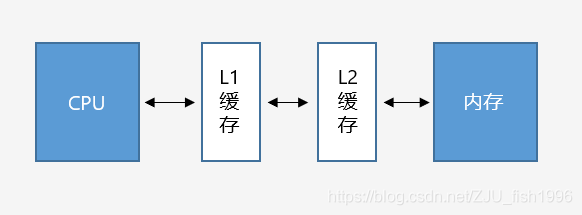
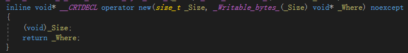
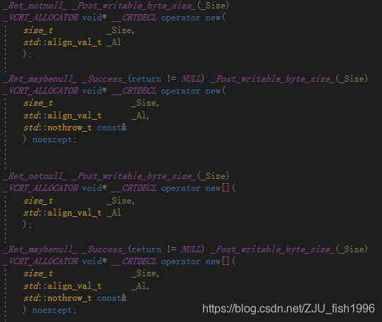

[toc]


# 深入C++内存管理

原文：https://blog.csdn.net/ZJU_fish1996/article/details/108858577

> PS：方便本人阅读习惯，所以复制到了md版本。


## 引入

说到`C++`的内存管理，我们可能会想到栈空间的**本地变量**、堆上通过`new`**动态分配的变量**以及全局命名空间的变量等，这些变量的分配位置都是由系统来控制管理的，而调用者只需要考虑**变量的生命周期等相关内容**即可，而无需关心**变量的具体布局**。这对于普通软件的开发已经足够，但对于**引擎开发**而言，我们必须对内存有着**更为精细的管理**。


## 基础概念

在文章的开篇，先对一些**基础概念**进行简单的介绍，以便能够更好地理解**后续的内容**。

### 内存布局


​    如图，描述了==C++程序的内存分布==：

- **Code Segment（代码区）**：也称`Text Segment` ，存放**可执行程序的机器码**。
- **Data Segment （数据区）**： 存放**已初始化的全局和静态变量**， 常量数据（如**字符串常量**）。
- **BSS（Block started by symbol）** ：存放**未初始化的全局和静态变量**。（默认设为`0`）
-  **Heap（堆）**：==从低地址向高地址增长==。容量大于栈，程序中**动态分配的内存**在此区域。
-  **Stack（栈）**：==从高地址向低地址增长==。由编译器自动管理分配。程序中的局部变量、函数参数值、返回变量等存在此区域。


### 函数栈

当调用函数时，==一块连续内存(堆栈帧）==压入栈；函数返回时，**堆栈帧**弹出。**堆栈帧**包含如下数据：

- 函数返回地址
- 局部变量/CPU寄存器数据备份


### 全局变量

当**全局/静态变量**（如下代码中的`x`和`y`变量）未初始化的时候，它们记录在`BSS`段。

```c++
int x;
int z = 5;
void func()
{
     static int y;
}
int main()
{
    return 0;
}
```

处于BSS段的变量的值默认为`0`，考虑到这一点，==BSS段内部无需存储大量的零值，而只需记录**字节个数**即可==。

系统载入**可执行程序**后，将**BSS段的数据**载入**数据段**（`Data Segment`） ，并将内存初始化为`0`，再调用==程序入口==（`main`函数）。

而对于**已经初始化了的全局/静态变量**而言，如以上代码中的`z`变量，则一直存储于数据段（`Data Segment`）。


### 内存对齐

对于基础类型，如`float`，` double`，` int`，`char`等，==它们的大小和内存占用是一致的==。而对于结构体而言，如果我们取得其**`sizeof`的结果**，会发现这个值有可能会大于结构体内所有成员大小的总和，这是由于**结构体内部成员进行了内存对齐**。


#### 为什么要进行内存对齐?

:one:==内存对齐使数据读取更高效==。

在硬件设计上，**数据读取的处理器**只能从**地址为`k`的倍数的内存处**开始读取数据。这种读取方式相当于将内存分为了**多个"块“**。假设内存可以从任意位置开始存放的话，**数据很可能会被分散到多个“块”中**，处理分散在多个块中的数据需要移除**首尾不需要的字节**，再进行**合并**，非常耗时。

为了提高**数据读取的效率**，程序分配的内存并**不是连续存储的**，而是**按首地址为k的倍数的方式存储**；这样就可以一次性读取数据，而不需要额外的操作。

> 读取**非对齐内存**的过程示例


:two:在某些平台下，不进行**内存对齐**会崩溃。


#### 内存对齐的规则

 定义==有效对齐值==（`alignment`）为结构体中**最宽成员**和**编译器/用户指定对齐值**中==较小的那个==。

- **结构体起始地址**为有效对齐值的**整数倍**。
- **结构体总大小**为有效对齐值的**整数倍**。
- 结构体第一个成员偏移值为`0`，之后成员的偏移值为 ==min(有效对齐值, 自身大小)== 的整数倍。

相当于每个成员要进行对齐，并且整个结构体也需要进行对齐。

```c++
struct A
{
    int i;
    char c1;
    char c2;
};
 
struct B
{
    char c1;
    int i;
    char c2;
};
 
int main()
{
    cout << sizeof(A) << endl; // 有效对齐值为4, output : 8
    cout << sizeof(B) << endl; // 有效对齐值为4, output : 12
    return 0;
}
```


### 内存碎片

**程序的内存**往往不是紧凑连续排布的，而是**存在着许多碎片**。我们根据**碎片产生的原因**把碎片分为**内部碎片**和**外部碎片**两种类型：

- 内部碎片：系统分配的内存大于实际所需的内存（由于**对齐机制**）；
- 外部碎片：不断分配回收不同大小的内存，由于**内存分布散乱**，较大内存无法分配；


 为了提高**内存的利用率**，我们有必要**减少内存碎片**，具体的方案将在后文重点介绍。


### 继承类布局

 如果一个类继承自另一个类，那么它自身的数据位于父类之后。

**含虚函数的类**：如果当前类包含虚函数，则会在**类的最前端**占用`4`个字节，用于存储**虚表指针**（`vpointer`)，它指向一个**虚函数表**（`vtable`)。

 `vtable`中包含当前类的**所有虚函数指针**。


### 字节序（endianness)

**大于一个字节的值**被称为**多字节量**，多字节量存在**高位有效字节**和**低位有效字节** (关于高位和低位，我们以十进制的数字来举例，对于数字`482`来说，`4`是高位，`2`是低位），微处理器有两种不同的顺序处理高位和低位字节的顺序：

- 小端（little_endian)：低位有效字节存储于较低的内存位置
- 大端（big_endian)：高位有效字节存储于较低的内存位置

 我们使用的**PC开发机**默认是==小端存储==。


一般情况下，**多字节量的排列顺序**对编码没有影响。但如果要考虑**跨平台的一些操作**，就有必要考虑到大小端的问题。如下图，**ue4引擎**使用了`PLATFORM_LITTLE_ENDIAN`这一宏，在不同平台下对数据做特殊处理（内存排布交换，确保存储时的结果一致）。

> **ue4针对大小端对数据做特殊处理（ByteSwap.h)**


### POD类型:star:

在`C++`，如果我们的类中包含**指针或者容器**，由于==指针或容器的内存是单独管理的==，因此内存一般都不是连续的：

```c++
class A
{
    std::vector<int> data;
    bool bValid;
    float* floatData;
};
 
int main()
{
    A a[10];
    return 0;
}
```

如上，我们定义的数组`a`的内存排布就是**不连续的**。 我们把那些类型平凡（trivial)，标准布局(standard-layout）的类型，称为==POD类型==。

==类型平凡==意味着：在对象存储定义的时候，就已经完成了对象的生存期，**无需构造函数**；==标准布局==意味着：它的内存是**有序排布的**。

在编写程序时，==一些频繁引用的**仅用于记录信息的数据结构**，如果能够设计为**POD类型**，能够提高程序的效率==。


## 操作系统

对一些**基础概念**有所了解后，我们可以来关注**操作系统底层的一些设计**。在掌握了这些特性后，我们才能更好地、针对性地编写**高性能代码**。

### SIMD

`SIMD`，即`Single Instruction Multiple Data`，==用一个指令并行地对多个数据进行运算==，是**CPU基本指令集的扩展**。

:one:**例一**

**处理器的寄存器**通常是**32位**或者**64位**的，而图像的一个像素点可能只有**8bit**，如果一次只能处理一个数据比较浪费空间；此时可以将**64位寄存器**拆成**8个8位寄存器**，就可以**并行完成8个操作**，提升效率。

:two:**例二**

 **SSE指令**采用**128位寄存器**，我们通常将**4个32位浮点值**打包到**128位寄存器**中，单个指令可完成**4对浮点数**的计算，这对于**矩阵/向量操作**非常友好（除此之外，还有Neon/FPU等寄存器）

> SIMD并行计算


### 高速缓存

一般来说`CPU`以超高速运行，而内存速度慢于`CPU`，硬盘速度慢于内存。当我们把数据加载内存后，要对数据进行一定操作时，会将数据从内存载入**CPU寄存器**。考虑到**CPU读/写主内存速度较慢**，处理器使用了**高速的缓存（Cache)**，作为==内存到CPU中间的媒介==。



引入`L1`和`L2`缓存后，CPU和内存之间的将**无法进行直接的数据交互**，而是需要经过**两级缓存**（目前也已出现`L3`缓存）：

- `CPU`请求数据：如果数据已经在**缓存**中，则直接从**缓存**载入**寄存器**；如果数据不在**缓存**中（==缓存命中失败==），则需要从**内存**读取，并将**内存**载入**缓存**中。
-  CPU写入数据：有两种方案：
  - 写入到缓存时，**同步写入内存**（write through cache) 
  - **仅写入到缓存中**，有必要时再写入内存（write-back）

 为了提高程序性能，则需要尽可能**避免缓存命中失败**。一般而言，遵循**尽可能地集中连续访问内存**，**减少”跳变“访问**的原则。这里其实隐含了两个意思：

- **内存空间上要尽可能连续**，
- **访问时序上要尽可能连续**。像节点式的数据结构的遍历就会差于内存连续性的容器。


### 虚拟内存

ToDo


### 置换算法

ToDo


## C++语法

> 当作复习了

### 位域（Bit Fields）

表示**结构体位域**的定义，指定**变量所占位数**。它通常位于成员变量后，用 **声明符：常量表达式** 表示。

**声明符是可选的，匿名字段可用于填充**。

 以下是`ue4`中`Float16`的定义：

```c++
struct
{
#if PLATFORM_LITTLE_ENDIAN
    uint16	Mantissa : 10;
    uint16	Exponent : 5;
    uint16	Sign : 1;
#else
    uint16	Sign : 1;
    uint16	Exponent : 5;
    uint16	Mantissa : 10;			
#endif
} Components;
```

> 参考地址：http://c.biancheng.net/view/2037.html


### new和placement new

> 关于这个的详细解释，可以看本人笔记：`More Effective C++ / 2.运算符`。

 `new`是C++中**用于动态内存分配的运算符**，它主要完成了以下两个操作：

- 调用`operator new()`函数，**动态分配内存**。
- 在分配的动态内存块上**调用构造函数**，以初始化相应类型的对象，并返回**首地址**。

当我们调用`new`时，会在**堆**中查找一个**足够大的剩余空间**，分配并返回；当我们调用`delete`时，则会将该内存**标记为不再使用**，而==指针仍然执行原来的内存==。

:one:**new的语法**

```c++
::(optional) new (placement_params)(optional) (type) initializer(optional);
//example
new (buffer) Widget(widgetSize);
```

不抛出异常的表达式：

```c++
new (nothrow) Type (optional-initializer-expression-list)
```

 默认情况下，如果内存分配失败，**new运算符**会选择抛出`std::bad_alloc`异常，如果加入`nothrow`，则不抛出异常，而是返回`nullptr`。

==占位符类型==：我们可以使用`placeholder type`（如`auto/decltype`）指定类型：

```c++
auto p = new auto('c');
```

------


==带位置的表达式（placement new）==：可以指定在**哪块内存**上构造类型。它的意义在于：我们可以利用`placement new`将**内存分配**和**构造**这两个模块分离（后续的`allocator`更好地践行了这一概念），这对于编写**内存管理的代码**非常重要，比如当我们想要编写内存池的代码时，可以预申请一块内存，然后通过`placement new`申请对象，一方面可以避免频繁调用系统new/delete带来的开销，另一方面可以自己控制内存的分配和释放。

 **预先分配的缓冲区**可以是**堆**或者**栈**上的，一般按**字节`char`类型**来分配，这主要考虑了以下两个原因：

- 方便控制**分配的内存大小**（通过`sizeof`计算即可）
- 如果使用**自定义类型**，则会调用**对应的构造函数**。但是既然要做分配和构造的分离，我们实际上是**不期望它做任何构造操作的**，而且对于**没有默认构造函数的自定义类型**，我们是**无法预分配缓冲区的**。

以下是一个使用的例子：

```c++
class A
{
private:
	int data;
public:
	A(int indata) 
		: data(indata) { }
	void print()
	{
		cout << data << endl;
	}
};
int main()
{
	const int size = 10;
	char buf[size * sizeof(A)]; // 内存分配
	for (size_t i = 0; i < size; i++)
	{
        //placement new
		new (buf + i * sizeof(A)) A(i); // 对象构造
	}
	A* arr = (A*)buf;
	for (size_t i = 0; i < size; i++)
	{
		arr[i].print();
		arr[i].~A(); // 对象析构
	}
	// 栈上预分配的内存自动释放
	return 0;
}
```

------


**自定义参数的表达式**：当我们调用`new`时，实际上执行了`operator new`运算符表达式，和其它函数一样，`operator new`有多种重载，如上文中的`placement new`，就是`operator new`以下形式的==一个重载==：



新语法（C++17）还支持==带对齐的operator new==：



调用示例：

```c++
auto p = new(std::align_val_t{32}) A;
```


:two:**new的重载**

 在`C++`中，我们一般说：`new`和`delete`动态分配和释放的对象位于**自由存储区**（`free store`），这是一个抽象概念。默认情况下，C++编译器会使用==堆==实现**自由存储**。

前文已经提及了`new`的几种重载，包括**数组**，`placement`，`align`等

如果我们想要实现自己的**内存分配自定义操作**，我们可以有如下两个方式：

- 编写**重载的operator new**，这意味着我们的参数需要和**全局operator new**有差异。
- ==重定义operator new==，根据**名字查找规则**，会优先在**申请内存的数据内部/数据定义处**查找**new运算符**，未找到才会调用**全局::operator new()**。

需要注意的是，如果该**全局operator new**已经实现为==inline函数==，则我们**不能重定义相关函数**，否则无法通过编译，如下：

```c++
// Default placement versions of operator new.
inline void* operator new(std::size_t, void* __p) throw() { return __p; }
inline void* operator new[](std::size_t, void* __p) throw() { return __p; }
 
// Default placement versions of operator delete.
inline void  operator delete  (void*, void*) throw() { }
inline void  operator delete[](void*, void*) throw() { }
```

但是，我们可以重写如下**nothrow的operator new**：

```c++
void* operator new(std::size_t, const std::nothrow_t&) throw();
void* operator new[](std::size_t, const std::nothrow_t&) throw();
void operator delete(void*, const std::nothrow_t&) throw();
void operator delete[](void*, const std::nothrow_t&) throw();
```

:three:**为什么说new是低效的**

- 一般来说，操作越简单，意味着封装了**更多的实现细节**。`new`作为一个通用接口，需要处理任意时间、任意位置、申请任意大小内存的请求，它在设计上就无法兼顾一些特殊场景的优化，在管理上也会带来一定开销。
- 系统调用带来的开销。多数操作系统上，==申请内存会从用户模式切换到内核模式==，当前线程会`block`住，上下文切换将会消耗一定时间。
- 分配可能是带锁的。这意味着==分配难以并行化==。


### alignas和alignof

不同的编译器一般都会有**默认的对齐量**，一般都为==2的幂次==。在`C`中，可以通过**预编译命令**修改**对齐量**：

```c++
#pragma pack(n)
```

在**内存对齐篇**已经提及，**最终的有效对齐量**会取结构体最宽成员 和 编译器默认对齐量（或我们自己定义的对齐量）中较小的那个。
$$
有效对齐量=\min{(结构体最宽成员, 编译器默认对齐量自定义<或者自定义值>)}
$$
​     

:one:**alignas**

C++中也提供了类似的操作：`alignas`用于指定对齐量——可以应用于**类**/**结构体**/**union**/**枚举**的声明/定义；**非位域的成员变量**的定义；**变量**的定义（除了**函数参数**或**异常捕获的参数**）；

`alignas`会对**对齐量**做检查，**对齐量**不能小于**默认对齐**，如下面的代码，`struct U`的对齐设置是**错误的**：

```c++
struct alignas(8) S 
{
    // ...
};
 
struct alignas(1) U 
{
    S s;
};
```

 此外，一些**错误的格式**也无法通过编译，如：

```c++
struct alignas(3) S { };
```

:two:**alignof operator**

  返回类型是`std::size_t`。如果是**引用**，则返回**引用类型的对齐方式**，如果是**数组**，则返回**元素类型的对齐方式**。例子：

```c++
struct Foo {
    int i;
    float f;
    char c;
};
 
struct Empty { };
 
struct alignas(64) Empty64 { };
 
int main()
{
    std::cout << "Alignment of" "\n"
                 "- char          :"    << alignof(char)    << "\n"   // 1
                 "- pointer       :"    << alignof(int*)    << "\n"   // 8
                 "- class Foo     :"    << alignof(Foo)     << "\n"   // 4
                 "- empty class   :"    << alignof(Empty)   << "\n"   // 1
                 "- alignas(64) Empty:" << alignof(Empty64) << "\n";  // 64
}
```

**std::max_align_t**： 一般为`16`bytes。`malloc`返回的内存地址，对齐大小不能小于`max_align_t`。


### allocator