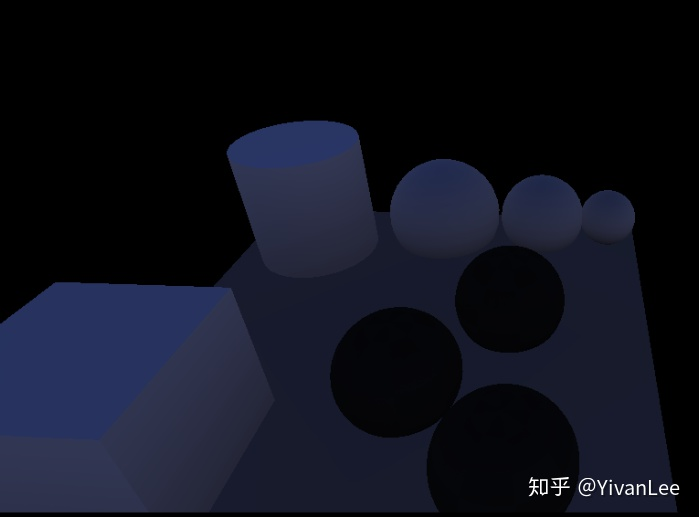
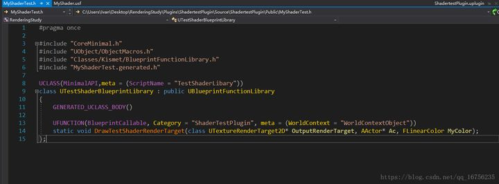

## 虚幻4渲染编程（Shader篇）

### 1. 虚幻自身的延迟渲染管线

****

那么当我们把一个模型托到场景里，这个模型被渲染出来的整个流程到底是什么样的呢？这个流程其实是非常庞大的。下面我就来一个一个拆分。

（1）第一步：资源准备阶段。这个阶段包括顶点缓冲区的准备，索引缓冲区的准备。这一步由场景代理管理完成。当然从磁盘里读取模型资源这些就涉及到StaticMesh这些了。想了解这一步可以去看我以前的博客，或者直接去看UPrimitiveComponent，UMeshComponent，UStaticMeshComponent，UCableComponent，UCustomMeshComponent。当你把这些源码全部研究一遍后，这个阶段算是了解了。这个阶段我不打算再描述了，因为已经有了很多现成的代码了。

（2）第二步就是shader资源的准备了，这个又是一个非常大的话题了。可以去看我以前关于给改材质编辑器和加shadingmode的文章便可以有个大概的了解。这一步我还会进一步阐述。

（3）第三步就是绘制了。

我们先不看Render函数那些复杂的调用，我们把精力先集中到shader层面来。一张画面是怎么开始绘制的呢？


#### InitView

主要是计算可见性，进行剔除。


#### Early Z-Pre Pass

Early Z由硬件实现，我们的渲染管线只需要按照硬件要求渲染就可以使用earlyz优化了，具体步骤如下：

（1）首先UE4会把场景中所有的Opaque和Mask的材质做一遍Pre-Pass，只写深度不写颜色，这样可以做到快速写入，先渲染Opaque再渲染Mask的物体，渲染Mask的时候开启Clip。

（2）做完Pre-pass之后，这个时候把深度测试改为Equal，关闭写深度渲染Opaque物体。然后再渲染Mask物体，同样是关闭深度写，深度测试改为Equal，但是这个时候是不开启clip的，因为pre-pass已经把深度写入，这个时候只需要把Equal的像素写入就可以了。

首先渲染prepass的第一步肯定是渲染资源的准备啦。primitive资源会在InitView的时候准备好。

然后会再BeginRenderingPrePass函数中设置各种绘制管线的绑定，包括关闭颜色写入，绑定Render target


然后再调用draw之前会把各种UniformBuffer和渲染状态设置好


然后调用draw


最后完成Pre Pass的绘制


#### ShadowDepthPass

根据不同的灯光类型会绘制不同种类的shadowmap。总的来说绘制shadowmap的时候不会使用遮挡剔除。

Unreal渲染shadowmap目前我就找到个视锥剔除


shadowdepthpass可能是在basepass之前，也可以是之后，具体看EarlyZ的方式


我们的灯光种类繁多大致可以分为两类，一类使用2Dshadowmap的，一类使用Cubemapshadowmap的


上图的1部分就是渲染2DshadowMap，2部分渲染的就是Cubemapshadowmap，这一步只是渲染出shadowmap供后面的Lightingpass使用。

#### BasePass


BasePass使用了==MRT技术==一次性渲染出GBuffer。


再上一次**GBuffer**的数据分布


BasePass把GBuffer渲染出来之后就可以供后面的LightingPass使用了。我们的材质编辑器再Surface模式下也是在生成MaterialShader为BasePass服务


这部分可以去看看我的材质编辑器篇有详细介绍。

也是通过一系列设置绑定渲染状态资源等，最后调用==dispatchdraw==


可以注意到，MRT0是SceneColor而不是BaseColor



Scene在BasePass中做了简单的漫反射计算


这一步用到了，这个测试场景我是烘焙过的，我把烘焙数据去掉，SceneColor其实是这样的：


啥也没有黑的

BasePass会在这个阶段把预烘焙的IndirectLiting计算到SceneColor这张RT上供后面的pass使用


#### CustomDepthPass

CustomDepth没啥特别的，就是把需要绘制CustomDepth的物体的深度再绘制一遍到CustomDepthBuffer上。

#### PreLightingPass

虚幻封装了一套方便画PostPass的机制，后面的绘制SSAO，Lighting，SSR，Bloom等各种pass都是用的这套Context的机制。


==PreLighting这步主要是在用前面的GBuffer，算decals和SSAO为后面的Lighting做准备。==


SSAO使用的是FPostProcessBasePassAOPS这个C++shader类。


对应的USF是PostProcessAmbientOcclusion


并且使用Computeshader来加速计算

#### DirectLightPass


LightPass也非常复杂，整个pass的代码有几千行，shader代码也有几千行非常恐怖的系统。我们先找到入口函数：


##### （1）方向光

根据不同的情况，使用不同的渲染策略

渲染不同情况下的灯光大体分类如下。还会根据不同的渲染方式分类。


比如一般的方向光：


在渲染方向光的时候因为不需要考虑分块，所以直接把每盏灯挨个画出来就可以了


下面我只放了一盏方向光


下面我放三盏方向光：


##### （2）TileDeferredLighting

如果灯光不渲染阴影，并且灯光没用IES，并且灯光数目达到80盏以上（4.22）并且启用了TileDeferred管线，那么虚幻4就会使用TileDeferredLight来计算光照，虚幻实现TileDeferrdLight使用的是一个Computeshader


有很多灯光使用的潜规则。

#### ScreenSpaceReflectionPass


#### TranslucencyPass


透明物体会放在最后渲染，但是在==后期==的前面。需要看是否在DOF(景深)后合并。

对于这个上图的那个场景来说，透明物体渲染的buffer是长下面这样的：


最后在后期中组合


如果没有启用==r.ParallelTranslucency==透明物体只能挨个渲染。


如果启用了就可以走上面的并行渲染分支。

透明物体的渲染在实时渲染中一直比较迷，会有各种问题。比如排序等等。在默认情况下是走AllowTranslucentDOF的。AllowTranslucentDOF是什么意思呢，代码的注释里有解释。


Translucent物体的渲染有几种模式：


这里的代码我们在BasePassPixelShader.usf里能找到


对于非透明物体来说basepass是渲染GBuffer的，但是对于透明物体来说，BasePass是渲染基础的+Lighting的，会在这里一次性渲染完，如果我们想改透明物体的shading方式，就需要用在这里改了。

 参考文章：

【1】[fengliancanxue：深入剖析GPU Early Z优化](https://zhuanlan.zhihu.com/p/53092784)

【2】[Visibility and Occlusion Culling](https://link.zhihu.com/?target=https%3A//docs.unrealengine.com/en-us/Engine/Rendering/VisibilityCulling)


### 2. 不用虚幻4Shader管线使用自己的shader

首先创建个插件，名字取为ShadertestPlugin

然后打开工程里的这个插件，在插件目录下加一个Shaders文件夹


然后再在Shaders文件夹里加Private文件夹


然后再在private里面夹里新建一个文本文档，然后把后缀名改位.usf


在这个MyShader.usf里键入如下代码：

```c
#include "/Engine/Public/Platform.ush"

float4 SimpleColor;
void MainVS(
 in float4 InPosition : ATTRIBUTE0,
 out float4 OutPosition : SV_POSITION
 )
{
 // screenspace position from vb
    OutPosition = InPosition;
}

void MainPS(
    out float4 OutColor : SV_Target0
    )
{
    OutColor = SimpleColor;
}
```

我声明了一个MyColor的颜色，这个变量后面会和c++绑定，到时候就可以让它跟cpu交互了。然后声明了一个顶点着色器和像素着色i器。

完成了这个之后，再在插件的source文件夹下加两个文件


新建两个文本文档然后把后缀改位.h和.cpp就可以了（注意：直接在系统文件夹下创建txt，然后修改）。做完这些之后记得右键Uproject文件重写generate一下工程


然后重新加载vs项目就可以啦。

然后在把==ShadertestPlugin.uplugin==文件改一下，如下图。把加载顺序改成在引擎前加载。PostConfigInit。shader必须要在引擎加载完成前加载完才行。


做完这个后，再在MyShaderTest.h中打入如下代码：



然后再在MyShaderText.cpp中打入如下代码：

```c++
// Copyright 1998-2018 Epic Games, Inc. All Rights Reserved.  
 
#include "MyShaderTest.h"  
 
#include "Classes/Engine/TextureRenderTarget2D.h"  
#include "Classes/Engine/World.h"  
#include "Public/GlobalShader.h"  
#include "Public/PipelineStateCache.h"  
#include "Public/RHIStaticStates.h"  
#include "Public/SceneUtils.h"  
#include "Public/SceneInterface.h"  
#include "Public/ShaderParameterUtils.h"  
#include "Public/Logging/MessageLog.h"  
#include "Public/Internationalization/Internationalization.h"  
#include "Public/StaticBoundShaderState.h"  
 
#define LOCTEXT_NAMESPACE "TestShader"  
 
UTestShaderBlueprintLibrary::UTestShaderBlueprintLibrary(const FObjectInitializer& ObjectInitializer)  
    : Super(ObjectInitializer)  
{  
 
}  
 
class FMyShaderTest : public FGlobalShader  
{  
public:  
 
    FMyShaderTest(){}  
 
    FMyShaderTest(const ShaderMetaType::CompiledShaderInitializerType& Initializer)  
        : FGlobalShader(Initializer)  
    {  
        SimpleColorVal.Bind(Initializer.ParameterMap, TEXT("SimpleColor"));  
    }  
 
    static bool ShouldCache(EShaderPlatform Platform)  
    {  
        return true;  
    }  
 
    static bool ShouldCompilePermutation(const FGlobalShaderPermutationParameters& Parameters)  
    {  
        //return IsFeatureLevelSupported(Parameters.Platform, ERHIFeatureLevel::SM4);  
        return true;  
    }  
 
    static void ModifyCompilationEnvironment(const FGlobalShaderPermutationParameters& Parameters, FShaderCompilerEnvironment& OutEnvironment)  
    {  
        FGlobalShader::ModifyCompilationEnvironment(Parameters, OutEnvironment);  
        OutEnvironment.SetDefine(TEXT("TEST_MICRO"), 1);  
    }  
 
    void SetParameters(  
        FRHICommandListImmediate& RHICmdList,  
        const FLinearColor &MyColor  
        )  
    {  
        SetShaderValue(RHICmdList, GetPixelShader(), SimpleColorVal, MyColor);  
    }  
 
    virtual bool Serialize(FArchive& Ar) override  
    {  
        bool bShaderHasOutdatedParameters = FGlobalShader::Serialize(Ar);  
        Ar << SimpleColorVal;  
        return bShaderHasOutdatedParameters;  
    }  
 
private:  
 
    FShaderParameter SimpleColorVal;  
 
};  
 
class FShaderTestVS : public FMyShaderTest  
{  
    DECLARE_SHADER_TYPE(FShaderTestVS, Global);  
 
public:  
    FShaderTestVS(){}  
 
    FShaderTestVS(const ShaderMetaType::CompiledShaderInitializerType& Initializer)  
        : FMyShaderTest(Initializer)  
    {  
 
    }  
};  
 
 
class FShaderTestPS : public FMyShaderTest  
{  
    DECLARE_SHADER_TYPE(FShaderTestPS, Global);  
 
public:  
    FShaderTestPS() {}  
 
    FShaderTestPS(const ShaderMetaType::CompiledShaderInitializerType& Initializer)  
        : FMyShaderTest(Initializer)  
    {  
 
    }  
};  
 
IMPLEMENT_SHADER_TYPE(, FShaderTestVS, TEXT("/Plugin/ShadertestPlugin/Private/MyShader.usf"), TEXT("MainVS"), SF_Vertex)  
IMPLEMENT_SHADER_TYPE(, FShaderTestPS, TEXT("/Plugin/ShadertestPlugin/Private/MyShader.usf"), TEXT("MainPS"), SF_Pixel)  
 
static void DrawTestShaderRenderTarget_RenderThread(  
    FRHICommandListImmediate& RHICmdList,   
    FTextureRenderTargetResource* OutputRenderTargetResource,  
    ERHIFeatureLevel::Type FeatureLevel,  
    FName TextureRenderTargetName,  
    FLinearColor MyColor  
)  
{  
    check(IsInRenderingThread());  
 
#if WANTS_DRAW_MESH_EVENTS  
    FString EventName;  
    TextureRenderTargetName.ToString(EventName);  
    SCOPED_DRAW_EVENTF(RHICmdList, SceneCapture, TEXT("ShaderTest %s"), *EventName);  
#else  
    SCOPED_DRAW_EVENT(RHICmdList, DrawUVDisplacementToRenderTarget_RenderThread);  
#endif  
 
    //设置渲染目标  
    SetRenderTarget(  
        RHICmdList,  
        OutputRenderTargetResource->GetRenderTargetTexture(),  
        FTextureRHIRef(),  
        ESimpleRenderTargetMode::EUninitializedColorAndDepth,  
        FExclusiveDepthStencil::DepthNop_StencilNop  
    );  
 
    //设置视口  
    //FIntPoint DrawTargetResolution(OutputRenderTargetResource->GetSizeX(), OutputRenderTargetResource->GetSizeY());  
    //RHICmdList.SetViewport(0, 0, 0.0f, DrawTargetResolution.X, DrawTargetResolution.Y, 1.0f);  
 
    TShaderMap<FGlobalShaderType>* GlobalShaderMap = GetGlobalShaderMap(FeatureLevel);  
    TShaderMapRef<FShaderTestVS> VertexShader(GlobalShaderMap);  
    TShaderMapRef<FShaderTestPS> PixelShader(GlobalShaderMap);  
 
    // Set the graphic pipeline state.  
    FGraphicsPipelineStateInitializer GraphicsPSOInit;  
    RHICmdList.ApplyCachedRenderTargets(GraphicsPSOInit);  
    GraphicsPSOInit.DepthStencilState = TStaticDepthStencilState<false, CF_Always>::GetRHI();  
    GraphicsPSOInit.BlendState = TStaticBlendState<>::GetRHI();  
    GraphicsPSOInit.RasterizerState = TStaticRasterizerState<>::GetRHI();  
    GraphicsPSOInit.PrimitiveType = PT_TriangleList;  
    GraphicsPSOInit.BoundShaderState.VertexDeclarationRHI = GetVertexDeclarationFVector4();  
    GraphicsPSOInit.BoundShaderState.VertexShaderRHI = GETSAFERHISHADER_VERTEX(*VertexShader);  
    GraphicsPSOInit.BoundShaderState.PixelShaderRHI = GETSAFERHISHADER_PIXEL(*PixelShader);  
    SetGraphicsPipelineState(RHICmdList, GraphicsPSOInit);  
 
    //RHICmdList.SetViewport(0, 0, 0.0f, DrawTargetResolution.X, DrawTargetResolution.Y, 1.0f);  
    PixelShader->SetParameters(RHICmdList, MyColor);  
 
    // Draw grid.  
    //uint32 PrimitiveCount = 2;  
    //RHICmdList.DrawPrimitive(PT_TriangleList, 0, PrimitiveCount, 1);  
    FVector4 Vertices[4];  
    Vertices[0].Set(-1.0f, 1.0f, 0, 1.0f);  
    Vertices[1].Set(1.0f, 1.0f, 0, 1.0f);  
    Vertices[2].Set(-1.0f, -1.0f, 0, 1.0f);  
    Vertices[3].Set(1.0f, -1.0f, 0, 1.0f);  
    static const uint16 Indices[6] =  
    {  
        0, 1, 2,  
        2, 1, 3  
    };  
    //DrawPrimitiveUP(RHICmdList, PT_TriangleStrip, 2, Vertices, sizeof(Vertices[0]));  
    DrawIndexedPrimitiveUP(  
        RHICmdList,  
        PT_TriangleList,  
        0,  
        ARRAY_COUNT(Vertices),  
        2,  
        Indices,  
        sizeof(Indices[0]),  
        Vertices,  
        sizeof(Vertices[0])  
    );  
 
    // Resolve render target.  
    RHICmdList.CopyToResolveTarget(  
        OutputRenderTargetResource->GetRenderTargetTexture(),  
        OutputRenderTargetResource->TextureRHI,  
        false, FResolveParams());  
}  
 
void UTestShaderBlueprintLibrary::DrawTestShaderRenderTarget(  
    UTextureRenderTarget2D* OutputRenderTarget,   
    AActor* Ac,  
    FLinearColor MyColor  
)  
{  
    check(IsInGameThread());  
 
    if (!OutputRenderTarget)  
    {  
        return;  
    }  
 
    FTextureRenderTargetResource* TextureRenderTargetResource = OutputRenderTarget->GameThread_GetRenderTargetResource();  
    UWorld* World = Ac->GetWorld();  
    ERHIFeatureLevel::Type FeatureLevel = World->Scene->GetFeatureLevel();  
    FName TextureRenderTargetName = OutputRenderTarget->GetFName();  
    ENQUEUE_RENDER_COMMAND(CaptureCommand)(  
        [TextureRenderTargetResource, FeatureLevel, MyColor, TextureRenderTargetName](FRHICommandListImmediate& RHICmdList)  
        {  
            DrawTestShaderRenderTarget_RenderThread(RHICmdList,TextureRenderTargetResource, FeatureLevel, TextureRenderTargetName, MyColor);  
        }  
    );  
 
}  
 
#undef LOCTEXT_NAMESPACE  

```

稍后我会一行行解释这些代码的意思。然后我们要修改下c#文件


完成这些后再generate一下工程，然后就可以打开项目了。我们新建如下资源：


打开BP_Shader_Test蓝图做如下设置


新建一个颜色变量，然后再beginplay函数先清空一下我们的那张ShaderTestRT渲染目标，然后把我们这个shadertestrt渲染目标给我们的DrawTestShaderRenderTarget函数。还需要注意设置input，这样actor才能接收到我们的input事件。

做完这些之后再建一个材质，把RT拖到材质里（这里只是想让我们的shader效果被看到，我们的shader已经可以运作了）


这个操作其实已经是多pass了！！！然后把BP_Shader_Test拖到场景里，你按下1 2 3 就能看到如下效果了：


------

**SUMMARY AND OUTLOOK：**

虽然是一个简单的例子，但是终于可以在Unreal中使用自己的着色器了。


### 3. 第二卷代码解释

首先来看一下ShadertestPlugin.Build.cs文件。

```c#
// Copyright 1998-2018 Epic Games, Inc. All Rights Reserved.  
 
using UnrealBuildTool;  
 
public class ShadertestPlugin : ModuleRules  
{  
    public ShadertestPlugin(ReadOnlyTargetRules Target) : base(Target)  
    {  
        PCHUsage = ModuleRules.PCHUsageMode.UseExplicitOrSharedPCHs;  
 
        PublicIncludePaths.AddRange(  
            new string[] {  
                "ShadertestPlugin/Public"  
                // ... add public include paths required here ...  
            }  
            );  
 
 
        PrivateIncludePaths.AddRange(  
            new string[] {  
                "ShadertestPlugin/Private",  
                // ... add other private include paths required here ...  
            }  
            );  
 
 
        PublicDependencyModuleNames.AddRange(  
            new string[]  
            {  
                "Core",  
                "CoreUObject",  
                "Engine",  
                "RHI",  
                "Engine",  
                "RenderCore",  
                "ShaderCore",  
                // ... add other public dependencies that you statically link with here ...  
            }  
            );  
 
 
        PrivateDependencyModuleNames.AddRange(  
            new string[]  
            {  
                "CoreUObject",  
                "Engine",  
                "Slate",  
                "SlateCore",  
                // ... add private dependencies that you statically link with here ...    
            }  
            );  
 
 
        DynamicallyLoadedModuleNames.AddRange(  
            new string[]  
            {  
                // ... add any modules that your module loads dynamically here ...  
            }  
            );  
    }  
}  
// Copyright 1998-2018 Epic Games, Inc. All Rights Reserved.

using UnrealBuildTool;

public class ShadertestPlugin : ModuleRules
{
	public ShadertestPlugin(ReadOnlyTargetRules Target) : base(Target)
	{
		PCHUsage = ModuleRules.PCHUsageMode.UseExplicitOrSharedPCHs;
 
		PublicIncludePaths.AddRange(
			new string[] {
				"ShadertestPlugin/Public"
				// ... add public include paths required here ...
			}
			);
 
 
		PrivateIncludePaths.AddRange(
			new string[] {
				"ShadertestPlugin/Private",
				// ... add other private include paths required here ...
			}
			);
 
 
		PublicDependencyModuleNames.AddRange(
			new string[]
			{
				"Core",
                "CoreUObject",
                "Engine",
                "RHI",
                "Engine",
                "RenderCore",
                "ShaderCore",
				// ... add other public dependencies that you statically link with here ...
			}
			);
 
 
		PrivateDependencyModuleNames.AddRange(
			new string[]
			{
				"CoreUObject",
				"Engine",
				"Slate",
				"SlateCore",
				// ... add private dependencies that you statically link with here ...	
			}
			);
 
 
		DynamicallyLoadedModuleNames.AddRange(
			new string[]
			{
				// ... add any modules that your module loads dynamically here ...
			}
			);
	}
}
```

这个文件主要是用来做路径配置的，和你需要增加的模块。只有这里引入了模块我们才能在头文件中include他们。虚幻这是在c++中实现了c#的模块编程的思路。需要什么功能，在这里写进来，不需要就不写。不禁感叹虚幻的牛逼。

下面再来看看ShadertestPlugin.uplugin，这个文件是一个配置文件，描述了我们插件的一些信息和最关键的加载顺序==LoadingPhase==.


可以去查一下LoadingPhase还有其他的。


看完这些之后，我们还需要再关注三个文件


我们先来看看MyShader.usf


一个是顶点着色器一个是像素着色器。还有声明了一个shader的float4变量。像素着色器和顶点着色器做的事情很简单，就是输出一个简单的颜色和位置。

最顶上那个#include "/Engine/Public/Platform.ush"可以不用包含的。如果你在shader中


这个==ShouldCompilePermutation函数==如果有判断平台的话，那么你就需要加上这个include了。

下面再来看看MyShaderTest.h


其实这个就是一个静态函数库，我们之所以能在蓝图脚本中调用这个函数就是因为这个是个静态函数库。为蓝图提供了一个直接调用的方法。


这个函数做的事情就是帮我们从蓝图脚本里传了一些数据到我们的shader里。

接下来看最重要的MyShaderTest.cpp文件了


首先包含了我们需要的头文件。这些头文件是因为我们在c#中引入了他们所在的模块我们才能include的。不然这些include操作都是非法的。


接下来是引入我们的==自定义命名空间==。对应的，在这个cpp文件的最末尾，必须配对一个end操作


接下来是蓝图函数库的构造函数。这里面什么也不需要写。


然后就是我们的shader类了

```c++
class FMyShaderTest : public FGlobalShader  
{  
public:  
 
    FMyShaderTest(){}  
 
    FMyShaderTest(const ShaderMetaType::CompiledShaderInitializerType& Initializer)  
        : FGlobalShader(Initializer)  
    {  
        SimpleColorVal.Bind(Initializer.ParameterMap, TEXT("SimpleColor"));  
    }  
 
    static bool ShouldCache(EShaderPlatform Platform)  
    {  
        return true;  
    }  
 
    static bool ShouldCompilePermutation(const FGlobalShaderPermutationParameters& Parameters)  
    {  
        //return IsFeatureLevelSupported(Parameters.Platform, ERHIFeatureLevel::SM4);  
        return true;  
    }  
 
    static void ModifyCompilationEnvironment(const FGlobalShaderPermutationParameters& Parameters, FShaderCompilerEnvironment& OutEnvironment)  
    {  
        FGlobalShader::ModifyCompilationEnvironment(Parameters, OutEnvironment);  
        OutEnvironment.SetDefine(TEXT("TEST_MICRO"), 1);  
    }  
 
    void SetParameters(  
        FRHICommandListImmediate& RHICmdList,  
        const FLinearColor &MyColor  
        )  
    {  
        SetShaderValue(RHICmdList, GetPixelShader(), SimpleColorVal, MyColor);  
    }  
 
    virtual bool Serialize(FArchive& Ar) override  
    {  
        bool bShaderHasOutdatedParameters = FGlobalShader::Serialize(Ar);  
        Ar << SimpleColorVal;  
        return bShaderHasOutdatedParameters;  
    }  
 
private:  
 
    FShaderParameter SimpleColorVal;  
 
};  
class FMyShaderTest : public FGlobalShader
{
public:

	FMyShaderTest(){}

	FMyShaderTest(const ShaderMetaType::CompiledShaderInitializerType& Initializer)
		: FGlobalShader(Initializer)
	{
		SimpleColorVal.Bind(Initializer.ParameterMap, TEXT("SimpleColor"));
	}

	static bool ShouldCache(EShaderPlatform Platform)
	{
		return true;
	}

	static bool ShouldCompilePermutation(const FGlobalShaderPermutationParameters& Parameters)
	{
		//return IsFeatureLevelSupported(Parameters.Platform, ERHIFeatureLevel::SM4);
		return true;
	}

	static void ModifyCompilationEnvironment(const FGlobalShaderPermutationParameters& Parameters, FShaderCompilerEnvironment& OutEnvironment)
	{
		FGlobalShader::ModifyCompilationEnvironment(Parameters, OutEnvironment);
		OutEnvironment.SetDefine(TEXT("TEST_MICRO"), 1);
	}

	void SetParameters(
		FRHICommandListImmediate& RHICmdList,
		const FLinearColor &MyColor
		)
	{
		SetShaderValue(RHICmdList, GetPixelShader(), SimpleColorVal, MyColor);
	}

	virtual bool Serialize(FArchive& Ar) override
	{
		bool bShaderHasOutdatedParameters = FGlobalShader::Serialize(Ar);
		Ar << SimpleColorVal;
		return bShaderHasOutdatedParameters;
	}

private:

	FShaderParameter SimpleColorVal;

};
```


shader类的默认构造函数和构造函数。在构造函数中，我们用bind方法把shader的私有成员变量==SimpleColorVal==和shader中的变量float4 SimpleColor做了绑定。


然后是者三个函数：


这三个函数的作用分别是：

static bool ShouldCache(EShaderPlatform Platform)主要是作用如下


对于这个函数 ModifyCompilationEnvironment，如果是看过我前面加shadingmode的博客的话就不会陌生了。它可以把宏塞进shader里。


SetParameters这个函数是自己定义的，你可以随便怎么给它命名。它的作用是把我们的颜色信息传到shader里。我们直接set


这个私有变量即可。它在构造函数的时候和shader的变量绑定了的。


这个函数就是序列化了，这个没啥好说的，如果不懂可以去看知乎上的关于虚幻序列化和反序列化的文章。可以理解为虚幻怎么从磁盘读取二进制数据。我们的shader是一个文件（敲过渲染器的化就应该知道这一点啦）。如果不清楚的话可以直接跳过它，毕竟虚幻的这套机制又是一个庞大的话题了。

然后是我们的VS和PS


这两个类里都没什么内容，主要是我们把代码都写FMyShaderTest里了。这样方便不用再写一次。这也是FMyShaderTest类存在的目的。当然你让PS和VS都继承自globalshader也是没问题的。


这个宏会帮我们把我们的shader加入到全局的shadermap中，这也是虚幻能识别到我们的shader然后编译它的关键。这个宏帮我们做了很多事情，反正总的来说就是让虚幻知道了，哦！这里有个shader，我要编译它，我要用它来做渲染啥的。如果你想深入了解，可以跟进去看看。


然后是这么两个宏。它的作用就是把shader文件和我们shader类绑定起来，然后指认它是什么shader，shader对应的HLSL入口代码是哪里。大概就是这么一个作用。

最后就是这两个函数了：


DrawTestShaderRenderTarget是MyShaderTest.h里蓝图函数库的实现，是逻辑线程这边调用draw方法的部分。


在这个函数中，我们首先判断，是不是逻辑线程在调用它，然后判断一下我们从蓝图输入的资源那个RT是不是空的，其实这里还应该判断一下Ac是不是空的。

然后获取到这个rendertarget在渲染线程的渲染资源。然后获取FeatureLevel。写过DX的设备初始化的话就对这个FeatureLevelhen会很熟悉了，这里就不赘述了，如果不清楚，就去百度搜dxd11设备初始化吧。

最后就是调用ENQUEUE_RENDER_COMMAND这个宏了。这个宏会向渲染线程压入一个渲染命令，调用我们在渲染线程的DrawTestShaderRenderTarget_RenderThread方法。如果不清楚这里的语法的，去看一下c++的lambda表达式吧。


完成这里之后，就会调用我们渲染线程的DrawTestShaderRenderTarget_RenderThread函数了。

还是先判断一下线程


然后就是设置渲染目标设置视口，设置管线的状态这些老生常谈的东西了。


这里是向shader里传值了。


这里就是实际的绘制了，会传入顶点和索引。这里DrawIndexedPrimitiveUP会从面片的顶端架一台摄像机然后拍这个面片然后把拍到的信息存到RT上


最后一步就是把渲染的RT拷贝到我们传入的那张RT上。

如果你发现拍出来的形状不对，请把Indices改一下


这个是错的。

改成


这样！！

至此第二卷的代码讲解就完成啦。后面我们会继续我们的探索之旅。

------

#### **关于UE的Shader虚拟路径**

UE在4.21之后对于Shader的路径做了一些修改，导致之前的虚拟路径的写法会报错。


比如：

```text
IMPLEMENT_SHADER_TYPE(, FVolumeCSShader, TEXT("/Plugin/VolumetricClouds/Private/VolumeCloudSky.usf"), TEXT("MainCS"), SF_Compute)
```

如果直接这么写的话4.21后的版本直接就过不了编译了。所以我研究了下UE的虚拟路径系统。

首先找到GetShaderSourceFilePath函数。这里便是在把我们的虚拟路径映射成真实路径的地方。


而在这个过程中会用到GShaderSourceDirectoryMappings。在4.21及之后这个Directory Mappings需要自己初始化。从此以后再也不需要为虚拟路径的写法烦恼了。


可能这么说有点抽象，我举个例子吧：

我如果把虚拟路径的名字写夸张点


点下F5后依然能完美运行！


其实4.21相对于4.20这一点实际上是个进步，我们能自己定义Shader的虚拟路径了。