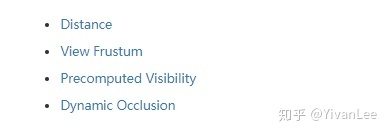
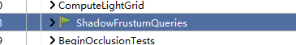
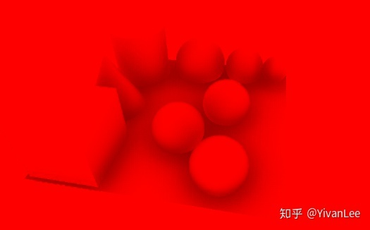

## 虚幻4渲染编程（Shader篇）

### 1. 虚幻自身的延迟渲染管线

****

那么当我们把一个模型托到场景里，这个模型被渲染出来的整个流程到底是什么样的呢？这个流程其实是非常庞大的。下面我就来一个一个拆分。

（1）第一步：资源准备阶段。这个阶段包括顶点缓冲区的准备，索引缓冲区的准备。这一步由场景代理管理完成。当然从磁盘里读取模型资源这些就涉及到StaticMesh这些了。想了解这一步可以去看我以前的博客，或者直接去看UPrimitiveComponent，UMeshComponent，UStaticMeshComponent，UCableComponent，UCustomMeshComponent。当你把这些源码全部研究一遍后，这个阶段算是了解了。这个阶段我不打算再描述了，因为已经有了很多现成的代码了。

（2）第二步就是shader资源的准备了，这个又是一个非常大的话题了。可以去看我以前关于给改材质编辑器和加shadingmode的文章便可以有个大概的了解。这一步我还会进一步阐述。

（3）第三步就是绘制了。

我们先不看Render函数那些复杂的调用，我们把精力先集中到shader层面来。一张画面是怎么开始绘制的呢？

#### InitView

主要是计算可见性，进行剔除。

#### Early Z-Pre Pass

Early Z由硬件实现，我们的渲染管线只需要按照硬件要求渲染就可以使用earlyz优化了，具体步骤如下：

（1）首先UE4会把场景中所有的Opaque和Mask的材质做一遍Pre-Pass，只写深度不写颜色，这样可以做到快速写入，先渲染Opaque再渲染Mask的物体，渲染Mask的时候开启Clip。

（2）做完Pre-pass之后，这个时候把深度测试改为Equal，关闭写深度渲染Opaque物体。然后再渲染Mask物体，同样是关闭深度写，深度测试改为Equal，但是这个时候是不开启clip的，因为pre-pass已经把深度写入，这个时候只需要把Equal的像素写入就可以了。

首先渲染prepass的第一步肯定是渲染资源的准备啦。primitive资源会在InitView的时候准备好。

然后会再BeginRenderingPrePass函数中设置各种绘制管线的绑定，包括关闭颜色写入，绑定Render target

然后再调用draw之前会把各种UniformBuffer和渲染状态设置好

然后调用draw

最后完成Pre Pass的绘制

#### ShadowDepthPass

根据不同的灯光类型会绘制不同种类的shadowmap。总的来说绘制shadowmap的时候不会使用遮挡剔除。

Unreal渲染shadowmap目前我就找到个视锥剔除

shadowdepthpass可能是在basepass之前，也可以是之后，具体看EarlyZ的方式

我们的灯光种类繁多大致可以分为两类，一类使用2Dshadowmap的，一类使用Cubemapshadowmap的

上图的1部分就是渲染2DshadowMap，2部分渲染的就是Cubemapshadowmap，这一步只是渲染出shadowmap供后面的Lightingpass使用。

#### BasePass

BasePass使用了==MRT技术==一次性渲染出GBuffer。

再上一次**GBuffer**的数据分布

BasePass把GBuffer渲染出来之后就可以供后面的LightingPass使用了。我们的材质编辑器再Surface模式下也是在生成MaterialShader为BasePass服务

这部分可以去看看我的材质编辑器篇有详细介绍。

也是通过一系列设置绑定渲染状态资源等，最后调用==dispatchdraw==

可以注意到，MRT0是SceneColor而不是BaseColor

Scene在BasePass中做了简单的漫反射计算

这一步用到了，这个测试场景我是烘焙过的，我把烘焙数据去掉，SceneColor其实是这样的：

啥也没有黑的

BasePass会在这个阶段把预烘焙的IndirectLiting计算到SceneColor这张RT上供后面的pass使用

#### CustomDepthPass

CustomDepth没啥特别的，就是把需要绘制CustomDepth的物体的深度再绘制一遍到CustomDepthBuffer上。

#### PreLightingPass

虚幻封装了一套方便画PostPass的机制，后面的绘制SSAO，Lighting，SSR，Bloom等各种pass都是用的这套Context的机制。

==PreLighting这步主要是在用前面的GBuffer，算decals和SSAO为后面的Lighting做准备。==

SSAO使用的是FPostProcessBasePassAOPS这个C++shader类。

对应的USF是PostProcessAmbientOcclusion

并且使用Computeshader来加速计算

#### DirectLightPass

LightPass也非常复杂，整个pass的代码有几千行，shader代码也有几千行非常恐怖的系统。我们先找到入口函数：

##### （1）方向光

根据不同的情况，使用不同的渲染策略

渲染不同情况下的灯光大体分类如下。还会根据不同的渲染方式分类。

比如一般的方向光：

在渲染方向光的时候因为不需要考虑分块，所以直接把每盏灯挨个画出来就可以了

下面我只放了一盏方向光

下面我放三盏方向光：

##### （2）TileDeferredLighting

如果灯光不渲染阴影，并且灯光没用IES，并且灯光数目达到80盏以上（4.22）并且启用了TileDeferred管线，那么虚幻4就会使用TileDeferredLight来计算光照，虚幻实现TileDeferrdLight使用的是一个Computeshader

有很多灯光使用的潜规则。

#### ScreenSpaceReflectionPass

#### TranslucencyPass

透明物体会放在最后渲染，但是在==后期==的前面。需要看是否在DOF(景深)后合并。

对于这个上图的那个场景来说，透明物体渲染的buffer是长下面这样的：

最后在后期中组合

如果没有启用==r.ParallelTranslucency==透明物体只能挨个渲染。

如果启用了就可以走上面的并行渲染分支。

透明物体的渲染在实时渲染中一直比较迷，会有各种问题。比如排序等等。在默认情况下是走AllowTranslucentDOF的。AllowTranslucentDOF是什么意思呢，代码的注释里有解释。

Translucent物体的渲染有几种模式：

这里的代码我们在BasePassPixelShader.usf里能找到

对于非透明物体来说basepass是渲染GBuffer的，但是对于透明物体来说，BasePass是渲染基础的+Lighting的，会在这里一次性渲染完，如果我们想改透明物体的shading方式，就需要用在这里改了。

 参考文章：

【1】[fengliancanxue：深入剖析GPU Early Z优化](https://zhuanlan.zhihu.com/p/53092784)

【2】[Visibility and Occlusion Culling](https://link.zhihu.com/?target=https%3A//docs.unrealengine.com/en-us/Engine/Rendering/VisibilityCulling)

### 2. 不用虚幻4Shader管线使用自己的shader

