## 类型

### typedef

最开始让我感到头疼的是接触到UE4渲染资源的相关类型的时候

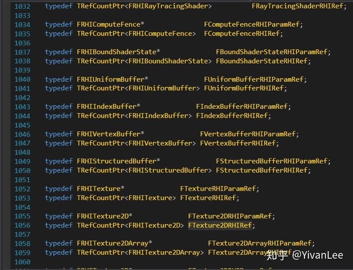

typedef就是为一个类型取一个新的名字，方便书写，其实类型还是那个类型只是换了个名字而已。和宏不同的是，是直接文本替换。所以可以直接对两个typedef的类型进行操作，因为它们本来就是一个东西。

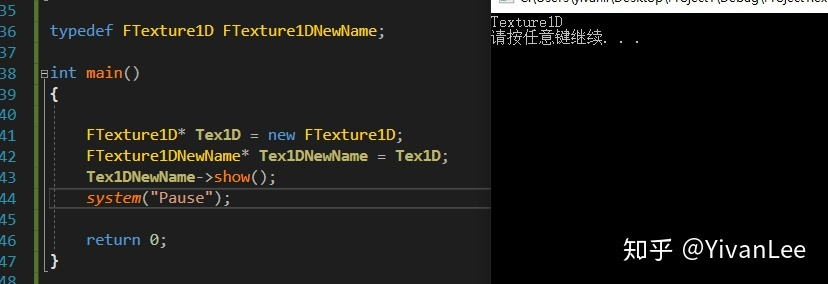

### TRefCountPtr

这是虚幻自己做的一个智能指针，实现代码也非常简单就百来行代码

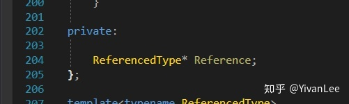

里面保存了一个Reference，是一个类型的指针，该类型由模板传入。如果把这个模板极简化大概是下面这个样子：

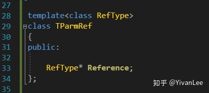

使用的时候类似这样，只不过我把智能指针的功能都去掉了，这里相当于给了个空壳。

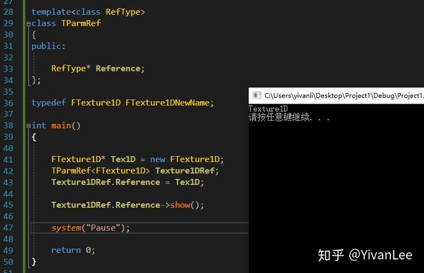

### 类型强转

既然有这么多类型就免不了类型转换。关于c++各种类型转换可以去看下面这篇文章，这些基础我就不赘述了。

[c++类型转换blog.csdn.net](https://link.zhihu.com/?target=https%3A//blog.csdn.net/shuzfan/article/details/77338366%2312-%E6%8C%87%E9%92%88%E7%B1%BB%E5%9E%8B%E8%BD%AC%E6%8D%A2)

这里我们来看下虚幻的一段代码

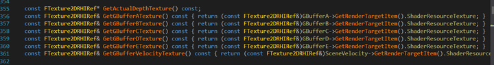

这部分代码等价于下面的代码：

```text
#include <iostream>
using namespace std;

class FTexture1D
{
public:

	FTexture1D(){}

	void show()
	{
		cout << "Texture1D"<< endl;
	}
};

class FTexture2D 
{
public:

	FTexture2D() {}

	void show()
	{
		cout << "Texture2D" <<endl;
	}
};

template<class RefType>
class TParmRef
{
public:

	RefType* Reference;
};

typedef FTexture1D FTexture1DNewName;

int main()
{
	
	TParmRef<FTexture1D> Ref1D;
	FTexture1D* Tex1DPtr = new FTexture1D;
	Ref1D.Reference = Tex1DPtr;

	TParmRef<FTexture2D> Ref2D = (const TParmRef<FTexture2D>&)Ref1D;

	Ref2D.Reference->show();

	system("Pause");

	return 0;
}
```

还可以再做一些变化

分别给FTexture2D和FTexture1D一个int data成员然后分别赋值

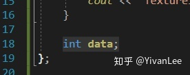

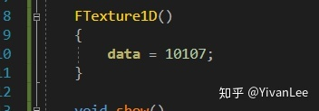

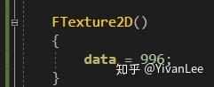

```text
int main()
{
	
	TParmRef<FTexture1D> Ref1D;
	FTexture1D* Tex1DPtr = new FTexture1D;
	Ref1D.Reference = Tex1DPtr;

	TParmRef<FTexture2D> Ref2D = (const TParmRef<FTexture2D>&)Ref1D;

	Ref2D.Reference->show();

	system("Pause");

	return 0;
}
```

最后输出的是10107

如果让FTexture2D的内存布局和FTexture1D不一样

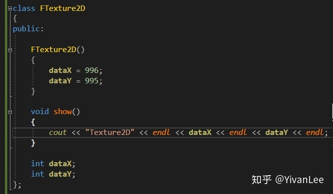

我们的操作相当于是把FTexture1D的数据拷贝到FTexture2D上，但是Ftexture1D没有DataY所以DataY输出是一个随机值

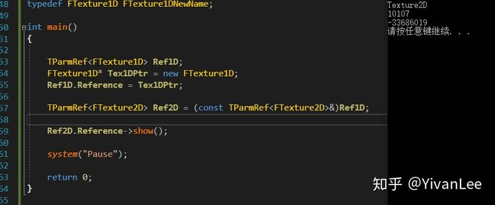

我们的这句代码

```text
TParmRef<FTexture2D> Ref2D = (const TParmRef<FTexture2D>&)Ref1D;
```

相当于是直接把内存数据拷过去（即使他们类型不同），如果内存布局相同，那么数据拷过去就对了，如果不同那么拷过去就是出错。

用这种方法我们能偷取一个类里的数据。

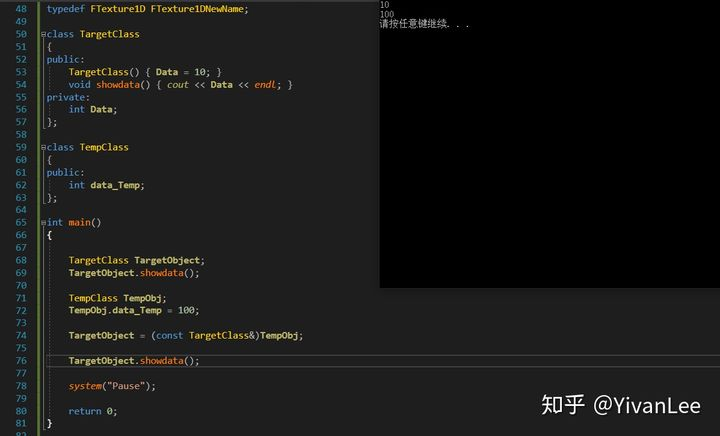

------

至此我们就能完全理解大部分Unreal渲染部分的代码类型相关的操作了。


## PingPongOperation

==乒乓缓冲==其实在各个效果中都非常常用，它主要是为了制作**渐变效果**。如果是在CPU中，因为数据都在内存里所以做这件事情非常简单，把上次循环计算的结果作为下次计算的输入即可。但是在GPU如果只有一个RT的情况下，一次Draw的结果无法带入到下次Draw。所以需要建两个Buffer，在第一次绘制的时候把BufferA作为RT，BufferB作为输入，Draw完第一次后，第一次的计算结果保存到了BufferA中，然后进行第二次Draw。把BufferB最为RT然后把上次Draw的结果BufferA作为输入然后Draw，以此来制作渐变。

除了双缓冲，我们还可以制作三缓冲四缓冲来让过渡更加平滑。

为了排除干扰，这里建个最简单的控制台应用程序。


这是最简单的Pingpong代码了。

然后我们来做复杂一点，在CPU上模拟一下GPU的行为（完全不用OpenGL或者DX，就纯C++）。我们实现一个Image类和Draw这个Image的方法


```text
#include "Image.h"
#include <fstream>
#include <iostream>

using namespace std;

void FImage::ClearImage(FLinerColor& ClearColor)
{
	cout << endl << "Begin clear image operation" << endl;

	int nx = Imagedata.size();
	int ny = Imagedata[0].size();

	for (int i = 0; i < nx; i++)
	{
		for (int j = 0; j < ny; j++)
		{
			Imagedata[i][j] = ClearColor.LinerColorToFColor();
		}
	}
}

void FImage::DrawImageData(const vector<FLinerColor>& ColorData)
{
	//       0
	//       ________________\x
	//       |               /
	//       |
	//       |
	//       |
	//       |
	//    Y \/                

	int nx = Imagedata.size();
	int ny = Imagedata[0].size();

	if (ColorData.size() != nx * ny)
	{
		cout << endl << "Draw Color data failed becuse the color data size not equal to image data size" << endl;
	}

	for (int j = 0; j < ny; j++)
	{
		for (int i = 0; i < ny; i++)
		{
			Imagedata[j][i] = ColorData[SizeY * j + i].LinerColorToFColor();
		}
	}
}

bool FImage::SaveImageToDesk(const string& Path)
{
	cout << endl << "begin save image to desk operation" << endl;

	bool bCreateImage = false;

	ofstream fout(Path + ImageName + ".ppm");
	fout << "P3\n" << SizeX << " " << SizeY << "\n255\n";

	for (int j = 0; j < SizeY; j++)
	{
		for (int i = 0; i < SizeX; i++)
		{
			FColor& color = Imagedata[i][j];

			fout << color.R << " " << color.G << " " << color.B << "\n";
		}
	}

	fout.close();

	cout << endl << "Save image successfully" << endl;

	return bCreateImage;
}
```

Core.h

```text
#pragma once

class FColor
{
public:

	FColor() :
		R(0),
		G(0),
		B(0)
	{}

	FColor(int r, int g, int b) :
		R(r),
		G(g),
		B(b)
	{}

	~FColor() {}

	int R;
	int G;
	int B;
};

class FLinerColor
{

public:

	FLinerColor(float r, float g, float b) :
		R(r),
		G(g),
		B(b)
	{}

	FLinerColor() :
		R(0),
		G(0),
		B(0)
	{}

	~FLinerColor() {}

	FColor LinerColorToFColor() const
	{
		FColor retcol;

		retcol.R = (int)(R * 255);
		retcol.G = (int)(G * 255);
		retcol.B = (int)(B * 255);

		return retcol;
	}

	float R;
	float G;
	float B;
};

class FVector
{
public:

	FVector(float x, float y, float z) :
		X(x),
		Y(y),
		Z(z)
	{}

	FVector() {}
	~FVector() {}

	FVector operator+ (const FVector& Ref)
	{
		FVector ret;
		ret.X = this->X + Ref.X;
		ret.Y = this->Y + Ref.Y;
		ret.Z = this->Z + Ref.Z;

		return ret;
	}

	FVector operator- (const FVector& Ref)
	{
		FVector ret;
		ret.X = this->X - Ref.X;
		ret.Y = this->Y - Ref.Y;
		ret.Z = this->Z - Ref.Z;

		return ret;
	}

	FVector operator* (const FVector& Ref)
	{
		FVector ret;
		ret.X = this->X * Ref.X;
		ret.Y = this->Y * Ref.Y;
		ret.Z = this->Z * Ref.Z;

		return ret;
	}

	FVector operator/ (const FVector& Ref)
	{
		FVector ret;
		ret.X = this->X / Ref.X;
		ret.Y = this->Y / Ref.Y;
		ret.Z = this->Z / Ref.Z;

		return ret;
	}

	void operator= (const FVector& Ref)
	{
		this->X = Ref.X;
		this->Y = Ref.Y;
		this->X = Ref.Z;
	}

	float X;
	float Y;
	float Z;
};

class FVector2D
{
public:

	FVector2D(float x, float y) :
		X(x),
		Y(y)
	{}

	FVector2D() {}
	~FVector2D() {}


	FVector2D operator+ (const FVector2D& Ref)
	{
		FVector2D ret;
		ret.X = this->X + Ref.X;
		ret.Y = this->Y + Ref.Y;

		return ret;
	}

	FVector2D operator- (const FVector2D& Ref)
	{
		FVector2D ret;
		ret.X = this->X - Ref.X;
		ret.Y = this->Y - Ref.Y;

		return ret;
	}

	FVector2D operator* (const FVector2D& Ref)
	{
		FVector2D ret;
		ret.X = this->X * Ref.X;
		ret.Y = this->Y * Ref.Y;

		return ret;
	}

	FVector2D operator/ (const FVector2D& Ref)
	{
		FVector2D ret;
		ret.X = this->X / Ref.X;
		ret.Y = this->Y / Ref.Y;

		return ret;
	}

	void operator= (const FVector2D& Ref)
	{
		this->X = Ref.X;
		this->Y = Ref.Y;
	}

	float X;
	float Y;
};
```

好了有了个简单的图片渲染器下面就开始在C++中模拟GPU的行为吧。首先我们在Main函数中敲入如下代码：


执行后拿PhotoShop打开桌面生成的文件，我们得到了一张图片。


下面的代码我声明了两个buffer，一个ImageA一个ImageB，每次循环把一个作为Input一个作为Output，每次循环的操作也非常简单就是让图片亮度下降为原来的百分之八十。

```text
#include <iostream>
#include <ctime>
#include <random>

#include "Core.h"
#include "Image.h"

using namespace std;

int main()
{
	FLinerColor ClearColor = FLinerColor(1, 1, 1);

	FImage* OutputImage = new FImage(64, 64, "OutputImage");
	FImage* BufferA = new FImage(64, 64, "ImageA");
	FImage* BufferB = new FImage(64, 64, "ImageB");

	BufferA->ClearImage(ClearColor);
	BufferB->ClearImage(ClearColor);
	vector<FImage*>ImagePingpongBuffer;
	ImagePingpongBuffer.push_back(BufferA);
	ImagePingpongBuffer.push_back(BufferB);

	int FrameIndex = 0;
	while (1)
	{
		int BufferIndexA = FrameIndex % 2;
		int BufferIndexB = (FrameIndex + 1) % 2;

		vector<vector<FColor>>& ImageTempData_Input = ImagePingpongBuffer[BufferIndexA]->Imagedata;
		vector<vector<FColor>>& ImageTempData_Output = ImagePingpongBuffer[BufferIndexB]->Imagedata;

		for (int i = 0; i < 64; i++)
		{
			for (int j = 0; j < 64; j++)
			{
				FColor& InputColor = ImageTempData_Input[i][j];
				FColor& OutputColor = ImageTempData_Output[i][j];

				OutputColor.R = InputColor.R * 0.8;
				OutputColor.G = InputColor.G * 0.8;
				OutputColor.B = InputColor.B * 0.8;
			}
		}

		OutputImage->Imagedata = ImageTempData_Output;
		OutputImage->ImageName += "1";
		OutputImage->SaveImageToDesk("C:/Users/yivanli/Desktop/");

		if (FrameIndex >= 10)
			break;
		FrameIndex++;
	}
	system("Pause");
	return 0;
}
```

我们在桌面可以得到一系列图片


在PS中打开把它们拼到一起可以看到


每一格都是我们乒乓Buffer的输出结果。

至此我们使用纯C++完成了一个最简单的乒乓缓冲。


## 从仿函数到std::function再到虚幻4Delegate

这几天研究了一下虚幻4的delegate，但是想要理解这个，还得从仿函数说起。仿函数的定义是：A Functor is a object which acts like a function. Basically, a class which defines operator().下面是一段代码例子：

```text
class MyFunctor
{
   public:
     int operator()(int x) { return x * 2;}
}
 
MyFunctor doubler;
int x = doubler(5);
```

The real advantage is that a functor can hold state.（这就是仿函数的最大好处）

```text
class Matcher
{
   int target;
   public:
     Matcher(int m) : target(m) {}
     bool operator()(int x) { return x == target;}
}
 
Matcher Is5(5);
 
if (Is5(n))    // same as if (n == 5)
{ ....}
```

不过上面这种玩法是很久以前的了，现在还可以使用std::function

```text
#include <iostream>
#include <string.h>
#include <functional>
using namespace std;
 
class MyCharacter
{
public:
	void BeHurt01(int hurtvalue)
	{
		cout << "hurt01" << hurtvalue << endl;
	}
 
	void BeHurt02(int hurtvalue)
	{
		cout << "hurt02" << hurtvalue << endl;
	}
};
 
class OtherCharacter
{
public:
 
	function<void(int)>ThisIsDelegate;
 
};
 
int main()
{
	MyCharacter mycha;
	OtherCharacter othecha;
 
	othecha.ThisIsDelegate = bind(&MyCharacter::BeHurt01, &mycha, placeholders::_1);
 
	othecha.ThisIsDelegate(19);
 
 
 
	return 0;
}
```

这样做的好处就是实现延迟调用，我先把方法绑上去，到我需要的时候再调用。这么说可能有点抽象。既然是做游戏的，可以举个例子来说明。比如我现在有个主角和一个怪物。主角打出去一拳后会对怪物造成伤害，但是这个伤害不是立刻起效的，因为需要完成动画播放，主角的出招的特效播放之后才会执行怪物受伤扣血的逻辑。这时候可以先在主角出招的时候探测周围的怪物然后给他们绑定上伤害函数。等怪物的动画播放完毕之后再判断是否要执行这个伤害操作。这个时候就需要上面那种办法了。

相对于函数指针，`std::function`能绑定c++里的所有可调用对象，`std::function`相当于帮我们封装了一个模板。

再来说虚幻的delegate。虚幻的delegate其实就是更高级的封装了。首先声明几个函数和代理，注意代理的格式和函数对应

头文件：

```text
/*Single-cast delegate declaration. No parameters*/
DECLARE_DELEGATE(MyDelegate)
 
/*Single-cast delegate declaration. One int32 parameter*/
DECLARE_DELEGATE_OneParam(MyIntDelegate,int32)
 
/*Multi-cast delegate declartion. One int32 parameter*/
DECLARE_MULTICAST_DELEGATE_OneParam(MyIntMulticastDelegate,int32)
 
/*Function with one int32 parameter*/
UFUNCTION()
void IntFunction(int32 x);
 
/*Function with one int32 parameter*/
UFUNCTION()
void SecondIntFunction(int32 x);
 
/*Function with one int32 parameter*/
UFUNCTION()
void ThirdIntFunction(int32 x);
 
/*Function with no parameters*/
UFUNCTION()
void SomeFunction();
```

源文件：

```text
void ADelegateActor::IntFunction(int32 x)
{
    GLog->Log("Output from IntFunction: " + FString::FromInt(x));
}
 
void ADelegateActor::SecondIntFunction(int32 x)
{
    GLog->Log("Output from SecondIntFunction: " + FString::FromInt(x*2));
}
 
void ADelegateActor::ThirdIntFunction(int32 x)
{
    //x to square
    float power = FMath::Pow(x, 2);
    GLog->Log("Third Int Function: "+FString::SanitizeFloat(power));
}
 
void ADelegateActor::SomeFunction()
{
    GLog->Log("Some function log");
}
```

在BeginPlay函数中做如下绑定：

```text
//Declaring a delegate of MyDelegate type
MyDelegate MyDel;
//Binding a UFUNCTION to MyDel - this will not call the function just yet.
MyDel.BindUFunction(this, FName("SomeFunction"));
 
//Calling the bound function of the delegate
MyDel.Execute();
 
//Declaring a delegate of MyIntDelegate type
MyIntDelegate IntDelegate;
 
//Binding two UFUNCTIONs to IntDelegate - this will not call any function just yet
IntDelegate.BindUFunction(this, FName("IntFunction"));
IntDelegate.BindUFunction(this, FName("SecondIntFunction"));
 
//Since the IntDelegate is a single-cast delegate it will only contain up to one function
//In this case, the IntDelegate contains the last bound function
IntDelegate.Execute(50);
 
//Declaring a delegate of MyIntMulticastDelegate type
MyIntMulticastDelegate Del;
 
//Adding three UFUNCTIONs to the delegate - this will not call any function just yet
Del.AddUFunction(this, FName("IntFunction"));
Del.AddUFunction(this, FName("SecondIntFunction"));
Del.AddUFunction(this, FName("ThirdIntFunction"));
```

上面的代码中详细罗列了UFunction函数绑定代理的各个方法，下面来搞一个例子吧：

（1）首先我们建立一个第三人称c++模板工程


然后打开代码，在MyProjectCharacter.h中声明一个代理，两个与之匹配的函数


在构造函数中将函数和代理绑定


在MoveForward函数里执行这个代理


完成绑定工作后我们到gamemode类里做如下工作


至此我们就可以在游戏执行后，按下w键之后的log里看到如下的输出


## Create CustomModule和ShaderPath

总结一下在UE里创建多个模块的方法。模块化编程有一定好处，是否给自己的项目分模块，具体还是看个人怎么设计。虚幻4使用多模块，可以加快编译速度，减少耦合。UE中我们需要创建模块分两种，一种是项目模块，一种是插件模块。


**【1】Create your own game project module and ShaderSourceDirectoryMapping**


如果想新建一个模块，我们需要：

【1】新建一个模块的文件夹

【2】新建对应模块的.Build.cs

【3】新建一个模块的h文件和cpp文件

下面我就以一个叫GameFrameWork的模块为例，我先在项目的source目录下建一个**GameFrameWork**文件夹


然后再在**GameFrameWork**文件夹下建如下图所示的三个文件


在GameFrameWork.h中键入如下代码：


在GameFrameWork.cpp中用宏声明这个模块


在GameFrameWork.build.cs种为UBT创建配置


在项目的.uproject文件中加入我们的==GameFrameWork==模块


这些配置里有很多选项,什么以来其它模块的名字,是EditorTime还是Runtime,还可以设置加载顺序,平台白名单,黑名单等等.

然后还需要在YourProject.Target.cs和YourProjectEditor.Target.cs种加入自己模块如下图所示：


最后右键Uproject重新Generate一下项目


Reload VS的工程后就可以在项目里看到自己的模块了


点F5成功启动

在Project的自定义模块里加入自定义Shader，可以直接给ShaderMapping里加入路径即可：

```cpp
//...
#include "Modules/ModuleManager.h"
#include "Misc/Paths.h"
//...

void FGraphicModule::StartupModule()
{
	// This code will execute after your module is loaded into memory; the exact timing is specified in the .uplugin file per-module
	AddShaderSourceDirectoryMapping(TEXT("/Project"), FPaths::ProjectDir());
}
//...
```


**【2】Create your own plugin module and ShaderSourceDirectoryMapping**


插件模块就要比项目模块的创建简单多了

首先先创建一个插件


然后插件会自己有一个模块ArtTools,然后创建另一个模块ArtCodeHelper,创建如下图的目录和文件:


分别键入如下代码


然后在插件的.uplugin种加入对应的模块配置


然后重新Genrate一下项目即可

在插件里加入ShaderPathMapping

```cpp
void FGraphicOPModule::StartupModule()
{
	// This code will execute after your module is loaded into memory; the exact timing is specified in the .uplugin file per-module
	FString PluginShaderDir = FPaths::Combine(IPluginManager::Get().FindPlugin(TEXT("ArtTools"))->GetBaseDir(), TEXT("Shaders"));
	AddShaderSourceDirectoryMapping(TEXT("/ArtToolsShaderDir"), PluginShaderDir);
}
```


**【3】Using plugin shader path in the material editor**


Shaderpath虚拟路径不仅仅在代码里编译我们自己的shader很有用，它还能使用在材质编辑器里。下面需要使用4.26以上的引擎的CustomNode

首先还是建一个插件然后在模块的cs里配置一下


然后到模块的StartModule里增加对应的路径，一切都和插件里加入ShaderPath的方式一样


做好这些以后在插件的Shaders文件目录下增加我们的shader


然后启动项目建一个材质


4.26引擎允许我们增加我们自己的shader文件了

材质编译出来的代码如下：


这样我们可以在材质编辑器里写代码了！