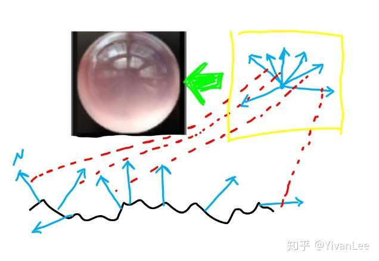

## 自定义光照模型


读过我前面一些博客的朋友对虚幻4的渲染流程有了一些大致的了解之后，那么我们现在可以开始着手开始修改虚幻4引擎了·。我们有些时候需要实现某些效果，就需要动手自己改引擎了。这是customnode或者是纯material无法做到的。有些人可能就要反驳了，“我纯用材质编辑器也能实现卡通材质啊”。但是无法忽略的一点是：在材质编辑器里制作的卡通材质无法接受光影。这时候有些人就想出了骚操作，用蓝图自己实现一个光源，渲染一张depthmap的RT然后传到material里去。这种方法其实过于麻烦，这相当于你抛弃掉了虚幻4的光照系统。这是得不偿失的。

阅读下面的内容你需要具备一下知识：

（1）C++

（2）对虚幻引擎及其渲染模块有一定了解，如果不了解可以先读读我之前的一些文章。

（3）HLSL

那么下面就以这个卡通材质为例，让我们一步步来定制自己的渲染管线，来看一下虚幻的GBuffer的数据有哪些吧：


首先你得下载好一个源码版引擎，我使用的是4.19版引擎。也许在未来引擎会做更新，单应该变化不大。然后打开如下的文件：


首先找到EngineTypes.h，找到EMaterialSamplerType这个枚举。这个枚举将会控制材质编辑器里的那个下展栏。然后我们加入我们的枚举成员MSM_MyShadingModel UMETA(DisplayName="MyShadingModel")编译引擎后你将会看到如下的样子：


你将能在材质编辑器里找到自己的ShadingModel材质的枚举类型。


这一步只是让编辑器有了一个切换枚举，并不会让材质编辑的UI发生什么变化，比如material的节点上多出几个pin，禁用几个pin或者别的什么变化。现在我们需要激活几个pin接口，让我们能把变量“连上去”


接下来找到Material.cpp 我们找到bool UMaterial::IsPropertyActive(EMaterialProperty InProperty)这个函数。然后做如下图所示修改


这样就能让材质编辑器在我们切换shadingmodel枚举的时候，实时增加一个CustomData的pin接口给我们用啦。


有了这个东西之后，我们还要让材质编辑器在切换瞬间告诉我们的shader：“我们应该用我们自定义的shader啦”。如何告诉shader应该跑我们MSM_MyShadingModel的shading分支逻辑呢？答案是使用宏。

打开MaterialShared.cpp，找到FMaterial::SetupMaterialEnvironment(

EShaderPlatform Platform,

const FUniformExpressionSet& InUniformExpressionSet,

FShaderCompilerEnvironment& OutEnvironment

)

这个函数我们做如下修改：添加如下代码

case MSM_MyShadingModel: OutEnvironment.SetDefine(TEXT("MATERIAL_SHADINGMODEL_MyShadingModel"), TEXT("1")); break;


这个字符串会被压进shader里，成为宏。

做完这些我们就可以编译引擎了。可能会等待半小时左右。

编译好引擎之后，我们开始对shader层进行修改。

首先打开DefferedShadingCommon.ush文件，找到下图所示区域并做如下修改：在#define SHADINGMODELID_EYE 9后面添加#define SHADINGMODELID_MyShadingModel 10 并且把SHADINGMODELID_NUM后的数字改为11


这个宏将作为我们shader跑哪根线路的判断依据。还是在这个文件里，翻到DefferedShadingCommon.ush的最底部，找到float3 GetShadingModelColor(uint ShadingModelID)函数，在case SHADINGMODELID_EYE: return float3(0.3f, 1.0f, 1.0f);后面添加 case SHADINGMODELID_MyShadingModel: return float3(0.4f, 0.0f, 0.8f);//紫色

如下图所示：


做完这个修改以后，我们就能在编辑器的ShadingModle预览模式下看到如下效果：


你能看到我们定义的颜色已经能在debug模式下看到了。说明一切顺利！！

下一步来到ShadingModelsMaterial.ush 找到void SetGBufferForShadingModel函数。我们在这个函数的最后面做如下修改：


这里的MATERIAL_SHADINGMODEL_MyShadingModel是从c++层那里塞进来的，然后把这个ShadingModle的ID保存到GBuffer里作为后面管线使用的数据。这一步是给DefferedShadingCommon.ush使用的。

完成之后我们需要打开BassPassCommon.ush，打开CustomData的写入权限


这一步的目的是当我们的shadingmode为MyShadingModel的时候，将CustomData的信息写入GBuffer。


然后来打DefferdLightingCommon.ush 找到GetDynamicLighting函数，我们对这个函数做如下修改：


当然做了这个修改之后我们还需要对SurfaceShading函数再做修改：

打开ShadingModels.ush做如下修改：


完成这一步之后，我们还要对透明模式下的代码进行修改。打开BasePassPixelShader做如下修改：

完成这一步之后，我们还要对透明模式下的代码进行修改。打开BasePassPixelShader做如下修改：


那么就完成了对引擎shader的定制啦！


引擎的定制对项目还是很重要的，官方其实考虑更多的是通用和兼容，但是这往往就导致一点：用虚幻4做出来的游戏都长得差不多。不知道大家有没有发现这点。其实我对这点感受还是很明显的，现在的demo或者视频瞟一眼就知道是不是虚幻做的，因为大家的shader效果是一样的。这就会导致大量的同质化作品的出现，无法使你的项目脱颖而出。比如超龙珠斗士Z，那么精美的卡通渲染，肯定对引擎进行了大量的定制。

有没有发现，我们自己激活的哪个CustomData0 这个接口的名字在你切换成Eye的时候，它会变成其他名字。鉴于强烈的强迫症，看这个CustomData0真的很不舒服，所以我们就来自己定义一下材质输入接口的名字吧：


我们在Engine/Source/Editor/UnrealEd/Private/MaterialGraph.cpp的529行左右找到GetCustomDataPinName函数，然后做如下修改


编译后你将会看到：


总得来说自己在延迟管线建个shadingmodle我们要做的事情如下：

（1）修改材质编辑器，不管是修改ShadingModel的Enum还是材质编辑器输出接口都是为了在材质编辑器层加入我们的光照模型和所需要的资源。

（2）在SetupMaterialEnvironment函数中把Shad ing ModelID设置进去，在Shader层也要对应修改让BasePass的时候把MaterialID渲染进Buffer中供LightingPass使用

（3）增加LightingPass的BRDF处理函数。


## 布料,丝绸纱皮革棉

现在的游戏对质感要求越来越高（我估计是硬件越来越好，可编程管线越来越来越完善）。游戏的画面已经越来越接近影视级，软光栅能被玩到这种水平也是令人惊叹。随着实时光线追踪追踪时代就要到来，这种差距只会越来越小，很多影视的制作思路和方法会被游戏借鉴甚至采用。

话题转回来，我们现在游戏仍然在大规模使用软光栅的办法，所以想要模拟出尽可能真实的游戏世界，我们还是需要很多trick。下面就一起来探索一下游戏世界中布料衣物的shading方法。本人只是个小技术美术，如有错误还请各路大神斧正。

**FORWARD DECLARATION：**

文章内容过于浅显，如有错误还请斧正。

**【第一小节：棉&布】**

还是老规矩，先上效果


游戏里的这种短毛绒的感觉是有一套开发解决方案的，现在大致有四种方式来制作这种东西。**第一种是**：法线贴图+特殊高光着色+特殊AO。这种方式非常适合于手游，而且能出比较好的效果

手游巨省性能毛布

上面这个十分小的图就是这种方式做出来的，很抱歉这里我不能截完整衣服的效果图，但是就看这一小块应该能领悟到我说的意思了吧。因为手游的性能瓶颈，我们想要制造毛绒感只能在其他地方下功夫，高光计算部分就是个不错的地方。

**第二种是**：置换+法线+特殊高光着色。这个就是我最上面那个棉的制作方式。但是由于使用到了置换，所以性能嘛。。。。。不过端游是可以用的哈！

**第三种是**：视差+法线+特殊高光着色+特殊AO。这个效果就是我下面的那个毛毯。AO使用的是三维AO

**第四种是**：第四种就是Ray Casting的方式了嘛，这种方式巨费无比但是效果很好。


**【第二小节：丝绸&纱】**


丝绸和纱的做法目前有两种方式：

**第一种**：半透+Tilling+特殊高光计算。这种方式效果其实比较好，但是就是透明乱序会令人十分头疼，解决办法就是我们自己再计算一次剔除。

剔除有几个办法，第一种是shader里强制剔除，还有一种是再渲染一个pass来剔除。这类文章很多啦我这里就不多说了。


多渲染一个pass来剔除（上面那个水印是我CSDN博客地址，详细做法可以找这个地址去看我的博客）

shader里计算剔除

**第二种**：使用AlphaTest来做透明+特殊高光计算+特殊Diffuse计算，但是这种办法有个问题，就是边缘锐利，我们可以用alpha dither的方式把锐利的边缘戳孔来解决，这种方式就不会有透明乱序的问题，我的第一幅图那个纱就是使用这种办法制作的。因为纱还有各向异性，所以需要使用各向异性高光。


最后就是Diffuse计算了。布料的Diffuse会有一点奇怪的地方，其实布料不应该使用默认PBR的那套diffuse计算方式的，所以虚幻提供了cloth特殊光照模型，请用那个光照模型来制作布料。那布料的diffuse和普通PBR的diffuse到底有什么区别呢。请看下面的图


可以看到，纺织物的漫反射方式和普通物体的区别还是很大的。最终宏观表现就是，纺织物的暗部不会很黑。

**【第三小节：皮革】**

其实皮革是所有布料里面最好做的，使用标准PBR模型就能轻易制作出来。皮革是介于金属和非金属之间的可以理解为半导体，主要使用细节法线tilling来使其与塑料产生区别。

上面说了这么多理论，其实并没有什么用哈。很多专栏或者博客也许会在上面就戛然而止然后发表文章了，然而真的并没有什么用。本专栏一向是本着一定要亲手做出来才行的宗旨。所以下面就来实现它们吧：

**首先先来说说布料**：

虚幻非常贴心地已经帮我们实现了布料材质模型了，其实如果没有，我们使用前几章介绍的知识也能自己做一个这种光照模型，当然它这里有了的话我们就直接用了。


我这里简单做了个材质球，这个其实就已经满足了我们对布料漫反射的要求了，再来上一次布料应该的漫反射模型：


所以这里就不难理解为啥会有一个fuzzy color了。我们再来看看这个光照模型的代码


是不是一切就很清晰了呢，其实就是想模拟布料的那种特殊的漫反射。

首先光照模型对了之后，后面再加上法线再加上细节tilling，对布料效果的模拟还是十分棒的。

**其次就是丝绸了**

丝绸的尴尬点就在于如果你使用半透明的混合方式来制作，我们不得不解决透明乱序。

透明乱序的解决方法：


在shader种比较深度然后来手动剔除。

水印是我CSDN博客，可以去我原博客看我的这篇文章


但是这种手动剔除其实是剔除不干净的，仔细看手指的地方。再渲染一个pass的方式能完美解决但是消耗感觉过高了。所以干脆使用其他办法。

虚幻官方的头发给了我们一个新思路，使用alphatest然后再锐利的边缘扎孔。


感觉这种方式也挺不错呢，虽然渐变过渡永远比不上alpha blend，这个就看自己的权衡了吧。


## 各向异性材质&玻璃材质

各向异性材质


玻璃材质


材质编辑器篇的很多效果都非常简单，可以不改源码就能快速实现了。

### 

**各向异性：**

我们之前的高光会使用dot（N，H）来计算，不管你是PBR还是什么计算模型。各向异性的话是使用切线和H来计算，而不是N和H来计算。


**玻璃材质：**

其实玻璃材质可以分为以下几部分：

（1）漫反射

玻璃可以认为它没有漫反射，或者非常微弱。

（2）透射

因为玻璃是透明的，后面的光从玻璃里面透射出来会把玻璃本身的颜色透射出来。

（3）折射

光穿过玻璃会产生偏移

（4）反射

其中漫反射和反射部分的可以用PBR的计算方式来解决，下面来解决折射。因为我们使用的是光栅化渲染所以我们如果用光栅化思想来理解折射的话，一句话概括为（对背景图扰动）。

于是我们可以得到下面的材质：


## Modify RenderPipeline in ME

As we all know, we can't modify the main render pipeline of unreal engine 4。We can only edit our shader in the material editor. If we want to do something special which material editor can't meet our needs, Using c++ to modify the engine is currently the only viable method. My previous article has detailed implementation steps for this method.

[小IVan：虚幻4渲染编程(材质编辑器篇)【第二卷：自定义光照模型】](https://zhuanlan.zhihu.com/p/36840778)

However, Using c++ to modify the engine is not a good way. Because This method is very inconvenient. Below I will introduce a way to modify the rendering pipeline directly in the material editor.

Let's see the results first.


The code shown above is relatively simple, but the goal of modifying the rendering pipeline directly in the material editor has been achieved.

First we need to modify the source code of CustomNode。


Compile the engine, then open the material editor to add a CustomNode and you will see the following result.


If you write a macro to def, the macro will be pushed into the shader, and the rendering pipeline will get the macros.


Then we can write our code into the engine shader, which can be easily enabled using the material editor.


## BillBoardMaterialForInstance

Unity和UE两大商业引擎已经有一定历史了，然而它们居然没有一套完整的Billboard解决方案，这让我感到非常神奇！！！所以打算写下完整的Billboard方案。

图1

***本来是个很简单的事情!!!\*** 就是让面片时时刻刻面朝摄像机，但是因为引擎里各种各样的限制和因素，就把这件很简单的事情弄得很复杂。根据各种不同的情况吧Billboard的实现分为以下几类。

（1）在CPU里计算，在图元汇编阶段或者GamePlay层设置面片朝向。

（2）在Shader中计算其朝向。

（3）在使用DrawInstance的情况下在Shader中计算朝向。可以绘制大量Billboard。

下面就直接来讲目前最完善的的一种BillBoard Shader for Instancing。

------

### main content：

**【Billboard material for Instanced static mesh in Unreal Engine 4】**

首先需要制作一个面片，这个面片的LocalSpace首先就要正确。X轴与其垂直。

图2

导入引擎和max保持一致。

图3

Billboard的面向摄像机这个计算其实在哪里做都可以，但是因为引擎的限制有些时候就不能随心所欲了。比如Unreal，我们在材质编辑器能触碰到VertexShader的地方就只有PositionOffset


打开源码，会发现PositionOffset和WorldPosition是相加关系


所以现在只能在WorldSpace计算BillBoard了。

图4


InstanceLocalToWorld代码，这里可以让引擎底层把Instance的Transform传上来。

```text
#if USE_INSTANCING
     return mul(InputVector,(MaterialFloat3x3)Parameters.InstanceLocalToWorld);
 #else 
     return mul(InputVector,GetLocalToWorld3x3());
 #endif
```

首先找到Instance的x，y，z在世界空间的朝向。如图4的黑色xyz坐标系所示。然后把顶点的世界空间坐标和轴点相减得到相对于轴点的向量


然后把这些向量映射到xyz轴上，得到点ABCD


然后根据摄像机方向，转动XYZ使其于摄像机方向垂直得到x'y'z'


然后把ABCD映射到X'Y'Z'得到A'B'C'd'


然后把相对于Pivot的A'B'C'd'变换到相对于世界原点坐标


最后减去世界空间的绝对位置，和Shader底层的+=相抵消


所以这里最后进入投影变换的顶点的坐标是原模型顶点的世界空间坐标向摄像机方向偏移后的顶点世界空间坐标。

于是就可以得到Instance的Billboard了。


Instance的billboard允许我们在场景里画**几万个**。**这个方案对非Instance也同样适用。**


## 自定义材质节点:star:

大部分情况下我们可以使用CustomNode或者Material Function完成对材质节点的封装，方便开发各种上层功能，但是有时候我们需要让材质编辑器和引擎底层强耦合的时候或者开发了什么新的材质编辑器功能的时候，我们就需要开发拓展材质编辑器的节点了。

最直观的，打开虚幻编辑器，我们随便连一个vector3到basecolor上，点编译按钮，我们就得到了一个材质。但是千万不要以为我们眼前看到东西就是shader。从本质上来说，我们眼前的材质节点只是包含一串HLSL代码的容器。

你可以打开引擎代码，找到如下目录（Source/Runtime/Engine/Classes/Material）就能看到引擎里所有材质节点的代码。找到HLSLMaterialTranslator，就会发现，这些节点里面保存的FString，里面加的就是HLSL代码。当我们在材质编辑器里面把线练好后，点下编译，材质节点就会依次执行，把里面的HLSl代码字符串抽出来，加到ShaderMap里，最后就得到了所谓的shader（简单粗暴）。下面就是Floor的HLSLTranslator里面的翻译代码，把节点翻译成HLSL代码

```text
virtual int32 Floor(int32 X) override
	{
		if(X == INDEX_NONE)
		{
			return INDEX_NONE;
		}
 
		if(GetParameterUniformExpression(X))
		{
			return AddUniformExpression(new FMaterialUniformExpressionFloor(GetParameterUniformExpression(X)),GetParameterType(X),TEXT("floor(%s)"),*GetParameterCode(X));
		}
		else
		{
			return AddCodeChunk(GetParameterType(X),TEXT("floor(%s)"),*GetParameterCode(X));
		}
	}
```

整理一下执行顺序。首先我们在编辑器连好材质，这些材质节点都会有调用HLSLTranslator的与这个材质节点相称的HLSLTranslator的代码，比如floor节点就会调用HLSLTranslator里的“virtual int32 Floor(int32 X)”这个函数。HLSLTranslator再把这个函数里的HLSL代码字符串加到Shadermap里（加进去还有其他函数调用，并不是HLSLTRaslator直接做的这个操作，不过它是这个操作的发起者。）完成了shadermap的事情之后就是交给引擎的其他类去编译顶点着色器啦，像素着色器啦。。。后面的过程不作讨论了。大概的过程就是这样。

下面我就实现了一个自己的材质节点。首先创建一个MyMaterialExpression类，派生自UMaterialExpression。

下面是.h文件

```c++
#pragma once
 
#include "CoreMinimal.h"
#include "UObject/ObjectMacros.h"
#include "MaterialExpressionIO.h"
#include "Materials/MaterialExpression.h"
#include "MyMaterialExpression.generated.h"
 
/**
 * 
 */
UCLASS(MinimalAPI, collapsecategories, hidecategories = Object)
class UMyMaterialExpression : public UMaterialExpression
{
	
	GENERATED_UCLASS_BODY()
 
	//材质节点的输入
	UPROPERTY()
	FExpressionInput Input;
 
 
	
#if WITH_EDITOR
	//调用HLSLTranlator的函数来翻译HLSL代码
	virtual int32 Compile(class FMaterialCompiler* Compiler, int32 OutputIndex) override;
	//材质节点的名字
	virtual void GetCaption(TArray<FString>& OutCaptions) const override;
#endif
	
};
```

Compile函数会调用HLSL翻译代码，把FString翻译成HLSL代码并把它赛道shadermap里。getCaption代码是这个材质节点在材质编辑器里的名字。FExpressionInput是材质节点的输入接口，可以定义多个入口，数量随意。

下面是.cpp

```c++
#include "MyMaterialExpression.h"
#include "EditorSupportDelegates.h"
#include "MaterialCompiler.h"
#if WITH_EDITOR
#include "MaterialGraph/MaterialGraphNode_Comment.h"
#include "MaterialGraph/MaterialGraphNode.h"
#include "Framework/Notifications/NotificationManager.h"
#include "Widgets/Notifications/SNotificationList.h"
#endif //WITH_EDITOR
#define LOCTEXT_NAMESPACE "MaterialExpression"
UMyMaterialExpression::UMyMaterialExpression(const FObjectInitializer& ObjectInitializer)
	: Super(ObjectInitializer)
{
	// Structure to hold one-time initialization
	struct FConstructorStatics
	{
		FText NAME_Math;
		FConstructorStatics()
			: NAME_Math(LOCTEXT("MyMaterial", "MyMaterial"))
		{
		}
	};
	static FConstructorStatics ConstructorStatics;
 
#if WITH_EDITORONLY_DATA
	MenuCategories.Add(ConstructorStatics.NAME_Math);
#endif
}
 
 
#if WITH_EDITOR
int32 UMyMaterialExpression::Compile(FMaterialCompiler* Compiler, int32 OutputIndex)
{
	int32 Result = INDEX_NONE;
 
	if (!Input.GetTracedInput().Expression)
	{
		// 当输入口没有连线时报错，这个输出可以在材质编辑器里看到
		Result = Compiler->Errorf(TEXT("哇，报错了耶！！你的节点没连好吧！！！"));
	}
	else
	{
		//我只做了一个简单的返回一个颜色
		Result = Compiler->Constant3(0, 1, 1);
	}
 
	return Result;
}
 
void UMyMaterialExpression::GetCaption(TArray<FString>& OutCaptions) const
{
	OutCaptions.Add(TEXT("MyMaterialExpression"));
}
#endif // WITH_EDITOR
```

下面是效果图：报错信息是可以自己定义的，虽然不建议敲中文进代码里，这里只是做个示范。


大功告成啦。

我们可以再把节点做复杂一点，不知道有没有人发现虚幻的材质编辑器没有很多个接口的switch，我们可以自己做一个

.h

```c++
#pragma once
 
#include "CoreMinimal.h"
#include "UObject/ObjectMacros.h"
#include "MaterialExpressionIO.h"
#include "Materials/MaterialExpression.h"
#include "MyMaterialExpression.generated.h"
 
/**
 * 
 */
UCLASS(MinimalAPI, collapsecategories, hidecategories = Object)
class UMyMaterialExpression : public UMaterialExpression
{
	
	GENERATED_UCLASS_BODY()
 
	//材质节点的输入
	UPROPERTY()
	FExpressionInput Input1;
	UPROPERTY()
	FExpressionInput Input2;
	UPROPERTY()
	FExpressionInput Input3;
	UPROPERTY()
	FExpressionInput Input4;
	UPROPERTY()
	FExpressionInput Input5;
	
	UPROPERTY(EditAnywhere, Category = "MyMaterial")
	float myIndex;
 
#if WITH_EDITOR
	//调用HLSLTranlator的函数来翻译HLSL代码
	virtual int32 Compile(class FMaterialCompiler* Compiler, int32 OutputIndex) override;
	//材质节点的名字
	virtual void GetCaption(TArray<FString>& OutCaptions) const override;
#endif
	
};
```

cpp

```c++
#include "MyMaterialExpression.h"
#include "EditorSupportDelegates.h"
#include "MaterialCompiler.h"
#if WITH_EDITOR
#include "MaterialGraph/MaterialGraphNode_Comment.h"
#include "MaterialGraph/MaterialGraphNode.h"
#include "Framework/Notifications/NotificationManager.h"
#include "Widgets/Notifications/SNotificationList.h"
#endif //WITH_EDITOR
#define LOCTEXT_NAMESPACE "MaterialExpression"
UMyMaterialExpression::UMyMaterialExpression(const FObjectInitializer& ObjectInitializer)
	: Super(ObjectInitializer)
{
	// Structure to hold one-time initialization
	struct FConstructorStatics
	{
		FText NAME_Math;
		FConstructorStatics()
			: NAME_Math(LOCTEXT("MyMaterial", "MyMaterial"))
		{
		}
	};
	static FConstructorStatics ConstructorStatics;
 
	myIndex = 0.0f;
 
#if WITH_EDITORONLY_DATA
	MenuCategories.Add(ConstructorStatics.NAME_Math);
#endif
}
 
 
#if WITH_EDITOR
int32 UMyMaterialExpression::Compile(FMaterialCompiler* Compiler, int32 OutputIndex)
{
	int32 Result = INDEX_NONE;
 
	if (!Input1.GetTracedInput().Expression)
	{
		// 当输入口没有连线时报错，这个输出可以在材质编辑器里看到
		return Compiler->Errorf(TEXT("哇，报错了耶！！你的节点第一根线没连好！！！"));
	}
	if (!Input2.GetTracedInput().Expression)
	{
		// 当输入口没有连线时报错，这个输出可以在材质编辑器里看到
		return Compiler->Errorf(TEXT("哇，报错了耶！！你的节点第二根线没连好！！！"));
	}
	if (!Input3.GetTracedInput().Expression)
	{
		// 当输入口没有连线时报错，这个输出可以在材质编辑器里看到
		return Compiler->Errorf(TEXT("哇，报错了耶！！你的节点第三根线没连好！！！"));
	}
	if (!Input4.GetTracedInput().Expression)
	{
		// 当输入口没有连线时报错，这个输出可以在材质编辑器里看到
		return Compiler->Errorf(TEXT("哇，报错了耶！！你的节点第四根线没连好！！！"));
	}
	if (!Input5.GetTracedInput().Expression)
	{
		// 当输入口没有连线时报错，这个输出可以在材质编辑器里看到
		return Compiler->Errorf(TEXT("哇，报错了耶！！你的节点第五根线没连好！！！"));
	}
	
	int32 newIndex = myIndex;
 
	if (newIndex>5||newIndex<0)
	{
		return Compiler->Errorf(TEXT("index指数不对，应该在0到5之间"));
	}
 
	switch (newIndex)
	{
	case 0:
		return Input1.Compile(Compiler);
	case 1:
		return Input2.Compile(Compiler);
	case 2:
		return Input3.Compile(Compiler);
	case 3:
		return Input4.Compile(Compiler);
	case 4:
		return Input5.Compile(Compiler);
	}
	
	return Result;
}
 
void UMyMaterialExpression::GetCaption(TArray<FString>& OutCaptions) const
{
	OutCaptions.Add(TEXT("MyMaterialExpression"));
}
```

最后的结果：


## MaterialCapture:star:

虽然现在大家都是张口闭口PBR了，对MatCap这种小儿科不怎么看得起，但是制作很多效果的时候，用MatCap依然是一个很不错的解决方案的。

MatCap原理非常简单，我们使用法线在摄像机的方向投射的二维平面进行采样。




可以看到原理非常简单但是很实用。


------

**MAIN CONTENT：**

**MatCap In Unreal engine 4**


**MatCap In Unity**

```c++
Shader "Unlit/S_MaterialCapture"
{
	Properties
	{
		_MatCapTexure ("MaterialCaptureTexture", 2D) = "white" {}
		_Normaltexture ("Normaltexture", 2D) = "bump" {}
	}
	SubShader
	{
		Tags { "RenderType"="Opaque" }
		LOD 100

		Pass
		{
			CGPROGRAM
			#pragma vertex vert
			#pragma fragment frag
			// make fog work
			#pragma multi_compile_fog
			
			#include "UnityCG.cginc"

			struct appdata
			{
				float4 vertex : POSITION;
				float2 uv : TEXCOORD0;
				float4 tangent : TANGENT;
				float4 normal : NORMAL;
			};

			struct v2f
			{
				float2 uv : TEXCOORD0;
				float3 tangent : TEXCOORD2;
				float3 normal : TEXCOORD3;
				float3 binormal : TEXCOORD4;
				UNITY_FOG_COORDS(1)
				float4 vertex : SV_POSITION;
			};

			sampler2D _MatCapTexure;
			float4 _MatCapTexure_ST;
			sampler2D _Normaltexture;
			float4 _Normaltexture_ST;
			
			v2f vert (appdata v)
			{
				v2f o;
				o.vertex = UnityObjectToClipPos(v.vertex);
				o.uv = TRANSFORM_TEX(v.uv, _MatCapTexure);
				o.tangent = UnityObjectToWorldDir(v.tangent);
				o.normal = UnityObjectToWorldDir(v.normal);
				o.binormal = cross(v.tangent, v.normal);
				UNITY_TRANSFER_FOG(o,o.vertex);
				return o;
			}
			
			fixed4 frag (v2f i) : SV_Target
			{
				half4 finalcolor = half4(1, 1, 1, 1);
				
				// sample the texture
				float3 texnorm = UnpackNormal(tex2D(_Normaltexture, i.uv));
				float3x3 transmatrix = float3x3(i.tangent, i.binormal, i.normal);

				float3 texnorm_ws = normalize(mul(texnorm, transmatrix));
				float3 texnorm_vs = mul(UNITY_MATRIX_V, texnorm_ws);

				
				float3 vv = float3(0, 0, 1);
				float3 rv = vv - (dot(vv, texnorm_vs) * -2 * texnorm_vs);
				float2 matcapuv = rv.xy / (sqrt((rv.x * rv.x) + (rv.y * rv.y) + (rv.z + 1) * (rv.z + 1)) * 0.75) + 0.5;

				fixed4 MatCapColor = tex2D(_MatCapTexure, matcapuv);

				finalcolor.rgb = MatCapColor;

				// apply fog
				UNITY_APPLY_FOG(i.fogCoord, finalcolor);
				return finalcolor;
			}
			ENDCG
		}
	}
}
```


[参考博客](https://blog.csdn.net/poem_qianmo/article/details/55803629)


## 在像素着色器中重建模型数据

**【1】对像素数据进行切割**

模型像素数据重建这个事情可以分为很多方法，对像素数据进行切割就是最基础的方法。对像素切割其实非常简单，就是控制是否clip掉像素，所以使用mask模式控制OpacityMask就能控制clip的阈值从而对模型进行切割。

下面是使用一个球形的SDF函数进行切割。


之前做Ray marching的时候就有接触过SDF，因此我们可以组合多个球形场来切割，不仅仅是一个。

平面切割：


其实还有很多种切割方式，我这里只抛砖引玉。下面演示下在Unreal中组合切割模型的SDF

效果如下：


材质节点：


CustomNode的代码：

```text
#define LEN(X) length(SphereArray[X].xyz-WorldPos)-SphereArray[X].w

float CalcSDF(in float4 LocA, in float4 LocB, in float4 LocC, in float4 LocD, in float3 WorldPos)
{
    float Ret = 0;

    float4 SphereArray[4] = { LocA, LocB, LocC, LocD };

    Ret = min(min(min(LEN(0), LEN(1)), LEN(2)), LEN(3));

    return Ret;
}

//Retrun code
//return CalcSDF(LocA, LocB, LocC, LocD, WorldPos);
```

这个CustomNode被我魔改过，魔改方法在材质编辑器篇里有讲解。


**【2】重构像素法线数据**

我们切割好了模型，下面需要对切割过的模型进行数据重建，在重建前，我们还能从像素着色器里挖信息出来。


TwoSideSign可以得到像素在TwoSide模式下是正向还是反向的，由此就可以区分切割剩下的像素的正反信息。


用这个信息就可以重构法线数据了


但是TwoSideSign对Shader Modle的版本有严格限制。不是所有版本都能用的。

重构了法线之后就可以对切割截面进行正常的光照计算了


**【3】重构像素位置坐标和UV数据**

上面只是重构的法线数据，现在我们需要重构位置数据


位置数据的重构方法也非常简单，就是找一个规则重构其顶点位置信息，这里我假设一个横截面截断了这个模型，所以我需要把背面像素的位置信息全部沿视角方向投射到截面位置。


```text
float2 InteractPane(in float PaneHeight, in float3 V, in float3 WorldPos)
{
    float2 Ret = float2(0, 0);

    float t = 0;
    float3 ro = WorldPos;
    float3 rd = V;
    float3 P0 = float3(0, 0, PaneHeight);
    float3 N = float3(0, 0, 1);
    t = max(dot((P0 - ro), -N) / dot(rd, -N), 0);

    Ret = (ro + rd * t).xy;

    return Ret;
}

//return InteractPane(PaneHeight, V, WorldPos);
```

用摄像机到像素的射线和平面求交即可得到新的像素位置。

因为这时平面截面，所以只需要把位置数据做空间转换到local空间然后做缩放处理即可用来文理映射。


最后效果如下：


到这里就重构了截面处大部分数据了，还有很多应用可以看群里大画渣的文章 

[@大画渣](https://www.zhihu.com/people/9ea1716f7de01916312374a7a27a68f0)


https://zhuanlan.zhihu.com/p/72821343

如果想了解Unity这部分的内容可以看我的Unity渲染编程专栏。


https://zhuanlan.zhihu.com/p/71986075

------

**SUMMARY AND OUTLOOK：**

在像素着色器里对像素信息重新构建其实是一种很常用的手法，最极端的就是Raymarching算法，对整个像素全部重定义。这种重定义的方法最大的问题就在于深度等从像素着色器传来的信息无法使用了。


<iframe frameborder="0" allowfullscreen="" src="https://www.zhihu.com/video/1163198067364306944?autoplay=false&amp;useMSE=" style="display: block; width: 688px; height: 387px;"></iframe>

如果想要使物体之间渲染正确还需要重构深度。