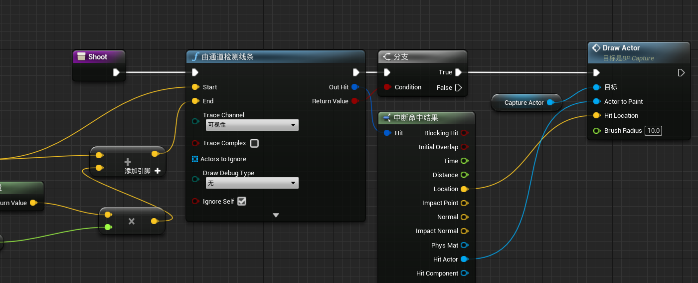

# 1. 使用渲染目标绘画

## 绘制方法

为了确定在哪里绘制渲染目标，你需要从摄像机向前画一条线。如果线条击中画布，你可以在**UV空间**中得到击中位置。例如，如果画布是完美的UV映射，在中心的点击将返回值(0.5,0.5)。如果它击中右下角，你将得到一个值(1,1)。然后你可以使用一些**简单的数学**计算**绘制位置**。

在本教程中，您将在蓝图中动态创建**渲染目标**。这意味着你需要设置一个纹理作为参数，这样你就可以传递渲染目标。为此，创建一个`TextureSampleParameter2D`并命名为`RenderTarget`。然后，将它连接到BaseColor。

## 创建RT

更好的方法是使用蓝图创建**渲染目标**。这样做的好处是您只需根据需要创建渲染目标，它们不会使项目文件膨胀。

首先，您需要创建渲染目标并将其存储为变量以供以后使用。转到*Blueprints*文件夹并打开*BP_Canvas*。找到*Event BeginPlay*并添加


### 显示RT

目前，**画布网格**正在使用其默认材质。要显示渲染目标，您需要创建*M_Canvas*的动态实例，并提供渲染目标。然后，您需要将**动态材质实例**应用于画布网格：


## 创建笔刷材质

创建一个名为*M_Brush*的材质，然后打开它。首先，将***混合模式***设置为***半透明***。这将允许使用具有透明度的纹理。

就像画布材质一样，还将在蓝图中设置画笔的纹理。创建一个*TextureSampleParameter2D*并将其命名为*BrushTexture*。


接下来要做的是创建**画笔材质的动态实例**，以便您可以更改画笔纹理。打开*BP_Canvas*：


## 将画笔绘制到渲染目标

创建一个新函数并将其命名为==*DrawBrush*==。首先，需要使用纹理、画笔大小和绘制位置的参数。创建以下输入：

- *BrushTexture：*将类型设置为*Texture 2D*
- *BrushSize：*将类型设置为float
- *DrawLocation：*将类型设置为*Vector 2D*

计算绘制位置是一个两步过程。首先，您需要缩放*DrawLocation*以适应渲染目标的分辨率。为此，*请将 DrawLocation*与*Size*相乘。

默认情况下，引擎将使用左上角作为原点绘制材质。这将导致画笔纹理不会以您要绘制的位置为中心。要解决此问题，您需要将*BrushSize*除以*2*，然后减去上一步的结果。

最后，您需要告诉引擎您要停止绘制渲染目标。添加一个*End Draw Canvas 到 Render Target*节点并像这样连接它


## 来自相机的线路追踪

在画布上绘画之前，您需要指定画笔纹理和大小。转到*Blueprints*文件夹并打开*BP_Player*。然后，将*BrushTexture*变量设置为*T_Brush_01*并将*BrushSize 设置*为*500*。这会将画笔设置为大小为*500×500*像素的猴子图像。接下来，您需要进行线路跟踪。找到*InputAxis Paint*并创建以下设置：


现在需要检查射线是否碰到画布。


在*Find Collision UV*节点工作之前，您需要更改两个设置。首先，转到*LineTraceByChannel*节点并启用*Trace Complex*。


其次，转到*Edit\Project Settings*，然后转到*Engine\Physics*。启用*Support UV From Hit Results*，然后重新启动您的项目。


## 更改画笔大小

打开*BP_Player*并找到*InputAxis ChangeBrushSize*节点。此轴映射设置为使用*鼠标滚轮*。要更改画笔大小，您需要做的就是根据*Axis Value*更改*BrushSize*的*值*。为此，请创建以下设置：


## 更改画笔纹理

首先，需要一个数组来保存玩家可以使用的纹理。打开*BP_Player*，然后创建一个*数组*变量。将类型设置为*Texture 2D*并将其命名为*Textures*。


接下来，您需要一个变量来保存数组中的当前索引。创建一个*整数*变量并将其命名为*CurrentTextureIndex*。

接下来，您需要一种循环浏览纹理的方法。在本教程中，我设置了一个名为*NextTexture*的动作映射设置为*right-click*。每当玩家按下此按钮时，它应该更改为下一个纹理。为此，请找到*InputAction NextTexture*节点并创建以下设置：


# 2. 创建雪迹

## 雪迹实施

**创建轨迹**所需的第一件事是*渲染目标*。渲染目标将是一个**灰度蒙版**，其中**白色表示有轨迹**，黑色表示没有轨迹。然后，您可以将**渲染目标**投影到地面上，并使用它来**混合纹理**和**置换顶点**。


你需要的第二件事是**如何只屏蔽掉受雪影响的物体**。你可以通过首先将物体渲染为**自定义深度**来做到这一点。然后，你可以使用带有后处理材质的场景捕捉来屏蔽任何渲染为自定义深度的对象。然后，你可以将遮罩输出到渲染目标。

**场景捕捉**的重要部分是你放置它的位置。下面是一个从**自顶向下视图**捕获的渲染目标的例子。在这里，第三人称角色和盒子被掩盖了。


乍一看，**自上而下的捕捉**看起来是个好办法。形状似乎是精确到网格的，所以应该没有问题，对吗？并非如此。自上而下捕捉的问题是，它不能捕捉最宽点以下的东西。这里有一个例子。


这个问题的延伸是**很难确定一个物体是否接触到地面**。


### 自顶向上方法


为了确定物体是否接触到地面，可以使用**后期处理材质**来进行深度检查。这将检查物体的深度是否**高于地面深度**和**低于指定的偏移量**。如果这两个条件都是真的，你就可以屏蔽掉这个像素。


## 创建深度检查材质

为了进行==深度检查==，你需要使用两个**深度缓冲区**。一个用于地面，另一个用于受雪影响的物体。由于**场景捕捉**只能看到地面，所以场景深度将输出地面的深度。要获得物体的深度，你只需将它们渲染到**自定义深度**。

首先，你需要计算每个像素到地面的距离。打开`Materials\PP DepthCheck`，然后创建以下内容


现在，如果像素在地面的`25`个单位内，它就会显示在遮蔽中。遮罩的强度取决于像素离地面有多近。点击应用，然后回到主编辑器。

接下来，你需要创建场景捕捉。

## 创建场景捕捉

首先，你需要一个渲染目标，以便将场景捕捉写入其中。导航到RenderTargets文件夹，创建一个名为`RT_Capture`的新渲染目标。

现在让我们来创建场景捕捉。在本教程中，你将把**场景捕捉**添加到蓝图中，因为你以后需要对它进行一些脚本编写。打开Blueprints/BP_Capture，然后添加一个`Scene Capture Component 2D`。将其命名为SceneCapture。


首先，你需要设置捕捉的旋转，使它向上看向地面。转到细节面板，设置旋转为(0,90,90)。接下来是**投影类型**。由于遮罩`mask`是**场景的二维表示**，你需要消除**任何透视变形**。要做到这一点，将`Projection\Projection`类型设置为`Orthographic`。


接下来，你需要告诉**场景捕捉**要写到哪个**渲染目标**上。要做到这一点，将`Scene Capture/Texture Target`设置为`RT1`（自己建的）。


最后，**你需要使用深度检查材质**。将`PP_DepthCheck`添加到`Rendering Features/Post Process Materials`中。为了让**后期处理**发挥作用，你还需要把`Scene Capture\Capture Source`改为RGB中的`Final Color（LDR）`。


## 设置捕捉区域大小

由于最好使用**低分辨率的渲染目标**，你需要确保有效地利用其空间。这意味着要决定一个像素覆盖多少区域。例如，如果**捕捉区域**和**渲染目标**的分辨率相同，你就会得到一个1:1的比例。每个像素将覆盖一个1×1的区域（以世界为单位）。

对于雪道来说，1:1的比例是不需要的，因为你不太可能需要那么多的细节。我建议使用更高的比率，因为它们将允许你在使用低分辨率的同时增加捕捉区域的大小。注意不要把比例提高得太多，否则你会开始失去细节。在本教程中，你将使用`8:1`的比例，这意味着每个像素的大小为8×8世界单位。

你可以通过改变Scene Capture/Ortho Width属性来调整捕捉区域的大小。例如，如果你想捕捉一个1024×1024的区域，你可以把它设置为1024。由于你使用的是8:1的比例，所以将其设置为`2048`（**默认的渲染目标分辨率为256×256**）。


这意味着场景捕捉将捕捉一个`2048×2048`的区域。这大约是20×20米。

地面材质也需要访问**捕获的大小**，以便正确地投影**渲染目标**。做到这一点的一个简单方法是将**捕捉的尺寸**存储到一个**材料参数集合**中。这是一个变量的集合，任何材质都可以访问。

### 存储区域大小

创建一个**材料参数集**，它被列在材料和纹理下。把它重命名为`MPC_Capture`，然后打开它。

接下来，创建一个新的标量参数并命名为`CaptureSize`。


回到BP_Capture，确保将`set`设置为MPC_Capture，参数名称为`CaptureSize`。


## 变形地形

打开`M_Landscape `，然后转到细节面板。然后，设置以下属性

- 将`LandscapeTwo Sided`设置为启用。由于场景捕捉将从底部看，它将只看到地面的背面。默认情况下，引擎不会渲染背面。这意味着它不会将地面的深度存储到深度缓冲区。要解决这个问题，你需要告诉引擎渲染**网格的两面**。
- `D3D11 Tessellation`设置为`Flat Tessellation`（也可以使用PN三角形）。这有效地提高了网格的分辨率，使你在**置换顶点**时可以得到更精细的细节。


一旦你启用了镶嵌，**世界位移**和**镶嵌乘数**将被启用。


Tessellation Multipler控制`tessellation`的数量。在本教程中，不连接它，这意味着它将使用默认值1。

世界位移（World Displacement）接收一个矢量值，描述顶点的移动方向和移动量。为了计算这个`pin`的值，你首先需要把**渲染目标**投射到地面上。

## 投射渲染目标

为了投射渲染目标，你需要计算它的**UV坐标**。为此，创建以下设置（在地形材质中）


1. 首先，你需要得到当前顶点的XY位置。**由于你是从底部捕捉的，X坐标被翻转了**:star:，所以你需要把它翻转回来（如果你是从顶部捕捉的，你就不需要这样做

2. 这一部分实际上会做两件事。首先，它将使渲染目标居中，使其在世界空间中位于（0, 0）。然后，它将从**世界空间**转换到**UV空间**。

确保将Texture Sample的纹理设置为RT Capture：


注意这里的位置节点是如下的**材质函数**，逻辑也很简单


这将把渲染目标投射到地面上。然而，捕获区域之外的任何顶点都将采样渲染目标的边缘。这是一个问题，因为**渲染目标**只用于捕获区域内的顶点。为了解决这个问题，你需要屏蔽任何落在0到1范围之外的UV。`MF MaskUV0-1`函数是为此而构建的函数。如果提供的UV在0到1范围之外，它将返回0；如果在范围内，它将返回1。将结果与渲染目标相乘将执行屏蔽。

## 使用RT

让我们从混合颜色开始：


现在，当有一个踪迹，地面的颜色将是棕色。如果没有踪迹，它将是白色的。下一步是替换顶点。为此：


然后回到主编辑器。在关卡中创建一个`BP_Capture`的实例，并将其位置设置为`(0, 0, -2000)`，使其位于地面之下。按下Play，用W、A、S和D走动，开始对雪进行变形。


## 创造持久的痕迹

那么肯定是乒乓缓冲。


创建一个名为RT Persistent的渲染目标。接下来，您需要一个将**捕获**复制到**持久缓冲区**的材料。打开`Materials\M_DrawToPersistent`，然后添加一个Texture Sample节点。将其纹理设置为RT Capture并像这样连接它


现在你需要使用这个**绘制材料**。点击应用，然后打开`BP_Capture`。首先，让我们创建一个材料的动态实例（以后你将需要传入数值）：


接下来，打开`DrawToPersistent`函数并添加：


接下来，您需要确保每一帧都绘制到持久缓冲区，因为捕获每一帧都会发生。为此，将DrawToPersistent添加到事件Tick中。


修改深度测试材质：


结果看起来很棒，但目前的设置只适用于地图的一个区域。如果你走出捕获区域，踪迹将停止出现。


## 移动捕获

你可能认为你所要做的就是将**捕获的XY位置**设置为**玩家的XY位置**。但是如果你这样做，渲染目标就会开始模糊。这是因为你正在以比一个像素小的步骤移动渲染目标。当这种情况发生时，一个像素的新位置最终将在像素之间。这将导致将多个像素插值到单个像素。这是它的样子


要解决这个问题，您需要以**离散的`step`**移动**捕获**。首先，让我们创建一个参数来保持捕获的位置。**地面材质**将需要这个来进行**投影数学运算**。打开MPC_Capture并添加一个名为`CaptureLocation`的矢量参数。

接下来，你需要更新地面材质来使用**新的参数**：


现在**渲染目标**将始终投影在捕获的位置。点击应用，然后关闭材质。接下来是以离散`step`移动捕获。

要计算` pixel’s world size`，可以使用以下等式：

```c++
(1 / RenderTargetResolution) * CaptureSize
```

要计算新的位置，请在每个位置组件（在本例中为X和Y位置）上使用下面的公式：

```c#
(floor(Position / PixelWorldSize) + 0.5) * PixelWorldSize
```

现在让我们在捕获蓝图中使用它们。为了节省时间，我为第二个等式创建了一个`SnapToPixelWorldSize`宏。打开`BP Capture`，然后打开`moveccapture`函数。然后，创建以下设置


然后：


这将使用计算出的偏移量**移动捕获**。然后，它将存储**捕获的新位置**到MPC，以便地面材料可以使用它。最后，你需要在每一帧执行位置更新。关闭函数，然后在事件Tick中DrawToPersistent之前添加MoveCapture。

==移动捕获只是解决方案的一半==。您还需要在捕获移动时**移动持久缓冲区**。否则，捕获和持久缓冲区将不同步并产生奇怪的结果。


## 移动持久缓存区

要移动**持久化缓冲区**，你需要传入你计算的**移动偏移量**。打开`M_DrawToPersistent`，添加


这将使用**提供的偏移量**移动**持久性缓冲区**。就像在地面材质中一样，你也需要**翻转X坐标**并进行遮蔽。点击应用，然后关闭该材质。

接下来，你需要传入移动偏移。打开`BP_Capture`，然后打开`DrawToPersistent`函数。之后，添加：


# 3. 可交互草

## 矢量场

矢量场只是一个纹理，其中每个像素代表一个方向。让我们看看如何将方向存储到纹理中。看看这个网格：


假设红点是您要移动的对象。如果你把它移到右下角，什么向量代表这个运动？如果你回答*(1, 1)*，你是对的！您可能知道，您还可以将矢量表示为颜色，这就是您将它们存储到纹理中的方式。


**右下象限**看起来不错，因为它在两个轴上都有渐变。这意味着您可以将该象限中的任何向量存储为颜色，因为每个向量都有唯一的颜色。

但其他三个象限是有问题的。它们仅在一个轴上有渐变或根本没有渐变。这意味着多个向量将共享一种颜色。例如，将无法区分向量*(-1, 1)*和*(0, 1)*。

这三个象限不是每个向量都具有唯一颜色的原因是因为您只能使用 0 到 1 之间的值来表示颜色。但是，三个象限使用超出该范围的负值。

解决方案是重新映射向量，使它们适合 0 到 1 的范围。您可以通过将向量乘以*0.5*然后加上*0.5 来实现*。这是它的外观的可视化：


以下是几种颜色以及它们在重新映射后代表的方向：

- *(0, 0)：*负 X 和 Y
- *(0.5, 0.5)：*没有移动
- *(0, 1)：*负 X 正 Y
- *(1, 0)：*正X和负Y

### 创建矢量场

与雪道不同，你不会捕捉到物体的形状。相反，你将使用 "刷子 "在**渲染目标**上作画。这些笔刷将是**自定义矢量场的图像**。我把这些画笔称为==方向画笔==。

你可以使用粒子来代替使用蓝图（Blueprints）绘制到**渲染目**标上。粒子将显示方向刷并从玩家处发射出来。为了创建**矢量场**，你只需使用**场景捕捉**并**只捕捉粒子**。这种方法的优点是，它非常容易创建轨迹。它还允许你轻松地控制属性，如轨迹持续时间和大小。粒子还可以创建半永久性的轨迹，因为它们在离开和重新进入捕捉区域后仍然存在。

下面是几个你可以使用的方向刷的例子以及它们对草地的影响。注意，在下面的例子中，粒子是不可见的。


## 创建方向材质

有两种方法来创建一个方向刷。

- 数学。在材料中定义方向和形状。这样做的好处是不需要外部软件，对于简单的形状来说很容易。
- **转换法线图**。这是创建所需要的方向和形状的法线图的地方。要转换为可用的矢量场，你只需要去掉蓝色通道。这种方法的好处是，你可以很容易地创建复杂形状。

在本教程中，你将以**数学方式**创建一个。导航到材料文件夹，打开`M_Direction`。注意，这个材料的着色模型是**无光的**。这很重要，因为这将允许**场景捕捉**在没有光线影响的情况下捕捉粒子。

为了保持简单，你将创建一个材料，使草**从粒子中心移开**：


现在需要进行**重新映射**：


接下来，让我们给它一个圆形：


`RadialGradientExponential`是控制圆的大小和硬度的东西。将其与**粒子颜色**相乘将允许你从**粒子系统**中控制**粒子的不透明度**。我将在下一节中详细介绍这个问题。

下面是画笔的样子。


## 创建轨迹粒子系统

导航到`ParticleSystems`文件夹并打开`PS_GrassTrail`。为了节省时间，我已经创建了您需要的所有模块:下面是每个模块如何影响草径的情况。

- `Spawn`。`spawn rate`会影响规矩的**平滑程度**。
- 生命期。草地恢复到默认状态之前的痕迹**持续时间**。
- 初始大小
- `color over life`。由于你在材质中使用了粒子颜色，你可以在这里控制不透明度。你还可以调整**阿尔法曲线**来控制痕迹的消退。例如，你可以做线性渐变，缓进和/或缓出。在本教程中，我们将把它保持在默认状态，即**线性渐变**。
- 锁定轴：用于确保粒子朝向**场景捕捉**。
- 初始旋转。用来确保粒子朝向**正确的轴线**。

首先，你需要设置材料。选择 "Required  "模块，然后将材料设置为`M_Direction`。也将**排序模式**设置为`PSORTMODE Age Newest First`


这种排序模式将确保**较新的粒子将在较旧的粒子之上渲染**。如果你不这样做，**老的粒子可能会影响到草地而不是新的粒子**。接下来是**痕迹的持续时间**。选择`Lifetime`模块并将`Constant`设置为5。这将导致痕迹在**五秒钟**内逐渐消失。

接下来是大小。选择`Initial Size`模块并将常数设置为`（150, 150, 0）`。这将使每个粒子覆盖一个`150×150`的区域。


现在你需要确保粒子朝向**场景捕捉**。由于本教程中的**场景捕捉**是从**上面**捕捉的，所以粒子需要面向正的Z轴。要做到这一点，选择`Lock Axis`模块，并将**锁定轴标志**设置为`Z`。

:star:最后，你需要设置**粒子的旋转**。目前，画笔中的颜色并没有与它们所代表的方向对齐。这是因为**在默认情况下，粒子系统会应用90度的旋转**。为了解决这个问题，选择**初始旋转模块**并将常数设置为`-0.25`。这将使粒子逆时针旋转90度。

## 附加粒子系统

导航到`Characters\Mannequin`并打开`BP_Mannequin`。之后，创建一个`Partice System`组件并命名为`GrassParticles`。


如果玩家能在游戏中看到踪迹，那就太奇怪了，所以最好将其隐藏起来。要做到这一点，启用` Rendering\Owner No See`

现在，**场景捕捉**被设置为**捕捉一切**。很明显，这是不好的，因为粒子是唯一应该影响草地的东西。在下一节中，您将学习如何只捕获粒子。

## 只捕获粒子

如果你现在捕捉粒子，你会在没有粒子的地方得到不想要的弯曲。这是因为**渲染目标**的背景颜色会是**黑色**。弯曲的发生是因为黑色代表了向**负XY轴的运动**（重新映射后）。为了确保空白区域没有运动，你需要确保渲染目标的背景颜色是`（0.5, 0.5, 0）`。一个简单的方法是创建一个巨大的平面，并将其附加到玩家身上。

首先，让我们为背景创建材质。打开`Materials/M_Background`。之后，将一个（0.5, 0.5, 0）的常数连接到Emissive Color。

> 注意：就像粒子材料一样，你计划捕捉的任何材料都需要`unlit`。

回到`BP_Mannequin`，然后创建一个新的`Plane`组件。将其命名为 "Background"。设置如下参数：


隐藏它，启用`Rendering\Owner No See`。

### 使用仅显示列表

在你可以添加到**只显示列表**之前，你需要一个方法来获得所有受草影响的`actor`。做到这一点的一个方法是使用==标签==。**标签**是你可以分配的简单字符串。然后你可以使用`Get All Actors With Tag`节点来获得所有带有某个标签的`actor`。

因为玩家角色应该影响草地，所以它需要一个标签。要添加一个标签，首先点击**类别默认按钮**。然后，在`Actor/Tags`下创建一个新标签，并命名为`GrassAffector`。（这里错了，应该是给角色蓝图加一个`tag`）


由于**只显示列表**只接受组件，你也需要给受草影响的组件添加标签。选择**GrassParticles组件**，然后添加一个位于`Tags`部分下的新标签。把它也命名为GrassAffector（你不需要使用这个标签）。对 **"背景 "组件**做同样的事情。

现在你需要把所有影响草地的组件添加到**捕获的只显示列表**中。打开`Blueprints/BP_Capture`。转到`Event BeginPlay`，并添加：


这将循环检查所有带有`GrassAffector`标签的`actor`。然后它将检查该`actor`是否有任何具有相同标签的组件，并将它们添加到只显示的列表中。

接下来你需要告诉场景捕捉使用**只显示的列表**。选择SceneCapture组件，然后转到Scene Capture部分。设置原始渲染模式为` Use ShowOnly List`。


## 压倒草

首先，你需要将**渲染目标**投射到**草地**上。转到`Materials`文件夹，打开`M_Grass`。然后，创建下面的节点。确保将纹理设置为`RT_Capture`。


由于你已经将颜色重设为$[0,1]$，你需要在使用它之前将它重设为$[-1, 1]$：


现在有了**弯曲方向**，需要一些方法来使草向这个方向旋转。幸运的是，已经有一个叫做`RotateAboutAxis`的节点。让我们从`NormalizedRotationAxis pin`开始。顾名思义，这是顶点将围绕其旋转的**轴**。为了计算这个，你只需要将**弯曲方向**与`（0, 0, -1）`做叉积：


接下来是**旋转角度**，这是顶点应该围绕支点旋转的程度。默认情况下，它期望的数值在0和1之间，其中0是0度，1是360度。为了得到旋转角度，你可以使用**弯曲方向的长度**乘以**最大旋转量**。


计算`PivotPoint`有点棘手，因为**一个草网包含多个草叶**。这意味着你不能使用类似于`Object Position`节点的东西，因为它将为所有的草叶返回同一个点。

理想情况下，你会使用**3D包**来存储UV通道内的`pivot point`。但在本教程中，将只是近似地使用一个`pivot point`。这样做的方法是：简单地从顶部**向下移动**一定的偏移量。


在本教程中，**草的高度**约为**80个单位**，这就是为什么我将`PivotOffset`设置为这个值。

接下来，你将需要执行两个`mask`。第一个`mask`将确保**草叶的根部不会移动**。第二个`mask`将确保**捕捉区域外的草**不会受到**矢量场的影响**。


## Mask

在本教程中，已经设置了**草的顶点颜色**，使底部顶点是黑色的，顶部顶点是白色的。


第一个`mask`，只需将`RotateAboutAxis`的结果与**顶点颜色节点**相乘。


第二个`mask`，也很简单：


# 4. 动态网格绘制

网格绘画是玩家在游戏中在物体上绘画的能力。比如《斯普拉顿2+3》。

## 网格绘制

在大多数情况下，所处理的网格已经有了**UV贴图**。所以明显的做法是使用**渲染目标**创建一个蒙版，然后将其应用到网格上。然而，直接在**渲染目标**上生成遮罩（使用`Draw Material to Render Target`）通常会导致`UV shells`的不连续。

下面是一个立方体的UV贴图和**球体遮罩纹理**的例子。


一个**二维球体遮罩**不会环绕角落，因为它没有考虑到几何体的情况。为了生成一个正确的遮罩，球体遮罩需要对**网格的世界位置**进行采样。但是，在使用 "the Draw Material to Render Target "节点时，你**如何访问世界位置**？

如果你一直在看关于**网格绘制**的方法，你可能已经看到了Ryan Bruck关于使用**渲染目标**的角色损伤的视频（本教程中的方法是基于他的方法）。在视频中，他成功地生成了==3D球体遮罩==，并将其累积到渲染目标中。他之所以能够做到这一点，是因为他创建了一个**渲染目标**来存储**网格的世界位置**，然后他可以使用球体遮罩进行采样。让我们仔细看一下。

### Ryan的方法

这个方法有四个步骤。第一步是 "unwarp "有关的网格。这就是简单地移动所有的顶点，使你得到UV形式的网格。例如，这里是角色的UV：


你可以通过应用一些**简单的世界位置偏移数学**来解包一个网格。

`unwarp`后，第二步是将**网格的世界位置**编码到`RT`中。你可以通过将`Unwarp material`的颜色设置为**绝对世界位置**，然后使用**场景捕捉**来捕捉`unwarp`。下面是**渲染目标**的样子。


第三步是创建==球体蒙版==。现在可以访问网格的世界位置，你可以在**球体遮罩**中对它们进行采样。然后你可以直接将球体遮罩绘制到第二个**渲染目标**上。

最后一步是在**角色的材质**中使用**遮罩**，在颜色、纹理或材质之间进行混合。下面是第三和第四步的可视化。


### 本文方法

虽然Ryan的方法可行，但它需要：

- 两个**渲染目标**的绘制。第一次是捕捉**未包裹的网格**`unwrapped mesh`。第二个是累加`sphere masks`。

- 一个**渲染目标**来存储世界位置，一个渲染目标来累加`sphere masks`。你需要为你想要绘制的每个角色单独设置一个**渲染目标**。

本教程中的方法抛弃了第二个绘制和世界位置的渲染目标。它通过将解包和`sphere masks`合并为一个材质来实现这一点。然后，它使用**加法复合模式**捕捉解包，以累加`sphere masks`。

有一点需要注意的是，当网格没有重叠的UV时，这两种方法效果最好。重叠的UV会导致共享相同UV空间的像素也共享相同的遮罩信息。例如，你有两只手的UV映射到同一个空间。如果一只手被遮挡，另一只手也会被遮挡。

## 创建Unwarp材质

创建一个新的材料，将其命名为`M_Unwrap`，然后打开它。接下来，改变以下设置：


接下来是` unwrap the mesh`，注意，我已经在`MPC_Global`资产中创建了`CaptureSize`和`UnwrapLocation`参数。


这将以**指定的尺寸**将**网格的UV**解包到指定的位置。


下一步是创建`sphere masks`。为此，你将需要两个参数：撞击位置和球体半径：


这将为`sphere masks`内的像素返回白色，为`sphere masks`外的像素返回黑色。重要的是，你要将**绝对世界位置节点**设置为**绝对世界位置（不包括材质着色器偏移）**。这是因为像素的世界位置会因为解包而改变。==不包括材质着色器的偏移将给你解包前的原始世界位置==。


## Unwrapping角色

在本教程中，**捕捉蓝图**将处理**解包**和捕捉的问题。首先，你将需要一个动态的`unwrap material`实例。导航到Blueprints文件夹，打开BP_Capture：


关于初始化参数：


接下来，你需要一个函数来执行**解包**和**捕获**。创建一个名为`PaintActor`的新函数。之后，创建以下输入。

- ActorToPaint。类型是Actor。要解包和捕捉的演员。
- HitLocation。类型是矢量。这将是球体遮罩的中心点。
- BrushRadius。类型是浮点。球体遮罩的半径

尽管这个**绘画方法**可以适用于任何角色，但我们只检查传入的角色是否继承自角色类。为了简化代码，我们将把角色的**骨架网状结构组件**存储到一个变量中，因为需要多次引用它：


现在是做**解包**和`sphere masks`的时候了：


下面是每一行的作用。

- 首先，这将保存网格的原始材质，以便你以后可以重新应用它。然后，它将应用解包材质。
- 这条线将传入**击中的位置**和**刷子半径**到解包材质中，用于**球体遮蔽**。

在你测试解包之前，你需要从玩家那里做一个**射线追踪**，以获得一个**撞击位置**。


## 获得击中位置

打开`BP_Player`。打开`Shoot function`：



单击Compile，然后关闭`BP_Player`。按下播放键：


## 捕捉the Unwrap

首先，在**未被包裹的网格**后面添加一个**不亮的黑色平面**是个好主意。这将有助于防止在UV壳的边缘出现接缝。打开`BP_Capture`，然后添加一个名为BackgroundPlane的平面组件。为了节省时间，我已经为你创建了黑色材质。将材质设置为`M_Background`。


接下来，需要执行捕获。返回到`PaintActor`函数：


这将捕捉到**未被包裹的网格**。之后，它将重新应用该**网格的原始材质**。

目前，**场景捕捉**将覆盖**渲染目标**的先前内容。为了确保**球体遮罩的累积**，你需要确保场景捕捉会添加到之前的内容中。要做到这一点，选择`SceneCapture`组件并将`Scene Capture/Composite Mode`（场景捕捉/合成模式）设置为`Additive`（添加）。


点击 "编译"，然后关闭蓝图。接下来，你需要在**角色的材质**中使用**渲染目标**。

## 使用Mask

导航到`Characters/Mannequin/Materials`并打开`M_Mannequin`：


