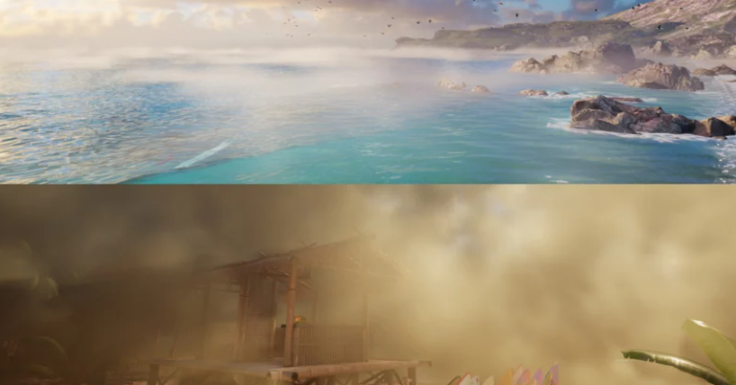
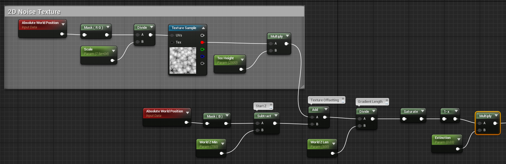
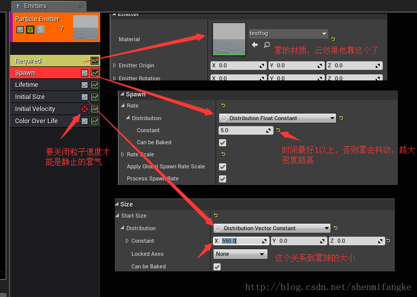

# UE4体积雾技术

随着 4.16 版本的发布，UE4 终于内置了 Volumetric Fog 解决方案。此功能提供了使用 HeightFog 和ParticleSystems 定义**雾密度**的能力。它还使雾能够通过将**阴影贴图**合成到体积中，来接收来自环境的阴影。

## 用材质修改雾

从4.17版本开始，为了使用材质写入**体积雾**，必须使用**粒子系统**。任何**材料域**设置为 "**体积** "的粒子都将把它们的材料渲染到体积雾中。该材质是指使用`WorldPosition`、`ParticlePosition`和`ParticleRadius`来设置Sphere Mask。上面的文档链接有一个很好的例子，所以我只是要展示一些更高级和定制的版本。

当使用粒子写到雾中时，你必须注意成本，因为它可能很快就会失去控制。成本将是**每个粒子重叠的体素数**乘以**材质指令数**。如果任何一个粒子可以覆盖整个屏幕视图，最好只有一个粒子的贡献，否则你就要为整个体积支付多次超绘的成本。

理论上说，最好使用较小的局部粒子来限制体积的写入区域，但是如果摄像机能够进入这些局部区域，那么`overdraw`就会变得相当昂贵。另一种方法是**只使用一个足够大的粒子来覆盖整个体积的边界**，以便在最坏的情况下固定成本，这有时是有益的。

最简单的设置方法是建立一个`spawn rate`为0、`Burst`为1的粒子系统。你可能会认为，要用**3D雾**做很酷的事情，需要**3D纹理**。虽然它们确实有帮助，但很多效果只需使用**2D纹理**就可以完成。这个水面上的雾岸效果是通过使用 "一个大颗粒 "的方法来实现的，使用的是一个2D的噪声纹理。

这基本上是自定义的、有纹理的高度雾。**世界位置Z**使用一个**线性梯度**来定义密度。梯度的起点被二维纹理所抵消。纹理是使用简单的**XY世界坐标**进行映射的。所有的数值都在世界空间中。上图只显示了密度（也就是 "Exctinction "材质pin）。你可能会注意到上图中的雾气有一些**自阴影**。这也是在材质中处理的。

## Faking Self Shadowing

虽然**体积雾**从环境中接收阴影，但它目前并不自带阴影。对于有细微雾气的场景来说，**自阴影**并不十分重要；但对于较浓的雾气来说，没有**自阴影**会显得有些平淡。

==体积雾的工作原理==是：将**所有的体积物体**聚集成一个**单一的体积纹理**，并与` camera frustum`相匹配。这种方法的优点是它能自动在体积内产生反平方类型的`LOD`。一个缺点是不容易支持自阴影，因为你不能用射线对**体积纹理**进行自阴影的处理：在射线碰到摄像机拟合的**体积边缘**，总是会看到阴影伪影。这有点像老式的`Bloom`类型的光轴问题，只有在看太阳的时候才能看到，而这只能在视角允许的情况下看到**自阴影**。

这在未来有几种方式可以进行。一个选择是支持一个**自定义的前向阴影通道**，允许使用材质来计算阴影。其基本思路是这样的。 当合成**体积雾的材质**时，对着光线取一些偏移的样本，用这些值来估计**自阴影**。对于非常软的或块状的雾，即使只是一个偏移的采样也能产生一个很好的质量改进。这种方法可以解决视角的问题，因为**偏移采样**是在材料被合成到全局体积之前发生的。因此，它可以在本地读取超出**最终相机拟合的体积范围**的位置。

但是现在，将展示我们如何通过在**反照率**中建立一点阴影来 "伪造 "。由于我们使用这种**自阴影**来给反照率着色，所以必须注意这种方法会给所有的灯光带来阴影，包括**局部点光源**。出于这个原因，应该使用一个**相当柔和的密度值**。我还用这个材料添加了一些自定义的发光体，包括` textured and constant`。

