# [剖析虚幻渲染体系（10）- RHI](https://www.cnblogs.com/timlly/p/15156626.html)


目录

- [10.1 本篇概述](https://www.cnblogs.com/timlly/p/15156626.html#101-本篇概述)
- 10.2 RHI基础
  - [10.2.1 FRenderResource](https://www.cnblogs.com/timlly/p/15156626.html#1021-frenderresource)
  - [10.2.2 FRHIResource](https://www.cnblogs.com/timlly/p/15156626.html#1022-frhiresource)
  - [10.2.3 FRHICommand](https://www.cnblogs.com/timlly/p/15156626.html#1023-frhicommand)
  - [10.2.4 FRHICommandList](https://www.cnblogs.com/timlly/p/15156626.html#1024-frhicommandlist)
- 10.3 RHIContext, DynamicRHI
  - [10.3.1 IRHICommandContext](https://www.cnblogs.com/timlly/p/15156626.html#1031-irhicommandcontext)
  - [10.3.2 IRHICommandContextContainer](https://www.cnblogs.com/timlly/p/15156626.html#1032-irhicommandcontextcontainer)
  - 10.3.3 FDynamicRHI
    - [10.3.3.1 FD3D11DynamicRHI](https://www.cnblogs.com/timlly/p/15156626.html#10331-fd3d11dynamicrhi)
    - [10.3.3.2 FOpenGLDynamicRHI](https://www.cnblogs.com/timlly/p/15156626.html#10332-fopengldynamicrhi)
    - [10.3.3.3 FD3D12DynamicRHI](https://www.cnblogs.com/timlly/p/15156626.html#10333-fd3d12dynamicrhi)
    - [10.3.3.4 FVulkanDynamicRHI](https://www.cnblogs.com/timlly/p/15156626.html#10334-fvulkandynamicrhi)
    - [10.3.3.5 FMetalDynamicRHI](https://www.cnblogs.com/timlly/p/15156626.html#10335-fmetaldynamicrhi)
  - [10.3.4 RHI体系总览](https://www.cnblogs.com/timlly/p/15156626.html#1034-rhi体系总览)
- 10.4 RHI机制
  - 10.4.1 RHI命令执行
    - [10.4.1.1 FRHICommandListExecutor](https://www.cnblogs.com/timlly/p/15156626.html#10411-frhicommandlistexecutor)
    - [10.4.1.2 GRHICommandList](https://www.cnblogs.com/timlly/p/15156626.html#10412-grhicommandlist)
    - [10.4.1.3 D3D11命令执行](https://www.cnblogs.com/timlly/p/15156626.html#10413-d3d11命令执行)
  - [10.4.2 ImmediateFlush](https://www.cnblogs.com/timlly/p/15156626.html#1042-immediateflush)
  - 10.4.3 并行渲染
    - [10.4.3.1 FParallelCommandListSet](https://www.cnblogs.com/timlly/p/15156626.html#10431-fparallelcommandlistset)
    - [10.4.3.2 QueueParallelAsyncCommandListSubmit](https://www.cnblogs.com/timlly/p/15156626.html#10432-queueparallelasynccommandlistsubmit)
    - [10.4.3.3 FParallelTranslateSetupCommandList](https://www.cnblogs.com/timlly/p/15156626.html#10433-fparalleltranslatesetupcommandlist)
    - [10.4.3.4 FParallelTranslateCommandList](https://www.cnblogs.com/timlly/p/15156626.html#10434-fparalleltranslatecommandlist)
  - 10.4.4 Pass渲染
    - [10.4.4.1 普通Pass渲染](https://www.cnblogs.com/timlly/p/15156626.html#10441-普通pass渲染)
    - [10.4.4.2 Subpass渲染](https://www.cnblogs.com/timlly/p/15156626.html#10442-subpass渲染)
  - [10.4.5 RHI资源管理](https://www.cnblogs.com/timlly/p/15156626.html#1045-rhi资源管理)
  - [10.4.6 再论多线程渲染](https://www.cnblogs.com/timlly/p/15156626.html#1046-再论多线程渲染)
  - [10.4.7 RHI控制台变量](https://www.cnblogs.com/timlly/p/15156626.html#1047-rhi控制台变量)
- 10.5 本篇总结
  - [10.5.1 本篇思考](https://www.cnblogs.com/timlly/p/15156626.html#1051-本篇思考)
- [特别说明](https://www.cnblogs.com/timlly/p/15156626.html#特别说明)
- [参考文献](https://www.cnblogs.com/timlly/p/15156626.html#参考文献)


 

 

# **10.1 本篇概述**

**RHI**全称是**Render Hardware Interface（渲染硬件接口）**，是UE渲染体系中非常基础且重要的模块，封装了众多图形API（DirectX、OpenGL、Vulkan、Metal）之间的差异，对Game和Renderer模块提供了简便且一致的概念、数据、资源和接口，实现一份渲染代码跑在多个平台的目标。

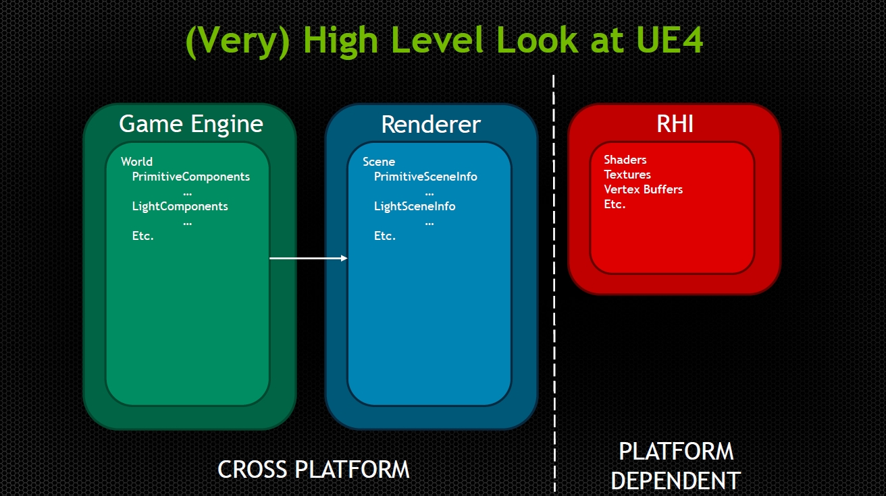

*Game、Renderer、RHI分层示意图，其中RHI是平台相关的内容。*

最初的RHI是基于D3D11 API设计而成，包含了资源管理和命令接口：

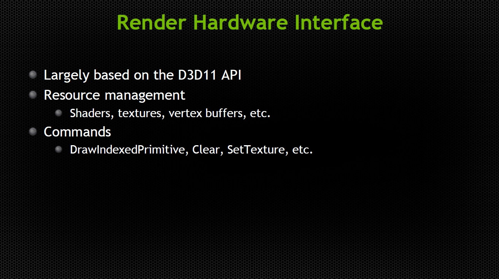

开启RHI线程的情况下，与RHI相伴相随的还有**RHI线程**，它负责将渲染线程Push进来的RHI中间指令转译到对应图形平台的GPU指令。在部分图形API（DX12、Vulkan、主机）支持并行的情况下，如果渲染线程是并行生成的RHI中间指令，那么RHI线程也会并行转译。

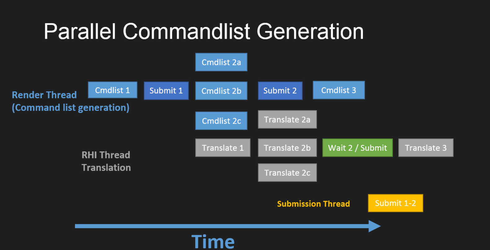

*UE4的渲染线程并行生成中间指令和RHI线程并行转译后提交渲染指令示意图。*

本篇将着重阐述RHI的基础概念、类型、接口，它们之间的关联，涉及的原理和机制等内容，也会少量涉及具体图形API的实现细节。

 

# **10.2 RHI基础**

本章将分析RHI涉及的基础概念和类型，阐述它们之间的关系和原理。

## **10.2.1 FRenderResource**

FRenderResource是渲染线程的渲染资源代表，由渲染线程管理和传递，介于游戏线程和RHI线程的中间数据。由于之前篇章虽然有涉及它的概念，但没有详细阐述，所以放到此篇章中。FRenderResource的定义如下：

```c++
// Engine\Source\Runtime\RenderCore\Public\RenderResource.h

class RENDERCORE_API FRenderResource
{
public:
    // 遍历所有资源, 执行回调接口.
    template<typename FunctionType>
    static void ForAllResources(const FunctionType& Function);
    static void InitRHIForAllResources();
    static void ReleaseRHIForAllResources();
    static void ChangeFeatureLevel(ERHIFeatureLevel::Type NewFeatureLevel);

    FRenderResource();
    FRenderResource(ERHIFeatureLevel::Type InFeatureLevel);
    virtual ~FRenderResource();
    
    // 以下接口只能被渲染线程调用.

    // 初始化此资源的动态RHI资源和(或)RHI渲染目标纹理.
    virtual void InitDynamicRHI() {}
    // 释放此资源的动态RHI资源和(或)RHI渲染目标纹理.
    virtual void ReleaseDynamicRHI() {}

    // 初始化此资源使用的RHI资源.
    virtual void InitRHI() {}
    // 释放此资源使用的RHI资源.
    virtual void ReleaseRHI() {}

    // 初始化资源.
    virtual void InitResource();
    // 释放资源.
    virtual void ReleaseResource();

    // 如果RHI资源已被初始化, 会被释放并重新初始化.
    void UpdateRHI();

    virtual FString GetFriendlyName() const { return TEXT("undefined"); }
    FORCEINLINE bool IsInitialized() const { return ListIndex != INDEX_NONE; }

    static void InitPreRHIResources();

private:
    // 全局资源列表(静态).
    static TArray<FRenderResource*>& GetResourceList();
    static FThreadSafeCounter ResourceListIterationActive;

    int32 ListIndex;
    TEnumAsByte<ERHIFeatureLevel::Type> FeatureLevel;
    
    (......)
};
```

下面是游戏线程向渲染线程发送操作FRenderResource的接口：

```c++
// 初始化/更新/释放资源.
extern RENDERCORE_API void BeginInitResource(FRenderResource* Resource);
extern RENDERCORE_API void BeginUpdateResourceRHI(FRenderResource* Resource);
extern RENDERCORE_API void BeginReleaseResource(FRenderResource* Resource);
extern RENDERCORE_API void StartBatchedRelease();
extern RENDERCORE_API void EndBatchedRelease();
extern RENDERCORE_API void ReleaseResourceAndFlush(FRenderResource* Resource);
```

FRenderResource只是基础父类，定义了一组渲染资源的行为，实际的数据和逻辑由子类实现。涉及的子类和层级比较多且复杂，下面是部分重要子类的定义：

```c++
// Engine\Source\Runtime\RenderCore\Public\RenderResource.h

// 纹理资源.
class FTexture : public FRenderResource
{
public:
    FTextureRHIRef        TextureRHI;         // 纹理的RHI资源.
    FSamplerStateRHIRef SamplerStateRHI; // 纹理的采样器RHI资源.
    FSamplerStateRHIRef DeferredPassSamplerStateRHI; // 延迟通道采样器RHI资源.

    mutable double        LastRenderTime; // 上次渲染的时间.
    FMipBiasFade        MipBiasFade;     // 淡入/淡出的Mip偏移值.
    bool                bGreyScaleFormat; // 灰度图.
    bool                bIgnoreGammaConversions; // 是否忽略Gamma转换.
    bool                bSRGB;             // 是否sRGB空间的颜色.
    
    virtual uint32 GetSizeX() const;
    virtual uint32 GetSizeY() const;
    virtual uint32 GetSizeZ() const;

    // 释放资源.
    virtual void ReleaseRHI() override
    {
        TextureRHI.SafeRelease();
        SamplerStateRHI.SafeRelease();
        DeferredPassSamplerStateRHI.SafeRelease();
    }
    virtual FString GetFriendlyName() const override { return TEXT("FTexture"); }
    
    (......)

protected:
    RENDERCORE_API static FRHISamplerState* GetOrCreateSamplerState(const FSamplerStateInitializerRHI& Initializer);
};

// 包含了SRV/UAV的纹理资源.
class FTextureWithSRV : public FTexture
{
public:
    // 访问整张纹理的SRV.
    FShaderResourceViewRHIRef ShaderResourceViewRHI;
    // 访问整张纹理的UAV.
    FUnorderedAccessViewRHIRef UnorderedAccessViewRHI;

    virtual void ReleaseRHI() override;
};

// 持有RHI纹理资源引用的渲染资源.
class RENDERCORE_API FTextureReference : public FRenderResource
{
public:
    // 纹理的RHI资源引用.
    FTextureReferenceRHIRef    TextureReferenceRHI;

    // FRenderResource interface.
    virtual void InitRHI();
    virtual void ReleaseRHI();
    
    (......)
};

class RENDERCORE_API FVertexBuffer : public FRenderResource
{
public:
    // 顶点缓冲的RHI资源引用.
    FVertexBufferRHIRef VertexBufferRHI;

    virtual void ReleaseRHI() override;
    
    (......);
};

class RENDERCORE_API FVertexBufferWithSRV : public FVertexBuffer
{
public:
    // 访问整个缓冲区的SRV/UAV.
    FShaderResourceViewRHIRef ShaderResourceViewRHI;
    FUnorderedAccessViewRHIRef UnorderedAccessViewRHI;

    (......)
};

// 索引缓冲.
class FIndexBuffer : public FRenderResource
{
public:
    // 索引缓冲对应的RHI资源.
    FIndexBufferRHIRef IndexBufferRHI;

    (......)
};
```

以上可知，FRenderResource的子类就是对应地将RHI的子类资源封装起来，以便渲染线程将游戏线程的数据和操作传递到RHI线程（或模块）中。下面来个UML图将FRenderResource的部分继承体系直观地呈现出来：

FRHIResourceFRenderResourceInitDynamicRHI()ReleaseDynamicRHI()InitRHI()ReleaseRHI()InitResource()ReleaseResource()UpdateRHI()FTextureReferenceFTextureReferenceRHIRef TextureReferenceRHIFTextureFTextureRHIRef TextureRHIFSamplerStateRHIRef SamplerStateRHIFTextureWithSRVFShaderResourceViewRHIRef ShaderResourceViewRHIFUnorderedAccessViewRHIRef UnorderedAccessViewRHIFTextureResourceFStaticShadowDepthMapFTexture2DDynamicResourceFTextureRenderTargetResourceFTextureRenderTarget2DResourceFTextureRenderTargetCubeResourceFVertexBufferFVertexBufferRHIRef VertexBufferRHIFTangentsVertexBufferFVertexBufferWithSRVFShaderResourceViewRHIRef ShaderResourceViewRHIFUnorderedAccessViewRHIRef UnorderedAccessViewRHIFColorVertexBufferFPositionVertexBufferFSkinWeightDataVertexBufferFIndexBufferFIndexBufferRHIRef IndexBufferRHIFDynamicMeshIndexBuffer16FDynamicMeshIndexBuffer32FRawIndexBufferFRawStaticIndexBufferFWhiteVertexBufferFEmptyVertexBuffer

如果看不清请点击下面的图片：

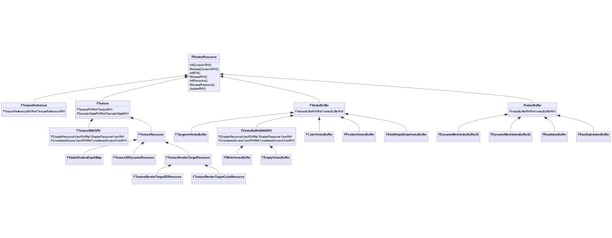

再次强调，以上只是FRenderResource的部分继承体系，无法完整地绘制出来。可知FRenderResource拥有庞大的子类层级关系，以适应和满足UE渲染体系在资源方面复杂多变的的需求。

## **10.2.2 FRHIResource**

FRHIResource抽象了GPU侧的资源，也是众多RHI资源类型的父类。定义如下：

```c++
// Engine\Source\Runtime\RHI\Public\RHIResources.h

class RHI_API FRHIResource
{
public:
    FRHIResource(bool InbDoNotDeferDelete = false);
    virtual ~FRHIResource();
    
    // 资源的引用计数.
    uint32 AddRef() const;
    uint32 Release() const
    {
        int32 NewValue = NumRefs.Decrement();
        if (NewValue == 0)
        {
            if (!DeferDelete())
            { 
                delete this;
            }
            else
            {
                // 加入待删除列表.
                if (FPlatformAtomics::InterlockedCompareExchange(&MarkedForDelete, 1, 0) == 0)
                {
                    PendingDeletes.Push(const_cast<FRHIResource*>(this));
                }
            }
        }
        return uint32(NewValue);
    }
    uint32 GetRefCount() const;
    
    // 静态接口.
    static void FlushPendingDeletes(bool bFlushDeferredDeletes = false);
    static bool PlatformNeedsExtraDeletionLatency();
    static bool Bypass();

    void DoNoDeferDelete();
    // 瞬时资源追踪.
    void SetCommitted(bool bInCommitted);
    bool IsCommitted() const;
    bool IsValid() const;

private:
    // 运行时标记和数据.
    mutable FThreadSafeCounter NumRefs;
    mutable int32 MarkedForDelete;
    bool bDoNotDeferDelete;
    bool bCommitted;

    // 待删除的资源.
    static TLockFreePointerListUnordered<FRHIResource, PLATFORM_CACHE_LINE_SIZE> PendingDeletes;
    // 正在删除的资源.
    static FRHIResource* CurrentlyDeleting;

    bool DeferDelete() const;

    // 有些api不做内部引用计数，所以必须在删除资源之前等待额外的几帧，以确保GPU完全完成它们. 可避免昂贵的栅栏等.
    struct ResourcesToDelete
    {
        TArray<FRHIResource*>    Resources;    // 待删除的资源.
        uint32                    FrameDeleted; // 等待的帧数.
        
        (......)
    };

    // 延迟删除的资源队列.
    static TArray<ResourcesToDelete> DeferredDeletionQueue;
    static uint32 CurrentFrame;
};
```

以上可知，FRHIResource提供了几种功能：引用计数、延迟删除及追踪、运行时数据和标记。它拥有数量众多的子类，主要有：

```c++
// Engine\Source\Runtime\RHI\Public\RHIResources.h

// 状态块(State blocks)资源

class FRHISamplerState : public FRHIResource 
{
public:
    virtual bool IsImmutable() const { return false; }
};
class FRHIRasterizerState : public FRHIResource
{
public:
    virtual bool GetInitializer(struct FRasterizerStateInitializerRHI& Init) { return false; }
};
class FRHIDepthStencilState : public FRHIResource
{
public:
    virtual bool GetInitializer(struct FDepthStencilStateInitializerRHI& Init) { return false; }
};
class FRHIBlendState : public FRHIResource
{
public:
    virtual bool GetInitializer(class FBlendStateInitializerRHI& Init) { return false; }
};

// 着色器绑定资源.

typedef TArray<struct FVertexElement,TFixedAllocator<MaxVertexElementCount> > FVertexDeclarationElementList;
class FRHIVertexDeclaration : public FRHIResource
{
public:
    virtual bool GetInitializer(FVertexDeclarationElementList& Init) { return false; }
};

class FRHIBoundShaderState : public FRHIResource {};

// 着色器

class FRHIShader : public FRHIResource
{
public:
    void SetHash(FSHAHash InHash);
    FSHAHash GetHash() const;
    explicit FRHIShader(EShaderFrequency InFrequency);
    inline EShaderFrequency GetFrequency() const;

private:
    FSHAHash Hash;
    EShaderFrequency Frequency;
};

class FRHIGraphicsShader : public FRHIShader
{
public:
    explicit FRHIGraphicsShader(EShaderFrequency InFrequency) : FRHIShader(InFrequency) {}
};

class FRHIVertexShader : public FRHIGraphicsShader
{
public:
    FRHIVertexShader() : FRHIGraphicsShader(SF_Vertex) {}
};

class FRHIHullShader : public FRHIGraphicsShader
{
public:
    FRHIHullShader() : FRHIGraphicsShader(SF_Hull) {}
};

class FRHIDomainShader : public FRHIGraphicsShader
{
public:
    FRHIDomainShader() : FRHIGraphicsShader(SF_Domain) {}
};

class FRHIPixelShader : public FRHIGraphicsShader
{
public:
    FRHIPixelShader() : FRHIGraphicsShader(SF_Pixel) {}
};

class FRHIGeometryShader : public FRHIGraphicsShader
{
public:
    FRHIGeometryShader() : FRHIGraphicsShader(SF_Geometry) {}
};

class RHI_API FRHIComputeShader : public FRHIShader
{
public:
    FRHIComputeShader() : FRHIShader(SF_Compute), Stats(nullptr) {}
    
    inline void SetStats(struct FPipelineStateStats* Ptr) { Stats = Ptr; }
    void UpdateStats();
    
private:
    struct FPipelineStateStats* Stats;
};

// 管线状态

class FRHIGraphicsPipelineState : public FRHIResource {};
class FRHIComputePipelineState : public FRHIResource {};
class FRHIRayTracingPipelineState : public FRHIResource {};

// 缓冲区.

class FRHIUniformBuffer : public FRHIResource
{
public:
    FRHIUniformBuffer(const FRHIUniformBufferLayout& InLayout);

    FORCEINLINE_DEBUGGABLE uint32 AddRef() const;
    FORCEINLINE_DEBUGGABLE uint32 Release() const;
    uint32 GetSize() const;
    const FRHIUniformBufferLayout& GetLayout() const;
    bool HasStaticSlot() const;

private:
    const FRHIUniformBufferLayout* Layout;
    uint32 LayoutConstantBufferSize;
};

class FRHIIndexBuffer : public FRHIResource
{
public:
    FRHIIndexBuffer(uint32 InStride,uint32 InSize,uint32 InUsage);

    uint32 GetStride() const;
    uint32 GetSize() const;
    uint32 GetUsage() const;

protected:
    FRHIIndexBuffer();

    void Swap(FRHIIndexBuffer& Other);
    void ReleaseUnderlyingResource();

private:
    uint32 Stride;
    uint32 Size;
    uint32 Usage;
};

class FRHIVertexBuffer : public FRHIResource
{
public:
    FRHIVertexBuffer(uint32 InSize,uint32 InUsage)
    uint32 GetSize() const;
    uint32 GetUsage() const;

protected:
    FRHIVertexBuffer();
    void Swap(FRHIVertexBuffer& Other);
    void ReleaseUnderlyingResource();

private:
    uint32 Size;
    // e.g. BUF_UnorderedAccess
    uint32 Usage;
};

class FRHIStructuredBuffer : public FRHIResource
{
public:
    FRHIStructuredBuffer(uint32 InStride,uint32 InSize,uint32 InUsage)

    uint32 GetStride() const;
    uint32 GetSize() const;
    uint32 GetUsage() const;

private:
    uint32 Stride;
    uint32 Size;
    uint32 Usage;
};

// 纹理

class FRHITexture : public FRHIResource
{
public:
    FRHITexture(uint32 InNumMips, uint32 InNumSamples, EPixelFormat InFormat, uint32 InFlags, FLastRenderTimeContainer* InLastRenderTime, const FClearValueBinding& InClearValue);

    // 动态类型转换接口.
    virtual class FRHITexture2D* GetTexture2D();
    virtual class FRHITexture2DArray* GetTexture2DArray();
    virtual class FRHITexture3D* GetTexture3D();
    virtual class FRHITextureCube* GetTextureCube();
    virtual class FRHITextureReference* GetTextureReference();
    
    virtual FIntVector GetSizeXYZ() const = 0;
    // 获取平台相关的原生资源指针.
    virtual void* GetNativeResource() const;
    virtual void* GetNativeShaderResourceView() const
    // 获取平台相关的RHI纹理基类.
    virtual void* GetTextureBaseRHI();

    // 数据接口.
    uint32 GetNumMips() const;
    EPixelFormat GetFormat();
    uint32 GetFlags() const;
    uint32 GetNumSamples() const;
    bool IsMultisampled() const;    
    bool HasClearValue() const;
    FLinearColor GetClearColor() const;
    void GetDepthStencilClearValue(float& OutDepth, uint32& OutStencil) const;
    float GetDepthClearValue() const;
    uint32 GetStencilClearValue() const;
    const FClearValueBinding GetClearBinding() const;
    virtual void GetWriteMaskProperties(void*& OutData, uint32& OutSize);
        
    (......)
        
    // RHI资源信息.
    FRHIResourceInfo ResourceInfo;

private:
    // 纹理数据.
    FClearValueBinding ClearValue;
    uint32 NumMips;
    uint32 NumSamples;
    EPixelFormat Format;
    uint32 Flags;
    FLastRenderTimeContainer& LastRenderTime;
    FLastRenderTimeContainer DefaultLastRenderTime;    
    FName TextureName;
};

// 2D RHI纹理.
class FRHITexture2D : public FRHITexture
{
public:
    FRHITexture2D(uint32 InSizeX,uint32 InSizeY,uint32 InNumMips,uint32 InNumSamples,EPixelFormat InFormat,uint32 InFlags, const FClearValueBinding& InClearValue);
    
    virtual FRHITexture2D* GetTexture2D() { return this; }

    uint32 GetSizeX() const { return SizeX; }
    uint32 GetSizeY() const { return SizeY; }
    inline FIntPoint GetSizeXY() const;
    virtual FIntVector GetSizeXYZ() const override;

private:
    uint32 SizeX;
    uint32 SizeY;
};

// 2D RHI纹理数组.
class FRHITexture2DArray : public FRHITexture2D
{
public:
    FRHITexture2DArray(uint32 InSizeX,uint32 InSizeY,uint32 InSizeZ,uint32 InNumMips,uint32 NumSamples, EPixelFormat InFormat,uint32 InFlags, const FClearValueBinding& InClearValue);
    
    virtual FRHITexture2DArray* GetTexture2DArray() { return this; }
    virtual FRHITexture2D* GetTexture2D() { return NULL; }

    uint32 GetSizeZ() const { return SizeZ; }
    virtual FIntVector GetSizeXYZ() const final override;

private:
    uint32 SizeZ;
};

// 2D RHI纹理.
class FRHITexture3D : public FRHITexture
{
public:
    FRHITexture3D(uint32 InSizeX,uint32 InSizeY,uint32 InSizeZ,uint32 InNumMips,EPixelFormat InFormat,uint32 InFlags, const FClearValueBinding& InClearValue);
    
    virtual FRHITexture3D* GetTexture3D() { return this; }
    uint32 GetSizeX() const { return SizeX; }
    uint32 GetSizeY() const { return SizeY; }
    uint32 GetSizeZ() const { return SizeZ; }
    virtual FIntVector GetSizeXYZ() const final override;

private:
    uint32 SizeX;
    uint32 SizeY;
    uint32 SizeZ;
};

// 立方体RHI纹理.
class FRHITextureCube : public FRHITexture
{
public:
    FRHITextureCube(uint32 InSize,uint32 InNumMips,EPixelFormat InFormat,uint32 InFlags, const FClearValueBinding& InClearValue);
    
    virtual FRHITextureCube* GetTextureCube();
    uint32 GetSize() const;
    virtual FIntVector GetSizeXYZ() const final override;

private:
    uint32 Size;
};

// 纹理引用.
class FRHITextureReference : public FRHITexture
{
public:
    explicit FRHITextureReference(FLastRenderTimeContainer* InLastRenderTime);

    virtual FRHITextureReference* GetTextureReference() override { return this; }
    inline FRHITexture* GetReferencedTexture() const;
    // 设置引用的纹理
    void SetReferencedTexture(FRHITexture* InTexture);
    virtual FIntVector GetSizeXYZ() const final override;

private:
    // 被引用的纹理资源.
    TRefCountPtr<FRHITexture> ReferencedTexture;
};

class FRHITextureReferenceNullImpl : public FRHITextureReference
{
public:
    FRHITextureReferenceNullImpl();

    void SetReferencedTexture(FRHITexture* InTexture)
    {
        FRHITextureReference::SetReferencedTexture(InTexture);
    }
};

// 杂项资源.

// 时间戳校准查询.
class FRHITimestampCalibrationQuery : public FRHIResource
{
public:
    uint64 GPUMicroseconds = 0;
    uint64 CPUMicroseconds = 0;
};

// GPU栅栏类. 粒度因RHI而异，即它可能只表示命令缓冲区粒度. RHI的特殊围栏由此派生而来，实现了真正的GPU->CPU栅栏.
// 默认实现总是为轮询(Poll)返回false，直到插入栅栏的下一帧，因为不是所有api都有GPU/CPU同步对象，需要伪造它。
class FRHIGPUFence : public FRHIResource
{
public:
    FRHIGPUFence(FName InName) : FenceName(InName) {}
    virtual ~FRHIGPUFence() {}

    virtual void Clear() = 0;
    // 轮询围栏，看看GPU是否已经发出信号. 如果是, 则返回true.
    virtual bool Poll() const = 0;
    // 轮询GPU的子集.
    virtual bool Poll(FRHIGPUMask GPUMask) const { return Poll(); }
    // 等待写入命令的数量.
    FThreadSafeCounter NumPendingWriteCommands;

protected:
    FName FenceName;
};

// 通用的FRHIGPUFence实现.
class RHI_API FGenericRHIGPUFence : public FRHIGPUFence
{
public:
    FGenericRHIGPUFence(FName InName);

    virtual void Clear() final override;
    virtual bool Poll() const final override;
    void WriteInternal();

private:
    uint32 InsertedFrameNumber;
};

// 渲染查询.
class FRHIRenderQuery : public FRHIResource 
{
};

// 池化的渲染查询.
class RHI_API FRHIPooledRenderQuery
{
    TRefCountPtr<FRHIRenderQuery> Query;
    FRHIRenderQueryPool* QueryPool = nullptr;

public:
    bool IsValid() const;
    FRHIRenderQuery* GetQuery() const;
    void ReleaseQuery();
    
    (.....)
};

// 渲染查询池.
class FRHIRenderQueryPool : public FRHIResource
{
public:
    virtual ~FRHIRenderQueryPool() {};
    virtual FRHIPooledRenderQuery AllocateQuery() = 0;

private:
    friend class FRHIPooledRenderQuery;
    virtual void ReleaseQuery(TRefCountPtr<FRHIRenderQuery>&& Query) = 0;
};

// 计算栅栏.
class FRHIComputeFence : public FRHIResource
{
public:
    FRHIComputeFence(FName InName);

    FORCEINLINE bool GetWriteEnqueued() const;
    virtual void Reset();
    virtual void WriteFence();

private:
    // 自创建以来，标记标签是否被写入. 在命令创建时，当队列等待捕获CPU上的GPU挂起时，检查这个标记.
    bool bWriteEnqueued;
};

// 视口.
class FRHIViewport : public FRHIResource 
{
public:
    // 获取平台相关的原生交换链.
    virtual void* GetNativeSwapChain() const { return nullptr; }
    // 获取原生的BackBuffer纹理.
    virtual void* GetNativeBackBufferTexture() const { return nullptr; }
    // 获取原生的BackBuffer渲染纹理.
    virtual void* GetNativeBackBufferRT() const { return nullptr; }
    // 获取原生的窗口.
    virtual void* GetNativeWindow(void** AddParam = nullptr) const { return nullptr; }

    // 在视口上设置FRHICustomPresent的handler.
    virtual void SetCustomPresent(class FRHICustomPresent*) {}
    virtual class FRHICustomPresent* GetCustomPresent() const { return nullptr; }

    // 在游戏线程帧更新视口.
    virtual void Tick(float DeltaTime) {}
};

// 视图: UAV/SRV

class FRHIUnorderedAccessView : public FRHIResource {};
class FRHIShaderResourceView : public FRHIResource {};

// 各种RHI资源引用类型定义.
typedef TRefCountPtr<FRHISamplerState> FSamplerStateRHIRef;
typedef TRefCountPtr<FRHIRasterizerState> FRasterizerStateRHIRef;
typedef TRefCountPtr<FRHIDepthStencilState> FDepthStencilStateRHIRef;
typedef TRefCountPtr<FRHIBlendState> FBlendStateRHIRef;
typedef TRefCountPtr<FRHIVertexDeclaration> FVertexDeclarationRHIRef;
typedef TRefCountPtr<FRHIVertexShader> FVertexShaderRHIRef;
typedef TRefCountPtr<FRHIHullShader> FHullShaderRHIRef;
typedef TRefCountPtr<FRHIDomainShader> FDomainShaderRHIRef;
typedef TRefCountPtr<FRHIPixelShader> FPixelShaderRHIRef;
typedef TRefCountPtr<FRHIGeometryShader> FGeometryShaderRHIRef;
typedef TRefCountPtr<FRHIComputeShader> FComputeShaderRHIRef;
typedef TRefCountPtr<FRHIRayTracingShader> FRayTracingShaderRHIRef;
typedef TRefCountPtr<FRHIComputeFence>    FComputeFenceRHIRef;
typedef TRefCountPtr<FRHIBoundShaderState> FBoundShaderStateRHIRef;
typedef TRefCountPtr<FRHIUniformBuffer> FUniformBufferRHIRef;
typedef TRefCountPtr<FRHIIndexBuffer> FIndexBufferRHIRef;
typedef TRefCountPtr<FRHIVertexBuffer> FVertexBufferRHIRef;
typedef TRefCountPtr<FRHIStructuredBuffer> FStructuredBufferRHIRef;
typedef TRefCountPtr<FRHITexture> FTextureRHIRef;
typedef TRefCountPtr<FRHITexture2D> FTexture2DRHIRef;
typedef TRefCountPtr<FRHITexture2DArray> FTexture2DArrayRHIRef;
typedef TRefCountPtr<FRHITexture3D> FTexture3DRHIRef;
typedef TRefCountPtr<FRHITextureCube> FTextureCubeRHIRef;
typedef TRefCountPtr<FRHITextureReference> FTextureReferenceRHIRef;
typedef TRefCountPtr<FRHIRenderQuery> FRenderQueryRHIRef;
typedef TRefCountPtr<FRHIRenderQueryPool> FRenderQueryPoolRHIRef;
typedef TRefCountPtr<FRHITimestampCalibrationQuery> FTimestampCalibrationQueryRHIRef;
typedef TRefCountPtr<FRHIGPUFence>    FGPUFenceRHIRef;
typedef TRefCountPtr<FRHIViewport> FViewportRHIRef;
typedef TRefCountPtr<FRHIUnorderedAccessView> FUnorderedAccessViewRHIRef;
typedef TRefCountPtr<FRHIShaderResourceView> FShaderResourceViewRHIRef;
typedef TRefCountPtr<FRHIGraphicsPipelineState> FGraphicsPipelineStateRHIRef;
typedef TRefCountPtr<FRHIRayTracingPipelineState> FRayTracingPipelineStateRHIRef;


// FRHIGPUMemoryReadback使用的通用分段缓冲类.
class FRHIStagingBuffer : public FRHIResource
{
public:
    FRHIStagingBuffer();
    virtual ~FRHIStagingBuffer();
    virtual void *Lock(uint32 Offset, uint32 NumBytes) = 0;
    virtual void Unlock() = 0;
protected:
    bool bIsLocked;
};

class FGenericRHIStagingBuffer : public FRHIStagingBuffer
{
public:
    FGenericRHIStagingBuffer();
    ~FGenericRHIStagingBuffer();
    virtual void* Lock(uint32 Offset, uint32 NumBytes) final override;
    virtual void Unlock() final override;
    
    FVertexBufferRHIRef ShadowBuffer;
    uint32 Offset;
};

// 自定义呈现.
class FRHICustomPresent : public FRHIResource
{
public:
    FRHICustomPresent() {}
    virtual ~FRHICustomPresent() {}
    
    // 视口尺寸改变时的调用.
    virtual void OnBackBufferResize() = 0;
    // 从渲染线程中调用，以查看是否会请求一个原生呈现。
    virtual bool NeedsNativePresent() = 0;
    // RHI线程调用, 执行自定义呈现.
    virtual bool Present(int32& InOutSyncInterval) = 0;
    // RHI线程调用, 在Present之后调用.
    virtual void PostPresent() {};

    // 当渲染线程被捕获时调用.
    virtual void OnAcquireThreadOwnership() {}
    // 当渲染线程被释放时调用.
    virtual void OnReleaseThreadOwnership() {}
};
```

以上可知，FRHIResource的种类和子类都非常多，可分为状态块、着色器绑定、着色器、管线状态、缓冲区、纹理、视图以及其它杂项。需要注意的是，以上只是显示了平台无关的基础类型，实际上，在不同的图形API中，会继承上面的类型。以FRHIUniformBuffer为例，它的继承体系如下：

FRHIResourceFRHIUniformBufferFD3D11UniformBufferFD3D12UniformBufferFOpenGLUniformBufferFVulkanUniformBufferFMetalSuballocatedUniformBufferFEmptyUniformBuffer

以上显示出FRHIUniformBuffer在D3D11、D3D12、OpenGL、Vulkan、Metal等图形API的子类，以便实现统一缓冲区的平台相关的资源和操作接口，还有一个特殊的空实现FEmptyUniformBuffer。

与FRHIUniformBuffer类似的是，FRHIResource的其它直接或间接子类也需要被具体的图形API或操作系统子类实现，以支持在该平台的渲染。下面绘制出最复杂的纹理资源类继承体系UML图：

FRHIResourceFRHITextureFRHITexture2DFRHITexture2DArrayFRHITexture3DFRHITextureCubeFRHITextureReferenceFRHITextureReferenceNullImplFMetalTexture2DFD3D12BaseTexture2DFOpenGLBaseTexture2DFVulkanTexture2DFD3D11BaseTexture2DFEmptyTexture2D

如果看不清请点击放大下面的图片版本：

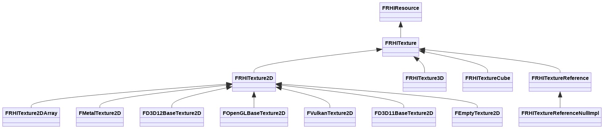

需要注意，上图做了简化，除了FRHITexture2D会被各个图形API继承子类，其它纹理类型（如FRHITexture2DArray、FRHITexture3D、FRHITextureCube、FRHITextureReference）也会被各个平台继承并实现。

## **10.2.3 FRHICommand**

FRHICommand是RHI模块的渲染指令基类，这些指令通常由渲染线程通过命令队列Push到RHI线程，在合适的时机由RHI线程执行。FRHICommand同时又继承自FRHICommandBase，它们的定义如下：

```c++
// Engine\Source\Runtime\RHI\Public\RHICommandList.h

// RHI命令基类.
struct FRHICommandBase
{
    // 下一个命令. (命令链表的节点)
    FRHICommandBase* Next = nullptr;
    
    // 执行命令后销毁.
    virtual void ExecuteAndDestruct(FRHICommandListBase& CmdList, FRHICommandListDebugContext& DebugContext) = 0;
};

emplate<typename TCmd, typename NameType = FUnnamedRhiCommand>
struct FRHICommand : public FRHICommandBase
{
    // 执行命令后销毁.
    void ExecuteAndDestruct(FRHICommandListBase& CmdList, FRHICommandListDebugContext& Context) override final
    {
        TCmd *ThisCmd = static_cast<TCmd*>(this);
        ThisCmd->Execute(CmdList);
        ThisCmd->~TCmd();
    }
};
```

值得一提的是，FRHICommandBase有指向下一个节点的Next变量，意味着FRHICommandBase是命令链表的节点。FRHICommand拥有数量众多的子类，是通过特殊的宏来快速声明：

```c++
// 定义RHI命令子类的宏
#define FRHICOMMAND_MACRO(CommandName)                                \
struct PREPROCESSOR_JOIN(CommandName##String, __LINE__)                \
{                                                                    \
    static const TCHAR* TStr() { return TEXT(#CommandName); }        \
};                                                                    \
// 命令继承了FRHICommand.
struct CommandName final : public FRHICommand<CommandName, PREPROCESSOR_JOIN(CommandName##String, __LINE__)>
```

有了以上的宏，就可以快速定义FRHICommand的子类（亦即具体的RHI命令），例如：

```c++
FRHICOMMAND_MACRO(FRHICommandSetStencilRef)
{
    uint32 StencilRef;
    FORCEINLINE_DEBUGGABLE FRHICommandSetStencilRef(uint32 InStencilRef)
        : StencilRef(InStencilRef)
    {
    }
    RHI_API void Execute(FRHICommandListBase& CmdList);
};
```

展开宏定义之后，代码如下：

```c++
struct FRHICommandSetStencilRefString853
{
    static const TCHAR* TStr() { return TEXT("FRHICommandSetStencilRef"); }
};

// FRHICommandSetStencilRef继承了FRHICommand.
struct FRHICommandSetStencilRef final : public FRHICommand<FRHICommandSetStencilRef, FRHICommandSetStencilRefString853>
{
    uint32 StencilRef;
    FRHICommandSetStencilRef(uint32 InStencilRef)
        : StencilRef(InStencilRef)
    {
    }
    RHI_API void Execute(FRHICommandListBase& CmdList);
};
```

利用FRHICOMMAND_MACRO声明的RHI命令数量众多，下面列举其中一部分：

```c++
FRHICOMMAND_MACRO(FRHISyncFrameCommand)
FRHICOMMAND_MACRO(FRHICommandStat)
FRHICOMMAND_MACRO(FRHICommandRHIThreadFence)
FRHICOMMAND_MACRO(FRHIAsyncComputeSubmitList)
FRHICOMMAND_MACRO(FRHICommandSubmitSubList)

FRHICOMMAND_MACRO(FRHICommandWaitForAndSubmitSubListParallel)
FRHICOMMAND_MACRO(FRHICommandWaitForAndSubmitSubList)
FRHICOMMAND_MACRO(FRHICommandWaitForAndSubmitRTSubList)
FRHICOMMAND_MACRO(FRHICommandWaitForTemporalEffect)
FRHICOMMAND_MACRO(FRHICommandWaitForTemporalEffect)
FRHICOMMAND_MACRO(FRHICommandBroadcastTemporalEffect)
    
FRHICOMMAND_MACRO(FRHICommandBeginUpdateMultiFrameResource)
FRHICOMMAND_MACRO(FRHICommandEndUpdateMultiFrameResource)
FRHICOMMAND_MACRO(FRHICommandBeginUpdateMultiFrameUAV)
FRHICOMMAND_MACRO(FRHICommandEndUpdateMultiFrameUAV)
FRHICOMMAND_MACRO(FRHICommandSetGPUMask)

FRHICOMMAND_MACRO(FRHICommandSetStencilRef)
FRHICOMMAND_MACRO(FRHICommandSetBlendFactor)
FRHICOMMAND_MACRO(FRHICommandSetStreamSource)
FRHICOMMAND_MACRO(FRHICommandSetStreamSource)
FRHICOMMAND_MACRO(FRHICommandSetViewport)
FRHICOMMAND_MACRO(FRHICommandSetScissorRect)
    
FRHICOMMAND_MACRO(FRHICommandBeginRenderPass)
FRHICOMMAND_MACRO(FRHICommandEndRenderPass)
FRHICOMMAND_MACRO(FRHICommandNextSubpass)
FRHICOMMAND_MACRO(FRHICommandBeginParallelRenderPass)
FRHICOMMAND_MACRO(FRHICommandEndParallelRenderPass)
FRHICOMMAND_MACRO(FRHICommandBeginRenderSubPass)
FRHICOMMAND_MACRO(FRHICommandEndRenderSubPass)
    
FRHICOMMAND_MACRO(FRHICommandDrawPrimitive)
FRHICOMMAND_MACRO(FRHICommandDrawIndexedPrimitive)
FRHICOMMAND_MACRO(FRHICommandDrawPrimitiveIndirect)
FRHICOMMAND_MACRO(FRHICommandDrawIndexedIndirect)
FRHICOMMAND_MACRO(FRHICommandDrawIndexedPrimitiveIndirect)
    
FRHICOMMAND_MACRO(FRHICommandSetGraphicsPipelineState)
FRHICOMMAND_MACRO(FRHICommandBeginUAVOverlap)
FRHICOMMAND_MACRO(FRHICommandEndUAVOverlap)

FRHICOMMAND_MACRO(FRHICommandSetDepthBounds)
FRHICOMMAND_MACRO(FRHICommandSetShadingRate)
FRHICOMMAND_MACRO(FRHICommandSetShadingRateImage)
FRHICOMMAND_MACRO(FRHICommandClearUAVFloat)
FRHICOMMAND_MACRO(FRHICommandCopyToResolveTarget)
FRHICOMMAND_MACRO(FRHICommandCopyTexture)
FRHICOMMAND_MACRO(FRHICommandBeginTransitions)
FRHICOMMAND_MACRO(FRHICommandEndTransitions)
FRHICOMMAND_MACRO(FRHICommandResourceTransition)
FRHICOMMAND_MACRO(FRHICommandClearColorTexture)
FRHICOMMAND_MACRO(FRHICommandClearDepthStencilTexture)
FRHICOMMAND_MACRO(FRHICommandClearColorTextures)

FRHICOMMAND_MACRO(FRHICommandSetGlobalUniformBuffers)
FRHICOMMAND_MACRO(FRHICommandBuildLocalUniformBuffer)

FRHICOMMAND_MACRO(FRHICommandBeginRenderQuery)
FRHICOMMAND_MACRO(FRHICommandEndRenderQuery)
FRHICOMMAND_MACRO(FRHICommandPollOcclusionQueries)

FRHICOMMAND_MACRO(FRHICommandBeginScene)
FRHICOMMAND_MACRO(FRHICommandEndScene)
FRHICOMMAND_MACRO(FRHICommandBeginFrame)
FRHICOMMAND_MACRO(FRHICommandEndFrame)
FRHICOMMAND_MACRO(FRHICommandBeginDrawingViewport)
FRHICOMMAND_MACRO(FRHICommandEndDrawingViewport)

FRHICOMMAND_MACRO(FRHICommandInvalidateCachedState)
FRHICOMMAND_MACRO(FRHICommandDiscardRenderTargets)

FRHICOMMAND_MACRO(FRHICommandUpdateTextureReference)
FRHICOMMAND_MACRO(FRHICommandUpdateRHIResources)
FRHICOMMAND_MACRO(FRHICommandBackBufferWaitTrackingBeginFrame)
FRHICOMMAND_MACRO(FRHICommandFlushTextureCacheBOP)
FRHICOMMAND_MACRO(FRHICommandCopyBufferRegion)
FRHICOMMAND_MACRO(FRHICommandCopyBufferRegions)

FRHICOMMAND_MACRO(FClearCachedRenderingDataCommand)
FRHICOMMAND_MACRO(FClearCachedElementDataCommand)

FRHICOMMAND_MACRO(FRHICommandRayTraceOcclusion)
FRHICOMMAND_MACRO(FRHICommandRayTraceIntersection)
FRHICOMMAND_MACRO(FRHICommandRayTraceDispatch)
FRHICOMMAND_MACRO(FRHICommandSetRayTracingBindings)
FRHICOMMAND_MACRO(FRHICommandClearRayTracingBindings)
```

FRHICommand的子类除了以上用FRHICOMMAND_MACRO声明的，还拥有以下直接派生的：

- FRHICommandSetShaderParameter
- FRHICommandSetShaderUniformBuffer
- FRHICommandSetShaderTexture
- FRHICommandSetShaderResourceViewParameter
- FRHICommandSetUAVParameter
- FRHICommandSetShaderSampler
- FRHICommandSetComputeShader
- FRHICommandSetComputePipelineState
- FRHICommandDispatchComputeShader
- FRHICommandDispatchIndirectComputeShader
- FRHICommandSetAsyncComputeBudget
- FRHICommandCopyToStagingBuffer
- FRHICommandWriteGPUFence
- FRHICommandSetLocalUniformBuffer
- FRHICommandSubmitCommandsHint
- FRHICommandPushEvent
- FRHICommandPopEvent
- FRHICommandBuildAccelerationStructure
- FRHICommandBuildAccelerationStructures
- ......

无论是直接派生还是用FRHICOMMAND_MACRO，没有本质的区别，都是FRHICommand的子类，都是可以提供给渲染线程操作的RHI层中间渲染命令。只是用FRHICOMMAND_MACRO会更简便，少写一些重复的代码罢了。

因此可知，RHI命令种类繁多，主要包含以下几大类：

- 数据和资源的设置、更新、清理、转换、拷贝、回读。
- 图元绘制。
- Pass、SubPass、场景、ViewPort等的开始和结束事件。
- 栅栏、等待、广播接口。
- 光线追踪。
- Slate、调试相关的命令。

下面绘制出FRHICommand的核心继承体系：

FRHICommandBaseFRHICommandBase* NextExecuteAndDestruct(）FRHICommandFRHICommandDrawPrimitiveFRHICommandWaitForAndSubmitSubListFRHICommandResourceTransitionetc

## **10.2.4 FRHICommandList**

FRHICommandList是RHI的指令队列，用来管理、执行一组FRHICommand的对象。它和父类的定义如下：

```c++
// Engine\Source\Runtime\RHI\Public\RHICommandList.h

// RHI命令列表基类.
class FRHICommandListBase : public FNoncopyable
{
public:
    ~FRHICommandListBase();

    // 附带了循环利用的自定义new/delete操作.
    void* operator new(size_t Size);
    void operator delete(void *RawMemory);

    // 刷新命令队列.
    inline void Flush();
    // 是否立即模式.
    inline bool IsImmediate();
    // 是否立即的异步计算.
    inline bool IsImmediateAsyncCompute();

    // 获取已占用的内存.
    const int32 GetUsedMemory() const;
    
    // 入队异步命令队列的提交.
    void QueueAsyncCommandListSubmit(FGraphEventRef& AnyThreadCompletionEvent, class FRHICommandList* CmdList);
    // 入队并行的异步命令队列的提交.
    void QueueParallelAsyncCommandListSubmit(FGraphEventRef* AnyThreadCompletionEvents, bool bIsPrepass, class FRHICommandList** CmdLists, int32* NumDrawsIfKnown, int32 Num, int32 MinDrawsPerTranslate, bool bSpewMerge);
    // 入队渲染线程命令队列的提交.
    void QueueRenderThreadCommandListSubmit(FGraphEventRef& RenderThreadCompletionEvent, class FRHICommandList* CmdList);
    // 入队命令队列的提交.
    void QueueCommandListSubmit(class FRHICommandList* CmdList);
    // 增加派发前序任务.
    void AddDispatchPrerequisite(const FGraphEventRef& Prereq);
    
    // 等待接口.
    void WaitForTasks(bool bKnownToBeComplete = false);
    void WaitForDispatch();
    void WaitForRHIThreadTasks();
    void HandleRTThreadTaskCompletion(const FGraphEventRef& MyCompletionGraphEvent);

    // 分配接口.
    void* Alloc(int32 AllocSize, int32 Alignment);
    template <typename T>
    void* Alloc();
    template <typename T>
    const TArrayView<T> AllocArray(const TArrayView<T> InArray);
    TCHAR* AllocString(const TCHAR* Name);
    // 分配指令.
    void* AllocCommand(int32 AllocSize, int32 Alignment);
    template <typename TCmd>
    void* AllocCommand();

    bool HasCommands() const;
    bool IsExecuting() const;
    bool IsBottomOfPipe() const;
    bool IsTopOfPipe() const;
    bool IsGraphics() const;
    bool IsAsyncCompute() const;
    // RHI管线, ERHIPipeline::Graphics或ERHIPipeline::AsyncCompute.
    ERHIPipeline GetPipeline() const;

    // 是否忽略RHI线程而直接当同步执行.
    bool Bypass() const;

    // 交换命令队列.
    void ExchangeCmdList(FRHICommandListBase& Other);
    // 设置Context.
    void SetContext(IRHICommandContext* InContext);
    IRHICommandContext& GetContext();
    void SetComputeContext(IRHIComputeContext* InComputeContext);
    IRHIComputeContext& GetComputeContext();
    void CopyContext(FRHICommandListBase& ParentCommandList);
    
    void MaybeDispatchToRHIThread();
    void MaybeDispatchToRHIThreadInner();
    
    (......)

private:
    // 命令链表的头.
    FRHICommandBase* Root;
    // 指向Root的指针.
    FRHICommandBase** CommandLink;
    
    bool bExecuting;
    uint32 NumCommands;
    uint32 UID;
    
    // 设备上下文.
    IRHICommandContext* Context;
    // 计算上下文.
    IRHIComputeContext* ComputeContext;
    
    FMemStackBase MemManager; 
    FGraphEventArray RTTasks;

    // 重置.
    void Reset();

public:
    enum class ERenderThreadContext
    {
        SceneRenderTargets,
        Num
    };
    
    // 渲染线程上下文.
    void *RenderThreadContexts[(int32)ERenderThreadContext::Num];

protected:
    //the values of this struct must be copied when the commandlist is split 
    struct FPSOContext
    {
        uint32 CachedNumSimultanousRenderTargets = 0;
        TStaticArray<FRHIRenderTargetView, MaxSimultaneousRenderTargets> CachedRenderTargets;
        FRHIDepthRenderTargetView CachedDepthStencilTarget;
        
        ESubpassHint SubpassHint = ESubpassHint::None;
        uint8 SubpassIndex = 0;
        uint8 MultiViewCount = 0;
        bool HasFragmentDensityAttachment = false;
    } PSOContext;

    // 绑定的着色器输入.
    FBoundShaderStateInput BoundShaderInput;
    // 绑定的计算着色器RHI资源.
    FRHIComputeShader* BoundComputeShaderRHI;

    // 使绑定的着色器生效.
    void ValidateBoundShader(FRHIVertexShader* ShaderRHI);
    void ValidateBoundShader(FRHIPixelShader* ShaderRHI);
    (......)

    void CacheActiveRenderTargets(...);
    void CacheActiveRenderTargets(const FRHIRenderPassInfo& Info);
    void IncrementSubpass();
    void ResetSubpass(ESubpassHint SubpassHint);
    
public:
    void CopyRenderThreadContexts(const FRHICommandListBase& ParentCommandList);
    void SetRenderThreadContext(void* InContext, ERenderThreadContext Slot);
    void* GetRenderThreadContext(ERenderThreadContext Slot);

    // 通用数据.
    struct FCommonData
    {
        class FRHICommandListBase* Parent = nullptr;

        enum class ECmdListType
        {
            Immediate = 1,
            Regular,
        };
        ECmdListType Type = ECmdListType::Regular;
        bool bInsideRenderPass = false;
        bool bInsideComputePass = false;
    };

    bool DoValidation() const;
    inline bool IsOutsideRenderPass() const;
    inline bool IsInsideRenderPass() const;
    inline bool IsInsideComputePass() const;

    FCommonData Data;
};

// 计算命令队列.
class FRHIComputeCommandList : public FRHICommandListBase
{
public:
    FRHIComputeCommandList(FRHIGPUMask GPUMask) : FRHICommandListBase(GPUMask) {}
    
    void* operator new(size_t Size);
    void operator delete(void *RawMemory);

    // 着色器参数设置和获取.
    inline FRHIComputeShader* GetBoundComputeShader() const;
    void SetGlobalUniformBuffers(const FUniformBufferStaticBindings& UniformBuffers);
    void SetShaderUniformBuffer(FRHIComputeShader* Shader, uint32 BaseIndex, FRHIUniformBuffer* UniformBuffer);
    void SetShaderUniformBuffer(const FComputeShaderRHIRef& Shader, uint32 BaseIndex, FRHIUniformBuffer* UniformBuffer);
    void SetShaderParameter(FRHIComputeShader* Shader, uint32 BufferIndex, uint32 BaseIndex, uint32 NumBytes, const void* NewValue);
    void SetShaderParameter(FComputeShaderRHIRef& Shader, uint32 BufferIndex, uint32 BaseIndex, uint32 NumBytes, const void* NewValue);
    void SetShaderTexture(FRHIComputeShader* Shader, uint32 TextureIndex, FRHITexture* Texture);
    void SetShaderResourceViewParameter(FRHIComputeShader* Shader, uint32 SamplerIndex, FRHIShaderResourceView* SRV);
    void SetShaderSampler(FRHIComputeShader* Shader, uint32 SamplerIndex, FRHISamplerState* State);
    void SetUAVParameter(FRHIComputeShader* Shader, uint32 UAVIndex, FRHIUnorderedAccessView* UAV);
    void SetUAVParameter(FRHIComputeShader* Shader, uint32 UAVIndex, FRHIUnorderedAccessView* UAV, uint32 InitialCount);
    void SetComputeShader(FRHIComputeShader* ComputeShader);
    void SetComputePipelineState(FComputePipelineState* ComputePipelineState, FRHIComputeShader* ComputeShader);

    void SetAsyncComputeBudget(EAsyncComputeBudget Budget);
    // 派发计算着色器.
    void DispatchComputeShader(uint32 ThreadGroupCountX, uint32 ThreadGroupCountY, uint32 ThreadGroupCountZ);
    void DispatchIndirectComputeShader(FRHIVertexBuffer* ArgumentBuffer, uint32 ArgumentOffset);

    // 清理.
    void ClearUAVFloat(FRHIUnorderedAccessView* UnorderedAccessViewRHI, const FVector4& Values);
    void ClearUAVUint(FRHIUnorderedAccessView* UnorderedAccessViewRHI, const FUintVector4& Values);
    
    // 资源转换.
    void BeginTransitions(TArrayView<const FRHITransition*> Transitions);
    void EndTransitions(TArrayView<const FRHITransition*> Transitions);
    inline void Transition(TArrayView<const FRHITransitionInfo> Infos);
    void BeginTransition(const FRHITransition* Transition);
    void EndTransition(const FRHITransition* Transition);
    void Transition(const FRHITransitionInfo& Info)

    // ---- 旧有的API ----

    void TransitionResource(ERHIAccess TransitionType, const FTextureRHIRef& InTexture);
    void TransitionResource(ERHIAccess TransitionType, FRHITexture* InTexture);
    inline void TransitionResources(ERHIAccess TransitionType, FRHITexture* const* InTextures, int32 NumTextures);
    void TransitionResourceArrayNoCopy(ERHIAccess TransitionType, TArray<FRHITexture*>& InTextures);
    inline void TransitionResources(ERHIAccess TransitionType, EResourceTransitionPipeline /* ignored TransitionPipeline */, FRHIUnorderedAccessView* const* InUAVs, int32 NumUAVs, FRHIComputeFence* WriteFence);
    void TransitionResource(ERHIAccess TransitionType, EResourceTransitionPipeline TransitionPipeline, FRHIUnorderedAccessView* InUAV, FRHIComputeFence* WriteFence);
    void TransitionResource(ERHIAccess TransitionType, EResourceTransitionPipeline TransitionPipeline, FRHIUnorderedAccessView* InUAV);
    void TransitionResources(ERHIAccess TransitionType, EResourceTransitionPipeline TransitionPipeline, FRHIUnorderedAccessView* const* InUAVs, int32 NumUAVs);
    void WaitComputeFence(FRHIComputeFence* WaitFence);

    void BeginUAVOverlap();
    void EndUAVOverlap();
    void BeginUAVOverlap(FRHIUnorderedAccessView* UAV);
    void EndUAVOverlap(FRHIUnorderedAccessView* UAV);
    void BeginUAVOverlap(TArrayView<FRHIUnorderedAccessView* const> UAVs);
    void EndUAVOverlap(TArrayView<FRHIUnorderedAccessView* const> UAVs);

    void PushEvent(const TCHAR* Name, FColor Color);
    void PopEvent();
    void BreakPoint();

    void SubmitCommandsHint();
    void CopyToStagingBuffer(FRHIVertexBuffer* SourceBuffer, FRHIStagingBuffer* DestinationStagingBuffer, uint32 Offset, uint32 NumBytes);

    void WriteGPUFence(FRHIGPUFence* Fence);
    void SetGPUMask(FRHIGPUMask InGPUMask);

    (......)
};

// RHI命令队列.
class FRHICommandList : public FRHIComputeCommandList
{
public:
    FRHICommandList(FRHIGPUMask GPUMask) : FRHIComputeCommandList(GPUMask) {}

    bool AsyncPSOCompileAllowed() const;

    void* operator new(size_t Size);
    void operator delete(void *RawMemory);
    
    // 获取绑定的着色器.
    inline FRHIVertexShader* GetBoundVertexShader() const;
    inline FRHIHullShader* GetBoundHullShader() const;
    inline FRHIDomainShader* GetBoundDomainShader() const;
    inline FRHIPixelShader* GetBoundPixelShader() const;
    inline FRHIGeometryShader* GetBoundGeometryShader() const;

    // 更新多帧资源.
    void BeginUpdateMultiFrameResource(FRHITexture* Texture);
    void EndUpdateMultiFrameResource(FRHITexture* Texture);
    void BeginUpdateMultiFrameResource(FRHIUnorderedAccessView* UAV);
    void EndUpdateMultiFrameResource(FRHIUnorderedAccessView* UAV);

    // Uniform Buffer接口.
    FLocalUniformBuffer BuildLocalUniformBuffer(const void* Contents, uint32 ContentsSize, const FRHIUniformBufferLayout& Layout);
    template <typename TRHIShader>
    void SetLocalShaderUniformBuffer(TRHIShader* Shader, uint32 BaseIndex, const FLocalUniformBuffer& UniformBuffer);
    template <typename TShaderRHI>
    void SetLocalShaderUniformBuffer(const TRefCountPtr<TShaderRHI>& Shader, uint32 BaseIndex, const FLocalUniformBuffer& UniformBuffer);
    void SetShaderUniformBuffer(FRHIGraphicsShader* Shader, uint32 BaseIndex, FRHIUniformBuffer* UniformBuffer);
    template <typename TShaderRHI>
    FORCEINLINE void SetShaderUniformBuffer(const TRefCountPtr<TShaderRHI>& Shader, uint32 BaseIndex, FRHIUniformBuffer* UniformBuffer);
    
    // 着色器参数.
    void SetShaderParameter(FRHIGraphicsShader* Shader, uint32 BufferIndex, uint32 BaseIndex, uint32 NumBytes, const void* NewValue);
    template <typename TShaderRHI>
    void SetShaderParameter(const TRefCountPtr<TShaderRHI>& Shader, uint32 BufferIndex, uint32 BaseIndex, uint32 NumBytes, const void* NewValue);
    void SetShaderTexture(FRHIGraphicsShader* Shader, uint32 TextureIndex, FRHITexture* Texture);
    template <typename TShaderRHI>
    void SetShaderTexture(const TRefCountPtr<TShaderRHI>& Shader, uint32 TextureIndex, FRHITexture* Texture);
    void SetShaderResourceViewParameter(FRHIGraphicsShader* Shader, uint32 SamplerIndex, FRHIShaderResourceView* SRV);
    template <typename TShaderRHI>
    void SetShaderResourceViewParameter(const TRefCountPtr<TShaderRHI>& Shader, uint32 SamplerIndex, FRHIShaderResourceView* SRV);
    void SetShaderSampler(FRHIGraphicsShader* Shader, uint32 SamplerIndex, FRHISamplerState* State);
    template <typename TShaderRHI>
    void SetShaderSampler(const TRefCountPtr<TShaderRHI>& Shader, uint32 SamplerIndex, FRHISamplerState* State);
    void SetUAVParameter(FRHIPixelShader* Shader, uint32 UAVIndex, FRHIUnorderedAccessView* UAV);
    void SetUAVParameter(const TRefCountPtr<FRHIPixelShader>& Shader, uint32 UAVIndex, FRHIUnorderedAccessView* UAV);
    void SetBlendFactor(const FLinearColor& BlendFactor = FLinearColor::White);
    
    // 图元绘制.
    void DrawPrimitive(uint32 BaseVertexIndex, uint32 NumPrimitives, uint32 NumInstances);
    void DrawIndexedPrimitive(FRHIIndexBuffer* IndexBuffer, int32 BaseVertexIndex, uint32 FirstInstance, uint32 NumVertices, uint32 StartIndex, uint32 NumPrimitives, uint32 NumInstances);
    void DrawPrimitiveIndirect(FRHIVertexBuffer* ArgumentBuffer, uint32 ArgumentOffset);
    void DrawIndexedIndirect(FRHIIndexBuffer* IndexBufferRHI, FRHIStructuredBuffer* ArgumentsBufferRHI, uint32 DrawArgumentsIndex, uint32 NumInstances);
    void DrawIndexedPrimitiveIndirect(FRHIIndexBuffer* IndexBuffer, FRHIVertexBuffer* ArgumentsBuffer, uint32 ArgumentOffset);
    
    // 设置数据.
    void SetStreamSource(uint32 StreamIndex, FRHIVertexBuffer* VertexBuffer, uint32 Offset);
    void SetStencilRef(uint32 StencilRef);
    void SetViewport(float MinX, float MinY, float MinZ, float MaxX, float MaxY, float MaxZ);
    void SetStereoViewport(float LeftMinX, float RightMinX, float LeftMinY, float RightMinY, float MinZ, float LeftMaxX, float RightMaxX, float LeftMaxY, float RightMaxY, float MaxZ);
    void SetScissorRect(bool bEnable, uint32 MinX, uint32 MinY, uint32 MaxX, uint32 MaxY);
    void ApplyCachedRenderTargets(FGraphicsPipelineStateInitializer& GraphicsPSOInit);
    void SetGraphicsPipelineState(class FGraphicsPipelineState* GraphicsPipelineState, const FBoundShaderStateInput& ShaderInput, bool bApplyAdditionalState);
    void SetDepthBounds(float MinDepth, float MaxDepth);
    void SetShadingRate(EVRSShadingRate ShadingRate, EVRSRateCombiner Combiner);
    void SetShadingRateImage(FRHITexture* RateImageTexture, EVRSRateCombiner Combiner);
    
    // 拷贝纹理.
    void CopyToResolveTarget(FRHITexture* SourceTextureRHI, FRHITexture* DestTextureRHI, const FResolveParams& ResolveParams);
    void CopyTexture(FRHITexture* SourceTextureRHI, FRHITexture* DestTextureRHI, const FRHICopyTextureInfo& CopyInfo);
    
    void ResummarizeHTile(FRHITexture2D* DepthTexture);
    
    // 渲染查询.
    void BeginRenderQuery(FRHIRenderQuery* RenderQuery)
    void EndRenderQuery(FRHIRenderQuery* RenderQuery)
    void CalibrateTimers(FRHITimestampCalibrationQuery* CalibrationQuery);
    void PollOcclusionQueries()

    /* LEGACY API */
    void TransitionResource(FExclusiveDepthStencil DepthStencilMode, FRHITexture* DepthTexture);
    void BeginRenderPass(const FRHIRenderPassInfo& InInfo, const TCHAR* Name);
    void EndRenderPass();
    void NextSubpass();

    // 下面接口需要在立即模式的命令队列调用.
    void BeginScene();
    void EndScene();
    void BeginDrawingViewport(FRHIViewport* Viewport, FRHITexture* RenderTargetRHI);
    void EndDrawingViewport(FRHIViewport* Viewport, bool bPresent, bool bLockToVsync);
    void BeginFrame();
    void EndFrame();

    void RHIInvalidateCachedState();
    void DiscardRenderTargets(bool Depth, bool Stencil, uint32 ColorBitMask);
    
    void CopyBufferRegion(FRHIVertexBuffer* DestBuffer, uint64 DstOffset, FRHIVertexBuffer* SourceBuffer, uint64 SrcOffset, uint64 NumBytes);

    (......)
};
```

FRHICommandListBase定义了命令队列所需的基本数据（命令列表、设备上下文）和接口（命令的刷新、等待、入队、派发等，内存分配）。FRHIComputeCommandList定义了计算着色器相关的接口、GPU资源状态转换和着色器部分参数的设置。FRHICommandList定义了普通渲染管线的接口，包含VS、PS、GS的绑定，图元绘制，更多着色器参数的设置和资源状态转换，资源创建、更新和等待等等。

FRHICommandList还有数个子类，定义如下：

```c++
// 立即模式的命令队列.
class FRHICommandListImmediate : public FRHICommandList
{
    // 命令匿名函数.
    template <typename LAMBDA>
    struct TRHILambdaCommand final : public FRHICommandBase
    {
        LAMBDA Lambda;

        void ExecuteAndDestruct(FRHICommandListBase& CmdList, FRHICommandListDebugContext&) override final;
    };

    FRHICommandListImmediate();
    ~FRHICommandListImmediate();
    
public:
    // 立即刷新命令.
    void ImmediateFlush(EImmediateFlushType::Type FlushType);
    // 阻塞RHI线程.
    bool StallRHIThread();
    // 取消阻塞RHI线程.
    void UnStallRHIThread();
    // 是否阻塞中.
    static bool IsStalled();

    void SetCurrentStat(TStatId Stat);

    static FGraphEventRef RenderThreadTaskFence();
    static FGraphEventArray& GetRenderThreadTaskArray();
    static void WaitOnRenderThreadTaskFence(FGraphEventRef& Fence);
    static bool AnyRenderThreadTasksOutstanding();
    FGraphEventRef RHIThreadFence(bool bSetLockFence = false);

    // 将给定的异步计算命令列表按当前立即命令列表的顺序排列.
    void QueueAsyncCompute(FRHIComputeCommandList& RHIComputeCmdList);

    bool IsBottomOfPipe();
    bool IsTopOfPipe();
    template <typename LAMBDA>
    void EnqueueLambda(LAMBDA&& Lambda);

    // 资源创建.
    FSamplerStateRHIRef CreateSamplerState(const FSamplerStateInitializerRHI& Initializer)
    FRasterizerStateRHIRef CreateRasterizerState(const FRasterizerStateInitializerRHI& Initializer)
    FDepthStencilStateRHIRef CreateDepthStencilState(const FDepthStencilStateInitializerRHI& Initializer)
    FBlendStateRHIRef CreateBlendState(const FBlendStateInitializerRHI& Initializer)
    FPixelShaderRHIRef CreatePixelShader(TArrayView<const uint8> Code, const FSHAHash& Hash)
    FVertexShaderRHIRef CreateVertexShader(TArrayView<const uint8> Code, const FSHAHash& Hash)
    FHullShaderRHIRef CreateHullShader(TArrayView<const uint8> Code, const FSHAHash& Hash)
    FDomainShaderRHIRef CreateDomainShader(TArrayView<const uint8> Code, const FSHAHash& Hash)
    FGeometryShaderRHIRef CreateGeometryShader(TArrayView<const uint8> Code, const FSHAHash& Hash)
    FComputeShaderRHIRef CreateComputeShader(TArrayView<const uint8> Code, const FSHAHash& Hash)
    FComputeFenceRHIRef CreateComputeFence(const FName& Name)
    FGPUFenceRHIRef CreateGPUFence(const FName& Name)
    FStagingBufferRHIRef CreateStagingBuffer()
    FBoundShaderStateRHIRef CreateBoundShaderState(...)
    FGraphicsPipelineStateRHIRef CreateGraphicsPipelineState(const FGraphicsPipelineStateInitializer& Initializer)
    TRefCountPtr<FRHIComputePipelineState> CreateComputePipelineState(FRHIComputeShader* ComputeShader)
    FUniformBufferRHIRef CreateUniformBuffer(...)
    FIndexBufferRHIRef CreateAndLockIndexBuffer(uint32 Stride, uint32 Size, EBufferUsageFlags InUsage, ERHIAccess InResourceState, FRHIResourceCreateInfo& CreateInfo, void*& OutDataBuffer)
    FIndexBufferRHIRef CreateAndLockIndexBuffer(uint32 Stride, uint32 Size, uint32 InUsage, FRHIResourceCreateInfo& CreateInfo, void*& OutDataBuffer)
    
    // 顶点/索引接口.
    void* LockIndexBuffer(FRHIIndexBuffer* IndexBuffer, uint32 Offset, uint32 SizeRHI, EResourceLockMode LockMode);
    void UnlockIndexBuffer(FRHIIndexBuffer* IndexBuffer);
    void* LockStagingBuffer(FRHIStagingBuffer* StagingBuffer, FRHIGPUFence* Fence, uint32 Offset, uint32 SizeRHI);
    void UnlockStagingBuffer(FRHIStagingBuffer* StagingBuffer);
    FVertexBufferRHIRef CreateAndLockVertexBuffer(uint32 Size, EBufferUsageFlags InUsage, ...);
    FVertexBufferRHIRef CreateAndLockVertexBuffer(uint32 Size, uint32 InUsage, FRHIResourceCreateInfo& CreateInfo, void*& OutDataBuffer);
    void* LockVertexBuffer(FRHIVertexBuffer* VertexBuffer, uint32 Offset, uint32 SizeRHI, EResourceLockMode LockMode);
    void UnlockVertexBuffer(FRHIVertexBuffer* VertexBuffer);
    void CopyVertexBuffer(FRHIVertexBuffer* SourceBuffer, FRHIVertexBuffer* DestBuffer);
    void* LockStructuredBuffer(FRHIStructuredBuffer* StructuredBuffer, uint32 Offset, uint32 SizeRHI, EResourceLockMode LockMode);
    void UnlockStructuredBuffer(FRHIStructuredBuffer* StructuredBuffer);
    
    // UAV/SRV创建.
    FUnorderedAccessViewRHIRef CreateUnorderedAccessView(FRHIStructuredBuffer* StructuredBuffer, bool bUseUAVCounter, bool bAppendBuffer)
    FUnorderedAccessViewRHIRef CreateUnorderedAccessView(FRHITexture* Texture, uint32 MipLevel)
    FUnorderedAccessViewRHIRef CreateUnorderedAccessView(FRHITexture* Texture, uint32 MipLevel, uint8 Format)
    FUnorderedAccessViewRHIRef CreateUnorderedAccessView(FRHIVertexBuffer* VertexBuffer, uint8 Format)
    FUnorderedAccessViewRHIRef CreateUnorderedAccessView(FRHIIndexBuffer* IndexBuffer, uint8 Format)
    FShaderResourceViewRHIRef CreateShaderResourceView(FRHIStructuredBuffer* StructuredBuffer)
    FShaderResourceViewRHIRef CreateShaderResourceView(FRHIVertexBuffer* VertexBuffer, uint32 Stride, uint8 Format)
    FShaderResourceViewRHIRef CreateShaderResourceView(const FShaderResourceViewInitializer& Initializer)
    FShaderResourceViewRHIRef CreateShaderResourceView(FRHIIndexBuffer* Buffer)
        
    uint64 CalcTexture2DPlatformSize(...);
    uint64 CalcTexture3DPlatformSize(...);
    uint64 CalcTextureCubePlatformSize(...);
    
    // 纹理操作.
    void GetTextureMemoryStats(FTextureMemoryStats& OutStats);
    bool GetTextureMemoryVisualizeData(...);
    void CopySharedMips(FRHITexture2D* DestTexture2D, FRHITexture2D* SrcTexture2D);
    void TransferTexture(FRHITexture2D* Texture, FIntRect Rect, uint32 SrcGPUIndex, uint32 DestGPUIndex, bool PullData);
    void TransferTextures(const TArrayView<const FTransferTextureParams> Params);
    void GetResourceInfo(FRHITexture* Ref, FRHIResourceInfo& OutInfo);
    FShaderResourceViewRHIRef CreateShaderResourceView(FRHITexture* Texture, const FRHITextureSRVCreateInfo& CreateInfo);
    FShaderResourceViewRHIRef CreateShaderResourceView(FRHITexture* Texture, uint8 MipLevel);
    FShaderResourceViewRHIRef CreateShaderResourceView(FRHITexture* Texture, uint8 MipLevel, uint8 NumMipLevels, uint8 Format);
    FShaderResourceViewRHIRef CreateShaderResourceViewWriteMask(FRHITexture2D* Texture2DRHI);
    FShaderResourceViewRHIRef CreateShaderResourceViewFMask(FRHITexture2D* Texture2DRHI);
    uint32 ComputeMemorySize(FRHITexture* TextureRHI);
    FTexture2DRHIRef AsyncReallocateTexture2D(...);
    ETextureReallocationStatus FinalizeAsyncReallocateTexture2D(FRHITexture2D* Texture2D, bool bBlockUntilCompleted);
    ETextureReallocationStatus CancelAsyncReallocateTexture2D(FRHITexture2D* Texture2D, bool bBlockUntilCompleted);
    void* LockTexture2D(...);
    void UnlockTexture2D(FRHITexture2D* Texture, uint32 MipIndex, bool bLockWithinMiptail, bool bFlushRHIThread = true);
    void* LockTexture2DArray(...);
    void UnlockTexture2DArray(FRHITexture2DArray* Texture, uint32 TextureIndex, uint32 MipIndex, bool bLockWithinMiptail);
    void UpdateTexture2D(...);
    void UpdateFromBufferTexture2D(...);
    FUpdateTexture3DData BeginUpdateTexture3D(...);
    void EndUpdateTexture3D(FUpdateTexture3DData& UpdateData);
    void EndMultiUpdateTexture3D(TArray<FUpdateTexture3DData>& UpdateDataArray);
    void UpdateTexture3D(...);
    void* LockTextureCubeFace(...);
    void UnlockTextureCubeFace(FRHITextureCube* Texture, ...);

    // 读取纹理表面数据.
    void ReadSurfaceData(FRHITexture* Texture, ...);
    void ReadSurfaceData(FRHITexture* Texture, ...);
    void MapStagingSurface(FRHITexture* Texture, void*& OutData, int32& OutWidth, int32& OutHeight);
    void MapStagingSurface(FRHITexture* Texture, ...);
    void UnmapStagingSurface(FRHITexture* Texture);
    void ReadSurfaceFloatData(FRHITexture* Texture, ...);
    void ReadSurfaceFloatData(FRHITexture* Texture, ...);
    void Read3DSurfaceFloatData(FRHITexture* Texture,...);
    
    // 渲染线程的资源状态转换.
    void AcquireTransientResource_RenderThread(FRHITexture* Texture);
    void DiscardTransientResource_RenderThread(FRHITexture* Texture);
    void AcquireTransientResource_RenderThread(FRHIVertexBuffer* Buffer);
    void DiscardTransientResource_RenderThread(FRHIVertexBuffer* Buffer);
    void AcquireTransientResource_RenderThread(FRHIStructuredBuffer* Buffer);
    void DiscardTransientResource_RenderThread(FRHIStructuredBuffer* Buffer);
   
    // 获取渲染查询结果.
    bool GetRenderQueryResult(FRHIRenderQuery* RenderQuery, ...);
    void PollRenderQueryResults();
    
    // 视口
    FViewportRHIRef CreateViewport(void* WindowHandle, ...);
    uint32 GetViewportNextPresentGPUIndex(FRHIViewport* Viewport);
    FTexture2DRHIRef GetViewportBackBuffer(FRHIViewport* Viewport);
    void AdvanceFrameForGetViewportBackBuffer(FRHIViewport* Viewport);
    void ResizeViewport(FRHIViewport* Viewport, ...);
    
    void AcquireThreadOwnership();
    void ReleaseThreadOwnership();
    
    // 提交命令并刷新到GPU.
    void SubmitCommandsAndFlushGPU();
    // 执行命令队列.
    void ExecuteCommandList(FRHICommandList* CmdList);
    
    // 更新资源.
    void UpdateTextureReference(FRHITextureReference* TextureRef, FRHITexture* NewTexture);
    void UpdateRHIResources(FRHIResourceUpdateInfo* UpdateInfos, int32 Num, bool bNeedReleaseRefs);
    // 刷新资源.
    void FlushResources();
    
    // 帧更新.
    void Tick(float DeltaTime);
    // 阻塞直到GPU空闲.
    void BlockUntilGPUIdle();
    
    // 暂停/开启渲染.
    void SuspendRendering();
    void ResumeRendering();
    bool IsRenderingSuspended();
    
    // 压缩/解压数据.
    bool EnqueueDecompress(uint8_t* SrcBuffer, uint8_t* DestBuffer, int CompressedSize, void* ErrorCodeBuffer);
    bool EnqueueCompress(uint8_t* SrcBuffer, uint8_t* DestBuffer, int UnCompressedSize, void* ErrorCodeBuffer);
    
    // 其它接口.
    bool GetAvailableResolutions(FScreenResolutionArray& Resolutions, bool bIgnoreRefreshRate);
    void GetSupportedResolution(uint32& Width, uint32& Height);
    void VirtualTextureSetFirstMipInMemory(FRHITexture2D* Texture, uint32 FirstMip);
    void VirtualTextureSetFirstMipVisible(FRHITexture2D* Texture, uint32 FirstMip);

    // 获取原生的数据.
    void* GetNativeDevice();
    void* GetNativeInstance();
    // 获取立即模式的命令上下文.
    IRHICommandContext* GetDefaultContext();
    // 获取命令上下文容器.
    IRHICommandContextContainer* GetCommandContextContainer(int32 Index, int32 Num);
    
    uint32 GetGPUFrameCycles();
};

// 在RHI实现中标记命令列表的递归使用的类型定义.
class FRHICommandList_RecursiveHazardous : public FRHICommandList
{
public:
    FRHICommandList_RecursiveHazardous(IRHICommandContext *Context, FRHIGPUMask InGPUMask = FRHIGPUMask::All());
};

// RHI内部使用的工具类，以更安全地使用FRHICommandList_RecursiveHazardous
template <typename ContextType>
class TRHICommandList_RecursiveHazardous : public FRHICommandList_RecursiveHazardous
{
    template <typename LAMBDA>
    struct TRHILambdaCommand final : public FRHICommandBase
    {
        LAMBDA Lambda;

        TRHILambdaCommand(LAMBDA&& InLambda);
        void ExecuteAndDestruct(FRHICommandListBase& CmdList, FRHICommandListDebugContext&) override final;
    };

public:
    TRHICommandList_RecursiveHazardous(ContextType *Context, FRHIGPUMask GPUMask = FRHIGPUMask::All());

    template <typename LAMBDA>
    void RunOnContext(LAMBDA&& Lambda);
};
```

FRHICommandListImmediate封装了立即模式的图形API接口，在UE渲染体系中被应用得非常广泛。它额外定义了资源的操作、创建、更新、读取和状态转换接口，也增加了线程同步和GPU同步的接口。

下面对FRHICommandList核心继承体系来个UML图总结一下：

FNoncopyableFRHICommandListBaseFRHICommandBase* RootFRHICommandBase** CommandLinkIRHICommandContext* ContextIRHIComputeContext* ComputeContextAllocCommand()Flush()WaitForXXX()QueueCommandListXXX()FRHIComputeCommandListDispatchComputeShader()DispatchIndirectComputeShader()SetShaderXXX()FRHICommandListSetShaderXXX()GetBoundXXXShader()DrawPrimitive()DrawXXX()FRHICommandListImmediateSubmitCommandsAndFlushGPU()ExecuteCommandList()ImmediateFlush()FlushResources()Tick()BlockUntilGPUIdle()StallRHIThread()UnStallRHIThread()SuspendRendering()ResumeRendering()CreateXXX()FRHICommandList_RecursiveHazardousTRHICommandList_RecursiveHazardous

 

# **10.3 RHIContext, DynamicRHI**

本章将阐述RHI Context、DynamicRHI的概念、类型和关联。

## **10.3.1 IRHICommandContext**

IRHICommandContext是RHI的命令上下文接口类，定义了一组图形API相关的操作。在可以并行处理命令列表的平台上，它是一个单独的对象。它和相关继承类型定义如下：

```c++
// Engine\Source\Runtime\RHI\Public\RHIContext.h

// 能够执行计算工作的上下文。可以在gfx管道上执行异步或计算.
class IRHIComputeContext
{
public:
    virtual ~IRHIComputeContext();

    // 设置/派发计算着色器.
    virtual void RHISetComputeShader(FRHIComputeShader* ComputeShader) = 0;
    virtual void RHISetComputePipelineState(FRHIComputePipelineState* ComputePipelineState);
    virtual void RHIDispatchComputeShader(uint32 ThreadGroupCountX, uint32 ThreadGroupCountY, uint32 ThreadGroupCountZ) = 0;
    virtual void RHIDispatchIndirectComputeShader(FRHIVertexBuffer* ArgumentBuffer, uint32 ArgumentOffset) = 0;
    virtual void RHISetAsyncComputeBudget(EAsyncComputeBudget Budget) {}
    
    // 转换资源.
    virtual void RHIBeginTransitions(TArrayView<const FRHITransition*> Transitions) = 0;
    virtual void RHIEndTransitions(TArrayView<const FRHITransition*> Transitions) = 0;

    // UAV
    virtual void RHIClearUAVFloat(FRHIUnorderedAccessView* UnorderedAccessViewRHI, const FVector4& Values) = 0;
    virtual void RHIClearUAVUint(FRHIUnorderedAccessView* UnorderedAccessViewRHI, const FUintVector4& Values) = 0;
    virtual void RHIBeginUAVOverlap() {}
    virtual void RHIEndUAVOverlap() {}
    virtual void RHIBeginUAVOverlap(TArrayView<FRHIUnorderedAccessView* const> UAVs) {}
    virtual void RHIEndUAVOverlap(TArrayView<FRHIUnorderedAccessView* const> UAVs) {}

    // 着色器参数.
    virtual void RHISetShaderTexture(FRHIComputeShader* PixelShader, uint32 TextureIndex, FRHITexture* NewTexture) = 0;
    virtual void RHISetShaderSampler(FRHIComputeShader* ComputeShader, uint32 SamplerIndex, FRHISamplerState* NewState) = 0;
    virtual void RHISetUAVParameter(FRHIComputeShader* ComputeShader, uint32 UAVIndex, FRHIUnorderedAccessView* UAV) = 0;
    virtual void RHISetUAVParameter(FRHIComputeShader* ComputeShader, uint32 UAVIndex, FRHIUnorderedAccessView* UAV, uint32 InitialCount) = 0;
    virtual void RHISetShaderResourceViewParameter(FRHIComputeShader* ComputeShader, uint32 SamplerIndex, FRHIShaderResourceView* SRV) = 0;
    virtual void RHISetShaderUniformBuffer(FRHIComputeShader* ComputeShader, uint32 BufferIndex, FRHIUniformBuffer* Buffer) = 0;
    virtual void RHISetShaderParameter(FRHIComputeShader* ComputeShader, uint32 BufferIndex, uint32 BaseIndex, uint32 NumBytes, const void* NewValue) = 0;
    virtual void RHISetGlobalUniformBuffers(const FUniformBufferStaticBindings& InUniformBuffers);
    
    // 压入/弹出事件.
    virtual void RHIPushEvent(const TCHAR* Name, FColor Color) = 0;
    virtual void RHIPopEvent() = 0;

    // 其它接口.
    virtual void RHISubmitCommandsHint() = 0;
    virtual void RHIInvalidateCachedState() {}
    virtual void RHICopyToStagingBuffer(FRHIVertexBuffer* SourceBufferRHI, FRHIStagingBuffer* DestinationStagingBufferRHI, uint32 InOffset, uint32 InNumBytes);
    virtual void RHIWriteGPUFence(FRHIGPUFence* FenceRHI);
    virtual void RHISetGPUMask(FRHIGPUMask GPUMask);

    // 加速结构.
    virtual void RHIBuildAccelerationStructure(FRHIRayTracingGeometry* Geometry);
    virtual void RHIBuildAccelerationStructures(const TArrayView<const FAccelerationStructureBuildParams> Params);
    virtual void RHIBuildAccelerationStructure(FRHIRayTracingScene* Scene);

    // 获取计算上下文.
    inline IRHIComputeContext& GetLowestLevelContext() { return *this; }
    inline IRHIComputeContext& GetHighestLevelContext() { return *this; }
};

// 命令上下文.
class IRHICommandContext : public IRHIComputeContext
{
public:
    virtual ~IRHICommandContext();

    // 派发计算.
    virtual void RHIDispatchComputeShader(uint32 ThreadGroupCountX, uint32 ThreadGroupCountY, uint32 ThreadGroupCountZ) = 0;
    virtual void RHIDispatchIndirectComputeShader(FRHIVertexBuffer* ArgumentBuffer, uint32 ArgumentOffset) = 0;
    
    // 渲染查询.
    virtual void RHIBeginRenderQuery(FRHIRenderQuery* RenderQuery) = 0;
    virtual void RHIEndRenderQuery(FRHIRenderQuery* RenderQuery) = 0;
    virtual void RHIPollOcclusionQueries();

    // 开启/结束接口.
    virtual void RHIBeginDrawingViewport(FRHIViewport* Viewport, FRHITexture* RenderTargetRHI) = 0;
    virtual void RHIEndDrawingViewport(FRHIViewport* Viewport, bool bPresent, bool bLockToVsync) = 0;
    virtual void RHIBeginFrame() = 0;
    virtual void RHIEndFrame() = 0;
    virtual void RHIBeginScene() = 0;
    virtual void RHIEndScene() = 0;
    virtual void RHIBeginUpdateMultiFrameResource(FRHITexture* Texture);
    virtual void RHIEndUpdateMultiFrameResource(FRHITexture* Texture);
    virtual void RHIBeginUpdateMultiFrameResource(FRHIUnorderedAccessView* UAV);
    virtual void RHIEndUpdateMultiFrameResource(FRHIUnorderedAccessView* UAV);
        
    // 设置数据.
    virtual void RHISetStreamSource(uint32 StreamIndex, FRHIVertexBuffer* VertexBuffer, uint32 Offset) = 0;
    virtual void RHISetViewport(float MinX, float MinY, float MinZ, float MaxX, float MaxY, float MaxZ) = 0;
    virtual void RHISetStereoViewport(...);
    virtual void RHISetScissorRect(bool bEnable, uint32 MinX, uint32 MinY, uint32 MaxX, uint32 MaxY) = 0;
    virtual void RHISetGraphicsPipelineState(FRHIGraphicsPipelineState* GraphicsState, bool bApplyAdditionalState) = 0;

    // 设置着色器参数.
    virtual void RHISetShaderTexture(FRHIGraphicsShader* Shader, uint32 TextureIndex, FRHITexture* NewTexture) = 0;
    virtual void RHISetShaderTexture(FRHIComputeShader* PixelShader, uint32 TextureIndex, FRHITexture* NewTexture) = 0;
    virtual void RHISetShaderSampler(FRHIComputeShader* ComputeShader, uint32 SamplerIndex, FRHISamplerState* NewState) = 0;
    virtual void RHISetShaderSampler(FRHIGraphicsShader* Shader, uint32 SamplerIndex, FRHISamplerState* NewState) = 0;
    virtual void RHISetUAVParameter(FRHIPixelShader* PixelShader, uint32 UAVIndex, FRHIUnorderedAccessView* UAV) = 0;
    virtual void RHISetUAVParameter(FRHIComputeShader* ComputeShader, uint32 UAVIndex, FRHIUnorderedAccessView* UAV) = 0;
    virtual void RHISetUAVParameter(FRHIComputeShader* ComputeShader, uint32 UAVIndex, FRHIUnorderedAccessView* UAV, uint32 InitialCount) = 0;
    virtual void RHISetShaderResourceViewParameter(FRHIComputeShader* ComputeShader, uint32 SamplerIndex, FRHIShaderResourceView* SRV) = 0;
    virtual void RHISetShaderResourceViewParameter(FRHIGraphicsShader* Shader, uint32 SamplerIndex, FRHIShaderResourceView* SRV) = 0;
    virtual void RHISetShaderUniformBuffer(FRHIGraphicsShader* Shader, uint32 BufferIndex, FRHIUniformBuffer* Buffer) = 0;
    virtual void RHISetShaderUniformBuffer(FRHIComputeShader* ComputeShader, uint32 BufferIndex, FRHIUniformBuffer* Buffer) = 0;
    virtual void RHISetShaderParameter(FRHIGraphicsShader* Shader, uint32 BufferIndex, uint32 BaseIndex, uint32 NumBytes, const void* NewValue) = 0;
    virtual void RHISetShaderParameter(FRHIComputeShader* ComputeShader, uint32 BufferIndex, uint32 BaseIndex, uint32 NumBytes, const void* NewValue) = 0;
    virtual void RHISetStencilRef(uint32 StencilRef) {}
    virtual void RHISetBlendFactor(const FLinearColor& BlendFactor) {}
    
    // 绘制图元.
    virtual void RHIDrawPrimitive(uint32 BaseVertexIndex, uint32 NumPrimitives, uint32 NumInstances) = 0;
    virtual void RHIDrawPrimitiveIndirect(FRHIVertexBuffer* ArgumentBuffer, uint32 ArgumentOffset) = 0;
    virtual void RHIDrawIndexedIndirect(FRHIIndexBuffer* IndexBufferRHI, FRHIStructuredBuffer* ArgumentsBufferRHI, int32 DrawArgumentsIndex, uint32 NumInstances) = 0;
    virtual void RHIDrawIndexedPrimitive(FRHIIndexBuffer* IndexBuffer, int32 BaseVertexIndex, uint32 FirstInstance, uint32 NumVertices, uint32 StartIndex, uint32 NumPrimitives, uint32 NumInstances) = 0;
    virtual void RHIDrawIndexedPrimitiveIndirect(FRHIIndexBuffer* IndexBuffer, FRHIVertexBuffer* ArgumentBuffer, uint32 ArgumentOffset) = 0;

    // 其它接口
    virtual void RHISetDepthBounds(float MinDepth, float MaxDepth) = 0;
    virtual void RHISetShadingRate(EVRSShadingRate ShadingRate, EVRSRateCombiner Combiner);
    virtual void RHISetShadingRateImage(FRHITexture* RateImageTexture, EVRSRateCombiner Combiner);
    virtual void RHISetMultipleViewports(uint32 Count, const FViewportBounds* Data) = 0;
    virtual void RHICopyToResolveTarget(FRHITexture* SourceTexture, FRHITexture* DestTexture, const FResolveParams& ResolveParams) = 0;
    virtual void RHIResummarizeHTile(FRHITexture2D* DepthTexture);
    virtual void RHICalibrateTimers();
    virtual void RHICalibrateTimers(FRHITimestampCalibrationQuery* CalibrationQuery);
    virtual void RHIDiscardRenderTargets(bool Depth, bool Stencil, uint32 ColorBitMask) {}
    
    // 纹理
    virtual void RHIUpdateTextureReference(FRHITextureReference* TextureRef, FRHITexture* NewTexture) = 0;
    virtual void RHICopyTexture(FRHITexture* SourceTexture, FRHITexture* DestTexture, const FRHICopyTextureInfo& CopyInfo);
    virtual void RHICopyBufferRegion(FRHIVertexBuffer* DestBuffer, ...);
    
    // Pass相关.
    virtual void RHIBeginRenderPass(const FRHIRenderPassInfo& InInfo, const TCHAR* InName) = 0;
    virtual void RHIEndRenderPass() = 0;
    virtual void RHINextSubpass();

    // 光线追踪.
    virtual void RHIClearRayTracingBindings(FRHIRayTracingScene* Scene);
    virtual void RHIBuildAccelerationStructures(const TArrayView<const FAccelerationStructureBuildParams> Params);
    virtual void RHIBuildAccelerationStructure(FRHIRayTracingGeometry* Geometry) final override;
    virtual void RHIBuildAccelerationStructure(FRHIRayTracingScene* Scene);
    virtual void RHIRayTraceOcclusion(FRHIRayTracingScene* Scene, ...);
    virtual void RHIRayTraceIntersection(FRHIRayTracingScene* Scene, ...);
    virtual void RHIRayTraceDispatch(FRHIRayTracingPipelineState* RayTracingPipelineState, ...);
    virtual void RHISetRayTracingHitGroups(FRHIRayTracingScene* Scene, ...);
    virtual void RHISetRayTracingHitGroup(FRHIRayTracingScene* Scene, ...);
    virtual void RHISetRayTracingCallableShader(FRHIRayTracingScene* Scene, ...);
    virtual void RHISetRayTracingMissShader(FRHIRayTracingScene* Scene, ...);
    
    (......)

protected:
    // 渲染Pass信息.
    FRHIRenderPassInfo RenderPassInfo;
};
```

以上可知，IRHICommandContext的接口和FRHICommandList的接口高度相似且重叠。IRHICommandContext还有许多子类：

- IRHICommandContextPSOFallback：不支持真正的图形管道的RHI命令上下文。
  - FNullDynamicRHI：空实现的动态绑定RHI。
  - FOpenGLDynamicRHI：OpenGL的动态RHI。
  - FD3D11DynamicRHI：D3D11的动态RHI。
- FMetalRHICommandContext：Metal平台的命令上下文。
- FD3D12CommandContextBase：D3D12的命令上下文。
- FVulkanCommandListContext：Vulkan平台的命令队列上下文。
- FEmptyDynamicRHI：动态绑定的RHI实现的接口。
- FValidationContext：校验上下文。

上述的子类中，平台相关的部分子类还继承了FDynamicRHI。IRHICommandContextPSOFallback比较特殊，它的子类都是不支持并行绘制的图形API（OpenGL、D3D11）。IRHICommandContextPSOFallback定义如下：

```c++
class IRHICommandContextPSOFallback : public IRHICommandContext
{
public:
    // 设置渲染状态.
    virtual void RHISetBoundShaderState(FRHIBoundShaderState* BoundShaderState) = 0;
    virtual void RHISetDepthStencilState(FRHIDepthStencilState* NewState, uint32 StencilRef) = 0;
    virtual void RHISetRasterizerState(FRHIRasterizerState* NewState) = 0;
    virtual void RHISetBlendState(FRHIBlendState* NewState, const FLinearColor& BlendFactor) = 0;
    virtual void RHIEnableDepthBoundsTest(bool bEnable) = 0;
    // 管线状态.
    virtual void RHISetGraphicsPipelineState(FRHIGraphicsPipelineState* GraphicsState, bool bApplyAdditionalState) override;
};
```

IRHICommandContext的核心继承UML图如下：

IRHIComputeContextIRHICommandContextIRHICommandContextPSOFallbackFNullDynamicRHIFOpenGLDynamicRHIFD3D11DynamicRHIFD3D12CommandContextBaseFMetalRHICommandContextFVulkanCommandListContextFEmptyDynamicRHI

## **10.3.2 IRHICommandContextContainer**

IRHICommandContextContainer就是包含了IRHICommandContext对象的类型，它和核心继承子类的定义如下：

```c++
// Engine\Source\Runtime\RHI\Public\RHICommandList.h

class IRHICommandContextContainer
{
public:
    virtual ~IRHICommandContextContainer();

    // 获取IRHICommandContext实例.
    virtual IRHICommandContext* GetContext();
    virtual void SubmitAndFreeContextContainer(int32 Index, int32 Num);
    virtual void FinishContext();
};

// Engine\Source\Runtime\Apple\MetalRHI\Private\MetalContext.cpp

class FMetalCommandContextContainer : public IRHICommandContextContainer
{
    // FMetalRHICommandContext列表的下一个.
    FMetalRHICommandContext* CmdContext;
    int32 Index;
    int32 Num;
    
public:
    void* operator new(size_t Size);
    void operator delete(void *RawMemory);
    
    FMetalCommandContextContainer(int32 InIndex, int32 InNum);
    virtual ~FMetalCommandContextContainer() override final;
    
    virtual IRHICommandContext* GetContext() override final;
    virtual void FinishContext() override final;
    // 提交并释放自己.
    virtual void SubmitAndFreeContextContainer(int32 NewIndex, int32 NewNum) override final;
};

// FMetalCommandContextContainer分配器.
static TLockFreeFixedSizeAllocator<sizeof(FMetalCommandContextContainer), PLATFORM_CACHE_LINE_SIZE, FThreadSafeCounter> FMetalCommandContextContainerAllocator;

// Engine\Source\Runtime\D3D12RHI\Private\D3D12CommandContext.cpp

class FD3D12CommandContextContainer : public IRHICommandContextContainer
{
    // 适配器.
    FD3D12Adapter* Adapter;
    // 命令上下文.
    FD3D12CommandContext* CmdContext;
    // 上下文重定向器.
    FD3D12CommandContextRedirector* CmdContextRedirector;
    FRHIGPUMask GPUMask;

    // 命令队列列表.
    TArray<FD3D12CommandListHandle> CommandLists;

public:
    void* operator new(size_t Size);
    void operator delete(void* RawMemory);

    FD3D12CommandContextContainer(FD3D12Adapter* InAdapter, FRHIGPUMask InGPUMask);
    virtual ~FD3D12CommandContextContainer() override

    virtual IRHICommandContext* GetContext() override;
    virtual void FinishContext() override;
    virtual void SubmitAndFreeContextContainer(int32 Index, int32 Num) override;
};

// Engine\Source\Runtime\VulkanRHI\Private\VulkanContext.h

struct FVulkanCommandContextContainer : public IRHICommandContextContainer, public VulkanRHI::FDeviceChild
{
    // 命令队列上下文.
    FVulkanCommandListContext* CmdContext;

    FVulkanCommandContextContainer(FVulkanDevice* InDevice);

    virtual IRHICommandContext* GetContext() override final;
    virtual void FinishContext() override final;
    virtual void SubmitAndFreeContextContainer(int32 Index, int32 Num) override final;

    void* operator new(size_t Size);
    void operator delete(void* RawMemory);
};
```

IRHICommandContextContainer相当于存储了一个或一组命令上下文的容器，以支持并行化地提交命令队列，只在D3D12、Metal、Vulkan等现代图形API中有实现。完整继承UML图如下：

IRHICommandContextContainerIRHICommandContext* GetContext()SubmitAndFreeContextContainer()FinishContext()FMetalCommandContextContainerFMetalRHICommandContext* CmdContextFD3D12CommandContextContainerFD3D12Adapter* AdapterFD3D12CommandContext* CmdContextFD3D12CommandContextRedirector* CmdContextRedirectorTArray CommandListsFVulkanCommandContextContainerFVulkanCommandListContext* CmdContextFValidationRHICommandContextContainer

## **10.3.3 FDynamicRHI**

FDynamicRHI是由动态绑定的RHI实现的接口，它定义的接口和CommandList、CommandContext比较相似，部分如下：

```c++
class RHI_API FDynamicRHI
{
public:
    virtual ~FDynamicRHI() {}

    virtual void Init() = 0;
    virtual void PostInit() {}
    virtual void Shutdown() = 0;

    void InitPixelFormatInfo(const TArray<uint32>& PixelFormatBlockBytesIn);

    // ---- RHI接口 ----

    // 下列接口要求FlushType: Thread safe
    virtual FSamplerStateRHIRef RHICreateSamplerState(const FSamplerStateInitializerRHI& Initializer) = 0;
    virtual FRasterizerStateRHIRef RHICreateRasterizerState(const FRasterizerStateInitializerRHI& Initializer) = 0;
    virtual FDepthStencilStateRHIRef RHICreateDepthStencilState(const FDepthStencilStateInitializerRHI& Initializer) = 0;
    virtual FBlendStateRHIRef RHICreateBlendState(const FBlendStateInitializerRHI& Initializer) = 0;

    // 下列接口要求FlushType: Wait RHI Thread
    virtual FVertexDeclarationRHIRef RHICreateVertexDeclaration(const FVertexDeclarationElementList& Elements) = 0;
    virtual FPixelShaderRHIRef RHICreatePixelShader(TArrayView<const uint8> Code, const FSHAHash& Hash) = 0;
    virtual FVertexShaderRHIRef RHICreateVertexShader(TArrayView<const uint8> Code, const FSHAHash& Hash) = 0;
    virtual FHullShaderRHIRef RHICreateHullShader(TArrayView<const uint8> Code, const FSHAHash& Hash) = 0;
    virtual FDomainShaderRHIRef RHICreateDomainShader(TArrayView<const uint8> Code, const FSHAHash& Hash) = 0;
    virtual FGeometryShaderRHIRef RHICreateGeometryShader(TArrayView<const uint8> Code, const FSHAHash& Hash) = 0;
    virtual FComputeShaderRHIRef RHICreateComputeShader(TArrayView<const uint8> Code, const FSHAHash& Hash) = 0;

     // FlushType: Must be Thread-Safe.
    virtual FRenderQueryPoolRHIRef RHICreateRenderQueryPool(ERenderQueryType QueryType, uint32 NumQueries = UINT32_MAX);
    inline FComputeFenceRHIRef RHICreateComputeFence(const FName& Name);
    
    virtual FGPUFenceRHIRef RHICreateGPUFence(const FName &Name);
    virtual void RHICreateTransition(FRHITransition* Transition, ERHIPipeline SrcPipelines, ERHIPipeline DstPipelines, ERHICreateTransitionFlags CreateFlags, TArrayView<const FRHITransitionInfo> Infos);
    virtual void RHIReleaseTransition(FRHITransition* Transition);

    // FlushType: Thread safe.    
    virtual FStagingBufferRHIRef RHICreateStagingBuffer();
    virtual void* RHILockStagingBuffer(FRHIStagingBuffer* StagingBuffer, FRHIGPUFence* Fence, uint32 Offset, uint32 SizeRHI);
    virtual void RHIUnlockStagingBuffer(FRHIStagingBuffer* StagingBuffer);
    
    // FlushType: Thread safe, but varies depending on the RHI
    virtual FBoundShaderStateRHIRef RHICreateBoundShaderState(FRHIVertexDeclaration* VertexDeclaration, FRHIVertexShader* VertexShader, FRHIHullShader* HullShader, FRHIDomainShader* DomainShader, FRHIPixelShader* PixelShader, FRHIGeometryShader* GeometryShader) = 0;
    // FlushType: Thread safe
    virtual FGraphicsPipelineStateRHIRef RHICreateGraphicsPipelineState(const FGraphicsPipelineStateInitializer& Initializer);
    
    // FlushType: Thread safe, but varies depending on the RHI
    virtual FUniformBufferRHIRef RHICreateUniformBuffer(const void* Contents, const FRHIUniformBufferLayout& Layout, EUniformBufferUsage Usage, EUniformBufferValidation Validation) = 0;
    virtual void RHIUpdateUniformBuffer(FRHIUniformBuffer* UniformBufferRHI, const void* Contents) = 0;
    
    // FlushType: Wait RHI Thread
    virtual FIndexBufferRHIRef RHICreateIndexBuffer(uint32 Stride, uint32 Size, uint32 InUsage, ERHIAccess InResourceState, FRHIResourceCreateInfo& CreateInfo) = 0;
    virtual void* RHILockIndexBuffer(FRHICommandListImmediate& RHICmdList, FRHIIndexBuffer* IndexBuffer, uint32 Offset, uint32 Size, EResourceLockMode LockMode);
    virtual void RHIUnlockIndexBuffer(FRHICommandListImmediate& RHICmdList, FRHIIndexBuffer* IndexBuffer);
    virtual void RHITransferIndexBufferUnderlyingResource(FRHIIndexBuffer* DestIndexBuffer, FRHIIndexBuffer* SrcIndexBuffer);

    // FlushType: Wait RHI Thread
    virtual FVertexBufferRHIRef RHICreateVertexBuffer(uint32 Size, uint32 InUsage, ERHIAccess InResourceState, FRHIResourceCreateInfo& CreateInfo) = 0;
    // FlushType: Flush RHI Thread
    virtual void* RHILockVertexBuffer(FRHICommandListImmediate& RHICmdList, FRHIVertexBuffer* VertexBuffer, uint32 Offset, uint32 SizeRHI, EResourceLockMode LockMode);
    virtual void RHIUnlockVertexBuffer(FRHICommandListImmediate& RHICmdList, FRHIVertexBuffer* VertexBuffer);
    // FlushType: Flush Immediate (seems dangerous)
    virtual void RHICopyVertexBuffer(FRHIVertexBuffer* SourceBuffer, FRHIVertexBuffer* DestBuffer) = 0;
    virtual void RHITransferVertexBufferUnderlyingResource(FRHIVertexBuffer* DestVertexBuffer, FRHIVertexBuffer* SrcVertexBuffer);

    // FlushType: Wait RHI Thread
    virtual FStructuredBufferRHIRef RHICreateStructuredBuffer(uint32 Stride, uint32 Size, uint32 InUsage, ERHIAccess InResourceState, FRHIResourceCreateInfo& CreateInfo) = 0;
    // FlushType: Flush RHI Thread
    virtual void* RHILockStructuredBuffer(FRHICommandListImmediate& RHICmdList, FRHIStructuredBuffer* StructuredBuffer, uint32 Offset, uint32 SizeRHI, EResourceLockMode LockMode);
    virtual void RHIUnlockStructuredBuffer(FRHICommandListImmediate& RHICmdList, FRHIStructuredBuffer* StructuredBuffer);

    // FlushType: Wait RHI Thread
    virtual FUnorderedAccessViewRHIRef RHICreateUnorderedAccessView(FRHIStructuredBuffer* StructuredBuffer, bool bUseUAVCounter, bool bAppendBuffer) = 0;
    // FlushType: Wait RHI Thread
    virtual FUnorderedAccessViewRHIRef RHICreateUnorderedAccessView(FRHITexture* Texture, uint32 MipLevel) = 0;
    // FlushType: Wait RHI Thread
    virtual FUnorderedAccessViewRHIRef RHICreateUnorderedAccessView(FRHITexture* Texture, uint32 MipLevel, uint8 Format);

    (......)

    // RHI帧更新，须从主线程调用，FlushType: Thread safe
    virtual void RHITick(float DeltaTime) = 0;
    // 阻塞CPU直到GPU执行完成变成空闲. FlushType: Flush Immediate (seems wrong)
    virtual void RHIBlockUntilGPUIdle() = 0;
    // 开始当前帧，并确保GPU正在积极地工作 FlushType: Flush Immediate (copied from RHIBlockUntilGPUIdle)
    virtual void RHISubmitCommandsAndFlushGPU() {};

    // 通知RHI准备暂停它.
    virtual void RHIBeginSuspendRendering() {};
    // 暂停RHI渲染并将控制权交给系统的操作, FlushType: Thread safe
    virtual void RHISuspendRendering() {};
    // 继续RHI渲染, FlushType: Thread safe
    virtual void RHIResumeRendering() {};
    // FlushType: Flush Immediate
    virtual bool RHIIsRenderingSuspended() { return false; };

    // FlushType: called from render thread when RHI thread is flushed 
    // 仅在FRHIResource::FlushPendingDeletes内的延迟删除之前每帧调用.
    virtual void RHIPerFrameRHIFlushComplete();

    // 执行命令队列, FlushType: Wait RHI Thread
    virtual void RHIExecuteCommandList(FRHICommandList* CmdList) = 0;

    // FlushType: Flush RHI Thread
    virtual void* RHIGetNativeDevice() = 0;
    // FlushType: Flush RHI Thread
    virtual void* RHIGetNativeInstance() = 0;

    // 获取命令上下文. FlushType: Thread safe
    virtual IRHICommandContext* RHIGetDefaultContext() = 0;
    // 获取计算上下文. FlushType: Thread safe
    virtual IRHIComputeContext* RHIGetDefaultAsyncComputeContext();

    // FlushType: Thread safe
    virtual class IRHICommandContextContainer* RHIGetCommandContextContainer(int32 Index, int32 Num) = 0;

    // 直接由渲染线程调用的接口, 以优化RHI调用.
    virtual FVertexBufferRHIRef CreateAndLockVertexBuffer_RenderThread(class FRHICommandListImmediate& RHICmdList, uint32 Size, uint32 InUsage, ERHIAccess InResourceState, FRHIResourceCreateInfo& CreateInfo, void*& OutDataBuffer);
    virtual FIndexBufferRHIRef CreateAndLockIndexBuffer_RenderThread(class FRHICommandListImmediate& RHICmdList, uint32 Stride, uint32 Size, uint32 InUsage, ERHIAccess InResourceState, FRHIResourceCreateInfo& CreateInfo, void*& OutDataBuffer);
    
    (......)

    // Buffer Lock/Unlock
    virtual void* LockVertexBuffer_BottomOfPipe(class FRHICommandListImmediate& RHICmdList, ...);
    virtual void* LockIndexBuffer_BottomOfPipe(class FRHICommandListImmediate& RHICmdList, ...);
    
    (......)
};
```

以上只显示了部分接口，其中部分接口要求从渲染线程调用，部分须从游戏线程调用。大多数接口在被调用前需刷新指定类型的命令，比如：

```c++
class RHI_API FDynamicRHI
{
    // FlushType: Wait RHI Thread
    void RHIExecuteCommandList(FRHICommandList* CmdList);

    // FlushType: Flush Immediate
    void RHIBlockUntilGPUIdle();

    // FlushType: Thread safe 
    void RHITick(float DeltaTime);
};
```

那么调用以上接口的代码如下：

```c++
class RHI_API FRHICommandListImmediate : public FRHICommandList
{
    void ExecuteCommandList(FRHICommandList* CmdList)
    {
        // 等待RHI线程.
        FScopedRHIThreadStaller StallRHIThread(*this);
        GDynamicRHI->RHIExecuteCommandList(CmdList);
    }
    
    void BlockUntilGPUIdle()
    {
        // 调用FDynamicRHI::RHIBlockUntilGPUIdle须刷新RHI.
        ImmediateFlush(EImmediateFlushType::FlushRHIThread);  
        GDynamicRHI->RHIBlockUntilGPUIdle();
    }
    
    void Tick(float DeltaTime)
    {
        // 由于FDynamicRHI::RHITick是Thread Safe(线程安全), 所以不需要调用ImmediateFlush或等待事件.
        GDynamicRHI->RHITick(DeltaTime);
    }
};
```

我们继续看FDynamicRHI的子类定义：

```c++
// Engine\Source\Runtime\Apple\MetalRHI\Private\MetalDynamicRHI.h

class FMetalDynamicRHI : public FDynamicRHI
{
public:
    FMetalDynamicRHI(ERHIFeatureLevel::Type RequestedFeatureLevel);
    ~FMetalDynamicRHI();
    
    // 设置必要的内部资源
    void SetupRecursiveResources();

    // FDynamicRHI interface.
    virtual void Init();
    virtual void Shutdown() {}
    virtual const TCHAR* GetName() override { return TEXT("Metal"); }
    
    virtual FSamplerStateRHIRef RHICreateSamplerState(const FSamplerStateInitializerRHI& Initializer) final override;
    virtual FRasterizerStateRHIRef RHICreateRasterizerState(const FRasterizerStateInitializerRHI& Initializer) final override;
    virtual FDepthStencilStateRHIRef RHICreateDepthStencilState(...) final override;
    
    (......)
    
private:
    // 立即模式上下文.
    FMetalRHIImmediateCommandContext ImmediateContext;
    // 异步计算上下文.
    FMetalRHICommandContext* AsyncComputeContext;
    // 顶点声明缓存.
    TMap<uint32, FVertexDeclarationRHIRef> VertexDeclarationCache;
};

// Engine\Source\Runtime\D3D12RHI\Private\D3D12RHIPrivate.h

class FD3D12DynamicRHI : public FDynamicRHI
{
    static FD3D12DynamicRHI* SingleD3DRHI;

public:
    static D3D12RHI_API FD3D12DynamicRHI* GetD3DRHI() { return SingleD3DRHI; }

    FD3D12DynamicRHI(const TArray<TSharedPtr<FD3D12Adapter>>& ChosenAdaptersIn, bool bInPixEventEnabled);
    virtual ~FD3D12DynamicRHI();

    // FDynamicRHI interface.
    virtual void Init() override;
    virtual void PostInit() override;
    virtual void Shutdown() override;
    virtual const TCHAR* GetName() override { return TEXT("D3D12"); }

    virtual FSamplerStateRHIRef RHICreateSamplerState(const FSamplerStateInitializerRHI& Initializer) final override;
    virtual FRasterizerStateRHIRef RHICreateRasterizerState(const FRasterizerStateInitializerRHI& Initializer) final override;
    virtual FDepthStencilStateRHIRef RHICreateDepthStencilState(const FDepthStencilStateInitializerRHI& Initializer) final override;
    
    (......)
    
protected:
    // 已选择的适配器.
    TArray<TSharedPtr<FD3D12Adapter>> ChosenAdapters;
    // AMD AGS工具库上下文.
    AGSContext* AmdAgsContext;

    // D3D12设备.
    inline FD3D12Device* GetRHIDevice(uint32 GPUIndex)
    {
        return GetAdapter().GetDevice(GPUIndex);
    }
    
    (......)
};

// Engine\Source\Runtime\EmptyRHI\Public\EmptyRHI.h

class FEmptyDynamicRHI : public FDynamicRHI, public IRHICommandContext
{
    (......)
};

// Engine\Source\Runtime\NullDrv\Public\NullRHI.h

class FNullDynamicRHI : public FDynamicRHI , public IRHICommandContextPSOFallback
{
    (......)
};


class OPENGLDRV_API FOpenGLDynamicRHI  final : public FDynamicRHI, public IRHICommandContextPSOFallback
{
public:
    FOpenGLDynamicRHI();
    ~FOpenGLDynamicRHI();

    // FDynamicRHI interface.
    virtual void Init();
    virtual void PostInit();

    virtual void Shutdown();
    virtual const TCHAR* GetName() override { return TEXT("OpenGL"); }
    
    virtual FRasterizerStateRHIRef RHICreateRasterizerState(const FRasterizerStateInitializerRHI& Initializer) final override;
    virtual FDepthStencilStateRHIRef RHICreateDepthStencilState(const FDepthStencilStateInitializerRHI& Initializer) final override;
    virtual FBlendStateRHIRef RHICreateBlendState(const FBlendStateInitializerRHI& Initializer) final override;
    
    (......)
    
private:
    // 计数器.
    uint32 SceneFrameCounter;
    uint32 ResourceTableFrameCounter;

    // RHI设备状态, 独立于使用的底层OpenGL上下文.
    FOpenGLRHIState                        PendingState;
    FOpenGLStreamedVertexBufferArray    DynamicVertexBuffers;
    FOpenGLStreamedIndexBufferArray        DynamicIndexBuffers;
    FSamplerStateRHIRef                    PointSamplerState;

    // 已创建的视口.
    TArray<FOpenGLViewport*> Viewports;
    TRefCountPtr<FOpenGLViewport>        DrawingViewport;
    bool                                bRevertToSharedContextAfterDrawingViewport;

    // 已绑定的着色器状态历史.
    TGlobalResource< TBoundShaderStateHistory<10000> > BoundShaderStateHistory;

    // 逐上下文状态缓存.
    FOpenGLContextState InvalidContextState;
    FOpenGLContextState    SharedContextState;
    FOpenGLContextState    RenderingContextState;

    // 统一缓冲区.
    TArray<FRHIUniformBuffer*> GlobalUniformBuffers;
    TMap<GLuint, TPair<GLenum, GLenum>> TextureMipLimits;

    // 底层平台相关的数据.
    FPlatformOpenGLDevice* PlatformDevice;

    // 查询相关.
    TArray<FOpenGLRenderQuery*> Queries;
    FCriticalSection QueriesListCriticalSection;
    
    // 配置和呈现数据.
    FOpenGLGPUProfiler GPUProfilingData;
    FCriticalSection CustomPresentSection;
    TRefCountPtr<class FRHICustomPresent> CustomPresent;
    
    (......)
};

// Engine\Source\Runtime\RHI\Public\RHIValidation.h

class FValidationRHI : public FDynamicRHI
{
public:
    RHI_API FValidationRHI(FDynamicRHI* InRHI);
    RHI_API virtual ~FValidationRHI();

    virtual FSamplerStateRHIRef RHICreateSamplerState(const FSamplerStateInitializerRHI& Initializer) override final;
    virtual FRasterizerStateRHIRef RHICreateRasterizerState(const FRasterizerStateInitializerRHI& Initializer) override final;
    virtual FDepthStencilStateRHIRef RHICreateDepthStencilState(const FDepthStencilStateInitializerRHI& Initializer) override final;
    
    (......)
    
    // RHI实例.
    FDynamicRHI*    RHI;
    // 所属的上下文.
    TIndirectArray<IRHIComputeContext> OwnedContexts;
    // 深度模板状态列表.
    TMap<FRHIDepthStencilState*, FDepthStencilStateInitializerRHI> DepthStencilStates;
};

// Engine\Source\Runtime\VulkanRHI\Public\VulkanDynamicRHI.h

class FVulkanDynamicRHI : public FDynamicRHI
{
public:
    FVulkanDynamicRHI();
    ~FVulkanDynamicRHI();

    // FDynamicRHI interface.
    virtual void Init() final override;
    virtual void PostInit() final override;
    virtual void Shutdown() final override;;
    virtual const TCHAR* GetName() final override { return TEXT("Vulkan"); }

    void InitInstance();

    virtual FSamplerStateRHIRef RHICreateSamplerState(const FSamplerStateInitializerRHI& Initializer) final override;
    virtual FRasterizerStateRHIRef RHICreateRasterizerState(const FRasterizerStateInitializerRHI& Initializer) final override;
    virtual FDepthStencilStateRHIRef RHICreateDepthStencilState(const FDepthStencilStateInitializerRHI& Initializer) final override;
    
    (......)
    
protected:
    // 实例.
    VkInstance Instance;
    TArray<const ANSICHAR*> InstanceExtensions;
    TArray<const ANSICHAR*> InstanceLayers;

    // 设备.
    TArray<FVulkanDevice*> Devices;
    FVulkanDevice* Device;

    // 视口.
    TArray<FVulkanViewport*> Viewports;
    TRefCountPtr<FVulkanViewport> DrawingViewport;

    // 缓存.
    IConsoleObject* SavePipelineCacheCmd = nullptr;
    IConsoleObject* RebuildPipelineCacheCmd = nullptr;

    // 临界区.
    FCriticalSection LockBufferCS;

    // 内部接口.
    void CreateInstance();
    void SelectAndInitDevice();
    void InitGPU(FVulkanDevice* Device);
    void InitDevice(FVulkanDevice* Device);
    
    (......)
};

// Engine\Source\Runtime\Windows\D3D11RHI\Private\D3D11RHIPrivate.h

class D3D11RHI_API FD3D11DynamicRHI : public FDynamicRHI, public IRHICommandContextPSOFallback
{
public:
    FD3D11DynamicRHI(IDXGIFactory1* InDXGIFactory1,D3D_FEATURE_LEVEL InFeatureLevel,int32 InChosenAdapter, const DXGI_ADAPTER_DESC& ChosenDescription);
    virtual ~FD3D11DynamicRHI();

    virtual void InitD3DDevice();

    // FDynamicRHI interface.
    virtual void Init() override;
    virtual void PostInit() override;
    virtual void Shutdown() override;
    virtual const TCHAR* GetName() override { return TEXT("D3D11"); }

    // HDR display output
    virtual void EnableHDR();
    virtual void ShutdownHDR();

    virtual FSamplerStateRHIRef RHICreateSamplerState(const FSamplerStateInitializerRHI& Initializer) final override;
    virtual FRasterizerStateRHIRef RHICreateRasterizerState(const FRasterizerStateInitializerRHI& Initializer) final override;
    virtual FDepthStencilStateRHIRef RHICreateDepthStencilState(const FDepthStencilStateInitializerRHI& Initializer) final override;
    
    (......)

    ID3D11Device* GetDevice() const
    {
        return Direct3DDevice;
    }
    FD3D11DeviceContext* GetDeviceContext() const
    {
        return Direct3DDeviceIMContext;
    }
    IDXGIFactory1* GetFactory() const
    {
        return DXGIFactory1;
    }
    
protected:
    // D3D工厂(接口).
    TRefCountPtr<IDXGIFactory1> DXGIFactory1;
     // D3D设备.
    TRefCountPtr<FD3D11Device> Direct3DDevice;
    // D3D设备的立即上下文.
    TRefCountPtr<FD3D11DeviceContext> Direct3DDeviceIMContext;

    // 线程锁.
    FD3D11LockTracker LockTracker;
    FCriticalSection LockTrackerCS;

    // 视口.
    TArray<FD3D11Viewport*> Viewports;
    TRefCountPtr<FD3D11Viewport> DrawingViewport;

    // AMD AGS工具库上下文.
    AGSContext* AmdAgsContext;

    // RT, UAV, 着色器等资源.
    TRefCountPtr<ID3D11RenderTargetView> CurrentRenderTargets[D3D11_SIMULTANEOUS_RENDER_TARGET_COUNT];
    TRefCountPtr<FD3D11UnorderedAccessView> CurrentUAVs[D3D11_PS_CS_UAV_REGISTER_COUNT];
    ID3D11UnorderedAccessView* UAVBound[D3D11_PS_CS_UAV_REGISTER_COUNT];
    TRefCountPtr<ID3D11DepthStencilView> CurrentDepthStencilTarget;
    TRefCountPtr<FD3D11TextureBase> CurrentDepthTexture;
    FD3D11BaseShaderResource* CurrentResourcesBoundAsSRVs[SF_NumStandardFrequencies][D3D11_COMMONSHADER_INPUT_RESOURCE_SLOT_COUNT];
    FD3D11BaseShaderResource* CurrentResourcesBoundAsVBs[D3D11_IA_VERTEX_INPUT_RESOURCE_SLOT_COUNT];
    FD3D11BaseShaderResource* CurrentResourceBoundAsIB;
    int32 MaxBoundShaderResourcesIndex[SF_NumStandardFrequencies];
    FUniformBufferRHIRef BoundUniformBuffers[SF_NumStandardFrequencies][MAX_UNIFORM_BUFFERS_PER_SHADER_STAGE];
    uint16 DirtyUniformBuffers[SF_NumStandardFrequencies];
    TArray<FRHIUniformBuffer*> GlobalUniformBuffers;

    // 已创建的常量缓冲区.
    TArray<TRefCountPtr<FD3D11ConstantBuffer> > VSConstantBuffers;
    TArray<TRefCountPtr<FD3D11ConstantBuffer> > HSConstantBuffers;
    TArray<TRefCountPtr<FD3D11ConstantBuffer> > DSConstantBuffers;
    TArray<TRefCountPtr<FD3D11ConstantBuffer> > PSConstantBuffers;
    TArray<TRefCountPtr<FD3D11ConstantBuffer> > GSConstantBuffers;
    TArray<TRefCountPtr<FD3D11ConstantBuffer> > CSConstantBuffers;

    // 已绑定的着色器状态历史.
    TGlobalResource< TBoundShaderStateHistory<10000> > BoundShaderStateHistory;
    FComputeShaderRHIRef CurrentComputeShader;

    (......)
};
```

它们的核心继承UML图如下：

IRHIComputeContextIRHICommandContextIRHICommandContextPSOFallbackFDynamicRHIvoid* RHIGetNativeDevice()void* RHIGetNativeInstance()IRHICommandContext* RHIGetDefaultContext()IRHIComputeContext* RHIGetDefaultAsyncComputeContext()IRHICommandContextContainer* RHIGetCommandContextContainer()FMetalDynamicRHIFMetalRHIImmediateCommandContext ImmediateContextFMetalRHICommandContext* AsyncComputeContextFD3D12DynamicRHIstatic FD3D12DynamicRHIFD3D12Adapter* ChosenAdaptersFD3D12Device* GetRHIDevice()FD3D11DynamicRHIIDXGIFactory1* DXGIFactory1FD3D11Device* Direct3DDeviceFD3D11DeviceContext* Direct3DDeviceIMContextFOpenGLDynamicRHIFPlatformOpenGLDevice* PlatformDeviceFValidationRHIFVulkanDynamicRHIVkInstance InstanceFVulkanDevice* DevicesFEmptyDynamicRHIFNullDynamicRHI

可点击下面图片放大：

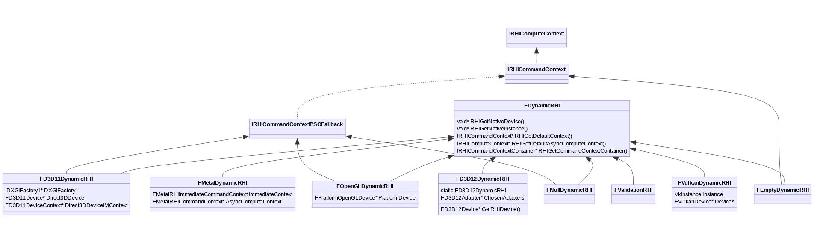

需要注意的是，传统图形API（D3D11、OpenGL）除了继承FDynamicRHI，还需要继承IRHICommandContextPSOFallback，因为需要借助后者的接口处理PSO的数据和行为，以保证传统和现代API对PSO的一致处理行为。也正因为此，现代图形API（D3D12、Vulkan、Metal）不需要继承IRHICommandContext的任何继承体系的类型，单单直接继承FDynamicRHI就可以处理RHI层的所有数据和操作。

既然现代图形API（D3D12、Vulkan、Metal）的DynamicRHI没有继承IRHICommandContext的任何继承体系的类型，那么它们是如何实现FDynamicRHI::RHIGetDefaultContext的接口？下面以FD3D12DynamicRHI为例：

```c++
IRHICommandContext* FD3D12DynamicRHI::RHIGetDefaultContext()
{
    FD3D12Adapter& Adapter = GetAdapter();

    IRHICommandContext* DefaultCommandContext = nullptr;    
    if (GNumExplicitGPUsForRendering > 1) // 多GPU
    {
        DefaultCommandContext = static_cast<IRHICommandContext*>(&Adapter.GetDefaultContextRedirector());
    }
    else // 单GPU
    {
        FD3D12Device* Device = Adapter.GetDevice(0);
        DefaultCommandContext = static_cast<IRHICommandContext*>(&Device->GetDefaultCommandContext());
    }

    return DefaultCommandContext;
}
```

无论是单GPU还是多GPU，都是从FD3D12CommandContext强制转换而来，而FD3D12CommandContext又是IRHICommandContext的子子子类，因此静态类型转换完全没问题。

### **10.3.3.1 FD3D11DynamicRHI**

FD3D11DynamicRHI包含或引用了若干D3D11平台相关的核心类型，它们的定义如下所示：

```c++
// Engine\Source\Runtime\Windows\D3D11RHI\Private\D3D11RHIPrivate.h

class D3D11RHI_API FD3D11DynamicRHI : public FDynamicRHI, public IRHICommandContextPSOFallback
{
    (......)

protected:
    // D3D工厂(接口).
    TRefCountPtr<IDXGIFactory1> DXGIFactory1;
     // D3D设备.
    TRefCountPtr<FD3D11Device> Direct3DDevice;
    // D3D设备的立即上下文.
    TRefCountPtr<FD3D11DeviceContext> Direct3DDeviceIMContext;

    // 视口.
    TArray<FD3D11Viewport*> Viewports;
    TRefCountPtr<FD3D11Viewport> DrawingViewport;

    // AMD AGS工具库上下文.
    AGSContext* AmdAgsContext;

    (......)
};

// Engine\Source\Runtime\Windows\D3D11RHI\Private\Windows\D3D11RHIBasePrivate.h

typedef ID3D11DeviceContext FD3D11DeviceContext;
typedef ID3D11Device FD3D11Device;

// Engine\Source\Runtime\Windows\D3D11RHI\Public\D3D11Viewport.h

class FD3D11Viewport : public FRHIViewport
{
public:
    FD3D11Viewport(class FD3D11DynamicRHI* InD3DRHI) : D3DRHI(InD3DRHI), PresentFailCount(0), ValidState (0), FrameSyncEvent(InD3DRHI);
    FD3D11Viewport(class FD3D11DynamicRHI* InD3DRHI, HWND InWindowHandle, uint32 InSizeX, uint32 InSizeY, bool bInIsFullscreen, EPixelFormat InPreferredPixelFormat);
    ~FD3D11Viewport();

    virtual void Resize(uint32 InSizeX, uint32 InSizeY, bool bInIsFullscreen, EPixelFormat PreferredPixelFormat);
    void ConditionalResetSwapChain(bool bIgnoreFocus);
    void CheckHDRMonitorStatus();

    // 呈现交换链.
    bool Present(bool bLockToVsync);

    // Accessors.
    FIntPoint GetSizeXY() const;
    FD3D11Texture2D* GetBackBuffer() const;
    EColorSpaceAndEOTF GetPixelColorSpace() const;

    void WaitForFrameEventCompletion();
    void IssueFrameEvent()

    IDXGISwapChain* GetSwapChain() const;
    virtual void* GetNativeSwapChain() const override;
    virtual void* GetNativeBackBufferTexture() const override;
    virtual void* GetNativeBackBufferRT() const overrid;

    virtual void SetCustomPresent(FRHICustomPresent* InCustomPresent) override
    virtual FRHICustomPresent* GetCustomPresent() const;

    virtual void* GetNativeWindow(void** AddParam = nullptr) const override;
    static FD3D11Texture2D* GetSwapChainSurface(FD3D11DynamicRHI* D3DRHI, EPixelFormat PixelFormat, uint32 SizeX, uint32 SizeY, IDXGISwapChain* SwapChain);

protected:
    // 动态RHI.
    FD3D11DynamicRHI* D3DRHI;
    // 交换链.
    TRefCountPtr<IDXGISwapChain> SwapChain;
    // 后渲染缓冲.
    TRefCountPtr<FD3D11Texture2D> BackBuffer;

    FD3D11EventQuery FrameSyncEvent;
    FCustomPresentRHIRef CustomPresent;

    (......)
};
```

FD3D11DynamicRHI绘制成UML图之后如下所示：

IRHIComputeContextIRHICommandContextIRHICommandContextPSOFallbackID3D11DeviceContextFD3D11DeviceContextID3D11DeviceFD3D11DeviceFDynamicRHIFD3D11DynamicRHIIDXGIFactory1* DXGIFactory1FD3D11Device* Direct3DDeviceFD3D11DeviceContext* Direct3DDeviceIMContextFD3D11Viewport* ViewportsIDXGIFactory1FRenderResourceFViewportFD3D11Viewport

### **10.3.3.2 FOpenGLDynamicRHI**

FOpenGLDynamicRHI相关的核心类型定义如下：

```c++
class OPENGLDRV_API FOpenGLDynamicRHI  final : public FDynamicRHI, public IRHICommandContextPSOFallback
{
    (......)
    
private:
    // 已创建的视口.
    TArray<FOpenGLViewport*> Viewports;
    // 底层平台相关的数据.
    FPlatformOpenGLDevice* PlatformDevice;
};

// Engine\Source\Runtime\OpenGLDrv\Public\OpenGLResources.h

class FOpenGLViewport : public FRHIViewport
{
public:
    FOpenGLViewport(class FOpenGLDynamicRHI* InOpenGLRHI,void* InWindowHandle,uint32 InSizeX,uint32 InSizeY,bool bInIsFullscreen,EPixelFormat PreferredPixelFormat);
    ~FOpenGLViewport();

    void Resize(uint32 InSizeX,uint32 InSizeY,bool bInIsFullscreen);

    // Accessors.
    FIntPoint GetSizeXY() const;
    FOpenGLTexture2D *GetBackBuffer() const;
    bool IsFullscreen( void ) const;

    void WaitForFrameEventCompletion();
    void IssueFrameEvent();
    virtual void* GetNativeWindow(void** AddParam) const override;

    struct FPlatformOpenGLContext* GetGLContext() const;
    FOpenGLDynamicRHI* GetOpenGLRHI() const;

    virtual void SetCustomPresent(FRHICustomPresent* InCustomPresent) override;
    FRHICustomPresent* GetCustomPresent() const;
    
private:
    FOpenGLDynamicRHI* OpenGLRHI;
    struct FPlatformOpenGLContext* OpenGLContext;
    uint32 SizeX;
    uint32 SizeY;
    bool bIsFullscreen;
    EPixelFormat PixelFormat;
    bool bIsValid;
    TRefCountPtr<FOpenGLTexture2D> BackBuffer;
    FOpenGLEventQuery FrameSyncEvent;
    FCustomPresentRHIRef CustomPresent;
};

// Engine\Source\Runtime\OpenGLDrv\Private\Android\AndroidOpenGL.cpp

// 安卓系统的OpenGL设备.
struct FPlatformOpenGLDevice
{
    bool TargetDirty;

    void SetCurrentSharedContext();
    void SetCurrentRenderingContext();
    void SetupCurrentContext();
    void SetCurrentNULLContext();

    FPlatformOpenGLDevice();
    ~FPlatformOpenGLDevice();
    
    void Init();
    void LoadEXT();
    void Terminate();
    void ReInit();
};

// Engine\Source\Runtime\OpenGLDrv\Private\Windows\OpenGLWindows.cpp

// Windows系统的OpenGL设备.
struct FPlatformOpenGLDevice
{
    FPlatformOpenGLContext    SharedContext;
    FPlatformOpenGLContext    RenderingContext;
    TArray<FPlatformOpenGLContext*>    ViewportContexts;
    bool                    TargetDirty;

    /** Guards against operating on viewport contexts from more than one thread at the same time. */
    FCriticalSection*        ContextUsageGuard;
};

// Engine\Source\Runtime\OpenGLDrv\Private\Lumin\LuminOpenGL.cpp

// Lumin系统的OpenGL设备.
struct FPlatformOpenGLDevice
{
    void SetCurrentSharedContext();
    void SetCurrentRenderingContext();
    void SetCurrentNULLContext();

    FPlatformOpenGLDevice();
    ~FPlatformOpenGLDevice();
    
    void Init();
    void LoadEXT();
    void Terminate();
    void ReInit();
};

// Engine\Source\Runtime\OpenGLDrv\Private\Linux\OpenGLLinux.cpp

// Linux系统的OpenGL设备.
struct FPlatformOpenGLDevice
{
    FPlatformOpenGLContext    SharedContext;
    FPlatformOpenGLContext    RenderingContext;
    int32                    NumUsedContexts;
    FCriticalSection*        ContextUsageGuard;
};

// Engine\Source\Runtime\OpenGLDrv\Private\Lumin\LuminGL4.cpp

// Lumin系统的OpenGL设备.
struct FPlatformOpenGLDevice
{
    FPlatformOpenGLContext    SharedContext;
    FPlatformOpenGLContext    RenderingContext;
    TArray<FPlatformOpenGLContext*>    ViewportContexts;
    bool                    TargetDirty;
    FCriticalSection*        ContextUsageGuard;
};
```

以上显示不同操作系统，OpenGL设备对象的定义有所不同。实际上，OpenGL上下文也因操作系统而异，下面以Windows为例：

```c++
// Engine\Source\Runtime\OpenGLDrv\Private\Windows\OpenGLWindows.cpp

struct FPlatformOpenGLContext
{
    // 窗口句柄
    HWND WindowHandle;
    // 设备上下文.
    HDC DeviceContext;
    // OpenGL上下文.
    HGLRC OpenGLContext;
    
    // 其它实际.
    bool bReleaseWindowOnDestroy;
    int32 SyncInterval;
    GLuint    ViewportFramebuffer;
    GLuint    VertexArrayObject;    // one has to be generated and set for each context (OpenGL 3.2 Core requirements)
    GLuint    BackBufferResource;
    GLenum    BackBufferTarget;
};
```

FOpenGLDynamicRHI绘制成的UML图如下所示：

IRHIComputeContextIRHICommandContextIRHICommandContextPSOFallbackFDynamicRHIFOpenGLDynamicRHIFOpenGLViewport* ViewportsFPlatformOpenGLDevice* PlatformDeviceFPlatformOpenGLDeviceFRenderResourceFViewportFOpenGLViewportFPlatformOpenGLContext

### **10.3.3.3 FD3D12DynamicRHI**

FD3D12DynamicRHI的核心类型定义如下：

```c++
// Engine\Source\Runtime\D3D12RHI\Private\D3D12RHIPrivate.h

class FD3D12DynamicRHI : public FDynamicRHI
{
    (......)
    
protected:
    // 已选择的适配器.
    TArray<TSharedPtr<FD3D12Adapter>> ChosenAdapters;

    // D3D12设备.
    inline FD3D12Device* GetRHIDevice(uint32 GPUIndex)
    {
        return GetAdapter().GetDevice(GPUIndex);
    }
    
    (......)
};

// Engine\Source\Runtime\D3D12RHI\Private\D3D12Adapter.h

class FD3D12Adapter : public FNoncopyable
{
public:
    void Initialize(FD3D12DynamicRHI* RHI);
    void InitializeDevices();
    void InitializeRayTracing();
    
    // 资源创建.
    HRESULT CreateCommittedResource(...)
    HRESULT CreateBuffer(...);
    template <typename BufferType> 
    BufferType* CreateRHIBuffer(...);

    inline FD3D12CommandContextRedirector& GetDefaultContextRedirector();
    inline FD3D12CommandContextRedirector& GetDefaultAsyncComputeContextRedirector();
    FD3D12FastConstantAllocator& GetTransientUniformBufferAllocator();

    void BlockUntilIdle();
    
    (......)

protected:
    virtual void CreateRootDevice(bool bWithDebug);

    FD3D12DynamicRHI* OwningRHI;

    // LDA设置拥有一个ID3D12Device
    TRefCountPtr<ID3D12Device> RootDevice;
    TRefCountPtr<ID3D12Device1> RootDevice1;
    
    TRefCountPtr<IDXGIAdapter> DxgiAdapter;
    
    TRefCountPtr<IDXGIFactory> DxgiFactory;
    TRefCountPtr<IDXGIFactory2> DxgiFactory2;
    
    // 每个设备代表一个物理GPU“节点”.
    FD3D12Device* Devices[MAX_NUM_GPUS];
    
    FD3D12CommandContextRedirector DefaultContextRedirector;
    FD3D12CommandContextRedirector DefaultAsyncComputeContextRedirector;
    
    TArray<FD3D12Viewport*> Viewports;
    TRefCountPtr<FD3D12Viewport> DrawingViewport;

    (......)
};

// Engine\Source\Runtime\D3D12RHI\Private\D3D12RHICommon.h

class FD3D12AdapterChild
{
protected:
    FD3D12Adapter* ParentAdapter;

    (......)
};

class FD3D12DeviceChild
{
protected:
    FD3D12Device* Parent;
    
    (......)
};

// Engine\Source\Runtime\D3D12RHI\Private\D3D12Device.h

class FD3D12Device : public FD3D12SingleNodeGPUObject, public FNoncopyable, public FD3D12AdapterChild
{
public:
    TArray<FD3D12CommandListHandle> PendingCommandLists;
    
    void Initialize();
    void CreateCommandContexts();
    void InitPlatformSpecific();
    virtual void Cleanup();
    bool GetQueryData(FD3D12RenderQuery& Query, bool bWait);

    ID3D12Device* GetDevice();

    void BlockUntilIdle();
    bool IsGPUIdle();

    FD3D12SamplerState* CreateSampler(const FSamplerStateInitializerRHI& Initializer);

    (......)
    
protected:
    // CommandListManager
    FD3D12CommandListManager* CommandListManager;
    FD3D12CommandListManager* CopyCommandListManager;
    FD3D12CommandListManager* AsyncCommandListManager;
    FD3D12CommandAllocatorManager TextureStreamingCommandAllocatorManager;

    // Allocator
    FD3D12OfflineDescriptorManager RTVAllocator;
    FD3D12OfflineDescriptorManager DSVAllocator;
    FD3D12OfflineDescriptorManager SRVAllocator;
    FD3D12OfflineDescriptorManager UAVAllocator;
    FD3D12DefaultBufferAllocator DefaultBufferAllocator;

    // FD3D12CommandContext
    TArray<FD3D12CommandContext*> CommandContextArray;
    TArray<FD3D12CommandContext*> FreeCommandContexts;
    TArray<FD3D12CommandContext*> AsyncComputeContextArray;

    (......)
};

// Engine\Source\Runtime\D3D12RHI\Public\D3D12Viewport.h

class FD3D12Viewport : public FRHIViewport, public FD3D12AdapterChild
{
public:
    void Init();
    void Resize(uint32 InSizeX, uint32 InSizeY, bool bInIsFullscreen, EPixelFormat PreferredPixelFormat);

    void ConditionalResetSwapChain(bool bIgnoreFocus);
    bool Present(bool bLockToVsync);

    void WaitForFrameEventCompletion();
    bool CurrentOutputSupportsHDR() const;

    (......)
    
private:
    HWND WindowHandle;

#if D3D12_VIEWPORT_EXPOSES_SWAP_CHAIN
    TRefCountPtr<IDXGISwapChain1> SwapChain1;
    TRefCountPtr<IDXGISwapChain4> SwapChain4;
#endif

    TArray<TRefCountPtr<FD3D12Texture2D>> BackBuffers;
    TRefCountPtr<FD3D12Texture2D> DummyBackBuffer_RenderThread;
    uint32 CurrentBackBufferIndex_RHIThread;
    FD3D12Texture2D* BackBuffer_RHIThread;
    TArray<TRefCountPtr<FD3D12Texture2D>> SDRBackBuffers;
    TRefCountPtr<FD3D12Texture2D> SDRDummyBackBuffer_RenderThread;
    FD3D12Texture2D* SDRBackBuffer_RHIThread;

    bool CheckHDRSupport();
    void EnableHDR();
    void ShutdownHDR();
    
    (......)
};

// Engine\Source\Runtime\D3D12RHI\Private\D3D12CommandContext.h

class FD3D12CommandContextBase : public IRHICommandContext, public FD3D12AdapterChild
{
public:
    FD3D12CommandContextBase(class FD3D12Adapter* InParent, FRHIGPUMask InGPUMask, bool InIsDefaultContext, bool InIsAsyncComputeContext);

    void RHIBeginDrawingViewport(FRHIViewport* Viewport, FRHITexture* RenderTargetRHI) final override;
    void RHIEndDrawingViewport(FRHIViewport* Viewport, bool bPresent, bool bLockToVsync) final override;
    void RHIBeginFrame() final override;
    void RHIEndFrame() final override;

    (......)

protected:
    virtual FD3D12CommandContext* GetContext(uint32 InGPUIndex) = 0;

    FRHIGPUMask GPUMask;
    
    (......)
};

class FD3D12CommandContext : public FD3D12CommandContextBase, public FD3D12DeviceChild
{
public:
    FD3D12CommandContext(class FD3D12Device* InParent, bool InIsDefaultContext, bool InIsAsyncComputeContext);
    virtual ~FD3D12CommandContext();

    void EndFrame();
    void ConditionalObtainCommandAllocator();
    void ReleaseCommandAllocator();

    FD3D12CommandListManager& GetCommandListManager();
    void OpenCommandList();
    void CloseCommandList();

    FD3D12CommandListHandle FlushCommands(bool WaitForCompletion = false, EFlushCommandsExtraAction ExtraAction = FCEA_None);
    void Finish(TArray<FD3D12CommandListHandle>& CommandLists);

    FD3D12FastConstantAllocator ConstantsAllocator;
    FD3D12CommandListHandle CommandListHandle;
    FD3D12CommandAllocator* CommandAllocator;
    FD3D12CommandAllocatorManager CommandAllocatorManager;

    FD3D12DynamicRHI& OwningRHI;

    // State Block.
    FD3D12RenderTargetView* CurrentRenderTargets[D3D12_SIMULTANEOUS_RENDER_TARGET_COUNT];
    FD3D12DepthStencilView* CurrentDepthStencilTarget;
    FD3D12TextureBase* CurrentDepthTexture;
    uint32 NumSimultaneousRenderTargets;

    // Uniform Buffer.
    FD3D12UniformBuffer* BoundUniformBuffers[SF_NumStandardFrequencies][MAX_CBS];
    FUniformBufferRHIRef BoundUniformBufferRefs[SF_NumStandardFrequencies][MAX_CBS];
    uint16 DirtyUniformBuffers[SF_NumStandardFrequencies];

    // 常量缓冲区.
    FD3D12ConstantBuffer VSConstantBuffer;
    FD3D12ConstantBuffer HSConstantBuffer;
    FD3D12ConstantBuffer DSConstantBuffer;
    FD3D12ConstantBuffer PSConstantBuffer;
    FD3D12ConstantBuffer GSConstantBuffer;
    FD3D12ConstantBuffer CSConstantBuffer;

    template <class ShaderType> void SetResourcesFromTables(const ShaderType* RESTRICT);
    template <class ShaderType> uint32 SetUAVPSResourcesFromTables(const ShaderType* RESTRICT Shader);
    void CommitGraphicsResourceTables();
    void CommitComputeResourceTables(FD3D12ComputeShader* ComputeShader);
    void ValidateExclusiveDepthStencilAccess(FExclusiveDepthStencil Src) const;
    void CommitRenderTargetsAndUAVs();

    virtual void SetDepthBounds(float MinDepth, float MaxDepth);
    virtual void SetShadingRate(EVRSShadingRate ShadingRate, EVRSRateCombiner Combiner);

    (......)

protected:
    FD3D12CommandContext* GetContext(uint32 InGPUIndex) final override;
    TArray<FRHIUniformBuffer*> GlobalUniformBuffers;
};

class FD3D12CommandContextRedirector final : public FD3D12CommandContextBase
{
public:
    FD3D12CommandContextRedirector(class FD3D12Adapter* InParent, bool InIsDefaultContext, bool InIsAsyncComputeContext);

    virtual void RHISetComputeShader(FRHIComputeShader* ComputeShader) final override;
    virtual void RHISetComputePipelineState(FRHIComputePipelineState* ComputePipelineState) final override;
    virtual void RHIDispatchComputeShader(uint32 ThreadGroupCountX, uint32 ThreadGroupCountY, uint32 ThreadGroupCountZ) final override;
    
    (......)
    
private:
    FRHIGPUMask PhysicalGPUMask;
    FD3D12CommandContext* PhysicalContexts[MAX_NUM_GPUS];
};

// Engine\Source\Runtime\D3D12RHI\Private\D3D12CommandContext.cpp

class FD3D12CommandContextContainer : public IRHICommandContextContainer
{
    FD3D12Adapter* Adapter;
    FD3D12CommandContext* CmdContext;
    FD3D12CommandContextRedirector* CmdContextRedirector;
    FRHIGPUMask GPUMask;
    TArray<FD3D12CommandListHandle> CommandLists;

    (......)
};
```

以上可知，D3D12涉及的核心类型非常多，涉及多层级的复杂的数据结构链，其内存布局如下所示：

```
[Engine]--
        |
        |-[RHI]--
                |
                |-[Adapter]-- (LDA)
                |            |
                |            |- [Device]
                |            |
                |            |- [Device]
                |
                |-[Adapter]--
                            |
                            |- [Device]--
                                        |
                                        |-[CommandContext]
                                        |
                                        |-[CommandContext]---
                                                            |
                                                            |-[StateCache]
```

在这种方案下，FD3D12Device表示1个节点，属于1个物理适配器。这种结构允许一个RHI控制几个不同类型的硬件设置，例如：

- 单GPU系统（常规案例）。
- 多GPU系统，如LDA（Crossfire/SLI）。
- 非对称多GPU系统，如分离、集成GPU协作系统。

将D3D12的核心类抽象成UML图之后，如下所示：

IRHIComputeContextIRHICommandContextFDynamicRHIFD3D12DynamicRHIFD3D12AdapterFNoncopyableID3D12DeviceIDXGIAdapterIDXGIFactoryFD3D12DeviceFD3D12ViewportFD3D12AdapterChildFD3D12CommandListManagerFD3D12CommandContextFRHIViewportFD3D12CommandContextBaseFD3D12DeviceChildFD3D12CommandContextRedirectorIRHICommandContextContainerFD3D12CommandContextContainer

看不清可以点击下面图片版本：

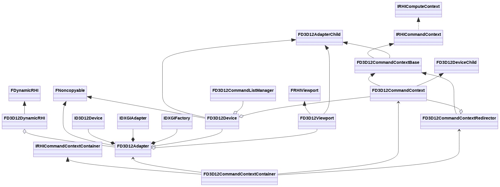

### **10.3.3.4 FVulkanDynamicRHI**

FVulkanDynamicRHI涉及的核心类如下：

```c++
// Engine\Source\Runtime\VulkanRHI\Public\VulkanDynamicRHI.h

class FVulkanDynamicRHI : public FDynamicRHI
{
public:
    // FDynamicRHI interface.
    virtual void Init() final override;
    virtual void PostInit() final override;
    virtual void Shutdown() final override;;
    void InitInstance();

    (......)
    
protected:
    // 实例.
    VkInstance Instance;
    
    // 设备.
    TArray<FVulkanDevice*> Devices;
    FVulkanDevice* Device;

    // 视口.
    TArray<FVulkanViewport*> Viewports;
    
    (......)
};

// Engine\Source\Runtime\VulkanRHI\Private\VulkanDevice.h

class FVulkanDevice
{
public:
    FVulkanDevice(FVulkanDynamicRHI* InRHI, VkPhysicalDevice Gpu);
    ~FVulkanDevice();

    bool QueryGPU(int32 DeviceIndex);
    void InitGPU(int32 DeviceIndex);
    void CreateDevice();
    void PrepareForDestroy();
    void Destroy();

    void WaitUntilIdle();
    void PrepareForCPURead();
    void SubmitCommandsAndFlushGPU();

    (......)
    
private:
    void SubmitCommands(FVulkanCommandListContext* Context);

    // vk设备.
    VkDevice Device;
    // vk物理设备.
    VkPhysicalDevice Gpu;
    
    VkPhysicalDeviceProperties GpuProps;
    VkPhysicalDeviceFeatures PhysicalFeatures;

    // 管理器.
    VulkanRHI::FDeviceMemoryManager DeviceMemoryManager;
    VulkanRHI::FMemoryManager MemoryManager;
    VulkanRHI::FDeferredDeletionQueue2 DeferredDeletionQueue;
    VulkanRHI::FStagingManager StagingManager;
    VulkanRHI::FFenceManager FenceManager;
    FVulkanDescriptorPoolsManager* DescriptorPoolsManager = nullptr;
    
    FVulkanDescriptorSetCache* DescriptorSetCache = nullptr;
    FVulkanShaderFactory ShaderFactory;

    // 队列.
    FVulkanQueue* GfxQueue;
    FVulkanQueue* ComputeQueue;
    FVulkanQueue* TransferQueue;
    FVulkanQueue* PresentQueue;

    // GPU品牌.
    EGpuVendorId VendorId = EGpuVendorId::NotQueried;

    // 命令队列上下文.
    FVulkanCommandListContextImmediate* ImmediateContext;
    FVulkanCommandListContext* ComputeContext;
    TArray<FVulkanCommandListContext*> CommandContexts;

    FVulkanDynamicRHI* RHI = nullptr;
    class FVulkanPipelineStateCacheManager* PipelineStateCache;
    
    (......)
};

// Engine\Source\Runtime\VulkanRHI\Private\VulkanQueue.h

class FVulkanQueue
{
public:
    FVulkanQueue(FVulkanDevice* InDevice, uint32 InFamilyIndex);
    ~FVulkanQueue();

    void Submit(FVulkanCmdBuffer* CmdBuffer, uint32 NumSignalSemaphores = 0, VkSemaphore* SignalSemaphores = nullptr);
    void Submit(FVulkanCmdBuffer* CmdBuffer, VkSemaphore SignalSemaphore);

    void GetLastSubmittedInfo(FVulkanCmdBuffer*& OutCmdBuffer, uint64& OutFenceCounter) const;

    (......)
    
private:
    // vk队列
    VkQueue Queue;
    // 家族索引.
    uint32 FamilyIndex;
    // 队列索引.
    uint32 QueueIndex;
    FVulkanDevice* Device;

    // vk命令缓冲.
    FVulkanCmdBuffer* LastSubmittedCmdBuffer;
    uint64 LastSubmittedCmdBufferFenceCounter;
    uint64 SubmitCounter;
    mutable FCriticalSection CS;

    void UpdateLastSubmittedCommandBuffer(FVulkanCmdBuffer* CmdBuffer);
};

// Engine\Source\Runtime\VulkanRHI\Public\VulkanMemory.h

// 设备子节点.
class FDeviceChild
{
public:
    FDeviceChild(FVulkanDevice* InDevice = nullptr);
    
    (......)
    
 protected:
    FVulkanDevice* Device;
};

// Engine\Source\Runtime\VulkanRHI\Private\VulkanContext.h

class FVulkanCommandListContext : public IRHICommandContext
{
public:
    FVulkanCommandListContext(FVulkanDynamicRHI* InRHI, FVulkanDevice* InDevice, FVulkanQueue* InQueue, FVulkanCommandListContext* InImmediate);
    virtual ~FVulkanCommandListContext();

    static inline FVulkanCommandListContext& GetVulkanContext(IRHICommandContext& CmdContext);

    inline bool IsImmediate() const;

    virtual void RHISetStreamSource(uint32 StreamIndex, FRHIVertexBuffer* VertexBuffer, uint32 Offset) final override;
    virtual void RHISetViewport(float MinX, float MinY, float MinZ, float MaxX, float MaxY, float MaxZ) final override;
    virtual void RHISetScissorRect(bool bEnable, uint32 MinX, uint32 MinY, uint32 MaxX, uint32 MaxY) final override;
    
    (......)

    inline FVulkanDevice* GetDevice() const;
    void PrepareParallelFromBase(const FVulkanCommandListContext& BaseContext);

protected:
    FVulkanDynamicRHI* RHI;
    FVulkanCommandListContext* Immediate;
    FVulkanDevice* Device;
    FVulkanQueue* Queue;
    
    FVulkanUniformBufferUploader* UniformBufferUploader;
    FVulkanCommandBufferManager* CommandBufferManager;
    static FVulkanLayoutManager LayoutManager;

private:
    FVulkanGPUProfiler GpuProfiler;
    TArray<FRHIUniformBuffer*> GlobalUniformBuffers;
    
    (......)
};

// 立即模式的命令队列上下文.
class FVulkanCommandListContextImmediate : public FVulkanCommandListContext
{
public:
    FVulkanCommandListContextImmediate(FVulkanDynamicRHI* InRHI, FVulkanDevice* InDevice, FVulkanQueue* InQueue);
};

// 命令上下文容器.
struct FVulkanCommandContextContainer : public IRHICommandContextContainer, public VulkanRHI::FDeviceChild
{
    FVulkanCommandListContext* CmdContext;

    FVulkanCommandContextContainer(FVulkanDevice* InDevice);

    virtual IRHICommandContext* GetContext() override final;
    virtual void FinishContext() override final;
    virtual void SubmitAndFreeContextContainer(int32 Index, int32 Num) override final;
    
    void* operator new(size_t Size);
    void operator delete(void* RawMemory);
    
    (......)
};

// Engine\Source\Runtime\VulkanRHI\Private\VulkanViewport.h

class FVulkanViewport : public FRHIViewport, public VulkanRHI::FDeviceChild
{
public:
    FVulkanViewport(FVulkanDynamicRHI* InRHI, FVulkanDevice* InDevice, void* InWindowHandle, uint32 InSizeX,uint32 InSizeY,bool bInIsFullscreen, EPixelFormat InPreferredPixelFormat);
    ~FVulkanViewport();

    void AdvanceBackBufferFrame(FRHICommandListImmediate& RHICmdList);
    void WaitForFrameEventCompletion();

    virtual void SetCustomPresent(FRHICustomPresent* InCustomPresent) override final;
    virtual FRHICustomPresent* GetCustomPresent() const override final;
    virtual void Tick(float DeltaTime) override final;
    bool Present(FVulkanCommandListContext* Context, FVulkanCmdBuffer* CmdBuffer, FVulkanQueue* Queue, FVulkanQueue* PresentQueue, bool bLockToVsync);

    (......)
    
protected:
    TArray<VkImage, TInlineAllocator<NUM_BUFFERS*2>> BackBufferImages;
    TArray<VulkanRHI::FSemaphore*, TInlineAllocator<NUM_BUFFERS*2>> RenderingDoneSemaphores;
    TArray<FVulkanTextureView, TInlineAllocator<NUM_BUFFERS*2>> TextureViews;
    TRefCountPtr<FVulkanBackBuffer> RHIBackBuffer;
    TRefCountPtr<FVulkanTexture2D>    RenderingBackBuffer;
    
    /** narrow-scoped section that locks access to back buffer during its recreation*/
    FCriticalSection RecreatingSwapchain;

    FVulkanDynamicRHI* RHI;
    FVulkanSwapChain* SwapChain;
    void* WindowHandle;
    VulkanRHI::FSemaphore* AcquiredSemaphore;
    FCustomPresentRHIRef CustomPresent;
    FVulkanCmdBuffer* LastFrameCommandBuffer = nullptr;
    
    (......)
};
```

若将Vulkan RHI的核心类型绘制成UML图，则是如下图所示：

FDynamicRHIFVulkanDynamicRHIVkInstanceFVulkanDeviceFVulkanViewportFRHIResourceFRHIViewportFDeviceChildVkDeviceVkPhysicalDeviceFVulkanQueueFVulkanCommandListContextFVulkanCommandListContextImmediateVkQueueIRHICommandContextIRHICommandContextContainerFVulkanCommandContextContainer

### **10.3.3.5 FMetalDynamicRHI**

FMetalDynamicRHI的核心类型定义如下：

```c++
// Engine\Source\Runtime\Apple\MetalRHI\Private\MetalDynamicRHI.h

class FMetalDynamicRHI : public FDynamicRHI
{
public:
    // FDynamicRHI interface.
    virtual void Init();
    virtual void Shutdown() {}
    
    (......)
    
private:
    // 立即模式上下文.
    FMetalRHIImmediateCommandContext ImmediateContext;
    // 异步计算上下文.
    FMetalRHICommandContext* AsyncComputeContext;
    
    (......)
};

// Engine\Source\Runtime\Apple\MetalRHI\Public\MetalRHIContext.h

class FMetalRHICommandContext : public IRHICommandContext
{
public:
    FMetalRHICommandContext(class FMetalProfiler* InProfiler, FMetalContext* WrapContext);
    virtual ~FMetalRHICommandContext();

    virtual void RHISetComputeShader(FRHIComputeShader* ComputeShader) override;
    virtual void RHISetComputePipelineState(FRHIComputePipelineState* ComputePipelineState) override;
    virtual void RHIDispatchComputeShader(uint32 ThreadGroupCountX, uint32 ThreadGroupCountY, uint32 ThreadGroupCountZ) final override;
    
    (......)

protected:
    // Metal上下文.
    FMetalContext* Context;
    
    TSharedPtr<FMetalCommandBufferFence, ESPMode::ThreadSafe> CommandBufferFence;
    class FMetalProfiler* Profiler;
    FMetalBuffer PendingVertexBuffer;

    TArray<FRHIUniformBuffer*> GlobalUniformBuffers;

    (......)
};

class FMetalRHIComputeContext : public FMetalRHICommandContext
{
public:
    FMetalRHIComputeContext(class FMetalProfiler* InProfiler, FMetalContext* WrapContext);
    virtual ~FMetalRHIComputeContext();
    
    virtual void RHISetAsyncComputeBudget(EAsyncComputeBudget Budget) final override;
    virtual void RHISetComputeShader(FRHIComputeShader* ComputeShader) final override;
    virtual void RHISetComputePipelineState(FRHIComputePipelineState* ComputePipelineState) final override;
    virtual void RHISubmitCommandsHint() final override;
};

class FMetalRHIImmediateCommandContext : public FMetalRHICommandContext
{
public:
    FMetalRHIImmediateCommandContext(class FMetalProfiler* InProfiler, FMetalContext* WrapContext);

    // FRHICommandContext API accessible only on the immediate device context
    virtual void RHIBeginDrawingViewport(FRHIViewport* Viewport, FRHITexture* RenderTargetRHI) final override;
    virtual void RHIEndDrawingViewport(FRHIViewport* Viewport, bool bPresent, bool bLockToVsync) final override;
    
    (......)
};

// Engine\Source\Runtime\Apple\MetalRHI\Private\MetalContext.h

// 上下文.
class FMetalContext
{
public:
    FMetalContext(mtlpp::Device InDevice, FMetalCommandQueue& Queue, bool const bIsImmediate);
    virtual ~FMetalContext();
    
    mtlpp::Device& GetDevice();
    
    bool PrepareToDraw(uint32 PrimitiveType, EMetalIndexType IndexType = EMetalIndexType_None);
    void SetRenderPassInfo(const FRHIRenderPassInfo& RenderTargetsInfo, bool const bRestart = false);

    void SubmitCommandsHint(uint32 const bFlags = EMetalSubmitFlagsCreateCommandBuffer);
    void SubmitCommandBufferAndWait();
    void ResetRenderCommandEncoder();
    
    void DrawPrimitive(uint32 PrimitiveType, uint32 BaseVertexIndex, uint32 NumPrimitives, uint32 NumInstances);
    void DrawPrimitiveIndirect(uint32 PrimitiveType, FMetalVertexBuffer* VertexBuffer, uint32 ArgumentOffset);
    void DrawIndexedPrimitive(FMetalBuffer const& IndexBuffer, ...);
    void DrawIndexedIndirect(FMetalIndexBuffer* IndexBufferRHI, ...);
    void DrawIndexedPrimitiveIndirect(uint32 PrimitiveType, ...);
    void DrawPatches(uint32 PrimitiveType, ...);
    
    (......)

protected:
    // Metal底层设备.
    mtlpp::Device Device;
    
    FMetalCommandQueue& CommandQueue;
    FMetalCommandList CommandList;
    
    FMetalStateCache StateCache;
    FMetalRenderPass RenderPass;
    
    dispatch_semaphore_t CommandBufferSemaphore;
    TSharedPtr<FMetalQueryBufferPool, ESPMode::ThreadSafe> QueryBuffer;
    TRefCountPtr<FMetalFence> StartFence;
    TRefCountPtr<FMetalFence> EndFence;
    
    int32 NumParallelContextsInPass;
    
    (......)
};

// Engine\Source\Runtime\Apple\MetalRHI\Private\MetalCommandQueue.h

class FMetalCommandQueue
{
public:
    FMetalCommandQueue(mtlpp::Device Device, uint32 const MaxNumCommandBuffers = 0);
    ~FMetalCommandQueue(void);
    
    mtlpp::CommandBuffer CreateCommandBuffer(void);
    void CommitCommandBuffer(mtlpp::CommandBuffer& CommandBuffer);
    void SubmitCommandBuffers(TArray<mtlpp::CommandBuffer> BufferList, uint32 Index, uint32 Count);
    FMetalFence* CreateFence(ns::String const& Label) const;
    void GetCommittedCommandBufferFences(TArray<mtlpp::CommandBufferFence>& Fences);
    
    mtlpp::Device& GetDevice(void);
    
    static mtlpp::ResourceOptions GetCompatibleResourceOptions(mtlpp::ResourceOptions Options);
    static inline bool SupportsFeature(EMetalFeatures InFeature);
    static inline bool SupportsSeparateMSAAAndResolveTarget();
    
    (......)

private:
    // 设备.
    mtlpp::Device Device;
    // 命令队列.
    mtlpp::CommandQueue CommandQueue;
    // 命令缓存区列表.(注意是数组的数组)
    TArray<TArray<mtlpp::CommandBuffer>> CommandBuffers;
    
    TLockFreePointerListLIFO<mtlpp::CommandBufferFence> CommandBufferFences;
    uint64 ParallelCommandLists;
};

// Engine\Source\Runtime\Apple\MetalRHI\Private\MetalCommandList.h

class FMetalCommandList
{
public:
    FMetalCommandList(FMetalCommandQueue& InCommandQueue, bool const bInImmediate);
    ~FMetalCommandList(void);
    
    void Commit(mtlpp::CommandBuffer& Buffer, TArray<ns::Object<mtlpp::CommandBufferHandler>> CompletionHandlers, bool const bWait, bool const bIsLastCommandBuffer);
    void Submit(uint32 Index, uint32 Count);
    
    bool IsImmediate(void) const;
    bool IsParallel(void) const;
    void SetParallelIndex(uint32 Index, uint32 Num);
    uint32 GetParallelIndex(void) const;
    uint32 GetParallelNum(void) const;

    (......)
    
private:
    // 所属的FMetalCommandQueue.
    FMetalCommandQueue& CommandQueue;
    // 已提交的命令缓冲列表.
    TArray<mtlpp::CommandBuffer> SubmittedBuffers;
};
```

相比其它现代图形API而言，FMetalDynamicRHI的概念和接口都简介多了。其UML图如下：

FDynamicRHIFMetalDynamicRHIFMetalRHIImmediateCommandContextFMetalRHICommandContextIRHICommandContextFMetalRHIComputeContextFMetalContextmtlpp_DeviceFMetalCommandQueueFMetalCommandListmtlpp_CommandQueuemtlpp_CommandBufferTArray_CommandBuffer

## **10.3.4 RHI体系总览**

10.2和10.3章节详细阐述了RHI体系下的基础概念和继承体系，包含渲染层的资源、RHI层的资源、命令、上下文和动态RHI。还详细阐述了各个主流图形API下的具体实现和RHI抽象层的关联。

若抛开图形API的具体实现细节和众多的RHI具体子类，将RHI Context/CommandList/Command/Resource等的顶层概念汇总成UML关系图，则是如下模样：

FRHIResourceFRenderResourceFRHICommandBaseFRHICommandFNoncopyableFRHICommandListBaseIRHIComputeContextFRHIComputeCommandListFRHICommandListFRHICommandListImmediateIRHICommandContextIRHICommandContextPSOFallbackIRHICommandContextContainer

下图是在上面的基础上细化了子类的UML：

FRHIResourceFRenderResourceFTextureFVertexBufferFIndexBufferFRHITextureFRHIShaderFRHIVertexBufferFRHICommandBaseFRHICommandFRHICommandDrawPrimitiveFRHICommandResourceTransitionFRHICommandSetShaderParameterFNoncopyableFRHICommandListBaseFRHICommandBase* RootIRHICommandContext* ContextIRHIComputeContextFRHIComputeCommandListFRHICommandListFRHICommandListImmediateIRHICommandContextIRHICommandContextPSOFallbackFOpenGLDynamicRHIFD3D11DynamicRHIFD3D12CommandContextBaseFMetalRHICommandContextFVulkanCommandListContextIRHICommandContextContainerFMetalCommandContextContainerFD3D12CommandContextContainerFVulkanCommandContextContainer

若看不清，可点击下图放大：

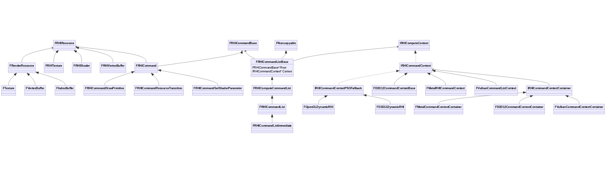

 

# **10.4 RHI机制**

本章将讲述RHI体系设计的运行机制和原理。

## **10.4.1 RHI命令执行**

### **10.4.1.1 FRHICommandListExecutor**

FRHICommandListExecutor负责将Renderer层的RHI中间指令转译（或直接调用）到目标平台的图形API，它在RHI体系中起着举足轻重的作用，定义如下：

```c++
// Engine\Source\Runtime\RHI\Public\RHICommandList.h

class RHI_API FRHICommandListExecutor
{
public:
    enum
    {
        DefaultBypass = PLATFORM_RHITHREAD_DEFAULT_BYPASS
    };
    FRHICommandListExecutor()
        : bLatchedBypass(!!DefaultBypass)
        , bLatchedUseParallelAlgorithms(false)
    {
    }
    
    // 静态接口, 获取立即命令列表.
    static inline FRHICommandListImmediate& GetImmediateCommandList();
    // 静态接口, 获取立即异步计算命令列表.
    static inline FRHIAsyncComputeCommandListImmediate& GetImmediateAsyncComputeCommandList();

    // 执行命令列表.
    void ExecuteList(FRHICommandListBase& CmdList);
    void ExecuteList(FRHICommandListImmediate& CmdList);
    void LatchBypass();

    // 等待RHI线程栅栏.
    static void WaitOnRHIThreadFence(FGraphEventRef& Fence);

    // 是否绕过命令生成模式, 如果是, 则直接调用目标平台的图形API.
    FORCEINLINE_DEBUGGABLE bool Bypass()
    {
#if CAN_TOGGLE_COMMAND_LIST_BYPASS
        return bLatchedBypass;
#else
        return !!DefaultBypass;
#endif
    }
    // 是否使用并行算法.
    FORCEINLINE_DEBUGGABLE bool UseParallelAlgorithms()
    {
#if CAN_TOGGLE_COMMAND_LIST_BYPASS
        return bLatchedUseParallelAlgorithms;
#else
        return  FApp::ShouldUseThreadingForPerformance() && !Bypass() && (GSupportsParallelRenderingTasksWithSeparateRHIThread || !IsRunningRHIInSeparateThread());
#endif
    }
    static void CheckNoOutstandingCmdLists();
    static bool IsRHIThreadActive();
    static bool IsRHIThreadCompletelyFlushed();

private:
    // 内部执行.
    void ExecuteInner(FRHICommandListBase& CmdList);
    // 内部执行, 真正执行转译.
    static void ExecuteInner_DoExecute(FRHICommandListBase& CmdList);

    bool bLatchedBypass;
    bool bLatchedUseParallelAlgorithms;
    
    // 同步变量.
    FThreadSafeCounter UIDCounter;
    FThreadSafeCounter OutstandingCmdListCount;
    
    // 立即模式的命令队列.
    FRHICommandListImmediate CommandListImmediate;
    // 立即模式的异步计算命令队列.
    FRHIAsyncComputeCommandListImmediate AsyncComputeCmdListImmediate;
};
```

下面是FRHICommandListExecutor部分重要接口的实现代码：

```c++
// Engine\Source\Runtime\RHI\Private\RHICommandList.cpp

// 检测RHI线程是否激活状态.
bool FRHICommandListExecutor::IsRHIThreadActive()
{
    // 是否异步提交.
    bool bAsyncSubmit = CVarRHICmdAsyncRHIThreadDispatch.GetValueOnRenderThread() > 0;
    // 1. 先检测是否存在未完成的子命令列表提交任务.
    if (bAsyncSubmit)
    {
        if (RenderThreadSublistDispatchTask.GetReference() && RenderThreadSublistDispatchTask->IsComplete())
        {
            RenderThreadSublistDispatchTask = nullptr;
        }
        if (RenderThreadSublistDispatchTask.GetReference())
        {
            return true; // it might become active at any time
        }
        // otherwise we can safely look at RHIThreadTask
    }

    // 2. 再检测是否存在未完成的RHI线程任务.
    if (RHIThreadTask.GetReference() && RHIThreadTask->IsComplete())
    {
        RHIThreadTask = nullptr;
        PrevRHIThreadTask = nullptr;
    }
    return !!RHIThreadTask.GetReference();
}

// 检测RHI线程是否完全刷新了数据.
bool FRHICommandListExecutor::IsRHIThreadCompletelyFlushed()
{
    if (IsRHIThreadActive() || GetImmediateCommandList().HasCommands())
    {
        return false;
    }
    if (RenderThreadSublistDispatchTask.GetReference() && RenderThreadSublistDispatchTask->IsComplete())
    {
#if NEEDS_DEBUG_INFO_ON_PRESENT_HANG
        bRenderThreadSublistDispatchTaskClearedOnRT = IsInActualRenderingThread();
        bRenderThreadSublistDispatchTaskClearedOnGT = IsInGameThread();
#endif
        RenderThreadSublistDispatchTask = nullptr;
    }
    return !RenderThreadSublistDispatchTask;
}

void FRHICommandListExecutor::ExecuteList(FRHICommandListImmediate& CmdList)
{
    {
        SCOPE_CYCLE_COUNTER(STAT_ImmedCmdListExecuteTime);
        ExecuteInner(CmdList);
    }
}

void FRHICommandListExecutor::ExecuteList(FRHICommandListBase& CmdList)
{
    // 执行命令队列转换之前先刷新已有的命令.
    if (IsInRenderingThread() && !GetImmediateCommandList().IsExecuting())
    {
        GetImmediateCommandList().ImmediateFlush(EImmediateFlushType::DispatchToRHIThread);
    }

    // 内部执行.
    ExecuteInner(CmdList);
}

void FRHICommandListExecutor::ExecuteInner(FRHICommandListBase& CmdList)
{
    // 是否在渲染线程中.
    bool bIsInRenderingThread = IsInRenderingThread();
    // 是否在游戏线程中.
    bool bIsInGameThread = IsInGameThread();
    
    // 开启了专用的RHI线程.
    if (IsRunningRHIInSeparateThread())
    {
        bool bAsyncSubmit = false;
        ENamedThreads::Type RenderThread_Local = ENamedThreads::GetRenderThread_Local();
        if (bIsInRenderingThread)
        {
            if (!bIsInGameThread && !FTaskGraphInterface::Get().IsThreadProcessingTasks(RenderThread_Local))
            {
                // 把所有需要传递的东西都处理掉.
                FTaskGraphInterface::Get().ProcessThreadUntilIdle(RenderThread_Local);
            }
            // 检测子命令列表任务是否完成.
            bAsyncSubmit = CVarRHICmdAsyncRHIThreadDispatch.GetValueOnRenderThread() > 0;
            if (RenderThreadSublistDispatchTask.GetReference() && RenderThreadSublistDispatchTask->IsComplete())
            {
                RenderThreadSublistDispatchTask = nullptr;
                if (bAsyncSubmit && RHIThreadTask.GetReference() && RHIThreadTask->IsComplete())
                {
                    RHIThreadTask = nullptr;
                    PrevRHIThreadTask = nullptr;
                }
            }
            // 检测RHI线程任务是否完成.
            if (!bAsyncSubmit && RHIThreadTask.GetReference() && RHIThreadTask->IsComplete())
            {
                RHIThreadTask = nullptr;
                PrevRHIThreadTask = nullptr;
            }
        }
        
        if (CVarRHICmdUseThread.GetValueOnRenderThread() > 0 && bIsInRenderingThread && !bIsInGameThread)
        {
             // 交换前序和RT线程任务的列表.
            FRHICommandList* SwapCmdList;
            FGraphEventArray Prereq;
            Exchange(Prereq, CmdList.RTTasks); 
            {
                QUICK_SCOPE_CYCLE_COUNTER(STAT_FRHICommandListExecutor_SwapCmdLists);
                SwapCmdList = new FRHICommandList(CmdList.GetGPUMask());

                static_assert(sizeof(FRHICommandList) == sizeof(FRHICommandListImmediate), "We are memswapping FRHICommandList and FRHICommandListImmediate; they need to be swappable.");
                SwapCmdList->ExchangeCmdList(CmdList);
                CmdList.CopyContext(*SwapCmdList);
                CmdList.GPUMask = SwapCmdList->GPUMask;
                CmdList.InitialGPUMask = SwapCmdList->GPUMask;
                CmdList.PSOContext = SwapCmdList->PSOContext;
                CmdList.Data.bInsideRenderPass = SwapCmdList->Data.bInsideRenderPass;
                CmdList.Data.bInsideComputePass = SwapCmdList->Data.bInsideComputePass;
            }
            
            // 提交任务.
            QUICK_SCOPE_CYCLE_COUNTER(STAT_FRHICommandListExecutor_SubmitTasks);

            // 创建FDispatchRHIThreadTask, 并将AllOutstandingTasks和RenderThreadSublistDispatchTask作为它的前序任务.
            if (AllOutstandingTasks.Num() || RenderThreadSublistDispatchTask.GetReference())
            {
                Prereq.Append(AllOutstandingTasks);
                AllOutstandingTasks.Reset();
                if (RenderThreadSublistDispatchTask.GetReference())
                {
                    Prereq.Add(RenderThreadSublistDispatchTask);
                }
                RenderThreadSublistDispatchTask = TGraphTask<FDispatchRHIThreadTask>::CreateTask(&Prereq, ENamedThreads::GetRenderThread()).ConstructAndDispatchWhenReady(SwapCmdList, bAsyncSubmit);
            }
            // 创建FExecuteRHIThreadTask, 并将RHIThreadTask作为它的前序任务.
            else
            {
                if (RHIThreadTask.GetReference())
                {
                    Prereq.Add(RHIThreadTask);
                }
                PrevRHIThreadTask = RHIThreadTask;
                RHIThreadTask = TGraphTask<FExecuteRHIThreadTask>::CreateTask(&Prereq, ENamedThreads::GetRenderThread()).ConstructAndDispatchWhenReady(SwapCmdList);
            }
            
            if (CVarRHICmdForceRHIFlush.GetValueOnRenderThread() > 0 )
            {
                // 检测渲染线程是否死锁.
                if (FTaskGraphInterface::Get().IsThreadProcessingTasks(RenderThread_Local))
                {
                    // this is a deadlock. RT tasks must be done by now or they won't be done. We could add a third queue...
                    UE_LOG(LogRHI, Fatal, TEXT("Deadlock in FRHICommandListExecutor::ExecuteInner 2."));
                }
                
                // 检测RenderThreadSublistDispatchTask是否完成.
                if (RenderThreadSublistDispatchTask.GetReference())
                {
                    FTaskGraphInterface::Get().WaitUntilTaskCompletes(RenderThreadSublistDispatchTask, RenderThread_Local);
                    RenderThreadSublistDispatchTask = nullptr;
                }
                
                // 等待RHIThreadTask完成.
                while (RHIThreadTask.GetReference())
                {
                    FTaskGraphInterface::Get().WaitUntilTaskCompletes(RHIThreadTask, RenderThread_Local);
                    if (RHIThreadTask.GetReference() && RHIThreadTask->IsComplete())
                    {
                        RHIThreadTask = nullptr;
                        PrevRHIThreadTask = nullptr;
                    }
                }
            }
            
            return;
        }
        
        // 执行RTTasks/RenderThreadSublistDispatchTask/RHIThreadTask等任务.
        if (bIsInRenderingThread)
        {
            if (CmdList.RTTasks.Num())
            {
                if (FTaskGraphInterface::Get().IsThreadProcessingTasks(RenderThread_Local))
                {
                    UE_LOG(LogRHI, Fatal, TEXT("Deadlock in FRHICommandListExecutor::ExecuteInner (RTTasks)."));
                }
                FTaskGraphInterface::Get().WaitUntilTasksComplete(CmdList.RTTasks, RenderThread_Local);
                CmdList.RTTasks.Reset();

            }
            if (RenderThreadSublistDispatchTask.GetReference())
            {
                if (FTaskGraphInterface::Get().IsThreadProcessingTasks(RenderThread_Local))
                {
                    // this is a deadlock. RT tasks must be done by now or they won't be done. We could add a third queue...
                    UE_LOG(LogRHI, Fatal, TEXT("Deadlock in FRHICommandListExecutor::ExecuteInner (RenderThreadSublistDispatchTask)."));
                }
                FTaskGraphInterface::Get().WaitUntilTaskCompletes(RenderThreadSublistDispatchTask, RenderThread_Local);
#if NEEDS_DEBUG_INFO_ON_PRESENT_HANG
                bRenderThreadSublistDispatchTaskClearedOnRT = IsInActualRenderingThread();
                bRenderThreadSublistDispatchTaskClearedOnGT = bIsInGameThread;
#endif
                RenderThreadSublistDispatchTask = nullptr;
            }
            while (RHIThreadTask.GetReference())
            {
                if (FTaskGraphInterface::Get().IsThreadProcessingTasks(RenderThread_Local))
                {
                    // this is a deadlock. RT tasks must be done by now or they won't be done. We could add a third queue...
                    UE_LOG(LogRHI, Fatal, TEXT("Deadlock in FRHICommandListExecutor::ExecuteInner (RHIThreadTask)."));
                }
                FTaskGraphInterface::Get().WaitUntilTaskCompletes(RHIThreadTask, RenderThread_Local);
                if (RHIThreadTask.GetReference() && RHIThreadTask->IsComplete())
                {
                    RHIThreadTask = nullptr;
                    PrevRHIThreadTask = nullptr;
                }
            }
        }
    }
    // 非RHI专用线程.
    else
    {
        if (bIsInRenderingThread && CmdList.RTTasks.Num())
        {
            ENamedThreads::Type RenderThread_Local = ENamedThreads::GetRenderThread_Local();
            if (FTaskGraphInterface::Get().IsThreadProcessingTasks(RenderThread_Local))
            {
                // this is a deadlock. RT tasks must be done by now or they won't be done. We could add a third queue...
                UE_LOG(LogRHI, Fatal, TEXT("Deadlock in FRHICommandListExecutor::ExecuteInner (RTTasks)."));
            }
            FTaskGraphInterface::Get().WaitUntilTasksComplete(CmdList.RTTasks, RenderThread_Local);
            CmdList.RTTasks.Reset();
        }
    }

    // 内部执行命令.
    ExecuteInner_DoExecute(CmdList);
}

void FRHICommandListExecutor::ExecuteInner_DoExecute(FRHICommandListBase& CmdList)
{
    FScopeCycleCounter ScopeOuter(CmdList.ExecuteStat);

    CmdList.bExecuting = true;
    check(CmdList.Context || CmdList.ComputeContext);

    FMemMark Mark(FMemStack::Get());

    // 设置多GPU的Mask.
#if WITH_MGPU
    if (CmdList.Context != nullptr)
    {
        CmdList.Context->RHISetGPUMask(CmdList.InitialGPUMask);
    }
    if (CmdList.ComputeContext != nullptr && CmdList.ComputeContext != CmdList.Context)
    {
        CmdList.ComputeContext->RHISetGPUMask(CmdList.InitialGPUMask);
    }
#endif

    FRHICommandListDebugContext DebugContext;
    FRHICommandListIterator Iter(CmdList);
    // 统计执行信息.
#if STATS
    bool bDoStats =  CVarRHICmdCollectRHIThreadStatsFromHighLevel.GetValueOnRenderThread() > 0 && FThreadStats::IsCollectingData() && (IsInRenderingThread() || IsInRHIThread());
    if (bDoStats)
    {
        while (Iter.HasCommandsLeft())
        {
            TStatIdData const* Stat = GCurrentExecuteStat.GetRawPointer();
            FScopeCycleCounter Scope(GCurrentExecuteStat);
            while (Iter.HasCommandsLeft() && Stat == GCurrentExecuteStat.GetRawPointer())
            {
                FRHICommandBase* Cmd = Iter.NextCommand();
                Cmd->ExecuteAndDestruct(CmdList, DebugContext);
            }
        }
    }
    else
    // 统计指定事件.
#elif ENABLE_STATNAMEDEVENTS
    bool bDoStats = CVarRHICmdCollectRHIThreadStatsFromHighLevel.GetValueOnRenderThread() > 0 && GCycleStatsShouldEmitNamedEvents && (IsInRenderingThread() || IsInRHIThread());
    if (bDoStats)
    {
        while (Iter.HasCommandsLeft())
        {
            PROFILER_CHAR const* Stat = GCurrentExecuteStat.StatString;
            FScopeCycleCounter Scope(GCurrentExecuteStat);
            while (Iter.HasCommandsLeft() && Stat == GCurrentExecuteStat.StatString)
            {
                FRHICommandBase* Cmd = Iter.NextCommand();
                Cmd->ExecuteAndDestruct(CmdList, DebugContext);
            }
        }
    }
    else
#endif
    // 不调试或不统计信息的版本.
    {
        // 循环所有命令, 执行并销毁之.
        while (Iter.HasCommandsLeft())
        {
            FRHICommandBase* Cmd = Iter.NextCommand();
            GCurrentCommand = Cmd;
            Cmd->ExecuteAndDestruct(CmdList, DebugContext);
        }
    }
    // 充值命令列表.
    CmdList.Reset();
}
```

由此可知，FRHICommandListExecutor处理了复杂的各类任务，并且要判定任务的前序、等待、依赖关系，还有各个线程之间的依赖和等待关系。上述代码中涉及到了两个重要的任务类型：

```c++
// 派发RHI线程任务.
class FDispatchRHIThreadTask
{
    FRHICommandListBase* RHICmdList; // 待派发的命令列表.
    bool bRHIThread; // 是否在RHI线程中派发.

public:
    FDispatchRHIThreadTask(FRHICommandListBase* InRHICmdList, bool bInRHIThread)
        : RHICmdList(InRHICmdList)
        , bRHIThread(bInRHIThread)
    {        
    }
    FORCEINLINE TStatId GetStatId() const;
    static ESubsequentsMode::Type GetSubsequentsMode() { return ESubsequentsMode::TrackSubsequents; }

    // 预期的线程由是否在RHI线程/是否在独立的RHI线程等变量决定.
    ENamedThreads::Type GetDesiredThread()
    {
        return bRHIThread ? (IsRunningRHIInDedicatedThread() ? ENamedThreads::RHIThread : CPrio_RHIThreadOnTaskThreads.Get()) : ENamedThreads::GetRenderThread_Local();
    }
    
    void DoTask(ENamedThreads::Type CurrentThread, const FGraphEventRef& MyCompletionGraphEvent)
    {
        // 前序任务是RHIThreadTask.
        FGraphEventArray Prereq;
        if (RHIThreadTask.GetReference())
        {
            Prereq.Add(RHIThreadTask);
        }
        // 将当前任务放到PrevRHIThreadTask中.
        PrevRHIThreadTask = RHIThreadTask;
        // 创建FExecuteRHIThreadTask任务并赋值到RHIThreadTask.
        RHIThreadTask = TGraphTask<FExecuteRHIThreadTask>::CreateTask(&Prereq, CurrentThread).ConstructAndDispatchWhenReady(RHICmdList);
    }
};

// 执行RHI线程任务.
class FExecuteRHIThreadTask
{
    FRHICommandListBase* RHICmdList;

public:
    FExecuteRHIThreadTask(FRHICommandListBase* InRHICmdList)
        : RHICmdList(InRHICmdList)
    {
    }

    FORCEINLINE TStatId GetStatId() const;
    static ESubsequentsMode::Type GetSubsequentsMode() { return ESubsequentsMode::TrackSubsequents; }

    // 根据是否在专用的RHI线程而选择RHI或渲染线程.
    ENamedThreads::Type GetDesiredThread()
    {
        return IsRunningRHIInDedicatedThread() ? ENamedThreads::RHIThread : CPrio_RHIThreadOnTaskThreads.Get();
    }
    
    void DoTask(ENamedThreads::Type CurrentThread, const FGraphEventRef& MyCompletionGraphEvent)
    {
        // 设置全局变量GRHIThreadId
        if (IsRunningRHIInTaskThread())
        {
            GRHIThreadId = FPlatformTLS::GetCurrentThreadId();
        }
        
        // 执行RHI命令队列.
        {
            // 临界区, 保证线程访问安全.
            FScopeLock Lock(&GRHIThreadOnTasksCritical);
            
            FRHICommandListExecutor::ExecuteInner_DoExecute(*RHICmdList);
            delete RHICmdList;
        }
        
        // 清空全局变量GRHIThreadId
        if (IsRunningRHIInTaskThread())
        {
            GRHIThreadId = 0;
        }
    }
};
```

由上可知，在派发和转译命令队列时，可能在专用的RHI线程执行，也可能在渲染线程或工作线程执行。

### **10.4.1.2 GRHICommandList**

GRHICommandList乍一看以为是FRHICommandListBase的实例，但实际类型是FRHICommandListExecutor。它的声明和实现如下：

```c++
// Engine\Source\Runtime\RHI\Public\RHICommandList.h
extern RHI_API FRHICommandListExecutor GRHICommandList;

// Engine\Source\Runtime\RHI\Private\RHICommandList.cpp
RHI_API FRHICommandListExecutor GRHICommandList;
```

有关GRHICommandList的全局或静态接口如下：

```c++
FRHICommandListImmediate& FRHICommandListExecutor::GetImmediateCommandList()
{
    return GRHICommandList.CommandListImmediate;
}

FRHIAsyncComputeCommandListImmediate& FRHICommandListExecutor::GetImmediateAsyncComputeCommandList()
{
    return GRHICommandList.AsyncComputeCmdListImmediate;
}
```

在UE的渲染模块和RHI模块中拥有大量的GRHICommandList使用案例，取其中之一：

```c++
// Engine\Source\Runtime\Renderer\Private\DeferredShadingRenderer.cpp

void ServiceLocalQueue()
{
    FTaskGraphInterface::Get().ProcessThreadUntilIdle(ENamedThreads::GetRenderThread_Local());

    if (IsRunningRHIInSeparateThread())
    {
        FRHICommandListExecutor::GetImmediateCommandList().ImmediateFlush(EImmediateFlushType::DispatchToRHIThread);
    }
}
```

在RHI命令队列模块，除了涉及GRHICommandList，还涉及诸多全局的任务变量：

```c++
// Engine\Source\Runtime\RHI\Private\RHICommandList.cpp

static FGraphEventArray AllOutstandingTasks;
static FGraphEventArray WaitOutstandingTasks;
static FGraphEventRef RHIThreadTask;
static FGraphEventRef PrevRHIThreadTask;
static FGraphEventRef RenderThreadSublistDispatchTask;
```

它们的创建或添加任务的代码如下：

```c++
void FRHICommandListBase::QueueParallelAsyncCommandListSubmit(FGraphEventRef* AnyThreadCompletionEvents, ...)
{
    (......)
    
    if (Num && IsRunningRHIInSeparateThread())
    {
        (......)
            
        // 创建FParallelTranslateSetupCommandList任务.
        FGraphEventRef TranslateSetupCompletionEvent = TGraphTask<FParallelTranslateSetupCommandList>::CreateTask(&Prereq, ENamedThreads::GetRenderThread()).ConstructAndDispatchWhenReady(CmdList, &RHICmdLists[0], Num, bIsPrepass);
        QueueCommandListSubmit(CmdList);
        // 添加到AllOutstandingTasks.
        AllOutstandingTasks.Add(TranslateSetupCompletionEvent);
        
        (......)
        
        FGraphEventArray Prereq;
        FRHICommandListBase** RHICmdLists = (FRHICommandListBase**)Alloc(sizeof(FRHICommandListBase*) * (1 + Last - Start), alignof(FRHICommandListBase*));
        // 将所有外部任务AnyThreadCompletionEvents加入到对应的列表中.
        for (int32 Index = Start; Index <= Last; Index++)
        {
            FGraphEventRef& AnyThreadCompletionEvent = AnyThreadCompletionEvents[Index];
            FRHICommandList* CmdList = CmdLists[Index];
            RHICmdLists[Index - Start] = CmdList;
            if (AnyThreadCompletionEvent.GetReference())
            {
                Prereq.Add(AnyThreadCompletionEvent);
                AllOutstandingTasks.Add(AnyThreadCompletionEvent);
                WaitOutstandingTasks.Add(AnyThreadCompletionEvent);
            }
        }
        
        (......)
        
        // 并行转译任务FParallelTranslateCommandList.
        FGraphEventRef TranslateCompletionEvent = TGraphTask<FParallelTranslateCommandList>::CreateTask(&Prereq, ENamedThreads::GetRenderThread()).ConstructAndDispatchWhenReady(&RHICmdLists[0], 1 + Last - Start, ContextContainer, bIsPrepass);
        AllOutstandingTasks.Add(TranslateCompletionEvent);
        
        (......)
}
    
void FRHICommandListBase::QueueAsyncCommandListSubmit(FGraphEventRef& AnyThreadCompletionEvent, class FRHICommandList* CmdList)
{
    (......)
    
    // 处理外部任务AnyThreadCompletionEvent
    if (AnyThreadCompletionEvent.GetReference())
    {
        if (IsRunningRHIInSeparateThread())
        {
            AllOutstandingTasks.Add(AnyThreadCompletionEvent);
        }
        WaitOutstandingTasks.Add(AnyThreadCompletionEvent);
    }
    
    (......)
}
    
class FDispatchRHIThreadTask
{
    void DoTask(ENamedThreads::Type CurrentThread, const FGraphEventRef& MyCompletionGraphEvent)
    {
        (......)
        
        // 创建RHI线程任务FExecuteRHIThreadTask.
        PrevRHIThreadTask = RHIThreadTask;
        RHIThreadTask = TGraphTask<FExecuteRHIThreadTask>::CreateTask(&Prereq, CurrentThread).ConstructAndDispatchWhenReady(RHICmdList);
    }
};
    
class FParallelTranslateSetupCommandList
{
    void DoTask(ENamedThreads::Type CurrentThread, const FGraphEventRef& MyCompletionGraphEvent)
    {
        (......)

        // 创建并行转译任务FParallelTranslateCommandList.
        FGraphEventRef TranslateCompletionEvent = TGraphTask<FParallelTranslateCommandList>::CreateTask(nullptr, ENamedThreads::GetRenderThread()).ConstructAndDispatchWhenReady(&RHICmdLists[Start], 1 + Last - Start, ContextContainer, bIsPrepass);
        MyCompletionGraphEvent->DontCompleteUntil(TranslateCompletionEvent);
        // 利用RHICmdList的接口FRHICommandWaitForAndSubmitSubListParallel提交任务, 最终会进入AllOutstandingTasks和WaitOutstandingTasks.
        ALLOC_COMMAND_CL(*RHICmdList, FRHICommandWaitForAndSubmitSubListParallel)(TranslateCompletionEvent, ContextContainer, EffectiveThreads, ThreadIndex++);
    
};
    
void FRHICommandListExecutor::ExecuteInner(FRHICommandListBase& CmdList)
{
    (......)
    
    if (IsRunningRHIInSeparateThread())
    {
        (......)
        
        if (AllOutstandingTasks.Num() || RenderThreadSublistDispatchTask.GetReference())
        {
            (......)
            // 创建渲染线程子命令派发(提交)任务FDispatchRHIThreadTask.
            RenderThreadSublistDispatchTask = TGraphTask<FDispatchRHIThreadTask>::CreateTask(&Prereq, ENamedThreads::GetRenderThread()).ConstructAndDispatchWhenReady(SwapCmdList, bAsyncSubmit);
        }
        else
        {
            (......)
            PrevRHIThreadTask = RHIThreadTask;
            // 创建渲染线程子命令转译任务FExecuteRHIThreadTask.
            RHIThreadTask = TGraphTask<FExecuteRHIThreadTask>::CreateTask(&Prereq, ENamedThreads::GetRenderThread()).ConstructAndDispatchWhenReady(SwapCmdList);
        }
        
        (......)
}
```

总结一下这些任务变量的作用：

| 任务变量                            | 执行线程        | 描述                                                         |
| ----------------------------------- | --------------- | ------------------------------------------------------------ |
| **AllOutstandingTasks**             | 渲染、RHI、工作 | 所有在处理或待处理的任务列表。类型是FParallelTranslateSetupCommandList、FParallelTranslateCommandList。 |
| **WaitOutstandingTasks**            | 渲染、RHI、工作 | 待处理的任务列表。类型是FParallelTranslateSetupCommandList、FParallelTranslateCommandList。 |
| **RHIThreadTask**                   | RHI、工作       | 正在处理的RHI线程任务。类型是FExecuteRHIThreadTask。         |
| **PrevRHIThreadTask**               | RHI、工作       | 上一次处理的RHIThreadTask。类型是FExecuteRHIThreadTask。     |
| **RenderThreadSublistDispatchTask** | 渲染、RHI、工作 | 正在派发（提交）的任务。类型是FDispatchRHIThreadTask。       |

### **10.4.1.3 D3D11命令执行**

本节将研究UE4.26在PC平台的通用RHI及D3D11命令运行过程和机制。由于UE4.26在PC平台默认的RHI是D3D11，并且关键的几个控制台变量的默认值如下：

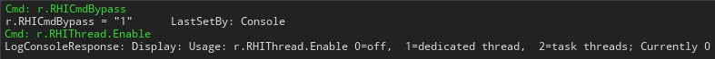

也就是说开启了命令跳过模式，并且禁用了RHI线程。在此情况下，FRHICommandList的某个接口被调用时，不会生成单独的FRHICommand，而是直接调用Context的方法。以FRHICommandList::DrawPrimitive为例：

```c++
class RHI_API FRHICommandList : public FRHIComputeCommandList
{
    void DrawPrimitive(uint32 BaseVertexIndex, uint32 NumPrimitives, uint32 NumInstances)
    {
        // 默认情况下Bypass为1, 进入此分支.
        if (Bypass())
        {
            // 直接调用图形API的上下文的对应方法.
            GetContext().RHIDrawPrimitive(BaseVertexIndex, NumPrimitives, NumInstances);
            return;
        }
        
        // 分配单独的FRHICommandDrawPrimitive命令.
        ALLOC_COMMAND(FRHICommandDrawPrimitive)(BaseVertexIndex, NumPrimitives, NumInstances);
    }
}
```

因此，在PC的默认图形API（D3D11）下，r.RHICmdBypass1且r.RHIThread.Enable0，FRHICommandList将直接调用图形API的上下文的接口，相当于同步调用图形API，此时的图形API运行于渲染线程（如果开启）。

接着将r.RHICmdBypass设为0，但保持r.RHIThread.Enable为0，此时不再直接调用Context的方法，而是通过生成一条条单独的FRHICommand，然后由FRHICommandList相关的对象执行。还是以FRHICommandList::DrawPrimitive为例，调用堆栈如下所示：

```c++
class RHI_API FRHICommandList : public FRHIComputeCommandList
{
    void FRHICommandList::DrawPrimitive(uint32 BaseVertexIndex, uint32 NumPrimitives, uint32 NumInstances)
    {
        // 默认情况下Bypass为1, 进入此分支.
        if (Bypass())
        {
            // 直接调用图形API的上下文的对应方法.
            GetContext().RHIDrawPrimitive(BaseVertexIndex, NumPrimitives, NumInstances);
            return;
        }
        
        // 分配单独的FRHICommandDrawPrimitive命令.
        // ALLOC_COMMAND宏会调用AllocCommand接口.
        ALLOC_COMMAND(FRHICommandDrawPrimitive)(BaseVertexIndex, NumPrimitives, NumInstances);
    }
    
    template <typename TCmd>
    void* AllocCommand()
    {
        return AllocCommand(sizeof(TCmd), alignof(TCmd));
    }
    
    void* AllocCommand(int32 AllocSize, int32 Alignment)
    {
        FRHICommandBase* Result = (FRHICommandBase*) MemManager.Alloc(AllocSize, Alignment);
        ++NumCommands;
        // CommandLink指向了上一个命令节点的Next.
        *CommandLink = Result;
        // 将CommandLink赋值为当前节点的Next.
        CommandLink = &Result->Next;
        return Result;
    }
}
```

利用ALLOC_COMMAND分配的命令实例会进入FRHICommandListBase的命令链表，但此时并未执行，而是等待其它合适的时机执行，例如在FRHICommandListImmediate::ImmediateFlush。下面是执行FRHICommandList的调用堆栈：

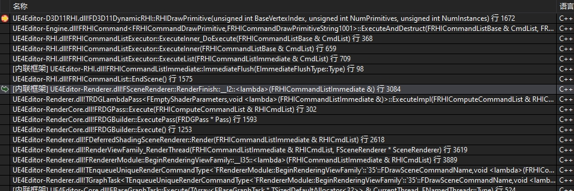

由调用堆栈可以得知，在此情况下，命令执行的过程变得复杂起来，多了很多中间执行步骤。还是以FRHICommandList::DrawPrimitive为例，调用流程示意图如下：

FRHICommandListImmediate::ImmediateFlushFRHICommandListExecutor::ExecuteListFRHICommandListExecutor::ExecuteInnerFRHICommandListExecutor::ExecuteInner_DoExecuteFRHICommand::ExecuteAndDestructFRHICommandDrawPrimitive::ExecuteINTERNAL_DECORATORFD3D11DynamicRHI::RHIDrawPrimitive

上图的使用了宏INTERNAL_DECORATOR，其和相关宏的定义如下：

```c++
// Engine\Source\Runtime\RHI\Public\RHICommandListCommandExecutes.inl

#define INTERNAL_DECORATOR(Method) CmdList.GetContext().Method
#define INTERNAL_DECORATOR_COMPUTE(Method) CmdList.GetComputeContext().Method
```

相当于通过宏来调用CommandList的Context接口。

在RHI禁用（r.RHIThread.Enable==0）情况下，以上的调用在渲染线程执行：

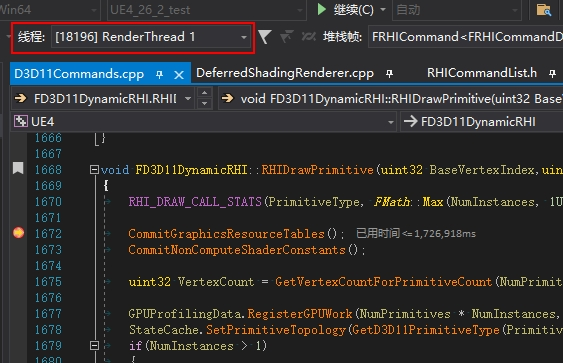

接下来将r.RHIThread.Enable设为1，以开启RHI线程。此时运行命令的线程变成了RHI：

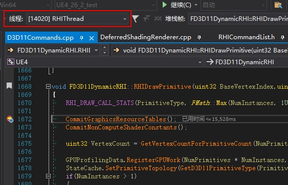

并且调用堆栈是从TaskGraph的RHI线程发起任务：

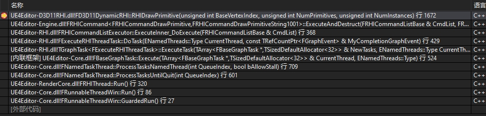

此时，命令执行的流程图如下：

FRHICommandListImmediate::ImmediateFlushFRHICommandListExecutor::ExecuteListFRHICommandListExecutor::ExecuteInnerFExecuteRHIThreadTask::DoTaskFRHICommandListExecutor::ExecuteInner_DoExecuteFRHICommand::ExecuteAndDestructFRHICommandDrawPrimitive::ExecuteINTERNAL_DECORATORFD3D11DynamicRHI::RHIDrawPrimitive

上面流程图中，方角表示在渲染线程执行，而圆角在RHI线程执行。开启RHI线程后，将出现它的统计数据：

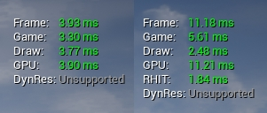

*左：未开启RHI线程的统计数据；右：开启RHI线程后的统计数据。*

下面绘制出开启或关闭Bypass和RHI线程的流程图（以调用D3D11的DrawPrimitive为例）：

NoYesNoYesFRHICommandList::DrawPrimitiveBypass?ALLOC_COMMAND_FRHICommandDrawPrimitiveFD3D11DynamicRHI::RHIDrawPrimitiveFRHICommandListBase::AllocCommand......FRHICommandListImmediate::ImmediateFlushFRHICommandListExecutor::ExecuteListFRHICommandListExecutor::ExecuteInnerRHIThreadEnabled?FRHICommandListExecutor::ExecuteInner_DoExecuteFRHICommand::ExecuteAndDestructFRHICommandDrawPrimitive::ExecuteINTERNAL_DECORATOR_RHIDrawPrimitiveFD3D11DynamicRHI::RHIDrawPrimitive.....FExecuteRHIThreadTask::DoTaskFRHICommandListExecutor::ExecuteInner_DoExecuteFRHICommand::ExecuteAndDestructFRHICommandDrawPrimitive::ExecuteINTERNAL_DECORATOR_RHIDrawPrimitiveFD3D11DynamicRHI::RHIDrawPrimitive

上面流程图中，方角表示在渲染线程中执行，圆角表示在RHI线程中执行。

## **10.4.2 ImmediateFlush**

在章节10.3.3 FDynamicRHI中，提及了刷新类型（FlushType），是指EImmediateFlushType定义的类型：

```c++
// Engine\Source\Runtime\RHI\Public\RHICommandList.h

namespace EImmediateFlushType
{
    enum Type
    { 
        WaitForOutstandingTasksOnly = 0, // 等待仅正在处理的任务完成.
        DispatchToRHIThread,             // 派发到RHI线程.
        WaitForDispatchToRHIThread,      // 等待派发到RHI线程.
        FlushRHIThread,                  // 刷新RHI线程.
        FlushRHIThreadFlushResources,    // 刷新RHI线程和资源
        FlushRHIThreadFlushResourcesFlushDeferredDeletes // 刷新RHI线程/资源和延迟删除.
    };
};
```

EImmediateFlushType中各个值的区别在FRHICommandListImmediate::ImmediateFlush的实现代码中体现出来：

```c++
// Engine\Source\Runtime\RHI\Public\RHICommandList.inl

void FRHICommandListImmediate::ImmediateFlush(EImmediateFlushType::Type FlushType)
{
    switch (FlushType)
    {
    // 等待任务完成.
    case EImmediateFlushType::WaitForOutstandingTasksOnly:
        {
            WaitForTasks();
        }
        break;
    // 派发RHI线程(执行命令队列)
    case EImmediateFlushType::DispatchToRHIThread:
        {
            if (HasCommands())
            {
                GRHICommandList.ExecuteList(*this);
            }
        }
        break;
    // 等待RHI线程派发.
    case EImmediateFlushType::WaitForDispatchToRHIThread:
        {
            if (HasCommands())
            {
                GRHICommandList.ExecuteList(*this);
            }
            WaitForDispatch();
        }
        break;
    // 刷新RHI线程.
    case EImmediateFlushType::FlushRHIThread:
        {
            // 派发并等待RHI线程.
            if (HasCommands())
            {
                GRHICommandList.ExecuteList(*this);
            }
            WaitForDispatch();
            
            // 等待RHI线程任务.
            if (IsRunningRHIInSeparateThread())
            {
                WaitForRHIThreadTasks();
            }
            
            // 重置正在处理的任务列表.
            WaitForTasks(true);
        }
        break;
    case EImmediateFlushType::FlushRHIThreadFlushResources:
    case EImmediateFlushType::FlushRHIThreadFlushResourcesFlushDeferredDeletes:
        {
            if (HasCommands())
            {
                GRHICommandList.ExecuteList(*this);
            }
            WaitForDispatch();
            WaitForRHIThreadTasks();
            WaitForTasks(true);
            
            // 刷新管线状态缓存的资源.
            PipelineStateCache::FlushResources();
            // 刷新将要删除的资源.
            FRHIResource::FlushPendingDeletes(FlushType == EImmediateFlushType::FlushRHIThreadFlushResourcesFlushDeferredDeletes);
        }
        break;
    }
}
```

上面代码中涉及到了若干种处理和等待任务的接口，它们的实现如下：

```c++
// 等待任务完成.
void FRHICommandListBase::WaitForTasks(bool bKnownToBeComplete)
{
    if (WaitOutstandingTasks.Num())
    {
        // 检测是否存在未完成的等待任务.
        bool bAny = false;
        for (int32 Index = 0; Index < WaitOutstandingTasks.Num(); Index++)
        {
            if (!WaitOutstandingTasks[Index]->IsComplete())
            {
                bAny = true;
                break;
            }
        }
        // 存在就利用TaskGraph的接口开启线程等待.
        if (bAny)
        {
            ENamedThreads::Type RenderThread_Local = ENamedThreads::GetRenderThread_Local();
            FTaskGraphInterface::Get().WaitUntilTasksComplete(WaitOutstandingTasks, RenderThread_Local);
        }
        // 重置等待任务列表.
        WaitOutstandingTasks.Reset();
    }
}

// 等待渲染线程派发完成.
void FRHICommandListBase::WaitForDispatch()
{
    // 如果RenderThreadSublistDispatchTask已完成, 则置空.
    if (RenderThreadSublistDispatchTask.GetReference() && RenderThreadSublistDispatchTask->IsComplete())
    {
        RenderThreadSublistDispatchTask = nullptr;
    }
    
    // RenderThreadSublistDispatchTask有未完成的任务.
    while (RenderThreadSublistDispatchTask.GetReference())
    {
        ENamedThreads::Type RenderThread_Local = ENamedThreads::GetRenderThread_Local();
        FTaskGraphInterface::Get().WaitUntilTaskCompletes(RenderThreadSublistDispatchTask, RenderThread_Local);
        if (RenderThreadSublistDispatchTask.GetReference() && RenderThreadSublistDispatchTask->IsComplete())
        {
            RenderThreadSublistDispatchTask = nullptr;
        }
    }
}

// 等待RHI线程任务完成.
void FRHICommandListBase::WaitForRHIThreadTasks()
{
    bool bAsyncSubmit = CVarRHICmdAsyncRHIThreadDispatch.GetValueOnRenderThread() > 0;
    ENamedThreads::Type RenderThread_Local = ENamedThreads::GetRenderThread_Local();
    
    // 相当于执行FRHICommandListBase::WaitForDispatch()
    if (bAsyncSubmit)
    {
        if (RenderThreadSublistDispatchTask.GetReference() && RenderThreadSublistDispatchTask->IsComplete())
        {
            RenderThreadSublistDispatchTask = nullptr;
        }
        while (RenderThreadSublistDispatchTask.GetReference())
        {
            if (FTaskGraphInterface::Get().IsThreadProcessingTasks(RenderThread_Local))
            {
                while (!RenderThreadSublistDispatchTask->IsComplete())
                {
                    FPlatformProcess::SleepNoStats(0);
                }
            }
            else
            {
                FTaskGraphInterface::Get().WaitUntilTaskCompletes(RenderThreadSublistDispatchTask, RenderThread_Local);
            }
            
            if (RenderThreadSublistDispatchTask.GetReference() && RenderThreadSublistDispatchTask->IsComplete())
            {
                RenderThreadSublistDispatchTask = nullptr;
            }
        }
        // now we can safely look at RHIThreadTask
    }
    
    // 如果RHI线程任务已完成, 则置空任务.
    if (RHIThreadTask.GetReference() && RHIThreadTask->IsComplete())
    {
        RHIThreadTask = nullptr;
        PrevRHIThreadTask = nullptr;
    }
    
    // 如果RHI线程有任务未完成, 则执行并等待.
    while (RHIThreadTask.GetReference())
    {
        // 如果已在处理, 则用sleep(0)跳过此时间片.
        if (FTaskGraphInterface::Get().IsThreadProcessingTasks(RenderThread_Local))
        {
            while (!RHIThreadTask->IsComplete())
            {
                FPlatformProcess::SleepNoStats(0);
            }
        }
        // 任务尚未处理, 开始并等待之.
        else
        {
            FTaskGraphInterface::Get().WaitUntilTaskCompletes(RHIThreadTask, RenderThread_Local);
        }
        
        // 如果RHI线程任务已完成, 则置空任务.
        if (RHIThreadTask.GetReference() && RHIThreadTask->IsComplete())
        {
            RHIThreadTask = nullptr;
            PrevRHIThreadTask = nullptr;
        }
    }
}
```

## **10.4.3 并行渲染**

本篇开头也提到了在开启RHI线程的情况下，RHI线程负责将渲染线程Push进来的RHI中间指令转译到对应图形平台的GPU指令。如果渲染线程是并行生成的RHI中间指令，那么RHI线程也会并行转译。


在正式阐述并行渲染和转译之前，需要先了解一些基础概念和类型。

### **10.4.3.1 FParallelCommandListSet**

FParallelCommandListSet的定义如下：

```c++
// Engine\Source\Runtime\Renderer\Private\SceneRendering.h

class FParallelCommandListSet
{
public:
    // 所属的视图.
    const FViewInfo& View;
    // 父命令队列.
    FRHICommandListImmediate& ParentCmdList;
    // 场景RT快照.
    FSceneRenderTargets* Snapshot;
    
    TStatId    ExecuteStat;
    int32 Width;
    int32 NumAlloc;
    int32 MinDrawsPerCommandList;
    // 是否平衡命令队列, 见r.RHICmdBalanceParallelLists
    bool bBalanceCommands;
    // see r.RHICmdSpewParallelListBalance
    bool bSpewBalance;
    
    // 命令队列列表.
    TArray<FRHICommandList*,SceneRenderingAllocator> CommandLists;
    // 同步事件.
    TArray<FGraphEventRef,SceneRenderingAllocator> Events;
    // 命令队列的绘制次数, 若是-1则未知. 高估总比没有好.
    TArray<int32,SceneRenderingAllocator> NumDrawsIfKnown;
    
    FParallelCommandListSet(TStatId InExecuteStat, const FViewInfo& InView, FRHICommandListImmediate& InParentCmdList, bool bInCreateSceneContext);
    virtual ~FParallelCommandListSet();

    // 获取数量.
    int32 NumParallelCommandLists() const;
    // 新建一个并行的命令队列.
    FRHICommandList* NewParallelCommandList();
    // 获取前序任务.
    FORCEINLINE FGraphEventArray* GetPrereqs();
    // 增加并行的命令队列.
    void AddParallelCommandList(FRHICommandList* CmdList, FGraphEventRef& CompletionEvent, int32 InNumDrawsIfKnown = -1);    
    virtual void SetStateOnCommandList(FRHICommandList& CmdList) {}
    // 等待任务完成.
    static void WaitForTasks();
    
protected:
    // 派发, 须由子类调用.
    void Dispatch(bool bHighPriority = false);
    // 分配新的命令队列.
    FRHICommandList* AllocCommandList();
    // 是否创建场景上下文.
    bool bCreateSceneContext;
    
private:
    void WaitForTasksInternal();
};
```

下面是FParallelCommandListSet的重要接口的实现代码：

```c++
// Engine\Source\Runtime\Renderer\Private\SceneRendering.cpp

FRHICommandList* FParallelCommandListSet::AllocCommandList()
{
    NumAlloc++;
    return new FRHICommandList(ParentCmdList.GetGPUMask());
}

void FParallelCommandListSet::Dispatch(bool bHighPriority)
{
    ENamedThreads::Type RenderThread_Local = ENamedThreads::GetRenderThread_Local();
    if (bSpewBalance)
    {
        // 等待之前的任务完成.
        for (auto& Event : Events)
        {
            FTaskGraphInterface::Get().WaitUntilTaskCompletes(Event, RenderThread_Local);
        }
    }
    
    // 是否并行转译.
    bool bActuallyDoParallelTranslate = GRHISupportsParallelRHIExecute && CommandLists.Num() >= CVarRHICmdMinCmdlistForParallelSubmit.GetValueOnRenderThread();
    if (bActuallyDoParallelTranslate)
    {
        int32 Total = 0;
        bool bIndeterminate = false;
        for (int32 Count : NumDrawsIfKnown)
        {
            // 不能确定这里面有多少, 假设应该进行平行转译.
            if (Count < 0)
            {
                bIndeterminate = true;
                break; 
            }
            Total += Count;
        }
        
        // 命令队列数量太少, 不并行转译.
        if (!bIndeterminate && Total < MinDrawsPerCommandList)
        {
            bActuallyDoParallelTranslate = false;
        }
    }

    if (bActuallyDoParallelTranslate)
    {
        // 确保支持并行的RHI执行.
        check(GRHISupportsParallelRHIExecute);
        NumAlloc -= CommandLists.Num();
        
        // 用父命令队列入队并行异步命令队列提交.
        ParentCmdList.QueueParallelAsyncCommandListSubmit(&Events[0], bHighPriority, &CommandLists[0], &NumDrawsIfKnown[0], CommandLists.Num(), (MinDrawsPerCommandList * 4) / 3, bSpewBalance);
        SetStateOnCommandList(ParentCmdList);
        // 结束Pass渲染.
        ParentCmdList.EndRenderPass();
    }
    else // 非并行模式.
    {
        for (int32 Index = 0; Index < CommandLists.Num(); Index++)
        {
            ParentCmdList.QueueAsyncCommandListSubmit(Events[Index], CommandLists[Index]);
            NumAlloc--;
        }
    }
    
    // 重置数据.
    CommandLists.Reset();
    Snapshot = nullptr;
    Events.Reset();
    
    // 等待渲染线程处理完成.
    FTaskGraphInterface::Get().ProcessThreadUntilIdle(RenderThread_Local);
}

FParallelCommandListSet::~FParallelCommandListSet()
{
    GOutstandingParallelCommandListSet = nullptr;
}

FRHICommandList* FParallelCommandListSet::NewParallelCommandList()
{
    // 新建一个命令队列.
    FRHICommandList* Result = AllocCommandList();
    Result->ExecuteStat = ExecuteStat;
    SetStateOnCommandList(*Result);
    if (bCreateSceneContext)
    {
        FSceneRenderTargets& SceneContext = FSceneRenderTargets::Get(ParentCmdList);
        // 创建场景RT快照.
        if (!Snapshot)
        {
            Snapshot = SceneContext.CreateSnapshot(View);
        }
        // 将RT快照设置到命令队列上.
        Snapshot->SetSnapshotOnCmdList(*Result);
    }
    return Result;
}

// 增加并行命令队列.
void FParallelCommandListSet::AddParallelCommandList(FRHICommandList* CmdList, FGraphEventRef& CompletionEvent, int32 InNumDrawsIfKnown)
{
    // 增加命令队列.
    CommandLists.Add(CmdList);
    // 增加等待事件.
    Events.Add(CompletionEvent);
    // 增加数量.
    NumDrawsIfKnown.Add(InNumDrawsIfKnown);
}

void FParallelCommandListSet::WaitForTasks()
{
    if (GOutstandingParallelCommandListSet)
    {
        GOutstandingParallelCommandListSet->WaitForTasksInternal();
    }
}

void FParallelCommandListSet::WaitForTasksInternal()
{
    // 收集等待处理的事件.
    FGraphEventArray WaitOutstandingTasks;
    for (int32 Index = 0; Index < Events.Num(); Index++)
    {
        if (!Events[Index]->IsComplete())
        {
            WaitOutstandingTasks.Add(Events[Index]);
        }
    }
    
    // 如果有正在处理的任务, 则等待其完成.
    if (WaitOutstandingTasks.Num())
    {
        ENamedThreads::Type RenderThread_Local = ENamedThreads::GetRenderThread_Local();
        FTaskGraphInterface::Get().WaitUntilTasksComplete(WaitOutstandingTasks, RenderThread_Local);
    }
}
```

FParallelCommandListSet拥有以下子类，以满足不同Pass或场合的并行渲染逻辑：

- FAnisotropyPassParallelCommandListSet：各项异性Pass的并行渲染命令队列集合。
- FPrePassParallelCommandListSet：提前深度Pass的并行渲染命令队列集合。
- FShadowParallelCommandListSet：阴影渲染的并行渲染命令队列集合。
- FRDGParallelCommandListSet：RDG系统的并行渲染命令队列集合。

下面以FPrePassParallelCommandListSet和FShadowParallelCommandListSet为剖析对象：

```c++
// Engine\Source\Runtime\Renderer\Private\DepthRendering.cpp

class FPrePassParallelCommandListSet : public FParallelCommandListSet
{
public:
    FPrePassParallelCommandListSet(FRHICommandListImmediate& InParentCmdList, const FSceneRenderer& InSceneRenderer, const FViewInfo& InView, bool bInCreateSceneContext)
        : FParallelCommandListSet(GET_STATID(STAT_CLP_Prepass), InView, InParentCmdList, bInCreateSceneContext)
        , SceneRenderer(InSceneRenderer)
    {
    }

    virtual ~FPrePassParallelCommandListSet()
    {
        // 在析构函数内派发命令列表.
        Dispatch(true);
    }

    // 在命令列表上设置状态.
    virtual void SetStateOnCommandList(FRHICommandList& CmdList) override
    {
        FParallelCommandListSet::SetStateOnCommandList(CmdList);
        FSceneRenderTargets::Get(CmdList).BeginRenderingPrePass(CmdList, false);
        SetupPrePassView(CmdList, View, &SceneRenderer);
    }

private:
    const FSceneRenderer& SceneRenderer;
};

class FShadowParallelCommandListSet : public FParallelCommandListSet
{
public:
    FShadowParallelCommandListSet(
        FRHICommandListImmediate& InParentCmdList,
        const FViewInfo& InView,
        bool bInCreateSceneContext,
        FProjectedShadowInfo& InProjectedShadowInfo,
        FBeginShadowRenderPassFunction InBeginShadowRenderPass)
        : FParallelCommandListSet(GET_STATID(STAT_CLP_Shadow), InView, InParentCmdList, bInCreateSceneContext)
        , ProjectedShadowInfo(InProjectedShadowInfo)
        , BeginShadowRenderPass(InBeginShadowRenderPass)
    {
        bBalanceCommands = false;
    }

    virtual ~FShadowParallelCommandListSet()
    {
        // 在析构函数内派发命令列表.
        Dispatch();
    }

    virtual void SetStateOnCommandList(FRHICommandList& CmdList) override
    {
        FParallelCommandListSet::SetStateOnCommandList(CmdList);
        BeginShadowRenderPass(CmdList, false);
        ProjectedShadowInfo.SetStateForView(CmdList);
    }

private:
    // 投射阴影信息.
    FProjectedShadowInfo& ProjectedShadowInfo;
    // 开始阴影渲染pass函数.
    FBeginShadowRenderPassFunction BeginShadowRenderPass;
    // 阴影深度渲染模式.
    EShadowDepthRenderMode RenderMode;
};
```

使用以上的逻辑比较简单，以PrePass为例：

```c++
// Engine\Source\Runtime\Renderer\Private\DepthRendering.cpp

bool FDeferredShadingSceneRenderer::RenderPrePassViewParallel(const FViewInfo& View, FRHICommandListImmediate& ParentCmdList, TFunctionRef<void()> AfterTasksAreStarted, bool bDoPrePre)
{
    bool bDepthWasCleared = false;

    {
        // 构造FPrePassParallelCommandListSet实例.
        FPrePassParallelCommandListSet ParallelCommandListSet(ParentCmdList, *this, View,
            CVarRHICmdFlushRenderThreadTasksPrePass.GetValueOnRenderThread() == 0 && CVarRHICmdFlushRenderThreadTasks.GetValueOnRenderThread() == 0);

        // 调用FParallelMeshDrawCommandPass::DispatchDraw.
        View.ParallelMeshDrawCommandPasses[EMeshPass::DepthPass].DispatchDraw(&ParallelCommandListSet, ParentCmdList);

        if (bDoPrePre)
        {
            bDepthWasCleared = PreRenderPrePass(ParentCmdList);
        }
    }

    if (bDoPrePre)
    {
        AfterTasksAreStarted();
    }

    return bDepthWasCleared;
}

// Engine\Source\Runtime\Renderer\Private\MeshDrawCommands.cpp

void FParallelMeshDrawCommandPass::DispatchDraw(FParallelCommandListSet* ParallelCommandListSet, FRHICommandList& RHICmdList) const
{
    if (MaxNumDraws <= 0)
    {
        return;
    }

    FRHIVertexBuffer* PrimitiveIdsBuffer = PrimitiveIdVertexBufferPoolEntry.BufferRHI;
    const int32 BasePrimitiveIdsOffset = 0;

    // 并行模式.
    if (ParallelCommandListSet)
    {
        if (TaskContext.bUseGPUScene)
        {
            // 在完成FMeshDrawCommandPassSetupTask后，RHI线程将上传PrimitiveIdVertexBuffer命令.
            FRHICommandListImmediate &RHICommandList = GetImmediateCommandList_ForRenderCommand();

            if (TaskEventRef.IsValid())
            {
                RHICommandList.AddDispatchPrerequisite(TaskEventRef);
            }

            RHICommandList.EnqueueLambda([
                VertexBuffer = PrimitiveIdsBuffer,
                VertexBufferData = TaskContext.PrimitiveIdBufferData, 
                VertexBufferDataSize = TaskContext.PrimitiveIdBufferDataSize,
                PrimitiveIdVertexBufferPoolEntry = PrimitiveIdVertexBufferPoolEntry](FRHICommandListImmediate& CmdList)
            {
                // Upload vertex buffer data.
                void* RESTRICT Data = (void* RESTRICT)CmdList.LockVertexBuffer(VertexBuffer, 0, VertexBufferDataSize, RLM_WriteOnly);
                FMemory::Memcpy(Data, VertexBufferData, VertexBufferDataSize);
                CmdList.UnlockVertexBuffer(VertexBuffer);

                FMemory::Free(VertexBufferData);
            });

            RHICommandList.RHIThreadFence(true);

            bPrimitiveIdBufferDataOwnedByRHIThread = true;
        }

        const ENamedThreads::Type RenderThread = ENamedThreads::GetRenderThread();

        // 处理前序任务
        FGraphEventArray Prereqs;
        if (ParallelCommandListSet->GetPrereqs())
        {
            Prereqs.Append(*ParallelCommandListSet->GetPrereqs());
        }
        if (TaskEventRef.IsValid())
        {
            Prereqs.Add(TaskEventRef);
        }

        // 基于NumEstimatedDraws将工作平均分配给可用的task graph工作线程.  
        // 每个任务将根据FVisibleMeshDrawCommandProcessTask结果调整它的工作范围.
        const int32 NumThreads = FMath::Min<int32>(FTaskGraphInterface::Get().GetNumWorkerThreads(), ParallelCommandListSet->Width);
        const int32 NumTasks = FMath::Min<int32>(NumThreads, FMath::DivideAndRoundUp(MaxNumDraws, ParallelCommandListSet->MinDrawsPerCommandList));
        const int32 NumDrawsPerTask = FMath::DivideAndRoundUp(MaxNumDraws, NumTasks);

        // 建立NumTasks个FRHICommandList, 添加到ParallelCommandListSet.
        for (int32 TaskIndex = 0; TaskIndex < NumTasks; TaskIndex++)
        {
            const int32 StartIndex = TaskIndex * NumDrawsPerTask;
            const int32 NumDraws = FMath::Min(NumDrawsPerTask, MaxNumDraws - StartIndex);
            checkSlow(NumDraws > 0);

            // 新建命令队列.
            FRHICommandList* CmdList = ParallelCommandListSet->NewParallelCommandList();

            // 创建任务FDrawVisibleMeshCommandsAnyThreadTask, 获得事件对象.
            FGraphEventRef AnyThreadCompletionEvent = TGraphTask<FDrawVisibleMeshCommandsAnyThreadTask>::CreateTask(&Prereqs, RenderThread)
                .ConstructAndDispatchWhenReady(*CmdList, TaskContext.MeshDrawCommands, TaskContext.MinimalPipelineStatePassSet, PrimitiveIdsBuffer, BasePrimitiveIdsOffset, TaskContext.bDynamicInstancing, TaskContext.InstanceFactor, TaskIndex, NumTasks);
            // 添加命令/事件等数据到ParallelCommandListSet.
            ParallelCommandListSet->AddParallelCommandList(CmdList, AnyThreadCompletionEvent, NumDraws);
        }
    }
    else // 非并行模式.
    {
        (......)
    }
}
```

以上可以知道，FParallelMeshDrawCommandPass::DispatchDraw调用之后，创建若干个FRHICommandList、FDrawVisibleMeshCommandsAnyThreadTask任务和任务同步事件，然后将它们全部加入到ParallelCommandListSet的列表中。这样，当ParallelCommandListSet被析构时，就可以真正地派发命令队列。

### **10.4.3.2 QueueParallelAsyncCommandListSubmit**

上一小节调用FParallelCommandListSet::Dispatch之后，会进入FRHICommandListBase::QueueParallelAsyncCommandListSubmit的接口：

```c++
void FRHICommandListBase::QueueParallelAsyncCommandListSubmit(FGraphEventRef* AnyThreadCompletionEvents, bool bIsPrepass, FRHICommandList** CmdLists, int32* NumDrawsIfKnown, int32 Num, int32 MinDrawsPerTranslate, bool bSpewMerge)
{
    if (IsRunningRHIInSeparateThread())
    {
        // 在提交并行构建的子列表之前，执行立即命令列表上排队的所有命令.
        FRHICommandListImmediate& ImmediateCommandList = FRHICommandListExecutor::GetImmediateCommandList();
        ImmediateCommandList.ImmediateFlush(EImmediateFlushType::DispatchToRHIThread);
        
        // 清空栅栏.
        if (RHIThreadBufferLockFence.GetReference() && RHIThreadBufferLockFence->IsComplete())
        {
            RHIThreadBufferLockFence = nullptr;
        }
    }
    
#if !UE_BUILD_SHIPPING
    // 处理前先刷新命令，这样就能知道这个平行集打碎了什么东西，或是之前有什么东西.
    if (CVarRHICmdFlushOnQueueParallelSubmit.GetValueOnRenderThread())
    {
        CSV_SCOPED_TIMING_STAT(RHITFlushes, QueueParallelAsyncCommandListSubmit);
        FRHICommandListExecutor::GetImmediateCommandList().ImmediateFlush(EImmediateFlushType::FlushRHIThread);
    }
#endif

    // 确保开启了RHI线程.
    if (Num && IsRunningRHIInSeparateThread())
    {
        static const auto ICVarRHICmdBalanceParallelLists = IConsoleManager::Get().FindTConsoleVariableDataInt(TEXT("r.RHICmdBalanceParallelLists"));

        // r.RHICmdBalanceParallelLists==0 且 GRHISupportsParallelRHIExecute==true 且 使用延迟上下文.
        // 不平衡命令队列提交模式.
        if (ICVarRHICmdBalanceParallelLists->GetValueOnRenderThread() == 0 && CVarRHICmdBalanceTranslatesAfterTasks.GetValueOnRenderThread() > 0 && GRHISupportsParallelRHIExecute && CVarRHICmdUseDeferredContexts.GetValueOnAnyThread() > 0)
        {
            // 处理前序任务.
            FGraphEventArray Prereq;
            FRHICommandListBase** RHICmdLists = (FRHICommandListBase**)Alloc(sizeof(FRHICommandListBase*) * Num, alignof(FRHICommandListBase*));
            for (int32 Index = 0; Index < Num; Index++)
            {
                FGraphEventRef& AnyThreadCompletionEvent = AnyThreadCompletionEvents[Index];
                FRHICommandList* CmdList = CmdLists[Index];
                RHICmdLists[Index] = CmdList;
                if (AnyThreadCompletionEvent.GetReference())
                {
                    Prereq.Add(AnyThreadCompletionEvent);
                    WaitOutstandingTasks.Add(AnyThreadCompletionEvent);
                }
            }
            
            // 确保在开始任何并行转译之前，所有旧的缓冲区锁都已完成.
            if (RHIThreadBufferLockFence.GetReference())
            {
                Prereq.Add(RHIThreadBufferLockFence);
            }
            
            // 新建FRHICommandList.
            FRHICommandList* CmdList = new FRHICommandList(GetGPUMask());
            // 拷贝渲染线程上下文.
            CmdList->CopyRenderThreadContexts(*this);
            // 创建设置转译任务(FParallelTranslateSetupCommandList).
            FGraphEventRef TranslateSetupCompletionEvent = TGraphTask<FParallelTranslateSetupCommandList>::CreateTask(&Prereq, ENamedThreads::GetRenderThread()).ConstructAndDispatchWhenReady(CmdList, &RHICmdLists[0], Num, bIsPrepass);
            // 入队命令队列提交.
            QueueCommandListSubmit(CmdList);
            // 添加设置转译事件到列表.
            AllOutstandingTasks.Add(TranslateSetupCompletionEvent);
            // 避免在异步命令列表之后的东西被绑定到它.
            if (IsRunningRHIInSeparateThread())
            {
                FRHICommandListExecutor::GetImmediateCommandList().ImmediateFlush(EImmediateFlushType::DispatchToRHIThread);
            }
            // 刷新命令到RHI线程.
#if !UE_BUILD_SHIPPING
            if (CVarRHICmdFlushOnQueueParallelSubmit.GetValueOnRenderThread())
            {
                FRHICommandListExecutor::GetImmediateCommandList().ImmediateFlush(EImmediateFlushType::FlushRHIThread);
            }
#endif
            return;
        }
        
        // 平衡命令队列提交模式.
        IRHICommandContextContainer* ContextContainer = nullptr;
        bool bMerge = !!CVarRHICmdMergeSmallDeferredContexts.GetValueOnRenderThread();
        int32 EffectiveThreads = 0;
        int32 Start = 0;
        int32 ThreadIndex = 0;
        if (GRHISupportsParallelRHIExecute && CVarRHICmdUseDeferredContexts.GetValueOnAnyThread() > 0)
        {
            // 由于需要提前知道作业的数量，因此运行了两次合并逻辑.(可改进)
            while (Start < Num)
            {
                int32 Last = Start;
                int32 DrawCnt = NumDrawsIfKnown[Start];

                if (bMerge && DrawCnt >= 0)
                {
                    while (Last < Num - 1 && NumDrawsIfKnown[Last + 1] >= 0 && DrawCnt + NumDrawsIfKnown[Last + 1] <= MinDrawsPerTranslate)
                    {
                        Last++;
                        DrawCnt += NumDrawsIfKnown[Last];
                    }
                }
                check(Last >= Start);
                Start = Last + 1;
                EffectiveThreads++;
            }

            Start = 0;
            ContextContainer = RHIGetCommandContextContainer(ThreadIndex, EffectiveThreads, GetGPUMask());
        }
        
        if (ContextContainer)
        {
            // 又一次合并操作.
            while (Start < Num)
            {
                int32 Last = Start;
                int32 DrawCnt = NumDrawsIfKnown[Start];
                int32 TotalMem = bSpewMerge ? CmdLists[Start]->GetUsedMemory() : 0; 

                if (bMerge && DrawCnt >= 0)
                {
                    while (Last < Num - 1 && NumDrawsIfKnown[Last + 1] >= 0 && DrawCnt + NumDrawsIfKnown[Last + 1] <= MinDrawsPerTranslate)
                    {
                        Last++;
                        DrawCnt += NumDrawsIfKnown[Last];
                        TotalMem += bSpewMerge ? CmdLists[Start]->GetUsedMemory() : 0;
                    }
                }

            // 后面的逻辑和非平衡模式比较相似, 省略.
            
            (......)
                
            return;
        }
    }
    
    // 非并行模式.
    (......)
}
```

以上可知，开启并行命令队列提交需要满足以下条件：

- 开启了RHI线程，即IsRunningRHIInSeparateThread()为true。
- 当前使用的图形API支持并行执行，即GRHISupportsParallelRHIExecute要为true。
- 开启了延迟上下文，即CVarRHICmdUseDeferredContexts不为0。

无论是哪个图形API，都需要指定一个主CommandList（即ParentCommandList），以便调用它的QueueParallelAsyncCommandListSubmit提交设置命令队列的任务。上面提交到RHI线程的任务对象是FParallelTranslateSetupCommandList，由下一小节阐述。

### **10.4.3.3 FParallelTranslateSetupCommandList**

FParallelTranslateSetupCommandList用于建立并行（或串行）提交子命令队列的任务，定义如下：

```c++
class FParallelTranslateSetupCommandList
{
    // 用于提交子命令列表的父命令列表.
    FRHICommandList* RHICmdList;
    // 待提交的子命令队列列表.
    FRHICommandListBase** RHICmdLists;
    
    int32 NumCommandLists;
    bool bIsPrepass;
    int32 MinSize;
    int32 MinCount;
    
public:
    FParallelTranslateSetupCommandList(FRHICommandList* InRHICmdList, FRHICommandListBase** InRHICmdLists, int32 InNumCommandLists, bool bInIsPrepass)
        : RHICmdList(InRHICmdList)
        , RHICmdLists(InRHICmdLists)
        , NumCommandLists(InNumCommandLists)
        , bIsPrepass(bInIsPrepass)
    {
        // 单个子命令队列的最小尺寸.
        MinSize = CVarRHICmdMinCmdlistSizeForParallelTranslate.GetValueOnRenderThread() * 1024;
        MinCount = CVarRHICmdMinCmdlistForParallelTranslate.GetValueOnRenderThread();
    }

    static FORCEINLINE TStatId GetStatId();
    // 预期的线程.
    static FORCEINLINE ENamedThreads::Type GetDesiredThread()
    {
        return CPrio_FParallelTranslateSetupCommandList.Get();
    }
    static FORCEINLINE ESubsequentsMode::Type GetSubsequentsMode() { return ESubsequentsMode::TrackSubsequents; }

    // 执行设置任务.
    void DoTask(ENamedThreads::Type CurrentThread, const FGraphEventRef& MyCompletionGraphEvent)
    {
        TArray<int32, TInlineAllocator<64> > Sizes;
        Sizes.Reserve(NumCommandLists);
        for (int32 Index = 0; Index < NumCommandLists; Index++)
        {
            Sizes.Add(RHICmdLists[Index]->GetUsedMemory());
        }

        int32 EffectiveThreads = 0;
        int32 Start = 0;
        // 合并绘制指令, 计算所需的线程数量.
        while (Start < NumCommandLists)
        {
            int32 Last = Start;
            int32 DrawCnt = Sizes[Start];

            while (Last < NumCommandLists - 1 && DrawCnt + Sizes[Last + 1] <= MinSize)
            {
                Last++;
                DrawCnt += Sizes[Last];
            }
            check(Last >= Start);
            Start = Last + 1;
            EffectiveThreads++;
        } 

        // 如果需要的线程数量太少, 则串行提交子命令队列.
        if (EffectiveThreads < MinCount)
        {
            FGraphEventRef Nothing;
            for (int32 Index = 0; Index < NumCommandLists; Index++)
            {
                FRHICommandListBase* CmdList = RHICmdLists[Index];
                // 使用了ALLOC_COMMAND_CL分配子命令队列提交接口.
                ALLOC_COMMAND_CL(*RHICmdList, FRHICommandWaitForAndSubmitSubList)(Nothing, CmdList);
#if WITH_MGPU
                ALLOC_COMMAND_CL(*RHICmdList, FRHICommandSetGPUMask)(RHICmdList->GetGPUMask());
#endif
            }
        }
        // 并行提交.
        else
        {
            Start = 0;
            int32 ThreadIndex = 0;

            // 合并数量太少的命令队列.
            while (Start < NumCommandLists)
            {
                int32 Last = Start;
                int32 DrawCnt = Sizes[Start];

                while (Last < NumCommandLists - 1 && DrawCnt + Sizes[Last + 1] <= MinSize)
                {
                    Last++;
                    DrawCnt += Sizes[Last];
                }

                // 获取ContextContainer
                IRHICommandContextContainer* ContextContainer =  RHIGetCommandContextContainer(ThreadIndex, EffectiveThreads, RHICmdList->GetGPUMask());

                // 创建并行转译任务FParallelTranslateCommandList.
                FGraphEventRef TranslateCompletionEvent = TGraphTask<FParallelTranslateCommandList>::CreateTask(nullptr, ENamedThreads::GetRenderThread()).ConstructAndDispatchWhenReady(&RHICmdLists[Start], 1 + Last - Start, ContextContainer, bIsPrepass);
                // 此任务结束前须确保转译任务完成.
                MyCompletionGraphEvent->DontCompleteUntil(TranslateCompletionEvent);
                // 调用RHICmdList的FRHICommandWaitForAndSubmitSubListParallel接口.
                ALLOC_COMMAND_CL(*RHICmdList, FRHICommandWaitForAndSubmitSubListParallel)(TranslateCompletionEvent, ContextContainer, EffectiveThreads, ThreadIndex++);
                Start = Last + 1;
            }
            check(EffectiveThreads == ThreadIndex);
        }
    }
};
```

以上代码中，可以补充几点：

- 如果命令数量太少，所需的线程数量过少，直接使用串行转译接口FRHICommandWaitForAndSubmitSubList。

- 并行逻辑分支中，RHIGetCommandContextContainer从具体的RHI子类中获取上下文容器，只在D3D12、Vulkan、Metal等现代图形平台中有实现，其它图形平台皆返回nullptr。

- 每个线程会提交1~N个子命令队列，以确保它们的绘制命令总数不少于MinSize，提升每个线程的提交效率。

- 每个线程会创建一个转译任务FParallelTranslateCommandList，然后利用RHICmdList的FRHICommandWaitForAndSubmitSubListParallel取等待子命令列表的并行提交。

- 注意FParallelTranslateSetupCommandList的预期线程由CPrio_FParallelTranslateSetupCommandList决定：

  ```c++
  FAutoConsoleTaskPriority CPrio_FParallelTranslateSetupCommandList
      // 控制台名称.
      TEXT("TaskGraph.TaskPriorities.ParallelTranslateSetupCommandList"), 
      // 描述.
      TEXT("Task and thread priority for FParallelTranslateSetupCommandList."),
      // 如果有高优先级的线程, 使用之.
      ENamedThreads::HighThreadPriority,
      // 使用高任务优先级.
      ENamedThreads::HighTaskPriority,
      // 如果没有高优先级的线程, 则使用普遍优先级的线程, 但使用高任务优先级代替之.
      ENamedThreads::HighTaskPriority
      );
  ```

  因此可知，设置转译的任务会被TaskGraph系统优先执行，但发起设置转译任务的线程还是渲染线程而非RHI线程。

### **10.4.3.4 FParallelTranslateCommandList**

FParallelTranslateCommandList便是真正地转译命令队列，它的定义如下：

```c++
class FParallelTranslateCommandList
{
    // 待转译的命令列表.
    FRHICommandListBase** RHICmdLists;
    // 需转译的命令列表数量.
    int32 NumCommandLists;
    // 上下文容器.
    IRHICommandContextContainer* ContextContainer;
    // 是否提前深度pass.
    bool bIsPrepass;
    
public:
    FParallelTranslateCommandList(FRHICommandListBase** InRHICmdLists, int32 InNumCommandLists, IRHICommandContextContainer* InContextContainer, bool bInIsPrepass)
        : RHICmdLists(InRHICmdLists)
        , NumCommandLists(InNumCommandLists)
        , ContextContainer(InContextContainer)
        , bIsPrepass(bInIsPrepass)
    {
        check(RHICmdLists && ContextContainer && NumCommandLists);
    }

    static FORCEINLINE TStatId GetStatId();

    // 预期的线程, 根据是否Prepass而定.
    ENamedThreads::Type GetDesiredThread()
    {
        return bIsPrepass ? CPrio_FParallelTranslateCommandListPrepass.Get() : CPrio_FParallelTranslateCommandList.Get();
    }

    static ESubsequentsMode::Type GetSubsequentsMode() { return ESubsequentsMode::TrackSubsequents; }

    // 执行任务.
    void DoTask(ENamedThreads::Type CurrentThread, const FGraphEventRef& MyCompletionGraphEvent)
    {
        IRHICommandContext* Context = ContextContainer->GetContext();
        for (int32 Index = 0; Index < NumCommandLists; Index++)
        {
            // 设置子命令队列的上下文.
            RHICmdLists[Index]->SetContext(Context);
            // 删除子命令队列. 
            delete RHICmdLists[Index];
        }
        // 清理上下文.
        ContextContainer->FinishContext();
    }
};
```

上面的代码需要补充几点说明：

- GetDesiredThread根据是否prepass由两个控制台遍历决定：

  ```c++
  FAutoConsoleTaskPriority CPrio_FParallelTranslateCommandListPrepass(
      TEXT("TaskGraph.TaskPriorities.ParallelTranslateCommandListPrepass"),
      TEXT("Task and thread priority for FParallelTranslateCommandList for the prepass, which we would like to get to the GPU asap."),
      ENamedThreads::NormalThreadPriority,
      ENamedThreads::HighTaskPriority
      );
  
  FAutoConsoleTaskPriority CPrio_FParallelTranslateCommandList(
      TEXT("TaskGraph.TaskPriorities.ParallelTranslateCommandList"),
      TEXT("Task and thread priority for FParallelTranslateCommandList."),
      ENamedThreads::NormalThreadPriority,
      ENamedThreads::NormalTaskPriority
      );
  ```

  由此可知，如果是prepass，使用普通优先级的线程但高任务优先级，其它pass则使用普通优先级的线程和普通的任务优先级。

- DoTask逻辑非常简单，给命令队列设置上下文，然后将命令队列删除，最后清理上下文。不过这里有个疑问，转译任务在哪里执行？几番盘查之后，发现是在FRHICommandListBase的析构函数之中，调用堆栈如下：

  ```c++
  FRHICommandListBase::~FRHICommandListBase()
  {
      // 刷新命令列表.
      Flush();
      GRHICommandList.OutstandingCmdListCount.Decrement();
  }
  
  void FRHICommandListBase::Flush()
  {
      // 如果存在命令.
      if (HasCommands())
      {
          check(!IsImmediate());
          // 用全局命令列表执行之. GRHICommandList的类型是FRHICommandListExecutor.
          GRHICommandList.ExecuteList(*this);
      }
  }
  
  void FRHICommandListExecutor::ExecuteList(FRHICommandListBase& CmdList)
  {
      if (IsInRenderingThread() && !GetImmediateCommandList().IsExecuting())
      {
          GetImmediateCommandList().ImmediateFlush(EImmediateFlushType::DispatchToRHIThread);
      }
  
      ExecuteInner(CmdList);
  }
  
  void FRHICommandListExecutor::ExecuteInner(FRHICommandListBase& CmdList)
  {
      (......)
  }
  ```

  到了`FRHICommandListExecutor::ExecuteInner`这一步，就交给FRHICommandListExecutor处理了，具体过程和解析见**10.4.1 RHI命令执行**。

不过再次强调的是，需要图形API支持并行提交和转译，才能开启真正的并行渲染，否则就只能按照普通的任务放到渲染线程执行。

## **10.4.4 Pass渲染**

### **10.4.4.1 普通Pass渲染**

普通Pass的渲染涉及到以下接口和类型：

```c++
// Engine\Source\Runtime\RHI\Public\RHIResources.h

// 渲染通道信息.
struct FRHIRenderPassInfo
{
    // 渲染纹理信息.
    struct FColorEntry
    {
        FRHITexture* RenderTarget;
        FRHITexture* ResolveTarget;
        int32 ArraySlice;
        uint8 MipIndex;
        ERenderTargetActions Action;
    };
    FColorEntry ColorRenderTargets[MaxSimultaneousRenderTargets];

    // 深度模板信息.
    struct FDepthStencilEntry
    {
        FRHITexture* DepthStencilTarget;
        FRHITexture* ResolveTarget;
        EDepthStencilTargetActions Action;
        FExclusiveDepthStencil ExclusiveDepthStencil;
    };
    FDepthStencilEntry DepthStencilRenderTarget;

    // 解析参数.
    FResolveParams ResolveParameters;

    // 部分RHI可以使用纹理来控制不同区域的采样和/或阴影分辨率
    FTextureRHIRef FoveationTexture = nullptr;

    // 部分RHI需要一个提示，遮挡查询将在这个渲染通道中使用
    uint32 NumOcclusionQueries = 0;
    bool bOcclusionQueries = false;

    // 部分RHI需要知道，在为部分资源转换生成mip映射的情况下，这个渲染通道是否将读取和写入相同的纹理.
    bool bGeneratingMips = false;

    // 如果这个renderpass应该是多视图，则需要多少视图.
    uint8 MultiViewCount = 0;

    // 部分RHI的提示，渲染通道将有特定的子通道.
    ESubpassHint SubpassHint = ESubpassHint::None;

    // 是否太多UAV.
    bool bTooManyUAVs = false;
    bool bIsMSAA = false;

    // 不同的构造函数.
    
    // Color, no depth, optional resolve, optional mip, optional array slice
    explicit FRHIRenderPassInfo(FRHITexture* ColorRT, ERenderTargetActions ColorAction, FRHITexture* ResolveRT = nullptr, uint32 InMipIndex = 0, int32 InArraySlice = -1);
    // Color MRTs, no depth
    explicit FRHIRenderPassInfo(int32 NumColorRTs, FRHITexture* ColorRTs[], ERenderTargetActions ColorAction);
    // Color MRTs, no depth
    explicit FRHIRenderPassInfo(int32 NumColorRTs, FRHITexture* ColorRTs[], ERenderTargetActions ColorAction, FRHITexture* ResolveTargets[]);
    // Color MRTs and depth
    explicit FRHIRenderPassInfo(int32 NumColorRTs, FRHITexture* ColorRTs[], ERenderTargetActions ColorAction, FRHITexture* DepthRT, EDepthStencilTargetActions DepthActions, FExclusiveDepthStencil InEDS = FExclusiveDepthStencil::DepthWrite_StencilWrite);
    // Color MRTs and depth
    explicit FRHIRenderPassInfo(int32 NumColorRTs, FRHITexture* ColorRTs[], ERenderTargetActions ColorAction, FRHITexture* ResolveRTs[], FRHITexture* DepthRT, EDepthStencilTargetActions DepthActions, FRHITexture* ResolveDepthRT, FExclusiveDepthStencil InEDS = FExclusiveDepthStencil::DepthWrite_StencilWrite);
    // Depth, no color
    explicit FRHIRenderPassInfo(FRHITexture* DepthRT, EDepthStencilTargetActions DepthActions, FRHITexture* ResolveDepthRT = nullptr, FExclusiveDepthStencil InEDS = FExclusiveDepthStencil::DepthWrite_StencilWrite);
    // Depth, no color, occlusion queries
    explicit FRHIRenderPassInfo(FRHITexture* DepthRT, uint32 InNumOcclusionQueries, EDepthStencilTargetActions DepthActions, FRHITexture* ResolveDepthRT = nullptr, FExclusiveDepthStencil InEDS = FExclusiveDepthStencil::DepthWrite_StencilWrite);
    // Color and depth
    explicit FRHIRenderPassInfo(FRHITexture* ColorRT, ERenderTargetActions ColorAction, FRHITexture* DepthRT, EDepthStencilTargetActions DepthActions, FExclusiveDepthStencil InEDS = FExclusiveDepthStencil::DepthWrite_StencilWrite);
    // Color and depth with resolve
    explicit FRHIRenderPassInfo(FRHITexture* ColorRT, ERenderTargetActions ColorAction, FRHITexture* ResolveColorRT,
        FRHITexture* DepthRT, EDepthStencilTargetActions DepthActions, FRHITexture* ResolveDepthRT, FExclusiveDepthStencil InEDS = FExclusiveDepthStencil::DepthWrite_StencilWrite);
    // Color and depth with resolve and optional sample density
    explicit FRHIRenderPassInfo(FRHITexture* ColorRT, ERenderTargetActions ColorAction, FRHITexture* ResolveColorRT,
        FRHITexture* DepthRT, EDepthStencilTargetActions DepthActions, FRHITexture* ResolveDepthRT, FRHITexture* InFoveationTexture, FExclusiveDepthStencil InEDS = FExclusiveDepthStencil::DepthWrite_StencilWrite);

    enum ENoRenderTargets
    {
        NoRenderTargets,
    };
    explicit FRHIRenderPassInfo(ENoRenderTargets Dummy);
    explicit FRHIRenderPassInfo();

    inline int32 GetNumColorRenderTargets() const;
    RHI_API void Validate() const;
    RHI_API void ConvertToRenderTargetsInfo(FRHISetRenderTargetsInfo& OutRTInfo) const;

    (......)
};

// Engine\Source\Runtime\RHI\Public\RHICommandList.h

class RHI_API FRHICommandList : public FRHIComputeCommandList
{
public:
    void BeginRenderPass(const FRHIRenderPassInfo& InInfo, const TCHAR* Name)
    {
        if (InInfo.bTooManyUAVs)
        {
            UE_LOG(LogRHI, Warning, TEXT("RenderPass %s has too many UAVs"));
        }
        InInfo.Validate();

        // 直接调用RHI的接口.
        if (Bypass())
        {
            GetContext().RHIBeginRenderPass(InInfo, Name);
        }
        // 分配RHI命令.
        else
        {
            TCHAR* NameCopy  = AllocString(Name);
            ALLOC_COMMAND(FRHICommandBeginRenderPass)(InInfo, NameCopy);
        }
        // 设置在RenderPass内标记.
        Data.bInsideRenderPass = true;

        // 缓存活动的RT.
        CacheActiveRenderTargets(InInfo);
        // 重置子Pass.
        ResetSubpass(InInfo.SubpassHint);
        Data.bInsideRenderPass = true;
    }

    void EndRenderPass()
    {
        // 调用或分配RHI接口.
        if (Bypass())
        {
            GetContext().RHIEndRenderPass();
        }
        else
        {
            ALLOC_COMMAND(FRHICommandEndRenderPass)();
        }
        // 重置在RenderPass内标记.
        Data.bInsideRenderPass = false;
        // 重置子Pass标记为None.
        ResetSubpass(ESubpassHint::None);
    }
};
```

它们的使用案例如下：

```c++
void FSceneRenderer::RenderShadowDepthMaps(FRHICommandListImmediate& RHICmdList)
{
    (......)
    
    for (int32 AtlasIndex = 0; AtlasIndex < SortedShadowsForShadowDepthPass.TranslucencyShadowMapAtlases.Num(); AtlasIndex++)
    {
        const FSortedShadowMapAtlas& ShadowMapAtlas = SortedShadowsForShadowDepthPass.TranslucencyShadowMapAtlases[AtlasIndex];
        FIntPoint TargetSize = ShadowMapAtlas.RenderTargets.ColorTargets[0]->GetDesc().Extent;

        FSceneRenderTargetItem ColorTarget0 = ShadowMapAtlas.RenderTargets.ColorTargets[0]->GetRenderTargetItem();
        FSceneRenderTargetItem ColorTarget1 = ShadowMapAtlas.RenderTargets.ColorTargets[1]->GetRenderTargetItem();

        FRHITexture* RenderTargetArray[2] =
        {
            ColorTarget0.TargetableTexture,
            ColorTarget1.TargetableTexture
        };

        // 创建FRHIRenderPassInfo实例.
        FRHIRenderPassInfo RPInfo(UE_ARRAY_COUNT(RenderTargetArray), RenderTargetArray, ERenderTargetActions::Load_Store);
        TransitionRenderPassTargets(RHICmdList, RPInfo);
        // 开始渲染Pass.
        RHICmdList.BeginRenderPass(RPInfo, TEXT("RenderTranslucencyDepths"));
        {
            // 渲染阴影.
            for (int32 ShadowIndex = 0; ShadowIndex < ShadowMapAtlas.Shadows.Num(); ShadowIndex++)
            {
                FProjectedShadowInfo* ProjectedShadowInfo = ShadowMapAtlas.Shadows[ShadowIndex];
                ProjectedShadowInfo->SetupShadowUniformBuffers(RHICmdList, Scene);
                ProjectedShadowInfo->RenderTranslucencyDepths(RHICmdList, this);
            }
        }
        // 结束渲染Pass.
        RHICmdList.EndRenderPass();

        RHICmdList.Transition(FRHITransitionInfo(ColorTarget0.TargetableTexture, ERHIAccess::Unknown, ERHIAccess::SRVMask));
        RHICmdList.Transition(FRHITransitionInfo(ColorTarget1.TargetableTexture, ERHIAccess::Unknown, ERHIAccess::SRVMask));
    }
    
    (......)
}
```

### **10.4.4.2 Subpass渲染**

先说一下Subpass的由来、作用和特点。

在传统的多Pass渲染中，每个Pass结束时通常会渲染出一组渲染纹理，部分成为着色器参数提供给下一个Pass采样读取。这种纹理采样方式不受任何限制，可以读取任意的领域像素，使用任意的纹理过滤方式。这种方式虽然使用灵活，但在TBR（Tile-Based Renderer）硬件架构的设备中会有较大的消耗：渲染纹理的Pass通常会将渲染结果存储在On-chip的Tile Memory中，待Pass结束后会写回GPU显存（VRAM）中，写回GPU显存是个耗时耗耗电的操作。

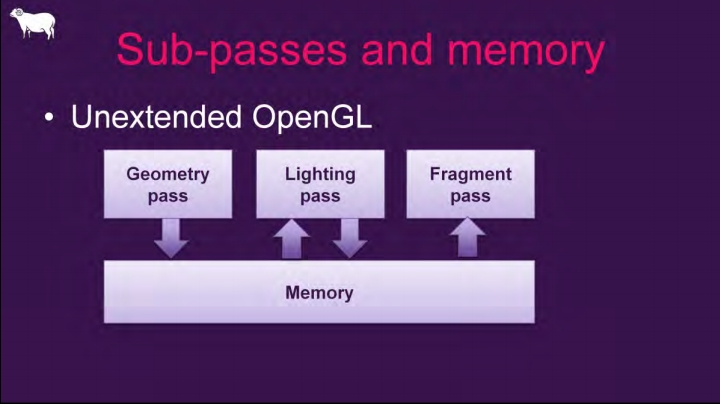

*传统多Pass之间的内存存取模型，多次发生于On-Chip和全局存储器之间。*

如果出现一种特殊的纹理使用情况：上一个Pass渲染处理的纹理，立即被下一个Pass使用，并且下一个Pass只采样像素位置自身的数据，而不需要采样邻域像素的位置。这种情况就符合了Subpass的使用情景。使用Subpass渲染的纹理结果只会存储在Tile Memory中，在Subpass结束后不会写回VRAM，而直接提供Tile Memory的数据给下一个Subpass采样读取。这样就避免了传统Pass结束写回GPU显存以及下一个Pass又从GPU显存读数据的耗时耗电操作，从而提升了性能。

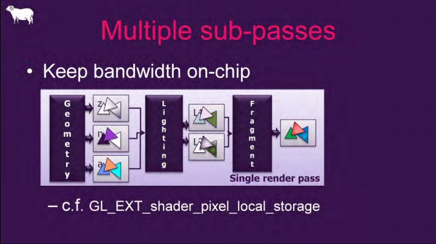

*Subpass之间的内存存取模型，都发生在On-Chip内。*

UE涉及Subpass的接口和类型如下：

```c++
// Engine\Source\Runtime\RHI\Public\RHIResources.h

// 提供给RHI的Subpass标记.
enum class ESubpassHint : uint8
{
    None,                    // 传统渲染(非Subpass)
    DepthReadSubpass,        // 深度读取Subpass.
    DeferredShadingSubpass, // 移动端延迟着色Subpass.
};

// Engine\Source\Runtime\RHI\Public\RHICommandList.h

class RHI_API FRHICommandListBase : public FNoncopyable
{
    (......)
    
protected:
    // PSO上下文.
    struct FPSOContext
    {
        uint32 CachedNumSimultanousRenderTargets = 0;
        TStaticArray<FRHIRenderTargetView, MaxSimultaneousRenderTargets> CachedRenderTargets;
        FRHIDepthRenderTargetView CachedDepthStencilTarget;
        
        // Subpass提示标记.
        ESubpassHint SubpassHint = ESubpassHint::None;
        uint8 SubpassIndex = 0;
        uint8 MultiViewCount = 0;
        bool HasFragmentDensityAttachment = false;
    } PSOContext;
};

class RHI_API FRHICommandList : public FRHIComputeCommandList
{
public:
    void BeginRenderPass(const FRHIRenderPassInfo& InInfo, const TCHAR* Name)
    {
        (......)

        CacheActiveRenderTargets(InInfo);
        // 设置Subpass数据.
        ResetSubpass(InInfo.SubpassHint);
        Data.bInsideRenderPass = true;
    }

    void EndRenderPass()
    {
        (......)
        
        // 重置Subpass标记为None.
        ResetSubpass(ESubpassHint::None);
    }

    // 下一个Subpass.
    void NextSubpass()
    {
        // 分配或调用RHI接口.
        if (Bypass())
        {
            GetContext().RHINextSubpass();
        }
        else
        {
            ALLOC_COMMAND(FRHICommandNextSubpass)();
        }
        
        // 增加Subpass计数.
        IncrementSubpass();
    }
    
    // 增加subpass计数.
    void IncrementSubpass()
    {
        PSOContext.SubpassIndex++;
    }
    
    // 重置Subpass数据.
    void ResetSubpass(ESubpassHint SubpassHint)
    {
        PSOContext.SubpassHint = SubpassHint;
        PSOContext.SubpassIndex = 0;
    }
};
```

UE的Subpass主要集中在移动端渲染器：

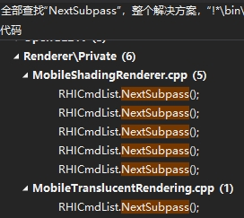

原因是移动端TBR架构的硬件设备越来越多，占比愈来愈大，Subpass成为移动端主渲染器的首选是必然且合理的。

在Subpass渲染中，还是涉及到了Pass的Overlap问题，采用Overlap可以提升GPU的使用率，提升渲染性能（下图）。

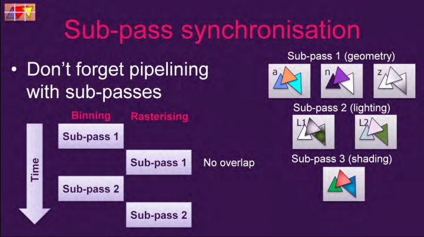

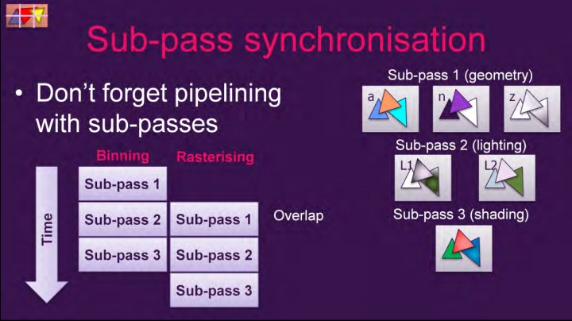

*上：未采用Overlap技术的Subpass管线；下：采用了Overlap技术的Subpass管线。*

RHI有关Overlap的指令主要是UAV：

```c++
class RHI_API FRHIComputeCommandList : public FRHICommandListBase
{
    (......)
    
    void BeginUAVOverlap()
    {
        if (Bypass())
        {
            GetContext().RHIBeginUAVOverlap();
            return;
        }
        ALLOC_COMMAND(FRHICommandBeginUAVOverlap)();
    }

    void EndUAVOverlap()
    {
        if (Bypass())
        {
            GetContext().RHIEndUAVOverlap();
            return;
        }
        ALLOC_COMMAND(FRHICommandEndUAVOverlap)();
    }

    void BeginUAVOverlap(FRHIUnorderedAccessView* UAV)
    {
        FRHIUnorderedAccessView* UAVs[1] = { UAV };
        BeginUAVOverlap(MakeArrayView(UAVs, 1));
    }

    void EndUAVOverlap(FRHIUnorderedAccessView* UAV)
    {
        FRHIUnorderedAccessView* UAVs[1] = { UAV };
        EndUAVOverlap(MakeArrayView(UAVs, 1));
    }

    void BeginUAVOverlap(TArrayView<FRHIUnorderedAccessView* const> UAVs)
    {
        if (Bypass())
        {
            GetContext().RHIBeginUAVOverlap(UAVs);
            return;
        }

        const uint32 AllocSize = UAVs.Num() * sizeof(FRHIUnorderedAccessView*);
        FRHIUnorderedAccessView** InlineUAVs = (FRHIUnorderedAccessView**)Alloc(AllocSize, alignof(FRHIUnorderedAccessView*));
        FMemory::Memcpy(InlineUAVs, UAVs.GetData(), AllocSize);
        ALLOC_COMMAND(FRHICommandBeginSpecificUAVOverlap)(MakeArrayView(InlineUAVs, UAVs.Num()));
    }

    void EndUAVOverlap(TArrayView<FRHIUnorderedAccessView* const> UAVs)
    {
        if (Bypass())
        {
            GetContext().RHIEndUAVOverlap(UAVs);
            return;
        }

        const uint32 AllocSize = UAVs.Num() * sizeof(FRHIUnorderedAccessView*);
        FRHIUnorderedAccessView** InlineUAVs = (FRHIUnorderedAccessView**)Alloc(AllocSize, alignof(FRHIUnorderedAccessView*));
        FMemory::Memcpy(InlineUAVs, UAVs.GetData(), AllocSize);
        ALLOC_COMMAND(FRHICommandEndSpecificUAVOverlap)(MakeArrayView(InlineUAVs, UAVs.Num()));
    }
}
```

## **10.4.5 RHI资源管理**

**10.2.2 FRHIResource**章节已经阐述过RHI资源的基本接口，FRHIResource自身拥有引用计数和引用计数增加、减少的接口：

```c++
class RHI_API FRHIResource
{
public:
    // 增加引用计数.
    uint32 AddRef() const;
    // 减少引用计数.
    uint32 Release() const;
    // 获取引用计数.
    uint32 GetRefCount() const;
};
```

当然，我们不需要直接引用和管理FRHIResource的实例和计数，而是结合TRefCountPtr的模板类实现自动化管理RHI资源：

```c++
// 各种RHI资源引用类型定义.
typedef TRefCountPtr<FRHISamplerState> FSamplerStateRHIRef;
typedef TRefCountPtr<FRHIRasterizerState> FRasterizerStateRHIRef;
typedef TRefCountPtr<FRHIDepthStencilState> FDepthStencilStateRHIRef;
typedef TRefCountPtr<FRHIBlendState> FBlendStateRHIRef;
typedef TRefCountPtr<FRHIVertexDeclaration> FVertexDeclarationRHIRef;
typedef TRefCountPtr<FRHIVertexShader> FVertexShaderRHIRef;
typedef TRefCountPtr<FRHIHullShader> FHullShaderRHIRef;
typedef TRefCountPtr<FRHIDomainShader> FDomainShaderRHIRef;
typedef TRefCountPtr<FRHIPixelShader> FPixelShaderRHIRef;
typedef TRefCountPtr<FRHIGeometryShader> FGeometryShaderRHIRef;
typedef TRefCountPtr<FRHIComputeShader> FComputeShaderRHIRef;
typedef TRefCountPtr<FRHIRayTracingShader> FRayTracingShaderRHIRef;
typedef TRefCountPtr<FRHIComputeFence>    FComputeFenceRHIRef;
typedef TRefCountPtr<FRHIBoundShaderState> FBoundShaderStateRHIRef;
typedef TRefCountPtr<FRHIUniformBuffer> FUniformBufferRHIRef;
typedef TRefCountPtr<FRHIIndexBuffer> FIndexBufferRHIRef;
typedef TRefCountPtr<FRHIVertexBuffer> FVertexBufferRHIRef;
typedef TRefCountPtr<FRHIStructuredBuffer> FStructuredBufferRHIRef;
typedef TRefCountPtr<FRHITexture> FTextureRHIRef;
typedef TRefCountPtr<FRHITexture2D> FTexture2DRHIRef;
typedef TRefCountPtr<FRHITexture2DArray> FTexture2DArrayRHIRef;
typedef TRefCountPtr<FRHITexture3D> FTexture3DRHIRef;
typedef TRefCountPtr<FRHITextureCube> FTextureCubeRHIRef;
typedef TRefCountPtr<FRHITextureReference> FTextureReferenceRHIRef;
typedef TRefCountPtr<FRHIRenderQuery> FRenderQueryRHIRef;
typedef TRefCountPtr<FRHIRenderQueryPool> FRenderQueryPoolRHIRef;
typedef TRefCountPtr<FRHITimestampCalibrationQuery> FTimestampCalibrationQueryRHIRef;
typedef TRefCountPtr<FRHIGPUFence>    FGPUFenceRHIRef;
typedef TRefCountPtr<FRHIViewport> FViewportRHIRef;
typedef TRefCountPtr<FRHIUnorderedAccessView> FUnorderedAccessViewRHIRef;
typedef TRefCountPtr<FRHIShaderResourceView> FShaderResourceViewRHIRef;
typedef TRefCountPtr<FRHIGraphicsPipelineState> FGraphicsPipelineStateRHIRef;
typedef TRefCountPtr<FRHIRayTracingPipelineState> FRayTracingPipelineStateRHIRef;
```

使用以上类型之后，RHI资源由TRefCountPtr自动管理引用计数，其中资源的释放是在FRHIResource::Release中：

```c++
class RHI_API FRHIResource
{
    uint32 Release() const
    {
        // 计数-1.
        int32 NewValue = NumRefs.Decrement();
        // 如果计数为0, 处理资源删除.
        if (NewValue == 0)
        {
            // 非延迟删除, 直接delete.
            if (!DeferDelete())
            { 
                delete this;
            }
            // 延迟删除模式.
            else
            {
                // 使用平台相关的原子对比, 为0则加入待删除列表.
                if (FPlatformAtomics::InterlockedCompareExchange(&MarkedForDelete, 1, 0) == 0)
                {
                    PendingDeletes.Push(const_cast<FRHIResource*>(this));
                }
            }
        }
        
        // 返回新的值.
        return uint32(NewValue);
    }
    
    bool DeferDelete() const
    {
        // 启用了多线程渲染且GRHINeedsExtraDeletionLatency为true, 且资源没有不延迟删除的标记.
        return !bDoNotDeferDelete && (GRHINeedsExtraDeletionLatency || !Bypass());
    }
};
```

`PendingDeletes`是FRHIResource的静态变量，与它相关的数据和接口有：

```c++
class RHI_API FRHIResource
{
public:
    FRHIResource(bool InbDoNotDeferDelete = false)
        : MarkedForDelete(0)
        , bDoNotDeferDelete(InbDoNotDeferDelete)
        , bCommitted(true)
    {
    }
    virtual ~FRHIResource() 
    {
        check(PlatformNeedsExtraDeletionLatency() || (NumRefs.GetValue() == 0 && (CurrentlyDeleting == this || bDoNotDeferDelete || Bypass()))); // this should not have any outstanding refs
    }

    // 待删除资源列表, 注意是无锁无序的指针列表.
    static TLockFreePointerListUnordered<FRHIResource, PLATFORM_CACHE_LINE_SIZE> PendingDeletes;
    // 当前正在删除的资源.
    static FRHIResource* CurrentlyDeleting;
    
    // 平台需要额外的删除延迟.
    static bool PlatformNeedsExtraDeletionLatency()
    {
        return GRHINeedsExtraDeletionLatency && GIsRHIInitialized;
    }

    // 待删除资源列表.
    struct ResourcesToDelete
    {
        TArray<FRHIResource*>    Resources;
        uint32                    FrameDeleted;
    };

    // 延迟删除队列.
    static TArray<ResourcesToDelete> DeferredDeletionQueue;
    static uint32 CurrentFrame;
};

void FRHIResource::FlushPendingDeletes(bool bFlushDeferredDeletes)
{
    FRHICommandListImmediate& RHICmdList = FRHICommandListExecutor::GetImmediateCommandList();
    
    // 在删除RHI资源之前, 先确保命令列表已被刷新到GPU.
    RHICmdList.ImmediateFlush(EImmediateFlushType::FlushRHIThread);
    // 确保没有等待的任务.
    FRHICommandListExecutor::CheckNoOutstandingCmdLists();
    // 通知RHI刷新完成.
    if (GDynamicRHI)
    {
        GDynamicRHI->RHIPerFrameRHIFlushComplete();
    }

    // 删除匿名函数.
    auto Delete = [](TArray<FRHIResource*>& ToDelete)
    {
        for (int32 Index = 0; Index < ToDelete.Num(); Index++)
        {
            FRHIResource* Ref = ToDelete[Index];
            check(Ref->MarkedForDelete == 1);
            if (Ref->GetRefCount() == 0) // caches can bring dead objects back to life
            {
                CurrentlyDeleting = Ref;
                delete Ref;
                CurrentlyDeleting = nullptr;
            }
            else
            {
                Ref->MarkedForDelete = 0;
                FPlatformMisc::MemoryBarrier();
            }
        }
    };

    while (1)
    {
        if (PendingDeletes.IsEmpty())
        {
            break;
        }
        
        // 平台需要额外的删除延迟.
        if (PlatformNeedsExtraDeletionLatency())
        {
            const int32 Index = DeferredDeletionQueue.AddDefaulted();
            // 加入延迟删除队列DeferredDeletionQueue.
            ResourcesToDelete& ResourceBatch = DeferredDeletionQueue[Index];
            ResourceBatch.FrameDeleted = CurrentFrame;
            PendingDeletes.PopAll(ResourceBatch.Resources);
        }
        // 不需要额外的延迟, 删除整个列表.
        else
        {
            TArray<FRHIResource*> ToDelete;
            PendingDeletes.PopAll(ToDelete);
            Delete(ToDelete);
        }
    }

    const uint32 NumFramesToExpire = RHIRESOURCE_NUM_FRAMES_TO_EXPIRE;

    // 删除DeferredDeletionQueue.
    if (DeferredDeletionQueue.Num())
    {
        // 清空整个DeferredDeletionQueue队列.
        if (bFlushDeferredDeletes)
        {
            FRHICommandListExecutor::GetImmediateCommandList().BlockUntilGPUIdle();

            for (int32 Idx = 0; Idx < DeferredDeletionQueue.Num(); ++Idx)
            {
                ResourcesToDelete& ResourceBatch = DeferredDeletionQueue[Idx];
                Delete(ResourceBatch.Resources);
            }

            DeferredDeletionQueue.Empty();
        }
        // 删除过期的资源列表.
        else
        {
            int32 DeletedBatchCount = 0;
            while (DeletedBatchCount < DeferredDeletionQueue.Num())
            {
                ResourcesToDelete& ResourceBatch = DeferredDeletionQueue[DeletedBatchCount];
                if (((ResourceBatch.FrameDeleted + NumFramesToExpire) < CurrentFrame) || !GIsRHIInitialized)
                {
                    Delete(ResourceBatch.Resources);
                    ++DeletedBatchCount;
                }
                else
                {
                    break;
                }
            }

            if (DeletedBatchCount)
            {
                DeferredDeletionQueue.RemoveAt(0, DeletedBatchCount);
            }
        }

        ++CurrentFrame;
    }
}
```

不过，需要特意指出，FRHIResource的析构函数并没有释放任何RHI资源，通常需要在FRHIResource的图形平台相关的子类析构函数中执行，以FD3D11UniformBuffer：

```c++
// Engine\Source\Runtime\Windows\D3D11RHI\Public\D3D11Resources.h

class FD3D11UniformBuffer : public FRHIUniformBuffer
{
public:
    // D3D11固定缓冲资源.
    TRefCountPtr<ID3D11Buffer> Resource;
    // 包含了RHI引用的资源表.
    TArray<TRefCountPtr<FRHIResource> > ResourceTable;

    FD3D11UniformBuffer(class FD3D11DynamicRHI* InD3D11RHI, const FRHIUniformBufferLayout& InLayout, ID3D11Buffer* InResource,const FRingAllocation& InRingAllocation);
    virtual ~FD3D11UniformBuffer();

    (......)
};

// Engine\Source\Runtime\Windows\D3D11RHI\Private\D3D11UniformBuffer.cpp

FD3D11UniformBuffer::~FD3D11UniformBuffer()
{
    if (!RingAllocation.IsValid() && Resource != nullptr)
    {
        D3D11_BUFFER_DESC Desc;
        Resource->GetDesc(&Desc);

        // 将此统一缓冲区返回给空闲池.
        if (Desc.CPUAccessFlags == D3D11_CPU_ACCESS_WRITE && Desc.Usage == D3D11_USAGE_DYNAMIC)
        {
            FPooledUniformBuffer NewEntry;
            NewEntry.Buffer = Resource;
            NewEntry.FrameFreed = GFrameNumberRenderThread;
            NewEntry.CreatedSize = Desc.ByteWidth;

            // Add to this frame's array of free uniform buffers
            const int32 SafeFrameIndex = (GFrameNumberRenderThread - 1) % NumSafeFrames;
            const uint32 BucketIndex = GetPoolBucketIndex(Desc.ByteWidth);
            int32 LastNum = SafeUniformBufferPools[SafeFrameIndex][BucketIndex].Num();
            SafeUniformBufferPools[SafeFrameIndex][BucketIndex].Add(NewEntry);

            FPlatformMisc::MemoryBarrier(); // check for unwanted concurrency
        }
    }
}
```

上面的分析显示，RHI资源的释放主要在FlushPendingDeletes接口中，涉及它的调用有：

```c++
// Engine\Source\Runtime\RenderCore\Private\RenderingThread.cpp

void FlushPendingDeleteRHIResources_RenderThread()
{
    if (!IsRunningRHIInSeparateThread())
    {
        FRHIResource::FlushPendingDeletes();
    }
}

// Engine\Source\Runtime\RHI\Private\RHICommandList.cpp

void FRHICommandListExecutor::LatchBypass()
{
#if CAN_TOGGLE_COMMAND_LIST_BYPASS
    if (IsRunningRHIInSeparateThread())
    {
        (......)
    }
    else
    {
        (......)

        if (NewBypass && !bLatchedBypass)
        {
            FRHIResource::FlushPendingDeletes();
        }
    }
#endif
    
    (......)
}

// Engine\Source\Runtime\RHI\Public\RHICommandList.inl

void FRHICommandListImmediate::ImmediateFlush(EImmediateFlushType::Type FlushType)
{
    switch (FlushType)
    {
    (......)
            
    case EImmediateFlushType::FlushRHIThreadFlushResources:
    case EImmediateFlushType::FlushRHIThreadFlushResourcesFlushDeferredDeletes:
        {
            (......)
            
            PipelineStateCache::FlushResources();
            FRHIResource::FlushPendingDeletes(FlushType == EImmediateFlushType::FlushRHIThreadFlushResourcesFlushDeferredDeletes);
        }
        break;
    (......)
    }
}
```

RHI抽象层主要是以上几处调用FlushPendingDeletes，但以下的图形平台相关的接口也会调用：

- FD3D12Adapter::Cleanup()
- FD3D12Device::Cleanup()
- FVulkanDevice::Destroy()
- FVulkanDynamicRHI::Shutdown()
- FD3D11DynamicRHI::CleanupD3DDevice()

## **10.4.6 再论多线程渲染**

[剖析虚幻渲染体系（02）- 多线程渲染](https://www.cnblogs.com/timlly/p/14327537.html)篇章中已经详尽地阐述了UE多线程的体系和渲染机制，本节结合下图补充一些说明。

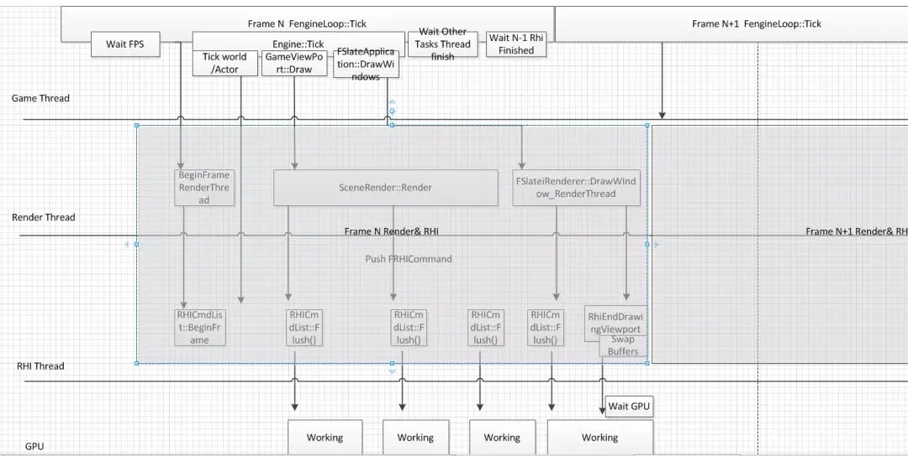

UE的渲染流程中，最多存在4种工作线程：游戏线程（Game Thread）、渲染线程（Render Thread）、RHI线程和GPU（含驱动）。

游戏线程是整个引擎的驱动者，提供所有的源数据和事件，以驱动渲染线程和RHI线程。游戏线程领先渲染线程不超过1帧，更具体地说如果第N帧的渲染线程在第N+1帧的游戏线程的Tick结束时还没有完成，那么游戏线程会被渲染线程卡住。反之，如果游戏线程负载过重，没能及时发送事件和数据给渲染线程，也会导致渲染线程卡住。

渲染线程负责产生RHI的中间命令，在适当的时机派发、刷新指令到RHI线程。因此，渲染线程的卡顿也可能导致RHI的卡顿。

RHI线程负责派发（可选）、转译、提交指令，且渲染的最后一步需要SwapBuffer，这一步需要等待GPU完成渲染工作。因此，渲染GPU的繁忙也会导致RHI线程的卡顿。

除了游戏线程，渲染线程、RHI线程和GPU的工作都是存在间隙的，即游戏线程提供给渲染任务的时机会影响渲染工作的密度，也会影响到渲染的时间，小量多次会浪费渲染效率。

## **10.4.7 RHI控制台变量**

前面章节的代码也显示RHI体系涉及的控制台变量非常多，下面列出部分控制台变量，以便调试、优化RHI渲染效果或效率：

| 名称                                       | 描述                                                         |
| ------------------------------------------ | ------------------------------------------------------------ |
| r.RHI.Name                                 | 显示当前RHI的名字，如D3D11。                                 |
| r.RHICmdAsyncRHIThreadDispatch             | 实验选项，是否执行RHI调度异步。可使数据更快地刷新到RHI线程，避免帧末尾出现卡顿。 |
| r.RHICmdBalanceParallelLists               | 允许启用DrawList的预处理，以尝试在命令列表之间均衡负载。0：关闭，1：开启，2：实验选项，使用上一帧的结果（在分屏等不做任何事情）。 |
| r.RHICmdBalanceTranslatesAfterTasks        | 实验选项，平衡并行翻译后的渲染任务完成。可最小化延迟上下文的数量，但会增加启动转译的延迟。 |
| r.RHICmdBufferWriteLocks                   | 仅与RHI线程相关。用于诊断缓冲锁问题的调试选项。              |
| r.RHICmdBypass                             | 是否绕过RHI命令列表，立即发送RHI命令。0：禁用（需开启多线程渲染），1：开启。 |
| r.RHICmdCollectRHIThreadStatsFromHighLevel | 这将在执行的RHI线程上推送统计信息，这样就可以确定它们来自哪个高层级的Pass。对帧速率有不利影响。默认开启。 |
| r.RHICmdFlushOnQueueParallelSubmit         | 在提交后立即等待并行命令列表的完成。问题诊断。只适用于部分RHI。 |
| r.RHICmdFlushRenderThreadTasks             | 如果为真，则每次调用时都刷新渲染线程任务。问题诊断。这是一个更细粒度cvars的主开关。 |
| r.RHICmdForceRHIFlush                      | 对每个任务强制刷新发送给RHI线程。问题诊断。                  |
| r.RHICmdMergeSmallDeferredContexts         | 合并小的并行转译任务，基于r.RHICmdMinDrawsPerParallelCmdList。 |
| r.RHICmdUseDeferredContexts                | 使用延迟上下文并行执行命令列表。只适用于部分RHI。            |
| r.RHICmdUseParallelAlgorithms              | True使用并行算法。如果r.RHICmdBypass为1则忽略。              |
| r.RHICmdUseThread                          | 使用RHI线程。问题诊断。                                      |
| r.RHICmdWidth                              | 控制并行渲染器中大量事物的任务粒度。                         |
| r.RHIThread.Enable                         | 启用/禁用RHI线程，并确定RHI工作是否在专用线程上运行。        |
| RHI.GPUHitchThreshold                      | GPU上检测卡顿的阈值(毫秒)。                                  |
| RHI.MaximumFrameLatency                    | 可以排队进行渲染的帧数。                                     |
| RHI.SyncThreshold                          | 在垂直同步功能启用前的连续“快速”帧数。                       |
| RHI.TargetRefreshRate                      | 如果非零，则显示的更新频率永远不会超过目标刷新率(以Hz为单位)。 |

需要注意的是，以上只列出部分RHI相关的变量，还有很多未列出，具体可以在下列菜单中查看全面命令：

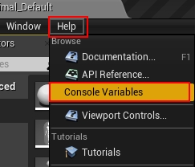

 

# **10.5 本篇总结**

本篇主要阐述了UE的RHI体系的基础概念、类型、机制，希望童鞋们学习完本篇之后，对UE的RHI不再陌生，能够轻松自如地掌握、应用、扩展它。

## **10.5.1 本篇思考**

按惯例，本篇也布置一些小思考，以助理解和加深UE RHI体系的掌握和理解：

- RHI资源有哪些类型？和渲染层的资源有什么关系和区别？渲染系统如何删除RHI资源？
- RHI的命令有哪些主要类型？命令列表的执行机制和流程是怎样的？
- 简述RHI的上下文和DynamicRHI之间的关联。简述D3D11的实现架构。
- UE的多线程之间的关联如何？什么因素会导致它们的卡顿？

 

# **特别说明**

- 感谢所有参考文献的作者，部分图片来自参考文献和网络，侵删。
- 本系列文章为笔者原创，只发表在博客园上，欢迎分享本文链接，但**未经同意，不允许转载**！
- 系列文章，未完待续，完整目录请戳[内容纲目](https://www.cnblogs.com/timlly/p/13512787.html#内容纲目)。
- 系列文章，未完待续，完整目录请戳[内容纲目](https://www.cnblogs.com/timlly/p/13512787.html#内容纲目)。
- 系列文章，未完待续，完整目录请戳[内容纲目](https://www.cnblogs.com/timlly/p/13512787.html#内容纲目)。

 

# **参考文献**

- [Unreal Engine Source](https://github.com/EpicGames/UnrealEngine)
- [Rendering and Graphics](https://docs.unrealengine.com/en-US/Engine/Rendering/index.html)
- [Materials](https://docs.unrealengine.com/en-US/Engine/Rendering/Materials/index.html)
- [Graphics Programming](https://docs.unrealengine.com/en-US/Programming/Rendering/index.html)
- [Graphics Programming Overview](https://docs.unrealengine.com/4.26/en-US/ProgrammingAndScripting/Rendering/Overview/)
- [UE4渲染模块分析](https://www.jianshu.com/p/4d1be6c2b4ef)
- [UE4 Render System Sheet](https://blog.csdn.net/leonwei/article/details/84821849)
- [【UE4 Renderer】<03> PipelineBase](https://zhuanlan.zhihu.com/p/39464715)
- [Scalability for All: Unreal Engine 4 with Intel](https://www.slideshare.net/IntelSoftware/scalability-for-all-unreal-engine-4-with-intel)
- [自下而上反思Shader的执行机制（兼Vulkan学习总结）](https://zhuanlan.zhihu.com/p/111577281)
- [Learning DirectX 12 – Lesson 1 – Initialize DirectX 12](https://www.3dgep.com/learning-directx-12-1/)
- [Learning DirectX 12 – Lesson 2 – Rendering](https://www.3dgep.com/learning-directx-12-2/)
- [Learning DirectX 12 – Lesson 3 – Framework](https://www.3dgep.com/learning-directx-12-3/)
- [Learning DirectX 12 – Lesson 4 – Textures](https://www.3dgep.com/learning-directx-12-4/)
- [UE高级性能剖析技术之RHI](https://mp.weixin.qq.com/s/oBISXGsHplTNeqAcRzHtEA)
- [进击的 Vulkan 移动开发之 Command Buffer](https://www.jianshu.com/p/9ee2adb26969)
- [BRINGING UNREAL ENGINE 4 TO OPENGL Nick Penwarden Epic Games](https://docplayer.net/14152117-Bringing-unreal-engine-4-to-opengl-nick-penwarden-epic-games-mathias-schott-evan-hart-nvidia.html)
- [Subpass 初步](https://gavinkg.github.io/ILearnVulkanFromScratch-CN/mdroot/Vulkan 进阶/Subpass/Subpass 初步.html)
- [Best Practice for Mobile](https://community.arm.com/cfs-file/__key/communityserver-blogs-components-weblogfiles/00-00-00-20-66/2_2D00_mmg_2D00_siggraph2016_2D00_best_2D00_practice_2D00_andrew.pdf)