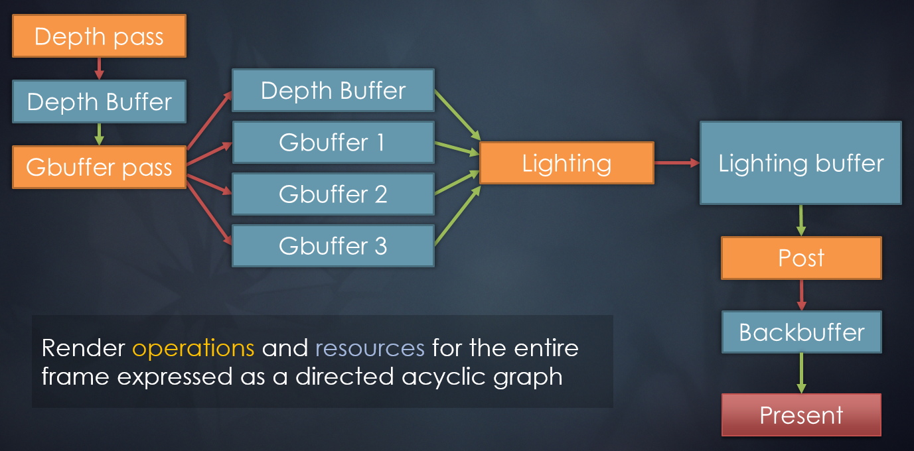
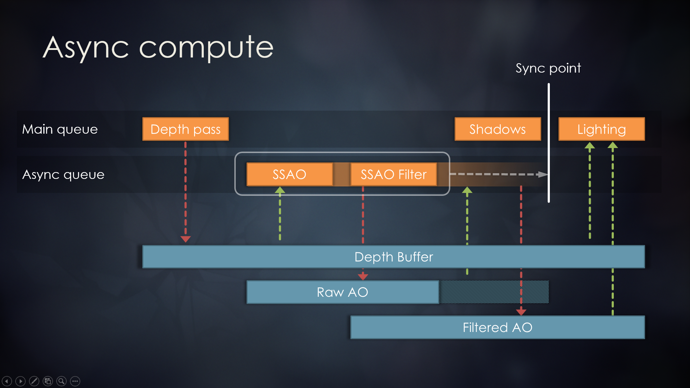

# [剖析虚幻渲染体系（11）- RDG](https://www.cnblogs.com/timlly/p/15217090.html)


目录

- [11.1 本篇概述](https://www.cnblogs.com/timlly/p/15217090.html#111-本篇概述)
- 11.2 RDG基础
  - [11.2.1 RDG基础类型](https://www.cnblogs.com/timlly/p/15217090.html#1121-rdg基础类型)
  - [11.2.2 RDG资源](https://www.cnblogs.com/timlly/p/15217090.html#1122-rdg资源)
  - [11.2.3 RDG Pass](https://www.cnblogs.com/timlly/p/15217090.html#1123-rdg-pass)
  - [11.2.4 FRDGBuilder](https://www.cnblogs.com/timlly/p/15217090.html#1124-frdgbuilder)
- 11.3 RDG机制
  - [11.3.1 RDG机制概述](https://www.cnblogs.com/timlly/p/15217090.html#1131-rdg机制概述)
  - [11.3.2 FRDGBuilder::AddPass](https://www.cnblogs.com/timlly/p/15217090.html#1132-frdgbuilderaddpass)
  - [11.3.3 FRDGBuilder::Compile](https://www.cnblogs.com/timlly/p/15217090.html#1133-frdgbuildercompile)
  - [11.3.4 FRDGBuilder::Execute](https://www.cnblogs.com/timlly/p/15217090.html#1134-frdgbuilderexecute)
  - [11.3.5 RDG机制总结](https://www.cnblogs.com/timlly/p/15217090.html#1135-rdg机制总结)
- 11.4 RDG开发
  - [11.4.1 创建RDG资源](https://www.cnblogs.com/timlly/p/15217090.html#1141-创建rdg资源)
  - [11.4.2 注册外部资源](https://www.cnblogs.com/timlly/p/15217090.html#1142-注册外部资源)
  - [11.4.3 提取资源](https://www.cnblogs.com/timlly/p/15217090.html#1143-提取资源)
  - [11.4.4 增加Pass](https://www.cnblogs.com/timlly/p/15217090.html#1144-增加pass)
  - [11.4.5 创建FRDGBuilder](https://www.cnblogs.com/timlly/p/15217090.html#1145-创建frdgbuilder)
  - [11.4.6 RDG调试](https://www.cnblogs.com/timlly/p/15217090.html#1146-rdg调试)
- 11.5 本篇总结
  - [11.5.1 本篇思考](https://www.cnblogs.com/timlly/p/15217090.html#1151-本篇思考)
- [特别说明](https://www.cnblogs.com/timlly/p/15217090.html#特别说明)
- [参考文献](https://www.cnblogs.com/timlly/p/15217090.html#参考文献)


 

 

# **11.1 本篇概述**

**RDG**全称是**Rendering Dependency Graph**，意为**渲染依赖性图表**，是UE4.22开始引进的全新的渲染子系统，基于有向无环图(Directed Acyclic Graph，DAG)的调度系统，用于执行渲染管线的整帧优化。

它利用现代的图形API（DirectX 12、Vulkan和Metal 2），实现自动异步计算调度以及更高效的内存管理和屏障管理来提升性能。

传统的图形API（DirectX 11、OpenGL）要求驱动器调用复杂的启发法，以确定何时以及如何在GPU上执行关键的调度操作。例如清空缓存，管理和再使用内存，执行布局转换等等。由于接口存在即时模式特性，因此需要复杂的记录和状态跟踪才能处理各种极端情况。这些情况最终会对性能产生负面影响，并阻碍并行。

现代的图形API（DirectX 12、Vulkan和Metal 2）与传统图形API不同，将低级GPU管理的负担转移到应用程序。这使得应用程序可以利用渲染管线的高级情境来驱动调度，从而提高性能并且简化渲染堆栈。

RDG的理念不在GPU上立即执行Pass，而是先收集所有需要渲染的Pass，然后按照依赖的顺序对图表进行编译和执行，期间会执行各类裁剪和优化。

依赖性图表数据结构的整帧认知与现代图形API的能力相结合，使RDG能够在后台执行复杂的调度任务：

- 执行异步计算通道的自动调度和隔离。
- 在帧的不相交间隔期间，使资源之间的别名内存保持活跃状态。
- 尽早启动屏障和布局转换，避免管线延迟。

此外，RDG利用依赖性图表在通道设置期间提供丰富的验证，对影响功能和性能的问题进行自动捕捉，从而改进开发流程。

RDG并非UE独创的概念和技术，早在2017年的GDC中，寒霜就已经实现并应用了Frame Graph（帧图）的技术。Frame Graph旨在将引擎的各类渲染功能（Feature）和上层渲染逻辑（Renderer）和下层资源（Shader、RenderContext、图形API等）隔离开来，以便做进一步的解耦、优化，其中最重要的就是多线程和并行渲染。


FrameGraph是高层级的Render Pass和资源的代表，包含了一帧中所用到的所有信息。Pass之间可以指定顺序和依赖关系，下图是其中的一个示例：



*寒霜引擎采用帧图方式实现的延迟渲染的顺序和依赖图。*

可以毫不夸张地说，UE的RDG正是基于Frame Graph之上定制和实现而成的。到了UE4.26，RDG已经被大量普及，包含场景渲染、后处理、光追等等模块都使用了RDG代替原本直接调用RHI命令的方式。

本篇主要阐述UE RDG的以下内容：

- RDG的基本概念和类型。
- RDG的使用方法。
- RDG的内部机制和原理。

 

# **11.2 RDG基础**

本章先阐述RDG涉及的主要类型、概念、接口等。

## **11.2.1 RDG基础类型**

RDG基础类型和接口主要集中于RenderGraphUtils.h和RenderGraphDefinitions.h之中。部分解析如下：

```c++
// Engine\Source\Runtime\RenderCore\Public\RenderGraphDefinitions.h

// RDG Pass类型.
enum class ERDGPassFlags : uint8
{
    None = 0,                 // 用于无参数的AddPass函数.
    Raster = 1 << 0,        // Pass在图形管道上使用光栅化.
    Compute = 1 << 1,        // Pass在图形管道上使用compute.
    AsyncCompute = 1 << 2,    // Pass在异步计算管道上使用compute
    Copy = 1 << 3,            // Pass在图形管道上使用复制命令.
    NeverCull = 1 << 4,     // 不被裁剪优化, 用于特殊pass.
    SkipRenderPass = 1 << 5,        // 忽略BeginRenderPass/EndRenderPass, 留给用户去调用. 只在Raster绑定时有效. 将禁用Pass合并.
    UntrackedAccess = 1 << 6,        // Pass访问原始的RHI资源，这些资源可能被注册到RDG中，但所有资源都保持在当前状态. 此标志阻止图形调度跨越通道的分割障碍。任何拆分都被延迟到pass执行之后。资源可能不会在pass执行过程中改变状态。影响性能的屏障。不能与AsyncCompute组合。
    Readback = Copy | NeverCull,    // Pass使用复制命令，但写入暂存资源(staging resource).

    CommandMask = Raster | Compute | AsyncCompute | Copy, // 标志掩码，表示提交给pass的RHI命令的类型.
    ScopeMask = NeverCull | UntrackedAccess // 可由传递标志作用域使用的标志掩码
};

// Buffer标记.
enum class ERDGBufferFlags : uint8
{
    None = 0, // 无标记.
    MultiFrame = 1 << 0 // 存续于多帧.
};

// 纹理标记.
enum class ERDGTextureFlags : uint8
{
    None = 0,
    MultiFrame = 1 << 0, // 存续于多帧.
    MaintainCompression = 1 << 1, // 防止在此纹理上解压元数据.
};

// UAV标记.
enum class ERDGUnorderedAccessViewFlags : uint8
{
    None = 0,
    SkipBarrier = 1 << 0 // 忽略屏障.
};

// 父资源类型.
enum class ERDGParentResourceType : uint8
{
    Texture,
    Buffer,
    MAX
};

// 视图类型.
enum class ERDGViewType : uint8
{
    TextureUAV, // 纹理UAV(用于写入数据)
    TextureSRV, // 纹理SRV(用于读取数据)
    BufferUAV,  // 缓冲UAV(用于写入数据)
    BufferSRV,  // 缓冲SRV(用于读取数据)
    MAX
};

// 用于在创建视图时指定纹理元数据平面
enum class ERDGTextureMetaDataAccess : uint8
{
    None = 0,             // 主平面默认压缩使用.
    CompressedSurface,     // 主平面不压缩使用.
    Depth,      // 深度平面默认压缩使用.
    Stencil, // 模板平面默认压缩使用.
    HTile,      // HTile平面.
    FMask,   // FMask平面.
    CMask    // CMask平面.
};

// 简单的C++对象分配器, 用MemStack分配器追踪和销毁物体.
class FRDGAllocator final
{
public:
    FRDGAllocator();
    ~FRDGAllocator();

    // 分配原始内存.
    FORCEINLINE void* Alloc(uint32 SizeInBytes, uint32 AlignInBytes)
    {
        return MemStack.Alloc(SizeInBytes, AlignInBytes);
    }
    // 分配POD内存而不跟踪析构函数.
    template <typename PODType>
    FORCEINLINE PODType* AllocPOD()
    {
        return reinterpret_cast<PODType*>(Alloc(sizeof(PODType), alignof(PODType)));
    }
    // 带析构追踪的C++对象分配.
    template <typename ObjectType, typename... TArgs>
    FORCEINLINE ObjectType* AllocObject(TArgs&&... Args)
    {
        TTrackedAlloc<ObjectType>* TrackedAlloc = new(MemStack) TTrackedAlloc<ObjectType>(Forward<TArgs&&>(Args)...);
        check(TrackedAlloc);
        TrackedAllocs.Add(TrackedAlloc);
        return TrackedAlloc->Get();
    }
    // 不带析构追踪的C++对象分配. (危险, 慎用)
    template <typename ObjectType, typename... TArgs>
    FORCEINLINE ObjectType* AllocNoDestruct(TArgs&&... Args)
    {
        return new (MemStack) ObjectType(Forward<TArgs&&>(Args)...);
    }

    // 释放全部已分配的内存.
    void ReleaseAll();

private:
    class FTrackedAlloc
    {
    public:
        virtual ~FTrackedAlloc() = default;
    };

    template <typename ObjectType>
    class TTrackedAlloc : public FTrackedAlloc
    {
    public:
        template <typename... TArgs>
        FORCEINLINE TTrackedAlloc(TArgs&&... Args) : Object(Forward<TArgs&&>(Args)...) {}

        FORCEINLINE ObjectType* Get() { return &Object; }

    private:
        ObjectType Object;
    };

    // 分配器.
    FMemStackBase MemStack;
    // 所有已分配的对象.
    TArray<FTrackedAlloc*, SceneRenderingAllocator> TrackedAllocs;
};

// Engine\Source\Runtime\RenderCore\Public\RenderGraphUtils.h

// 清理未使用的资源.
extern RENDERCORE_API void ClearUnusedGraphResourcesImpl(const FShaderParameterBindings& ShaderBindings, ...);
(......)

// 注册外部纹理, 可附带备用实例.
FRDGTextureRef RegisterExternalTextureWithFallback(FRDGBuilder& GraphBuilder, ...);
inline FRDGTextureRef TryRegisterExternalTexture(FRDGBuilder& GraphBuilder, ...);
inline FRDGBufferRef TryRegisterExternalBuffer(FRDGBuilder& GraphBuilder, ...);

// 计算着色器的工具类.
struct RENDERCORE_API FComputeShaderUtils
{
    // 理想的组大小为8x8，在GCN上至少占据一个wave，在Nvidia上占据两个warp.
    static constexpr int32 kGolden2DGroupSize = 8;
    static FIntVector GetGroupCount(const int32 ThreadCount, const int32 GroupSize);

    // 派发计算着色器到RHI命令列表, 携带其参数.
    template<typename TShaderClass>
    static void Dispatch(FRHIComputeCommandList& RHICmdList, const TShaderRef<TShaderClass>& ComputeShader, const typename TShaderClass::FParameters& Parameters, FIntVector GroupCount);
    // 派发非直接的计算着色器到RHI命令列表, 携带其参数.
    template<typename TShaderClass>
    static void DispatchIndirect(FRHIComputeCommandList& RHICmdList, const TShaderRef<TShaderClass>& ComputeShader, const typename TShaderClass::FParameters& Parameters, FRHIVertexBuffer* IndirectArgsBuffer, uint32 IndirectArgOffset);
    // 派发计算着色器到render graph builder, 携带其参数.
    template<typename TShaderClass>
    static void AddPass(FRDGBuilder& GraphBuilder,FRDGEventName&& PassName,ERDGPassFlags PassFlags,const TShaderRef<TShaderClass>& ComputeShader,typename TShaderClass::FParameters* Parameters,FIntVector GroupCount);

    (......)

    // 清理UAV.
    static void ClearUAV(FRDGBuilder& GraphBuilder, FGlobalShaderMap* ShaderMap, FRDGBufferUAVRef UAV, uint32 ClearValue);
    static void ClearUAV(FRDGBuilder& GraphBuilder, FGlobalShaderMap* ShaderMap, FRDGBufferUAVRef UAV, FVector4 ClearValue);
};

// 增加拷贝纹理Pass.
void AddCopyTexturePass(FRDGBuilder& GraphBuilder, FRDGTextureRef InputTexture, FRDGTextureRef OutputTexture, const FRHICopyTextureInfo& CopyInfo);
(......)

// 增加拷贝到解析目标的Pass.
void AddCopyToResolveTargetPass(FRDGBuilder& GraphBuilder, FRDGTextureRef InputTexture, FRDGTextureRef OutputTexture, const FResolveParams& ResolveParams);

// 清理各类资源的Pass.
void AddClearUAVPass(FRDGBuilder& GraphBuilder, FRDGBufferUAVRef BufferUAV, uint32 Value);
void AddClearUAVFloatPass(FRDGBuilder& GraphBuilder, FRDGBufferUAVRef BufferUAV, float Value);
void AddClearUAVPass(FRDGBuilder& GraphBuilder, FRDGTextureUAVRef TextureUAV, const FUintVector4& ClearValues);
void AddClearRenderTargetPass(FRDGBuilder& GraphBuilder, FRDGTextureRef Texture);
void AddClearDepthStencilPass(FRDGBuilder& GraphBuilder,FRDGTextureRef Texture,bool bClearDepth,float Depth,bool bClearStencil,uint8 Stencil);
void AddClearStencilPass(FRDGBuilder& GraphBuilder, FRDGTextureRef Texture);
(......)

// 增加回读纹理的Pass.
void AddEnqueueCopyPass(FRDGBuilder& GraphBuilder, FRHIGPUTextureReadback* Readback, FRDGTextureRef SourceTexture, FResolveRect Rect = FResolveRect());
// 增加回读缓冲区的Pass.
void AddEnqueueCopyPass(FRDGBuilder& GraphBuilder, FRHIGPUBufferReadback* Readback, FRDGBufferRef SourceBuffer, uint32 NumBytes);

// 创建资源.
FRDGBufferRef CreateStructuredBuffer(FRDGBuilder& GraphBuilder, ...);
FRDGBufferRef CreateVertexBuffer(FRDGBuilder& GraphBuilder, ...);

// 无参数的Pass增加.
template <typename ExecuteLambdaType>
void AddPass(FRDGBuilder& GraphBuilder, FRDGEventName&& Name, ExecuteLambdaType&& ExecuteLambda);
template <typename ExecuteLambdaType>
void AddPass(FRDGBuilder& GraphBuilder, ExecuteLambdaType&& ExecuteLambda);

// 其它特殊Pass
void AddBeginUAVOverlapPass(FRDGBuilder& GraphBuilder);
void AddEndUAVOverlapPass(FRDGBuilder& GraphBuilder);

(......)
```

## **11.2.2 RDG资源**

RDG资源并不是直接用RHI资源，而是包裹了RHI资源引用，然后针对不同类型的资源各自封装，且增加了额外的信息。部分RDG的定义如下：

```c++
// Engine\Source\Runtime\RenderCore\Public\RenderGraphResources.h

class FRDGResource
{
public:
    // 删除拷贝构造函数.
    FRDGResource(const FRDGResource&) = delete;
    virtual ~FRDGResource() = default;

    //////////////////////////////////////////////////////////////////////////
    // 下面的接口只能被RDG的Pass执行期间调用.

    // 标记此资源是否被使用, 若非, 则会被清理掉.
#if RDG_ENABLE_DEBUG
    virtual void MarkResourceAsUsed();
#else
    inline  void MarkResourceAsUsed() {}
#endif
    // 获取RDG的RHI资源引用.
    FRHIResource* GetRHI() const
    {
        ValidateRHIAccess();
        return ResourceRHI;
    }

    //////////////////////////////////////////////////////////////////////////

protected:
    FRDGResource(const TCHAR* InName);

    // 将此资源分配为RHI资源的简单直通容器.
    void SetPassthroughRHI(FRHIResource* InResourceRHI)
    {
        ResourceRHI = InResourceRHI;
#if RDG_ENABLE_DEBUG
        DebugData.bAllowRHIAccess = true;
        DebugData.bPassthrough = true;
#endif
    }

    bool IsPassthrough() const
    {
#if RDG_ENABLE_DEBUG
        return DebugData.bPassthrough;
#else
        return false;
#endif
    }

    /** Verify that the RHI resource can be accessed at a pass execution. */
    void ValidateRHIAccess() const
    {
#if RDG_ENABLE_DEBUG
        checkf(DebugData.bAllowRHIAccess,
            TEXT("Accessing the RHI resource of %s at this time is not allowed. If you hit this check in pass, ")
            TEXT("that is due to this resource not being referenced in the parameters of your pass."),
            Name);
#endif
    }

    FRHIResource* GetRHIUnchecked() const
    {
        return ResourceRHI;
    }

    // RHI资源引用.
    FRHIResource* ResourceRHI = nullptr;

private:
    // 调试信息.
#if RDG_ENABLE_DEBUG
    class FDebugData
    {
    private:
        // 在运行时跟踪资源是否被pass的lambda实际使用，以检测对pass不必要的资源依赖.
        bool bIsActuallyUsedByPass = false;
        // 追踪Pass执行期间, 底层的RHI自已是否允许被访问.
        bool bAllowRHIAccess = false;
        // 如果为true，则该资源不附加到任何构建器，而是作为一个虚拟容器存在，用于将代码暂存到RDG.
        bool bPassthrough = false;
    } DebugData;
#endif
};

class FRDGUniformBuffer : public FRDGResource
{
public:
    // 获取RHI.
    FRHIUniformBuffer* GetRHI() const
    {
        return static_cast<FRHIUniformBuffer*>(FRDGResource::GetRHI());
    }
        
    (......)

protected:
    template <typename TParameterStruct>
    explicit FRDGUniformBuffer(TParameterStruct* InParameters, const TCHAR* InName)
        : FRDGResource(InName)
        , ParameterStruct(InParameters)
        , bGlobal(ParameterStruct.HasStaticSlot());

private:
    // 参数结构体.
    const FRDGParameterStruct ParameterStruct;
    // RHI资源.
    TRefCountPtr<FRHIUniformBuffer> UniformBufferRHI;
    // RDG句柄.
    FRDGUniformBufferHandle Handle;
    // 全局绑定或局部绑定.
    uint8 bGlobal : 1;
};

// RDGUniformBuffer模板类.
template <typename ParameterStructType>
class TRDGUniformBuffer : public FRDGUniformBuffer
{
public:
    const TRDGParameterStruct<ParameterStructType>& GetParameters() const;
    TUniformBufferRef<ParameterStructType> GetRHIRef() const;
    const ParameterStructType* operator->() const;

    (......)
};

// 一种由图跟踪分配生命周期的渲染图资源。可能有引用它的子资源(例如视图)
class FRDGParentResource : public FRDGResource
{
public:
    // 父资源类型.
    const ERDGParentResourceType Type;
    bool IsExternal() const;

protected:
    FRDGParentResource(const TCHAR* InName, ERDGParentResourceType InType);

    // 是否外部资源.
    uint8 bExternal : 1;
    // 是否被提取的资源.
    uint8 bExtracted : 1;
    // 此资源是否需要acquire / discard.
    uint8 bTransient : 1;
    // 是否最后的拥有者分配的.
    uint8 bLastOwner : 1;
    // 将被裁剪.
    uint8 bCulled : 1;
    // 是否被异步计算Pass使用.
    uint8 bUsedByAsyncComputePass : 1;

private:
    // 引用数量.
    uint16 ReferenceCount = 0;
    // 用户分配的资源的初始和最终状态(如果已知)
    ERHIAccess AccessInitial = ERHIAccess::Unknown;
    ERHIAccess AccessFinal = ERHIAccess::Unknown;

    FRDGPassHandle AcquirePass;
    FRDGPassHandle FirstPass;
    FRDGPassHandle LastPass;

    (......)
};

// 创建渲染纹理的描述信息.
struct RENDERCORE_API FRDGTextureDesc
{
    static FRDGTextureDesc Create2D(...);
    static FRDGTextureDesc Create2DArray(...);
    static FRDGTextureDesc Create3D(...);
    static FRDGTextureDesc CreateCube(...);
    static FRDGTextureDesc CreateCubeArray(...);
    
    bool IsTexture2D() const;
    bool IsTexture3D() const;
    bool IsTextureCube() const;
    bool IsTextureArray() const;
    bool IsMipChain() const;
    bool IsMultisample() const;
    FIntVector GetSize() const;
    
    // 子资源的布局.
    FRDGTextureSubresourceLayout GetSubresourceLayout() const;
    bool IsValid() const;

    // 清理值.
    FClearValueBinding ClearValue;
    ETextureDimension Dimension = ETextureDimension::Texture2D;
    // 清理标记.
    ETextureCreateFlags Flags = TexCreate_None;
    // 像素格式.
    EPixelFormat Format = PF_Unknown;
    // 纹理在x和y中的范围
    FIntPoint Extent = FIntPoint(1, 1);
    // 3D纹理的深度.
    uint16 Depth = 1;
    uint16 ArraySize = 1;
    // 纹理层级数.
    uint8 NumMips = 1;
    // 采样数.
    uint8 NumSamples = 1;
};

// 将池内的RT描述转成RDG纹理描述.
inline FRDGTextureDesc Translate(const FPooledRenderTargetDesc& InDesc, ERenderTargetTexture InTexture = ERenderTargetTexture::Targetable);
// 将RDG纹理描述转成池内的RT描述.
inline FPooledRenderTargetDesc Translate(const FRDGTextureDesc& InDesc);

// 池内的纹理.
class RENDERCORE_API FRDGPooledTexture
{
public:
    // 描述.
    const FRDGTextureDesc Desc;

    // 引用计数.
    uint32 GetRefCount() const;
    uint32 AddRef() const;
    uint32 Release() const;

private:
    FRDGPooledTexture(FRHITexture* InTexture, const FRDGTextureDesc& InDesc, const FUnorderedAccessViewRHIRef& FirstMipUAV);

    // 初始化缓存的UAV.
    void InitViews(const FUnorderedAccessViewRHIRef& FirstMipUAV);
    void Finalize();
    void Reset();

    // 对应的RHI纹理.
    FRHITexture* Texture = nullptr;
    // 所在的纹理对象.
    FRDGTexture* Owner = nullptr;
    // 子资源布局.
    FRDGTextureSubresourceLayout Layout;
    // 子资源状态.
    FRDGTextureSubresourceState State;

    // 为RHI纹理缓存的UAV/SRV.
    TArray<FUnorderedAccessViewRHIRef, TInlineAllocator<1>> MipUAVs;
    TArray<TPair<FRHITextureSRVCreateInfo, FShaderResourceViewRHIRef>, TInlineAllocator<1>> SRVs;
    FUnorderedAccessViewRHIRef HTileUAV;
    FShaderResourceViewRHIRef  HTileSRV;
    FUnorderedAccessViewRHIRef StencilUAV;
    FShaderResourceViewRHIRef  FMaskSRV;
    FShaderResourceViewRHIRef  CMaskSRV;

    mutable uint32 RefCount = 0;
};

// RDG纹理.
class RENDERCORE_API FRDGTexture final : public FRDGParentResource
{
public:
    // 为还未传到RDG的Pass创建一个适用于用RDG参数填充RHI统一缓冲区的直通纹理.
    static FRDGTextureRef GetPassthrough(const TRefCountPtr<IPooledRenderTarget>& PooledRenderTarget);

    // 描述和标记.
    const FRDGTextureDesc Desc;
    const ERDGTextureFlags Flags;

    //////////////////////////////////////////////////////////////////////////
    //! The following methods may only be called during pass execution.

    IPooledRenderTarget* GetPooledRenderTarget() const
    FRHITexture* GetRHI() const

    //////////////////////////////////////////////////////////////////////////

    FRDGTextureSubresourceLayout GetSubresourceLayout() const;
    FRDGTextureSubresourceRange GetSubresourceRange() const;
    FRDGTextureSubresourceRange GetSubresourceRangeSRV() const;

private:
    FRDGTexture(const TCHAR* InName, const FRDGTextureDesc& InDesc, ERDGTextureFlags InFlags, ERenderTargetTexture InRenderTargetTexture);

    void SetRHI(FPooledRenderTarget* PooledRenderTarget, FRDGTextureRef& OutPreviousOwner);
    void Finalize();
    FRHITexture* GetRHIUnchecked() const;
    bool IsLastOwner() const;
    FRDGTextureSubresourceState& GetState();
    const ERenderTargetTexture RenderTargetTexture;

    // 用于促进子资源转换的布局.
    FRDGTextureSubresourceLayout Layout;
    // 在执行期间拥有PooledTexture分配的下一个纹理.
    FRDGTextureHandle NextOwner;
    // 已注册到构建器的句柄.
    FRDGTextureHandle Handle;

    // 池内纹理.
    IPooledRenderTarget* PooledRenderTarget = nullptr;
    FRDGPooledTexture* PooledTexture = nullptr;
    // 从池纹理缓存的状态指针
    FRDGTextureSubresourceState* State = nullptr;
    // 当持有强引用时严格有效, 
    TRefCountPtr<IPooledRenderTarget> Allocation;

    // 在构建图时跟踪合并的子资源状态
    FRDGTextureTransientSubresourceStateIndirect MergeState;
    // 在图的构建过程中，追踪传递每个子资源的生产者.
    TRDGTextureSubresourceArray<FRDGPassHandle> LastProducers;
};

// 池化的缓冲区.
class RENDERCORE_API FRDGPooledBuffer
{
public:
    const FRDGBufferDesc Desc;

    FRHIUnorderedAccessView* GetOrCreateUAV(FRDGBufferUAVDesc UAVDesc);
    FRHIShaderResourceView* GetOrCreateSRV(FRDGBufferSRVDesc SRVDesc);

    FRHIVertexBuffer* GetVertexBufferRHI() const;
    FRHIIndexBuffer* GetIndexBufferRHI() const;
    FRHIStructuredBuffer* GetStructuredBufferRHI() const;

    uint32 GetRefCount() const;
    uint32 AddRef() const;
    uint32 Release() const;
    
    (......)

private:
    FRDGPooledBuffer(const FRDGBufferDesc& InDesc);

    // 顶点/索引/结构体缓冲.
    FVertexBufferRHIRef VertexBuffer;
    FIndexBufferRHIRef IndexBuffer;
    FStructuredBufferRHIRef StructuredBuffer;
    // UAV/SRV.
    TMap<FRDGBufferUAVDesc, FUnorderedAccessViewRHIRef, FDefaultSetAllocator, TUAVFuncs<FRDGBufferUAVDesc, FUnorderedAccessViewRHIRef>> UAVs;
    TMap<FRDGBufferSRVDesc, FShaderResourceViewRHIRef, FDefaultSetAllocator, TSRVFuncs<FRDGBufferSRVDesc, FShaderResourceViewRHIRef>> SRVs;

    void Reset();
    void Finalize();
        
    const TCHAR* Name = nullptr;

    // 拥有者.
    FRDGBufferRef Owner = nullptr;
    FRDGSubresourceState State;

    mutable uint32 RefCount = 0;
    uint32 LastUsedFrame = 0;
};

// 渲染图追踪的缓冲区.
class RENDERCORE_API FRDGBuffer final : public FRDGParentResource
{
public:
    const FRDGBufferDesc Desc;
    const ERDGBufferFlags Flags;

    //////////////////////////////////////////////////////////////////////////
    //! The following methods may only be called during pass execution.

    // 获取RHI资源.
    FRHIVertexBuffer* GetIndirectRHICallBuffer() const
    FRHIVertexBuffer* GetRHIVertexBuffer() const
    FRHIStructuredBuffer* GetRHIStructuredBuffer() const

    //////////////////////////////////////////////////////////////////////////

private:
    FRDGBuffer(const TCHAR* InName, const FRDGBufferDesc& InDesc, ERDGBufferFlags InFlags);

    // 设置RHI资源.
    void SetRHI(FRDGPooledBuffer* InPooledBuffer, FRDGBufferRef& OutPreviousOwner);
    void Finalize();

    FRDGSubresourceState& GetState() const
    // RDG句柄.
    FRDGBufferHandle Handle;
    // 最后处理此资源的人.
    FRDGPassHandle LastProducer;
    // 下一个拥有者.
    FRDGBufferHandle NextOwner;

    // 赋予的池化缓冲区.
    FRDGPooledBuffer* PooledBuffer = nullptr;
    // 子资源状态.
    FRDGSubresourceState* State = nullptr;
    TRefCountPtr<FRDGPooledBuffer> Allocation;
    FRDGSubresourceState* MergeState = nullptr;
};

(......)
```

在RDG系统中，基本上对所有的RHI资源进行了封装和包裹，以便进一步控制、管理RHI资源，精准控制它们的生命周期、引用关系及调试信息等，进一步可以优化、裁剪它们，提升渲染性能。

## **11.2.3 RDG Pass**

RDG Pass模块涉及了屏障、资源转换、RDGPass等概念：

```c++
// Engine\Source\Runtime\RHI\Public\RHI.h

// 用于表示RHI中挂起的资源转换的不透明数据结构.
struct FRHITransition
{
public:
    template <typename T>
    inline T* GetPrivateData()
    {
        uintptr_t Addr = Align(uintptr_t(this + 1), GRHITransitionPrivateData_AlignInBytes);
        return reinterpret_cast<T*>(Addr);
    }

    template <typename T>
    inline const T* GetPrivateData() const
    {
        return const_cast<FRHITransition*>(this)->GetPrivateData<T>();
    }

private:
    FRHITransition(const FRHITransition&) = delete;
    FRHITransition(FRHITransition&&) = delete;
    FRHITransition(ERHIPipeline SrcPipelines, ERHIPipeline DstPipelines);
    ~FRHITransition();

    // 获取总的分配尺寸.
    static uint64 GetTotalAllocationSize()
    // 获取对齐字节数.
    static uint64 GetAlignment();

    // 开始标记.
    inline void MarkBegin(ERHIPipeline Pipeline) const
    {
        int8 Mask = int8(Pipeline);
        int8 PreviousValue = FPlatformAtomics::InterlockedAnd(&State, ~Mask);
        if (PreviousValue == Mask)
        {
            Cleanup();
        }
    }
    // 结束标记.
    inline void MarkEnd(ERHIPipeline Pipeline) const
    {
        int8 Mask = int8(Pipeline) << int32(ERHIPipeline::Num);
        int8 PreviousValue = FPlatformAtomics::InterlockedAnd(&State, ~Mask);
        if (PreviousValue == Mask)
        {
            Cleanup();
        }
    }
    // 清理转换资源, 包含RHI转换和分配的内存.
    inline void Cleanup() const;

    mutable int8 State;

#if DO_CHECK
    mutable ERHIPipeline AllowedSrc;
    mutable ERHIPipeline AllowedDst;
#endif

#if ENABLE_RHI_VALIDATION
    // 栅栏.
    RHIValidation::FFence* Fence = nullptr;
    // 挂起的开始操作.
    RHIValidation::FOperationsList PendingOperationsBegin;
    // 挂起的结束操作.
    RHIValidation::FOperationsList PendingOperationsEnd;
#endif
};

// Engine\Source\Runtime\RenderCore\Public\RenderGraphPass.h

// RDG屏障批
class RENDERCORE_API FRDGBarrierBatch
{
public:
    FRDGBarrierBatch(const FRDGBarrierBatch&) = delete;
    bool IsSubmitted() const
    FString GetName() const;

protected:
    FRDGBarrierBatch(const FRDGPass* InPass, const TCHAR* InName);
    void SetSubmitted();
    ERHIPipeline GetPipeline() const

private:
    bool bSubmitted = false;
    // Graphics或AsyncCompute
    ERHIPipeline Pipeline;

#if RDG_ENABLE_DEBUG
    const FRDGPass* Pass;
    const TCHAR* Name;
#endif
};

// 屏障批开始
class RENDERCORE_API FRDGBarrierBatchBegin final : public FRDGBarrierBatch
{
public:
    FRDGBarrierBatchBegin(const FRDGPass* InPass, const TCHAR* InName, TOptional<ERHIPipeline> InOverridePipelineForEnd = {});
    ~FRDGBarrierBatchBegin();

    // 增加资源转换到批次.
    void AddTransition(FRDGParentResourceRef Resource, const FRHITransitionInfo& Info);

    const FRHITransition* GetTransition() const;
    bool IsTransitionValid() const;
    void SetUseCrossPipelineFence();
    // 提交屏障/资源转换.
    void Submit(FRHIComputeCommandList& RHICmdList);

private:
    TOptional<ERHIPipeline> OverridePipelineToEnd;
    bool bUseCrossPipelineFence = false;

    // 提交后存储的资源转换, 它在结束批处理时被赋回null.
    const FRHITransition* Transition = nullptr;
    // 要执行的异步资源转换数组.
    TArray<FRHITransitionInfo, TInlineAllocator<1, SceneRenderingAllocator>> Transitions;

#if RDG_ENABLE_DEBUG
    // 与Transitions数组匹配的RDG资源数组, 仅供调试.
    TArray<FRDGParentResource*, SceneRenderingAllocator> Resources;
#endif
};

// 屏障批结束
class RENDERCORE_API FRDGBarrierBatchEnd final : public FRDGBarrierBatch
{
public:
    FRDGBarrierBatchEnd(const FRDGPass* InPass, const TCHAR* InName);
    ~FRDGBarrierBatchEnd();

    // 预留内存.
    void ReserveMemory(uint32 ExpectedDependencyCount);
    // 在开始批处理上插入依赖项, 开始批可以插入多个结束批.
    void AddDependency(FRDGBarrierBatchBegin* BeginBatch);
    // 提交资源转换.
    void Submit(FRHIComputeCommandList& RHICmdList);

private:
    // 此结束批完成后可以唤起的开始批转换.
    TArray<FRDGBarrierBatchBegin*, TInlineAllocator<1, SceneRenderingAllocator>> Dependencies;
};

// RGD通道基础类.
class RENDERCORE_API FRDGPass
{
public:
    FRDGPass(FRDGEventName&& InName, FRDGParameterStruct InParameterStruct, ERDGPassFlags InFlags);
    FRDGPass(const FRDGPass&) = delete;
    virtual ~FRDGPass() = default;

    // 通道数据接口.
    const TCHAR* GetName() const;
    FORCEINLINE const FRDGEventName& GetEventName() const;
    FORCEINLINE ERDGPassFlags GetFlags() const;
    FORCEINLINE ERHIPipeline GetPipeline() const;
    // RDG Pass参数.
    FORCEINLINE FRDGParameterStruct GetParameters() const;
    FORCEINLINE FRDGPassHandle GetHandle() const;
    bool IsMergedRenderPassBegin() const;
    bool IsMergedRenderPassEnd() const;
    bool SkipRenderPassBegin() const;
    bool SkipRenderPassEnd() const;
    bool IsAsyncCompute() const;
    bool IsAsyncComputeBegin() const;
    bool IsAsyncComputeEnd() const;
    bool IsGraphicsFork() const;
    bool IsGraphicsJoin() const;
    // 生产者句柄.
    const FRDGPassHandleArray& GetProducers() const;
    // 跨管线生产者.
    FRDGPassHandle GetCrossPipelineProducer() const;
    // 跨管线消费者.
    FRDGPassHandle GetCrossPipelineConsumer() const;
    // 分叉Pass.
    FRDGPassHandle GetGraphicsForkPass() const;
    // 合并Pass.
    FRDGPassHandle GetGraphicsJoinPass() const;
    
#if RDG_CPU_SCOPES
    FRDGCPUScopes GetCPUScopes() const;
#endif
#if RDG_GPU_SCOPES
    FRDGGPUScopes GetGPUScopes() const;
#endif

private:
    // 前序屏障.
    FRDGBarrierBatchBegin& GetPrologueBarriersToBegin(FRDGAllocator& Allocator);
    FRDGBarrierBatchEnd& GetPrologueBarriersToEnd(FRDGAllocator& Allocator);
    // 后序屏障.
    FRDGBarrierBatchBegin& GetEpilogueBarriersToBeginForGraphics(FRDGAllocator& Allocator);
    FRDGBarrierBatchBegin& GetEpilogueBarriersToBeginForAsyncCompute(FRDGAllocator& Allocator);
    FRDGBarrierBatchBegin& GetEpilogueBarriersToBeginFor(FRDGAllocator& Allocator, ERHIPipeline PipelineForEnd);

    //////////////////////////////////////////////////////////////////////////
    //! User Methods to Override

    // 执行实现.
    virtual void ExecuteImpl(FRHIComputeCommandList& RHICmdList) = 0;

    //////////////////////////////////////////////////////////////////////////

    // 执行.
    void Execute(FRHIComputeCommandList& RHICmdList);

    // Pass数据.
    const FRDGEventName Name;
    const FRDGParameterStruct ParameterStruct;
    const ERDGPassFlags Flags;
    const ERHIPipeline Pipeline;
    FRDGPassHandle Handle;

    // Pass标记.
    union
    {
        struct
        {
            uint32 bSkipRenderPassBegin : 1;
            uint32 bSkipRenderPassEnd : 1;
            uint32 bAsyncComputeBegin : 1;
            uint32 bAsyncComputeEnd : 1;
            uint32 bAsyncComputeEndExecute : 1;
            uint32 bGraphicsFork : 1;
            uint32 bGraphicsJoin : 1;
            uint32 bUAVAccess : 1;
            IF_RDG_ENABLE_DEBUG(uint32 bFirstTextureAllocated : 1);
        };
        uint32 PackedBits = 0;
    };

    // 最新的跨管道生产者的句柄.
    FRDGPassHandle CrossPipelineProducer;
    // 最早的跨管线消费者的句柄.
    FRDGPassHandle CrossPipelineConsumer;

    // (仅限AsyncCompute)Graphics pass，该通道是异步计算间隔的fork / join.
    FRDGPassHandle GraphicsForkPass;
    FRDGPassHandle GraphicsJoinPass;

    // 处理此通道的前序/后续屏障的通道.
    FRDGPassHandle PrologueBarrierPass;
    FRDGPassHandle EpilogueBarrierPass;

    // 生产者Pass列表.
    FRDGPassHandleArray Producers;

    // 纹理状态.
    struct FTextureState
    {
        FRDGTextureTransientSubresourceState State;
        FRDGTextureTransientSubresourceStateIndirect MergeState;
        uint16 ReferenceCount = 0;
    };

    // 缓冲区状态.
    struct FBufferState
    {
        FRDGSubresourceState State;
        FRDGSubresourceState* MergeState = nullptr;
        uint16 ReferenceCount = 0;
    };

    // 将纹理/缓冲区映射到Pass中如何使用的信息。  
    TSortedMap<FRDGTexture*, FTextureState, SceneRenderingAllocator> TextureStates;
    TSortedMap<FRDGBuffer*, FBufferState, SceneRenderingAllocator> BufferStates;
    // 在执行此Pass期间，计划开始的Pass参数列表.
    TArray<FRDGPass*, TInlineAllocator<1, SceneRenderingAllocator>> ResourcesToBegin;
    TArray<FRDGPass*, TInlineAllocator<1, SceneRenderingAllocator>> ResourcesToEnd;
    // 在acquire完成*之后*，*在丢弃*之前*获取的纹理列表. 获取适用于所有分配的纹理.
    TArray<FRHITexture*, SceneRenderingAllocator> TexturesToAcquire;
    // 在Pass完成*之后*，获得(acquires)*之后*，丢弃的纹理列表. 丢弃仅适用于标记为瞬态(transient)的纹理，并且纹理的最后一个别名(alia)使用自动丢弃行为(为了支持更干净的切换到用户或返回池).
    TArray<FRHITexture*, SceneRenderingAllocator> TexturesToDiscard;

    FRDGBarrierBatchBegin* PrologueBarriersToBegin = nullptr;
    FRDGBarrierBatchEnd* PrologueBarriersToEnd = nullptr;
    FRDGBarrierBatchBegin* EpilogueBarriersToBeginForGraphics = nullptr;
    FRDGBarrierBatchBegin* EpilogueBarriersToBeginForAsyncCompute = nullptr;

    EAsyncComputeBudget AsyncComputeBudget = EAsyncComputeBudget::EAll_4;
};

// RDG Pass Lambda执行函数.
template <typename ParameterStructType, typename ExecuteLambdaType>
class TRDGLambdaPass : public FRDGPass
{
    (......)

    TRDGLambdaPass(FRDGEventName&& InName, const ParameterStructType* InParameterStruct, ERDGPassFlags InPassFlags, ExecuteLambdaType&& InExecuteLambda);

private:
    // 执行实现.
    void ExecuteImpl(FRHIComputeCommandList& RHICmdList) override
    {
        check(!kSupportsRaster || RHICmdList.IsImmediate());
        // 调用Lambda实例.
        ExecuteLambda(static_cast<TRHICommandList&>(RHICmdList));
    }

    Lambda实例.
    ExecuteLambdaType ExecuteLambda;
};

// 附带空Lambda的Pass.
template <typename ExecuteLambdaType>
class TRDGEmptyLambdaPass : public TRDGLambdaPass<FEmptyShaderParameters, ExecuteLambdaType>
{
public:
    TRDGEmptyLambdaPass(FRDGEventName&& InName, ERDGPassFlags InPassFlags, ExecuteLambdaType&& InExecuteLambda);

private:
    FEmptyShaderParameters EmptyShaderParameters;
};

// 用于前序/后序Pass.
class FRDGSentinelPass final : public FRDGPass
{
public:
    FRDGSentinelPass(FRDGEventName&& Name);

private:
    void ExecuteImpl(FRHIComputeCommandList&) override;
    FEmptyShaderParameters EmptyShaderParameters;
};
```

以上显示RDG的Pass比较复杂，是RDG体系中最核心的类型之一，涉及了消费者、生产者、转换依赖、各类资源状态等等数据和处理。RDG的Pass有以下几种类型：

FRDGPassTRDGLambdaPassFRDGSentinelPass

RDG Pass和渲染Pass并非一一对应关系，有可能多个合并成一个渲染Pass，详见后面章节。RDG Pass最复杂莫过于多线程处理、资源状态转换以及依赖处理，不过本节先不涉及，后续章节再详细探讨。

## **11.2.4 FRDGBuilder**

FRDGBuilder是RDG体系的心脏和发动机，也是个大管家，负责收集渲染Pass和参数，编译Pass、数据，处理资源依赖，裁剪和优化各类数据，还有提供执行接口。它的声明如下：

```c++
class RENDERCORE_API FRDGBuilder
{
public:
    FRDGBuilder(FRHICommandListImmediate& InRHICmdList, FRDGEventName InName = {}, const char* UnaccountedCSVStat = kDefaultUnaccountedCSVStat);
    FRDGBuilder(const FRDGBuilder&) = delete;

    // 查找外部纹理, 若找不到返回null.
    FRDGTextureRef FindExternalTexture(FRHITexture* Texture) const;
    FRDGTextureRef FindExternalTexture(IPooledRenderTarget* ExternalPooledTexture, ERenderTargetTexture Texture) const;

    // 注册外部池内RT到RDG, 以便RDG追踪之. 池内RT可能包含两种RHI纹理: MSAA和非MSAA.
    FRDGTextureRef RegisterExternalTexture(
        const TRefCountPtr<IPooledRenderTarget>& ExternalPooledTexture,
        ERenderTargetTexture Texture = ERenderTargetTexture::ShaderResource,
        ERDGTextureFlags Flags = ERDGTextureFlags::None);
    FRDGTextureRef RegisterExternalTexture(
        const TRefCountPtr<IPooledRenderTarget>& ExternalPooledTexture,
        const TCHAR* NameIfNotRegistered,
        ERenderTargetTexture RenderTargetTexture = ERenderTargetTexture::ShaderResource,
        ERDGTextureFlags Flags = ERDGTextureFlags::None);

    // 注册外部缓冲区到RDG, 以便RDG追踪之.
    FRDGBufferRef RegisterExternalBuffer(const TRefCountPtr<FRDGPooledBuffer>& ExternalPooledBuffer, ERDGBufferFlags Flags = ERDGBufferFlags::None);
    FRDGBufferRef RegisterExternalBuffer(const TRefCountPtr<FRDGPooledBuffer>& ExternalPooledBuffer, ERDGBufferFlags Flags, ERHIAccess AccessFinal);
    FRDGBufferRef RegisterExternalBuffer(
        const TRefCountPtr<FRDGPooledBuffer>& ExternalPooledBuffer,
        const TCHAR* NameIfNotRegistered,
        ERDGBufferFlags Flags = ERDGBufferFlags::None);

    // 资源创建接口.
    FRDGTextureRef CreateTexture(const FRDGTextureDesc& Desc, const TCHAR* Name, ERDGTextureFlags Flags = ERDGTextureFlags::None);
    FRDGBufferRef CreateBuffer(const FRDGBufferDesc& Desc, const TCHAR* Name, ERDGBufferFlags Flags = ERDGBufferFlags::None);
    FRDGTextureSRVRef CreateSRV(const FRDGTextureSRVDesc& Desc);
    FRDGBufferSRVRef CreateSRV(const FRDGBufferSRVDesc& Desc);
    FORCEINLINE FRDGBufferSRVRef CreateSRV(FRDGBufferRef Buffer, EPixelFormat Format);
    FRDGTextureUAVRef CreateUAV(const FRDGTextureUAVDesc& Desc, ERDGUnorderedAccessViewFlags Flags = ERDGUnorderedAccessViewFlags::None);
    FORCEINLINE FRDGTextureUAVRef CreateUAV(FRDGTextureRef Texture, ERDGUnorderedAccessViewFlags Flags = ERDGUnorderedAccessViewFlags::None);
    FRDGBufferUAVRef CreateUAV(const FRDGBufferUAVDesc& Desc, ERDGUnorderedAccessViewFlags Flags = ERDGUnorderedAccessViewFlags::None);
    FORCEINLINE FRDGBufferUAVRef CreateUAV(FRDGBufferRef Buffer, EPixelFormat Format, ERDGUnorderedAccessViewFlags Flags = ERDGUnorderedAccessViewFlags::None);
    template <typename ParameterStructType>
    TRDGUniformBufferRef<ParameterStructType> CreateUniformBuffer(ParameterStructType* ParameterStruct);

    // 分配内存, 内存由RDG管理生命周期.
    void* Alloc(uint32 SizeInBytes, uint32 AlignInBytes);
    template <typename PODType>
    PODType* AllocPOD();
    template <typename ObjectType, typename... TArgs>
    ObjectType* AllocObject(TArgs&&... Args);
    template <typename ParameterStructType>
    ParameterStructType* AllocParameters();
    
    // 增加附带参数和Lambda的Pass.
    template <typename ParameterStructType, typename ExecuteLambdaType>
    FRDGPassRef AddPass(FRDGEventName&& Name, const ParameterStructType* ParameterStruct, ERDGPassFlags Flags, ExecuteLambdaType&& ExecuteLambda);
    // 增加没有参数只有Lambda的Pass.
    template <typename ExecuteLambdaType>
    FRDGPassRef AddPass(FRDGEventName&& Name, ERDGPassFlags Flags, ExecuteLambdaType&& ExecuteLambda);

    // 在Builder执行末期, 提取池内纹理到指定的指针. 对于RDG创建的资源, 这将延长GPU资源的生命周期，直到执行，指针被填充. 如果指定，纹理将转换为AccessFinal状态, 否则将转换为kDefaultAccessFinal状态.
    void QueueTextureExtraction(FRDGTextureRef Texture, TRefCountPtr<IPooledRenderTarget>* OutPooledTexturePtr);
    void QueueTextureExtraction(FRDGTextureRef Texture, TRefCountPtr<IPooledRenderTarget>* OutPooledTexturePtr, ERHIAccess AccessFinal);

    // 在Builder执行末期, 提取缓冲区到指定的指针.
    void QueueBufferExtraction(FRDGBufferRef Buffer, TRefCountPtr<FRDGPooledBuffer>* OutPooledBufferPtr);
    void QueueBufferExtraction(FRDGBufferRef Buffer, TRefCountPtr<FRDGPooledBuffer>* OutPooledBufferPtr, ERHIAccess AccessFinal);

    // 预分配资源. 只对RDG创建的资源, 会强制立即分配底层池内资源, 有效地将其推广到外部资源. 这将增加内存压力，但允许使用GetPooled{Texture, Buffer}查询池中的资源. 主要用于增量地将代码移植到RDG.
    void PreallocateTexture(FRDGTextureRef Texture);
    void PreallocateBuffer(FRDGBufferRef Buffer);

    // 立即获取底层资源, 只允许用于注册或预分配的资源.
    const TRefCountPtr<IPooledRenderTarget>& GetPooledTexture(FRDGTextureRef Texture) const;
    const TRefCountPtr<FRDGPooledBuffer>& GetPooledBuffer(FRDGBufferRef Buffer) const;

    // 设置执行之后的状态.
    void SetTextureAccessFinal(FRDGTextureRef Texture, ERHIAccess Access);
    void SetBufferAccessFinal(FRDGBufferRef Buffer, ERHIAccess Access);

    void RemoveUnusedTextureWarning(FRDGTextureRef Texture);
    void RemoveUnusedBufferWarning(FRDGBufferRef Buffer);

    // 执行队列Pass，管理渲染目标(RHI RenderPasses)的设置，资源转换和队列纹理提取.
    void Execute();

    // 渲染图形资源池的每帧更新.
    static void TickPoolElements();
    // RDG使用的命令列表.
    FRHICommandListImmediate& RHICmdList;

private:
    static const ERHIAccess kDefaultAccessInitial = ERHIAccess::Unknown;
    static const ERHIAccess kDefaultAccessFinal = ERHIAccess::SRVMask;
    static const char* const kDefaultUnaccountedCSVStat;

    // RDG使用的AsyncCompute命令列表.
    FRHIAsyncComputeCommandListImmediate& RHICmdListAsyncCompute;
    FRDGAllocator Allocator;

    const FRDGEventName BuilderName;

    ERDGPassFlags OverridePassFlags(const TCHAR* PassName, ERDGPassFlags Flags, bool bAsyncComputeSupported);
    FORCEINLINE FRDGPassHandle GetProloguePassHandle() const;
    FORCEINLINE FRDGPassHandle GetEpiloguePassHandle() const;

    // RDG对象注册表.
    FRDGPassRegistry Passes;
    FRDGTextureRegistry Textures;
    FRDGBufferRegistry Buffers;
    FRDGViewRegistry Views;
    FRDGUniformBufferRegistry UniformBuffers;

    // 已被裁剪的Pass.
    FRDGPassBitArray PassesToCull;
    // 没有参数的Pass.
    FRDGPassBitArray PassesWithEmptyParameters;

    // 跟踪外部资源到已注册的渲染图对应项，以进行重复数据删除.
    TSortedMap<FRHITexture*, FRDGTexture*, TInlineAllocator<4, SceneRenderingAllocator>> ExternalTextures;
    TSortedMap<const FRDGPooledBuffer*, FRDGBuffer*, TInlineAllocator<4, SceneRenderingAllocator>> ExternalBuffers;

    FRDGPass* ProloguePass = nullptr;
    FRDGPass* EpiloguePass = nullptr;

    // 待提取资源的列表.
    TArray<TPair<FRDGTextureRef, TRefCountPtr<IPooledRenderTarget>*>, TInlineAllocator<4, SceneRenderingAllocator>> ExtractedTextures;
    TArray<TPair<FRDGBufferRef, TRefCountPtr<FRDGPooledBuffer>*>, TInlineAllocator<4, SceneRenderingAllocator>> ExtractedBuffers;
    // 用于中间操作的纹理状态, 保存在这里以避免重新分配.
    FRDGTextureTransientSubresourceStateIndirect ScratchTextureState;
    EAsyncComputeBudget AsyncComputeBudgetScope = EAsyncComputeBudget::EAll_4;

    // 编译.
    void Compile();
    // 清理.
    void Clear();

    // 开始资源转换.
    void BeginResourceRHI(FRDGUniformBuffer* UniformBuffer);
    void BeginResourceRHI(FRDGPassHandle, FRDGTexture* Texture);
    void BeginResourceRHI(FRDGPassHandle, FRDGTextureSRV* SRV);
    void BeginResourceRHI(FRDGPassHandle, FRDGTextureUAV* UAV);
    void BeginResourceRHI(FRDGPassHandle, FRDGBuffer* Buffer);
    void BeginResourceRHI(FRDGPassHandle, FRDGBufferSRV* SRV);
    void BeginResourceRHI(FRDGPassHandle, FRDGBufferUAV* UAV);

    // 结束资源转换.
    void EndResourceRHI(FRDGPassHandle, FRDGTexture* Texture, uint32 ReferenceCount);
    void EndResourceRHI(FRDGPassHandle, FRDGBuffer* Buffer, uint32 ReferenceCount);

    // Pass接口.
    void SetupPassInternal(FRDGPass* Pass, FRDGPassHandle PassHandle, ERHIPipeline PassPipeline);
    void SetupPass(FRDGPass* Pass);
    void SetupEmptyPass(FRDGPass* Pass);
    void ExecutePass(FRDGPass* Pass);

    // Pass前序后序.
    void ExecutePassPrologue(FRHIComputeCommandList& RHICmdListPass, FRDGPass* Pass);
    void ExecutePassEpilogue(FRHIComputeCommandList& RHICmdListPass, FRDGPass* Pass);

    // 收集资源和屏障.
    void CollectPassResources(FRDGPassHandle PassHandle);
    void CollectPassBarriers(FRDGPassHandle PassHandle, FRDGPassHandle& LastUntrackedPassHandle);

    // 增加Pass依赖.
    void AddPassDependency(FRDGPassHandle ProducerHandle, FRDGPassHandle ConsumerHandle);

    // 增加后序转换.
    void AddEpilogueTransition(FRDGTextureRef Texture, FRDGPassHandle LastUntrackedPassHandle);
    void AddEpilogueTransition(FRDGBufferRef Buffer, FRDGPassHandle LastUntrackedPassHandle);

    // 增加普通转换.
    void AddTransition(FRDGPassHandle PassHandle, FRDGTextureRef Texture, const FRDGTextureTransientSubresourceStateIndirect& StateAfter, FRDGPassHandle LastUntrackedPassHandle);
    void AddTransition(FRDGPassHandle PassHandle, FRDGBufferRef Buffer, FRDGSubresourceState StateAfter, FRDGPassHandle LastUntrackedPassHandle);

    void AddTransitionInternal(
        FRDGParentResource* Resource,
        FRDGSubresourceState StateBefore,
        FRDGSubresourceState StateAfter,
        FRDGPassHandle LastUntrackedPassHandle,
        const FRHITransitionInfo& TransitionInfo);

    // 获取渲染Pass信息.
    FRHIRenderPassInfo GetRenderPassInfo(const FRDGPass* Pass) const;
    // 分配子资源.
    FRDGSubresourceState* AllocSubresource(const FRDGSubresourceState& Other);

#if RDG_ENABLE_DEBUG
    void VisualizePassOutputs(const FRDGPass* Pass);
    void ClobberPassOutputs(const FRDGPass* Pass);
#endif
};
```

作为RDG系统的驱动器，FRDGBuilder负责存储数据、处理状态转换、自动管理资源生命周期和屏障、裁剪无效资源，以及收集、编译、执行Pass，提取纹理或缓冲等等功能。它的内部执行机制比较复杂，后续的章节会详尽地剖析之。

 

# **11.3 RDG机制**

本节将主要阐述RDG的工作机制、过程和原理，以及它在渲染方面的优势和特性。

**有的同学如果只想学习如何使用RDG，则可以跳过本章而直接阅读11.4 RDG开发。**

## **11.3.1 RDG机制概述**

渲染依赖图框架（Rendering Dependency Graph Framework），它设置Lambda范围，该范围设计为Pass，利用延迟执行向RHI发出GPU命令。它们是通过FRDGBuilder::AddPass()创建的。当创建一个Pass时，它需要Shader参数。 可以是任何着色器参数，但框架最感兴趣的是渲染图形资源。

保存所有Pass参数的结构应该使用FRDGBuilder::AllocParameters()分配，以确保正确的生命周期，因为Lambda的执行是被延迟的。

用FRDGBuilder::CreateTexture()或FRDGBuilder::CreateBuffer()创建的一个渲染图资源只记录资源描述符。当资源需要时，将按图表进行分配。渲染图将跟踪资源的生命周期，并在剩余的Pass不再引用它时释放和重用内存。

Pass使用的所有渲染图资源必须在FRDGBuilder::AddPass()给出的Pass参数中，因为渲染图需要知道每个Pass正在使用哪些资源。

只保证在执行Pass时分配资源。 因此，访问它们应该只在使用FRDGBuilder::AddPass()创建的Pass的Lambda范围内完成。未列出Pass使用的一些资源可能会导致问题。

重要的是不要在参数中引用比Pass需要的更多的图资源，因为这人为地增加了关于该资源生命周期的图信息。这可能会导致内存使用的增加或防止Pass的重叠地执行。一个例子是ClearUnusedGraphResources()，它可以自动清除Shader中没有使用的资源引用。如果资源在Pass中没有被使用，则会发出警告。

Pass执行的lambda范围可能发生在FRDGBuilder::AddPass()之后的任何时候。出于调试的目的，它可能直接发生在具有Immediate模式的AddPass()中。当在传递执行过程中发生错误时，立即模式允许您使用可能包含错误源原因的Pass设置的调用堆栈。Immediate模式可以通过命令行命令`-rdgimmediate`或控制台变量`r.RDG.ImmediateMode=1`来启用。

由遗留代码生成的池管理资源纹理FPooledRenderTarget可以通过使用FRDGBuilder::RegisterExternalTexture()在渲染图中使用。

有了Pass依赖关系的信息，执行可能会对不同的硬件目标进行优先级排序，例如对内存压力或Pass GPU执行并发进行优先级排序。因此，不能保证Pass的执行顺序。Pass的执行顺序只能保证将在中间资源上执行工作，就像立即模式在GPU上执行工作一样。

渲染图通道不应该修改外部数据结构的状态，因为这可能会根据Pass的执行顺序导致边界情况。应该使用FRDGBuilder::QueueTextureExtraction()提取执行完成后幸存的渲染图资源(例如viewport back buffer、TAA历史记录…)。如果检测到一个Pass对生成任何计划提取的资源或修改外部纹理没有用处，这个Pass甚至可能不会执行警告。

除非是出于强大的技术原因(比如为VR一次性渲染多个视图的立体渲染)，否则不要在同一Pass中将多个工作捆绑在不同的资源上。这将最终在一组工作上创建更多的依赖关系，单个工作可能只需要这些依赖关系的一个子集。调度程序可能会将其中的一部分与其它GPU工作重叠。这也可能保留分配的瞬态资源更长的时间，潜在地增加整帧的最高内存压力峰值。

虽然AddPass()只希望lambda范围有延迟执行，但这并不意味着我们需要编写一个。通过使用一个更简单的工具箱（如FComputeShaderUtils、FPixelShaderUtils）就可以满足大多数情况的需求了。

## **11.3.2 FRDGBuilder::AddPass**

FRDGBuilder::AddPass是向RDG系统增加一个包含Pass参数和Lambda的Pass，其具体的逻辑如下：

```c++
// Engine\Source\Runtime\RenderCore\Public\RenderGraphBuilder.inl

template <typename ParameterStructType, typename ExecuteLambdaType>
FRDGPassRef FRDGBuilder::AddPass(FRDGEventName&& Name, const ParameterStructType* ParameterStruct, ERDGPassFlags Flags, ExecuteLambdaType&& ExecuteLambda)
{
    using LambdaPassType = TRDGLambdaPass<ParameterStructType, ExecuteLambdaType>;

    (......)

    // 分配RDG Pass实例.
    FRDGPass* Pass = Allocator.AllocObject<LambdaPassType>(
        MoveTemp(Name),
        ParameterStruct,
        OverridePassFlags(Name.GetTCHAR(), Flags, LambdaPassType::kSupportsAsyncCompute),
        MoveTemp(ExecuteLambda));

    // 加入Pass列表.
    Passes.Insert(Pass);
    // 设置Pass.
    SetupPass(Pass);
    
    return Pass;
}
```

AddPass的逻辑比较简单，将传入的数据构造一个FRDGPass实例，然后加入列表并设置Pass数据。下面是SetupPass的具体逻辑：

```c++
void FRDGBuilder::SetupPass(FRDGPass* Pass)
{
    // 获取Pass数据.
    const FRDGParameterStruct PassParameters = Pass->GetParameters();
    const FRDGPassHandle PassHandle = Pass->GetHandle();
    const ERDGPassFlags PassFlags = Pass->GetFlags();
    const ERHIPipeline PassPipeline = Pass->GetPipeline();

    bool bPassUAVAccess = false;

    // ----处理纹理状态----
    
    Pass->TextureStates.Reserve(PassParameters.GetTextureParameterCount() + (PassParameters.HasRenderTargets() ? (MaxSimultaneousRenderTargets + 1) : 0));
    // 遍历所有纹理, 对每个纹理执行状态/数据/引用等处理.
    EnumerateTextureAccess(PassParameters, PassFlags, [&](FRDGViewRef TextureView, FRDGTextureRef Texture, ERHIAccess Access, FRDGTextureSubresourceRange Range)
    {
        const FRDGViewHandle NoUAVBarrierHandle = GetHandleIfNoUAVBarrier(TextureView);
        const EResourceTransitionFlags TransitionFlags = GetTextureViewTransitionFlags(TextureView, Texture);

        auto& PassState = Pass->TextureStates.FindOrAdd(Texture);
        PassState.ReferenceCount++;

        const bool bWholeTextureRange = Range.IsWholeResource(Texture->GetSubresourceLayout());
        bool bWholePassState = IsWholeResource(PassState.State);

        // Convert the pass state to subresource dimensionality if we've found a subresource range.
        if (!bWholeTextureRange && bWholePassState)
        {
            InitAsSubresources(PassState.State, Texture->Layout);
            bWholePassState = false;
        }

        const auto AddSubresourceAccess = [&](FRDGSubresourceState& State)
        {
            State.Access = MakeValidAccess(State.Access | Access);
            State.Flags |= TransitionFlags;
            State.NoUAVBarrierFilter.AddHandle(NoUAVBarrierHandle);
            State.Pipeline = PassPipeline;
        };

        if (bWholePassState)
        {
            AddSubresourceAccess(GetWholeResource(PassState.State));
        }
        else
        {
            EnumerateSubresourceRange(PassState.State, Texture->Layout, Range, AddSubresourceAccess);
        }

        bPassUAVAccess |= EnumHasAnyFlags(Access, ERHIAccess::UAVMask);
    });

    // ----处理缓冲区状态----
    
    Pass->BufferStates.Reserve(PassParameters.GetBufferParameterCount());
    // 遍历所有缓冲区, 对每个缓冲区执行状态/数据/引用等处理.
    EnumerateBufferAccess(PassParameters, PassFlags, [&](FRDGViewRef BufferView, FRDGBufferRef Buffer, ERHIAccess Access)
    {
        const FRDGViewHandle NoUAVBarrierHandle = GetHandleIfNoUAVBarrier(BufferView);

        auto& PassState = Pass->BufferStates.FindOrAdd(Buffer);
        PassState.ReferenceCount++;
        PassState.State.Access = MakeValidAccess(PassState.State.Access | Access);
        PassState.State.NoUAVBarrierFilter.AddHandle(NoUAVBarrierHandle);
        PassState.State.Pipeline = PassPipeline;

        bPassUAVAccess |= EnumHasAnyFlags(Access, ERHIAccess::UAVMask);
    });

    Pass->bUAVAccess = bPassUAVAccess;

    const bool bEmptyParameters = !Pass->TextureStates.Num() && !Pass->BufferStates.Num();
    PassesWithEmptyParameters.Add(bEmptyParameters);

    // 在Graphics管线, Pass可以开始/结束Pass自己的资源. 异步计算则在编译期间编排.
    if (PassPipeline == ERHIPipeline::Graphics && !bEmptyParameters)
    {
        Pass->ResourcesToBegin.Add(Pass);
        Pass->ResourcesToEnd.Add(Pass);
    }

    // 内部设置Pass.
    SetupPassInternal(Pass, PassHandle, PassPipeline);
}
```

下面继续解析SetupPassInternal：

```c++
void FRDGBuilder::SetupPassInternal(FRDGPass* Pass, FRDGPassHandle PassHandle, ERHIPipeline PassPipeline)
{
    // 设置各种Pass为自身句柄.
    Pass->GraphicsJoinPass = PassHandle;
    Pass->GraphicsForkPass = PassHandle;
    Pass->PrologueBarrierPass = PassHandle;
    Pass->EpilogueBarrierPass = PassHandle;

    (......)

    // 如果是立即模式且非后序Pass, 
    if (GRDGImmediateMode && Pass != EpiloguePass)
    {
        // 简单地将merge状态重定向成pass状态，因为不会编译图.
        
        // 纹理的Merge状态.
        for (auto& TexturePair : Pass->TextureStates)
        {
            auto& PassState = TexturePair.Value;
            const uint32 SubresourceCount = PassState.State.Num();
            PassState.MergeState.SetNum(SubresourceCount);
            for (uint32 Index = 0; Index < SubresourceCount; ++Index)
            {
                if (PassState.State[Index].Access != ERHIAccess::Unknown)
                {
                    PassState.MergeState[Index] = &PassState.State[Index];
                    PassState.MergeState[Index]->SetPass(PassHandle);
                }
            }
        }
        // 缓冲区的Merge状态.
        for (auto& BufferPair : Pass->BufferStates)
        {
            auto& PassState = BufferPair.Value;
            PassState.MergeState = &PassState.State;
            PassState.MergeState->SetPass(PassHandle);
        }

        FRDGPassHandle LastUntrackedPassHandle = GetProloguePassHandle();
        // 收集Pass资源.
        CollectPassResources(PassHandle);
        // 收集Pass屏障.
        CollectPassBarriers(PassHandle, LastUntrackedPassHandle);
        // 直接执行Pass.
        ExecutePass(Pass);
    }
}
```

总结起来，AddPass会根据传入的参数构建一个RDG Pass的实例，然后设置该Pass的纹理和缓冲区数据，接着用内部设置Pass的依赖Pass等句柄，如果是立即模式，会重定向纹理和缓冲区的Merge状态成Pass状态，并且直接执行。

## **11.3.3 FRDGBuilder::Compile**

FRDGBuilder的编译逻辑非常复杂，执行了很多处理和优化，具体如下：

```c++
void FRDGBuilder::Compile()
{
    uint32 RasterPassCount = 0;
    uint32 AsyncComputePassCount = 0;

    // Pass标记位.
    FRDGPassBitArray PassesOnAsyncCompute(false, Passes.Num());
    FRDGPassBitArray PassesOnRaster(false, Passes.Num());
    FRDGPassBitArray PassesWithUntrackedOutputs(false, Passes.Num());
    FRDGPassBitArray PassesToNeverCull(false, Passes.Num());

    const FRDGPassHandle ProloguePassHandle = GetProloguePassHandle();
    const FRDGPassHandle EpiloguePassHandle = GetEpiloguePassHandle();

    const auto IsCrossPipeline = [&](FRDGPassHandle A, FRDGPassHandle B)
    {
        return PassesOnAsyncCompute[A] != PassesOnAsyncCompute[B];
    };

    const auto IsSortedBefore = [&](FRDGPassHandle A, FRDGPassHandle B)
    {
        return A < B;
    };

    const auto IsSortedAfter = [&](FRDGPassHandle A, FRDGPassHandle B)
    {
        return A > B;
    };

    // 在图中构建生产者/消费者依赖关系，并构建打包的元数据位数组，以便在搜索符合特定条件的Pass时获得更好的缓存一致性.
    // 搜索根也被用来进行筛选. 携带了不跟踪的RHI输出(e.g. SHADER_PARAMETER_{BUFFER, TEXTURE}_UAV)的Pass不能被裁剪, 也不能写入外部资源的任何Pass.
    // 资源提取将生命周期延长到尾声(epilogue)Pass，尾声Pass总是图的根。前言和尾声是辅助Pass，因此永远不会被淘汰。
    {
        SCOPED_NAMED_EVENT(FRDGBuilder_Compile_Culling_Dependencies, FColor::Emerald);

        // 增加裁剪依赖.
        const auto AddCullingDependency = [&](FRDGPassHandle& ProducerHandle, FRDGPassHandle PassHandle, ERHIAccess Access)
        {
            if (Access != ERHIAccess::Unknown)
            {
                if (ProducerHandle.IsValid())
                {
                    // 增加Pass依赖.
                    AddPassDependency(ProducerHandle, PassHandle);
                }

                // 如果可写, 则存储新的生产者.
                if (IsWritableAccess(Access))
                {
                    ProducerHandle = PassHandle;
                }
            }
        };

        // 遍历所有Pass, 处理每个Pass的纹理和缓冲区状态等.
        for (FRDGPassHandle PassHandle = Passes.Begin(); PassHandle != Passes.End(); ++PassHandle)
        {
            FRDGPass* Pass = Passes[PassHandle];

            bool bUntrackedOutputs = Pass->GetParameters().HasExternalOutputs();

            // 处理Pass的所有纹理状态.
            for (auto& TexturePair : Pass->TextureStates)
            {
                FRDGTextureRef Texture = TexturePair.Key;
                auto& LastProducers = Texture->LastProducers;
                auto& PassState = TexturePair.Value.State;

                const bool bWholePassState = IsWholeResource(PassState);
                const bool bWholeProducers = IsWholeResource(LastProducers);

                // 生产者数组需要至少和pass状态数组一样大.
                if (bWholeProducers && !bWholePassState)
                {
                    InitAsSubresources(LastProducers, Texture->Layout);
                }

                // 增加裁剪依赖.
                for (uint32 Index = 0, Count = LastProducers.Num(); Index < Count; ++Index)
                {
                    AddCullingDependency(LastProducers[Index], PassHandle, PassState[bWholePassState ? 0 : Index].Access);
                }

                bUntrackedOutputs |= Texture->bExternal;
            }

            // 处理Pass的所有缓冲区状态.
            for (auto& BufferPair : Pass->BufferStates)
            {
                FRDGBufferRef Buffer = BufferPair.Key;
                AddCullingDependency(Buffer->LastProducer, PassHandle, BufferPair.Value.State.Access);
                bUntrackedOutputs |= Buffer->bExternal;
            }

            // 处理Pass的其它标记和数据.
            const ERDGPassFlags PassFlags = Pass->GetFlags();
            const bool bAsyncCompute = EnumHasAnyFlags(PassFlags, ERDGPassFlags::AsyncCompute);
            const bool bRaster = EnumHasAnyFlags(PassFlags, ERDGPassFlags::Raster);
            const bool bNeverCull = EnumHasAnyFlags(PassFlags, ERDGPassFlags::NeverCull);

            PassesOnRaster[PassHandle] = bRaster;
            PassesOnAsyncCompute[PassHandle] = bAsyncCompute;
            PassesToNeverCull[PassHandle] = bNeverCull;
            PassesWithUntrackedOutputs[PassHandle] = bUntrackedOutputs;
            AsyncComputePassCount += bAsyncCompute ? 1 : 0;
            RasterPassCount += bRaster ? 1 : 0;
        }

        // prologue/epilogue设置为不追踪, 它们分别负责外部资源的导入/导出.
        PassesWithUntrackedOutputs[ProloguePassHandle] = true;
        PassesWithUntrackedOutputs[EpiloguePassHandle] = true;

        // 处理提取纹理的裁剪依赖.
        for (const auto& Query : ExtractedTextures)
        {
            FRDGTextureRef Texture = Query.Key;
            for (FRDGPassHandle& ProducerHandle : Texture->LastProducers)
            {
                AddCullingDependency(ProducerHandle, EpiloguePassHandle, Texture->AccessFinal);
            }
            Texture->ReferenceCount++;
        }

        // 处理提取缓冲区的裁剪依赖.
        for (const auto& Query : ExtractedBuffers)
        {
            FRDGBufferRef Buffer = Query.Key;
            AddCullingDependency(Buffer->LastProducer, EpiloguePassHandle, Buffer->AccessFinal);
            Buffer->ReferenceCount++;
        }
    }

    // -------- 处理Pass裁剪 --------
    
    if (GRDGCullPasses)
    {
        TArray<FRDGPassHandle, TInlineAllocator<32, SceneRenderingAllocator>> PassStack;
        // 所有Pass初始化为剔除.
        PassesToCull.Init(true, Passes.Num());

        // 收集Pass的根列表, 符合条件的是那些不追踪的输出或标记为永不剔除的Pass.
        for (FRDGPassHandle PassHandle = Passes.Begin(); PassHandle != Passes.End(); ++PassHandle)
        {
            if (PassesWithUntrackedOutputs[PassHandle] || PassesToNeverCull[PassHandle])
            {
                PassStack.Add(PassHandle);
            }
        }

        // 非递归循环的栈遍历, 采用深度优先搜索方式, 标记每个根可达的Pass节点为不裁剪.
        while (PassStack.Num())
        {
            const FRDGPassHandle PassHandle = PassStack.Pop();

            if (PassesToCull[PassHandle])
            {
                PassesToCull[PassHandle] = false;
                PassStack.Append(Passes[PassHandle]->Producers);

            #if STATS
                --GRDGStatPassCullCount;
            #endif
            }
        }
    }
    else // 不启用Pass裁剪, 所有Pass初始化为不裁剪.
    {
        PassesToCull.Init(false, Passes.Num());
    }
    
    // -------- 处理Pass屏障 --------

    // 遍历经过筛选的图，并为每个子资源编译屏障, 某些过渡是多余的, 例如read-to-read。
    // RDG采用了保守的启发式，选择不合并不一定意味着就要执行转换. 
    // 它们是两个不同的步骤。合并状态跟踪第一次和最后一次的Pass间隔. Pass的引用也会累积到每个资源上. 
    // 必须在剔除后发生，因为剔除后的Pass不能提供引用.

    {
        SCOPED_NAMED_EVENT(FRDGBuilder_Compile_Barriers, FColor::Emerald);

        for (FRDGPassHandle PassHandle = Passes.Begin(); PassHandle != Passes.End(); ++PassHandle)
        {
            // 跳过被裁剪或无参数的Pass.
            if (PassesToCull[PassHandle] || PassesWithEmptyParameters[PassHandle])
            {
                continue;
            }

            // 合并子资源状态.
            const auto MergeSubresourceStates = [&](ERDGParentResourceType ResourceType, FRDGSubresourceState*& PassMergeState, FRDGSubresourceState*& ResourceMergeState, const FRDGSubresourceState& PassState)
            {
                // 跳过未知状态的资源合并.
                if (PassState.Access == ERHIAccess::Unknown)
                {
                    return;
                }

                if (!ResourceMergeState || !FRDGSubresourceState::IsMergeAllowed(ResourceType, *ResourceMergeState, PassState))
                {
                    // 跨管线、不可合并的状态改变需要一个新的pass依赖项来进行防护.
                    if (ResourceMergeState && ResourceMergeState->Pipeline != PassState.Pipeline)
                    {
                        AddPassDependency(ResourceMergeState->LastPass, PassHandle);
                    }

                    // 分配一个新的挂起的合并状态，并将其分配给pass状态.
                    ResourceMergeState = AllocSubresource(PassState);
                    ResourceMergeState->SetPass(PassHandle);
                }
                else
                {
                    // 合并Pass状态进合并后的状态.
                    ResourceMergeState->Access |= PassState.Access;
                    ResourceMergeState->LastPass = PassHandle;
                }

                PassMergeState = ResourceMergeState;
            };

            const bool bAsyncComputePass = PassesOnAsyncCompute[PassHandle];

            // 获取当前处理的Pass实例.
            FRDGPass* Pass = Passes[PassHandle];

            // 处理当前Pass的纹理状态.
            for (auto& TexturePair : Pass->TextureStates)
            {
                FRDGTextureRef Texture = TexturePair.Key;
                auto& PassState = TexturePair.Value;

                // 增加引用数量.
                Texture->ReferenceCount += PassState.ReferenceCount;
                Texture->bUsedByAsyncComputePass |= bAsyncComputePass;

                const bool bWholePassState = IsWholeResource(PassState.State);
                const bool bWholeMergeState = IsWholeResource(Texture->MergeState);

                // 为简单起见，合并/Pass状态维度应该匹配.
                if (bWholeMergeState && !bWholePassState)
                {
                    InitAsSubresources(Texture->MergeState, Texture->Layout);
                }
                else if (!bWholeMergeState && bWholePassState)
                {
                    InitAsWholeResource(Texture->MergeState);
                }

                const uint32 SubresourceCount = PassState.State.Num();
                PassState.MergeState.SetNum(SubresourceCount);

                // 合并子资源状态.
                for (uint32 Index = 0; Index < SubresourceCount; ++Index)
                {
                    MergeSubresourceStates(ERDGParentResourceType::Texture, PassState.MergeState[Index], Texture->MergeState[Index], PassState.State[Index]);
                }
            }

            // 处理当前Pass的缓冲区状态.
            for (auto& BufferPair : Pass->BufferStates)
            {
                FRDGBufferRef Buffer = BufferPair.Key;
                auto& PassState = BufferPair.Value;

                Buffer->ReferenceCount += PassState.ReferenceCount;
                Buffer->bUsedByAsyncComputePass |= bAsyncComputePass;

                MergeSubresourceStates(ERDGParentResourceType::Buffer, PassState.MergeState, Buffer->MergeState, PassState.State);
            }
        }
    }

    // 处理异步计算Pass.
    if (AsyncComputePassCount > 0)
    {
        SCOPED_NAMED_EVENT(FRDGBuilder_Compile_AsyncCompute, FColor::Emerald);

        FRDGPassBitArray PassesWithCrossPipelineProducer(false, Passes.Num());
        FRDGPassBitArray PassesWithCrossPipelineConsumer(false, Passes.Num());

        // 遍历正在执行的活动Pass，以便为每个Pass找到最新的跨管道生产者和最早的跨管道消费者, 以便后续构建异步计算重叠区域时缩小搜索空间.
        for (FRDGPassHandle PassHandle = Passes.Begin(); PassHandle != Passes.End(); ++PassHandle)
        {
            if (PassesToCull[PassHandle] || PassesWithEmptyParameters[PassHandle])
            {
                continue;
            }

            FRDGPass* Pass = Passes[PassHandle];

            // 遍历生产者, 处理生产者和消费者的引用关系.
            for (FRDGPassHandle ProducerHandle : Pass->GetProducers())
            {
                const FRDGPassHandle ConsumerHandle = PassHandle;

                if (!IsCrossPipeline(ProducerHandle, ConsumerHandle))
                {
                    continue;
                }

                FRDGPass* Consumer = Pass;
                FRDGPass* Producer = Passes[ProducerHandle];

                // 为生产者查找另一个管道上最早的消费者.
                if (Producer->CrossPipelineConsumer.IsNull() || IsSortedBefore(ConsumerHandle, Producer->CrossPipelineConsumer))
                {
                    Producer->CrossPipelineConsumer = PassHandle;
                    PassesWithCrossPipelineConsumer[ProducerHandle] = true;
                }

                // 为消费者查找另一个管道上的最新生产者.
                if (Consumer->CrossPipelineProducer.IsNull() || IsSortedAfter(ProducerHandle, Consumer->CrossPipelineProducer))
                {
                    Consumer->CrossPipelineProducer = ProducerHandle;
                    PassesWithCrossPipelineProducer[ConsumerHandle] = true;
                }
            }
        }

        // 为异步计算建立fork / join重叠区域, 用于栅栏及资源分配/回收. 在fork/join完成之前，异步计算Pass不能分配/释放它们的资源引用，因为两个管道是并行运行的。因此，异步计算的所有资源生命周期都被扩展到整个异步区域。

        const auto IsCrossPipelineProducer = [&](FRDGPassHandle A)
        {
            return PassesWithCrossPipelineConsumer[A];
        };

        const auto IsCrossPipelineConsumer = [&](FRDGPassHandle A)
        {
            return PassesWithCrossPipelineProducer[A];
        };

        // 查找跨管道生产者.
        const auto FindCrossPipelineProducer = [&](FRDGPassHandle PassHandle)
        {
            FRDGPassHandle LatestProducerHandle = ProloguePassHandle;
            FRDGPassHandle ConsumerHandle = PassHandle;

            // 期望在其它管道上找到最新的生产者，以便建立一个分叉点. 因为可以用N个生产者通道消耗N个资源，所以只关心最后一个.
            while (ConsumerHandle != Passes.Begin())
            {
                if (!PassesToCull[ConsumerHandle] && !IsCrossPipeline(ConsumerHandle, PassHandle) && IsCrossPipelineConsumer(ConsumerHandle))
                {
                    const FRDGPass* Consumer = Passes[ConsumerHandle];

                    if (IsSortedAfter(Consumer->CrossPipelineProducer, LatestProducerHandle))
                    {
                        LatestProducerHandle = Consumer->CrossPipelineProducer;
                    }
                }
                --ConsumerHandle;
            }

            return LatestProducerHandle;
        };

        // 查找跨管道消费者.
        const auto FindCrossPipelineConsumer = [&](FRDGPassHandle PassHandle)
        {
            check(PassHandle != EpiloguePassHandle);

            FRDGPassHandle EarliestConsumerHandle = EpiloguePassHandle;
            FRDGPassHandle ProducerHandle = PassHandle;

            // 期望找到另一个管道上最早的使用者，因为这在管道之间建立了连接点。因为可以在另一个管道上为N个消费者生产，所以只关心第一个执行的消费者. 
            while (ProducerHandle != Passes.End())
            {
                if (!PassesToCull[ProducerHandle] && !IsCrossPipeline(ProducerHandle, PassHandle) && IsCrossPipelineProducer(ProducerHandle))
                {
                    const FRDGPass* Producer = Passes[ProducerHandle];

                    if (IsSortedBefore(Producer->CrossPipelineConsumer, EarliestConsumerHandle))
                    {
                        EarliestConsumerHandle = Producer->CrossPipelineConsumer;
                    }
                }
                ++ProducerHandle;
            }

            return EarliestConsumerHandle;
        };

        // 将图形Pass插入到异步计算Pass的分叉中.
        const auto InsertGraphicsToAsyncComputeFork = [&](FRDGPass* GraphicsPass, FRDGPass* AsyncComputePass)
        {
            FRDGBarrierBatchBegin& EpilogueBarriersToBeginForAsyncCompute = GraphicsPass->GetEpilogueBarriersToBeginForAsyncCompute(Allocator);

            GraphicsPass->bGraphicsFork = 1;
            EpilogueBarriersToBeginForAsyncCompute.SetUseCrossPipelineFence();

            AsyncComputePass->bAsyncComputeBegin = 1;
            AsyncComputePass->GetPrologueBarriersToEnd(Allocator).AddDependency(&EpilogueBarriersToBeginForAsyncCompute);
        };

        // 将异步计算Pass插入到图形Pass的合并中.
        const auto InsertAsyncToGraphicsComputeJoin = [&](FRDGPass* AsyncComputePass, FRDGPass* GraphicsPass)
        {
            FRDGBarrierBatchBegin& EpilogueBarriersToBeginForGraphics = AsyncComputePass->GetEpilogueBarriersToBeginForGraphics(Allocator);

            AsyncComputePass->bAsyncComputeEnd = 1;
            EpilogueBarriersToBeginForGraphics.SetUseCrossPipelineFence();

            GraphicsPass->bGraphicsJoin = 1;
            GraphicsPass->GetPrologueBarriersToEnd(Allocator).AddDependency(&EpilogueBarriersToBeginForGraphics);
        };

        FRDGPass* PrevGraphicsForkPass = nullptr;
        FRDGPass* PrevGraphicsJoinPass = nullptr;
        FRDGPass* PrevAsyncComputePass = nullptr;

        // 遍历所有Pass, 扩展资源的生命周期, 处理图形Pass和异步计算Pass的交叉和合并节点.
        for (FRDGPassHandle PassHandle = Passes.Begin(); PassHandle != Passes.End(); ++PassHandle)
        {
            if (!PassesOnAsyncCompute[PassHandle] || PassesToCull[PassHandle])
            {
                continue;
            }

            FRDGPass* AsyncComputePass = Passes[PassHandle];

            // 找到分叉Pass和合并Pass.
            const FRDGPassHandle GraphicsForkPassHandle = FindCrossPipelineProducer(PassHandle);
            const FRDGPassHandle GraphicsJoinPassHandle = FindCrossPipelineConsumer(PassHandle);

            AsyncComputePass->GraphicsForkPass = GraphicsForkPassHandle;
            AsyncComputePass->GraphicsJoinPass = GraphicsJoinPassHandle;

            FRDGPass* GraphicsForkPass = Passes[GraphicsForkPassHandle];
            FRDGPass* GraphicsJoinPass = Passes[GraphicsJoinPassHandle];

            // 将异步计算中使用的资源的生命周期延长到fork/join图形Pass。
            GraphicsForkPass->ResourcesToBegin.Add(AsyncComputePass);
            GraphicsJoinPass->ResourcesToEnd.Add(AsyncComputePass);

            // 将图形分叉Pass插入到异步计算分叉Pass.
            if (PrevGraphicsForkPass != GraphicsForkPass)
            {
                InsertGraphicsToAsyncComputeFork(GraphicsForkPass, AsyncComputePass);
            }

            // 将异步计算合并Pass插入到图形合并Pass.
            if (PrevGraphicsJoinPass != GraphicsJoinPass && PrevAsyncComputePass)
            {
                InsertAsyncToGraphicsComputeJoin(PrevAsyncComputePass, PrevGraphicsJoinPass);
            }

            PrevAsyncComputePass = AsyncComputePass;
            PrevGraphicsForkPass = GraphicsForkPass;
            PrevGraphicsJoinPass = GraphicsJoinPass;
        }

        // 图中的最后一个异步计算Pass需要手动连接回epilogue pass.
        if (PrevAsyncComputePass)
        {
            InsertAsyncToGraphicsComputeJoin(PrevAsyncComputePass, EpiloguePass);
            PrevAsyncComputePass->bAsyncComputeEndExecute = 1;
        }
    }

    // 遍历所有图形管道Pass, 并且合并所有具有相同RT的光栅化Pass到同一个RHI渲染Pass中.
    if (GRDGMergeRenderPasses && RasterPassCount > 0)
    {
        SCOPED_NAMED_EVENT(FRDGBuilder_Compile_RenderPassMerge, FColor::Emerald);

        TArray<FRDGPassHandle, SceneRenderingAllocator> PassesToMerge;
        FRDGPass* PrevPass = nullptr;
        const FRenderTargetBindingSlots* PrevRenderTargets = nullptr;

        const auto CommitMerge = [&]
        {
            if (PassesToMerge.Num())
            {
                const FRDGPassHandle FirstPassHandle = PassesToMerge[0];
                const FRDGPassHandle LastPassHandle = PassesToMerge.Last();
                
                // 给定一个Pass的间隔合并成一个单一的渲染Pass: [B, X, X, X, X, E], 开始Pass(B)和结束Pass(E)会分别调用BeginRenderPass/EndRenderPass.
                // 另外，begin将处理整个合并间隔的所有序言屏障，end将处理所有尾声屏障, 这可以避免渲染通道内的资源转换，并更有效地批量处理资源转换.
                // 假设已经在遍历期间完成了过滤来自合并集的Pass之间的依赖关系. 
                
                // (B)是合并序列里的首个Pass.
                {
                    FRDGPass* Pass = Passes[FirstPassHandle];
                    Pass->bSkipRenderPassEnd = 1;
                    Pass->EpilogueBarrierPass = LastPassHandle;
                }

                // (X)是中间Pass.
                for (int32 PassIndex = 1, PassCount = PassesToMerge.Num() - 1; PassIndex < PassCount; ++PassIndex)
                {
                    const FRDGPassHandle PassHandle = PassesToMerge[PassIndex];
                    FRDGPass* Pass = Passes[PassHandle];
                    Pass->bSkipRenderPassBegin = 1;
                    Pass->bSkipRenderPassEnd = 1;
                    Pass->PrologueBarrierPass = FirstPassHandle;
                    Pass->EpilogueBarrierPass = LastPassHandle;
                }

                // (E)是合并序列里的最后Pass.
                {
                    FRDGPass* Pass = Passes[LastPassHandle];
                    Pass->bSkipRenderPassBegin = 1;
                    Pass->PrologueBarrierPass = FirstPassHandle;
                }

            #if STATS
                GRDGStatRenderPassMergeCount += PassesToMerge.Num();
            #endif
            }
            PassesToMerge.Reset();
            PrevPass = nullptr;
            PrevRenderTargets = nullptr;
        };

        // 遍历所有光栅Pass, 合并所有相同RT的Pass到同一个渲染Pass中.
        for (FRDGPassHandle PassHandle = Passes.Begin(); PassHandle != Passes.End(); ++PassHandle)
        {
            // 跳过已被裁剪的Pass.
            if (PassesToCull[PassHandle])
            {
                continue;
            }

            // 是光栅Pass才处理.
            if (PassesOnRaster[PassHandle])
            {
                FRDGPass* NextPass = Passes[PassHandle];

                // 用户控制渲染Pass的Pass不能与其他Pass合并，光栅UAV的Pass由于潜在的相互依赖也不能合并.
                if (EnumHasAnyFlags(NextPass->GetFlags(), ERDGPassFlags::SkipRenderPass) || NextPass->bUAVAccess)
                {
                    CommitMerge();
                    continue;
                }

                // 图形分叉Pass不能和之前的光栅Pass合并.
                if (NextPass->bGraphicsFork)
                {
                    CommitMerge();
                }

                const FRenderTargetBindingSlots& RenderTargets = NextPass->GetParameters().GetRenderTargets();

                if (PrevPass)
                {
                    // 对比RT, 以判定是否可以合并.
                    if (PrevRenderTargets->CanMergeBefore(RenderTargets)
                    #if WITH_MGPU
                        && PrevPass->GPUMask == NextPass->GPUMask
                    #endif
                        )
                    {
                        // 如果可以, 添加Pass到PassesToMerge列表.
                        if (!PassesToMerge.Num())
                        {
                            PassesToMerge.Add(PrevPass->GetHandle());
                        }
                        PassesToMerge.Add(PassHandle);
                    }
                    else
                    {
                        CommitMerge();
                    }
                }

                PrevPass = NextPass;
                PrevRenderTargets = &RenderTargets;
            }
            else if (!PassesOnAsyncCompute[PassHandle])
            {
                // 图形管道上的非光栅Pass将使RT合并无效.
                CommitMerge();
            }
        }

        CommitMerge();
    }
}
```

以上代码显示RDG编译期间的逻辑非常复杂，步骤繁多，先后经历构建生产者和消费者的依赖关系，确定Pass的裁剪等各类标记，调整资源的生命周期，裁剪Pass，处理Pass的资源转换和屏障，处理异步计算Pass的依赖和引用关系，查找并建立分叉和合并Pass节点，合并所有具体相同渲染目标的光栅化Pass等步骤。

以上代码还涉及了一些重要接口，下面一一分析之：

```c++
// 增加Pass依赖, 将生产者(ProducerHandle)加入到消费者(ConsumerHandle)的生产者列表(Producers)中.
void FRDGBuilder::AddPassDependency(FRDGPassHandle ProducerHandle, FRDGPassHandle ConsumerHandle)
{
    FRDGPass* Consumer = Passes[ConsumerHandle];

    auto& Producers = Consumer->Producers;
    if (Producers.Find(ProducerHandle) == INDEX_NONE)
    {
        Producers.Add(ProducerHandle);
    }
};

// 初始化为子资源.
template <typename ElementType, typename AllocatorType>
inline void InitAsSubresources(TRDGTextureSubresourceArray<ElementType, AllocatorType>& SubresourceArray, const FRDGTextureSubresourceLayout& Layout, const ElementType& Element = {})
{
    const uint32 SubresourceCount = Layout.GetSubresourceCount();
    SubresourceArray.SetNum(SubresourceCount, false);
    for (uint32 SubresourceIndex = 0; SubresourceIndex < SubresourceCount; ++SubresourceIndex)
    {
        SubresourceArray[SubresourceIndex] = Element;
    }
}

// 初始化为整资源.
template <typename ElementType, typename AllocatorType>
FORCEINLINE void InitAsWholeResource(TRDGTextureSubresourceArray<ElementType, AllocatorType>& SubresourceArray, const ElementType& Element = {})
{
    SubresourceArray.SetNum(1, false);
    SubresourceArray[0] = Element;
}

// 分配子资源.
FRDGSubresourceState* FRDGBuilder::AllocSubresource(const FRDGSubresourceState& Other)
{
    FRDGSubresourceState* State = Allocator.AllocPOD<FRDGSubresourceState>();
    *State = Other;
    return State;
}
```

## **11.3.4 FRDGBuilder::Execute**

经过前述的收集Pass（AddPass）、编译渲染图之后，便可以执行渲染图了，由FRDGBuilder::Execute承担：

```c++
void FRDGBuilder::Execute()
{
    SCOPED_NAMED_EVENT(FRDGBuilder_Execute, FColor::Emerald);

    // 在编译之前，在图的末尾创建epilogue pass.
    EpiloguePass = Passes.Allocate<FRDGSentinelPass>(Allocator, RDG_EVENT_NAME("Graph Epilogue"));
    SetupEmptyPass(EpiloguePass);

    const FRDGPassHandle ProloguePassHandle = GetProloguePassHandle();
    const FRDGPassHandle EpiloguePassHandle = GetEpiloguePassHandle();
    FRDGPassHandle LastUntrackedPassHandle = ProloguePassHandle;

    // 非立即模式.
    if (!GRDGImmediateMode)
    {
        // 执行之前先编译, 具体见11.3.3章节.
        Compile();

        {
            SCOPE_CYCLE_COUNTER(STAT_RDG_CollectResourcesTime);

            // 收集Pass资源.
            for (FRDGPassHandle PassHandle = Passes.Begin(); PassHandle != Passes.End(); ++PassHandle)
            {
                if (!PassesToCull[PassHandle])
                {
                    CollectPassResources(PassHandle);
                }
            }

            // 结束纹理提取.
            for (const auto& Query : ExtractedTextures)
            {
                EndResourceRHI(EpiloguePassHandle, Query.Key, 1);
            }

            // 结束缓冲区提取.
            for (const auto& Query : ExtractedBuffers)
            {
                EndResourceRHI(EpiloguePassHandle, Query.Key, 1);
            }
        }

        // 收集Pass的屏障.
        {
            SCOPE_CYCLE_COUNTER(STAT_RDG_CollectBarriersTime);

            for (FRDGPassHandle PassHandle = Passes.Begin(); PassHandle != Passes.End(); ++PassHandle)
            {
                if (!PassesToCull[PassHandle])
                {
                    CollectPassBarriers(PassHandle, LastUntrackedPassHandle);
                }
            }
        }
    }

    // 遍历所有纹理, 每个纹理增加尾声转换.
    for (FRDGTextureHandle TextureHandle = Textures.Begin(); TextureHandle != Textures.End(); ++TextureHandle)
    {
        FRDGTextureRef Texture = Textures[TextureHandle];

        if (Texture->GetRHIUnchecked())
        {
            AddEpilogueTransition(Texture, LastUntrackedPassHandle);
            Texture->Finalize();
        }
    }

    // 遍历所有缓冲区, 每个缓冲区增加尾声转换.
    for (FRDGBufferHandle BufferHandle = Buffers.Begin(); BufferHandle != Buffers.End(); ++BufferHandle)
    {
        FRDGBufferRef Buffer = Buffers[BufferHandle];

        if (Buffer->GetRHIUnchecked())
        {
            AddEpilogueTransition(Buffer, LastUntrackedPassHandle);
            Buffer->Finalize();
        }
    }

    // 执行Pass.
    if (!GRDGImmediateMode)
    {
        QUICK_SCOPE_CYCLE_COUNTER(STAT_FRDGBuilder_Execute_Passes);

        for (FRDGPassHandle PassHandle = Passes.Begin(); PassHandle != Passes.End(); ++PassHandle)
        {
            // 执行非裁剪的Pass.
            if (!PassesToCull[PassHandle])
            {
                ExecutePass(Passes[PassHandle]);
            }
        }
    }
    else
    {
        ExecutePass(EpiloguePass);
    }

    RHICmdList.SetGlobalUniformBuffers({});

#if WITH_MGPU
    (......)
#endif

    // 执行纹理提取.
    for (const auto& Query : ExtractedTextures)
    {
        *Query.Value = Query.Key->PooledRenderTarget;
    }

    // 执行缓冲区提取.
    for (const auto& Query : ExtractedBuffers)
    {
        *Query.Value = Query.Key->PooledBuffer;
    }

    // 清理.
    Clear();
}
```

在执行过程中涉及到了执行Pass的接口ExecutePass，其逻辑如下：

```c++
void FRDGBuilder::ExecutePass(FRDGPass* Pass)
{
    QUICK_SCOPE_CYCLE_COUNTER(STAT_FRDGBuilder_ExecutePass);
    SCOPED_GPU_MASK(RHICmdList, Pass->GPUMask);
    IF_RDG_CPU_SCOPES(CPUScopeStacks.BeginExecutePass(Pass));

    // 使用GPU范围.
#if RDG_GPU_SCOPES
    const bool bUsePassEventScope = Pass != EpiloguePass && Pass != ProloguePass;
    if (bUsePassEventScope)
    {
        GPUScopeStacks.BeginExecutePass(Pass);
    }
#endif

#if WITH_MGPU
    if (!bWaitedForTemporalEffect && NameForTemporalEffect != NAME_None)
    {
        RHICmdList.WaitForTemporalEffect(NameForTemporalEffect);
        bWaitedForTemporalEffect = true;
    }
#endif

    // 执行pass的顺序: 1.prologue -> 2.pass主体 -> 3.epilogue.
    // 整个过程使用指定管道上的命令列表执行.
    FRHIComputeCommandList& RHICmdListPass = (Pass->GetPipeline() == ERHIPipeline::AsyncCompute)
        ? static_cast<FRHIComputeCommandList&>(RHICmdListAsyncCompute)
        : RHICmdList;

    // 1.执行prologue
    ExecutePassPrologue(RHICmdListPass, Pass);

    // 2.执行pass主体
    Pass->Execute(RHICmdListPass);

    // 3.执行epilogue
    ExecutePassEpilogue(RHICmdListPass, Pass);

#if RDG_GPU_SCOPES
    if (bUsePassEventScope)
    {
        GPUScopeStacks.EndExecutePass(Pass);
    }
#endif

    // 异步计算完成, 则立即派发.
    if (Pass->bAsyncComputeEnd)
    {
        FRHIAsyncComputeCommandListImmediate::ImmediateDispatch(RHICmdListAsyncCompute);
    }

    // 如果是调试模式且非异步计算，则提交命令并刷新到GPU, 然后等待GPU处理完成.
    if (GRDGDebugFlushGPU && !GRDGAsyncCompute)
    {
        RHICmdList.SubmitCommandsAndFlushGPU();
        RHICmdList.BlockUntilGPUIdle();
    }
}
```

执行Pass主要有3个步骤：1. prologue、2. pass主体、3. epilogue，它们的执行逻辑如下：

```c++
// 1. prologue
void FRDGBuilder::ExecutePassPrologue(FRHIComputeCommandList& RHICmdListPass, FRDGPass* Pass)
{
    // 提交前序开始屏障.
    if (Pass->PrologueBarriersToBegin)
    {
        Pass->PrologueBarriersToBegin->Submit(RHICmdListPass);
    }

    // 提交前序结束屏障.
    if (Pass->PrologueBarriersToEnd)
    {
        Pass->PrologueBarriersToEnd->Submit(RHICmdListPass);
    }

    // 由于访问检查将允许在RDG资源上调用GetRHI，所以在第一次使用时将初始化统一缓冲区.
    Pass->GetParameters().EnumerateUniformBuffers([&](FRDGUniformBufferRef UniformBuffer)
    {
        BeginResourceRHI(UniformBuffer);
    });

    // 设置异步计算预算(Budget).
    if (Pass->GetPipeline() == ERHIPipeline::AsyncCompute)
    {
        RHICmdListPass.SetAsyncComputeBudget(Pass->AsyncComputeBudget);
    }

    const ERDGPassFlags PassFlags = Pass->GetFlags();

    if (EnumHasAnyFlags(PassFlags, ERDGPassFlags::Raster))
    {
        if (!EnumHasAnyFlags(PassFlags, ERDGPassFlags::SkipRenderPass) && !Pass->SkipRenderPassBegin())
        {
            // 调用命令队列的BeginRenderPass接口.
            static_cast<FRHICommandList&>(RHICmdListPass).BeginRenderPass(Pass->GetParameters().GetRenderPassInfo(), Pass->GetName());
        }
    }
}

// 2. pass主体
void FRDGPass::Execute(FRHIComputeCommandList& RHICmdList)
{
    QUICK_SCOPE_CYCLE_COUNTER(STAT_FRDGPass_Execute);
    // 设置统一缓冲区.
    RHICmdList.SetGlobalUniformBuffers(ParameterStruct.GetGlobalUniformBuffers());
    // 执行Pass的实现.
    ExecuteImpl(RHICmdList);
}

void TRDGLambdaPass::ExecuteImpl(FRHIComputeCommandList& RHICmdList) override
{
    // 执行Lambda.
    ExecuteLambda(static_cast<TRHICommandList&>(RHICmdList));
}

// 3. epilogue
void FRDGBuilder::ExecutePassEpilogue(FRHIComputeCommandList& RHICmdListPass, FRDGPass* Pass)
{
    QUICK_SCOPE_CYCLE_COUNTER(STAT_FRDGBuilder_ExecutePassEpilogue);

    const ERDGPassFlags PassFlags = Pass->GetFlags();

    // 调用命令队列的EndRenderPass.
    if (EnumHasAnyFlags(PassFlags, ERDGPassFlags::Raster) && !EnumHasAnyFlags(PassFlags, ERDGPassFlags::SkipRenderPass) && !Pass->SkipRenderPassEnd())
    {
        static_cast<FRHICommandList&>(RHICmdListPass).EndRenderPass();
    }

    // 放弃资源转换.
    for (FRHITexture* Texture : Pass->TexturesToDiscard)
    {
        RHIDiscardTransientResource(Texture);
    }

    // 获取(Acquire)转换资源.
    for (FRHITexture* Texture : Pass->TexturesToAcquire)
    {
        RHIAcquireTransientResource(Texture);
    }

    const FRDGParameterStruct PassParameters = Pass->GetParameters();

    // 提交用于图形管线的尾声屏障.
    if (Pass->EpilogueBarriersToBeginForGraphics)
    {
        Pass->EpilogueBarriersToBeginForGraphics->Submit(RHICmdListPass);
    }

    // 提交用于异步计算的尾声屏障.
    if (Pass->EpilogueBarriersToBeginForAsyncCompute)
    {
        Pass->EpilogueBarriersToBeginForAsyncCompute->Submit(RHICmdListPass);
    }
}
```

由上可知，执行期间，会先编译所有Pass，然后依次执行Pass的前序、主体和后续，相当于将命令队列的BeginRenderPass、执行渲染代码、EndRenderPass分散在它们之间。Pass执行主体实际很简单，就是调用该Pass的Lambda实例，传入使用的命令队列实例。

执行的最后阶段是清理，见下面的分析：

```c++
void FRDGBuilder::Clear()
{
    // 清理外部资源.
    ExternalTextures.Empty();
    ExternalBuffers.Empty();
    // 清理提取资源.
    ExtractedTextures.Empty();
    ExtractedBuffers.Empty();
    // 清理主体数据.
    Passes.Clear();
    Views.Clear();
    Textures.Clear();
    Buffers.Clear();
    // 清理统一缓冲区和分配器.
    UniformBuffers.Clear();
    Allocator.ReleaseAll();
}
```

## **11.3.5 RDG机制总结**

UE的RDG体系默认执行于渲染线程，虽然会合并具有相同RT的RDG Pass，但不意味着它们会被并行地执行，而是被串行地执行。在普通情况下，每个Pass执行的末期不会立即提交并等待GPU完成，但如果是调试模式且非异步计算，则会。

FRDGBuilder并没有全局唯一的实例，通常是将它声明为局部变量，在一定生命周期内完成Pass的收集、编译和执行的整套流程。声明FRDGBuilder实例的模块有：距离场、渲染纹理、场景渲染器、场景捕捉器、光线追踪、后处理、毛发、虚拟纹理等等。

FRDGBuilder的执行周期可划分为4个阶段：收集Pass、编译Pass、执行Pass和清理。

收集Pass阶段，主要是收集渲染模块的所有能够产生RHI渲染指令的Pass（Lambda），收集之后并非立即执行，将被延迟执行。AddPass的步骤是先创建FRDGPass的实例，并加入到Pass列表，随后执行SetupPass。SetupPass的过程主要是处理纹理和缓冲区的状态、引用、依赖和标记等。

编译Pass阶段，则比较复杂，步骤甚多。主要包含构建生产者和消费者的依赖关系，确定Pass的裁剪等各类标记，调整资源的生命周期，裁剪Pass，处理Pass的资源转换和屏障，处理异步计算Pass的依赖和引用关系，查找并建立分叉和合并Pass节点，合并所有具体相同渲染目标的光栅化Pass等步骤。

执行Pass阶段，首先会执行编译，再根据编译结果执行所有符合条件的Pass。执行单个Pass时依次执行前序、主体和后续，相当于执行命令队列的BeginRenderPass、执行Pass主体（Lambda）渲染代码、EndRenderPass。执行Pass主体时过程简洁，就是调用该Pass的Lambda实例。

最后便是清理阶段，将清理或重置FRDGBuilder实例内的所有数据和内存。

在FRDGBuilder执行的整个过程中，和直接使用RHICommandList相比，FRDGBuilder的特性和优化措施如下：

- RDG Pass引用的资源都应该由RDG分配或管理，即便是外部注册的资源，也应该在RDG期间保证生命周期。RDG会自动管理资源的生命周期，延迟它们在交叉、合并Pass期间的生命周期，并在使用完无引用时释放并重用之。

- 资源的分配并非即时响应，而是在初次被使用时才分配或创建。

- 拥有子资源（Subresource）的概念，通过合理的布局将它们整合成大的资源块，可以派发一个子资源到另外一个，也可以自动创建子资源的视图（View）和别名（Aliase），创建由未来渲染Pass创建的资源别名。进而有效地管理资源的分配、释放、重用，减少内存总体占用和内存碎片，减少CPU和GPU的IO，提升内存使用效率。

- 以FRDGBuilder的实例为单位管理RDG Pass，自动排序、引用、分叉和合并Pass，处理Pass的资源引用和依赖，裁剪无用的Pass和资源。RDG也可以正确处理Graphics Pass和Async Compute Pass之间的依赖和引用，将它们有序地按照DAG图串联起来，并正确地处理它们的资源交叉使用和状态转换。

- RDG能够合并RDG Pass的渲染，前提是这些RDG Pass使用了相同的渲染纹理。这样可以减少RHI层的Begin/EndRenderPass的调用，减少RHI渲染命令和资源状态的转换。

- RDG能够自动处理Pass之间的资源依赖、屏障和状态转换，摒弃无效的状态转换（如read-to-read、write-to-write），并且可以合并、批量转换资源的状态，进一步减少渲染指令的数量。

- RDG Pass的执行是在渲染线程中发生，并且是串行，而没有使用TaskGraph并行地执行。

  > 理论上是可以并行执行的，不过这只是猜想，是否可行还需要实践验证。

- RDG拥有丰富的调试模式和信息，支持即时执行模式，协助开发人员快速定位问题，减少Bug查复时间和难度。

当然，FRDGBuilder也存在一些副作用：

- 在渲染体系增加了一层概念和封装，提高渲染层的复杂性，增加学习成本。

- 增加开发复杂度，由于是延时执行，有些bug不能得到即时反馈。

- 某些Pass或资源的生命周期可能被额外延长。

  

*来自Frostbite异步计算示意图。其中SSAO、SSAO Filter的Pass放入到异步队列，它们会写入和读取Raw AO的纹理，即便在同步点之前结束，但Raw AO的生命周期依然会被延长到同步点。*

 

# **11.4 RDG开发**

本章主要阐述如何使用UE的RDG系统。

## **11.4.1 创建RDG资源**

创建RDG资源（纹理、缓冲区、UAV、SRV等）的示例代码如下：

```c++
// ---- 创建RDG纹理示范 ----
// 创建RDG纹理描述
FRDGTextureDesc TextureDesc = Input.Texture->Desc;
TextureDesc.Reset();
TextureDesc.Format = PF_FloatRGBA;
TextureDesc.ClearValue = FClearValueBinding::None;
TextureDesc.Flags &= ~TexCreate_DepthStencilTargetable;
TextureDesc.Flags |= TexCreate_RenderTargetable;
TextureDesc.Extent = OutputViewport.Extent;
// 创建RDG纹理.
FRDGTextureRef MyRDGTexture = GraphBuilder.CreateTexture(TextureDesc, TEXT("MyRDGTexture"));

// ---- 创建RDG纹理UAV示范 ----
FRDGTextureUAVRef MyRDGTextureUAV = GraphBuilder.CreateUAV(MyRDGTexture);

// ---- 创建RDG纹理SRV示范 ----
FRDGTextureSRVRef MyRDGTextureSRV = GraphBuilder.CreateSRV(FRDGTextureSRVDesc::CreateWithPixelFormat(MyRDGTexture, PF_FloatRGBA));
```

创建纹理等资源前需要创建资源的描述符，而创建资源的UAV和SRV时，可以用之前创建的资源作为实例传进去，从而达到复用的目的。创建SRV需要将资源实例作为描述符的参数，创建描述符后再创建SRV。

上述代码以创建纹理的相关资源为例，缓冲区的创建也类似，不再举例。

## **11.4.2 注册外部资源**

上一节的资源由RDG创建和管理，资源的生命周期也由RDG负责。如果我们已有非RDG创建的资源，可以在RDG使用么？答案是可以，通过FRDGBuilder::RegisterExternalXXX接口可以完成将外部资源注册到RDG系统中。下面以注册纹理为例：

```c++
// 在RDG外创建RHI资源.
FRHIResourceCreateInfo CreateInfo;
FTexture2DRHIRef MyRHITexture = RHICreateTexture2D(1024, 768, PF_B8G8R8A8, 1, 1, TexCreate_CPUReadback, CreateInfo);

// 将外部创建的RHI资源注册成RDG资源.
FRDGTextureRef MyExternalRDGTexture = GraphBuilder.RegisterExternalTexture(MyRHITexture);
```

需要注意的是，外部注册的资源，RDG无法控制和管理其生命周期，需要保证RDG使用期间外部资源的生命周期处于正常状态，否则将引发异常甚至程序崩溃。

如果想从RDG资源获取RHI资源的实例，以下代码可达成：

```c++
FRHITexture* MyRHITexture = MyRDGTexture.GetRHI();
```

用图例展示RHI资源和RDG资源之间的转换关系：

FRDGBuilder::RegisterExternalXXXFRDGResource::GetRHIFRHIResourceFRDGResource

上述代码以注册纹理的相关资源为例，缓冲区的注册也类似。

## **11.4.3 提取资源**

上一章RDG机制中已经提到了，RDG收集Pass之后并非立即执行，而是延迟执行（包括资源被延迟创建或分配），这就导致了一个问题：如果想将渲染后的资源赋值给某个变量，无法使用立即模式，需要适配延迟执行模式。这种适配延迟执行的资源提取是通过以下接口来实现的：

- FRDGBuilder::QueueTextureExtraction
- FRDGBuilder::QueueBufferExtraction

使用示例如下：

```c++
// 创建RDG纹理.
FRDGTextureRef MyRDGTexture;

FRDGTextureDesc MyTextureDesc = FRDGTextureDesc::Create2D(OutputExtent, HistoryPixelFormat, FClearValueBinding::Black, TexCreate_ShaderResource | TexCreate_UAV);

MyRDGTexture = GraphBuilder.CreateTexture(MyTextureDesc, "MyRDGTexture", ERDGTextureFlags::MultiFrame);

// 创建UAV并作为Pass的shader参数.
(......)
PassParameters->MyRDGTextureUAV = GraphBuilder.CreateUAV(MyRDGTexture);
(......)

// 增加Pass, 以便渲染图像到MyRDGTextureUAV.
FComputeShaderUtils::AddPass(GraphBuilder, RDG_EVENT_NAME("MyCustomPass", ...), ComputeShader, PassParameters, FComputeShaderUtils::GetGroupCount(8, 8));

// 入队提取资源.
TRefCountPtr<IPooledRenderTarget>* OutputRT;
GraphBuilder.QueueTextureExtraction(MyRDGTexture, &OutputRT);

// 对提取的OutputRT进行后续操作.
(......)
```

不过需要注意的是，由于Pass、资源创建和提取都是被延迟的，意味着提取的资源仅可返回，提供给下一帧使用。

> 小思考：如果要在本帧使用提取后的资源，增加特殊的无参数Pass对提取后的资源进行操作可行吗？为什么？

## **11.4.4 增加Pass**

整个RDG体系执行的单位是RDG Pass，它们的依赖、引用、输入、输出都是通过FRDGBuilder::AddPass完成，以下是其中一个示例：

```c++
// 创建Pass的shader参数.
FMyPS::FParameters* PassParameters = GraphBuilder.AllocParameters<FMyPS::FParameters>();
PassParameters->InputTexture = InputTexture;
PassParameters->RenderTargets = FRenderTargetBinding(InputTexture, InputTextureLoadAction);
PassParameters->InputSampler = BilinearSampler;

// 处理着色器.
TShaderMapRef<FScreenPassVS> VertexShader(View.ShaderMap);
TShaderMapRef<FMyPS> PixelShader(View.ShaderMap);

const FScreenPassPipelineState PipelineState(VertexShader, PixelShader, AdditiveBlendState);

// 增加RDG Pass.
GraphBuilder.AddPass(
    RDG_EVENT_NAME("MyRDGPass"),
    PassParameters,
    ERDGPassFlags::Raster,
    // Pass的Lambda
    [PixelShader, PassParameters, PipelineState] (FRHICommandListImmediate& RHICmdList)
    {
        // 设置视口.
        RHICmdList.SetViewport(0, 0, 0.0f, 1024, 768, 1.0f);

        // 设置PSO.
        SetScreenPassPipelineState(RHICmdList, PipelineState);

        // 设置着色器参数.
        SetShaderParameters(RHICmdList, PixelShader, PixelShader.GetPixelShader(), *PassParameters);

        // 绘制矩形区域.
        DrawRectangle(RHICmdList, 0, 0, 1024, 768, 0, 0, 1.0f, 1.0f, FIntPoint(1024, 768), FIntPoint(1024, 768), PipelineState.VertexShader, EDRF_Default);
    });
```

向RDG系统增加的Pass可以是传统的Graphics Pass，也可以是Compute Shader，还可以是无参数的Pass。RDG Pass和RHI Pass并非一一对应关系，若干个RDG Pass可能合并成一个RHI Pass执行。具体见上一章节**11.3.4 FRDGBuilder::Execute**。

## **11.4.5 创建FRDGBuilder**

创建和使用FRDGBuilder的代码非常简单，如下所示：

```c++
void RenderMyStuff(FRHICommandListImmediate& RHICmdList)
{
    // ----创建FRDGBuilder的局部对象----
    FRDGBuilder GraphBuilder(RHICmdList, RDG_EVENT_NAME("GraphBuilder_RenderMyStuff"));
    
    (......)
    
    // ----增加Pass----
    
    GraphBuilder.AddPass(...);
    
    (......)
    
    GraphBuilder.AddPass(...);
    
    (......)
    
    // ----增加资源提取----
    
    GraphBuilder.QueueTextureExtraction(...);
    
    (......)
    
    // ---- 执行FRDGBuilder ----
    
    GraphBuilder.Execute();
}
```

需要特别指出的是，FRDGBuilder的实例通常都是局部的，在UE体系中存在若干个FRDGBuilder的实例，主要用于比较独立的模块，例如场景渲染器、后处理、光线追踪等等模块。

FRDGBuilder执行实际有三个步骤：收集Pass、编译Pass、执行Pass，不过FRDGBuilder::Execute已经包含了编译和执行Pass，所以我们不再需要显示地调用FRDGBuilder::Compile接口。

## **11.4.6 RDG调试**

RDG系统存在一些控制台命令，其名称和描述如下：

| 控制台变量                        | 描述                                                         |
| --------------------------------- | ------------------------------------------------------------ |
| **r.RDG.AsyncCompute**            | 控制异步计算策略：0-禁用；1-为异步计算Pass启用标记（默认）；2-开启所有使用compute命令列表的计算通道。 |
| **r.RDG.Breakpoint**              | 当满足某些条件时，断点到调试器的断点位置。0-禁用，1~4-不同的特殊调试模式。 |
| **r.RDG.ClobberResources**        | 在分配时间用指定的清理颜色清除所有渲染目标和纹理/缓冲UAV。用于调试。 |
| **r.RDG.CullPasses**              | RDG是否开启裁剪无用的Pass。0-禁用，1-开启（默认）。          |
| **r.RDG.Debug**                   | 允许输出在连接和执行过程中发现的效率低下的警告。             |
| **r.RDG.Debug.FlushGPU**          | 开启每次Pass执行后刷新指令到GPU。当设置(r.RDG.AsyncCompute=0)时禁用异步计算。 |
| **r.RDG.Debug.GraphFilter**       | 将某些调试事件过滤到特定的图中。                             |
| **r.RDG.Debug.PassFilter**        | 将某些调试事件过滤到特定的Pass。                             |
| **r.RDG.Debug.ResourceFilter**    | 将某些调试事件过滤到特定的资源。                             |
| **r.RDG.DumpGraph**               | 将多个可视化日志转储到磁盘。0-禁用，1-显示生产者、消费者Pass依赖，2-显示资源状态和转换，3-显示图形、异步计算的重叠。 |
| **r.RDG.ExtendResourceLifetimes** | RDG将把资源生命周期扩展到图的全部长度。会增加内存的占用。    |
| **r.RDG.ImmediateMode**           | 在创建Pass时执行Pass。当在Pass的Lambda中崩溃时，连接代码的调用堆栈非常有用。 |
| **r.RDG.MergeRenderPasses**       | 图形将合并相同的、连续的渲染通道到一个单一的渲染通道。0-禁用，1-开启（默认）。 |
| **r.RDG.OverlapUAVs**             | RDG将在需要时重叠UAV的工作。如果禁用，UAV屏障总是插入。      |
| **r.RDG.TransitionLog**           | 输出资源转换到控制台。                                       |
| **r.RDG.VerboseCSVStats**         | 控制RDG的CSV分析统计的详细程度。0-为图形执行生成一个CSV配置文件，1-为图形执行的每个阶段生成一个CSV文件。 |

除了以上列出的RDG控制台，还有一些命令可以显示RDG系统运行过程中的有用信息。

`vis`列出所有有效的纹理，输入之后可能显示如下所示的信息：

```
VisualizeTexture/Vis <CheckpointName> [<Mode>] [PIP/UV0/UV1/UV2] [BMP] [FRAC/SAT] [FULL]:
Mode (examples):
  RGB      = RGB in range 0..1 (default)
  *8       = RGB * 8
  A        = alpha channel in range 0..1
  R        = red channel in range 0..1
  G        = green channel in range 0..1
  B        = blue channel in range 0..1
  A*16     = Alpha * 16
  RGB/2    = RGB / 2
SubResource:
  MIP5     = Mip level 5 (0 is default)
  INDEX5   = Array Element 5 (0 is default)
InputMapping:
  PIP      = like UV1 but as picture in picture with normal rendering  (default)
  UV0      = UV in left top
  UV1      = full texture
  UV2      = pixel perfect centered
Flags:
  BMP      = save out bitmap to the screenshots folder (not on console, normalized)
STENCIL    = Stencil normally displayed in alpha channel of depth.  This option is used for BMP to get a stencil only BMP.
  FRAC     = use frac() in shader (default)
  SAT      = use saturate() in shader
  FULLLIST = show full list, otherwise we hide some textures in the printout
  BYNAME   = sort list by name
  BYSIZE   = show list by size
TextureId:
  0        = <off>
LogConsoleResponse:     13 = (2D 1x1 PF_DepthStencil)             DepthDummy 1 KB
LogConsoleResponse:     18 = (2D 976x492 PF_FloatRGBA RT)         SceneColor 3752 KB
LogConsoleResponse:     19 = (2D 128x32 PF_G16R16)                PreintegratedGF 16 KB
LogConsoleResponse:     23 = (2D 64x64 PF_FloatRGBA VRam)         LTCMat 32 KB VRamInKB(Start/Size):<NONE>
LogConsoleResponse:     24 = (2D 64x64 PF_G16R16F VRam)           LTCAmp 16 KB VRamInKB(Start/Size):<NONE>
LogConsoleResponse:     26 = (2D 976x492 PF_FloatRGBA UAV)        SSRTemporalAA 3752 KB
LogConsoleResponse:     27 = (2D 976x492 PF_FloatR11G11B10 RT UAV) SSGITemporalAccumulation0 1876 KB
LogConsoleResponse:     29 = (2D 976x492 PF_R32_UINT RT UAV)      DenoiserMetadata0 1876 KB
LogConsoleResponse:     30 = (2D 976x492 PF_FloatRGBA RT UAV VRam) SceneColorDeferred 3752 KB VRamInKB(Start/Size):<NONE>
LogConsoleResponse:     31 = (2D 976x492 PF_DepthStencil VRam)    SceneDepthZ 2345 KB VRamInKB(Start/Size):<NONE>
LogConsoleResponse:     37 = (3D 64x64x16 PF_FloatRGBA UAV)       HairLUT 512 KB
LogConsoleResponse:     38 = (3D 64x64x16 PF_FloatRGBA UAV)       HairLUT 512 KB
LogConsoleResponse:     39 = (2D 64x64 PF_R32_FLOAT UAV)          HairCoverageLUT 16 KB
LogConsoleResponse:     47 = (2D 98x64 PF_A16B16G16R16)           SSProfiles 49 KB
LogConsoleResponse:     48 = (2D 256x64 PF_FloatRGBA RT)          AtmosphereTransmittance 128 KB
LogConsoleResponse:     49 = (2D 64x16 PF_FloatRGBA RT)           AtmosphereIrradiance 8 KB
LogConsoleResponse:     50 = (2D 64x16 PF_FloatRGBA RT)           AtmosphereDeltaE 8 KB
LogConsoleResponse:     51 = (3D 256x128x2 PF_FloatRGBA RT)       AtmosphereInscatter 512 KB
LogConsoleResponse:     52 = (3D 256x128x2 PF_FloatRGBA RT)       AtmosphereDeltaSR 512 KB
LogConsoleResponse:     53 = (3D 256x128x2 PF_FloatRGBA RT)       AtmosphereDeltaSM 512 KB
LogConsoleResponse:     54 = (3D 256x128x2 PF_FloatRGBA RT)       AtmosphereDeltaJ 512 KB
LogConsoleResponse:     55 = (2D 1x1 PF_A32B32G32R32F RT UAV)     EyeAdaptation 1 KB
LogConsoleResponse:     56 = (3D 32x32x32 PF_A2B10G10R10 RT VRam) CombineLUTs 128 KB VRamInKB(Start/Size):<NONE>
LogConsoleResponse:     68 = (2D 976x492 PF_R8G8 RT UAV)          SSGITemporalAccumulation1 938 KB
LogConsoleResponse:     89 = (2D 976x246 PF_R32_UINT RT UAV)      QuadOverdrawBuffer 938 KB
LogConsoleResponse:     91 = (2D 976x492 PF_FloatRGBA RT UAV)     LightAccumulation 3752 KB
LogConsoleResponse:     92 = (Cube[2] 128 PF_FloatRGBA)           ReflectionEnvs 2048 KB
LogConsoleResponse:     93 = (3D 64x64x64 PF_FloatRGBA RT UAV)    TranslucentVolumeDir2 2048 KB
LogConsoleResponse:     95 = (2D 1x1 PF_A32B32G32R32F RT UAV)     EyeAdaptation 1 KB
LogConsoleResponse:     96 = (3D 64x64x64 PF_FloatRGBA RT UAV)    TranslucentVolume2 2048 KB
LogConsoleResponse:     97 = (3D 64x64x64 PF_FloatRGBA RT UAV)    TranslucentVolumeDir1 2048 KB
LogConsoleResponse:     98 = (3D 64x64x64 PF_FloatRGBA RT UAV)    TranslucentVolume1 2048 KB
LogConsoleResponse:     99 = (3D 64x64x64 PF_FloatRGBA RT UAV)    TranslucentVolumeDir0 2048 KB
LogConsoleResponse:    101 = (3D 64x64x64 PF_FloatRGBA RT UAV)    TranslucentVolume0 2048 KB
LogConsoleResponse:    102 = (2D 976x492 PF_G8 RT UAV)            ScreenSpaceAO 469 KB
LogConsoleResponse:    106 = (2D 488x246 PF_DepthStencil)         SmallDepthZ 1173 KB
LogConsoleResponse:    107 = (2D 1x1 PF_A32B32G32R32F RT UAV)     EyeAdaptation 1 KB
LogConsoleResponse: CheckpointName (what was rendered this frame, use <Name>@<Number> to get intermediate versions):
LogConsoleResponse: Pool: 43/112 MB (referenced/allocated)
```

 

# **11.5 本篇总结**

本篇主要阐述了UE的RDG的、基础概念、使用方法、渲染流程和主要机制，使得读者对RDG有着大致的理解，至于更多技术细节和原理，需要读者自己去研读UE源码发掘。有很多RDG的使用细节本篇没有涉及，可以阅读官方的[RDG 101: A Crash Cours](https://epicgames.ent.box.com/s/ul1h44ozs0t2850ug0hrohlzm53kxwrz)弥补。

## **11.5.1 本篇思考**

按惯例，本篇也布置一些小思考，以助理解和加深RDG的掌握和理解：

- RDG的步骤有哪些？每个步骤的作用是什么？各有什么特点？
- RDG的资源和RHI的资源有什么区别和联系？如何相互转换？
- 利用RDG实现自定义的CS和PS绘制代码。