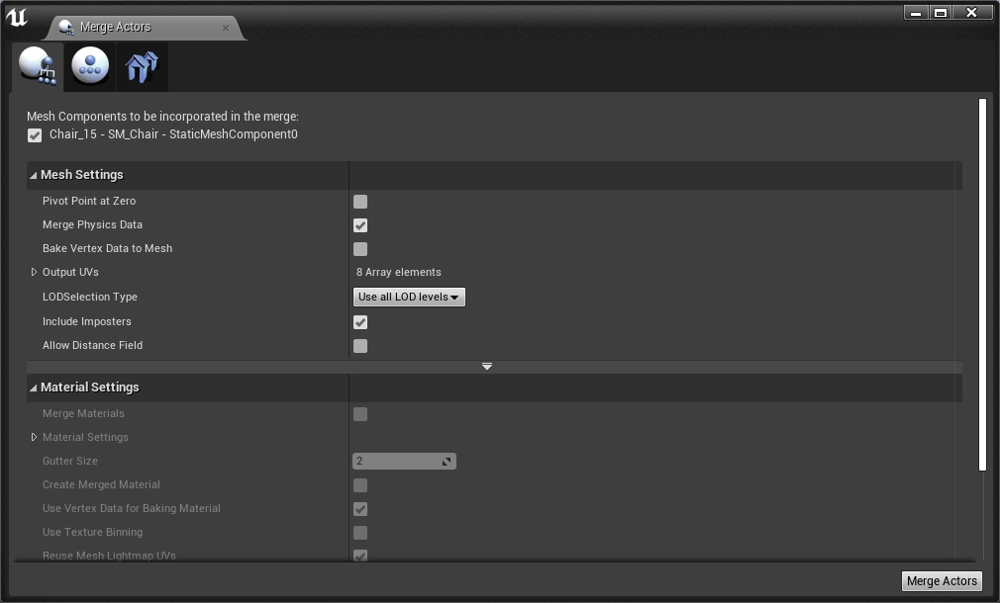

# [剖析虚幻渲染体系（03）- 渲染机制](https://www.cnblogs.com/timlly/p/14588598.html)


目录

- 3.1 本篇概述和基础
  - [3.1.1 渲染机制概述](https://www.cnblogs.com/timlly/p/14588598.html#311-渲染机制概述)
  - [3.1.2 渲染机制基础](https://www.cnblogs.com/timlly/p/14588598.html#312-渲染机制基础)
- 3.2 模型绘制管线
  - [3.2.1 模型绘制管线概览](https://www.cnblogs.com/timlly/p/14588598.html#321-模型绘制管线概览)
  - [3.2.2 从FPrimitiveSceneProxy到FMeshBatch](https://www.cnblogs.com/timlly/p/14588598.html#322-从fprimitivesceneproxy到fmeshbatch)
  - [3.2.3 从FMeshBatch到FMeshDrawCommand](https://www.cnblogs.com/timlly/p/14588598.html#323-从fmeshbatch到fmeshdrawcommand)
  - [3.2.4 从FMeshDrawCommand到RHICommandList](https://www.cnblogs.com/timlly/p/14588598.html#324-从fmeshdrawcommand到rhicommandlist)
  - [3.2.5 从RHICommandList到GPU](https://www.cnblogs.com/timlly/p/14588598.html#325-从rhicommandlist到gpu)
- 3.3 静态和动态绘制路径
  - [3.3.1 绘制路径概述](https://www.cnblogs.com/timlly/p/14588598.html#331-绘制路径概述)
  - [3.3.2 动态绘制路径](https://www.cnblogs.com/timlly/p/14588598.html#332-动态绘制路径)
  - [3.3.3 静态绘制路径](https://www.cnblogs.com/timlly/p/14588598.html#333-静态绘制路径)
- 3.4 渲染机制总结
  - [3.4.1 绘制管线优化技术](https://www.cnblogs.com/timlly/p/14588598.html#341-绘制管线优化技术)
  - [3.4.2 调试控制台变量](https://www.cnblogs.com/timlly/p/14588598.html#342-调试控制台变量)
  - [3.4.3 局限性](https://www.cnblogs.com/timlly/p/14588598.html#343-局限性)
  - [3.4.4 本篇作业](https://www.cnblogs.com/timlly/p/14588598.html#344-本篇作业)
- [特别说明](https://www.cnblogs.com/timlly/p/14588598.html#特别说明)
- [参考文献](https://www.cnblogs.com/timlly/p/14588598.html#参考文献)


 

 

# **3.1 本篇概述和基础**

## **3.1.1 渲染机制概述**

本篇主要讲述UE怎么将场景的物体怎么组织成一个个`Draw Call`，期间做了那些优化和处理以及场景渲染器是如何渲染整个场景的。主要涉及的内容有：

- 模型绘制流程。
- 动态和静态渲染路径。
- 场景渲染器。
- 涉及的基础概念和优化技术。
- 核心类和接口的代码剖析。

后面的章节会具体涉及这些技术。

## **3.1.2 渲染机制基础**

按惯例，为了更好地切入本篇主题，先阐述或回顾一下本篇将会涉及的一些基础概念和类型。

| 类型                     | 解析                                                         |
| ------------------------ | ------------------------------------------------------------ |
| **UPrimitiveComponent**  | ==图元组件==，是所有可渲染或拥有物理模拟的物体父类。是==CPU层裁剪的最小粒度==单位。 |
| **FPrimitiveSceneProxy** | ==图元场景代理==，是`UPrimitiveComponent`在渲染器的代表，镜像了`UPrimitiveComponent`在渲染线程的状态。 |
| **FPrimitiveSceneInfo**  | 渲染器内部状态（描述了FRendererModule的实现），相当于融合了UPrimitiveComponent 和 FPrimitiveSceneProxy。只存在渲染器模块，所以引擎模块无法感知到它的存在。 |
| **FScene**               | 是`UWorld`在渲染模块的代表。只有加入到FScene的物体才会被渲染器感知到。渲染线程拥有FScene的所有状态（游戏线程不可直接修改）。 |
| **FSceneView**           | 描述了FScene内的单个视图（view），同个FScene允许有多个view，换言之，一个场景可以被多个view绘制，或者多个view同时被绘制。每一帧都会创建新的view实例。 |
| **FViewInfo**            | view在渲染器的内部代表，只存在渲染器模块，引擎模块不可见。   |
| **FSceneRenderer**       | 每帧都会被创建，封装**帧间临时数据**。下派生FDeferredShadingSceneRenderer（延迟着色场景渲染器）和FMobileSceneRenderer（移动端场景渲染器），分别代表PC和移动端的默认渲染器。 |
| **FMeshBatchElement**    | 单个网格模型的数据，包含网格渲染中所需的部分数据，如顶点、索引、UniformBuffer及各种标识等。 |
| **FMeshBatch**           | 存着一组FMeshBatchElement的数据，这组FMeshBatchElement的数据拥有相同的材质和顶点缓冲。 |
| **FMeshDrawCommand**     | 完整地描述了一个Pass Draw Call的所有状态和数据，如shader绑定、顶点数据、索引数据、PSOF缓存等。 |
| **FMeshPassProcessor**   | 网格渲染Pass处理器，负责将场景中感兴趣的网格对象执行处理，将其由FMeshBatch对象转成一个或多个FMeshDrawCommand。 |

需要特意指出，以上概念中除了`UPrimitiveComponent`是属于**游戏线程的对象**，其它皆属于**渲染线程**。

 

# **3.2 模型绘制管线**

## **3.2.1 模型绘制管线概览**

在学习OpenGL或DirectX等图形API时，想必大家肯定都接触过类似的代码（以OpenGL画三角形为例）：

```c++
void DrawTriangle()
{
    // 构造三角形顶点和索引数据.
    float vertices[] = {
         0.5f,  0.5f, 0.0f,  // top right
         0.5f, -0.5f, 0.0f,  // bottom right
        -0.5f, -0.5f, 0.0f,  // bottom left
        -0.5f,  0.5f, 0.0f   // top left 
    };
    unsigned int indices[] = {
        0, 1, 3,  // first Triangle
        1, 2, 3   // second Triangle
    };
    
    // 创建GPU侧的资源并绑定.
    unsigned int VBO, VAO, EBO;
    glGenVertexArrays(1, &VAO);
    glGenBuffers(1, &VBO);
    glGenBuffers(1, &EBO);
    glBindVertexArray(VAO);

    glBindBuffer(GL_ARRAY_BUFFER, VBO);
    glBufferData(GL_ARRAY_BUFFER, sizeof(vertices), vertices, GL_STATIC_DRAW);

    glBindBuffer(GL_ELEMENT_ARRAY_BUFFER, EBO);
    glBufferData(GL_ELEMENT_ARRAY_BUFFER, sizeof(indices), indices, GL_STATIC_DRAW);

    glVertexAttribPointer(0, 3, GL_FLOAT, GL_FALSE, 3 * sizeof(float), (void*)0);
    glEnableVertexAttribArray(0);

    glBindBuffer(GL_ARRAY_BUFFER, 0); 
    glBindVertexArray(0); 

    // 清理背景
    glClearColor(0.2f, 0.3f, 0.3f, 1.0f);
    glClear(GL_COLOR_BUFFER_BIT);
    
    // 绘制三角形
    glUseProgram(shaderProgram);
    glBindVertexArray(VAO);
    glDrawElements(GL_TRIANGLES, 6, GL_UNSIGNED_INT, 0);
}
```

以上的Hello Triangle大致经过了几个阶段：构造CPU资源，创建和绑定GPU侧资源，调用绘制接口。这对于简单的应用程序，或者学习图形学来言，直接调用图形学API可以简化过程，直奔主题。但是，对于商业游戏引擎而言，需要以每秒数十帧渲染复杂的场景（成百上千个Draw Call，数十万甚至数百万个三角形），肯定不能直接采用简单的图形API调用。

商业游戏引擎需要在真正调用图形API之前，需要做很多操作和优化，诸如遮挡剔除、动态和静态合拼、动态Instance、缓存状态和命令、生成中间指令再转译成图形API指令等等。

在UE4.21之前，为了达到上述的目的，采用了网格渲染流程（Mesh Draw Pipeline），示意图如下：


*UE4.21及之前版本的网格绘制流程。*

大致过程是渲染之时，渲染器会遍历场景的所有经过了可见性测试的PrimitiveSceneProxy对象，利用其接口收集不同的FMeshBatch，然后在不同的渲染Pass中遍历这些FMeshBatch，利用Pass对应的DrawingPolicy将其转成RHI的命令列表，最后才会生成对应图形API的指令，提交到GPU硬件中执行。

UE4.22在此基础上，为了更好地做渲染优化，给网格渲染管线进行了一次比较大的重构，抛弃了低效率的DrawingPolicy，用PassMeshProcessor取而代之，在FMeshBatch和RHI命令之间增加了一个概念FMeshDrawCommand，以便更大程度更加可控地排序、缓存、合并绘制指令：


*UE4.22重构后新的网格绘制流程。增加了新的FMeshDrawCommand和FMeshPassProcessor等概念及操作。*

这样做的目的主要有两个：

- 支持RTX的实时光线追踪。光线追踪需要遍历整个场景的物体，要保留整个场景的shader资源。
- GPU驱动的渲染管线。包含GPU裁剪，所以CPU没法知道每一帧的可见性，但又不能每帧建立整个场景的绘制指令，否则无法达成实时渲染。

为了达成上述的目的，重构后的管线采取了更多聚合缓存措施，体现在：

- 静态图元在加入场景时就建立绘制指令，然后缓存。
- 允许RHI层做尽可能多的预处理。
  - shader Binding Table Entry。
  - Graphics Pipeline State。
- 避免静态网格每帧都重建绘制指令。

重构了模型渲染管线之后，多数场景案例下，DepthPass和BasePass可以减少数倍的Draw Call数量，缓存海量的命令：


*Fortnite的一个测试场景在新旧网格渲染管线下的渲染数据对比。可见在新的网格渲染流程下，Draw Call得到了大量的降低，命令缓存数量也巨大。*

本节的后续章节就以重构后的网格绘制流程作为剖析对象。

## **3.2.2 从FPrimitiveSceneProxy到FMeshBatch**

在上一篇中，已经解析过FPrimitiveSceneProxy是游戏线程UPrimitiveComponent在渲染线程的镜像数据。而FMeshBatch是本节才接触的新概念，它它包含了绘制Pass所需的所有信息，解耦了网格Pass和FPrimitiveSceneProxy，所以FPrimitiveSceneProxy并不知道会被哪些Pass绘制。

FMeshBatch和FMeshBatchElement的主要声明如下：

```c++
// Engine\Source\Runtime\Engine\Public\MeshBatch.h

// 网格批次元素, 存储了FMeshBatch单个网格所需的数据.
struct FMeshBatchElement
{
    // 网格的UniformBuffer, 如果使用GPU Scene, 则需要为null.
    FRHIUniformBuffer* PrimitiveUniformBuffer;
    // 网格的UniformBuffer在CPU侧的数据.
    const TUniformBuffer<FPrimitiveUniformShaderParameters>* PrimitiveUniformBufferResource;
    // 索引缓冲.
    const FIndexBuffer* IndexBuffer;

    union 
    {
        uint32* InstanceRuns;
        class FSplineMeshSceneProxy* SplineMeshSceneProxy;
    };
    // 用户数据.
    const void* UserData;
    void* VertexFactoryUserData;

    FRHIVertexBuffer* IndirectArgsBuffer;
    uint32 IndirectArgsOffset;

    // 图元ID模式, 有PrimID_FromPrimitiveSceneInfo(GPU Scene模式)和PrimID_DynamicPrimitiveShaderData(每个网格拥有自己的UniformBuffer)
    // 只可被渲染器修改.
    EPrimitiveIdMode PrimitiveIdMode : PrimID_NumBits + 1;
    uint32 DynamicPrimitiveShaderDataIndex : 24;

    uint32 FirstIndex;
    /** When 0, IndirectArgsBuffer will be used. */
    uint32 NumPrimitives;

    // Instance数量
    uint32 NumInstances;
    uint32 BaseVertexIndex;
    uint32 MinVertexIndex;
    uint32 MaxVertexIndex;
    int32 UserIndex;
    float MinScreenSize;
    float MaxScreenSize;

    uint32 InstancedLODIndex : 4;
    uint32 InstancedLODRange : 4;
    uint32 bUserDataIsColorVertexBuffer : 1;
    uint32 bIsSplineProxy : 1;
    uint32 bIsInstanceRuns : 1;

    // 获取图元数量.
    int32 GetNumPrimitives() const
    {
        if (bIsInstanceRuns && InstanceRuns)
        {
            int32 Count = 0;
            for (uint32 Run = 0; Run < NumInstances; Run++)
            {
                Count += NumPrimitives * (InstanceRuns[Run * 2 + 1] - InstanceRuns[Run * 2] + 1);
            }
            return Count;
        }
        else
        {
            return NumPrimitives * NumInstances;
        }
    }
};


// 网格批次.
struct FMeshBatch
{
    // 这组FMeshBatchElement的数据拥有相同的材质和顶点缓冲。
    // TInlineAllocator<1>表明Elements数组至少有1个元素.
    TArray<FMeshBatchElement,TInlineAllocator<1> > Elements; 
    const FVertexFactory* VertexFactory; // 顶点工厂.
    const FMaterialRenderProxy* MaterialRenderProxy; // 渲染所用的材质.

    uint16 MeshIdInPrimitive; // 图元所在的网格id, 用于相同图元的稳定排序.
    int8 LODIndex; // 网格LOD索引, 用于LOD的平滑过渡.
    uint8 SegmentIndex; // 子模型索引.
    
    // 裁剪标记.
    uint32 ReverseCulling : 1;
    uint32 bDisableBackfaceCulling : 1;

    // 特定渲染Pass的关联标记.
    uint32 CastShadow        : 1; // 是否在阴影Pass中渲染.
    uint32 bUseForMaterial    : 1; // 是否在需要材质的Pass中渲染.
    uint32 bUseForDepthPass : 1; // 是否在深度Pass中渲染.
    uint32 bUseAsOccluder    : 1; // 标明是否遮挡体.
    uint32 bWireframe        : 1; // 是否线框模式.

    uint32 Type : PT_NumBits; // 图元类型, 如PT_TriangleList(默认), PT_LineList, ...
    uint32 DepthPriorityGroup : SDPG_NumBits; // 深度优先级组, 如SDPG_World (default), SDPG_Foreground

    // 其它标记和数据
    const FLightCacheInterface* LCI;
    FHitProxyId BatchHitProxyId;
    float TessellationDisablingShadowMapMeshSize;
    
    uint32 bCanApplyViewModeOverrides : 1;
    uint32 bUseWireframeSelectionColoring : 1;
    uint32 bUseSelectionOutline : 1;
    uint32 bSelectable : 1;
    uint32 bRequiresPerElementVisibility : 1;
    uint32 bDitheredLODTransition : 1;
    uint32 bRenderToVirtualTexture : 1;
    uint32 RuntimeVirtualTextureMaterialType : RuntimeVirtualTexture::MaterialType_NumBits;
    
    (......)
    
    // 工具接口.
    bool IsTranslucent(ERHIFeatureLevel::Type InFeatureLevel) const;
    bool IsDecal(ERHIFeatureLevel::Type InFeatureLevel) const;
    bool IsDualBlend(ERHIFeatureLevel::Type InFeatureLevel) const;
    bool UseForHairStrands(ERHIFeatureLevel::Type InFeatureLevel) const;
    bool IsMasked(ERHIFeatureLevel::Type InFeatureLevel) const;
    int32 GetNumPrimitives() const;
    bool HasAnyDrawCalls() const;
};
```

由此可见，FMeshBatch记录了一组拥有相同材质和顶点工厂的FMeshBatchElement数据（如下图），还存储了渲染Pass特定的标记和其它所需的数据，为的就是在网格渲染后续流程中使用和二次加工。


*一个FMeshBatch拥有一组FMeshBatchElement、一个顶点工厂和一个材质实例，同一个FMeshBatch的所有FMeshBatchElement共享着相同的材质和顶点缓冲（可可被视为Vertex Factory）。但通常情况（大多数情况）下，FMeshBatch只会有一个FMeshBatchElement。*

场景渲染器FSceneRenderer在渲染之初，会执行==可见性测试==和==剔除==，以便剔除被遮挡和被隐藏的物体，在此阶段的末期会调用`GatherDynamicMeshElements`收集当前场景所有的FPrimitiveSceneProxy，流程示意代码如下：

```c++
void FSceneRender::Render(FRHICommandListImmediate& RHICmdList)
{
    bool FDeferredShadingSceneRenderer::InitViews((FRHICommandListImmediate& RHICmdList,  ...)
    {
        void FSceneRender::ComputeViewVisibility(FRHICommandListImmediate& RHICmdList, ...)
        {
            FSceneRender::GatherDynamicMeshElements(Views, Scene, ViewFamily, DynamicIndexBuffer, DynamicVertexBuffer, DynamicReadBuffer, HasDynamicMeshElementsMasks, HasDynamicEditorMeshElementsMasks, HasViewCustomDataMasks, MeshCollector);
        }
    }
}
```

再进入`FSceneRender::GatherDynamicMeshElements`看看执行了哪些逻辑：

```c++
// Engine\Source\Runtime\Renderer\Private\SceneVisibility.cpp

void FSceneRenderer::GatherDynamicMeshElements(
    TArray<FViewInfo>& InViews, 
    const FScene* InScene, 
    const FSceneViewFamily& InViewFamily, 
    FGlobalDynamicIndexBuffer& DynamicIndexBuffer,
    FGlobalDynamicVertexBuffer& DynamicVertexBuffer,
    FGlobalDynamicReadBuffer& DynamicReadBuffer,
    const FPrimitiveViewMasks& HasDynamicMeshElementsMasks, 
    const FPrimitiveViewMasks& HasDynamicEditorMeshElementsMasks, 
    const FPrimitiveViewMasks& HasViewCustomDataMasks,
    FMeshElementCollector& Collector)
{
    (......)
    
    int32 NumPrimitives = InScene->Primitives.Num();

    int32 ViewCount = InViews.Num();
    {
        // 处理FMeshElementCollector.
        Collector.ClearViewMeshArrays();
        for (int32 ViewIndex = 0; ViewIndex < ViewCount; ViewIndex++)
        {
            Collector.AddViewMeshArrays(
                &InViews[ViewIndex], 
                &InViews[ViewIndex].DynamicMeshElements,
                &InViews[ViewIndex].SimpleElementCollector,
                &InViews[ViewIndex].DynamicPrimitiveShaderData, 
                InViewFamily.GetFeatureLevel(),
                &DynamicIndexBuffer,
                &DynamicVertexBuffer,
                &DynamicReadBuffer);
        }

        const bool bIsInstancedStereo = (ViewCount > 0) ? (InViews[0].IsInstancedStereoPass() || InViews[0].bIsMobileMultiViewEnabled) : false;
        const EShadingPath ShadingPath = Scene->GetShadingPath();
        
        // 遍历场景所有的图元.
        for (int32 PrimitiveIndex = 0; PrimitiveIndex < NumPrimitives; ++PrimitiveIndex)
        {
            const uint8 ViewMask = HasDynamicMeshElementsMasks[PrimitiveIndex];

            if (ViewMask != 0) // 只处理没有被遮挡或隐藏的物体
            {
                // Don't cull a single eye when drawing a stereo pair
                const uint8 ViewMaskFinal = (bIsInstancedStereo) ? ViewMask | 0x3 : ViewMask;

                FPrimitiveSceneInfo* PrimitiveSceneInfo = InScene->Primitives[PrimitiveIndex];
                const FPrimitiveBounds& Bounds = InScene->PrimitiveBounds[PrimitiveIndex];
                // 将FPrimitiveSceneProxy的信息设置到收集器中.
                Collector.SetPrimitive(PrimitiveSceneInfo->Proxy, PrimitiveSceneInfo->DefaultDynamicHitProxyId);
                // 设置动态网格自定义数据.
                SetDynamicMeshElementViewCustomData(InViews, HasViewCustomDataMasks, PrimitiveSceneInfo);

                // 标记DynamicMeshEndIndices的起始.
                if (PrimitiveIndex > 0)
                {
                    for (int32 ViewIndex = 0; ViewIndex < ViewCount; ViewIndex++)
                    {
                        InViews[ViewIndex].DynamicMeshEndIndices[PrimitiveIndex - 1] = Collector.GetMeshBatchCount(ViewIndex);
                    }
                }
                
                // 获取动态网格元素的数据.
                PrimitiveSceneInfo->Proxy->GetDynamicMeshElements(InViewFamily.Views, InViewFamily, ViewMaskFinal, Collector);

                // 标记DynamicMeshEndIndices的末尾.
                for (int32 ViewIndex = 0; ViewIndex < ViewCount; ViewIndex++)
                {
                    InViews[ViewIndex].DynamicMeshEndIndices[PrimitiveIndex] = Collector.GetMeshBatchCount(ViewIndex);
                }
                
                // 处理MeshPass相关的数据和标记.
                for (int32 ViewIndex = 0; ViewIndex < ViewCount; ViewIndex++)
                {
                    if (ViewMaskFinal & (1 << ViewIndex))
                    {
                        FViewInfo& View = InViews[ViewIndex];
                        const bool bAddLightmapDensityCommands = View.Family->EngineShowFlags.LightMapDensity && AllowDebugViewmodes();
                        const FPrimitiveViewRelevance& ViewRelevance = View.PrimitiveViewRelevanceMap[PrimitiveIndex];

                        const int32 LastNumDynamicMeshElements = View.DynamicMeshElementsPassRelevance.Num();
                        View.DynamicMeshElementsPassRelevance.SetNum(View.DynamicMeshElements.Num());

                        for (int32 ElementIndex = LastNumDynamicMeshElements; ElementIndex < View.DynamicMeshElements.Num(); ++ElementIndex)
                        {
                            const FMeshBatchAndRelevance& MeshBatch = View.DynamicMeshElements[ElementIndex];
                            FMeshPassMask& PassRelevance = View.DynamicMeshElementsPassRelevance[ElementIndex];
                            // 这里会计算当前的MeshBatch会被哪些MeshPass引用, 从而加到view的对应MeshPass的数组中.
                            ComputeDynamicMeshRelevance(ShadingPath, bAddLightmapDensityCommands, ViewRelevance, MeshBatch, View, PassRelevance, PrimitiveSceneInfo, Bounds);
                        }
                    }
                }
            }
        }
    }

    (......)
    
    // 收集器执行任务.
    MeshCollector.ProcessTasks();
}
```

上面的代码可知，收集动态图元数据时，会给每个FSceneRenderer创建一个FMeshElementCollector的对象，以便收集场景中所有可见的FPrimitiveSceneProxy的网格数据。而中间有一句关键的代码`PrimitiveSceneInfo->Proxy->GetDynamicMeshElements()`就是给每个图元对象向渲染器（收集器）添加可见图元元素的机会，下面展开此函数展开看看（由于基类`FPrimitiveSceneProxy`的这个接口是空函数体，未做任何操作，所以这个收集操作由具体的子类实现，这里以子类`FSkeletalMeshSceneProxy`的实现为例）：

```c++
// Engine\Source\Runtime\Engine\Private\SkeletalMesh.cpp

void FSkeletalMeshSceneProxy::GetDynamicMeshElements(const TArray<const FSceneView*>& Views, const FSceneViewFamily& ViewFamily, uint32 VisibilityMap, FMeshElementCollector& Collector) const
{
    GetMeshElementsConditionallySelectable(Views, ViewFamily, true, VisibilityMap, Collector);
}

void FSkeletalMeshSceneProxy::GetMeshElementsConditionallySelectable(const TArray<const FSceneView*>& Views, const FSceneViewFamily& ViewFamily, bool bInSelectable, uint32 VisibilityMap, FMeshElementCollector& Collector) const
{
    (......)

    const int32 LODIndex = MeshObject->GetLOD();
    const FSkeletalMeshLODRenderData& LODData = SkeletalMeshRenderData->LODRenderData[LODIndex];

    if( LODSections.Num() > 0 && LODIndex >= SkeletalMeshRenderData->CurrentFirstLODIdx )
    {
        const FLODSectionElements& LODSection = LODSections[LODIndex]
        
        // 根据LOD遍历所有的子模型, 加入到collector中.
        for (FSkeletalMeshSectionIter Iter(LODIndex, *MeshObject, LODData, LODSection); Iter; ++Iter)
        {
            const FSkelMeshRenderSection& Section = Iter.GetSection();
            const int32 SectionIndex = Iter.GetSectionElementIndex();
            const FSectionElementInfo& SectionElementInfo = Iter.GetSectionElementInfo();

            bool bSectionSelected = false;
            if (MeshObject->IsMaterialHidden(LODIndex, SectionElementInfo.UseMaterialIndex) || Section.bDisabled)
            {
                continue;
            }
            // 将指定LODIndex和SectionIndex加入到Collector中.
            GetDynamicElementsSection(Views, ViewFamily, VisibilityMap, LODData, LODIndex, SectionIndex, bSectionSelected, SectionElementInfo, bInSelectable, Collector);
        }
    }
    
    (......)
}

void FSkeletalMeshSceneProxy::GetDynamicElementsSection(const TArray<const FSceneView*>& Views, const FSceneViewFamily& ViewFamily, uint32 VisibilityMap, const FSkeletalMeshLODRenderData& LODData, const int32 LODIndex, const int32 SectionIndex, bool bSectionSelected, const FSectionElementInfo& SectionElementInfo, bool bInSelectable, FMeshElementCollector& Collector ) const
{
    const FSkelMeshRenderSection& Section = LODData.RenderSections[SectionIndex];
    const bool bIsSelected = false;
    const bool bIsWireframe = ViewFamily.EngineShowFlags.Wireframe;

    for (int32 ViewIndex = 0; ViewIndex < Views.Num(); ViewIndex++)
    {
        if (VisibilityMap & (1 << ViewIndex))
        {
            const FSceneView* View = Views[ViewIndex];
            
            // 从Colloctor分配一个FMeshBatch.
            FMeshBatch& Mesh = Collector.AllocateMesh();
            
            // 创建基础的网格批次对象(FMeshBatchElement实例).
            CreateBaseMeshBatch(View, LODData, LODIndex, SectionIndex, SectionElementInfo, Mesh);
            
            if(!Mesh.VertexFactory)
            {
                // hide this part
                continue;
            }

            Mesh.bWireframe |= bForceWireframe;
            Mesh.Type = PT_TriangleList;
            Mesh.bSelectable = bInSelectable;
            
            // 设置首个FMeshBatchElement对象.
            FMeshBatchElement& BatchElement = Mesh.Elements[0];
            const bool bRequiresAdjacencyInformation = RequiresAdjacencyInformation( SectionElementInfo.Material, Mesh.VertexFactory->GetType(), ViewFamily.GetFeatureLevel() );
            if ( bRequiresAdjacencyInformation )
            {
                check(LODData.AdjacencyMultiSizeIndexContainer.IsIndexBufferValid() );
                BatchElement.IndexBuffer = LODData.AdjacencyMultiSizeIndexContainer.GetIndexBuffer();
                Mesh.Type = PT_12_ControlPointPatchList;
                BatchElement.FirstIndex *= 4;
            }

            BatchElement.MinVertexIndex = Section.BaseVertexIndex;
            Mesh.ReverseCulling = IsLocalToWorldDeterminantNegative();
            Mesh.CastShadow = SectionElementInfo.bEnableShadowCasting;
            Mesh.bCanApplyViewModeOverrides = true;
            Mesh.bUseWireframeSelectionColoring = bIsSelected;
            
            (......)

            if ( ensureMsgf(Mesh.MaterialRenderProxy, TEXT("GetDynamicElementsSection with invalid MaterialRenderProxy. Owner:%s LODIndex:%d UseMaterialIndex:%d"), *GetOwnerName().ToString(), LODIndex, SectionElementInfo.UseMaterialIndex) &&
                 ensureMsgf(Mesh.MaterialRenderProxy->GetMaterial(FeatureLevel), TEXT("GetDynamicElementsSection with invalid FMaterial. Owner:%s LODIndex:%d UseMaterialIndex:%d"), *GetOwnerName().ToString(), LODIndex, SectionElementInfo.UseMaterialIndex) )
            {
                // 将FMeshBatch添加到收集器中.
                Collector.AddMesh(ViewIndex, Mesh);
            }
            
            (......)
        }
    }
}
```

由此可见，FSkeletalMeshSceneProxy会根据不同的LOD索引，给每个Section网格添加一个FMeshBatch，每个FMeshBatch只有一个FMeshBatchElement实例。此外，`FSceneRender::GatherDynamicMeshElements`的逻辑中还有关键的一句`ComputeDynamicMeshRelevance`，它的作用是计算当前的MeshBatch会被哪些MeshPass引用，从而加到view的对应MeshPass的计数中：

```c++
// Engine\Source\Runtime\Renderer\Private\SceneVisibility.cpp

void ComputeDynamicMeshRelevance(EShadingPath ShadingPath, bool bAddLightmapDensityCommands, const FPrimitiveViewRelevance& ViewRelevance, const FMeshBatchAndRelevance& MeshBatch, FViewInfo& View, FMeshPassMask& PassMask, FPrimitiveSceneInfo* PrimitiveSceneInfo, const FPrimitiveBounds& Bounds)
{
    const int32 NumElements = MeshBatch.Mesh->Elements.Num();

    // 深度Pass/主Pass计数.
    if (ViewRelevance.bDrawRelevance && (ViewRelevance.bRenderInMainPass || ViewRelevance.bRenderCustomDepth || ViewRelevance.bRenderInDepthPass))
    {
        PassMask.Set(EMeshPass::DepthPass);
        View.NumVisibleDynamicMeshElements[EMeshPass::DepthPass] += NumElements;

        if (ViewRelevance.bRenderInMainPass || ViewRelevance.bRenderCustomDepth)
        {
            PassMask.Set(EMeshPass::BasePass);
            View.NumVisibleDynamicMeshElements[EMeshPass::BasePass] += NumElements;

            if (ShadingPath == EShadingPath::Mobile)
            {
                PassMask.Set(EMeshPass::MobileBasePassCSM);
                View.NumVisibleDynamicMeshElements[EMeshPass::MobileBasePassCSM] += NumElements;
            }

            if (ViewRelevance.bRenderCustomDepth)
            {
                PassMask.Set(EMeshPass::CustomDepth);
                View.NumVisibleDynamicMeshElements[EMeshPass::CustomDepth] += NumElements;
            }

            if (bAddLightmapDensityCommands)
            {
                PassMask.Set(EMeshPass::LightmapDensity);
                View.NumVisibleDynamicMeshElements[EMeshPass::LightmapDensity] += NumElements;
            }


            if (ViewRelevance.bVelocityRelevance)
            {
                PassMask.Set(EMeshPass::Velocity);
                View.NumVisibleDynamicMeshElements[EMeshPass::Velocity] += NumElements;
            }

            if (ViewRelevance.bOutputsTranslucentVelocity)
            {
                PassMask.Set(EMeshPass::TranslucentVelocity);
                View.NumVisibleDynamicMeshElements[EMeshPass::TranslucentVelocity] += NumElements;
            }

            if (ViewRelevance.bUsesSingleLayerWaterMaterial)
            {
                PassMask.Set(EMeshPass::SingleLayerWaterPass);
                View.NumVisibleDynamicMeshElements[EMeshPass::SingleLayerWaterPass] += NumElements;
            }
        }
    }
    
    // 半透明及其它Pass计数.
    if (ViewRelevance.HasTranslucency()
        && !ViewRelevance.bEditorPrimitiveRelevance
        && ViewRelevance.bRenderInMainPass)
    {
        if (View.Family->AllowTranslucencyAfterDOF())
        {
            if (ViewRelevance.bNormalTranslucency)
            {
                PassMask.Set(EMeshPass::TranslucencyStandard);
                View.NumVisibleDynamicMeshElements[EMeshPass::TranslucencyStandard] += NumElements;
            }

            if (ViewRelevance.bSeparateTranslucency)
            {
                PassMask.Set(EMeshPass::TranslucencyAfterDOF);
                View.NumVisibleDynamicMeshElements[EMeshPass::TranslucencyAfterDOF] += NumElements;
            }

            if (ViewRelevance.bSeparateTranslucencyModulate)
            {
                PassMask.Set(EMeshPass::TranslucencyAfterDOFModulate);
                View.NumVisibleDynamicMeshElements[EMeshPass::TranslucencyAfterDOFModulate] += NumElements;
            }
        }
        else
        {
            PassMask.Set(EMeshPass::TranslucencyAll);
            View.NumVisibleDynamicMeshElements[EMeshPass::TranslucencyAll] += NumElements;
        }

        if (ViewRelevance.bDistortion)
        {
            PassMask.Set(EMeshPass::Distortion);
            View.NumVisibleDynamicMeshElements[EMeshPass::Distortion] += NumElements;
        }

        if (ShadingPath == EShadingPath::Mobile && View.bIsSceneCapture)
        {
            PassMask.Set(EMeshPass::MobileInverseOpacity);
            View.NumVisibleDynamicMeshElements[EMeshPass::MobileInverseOpacity] += NumElements;
        }
    }

    (......)
}
```

上面的代码中还涉及到收集器`FMeshElementCollector`，它的作用是收集指定view的所有可见MeshBatch信息，声明如下：

```c++
// Engine\Source\Runtime\Engine\Public\SceneManagement.h

class FMeshElementCollector
{
public:
    // 绘制点, 线, 面, 精灵的接口.
    FPrimitiveDrawInterface* GetPDI(int32 ViewIndex)
    {
        return SimpleElementCollectors[ViewIndex];
    }
    // 分配一个FMeshBatch对象.
    FMeshBatch& AllocateMesh()
    {
        const int32 Index = MeshBatchStorage.Add(1);
        return MeshBatchStorage[Index];
    }
    
    // 增加MeshBatch到收集器中. 添加时会初始化和设置相关数据, 再添加到MeshBatches列表中.
    void AddMesh(int32 ViewIndex, FMeshBatch& MeshBatch);
    
    // 数据获取接口.
    FGlobalDynamicIndexBuffer& GetDynamicIndexBuffer();
    FGlobalDynamicVertexBuffer& GetDynamicVertexBuffer();
    FGlobalDynamicReadBuffer& GetDynamicReadBuffer();
    uint32 GetMeshBatchCount(uint32 ViewIndex) const;
    uint32 GetMeshElementCount(uint32 ViewIndex) const;
    ERHIFeatureLevel::Type GetFeatureLevel() const;

    void RegisterOneFrameMaterialProxy(FMaterialRenderProxy* Proxy);
    template<typename T, typename... ARGS>
    T& AllocateOneFrameResource(ARGS&&... Args);
    bool ShouldUseTasks() const;
    
    // 任务接口.
    void AddTask(TFunction<void()>&& Task)
    {
        ParallelTasks.Add(new (FMemStack::Get()) TFunction<void()>(MoveTemp(Task)));
    }
    void AddTask(const TFunction<void()>& Task)
    {
        ParallelTasks.Add(new (FMemStack::Get()) TFunction<void()>(Task));
    }
    void ProcessTasks();
    
protected:
    FMeshElementCollector(ERHIFeatureLevel::Type InFeatureLevel);

    // 设置FPrimitiveSceneProxy的数据.
    void SetPrimitive(const FPrimitiveSceneProxy* InPrimitiveSceneProxy, FHitProxyId DefaultHitProxyId)
    {
        check(InPrimitiveSceneProxy);
        PrimitiveSceneProxy = InPrimitiveSceneProxy;

        for (int32 ViewIndex = 0; ViewIndex < SimpleElementCollectors.Num(); ViewIndex++)
        {
            SimpleElementCollectors[ViewIndex]->HitProxyId = DefaultHitProxyId;
            SimpleElementCollectors[ViewIndex]->PrimitiveMeshId = 0;
        }

        for (int32 ViewIndex = 0; ViewIndex < MeshIdInPrimitivePerView.Num(); ++ViewIndex)
        {
            MeshIdInPrimitivePerView[ViewIndex] = 0;
        }
    }

    void ClearViewMeshArrays();

    // 向View添加一组Mesh.
    void AddViewMeshArrays(
        FSceneView* InView, 
        TArray<FMeshBatchAndRelevance,SceneRenderingAllocator>* ViewMeshes,
        FSimpleElementCollector* ViewSimpleElementCollector, 
        TArray<FPrimitiveUniformShaderParameters>* InDynamicPrimitiveShaderData,
        ERHIFeatureLevel::Type InFeatureLevel,
        FGlobalDynamicIndexBuffer* InDynamicIndexBuffer,
        FGlobalDynamicVertexBuffer* InDynamicVertexBuffer,
        FGlobalDynamicReadBuffer* InDynamicReadBuffer);

    TChunkedArray<FMeshBatch> MeshBatchStorage; // 保存分配的所有FMeshBatch实例.
    TArray<TArray<FMeshBatchAndRelevance, SceneRenderingAllocator>*, TInlineAllocator<2> > MeshBatches; // 需要被渲染的FMeshBatch实例
    TArray<int32, TInlineAllocator<2> > NumMeshBatchElementsPerView; // 每个view收集到的MeshBatchElement数量.
    TArray<FSimpleElementCollector*, TInlineAllocator<2> > SimpleElementCollectors; // 点线面精灵等简单物体的收集器.

    TArray<FSceneView*, TInlineAllocator<2> > Views; // 收集器收集的FSceneView实例.
    TArray<uint16, TInlineAllocator<2> > MeshIdInPrimitivePerView; // Current Mesh Id In Primitive per view
    TArray<TArray<FPrimitiveUniformShaderParameters>*, TInlineAllocator<2> > DynamicPrimitiveShaderDataPerView; // view的动态图元数据, 用于更新到GPU Scene中.
    
    TArray<FMaterialRenderProxy*, SceneRenderingAllocator> TemporaryProxies;
    TArray<FOneFrameResource*, SceneRenderingAllocator> OneFrameResources;

    const FPrimitiveSceneProxy* PrimitiveSceneProxy; // 当前正在收集的PrimitiveSceneProxy

    // 全局动态缓冲.
    FGlobalDynamicIndexBuffer* DynamicIndexBuffer;
    FGlobalDynamicVertexBuffer* DynamicVertexBuffer;
    FGlobalDynamicReadBuffer* DynamicReadBuffer;

    ERHIFeatureLevel::Type FeatureLevel;

    const bool bUseAsyncTasks; // 是否使用异步任务.
    TArray<TFunction<void()>*, SceneRenderingAllocator> ParallelTasks; // 收集完动态网格数据后需要等待处理的任务列表.
};
```

FMeshElementCollector和FSceneRenderer是一一对应关系，每个FSceneRenderer拥有一个收集器。收集器收集完对应view的可见图元列表后，通常拥有一组需要渲染的FMeshBatch列表，以及它们的管理数据和状态，为后续的流程收集和准备足够的准备。

此外，FMeshElementCollector在收集完网格数据后，还可以指定需要等待处理的任务列表，以实现多线程并行处理的同步。

## **3.2.3 从FMeshBatch到FMeshDrawCommand**

上一节内容讲到收集完动态的MeshElement，实际上，紧接着会调用`SetupMeshPass`来创建`FMeshPassProcessor`：

```c++
void FSceneRender::Render(FRHICommandListImmediate& RHICmdList)
{
    bool FDeferredShadingSceneRenderer::InitViews((FRHICommandListImmediate& RHICmdList,  ...)
    {
        void FSceneRender::ComputeViewVisibility(FRHICommandListImmediate& RHICmdList, ...)
        {
            // 收集动态MeshElement
            FSceneRender::GatherDynamicMeshElements(Views, Scene, ViewFamily, DynamicIndexBuffer, DynamicVertexBuffer, DynamicReadBuffer, HasDynamicMeshElementsMasks, HasDynamicEditorMeshElementsMasks, HasViewCustomDataMasks, MeshCollector);
            
            // 处理所有view的FMeshPassProcessor.
            for (int32 ViewIndex = 0; ViewIndex < Views.Num(); ViewIndex++)
            {
                FViewInfo& View = Views[ViewIndex];
                if (!View.ShouldRenderView())
                {
                    continue;
                }
                
                // 处理指定view的FMeshPassProcessor.
                FViewCommands& ViewCommands = ViewCommandsPerView[ViewIndex];
                SetupMeshPass(View, BasePassDepthStencilAccess, ViewCommands);
            }
        }
    }
}
```

其中`FSceneRenderer::SetupMeshPass`逻辑和解释如下：

```c++
void FSceneRenderer::SetupMeshPass(FViewInfo& View, FExclusiveDepthStencil::Type BasePassDepthStencilAccess, FViewCommands& ViewCommands)
{
    const EShadingPath ShadingPath = Scene->GetShadingPath();
    
    // 遍历EMeshPass定义的所有Pass。
    for (int32 PassIndex = 0; PassIndex < EMeshPass::Num; PassIndex++)
    {
        const EMeshPass::Type PassType = (EMeshPass::Type)PassIndex;
        
        if ((FPassProcessorManager::GetPassFlags(ShadingPath, PassType) & EMeshPassFlags::MainView) != EMeshPassFlags::None)
        {
            (......)

            // 创建FMeshPassProcessor
            PassProcessorCreateFunction CreateFunction = FPassProcessorManager::GetCreateFunction(ShadingPath, PassType);
            FMeshPassProcessor* MeshPassProcessor = CreateFunction(Scene, &View, nullptr);

            // 获取指定Pass的FParallelMeshDrawCommandPass对象。
            FParallelMeshDrawCommandPass& Pass = View.ParallelMeshDrawCommandPasses[PassIndex];

            if (ShouldDumpMeshDrawCommandInstancingStats())
            {
                Pass.SetDumpInstancingStats(GetMeshPassName(PassType));
            }

            // 并行地处理可见Pass的处理任务，创建此Pass的所有绘制命令。
            Pass.DispatchPassSetup(
                Scene,
                View,
                PassType,
                BasePassDepthStencilAccess,
                MeshPassProcessor,
                View.DynamicMeshElements,
                &View.DynamicMeshElementsPassRelevance,
                View.NumVisibleDynamicMeshElements[PassType],
                ViewCommands.DynamicMeshCommandBuildRequests[PassType],
                ViewCommands.NumDynamicMeshCommandBuildRequestElements[PassType],
                ViewCommands.MeshCommands[PassIndex]);
        }
    }
}
```

上面代码涉及的`EMeshPass`枚举定义如下：

```c++
// Engine\Source\Runtime\Renderer\Public\MeshPassProcessor.h

namespace EMeshPass
{
    enum Type
    {
        DepthPass,            // 深度
        BasePass,            // 几何/基础
        SkyPass,             // 天空
        SingleLayerWaterPass, // 单层水体
        CSMShadowDepth,     // 级联阴影深度
        Distortion,         // 扰动
        Velocity,             // 速度
        
        // 透明相关的Pass
        TranslucentVelocity,
        TranslucencyStandard,
        TranslucencyAfterDOF, 
        TranslucencyAfterDOFModulate,
        TranslucencyAll, 
        
        LightmapDensity,     // 光照图强度
        DebugViewMode,        // 调试视图模式
        CustomDepth,        // 自定义深度
        MobileBasePassCSM,
        MobileInverseOpacity, 
        VirtualTexture,        // 虚拟纹理

        // 编辑器模式下的特殊Pass
#if WITH_EDITOR
        HitProxy,
        HitProxyOpaqueOnly,
        EditorSelection,
#endif

        Num,
        NumBits = 5,
    };
}
```

由此可见，UE事先罗列了所有可能需要绘制的Pass，在SetupMeshPass阶段对需要用到的Pass并行化地生成DrawCommand。其中`FParallelMeshDrawCommandPass::DispatchPassSetup`主要逻辑和解析如下：

```c++
// Engine\Source\Runtime\Renderer\Private\MeshDrawCommands.cpp

void FParallelMeshDrawCommandPass::DispatchPassSetup(
    FScene* Scene,
    const FViewInfo& View,
    EMeshPass::Type PassType,
    FExclusiveDepthStencil::Type BasePassDepthStencilAccess,
    FMeshPassProcessor* MeshPassProcessor,
    const TArray<FMeshBatchAndRelevance, SceneRenderingAllocator>& DynamicMeshElements,
    const TArray<FMeshPassMask, SceneRenderingAllocator>* DynamicMeshElementsPassRelevance,
    int32 NumDynamicMeshElements,
    TArray<const FStaticMeshBatch*, SceneRenderingAllocator>& InOutDynamicMeshCommandBuildRequests,
    int32 NumDynamicMeshCommandBuildRequestElements,
    FMeshCommandOneFrameArray& InOutMeshDrawCommands,
    FMeshPassProcessor* MobileBasePassCSMMeshPassProcessor,
    FMeshCommandOneFrameArray* InOutMobileBasePassCSMMeshDrawCommands
)
{
    MaxNumDraws = InOutMeshDrawCommands.Num() + NumDynamicMeshElements + NumDynamicMeshCommandBuildRequestElements;
    
    // 设置TaskContext的数据，收集生成MeshCommand所需的数据。
    TaskContext.MeshPassProcessor = MeshPassProcessor;
    TaskContext.MobileBasePassCSMMeshPassProcessor = MobileBasePassCSMMeshPassProcessor;
    TaskContext.DynamicMeshElements = &DynamicMeshElements;
    TaskContext.DynamicMeshElementsPassRelevance = DynamicMeshElementsPassRelevance;

    TaskContext.View = &View;
    TaskContext.ShadingPath = Scene->GetShadingPath();
    TaskContext.ShaderPlatform = Scene->GetShaderPlatform();
    TaskContext.PassType = PassType;
    TaskContext.bUseGPUScene = UseGPUScene(GMaxRHIShaderPlatform, View.GetFeatureLevel());
    TaskContext.bDynamicInstancing = IsDynamicInstancingEnabled(View.GetFeatureLevel());
    TaskContext.bReverseCulling = View.bReverseCulling;
    TaskContext.bRenderSceneTwoSided = View.bRenderSceneTwoSided;
    TaskContext.BasePassDepthStencilAccess = BasePassDepthStencilAccess;
    TaskContext.DefaultBasePassDepthStencilAccess = Scene->DefaultBasePassDepthStencilAccess;
    TaskContext.NumDynamicMeshElements = NumDynamicMeshElements;
    TaskContext.NumDynamicMeshCommandBuildRequestElements = NumDynamicMeshCommandBuildRequestElements;

    // Only apply instancing for ISR to main view passes
    const bool bIsMainViewPass = PassType != EMeshPass::Num && (FPassProcessorManager::GetPassFlags(TaskContext.ShadingPath, TaskContext.PassType) & EMeshPassFlags::MainView) != EMeshPassFlags::None;
    TaskContext.InstanceFactor = (bIsMainViewPass && View.IsInstancedStereoPass()) ? 2 : 1;

    // 设置基于view的透明排序键
    TaskContext.TranslucencyPass = ETranslucencyPass::TPT_MAX;
    TaskContext.TranslucentSortPolicy = View.TranslucentSortPolicy;
    TaskContext.TranslucentSortAxis = View.TranslucentSortAxis;
    TaskContext.ViewOrigin = View.ViewMatrices.GetViewOrigin();
    TaskContext.ViewMatrix = View.ViewMatrices.GetViewMatrix();
    TaskContext.PrimitiveBounds = &Scene->PrimitiveBounds;

    switch (PassType)
    {
        case EMeshPass::TranslucencyStandard: TaskContext.TranslucencyPass = ETranslucencyPass::TPT_StandardTranslucency; break;
        case EMeshPass::TranslucencyAfterDOF: TaskContext.TranslucencyPass = ETranslucencyPass::TPT_TranslucencyAfterDOF; break;
        case EMeshPass::TranslucencyAfterDOFModulate: TaskContext.TranslucencyPass = ETranslucencyPass::TPT_TranslucencyAfterDOFModulate; break;
        case EMeshPass::TranslucencyAll: TaskContext.TranslucencyPass = ETranslucencyPass::TPT_AllTranslucency; break;
        case EMeshPass::MobileInverseOpacity: TaskContext.TranslucencyPass = ETranslucencyPass::TPT_StandardTranslucency; break;
    }
    
    // 交换命令列表
    FMemory::Memswap(&TaskContext.MeshDrawCommands, &InOutMeshDrawCommands, sizeof(InOutMeshDrawCommands));
    FMemory::Memswap(&TaskContext.DynamicMeshCommandBuildRequests, &InOutDynamicMeshCommandBuildRequests, sizeof(InOutDynamicMeshCommandBuildRequests));

    if (TaskContext.ShadingPath == EShadingPath::Mobile && TaskContext.PassType == EMeshPass::BasePass)
    {
        FMemory::Memswap(&TaskContext.MobileBasePassCSMMeshDrawCommands, InOutMobileBasePassCSMMeshDrawCommands, sizeof(*InOutMobileBasePassCSMMeshDrawCommands));
    }
    else
    {
        check(MobileBasePassCSMMeshPassProcessor == nullptr && InOutMobileBasePassCSMMeshDrawCommands == nullptr);
    }

    if (MaxNumDraws > 0)
    {
        // 根据最大绘制数量(MaxNumDraws)在渲染线程预分配资源.
        bPrimitiveIdBufferDataOwnedByRHIThread = false;
        TaskContext.PrimitiveIdBufferDataSize = TaskContext.InstanceFactor * MaxNumDraws * sizeof(int32);
        TaskContext.PrimitiveIdBufferData = FMemory::Malloc(TaskContext.PrimitiveIdBufferDataSize);
        PrimitiveIdVertexBufferPoolEntry = GPrimitiveIdVertexBufferPool.Allocate(TaskContext.PrimitiveIdBufferDataSize);
        TaskContext.MeshDrawCommands.Reserve(MaxNumDraws);
        TaskContext.TempVisibleMeshDrawCommands.Reserve(MaxNumDraws);

        const bool bExecuteInParallel = FApp::ShouldUseThreadingForPerformance()
            && CVarMeshDrawCommandsParallelPassSetup.GetValueOnRenderThread() > 0
            && GRenderingThread; // Rendering thread is required to safely use rendering resources in parallel.
        
        // 如果是并行方式, 便创建并行任务实例并加入TaskGraph系统执行.
        if (bExecuteInParallel) 
        {
            FGraphEventArray DependentGraphEvents;
            DependentGraphEvents.Add(TGraphTask<FMeshDrawCommandPassSetupTask>::CreateTask(nullptr, ENamedThreads::GetRenderThread()).ConstructAndDispatchWhenReady(TaskContext));
            TaskEventRef = TGraphTask<FMeshDrawCommandInitResourcesTask>::CreateTask(&DependentGraphEvents, ENamedThreads::GetRenderThread()).ConstructAndDispatchWhenReady(TaskContext);
        }
        else
        {
            QUICK_SCOPE_CYCLE_COUNTER(STAT_MeshPassSetupImmediate);
            FMeshDrawCommandPassSetupTask Task(TaskContext);
            Task.AnyThreadTask();
            FMeshDrawCommandInitResourcesTask DependentTask(TaskContext);
            DependentTask.AnyThreadTask();
        }
    }
}
```

以上代码涉及了几个关键的概念：`FMeshPassProcessor`,`FMeshDrawCommandPassSetupTaskContext`,`FMeshDrawCommandPassSetupTask`,`FMeshDrawCommandInitResourcesTask`。后面3个概念的定义和解析如下：

```c++
// Engine\Source\Runtime\Renderer\Private\MeshDrawCommands.h

// 并行网格绘制命令通道设置任务(FMeshDrawCommandPassSetupTask)所需的上下文.
class FMeshDrawCommandPassSetupTaskContext
{
public:
    // view相关的数据.
    const FViewInfo* View;
    EShadingPath ShadingPath;
    EShaderPlatform ShaderPlatform;
    EMeshPass::Type PassType;
    bool bUseGPUScene;
    bool bDynamicInstancing;
    bool bReverseCulling;
    bool bRenderSceneTwoSided;
    FExclusiveDepthStencil::Type BasePassDepthStencilAccess;
    FExclusiveDepthStencil::Type DefaultBasePassDepthStencilAccess;

    // 网格通道处理器(Mesh pass processor).
    FMeshPassProcessor* MeshPassProcessor;
    FMeshPassProcessor* MobileBasePassCSMMeshPassProcessor;
    const TArray<FMeshBatchAndRelevance, SceneRenderingAllocator>* DynamicMeshElements;
    const TArray<FMeshPassMask, SceneRenderingAllocator>* DynamicMeshElementsPassRelevance;

    // 命令相关的数据.
    int32 InstanceFactor;
    int32 NumDynamicMeshElements;
    int32 NumDynamicMeshCommandBuildRequestElements;
    FMeshCommandOneFrameArray MeshDrawCommands;
    FMeshCommandOneFrameArray MobileBasePassCSMMeshDrawCommands;
    TArray<const FStaticMeshBatch*, SceneRenderingAllocator> DynamicMeshCommandBuildRequests;
    TArray<const FStaticMeshBatch*, SceneRenderingAllocator> MobileBasePassCSMDynamicMeshCommandBuildRequests;
    FDynamicMeshDrawCommandStorage MeshDrawCommandStorage;
    FGraphicsMinimalPipelineStateSet MinimalPipelineStatePassSet;
    bool NeedsShaderInitialisation;

    // 需在渲染线程预分配的资源.
    void* PrimitiveIdBufferData;
    int32 PrimitiveIdBufferDataSize;
    FMeshCommandOneFrameArray TempVisibleMeshDrawCommands;

    // 透明物体排序所需.
    ETranslucencyPass::Type TranslucencyPass;
    ETranslucentSortPolicy::Type TranslucentSortPolicy;
    FVector TranslucentSortAxis;
    FVector ViewOrigin;
    FMatrix ViewMatrix;
    const TArray<struct FPrimitiveBounds>* PrimitiveBounds;

    // For logging instancing stats.
    int32 VisibleMeshDrawCommandsNum;
    int32 NewPassVisibleMeshDrawCommandsNum;
    int32 MaxInstances;
};


// Engine\Source\Runtime\Renderer\Private\MeshDrawCommands.cpp

// 转换指定EMeshPass中的每个FMeshBatch到一组FMeshDrawCommand. FMeshDrawCommandPassSetupTask要用到.
void GenerateDynamicMeshDrawCommands(
    const FViewInfo& View,
    EShadingPath ShadingPath,
    EMeshPass::Type PassType,
    FMeshPassProcessor* PassMeshProcessor,
    const TArray<FMeshBatchAndRelevance, SceneRenderingAllocator>& DynamicMeshElements,
    const TArray<FMeshPassMask, SceneRenderingAllocator>* DynamicMeshElementsPassRelevance,
    int32 MaxNumDynamicMeshElements,
    const TArray<const FStaticMeshBatch*, SceneRenderingAllocator>& DynamicMeshCommandBuildRequests,
    int32 MaxNumBuildRequestElements,
    FMeshCommandOneFrameArray& VisibleCommands,
    FDynamicMeshDrawCommandStorage& MeshDrawCommandStorage,
    FGraphicsMinimalPipelineStateSet& MinimalPipelineStatePassSet,
    bool& NeedsShaderInitialisation
)
{
    (......)

    // 构建FDynamicPassMeshDrawListContext实例, 用于传递PassMeshProcessor生成的绘制命令.
    FDynamicPassMeshDrawListContext DynamicPassMeshDrawListContext(
        MeshDrawCommandStorage,
        VisibleCommands,
        MinimalPipelineStatePassSet,
        NeedsShaderInitialisation
    );
    PassMeshProcessor->SetDrawListContext(&DynamicPassMeshDrawListContext);

    // 处理动态网格批次.
    {
        const int32 NumCommandsBefore = VisibleCommands.Num();
        const int32 NumDynamicMeshBatches = DynamicMeshElements.Num();
        
        // 遍历所有的动态网格批次.
        for (int32 MeshIndex = 0; MeshIndex < NumDynamicMeshBatches; MeshIndex++)
        {
            if (!DynamicMeshElementsPassRelevance || (*DynamicMeshElementsPassRelevance)[MeshIndex].Get(PassType))
            {
                const FMeshBatchAndRelevance& MeshAndRelevance = DynamicMeshElements[MeshIndex];
                check(!MeshAndRelevance.Mesh->bRequiresPerElementVisibility);
                const uint64 BatchElementMask = ~0ull;
                
                // 将FMeshBatch加入到PassMeshProcessor进行处理.
                PassMeshProcessor->AddMeshBatch(*MeshAndRelevance.Mesh, BatchElementMask, MeshAndRelevance.PrimitiveSceneProxy);
            }
        }

        (......)
    }
    
    // 处理静态网格批次.
    {
        const int32 NumCommandsBefore = VisibleCommands.Num();
        const int32 NumStaticMeshBatches = DynamicMeshCommandBuildRequests.Num();

        for (int32 MeshIndex = 0; MeshIndex < NumStaticMeshBatches; MeshIndex++)
        {
            const FStaticMeshBatch* StaticMeshBatch = DynamicMeshCommandBuildRequests[MeshIndex];
            const uint64 BatchElementMask = StaticMeshBatch->bRequiresPerElementVisibility ? View.StaticMeshBatchVisibility[StaticMeshBatch->BatchVisibilityId] : ~0ull;
            
            // 将FMeshBatch加入到PassMeshProcessor进行处理.
            PassMeshProcessor->AddMeshBatch(*StaticMeshBatch, BatchElementMask, StaticMeshBatch->PrimitiveSceneInfo->Proxy, StaticMeshBatch->Id);
        }

        (......)
    }
}

// 并行设置网格绘制指令的任务. 包含动态网格绘制命令的生成, 排序, 合并等.
class FMeshDrawCommandPassSetupTask
{
public:
    FMeshDrawCommandPassSetupTask(FMeshDrawCommandPassSetupTaskContext& InContext)
        : Context(InContext)
    {
    }
    
    (......)

    void AnyThreadTask()
    {
        const bool bMobileShadingBasePass = Context.ShadingPath == EShadingPath::Mobile && Context.PassType == EMeshPass::BasePass;
        const bool bMobileVulkanSM5BasePass = IsVulkanMobileSM5Platform(Context.ShaderPlatform) && Context.PassType == EMeshPass::BasePass;

        if (bMobileShadingBasePass)
        {
            (......)
        }
        else
        {
            // 生成动态和静态网格绘制指令(通过MeshPassProcessor将FMeshBatch转换成MeshDrawCommand).
            GenerateDynamicMeshDrawCommands(
                *Context.View,
                Context.ShadingPath,
                Context.PassType,
                Context.MeshPassProcessor,
                *Context.DynamicMeshElements,
                Context.DynamicMeshElementsPassRelevance,
                Context.NumDynamicMeshElements,
                Context.DynamicMeshCommandBuildRequests,
                Context.NumDynamicMeshCommandBuildRequestElements,
                Context.MeshDrawCommands,
                Context.MeshDrawCommandStorage,
                Context.MinimalPipelineStatePassSet,
                Context.NeedsShaderInitialisation
            );
        }

        if (Context.MeshDrawCommands.Num() > 0)
        {
            if (Context.PassType != EMeshPass::Num)
            {
                // 应用view中已经存在的MeshDrawCommand, 例如:渲染平面反射的反向裁剪模式(reverse culling mode)
                ApplyViewOverridesToMeshDrawCommands(
                    Context.ShadingPath,
                    Context.PassType,
                    Context.bReverseCulling,
                    Context.bRenderSceneTwoSided,
                    Context.BasePassDepthStencilAccess,
                    Context.DefaultBasePassDepthStencilAccess,
                    Context.MeshDrawCommands,
                    Context.MeshDrawCommandStorage,
                    Context.MinimalPipelineStatePassSet,
                    Context.NeedsShaderInitialisation,
                    Context.TempVisibleMeshDrawCommands
                );
            }

            // 更新排序键.
            if (bMobileShadingBasePass || bMobileVulkanSM5BasePass)
            {
                (......)
            }
            else if (Context.TranslucencyPass != ETranslucencyPass::TPT_MAX)
            {
                // 用view相关的数据更新网格排序键. 排序键的类型是FMeshDrawCommandSortKey, 包含了BasePass和透明的键值, 其中透明物体的排序以其到摄像机的距离为依据.
                UpdateTranslucentMeshSortKeys(
                    Context.TranslucentSortPolicy,
                    Context.TranslucentSortAxis,
                    Context.ViewOrigin,
                    Context.ViewMatrix,
                    *Context.PrimitiveBounds,
                    Context.TranslucencyPass,
                    Context.MeshDrawCommands
                );
            }

            {
                QUICK_SCOPE_CYCLE_COUNTER(STAT_SortVisibleMeshDrawCommands);
                // 执行MeshDrawCommand的排序, FCompareFMeshDrawCommands首先以FMeshDrawCommandSortKey作为排序依据, 其次再用StateBucketId.
                Context.MeshDrawCommands.Sort(FCompareFMeshDrawCommands());
            }

            if (Context.bUseGPUScene)
            {
                // 生成GPU场景的相关数据(主要是渲染场景中所有的Primitive数据).
                BuildMeshDrawCommandPrimitiveIdBuffer(
                    Context.bDynamicInstancing,
                    Context.MeshDrawCommands,
                    Context.MeshDrawCommandStorage,
                    Context.PrimitiveIdBufferData,
                    Context.PrimitiveIdBufferDataSize,
                    Context.TempVisibleMeshDrawCommands,
                    Context.MaxInstances,
                    Context.VisibleMeshDrawCommandsNum,
                    Context.NewPassVisibleMeshDrawCommandsNum,
                    Context.ShaderPlatform,
                    Context.InstanceFactor
                );
            }
        }
    }

    void DoTask(ENamedThreads::Type CurrentThread, const FGraphEventRef& MyCompletionGraphEvent)
    {
        AnyThreadTask();
    }

private:
    FMeshDrawCommandPassSetupTaskContext& Context; // 设备上下文.
};


// MeshDrawCommand所需的预分配资源。
class FMeshDrawCommandInitResourcesTask
{
public:

    (......)

    void AnyThreadTask()
    {
        TRACE_CPUPROFILER_EVENT_SCOPE(MeshDrawCommandInitResourcesTask);
        if (Context.NeedsShaderInitialisation)
        {
            // 初始化所有已绑定的shader资源。
            for (const FGraphicsMinimalPipelineStateInitializer& Initializer : Context.MinimalPipelineStatePassSet)
            {
                Initializer.BoundShaderState.LazilyInitShaders();
            }
        }
    }

    void DoTask(ENamedThreads::Type CurrentThread, const FGraphEventRef& MyCompletionGraphEvent)
    {
        AnyThreadTask();
    }

private:
    FMeshDrawCommandPassSetupTaskContext& Context;
};
```

由此可见`FMeshDrawCommandPassSetupTask`担当了在网格渲染管线中担当了相当重要的角色， 包含动态网格绘和静态制绘制命令的生成、排序、合并等。其中排序阶段的键值由`FMeshDrawCommandSortKey`决定，它的定义如下：

```c++
// Engine\Source\Runtime\Renderer\Public\MeshPassProcessor.h

// FVisibleMeshDrawCommand的排序键值.
class RENDERER_API FMeshDrawCommandSortKey
{
public:
    union 
    {
        uint64 PackedData;    // 打包后的64位键值数据

        // 几何通道排序键值
        struct
        {
            uint64 VertexShaderHash        : 16; // 低位：VS地址的哈希值。
            uint64 PixelShaderHash        : 32; // 中位：PS地址的哈希值。
            uint64 Masked                : 16; // 高位：是否Masked的材质
        } BasePass;

        // 透明通道排序键值
        struct
        {
            uint64 MeshIdInPrimitive    : 16; // 低位：共享同一个Primitive的稳定的网格id
            uint64 Distance                : 32; // 中位：到摄像机的距离
            uint64 Priority                : 16; // 高位：优先级（由材质指定）
        } Translucent;
    
        // 普通排序键值
        struct 
        {
            uint64 VertexShaderHash     : 32; // 低位：VS地址的哈希值。
            uint64 PixelShaderHash         : 32; // 高位：PS地址的哈希值。
        } Generic;
    };
    
    // 不相等操作符
    FORCEINLINE bool operator!=(FMeshDrawCommandSortKey B) const
    {
        return PackedData != B.PackedData;
    }

    // 小于操作符，用于排序。
    FORCEINLINE bool operator<(FMeshDrawCommandSortKey B) const
    {
        return PackedData < B.PackedData;
    }

    static const FMeshDrawCommandSortKey Default;
};
```

以上`FMeshDrawCommandSortKey`需要补充几点说明：

- `FMeshDrawCommandSortKey`虽然可存储BasePass、透明Pass、普通Pass3种键值，但同时只有一种数据生效。

- 键值的计算逻辑分散在不同的文件和阶段。譬如BasePass的键值可以发生在BasePassRendering、DepthRendering以及MeshPassProcessor阶段。其中它们的键值计算逻辑和解析如下表：

  | 键名                  | 计算代码                                                 | 解析                                                     |
  | --------------------- | -------------------------------------------------------- | -------------------------------------------------------- |
  | **VertexShaderHash**  | PointerHash(VertexShader)                                | 材质所用的VS的指针哈希值。                               |
  | **PixelShaderHash**   | PointerHash(PixelShader)                                 | 材质所用的PS的指针哈希值。                               |
  | **Masked**            | BlendMode == EBlendMode::BLEND_Masked ? 0 : 1            | 材质的混合模式是否Masked。                               |
  | **MeshIdInPrimitive** | MeshIdInPrimitivePerView[ViewIndex]                      | 基于视图的共享同一个Primitive的稳定的网格id。            |
  | **Distance**          | (uint32)~BitInvertIfNegativeFloat(*((uint32*)&Distance)) | 根据ETranslucentSortPolicy算出Distance，再逆转负数距离。 |
  | **Priority**          | -                                                        | 直接从材质指定的透明排序优先级获得。                     |

- `operator<`直接对比PackedData，表明越高位的数据优先级越高，具体地说，BasePass的排序依据首先是判断是否Masked的材质，再判断PS和VS的地址哈希值；同理，透明通道的排序优先级依次是：材质指定的优先级、网格到摄像机的距离、网格ID。

  > 一般来说，对网格进行排序时，对性能影响最大的因素会作为最大的优先级。
  >
  > 譬如BasePass阶段，Masked的材质在某些GPU设备会严重阻碍并行效率和吞吐量，排在最高位；而PS在指令数量、计算复杂度往往高于VS，故而排在VS之前也是合情合理的。
  >
  > 但是，透明通道的排序有一点比较特殊，那就是物体与摄像机的距离远近关系，因为要正确绘制半透明物体的前后关系，必须将它们从远到近的距离进行绘制，否则前后关系会出现错乱。故而透明通道必须将距离放在最高位（优先级最大）。

- PackedData将若干组数据打包成单个`uint64`，在比较时只需比较一次，可提升排序的效率。否则按照传统的写法，用几个`if-else`语句，势必增加CPU指令数量，降低排序效率。

- 修改键值和相关的排序逻辑，可自定义排序优先级和算法。譬如增加若干排序维度：纹理、顶点数据、渲染状态等。

接下来阐述一些重要的概念：`FMeshPassProcessor`和`FMeshDrawCommands`，上面的代码多次出现它们的身影。`FMeshPassProcessor`充当了将`FMeshBatch`转换成`FMeshDrawCommands`的角色，下面是它们及关联概念的定义和解析：

```c++
// Engine\Source\Runtime\Renderer\Public\MeshPassProcessor.h


// 不包含渲染纹理（Render Target）的渲染管线状态。在没有更改RT的一组绘制指令中非常有用。它的尺寸会影响网格绘制指令的遍历性能。
class FGraphicsMinimalPipelineStateInitializer
{
public:
    // RT的相关数据：像素格式，标记。
    using TRenderTargetFormats = TStaticArray<uint8/*EPixelFormat*/, MaxSimultaneousRenderTargets>;
    using TRenderTargetFlags = TStaticArray<uint32, MaxSimultaneousRenderTargets>;

    (......)

    // 将自己的值拷贝一份并传递出去。
    FGraphicsPipelineStateInitializer AsGraphicsPipelineStateInitializer() const
    {    
        return FGraphicsPipelineStateInitializer
        (    BoundShaderState.AsBoundShaderState()
            , BlendState
            , RasterizerState
            , DepthStencilState
            , ImmutableSamplerState
            , PrimitiveType
            , 0
            , FGraphicsPipelineStateInitializer::TRenderTargetFormats(PF_Unknown)
            , FGraphicsPipelineStateInitializer::TRenderTargetFlags(0)
            , PF_Unknown
            , 0
            , ERenderTargetLoadAction::ENoAction
            , ERenderTargetStoreAction::ENoAction
            , ERenderTargetLoadAction::ENoAction
            , ERenderTargetStoreAction::ENoAction
            , FExclusiveDepthStencil::DepthNop
            , 0
            , ESubpassHint::None
            , 0
            , 0
            , bDepthBounds
            , bMultiView
            , bHasFragmentDensityAttachment
        );
    }
    
    (......)

    // 计算FGraphicsMinimalPipelineStateInitializer的哈希值。
    inline friend uint32 GetTypeHash(const FGraphicsMinimalPipelineStateInitializer& Initializer)
    {
        //add and initialize any leftover padding within the struct to avoid unstable key
        struct FHashKey
        {
            uint32 VertexDeclaration;
            uint32 VertexShader;
            uint32 PixelShader;
            uint32 RasterizerState;
        } HashKey;
        HashKey.VertexDeclaration = PointerHash(Initializer.BoundShaderState.VertexDeclarationRHI);
        HashKey.VertexShader = GetTypeHash(Initializer.BoundShaderState.VertexShaderIndex);
        HashKey.PixelShader = GetTypeHash(Initializer.BoundShaderState.PixelShaderIndex);
        HashKey.RasterizerState = PointerHash(Initializer.RasterizerState);

        return uint32(CityHash64((const char*)&HashKey, sizeof(FHashKey)));
    }

    // 比较接口。
    bool operator==(const FGraphicsMinimalPipelineStateInitializer& rhs) const;
    bool operator!=(const FGraphicsMinimalPipelineStateInitializer& rhs) const
    bool operator<(const FGraphicsMinimalPipelineStateInitializer& rhs) const;
    bool operator>(const FGraphicsMinimalPipelineStateInitializer& rhs) const;

    // 渲染管线状态
    FMinimalBoundShaderStateInput    BoundShaderState;     // 绑定的shader状态。
    FRHIBlendState*                    BlendState;            // 混合状态。
    FRHIRasterizerState*            RasterizerState;     // 光栅化状态。
    FRHIDepthStencilState*            DepthStencilState;    // 深度目标状态。
    FImmutableSamplerState            ImmutableSamplerState;    // 不可变的采样器状态。

    // 其它状态。
    bool                bDepthBounds = false;
    bool                bMultiView = false;
    bool                bHasFragmentDensityAttachment = false;
    uint8                Padding[1] = {}; // 内存对齐而加的数据。

    EPrimitiveType        PrimitiveType;
};


// 唯一地代表了FGraphicsMinimalPipelineStateInitializer一个实例的id，用于快速排序。
class FGraphicsMinimalPipelineStateId
{
public:
    uint32 GetId() const
    {
        return PackedId;
    }
    
    // 判断和比较接口。
    inline bool IsValid() const 
    inline bool operator==(const FGraphicsMinimalPipelineStateId& rhs) const;
    inline bool operator!=(const FGraphicsMinimalPipelineStateId& rhs) const;
    
    // 获取关联的FGraphicsMinimalPipelineStateInitializer。
    inline const FGraphicsMinimalPipelineStateInitializer& GetPipelineState(const FGraphicsMinimalPipelineStateSet& InPipelineSet) const
    {
        if (bComesFromLocalPipelineStateSet)
        {
            return InPipelineSet.GetByElementId(SetElementIndex);
        }

        {
            FScopeLock Lock(&PersistentIdTableLock);
            return PersistentIdTable.GetByElementId(SetElementIndex).Key;
        }
    }

    static void InitializePersistentIds();
    // 获取FGraphicsMinimalPipelineStateInitializer对应的永久的pipeline state id。
    static FGraphicsMinimalPipelineStateId GetPersistentId(const FGraphicsMinimalPipelineStateInitializer& InPipelineState);
    static void RemovePersistentId(FGraphicsMinimalPipelineStateId Id);

    // 按如下顺序获取pipeline state id：全局永久的id表和PassSet参数，如果都没找到，会创建一个空白的实例，并加入到PassSet参数。
    RENDERER_API static FGraphicsMinimalPipelineStateId GetPipelineStateId(const FGraphicsMinimalPipelineStateInitializer& InPipelineState, FGraphicsMinimalPipelineStateSet& InOutPassSet, bool& NeedsShaderInitialisation);


private:
    // 打包的键值。
    union
    {
        uint32 PackedId = 0;

        struct
        {
            uint32 SetElementIndex                   : 30;
            uint32 bComesFromLocalPipelineStateSet : 1;
            uint32 bValid                           : 1;
        };
    };

    struct FRefCountedGraphicsMinimalPipelineState
    {
        FRefCountedGraphicsMinimalPipelineState() : RefNum(0)
        {
        }
        uint32 RefNum;
    };

    static FCriticalSection PersistentIdTableLock;
    using PersistentTableType = Experimental::TRobinHoodHashMap<FGraphicsMinimalPipelineStateInitializer, FRefCountedGraphicsMinimalPipelineState>;
    // 持久id表。
    static PersistentTableType PersistentIdTable;

    static int32 LocalPipelineIdTableSize;
    static int32 CurrentLocalPipelineIdTableSize;
    static bool NeedsShaderInitialisation;
};

// 网格绘制指令，记录了绘制单个Mesh所需的所有资源和数据，且不应该有多余的数据，如果需要在InitView传递数据，可用FVisibleMeshDrawCommand。
// 所有被FMeshDrawCommand引用的资源都必须保证生命周期，因为FMeshDrawCommand并不管理资源的生命周期。
class FMeshDrawCommand
{
public:
    // 资源绑定
    FMeshDrawShaderBindings ShaderBindings;
    FVertexInputStreamArray VertexStreams;
    FRHIIndexBuffer* IndexBuffer;

    // 缓存的渲染管线状态（PSO）
    FGraphicsMinimalPipelineStateId CachedPipelineId;

    // 绘制命令参数。
    uint32 FirstIndex;
    uint32 NumPrimitives;
    uint32 NumInstances;

    // 顶点数据，包含普通模式和非直接模式。
    union
    {
        struct 
        {
            uint32 BaseVertexIndex;
            uint32 NumVertices;
        } VertexParams;
        
        struct  
        {
            FRHIVertexBuffer* Buffer;
            uint32 Offset;
        } IndirectArgs;
    };

    int8 PrimitiveIdStreamIndex;

    // 非渲染状态参数。
    uint8 StencilRef;

    // 判断是否和指定的FMeshDrawCommand相匹配，如果匹配，可以合并成同一个instance进行绘制。
    bool MatchesForDynamicInstancing(const FMeshDrawCommand& Rhs) const
    {
        return CachedPipelineId == Rhs.CachedPipelineId
            && StencilRef == Rhs.StencilRef
            && ShaderBindings.MatchesForDynamicInstancing(Rhs.ShaderBindings)
            && VertexStreams == Rhs.VertexStreams
            && PrimitiveIdStreamIndex == Rhs.PrimitiveIdStreamIndex
            && IndexBuffer == Rhs.IndexBuffer
            && FirstIndex == Rhs.FirstIndex
            && NumPrimitives == Rhs.NumPrimitives
            && NumInstances == Rhs.NumInstances
            && ((NumPrimitives > 0 && VertexParams.BaseVertexIndex == Rhs.VertexParams.BaseVertexIndex && VertexParams.NumVertices == Rhs.VertexParams.NumVertices)
                || (NumPrimitives == 0 && IndirectArgs.Buffer == Rhs.IndirectArgs.Buffer && IndirectArgs.Offset == Rhs.IndirectArgs.Offset));
    }

    // 获取动态实例的哈希值。
    uint32 GetDynamicInstancingHash() const
    {
        //add and initialize any leftover padding within the struct to avoid unstable keys
        struct FHashKey
        {
            uint32 IndexBuffer;
            uint32 VertexBuffers = 0;
            uint32 VertexStreams = 0;
            uint32 PipelineId;
            uint32 DynamicInstancingHash;
            uint32 FirstIndex;
            uint32 NumPrimitives;
            uint32 NumInstances;
            uint32 IndirectArgsBufferOrBaseVertexIndex;
            uint32 NumVertices;
            uint32 StencilRefAndPrimitiveIdStreamIndex;

            // 指针地址哈希
            static inline uint32 PointerHash(const void* Key)
            {
#if PLATFORM_64BITS
                // Ignoring the lower 4 bits since they are likely zero anyway.
                // Higher bits are more significant in 64 bit builds.
                return reinterpret_cast<UPTRINT>(Key) >> 4;
#else
                return reinterpret_cast<UPTRINT>(Key);
#endif
            };

            // 哈希组合
            static inline uint32 HashCombine(uint32 A, uint32 B)
            {
                return A ^ (B + 0x9e3779b9 + (A << 6) + (A >> 2));
            }
        } HashKey;

        // 将FMeshDrawCommand的所有成员变量数值填充到FHashKey
        HashKey.PipelineId = CachedPipelineId.GetId();
        HashKey.StencilRefAndPrimitiveIdStreamIndex = StencilRef | (PrimitiveIdStreamIndex << 8);
        HashKey.DynamicInstancingHash = ShaderBindings.GetDynamicInstancingHash();

        for (int index = 0; index < VertexStreams.Num(); index++)
        {
            const FVertexInputStream& VertexInputStream = VertexStreams[index];
            const uint32 StreamIndex = VertexInputStream.StreamIndex;
            const uint32 Offset = VertexInputStream.Offset;

            uint32 Packed = (StreamIndex << 28) | Offset;
            HashKey.VertexStreams = FHashKey::HashCombine(HashKey.VertexStreams, Packed);
            HashKey.VertexBuffers = FHashKey::HashCombine(HashKey.VertexBuffers, FHashKey::PointerHash(VertexInputStream.VertexBuffer));
        }

        HashKey.IndexBuffer = FHashKey::PointerHash(IndexBuffer);
        HashKey.FirstIndex = FirstIndex;
        HashKey.NumPrimitives = NumPrimitives;
        HashKey.NumInstances = NumInstances;

        if (NumPrimitives > 0)
        {
            HashKey.IndirectArgsBufferOrBaseVertexIndex = VertexParams.BaseVertexIndex;
            HashKey.NumVertices = VertexParams.NumVertices;
        }
        else
        {
            HashKey.IndirectArgsBufferOrBaseVertexIndex = FHashKey::PointerHash(IndirectArgs.Buffer);
            HashKey.NumVertices = IndirectArgs.Offset;
        }        

        // 将填充完的HashKey转成哈希值，数据完全一样的HashKey总是具有相同的哈希值，这样可以很方便地判断是否可以合批渲染。
        return uint32(CityHash64((char*)&HashKey, sizeof(FHashKey)));
    }

    (......)
    
    // 将FMeshBatch的相关数据进行处理并传递到FMeshDrawCommand中。
    void SetDrawParametersAndFinalize(
        const FMeshBatch& MeshBatch, 
        int32 BatchElementIndex,
        FGraphicsMinimalPipelineStateId PipelineId,
        const FMeshProcessorShaders* ShadersForDebugging)
    {
        const FMeshBatchElement& BatchElement = MeshBatch.Elements[BatchElementIndex];

        IndexBuffer = BatchElement.IndexBuffer ? BatchElement.IndexBuffer->IndexBufferRHI.GetReference() : nullptr;
        FirstIndex = BatchElement.FirstIndex;
        NumPrimitives = BatchElement.NumPrimitives;
        NumInstances = BatchElement.NumInstances;

        if (NumPrimitives > 0)
        {
            VertexParams.BaseVertexIndex = BatchElement.BaseVertexIndex;
            VertexParams.NumVertices = BatchElement.MaxVertexIndex - BatchElement.MinVertexIndex + 1;
        }
        else
        {
            IndirectArgs.Buffer = BatchElement.IndirectArgsBuffer;
            IndirectArgs.Offset = BatchElement.IndirectArgsOffset;
        }

        Finalize(PipelineId, ShadersForDebugging);
    }

    // 保存PipelineId和shader调试信息。
    void Finalize(FGraphicsMinimalPipelineStateId PipelineId, const FMeshProcessorShaders* ShadersForDebugging)
    {
        CachedPipelineId = PipelineId;
        ShaderBindings.Finalize(ShadersForDebugging);    
    }

    /** Submits commands to the RHI Commandlist to draw the MeshDrawCommand. */
    static void SubmitDraw(
        const FMeshDrawCommand& RESTRICT MeshDrawCommand, 
        const FGraphicsMinimalPipelineStateSet& GraphicsMinimalPipelineStateSet,
        FRHIVertexBuffer* ScenePrimitiveIdsBuffer,
        int32 PrimitiveIdOffset,
        uint32 InstanceFactor,
        FRHICommandList& CommandList, 
        class FMeshDrawCommandStateCache& RESTRICT StateCache);

    (......)
};


// 可见的网格绘制指令。存储了已经被断定为可见的网格绘制指令所需的信息，以便后续进行可见性处理。
// 与FMeshDrawCommand不同的是，FVisibleMeshDrawCommand只应该存储InitViews操作（可见性/排序）所需的书，而不应该有绘制提交相关的数据。
class FVisibleMeshDrawCommand
{
public:
    (......)
    
    // 关联的FMeshDrawCommand实例。
    const FMeshDrawCommand* MeshDrawCommand;
    // 基于无状态排序的键值。（如基于深度排序的透明绘制指令）
    FMeshDrawCommandSortKey SortKey;
    // 绘制图元id，可用于从PrimitiveSceneData的SRV获取图元数据。有效的DrawPrimitiveId可以反向追踪FPrimitiveSceneInfo实例。
    int32 DrawPrimitiveId;
    // 生产FVisibleMeshDrawCommand的场景图元id，如果是-1则代表没有FPrimitiveSceneInfo，可以反向追踪FPrimitiveSceneInfo实例。
    int32 ScenePrimitiveId;
    // Offset into the buffer of PrimitiveIds built for this pass, in int32's.
    int32 PrimitiveIdBufferOffset;

    // 动态instancing状态桶id（Dynamic instancing state bucket ID）。
    // 所有相同StateBucketId的绘制指令可被合并到同一个instancing中。
    // -1表示由其它因素代替StateBucketId进行排序。
    int32 StateBucketId;

    // Needed for view overrides
    ERasterizerFillMode MeshFillMode : ERasterizerFillMode_NumBits + 1;
    ERasterizerCullMode MeshCullMode : ERasterizerCullMode_NumBits + 1;
};


// 网格通道处理器
class FMeshPassProcessor
{
public:
    
    // 以下的场景、view、context等数据由构建函数传入.
    const FScene* RESTRICT Scene;
    ERHIFeatureLevel::Type FeatureLevel;
    const FSceneView* ViewIfDynamicMeshCommand;
    FMeshPassDrawListContext* DrawListContext;

    (......)

    // 增加FMeshBatch实例, 由具体的子类Pass实现.
    virtual void AddMeshBatch(const FMeshBatch& RESTRICT MeshBatch, uint64 BatchElementMask, const FPrimitiveSceneProxy* RESTRICT PrimitiveSceneProxy, int32 StaticMeshId = -1) = 0;
    
    // 网格绘制策略重写设置.
    struct FMeshDrawingPolicyOverrideSettings
    {
        EDrawingPolicyOverrideFlags    MeshOverrideFlags = EDrawingPolicyOverrideFlags::None;
        EPrimitiveType                MeshPrimitiveType = PT_TriangleList;
    };
    
    (......)

    // 将1个FMeshBatch转换成1或多个MeshDrawCommands.
    template<typename PassShadersType, typename ShaderElementDataType>
    void BuildMeshDrawCommands(
        const FMeshBatch& RESTRICT MeshBatch,
        uint64 BatchElementMask,
        const FPrimitiveSceneProxy* RESTRICT PrimitiveSceneProxy,
        const FMaterialRenderProxy& RESTRICT MaterialRenderProxy,
        const FMaterial& RESTRICT MaterialResource,
        const FMeshPassProcessorRenderState& RESTRICT DrawRenderState,
        PassShadersType PassShaders,
        ERasterizerFillMode MeshFillMode,
        ERasterizerCullMode MeshCullMode,
        FMeshDrawCommandSortKey SortKey,
        EMeshPassFeatures MeshPassFeatures,
        const ShaderElementDataType& ShaderElementData)
    {
        const FVertexFactory* RESTRICT VertexFactory = MeshBatch.VertexFactory;
        const FPrimitiveSceneInfo* RESTRICT PrimitiveSceneInfo = PrimitiveSceneProxy ? PrimitiveSceneProxy->GetPrimitiveSceneInfo() : nullptr;

        // FMeshDrawCommand实例, 用于收集各类渲染资源和数据.
        FMeshDrawCommand SharedMeshDrawCommand;
        
        // 处理FMeshDrawCommand的模板数据.
        SharedMeshDrawCommand.SetStencilRef(DrawRenderState.GetStencilRef());

        // 渲染状态实例.
        FGraphicsMinimalPipelineStateInitializer PipelineState;
        PipelineState.PrimitiveType = (EPrimitiveType)MeshBatch.Type;
        PipelineState.ImmutableSamplerState = MaterialRenderProxy.ImmutableSamplerState;
        
        // 处理FMeshDrawCommand的顶点数据, shader和渲染状态.
        EVertexInputStreamType InputStreamType = EVertexInputStreamType::Default;
        if ((MeshPassFeatures & EMeshPassFeatures::PositionOnly) != EMeshPassFeatures::Default)                InputStreamType = EVertexInputStreamType::PositionOnly;
        if ((MeshPassFeatures & EMeshPassFeatures::PositionAndNormalOnly) != EMeshPassFeatures::Default)    InputStreamType = EVertexInputStreamType::PositionAndNormalOnly;

        FRHIVertexDeclaration* VertexDeclaration = VertexFactory->GetDeclaration(InputStreamType);
        SharedMeshDrawCommand.SetShaders(VertexDeclaration, PassShaders.GetUntypedShaders(), PipelineState);

        PipelineState.RasterizerState = GetStaticRasterizerState<true>(MeshFillMode, MeshCullMode);
        PipelineState.BlendState = DrawRenderState.GetBlendState();
        PipelineState.DepthStencilState = DrawRenderState.GetDepthStencilState();

        VertexFactory->GetStreams(FeatureLevel, InputStreamType, SharedMeshDrawCommand.VertexStreams);

        SharedMeshDrawCommand.PrimitiveIdStreamIndex = VertexFactory->GetPrimitiveIdStreamIndex(InputStreamType);

        // 处理VS/PS/GS等shader的绑定数据.
        int32 DataOffset = 0;
        if (PassShaders.VertexShader.IsValid())
        {
            FMeshDrawSingleShaderBindings ShaderBindings = SharedMeshDrawCommand.ShaderBindings.GetSingleShaderBindings(SF_Vertex, DataOffset);
            PassShaders.VertexShader->GetShaderBindings(Scene, FeatureLevel, PrimitiveSceneProxy, MaterialRenderProxy, MaterialResource, DrawRenderState, ShaderElementData, ShaderBindings);
        }

        if (PassShaders.PixelShader.IsValid())
        {
            FMeshDrawSingleShaderBindings ShaderBindings = SharedMeshDrawCommand.ShaderBindings.GetSingleShaderBindings(SF_Pixel, DataOffset);
            PassShaders.PixelShader->GetShaderBindings(Scene, FeatureLevel, PrimitiveSceneProxy, MaterialRenderProxy, MaterialResource, DrawRenderState, ShaderElementData, ShaderBindings);
        }

        (......)

        const int32 NumElements = MeshBatch.Elements.Num();

        // 遍历该FMeshBatch的所有MeshBatchElement, 从材质中获取FMeshBatchElement关联的所有shader类型的绑定数据.
        for (int32 BatchElementIndex = 0; BatchElementIndex < NumElements; BatchElementIndex++)
        {
            if ((1ull << BatchElementIndex) & BatchElementMask)
            {
                const FMeshBatchElement& BatchElement = MeshBatch.Elements[BatchElementIndex];
                FMeshDrawCommand& MeshDrawCommand = DrawListContext->AddCommand(SharedMeshDrawCommand, NumElements);

                DataOffset = 0;
                if (PassShaders.VertexShader.IsValid())
                {
                    FMeshDrawSingleShaderBindings VertexShaderBindings = MeshDrawCommand.ShaderBindings.GetSingleShaderBindings(SF_Vertex, DataOffset);
                    FMeshMaterialShader::GetElementShaderBindings(PassShaders.VertexShader, Scene, ViewIfDynamicMeshCommand, VertexFactory, InputStreamType, FeatureLevel, PrimitiveSceneProxy, MeshBatch, BatchElement, ShaderElementData, VertexShaderBindings, MeshDrawCommand.VertexStreams);
                }

                if (PassShaders.PixelShader.IsValid())
                {
                    FMeshDrawSingleShaderBindings PixelShaderBindings = MeshDrawCommand.ShaderBindings.GetSingleShaderBindings(SF_Pixel, DataOffset);
                    FMeshMaterialShader::GetElementShaderBindings(PassShaders.PixelShader, Scene, ViewIfDynamicMeshCommand, VertexFactory, EVertexInputStreamType::Default, FeatureLevel, PrimitiveSceneProxy, MeshBatch, BatchElement, ShaderElementData, PixelShaderBindings, MeshDrawCommand.VertexStreams);
                }
                
                (......)

                // 处理并获得PrimitiveId.
                int32 DrawPrimitiveId;
                int32 ScenePrimitiveId;
                GetDrawCommandPrimitiveId(PrimitiveSceneInfo, BatchElement, DrawPrimitiveId, ScenePrimitiveId);

                // 最后处理MeshDrawCommand
                FMeshProcessorShaders ShadersForDebugging = PassShaders.GetUntypedShaders();
                DrawListContext->FinalizeCommand(MeshBatch, BatchElementIndex, DrawPrimitiveId, ScenePrimitiveId, MeshFillMode, MeshCullMode, SortKey, PipelineState, &ShadersForDebugging, MeshDrawCommand);
            }
        }
    }

protected:
    RENDERER_API void GetDrawCommandPrimitiveId(
        const FPrimitiveSceneInfo* RESTRICT PrimitiveSceneInfo,
        const FMeshBatchElement& BatchElement,
        int32& DrawPrimitiveId,
        int32& ScenePrimitiveId) const;
};
```

> 上面计算键值时数次用到了`CityHash64`，`CityHash64`是一种计算任意数量字符串哈希值的算法，是一个快速的非加密哈希函数，也是一种快速的非加密的散列函数。它的实现代码在Engine\Source\Runtime\Core\Private\Hash\CityHash.cpp中，有兴趣的童鞋自行研读了。
>
> 与之相似的哈希算法有：HalfMD5，MD5，SipHash64，SipHash128，IntHash32，IntHash64，SHA1，SHA224，SHA256等等。

`FMeshDrawCommand`保存了所有RHI所需的绘制网格的信息，这些信息是平台无关和图形API无关的（stateless），并且是基于数据驱动的设计，因此可以共享它的设备上下文。

`FMeshPassProcessor::AddMeshBatch`由子类实现，每个子类通常对应着`EMeshPass`枚举的一个通道。它的常见子类有：

- FDepthPassMeshProcessor：深度通道网格处理器，对应`EMeshPass::DepthPass`。
- FBasePassMeshProcessor：几何通道网格处理器，对应`EMeshPass::BasePass`。
- FCustomDepthPassMeshProcessor：自定义深度通道网格处理器，对应`EMeshPass::CustomDepth`。
- FShadowDepthPassMeshProcessor：阴影通道网格处理器，对应`EMeshPass::CSMShadowDepth`。
- FTranslucencyDepthPassMeshProcessor：透明深度通道网格处理器，没有对应的`EMeshPass`。
- FLightmapDensityMeshProcessor：光照图网格处理器，对应`EMeshPass::LightmapDensity`。
- ......

不同的Pass处理`FMeshBatch`会有所不同，以最常见的`FBasePassMeshProcessor`为例：

```c++
// Engine\Source\Runtime\Renderer\Private\BasePassRendering.cpp

void FBasePassMeshProcessor::AddMeshBatch(const FMeshBatch& RESTRICT MeshBatch, uint64 BatchElementMask, const FPrimitiveSceneProxy* RESTRICT PrimitiveSceneProxy, int32 StaticMeshId)
{
    if (MeshBatch.bUseForMaterial)
    {
        (......)

        if (bShouldDraw
            && (!PrimitiveSceneProxy || PrimitiveSceneProxy->ShouldRenderInMainPass())
            && ShouldIncludeDomainInMeshPass(Material.GetMaterialDomain())
            && ShouldIncludeMaterialInDefaultOpaquePass(Material))
        {
            (......)

            // 处理简单的前向渲染
            if (IsSimpleForwardShadingEnabled(GetFeatureLevelShaderPlatform(FeatureLevel)))
            {
                AddMeshBatchForSimpleForwardShading(
                    MeshBatch,
                    BatchElementMask,
                    StaticMeshId,
                    PrimitiveSceneProxy,
                    MaterialRenderProxy,
                    Material,
                    LightMapInteraction,
                    bIsLitMaterial,
                    bAllowStaticLighting,
                    bUseVolumetricLightmap,
                    bAllowIndirectLightingCache,
                    MeshFillMode,
                    MeshCullMode);
            }
            // 渲染体积透明自阴影的物体
            else if (bIsLitMaterial
                && bIsTranslucent
                && PrimitiveSceneProxy
                && PrimitiveSceneProxy->CastsVolumetricTranslucentShadow())
            {
                (......)

                if (bIsLitMaterial
                    && bAllowStaticLighting
                    && bUseVolumetricLightmap
                    && PrimitiveSceneProxy)
                {
                    Process< FSelfShadowedVolumetricLightmapPolicy >(
                        MeshBatch,
                        BatchElementMask,
                        StaticMeshId,
                        PrimitiveSceneProxy,
                        MaterialRenderProxy,
                        Material,
                        BlendMode,
                        ShadingModels,
                        FSelfShadowedVolumetricLightmapPolicy(),
                        ElementData,
                        MeshFillMode,
                        MeshCullMode);
                }
                
                (......)
            }
            // 根据不同的光照图的选项和质量等级，调用Process进行处理。
            else
            {
                static const auto CVarSupportLowQualityLightmap = IConsoleManager::Get().FindTConsoleVariableDataInt(TEXT("r.SupportLowQualityLightmaps"));
                const bool bAllowLowQualityLightMaps = (!CVarSupportLowQualityLightmap) || (CVarSupportLowQualityLightmap->GetValueOnAnyThread() != 0);

                switch (LightMapInteraction.GetType())
                {
                case LMIT_Texture:
                    if (bAllowHighQualityLightMaps)
                    {
                        const FShadowMapInteraction ShadowMapInteraction = (bAllowStaticLighting && MeshBatch.LCI && bIsLitMaterial)
                            ? MeshBatch.LCI->GetShadowMapInteraction(FeatureLevel)
                            : FShadowMapInteraction();

                        if (ShadowMapInteraction.GetType() == SMIT_Texture)
                        {
                            Process< FUniformLightMapPolicy >(
                                MeshBatch,
                                BatchElementMask,
                                StaticMeshId,
                                PrimitiveSceneProxy,
                                MaterialRenderProxy,
                                Material,
                                BlendMode,
                                ShadingModels,
                                FUniformLightMapPolicy(LMP_DISTANCE_FIELD_SHADOWS_AND_HQ_LIGHTMAP),
                                MeshBatch.LCI,
                                MeshFillMode,
                                MeshCullMode);
                        }
                            
                        (......)
                    }
                        
                    (......)
                        
                    break;
                default:
                    if (bIsLitMaterial
                        && bAllowStaticLighting
                        && Scene
                        && Scene->VolumetricLightmapSceneData.HasData()
                        && PrimitiveSceneProxy
                        && (PrimitiveSceneProxy->IsMovable()
                            || PrimitiveSceneProxy->NeedsUnbuiltPreviewLighting()
                            || PrimitiveSceneProxy->GetLightmapType() == ELightmapType::ForceVolumetric))
                    {
                        Process< FUniformLightMapPolicy >(
                            MeshBatch,
                            BatchElementMask,
                            StaticMeshId,
                            PrimitiveSceneProxy,
                            MaterialRenderProxy,
                            Material,
                            BlendMode,
                            ShadingModels,
                            FUniformLightMapPolicy(LMP_PRECOMPUTED_IRRADIANCE_VOLUME_INDIRECT_LIGHTING),
                            MeshBatch.LCI,
                            MeshFillMode,
                            MeshCullMode);
                    }
                        
                    (......)
                        
                    break;
                };
            }
        }
    }
}

// FBasePassMeshProcessor对不同的光照图类型进行处理（shader绑定，渲染状态，排序键值，顶点数据等等），最后调用BuildMeshDrawCommands将FMeshBatch转换成FMeshDrawCommands。
template<typename LightMapPolicyType>
void FBasePassMeshProcessor::Process(
    const FMeshBatch& RESTRICT MeshBatch,
    uint64 BatchElementMask,
    int32 StaticMeshId,
    const FPrimitiveSceneProxy* RESTRICT PrimitiveSceneProxy,
    const FMaterialRenderProxy& RESTRICT MaterialRenderProxy,
    const FMaterial& RESTRICT MaterialResource,
    EBlendMode BlendMode,
    FMaterialShadingModelField ShadingModels,
    const LightMapPolicyType& RESTRICT LightMapPolicy,
    const typename LightMapPolicyType::ElementDataType& RESTRICT LightMapElementData,
    ERasterizerFillMode MeshFillMode,
    ERasterizerCullMode MeshCullMode)
{
    const FVertexFactory* VertexFactory = MeshBatch.VertexFactory;

    const bool bRenderSkylight = Scene && Scene->ShouldRenderSkylightInBasePass(BlendMode) && ShadingModels.IsLit();
    const bool bRenderAtmosphericFog = IsTranslucentBlendMode(BlendMode) && (Scene && Scene->HasAtmosphericFog() && Scene->ReadOnlyCVARCache.bEnableAtmosphericFog);

    TMeshProcessorShaders<
        TBasePassVertexShaderPolicyParamType<LightMapPolicyType>,
        FBaseHS,
        FBaseDS,
        TBasePassPixelShaderPolicyParamType<LightMapPolicyType>> BasePassShaders;

    // 获取指定光照图策略类型的shader。
    GetBasePassShaders<LightMapPolicyType>(
        MaterialResource,
        VertexFactory->GetType(),
        LightMapPolicy,
        FeatureLevel,
        bRenderAtmosphericFog,
        bRenderSkylight,
        Get128BitRequirement(),
        BasePassShaders.HullShader,
        BasePassShaders.DomainShader,
        BasePassShaders.VertexShader,
        BasePassShaders.PixelShader
        );

    // 渲染状态处理。
    FMeshPassProcessorRenderState DrawRenderState(PassDrawRenderState);

    SetDepthStencilStateForBasePass(
        ViewIfDynamicMeshCommand,
        DrawRenderState,
        FeatureLevel,
        MeshBatch,
        StaticMeshId,
        PrimitiveSceneProxy,
        bEnableReceiveDecalOutput);

    if (bTranslucentBasePass)
    {
        SetTranslucentRenderState(DrawRenderState, MaterialResource, GShaderPlatformForFeatureLevel[FeatureLevel], TranslucencyPassType);
    }

    // 初始化Shader的材质书。
    TBasePassShaderElementData<LightMapPolicyType> ShaderElementData(LightMapElementData);
    ShaderElementData.InitializeMeshMaterialData(ViewIfDynamicMeshCommand, PrimitiveSceneProxy, MeshBatch, StaticMeshId, true);

    // 处理排序键值。
    FMeshDrawCommandSortKey SortKey = FMeshDrawCommandSortKey::Default;

    if (bTranslucentBasePass)
    {
        SortKey = CalculateTranslucentMeshStaticSortKey(PrimitiveSceneProxy, MeshBatch.MeshIdInPrimitive);
    }
    else
    {
        SortKey = CalculateBasePassMeshStaticSortKey(EarlyZPassMode, BlendMode, BasePassShaders.VertexShader.GetShader(), BasePassShaders.PixelShader.GetShader());
    }

    // 将FMeshBatch的元素转换成FMeshDrawCommands。
    BuildMeshDrawCommands(
        MeshBatch,
        BatchElementMask,
        PrimitiveSceneProxy,
        MaterialRenderProxy,
        MaterialResource,
        DrawRenderState,
        BasePassShaders,
        MeshFillMode,
        MeshCullMode,
        SortKey,
        EMeshPassFeatures::Default,
        ShaderElementData);
}
```

由此可见，`FMeshPassProcessor`的主要作用是：

- Pass过滤。将该Pass无关的MeshBatch给过滤掉，比如深度Pass过滤掉透明物体。
- 选择绘制命令所需的Shader及渲染状态（深度、模板、混合状态、光栅化状态等）。
- 收集绘制命令涉及的Shader资源绑定。
  - Pass的Uniform Buffer，如ViewUniformBuffer、DepthPassUniformBuffer。
  - 顶点工厂绑定（顶点数据和索引）。
  - 材质绑定。
  - Pass的与绘制指令相关的绑定。
- 收集Draw Call相关的参数。

`FMeshPassProcessor::BuildMeshDrawCommands`在最后阶段会调用`FMeshPassDrawListContext::FinalizeCommand`。`FMeshPassDrawListContext`提供了两个基本接口，是个抽象类，派生类有`FDynamicPassMeshDrawListContext`和`FCachedPassMeshDrawListContext`，分别代表了动态网格绘制指令和缓存网格绘制指令的上下文。它们的接口和解析如下：

```c++
// Engine\Source\Runtime\Renderer\Public\MeshPassProcessor.h

// 网格通道绘制列表上下文。
class FMeshPassDrawListContext
{
public:
    virtual FMeshDrawCommand& AddCommand(FMeshDrawCommand& Initializer, uint32 NumElements) = 0;
    virtual void FinalizeCommand(
        const FMeshBatch& MeshBatch, 
        int32 BatchElementIndex,
        int32 DrawPrimitiveId,
        int32 ScenePrimitiveId,
        ERasterizerFillMode MeshFillMode,
        ERasterizerCullMode MeshCullMode,
        FMeshDrawCommandSortKey SortKey,
        const FGraphicsMinimalPipelineStateInitializer& PipelineState,
        const FMeshProcessorShaders* ShadersForDebugging,
        FMeshDrawCommand& MeshDrawCommand) = 0;
};

// 【动态】网格通道绘制列表上下文。
class FDynamicPassMeshDrawListContext : public FMeshPassDrawListContext
{
public:
    (......)

    virtual FMeshDrawCommand& AddCommand(FMeshDrawCommand& Initializer, uint32 NumElements) override final
    {
        // 将FMeshDrawCommand加进列表，返回其在数组的下标。
        const int32 Index = DrawListStorage.MeshDrawCommands.AddElement(Initializer);
        FMeshDrawCommand& NewCommand = DrawListStorage.MeshDrawCommands[Index];
        return NewCommand;
    }

    virtual void FinalizeCommand(
        const FMeshBatch& MeshBatch, 
        int32 BatchElementIndex,
        int32 DrawPrimitiveId,
        int32 ScenePrimitiveId,
        ERasterizerFillMode MeshFillMode,
        ERasterizerCullMode MeshCullMode,
        FMeshDrawCommandSortKey SortKey,
        const FGraphicsMinimalPipelineStateInitializer& PipelineState,
        const FMeshProcessorShaders* ShadersForDebugging,
        FMeshDrawCommand& MeshDrawCommand) override final
    {
        // 获取渲染管线Id
        FGraphicsMinimalPipelineStateId PipelineId = FGraphicsMinimalPipelineStateId::GetPipelineStateId(PipelineState, GraphicsMinimalPipelineStateSet, NeedsShaderInitialisation);

        // 对FMeshBatch等数据进行处理, 并保存到MeshDrawCommand中.
        MeshDrawCommand.SetDrawParametersAndFinalize(MeshBatch, BatchElementIndex, PipelineId, ShadersForDebugging);

        // 创建FVisibleMeshDrawCommand, 并将FMeshDrawCommand等数据填充给它.
        FVisibleMeshDrawCommand NewVisibleMeshDrawCommand;
        NewVisibleMeshDrawCommand.Setup(&MeshDrawCommand, DrawPrimitiveId, ScenePrimitiveId, -1, MeshFillMode, MeshCullMode, SortKey);
        // 直接加入到TArray中，说明动态模式并未合并和实例化MeshDrawCommand。
        DrawList.Add(NewVisibleMeshDrawCommand);
    }

private:
    // 保存FMeshDrawCommand的列表，使用的数据结构是TChunkedArray。
    FDynamicMeshDrawCommandStorage& DrawListStorage;
    // FVisibleMeshDrawCommand列表，使用的数据结构是TArray，它内部引用了FMeshDrawCommand指针，指向的数据存储于DrawListStorage。
    FMeshCommandOneFrameArray& DrawList;
    // PSO集合。
    FGraphicsMinimalPipelineStateSet& GraphicsMinimalPipelineStateSet;
    
    bool& NeedsShaderInitialisation;
};


// 【缓存】网格通道绘制列表上下文。
class FCachedPassMeshDrawListContext : public FMeshPassDrawListContext
{
public:
    FCachedPassMeshDrawListContext(FCachedMeshDrawCommandInfo& InCommandInfo, FCriticalSection& InCachedMeshDrawCommandLock, FCachedPassMeshDrawList& InCachedDrawLists, FStateBucketMap& InCachedMeshDrawCommandStateBuckets, const FScene& InScene);

    virtual FMeshDrawCommand& AddCommand(FMeshDrawCommand& Initializer, uint32 NumElements) override final
    {
        if (NumElements == 1)
        {
            return Initializer;
        }
        else
        {
            MeshDrawCommandForStateBucketing = Initializer;
            return MeshDrawCommandForStateBucketing;
        }
    }

    virtual void FinalizeCommand(
        const FMeshBatch& MeshBatch, 
        int32 BatchElementIndex,
        int32 DrawPrimitiveId,
        int32 ScenePrimitiveId,
        ERasterizerFillMode MeshFillMode,
        ERasterizerCullMode MeshCullMode,
        FMeshDrawCommandSortKey SortKey,
        const FGraphicsMinimalPipelineStateInitializer& PipelineState,
        const FMeshProcessorShaders* ShadersForDebugging,
        FMeshDrawCommand& MeshDrawCommand) override final
    {
        FGraphicsMinimalPipelineStateId PipelineId = FGraphicsMinimalPipelineStateId::GetPersistentId(PipelineState);

        MeshDrawCommand.SetDrawParametersAndFinalize(MeshBatch, BatchElementIndex, PipelineId, ShadersForDebugging);

        if (UseGPUScene(GMaxRHIShaderPlatform, GMaxRHIFeatureLevel))
        {
            Experimental::FHashElementId SetId;
            auto hash = CachedMeshDrawCommandStateBuckets.ComputeHash(MeshDrawCommand);
            {
                FScopeLock Lock(&CachedMeshDrawCommandLock);

                (......)
                
                // 从缓存哈希表中查找hash的id,如果不存在则添加新的. 从而达到了合并FMeshDrawCommand的目的。
                SetId = CachedMeshDrawCommandStateBuckets.FindOrAddIdByHash(hash, MeshDrawCommand, FMeshDrawCommandCount());
                // 计数加1
                CachedMeshDrawCommandStateBuckets.GetByElementId(SetId).Value.Num++;

                (......)
            }

            CommandInfo.StateBucketId = SetId.GetIndex();
        }
        else
        {
            FScopeLock Lock(&CachedMeshDrawCommandLock);
            // Only one FMeshDrawCommand supported per FStaticMesh in a pass
            // Allocate at lowest free index so that 'r.DoLazyStaticMeshUpdate' can shrink the TSparseArray more effectively
            CommandInfo.CommandIndex = CachedDrawLists.MeshDrawCommands.EmplaceAtLowestFreeIndex(CachedDrawLists.LowestFreeIndexSearchStart, MeshDrawCommand);
        }

        // 存储其它数据.
        CommandInfo.SortKey = SortKey;
        CommandInfo.MeshFillMode = MeshFillMode;
        CommandInfo.MeshCullMode = MeshCullMode;
    }

private:
    FMeshDrawCommand MeshDrawCommandForStateBucketing;
    FCachedMeshDrawCommandInfo& CommandInfo;
    FCriticalSection& CachedMeshDrawCommandLock;
    FCachedPassMeshDrawList& CachedDrawLists;
    FStateBucketMap& CachedMeshDrawCommandStateBuckets; // 罗宾汉哈希表，自动合并和计数具有相同哈希值的FMeshDrawCommand。
    const FScene& Scene;
};
```

**由此可见，从`FMeshBatch`到`FMeshDrawCommand`阶段，渲染器做了大量的处理，为的是将`FMeshBatch`转换到`FMeshDrawCommand`，并保存到FMeshPassProcessor的FMeshPassDrawListContext成员变量中。期间还从各个对象中收集或处理网格绘制指令所需的一切数据，以便进入后续的渲染流程。下图展示了这些关键过程：**


关于`FMeshDrawCommand`的合并，需要补充说明，动态绘制路径模式的`FDynamicPassMeshDrawListContext`的`FMeshDrawCommand`存储于`TArray`结构内，不会合并`FMeshDrawCommand`，亦不会动态实例化网格，但可以提升基于状态排序的鲁棒性。

缓存（静态）绘制路径模式的`FCachedPassMeshDrawListContext`依靠`FStateBucketMap`实现了合并和计数功能，以便在提交绘制阶段实例化绘制。

另外补充一下，UE并没有像Unity那样的动态合批功能，只有编辑器阶段手动合网格（见下图）。




*UE编辑器中内置的Actor合并工具打开方式及其界面预览。*

## **3.2.4 从FMeshDrawCommand到RHICommandList**

上一节已经详尽地阐述了如何将FMeshBatch转换成FMeshDrawCommand，本节将阐述后续的步骤，即如何将FMeshDrawCommand转换到RHICommandList，期间又做了什么处理和优化。

FMeshBatch转换成FMeshDrawCommand后，每个Pass都对应了一个FMeshPassProcessor，每个FMeshPassProcessor保存了该Pass需要绘制的所有FMeshDrawCommand，以便渲染器在合适的时间触发并渲染。以最简单的PrePass（深度Pass）为例：

```c++
void FDeferredShadingSceneRenderer::Render(FRHICommandListImmediate& RHICmdList)
{
    (......)
    
    // FMeshBatch转换成FMeshDrawCommand的逻辑在InitViews完成
    InitViews(RHICmdList, BasePassDepthStencilAccess, ILCTaskData, UpdateViewCustomDataEvents);
    
    (......)
    
    // 渲染PrePass（深度Pass）
    RenderPrePass(FRHICommandListImmediate& RHICmdList, TFunctionRef<void()> AfterTasksAreStarted)
    {
        bool bParallel = GRHICommandList.UseParallelAlgorithms() && CVarParallelPrePass.GetValueOnRenderThread();
        
        (......)
        
        if(EarlyZPassMode != DDM_None)
        {
            const bool bWaitForTasks = bParallel && (CVarRHICmdFlushRenderThreadTasksPrePass.GetValueOnRenderThread() > 0 || CVarRHICmdFlushRenderThreadTasks.GetValueOnRenderThread() > 0);

            // 遍历所有view，每个view都渲染一次深度Pass。
            for(int32 ViewIndex = 0;ViewIndex < Views.Num();ViewIndex++)
            {
                const FViewInfo& View = Views[ViewIndex];

                // 处理深度Pass的渲染资源和状态。
                TUniformBufferRef<FSceneTexturesUniformParameters> PassUniformBuffer;
                CreateDepthPassUniformBuffer(RHICmdList, View, PassUniformBuffer);

                FMeshPassProcessorRenderState DrawRenderState(View, PassUniformBuffer);

                SetupDepthPassState(DrawRenderState);

                if (View.ShouldRenderView())
                {
                    Scene->UniformBuffers.UpdateViewUniformBuffer(View);

                    if (bParallel)
                    {
                        // 并行渲染深度Pass。
                        bDepthWasCleared = RenderPrePassViewParallel(View, RHICmdList, DrawRenderState, AfterTasksAreStarted, !bDidPrePre) || bDepthWasCleared;
                        bDidPrePre = true;
                    }
                    (......)
                }

                (......)
            }
        }
        
        (......)
    }
}

// Engine\Source\Runtime\Renderer\Private\DepthRendering.cpp

// 并行渲染深度Pass接口
bool FDeferredShadingSceneRenderer::RenderPrePassViewParallel(const FViewInfo& View, FRHICommandListImmediate& ParentCmdList, const FMeshPassProcessorRenderState& DrawRenderState, TFunctionRef<void()> AfterTasksAreStarted, bool bDoPrePre)
{
    bool bDepthWasCleared = false;

    {
        // 构造绘制指令存储容器。
        FPrePassParallelCommandListSet ParallelCommandListSet(View, this, ParentCmdList,
            CVarRHICmdPrePassDeferredContexts.GetValueOnRenderThread() > 0, 
            CVarRHICmdFlushRenderThreadTasksPrePass.GetValueOnRenderThread() == 0 && CVarRHICmdFlushRenderThreadTasks.GetValueOnRenderThread() == 0,
            DrawRenderState);

        // 触发并行绘制。
        View.ParallelMeshDrawCommandPasses[EMeshPass::DepthPass].DispatchDraw(&ParallelCommandListSet, ParentCmdList);

        (......)
    }

    (......)

    return bDepthWasCleared;
}


// Engine\Source\Runtime\Renderer\Private\MeshDrawCommands.cpp

void FParallelMeshDrawCommandPass::DispatchDraw(FParallelCommandListSet* ParallelCommandListSet, FRHICommandList& RHICmdList) const
{
    (......)
    
    FRHIVertexBuffer* PrimitiveIdsBuffer = PrimitiveIdVertexBufferPoolEntry.BufferRHI;
    const int32 BasePrimitiveIdsOffset = 0;

    if (ParallelCommandListSet)
    {
        (......)
        
        const ENamedThreads::Type RenderThread = ENamedThreads::GetRenderThread();

        // 处理前序任务。
        FGraphEventArray Prereqs;
        if (ParallelCommandListSet->GetPrereqs())
        {
            Prereqs.Append(*ParallelCommandListSet->GetPrereqs());
        }
        if (TaskEventRef.IsValid())
        {
            Prereqs.Add(TaskEventRef);
        }

        // 构造与工作线程数量相同的并行绘制任务数。
        const int32 NumThreads = FMath::Min<int32>(FTaskGraphInterface::Get().GetNumWorkerThreads(), ParallelCommandListSet->Width);
        const int32 NumTasks = FMath::Min<int32>(NumThreads, FMath::DivideAndRoundUp(MaxNumDraws, ParallelCommandListSet->MinDrawsPerCommandList));
        const int32 NumDrawsPerTask = FMath::DivideAndRoundUp(MaxNumDraws, NumTasks);

        // 遍历NumTasks次，构造NumTasks个绘制任务（FDrawVisibleMeshCommandsAnyThreadTask）实例。
        for (int32 TaskIndex = 0; TaskIndex < NumTasks; TaskIndex++)
        {
            const int32 StartIndex = TaskIndex * NumDrawsPerTask;
            const int32 NumDraws = FMath::Min(NumDrawsPerTask, MaxNumDraws - StartIndex);
            checkSlow(NumDraws > 0);

            FRHICommandList* CmdList = ParallelCommandListSet->NewParallelCommandList();

            // 构造FDrawVisibleMeshCommandsAnyThreadTask实例并加入TaskGraph中，其中TaskContext.MeshDrawCommands就是上一节阐述过的由FMeshPassProcessor生成的。
            FGraphEventRef AnyThreadCompletionEvent = TGraphTask<FDrawVisibleMeshCommandsAnyThreadTask>::CreateTask(&Prereqs, RenderThread).ConstructAndDispatchWhenReady(*CmdList, TaskContext.MeshDrawCommands, TaskContext.MinimalPipelineStatePassSet, PrimitiveIdsBuffer, BasePrimitiveIdsOffset, TaskContext.bDynamicInstancing, TaskContext.InstanceFactor, TaskIndex, NumTasks);
            // 将事件加入ParallelCommandListSet，以便追踪深度Pass的并行绘制是否完成。
            ParallelCommandListSet->AddParallelCommandList(CmdList, AnyThreadCompletionEvent, NumDraws);
        }
    }
    
    (......)
}


// Engine\Source\Runtime\Renderer\Private\MeshDrawCommands.cpp

void FDrawVisibleMeshCommandsAnyThreadTask::DoTask(ENamedThreads::Type CurrentThread, const FGraphEventRef& MyCompletionGraphEvent)
{
    // 计算绘制的范围
    const int32 DrawNum = VisibleMeshDrawCommands.Num();
    const int32 NumDrawsPerTask = TaskIndex < DrawNum ? FMath::DivideAndRoundUp(DrawNum, TaskNum) : 0;
    const int32 StartIndex = TaskIndex * NumDrawsPerTask;
    const int32 NumDraws = FMath::Min(NumDrawsPerTask, DrawNum - StartIndex);

    // 将绘制所需的数据传递到绘制接口
    SubmitMeshDrawCommandsRange(VisibleMeshDrawCommands, GraphicsMinimalPipelineStateSet, PrimitiveIdsBuffer, BasePrimitiveIdsOffset, bDynamicInstancing, StartIndex, NumDraws, InstanceFactor, RHICmdList);

    RHICmdList.EndRenderPass();
    RHICmdList.HandleRTThreadTaskCompletion(MyCompletionGraphEvent);
}

// 提交指定范围的网格绘制指令。
void SubmitMeshDrawCommandsRange(
    const FMeshCommandOneFrameArray& VisibleMeshDrawCommands,
    const FGraphicsMinimalPipelineStateSet& GraphicsMinimalPipelineStateSet,
    FRHIVertexBuffer* PrimitiveIdsBuffer,
    int32 BasePrimitiveIdsOffset,
    bool bDynamicInstancing,
    int32 StartIndex,
    int32 NumMeshDrawCommands,
    uint32 InstanceFactor,
    FRHICommandList& RHICmdList)
{
    FMeshDrawCommandStateCache StateCache;

    // 遍历给定范围的绘制指令，一个一个提交。
    for (int32 DrawCommandIndex = StartIndex; DrawCommandIndex < StartIndex + NumMeshDrawCommands; DrawCommandIndex++)
    {
        const FVisibleMeshDrawCommand& VisibleMeshDrawCommand = VisibleMeshDrawCommands[DrawCommandIndex];
        const int32 PrimitiveIdBufferOffset = BasePrimitiveIdsOffset + (bDynamicInstancing ? VisibleMeshDrawCommand.PrimitiveIdBufferOffset : DrawCommandIndex) * sizeof(int32);
        // 提交单个MeshDrawCommand.
        FMeshDrawCommand::SubmitDraw(*VisibleMeshDrawCommand.MeshDrawCommand, GraphicsMinimalPipelineStateSet, PrimitiveIdsBuffer, PrimitiveIdBufferOffset, InstanceFactor, RHICmdList, StateCache);
    }
}

// 提交单个MeshDrawCommand到RHICommandList.
void FMeshDrawCommand::SubmitDraw(
    const FMeshDrawCommand& RESTRICT MeshDrawCommand, 
    const FGraphicsMinimalPipelineStateSet& GraphicsMinimalPipelineStateSet,
    FRHIVertexBuffer* ScenePrimitiveIdsBuffer,
    int32 PrimitiveIdOffset,
    uint32 InstanceFactor,
    FRHICommandList& RHICmdList,
    FMeshDrawCommandStateCache& RESTRICT StateCache)
{
    (......)
    
    const FGraphicsMinimalPipelineStateInitializer& MeshPipelineState = MeshDrawCommand.CachedPipelineId.GetPipelineState(GraphicsMinimalPipelineStateSet);

    // 设置和缓存PSO.
    if (MeshDrawCommand.CachedPipelineId.GetId() != StateCache.PipelineId)
    {
        FGraphicsPipelineStateInitializer GraphicsPSOInit = MeshPipelineState.AsGraphicsPipelineStateInitializer();
        RHICmdList.ApplyCachedRenderTargets(GraphicsPSOInit);
        SetGraphicsPipelineState(RHICmdList, GraphicsPSOInit);
        StateCache.SetPipelineState(MeshDrawCommand.CachedPipelineId.GetId());
    }

    // 设置和缓存模板值.
    if (MeshDrawCommand.StencilRef != StateCache.StencilRef)
    {
        RHICmdList.SetStencilRef(MeshDrawCommand.StencilRef);
        StateCache.StencilRef = MeshDrawCommand.StencilRef;
    }

    // 设置顶点数据.
    for (int32 VertexBindingIndex = 0; VertexBindingIndex < MeshDrawCommand.VertexStreams.Num(); VertexBindingIndex++)
    {
        const FVertexInputStream& Stream = MeshDrawCommand.VertexStreams[VertexBindingIndex];

        if (MeshDrawCommand.PrimitiveIdStreamIndex != -1 && Stream.StreamIndex == MeshDrawCommand.PrimitiveIdStreamIndex)
        {
            RHICmdList.SetStreamSource(Stream.StreamIndex, ScenePrimitiveIdsBuffer, PrimitiveIdOffset);
            StateCache.VertexStreams[Stream.StreamIndex] = Stream;
        }
        else if (StateCache.VertexStreams[Stream.StreamIndex] != Stream)
        {
            RHICmdList.SetStreamSource(Stream.StreamIndex, Stream.VertexBuffer, Stream.Offset);
            StateCache.VertexStreams[Stream.StreamIndex] = Stream;
        }
    }

    // 设置shader绑定的资源.
    MeshDrawCommand.ShaderBindings.SetOnCommandList(RHICmdList, MeshPipelineState.BoundShaderState.AsBoundShaderState(), StateCache.ShaderBindings);

    // 根据不同的数据调用不同类型的绘制指令到RHICommandList.
    if (MeshDrawCommand.IndexBuffer)
    {
        if (MeshDrawCommand.NumPrimitives > 0)
        {
            RHICmdList.DrawIndexedPrimitive(
                MeshDrawCommand.IndexBuffer,
                MeshDrawCommand.VertexParams.BaseVertexIndex,
                0,
                MeshDrawCommand.VertexParams.NumVertices,
                MeshDrawCommand.FirstIndex,
                MeshDrawCommand.NumPrimitives,
                MeshDrawCommand.NumInstances * InstanceFactor
            );
        }
        else
        {
            RHICmdList.DrawIndexedPrimitiveIndirect(
                MeshDrawCommand.IndexBuffer, 
                MeshDrawCommand.IndirectArgs.Buffer, 
                MeshDrawCommand.IndirectArgs.Offset
                );
        }
    }
    else
    {
        if (MeshDrawCommand.NumPrimitives > 0)
        {
            RHICmdList.DrawPrimitive(
                MeshDrawCommand.VertexParams.BaseVertexIndex + MeshDrawCommand.FirstIndex,
                MeshDrawCommand.NumPrimitives,
                    MeshDrawCommand.NumInstances * InstanceFactor);
        }
        else
        {
            RHICmdList.DrawPrimitiveIndirect(
                MeshDrawCommand.IndirectArgs.Buffer,
                MeshDrawCommand.IndirectArgs.Offset);
        }
    }
}
```

上述代码已经详尽第阐述了PrePass（深度通道）的绘制过程。关于从FMeshDrawCommand到RHICommandList需要补充以下说明：

- 每个Pass都会执行类似上面的过程，同一帧会执行多次，但并不是所有的Pass都会开启，可通过view的PassMask动态开启和关闭。

- DispatchDraw和SubmitMeshDrawCommandsRange特意采用了扁平化的数组，并且考虑了以下因素：

  - 只通过可见性集合就可以方便快捷地划分FVisibleMeshDrawCommand的数组，以便扁平化地将向多线程系统TaskGraph提交FMeshDrawCommand绘制指令。
  - 通过对FMeshDrawCommand列表的排序和增加StateCache减少向RHICommandList提交的指令数量，减少RHICommandList转换和执行的负载。增加这个步骤后，Fortnite可以减少20%的RHI执行时间。
  - 缓存一致性的遍历。紧密地打包FMeshDrawCommand，轻量化、扁平化且连续地在内存中存储SubmitDraw所需的数据，可以提升缓存和预存取命中率。
    - `TChunkedArray<FMeshDrawCommand> MeshDrawCommands;`
    - `typedef TArray<FVisibleMeshDrawCommand, SceneRenderingAllocator> FMeshCommandOneFrameArray;`
    - `TArray<FMeshDrawShaderBindingsLayout, TInlineAllocator<2>>ShaderLayouts;`
    - `typedef TArray<FVertexInputStream, TInlineAllocator<4>>FVertexInputStreamArray;`
    - `const int32 NumInlineShaderBindings = 10;`

- 将MeshDrawCommandPasses转成RHICommandList的命令时支持并行模式，并行的分配策略只是简单地将地将数组平均分成等同于工作线程的数量，然后每个工作线程执行指定范围的绘制指令。这样做的好处是实现简单快捷易于理解，提升CPU的cache命中率，缺点是每个组内的任务执行时间可能存在较大的差异，这样整体的执行时间由最长的一组决定，势必拉长了时间，降低并行效率。针对这个问题，笔者想出了一些策略：

  - 启发性策略。记录上一帧每个MeshDrawCommand的执行时间，下一帧根据它们的执行时间将相邻的MeshDrawCommand相加，当它们的总和趋近每组的平均值时，作为一组执行体。
  - 考察MeshDrawCommand的某个或某几个属性。比如以网格的面数或材质数为分组的依据，将每组MeshDrawCommand的考察属性之和大致相同。

  当然以上策略会增加逻辑复杂度，也可能降低CPU的cache命中率，实际效果要以运行环境为准。

- `FMeshDrawCommand::SubmitDraw`的过程做了PSO和模板值的缓存，防止向RHICommandList提交重复的数据和指令，减少CPU和GPU的IO交互。

  > CPU与GPU之间的IO和渲染状态的切换一直是困扰实时渲染领域的问题，在CPU和GPU异构的体系中尤为明显。所以，减少CPU和GPU的数据交互是渲染性能优化的一大措施。采取缓存PSO等状态后，在极端情况下，可以带来数倍的性能提升。

- `FMeshDrawCommand::SubmitDraw`支持四种绘制模型，一个维度为是否有顶点索引，另一个维度为是否Indirect绘制。

  > **Indirect Draw简介**
  >
  > 在没有Indirect Draw之前，应用程序如果想要实现同一个Draw Call绘制多个物体，只能使用GPU Instance，但是GPU Instance有非常多的限制，比如需要完全一样的顶点、索引、渲染状态和材质数据，只允许Transform不一样。即使贴图可以打包Atlas，材质属性和模型网格可以打包StructuredBuffer，也没法避免每次绘制时顶点数必须一样这一个致命的限制，想要实现GPU Driven Rendering Pipeline必须打碎成相同顶点数的Cluster。
  >
  > Indirect Draw技术的出现，GPU驱动的渲染管线将变得更加简单且高效。它的核心思想是允许将同一个网格所需的资源引用放入一个Argument Buffer：
  >
  > 
  >
  > 不同网格的Argument Buffer又可以组成更长的Buffer：
  >
  > 
  >
  > 由于每个网格的数据可以存储在不同的GPU线程中，可以并行地执行多个网格之间的绘制，相较传统的串行绘制必然有明显的效率提升：
  >
  > 
  >
  > 但是，Indirect Draw只在DirectX11、DirecXt12、Vulkan、Metal等现代图形API中支持。

## **3.2.5 从RHICommandList到GPU**

**RHI**全称**Rendering Hardware Interface**（渲染硬件接口），是不同图形API的抽象层，而RHICommandList便是负责收录与图形API无关的中间层绘制指令和数据。

RHICommandList收录了一系列中间绘制指令之后，会在RHI线程一一转换到对应目标图形API的接口，下面以`FRHICommandList::DrawIndexedPrimitive`接口为例：

```c++
// Engine\Source\Runtime\RHI\Public\RHICommandList.h

void FRHICommandList::DrawIndexedPrimitive(FRHIIndexBuffer* IndexBuffer, int32 BaseVertexIndex, uint32 FirstInstance, uint32 NumVertices, uint32 StartIndex, uint32 NumPrimitives, uint32 NumInstances)
{
    if (!IndexBuffer)
    {
        UE_LOG(LogRHI, Fatal, TEXT("Tried to call DrawIndexedPrimitive with null IndexBuffer!"));
    }

    // 绕开RHI线程直接执行.
    if (Bypass())
    {
        GetContext().RHIDrawIndexedPrimitive(IndexBuffer, BaseVertexIndex, FirstInstance, NumVertices, StartIndex, NumPrimitives, NumInstances);
        return;
    }
    
    // 创建绘制指令.
    ALLOC_COMMAND(FRHICommandDrawIndexedPrimitive)(IndexBuffer, BaseVertexIndex, FirstInstance, NumVertices, StartIndex, NumPrimitives, NumInstances);
}

// FRHICommandDrawIndexedPrimitive的声明体
FRHICOMMAND_MACRO(FRHICommandDrawIndexedPrimitive)
{
    // 命令所需的数据.
    FRHIIndexBuffer* IndexBuffer;
    int32 BaseVertexIndex;
    uint32 FirstInstance;
    uint32 NumVertices;
    uint32 StartIndex;
    uint32 NumPrimitives;
    uint32 NumInstances;
    
    FRHICommandDrawIndexedPrimitive(FRHIIndexBuffer* InIndexBuffer, int32 InBaseVertexIndex, uint32 InFirstInstance, uint32 InNumVertices, uint32 InStartIndex, uint32 InNumPrimitives, uint32 InNumInstances)
        : IndexBuffer(InIndexBuffer)
        , BaseVertexIndex(InBaseVertexIndex)
        , FirstInstance(InFirstInstance)
        , NumVertices(InNumVertices)
        , StartIndex(InStartIndex)
        , NumPrimitives(InNumPrimitives)
        , NumInstances(InNumInstances)
    {
    }
    
    // 执行此命令的接口.
    RHI_API void Execute(FRHICommandListBase& CmdList);
};


// Engine\Source\Runtime\RHI\Public\RHICommandListCommandExecutes.inl

// FRHICommandDrawIndexedPrimitive的执行接口实现.
void FRHICommandDrawIndexedPrimitive::Execute(FRHICommandListBase& CmdList)
{
    RHISTAT(DrawIndexedPrimitive);
    INTERNAL_DECORATOR(RHIDrawIndexedPrimitive)(IndexBuffer, BaseVertexIndex, FirstInstance, NumVertices, StartIndex, NumPrimitives, NumInstances);
}

// INTERNAL_DECORATOR的宏实际上就是调用RHICommandList内IRHICommandContext的对应接口.
#if !defined(INTERNAL_DECORATOR)
    #define INTERNAL_DECORATOR(Method) CmdList.GetContext().Method
#endif


// Engine\Source\Runtime\RHI\Public\RHICommandList.h

// 分配RHI命令的宏定义
#define ALLOC_COMMAND(...) new ( AllocCommand(sizeof(__VA_ARGS__), alignof(__VA_ARGS__)) ) __VA_ARGS__

// 分配RHI命令的接口.
void* FRHICommandListBase::AllocCommand(int32 AllocSize, int32 Alignment)
{
    checkSlow(!IsExecuting());
    // 从命令内存管理器分配内存.
    FRHICommandBase* Result = (FRHICommandBase*) MemManager.Alloc(AllocSize, Alignment);
    ++NumCommands;
    // 将新分配的命令加到链表的尾部.
    *CommandLink = Result;
    CommandLink = &Result->Next;
    return Result;
}
```

从上面可以知道，通过预先定义的宏`FRHICOMMAND_MACRO`、`INTERNAL_DECORATOR`和`ALLOC_COMMAND`将RHICommandList中间层绘制指令，经过`IRHICommandContext`转换到对应图形API，以便后续提交绘制指令到GPU。

 

# **3.3 静态和动态绘制路径**

## **3.3.1 绘制路径概述**

3.2章节中其实已经出现了若干静态路径和动态路径的影子，但更多是以动态路径进行阐述。实际上，UE为了优化静态网格的绘制，分离出了静态绘制路径，以便对其做定制化的性能优化。静态路径又分为两种，一种是需要View的信息，另一种是不需要View的信息，可以执行更多的缓存优化：


*UE存在3种网格绘制路径（橙色为每帧动态生成，蓝色为只生成一次后缓存）：第1种是动态绘制路径，从FPrimitiveSceneProxy到RHICommandList每帧都会动态创建，效率最低，但可控性最强；第2种是需要View的静态路径，可以缓存FMeshBatch数据，效率中，可控性中；第3种是不需要view的静态绘制路径，可以缓存FMeshBatch和FMeshDrawCommand，效率最高，但可控性差，需满足的条件多。*

静态绘制路径的缓存数据只需要生成一次，所以可以减少渲染线程执行时间，提升运行效率。诸如静态网格，通过实现DrawStaticElements接口注入FStaticMeshBatch，而DrawStaticElements通常是SceneProxy加入场景时被调用的。

## **3.3.2 动态绘制路径**

动态绘制路径每帧都会重建FMeshBatch数据，而不会缓存，因此可扩展性最强，但效率最低。常用于粒子特效、骨骼动画、程序动态网格以及需要每帧更新数据的网格。通过GetDynamicMeshElements接口来收集FMeshBatch，具体参见[3.2 模型绘制管线](#3.2 模型绘制管线)。

FParallelMeshDrawCommandPass是通用的网格Pass，建议只用于性能较关键的网格Pass中，因为只支持并行和缓存渲染。如果要使用并行或缓存路径，必须经过严格的设计，因为在InitViews之后不能修改网格绘制命令和shader绑定的任何数据。章节3.2已经出现过FParallelMeshDrawCommandPass的代码，不过为了进一步说明它的使用方式，下面找个相对简洁的阴影渲染的例子：

```c++
// Engine\Source\Runtime\Renderer\Private\ShadowRendering.h

class FProjectedShadowInfo : public FRefCountedObject
{
    (......)
    
    // 声明FParallelMeshDrawCommandPass实例
    FParallelMeshDrawCommandPass ShadowDepthPass;
    
    (......)
};


// Engine\Source\Runtime\Renderer\Private\ShadowDepthRendering.cpp

void FProjectedShadowInfo::RenderDepthInner(FRHICommandListImmediate& RHICmdList, FSceneRenderer* SceneRenderer, FBeginShadowRenderPassFunction BeginShadowRenderPass, bool bDoParallelDispatch)
{
    (......)

    // 并行模式
    if (bDoParallelDispatch)
    {
        bool bFlush = CVarRHICmdFlushRenderThreadTasksShadowPass.GetValueOnRenderThread() > 0
            || CVarRHICmdFlushRenderThreadTasks.GetValueOnRenderThread() > 0;
        FScopedCommandListWaitForTasks Flusher(bFlush);

        {
            // 构建并行处理集，用于存放生成的RHICommandList列表。
            FShadowParallelCommandListSet ParallelCommandListSet(*ShadowDepthView, SceneRenderer, RHICmdList, CVarRHICmdShadowDeferredContexts.GetValueOnRenderThread() > 0, !bFlush, DrawRenderState, *this, BeginShadowRenderPass);

            // 发送绘制指令
            ShadowDepthPass.DispatchDraw(&ParallelCommandListSet, RHICmdList);
        }
    }
    // 非并行模式
    else
    {
        ShadowDepthPass.DispatchDraw(nullptr, RHICmdList);
    }
}
```

使用起来很简单很方便是不？这就是UE在背后为我们做了大量的封装和细节处理。

除了FParallelMeshDrawCommandPass，还有一种更简单的调用绘制指令的方式：DrawDynamicMeshPass。DrawDynamicMeshPass只需要传入view/RHICommandList以及一个lambda匿名函数就可，它的声明及使用例子如下：

```c++
// Engine\Source\Runtime\Renderer\Public\MeshPassProcessor.inl

// DrawDynamicMeshPass的声明
template<typename LambdaType>
void DrawDynamicMeshPass(const FSceneView& View, FRHICommandList& RHICmdList, const LambdaType& BuildPassProcessorLambda, bool bForceStereoInstancingOff = false);


// Engine\Source\Runtime\Renderer\Private\DepthRendering.cpp

void FDeferredShadingSceneRenderer::RenderPrePassEditorPrimitives(FRHICommandList& RHICmdList, const FViewInfo& View, const FMeshPassProcessorRenderState& DrawRenderState, EDepthDrawingMode DepthDrawingMode, bool bRespectUseAsOccluderFlag) 
{
    (......)

    bool bDirty = false;
    if (!View.Family->EngineShowFlags.CompositeEditorPrimitives)
    {
        const bool bNeedToSwitchVerticalAxis = RHINeedsToSwitchVerticalAxis(ShaderPlatform);
        const FScene* LocalScene = Scene;

        // 调用DrawDynamicMeshPass处理深度Pass。
        DrawDynamicMeshPass(View, RHICmdList,
            [&View, &DrawRenderState, LocalScene, DepthDrawingMode, bRespectUseAsOccluderFlag](FDynamicPassMeshDrawListContext* DynamicMeshPassContext)
            {
                FDepthPassMeshProcessor PassMeshProcessor(
                    LocalScene,
                    &View,
                    DrawRenderState,
                    bRespectUseAsOccluderFlag,
                    DepthDrawingMode,
                    false,
                    DynamicMeshPassContext);

                const uint64 DefaultBatchElementMask = ~0ull;
                    
                for (int32 MeshIndex = 0; MeshIndex < View.ViewMeshElements.Num(); MeshIndex++)
                {
                    const FMeshBatch& MeshBatch = View.ViewMeshElements[MeshIndex];
                    PassMeshProcessor.AddMeshBatch(MeshBatch, DefaultBatchElementMask, nullptr);
                }
            });

        (......)
    }
}
```

## **3.3.3 静态绘制路径**

静态绘制路径通常可以被缓存，所以也叫缓存绘制路径，适用的对象可以是静态模型（可在UE编辑器的网格属性面板中指定，见下图）。


静态模型在其对应的FPrimitiveSceneInfo在调用AddToScene时，被执行缓存处理，下面是具体的处理代码和解析：

```c++
// Engine\Source\Runtime\Renderer\Private\PrimitiveSceneInfo.cpp

void FPrimitiveSceneInfo::AddToScene(FRHICommandListImmediate& RHICmdList, FScene* Scene, const TArrayView<FPrimitiveSceneInfo*>& SceneInfos, bool bUpdateStaticDrawLists, bool bAddToStaticDrawLists, bool bAsyncCreateLPIs)
{
    (......)

    {
        SCOPED_NAMED_EVENT(FPrimitiveSceneInfo_AddToScene_AddStaticMeshes, FColor::Magenta);
        // 处理静态模型
        if (bUpdateStaticDrawLists)
        {
            AddStaticMeshes(RHICmdList, Scene, SceneInfos, bAddToStaticDrawLists);
        }
    }

    (......)
}

void FPrimitiveSceneInfo::AddStaticMeshes(FRHICommandListImmediate& RHICmdList, FScene* Scene, const TArrayView<FPrimitiveSceneInfo*>& SceneInfos, bool bAddToStaticDrawLists)
{
    LLM_SCOPE(ELLMTag::StaticMesh);

    {
        // 并行处理静态图元。
        ParallelForTemplate(SceneInfos.Num(), [Scene, &SceneInfos](int32 Index)
        {
            SCOPED_NAMED_EVENT(FPrimitiveSceneInfo_AddStaticMeshes_DrawStaticElements, FColor::Magenta);
            FPrimitiveSceneInfo* SceneInfo = SceneInfos[Index];
            // 缓存图元的静态元素。
            FBatchingSPDI BatchingSPDI(SceneInfo);
            BatchingSPDI.SetHitProxy(SceneInfo->DefaultDynamicHitProxy);
            // 调用Proxy的DrawStaticElements接口，将收集到的FStaticMeshBatch添加到SceneInfo->StaticMeshes中。
            SceneInfo->Proxy->DrawStaticElements(&BatchingSPDI);
            SceneInfo->StaticMeshes.Shrink();
            SceneInfo->StaticMeshRelevances.Shrink();

            check(SceneInfo->StaticMeshRelevances.Num() == SceneInfo->StaticMeshes.Num());
        });
    }

    {
        // 将所有PrimitiveSceneInfo的staticMeshBatch添加到场景的StaticMeshe列表。
        SCOPED_NAMED_EVENT(FPrimitiveSceneInfo_AddStaticMeshes_UpdateSceneArrays, FColor::Blue);
        for (FPrimitiveSceneInfo* SceneInfo : SceneInfos)
        {
            for (int32 MeshIndex = 0; MeshIndex < SceneInfo->StaticMeshes.Num(); MeshIndex++)
            {
                FStaticMeshBatchRelevance& MeshRelevance = SceneInfo->StaticMeshRelevances[MeshIndex];
                FStaticMeshBatch& Mesh = SceneInfo->StaticMeshes[MeshIndex];

                // Add the static mesh to the scene's static mesh list.
                // 添加静态网格元素到场景的静态网格列表。
                FSparseArrayAllocationInfo SceneArrayAllocation = Scene->StaticMeshes.AddUninitialized();
                Scene->StaticMeshes[SceneArrayAllocation.Index] = &Mesh;
                Mesh.Id = SceneArrayAllocation.Index;
                MeshRelevance.Id = SceneArrayAllocation.Index;

                // 处理逐元素的可见性（如果需要的话）。
                if (Mesh.bRequiresPerElementVisibility)
                {
                    // Use a separate index into StaticMeshBatchVisibility, since most meshes don't use it
                    Mesh.BatchVisibilityId = Scene->StaticMeshBatchVisibility.AddUninitialized().Index;
                    Scene->StaticMeshBatchVisibility[Mesh.BatchVisibilityId] = true;
                }
            }
        }
    }

    // 缓存静态的MeshDrawCommand
    if (bAddToStaticDrawLists)
    {
        CacheMeshDrawCommands(RHICmdList, Scene, SceneInfos);
    }
}

void FPrimitiveSceneInfo::CacheMeshDrawCommands(FRHICommandListImmediate& RHICmdList, FScene* Scene, const TArrayView<FPrimitiveSceneInfo*>& SceneInfos)
{
    //@todo - only need material uniform buffers to be created since we are going to cache pointers to them
    // Any updates (after initial creation) don't need to be forced here
    FMaterialRenderProxy::UpdateDeferredCachedUniformExpressions();

    SCOPED_NAMED_EVENT(FPrimitiveSceneInfo_CacheMeshDrawCommands, FColor::Emerald);

    QUICK_SCOPE_CYCLE_COUNTER(STAT_CacheMeshDrawCommands);
    FMemMark Mark(FMemStack::Get());

    // 计数并行的线程数量。
    static constexpr int BATCH_SIZE = 64;
    const int NumBatches = (SceneInfos.Num() + BATCH_SIZE - 1) / BATCH_SIZE;

    // 线程回调。
    auto DoWorkLambda = [Scene, SceneInfos](int32 Index)
    {
        SCOPED_NAMED_EVENT(FPrimitiveSceneInfo_CacheMeshDrawCommand, FColor::Green);

        struct FMeshInfoAndIndex
        {
            int32 InfoIndex;
            int32 MeshIndex;
        };

        TArray<FMeshInfoAndIndex, TMemStackAllocator<>> MeshBatches;
        MeshBatches.Reserve(3 * BATCH_SIZE);

        // 遍历当前线程的范围，逐个处理PrimitiveSceneInfo
        int LocalNum = FMath::Min((Index * BATCH_SIZE) + BATCH_SIZE, SceneInfos.Num());
        for (int LocalIndex = (Index * BATCH_SIZE); LocalIndex < LocalNum; LocalIndex++)
        {
            FPrimitiveSceneInfo* SceneInfo = SceneInfos[LocalIndex];
            check(SceneInfo->StaticMeshCommandInfos.Num() == 0);
            SceneInfo->StaticMeshCommandInfos.AddDefaulted(EMeshPass::Num * SceneInfo->StaticMeshes.Num());
            FPrimitiveSceneProxy* SceneProxy = SceneInfo->Proxy;

            // 体积透明阴影需要每帧更新，不能缓存。
            if (!SceneProxy->CastsVolumetricTranslucentShadow())
            {
                // 将PrimitiveSceneInfo的所有静态网格添加到MeshBatch列表。
                for (int32 MeshIndex = 0; MeshIndex < SceneInfo->StaticMeshes.Num(); MeshIndex++)
                {
                    FStaticMeshBatch& Mesh = SceneInfo->StaticMeshes[MeshIndex];
                    // 检测一下是否支持缓存MeshDrawCommand
                    if (SupportsCachingMeshDrawCommands(Mesh))
                    {
                        MeshBatches.Add(FMeshInfoAndIndex{ LocalIndex, MeshIndex });
                    }
                }
            }
        }

        // 遍历所有预定义Pass，将每个静态元素生成的MeshDrawCommand添加到对应Pass的缓存列表中。
        for (int32 PassIndex = 0; PassIndex < EMeshPass::Num; PassIndex++)
        {
            const EShadingPath ShadingPath = Scene->GetShadingPath();
            EMeshPass::Type PassType = (EMeshPass::Type)PassIndex;

            if ((FPassProcessorManager::GetPassFlags(ShadingPath, PassType) & EMeshPassFlags::CachedMeshCommands) != EMeshPassFlags::None)
            {
                // 声明缓存绘制命令实例
                FCachedMeshDrawCommandInfo CommandInfo(PassType);

                // 从场景中获取对应Pass的各种容器，以构建FCachedPassMeshDrawListContext。
                FCriticalSection& CachedMeshDrawCommandLock = Scene->CachedMeshDrawCommandLock[PassType];
                FCachedPassMeshDrawList& SceneDrawList = Scene->CachedDrawLists[PassType];
                FStateBucketMap& CachedMeshDrawCommandStateBuckets = Scene->CachedMeshDrawCommandStateBuckets[PassType];
                FCachedPassMeshDrawListContext CachedPassMeshDrawListContext(CommandInfo, CachedMeshDrawCommandLock, SceneDrawList, CachedMeshDrawCommandStateBuckets, *Scene);

                // 创建Pass的FMeshPassProcessor
                PassProcessorCreateFunction CreateFunction = FPassProcessorManager::GetCreateFunction(ShadingPath, PassType);
                FMeshPassProcessor* PassMeshProcessor = CreateFunction(Scene, nullptr, &CachedPassMeshDrawListContext);

                if (PassMeshProcessor != nullptr)
                {
                    for (const FMeshInfoAndIndex& MeshAndInfo : MeshBatches)
                    {
                        FPrimitiveSceneInfo* SceneInfo = SceneInfos[MeshAndInfo.InfoIndex];
                        FStaticMeshBatch& Mesh = SceneInfo->StaticMeshes[MeshAndInfo.MeshIndex];
                        
                        CommandInfo = FCachedMeshDrawCommandInfo(PassType);
                        FStaticMeshBatchRelevance& MeshRelevance = SceneInfo->StaticMeshRelevances[MeshAndInfo.MeshIndex];

                        check(!MeshRelevance.CommandInfosMask.Get(PassType));

                        check(!Mesh.bRequiresPerElementVisibility);
                        uint64 BatchElementMask = ~0ull;
                        // 添加MeshBatch到PassMeshProcessor，内部会将FMeshBatch转换到FMeshDrawCommand。
                        PassMeshProcessor->AddMeshBatch(Mesh, BatchElementMask, SceneInfo->Proxy);

                        if (CommandInfo.CommandIndex != -1 || CommandInfo.StateBucketId != -1)
                        {
                            static_assert(sizeof(MeshRelevance.CommandInfosMask) * 8 >= EMeshPass::Num, "CommandInfosMask is too small to contain all mesh passes.");
                            MeshRelevance.CommandInfosMask.Set(PassType);
                            MeshRelevance.CommandInfosBase++;

                            int CommandInfoIndex = MeshAndInfo.MeshIndex * EMeshPass::Num + PassType;
                            check(SceneInfo->StaticMeshCommandInfos[CommandInfoIndex].MeshPass == EMeshPass::Num);
                            // 将CommandInfo缓存到PrimitiveSceneInfo中。
                            SceneInfo->StaticMeshCommandInfos[CommandInfoIndex] = CommandInfo;
                            
                            (......)
                        }
                    }
                    // 销毁FMeshPassProcessor
                    PassMeshProcessor->~FMeshPassProcessor();
                }
            }
        }

        (......)
    };

    // 并行模式
    if (FApp::ShouldUseThreadingForPerformance())
    {
        ParallelForTemplate(NumBatches, DoWorkLambda, EParallelForFlags::PumpRenderingThread);
    }
    // 单线程模式
    else
    {
        for (int Idx = 0; Idx < NumBatches; Idx++)
        {
            DoWorkLambda(Idx);
        }
    }

    FGraphicsMinimalPipelineStateId::InitializePersistentIds();
                    
    (.....)
}
```

上面的代码可知，静态网格在加入场景时就会缓存FMeshBatch，并且可能缓存对应的FMeshDrawCommand。其中判断是否支持缓存FMeshDrawCommand的关键接口是SupportsCachingMeshDrawCommands，它的实现如下：

```c++
// Engine\Source\Runtime\Engine\Private\PrimitiveSceneProxy.cpp

bool SupportsCachingMeshDrawCommands(const FMeshBatch& MeshBatch)
{
    return
        // FMeshBatch只有一个元素。
        (MeshBatch.Elements.Num() == 1) &&

        // 顶点工厂支持缓存FMeshDrawCommand
        MeshBatch.VertexFactory->GetType()->SupportsCachingMeshDrawCommands();
}


// Engine\Source\Runtime\RenderCore\Public\VertexFactory.h

bool FVertexFactoryType::SupportsCachingMeshDrawCommands() const 
{ 
    return bSupportsCachingMeshDrawCommands; 
}
```

由此可见，决定是否可以缓存FMeshDrawCommand的条件是FMeshBatch只有一个元素且其使用的顶点工厂支持缓存。

> 目前只有FLocalVertexFactory (UStaticMeshComponent)支持，其它顶点工厂都需要依赖view设置shader绑定。

只要任何一个条件不满足，则无法缓存FMeshDrawCommand。更详细地说，需要满足以下条件：

- 该Pass是EMeshPass::Type的枚举。
- EMeshPassFlags::CachedMeshCommands标记在注册自定义mesh pass processor时被正确传递。
- mesh pass processor可以不依赖FSceneView就处理好所有shader绑定数据，以为缓存期间FSceneView为null。

需要注意的是，缓存的绘制命令所引用的任何数据发生了改变，都必须使该命令无效并重新生成。

> 调用FPrimitiveSceneInfo::BeginDeferredUpdateStaticMeshes可以让指定绘制命令无效。
>
> 设置Scene->bScenesPrimitivesNeedStaticMeshElementUpdate为true可以让所有缓存失效，会严重影响性能，建议不用或少用。

使缓存无效会影响渲染性能，可选的替代方案是将可变的数据放到该Pass的UniformBuffer，通过UniformBuffer去执行不同的shader逻辑，以分离对基于view的shader绑定的依赖。

与动态绘制路径不一样的是，在收集静态网格元素时，调用的是FPrimitiveSceneProxy::DrawStaticElements接口，这个接口由具体的子类实现，下面来看看其子类FStaticMeshSceneProxy的实现过程：

```c++
// Engine\Source\Runtime\Engine\Private\StaticMeshRender.cpp

void FStaticMeshSceneProxy::DrawStaticElements(FStaticPrimitiveDrawInterface* PDI)
{
    checkSlow(IsInParallelRenderingThread());
    
    // 是否开启bUseViewOwnerDepthPriorityGroup
    if (!HasViewDependentDPG())
    {
        // Determine the DPG the primitive should be drawn in.
        uint8 PrimitiveDPG = GetStaticDepthPriorityGroup();
        int32 NumLODs = RenderData->LODResources.Num();
        //Never use the dynamic path in this path, because only unselected elements will use DrawStaticElements
        bool bIsMeshElementSelected = false;
        const auto FeatureLevel = GetScene().GetFeatureLevel();
        const bool IsMobile = IsMobilePlatform(GetScene().GetShaderPlatform());
        const int32 NumRuntimeVirtualTextureTypes = RuntimeVirtualTextureMaterialTypes.Num();

        //check if a LOD is being forced
        if (ForcedLodModel > 0) 
        {
            // 获取LOD级别（索引）
            int32 LODIndex = FMath::Clamp(ForcedLodModel, ClampedMinLOD + 1, NumLODs) - 1;
            const FStaticMeshLODResources& LODModel = RenderData->LODResources[LODIndex];

            // 绘制所有子模型。
            for(int32 SectionIndex = 0; SectionIndex < LODModel.Sections.Num(); SectionIndex++)
            {
                const int32 NumBatches = GetNumMeshBatches();
                PDI->ReserveMemoryForMeshes(NumBatches * (1 + NumRuntimeVirtualTextureTypes));

                // 将所有批次的元素加入PDI绘制。
                for (int32 BatchIndex = 0; BatchIndex < NumBatches; BatchIndex++)
                {
                    FMeshBatch BaseMeshBatch;

                    if (GetMeshElement(LODIndex, BatchIndex, SectionIndex, PrimitiveDPG, bIsMeshElementSelected, true, BaseMeshBatch))
                    {
                        (......)
                        {
                            // 加入到PDI执行绘制
                            PDI->DrawMesh(BaseMeshBatch, FLT_MAX);
                        }
                    }
                }
            }
        } 
        
        (......)
    }
}
```

由此可见，DrawStaticElements接口会传入FStaticPrimitiveDrawInterface的实例，以收集该PrimitiveSceneProxy的所有静态元素，下面进入FStaticPrimitiveDrawInterface及其子类FBatchingSPDI的声明和实现，以探其真容：

```c++
// Engine\Source\Runtime\Engine\Public\SceneManagement.h

class FStaticPrimitiveDrawInterface
{
public:
    virtual void SetHitProxy(HHitProxy* HitProxy) = 0;
    virtual void ReserveMemoryForMeshes(int32 MeshNum) = 0;

    // PDI的绘制接口
    virtual void DrawMesh(const FMeshBatch& Mesh, float ScreenSize) = 0;
};


// Engine\Source\Runtime\Renderer\Private\PrimitiveSceneInfo.cpp

class FBatchingSPDI : public FStaticPrimitiveDrawInterface
{
public:
    (......)

    // 实现PDI的绘制接口
    virtual void DrawMesh(const FMeshBatch& Mesh, float ScreenSize) final override
    {
        if (Mesh.HasAnyDrawCalls())
        {
            FPrimitiveSceneProxy* PrimitiveSceneProxy = PrimitiveSceneInfo->Proxy;
            PrimitiveSceneProxy->VerifyUsedMaterial(Mesh.MaterialRenderProxy);

            // 创建新的FStaticMeshBatch实例，且加入到PrimitiveSceneInfo的StaticMeshe列表中。
            FStaticMeshBatch* StaticMesh = new(PrimitiveSceneInfo->StaticMeshes) FStaticMeshBatch(
                PrimitiveSceneInfo,
                Mesh,
                CurrentHitProxy ? CurrentHitProxy->Id : FHitProxyId()
                );

            const ERHIFeatureLevel::Type FeatureLevel = PrimitiveSceneInfo->Scene->GetFeatureLevel();
            StaticMesh->PreparePrimitiveUniformBuffer(PrimitiveSceneProxy, FeatureLevel);

            // Volumetric self shadow mesh commands need to be generated every frame, as they depend on single frame uniform buffers with self shadow data.
            const bool bSupportsCachingMeshDrawCommands = SupportsCachingMeshDrawCommands(*StaticMesh, FeatureLevel) && !PrimitiveSceneProxy->CastsVolumetricTranslucentShadow();

            // 处理Relevance
            bool bUseSkyMaterial = Mesh.MaterialRenderProxy->GetMaterial(FeatureLevel)->IsSky();
            bool bUseSingleLayerWaterMaterial = Mesh.MaterialRenderProxy->GetMaterial(FeatureLevel)->GetShadingModels().HasShadingModel(MSM_SingleLayerWater);
            FStaticMeshBatchRelevance* StaticMeshRelevance = new(PrimitiveSceneInfo->StaticMeshRelevances) FStaticMeshBatchRelevance(
                *StaticMesh, 
                ScreenSize, 
                bSupportsCachingMeshDrawCommands,
                bUseSkyMaterial,
                bUseSingleLayerWaterMaterial,
                FeatureLevel
            );
        }
    }

private:
    FPrimitiveSceneInfo* PrimitiveSceneInfo;
    TRefCountPtr<HHitProxy> CurrentHitProxy;
};
```

FBatchingSPDI::DrawMesh最主要作用是将PrimitiveSceneProxy转换成FStaticMeshBatch，然后处理网格的Relevance数据。

 

# **3.4 渲染机制总结**

## **3.4.1 绘制管线优化技术**

前面章节已经详细阐述了UE是如何将图元从Component一步步地转成最终的绘制指令，这样做的目的主要是为了提升渲染性能，总结起来，涉及的优化技术主要有以下几点：

- **绘制调用合并**

由于所有的`FMeshDrawCommands` 都是事先捕获，而不是立即提交给GPU，这就给Draw Call合并提供了有利的基础保障。不过目前版本的合并是基于D3D11的特性，根据shader绑定决定是否合并成同一个instance调用。基于D3D12的聚合合并目前尚未实现。

除了合并，排序也能使得相似的指令在相邻时间绘制，提升CPU和GPU的缓存命中，减少调用指令数量。

- **动态实例化**

为了合并两个Draw Call，它们必须拥有一致的shader绑定（`FMeshDrawCommand::MatchesForDynamicInstancing`返回true）。

当前只有缓存的网格绘制命令才会被动态实例化，并且受`FLocalVertexFactory`是否支持缓存的限制。另外，有一些特殊的情况也会阻止合并：

- Lightmap产生了很小的纹理（可调整`DefaultEngine.ini`的**MaxLightmapRadius** 参数）。

- 逐组件的顶点颜色。
- SpeedTree带风节点。

使用控制台命令**r.MeshDrawCommands.LogDynamicInstancingStats 1**可探查动态实例的效益。

- **并行绘制**

大多数的网格绘制任务不是在渲染线程中执行的，而是由TaskGraph系统并行触发。并行部分有Pass的Content设置，动态指令生成/排序/合并等。

并行的数量由运行设备的CPU核心数量决定，并行开启之后，存在Join阶段，以等待并行的所有线程都执行完毕（`FSceneRenderer::WaitForTasksClearSnapshotsAndDeleteSceneRenderer`开启并行绘制等待）。

- **缓存绘制指令**

UE为了提升缓存的比例和效率，分离了动态和静态物体的绘制，分别形成动态绘制路径和静态绘制路径，而静态绘制路径可以在图元加入场景时就缓存FMeshBatch和FMeshDrawCommand，这样就达成了一次生成多次绘制带来的高效益。

- **提升缓存命中率**

CPU或GPU的缓存都具体时间局部性和空间局部性原则。时间局部性意味着最近访问的数据如果再次被访问，则缓存命中的概率较大；空间局部性意味着当前在处理的数据的相邻数据被缓存命中的概率较大，还包含预读取（prefetch）命中率。

UE通过以下手段来提升缓存命中率：

- 基于数据驱动的设计，而非面向对象的设计。
  - 如FMeshDrawCommand的结构设计。
- 连续存储数据。
  - 使用TChunkedArray存储FMeshDrawCommand。
- 内存对齐。
  - 使用定制的内存对齐器和内存分配器。
- 轻量化数据结构。
- 连续存取数据。
  - 连续遍历绘制指令。
- 绘制指令排序。
  - 使相似的指令排在一起，充分利用缓存的时间局部性。

## **3.4.2 调试控制台变量**

下面列出并行绘制相关的控制台命令，以便动态设置或调试其性能和行为：

| **控制变量**                                     | **解析**                                           |
| ------------------------------------------------ | -------------------------------------------------- |
| **r.MeshDrawCommands.ParallelPassSetup**         | 开关mesh draw command并行处理Pass。                |
| **r.MeshDrawCommands.UseCachedCommands**         | 开关绘制命令缓存。                                 |
| **r.MeshDrawCommands.DynamicInstancing**         | 开关动态实例化。                                   |
| **r.MeshDrawCommands.LogDynamicInstancingStats** | 输出动态实例化的数据，常用于查探动态实例化的效益。 |
| **r.RHICmdBasePassDeferredContexts**             | 开关base pass的并行绘制。                          |

## **3.4.3 局限性**

UE目前存在的模型绘制路径，引入了很多步骤和概念，这样的目的就是尽可能地提升渲染效率。但这样的做并不是只有好处而没有坏处，正所谓天下没有免费的午餐。总的来说，这样的渲染机制存在以下一些弊端：

- 系统显得庞大且复杂，增加初学者的学习成本。
- 增加重构和扩展成本，譬如无法很快捷地实现多Pass的绘制或者增加一个指定的Pass，必须得深入理解/熟悉/修改引擎底层源码才能实现。
- UE这种重度的绘制管线封装具有一定的基础消耗，对于简单的应用场景，性能上可能反而没有那些未做封装的渲染引擎好。

两权相利取其重，这是UE长期权衡取舍和改进的结果。

但这个绘制管线是面向未来，迎合诸如虚拟化纹理和几何体、RGD、GPU Driven Rendering Pipeline和实时光线追踪的技术。

## **3.4.4 本篇作业**

前两篇没有布置作业，本篇开始布置一些小作业，以便读者们加深理解和掌握UE的渲染体系。本篇的小作业如下：

- 简洁地复述模型绘制管线的过程和设计概念及其作用。
- 请阐述目前的模型绘制管线有哪些可优化的逻辑。
- 增加一个可以绘制任意个材质的Mesh Component。
- 增加一个专用Pass，用以绘制半透明和Masked物体的深度。

以上皆属于开放性题目，没有标准答案，有思路的同学欢迎在评论区回复，笔者会尽量回复。