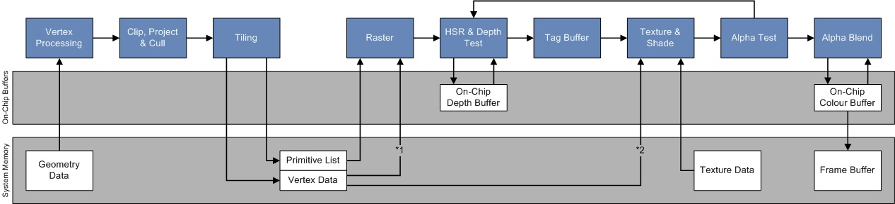
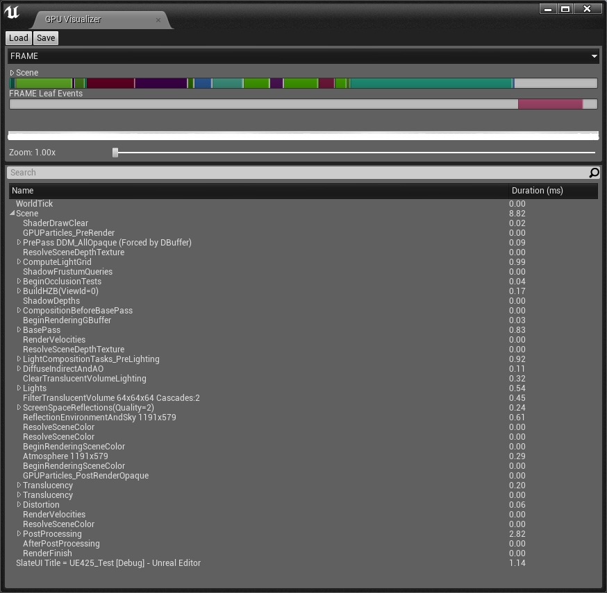

# [剖析虚幻渲染体系（04）- 延迟渲染管线](https://www.cnblogs.com/timlly/p/14732412.html)


目录

- 4.1 本篇概述
  - [4.1.1 本篇概述](https://www.cnblogs.com/timlly/p/14732412.html#411-本篇概述)
  - [4.1.2 基础概念](https://www.cnblogs.com/timlly/p/14732412.html#412-基础概念)
- 4.2 延迟渲染技术
  - [4.2.1 延迟渲染简介](https://www.cnblogs.com/timlly/p/14732412.html#421-延迟渲染简介)
  - [4.2.2 延迟渲染技术](https://www.cnblogs.com/timlly/p/14732412.html#422-延迟渲染技术)
  - 4.2.3 延迟渲染的变种
    - [4.2.3.1 Deferred Lighting(Light Pre-Pass)](https://www.cnblogs.com/timlly/p/14732412.html#4231-deferred-lightinglight-pre-pass)
    - [4.2.3.2 Tiled-Based Deferred Rendering(TBDR)](https://www.cnblogs.com/timlly/p/14732412.html#4232-tiled-based-deferred-renderingtbdr)
    - [4.2.3.3 Clustered Deferred Rendering](https://www.cnblogs.com/timlly/p/14732412.html#4233-clustered-deferred-rendering)
    - [4.2.3.4 Decoupled Deferred Shading](https://www.cnblogs.com/timlly/p/14732412.html#4234-decoupled-deferred-shading)
    - [4.2.3.5 Visibility Buffer](https://www.cnblogs.com/timlly/p/14732412.html#4235-visibility-buffer)
    - [4.2.3.6 Fine Pruned Tiled Light Lists](https://www.cnblogs.com/timlly/p/14732412.html#4236-fine-pruned-tiled-light-lists)
    - [4.2.3.7 Deferred Attribute Interpolation Shading](https://www.cnblogs.com/timlly/p/14732412.html#4237-deferred-attribute-interpolation-shading)
    - [4.2.3.8 Deferred Coarse Pixel Shading](https://www.cnblogs.com/timlly/p/14732412.html#4238-deferred-coarse-pixel-shading)
    - [4.2.3.9 Deferred Adaptive Compute Shading](https://www.cnblogs.com/timlly/p/14732412.html#4239-deferred-adaptive-compute-shading)
  - 4.2.4 前向渲染及其变种
    - [4.2.4.1 前向渲染](https://www.cnblogs.com/timlly/p/14732412.html#4241-前向渲染)
    - [4.2.4.2 前向渲染的变种](https://www.cnblogs.com/timlly/p/14732412.html#4242-前向渲染的变种)
  - 4.2.5 渲染路径总结
    - [4.2.5.1 延迟渲染 vs 前向渲染](https://www.cnblogs.com/timlly/p/14732412.html#4251-延迟渲染-vs-前向渲染)
    - [4.2.5.2 延迟渲染变种的比较](https://www.cnblogs.com/timlly/p/14732412.html#4252-延迟渲染变种的比较)
- 4.3 延迟着色场景渲染器
  - [4.3.1 FSceneRenderer](https://www.cnblogs.com/timlly/p/14732412.html#431-fscenerenderer)
  - [4.3.2 FDeferredShadingSceneRenderer](https://www.cnblogs.com/timlly/p/14732412.html#432-fdeferredshadingscenerenderer)
  - [4.3.3 FScene::UpdateAllPrimitiveSceneInfos](https://www.cnblogs.com/timlly/p/14732412.html#433-fsceneupdateallprimitivesceneinfos)
  - [4.3.4 InitViews](https://www.cnblogs.com/timlly/p/14732412.html#434-initviews)
  - [4.3.5 PrePass](https://www.cnblogs.com/timlly/p/14732412.html#435-prepass)
  - [4.3.6 BasePass](https://www.cnblogs.com/timlly/p/14732412.html#436-basepass)
  - [4.3.7 LightingPass](https://www.cnblogs.com/timlly/p/14732412.html#437-lightingpass)
  - [4.3.8 Translucency](https://www.cnblogs.com/timlly/p/14732412.html#438-translucency)
  - [4.3.9 PostProcessing](https://www.cnblogs.com/timlly/p/14732412.html#439-postprocessing)
- 4.4 本篇总结
  - [4.4.1 延迟渲染总结](https://www.cnblogs.com/timlly/p/14732412.html#441-延迟渲染总结)
  - [4.4.2 延迟渲染的未来](https://www.cnblogs.com/timlly/p/14732412.html#442-延迟渲染的未来)
  - [4.4.3 本篇思考](https://www.cnblogs.com/timlly/p/14732412.html#443-本篇思考)
- [特别说明](https://www.cnblogs.com/timlly/p/14732412.html#特别说明)
- [参考文献](https://www.cnblogs.com/timlly/p/14732412.html#参考文献)


 

 

# **4.1 本篇概述**

## **4.1.1 本篇概述**

本篇主要阐述UE的`FDeferredShadingSceneRenderer`的具体实现过程及涉及的过程。这里涉及了关键的渲染技术：延迟着色（Deferred Shading）。它是和前向渲染有着不同步骤和设计的渲染路径。

在阐述`FDeferredShadingSceneRenderer`之前，会先阐述渲染渲染、前向渲染及它们的变种的技术，以便更好地切入到UE的实现。更具体地说，本篇主要包含以下几点内容：

- 渲染路径（Render Path）
  - 前向渲染及其变种
  - 延迟渲染及其变种
- FDeferredShadingSceneRenderer（延迟着色场景渲染器）
  - InitViews
  - PrePass
  - BasePass
  - LightingPass
  - TranslucentPass
  - Postprocess
- 延迟渲染的优化及未来

## **4.1.2 基础概念**

本篇涉及的部分渲染基础概念及解析如下表：

| 概念                | 缩写    | 中文译名           | 解析                                                         |
| ------------------- | ------- | ------------------ | ------------------------------------------------------------ |
| **Render Target**   | RT      | 渲染目标，渲染纹理 | 一种位于GPU显存的纹理缓冲区，可用作颜色写入和混合的目标。    |
| **Geometry Buffer** | GBuffer | 几何缓冲区         | 一种特殊的Render Target，延迟着色技术的几何数据存储容器。    |
| **Rendering Path**  | -       | 渲染路径           | 将场景物体渲染到渲染纹理的过程中所使用的步骤和技术。         |
| **Forward Shading** | -       | 前向渲染           | 一种普通存在和天然支持的渲染路径，比延迟着色路径更为简单便捷。 |

 

# **4.2 延迟渲染技术**

## **4.2.1 延迟渲染简介**

**延迟渲染（Deferred Rendering, Deferred Shading）**最早由Michael Deering在1988年的论文[The triangle processor and normal vector shader: a VLSI system for high performance graphics](https://dl.acm.org/doi/10.1145/378456.378468)提出，是一种基于屏幕空间着色的技术，也是最普遍的一种**渲染路径（Rendering Path）**技术。与之相类似的是**前向渲染（Forward Shading）**。

它的核心思想是将场景的物体绘制分离成两个Pass：几何Pass和光照Pass，目的是将计算量大的光照Pass延后，和物体数量和光照数量解耦，以提升着色效率。在目前的主流渲染器和商业引擎中，有着广泛且充分的支持。

## **4.2.2 延迟渲染技术**

延迟渲染不同于前向渲染存在两个主要的Pass：几何通道（Geometry Pass, UE称为Base Pass）和光照通道（Lighting Pass），它的渲染过程如下图所示：


*延迟渲染存在两个渲染Pass：第一个是几何通道，将场景的物体信息光栅化到多个GBuffer中；第二个是光照阶段，利用GBuffer的几何信息计算每个像素的光照结果。*

两个通道的各自过程和作用如下：

- **几何通道**

这个阶段将场景中所有的不透明物体（Opaque）和Masked物体用无光照（Unlit）的材质执行渲染，然后将物体的几何信息写入到对应的渲染纹理（Render Target）中。

其中物体的几何信息有：

1、位置（Position，也可以是深度，因为只要有深度和屏幕空间的uv就可以重建出位置）。

2、法线（Normal）。

3、材质参数(Diffuse Color, Emissive Color, Specular Scale, Specular Power, AO, Roughness, Shading Model, ...)。

几何通道的实现伪代码如下：

```c++
void RenderBasePass()
{
    SetupGBuffer(); // 设置几何数据缓冲区。
    
    // 遍历场景的非半透明物体
    for each(Object in OpaqueAndMaskedObjectsInScene)
    {
        SetUnlitMaterial(Object);    // 设置无光照的材质
        DrawObjectToGBuffer(Object); // 渲染Object的几何信息到GBuffer，通常在GPU光栅化中完成。
    }
}
```

经过上述的渲染之后，将获得这些非透明物体的GBuffer信息，如颜色、法线、深度、AO等等（下图）：


*延迟渲染技术在几何通道后获得物体的GBuffer信息，其中左上是位置，右上是法线，左下是颜色（基础色），右下是高光度。*

需要特别注意，几何通道阶段不会执行光照计算，从而摒弃了很多冗余的光照计算逻辑，也就是避免了很多本被遮挡的物体光照计算，避免了过绘制（Overdraw）。

- **光照通道**

在光照阶段，利用几何通道阶段生成的GBuffer数据执行光照计算，它的核心逻辑是遍历渲染分辨率数量相同的像素，根据每个像素的UV坐标从GBuffer采样获取该像素的几何信息，从而执行光照计算。伪代码如下：

```c++
void RenderLightingPass()
{
    BindGBuffer(); // 绑定几何数据缓冲区。
    SetupRenderTarget(); // 设置渲染纹理。
    
    // 遍历RT所有的像素
    for each(pixel in RenderTargetPixels)
    {
        // 获取GBuffer数据。
        pixelData = GetPixelDataFromGBuffer(pixel.uv);
        // 清空累计颜色
        color = 0;    
        // 遍历所有灯光，将每个灯光的光照计算结果累加到颜色中。
        for each(light in Lights)
        {
            color += CalculateLightColor(light, pixelData);
        }
        // 写入颜色到RT。
        WriteColorToRenderTarget(color);
    }
}
```

其中`CalculateLightColor`可以采用Gouraud, Lambert, Phong, Blinn-Phong, BRDF, BTDF, BSSRDF等光照模型。

- **延迟渲染优劣**

由于最耗时的光照计算延迟到后处理阶段，所以跟场景的物体数量解耦，只跟Render Targe尺寸相关，复杂度是O(Nlight×WRT×HRTNlight×WRT×HRT)。所以，延迟渲染在应对复杂的场景和光源数量的场景比较得心应手，往往能得到非常好的性能提升。

但是，也存在一些缺点，如需多一个通道来绘制几何信息，需要多渲染纹理（MRT）的支持，更多的CPU和GPU显存占用，更高的带宽要求，有限的材质呈现类型，难以使用MSAA等硬件抗锯齿，存在画面较糊的情况等等。此外，应对简单场景时，可能反而得不到渲染性能方面的提升。

## **4.2.3 延迟渲染的变种**

延迟渲染可以针对不同的平台和API使用不同的优化改进技术，从而产生了诸多变种。下面是其中部分变种：

### **4.2.3.1 Deferred Lighting(Light Pre-Pass)**

**Deferred Lighting（延迟光照）**又被称为Light Pre-Pass，它和Deferred Shading的不同在于需要三个Pass：

1、第一个Pass叫Geometry Pass：只输出每个像素光照计算所需的几何属性（法线、深度）到GBuffer中。

2、第二个Pass叫Lighting Pass：存储光源属性（如Normal*LightDir、LightColor、Specular）到LBuffer（Light Buffer，光源缓冲区）。


*光源缓冲区存储的光源数据和布局。*

3、第三个Pass叫Secondary Geometry Pass：获取GBuffer和LBuffer的数据，重建每个像素计算光照所需的数据，执行光照计算。

与Deferred Shading相比，Deferred lighting的优势在于G-Buffer所需的尺寸急剧减少，允许更多的材质类型呈现，较好第支持MSAA等。劣势是需要绘制场景两次，增加了Draw Call。

另外，Deferred lighting还有个优化版本，做法与上面所述略有不同，具体参见文献[Light Pre-Pass](https://www.slideshare.net/cagetu/light-prepass)。

### **4.2.3.2 Tiled-Based Deferred Rendering(TBDR)**

**Tiled-Based Deferred Rendering**译名是基于瓦片的渲染，简称**TBDR**，它的核心思想在于将渲染纹理分成规则的一个个四边形（称为Tile），然后利用四边形的包围盒剔除该Tile内无用的光源，只保留有作用的光源列表，从而减少了实际光照计算中的无效光源的计算量。

它的实现示意图及具体的步骤如下：


1、将渲染纹理分成一个个均等面积的小块（Tile）。参见上图(b)。

> Tile没有统一的固定大小，在不同的平台架构和渲染器中有所不同，不过一般是2的N次方，且长宽不一定相等，可以是16x16、32x32、64x64等等，不宜太小或太大，否则优化效果不明显。PowerVR GPU通常取32x32，而ARM Mali GPU取16x16。
>
> 

2、根据Tile内的Depth范围计算出其Bounding Box。


*TBDR中的每个Tile内的深度范围可能不一样，由此可得到不同大小的Bounding Box。*

3、根据Tile的Bounding Box和Light的Bounding Box，执行求交。

> 除了无衰减的方向光，其它类型的光源都可以根据位置和衰减计算得到其Bounding Box。

4、摒弃不相交的Light，得到对Tile有作用的Light列表。参见上图(c)。

5、遍历所有Tile，获取每个Tile的有作业的光源索引列表，计算该Tile内所有像素的光照结果。

由于TBDR可以摒弃很多无作用的光源，能够避免很多无效的光照计算，目前已被广泛采用与移动端GPU架构中，形成了基于硬件加速的TBDR：



*PowerVR的TBDR架构，和立即模式的架构相比，在裁剪之后光栅化之前增加了Tiling阶段，增加了On-Chip Depth Buffer和Color Buffer，以更快地存取深度和颜色。*

下图是PowerVR Rogue家族的Series7XT系列GPU和的硬件架构示意图：


### **4.2.3.3 Clustered Deferred Rendering**

**Clustered Deferred Rendering**是分簇延迟渲染，与TBDR的不同在于对深度进行了更细粒度的划分，从而避免TBDR在深度范围跳变很大（中间无任何有效像素）时产生的光源裁剪效率降低的问题。


*Clustered Deferred Rendering的核心思想是将深度按某种方式细分为若干份，从而更加精确地计算每个簇的包围盒，进而更精准地裁剪光源，避免深度不连续时的光源裁剪效率降低。*

上图的分簇方法被称为**隐式（Implicit）分簇法**，实际上存在**显式（Explicit）分簇法**，可以进一步精确深度细分，以实际的深度范围计算每个族的包围盒：


*显式（Explicit）的深度分簇更加精确地定位到每簇的包围盒。*

下图是Tiled、Implicit、Explicit深度划分法的对比图：


*红色是Tiled分块法，绿色是Implicit分簇法，蓝色是Explicit分簇法。可知，Explicit分簇得到的包围盒更精准，包围盒更小，从而提升光源裁剪效率。*

有了Clustered Deferred大法，妈妈再也不用担心电脑在渲染如下画面时卡顿和掉帧了O_O：


### **4.2.3.4 Decoupled Deferred Shading**

**Decoupled Deferred Shading**（解耦的延迟渲染）是一种优化的延迟渲染技术，由Gabor Liktor等人在论文[Decoupled deferred shading for hardware rasterization](https://cg.ivd.kit.edu/publications/p2012/shadingreuse/shadingreuse_preprint.pdf)中首次提出。它的核心思想是增加compact geometry buffer用以存储着色采样数据（独立于可见性），通过memoization cache（下图），极力压缩计算量，提升随机光栅化（stochastic rasterization）的着色重用率，降低AA的消耗，从而提升着色效率和解决延迟渲染难以使用MSAA的问题。


*上图左：表面上的一点随着时间推移在屏幕上投影点的变化示意图，假设t2-t0足够小，则它们在屏幕的投影点将位于同一点，从而可以重用之前的着色结果。上图右：Decoupled Deferred Shading利用memoization cache缓冲区重用之前着色结果的示意图，将物体的坐标映射到屏幕空间，如果是相同的uv，则直接取memoization cache缓冲区的结果，而不是直接光照。*


*采用Decoupled Deferred Shading的效果一览。上：采用4倍超采样渲染的景深；中：每像素的着色率（SSPP）；下：从摄像机捕捉的场景画面。*

### **4.2.3.5 Visibility Buffer**

**Visibility Buffer**与**Deferred Texturing**非常类似，是Deferred Lighting更加大胆的改进方案，核心思路是：为了减少GBuffer占用（GBuffer占用大意味着带宽大能耗大），不渲染GBuffer，改成渲染Visibility Buffer。Visibility Buffer上只存三角形和实例id，有了这些属性，在计算光照阶段（shading）分别从UAV和bindless texture里面读取真正需要的vertex attributes和贴图的属性，根据uv的差分自行计算mip-map（下图）。


*GBuffer和Visibility Buffer渲染管线对比示意图。后者在由Visiblity阶段取代前者的Gemotry Pass，此阶段只记录三角形和实例id，可将它们压缩进4bytes的Buffer中，从而极大地减少了显存的占用。*

此方法虽然可以减少对Buffer的占用，但需要bindless texture的支持，对GPU Cache并不友好（相邻像素的三角形和实例id跳变大，降低Cache的空间局部性）

### **4.2.3.6 Fine Pruned Tiled Light Lists**

**Fine Pruned Tiled Light Lists**是一种优化的Tiled Shading，它和传统瓦片渲染不一样的是，有两个pass来计算物体和光源的求交：

第一个Pass计算光源在屏幕空间的AABB，进而和物体的AABB进行粗略判断；

第二个Pass逐Tile和光源的真实形状（而非AABB）进行精确求交。


*Fine Pruned Tiled Light Lists裁剪示意图。上图是粗略裁剪的结果，下图是精确裁剪的结果。由此可见，粗略裁剪的数量普遍多于精确裁剪，但其速度快；精确裁剪在此基础上执行更准确的求交，从而进一步摒弃不相交的光源，减少了大量的光源数量，避免进入着色计算。*

这种可以实现不规则光源的Tiled Shading，而且可以利用Compute Shader实现。已应用于主机游戏《古墓丽影·崛起》中。

### **4.2.3.7 Deferred Attribute Interpolation Shading**

与Visibility Buffer类似，**Deferred Attribute Interpolation Shading**也是解决传统GBuffer内存太高的问题。它给出了一种方法，不保存GBuffer信息，而是保存三角形信息，再通过插值进行计算，降低Deferred的内存消耗。这种方法也可以使用Visibility Buffer剔除冗余的三角形信息，进一步降低显存的占用。


*Deferred Attribute Interpolation Shading算法示意图。第一个Pass，生成Visibility Buffer；第二个Pass，采用Visibility，保证所有像素都只有一个三角形的信息写入memoization cache，其中memoization cache是记录三角形id和实际地址的映射缓冲区；最后的Pass会计算每个三角形的屏幕空间的偏导数，以供属性插值使用。*

这种方法还可以把GI等低频光照单独计算以降低着色消耗，也可以良好启用MSAA。

### **4.2.3.8 Deferred Coarse Pixel Shading**

**Deferred Coarse Pixel Shading**的提出是为了解决传统延迟渲染在屏幕空间的光照计算阶段的高消耗问题，在生成GBuffer时，额外生成ddx和ddy，再利用Compute Shader对某个大小的分块找到变化不明显的区域，使用低频着色（几个像素共用一次计算，跟可变速率着色相似），从而提升着色效率，降低消耗。


*Deferred Coarse Pixel Shading在Compute Shader渲染机制示意图。关键步骤在于计算出ddx和ddy找到变化低的像素，降低着色频率，提高复用率。*

采用这种方法渲染后，在渲染如下两个场景时，性能均得到较大的提升。


*利用Deferred Coarse Pixel Shading渲染的两个场景。左边是Power Plant，右边是Sponza。*

具体的数据如下表：


*Power Plant场景可以节省50%-60%，Sponza场景则处于25%-37%之间。*

这种方法同样适用于屏幕空间的后处理。

### **4.2.3.9 Deferred Adaptive Compute Shading**

**Deferred Adaptive Compute Shading**的核心思想在于将屏幕像素按照某种方式划分为5个Level的不同粒度的像素块，以便决定是直接从相邻Level插值还是重新着色。


*Deferred Adaptive Compute Shading的5个层级及它们的插值示意图。对于每个层级新增加的像素（黄色所示），通过考虑上一级的周边像素，估算它们的frame buffer和GBuffer的局部方差（local variance），以便决定是从相邻像素插值还是直接着色。*

它的算法过程如下：

- 第1个Level，渲染1/16（因为取了4x4的分块）的像素。
- 遍历第2~5个Level，逐Level按照下面的步骤着色：
  - 计算上一个Level相邻4个像素的相似度（Similarity Criterion）。
  - 若Similarity Criterion小于某个阈值，认为此像素和周边像素足够相似，当前像素的结果直接插值获得。
  - 若否，说明此像素和周边像素差异过大，开启着色计算。

此法在渲染UE4的不同场景时，在均方误差（RMSE）、峰值信噪比（PSNR）、平均结构相似性（MSSIM）都能获得良好的指标。（下图）


*渲染UE4的一些场景时，DACS方法在不同的着色率下都可获得良好的图像渲染指标。*


*渲染同一场景和画面时，对比Checkerboard（棋盘）着色方法，相同时间内，DACS的均方误差（RMSE）只是前者的21.5%，相同图像质量（MSSIM）下，DACS的时间快了4.22倍。*

## **4.2.4 前向渲染及其变种**

### **4.2.4.1 前向渲染**

**前向渲染（Forward Shading）**是最简单也最广泛支持的一种渲染技术，它的实现思想是遍历场景的所有物体，每个物体调用一次绘制质量，经由渲染管线光栅化后写入渲染纹理上，实现伪代码如下：

```c++
// 遍历RT所有的像素
for each(object in ObjectsInScene)
{
    color = 0;
    // 遍历所有灯光，将每个灯光的光照计算结果累加到颜色中。
    for each(light in Lights)
    {
        color += CalculateLightColor(light, object);
    }
    // 写入颜色到RT。
    WriteColorToRenderTarget(color);
}
```

渲染过程示意图如下：


它的时间复杂度是O(g⋅f⋅l)O(g⋅f⋅l)，其中：

- gg表示场景的物体数量。
- ff表示着色的片元数量。
- ll表示场景的光源数量。

这种简单的技术从出现GPU起，就天然受硬件的支持，有着非常广泛的应用。它的优点是实现简单，无需多个Pass渲染，无需MRT的支持，而且完美地开启MSAA抗锯齿。

当然它也有缺点，无法支撑大型复杂附带大量光源的场景渲染，冗余计算多，过绘制严重。

### **4.2.4.2 前向渲染的变种**

- **Forward+ Rendering**

**Forward+**也被称为**Tiled Forward Rendering**，为了提升前向渲染光源的数量，它增加了光源剔除阶段，有3个Pass：depth prepass，light culling pass，shading pass。

light culling pass和瓦片的延迟渲染类似，将屏幕划分成若干个Tile，将每个Tile和光源求交，有效的光源写入到Tile的光源列表，以减少shading阶段的光源数量。


Forward+存在由于街头锥体拉长后在几何边界产生误报（False positives，可以通过separating axis theorem (SAT)改善）的情况。

- **Cluster Forward Rendering**

**Cluster Forward Rendering**和Cluster Deferred Rendering类似，将屏幕空间划分成均等Tile，深度细分成一个个簇，进而更加细粒度地裁剪光源。算法类似，这里就不累述了。

- **Volume Tiled Forward Rendering**

**Volume Tiled Forward Rendering**在Tiled和Clusterer的前向渲染基础上扩展的一种技术，旨在提升场景的光源支持数量，论文作者认为可以达到400万个光源的场景以30FPS实时渲染。

它由以下步骤组成：

1、初始化阶段：

1.1 计算Grid（Volume Tile）的尺寸。给定Tile尺寸(tx,ty)(tx,ty)和屏幕分辨率(w,h)(w,h)，可以算出屏幕的细分数量(Sx,Sy)(Sx,Sy)：


(Sx,Sy)=(∣∣∣wtx∣∣∣, ∣∣∣hty∣∣∣)(Sx,Sy)=(|wtx|, |hty|)


深度方向的细分数量为：


SZ=∣∣∣log(Zfar/Znear)log(1+2tanθSy)∣∣∣SZ=|log⁡(Zfar/Znear)log⁡(1+2tan⁡θSy)|


1.2 计算每个Volume Tile的AABB。结合下图，每个Tile的AABB边界计算如下：


knearkfarpminpmax====Znear(1+2tan(θ)Sy)kZnear(1+2tan(θ)Sy)k+1(Sx⋅i, Sy⋅j)(Sx⋅(i+1), Sy⋅(j+1))knear=Znear(1+2tan⁡(θ)Sy)kkfar=Znear(1+2tan⁡(θ)Sy)k+1pmin=(Sx⋅i, Sy⋅j)pmax=(Sx⋅(i+1), Sy⋅(j+1))


2、更新阶段：

2.1 深度Pre-pass。只记录非半透明物体的深度。

2.2 标记激活的Tile。

2.3 创建和压缩Tile列表。

2.4 将光源赋给Tile。每个线程组执行一个激活的Volume Tile，利用Tile的AABB和场景中所有的光源求交（可用BVH减少求交次数），将相交的光源索引记录到对应Tile的光源列表（每个Tile的光源数据是光源列表的起始位置和光源的数量）：


2.5 着色。此阶段与前述方法无特别差异。

基于体素分块的渲染虽然能够满足海量光源的渲染，但也存在Draw Call数量攀升和自相似体素瓦片（Self-Similar Volume Tiles，离摄像机近的体素很小而远的又相当大）的问题。

## **4.2.5 渲染路径总结**

### **4.2.5.1 延迟渲染 vs 前向渲染**

延迟渲染和前向渲染的比较见下表：

|                  | 前向渲染                             | 延迟渲染                                              |
| ---------------- | ------------------------------------ | ----------------------------------------------------- |
| **场景复杂度**   | 简单                                 | 复杂                                                  |
| **光源支持数量** | 少                                   | 多                                                    |
| **时间复杂度**   | O(g⋅f⋅l)O(g⋅f⋅l)                     | O(f⋅l)O(f⋅l)                                          |
| **抗锯齿**       | MSAA, FXAA, SMAA                     | TAA, SMAA                                             |
| **显存和带宽**   | 较低                                 | 较高                                                  |
| **Pass数量**     | 少                                   | 多                                                    |
| **MRT**          | 无要求                               | 要求                                                  |
| **过绘制**       | 严重                                 | 良好避免                                              |
| **材质类型**     | 多                                   | 少                                                    |
| **画质**         | 清晰，抗锯齿效果好                   | 模糊，抗锯齿效果打折扣                                |
| **透明物体**     | 不透明物体、Masked物体、半透明物体   | 不透明物体、Masked物体，**不**支持半透明物体          |
| **屏幕分辨率**   | 低                                   | 高                                                    |
| **硬件要求**     | 低，几乎覆盖100%的硬件设备           | 较高，需MRT的支持，需要Shader Model 3.0+              |
| **实现复杂度**   | 低                                   | 高                                                    |
| **后处理**       | 无法支持需要法线和深度等信息的后处理 | 支持需要法线和深度等信息的后处理，如SSAO、SSR、SSGI等 |

这里补充以下几点说明：

- 延迟渲染之所以不支持MSAA，是因为带MSAA的RT在执行光照前需要Resolve（将MSAA的RT按权重算出最终的颜色），当然也可以不Resolve直接进入着色，但这样会导致显存和带宽的暴增。

- 延迟渲染的画面之所以比前向渲染模糊，是因为经历了两次光栅化：几何通道和光照通道，相当于执行了两次离散化，造成了两次信号的丢失，对后续的重建造成影响，以致最终画面的方差扩大。再加上延迟渲染会采纳TAA作为抗锯齿技术，TAA的核心思想是将空间采样转换成时间采样，而时间的采样往往不太准，带有各种小问题，再一次扩大了画面的方差，由此可能产生鬼影、摩尔纹、闪烁、灰蒙蒙的画面。这也是为什么采用默认开启了延迟渲染的UE做出的游戏画面会多少有一点不通透的感觉。

  > 画质模糊问题可以通过一些后处理（高反差保留、色调映射）和针对性的AA技术（SMAA、SSAA、DLSS）来缓解，但无论如何都难以用同等的消耗达到前向渲染的画质效果。

- 延迟渲染不支持半透明物体，所以往往在最后阶段还需要增加前向渲染步骤来专门渲染半透明物体。

- 现阶段(2021上半年)，延迟渲染是PC电脑和主机设备的首先渲染技术，而前向渲染是移动设备的首选渲染技术。随着时间的推移和硬件的发展，相信延迟渲染很快会被推广到移动平台。

- 对于材质呈现类型，延迟渲染可以将不同的着色模型作为几何数据写入GBuffer，以扩充材质和光照着色类型，但一样受限于GBuffer的带宽，若取1 byte，则可以支持256种材质着色类型。

  > UE用了4 bit来存储Shading Model ID，最多只能支持16种着色模型。笔者曾尝试扩展UE的着色类型，发现其它4 bit被占用了，除非额外开辟一张GBuffer来存储。但是，为了更多材质类型而多一张GBuffer完全不划算。

- 关于延迟渲染的MSAA，有些论文([Multisample anti-aliasing in deferred rendering](https://diglib.eg.org/bitstream/handle/10.2312/egs20201008/021-024.pdf?sequence=1&isAllowed=y), [Optimizing multisample anti-aliasing for deferred renderers](https://cescg.org/wp-content/uploads/2020/03/Fridvalszky-Optimizing-multisample-anti-aliasing-for-deferred-renderers-1.pdf))阐述了在延迟渲染管线下如何支持MSAA、采样策略、数据结构和带宽优化。

  

  *Multisample anti-aliasing in deferred rendering提出的延迟渲染下MSAA的算法示意图。它的核心思想在于Geometry Pass除了存储标准的GBuffer，还额外增加了GBuffer对应的扩展数据，这些扩展数据仅仅包含了需要多采样像素的MSAA数据，以供Lighting Pass着色时使用。这样既能满足MSAA的要求，又可以降低GBuffer的占用。*

### **4.2.5.2 延迟渲染变种的比较**

本小节主要对延迟渲染及其常见的变种进行比较，见下表：

|                | Deferred           | Tiled Deferred                   | Clustered Deferred                                 |
| -------------- | ------------------ | -------------------------------- | -------------------------------------------------- |
| **光源数量**   | 略多               | 多                               | 很多                                               |
| **带宽消耗**   | 很高               | 高                               | 略高                                               |
| **分块方式**   | 无                 | 屏幕空间                         | 屏幕空间+深度                                      |
| **实现复杂度** | 略高               | 高                               | 很高                                               |
| **适用场景**   | 物体多光源多的场景 | 物体多局部光源多彼此不交叠的场景 | 物体多局部光源多彼此不交叠且视图空间距离较远的场景 |

 

# **4.3 延迟着色场景渲染器**

## **4.3.1 FSceneRenderer**

`FSceneRenderer`是UE场景渲染器父类，是UE渲染体系的大脑和发动机，在整个渲染体系拥有举足轻重的位置，主要用于处理和渲染场景，生成RHI层的渲染指令。它的部分定义和解析如下：

```c++
// Engine\Source\Runtime\Renderer\Private\SceneRendering.h

// 场景渲染器
class FSceneRenderer
{
public:
    FScene* Scene; // 被渲染的场景
    FSceneViewFamily ViewFamily; // 被渲染的场景视图族（保存了需要渲染的所有view）。
    TArray<FViewInfo> Views; // 需要被渲染的view实例。

    FMeshElementCollector MeshCollector; // 网格收集器
    FMeshElementCollector RayTracingCollector; // 光追网格收集器

    // 可见光源信息
    TArray<FVisibleLightInfo,SceneRenderingAllocator> VisibleLightInfos;

    // 阴影相关的数据
    TArray<FParallelMeshDrawCommandPass*, SceneRenderingAllocator> DispatchedShadowDepthPasses;
    FSortedShadowMaps SortedShadowsForShadowDepthPass;

    // 特殊标记
    bool bHasRequestedToggleFreeze;
    bool bUsedPrecomputedVisibility;

    // 使用全场景阴影的点光源列表（可通过r.SupportPointLightWholeSceneShadows开关）
    TArray<FName, SceneRenderingAllocator> UsedWholeScenePointLightNames;

    // 平台Level信息
    ERHIFeatureLevel::Type FeatureLevel;
    EShaderPlatform ShaderPlatform;
    
    (......)

public:
    FSceneRenderer(const FSceneViewFamily* InViewFamily,FHitProxyConsumer* HitProxyConsumer);
    virtual ~FSceneRenderer();

    // FSceneRenderer接口（注意部分是空实现体和抽象接口）

    // 渲染入口
    virtual void Render(FRHICommandListImmediate& RHICmdList) = 0;
    virtual void RenderHitProxies(FRHICommandListImmediate& RHICmdList) {}

    // 场景渲染器实例
    static FSceneRenderer* CreateSceneRenderer(const FSceneViewFamily* InViewFamily, FHitProxyConsumer* HitProxyConsumer);
    void PrepareViewRectsForRendering();

#if WITH_MGPU // 多GPU支持
    void ComputeViewGPUMasks(FRHIGPUMask RenderTargetGPUMask);
#endif

    // 更新每个view所在的渲染纹理的结果
    void DoCrossGPUTransfers(FRHICommandListImmediate& RHICmdList, FRHIGPUMask RenderTargetGPUMask);

    // 遮挡查询接口和数据
    bool DoOcclusionQueries(ERHIFeatureLevel::Type InFeatureLevel) const;
    void BeginOcclusionTests(FRHICommandListImmediate& RHICmdList, bool bRenderQueries);
    static FGraphEventRef OcclusionSubmittedFence[FOcclusionQueryHelpers::MaxBufferedOcclusionFrames];
    void FenceOcclusionTests(FRHICommandListImmediate& RHICmdList);
    void WaitOcclusionTests(FRHICommandListImmediate& RHICmdList);
    bool ShouldDumpMeshDrawCommandInstancingStats() const { return bDumpMeshDrawCommandInstancingStats; }
    
    static FGlobalBoundShaderState OcclusionTestBoundShaderState;
    static bool ShouldCompositeEditorPrimitives(const FViewInfo& View);

    // 等待场景渲染器执行完成和清理工作以及最终删除
    static void WaitForTasksClearSnapshotsAndDeleteSceneRenderer(FRHICommandListImmediate& RHICmdList, FSceneRenderer* SceneRenderer, bool bWaitForTasks = true);
    static void DelayWaitForTasksClearSnapshotsAndDeleteSceneRenderer(FRHICommandListImmediate& RHICmdList, FSceneRenderer* SceneRenderer);
    
    // 其它接口
    static FIntPoint ApplyResolutionFraction(...);
    static FIntPoint QuantizeViewRectMin(const FIntPoint& ViewRectMin);
    static FIntPoint GetDesiredInternalBufferSize(const FSceneViewFamily& ViewFamily);
    static ISceneViewFamilyScreenPercentage* ForkScreenPercentageInterface(...);
    
    static int32 GetRefractionQuality(const FSceneViewFamily& ViewFamily);
    
protected:
    (......)

#if WITH_MGPU // 多GPU支持
    FRHIGPUMask AllViewsGPUMask;
    FRHIGPUMask GetGPUMaskForShadow(FProjectedShadowInfo* ProjectedShadowInfo) const;
#endif

    // ----可在所有渲染器共享的接口----
    
    // --渲染流程和MeshPass相关接口--
    void OnStartRender(FRHICommandListImmediate& RHICmdList);
    void RenderFinish(FRHICommandListImmediate& RHICmdList);
    void SetupMeshPass(FViewInfo& View, FExclusiveDepthStencil::Type BasePassDepthStencilAccess, FViewCommands& ViewCommands);
    void GatherDynamicMeshElements(...);
    void RenderDistortion(FRHICommandListImmediate& RHICmdList);
    void InitFogConstants();
    bool ShouldRenderTranslucency(ETranslucencyPass::Type TranslucencyPass) const;
    void RenderCustomDepthPassAtLocation(FRHICommandListImmediate& RHICmdList, int32 Location);
    void RenderCustomDepthPass(FRHICommandListImmediate& RHICmdList);
    void RenderPlanarReflection(class FPlanarReflectionSceneProxy* ReflectionSceneProxy);
    void InitSkyAtmosphereForViews(FRHICommandListImmediate& RHICmdList);
    void RenderSkyAtmosphereLookUpTables(FRHICommandListImmediate& RHICmdList);
    void RenderSkyAtmosphere(FRHICommandListImmediate& RHICmdList);
    void RenderSkyAtmosphereEditorNotifications(FRHICommandListImmediate& RHICmdList);
    
    // ---阴影相关接口---
    void InitDynamicShadows(FRHICommandListImmediate& RHICmdList, FGlobalDynamicIndexBuffer& DynamicIndexBuffer, FGlobalDynamicVertexBuffer& DynamicVertexBuffer, FGlobalDynamicReadBuffer& DynamicReadBuffer);
    bool RenderShadowProjections(FRHICommandListImmediate& RHICmdList, const FLightSceneInfo* LightSceneInfo, IPooledRenderTarget* ScreenShadowMaskTexture, IPooledRenderTarget* ScreenShadowMaskSubPixelTexture, bool bProjectingForForwardShading, bool bMobileModulatedProjections, const struct FHairStrandsVisibilityViews* InHairVisibilityViews);
    TRefCountPtr<FProjectedShadowInfo> GetCachedPreshadow(...);
    void CreatePerObjectProjectedShadow(...);
    void SetupInteractionShadows(...);
    void AddViewDependentWholeSceneShadowsForView(...);
    void AllocateShadowDepthTargets(FRHICommandListImmediate& RHICmdList);
    void AllocatePerObjectShadowDepthTargets(FRHICommandListImmediate& RHICmdList, ...);
    void AllocateCachedSpotlightShadowDepthTargets(FRHICommandListImmediate& RHICmdList, ...);
    void AllocateCSMDepthTargets(FRHICommandListImmediate& RHICmdList, ...);
    void AllocateRSMDepthTargets(FRHICommandListImmediate& RHICmdList, ...);
    void AllocateOnePassPointLightDepthTargets(FRHICommandListImmediate& RHICmdList, ...);
    void AllocateTranslucentShadowDepthTargets(FRHICommandListImmediate& RHICmdList, ...);
    bool CheckForProjectedShadows(const FLightSceneInfo* LightSceneInfo) const;
    void GatherShadowPrimitives(...);
    void RenderShadowDepthMaps(FRHICommandListImmediate& RHICmdList);
    void RenderShadowDepthMapAtlases(FRHICommandListImmediate& RHICmdList);
    void CreateWholeSceneProjectedShadow(FLightSceneInfo* LightSceneInfo, ...);
    void UpdatePreshadowCache(FSceneRenderTargets& SceneContext);
    void InitProjectedShadowVisibility(FRHICommandListImmediate& RHICmdList);    
    void GatherShadowDynamicMeshElements(FGlobalDynamicIndexBuffer& DynamicIndexBuffer, FGlobalDynamicVertexBuffer& DynamicVertexBuffer, FGlobalDynamicReadBuffer& DynamicReadBuffer);
    
    // --光源接口--
    static void GetLightNameForDrawEvent(const FLightSceneProxy* LightProxy, FString& LightNameWithLevel);
    static void GatherSimpleLights(const FSceneViewFamily& ViewFamily, ...);
    static void SplitSimpleLightsByView(const FSceneViewFamily& ViewFamily, ...);

    // --可见性接口--
    void PreVisibilityFrameSetup(FRHICommandListImmediate& RHICmdList);
    void ComputeViewVisibility(FRHICommandListImmediate& RHICmdList, ...);
    void PostVisibilityFrameSetup(FILCUpdatePrimTaskData& OutILCTaskData);
    
    // --其它接口--
    void GammaCorrectToViewportRenderTarget(FRHICommandList& RHICmdList, const FViewInfo* View, float OverrideGamma);
    FRHITexture* GetMultiViewSceneColor(const FSceneRenderTargets& SceneContext) const;
    void UpdatePrimitiveIndirectLightingCacheBuffers();
    bool ShouldRenderSkyAtmosphereEditorNotifications();
    void ResolveSceneColor(FRHICommandList& RHICmdList);

    (......)
};
```

`FSceneRenderer`由游戏线程的`FRendererModule::BeginRenderingViewFamily`负责创建和初始化，然后传递给渲染线程。渲染线程会调用`FSceneRenderer::Render()`，渲染完返回后，会删除`FSceneRenderer`的实例。也就是说，`FSceneRenderer`会被每帧创建和销毁。具体流程的示意代码如下：

```c++
void UGameEngine::Tick( float DeltaSeconds, bool bIdleMode )
{
    UGameEngine::RedrawViewports()
    {
        void FViewport::Draw( bool bShouldPresent)
        {
            void UGameViewportClient::Draw()
            {
                // 计算ViewFamily、View的各种属性
                ULocalPlayer::CalcSceneView();
                // 发送渲染命令
                FRendererModule::BeginRenderingViewFamily(..., FSceneViewFamily* ViewFamily)
                {
                    FScene* const Scene = ViewFamily->Scene->GetRenderScene();
                    
                    World->SendAllEndOfFrameUpdates();
                    // 创建场景渲染器
                    FSceneRenderer* SceneRenderer = FSceneRenderer::CreateSceneRenderer(ViewFamily, ...);
                    // 向渲染线程发送绘制场景指令.
                    ENQUEUE_RENDER_COMMAND(FDrawSceneCommand)(
                    [SceneRenderer](FRHICommandListImmediate& RHICmdList)
                    {
                        RenderViewFamily_RenderThread(RHICmdList, SceneRenderer)
                        {
                            (......)
                            // 调用场景渲染器的绘制接口.
                            SceneRenderer->Render(RHICmdList);
                            (......)
                            // 等待SceneRenderer的任务完成然后清理并删除实例。
                            FSceneRenderer::WaitForTasksClearSnapshotsAndDeleteSceneRenderer(RHICmdList, SceneRenderer)
                            {
                                // 在删除实例前等待渲染任务完成。
                                RHICmdList.ImmediateFlush(EImmediateFlushType::WaitForOutstandingTasksOnly);
                                // 等待所有阴影Pass完成。
                                for (int32 PassIndex = 0; PassIndex < SceneRenderer->DispatchedShadowDepthPasses.Num(); ++PassIndex)
                                {
                                    SceneRenderer->DispatchedShadowDepthPasses[PassIndex]->WaitForTasksAndEmpty();
                                }
                                (......)
                                // 删除SceneRenderer实例。
                                delete SceneRenderer;
                                (......)
                            }
                        }
                        FlushPendingDeleteRHIResources_RenderThread();
                    });
                }
}}}}
```

`FSceneRenderer`拥有两个子类：`FMobileSceneRenderer`和`FDeferredShadingSceneRenderer`。

`FMobileSceneRenderer`是用于移动平台的场景渲染器，默认采用了前向渲染的流程。

`FDeferredShadingSceneRenderer`虽然名字叫做延迟着色场景渲染器，但其实集成了包含前向渲染和延迟渲染的两种渲染路径，是PC和主机平台的默认场景渲染器（笔者刚接触伊始也被这蜜汁取名迷惑过）。

**后面章节将以`FDeferredShadingSceneRenderer`的延迟渲染路径为重点，阐述UE的延迟渲染管线的流程和机制。**

## **4.3.2 FDeferredShadingSceneRenderer**

FDeferredShadingSceneRenderer是UE在PC和主机平台的场景渲染器，实现了延迟渲染路径的逻辑，它的部分定义和声明如下：

```c++
// Engine\Source\Runtime\Renderer\Private\DeferredShadingRenderer.h

class FDeferredShadingSceneRenderer : public FSceneRenderer
{
public:
    // EarlyZ相关
    EDepthDrawingMode EarlyZPassMode;
    bool bEarlyZPassMovable;
    bool bDitheredLODTransitionsUseStencil;
    int32 StencilLODMode = 0;
    
    FComputeFenceRHIRef TranslucencyLightingVolumeClearEndFence;

    // 构造函数
    FDeferredShadingSceneRenderer(const FSceneViewFamily* InViewFamily,FHitProxyConsumer* HitProxyConsumer);

    // 清理接口
    void ClearView(FRHICommandListImmediate& RHICmdList);
    void ClearGBufferAtMaxZ(FRHICommandList& RHICmdList);
    void ClearLPVs(FRHICommandListImmediate& RHICmdList);
    void UpdateLPVs(FRHICommandListImmediate& RHICmdList);

    // PrePass相关接口
    bool RenderPrePass(FRHICommandListImmediate& RHICmdList, TFunctionRef<void()> AfterTasksAreStarted);
    bool RenderPrePassHMD(FRHICommandListImmediate& RHICmdList);
    void RenderPrePassView(FRHICommandList& RHICmdList, ...);
    bool RenderPrePassViewParallel(const FViewInfo& View, ...);
    void PreRenderDitherFill(FRHIAsyncComputeCommandListImmediate& RHICmdList, ...);
    void PreRenderDitherFill(FRHICommandListImmediate& RHICmdList, ...);
    void RenderPrePassEditorPrimitives(FRHICommandList& RHICmdList, ...);

    // basepass接口
    bool RenderBasePass(FRHICommandListImmediate& RHICmdList, ...);
    void RenderBasePassViewParallel(FViewInfo& View, ...);
    bool RenderBasePassView(FRHICommandListImmediate& RHICmdList, ...);
    
    // skypass接口
    void RenderSkyPassViewParallel(FRHICommandListImmediate& ParentCmdList, ...);
    bool RenderSkyPassView(FRHICommandListImmediate& RHICmdList, ...);

    (......)

    // GBuffer & Texture
    void CopySingleLayerWaterTextures(FRHICommandListImmediate& RHICmdList, ...);
    static void BeginRenderingWaterGBuffer(FRHICommandList& RHICmdList, ...);
    void FinishWaterGBufferPassAndResolve(FRHICommandListImmediate& RHICmdList, ...);
    
    // 水体渲染
    bool RenderSingleLayerWaterPass(FRHICommandListImmediate& RHICmdList, ...);
    bool RenderSingleLayerWaterPassView(FRHICommandListImmediate& RHICmdList, ...);
    void RenderSingleLayerWaterReflections(FRHICommandListImmediate& RHICmdList, ...);

    // 渲染流程相关
    // 渲染主入口
    virtual void Render(FRHICommandListImmediate& RHICmdList) override;
    void RenderFinish(FRHICommandListImmediate& RHICmdList);
    
    // 其它渲染接口
    bool RenderHzb(FRHICommandListImmediate& RHICmdList);
    void RenderOcclusion(FRHICommandListImmediate& RHICmdList);
    void FinishOcclusion(FRHICommandListImmediate& RHICmdList);
    virtual void RenderHitProxies(FRHICommandListImmediate& RHICmdList) override;

private:
    // 静态数据（用于各种pass的初始化）
    static FGraphEventRef TranslucencyTimestampQuerySubmittedFence[FOcclusionQueryHelpers::MaxBufferedOcclusionFrames + 1];
    static FGlobalDynamicIndexBuffer DynamicIndexBufferForInitViews;
    static FGlobalDynamicIndexBuffer DynamicIndexBufferForInitShadows;
    static FGlobalDynamicVertexBuffer DynamicVertexBufferForInitViews;
    static FGlobalDynamicVertexBuffer DynamicVertexBufferForInitShadows;
    static TGlobalResource<FGlobalDynamicReadBuffer> DynamicReadBufferForInitViews;
    static TGlobalResource<FGlobalDynamicReadBuffer> DynamicReadBufferForInitShadows;

    // 可见性接口
    void PreVisibilityFrameSetup(FRHICommandListImmediate& RHICmdList);

    // 初始化view数据
    bool InitViews(FRHICommandListImmediate& RHICmdList, ...);
    void InitViewsPossiblyAfterPrepass(FRHICommandListImmediate& RHICmdList, ...);

    void SetupSceneReflectionCaptureBuffer(FRHICommandListImmediate& RHICmdList);
    void UpdateTranslucencyTimersAndSeparateTranslucencyBufferSize(FRHICommandListImmediate& RHICmdList);
    void CreateIndirectCapsuleShadows();

    // 渲染雾
    bool RenderFog(FRHICommandListImmediate& RHICmdList, ...);
    void RenderViewFog(FRHICommandList& RHICmdList, const FViewInfo& View, ...);

    // 大气、天空、非直接光、距离场、环境光
    void RenderAtmosphere(FRHICommandListImmediate& RHICmdList, ...);
    void RenderDebugSkyAtmosphere(FRHICommandListImmediate& RHICmdList);
    void RenderDiffuseIndirectAndAmbientOcclusion(FRHICommandListImmediate& RHICmdList);
    void RenderDeferredReflectionsAndSkyLighting(FRHICommandListImmediate& RHICmdList, ...);
    void RenderDeferredReflectionsAndSkyLightingHair(FRHICommandListImmediate& RHICmdList, ...);
    void RenderDFAOAsIndirectShadowing(FRHICommandListImmediate& RHICmdList,...);
    bool RenderDistanceFieldLighting(FRHICommandListImmediate& RHICmdList,...);
    void RenderDistanceFieldAOScreenGrid(FRHICommandListImmediate& RHICmdList, ...);
    void RenderMeshDistanceFieldVisualization(FRHICommandListImmediate& RHICmdList, ...);

    // ----Tiled光源接口----
    // 计算Tile模式下的Tile数据，以裁剪对Tile无作用的光源。只可用在forward shading、clustered deferred shading和启用Surface lighting的透明模式。
    void ComputeLightGrid(FRHICommandListImmediate& RHICmdList, ...);
    bool CanUseTiledDeferred() const;
    bool ShouldUseTiledDeferred(int32 NumTiledDeferredLights) const;
    bool ShouldUseClusteredDeferredShading() const;
    bool AreClusteredLightsInLightGrid() const;
    void AddClusteredDeferredShadingPass(FRHICommandListImmediate& RHICmdList, ...);
    void RenderTiledDeferredLighting(FRHICommandListImmediate& RHICmdList, const TArray<FSortedLightSceneInfo, SceneRenderingAllocator>& SortedLights, ...);
    void GatherAndSortLights(FSortedLightSetSceneInfo& OutSortedLights);
    void RenderLights(FRHICommandListImmediate& RHICmdList, ...);
    void RenderLightArrayForOverlapViewmode(FRHICommandListImmediate& RHICmdList, ...);
    void RenderStationaryLightOverlap(FRHICommandListImmediate& RHICmdList);

    // ----渲染光源（直接光、间接光、环境光、静态光、体积光）----
    void RenderLight(FRHICommandList& RHICmdList, ...);
    void RenderLightsForHair(FRHICommandListImmediate& RHICmdList, ...);
    void RenderLightForHair(FRHICommandList& RHICmdList, ...);
    void RenderSimpleLightsStandardDeferred(FRHICommandListImmediate& RHICmdList, ...);
    void ClearTranslucentVolumeLighting(FRHICommandListImmediate& RHICmdListViewIndex, ...);
    void InjectAmbientCubemapTranslucentVolumeLighting(FRHICommandList& RHICmdList, ...);
    void ClearTranslucentVolumePerObjectShadowing(FRHICommandList& RHICmdList, const int32 ViewIndex);
    void AccumulateTranslucentVolumeObjectShadowing(FRHICommandList& RHICmdList, ...);
    void InjectTranslucentVolumeLighting(FRHICommandListImmediate& RHICmdList, ...);
    void InjectTranslucentVolumeLightingArray(FRHICommandListImmediate& RHICmdList, ...);
    void InjectSimpleTranslucentVolumeLightingArray(FRHICommandListImmediate& RHICmdList, ...);
    void FilterTranslucentVolumeLighting(FRHICommandListImmediate& RHICmdList, ...);
    
    // Light Function
    bool RenderLightFunction(FRHICommandListImmediate& RHICmdList, ...);
    bool RenderPreviewShadowsIndicator(FRHICommandListImmediate& RHICmdList, ...);
    bool RenderLightFunctionForMaterial(FRHICommandListImmediate& RHICmdList, ...);
    
    // 透明pass
    void RenderViewTranslucency(FRHICommandListImmediate& RHICmdList, ...);
    void RenderViewTranslucencyParallel(FRHICommandListImmediate& RHICmdList, ...);
    void BeginTimingSeparateTranslucencyPass(FRHICommandListImmediate& RHICmdList, const FViewInfo& View);
    void EndTimingSeparateTranslucencyPass(FRHICommandListImmediate& RHICmdList, const FViewInfo& View);
    void BeginTimingSeparateTranslucencyModulatePass(FRHICommandListImmediate& RHICmdList, ...);
    void EndTimingSeparateTranslucencyModulatePass(FRHICommandListImmediate& RHICmdList, ...);
    void SetupDownsampledTranslucencyViewParameters(FRHICommandListImmediate& RHICmdList, ...);
    void ConditionalResolveSceneColorForTranslucentMaterials(FRHICommandListImmediate& RHICmdList, ...);
    void RenderTranslucency(FRHICommandListImmediate& RHICmdList, bool bDrawUnderwaterViews = false);
    void RenderTranslucencyInner(FRHICommandListImmediate& RHICmdList, ...);

    // 光束
    void RenderLightShaftOcclusion(FRHICommandListImmediate& RHICmdList, FLightShaftsOutput& Output);
    void RenderLightShaftBloom(FRHICommandListImmediate& RHICmdList);

    // 速度缓冲
    bool ShouldRenderVelocities() const;
    void RenderVelocities(FRHICommandListImmediate& RHICmdList, ...);
    void RenderVelocitiesInner(FRHICommandListImmediate& RHICmdList, ...);

    // 其它渲染接口
    bool RenderLightMapDensities(FRHICommandListImmediate& RHICmdList);
    bool RenderDebugViewMode(FRHICommandListImmediate& RHICmdList);
    void UpdateDownsampledDepthSurface(FRHICommandList& RHICmdList);
    void DownsampleDepthSurface(FRHICommandList& RHICmdList, ...);
    void CopyStencilToLightingChannelTexture(FRHICommandList& RHICmdList);

    // ----阴影渲染相关接口----
    void CreatePerObjectProjectedShadow(...);
    bool InjectReflectiveShadowMaps(FRHICommandListImmediate& RHICmdList, ...);
    bool RenderCapsuleDirectShadows(FRHICommandListImmediate& RHICmdList, ...) const;
    void SetupIndirectCapsuleShadows(FRHICommandListImmediate& RHICmdList, ...) const;
    void RenderIndirectCapsuleShadows(FRHICommandListImmediate& RHICmdList, ...) const;
    void RenderCapsuleShadowsForMovableSkylight(FRHICommandListImmediate& RHICmdList, ...) const;
    bool RenderShadowProjections(FRHICommandListImmediate& RHICmdList, ...);
    void RenderForwardShadingShadowProjections(FRHICommandListImmediate& RHICmdList, ...);

    // 体积雾
    bool ShouldRenderVolumetricFog() const;
    void SetupVolumetricFog();
    void RenderLocalLightsForVolumetricFog(...);
    void RenderLightFunctionForVolumetricFog(...);
    void VoxelizeFogVolumePrimitives(...);
    void ComputeVolumetricFog(FRHICommandListImmediate& RHICmdList);
    void VisualizeVolumetricLightmap(FRHICommandListImmediate& RHICmdList);

    // 反射
    void RenderStandardDeferredImageBasedReflections(FRHICommandListImmediate& RHICmdList, ...);
    bool HasDeferredPlanarReflections(const FViewInfo& View) const;
    void RenderDeferredPlanarReflections(FRDGBuilder& GraphBuilder, ...);
    bool ShouldDoReflectionEnvironment() const;
    
    // 距离场AO和阴影
    bool ShouldRenderDistanceFieldAO() const;
    bool ShouldPrepareForDistanceFieldShadows() const;
    bool ShouldPrepareForDistanceFieldAO() const;
    bool ShouldPrepareForDFInsetIndirectShadow() const;
    bool ShouldPrepareDistanceFieldScene() const;
    bool ShouldPrepareGlobalDistanceField() const;
    bool ShouldPrepareHeightFieldScene() const;
    void UpdateGlobalDistanceFieldObjectBuffers(FRHICommandListImmediate& RHICmdList);
    void UpdateGlobalHeightFieldObjectBuffers(FRHICommandListImmediate& RHICmdList);
    void AddOrRemoveSceneHeightFieldPrimitives(bool bSkipAdd = false);
    void PrepareDistanceFieldScene(FRHICommandListImmediate& RHICmdList, bool bSplitDispatch);
    void CopySceneCaptureComponentToTarget(FRHICommandListImmediate& RHICmdList);
    void SetupImaginaryReflectionTextureParameters(...);
    
    // 光线追踪接口
    void RenderRayTracingDeferredReflections(...);
    void RenderRayTracingShadows(...);
    void RenderRayTracingStochasticRectLight(FRHICommandListImmediate& RHICmdList, ...);
    void CompositeRayTracingSkyLight(FRHICommandListImmediate& RHICmdList, ...);
    bool RenderRayTracingGlobalIllumination(FRDGBuilder& GraphBuilder, ...);
    void RenderRayTracingGlobalIlluminationBruteForce(FRDGBuilder& GraphBuilder, ...);
    void RayTracingGlobalIlluminationCreateGatherPoints(FRDGBuilder& GraphBuilder, ...);
    void RenderRayTracingGlobalIlluminationFinalGather(FRDGBuilder& GraphBuilder, ...);
    void RenderRayTracingAmbientOcclusion(FRDGBuilder& GraphBuilder, ...);
    (......)

    // 是否开启分簇裁决光源
    bool bClusteredShadingLightsInLightGrid;
};
```

从上面可以看到，`FDeferredShadingSceneRenderer`主要包含了Mesh Pass、光源、阴影、光线追踪、反射、可见性等几大类接口。其中最重要的接口非`FDeferredShadingSceneRenderer::Render`莫属，它是`FDeferredShadingSceneRenderer`的渲染主入口，主流程和重要接口的调用都直接或间接发生它内部。若细分`FDeferredShadingSceneRenderer::Render`的逻辑，则可以划分成以下主要阶段：

| 阶段                                          | 解析                                                         |
| --------------------------------------------- | ------------------------------------------------------------ |
| FScene::UpdateAllPrimitiveSceneInfos          | 更新所有图元的信息到GPU，若启用了GPUScene，将会用二维纹理或StructureBuffer来存储图元的信息。 |
| FSceneRenderTargets::Allocate                 | 若有需要（分辨率改变、API触发），重新分配场景的渲染纹理，以保证足够大的尺寸渲染对应的view。 |
| InitViews                                     | 采用裁剪若干方式初始化图元的可见性，设置可见的动态阴影，有必要时会对阴影平截头体和世界求交（全场阴影和逐物体阴影）。 |
| PrePass / Depth only pass                     | 提前深度Pass，用来渲染不透明物体的深度。此Pass只会写入深度而不会写入颜色，写入深度时有disabled、occlusion only、complete depths三种模式，视不同的平台和Feature Level决定。通常用来建立Hierarchical-Z，以便能够开启硬件的Early-Z技术，提升Base Pass的渲染效率。 |
| **Base pass**                                 | **也就是前面章节所说的几何通道。**用来渲染不透明物体（Opaque和Masked材质）的几何信息，包含法线、深度、颜色、AO、粗糙度、金属度等等。这些几何信息会写入若干张GBuffer中。此阶段不会计算动态光源的贡献，但会计算Lightmap和天空光的贡献。 |
| Issue Occlusion Queries / BeginOcclusionTests | 开启遮挡渲染，此帧的渲染遮挡数据用于**下一帧**`InitViews`阶段的遮挡剔除。此阶段主要使用物体的包围盒来渲染，也可能会打包相近物体的包围盒以减少Draw Call。 |
| **Lighting**                                  | **此阶段也就是前面章节所说的光照通道**，是标准延迟着色和分块延迟着色的混合体。会计算开启阴影的光源的阴影图，也会计算每个灯光对屏幕空间像素的贡献量，并累计到Scene Color中。此外，还会计算光源也对translucency lighting volumes的贡献量。 |
| Fog                                           | 在屏幕空间计算雾和大气对不透明物体表面像素的影响。           |
| Translucency                                  | 渲染半透明物体阶段。所有半透明物体由远到近（视图空间）逐个绘制到离屏渲染纹理（offscreen render target，代码中叫separate translucent render target）中，接着用单独的pass以正确计算和混合光照结果。 |
| Post Processing                               | 后处理阶段。包含了不需要GBuffer的Bloom、色调映射、Gamma校正等以及需要GBuffer的SSR、SSAO、SSGI等。此阶段会将半透明的渲染纹理混合到最终的场景颜色中。 |

上面只是简单列出了部分过程而非全部，可以利用RenderDoc工具截帧或用命令行`profilegpu`可以查看UE每帧的详细渲染过程。



*UE控制台命令行profilegpu执行后弹出的GPU Visualizer窗口，可以清晰地看到场景每帧渲染的步骤及时长。*


*利用渲染分析工具RenderDoc截取的UE的一帧。*

后面章节将以上面的顺序一一剖析其渲染过程及涉及的优化，分析的代码主要集中在`FDeferredShadingSceneRenderer::Render`实现体中，顺着`FDeferredShadingSceneRenderer::Render`这条藤去摸UE场景渲染中所涉及的各种瓜。

## **4.3.3 FScene::UpdateAllPrimitiveSceneInfos**

`FScene::UpdateAllPrimitiveSceneInfos`的调用发生在`FDeferredShadingSceneRenderer::Render`的第一行：

```c++
// Engine\Source\Runtime\Renderer\Private\DeferredShadingRenderer.cpp

void FDeferredShadingSceneRenderer::Render(FRHICommandListImmediate& RHICmdList)
{
    Scene->UpdateAllPrimitiveSceneInfos(RHICmdList, true);
    
    (......)
}
```

`FScene::UpdateAllPrimitiveSceneInfos`的主要作用是删除、增加、更新CPU侧的图元数据，且同步到GPU端。其中GPU的图元数据存在两种方式：

- 每个图元独有一个Uniform Buffer。在shader中需要访问图元的数据时从该图元的Uniform Buffer中获取即可。这种结构简单易理解，兼容所有FeatureLevel的设备。但是会增加CPU和GPU的IO，降低GPU的Cache命中率。
- 使用Texture2D或StructuredBuffer的GPU Scene，所有图元的数据按规律放置到此。在shader中需要访问图元的数据时需要从GPU Scene中对应的位置读取数据。需要SM5支持，实现难度高，不易理解，但可减少CPU和GPU的IO，提升GPU Cache命中率，可更好地支持光线追踪和GPU Driven Pipeline。

虽然以上访问的方式不一样，但shader中已经做了封装，使用者不需要区分是哪种形式的Buffer，只需使用以下方式：

```c++
GetPrimitiveData(PrimitiveId).xxx;
```

其中`xxx`是图元属性名，具体可访问的属性如下结构体：

```c++
// Engine\Shaders\Private\SceneData.ush

struct FPrimitiveSceneData
{
    float4x4 LocalToWorld;
    float4 InvNonUniformScaleAndDeterminantSign;
    float4 ObjectWorldPositionAndRadius;
    float4x4 WorldToLocal;
    float4x4 PreviousLocalToWorld;
    float4x4 PreviousWorldToLocal;
    float3 ActorWorldPosition;
    float UseSingleSampleShadowFromStationaryLights;
    float3 ObjectBounds;
    float LpvBiasMultiplier;
    float DecalReceiverMask;
    float PerObjectGBufferData;
    float UseVolumetricLightmapShadowFromStationaryLights;
    float DrawsVelocity;
    float4 ObjectOrientation;
    float4 NonUniformScale;
    float3 LocalObjectBoundsMin;
    uint LightingChannelMask;
    float3 LocalObjectBoundsMax;
    uint LightmapDataIndex;
    float3 PreSkinnedLocalBoundsMin;
    int SingleCaptureIndex;
    float3 PreSkinnedLocalBoundsMax;
    uint OutputVelocity;
    float4 CustomPrimitiveData[NUM_CUSTOM_PRIMITIVE_DATA];
};
```

由此可见，每个图元可访问的数据还是很多的，占用的显存也相当可观，每个图元大约占用576字节，如果场景存在10000个图元（游戏场景很常见），则忽略Padding情况下，这些图元数据总量达到约5.5M。

言归正传，回到C++层看看GPU Scene的定义：

```c++
// Engine\Source\Runtime\Renderer\Private\ScenePrivate.h

class FGPUScene
{
public:
    // 是否更新全部图元数据，通常用于调试，运行期会导致性能下降。
    bool bUpdateAllPrimitives;

    // 需要更新数据的图元索引.
    TArray<int32> PrimitivesToUpdate;
    // 所有图元的bit,当对应索引的bit为1时表示需要更新(同时在PrimitivesToUpdate中).
    TBitArray<> PrimitivesMarkedToUpdate;

    // 存放图元的GPU数据结构, 可以是TextureBuffer或Texture2D, 但只有其中一种会被创建和生效, 移动端可由Mobile.UseGPUSceneTexture控制台变量设定.
    FRWBufferStructured PrimitiveBuffer;
    FTextureRWBuffer2D PrimitiveTexture;
    // 上传的buffer
    FScatterUploadBuffer PrimitiveUploadBuffer;
    FScatterUploadBuffer PrimitiveUploadViewBuffer;

    // 光照图
    FGrowOnlySpanAllocator    LightmapDataAllocator;
    FRWBufferStructured        LightmapDataBuffer;
    FScatterUploadBuffer    LightmapUploadBuffer;
};
```

回到本小节开头的主题，继续分析`FScene::UpdateAllPrimitiveSceneInfos`的过程：

```c++
// Engine\Source\Runtime\Renderer\Private\RendererScene.cpp

void FScene::UpdateAllPrimitiveSceneInfos(FRHICommandListImmediate& RHICmdList, bool bAsyncCreateLPIs)
{
    TArray<FPrimitiveSceneInfo*> RemovedLocalPrimitiveSceneInfos(RemovedPrimitiveSceneInfos.Array());
    RemovedLocalPrimitiveSceneInfos.Sort(FPrimitiveArraySortKey());

    TArray<FPrimitiveSceneInfo*> AddedLocalPrimitiveSceneInfos(AddedPrimitiveSceneInfos.Array());
    AddedLocalPrimitiveSceneInfos.Sort(FPrimitiveArraySortKey());

    TSet<FPrimitiveSceneInfo*> DeletedSceneInfos;
    DeletedSceneInfos.Reserve(RemovedLocalPrimitiveSceneInfos.Num());

    (......)

    // 处理图元删除
    {
        (......)

        while (RemovedLocalPrimitiveSceneInfos.Num())
        {
            // 找到起始点
            int StartIndex = RemovedLocalPrimitiveSceneInfos.Num() - 1;
            SIZE_T InsertProxyHash = RemovedLocalPrimitiveSceneInfos[StartIndex]->Proxy->GetTypeHash();

            while (StartIndex > 0 && RemovedLocalPrimitiveSceneInfos[StartIndex - 1]->Proxy->GetTypeHash() == InsertProxyHash)
            {
                StartIndex--;
            }

            (......)

            {
                SCOPED_NAMED_EVENT(FScene_SwapPrimitiveSceneInfos, FColor::Turquoise);

                for (int CheckIndex = StartIndex; CheckIndex < RemovedLocalPrimitiveSceneInfos.Num(); CheckIndex++)
                {
                    int SourceIndex = RemovedLocalPrimitiveSceneInfos[CheckIndex]->PackedIndex;

                    for (int TypeIndex = BroadIndex; TypeIndex < TypeOffsetTable.Num(); TypeIndex++)
                    {
                        FTypeOffsetTableEntry& NextEntry = TypeOffsetTable[TypeIndex];
                        int DestIndex = --NextEntry.Offset; //decrement and prepare swap 

                        // 删除操作示意图, 配合PrimitiveSceneProxies和TypeOffsetTable, 可以减少删除元素的移动或交换次数.
                        // example swap chain of removing X 
                        // PrimitiveSceneProxies[0,0,0,6,X,6,6,6,2,2,2,2,1,1,1,7,4,8]
                        // PrimitiveSceneProxies[0,0,0,6,6,6,6,6,X,2,2,2,1,1,1,7,4,8]
                        // PrimitiveSceneProxies[0,0,0,6,6,6,6,6,2,2,2,X,1,1,1,7,4,8]
                        // PrimitiveSceneProxies[0,0,0,6,6,6,6,6,2,2,2,1,1,1,X,7,4,8]
                        // PrimitiveSceneProxies[0,0,0,6,6,6,6,6,2,2,2,1,1,1,7,X,4,8]
                        // PrimitiveSceneProxies[0,0,0,6,6,6,6,6,2,2,2,1,1,1,7,4,X,8]
                        // PrimitiveSceneProxies[0,0,0,6,6,6,6,6,2,2,2,1,1,1,7,4,8,X]

                        if (DestIndex != SourceIndex)
                        {
                            checkfSlow(DestIndex > SourceIndex, TEXT("Corrupted Prefix Sum [%d, %d]"), DestIndex, SourceIndex);
                            Primitives[DestIndex]->PackedIndex = SourceIndex;
                            Primitives[SourceIndex]->PackedIndex = DestIndex;

                            TArraySwapElements(Primitives, DestIndex, SourceIndex);
                            TArraySwapElements(PrimitiveTransforms, DestIndex, SourceIndex);
                            TArraySwapElements(PrimitiveSceneProxies, DestIndex, SourceIndex);
                            TArraySwapElements(PrimitiveBounds, DestIndex, SourceIndex);
                            TArraySwapElements(PrimitiveFlagsCompact, DestIndex, SourceIndex);
                            TArraySwapElements(PrimitiveVisibilityIds, DestIndex, SourceIndex);
                            TArraySwapElements(PrimitiveOcclusionFlags, DestIndex, SourceIndex);
                            TArraySwapElements(PrimitiveComponentIds, DestIndex, SourceIndex);
                            TArraySwapElements(PrimitiveVirtualTextureFlags, DestIndex, SourceIndex);
                            TArraySwapElements(PrimitiveVirtualTextureLod, DestIndex, SourceIndex);
                            TArraySwapElements(PrimitiveOcclusionBounds, DestIndex, SourceIndex);
                            TBitArraySwapElements(PrimitivesNeedingStaticMeshUpdate, DestIndex, SourceIndex);

                            AddPrimitiveToUpdateGPU(*this, SourceIndex);
                            AddPrimitiveToUpdateGPU(*this, DestIndex);

                            SourceIndex = DestIndex;
                        }
                    }
                }
            }

            const int PreviousOffset = BroadIndex > 0 ? TypeOffsetTable[BroadIndex - 1].Offset : 0;
            const int CurrentOffset = TypeOffsetTable[BroadIndex].Offset;

            if (CurrentOffset - PreviousOffset == 0)
            {
                // remove empty OffsetTable entries e.g.
                // TypeOffsetTable[3,8,12,15,15,17,18]
                // TypeOffsetTable[3,8,12,15,17,18]
                TypeOffsetTable.RemoveAt(BroadIndex);
            }

            (......)

            for (int RemoveIndex = StartIndex; RemoveIndex < RemovedLocalPrimitiveSceneInfos.Num(); RemoveIndex++)
            {
                int SourceIndex = RemovedLocalPrimitiveSceneInfos[RemoveIndex]->PackedIndex;
                check(SourceIndex >= (Primitives.Num() - RemovedLocalPrimitiveSceneInfos.Num() + StartIndex));
                Primitives.Pop();
                PrimitiveTransforms.Pop();
                PrimitiveSceneProxies.Pop();
                PrimitiveBounds.Pop();
                PrimitiveFlagsCompact.Pop();
                PrimitiveVisibilityIds.Pop();
                PrimitiveOcclusionFlags.Pop();
                PrimitiveComponentIds.Pop();
                PrimitiveVirtualTextureFlags.Pop();
                PrimitiveVirtualTextureLod.Pop();
                PrimitiveOcclusionBounds.Pop();
                PrimitivesNeedingStaticMeshUpdate.RemoveAt(PrimitivesNeedingStaticMeshUpdate.Num() - 1);
            }

            CheckPrimitiveArrays();

            for (int RemoveIndex = StartIndex; RemoveIndex < RemovedLocalPrimitiveSceneInfos.Num(); RemoveIndex++)
            {
                FPrimitiveSceneInfo* PrimitiveSceneInfo = RemovedLocalPrimitiveSceneInfos[RemoveIndex];
                FScopeCycleCounter Context(PrimitiveSceneInfo->Proxy->GetStatId());
                int32 PrimitiveIndex = PrimitiveSceneInfo->PackedIndex;
                PrimitiveSceneInfo->PackedIndex = INDEX_NONE;

                if (PrimitiveSceneInfo->Proxy->IsMovable())
                {
                    // Remove primitive's motion blur information.
                    VelocityData.RemoveFromScene(PrimitiveSceneInfo->PrimitiveComponentId);
                }

                // Unlink the primitive from its shadow parent.
                PrimitiveSceneInfo->UnlinkAttachmentGroup();

                // Unlink the LOD parent info if valid
                PrimitiveSceneInfo->UnlinkLODParentComponent();

                // Flush virtual textures touched by primitive
                PrimitiveSceneInfo->FlushRuntimeVirtualTexture();

                // Remove the primitive from the scene.
                PrimitiveSceneInfo->RemoveFromScene(true);

                // Update the primitive that was swapped to this index
                AddPrimitiveToUpdateGPU(*this, PrimitiveIndex);

                DistanceFieldSceneData.RemovePrimitive(PrimitiveSceneInfo);

                DeletedSceneInfos.Add(PrimitiveSceneInfo);
            }
            RemovedLocalPrimitiveSceneInfos.RemoveAt(StartIndex, RemovedLocalPrimitiveSceneInfos.Num() - StartIndex);
        }
    }
    
    // 处理图元增加
    {
        CSV_SCOPED_TIMING_STAT_EXCLUSIVE(AddPrimitiveSceneInfos);
        SCOPED_NAMED_EVENT(FScene_AddPrimitiveSceneInfos, FColor::Green);
        SCOPE_CYCLE_COUNTER(STAT_AddScenePrimitiveRenderThreadTime);
        if (AddedLocalPrimitiveSceneInfos.Num())
        {
            Primitives.Reserve(Primitives.Num() + AddedLocalPrimitiveSceneInfos.Num());
            PrimitiveTransforms.Reserve(PrimitiveTransforms.Num() + AddedLocalPrimitiveSceneInfos.Num());
            PrimitiveSceneProxies.Reserve(PrimitiveSceneProxies.Num() + AddedLocalPrimitiveSceneInfos.Num());
            PrimitiveBounds.Reserve(PrimitiveBounds.Num() + AddedLocalPrimitiveSceneInfos.Num());
            PrimitiveFlagsCompact.Reserve(PrimitiveFlagsCompact.Num() + AddedLocalPrimitiveSceneInfos.Num());
            PrimitiveVisibilityIds.Reserve(PrimitiveVisibilityIds.Num() + AddedLocalPrimitiveSceneInfos.Num());
            PrimitiveOcclusionFlags.Reserve(PrimitiveOcclusionFlags.Num() + AddedLocalPrimitiveSceneInfos.Num());
            PrimitiveComponentIds.Reserve(PrimitiveComponentIds.Num() + AddedLocalPrimitiveSceneInfos.Num());
            PrimitiveVirtualTextureFlags.Reserve(PrimitiveVirtualTextureFlags.Num() + AddedLocalPrimitiveSceneInfos.Num());
            PrimitiveVirtualTextureLod.Reserve(PrimitiveVirtualTextureLod.Num() + AddedLocalPrimitiveSceneInfos.Num());
            PrimitiveOcclusionBounds.Reserve(PrimitiveOcclusionBounds.Num() + AddedLocalPrimitiveSceneInfos.Num());
            PrimitivesNeedingStaticMeshUpdate.Reserve(PrimitivesNeedingStaticMeshUpdate.Num() + AddedLocalPrimitiveSceneInfos.Num());
        }

        while (AddedLocalPrimitiveSceneInfos.Num())
        {
            int StartIndex = AddedLocalPrimitiveSceneInfos.Num() - 1;
            SIZE_T InsertProxyHash = AddedLocalPrimitiveSceneInfos[StartIndex]->Proxy->GetTypeHash();

            while (StartIndex > 0 && AddedLocalPrimitiveSceneInfos[StartIndex - 1]->Proxy->GetTypeHash() == InsertProxyHash)
            {
                StartIndex--;
            }

            for (int AddIndex = StartIndex; AddIndex < AddedLocalPrimitiveSceneInfos.Num(); AddIndex++)
            {
                FPrimitiveSceneInfo* PrimitiveSceneInfo = AddedLocalPrimitiveSceneInfos[AddIndex];
                Primitives.Add(PrimitiveSceneInfo);
                const FMatrix LocalToWorld = PrimitiveSceneInfo->Proxy->GetLocalToWorld();
                PrimitiveTransforms.Add(LocalToWorld);
                PrimitiveSceneProxies.Add(PrimitiveSceneInfo->Proxy);
                PrimitiveBounds.AddUninitialized();
                PrimitiveFlagsCompact.AddUninitialized();
                PrimitiveVisibilityIds.AddUninitialized();
                PrimitiveOcclusionFlags.AddUninitialized();
                PrimitiveComponentIds.AddUninitialized();
                PrimitiveVirtualTextureFlags.AddUninitialized();
                PrimitiveVirtualTextureLod.AddUninitialized();
                PrimitiveOcclusionBounds.AddUninitialized();
                PrimitivesNeedingStaticMeshUpdate.Add(false);

                const int SourceIndex = PrimitiveSceneProxies.Num() - 1;
                PrimitiveSceneInfo->PackedIndex = SourceIndex;

                AddPrimitiveToUpdateGPU(*this, SourceIndex);
            }

            bool EntryFound = false;
            int BroadIndex = -1;
            //broad phase search for a matching type
            for (BroadIndex = TypeOffsetTable.Num() - 1; BroadIndex >= 0; BroadIndex--)
            {
                // example how the prefix sum of the tails could look like
                // PrimitiveSceneProxies[0,0,0,6,6,6,6,6,2,2,2,2,1,1,1,7,4,8]
                // TypeOffsetTable[3,8,12,15,16,17,18]

                if (TypeOffsetTable[BroadIndex].PrimitiveSceneProxyType == InsertProxyHash)
                {
                    EntryFound = true;
                    break;
                }
            }

            //new type encountered
            if (EntryFound == false)
            {
                BroadIndex = TypeOffsetTable.Num();
                if (BroadIndex)
                {
                    FTypeOffsetTableEntry Entry = TypeOffsetTable[BroadIndex - 1];
                    //adding to the end of the list and offset of the tail (will will be incremented once during the while loop)
                    TypeOffsetTable.Push(FTypeOffsetTableEntry(InsertProxyHash, Entry.Offset));
                }
                else
                {
                    //starting with an empty list and offset zero (will will be incremented once during the while loop)
                    TypeOffsetTable.Push(FTypeOffsetTableEntry(InsertProxyHash, 0));
                }
            }

            {
                SCOPED_NAMED_EVENT(FScene_SwapPrimitiveSceneInfos, FColor::Turquoise);

                for (int AddIndex = StartIndex; AddIndex < AddedLocalPrimitiveSceneInfos.Num(); AddIndex++)
                {
                    int SourceIndex = AddedLocalPrimitiveSceneInfos[AddIndex]->PackedIndex;

                    for (int TypeIndex = BroadIndex; TypeIndex < TypeOffsetTable.Num(); TypeIndex++)
                    {
                        FTypeOffsetTableEntry& NextEntry = TypeOffsetTable[TypeIndex];
                        int DestIndex = NextEntry.Offset++; //prepare swap and increment

                        // example swap chain of inserting a type of 6 at the end
                        // PrimitiveSceneProxies[0,0,0,6,6,6,6,6,2,2,2,2,1,1,1,7,4,8,6]
                        // PrimitiveSceneProxies[0,0,0,6,6,6,6,6,6,2,2,2,1,1,1,7,4,8,2]
                        // PrimitiveSceneProxies[0,0,0,6,6,6,6,6,6,2,2,2,2,1,1,7,4,8,1]
                        // PrimitiveSceneProxies[0,0,0,6,6,6,6,6,6,2,2,2,2,1,1,1,4,8,7]
                        // PrimitiveSceneProxies[0,0,0,6,6,6,6,6,6,2,2,2,2,1,1,1,7,8,4]
                        // PrimitiveSceneProxies[0,0,0,6,6,6,6,6,6,2,2,2,2,1,1,1,7,4,8]

                        if (DestIndex != SourceIndex)
                        {
                            checkfSlow(SourceIndex > DestIndex, TEXT("Corrupted Prefix Sum [%d, %d]"), SourceIndex, DestIndex);
                            Primitives[DestIndex]->PackedIndex = SourceIndex;
                            Primitives[SourceIndex]->PackedIndex = DestIndex;

                            TArraySwapElements(Primitives, DestIndex, SourceIndex);
                            TArraySwapElements(PrimitiveTransforms, DestIndex, SourceIndex);
                            TArraySwapElements(PrimitiveSceneProxies, DestIndex, SourceIndex);
                            TArraySwapElements(PrimitiveBounds, DestIndex, SourceIndex);
                            TArraySwapElements(PrimitiveFlagsCompact, DestIndex, SourceIndex);
                            TArraySwapElements(PrimitiveVisibilityIds, DestIndex, SourceIndex);
                            TArraySwapElements(PrimitiveOcclusionFlags, DestIndex, SourceIndex);
                            TArraySwapElements(PrimitiveComponentIds, DestIndex, SourceIndex);
                            TArraySwapElements(PrimitiveVirtualTextureFlags, DestIndex, SourceIndex);
                            TArraySwapElements(PrimitiveVirtualTextureLod, DestIndex, SourceIndex);
                            TArraySwapElements(PrimitiveOcclusionBounds, DestIndex, SourceIndex);
                            TBitArraySwapElements(PrimitivesNeedingStaticMeshUpdate, DestIndex, SourceIndex);

                            AddPrimitiveToUpdateGPU(*this, DestIndex);
                        }
                    }
                }
            }

            CheckPrimitiveArrays();

            for (int AddIndex = StartIndex; AddIndex < AddedLocalPrimitiveSceneInfos.Num(); AddIndex++)
            {
                FPrimitiveSceneInfo* PrimitiveSceneInfo = AddedLocalPrimitiveSceneInfos[AddIndex];
                FScopeCycleCounter Context(PrimitiveSceneInfo->Proxy->GetStatId());
                int32 PrimitiveIndex = PrimitiveSceneInfo->PackedIndex;

                // Add the primitive to its shadow parent's linked list of children.
                // Note: must happen before AddToScene because AddToScene depends on LightingAttachmentRoot
                PrimitiveSceneInfo->LinkAttachmentGroup();
            }


            {
                SCOPED_NAMED_EVENT(FScene_AddPrimitiveSceneInfoToScene, FColor::Turquoise);
                if (GIsEditor)
                {
                    FPrimitiveSceneInfo::AddToScene(RHICmdList, this, TArrayView<FPrimitiveSceneInfo*>(&AddedLocalPrimitiveSceneInfos[StartIndex], AddedLocalPrimitiveSceneInfos.Num() - StartIndex), true);
                }
                else
                {
                    const bool bAddToDrawLists = !(CVarDoLazyStaticMeshUpdate.GetValueOnRenderThread());
                    if (bAddToDrawLists)
                    {
                        FPrimitiveSceneInfo::AddToScene(RHICmdList, this, TArrayView<FPrimitiveSceneInfo*>(&AddedLocalPrimitiveSceneInfos[StartIndex], AddedLocalPrimitiveSceneInfos.Num() - StartIndex), true, true, bAsyncCreateLPIs);
                    }
                    else
                    {
                        FPrimitiveSceneInfo::AddToScene(RHICmdList, this, TArrayView<FPrimitiveSceneInfo*>(&AddedLocalPrimitiveSceneInfos[StartIndex], AddedLocalPrimitiveSceneInfos.Num() - StartIndex), true, false, bAsyncCreateLPIs);

                        for (int AddIndex = StartIndex; AddIndex < AddedLocalPrimitiveSceneInfos.Num(); AddIndex++)
                        {
                            FPrimitiveSceneInfo* PrimitiveSceneInfo = AddedLocalPrimitiveSceneInfos[AddIndex];
                            PrimitiveSceneInfo->BeginDeferredUpdateStaticMeshes();
                        }
                    }
                }
            }

            for (int AddIndex = StartIndex; AddIndex < AddedLocalPrimitiveSceneInfos.Num(); AddIndex++)
            {
                FPrimitiveSceneInfo* PrimitiveSceneInfo = AddedLocalPrimitiveSceneInfos[AddIndex];
                int32 PrimitiveIndex = PrimitiveSceneInfo->PackedIndex;

                if (PrimitiveSceneInfo->Proxy->IsMovable() && GetFeatureLevel() > ERHIFeatureLevel::ES3_1)
                {
                    // We must register the initial LocalToWorld with the velocity state. 
                    // In the case of a moving component with MarkRenderStateDirty() called every frame, UpdateTransform will never happen.
                    VelocityData.UpdateTransform(PrimitiveSceneInfo, PrimitiveTransforms[PrimitiveIndex], PrimitiveTransforms[PrimitiveIndex]);
                }

                AddPrimitiveToUpdateGPU(*this, PrimitiveIndex);
                bPathTracingNeedsInvalidation = true;

                DistanceFieldSceneData.AddPrimitive(PrimitiveSceneInfo);

                // Flush virtual textures touched by primitive
                PrimitiveSceneInfo->FlushRuntimeVirtualTexture();

                // Set LOD parent information if valid
                PrimitiveSceneInfo->LinkLODParentComponent();

                // Update scene LOD tree
                SceneLODHierarchy.UpdateNodeSceneInfo(PrimitiveSceneInfo->PrimitiveComponentId, PrimitiveSceneInfo);
            }
            AddedLocalPrimitiveSceneInfos.RemoveAt(StartIndex, AddedLocalPrimitiveSceneInfos.Num() - StartIndex);
        }
    }
    
    // 更新图元变换矩阵
    {
        CSV_SCOPED_TIMING_STAT_EXCLUSIVE(UpdatePrimitiveTransform);
        SCOPED_NAMED_EVENT(FScene_AddPrimitiveSceneInfos, FColor::Yellow);
        SCOPE_CYCLE_COUNTER(STAT_UpdatePrimitiveTransformRenderThreadTime);

        TArray<FPrimitiveSceneInfo*> UpdatedSceneInfosWithStaticDrawListUpdate;
        TArray<FPrimitiveSceneInfo*> UpdatedSceneInfosWithoutStaticDrawListUpdate;
        UpdatedSceneInfosWithStaticDrawListUpdate.Reserve(UpdatedTransforms.Num());
        UpdatedSceneInfosWithoutStaticDrawListUpdate.Reserve(UpdatedTransforms.Num());

        for (const auto& Transform : UpdatedTransforms)
        {
            FPrimitiveSceneProxy* PrimitiveSceneProxy = Transform.Key;
            if (DeletedSceneInfos.Contains(PrimitiveSceneProxy->GetPrimitiveSceneInfo()))
            {
                continue;
            }
            check(PrimitiveSceneProxy->GetPrimitiveSceneInfo()->PackedIndex != INDEX_NONE);

            const FBoxSphereBounds& WorldBounds = Transform.Value.WorldBounds;
            const FBoxSphereBounds& LocalBounds = Transform.Value.LocalBounds;
            const FMatrix& LocalToWorld = Transform.Value.LocalToWorld;
            const FVector& AttachmentRootPosition = Transform.Value.AttachmentRootPosition;
            FScopeCycleCounter Context(PrimitiveSceneProxy->GetStatId());

            FPrimitiveSceneInfo* PrimitiveSceneInfo = PrimitiveSceneProxy->GetPrimitiveSceneInfo();
            const bool bUpdateStaticDrawLists = !PrimitiveSceneProxy->StaticElementsAlwaysUseProxyPrimitiveUniformBuffer();
            if (bUpdateStaticDrawLists)
            {
                UpdatedSceneInfosWithStaticDrawListUpdate.Push(PrimitiveSceneInfo);
            }
            else
            {
                UpdatedSceneInfosWithoutStaticDrawListUpdate.Push(PrimitiveSceneInfo);
            }

            PrimitiveSceneInfo->FlushRuntimeVirtualTexture();

            // Remove the primitive from the scene at its old location
            // (note that the octree update relies on the bounds not being modified yet).
            PrimitiveSceneInfo->RemoveFromScene(bUpdateStaticDrawLists);

            if (PrimitiveSceneInfo->Proxy->IsMovable() && GetFeatureLevel() > ERHIFeatureLevel::ES3_1)
            {
                VelocityData.UpdateTransform(PrimitiveSceneInfo, LocalToWorld, PrimitiveSceneProxy->GetLocalToWorld());
            }

            // Update the primitive transform.
            PrimitiveSceneProxy->SetTransform(LocalToWorld, WorldBounds, LocalBounds, AttachmentRootPosition);
            PrimitiveTransforms[PrimitiveSceneInfo->PackedIndex] = LocalToWorld;

            if (!RHISupportsVolumeTextures(GetFeatureLevel())
                && (PrimitiveSceneProxy->IsMovable() || PrimitiveSceneProxy->NeedsUnbuiltPreviewLighting() || PrimitiveSceneProxy->GetLightmapType() == ELightmapType::ForceVolumetric))
            {
                PrimitiveSceneInfo->MarkIndirectLightingCacheBufferDirty();
            }

            AddPrimitiveToUpdateGPU(*this, PrimitiveSceneInfo->PackedIndex);

            DistanceFieldSceneData.UpdatePrimitive(PrimitiveSceneInfo);

            // If the primitive has static mesh elements, it should have returned true from ShouldRecreateProxyOnUpdateTransform!
            check(!(bUpdateStaticDrawLists && PrimitiveSceneInfo->StaticMeshes.Num()));
        }

        // Re-add the primitive to the scene with the new transform.
        if (UpdatedSceneInfosWithStaticDrawListUpdate.Num() > 0)
        {
            FPrimitiveSceneInfo::AddToScene(RHICmdList, this, UpdatedSceneInfosWithStaticDrawListUpdate, true, true, bAsyncCreateLPIs);
        }

        if (UpdatedSceneInfosWithoutStaticDrawListUpdate.Num() > 0)
        {
            FPrimitiveSceneInfo::AddToScene(RHICmdList, this, UpdatedSceneInfosWithoutStaticDrawListUpdate, false, true, bAsyncCreateLPIs);
            for (FPrimitiveSceneInfo* PrimitiveSceneInfo : UpdatedSceneInfosWithoutStaticDrawListUpdate)
            {
                PrimitiveSceneInfo->FlushRuntimeVirtualTexture();
            }
        }

        if (AsyncCreateLightPrimitiveInteractionsTask && AsyncCreateLightPrimitiveInteractionsTask->GetTask().HasPendingPrimitives())
        {
            check(GAsyncCreateLightPrimitiveInteractions);
            AsyncCreateLightPrimitiveInteractionsTask->StartBackgroundTask();
        }

        for (const auto& Transform : OverridenPreviousTransforms)
        {
            FPrimitiveSceneInfo* PrimitiveSceneInfo = Transform.Key;
            VelocityData.OverridePreviousTransform(PrimitiveSceneInfo->PrimitiveComponentId, Transform.Value);
        }
    }

    (......)
}
```

总结起来，`FScene::UpdateAllPrimitiveSceneInfos`的作用是删除、增加图元，以及更新图元的所有数据，包含变换矩阵、自定义数据、距离场数据等。

有意思的是，删除或增加图元时，会结合有序的`PrimitiveSceneProxies`和`TypeOffsetTable`，可以减少操作元素过程中的移动或交换次数，比较巧妙。注释代码中已经清晰给出了交换过程：

```c++
// 删除图元示意图：会依次将被删除的元素交换到相同类型的末尾，直到列表末尾
// PrimitiveSceneProxies[0,0,0,6,X,6,6,6,2,2,2,2,1,1,1,7,4,8]
// PrimitiveSceneProxies[0,0,0,6,6,6,6,6,X,2,2,2,1,1,1,7,4,8]
// PrimitiveSceneProxies[0,0,0,6,6,6,6,6,2,2,2,X,1,1,1,7,4,8]
// PrimitiveSceneProxies[0,0,0,6,6,6,6,6,2,2,2,1,1,1,X,7,4,8]
// PrimitiveSceneProxies[0,0,0,6,6,6,6,6,2,2,2,1,1,1,7,X,4,8]
// PrimitiveSceneProxies[0,0,0,6,6,6,6,6,2,2,2,1,1,1,7,4,X,8]
// PrimitiveSceneProxies[0,0,0,6,6,6,6,6,2,2,2,1,1,1,7,4,8,X]

// 增加图元示意图：先将被增加的元素放置列表末尾，然后依次和相同类型的末尾交换。
// PrimitiveSceneProxies[0,0,0,6,6,6,6,6,2,2,2,2,1,1,1,7,4,8,6]
// PrimitiveSceneProxies[0,0,0,6,6,6,6,6,6,2,2,2,1,1,1,7,4,8,2]
// PrimitiveSceneProxies[0,0,0,6,6,6,6,6,6,2,2,2,2,1,1,7,4,8,1]
// PrimitiveSceneProxies[0,0,0,6,6,6,6,6,6,2,2,2,2,1,1,1,4,8,7]
// PrimitiveSceneProxies[0,0,0,6,6,6,6,6,6,2,2,2,2,1,1,1,7,8,4]
// PrimitiveSceneProxies[0,0,0,6,6,6,6,6,6,2,2,2,2,1,1,1,7,4,8]
```

另外，对于所有被增加或删除或更改了数据的图元索引，会调用`AddPrimitiveToUpdateGPU`将它们加入到待更新列表：

```c++
// Engine\Source\Runtime\Renderer\Private\GPUScene.cpp

void AddPrimitiveToUpdateGPU(FScene& Scene, int32 PrimitiveId)
{
    if (UseGPUScene(GMaxRHIShaderPlatform, Scene.GetFeatureLevel()))
    { 
        if (PrimitiveId + 1 > Scene.GPUScene.PrimitivesMarkedToUpdate.Num())
        {
            const int32 NewSize = Align(PrimitiveId + 1, 64);
            Scene.GPUScene.PrimitivesMarkedToUpdate.Add(0, NewSize - Scene.GPUScene.PrimitivesMarkedToUpdate.Num());
        }

        // 将待更新的图元索引加入PrimitivesToUpdate和PrimitivesMarkedToUpdate中
        if (!Scene.GPUScene.PrimitivesMarkedToUpdate[PrimitiveId])
        {
            Scene.GPUScene.PrimitivesToUpdate.Add(PrimitiveId);
            Scene.GPUScene.PrimitivesMarkedToUpdate[PrimitiveId] = true;
        }
    }
}
```

GPUScene的PrimitivesToUpdate和PrimitivesMarkedToUpdate收集好需要更新的所有图元索引后，会在`FDeferredShadingSceneRenderer::Render`的`InitViews`之后同步给GPU：

```c++
void FDeferredShadingSceneRenderer::Render(FRHICommandListImmediate& RHICmdList)
{
    // 更新GPUScene的数据
    Scene->UpdateAllPrimitiveSceneInfos(RHICmdList, true);

    (......)

    // 初始化View的数据
    bDoInitViewAftersPrepass = InitViews(RHICmdList, BasePassDepthStencilAccess, ILCTaskData, UpdateViewCustomDataEvents);

    (......)

    // 同步CPU端的GPUScene到GPU.
    UpdateGPUScene(RHICmdList, *Scene);
    
    (......)
}
```

进入`UpdateGPUScene`看看具体的同步逻辑：

```c++
// Engine\Source\Runtime\Renderer\Private\GPUScene.cpp

void UpdateGPUScene(FRHICommandListImmediate& RHICmdList, FScene& Scene)
{
    // 根据不同的GPUScene存储类型调用对应的接口。
    if (GPUSceneUseTexture2D(Scene.GetShaderPlatform()))
    {
        UpdateGPUSceneInternal<FTextureRWBuffer2D>(RHICmdList, Scene);
    }
    else
    {
        UpdateGPUSceneInternal<FRWBufferStructured>(RHICmdList, Scene);
    }
}

// ResourceType就是封装了FTextureRWBuffer2D和FRWBufferStructured的模板类型
template<typename ResourceType>
void UpdateGPUSceneInternal(FRHICommandListImmediate& RHICmdList, FScene& Scene)
{
    if (UseGPUScene(GMaxRHIShaderPlatform, Scene.GetFeatureLevel()))
    {
        // 是否全部图元数据都同步?
        if (GGPUSceneUploadEveryFrame || Scene.GPUScene.bUpdateAllPrimitives)
        {
            for (int32 Index : Scene.GPUScene.PrimitivesToUpdate)
            {
                Scene.GPUScene.PrimitivesMarkedToUpdate[Index] = false;
            }
            Scene.GPUScene.PrimitivesToUpdate.Reset();

            for (int32 i = 0; i < Scene.Primitives.Num(); i++)
            {
                Scene.GPUScene.PrimitivesToUpdate.Add(i);
            }

            Scene.GPUScene.bUpdateAllPrimitives = false;
        }

        bool bResizedPrimitiveData = false;
        bool bResizedLightmapData = false;

        // 获取GPU的镜像资源: GPUScene.PrimitiveBuffer或GPUScene.PrimitiveTexture
        ResourceType* MirrorResourceGPU = GetMirrorGPU<ResourceType>(Scene);
        // 如果资源尺寸不足, 则扩展之. 增长策略是不小于256, 并且向上保证2的N次方.
        {
            const uint32 SizeReserve = FMath::RoundUpToPowerOfTwo( FMath::Max( Scene.Primitives.Num(), 256 ) );
            // 如果资源尺寸不足, 会创建新资源, 然后将旧资源的数据拷贝到新资源.
            bResizedPrimitiveData = ResizeResourceIfNeeded(RHICmdList, *MirrorResourceGPU, SizeReserve * sizeof(FPrimitiveSceneShaderData::Data), TEXT("PrimitiveData"));
        }

        {
            const uint32 SizeReserve = FMath::RoundUpToPowerOfTwo( FMath::Max( Scene.GPUScene.LightmapDataAllocator.GetMaxSize(), 256 ) );
            bResizedLightmapData = ResizeResourceIfNeeded(RHICmdList, Scene.GPUScene.LightmapDataBuffer, SizeReserve * sizeof(FLightmapSceneShaderData::Data), TEXT("LightmapData"));
        }

        const int32 NumPrimitiveDataUploads = Scene.GPUScene.PrimitivesToUpdate.Num();

        int32 NumLightmapDataUploads = 0;

        if (NumPrimitiveDataUploads > 0)
        {
            // 将所有需要更新的数据收集到PrimitiveUploadBuffer中.由于Buffer的尺寸存在最大值, 所以单次上传的Buffer尺寸也有限制, 如果超过了最大尺寸, 会分批上传.
            const int32 MaxPrimitivesUploads = GetMaxPrimitivesUpdate(NumPrimitiveDataUploads, FPrimitiveSceneShaderData::PrimitiveDataStrideInFloat4s);
            for (int32 PrimitiveOffset = 0; PrimitiveOffset < NumPrimitiveDataUploads; PrimitiveOffset += MaxPrimitivesUploads)
            {
                SCOPED_DRAW_EVENTF(RHICmdList, UpdateGPUScene, TEXT("UpdateGPUScene PrimitivesToUpdate and Offset = %u %u"), NumPrimitiveDataUploads, PrimitiveOffset);

                Scene.GPUScene.PrimitiveUploadBuffer.Init(MaxPrimitivesUploads, sizeof(FPrimitiveSceneShaderData::Data), true, TEXT("PrimitiveUploadBuffer"));

                // 在单个最大尺寸内的批次, 逐个将图元数据填入到PrimitiveUploadBuffer中.
                for (int32 IndexUpdate = 0; (IndexUpdate < MaxPrimitivesUploads) && ((IndexUpdate + PrimitiveOffset) < NumPrimitiveDataUploads); ++IndexUpdate)
                {
                    int32 Index = Scene.GPUScene.PrimitivesToUpdate[IndexUpdate + PrimitiveOffset];
                    // PrimitivesToUpdate may contain a stale out of bounds index, as we don't remove update request on primitive removal from scene.
                    if (Index < Scene.PrimitiveSceneProxies.Num())
                    {
                        FPrimitiveSceneProxy* RESTRICT PrimitiveSceneProxy = Scene.PrimitiveSceneProxies[Index];
                        NumLightmapDataUploads += PrimitiveSceneProxy->GetPrimitiveSceneInfo()->GetNumLightmapDataEntries();

                        FPrimitiveSceneShaderData PrimitiveSceneData(PrimitiveSceneProxy);
                        Scene.GPUScene.PrimitiveUploadBuffer.Add(Index, &PrimitiveSceneData.Data[0]);
                    }
                    Scene.GPUScene.PrimitivesMarkedToUpdate[Index] = false;
                }

                // 转换UAV的状态到Compute, 以便上传数据时GPU拷贝数据.
                if (bResizedPrimitiveData)
                {
                    RHICmdList.TransitionResource(EResourceTransitionAccess::ERWBarrier, EResourceTransitionPipeline::EComputeToCompute, MirrorResourceGPU->UAV);
                }
                else
                {
                    RHICmdList.TransitionResource(EResourceTransitionAccess::EWritable, EResourceTransitionPipeline::EGfxToCompute, MirrorResourceGPU->UAV);
                }

                // 上传数据到GPU.
                {
                    Scene.GPUScene.PrimitiveUploadBuffer.ResourceUploadTo(RHICmdList, *MirrorResourceGPU, true);
                }
            }

            // 转换UAV的状态到Gfx, 以便渲染物体时shader可用.
            RHICmdList.TransitionResource(EResourceTransitionAccess::EReadable, EResourceTransitionPipeline::EComputeToGfx, MirrorResourceGPU->UAV);
        }

        // 使得MirrorResourceGPU数据生效.
        if (GGPUSceneValidatePrimitiveBuffer && (Scene.GPUScene.PrimitiveBuffer.NumBytes > 0 || Scene.GPUScene.PrimitiveTexture.NumBytes > 0))
        {
            //UE_LOG(LogRenderer, Warning, TEXT("r.GPUSceneValidatePrimitiveBuffer enabled, doing slow readback from GPU"));
            uint32 Stride = 0;
            FPrimitiveSceneShaderData* InstanceBufferCopy = (FPrimitiveSceneShaderData*)(FPrimitiveSceneShaderData*)LockResource(*MirrorResourceGPU, Stride);

            const int32 TotalNumberPrimitives = Scene.PrimitiveSceneProxies.Num();
            int32 MaxPrimitivesUploads = GetMaxPrimitivesUpdate(TotalNumberPrimitives, FPrimitiveSceneShaderData::PrimitiveDataStrideInFloat4s);
            for (int32 IndexOffset = 0; IndexOffset < TotalNumberPrimitives; IndexOffset += MaxPrimitivesUploads)
            {
                for (int32 Index = 0; (Index < MaxPrimitivesUploads) && ((Index + IndexOffset) < TotalNumberPrimitives); ++Index)
                {
                    FPrimitiveSceneShaderData PrimitiveSceneData(Scene.PrimitiveSceneProxies[Index + IndexOffset]);

                    for (int i = 0; i < FPrimitiveSceneShaderData::PrimitiveDataStrideInFloat4s; i++)
                    {
                        check(PrimitiveSceneData.Data[i] == InstanceBufferCopy[Index].Data[i]);
                    }
                }
                InstanceBufferCopy += Stride / sizeof(FPrimitiveSceneShaderData);
            }

            UnlockResourceGPUScene(*MirrorResourceGPU);
        }

        (......)
    }
}
```

关于以上代码，值得一提的是：

- 为了减少GPU资源由于尺寸太小而重新创建，GPU Scene在资源增长（保留）策略是：不小于256，且向上取2的N次方（即翻倍）。这个策略跟`std::vector`有点类似。

- UE的默认RHI是基于DirectX11的，在转换资源时，只有Gfx和Compute两种`ResourceTransitionPipeline`，而忽略了DirectX12的Copy类型：

  ```c++
  // Engine\Source\Runtime\RHI\Public\RHI.h
  
  enum class EResourceTransitionPipeline
  {
      EGfxToCompute,
      EComputeToGfx,
      EGfxToGfx,
      EComputeToCompute,    
  };
  ```

## **4.3.4 InitViews**

`InitViews`是GPU Scene的更新之后紧挨着执行。它的处理的渲染逻辑很多且重要：可见性判定，收集场景图元数据和标记，创建可见网格命令，初始化Pass渲染所需的数据等等。代码如下：

```c++
// Engine\Source\Runtime\Renderer\Private\SceneVisibility.cpp

bool FDeferredShadingSceneRenderer::InitViews(FRHICommandListImmediate& RHICmdList, FExclusiveDepthStencil::Type BasePassDepthStencilAccess, struct FILCUpdatePrimTaskData& ILCTaskData, FGraphEventArray& UpdateViewCustomDataEvents)
{
    // 创建可见性帧设置预备阶段.
    PreVisibilityFrameSetup(RHICmdList);

    RHICmdList.ImmediateFlush(EImmediateFlushType::DispatchToRHIThread);

    // 特效系统初始化
    {
        if (Scene->FXSystem && Scene->FXSystem->RequiresEarlyViewUniformBuffer() && Views.IsValidIndex(0))
        {
            // 保证第一个view的RHI资源已被初始化.
            Views[0].InitRHIResources();
            Scene->FXSystem->PostInitViews(RHICmdList, Views[0].ViewUniformBuffer, Views[0].AllowGPUParticleUpdate() && !ViewFamily.EngineShowFlags.HitProxies);
        }
    }
    
    // 创建可见性网格指令.
    FViewVisibleCommandsPerView ViewCommandsPerView;
    ViewCommandsPerView.SetNum(Views.Num());

    // 计算可见性.
    ComputeViewVisibility(RHICmdList, BasePassDepthStencilAccess, ViewCommandsPerView, DynamicIndexBufferForInitViews, DynamicVertexBufferForInitViews, DynamicReadBufferForInitViews);

    RHICmdList.ImmediateFlush(EImmediateFlushType::DispatchToRHIThread);

    // 胶囊阴影
    CreateIndirectCapsuleShadows();
    RHICmdList.ImmediateFlush(EImmediateFlushType::DispatchToRHIThread);

    // 初始化大气效果.
    if (ShouldRenderSkyAtmosphere(Scene, ViewFamily.EngineShowFlags))
    {
        InitSkyAtmosphereForViews(RHICmdList);
    }

    // 创建可见性帧设置后置阶段.
    PostVisibilityFrameSetup(ILCTaskData);
    RHICmdList.ImmediateFlush(EImmediateFlushType::DispatchToRHIThread);

    (......)

    // 是否可能在Prepass之后初始化view，由GDoInitViewsLightingAfterPrepass决定，而GDoInitViewsLightingAfterPrepass又可通过控制台命令r.DoInitViewsLightingAfterPrepass设定。
    bool bDoInitViewAftersPrepass = !!GDoInitViewsLightingAfterPrepass;
    if (!bDoInitViewAftersPrepass)
    {
        InitViewsPossiblyAfterPrepass(RHICmdList, ILCTaskData, UpdateViewCustomDataEvents);
    }

    {
        // 初始化所有view的uniform buffer和RHI资源.
        for (int32 ViewIndex = 0; ViewIndex < Views.Num(); ViewIndex++)
        {
            FViewInfo& View = Views[ViewIndex];

            if (View.ViewState)
            {
                if (!View.ViewState->ForwardLightingResources)
                {
                    View.ViewState->ForwardLightingResources.Reset(new FForwardLightingViewResources());
                }

                View.ForwardLightingResources = View.ViewState->ForwardLightingResources.Get();
            }
            else
            {
                View.ForwardLightingResourcesStorage.Reset(new FForwardLightingViewResources());
                View.ForwardLightingResources = View.ForwardLightingResourcesStorage.Get();
            }

#if RHI_RAYTRACING
            View.IESLightProfileResource = View.ViewState ? &View.ViewState->IESLightProfileResources : nullptr;
#endif
            // Set the pre-exposure before initializing the constant buffers.
            if (View.ViewState)
            {
                View.ViewState->UpdatePreExposure(View);
            }

            // Initialize the view's RHI resources.
            View.InitRHIResources();
        }
    }

    // 体积雾
    SetupVolumetricFog();
    
    // 发送开始渲染事件.
    OnStartRender(RHICmdList);

    return bDoInitViewAftersPrepass;
}
```

上面的代码似乎没有做太多逻辑，然而实际上很多逻辑分散在了上面的一些重要接口中，先分析`PreVisibilityFrameSetup`：

```c++
// Engine\Source\Runtime\Renderer\Private\SceneVisibility.cpp

void FDeferredShadingSceneRenderer::PreVisibilityFrameSetup(FRHICommandListImmediate& RHICmdList)
{
    // Possible stencil dither optimization approach
    for (int32 ViewIndex = 0; ViewIndex < Views.Num(); ViewIndex++)
    {
        FViewInfo& View = Views[ViewIndex];
        View.bAllowStencilDither = bDitheredLODTransitionsUseStencil;
    }

    FSceneRenderer::PreVisibilityFrameSetup(RHICmdList);
}

void FSceneRenderer::PreVisibilityFrameSetup(FRHICommandListImmediate& RHICmdList)
{
    // 通知RHI已经开始渲染场景了.
    RHICmdList.BeginScene();

    {
        static auto CVar = IConsoleManager::Get().FindConsoleVariable(TEXT("r.DoLazyStaticMeshUpdate"));
        const bool DoLazyStaticMeshUpdate = (CVar->GetInt() && !GIsEditor);

        // 延迟的静态网格更新.
        if (DoLazyStaticMeshUpdate)
        {
            QUICK_SCOPE_CYCLE_COUNTER(STAT_PreVisibilityFrameSetup_EvictionForLazyStaticMeshUpdate);
            static int32 RollingRemoveIndex = 0;
            static int32 RollingPassShrinkIndex = 0;
            if (RollingRemoveIndex >= Scene->Primitives.Num())
            {
                RollingRemoveIndex = 0;
                RollingPassShrinkIndex++;
                if (RollingPassShrinkIndex >= UE_ARRAY_COUNT(Scene->CachedDrawLists))
                {
                    RollingPassShrinkIndex = 0;
                }
                // Periodically shrink the SparseArray containing cached mesh draw commands which we are causing to be regenerated with UpdateStaticMeshes
                Scene->CachedDrawLists[RollingPassShrinkIndex].MeshDrawCommands.Shrink();
            }
            const int32 NumRemovedPerFrame = 10;
            TArray<FPrimitiveSceneInfo*, TInlineAllocator<10>> SceneInfos;
            for (int32 NumRemoved = 0; NumRemoved < NumRemovedPerFrame && RollingRemoveIndex < Scene->Primitives.Num(); NumRemoved++, RollingRemoveIndex++)
            {
                SceneInfos.Add(Scene->Primitives[RollingRemoveIndex]);
            }
            FPrimitiveSceneInfo::UpdateStaticMeshes(RHICmdList, Scene, SceneInfos, false);
        }
    }

    // 转换Skin Cache
    RunGPUSkinCacheTransition(RHICmdList, Scene, EGPUSkinCacheTransition::FrameSetup);

    // 初始化Groom头发
    if (IsHairStrandsEnable(Scene->GetShaderPlatform()) && Views.Num() > 0)
    {
        const EWorldType::Type WorldType = Views[0].Family->Scene->GetWorld()->WorldType;
        const FShaderDrawDebugData* ShaderDrawData = &Views[0].ShaderDrawData;
        auto ShaderMap = GetGlobalShaderMap(FeatureLevel);
        RunHairStrandsInterpolation(RHICmdList, WorldType, Scene->GetGPUSkinCache(), ShaderDrawData, ShaderMap, EHairStrandsInterpolationType::SimulationStrands, nullptr);
    }

    // 特效系统
    if (Scene->FXSystem && Views.IsValidIndex(0))
    {
        Scene->FXSystem->PreInitViews(RHICmdList, Views[0].AllowGPUParticleUpdate() && !ViewFamily.EngineShowFlags.HitProxies);
    }

    (......)

    // 设置运动模糊参数(包含TAA的处理)
    for(int32 ViewIndex = 0;ViewIndex < Views.Num();ViewIndex++)
    {
        FViewInfo& View = Views[ViewIndex];
        FSceneViewState* ViewState = View.ViewState;

        check(View.VerifyMembersChecks());

        // Once per render increment the occlusion frame counter.
        if (ViewState)
        {
            ViewState->OcclusionFrameCounter++;
        }

        // HighResScreenshot should get best results so we don't do the occlusion optimization based on the former frame
        extern bool GIsHighResScreenshot;
        const bool bIsHitTesting = ViewFamily.EngineShowFlags.HitProxies;
        // Don't test occlusion queries in collision viewmode as they can be bigger then the rendering bounds.
        const bool bCollisionView = ViewFamily.EngineShowFlags.CollisionVisibility || ViewFamily.EngineShowFlags.CollisionPawn;
        if (GIsHighResScreenshot || !DoOcclusionQueries(FeatureLevel) || bIsHitTesting || bCollisionView)
        {
            View.bDisableQuerySubmissions = true;
            View.bIgnoreExistingQueries = true;
        }
        FSceneRenderTargets& SceneContext = FSceneRenderTargets::Get(RHICmdList);

        // set up the screen area for occlusion
        float NumPossiblePixels = SceneContext.UseDownsizedOcclusionQueries() && IsValidRef(SceneContext.GetSmallDepthSurface()) ? 
            (float)View.ViewRect.Width() / SceneContext.GetSmallColorDepthDownsampleFactor() * (float)View.ViewRect.Height() / SceneContext.GetSmallColorDepthDownsampleFactor() :
            View.ViewRect.Width() * View.ViewRect.Height();
        View.OneOverNumPossiblePixels = NumPossiblePixels > 0.0 ? 1.0f / NumPossiblePixels : 0.0f;

        // Still need no jitter to be set for temporal feedback on SSR (it is enabled even when temporal AA is off).
        check(View.TemporalJitterPixels.X == 0.0f);
        check(View.TemporalJitterPixels.Y == 0.0f);
        
        // Cache the projection matrix b        
        // Cache the projection matrix before AA is applied
        View.ViewMatrices.SaveProjectionNoAAMatrix();

        if (ViewState)
        {
            check(View.bStatePrevViewInfoIsReadOnly);
            View.bStatePrevViewInfoIsReadOnly = ViewFamily.bWorldIsPaused || ViewFamily.EngineShowFlags.HitProxies || bFreezeTemporalHistories;

            ViewState->SetupDistanceFieldTemporalOffset(ViewFamily);

            if (!View.bStatePrevViewInfoIsReadOnly && !bFreezeTemporalSequences)
            {
                ViewState->FrameIndex++;
            }

            if (View.OverrideFrameIndexValue.IsSet())
            {
                ViewState->FrameIndex = View.OverrideFrameIndexValue.GetValue();
            }
        }
        
        // Subpixel jitter for temporal AA
        int32 CVarTemporalAASamplesValue = CVarTemporalAASamples.GetValueOnRenderThread();

        bool bTemporalUpsampling = View.PrimaryScreenPercentageMethod == EPrimaryScreenPercentageMethod::TemporalUpscale;
        
        // Apply a sub pixel offset to the view.
        if (View.AntiAliasingMethod == AAM_TemporalAA && ViewState && (CVarTemporalAASamplesValue > 0 || bTemporalUpsampling) && View.bAllowTemporalJitter)
        {
            float EffectivePrimaryResolutionFraction = float(View.ViewRect.Width()) / float(View.GetSecondaryViewRectSize().X);

            // Compute number of TAA samples.
            int32 TemporalAASamples = CVarTemporalAASamplesValue;
            {
                if (Scene->GetFeatureLevel() < ERHIFeatureLevel::SM5)
                {
                    // Only support 2 samples for mobile temporal AA.
                    TemporalAASamples = 2;
                }
                else if (bTemporalUpsampling)
                {
                    // When doing TAA upsample with screen percentage < 100%, we need extra temporal samples to have a
                    // constant temporal sample density for final output pixels to avoid output pixel aligned converging issues.
                    TemporalAASamples = float(TemporalAASamples) * FMath::Max(1.f, 1.f / (EffectivePrimaryResolutionFraction * EffectivePrimaryResolutionFraction));
                }
                else if (CVarTemporalAASamplesValue == 5)
                {
                    TemporalAASamples = 4;
                }

                TemporalAASamples = FMath::Clamp(TemporalAASamples, 1, 255);
            }

            // Compute the new sample index in the temporal sequence.
            int32 TemporalSampleIndex            = ViewState->TemporalAASampleIndex + 1;
            if(TemporalSampleIndex >= TemporalAASamples || View.bCameraCut)
            {
                TemporalSampleIndex = 0;
            }

            // Updates view state.
            if (!View.bStatePrevViewInfoIsReadOnly && !bFreezeTemporalSequences)
            {
                ViewState->TemporalAASampleIndex          = TemporalSampleIndex;
                ViewState->TemporalAASampleIndexUnclamped = ViewState->TemporalAASampleIndexUnclamped+1;
            }

            // 根据不同的TAA采样策略和参数, 选择和计算对应的采样参数.
            float SampleX, SampleY;
            if (Scene->GetFeatureLevel() < ERHIFeatureLevel::SM5)
            {
                float SamplesX[] = { -8.0f/16.0f, 0.0/16.0f };
                float SamplesY[] = { /* - */ 0.0f/16.0f, 8.0/16.0f };
                check(TemporalAASamples == UE_ARRAY_COUNT(SamplesX));
                SampleX = SamplesX[ TemporalSampleIndex ];
                SampleY = SamplesY[ TemporalSampleIndex ];
            }
            else if (View.PrimaryScreenPercentageMethod == EPrimaryScreenPercentageMethod::TemporalUpscale)
            {
                // Uniformly distribute temporal jittering in [-.5; .5], because there is no longer any alignement of input and output pixels.
                SampleX = Halton(TemporalSampleIndex + 1, 2) - 0.5f;
                SampleY = Halton(TemporalSampleIndex + 1, 3) - 0.5f;

                View.MaterialTextureMipBias = -(FMath::Max(-FMath::Log2(EffectivePrimaryResolutionFraction), 0.0f) ) + CVarMinAutomaticViewMipBiasOffset.GetValueOnRenderThread();
                View.MaterialTextureMipBias = FMath::Max(View.MaterialTextureMipBias, CVarMinAutomaticViewMipBias.GetValueOnRenderThread());
            }
            else if( CVarTemporalAASamplesValue == 2 )
            {
                // 2xMSAA
                // Pattern docs: http://msdn.microsoft.com/en-us/library/windows/desktop/ff476218(v=vs.85).aspx
                //   N.
                //   .S
                float SamplesX[] = { -4.0f/16.0f, 4.0/16.0f };
                float SamplesY[] = { -4.0f/16.0f, 4.0/16.0f };
                check(TemporalAASamples == UE_ARRAY_COUNT(SamplesX));
                SampleX = SamplesX[ TemporalSampleIndex ];
                SampleY = SamplesY[ TemporalSampleIndex ];
            }
            else if( CVarTemporalAASamplesValue == 3 )
            {
                // 3xMSAA
                //   A..
                //   ..B
                //   .C.
                // Rolling circle pattern (A,B,C).
                float SamplesX[] = { -2.0f/3.0f,  2.0/3.0f,  0.0/3.0f };
                float SamplesY[] = { -2.0f/3.0f,  0.0/3.0f,  2.0/3.0f };
                check(TemporalAASamples == UE_ARRAY_COUNT(SamplesX));
                SampleX = SamplesX[ TemporalSampleIndex ];
                SampleY = SamplesY[ TemporalSampleIndex ];
            }
            else if( CVarTemporalAASamplesValue == 4 )
            {
                // 4xMSAA
                // Pattern docs: http://msdn.microsoft.com/en-us/library/windows/desktop/ff476218(v=vs.85).aspx
                //   .N..
                //   ...E
                //   W...
                //   ..S.
                // Rolling circle pattern (N,E,S,W).
                float SamplesX[] = { -2.0f/16.0f,  6.0/16.0f, 2.0/16.0f, -6.0/16.0f };
                float SamplesY[] = { -6.0f/16.0f, -2.0/16.0f, 6.0/16.0f,  2.0/16.0f };
                check(TemporalAASamples == UE_ARRAY_COUNT(SamplesX));
                SampleX = SamplesX[ TemporalSampleIndex ];
                SampleY = SamplesY[ TemporalSampleIndex ];
            }
            else if( CVarTemporalAASamplesValue == 5 )
            {
                // Compressed 4 sample pattern on same vertical and horizontal line (less temporal flicker).
                // Compressed 1/2 works better than correct 2/3 (reduced temporal flicker).
                //   . N .
                //   W . E
                //   . S .
                // Rolling circle pattern (N,E,S,W).
                float SamplesX[] = {  0.0f/2.0f,  1.0/2.0f,  0.0/2.0f, -1.0/2.0f };
                float SamplesY[] = { -1.0f/2.0f,  0.0/2.0f,  1.0/2.0f,  0.0/2.0f };
                check(TemporalAASamples == UE_ARRAY_COUNT(SamplesX));
                SampleX = SamplesX[ TemporalSampleIndex ];
                SampleY = SamplesY[ TemporalSampleIndex ];
            }
            else
            {
                float u1 = Halton( TemporalSampleIndex + 1, 2 );
                float u2 = Halton( TemporalSampleIndex + 1, 3 );

                // Generates samples in normal distribution
                // exp( x^2 / Sigma^2 )
                    
                static auto CVar = IConsoleManager::Get().FindConsoleVariable(TEXT("r.TemporalAAFilterSize"));
                float FilterSize = CVar->GetFloat();

                // Scale distribution to set non-unit variance
                // Variance = Sigma^2
                float Sigma = 0.47f * FilterSize;

                // Window to [-0.5, 0.5] output
                // Without windowing we could generate samples far away on the infinite tails.
                float OutWindow = 0.5f;
                float InWindow = FMath::Exp( -0.5 * FMath::Square( OutWindow / Sigma ) );
                    
                // Box-Muller transform
                float Theta = 2.0f * PI * u2;
                float r = Sigma * FMath::Sqrt( -2.0f * FMath::Loge( (1.0f - u1) * InWindow + u1 ) );
                    
                SampleX = r * FMath::Cos( Theta );
                SampleY = r * FMath::Sin( Theta );
            }

            View.TemporalJitterSequenceLength = TemporalAASamples;
            View.TemporalJitterIndex = TemporalSampleIndex;
            View.TemporalJitterPixels.X = SampleX;
            View.TemporalJitterPixels.Y = SampleY;

            View.ViewMatrices.HackAddTemporalAAProjectionJitter(FVector2D(SampleX * 2.0f / View.ViewRect.Width(), SampleY * -2.0f / View.ViewRect.Height()));
        }

        // Setup a new FPreviousViewInfo from current frame infos.
        FPreviousViewInfo NewPrevViewInfo;
        {
            NewPrevViewInfo.ViewMatrices = View.ViewMatrices;
        }

        // 初始化view state
        if ( ViewState )
        {
            // update previous frame matrices in case world origin was rebased on this frame
            if (!View.OriginOffsetThisFrame.IsZero())
            {
                ViewState->PrevFrameViewInfo.ViewMatrices.ApplyWorldOffset(View.OriginOffsetThisFrame);
            }

            // determine if we are initializing or we should reset the persistent state
            const float DeltaTime = View.Family->CurrentRealTime - ViewState->LastRenderTime;
            const bool bFirstFrameOrTimeWasReset = DeltaTime < -0.0001f || ViewState->LastRenderTime < 0.0001f;
            const bool bIsLargeCameraMovement = IsLargeCameraMovement(
                View,
                ViewState->PrevFrameViewInfo.ViewMatrices.GetViewMatrix(),
                ViewState->PrevFrameViewInfo.ViewMatrices.GetViewOrigin(),
                45.0f, 10000.0f);
            const bool bResetCamera = (bFirstFrameOrTimeWasReset || View.bCameraCut || bIsLargeCameraMovement || View.bForceCameraVisibilityReset);
            
            (......)

            if (bResetCamera)
            {
                View.PrevViewInfo = NewPrevViewInfo;

                // PT: If the motion blur shader is the last shader in the post-processing chain then it is the one that is
                //     adjusting for the viewport offset.  So it is always required and we can't just disable the work the
                //     shader does.  The correct fix would be to disable the effect when we don't need it and to properly mark
                //     the uber-postprocessing effect as the last effect in the chain.

                View.bPrevTransformsReset = true;
            }
            else
            {
                View.PrevViewInfo = ViewState->PrevFrameViewInfo;
            }

            // Replace previous view info of the view state with this frame, clearing out references over render target.
            if (!View.bStatePrevViewInfoIsReadOnly)
            {
                ViewState->PrevFrameViewInfo = NewPrevViewInfo;
            }

            // If the view has a previous view transform, then overwrite the previous view info for the _current_ frame.
            if (View.PreviousViewTransform.IsSet())
            {
                // Note that we must ensure this transform ends up in ViewState->PrevFrameViewInfo else it will be used to calculate the next frame's motion vectors as well
                View.PrevViewInfo.ViewMatrices.UpdateViewMatrix(View.PreviousViewTransform->GetTranslation(), View.PreviousViewTransform->GetRotation().Rotator());
            }

            // detect conditions where we should reset occlusion queries
            if (bFirstFrameOrTimeWasReset || 
                ViewState->LastRenderTime + GEngine->PrimitiveProbablyVisibleTime < View.Family->CurrentRealTime ||
                View.bCameraCut ||
                View.bForceCameraVisibilityReset ||
                IsLargeCameraMovement(
                    View, 
                    ViewState->PrevViewMatrixForOcclusionQuery, 
                    ViewState->PrevViewOriginForOcclusionQuery, 
                    GEngine->CameraRotationThreshold, GEngine->CameraTranslationThreshold))
            {
                View.bIgnoreExistingQueries = true;
                View.bDisableDistanceBasedFadeTransitions = true;
            }

            // Turn on/off round-robin occlusion querying in the ViewState
            static const auto CVarRROCC = IConsoleManager::Get().FindTConsoleVariableDataInt(TEXT("vr.RoundRobinOcclusion"));
            const bool bEnableRoundRobin = CVarRROCC ? (CVarRROCC->GetValueOnAnyThread() != false) : false;
            if (bEnableRoundRobin != ViewState->IsRoundRobinEnabled())
            {
                ViewState->UpdateRoundRobin(bEnableRoundRobin);
                View.bIgnoreExistingQueries = true;
            }

            ViewState->PrevViewMatrixForOcclusionQuery = View.ViewMatrices.GetViewMatrix();
            ViewState->PrevViewOriginForOcclusionQuery = View.ViewMatrices.GetViewOrigin();
                
            (......)

            // we don't use DeltaTime as it can be 0 (in editor) and is computed by subtracting floats (loses precision over time)
            // Clamp DeltaWorldTime to reasonable values for the purposes of motion blur, things like TimeDilation can make it very small
            // Offline renders always control the timestep for the view and always need the timescales calculated.
            if (!ViewFamily.bWorldIsPaused || View.bIsOfflineRender)
            {
                ViewState->UpdateMotionBlurTimeScale(View);
            }
            

            ViewState->PrevFrameNumber = ViewState->PendingPrevFrameNumber;
            ViewState->PendingPrevFrameNumber = View.Family->FrameNumber;

            // This finishes the update of view state
            ViewState->UpdateLastRenderTime(*View.Family);

            ViewState->UpdateTemporalLODTransition(View);
        }
        else
        {
            // Without a viewstate, we just assume that camera has not moved.
            View.PrevViewInfo = NewPrevViewInfo;
        }
    }

    // 设置全局抖动参数和过渡uniform buffer.
    for (int32 ViewIndex = 0; ViewIndex < Views.Num(); ViewIndex++)
    {
        FViewInfo& View = Views[ViewIndex];

        FDitherUniformShaderParameters DitherUniformShaderParameters;
        DitherUniformShaderParameters.LODFactor = View.GetTemporalLODTransition();
        View.DitherFadeOutUniformBuffer = FDitherUniformBufferRef::CreateUniformBufferImmediate(DitherUniformShaderParameters, UniformBuffer_SingleFrame);

        DitherUniformShaderParameters.LODFactor = View.GetTemporalLODTransition() - 1.0f;
        View.DitherFadeInUniformBuffer = FDitherUniformBufferRef::CreateUniformBufferImmediate(DitherUniformShaderParameters, UniformBuffer_SingleFrame);
    }
}
```

由此可知，`PreVisibilityFrameSetup`做了大量的初始化工作，如静态网格、Groom、SkinCache、特效、TAA、ViewState等等。接着继续分析`ComputeViewVisibility`：

```c++
// Engine\Source\Runtime\Renderer\Private\SceneVisibility.cpp

void FSceneRenderer::ComputeViewVisibility(FRHICommandListImmediate& RHICmdList, FExclusiveDepthStencil::Type BasePassDepthStencilAccess, FViewVisibleCommandsPerView& ViewCommandsPerView, FGlobalDynamicIndexBuffer& DynamicIndexBuffer, FGlobalDynamicVertexBuffer& DynamicVertexBuffer, FGlobalDynamicReadBuffer& DynamicReadBuffer)
{
    // 分配可见光源信息列表。
    if (Scene->Lights.GetMaxIndex() > 0)
    {
        VisibleLightInfos.AddZeroed(Scene->Lights.GetMaxIndex());
    }

    int32 NumPrimitives = Scene->Primitives.Num();
    float CurrentRealTime = ViewFamily.CurrentRealTime;

    FPrimitiveViewMasks HasDynamicMeshElementsMasks;
    HasDynamicMeshElementsMasks.AddZeroed(NumPrimitives);

    FPrimitiveViewMasks HasViewCustomDataMasks;
    HasViewCustomDataMasks.AddZeroed(NumPrimitives);

    FPrimitiveViewMasks HasDynamicEditorMeshElementsMasks;

    if (GIsEditor)
    {
        HasDynamicEditorMeshElementsMasks.AddZeroed(NumPrimitives);
    }

    const bool bIsInstancedStereo = (Views.Num() > 0) ? (Views[0].IsInstancedStereoPass() || Views[0].bIsMobileMultiViewEnabled) : false;
    UpdateReflectionSceneData(Scene);

    // 更新不判断可见性的静态网格.
    {
        Scene->ConditionalMarkStaticMeshElementsForUpdate();

        TArray<FPrimitiveSceneInfo*> UpdatedSceneInfos;
        for (TSet<FPrimitiveSceneInfo*>::TIterator It(Scene->PrimitivesNeedingStaticMeshUpdateWithoutVisibilityCheck); It; ++It)
        {
            FPrimitiveSceneInfo* Primitive = *It;
            if (Primitive->NeedsUpdateStaticMeshes())
            {
                UpdatedSceneInfos.Add(Primitive);
            }
        }
        if (UpdatedSceneInfos.Num() > 0)
        {
            FPrimitiveSceneInfo::UpdateStaticMeshes(RHICmdList, Scene, UpdatedSceneInfos);
        }
        Scene->PrimitivesNeedingStaticMeshUpdateWithoutVisibilityCheck.Reset();
    }

    // 初始化所有view的数据.
    uint8 ViewBit = 0x1;
    for (int32 ViewIndex = 0; ViewIndex < Views.Num(); ++ViewIndex, ViewBit <<= 1)
    {
        STAT(NumProcessedPrimitives += NumPrimitives);

        FViewInfo& View = Views[ViewIndex];
        FViewCommands& ViewCommands = ViewCommandsPerView[ViewIndex];
        FSceneViewState* ViewState = (FSceneViewState*)View.State;

        // Allocate the view's visibility maps.
        View.PrimitiveVisibilityMap.Init(false,Scene->Primitives.Num());
        // we don't initialized as we overwrite the whole array (in GatherDynamicMeshElements)
        View.DynamicMeshEndIndices.SetNumUninitialized(Scene->Primitives.Num());
        View.PrimitiveDefinitelyUnoccludedMap.Init(false,Scene->Primitives.Num());
        View.PotentiallyFadingPrimitiveMap.Init(false,Scene->Primitives.Num());
        View.PrimitiveFadeUniformBuffers.AddZeroed(Scene->Primitives.Num());
        View.PrimitiveFadeUniformBufferMap.Init(false, Scene->Primitives.Num());
        View.StaticMeshVisibilityMap.Init(false,Scene->StaticMeshes.GetMaxIndex());
        View.StaticMeshFadeOutDitheredLODMap.Init(false,Scene->StaticMeshes.GetMaxIndex());
        View.StaticMeshFadeInDitheredLODMap.Init(false,Scene->StaticMeshes.GetMaxIndex());
        View.StaticMeshBatchVisibility.AddZeroed(Scene->StaticMeshBatchVisibility.GetMaxIndex());
        View.PrimitivesLODMask.Init(FLODMask(), Scene->Primitives.Num());

        View.PrimitivesCustomData.Init(nullptr, Scene->Primitives.Num());

        // We must reserve to prevent realloc otherwise it will cause memory leak if we Execute In Parallel
        const bool WillExecuteInParallel = FApp::ShouldUseThreadingForPerformance() && CVarParallelInitViews.GetValueOnRenderThread() > 0;
        View.PrimitiveCustomDataMemStack.Reserve(WillExecuteInParallel ? FMath::CeilToInt(((float)View.PrimitiveVisibilityMap.Num() / (float)FRelevancePrimSet<int32>::MaxInputPrims)) + 1 : 1);

        View.AllocateCustomDataMemStack();

        View.VisibleLightInfos.Empty(Scene->Lights.GetMaxIndex());

        View.DirtyIndirectLightingCacheBufferPrimitives.Reserve(Scene->Primitives.Num());

        // 创建光源信息.
        for(int32 LightIndex = 0;LightIndex < Scene->Lights.GetMaxIndex();LightIndex++)
        {
            if( LightIndex+2 < Scene->Lights.GetMaxIndex() )
            {
                if (LightIndex > 2)
                {
                    FLUSH_CACHE_LINE(&View.VisibleLightInfos(LightIndex-2));
                }
            }
            new(View.VisibleLightInfos) FVisibleLightViewInfo();
        }

        View.PrimitiveViewRelevanceMap.Empty(Scene->Primitives.Num());
        View.PrimitiveViewRelevanceMap.AddZeroed(Scene->Primitives.Num());

        const bool bIsParent = ViewState && ViewState->IsViewParent();
        if ( bIsParent )
        {
            ViewState->ParentPrimitives.Empty();
        }

        if (ViewState)
        {
            // 获取并解压上一帧的遮挡数据.
            View.PrecomputedVisibilityData = ViewState->GetPrecomputedVisibilityData(View, Scene);
        }
        else
        {
            View.PrecomputedVisibilityData = NULL;
        }

        if (View.PrecomputedVisibilityData)
        {
            bUsedPrecomputedVisibility = true;
        }

        bool bNeedsFrustumCulling = true;

#if !(UE_BUILD_SHIPPING || UE_BUILD_TEST)
        if( ViewState )
        {
            // 冻结可见性
            if(ViewState->bIsFrozen)
            {
                bNeedsFrustumCulling = false;
                for (FSceneBitArray::FIterator BitIt(View.PrimitiveVisibilityMap); BitIt; ++BitIt)
                {
                    if (ViewState->FrozenPrimitives.Contains(Scene->PrimitiveComponentIds[BitIt.GetIndex()]))
                    {
                        BitIt.GetValue() = true;
                    }
                }
            }
        }
#endif

        // 平截头体裁剪.
        if (bNeedsFrustumCulling)
        {
            // Update HLOD transition/visibility states to allow use during distance culling
            FLODSceneTree& HLODTree = Scene->SceneLODHierarchy;
            if (HLODTree.IsActive())
            {
                QUICK_SCOPE_CYCLE_COUNTER(STAT_ViewVisibilityTime_HLODUpdate);
                HLODTree.UpdateVisibilityStates(View);
            }
            else
            {
                HLODTree.ClearVisibilityState(View);
            }

            int32 NumCulledPrimitivesForView;
            const bool bUseFastIntersect = (View.ViewFrustum.PermutedPlanes.Num() == 8) && CVarUseFastIntersect.GetValueOnRenderThread();
            if (View.CustomVisibilityQuery && View.CustomVisibilityQuery->Prepare())
            {
                if (CVarAlsoUseSphereForFrustumCull.GetValueOnRenderThread())
                {
                    NumCulledPrimitivesForView = bUseFastIntersect ? FrustumCull<true, true, true>(Scene, View) : FrustumCull<true, true, false>(Scene, View);
                }
                else
                {
                    NumCulledPrimitivesForView = bUseFastIntersect ? FrustumCull<true, false, true>(Scene, View) : FrustumCull<true, false, false>(Scene, View);
                }
            }
            else
            {
                if (CVarAlsoUseSphereForFrustumCull.GetValueOnRenderThread())
                {
                    NumCulledPrimitivesForView = bUseFastIntersect ? FrustumCull<false, true, true>(Scene, View) : FrustumCull<false, true, false>(Scene, View);
                }
                else
                {
                    NumCulledPrimitivesForView = bUseFastIntersect ? FrustumCull<false, false, true>(Scene, View) : FrustumCull<false, false, false>(Scene, View);
                }
            }
            STAT(NumCulledPrimitives += NumCulledPrimitivesForView);
            UpdatePrimitiveFading(Scene, View);            
        }

        // 处理隐藏物体.
        if (View.HiddenPrimitives.Num())
        {
            for (FSceneSetBitIterator BitIt(View.PrimitiveVisibilityMap); BitIt; ++BitIt)
            {
                if (View.HiddenPrimitives.Contains(Scene->PrimitiveComponentIds[BitIt.GetIndex()]))
                {
                    View.PrimitiveVisibilityMap.AccessCorrespondingBit(BitIt) = false;
                }
            }
        }

        (......)

        // 处理静态场景.
        if (View.bStaticSceneOnly)
        {
            for (FSceneSetBitIterator BitIt(View.PrimitiveVisibilityMap); BitIt; ++BitIt)
            {
                // Reflection captures should only capture objects that won't move, since reflection captures won't update at runtime
                if (!Scene->Primitives[BitIt.GetIndex()]->Proxy->HasStaticLighting())
                {
                    View.PrimitiveVisibilityMap.AccessCorrespondingBit(BitIt) = false;
                }
            }
        }

        (......)

        // 非线框模式, 则只需遮挡剔除.
        if (!View.Family->EngineShowFlags.Wireframe)
        {
            int32 NumOccludedPrimitivesInView = OcclusionCull(RHICmdList, Scene, View, DynamicVertexBuffer);
            STAT(NumOccludedPrimitives += NumOccludedPrimitivesInView);
        }

        // 处理判断可见性的静态模型.
        {
            TArray<FPrimitiveSceneInfo*> AddedSceneInfos;
            for (TConstDualSetBitIterator<SceneRenderingBitArrayAllocator, FDefaultBitArrayAllocator> BitIt(View.PrimitiveVisibilityMap, Scene->PrimitivesNeedingStaticMeshUpdate); BitIt; ++BitIt)
            {
                int32 PrimitiveIndex = BitIt.GetIndex();
                AddedSceneInfos.Add(Scene->Primitives[PrimitiveIndex]);
            }

            if (AddedSceneInfos.Num() > 0)
            {
                FPrimitiveSceneInfo::UpdateStaticMeshes(RHICmdList, Scene, AddedSceneInfos);
            }
        }

        (......)
    }

    (......)

    // 收集所有view的动态网格元素. 上一篇已经详细解析过了.
    {
        GatherDynamicMeshElements(Views, Scene, ViewFamily, DynamicIndexBuffer, DynamicVertexBuffer, DynamicReadBuffer,
            HasDynamicMeshElementsMasks, HasDynamicEditorMeshElementsMasks, HasViewCustomDataMasks, MeshCollector);
    }

    // 创建每个view的MeshPass数据.
    for (int32 ViewIndex = 0; ViewIndex < Views.Num(); ViewIndex++)
    {
        FViewInfo& View = Views[ViewIndex];
        if (!View.ShouldRenderView())
        {
            continue;
        }

        FViewCommands& ViewCommands = ViewCommandsPerView[ViewIndex];
        SetupMeshPass(View, BasePassDepthStencilAccess, ViewCommands);
    }
}
```

`ComputeViewVisibility`最重要的功能就是处理图元的可见性，包含平截头体裁剪、遮挡剔除，以及收集动态网格信息、创建光源信息等。下面继续粗略剖预计算可见性的过程：

```c++
// Engine\Source\Runtime\Renderer\Private\SceneOcclusion.cpp

const uint8* FSceneViewState::GetPrecomputedVisibilityData(FViewInfo& View, const FScene* Scene)
{
    const uint8* PrecomputedVisibilityData = NULL;
    if (Scene->PrecomputedVisibilityHandler && GAllowPrecomputedVisibility && View.Family->EngineShowFlags.PrecomputedVisibility)
    {
        const FPrecomputedVisibilityHandler& Handler = *Scene->PrecomputedVisibilityHandler;
        FViewElementPDI VisibilityCellsPDI(&View, nullptr, nullptr);

        // 绘制调试用的遮挡剔除方格.
        if ((GShowPrecomputedVisibilityCells || View.Family->EngineShowFlags.PrecomputedVisibilityCells) && !GShowRelevantPrecomputedVisibilityCells)
        {
            for (int32 BucketIndex = 0; BucketIndex < Handler.PrecomputedVisibilityCellBuckets.Num(); BucketIndex++)
            {
                for (int32 CellIndex = 0; CellIndex < Handler.PrecomputedVisibilityCellBuckets[BucketIndex].Cells.Num(); CellIndex++)
                {
                    const FPrecomputedVisibilityCell& CurrentCell = Handler.PrecomputedVisibilityCellBuckets[BucketIndex].Cells[CellIndex];
                    // Construct the cell's bounds
                    const FBox CellBounds(CurrentCell.Min, CurrentCell.Min + FVector(Handler.PrecomputedVisibilityCellSizeXY, Handler.PrecomputedVisibilityCellSizeXY, Handler.PrecomputedVisibilityCellSizeZ));
                    if (View.ViewFrustum.IntersectBox(CellBounds.GetCenter(), CellBounds.GetExtent()))
                    {
                        DrawWireBox(&VisibilityCellsPDI, CellBounds, FColor(50, 50, 255), SDPG_World);
                    }
                }
            }
        }

        // 计算哈希值和桶索引, 以减少搜索时间.
        const float FloatOffsetX = (View.ViewMatrices.GetViewOrigin().X - Handler.PrecomputedVisibilityCellBucketOriginXY.X) / Handler.PrecomputedVisibilityCellSizeXY;
        // FMath::TruncToInt rounds toward 0, we want to always round down
        const int32 BucketIndexX = FMath::Abs((FMath::TruncToInt(FloatOffsetX) - (FloatOffsetX < 0.0f ? 1 : 0)) / Handler.PrecomputedVisibilityCellBucketSizeXY % Handler.PrecomputedVisibilityNumCellBuckets);
        const float FloatOffsetY = (View.ViewMatrices.GetViewOrigin().Y -Handler.PrecomputedVisibilityCellBucketOriginXY.Y) / Handler.PrecomputedVisibilityCellSizeXY;
        const int32 BucketIndexY = FMath::Abs((FMath::TruncToInt(FloatOffsetY) - (FloatOffsetY < 0.0f ? 1 : 0)) / Handler.PrecomputedVisibilityCellBucketSizeXY % Handler.PrecomputedVisibilityNumCellBuckets);
        const int32 PrecomputedVisibilityBucketIndex = BucketIndexY * Handler.PrecomputedVisibilityCellBucketSizeXY + BucketIndexX;

        // 绘制可见性物体对应的包围盒.
        const FPrecomputedVisibilityBucket& CurrentBucket = Handler.PrecomputedVisibilityCellBuckets[PrecomputedVisibilityBucketIndex];
        for (int32 CellIndex = 0; CellIndex < CurrentBucket.Cells.Num(); CellIndex++)
        {
            const FPrecomputedVisibilityCell& CurrentCell = CurrentBucket.Cells[CellIndex];
            // 创建cell的包围盒.
            const FBox CellBounds(CurrentCell.Min, CurrentCell.Min + FVector(Handler.PrecomputedVisibilityCellSizeXY, Handler.PrecomputedVisibilityCellSizeXY, Handler.PrecomputedVisibilityCellSizeZ));
            // Check if ViewOrigin is inside the current cell
            if (CellBounds.IsInside(View.ViewMatrices.GetViewOrigin()))
            {
                // 检测是否可重复使用已缓存的数据.
                if (CachedVisibilityChunk
                    && CachedVisibilityHandlerId == Scene->PrecomputedVisibilityHandler->GetId()
                    && CachedVisibilityBucketIndex == PrecomputedVisibilityBucketIndex
                    && CachedVisibilityChunkIndex == CurrentCell.ChunkIndex)
                {
                    PrecomputedVisibilityData = &(*CachedVisibilityChunk)[CurrentCell.DataOffset];
                }
                else
                {
                    const FCompressedVisibilityChunk& CompressedChunk = Handler.PrecomputedVisibilityCellBuckets[PrecomputedVisibilityBucketIndex].CellDataChunks[CurrentCell.ChunkIndex];
                    CachedVisibilityBucketIndex = PrecomputedVisibilityBucketIndex;
                    CachedVisibilityChunkIndex = CurrentCell.ChunkIndex;
                    CachedVisibilityHandlerId = Scene->PrecomputedVisibilityHandler->GetId();

                    // 解压遮挡数据.
                    if (CompressedChunk.bCompressed)
                    {
                        // Decompress the needed visibility data chunk
                        DecompressedVisibilityChunk.Reset();
                        DecompressedVisibilityChunk.AddUninitialized(CompressedChunk.UncompressedSize);
                        verify(FCompression::UncompressMemory(
                            NAME_Zlib, 
                            DecompressedVisibilityChunk.GetData(),
                            CompressedChunk.UncompressedSize,
                            CompressedChunk.Data.GetData(),
                            CompressedChunk.Data.Num()));
                        CachedVisibilityChunk = &DecompressedVisibilityChunk;
                    }
                    else
                    {
                        CachedVisibilityChunk = &CompressedChunk.Data;
                    }
                    
                    // Return a pointer to the cell containing ViewOrigin's decompressed visibility data
                    PrecomputedVisibilityData = &(*CachedVisibilityChunk)[CurrentCell.DataOffset];
                }

                (......)
            }
            
            (......)
    }
        
    return PrecomputedVisibilityData;
}
```

从代码中得知，可见性判定可以绘制出一些调试信息，如每个物体实际用于剔除时的包围盒大小，也可以冻结（Frozen）剔除结果，以便观察遮挡的效率。

由于可见性判定包含预计算、平截头体裁剪、遮挡剔除等，单单遮挡剔除涉及的知识点比较多（绘制、获取、数据压缩解压、存储结构、多线程传递、帧间交互、可见性判定、HLOD等等），此处只对可见性判定做了粗略的浅析，更多详细的机制和过程将会在后续的渲染优化专题中深入剖析。

接下来继续分析`InitViews`内的`PostVisibilityFrameSetup`：

```c++
// Engine\Source\Runtime\Renderer\Private\SceneVisibility.cpp

void FSceneRenderer::PostVisibilityFrameSetup(FILCUpdatePrimTaskData& OutILCTaskData)
{
    // 处理贴花排序和调整历史RT.
    {
        QUICK_SCOPE_CYCLE_COUNTER(STAT_PostVisibilityFrameSetup_Sort);
        for (int32 ViewIndex = 0; ViewIndex < Views.Num(); ViewIndex++)
        {        
            FViewInfo& View = Views[ViewIndex];

            View.MeshDecalBatches.Sort();

            if (View.State)
            {
                ((FSceneViewState*)View.State)->TrimHistoryRenderTargets(Scene);
            }
        }
    }

    (......)

    // 处理光源可见性.
    {
        QUICK_SCOPE_CYCLE_COUNTER(STAT_PostVisibilityFrameSetup_Light_Visibility);
    // 遍历所有光源, 结合view的视锥判断可见性(同一个光源可能在有的view可见但其它view不可见).
    for(TSparseArray<FLightSceneInfoCompact>::TConstIterator LightIt(Scene->Lights);LightIt;++LightIt)
    {
        const FLightSceneInfoCompact& LightSceneInfoCompact = *LightIt;
        const FLightSceneInfo* LightSceneInfo = LightSceneInfoCompact.LightSceneInfo;

        // 利用每个view内的镜头视锥裁剪光源.
        for(int32 ViewIndex = 0;ViewIndex < Views.Num();ViewIndex++)
        {        
            const FLightSceneProxy* Proxy = LightSceneInfo->Proxy;
            FViewInfo& View = Views[ViewIndex];
            FVisibleLightViewInfo& VisibleLightViewInfo = View.VisibleLightInfos[LightIt.GetIndex()];
            // 平行方向光不需要裁剪, 只有局部光源才需要裁剪
            if( Proxy->GetLightType() == LightType_Point ||
                Proxy->GetLightType() == LightType_Spot ||
                Proxy->GetLightType() == LightType_Rect )
            {
                FSphere const& BoundingSphere = Proxy->GetBoundingSphere();
                // 判断view的视锥是否和光源包围盒相交.
                if (View.ViewFrustum.IntersectSphere(BoundingSphere.Center, BoundingSphere.W))
                {
                    // 透视视锥需要针对最大距离做校正, 剔除距离视点太远的光源.
                    if (View.IsPerspectiveProjection())
                    {
                        FSphere Bounds = Proxy->GetBoundingSphere();
                        float DistanceSquared = (Bounds.Center - View.ViewMatrices.GetViewOrigin()).SizeSquared();
                        float MaxDistSquared = Proxy->GetMaxDrawDistance() * Proxy->GetMaxDrawDistance() * GLightMaxDrawDistanceScale * GLightMaxDrawDistanceScale;
                        // 考量了光源的半径、视图的LOD因子、最小光源屏幕半径等因素来决定最终光源是否需要绘制，以便剔除掉远距离屏幕占比很小的光源。
                        const bool bDrawLight = (FMath::Square(FMath::Min(0.0002f, GMinScreenRadiusForLights / Bounds.W) * View.LODDistanceFactor) * DistanceSquared < 1.0f)
                                                    && (MaxDistSquared == 0 || DistanceSquared < MaxDistSquared);
                            
                        VisibleLightViewInfo.bInViewFrustum = bDrawLight;
                    }
                    else
                    {
                        VisibleLightViewInfo.bInViewFrustum = true;
                    }
                }
            }
            else
            {
                // 平行方向光一定可见.
                VisibleLightViewInfo.bInViewFrustum = true;

                (......)
            }

    (......)
}
```

小结一下，`PostVisibilityFrameSetup`的主要工作是利用view的视锥裁剪光源，防止视线外或屏幕占比很小或没有光照强度的光源进入shader计算。此外，还会处理贴花排序、调整之前帧的RT和雾效、光束等。

在`InitViews`末期，会初始化每个view的RHI资源以及通知RHICommandList渲染开始事件。先看看`FViewInfo::InitRHIResources`：

```c++
// Engine\Source\Runtime\Renderer\Private\SceneRendering.cpp

void FViewInfo::InitRHIResources()
{
    FBox VolumeBounds[TVC_MAX];

    // 创建和设置缓存的视图Uniform Buffer.
    CachedViewUniformShaderParameters = MakeUnique<FViewUniformShaderParameters>();

    FSceneRenderTargets& SceneContext = FSceneRenderTargets::Get(FRHICommandListExecutor::GetImmediateCommandList());

    SetupUniformBufferParameters(
        SceneContext,
        VolumeBounds,
        TVC_MAX,
        *CachedViewUniformShaderParameters);

    // 创建和设置视图的Uniform Buffer.
    ViewUniformBuffer = TUniformBufferRef<FViewUniformShaderParameters>::CreateUniformBufferImmediate(*CachedViewUniformShaderParameters, UniformBuffer_SingleFrame);

    const int32 TranslucencyLightingVolumeDim = GetTranslucencyLightingVolumeDim();

    // 重置缓存的Uniform Buffer.
    FScene* Scene = Family->Scene ? Family->Scene->GetRenderScene() : nullptr;
    if (Scene)
    {
        Scene->UniformBuffers.InvalidateCachedView();
    }

    // 初始化透明体积光照参数.
    for (int32 CascadeIndex = 0; CascadeIndex < TVC_MAX; CascadeIndex++)
    {
        TranslucencyLightingVolumeMin[CascadeIndex] = VolumeBounds[CascadeIndex].Min;
        TranslucencyVolumeVoxelSize[CascadeIndex] = (VolumeBounds[CascadeIndex].Max.X - VolumeBounds[CascadeIndex].Min.X) / TranslucencyLightingVolumeDim;
        TranslucencyLightingVolumeSize[CascadeIndex] = VolumeBounds[CascadeIndex].Max - VolumeBounds[CascadeIndex].Min;
    }
}
```

继续解析`InitViews`末尾的`OnStartRender`：

```c++
// Engine\Source\Runtime\Renderer\Private\SceneRendering.cpp

void FSceneRenderer::OnStartRender(FRHICommandListImmediate& RHICmdList)
{
    // 场景MRT的初始化.
    FSceneRenderTargets& SceneContext = FSceneRenderTargets::Get(RHICmdList);

    FVisualizeTexturePresent::OnStartRender(Views[0]);
    CompositionGraph_OnStartFrame();
    SceneContext.bScreenSpaceAOIsValid = false;
    SceneContext.bCustomDepthIsValid = false;

    // 通知ViewState初始化.
    for (FViewInfo& View : Views)
    {
        if (View.ViewState)
        {
            View.ViewState->OnStartRender(View, ViewFamily);
        }
    }
}

// Engine\Source\Runtime\Renderer\Private\ScenePrivate.h

void FSceneViewState::OnStartRender(FViewInfo& View, FSceneViewFamily& ViewFamily)
{
    // 初始化和设置光照传输体积.
    if(!(View.FinalPostProcessSettings.IndirectLightingColor * View.FinalPostProcessSettings.IndirectLightingIntensity).IsAlmostBlack())
    {
        SetupLightPropagationVolume(View, ViewFamily);
    }
    // 分配软件级场景遮挡剔除(针对不支持硬件遮挡剔除的低端机)
    ConditionallyAllocateSceneSoftwareOcclusion(View.GetFeatureLevel());
}
```

为了让不细看代码分析的童鞋能够更好地理解`InitViews`的过程，下面简单扼要地总结它的主要步骤和过程：

- **PreVisibilityFrameSetup**：可见性判定预处理阶段，主要是初始化和设置静态网格、Groom、SkinCache、特效、TAA、ViewState等等。

- 初始化特效系统（FXSystem）。

- ComputeViewVisibility

  ：计算视图相关的可见性，执行视锥体裁剪、遮挡剔除，收集动态网格信息，创建光源信息等。

  - FPrimitiveSceneInfo::UpdateStaticMeshes：更新静态网格数据。
  - ViewState::GetPrecomputedVisibilityData：获取预计算的可见性数据。
  - FrustumCull：视锥体裁剪。
  - **ComputeAndMarkRelevanceForViewParallel**：计算和标记视图并行处理的关联数据。
  - **GatherDynamicMeshElements**：收集view的动态可见元素，上一篇中已经解析过。
  - **SetupMeshPass**：设置网格Pass的数据，将FMeshBatch转换成FMeshDrawCommand，上一篇中已经解析过。

- CreateIndirectCapsuleShadows：创建胶囊体阴影。

- UpdateSkyIrradianceGpuBuffer：更新天空体环境光照的GPU数据。

- InitSkyAtmosphereForViews：初始化大气效果。

- **PostVisibilityFrameSetup**：可见性判定后处理阶段，利用view的视锥裁剪光源，处理贴花排序，调整之前帧的RT和雾效、光束等。

- View.InitRHIResources：初始化视图的部分RHI资源。

- SetupVolumetricFog：初始化和设置体积雾。

- OnStartRender：通知RHI已经开启了渲染，以初始化视图相关的数据和资源。

以上粗体是笔者认为比较重要的需要留意的步骤。

## **4.3.5 PrePass**

PrePass又被称为提前深度Pass、Depth Only Pass、Early-Z Pass，用来渲染不透明物体的深度。此Pass只会写入深度而不会写入颜色，写入深度时有disabled、occlusion only、complete depths三种模式，视不同的平台和Feature Level决定。

PrePass可以由DBuffer发起，也可由Forward Shading触发，通常用来建立Hierarchical-Z，以便能够开启硬件的Early-Z技术，还可被用于遮挡剔除，提升Base Pass的渲染效率。

接下来进入主题，剖析它的代码。先看看PrePass在`FDeferredShadingSceneRenderer::Render`：

```c++
void FDeferredShadingSceneRenderer::Render(FRHICommandListImmediate& RHICmdList)
{
    Scene->UpdateAllPrimitiveSceneInfos(RHICmdList, true);
    
    (......)
    
    InitViews(...);
    
    (......)
    
    UpdateGPUScene(RHICmdList, *Scene);
    
    (......)
    
    // 判断是否需要PrePass.
    const bool bNeedsPrePass = NeedsPrePass(this);
    
    // The Z-prepass
    
    (......)
    
    if (bNeedsPrePass)
    {
        // 绘制场景深度, 构建深度缓冲和层级Z缓冲(HiZ).
        bDepthWasCleared = RenderPrePass(RHICmdList, AfterTasksAreStarted);
    }

    (......)

    // Z-Prepass End
}
```

由上面的代码可知，Prepass是在`UpdateGPUScene`之后执行，并且不是必然执行，由以下条件决定：

```c++
static FORCEINLINE bool NeedsPrePass(const FDeferredShadingSceneRenderer* Renderer)
{
    return (RHIHasTiledGPU(Renderer->ViewFamily.GetShaderPlatform()) == false) && 
        (Renderer->EarlyZPassMode != DDM_None || Renderer->bEarlyZPassMovable != 0);
}
```

开启PrePass需要满足以下两个条件：

- 非硬件Tiled的GPU。现代移动端GPU通常自带Tiled，且是TBDR架构，已经在GPU层做了Early-Z，无需再显式绘制。
- 指定了有效的EarlyZPassMode或者渲染器的bEarlyZPassMovable不为0。

接着进入`RenderPrePass`剖析主体逻辑：

```c++
// Engine\Source\Runtime\Renderer\Private\DepthRendering.cpp

bool FDeferredShadingSceneRenderer::RenderPrePass(FRHICommandListImmediate& RHICmdList, TFunctionRef<void()> AfterTasksAreStarted)
{
    bool bDepthWasCleared = false;

    (......)

    bool bDidPrePre = false;
    FSceneRenderTargets& SceneContext = FSceneRenderTargets::Get(RHICmdList);

    bool bParallel = GRHICommandList.UseParallelAlgorithms() && CVarParallelPrePass.GetValueOnRenderThread();

    // 非并行模式.
    if (!bParallel)
    {
        AfterTasksAreStarted();
        bDepthWasCleared = PreRenderPrePass(RHICmdList);
        bDidPrePre = true;
        SceneContext.BeginRenderingPrePass(RHICmdList, false);
    }
    else // 并行模式
    {
        // 分配深度缓冲.
        SceneContext.GetSceneDepthSurface(); 
    }

    // Draw a depth pass to avoid overdraw in the other passes.
    if(EarlyZPassMode != DDM_None)
    {
        const bool bWaitForTasks = bParallel && (CVarRHICmdFlushRenderThreadTasksPrePass.GetValueOnRenderThread() > 0 || CVarRHICmdFlushRenderThreadTasks.GetValueOnRenderThread() > 0);
        FScopedCommandListWaitForTasks Flusher(bWaitForTasks, RHICmdList);

        // 每个view都绘制一遍深度缓冲.
        for(int32 ViewIndex = 0;ViewIndex < Views.Num();ViewIndex++)
        {
            const FViewInfo& View = Views[ViewIndex];

            // 创建和设置Uniform Buffer.
            TUniformBufferRef<FSceneTexturesUniformParameters> PassUniformBuffer;
            CreateDepthPassUniformBuffer(RHICmdList, View, PassUniformBuffer);

            // 处理渲染状态.
            FMeshPassProcessorRenderState DrawRenderState(View, PassUniformBuffer);

            SetupDepthPassState(DrawRenderState);

            if (View.ShouldRenderView())
            {
                Scene->UniformBuffers.UpdateViewUniformBuffer(View);

                // 并行模式
                if (bParallel)
                {
                    check(RHICmdList.IsOutsideRenderPass());
                    bDepthWasCleared = RenderPrePassViewParallel(View, RHICmdList, DrawRenderState, AfterTasksAreStarted, !bDidPrePre) || bDepthWasCleared;
                    bDidPrePre = true;
                }
                else
                {
                    RenderPrePassView(RHICmdList, View, DrawRenderState);
                }
            }

            // Parallel rendering has self contained renderpasses so we need a new one for editor primitives.
            if (bParallel)
            {
                SceneContext.BeginRenderingPrePass(RHICmdList, false);
            }
            RenderPrePassEditorPrimitives(RHICmdList, View, DrawRenderState, EarlyZPassMode, true);
            if (bParallel)
            {
                RHICmdList.EndRenderPass();
            }
        }
    }
    
    (......)

    if (bParallel)
    {
        // In parallel mode there will be no renderpass here. Need to restart.
        SceneContext.BeginRenderingPrePass(RHICmdList, false);
    }

    (......)
    
    SceneContext.FinishRenderingPrePass(RHICmdList);

    return bDepthWasCleared;
}
```

PrePass的绘制流程跟上一篇解析的FMeshProcessor和Pass绘制类似，此处不再重复解析。不过这里可以重点看看PrePass的渲染状态：

```c++
void SetupDepthPassState(FMeshPassProcessorRenderState& DrawRenderState)
{
    // 禁止写入颜色, 开启深度测试和写入, 深度比较函数是更近或相等.
    DrawRenderState.SetBlendState(TStaticBlendState<CW_NONE>::GetRHI());
    DrawRenderState.SetDepthStencilState(TStaticDepthStencilState<true, CF_DepthNearOrEqual>::GetRHI());
}
```

另外，绘制深度时，由于不需要写入颜色，那么渲染物体时使用的材质肯定不应该是物体本身的材质，而是某种简单的材质。为了验证猜想，进入`FDepthPassMeshProcessor`一探Depth Pass使用的材质：

```c++
// Engine\Source\Runtime\Renderer\Private\DepthRendering.cpp

void FDepthPassMeshProcessor::AddMeshBatch(const FMeshBatch& RESTRICT MeshBatch, uint64 BatchElementMask, const FPrimitiveSceneProxy* RESTRICT PrimitiveSceneProxy, int32 StaticMeshId)
{
    (......)

    if (bDraw)
    {
        (......)
        
        // 获取Surface材质域的默认材质, 作为深度Pass的渲染材质.
        const FMaterialRenderProxy& DefaultProxy = *UMaterial::GetDefaultMaterial(MD_Surface)->GetRenderProxy();
        const FMaterial& DefaultMaterial = *DefaultProxy.GetMaterial(FeatureLevel);
        Process<true>(MeshBatch, BatchElementMask, StaticMeshId, BlendMode, PrimitiveSceneProxy, DefaultProxy, DefaultMaterial, MeshFillMode, MeshCullMode);
        
        (......)
    }
}
```

关注上面的关键代码，可知深度Pass使用的材质是`UMaterial::GetDefaultMaterial(MD_Surface)`中获取的，继续追踪之：

```c++
// Engine\Source\Runtime\Engine\Private\Materials\Material.cpp

UMaterial* UMaterial::GetDefaultMaterial(EMaterialDomain Domain)
{
    InitDefaultMaterials();

    UMaterial* Default = GDefaultMaterials[Domain];
    return Default;
}

void UMaterialInterface::InitDefaultMaterials()
{
    static bool bInitialized = false;
    if (!bInitialized)
    {
        (......)

        for (int32 Domain = 0; Domain < MD_MAX; ++Domain)
        {
            if (GDefaultMaterials[Domain] == nullptr)
            {
                FString ResolvedPath = ResolveIniObjectsReference(GDefaultMaterialNames[Domain]);

                GDefaultMaterials[Domain] = FindObject<UMaterial>(nullptr, *ResolvedPath);
                if (GDefaultMaterials[Domain] == nullptr)
                {
                    GDefaultMaterials[Domain] = LoadObject<UMaterial>(nullptr, *ResolvedPath, nullptr, LOAD_DisableDependencyPreloading, nullptr);
                }
                if (GDefaultMaterials[Domain])
                {
                    GDefaultMaterials[Domain]->AddToRoot();
                }
            }
        }
        
        (......)
    }
}
```

由上面可知，材质系统的默认材质由`GDefaultMaterialNames`指明，转到其声明：

```c++
static const TCHAR* GDefaultMaterialNames[MD_MAX] =
{
    // Surface
    TEXT("engine-ini:/Script/Engine.Engine.DefaultMaterialName"),
    // Deferred Decal
    TEXT("engine-ini:/Script/Engine.Engine.DefaultDeferredDecalMaterialName"),
    // Light Function
    TEXT("engine-ini:/Script/Engine.Engine.DefaultLightFunctionMaterialName"),
    // Volume
    //@todo - get a real MD_Volume default material
    TEXT("engine-ini:/Script/Engine.Engine.DefaultMaterialName"),
    // Post Process
    TEXT("engine-ini:/Script/Engine.Engine.DefaultPostProcessMaterialName"),
    // User Interface 
    TEXT("engine-ini:/Script/Engine.Engine.DefaultMaterialName"),
    // Virtual Texture
    TEXT("engine-ini:/Script/Engine.Engine.DefaultMaterialName"),
};
```

原来是可以在engine.ini配置文件中指定。笔者偷了个懒，直接通过VS断点调试得到了深度Pass最终的材质路径和名称：

```c++
ResolvedPath = L"/Engine/EngineMaterials/WorldGridMaterial.WorldGridMaterial"
```

通过UE编辑器，找到WorldGridMaterial并打开：


熟悉UE的人定会大吃一惊：这不正是材质出错时的画面吗？没错，深度Pass用的就是这个材质，只不过没有写入颜色，没让人察觉到它的存在罢了。

非常值得一提的是：WorldGridMaterial使用的Shading Model是Default Lit，材质中也存在冗余的节点。如果想要做极致的优化，建议在配置文件中更改此材质，删除冗余的材质节点，改成Unlit模式更佳，以最大化地缩减shader指令，提升渲染效率。

还值得一提的是，绘制深度Pass时可以指定深度绘制模式：

```c++
// Engine\Source\Runtime\Renderer\Private\DepthRendering.h

enum EDepthDrawingMode
{
    // 不绘制深度
    DDM_None            = 0,
    // 只绘制Opaque材质(不包含Masked材质)
    DDM_NonMaskedOnly    = 1,
    // Opaque和Masked材质, 但不包含关闭了bUseAsOccluder的物体.
    DDM_AllOccluders    = 2,
    // 全部不透明物体模式, 所有物体需绘制, 且每个像素都要匹配Base Pass的深度.
    DDM_AllOpaque        = 3,
    // 仅Masked模式.
    DDM_MaskedOnly = 4,
};
```

具体是如何决定深度绘制模式的，由下面的接口决定：

```c++
// Engine\Source\Runtime\Renderer\Private\RendererScene.cpp

void FScene::UpdateEarlyZPassMode()
{
    DefaultBasePassDepthStencilAccess = FExclusiveDepthStencil::DepthWrite_StencilWrite;
    EarlyZPassMode = DDM_NonMaskedOnly; // 默认只绘制Opaque材质.
    bEarlyZPassMovable = false;

    // 延迟渲染管线下的深度策略
    if (GetShadingPath(GetFeatureLevel()) == EShadingPath::Deferred)
    {
        // 由命令行重写, 也可由工程设置中指定.
        {
            const int32 CVarValue = CVarEarlyZPass.GetValueOnAnyThread();

                switch (CVarValue)
                {
                case 0: EarlyZPassMode = DDM_None; break;
                case 1: EarlyZPassMode = DDM_NonMaskedOnly; break;
                case 2: EarlyZPassMode = DDM_AllOccluders; break;
                case 3: break;    // Note: 3 indicates "default behavior" and does not specify an override
                }
        }

        const EShaderPlatform ShaderPlatform = GetFeatureLevelShaderPlatform(FeatureLevel);
        if (ShouldForceFullDepthPass(ShaderPlatform))
        {
            // DBuffer贴图和模板LOD抖动强制全部模式.
            EarlyZPassMode = DDM_AllOpaque;
            bEarlyZPassMovable = true;
        }

        if (EarlyZPassMode == DDM_AllOpaque
            && CVarBasePassWriteDepthEvenWithFullPrepass.GetValueOnAnyThread() == 0)
        {
            DefaultBasePassDepthStencilAccess = FExclusiveDepthStencil::DepthRead_StencilWrite;
        }
    }
    
    (......)
}
```

## **4.3.6 BasePass**

UE的BasePass就是延迟渲染里的几何通道，用来渲染不透明物体的几何信息，包含法线、深度、颜色、AO、粗糙度、金属度等等，这些几何信息会写入若干张GBuffer中。

BasePass在`FDeferredShadingSceneRenderer::Render`的入口及其相邻重要接口如下所示：

```c++
void FDeferredShadingSceneRenderer::Render(FRHICommandListImmediate& RHICmdList)
{
    (......)
    
    // 绘制场景深度.
    bDepthWasCleared = RenderPrePass(RHICmdList, AfterTasksAreStarted);

    (......)
    
    // 深度纹理解析(只有开启了MSAA才会被执行).
    AddResolveSceneDepthPass(GraphBuilder, Views, SceneDepthTexture);
    
    // 光源格子化, 常用于Cluster光照计算中快速剔除光源.(具体过程将在后续的渲染优化专题中剖析)
    FSortedLightSetSceneInfo SortedLightSet;
    {
        GatherLightsAndComputeLightGrid(GraphBuilder, bComputeLightGrid, SortedLightSet);
    }
    
    (......)
    
    // 分配场景的GBuffer, 用于存储Base Pass的几何信息.
    {
        SceneContext.PreallocGBufferTargets();
        SceneContext.AllocGBufferTargets(RHICmdList);
    }
    
    (......)
    
    // 渲染Base Pass.
    RenderBasePass(RHICmdList, BasePassDepthStencilAccess, ForwardScreenSpaceShadowMask.GetReference(), bDoParallelBasePass, bRenderLightmapDensity);

    (......)
}
```

下面直接接入`RenderBasePass`：

```c++
bool FDeferredShadingSceneRenderer::RenderBasePass(FRHICommandListImmediate& RHICmdList, FExclusiveDepthStencil::Type BasePassDepthStencilAccess, IPooledRenderTarget* ForwardScreenSpaceShadowMask, bool bParallelBasePass, bool bRenderLightmapDensity)
{
    (......)
    
    {
        FExclusiveDepthStencil::Type BasePassDepthStencilAccess_NoDepthWrite = FExclusiveDepthStencil::Type(BasePassDepthStencilAccess & ~FExclusiveDepthStencil::DepthWrite);
        // 并行模式
        if (bParallelBasePass)
        {
            FScopedCommandListWaitForTasks Flusher(CVarRHICmdFlushRenderThreadTasksBasePass.GetValueOnRenderThread() > 0 || CVarRHICmdFlushRenderThreadTasks.GetValueOnRenderThread() > 0, RHICmdList);
            // 遍历所有view渲染Base Pass
            for (int32 ViewIndex = 0; ViewIndex < Views.Num(); ViewIndex++)
            {
                FViewInfo& View = Views[ViewIndex];

                // Uniform Buffer
                TUniformBufferRef<FOpaqueBasePassUniformParameters> BasePassUniformBuffer;
                CreateOpaqueBasePassUniformBuffer(RHICmdList, View, ForwardScreenSpaceShadowMask, nullptr, nullptr, nullptr, BasePassUniformBuffer);

                // Render State
                FMeshPassProcessorRenderState DrawRenderState(View, BasePassUniformBuffer);

                SetupBasePassState(BasePassDepthStencilAccess, ViewFamily.EngineShowFlags.ShaderComplexity, DrawRenderState);

                const bool bShouldRenderView = View.ShouldRenderView();
                if (bShouldRenderView)
                {
                    Scene->UniformBuffers.UpdateViewUniformBuffer(View);

                    // 执行渲染.
                    RenderBasePassViewParallel(View, RHICmdList, BasePassDepthStencilAccess, DrawRenderState);
                }
                
                FSceneRenderTargets::Get(RHICmdList).BeginRenderingGBuffer(RHICmdList, ERenderTargetLoadAction::ELoad, ERenderTargetLoadAction::ELoad, BasePassDepthStencilAccess, this->ViewFamily.EngineShowFlags.ShaderComplexity);
                RenderEditorPrimitives(RHICmdList, View, BasePassDepthStencilAccess, DrawRenderState, bDirty);
                RHICmdList.EndRenderPass();

                (......)
            }

            bDirty = true; // assume dirty since we are not going to wait
        }
        else // 非并行模式
        {
            (......)
        }    
    }

    (......)
}
```

Base Pass的渲染逻辑和Pre Pass的逻辑是很类似的，故而不再细究。接下来重点查看渲染Base Pass时使用的渲染状态和材质，下面是渲染状态：

```c++
void SetupBasePassState(FExclusiveDepthStencil::Type BasePassDepthStencilAccess, const bool bShaderComplexity, FMeshPassProcessorRenderState& DrawRenderState)
{
    DrawRenderState.SetDepthStencilAccess(BasePassDepthStencilAccess);

    (......)
    
    {
        // 所有GBuffer都开启了混合.
        static const auto CVar = IConsoleManager::Get().FindTConsoleVariableDataInt(TEXT("r.BasePassOutputsVelocityDebug"));
        if (CVar && CVar->GetValueOnRenderThread() == 2)
        {
            DrawRenderState.SetBlendState(TStaticBlendStateWriteMask<CW_RGBA, CW_RGBA, CW_RGBA, CW_RGBA, CW_RGBA, CW_RGBA, CW_NONE>::GetRHI());
        }
        else
        {
            DrawRenderState.SetBlendState(TStaticBlendStateWriteMask<CW_RGBA, CW_RGBA, CW_RGBA, CW_RGBA>::GetRHI());
        }

        // 开启了深度写入和测试, 比较函数为NearOrEqual.
        if (DrawRenderState.GetDepthStencilAccess() & FExclusiveDepthStencil::DepthWrite)
        {
            DrawRenderState.SetDepthStencilState(TStaticDepthStencilState<true, CF_DepthNearOrEqual>::GetRHI());
        }
        else
        {
            DrawRenderState.SetDepthStencilState(TStaticDepthStencilState<false, CF_DepthNearOrEqual>::GetRHI());
        }
    }
}
```

再进入`FBasePassMeshProcessor`看看Base Pass使用的材质：

```c++
void FBasePassMeshProcessor::AddMeshBatch(const FMeshBatch& RESTRICT MeshBatch, uint64 BatchElementMask, const FPrimitiveSceneProxy* RESTRICT PrimitiveSceneProxy, int32 StaticMeshId)
{
    if (MeshBatch.bUseForMaterial)
    {
        const FMaterialRenderProxy* FallbackMaterialRenderProxyPtr = nullptr;
        const FMaterial& Material = MeshBatch.MaterialRenderProxy->GetMaterialWithFallback(FeatureLevel, FallbackMaterialRenderProxyPtr);
        
    (.....)
}
```

由此可知，Base Pass正常情况下使用的是FMeshBatch收集到的材质，也就是网格自身的材质，唯一不同的是shader中不会启用光照计算，类似于Unlit模式。总结BasePass的绘制嵌套关系，伪代码如下：

```
foreach(scene in scenes)
{
    foreach(view in views)
    {
        foreach(mesh in meshes)
        {
            DrawMesh(...) // 每次调用渲染就执行一次BasePassVertexShader和BasePassPixelShader的代码.
        }
    }
}
```

`BasePassVertexShader`和`BasePassPixelShader`是具体的shader逻辑，本篇暂不涉及，会在下一篇详细阐述。

## **4.3.7 LightingPass**

UE的LightingPass就是前面章节所说的光照通道。此阶段会计算开启阴影的光源的阴影图，也会计算每个灯光对屏幕空间像素的贡献量，并累计到Scene Color中。此外，还会计算光源也对translucency lighting volumes的贡献量。

LightingPass在`FDeferredShadingSceneRenderer::Render`的入口及其相邻重要接口如下所示：

```c++
void FDeferredShadingSceneRenderer::Render(FRHICommandListImmediate& RHICmdList)
{
    (......)
    
    // 渲染Base Pass.
    RenderBasePass(RHICmdList, BasePassDepthStencilAccess, ForwardScreenSpaceShadowMask.GetReference(), bDoParallelBasePass, bRenderLightmapDensity);

    (......)
    
    SceneContext.FinishGBufferPassAndResolve(RHICmdList, BasePassDepthStencilAccess);
    
    (......)
    
    // 渲染延迟管线的光照.
    if (bRenderDeferredLighting)
    {
        // 渲染非直接漫反射和AO.
        RenderDiffuseIndirectAndAmbientOcclusion(RHICmdList);

        // 渲染非直接胶囊阴影. 会修改从Base Pass输出的已经添加了非直接光照的场景颜色.
        RenderIndirectCapsuleShadows(
            RHICmdList, 
            SceneContext.GetSceneColorSurface(), 
            SceneContext.bScreenSpaceAOIsValid ? SceneContext.ScreenSpaceAO->GetRenderTargetItem().TargetableTexture : NULL);

        TRefCountPtr<IPooledRenderTarget> DynamicBentNormalAO;
        // 渲染距离场AO.
        RenderDFAOAsIndirectShadowing(RHICmdList, SceneContext.SceneVelocity, DynamicBentNormalAO);

        // 在光照叠加前清理透明光照体素.
        if ((GbEnableAsyncComputeTranslucencyLightingVolumeClear && GSupportsEfficientAsyncCompute) == false)
        {
            for(int32 ViewIndex = 0; ViewIndex < Views.Num(); ++ViewIndex)
            {
                FViewInfo& View = Views[ViewIndex];
                ClearTranslucentVolumeLighting(RHICmdList, ViewIndex);
            }
        }

        // 开始渲染光源.
        {
            RenderLights(RHICmdList, SortedLightSet, HairDatas);
        }
        
        // 添加环境立方体图的透明体素光照.
        for(int32 ViewIndex = 0; ViewIndex < Views.Num(); ++ViewIndex)
        {
            FViewInfo& View = Views[ViewIndex];
            InjectAmbientCubemapTranslucentVolumeLighting(RHICmdList, Views[ViewIndex], ViewIndex);
        }

        // 过滤透明体素光照.
        for (int32 ViewIndex = 0; ViewIndex < Views.Num(); ++ViewIndex)
        {
            FViewInfo& View = Views[ViewIndex];

            FilterTranslucentVolumeLighting(RHICmdList, View, ViewIndex);
        }

        // 光照组合预备阶段, 如LPV(Light Propagation Volumes).
        for (int32 ViewIndex = 0; ViewIndex < Views.Num(); ++ViewIndex)
        {
            FViewInfo& View = Views[ViewIndex]; 

            if(IsLpvIndirectPassRequired(View))
            {
                GCompositionLighting.ProcessLpvIndirect(RHICmdList, View);
            }
        }

        // 渲染天空光漫反射和只作用于不透明物体的反射.
        RenderDeferredReflectionsAndSkyLighting(RHICmdList, DynamicBentNormalAO, SceneContext.SceneVelocity, HairDatas);

        DynamicBentNormalAO = NULL;

        // 解析场景颜色, 因为后面的SSS需要场景颜色的RT成为SRV.
        ResolveSceneColor(RHICmdList);

        // 计算SSS效果.
        ComputeSubsurfaceShim(RHICmdList, Views);

        (......)
    }
    
    (......)
}
```

Lighting Pass的负责的渲染逻辑多而杂，包含间接阴影、间接AO、透明体积光照、光源计算、LPV、天空光、SSS等等，但光照计算的核心逻辑在`RenderLights`，下面将关注点放在此，其它部分此篇暂不涉及。`RenderLights`的代码如下：

```c++
// Engine\Source\Runtime\Renderer\Private\LightRendering.cpp

void FDeferredShadingSceneRenderer::RenderLights(FRHICommandListImmediate& RHICmdList, FSortedLightSetSceneInfo &SortedLightSet, const FHairStrandsDatas* HairDatas)
{
    (......)
    
    bool bStencilBufferDirty = false;    // The stencil buffer should've been cleared to 0 already

    const FSimpleLightArray &SimpleLights = SortedLightSet.SimpleLights;
    const TArray<FSortedLightSceneInfo, SceneRenderingAllocator> &SortedLights = SortedLightSet.SortedLights;
    // 带阴影的光源起始索引.
    const int32 AttenuationLightStart = SortedLightSet.AttenuationLightStart;
    const int32 SimpleLightsEnd = SortedLightSet.SimpleLightsEnd;

    // 直接光照
    {
        SCOPED_DRAW_EVENT(RHICmdList, DirectLighting);

        FSceneRenderTargets& SceneContext = FSceneRenderTargets::Get(RHICmdList);

        (......)

        // 无阴影光照
        if(ViewFamily.EngineShowFlags.DirectLighting)
        {
            SCOPED_DRAW_EVENT(RHICmdList, NonShadowedLights);

            // 无阴影的光源起始索引.
            int32 StandardDeferredStart = SortedLightSet.SimpleLightsEnd;
            bool bRenderSimpleLightsStandardDeferred = SortedLightSet.SimpleLights.InstanceData.Num() > 0;
            
            // 分簇延迟光照.
            if (ShouldUseClusteredDeferredShading() && AreClusteredLightsInLightGrid())
            {
                StandardDeferredStart = SortedLightSet.ClusteredSupportedEnd;
                bRenderSimpleLightsStandardDeferred = false;
                // 增加分簇延迟渲染Pass.
                AddClusteredDeferredShadingPass(RHICmdList, SortedLightSet);
            }
            // 分块延迟光照.
            else if (CanUseTiledDeferred())
            {
                (......)

                if (ShouldUseTiledDeferred(SortedLightSet.TiledSupportedEnd) && !bAnyViewIsStereo)
                {
                    StandardDeferredStart = SortedLightSet.TiledSupportedEnd;
                    bRenderSimpleLightsStandardDeferred = false;
                    // 渲染分块延迟光照.
                    RenderTiledDeferredLighting(RHICmdList, SortedLights, SortedLightSet.SimpleLightsEnd, SortedLightSet.TiledSupportedEnd, SimpleLights);
                }
            }

            // 简单光照.
            if (bRenderSimpleLightsStandardDeferred)
            {
                SceneContext.BeginRenderingSceneColor(RHICmdList, ESimpleRenderTargetMode::EExistingColorAndDepth, FExclusiveDepthStencil::DepthRead_StencilWrite);
                // 渲染简单光照.
                RenderSimpleLightsStandardDeferred(RHICmdList, SortedLightSet.SimpleLights);
                SceneContext.FinishRenderingSceneColor(RHICmdList);
            }

            // 标准延迟光照.
            if (!bUseHairLighting)
            {
                SCOPED_DRAW_EVENT(RHICmdList, StandardDeferredLighting);

                SceneContext.BeginRenderingSceneColor(RHICmdList, ESimpleRenderTargetMode::EExistingColorAndDepth, FExclusiveDepthStencil::DepthRead_StencilWrite, true);

                for (int32 LightIndex = StandardDeferredStart; LightIndex < AttenuationLightStart; LightIndex++)
                {
                    const FSortedLightSceneInfo& SortedLightInfo = SortedLights[LightIndex];
                    const FLightSceneInfo* const LightSceneInfo = SortedLightInfo.LightSceneInfo;

                    // 渲染无阴影光照.
                    RenderLight(RHICmdList, LightSceneInfo, nullptr, nullptr, false, false);
                }

                SceneContext.FinishRenderingSceneColor(RHICmdList);
            }
            
            (......)
        }

        (......)

        // 带阴影的光照
        {
            SCOPED_DRAW_EVENT(RHICmdList, ShadowedLights);

            const int32 DenoiserMode = CVarShadowUseDenoiser.GetValueOnRenderThread();

            const IScreenSpaceDenoiser* DefaultDenoiser = IScreenSpaceDenoiser::GetDefaultDenoiser();
            const IScreenSpaceDenoiser* DenoiserToUse = DenoiserMode == 1 ? DefaultDenoiser : GScreenSpaceDenoiser;

            TArray<TRefCountPtr<IPooledRenderTarget>> PreprocessedShadowMaskTextures;
            TArray<TRefCountPtr<IPooledRenderTarget>> PreprocessedShadowMaskSubPixelTextures;

            const int32 MaxDenoisingBatchSize = FMath::Clamp(CVarMaxShadowDenoisingBatchSize.GetValueOnRenderThread(), 1, IScreenSpaceDenoiser::kMaxBatchSize);
            const int32 MaxRTShadowBatchSize = CVarMaxShadowRayTracingBatchSize.GetValueOnRenderThread();
            const bool bDoShadowDenoisingBatching = DenoiserMode != 0 && MaxDenoisingBatchSize > 1;

            (......)

            bool bDirectLighting = ViewFamily.EngineShowFlags.DirectLighting;
            bool bShadowMaskReadable = false;
            TRefCountPtr<IPooledRenderTarget> ScreenShadowMaskTexture;
            TRefCountPtr<IPooledRenderTarget> ScreenShadowMaskSubPixelTexture;

            // 渲染带阴影的光源和光照函数光源.
            for (int32 LightIndex = AttenuationLightStart; LightIndex < SortedLights.Num(); LightIndex++)
            {
                const FSortedLightSceneInfo& SortedLightInfo = SortedLights[LightIndex];
                const FLightSceneInfo& LightSceneInfo = *SortedLightInfo.LightSceneInfo;

                // Note: Skip shadow mask generation for rect light if direct illumination is computed
                //         stochastically (rather than analytically + shadow mask)
                const bool bDrawShadows = SortedLightInfo.SortKey.Fields.bShadowed && !ShouldRenderRayTracingStochasticRectLight(LightSceneInfo);
                bool bDrawLightFunction = SortedLightInfo.SortKey.Fields.bLightFunction;
                bool bDrawPreviewIndicator = ViewFamily.EngineShowFlags.PreviewShadowsIndicator && !LightSceneInfo.IsPrecomputedLightingValid() && LightSceneInfo.Proxy->HasStaticShadowing();
                bool bInjectedTranslucentVolume = false;
                bool bUsedShadowMaskTexture = false;
                const bool bDrawHairShadow = bDrawShadows && bUseHairLighting;
                const bool bUseHairDeepShadow = bDrawShadows && bUseHairLighting && LightSceneInfo.Proxy->CastsHairStrandsDeepShadow();

                FScopeCycleCounter Context(LightSceneInfo.Proxy->GetStatId());

                if ((bDrawShadows || bDrawLightFunction || bDrawPreviewIndicator) && !ScreenShadowMaskTexture.IsValid())
                {
                    SceneContext.AllocateScreenShadowMask(RHICmdList, ScreenShadowMaskTexture);
                    bShadowMaskReadable = false;
                    if (bUseHairLighting)
                    {
                        SceneContext.AllocateScreenShadowMask(RHICmdList, ScreenShadowMaskSubPixelTexture, true);
                    }
                }

                FString LightNameWithLevel;
                GetLightNameForDrawEvent(LightSceneInfo.Proxy, LightNameWithLevel);
                SCOPED_DRAW_EVENTF(RHICmdList, EventLightPass, *LightNameWithLevel);

                if (bDrawShadows)
                {
                    INC_DWORD_STAT(STAT_NumShadowedLights);

                    const FLightOcclusionType OcclusionType = GetLightOcclusionType(*LightSceneInfo.Proxy);

                    (......)
                    
                    // 处理阴影图.
                    else // (OcclusionType == FOcclusionType::Shadowmap)
                    {
                        for (int32 ViewIndex = 0; ViewIndex < Views.Num(); ViewIndex++)
                        {
                            const FViewInfo& View = Views[ViewIndex];
                            View.HeightfieldLightingViewInfo.ClearShadowing(View, RHICmdList, LightSceneInfo);
                        }
                    
                        // 清理阴影图.
                        auto ClearShadowMask = [&](TRefCountPtr<IPooledRenderTarget>& InScreenShadowMaskTexture)
                        {
                            // Clear light attenuation for local lights with a quad covering their extents
                            const bool bClearLightScreenExtentsOnly = CVarAllowClearLightSceneExtentsOnly.GetValueOnRenderThread() && SortedLightInfo.SortKey.Fields.LightType != LightType_Directional;
                            // All shadows render with min blending
                            bool bClearToWhite = !bClearLightScreenExtentsOnly;

                            FRHIRenderPassInfo RPInfo(InScreenShadowMaskTexture->GetRenderTargetItem().TargetableTexture, ERenderTargetActions::Load_Store);
                            RPInfo.DepthStencilRenderTarget.Action = MakeDepthStencilTargetActions(ERenderTargetActions::Load_DontStore, ERenderTargetActions::Load_Store);
                            RPInfo.DepthStencilRenderTarget.DepthStencilTarget = SceneContext.GetSceneDepthSurface();
                            RPInfo.DepthStencilRenderTarget.ExclusiveDepthStencil = FExclusiveDepthStencil::DepthRead_StencilWrite;
                            if (bClearToWhite)
                            {
                                RPInfo.ColorRenderTargets[0].Action = ERenderTargetActions::Clear_Store;
                            }

                            TransitionRenderPassTargets(RHICmdList, RPInfo);
                            RHICmdList.BeginRenderPass(RPInfo, TEXT("ClearScreenShadowMask"));
                            if (bClearLightScreenExtentsOnly)
                            {
                                SCOPED_DRAW_EVENT(RHICmdList, ClearQuad);
    
                                for (int32 ViewIndex = 0; ViewIndex < Views.Num(); ViewIndex++)
                                {
                                    const FViewInfo& View = Views[ViewIndex];
                                    FIntRect ScissorRect;

                                    if (!LightSceneInfo.Proxy->GetScissorRect(ScissorRect, View, View.ViewRect))
                                    {
                                        ScissorRect = View.ViewRect;
                                    }

                                    if (ScissorRect.Min.X < ScissorRect.Max.X && ScissorRect.Min.Y < ScissorRect.Max.Y)
                                    {
                                        RHICmdList.SetViewport(ScissorRect.Min.X, ScissorRect.Min.Y, 0.0f, ScissorRect.Max.X, ScissorRect.Max.Y, 1.0f);
                                        DrawClearQuad(RHICmdList, true, FLinearColor(1, 1, 1, 1), false, 0, false, 0);
                                    }
                                    else
                                    {
                                        LightSceneInfo.Proxy->GetScissorRect(ScissorRect, View, View.ViewRect);
                                    }
                                }
                            }
                            RHICmdList.EndRenderPass();
                        };

                        ClearShadowMask(ScreenShadowMaskTexture);
                        if (ScreenShadowMaskSubPixelTexture)
                        {
                            ClearShadowMask(ScreenShadowMaskSubPixelTexture);
                        }

                        RenderShadowProjections(RHICmdList, &LightSceneInfo, ScreenShadowMaskTexture, ScreenShadowMaskSubPixelTexture, HairDatas, bInjectedTranslucentVolume);
                    }

                    bUsedShadowMaskTexture = true;
                }

                for (int32 ViewIndex = 0; ViewIndex < Views.Num(); ViewIndex++)
                {
                    const FViewInfo& View = Views[ViewIndex];
                    View.HeightfieldLightingViewInfo.ComputeLighting(View, RHICmdList, LightSceneInfo);
                }

                // 处理光照函数(light function).
                if (bDirectLighting)
                {
                    if (bDrawLightFunction)
                    {
                        const bool bLightFunctionRendered = RenderLightFunction(RHICmdList, &LightSceneInfo, ScreenShadowMaskTexture, bDrawShadows, false);
                        bUsedShadowMaskTexture |= bLightFunctionRendered;
                    }
                    
                    (......)
                }

                if (bUsedShadowMaskTexture)
                {
                    check(ScreenShadowMaskTexture);
                    RHICmdList.CopyToResolveTarget(ScreenShadowMaskTexture->GetRenderTargetItem().TargetableTexture, ScreenShadowMaskTexture->GetRenderTargetItem().ShaderResourceTexture, FResolveParams(FResolveRect()));
                    if (ScreenShadowMaskSubPixelTexture)
                    {
                        RHICmdList.CopyToResolveTarget(ScreenShadowMaskSubPixelTexture->GetRenderTargetItem().TargetableTexture, ScreenShadowMaskSubPixelTexture->GetRenderTargetItem().ShaderResourceTexture, FResolveParams(FResolveRect()));
                    }

                    if (!bShadowMaskReadable)
                    {
                        RHICmdList.TransitionResource(EResourceTransitionAccess::EReadable, ScreenShadowMaskTexture->GetRenderTargetItem().ShaderResourceTexture);
                        if (ScreenShadowMaskSubPixelTexture)
                        {
                            RHICmdList.TransitionResource(EResourceTransitionAccess::EReadable, ScreenShadowMaskSubPixelTexture->GetRenderTargetItem().ShaderResourceTexture);
                        }
                        bShadowMaskReadable = true;
                    }

                    GVisualizeTexture.SetCheckPoint(RHICmdList, ScreenShadowMaskTexture);
                    if (ScreenShadowMaskSubPixelTexture)
                    {
                        GVisualizeTexture.SetCheckPoint(RHICmdList, ScreenShadowMaskSubPixelTexture);
                    }
                }

                (......)
                
                // 渲染标准延迟光照.
                {
                    SCOPED_DRAW_EVENT(RHICmdList, StandardDeferredLighting);
                    SceneContext.BeginRenderingSceneColor(RHICmdList, ESimpleRenderTargetMode::EExistingColorAndDepth, FExclusiveDepthStencil::DepthRead_StencilWrite, true);

                    // ScreenShadowMaskTexture might have been created for a previous light, but only use it if we wrote valid data into it for this light
                    IPooledRenderTarget* LightShadowMaskTexture = nullptr;
                    IPooledRenderTarget* LightShadowMaskSubPixelTexture = nullptr;
                    if (bUsedShadowMaskTexture)
                    {
                        LightShadowMaskTexture = ScreenShadowMaskTexture;
                        LightShadowMaskSubPixelTexture = ScreenShadowMaskSubPixelTexture;
                    }

                    if (bDirectLighting)
                    {
                        // 渲染带阴影的光源.
                        RenderLight(RHICmdList, &LightSceneInfo, LightShadowMaskTexture, InHairVisibilityViews, false, true);
                    }

                    SceneContext.FinishRenderingSceneColor(RHICmdList);

                    (......)
                }
            }
        }
    }
}
```

以上代码可知，渲染光源时，会先绘制无阴影的光源，起始索引由`SortedLightSet.SimpleLightsEnd`等变量决定，再绘制带阴影的光源，起始索引由`SortedLightSet.AttenuationLightStart`决定。无阴影的光源才支持Tiled和Clustered。

无论是否带阴影，渲染光源时最终都会调用`RenderLight`（注意不是`RenderLights`）真正地执行单个光源的光照计算。`RenderLight`代码如下：

```c++
void FDeferredShadingSceneRenderer::RenderLight(FRHICommandList& RHICmdList, const FLightSceneInfo* LightSceneInfo, IPooledRenderTarget* ScreenShadowMaskTexture, const FHairStrandsVisibilityViews* InHairVisibilityViews,  bool bRenderOverlap, bool bIssueDrawEvent)
{
    FGraphicsPipelineStateInitializer GraphicsPSOInit;
    RHICmdList.ApplyCachedRenderTargets(GraphicsPSOInit);

    // 设置混合状态为叠加, 以便将所有光源的光照强度叠加到同一张纹理中.
    GraphicsPSOInit.BlendState = TStaticBlendState<CW_RGBA, BO_Add, BF_One, BF_One, BO_Add, BF_One, BF_One>::GetRHI();

    GraphicsPSOInit.PrimitiveType = PT_TriangleList;

    const FSphere LightBounds = LightSceneInfo->Proxy->GetBoundingSphere();
    const bool bTransmission = LightSceneInfo->Proxy->Transmission();

    // 便利所有view, 将此光源给每个view都绘制一次.
    for (int32 ViewIndex = 0; ViewIndex < Views.Num(); ViewIndex++)
    {
        FViewInfo& View = Views[ViewIndex];

        // Ensure the light is valid for this view
        if (!LightSceneInfo->ShouldRenderLight(View))
        {
            continue;
        }

        bool bUseIESTexture = false;

        if(View.Family->EngineShowFlags.TexturedLightProfiles)
        {
            bUseIESTexture = (LightSceneInfo->Proxy->GetIESTextureResource() != 0);
        }

        // Set the device viewport for the view.
        RHICmdList.SetViewport(View.ViewRect.Min.X, View.ViewRect.Min.Y, 0.0f, View.ViewRect.Max.X, View.ViewRect.Max.Y, 1.0f);

        (......)
        
        // 绘制平行方向光.
        if (LightSceneInfo->Proxy->GetLightType() == LightType_Directional)
        {
            // Turn DBT back off
            GraphicsPSOInit.bDepthBounds = false;
            TShaderMapRef<TDeferredLightVS<false> > VertexShader(View.ShaderMap);

            GraphicsPSOInit.RasterizerState = TStaticRasterizerState<FM_Solid, CM_None>::GetRHI();
            GraphicsPSOInit.DepthStencilState = TStaticDepthStencilState<false, CF_Always>::GetRHI();

            // 设置延迟光源的shader和pso参数.
            if (bRenderOverlap)
            {
                TShaderMapRef<TDeferredLightOverlapPS<false> > PixelShader(View.ShaderMap);
                GraphicsPSOInit.BoundShaderState.VertexDeclarationRHI = GFilterVertexDeclaration.VertexDeclarationRHI;
                GraphicsPSOInit.BoundShaderState.VertexShaderRHI = VertexShader.GetVertexShader();
                GraphicsPSOInit.BoundShaderState.PixelShaderRHI = PixelShader.GetPixelShader();
                SetGraphicsPipelineState(RHICmdList, GraphicsPSOInit);
                PixelShader->SetParameters(RHICmdList, View, LightSceneInfo);
            }
            else
            {
                const bool bAtmospherePerPixelTransmittance = LightSceneInfo->Proxy->IsUsedAsAtmosphereSunLight() && ShouldApplyAtmosphereLightPerPixelTransmittance(Scene, View.Family->EngineShowFlags);

                FDeferredLightPS::FPermutationDomain PermutationVector;
                PermutationVector.Set< FDeferredLightPS::FSourceShapeDim >( ELightSourceShape::Directional );
                PermutationVector.Set< FDeferredLightPS::FIESProfileDim >( false );
                PermutationVector.Set< FDeferredLightPS::FInverseSquaredDim >( false );
                PermutationVector.Set< FDeferredLightPS::FVisualizeCullingDim >( View.Family->EngineShowFlags.VisualizeLightCulling );
                PermutationVector.Set< FDeferredLightPS::FLightingChannelsDim >( View.bUsesLightingChannels );
                PermutationVector.Set< FDeferredLightPS::FTransmissionDim >( bTransmission );
                PermutationVector.Set< FDeferredLightPS::FHairLighting>(bHairLighting ? 1 : 0);
                // Only directional lights are rendered in this path, so we only need to check if it is use to light the atmosphere
                PermutationVector.Set< FDeferredLightPS::FAtmosphereTransmittance >(bAtmospherePerPixelTransmittance);

                TShaderMapRef< FDeferredLightPS > PixelShader( View.ShaderMap, PermutationVector );
                GraphicsPSOInit.BoundShaderState.VertexDeclarationRHI = GFilterVertexDeclaration.VertexDeclarationRHI;
                GraphicsPSOInit.BoundShaderState.VertexShaderRHI = VertexShader.GetVertexShader();
                GraphicsPSOInit.BoundShaderState.PixelShaderRHI = PixelShader.GetPixelShader();

                SetGraphicsPipelineState(RHICmdList, GraphicsPSOInit);
                PixelShader->SetParameters(RHICmdList, View, LightSceneInfo, ScreenShadowMaskTexture, (bHairLighting) ? &RenderLightParams : nullptr);
            }

            VertexShader->SetParameters(RHICmdList, View, LightSceneInfo);

            // 由于是平行光, 将会覆盖屏幕空间的所有区域, 故而使用全屏范围的矩形来绘制.
            DrawRectangle(
                RHICmdList,
                0, 0,
                View.ViewRect.Width(), View.ViewRect.Height(),
                View.ViewRect.Min.X, View.ViewRect.Min.Y,
                View.ViewRect.Width(), View.ViewRect.Height(),
                View.ViewRect.Size(),
                FSceneRenderTargets::Get(RHICmdList).GetBufferSizeXY(),
                VertexShader,
                EDRF_UseTriangleOptimization);
        }
        else // 局部光源
        {
            // 是否开启深度包围盒测试(DBT).
            GraphicsPSOInit.bDepthBounds = GSupportsDepthBoundsTest && GAllowDepthBoundsTest != 0;

            TShaderMapRef<TDeferredLightVS<true> > VertexShader(View.ShaderMap);

            SetBoundingGeometryRasterizerAndDepthState(GraphicsPSOInit, View, LightBounds);

            // 设置延迟光源的shader和pso参数.
            if (bRenderOverlap)
            {
                TShaderMapRef<TDeferredLightOverlapPS<true> > PixelShader(View.ShaderMap);
                GraphicsPSOInit.BoundShaderState.VertexDeclarationRHI = GetVertexDeclarationFVector4();
                GraphicsPSOInit.BoundShaderState.VertexShaderRHI = VertexShader.GetVertexShader();
                GraphicsPSOInit.BoundShaderState.PixelShaderRHI = PixelShader.GetPixelShader();

                SetGraphicsPipelineState(RHICmdList, GraphicsPSOInit);
                PixelShader->SetParameters(RHICmdList, View, LightSceneInfo);
            }
            else
            {
                FDeferredLightPS::FPermutationDomain PermutationVector;
                PermutationVector.Set< FDeferredLightPS::FSourceShapeDim >( LightSceneInfo->Proxy->IsRectLight() ? ELightSourceShape::Rect : ELightSourceShape::Capsule );
                PermutationVector.Set< FDeferredLightPS::FSourceTextureDim >( LightSceneInfo->Proxy->IsRectLight() && LightSceneInfo->Proxy->HasSourceTexture() );
                PermutationVector.Set< FDeferredLightPS::FIESProfileDim >( bUseIESTexture );
                PermutationVector.Set< FDeferredLightPS::FInverseSquaredDim >( LightSceneInfo->Proxy->IsInverseSquared() );
                PermutationVector.Set< FDeferredLightPS::FVisualizeCullingDim >( View.Family->EngineShowFlags.VisualizeLightCulling );
                PermutationVector.Set< FDeferredLightPS::FLightingChannelsDim >( View.bUsesLightingChannels );
                PermutationVector.Set< FDeferredLightPS::FTransmissionDim >( bTransmission );
                PermutationVector.Set< FDeferredLightPS::FHairLighting>(bHairLighting ? 1 : 0);
                PermutationVector.Set < FDeferredLightPS::FAtmosphereTransmittance >(false);

                TShaderMapRef< FDeferredLightPS > PixelShader( View.ShaderMap, PermutationVector );
                GraphicsPSOInit.BoundShaderState.VertexDeclarationRHI = GetVertexDeclarationFVector4();
                GraphicsPSOInit.BoundShaderState.VertexShaderRHI = VertexShader.GetVertexShader();
                GraphicsPSOInit.BoundShaderState.PixelShaderRHI = PixelShader.GetPixelShader();

                SetGraphicsPipelineState(RHICmdList, GraphicsPSOInit);
                PixelShader->SetParameters(RHICmdList, View, LightSceneInfo, ScreenShadowMaskTexture, (bHairLighting) ? &RenderLightParams : nullptr);
            }

            VertexShader->SetParameters(RHICmdList, View, LightSceneInfo);

            // 深度包围盒测试(DBT)只在带阴影的光源中有效, 可以有效剔除在深度范围之外的像素.
            if (GraphicsPSOInit.bDepthBounds)
            {
                // UE4使用了逆反的深度(reversed depth), 所以far<near.
                float NearDepth = 1.f;
                float FarDepth = 0.f;
                CalculateLightNearFarDepthFromBounds(View,LightBounds,NearDepth,FarDepth);

                if (NearDepth <= FarDepth)
                {
                    NearDepth = 1.0f;
                    FarDepth = 0.0f;
                }

                // 设置深度包围盒参数.
                RHICmdList.SetDepthBounds(FarDepth, NearDepth);
            }

            // 点光源或区域光使用球体绘制.
            if( LightSceneInfo->Proxy->GetLightType() == LightType_Point ||
                LightSceneInfo->Proxy->GetLightType() == LightType_Rect )
            {
                StencilingGeometry::DrawSphere(RHICmdList);
            }
            // 聚光灯使用圆锥体绘制.
            else if (LightSceneInfo->Proxy->GetLightType() == LightType_Spot)
            {
                StencilingGeometry::DrawCone(RHICmdList);
            }
        }
    }
}
```

以上可知，无论是平行光源还是局部光源，都是在屏幕空间执行绘制，并且平行光使用覆盖全屏幕的矩形来绘制光照，点光源或区域光使用球体绘制光源，而聚光灯使用圆锥体，这样做的好处是可以快速剔除光源包围盒外的像素，加速光照计算效率。总结LightingPass中的嵌套关系，伪代码如下：

```c++
foreach(scene in scenes)
{
    foreach(light in lights)
    {
        foreach(view in views)
        {
            RenderLight() // 每次调用渲染光源就执行一遍DeferredLightVertexShaders和DeferredLightPixelShaders的代码.
        }
    }
}
```

`DeferredLightVertexShaders`和`DeferredLightPixelShaders`是具体的shader逻辑，本篇暂不涉及，会在下一篇详细阐述。

## **4.3.8 Translucency**

Translucency是渲染半透明物体的阶段，所有半透明物体在视图空间由远到近逐个绘制到离屏渲染纹理（separate translucent render target）中，接着用单独的pass以正确计算和混合光照结果。

Translucency在`FDeferredShadingSceneRenderer::Render`的入口及其相邻重要接口如下所示：

```c++
void FDeferredShadingSceneRenderer::Render(FRHICommandListImmediate& RHICmdList)
{
    (......)
    
    RenderLights(RHICmdList, SortedLightSet, ...);
    
    (......)
    
    RenderSkyAtmosphere(RHICmdList);
    
    (......)
    
    RenderFog(RHICmdList, LightShaftOutput);
    
    (......)
    
    // 绘制半透明物体。
    if (bHasAnyViewsAbovewater && bCanOverlayRayTracingOutput && ViewFamily.EngineShowFlags.Translucency && !ViewFamily.EngineShowFlags.VisualizeLightCulling && !ViewFamily.UseDebugViewPS())
    {
        (......)
        
        {
            // 渲染半透明物体.
            RenderTranslucency(RHICmdList);

            static const auto DisableDistortionCVar = IConsoleManager::Get().FindTConsoleVariableDataInt(TEXT("r.DisableDistortion"));
            const bool bAllowDistortion = DisableDistortionCVar->GetValueOnAnyThread() != 1;

            // 渲染扰动纹理。
            if (GetRefractionQuality(ViewFamily) > 0 && bAllowDistortion)
            {
                RenderDistortion(RHICmdList);
            }
        }

        // 渲染半透明物体的速度缓冲.
        if (bShouldRenderVelocities)
        {
            RenderVelocities(RHICmdList, SceneContext.SceneVelocity, EVelocityPass::Translucent, bClearVelocityRT);
        }
    }
    
    (......)
}
```

半透明阶段会渲染半透明的颜色、扰动纹理（用于折射等效果）、速度缓冲（用于TAA抗锯齿、后处理效果），其中最主要的渲染半透明的逻辑在`RenderTranslucency`：

```c++
// Source\Runtime\Renderer\Private\TranslucentRendering.cpp

void FDeferredShadingSceneRenderer::RenderTranslucency(FRHICommandListImmediate& RHICmdList, bool bDrawUnderwaterViews)
{
    TRefCountPtr<IPooledRenderTarget> SceneColorCopy;
    if (!bDrawUnderwaterViews)
    {
        ConditionalResolveSceneColorForTranslucentMaterials(RHICmdList, SceneColorCopy);
    }

    // Disable UAV cache flushing so we have optimal VT feedback performance.
    RHICmdList.BeginUAVOverlap();

    // 在景深之后渲染半透明物体。
    if (ViewFamily.AllowTranslucencyAfterDOF())
    {
        // 第一个Pass渲染标准的半透明物体。
        RenderTranslucencyInner(RHICmdList, ETranslucencyPass::TPT_StandardTranslucency, SceneColorCopy, bDrawUnderwaterViews);
        // 第二个Pass渲染DOF之后的半透明物体, 会存储在单独的一张半透明RT中, 以便稍后使用.
        RenderTranslucencyInner(RHICmdList, ETranslucencyPass::TPT_TranslucencyAfterDOF, SceneColorCopy, bDrawUnderwaterViews);
        // 第三个Pass将半透明的RT和场景颜色缓冲在DOF pass之后混合起来.
        RenderTranslucencyInner(RHICmdList, ETranslucencyPass::TPT_TranslucencyAfterDOFModulate, SceneColorCopy, bDrawUnderwaterViews);
    }
    else // 普通模式, 单个Pass即渲染完所有的半透明物体.
    {
        RenderTranslucencyInner(RHICmdList, ETranslucencyPass::TPT_AllTranslucency, SceneColorCopy, bDrawUnderwaterViews);
    }

    RHICmdList.EndUAVOverlap();
}
```

`RenderTranslucencyInner`在内部真正地渲染半透明物体，它的代码如下：

```c++
// Source\Runtime\Renderer\Private\TranslucentRendering.cpp

void FDeferredShadingSceneRenderer::RenderTranslucencyInner(FRHICommandListImmediate& RHICmdList, ETranslucencyPass::Type TranslucencyPass, IPooledRenderTarget* SceneColorCopy, bool bDrawUnderwaterViews)
{
    if (!ShouldRenderTranslucency(TranslucencyPass))
    {
        return; // Early exit if nothing needs to be done.
    }
    
    FSceneRenderTargets& SceneContext = FSceneRenderTargets::Get(RHICmdList);

    // 并行渲染支持.
    const bool bUseParallel = GRHICommandList.UseParallelAlgorithms() && CVarParallelTranslucency.GetValueOnRenderThread();
    if (bUseParallel)
    {
        SceneContext.AllocLightAttenuation(RHICmdList); // materials will attempt to get this texture before the deferred command to set it up executes
    }
    FScopedCommandListWaitForTasks Flusher(bUseParallel && (CVarRHICmdFlushRenderThreadTasksTranslucentPass.GetValueOnRenderThread() > 0 || CVarRHICmdFlushRenderThreadTasks.GetValueOnRenderThread() > 0), RHICmdList);

    // 遍历所有view.
    for (int32 ViewIndex = 0, NumProcessedViews = 0; ViewIndex < Views.Num(); ViewIndex++)
    {
        FViewInfo& View = Views[ViewIndex];
        if (!View.ShouldRenderView() || (Views[ViewIndex].IsUnderwater() != bDrawUnderwaterViews))
        {
            continue;
        }

        // 更新场景的Uinform Buffer.
        Scene->UniformBuffers.UpdateViewUniformBuffer(View);

        TUniformBufferRef<FTranslucentBasePassUniformParameters> BasePassUniformBuffer;
        // 更新半透明Pass的Uinform Buffer.
        CreateTranslucentBasePassUniformBuffer(RHICmdList, View, SceneColorCopy, ESceneTextureSetupMode::All, BasePassUniformBuffer, ViewIndex);
        // 渲染状态.
        FMeshPassProcessorRenderState DrawRenderState(View, BasePassUniformBuffer);

        // 渲染saparate列队.
        if (!bDrawUnderwaterViews && RenderInSeparateTranslucency(SceneContext, TranslucencyPass, View.TranslucentPrimCount.DisableOffscreenRendering(TranslucencyPass)))
        {
            FIntPoint ScaledSize;
            float DownsamplingScale = 1.f;
            SceneContext.GetSeparateTranslucencyDimensions(ScaledSize, DownsamplingScale);

            if (DownsamplingScale < 1.f)
            {
                FViewUniformShaderParameters DownsampledTranslucencyViewParameters;
                SetupDownsampledTranslucencyViewParameters(RHICmdList, View, DownsampledTranslucencyViewParameters);
                Scene->UniformBuffers.UpdateViewUniformBufferImmediate(DownsampledTranslucencyViewParameters);
                DrawRenderState.SetViewUniformBuffer(Scene->UniformBuffers.ViewUniformBuffer);

                (......)
            }

            // 渲染前的准备阶段.
            if (TranslucencyPass == ETranslucencyPass::TPT_TranslucencyAfterDOF)
            {
                BeginTimingSeparateTranslucencyPass(RHICmdList, View);
                SceneContext.BeginRenderingSeparateTranslucency(RHICmdList, View, *this, NumProcessedViews == 0 || View.Family->bMultiGPUForkAndJoin);
            }
            // 混合队列.
            else if (TranslucencyPass == ETranslucencyPass::TPT_TranslucencyAfterDOFModulate)
            {
                BeginTimingSeparateTranslucencyModulatePass(RHICmdList, View);
                SceneContext.BeginRenderingSeparateTranslucencyModulate(RHICmdList, View, *this, NumProcessedViews == 0 || View.Family->bMultiGPUForkAndJoin);
            }
            // 标准队列.
            else
            {
                SceneContext.BeginRenderingSeparateTranslucency(RHICmdList, View, *this, NumProcessedViews == 0 || View.Family->bMultiGPUForkAndJoin);
            }

            // Draw only translucent prims that are in the SeparateTranslucency pass
            DrawRenderState.SetDepthStencilState(TStaticDepthStencilState<false, CF_DepthNearOrEqual>::GetRHI());

            // 真正地绘制半透明物体.
            if (bUseParallel)
            {
                RHICmdList.EndRenderPass();
                RenderViewTranslucencyParallel(RHICmdList, View, DrawRenderState, TranslucencyPass);
            }
            else
            {
                RenderViewTranslucency(RHICmdList, View, DrawRenderState, TranslucencyPass);
                RHICmdList.EndRenderPass();
            }

            // 渲染后的结束阶段.
            if (TranslucencyPass == ETranslucencyPass::TPT_TranslucencyAfterDOF)
            {
                SceneContext.ResolveSeparateTranslucency(RHICmdList, View);
                EndTimingSeparateTranslucencyPass(RHICmdList, View);
            }
            else if (TranslucencyPass == ETranslucencyPass::TPT_TranslucencyAfterDOFModulate)
            {
                SceneContext.ResolveSeparateTranslucencyModulate(RHICmdList, View);
                EndTimingSeparateTranslucencyModulatePass(RHICmdList, View);
            }
            else
            {
                SceneContext.ResolveSeparateTranslucency(RHICmdList, View);
            }

            // 上采样(放大)半透明物体的RT.
            if (TranslucencyPass != ETranslucencyPass::TPT_TranslucencyAfterDOF && TranslucencyPass != ETranslucencyPass::TPT_TranslucencyAfterDOFModulate)
            {
                UpsampleTranslucency(RHICmdList, View, false);
            }
        }
        else // 标准队列.
        {
            SceneContext.BeginRenderingTranslucency(RHICmdList, View, *this, NumProcessedViews == 0 || View.Family->bMultiGPUForkAndJoin);
            DrawRenderState.SetDepthStencilState(TStaticDepthStencilState<false, CF_DepthNearOrEqual>::GetRHI());

            if (bUseParallel && !ViewFamily.UseDebugViewPS())
            {
                RHICmdList.EndRenderPass();
                RenderViewTranslucencyParallel(RHICmdList, View, DrawRenderState, TranslucencyPass);
            }
            else
            {
                RenderViewTranslucency(RHICmdList, View, DrawRenderState, TranslucencyPass);
                RHICmdList.EndRenderPass();
            }

            SceneContext.FinishRenderingTranslucency(RHICmdList);
        }

        // Keep track of number of views not skipped
        NumProcessedViews++;
    }
}
```

半透明渲染的C++逻辑和shader逻辑跟Base Pass比较相似，不同的是半透明只处理半透明物体，Uniform Buffer部分不一样，Render State也有所不同，光照算法也有区别计算。但它们的主干逻辑大致雷同，此处不再展开剖析了。

此外，UE4 的半透明渲染队列主要有两个：一个是标准（Standard）队列，另一个是分离（Separate）队列。 分离队列需要在工程Render设置中开启（默认开启）：


如果想要将某个透明物体加入分离（Separate）队列，只需要将其使用的材质开启Render After DOF即可（默认已开启）：


由于工程配置和材质标记默认都开启了分离队列，所以默认情况下，所有的半透明物体都在分离队列中渲染。

## **4.3.9 PostProcessing**

后处理阶段，也是`FDeferredShadingSceneRenderer::Render`的最后一个阶段。包含了不需要GBuffer的Bloom、色调映射、Gamma校正等以及需要GBuffer的SSR、SSAO、SSGI等。此阶段会将半透明的渲染纹理混合到最终的场景颜色中。

它在`FDeferredShadingSceneRenderer::Render`的位置如下所示：

```c++
void FDeferredShadingSceneRenderer::Render(FRHICommandListImmediate& RHICmdList)
{
    (......)
    
    RenderTranslucency(RHICmdList, ...);
    
    (......)
    
    RenderLightShaftBloom(RHICmdList);
    
    (......)
    
    RenderDistanceFieldLighting(RHICmdList, ...);
    
    (......)
    
    CopySceneCaptureComponentToTarget(RHICmdList);
    
    (......)
    
    // 后处理阶段。
    if (ViewFamily.bResolveScene)
    {
        GRenderTargetPool.AddPhaseEvent(TEXT("PostProcessing"));

        // 构建后处理的GraphBuilder.
        FRDGBuilder GraphBuilder(RHICmdList);

        FSceneTextureParameters SceneTextures;
        SetupSceneTextureParameters(GraphBuilder, &SceneTextures);

        // Fallback to a black texture if no velocity.
        if (!SceneTextures.SceneVelocityBuffer)
        {
            SceneTextures.SceneVelocityBuffer = GSystemTextures.GetBlackDummy(GraphBuilder);
        }

        // 后处理的输入参数.
        FPostProcessingInputs PostProcessingInputs;
        PostProcessingInputs.SceneTextures = &SceneTextures;
        PostProcessingInputs.ViewFamilyTexture = CreateViewFamilyTexture(GraphBuilder, ViewFamily);
        PostProcessingInputs.SceneColor = GraphBuilder.RegisterExternalTexture(SceneContext.GetSceneColor(), TEXT("SceneColor"));
        PostProcessingInputs.CustomDepth = GraphBuilder.TryRegisterExternalTexture(SceneContext.CustomDepth, TEXT("CustomDepth"));
        PostProcessingInputs.SeparateTranslucency = RegisterExternalTextureWithFallback(GraphBuilder, SceneContext.SeparateTranslucencyRT, SceneContext.GetSeparateTranslucencyDummy(), TEXT("SeparateTranslucency"));
        PostProcessingInputs.SeparateModulation = RegisterExternalTextureWithFallback(GraphBuilder, SceneContext.SeparateTranslucencyModulateRT, SceneContext.GetSeparateTranslucencyModulateDummy(), TEXT("SeparateModulate"));

        (......)
        
        {
            for (int32 ViewIndex = 0; ViewIndex < Views.Num(); ViewIndex++)
            {
                FViewInfo& View = Views[ViewIndex];
                // 增加后处理通道.
                AddPostProcessingPasses(GraphBuilder, View, PostProcessingInputs);
            }
        }

        // 释放后处理使用的RT.
        SceneContext.FreeSeparateTranslucency();
        SceneContext.FreeSeparateTranslucencyModulate();
        SceneContext.SetSceneColor(nullptr);
        SceneContext.AdjustGBufferRefCount(GraphBuilder.RHICmdList, -1);

        // 执行GraphBuilder.
        GraphBuilder.Execute();

        GRenderTargetPool.AddPhaseEvent(TEXT("AfterPostprocessing"));

        // End of frame, we don't need it anymore.
        FSceneRenderTargets::Get(RHICmdList).FreeDownsampledTranslucencyDepth();
    }
    else
    {
        // Release the original reference on the scene render targets
        SceneContext.AdjustGBufferRefCount(RHICmdList, -1);
    }
    
    (......)
}
```

后处理没有直接使用`RHICommandList`，而用`GraphBuilder`代替之。`GraphBuilder`即是依赖性渲染图（RDG），可以自动裁减无用的Pass，自动管理Pass之间的依赖关系和资源的生命周期，以及资源、PSO、渲染指令的优化。

`AddPostProcessingPasses`是增加Pass的专用逻辑，代码如下：

```c++
// Engine\Source\Runtime\Renderer\Private\PostProcess\PostProcessing.cpp

void AddPostProcessingPasses(FRDGBuilder& GraphBuilder, const FViewInfo& View, const FPostProcessingInputs& Inputs)
{
    Inputs.Validate();

    // 初始化数据和标记.
    
    const FIntRect PrimaryViewRect = View.ViewRect;

    const FSceneTextureParameters& SceneTextures = *Inputs.SceneTextures;
    const FScreenPassRenderTarget ViewFamilyOutput = FScreenPassRenderTarget::CreateViewFamilyOutput(Inputs.ViewFamilyTexture, View);
    const FScreenPassTexture SceneDepth(SceneTextures.SceneDepthBuffer, PrimaryViewRect);
    const FScreenPassTexture SeparateTranslucency(Inputs.SeparateTranslucency, PrimaryViewRect);
    const FScreenPassTexture SeparateModulation(Inputs.SeparateModulation, PrimaryViewRect);
    const FScreenPassTexture CustomDepth(Inputs.CustomDepth, PrimaryViewRect);
    const FScreenPassTexture Velocity(SceneTextures.SceneVelocityBuffer, PrimaryViewRect);
    const FScreenPassTexture BlackDummy(GSystemTextures.GetBlackDummy(GraphBuilder));

    // Scene color is updated incrementally through the post process pipeline.
    FScreenPassTexture SceneColor(Inputs.SceneColor, PrimaryViewRect);

    // Assigned before and after the tonemapper.
    FScreenPassTexture SceneColorBeforeTonemap;
    FScreenPassTexture SceneColorAfterTonemap;

    // Unprocessed scene color stores the original input.
    const FScreenPassTexture OriginalSceneColor = SceneColor;

    // Default the new eye adaptation to the last one in case it's not generated this frame.
    const FEyeAdaptationParameters EyeAdaptationParameters = GetEyeAdaptationParameters(View, ERHIFeatureLevel::SM5);
    FRDGTextureRef LastEyeAdaptationTexture = GetEyeAdaptationTexture(GraphBuilder, View);
    FRDGTextureRef EyeAdaptationTexture = LastEyeAdaptationTexture;

    // Histogram defaults to black because the histogram eye adaptation pass is used for the manual metering mode.
    FRDGTextureRef HistogramTexture = BlackDummy.Texture;

    const FEngineShowFlags& EngineShowFlags = View.Family->EngineShowFlags;
    const bool bVisualizeHDR = EngineShowFlags.VisualizeHDR;
    const bool bViewFamilyOutputInHDR = GRHISupportsHDROutput && IsHDREnabled();
    const bool bVisualizeGBufferOverview = IsVisualizeGBufferOverviewEnabled(View);
    const bool bVisualizeGBufferDumpToFile = IsVisualizeGBufferDumpToFileEnabled(View);
    const bool bVisualizeGBufferDumpToPIpe = IsVisualizeGBufferDumpToPipeEnabled(View);
    const bool bOutputInHDR = IsPostProcessingOutputInHDR();

    const FPaniniProjectionConfig PaniniConfig(View);

    // 后处理的所有Pass.
    enum class EPass : uint32
    {
        MotionBlur,
        Tonemap,
        FXAA,
        PostProcessMaterialAfterTonemapping,
        VisualizeDepthOfField,
        VisualizeStationaryLightOverlap,
        VisualizeLightCulling,
        SelectionOutline,
        EditorPrimitive,
        VisualizeShadingModels,
        VisualizeGBufferHints,
        VisualizeSubsurface,
        VisualizeGBufferOverview,
        VisualizeHDR,
        PixelInspector,
        HMDDistortion,
        HighResolutionScreenshotMask,
        PrimaryUpscale,
        SecondaryUpscale,
        MAX
    };

    // 后处理的所有Pass对应的名字.
    const TCHAR* PassNames[] =
    {
        TEXT("MotionBlur"),
        TEXT("Tonemap"),
        TEXT("FXAA"),
        TEXT("PostProcessMaterial (AfterTonemapping)"),
        TEXT("VisualizeDepthOfField"),
        TEXT("VisualizeStationaryLightOverlap"),
        TEXT("VisualizeLightCulling"),
        TEXT("SelectionOutline"),
        TEXT("EditorPrimitive"),
        TEXT("VisualizeShadingModels"),
        TEXT("VisualizeGBufferHints"),
        TEXT("VisualizeSubsurface"),
        TEXT("VisualizeGBufferOverview"),
        TEXT("VisualizeHDR"),
        TEXT("PixelInspector"),
        TEXT("HMDDistortion"),
        TEXT("HighResolutionScreenshotMask"),
        TEXT("PrimaryUpscale"),
        TEXT("SecondaryUpscale")
    };

    // 根据标记开启或关闭对应的后处理通道.
    TOverridePassSequence<EPass> PassSequence(ViewFamilyOutput);
    PassSequence.SetNames(PassNames, UE_ARRAY_COUNT(PassNames));
    PassSequence.SetEnabled(EPass::VisualizeStationaryLightOverlap, EngineShowFlags.StationaryLightOverlap);
    PassSequence.SetEnabled(EPass::VisualizeLightCulling, EngineShowFlags.VisualizeLightCulling);
    PassSequence.SetEnabled(EPass::SelectionOutline, false);
    PassSequence.SetEnabled(EPass::EditorPrimitive, false);

    PassSequence.SetEnabled(EPass::VisualizeShadingModels, EngineShowFlags.VisualizeShadingModels);
    PassSequence.SetEnabled(EPass::VisualizeGBufferHints, EngineShowFlags.GBufferHints);
    PassSequence.SetEnabled(EPass::VisualizeSubsurface, EngineShowFlags.VisualizeSSS);
    PassSequence.SetEnabled(EPass::VisualizeGBufferOverview, bVisualizeGBufferOverview || bVisualizeGBufferDumpToFile || bVisualizeGBufferDumpToPIpe);
    PassSequence.SetEnabled(EPass::VisualizeHDR, EngineShowFlags.VisualizeHDR);
    PassSequence.SetEnabled(EPass::PixelInspector, false);

    PassSequence.SetEnabled(EPass::HMDDistortion, EngineShowFlags.StereoRendering && EngineShowFlags.HMDDistortion);
    PassSequence.SetEnabled(EPass::HighResolutionScreenshotMask, IsHighResolutionScreenshotMaskEnabled(View));
    PassSequence.SetEnabled(EPass::PrimaryUpscale, PaniniConfig.IsEnabled() || (View.PrimaryScreenPercentageMethod == EPrimaryScreenPercentageMethod::SpatialUpscale && PrimaryViewRect.Size() != View.GetSecondaryViewRectSize()));
    PassSequence.SetEnabled(EPass::SecondaryUpscale, View.RequiresSecondaryUpscale());

    // 处理MotionBlur, Tonemap, PostProcessMaterialAfterTonemapping等后处理.
    if (IsPostProcessingEnabled(View))
    {
        // 获取材质输入.
        const auto GetPostProcessMaterialInputs = [CustomDepth, SeparateTranslucency, Velocity] (FScreenPassTexture InSceneColor)
        {
            FPostProcessMaterialInputs PostProcessMaterialInputs;
            PostProcessMaterialInputs.SetInput(EPostProcessMaterialInput::SceneColor, InSceneColor);
            PostProcessMaterialInputs.SetInput(EPostProcessMaterialInput::SeparateTranslucency, SeparateTranslucency);
            PostProcessMaterialInputs.SetInput(EPostProcessMaterialInput::Velocity, Velocity);
            PostProcessMaterialInputs.CustomDepthTexture = CustomDepth.Texture;
            return PostProcessMaterialInputs;
        };

        // 处理各类标记.
        const EStereoscopicPass StereoPass = View.StereoPass;
        const bool bPrimaryView = IStereoRendering::IsAPrimaryView(View);
        
        (......)

        // 开启或关闭特殊后处理.
        PassSequence.SetEnabled(EPass::MotionBlur, bVisualizeMotionBlur || bMotionBlurEnabled);
        PassSequence.SetEnabled(EPass::Tonemap, bTonemapEnabled);
        PassSequence.SetEnabled(EPass::FXAA, AntiAliasingMethod == AAM_FXAA);
        PassSequence.SetEnabled(EPass::PostProcessMaterialAfterTonemapping, PostProcessMaterialAfterTonemappingChain.Num() != 0);
        PassSequence.SetEnabled(EPass::VisualizeDepthOfField, bVisualizeDepthOfField);
        PassSequence.Finalize();

        // 半透明混合进场景颜色RT前的后处理.
        {
            const FPostProcessMaterialChain MaterialChain = GetPostProcessMaterialChain(View, BL_BeforeTranslucency);

            if (MaterialChain.Num())
            {
                SceneColor = AddPostProcessMaterialChain(GraphBuilder, View, GetPostProcessMaterialInputs(SceneColor), MaterialChain);
            }
        }

        (......)

        // 色调映射前的后处理.
        {
            const FPostProcessMaterialChain MaterialChain = GetPostProcessMaterialChain(View, BL_BeforeTonemapping);

            if (MaterialChain.Num())
            {
                SceneColor = AddPostProcessMaterialChain(GraphBuilder, View, GetPostProcessMaterialInputs(SceneColor), MaterialChain);
            }
        }

        FScreenPassTexture HalfResolutionSceneColor;

        // Scene color view rectangle after temporal AA upscale to secondary screen percentage.
        FIntRect SecondaryViewRect = PrimaryViewRect;

        // 时间抗锯齿(TAA).
        if (AntiAliasingMethod == AAM_TemporalAA)
        {
            // Whether we allow the temporal AA pass to downsample scene color. It may choose not to based on internal context,
            // in which case the output half resolution texture will remain null.
            const bool bAllowSceneDownsample =
                IsTemporalAASceneDownsampleAllowed(View) &&
                // We can only merge if the normal downsample pass would happen immediately after.
                !bMotionBlurEnabled && !bVisualizeMotionBlur &&
                // TemporalAA is only able to match the low quality mode (box filter).
                GetDownsampleQuality() == EDownsampleQuality::Low;

            AddTemporalAAPass(
                GraphBuilder,
                SceneTextures,
                View,
                bAllowSceneDownsample,
                DownsampleOverrideFormat,
                SceneColor.Texture,
                &SceneColor.Texture,
                &SecondaryViewRect,
                &HalfResolutionSceneColor.Texture,
                &HalfResolutionSceneColor.ViewRect);
        }
        // SSR.
        else if (ShouldRenderScreenSpaceReflections(View))
        {
            // If we need SSR, and TAA is enabled, then AddTemporalAAPass() has already handled the scene history.
            // If we need SSR, and TAA is not enable, then we just need to extract the history.
            if (!View.bStatePrevViewInfoIsReadOnly)
            {
                check(View.ViewState);
                FTemporalAAHistory& OutputHistory = View.ViewState->PrevFrameViewInfo.TemporalAAHistory;
                GraphBuilder.QueueTextureExtraction(SceneColor.Texture, &OutputHistory.RT[0]);
            }
        }

        //! SceneColorTexture is now upsampled to the SecondaryViewRect. Use SecondaryViewRect for input / output.
        SceneColor.ViewRect = SecondaryViewRect;

        // 后处理材质 - SSR输入.
        if (View.ViewState && !View.bStatePrevViewInfoIsReadOnly)
        {
            const FPostProcessMaterialChain MaterialChain = GetPostProcessMaterialChain(View, BL_SSRInput);

            if (MaterialChain.Num())
            {
                // Save off SSR post process output for the next frame.
                FScreenPassTexture PassOutput = AddPostProcessMaterialChain(GraphBuilder, View, GetPostProcessMaterialInputs(SceneColor), MaterialChain);
                GraphBuilder.QueueTextureExtraction(PassOutput.Texture, &View.ViewState->PrevFrameViewInfo.CustomSSRInput);
            }
        }

        // 运动模糊.
        if (PassSequence.IsEnabled(EPass::MotionBlur))
        {
            FMotionBlurInputs PassInputs;
            PassSequence.AcceptOverrideIfLastPass(EPass::MotionBlur, PassInputs.OverrideOutput);
            PassInputs.SceneColor = SceneColor;
            PassInputs.SceneDepth = SceneDepth;
            PassInputs.SceneVelocity = Velocity;
            PassInputs.Quality = GetMotionBlurQuality();
            PassInputs.Filter = GetMotionBlurFilter();

            // Motion blur visualization replaces motion blur when enabled.
            if (bVisualizeMotionBlur)
            {
                SceneColor = AddVisualizeMotionBlurPass(GraphBuilder, View, PassInputs);
            }
            else
            {
                SceneColor = AddMotionBlurPass(GraphBuilder, View, PassInputs);
            }
        }

        (......)

        FScreenPassTexture Bloom;

        // 泛光.
        if (bBloomEnabled)
        {
            FSceneDownsampleChain BloomDownsampleChain;

            FBloomInputs PassInputs;
            PassInputs.SceneColor = SceneColor;

            const bool bBloomThresholdEnabled = View.FinalPostProcessSettings.BloomThreshold > -1.0f;

            // Reuse the main scene downsample chain if a threshold isn't required for bloom.
            if (SceneDownsampleChain.IsInitialized() && !bBloomThresholdEnabled)
            {
                PassInputs.SceneDownsampleChain = &SceneDownsampleChain;
            }
            else
            {
                FScreenPassTexture DownsampleInput = HalfResolutionSceneColor;

                if (bBloomThresholdEnabled)
                {
                    const float BloomThreshold = View.FinalPostProcessSettings.BloomThreshold;

                    FBloomSetupInputs SetupPassInputs;
                    SetupPassInputs.SceneColor = DownsampleInput;
                    SetupPassInputs.EyeAdaptationTexture = EyeAdaptationTexture;
                    SetupPassInputs.Threshold = BloomThreshold;

                    DownsampleInput = AddBloomSetupPass(GraphBuilder, View, SetupPassInputs);
                }

                const bool bLogLumaInAlpha = false;
                BloomDownsampleChain.Init(GraphBuilder, View, EyeAdaptationParameters, DownsampleInput, DownsampleQuality, bLogLumaInAlpha);

                PassInputs.SceneDownsampleChain = &BloomDownsampleChain;
            }

            FBloomOutputs PassOutputs = AddBloomPass(GraphBuilder, View, PassInputs);
            SceneColor = PassOutputs.SceneColor;
            Bloom = PassOutputs.Bloom;

            FScreenPassTexture LensFlares = AddLensFlaresPass(GraphBuilder, View, Bloom, *PassInputs.SceneDownsampleChain);

            if (LensFlares.IsValid())
            {
                // Lens flares are composited with bloom.
                Bloom = LensFlares;
            }
        }

        // Tonemapper needs a valid bloom target, even if it's black.
        if (!Bloom.IsValid())
        {
            Bloom = BlackDummy;
        }

        SceneColorBeforeTonemap = SceneColor;

        // 色调映射.
        if (PassSequence.IsEnabled(EPass::Tonemap))
        {
            const FPostProcessMaterialChain MaterialChain = GetPostProcessMaterialChain(View, BL_ReplacingTonemapper);

            if (MaterialChain.Num())
            {
                const UMaterialInterface* HighestPriorityMaterial = MaterialChain[0];

                FPostProcessMaterialInputs PassInputs;
                PassSequence.AcceptOverrideIfLastPass(EPass::Tonemap, PassInputs.OverrideOutput);
                PassInputs.SetInput(EPostProcessMaterialInput::SceneColor, SceneColor);
                PassInputs.SetInput(EPostProcessMaterialInput::SeparateTranslucency, SeparateTranslucency);
                PassInputs.SetInput(EPostProcessMaterialInput::CombinedBloom, Bloom);
                PassInputs.CustomDepthTexture = CustomDepth.Texture;

                SceneColor = AddPostProcessMaterialPass(GraphBuilder, View, PassInputs, HighestPriorityMaterial);
            }
            else
            {
                FRDGTextureRef ColorGradingTexture = nullptr;

                if (bPrimaryView)
                {
                    ColorGradingTexture = AddCombineLUTPass(GraphBuilder, View);
                }
                // We can re-use the color grading texture from the primary view.
                else
                {
                    ColorGradingTexture = GraphBuilder.TryRegisterExternalTexture(View.GetTonemappingLUT());
                }

                FTonemapInputs PassInputs;
                PassSequence.AcceptOverrideIfLastPass(EPass::Tonemap, PassInputs.OverrideOutput);
                PassInputs.SceneColor = SceneColor;
                PassInputs.Bloom = Bloom;
                PassInputs.EyeAdaptationTexture = EyeAdaptationTexture;
                PassInputs.ColorGradingTexture = ColorGradingTexture;
                PassInputs.bWriteAlphaChannel = AntiAliasingMethod == AAM_FXAA || IsPostProcessingWithAlphaChannelSupported();
                PassInputs.bOutputInHDR = bTonemapOutputInHDR;

                SceneColor = AddTonemapPass(GraphBuilder, View, PassInputs);
            }
        }

        SceneColorAfterTonemap = SceneColor;

        // FXAA抗锯齿.
        if (PassSequence.IsEnabled(EPass::FXAA))
        {
            FFXAAInputs PassInputs;
            PassSequence.AcceptOverrideIfLastPass(EPass::FXAA, PassInputs.OverrideOutput);
            PassInputs.SceneColor = SceneColor;
            PassInputs.Quality = GetFXAAQuality();

            SceneColor = AddFXAAPass(GraphBuilder, View, PassInputs);
        }

        // 颜色映射之后的后处理材质.
        if (PassSequence.IsEnabled(EPass::PostProcessMaterialAfterTonemapping))
        {
            FPostProcessMaterialInputs PassInputs = GetPostProcessMaterialInputs(SceneColor);
            PassSequence.AcceptOverrideIfLastPass(EPass::PostProcessMaterialAfterTonemapping, PassInputs.OverrideOutput);
            PassInputs.SetInput(EPostProcessMaterialInput::PreTonemapHDRColor, SceneColorBeforeTonemap);
            PassInputs.SetInput(EPostProcessMaterialInput::PostTonemapHDRColor, SceneColorAfterTonemap);

            SceneColor = AddPostProcessMaterialChain(GraphBuilder, View, PassInputs, PostProcessMaterialAfterTonemappingChain);
        }
    }
    // 组合分离队列的半透明RT和伽马校正.
    else
    {
        PassSequence.SetEnabled(EPass::MotionBlur, false);
        PassSequence.SetEnabled(EPass::Tonemap, true);
        PassSequence.SetEnabled(EPass::FXAA, false);
        PassSequence.SetEnabled(EPass::PostProcessMaterialAfterTonemapping, false);
        PassSequence.SetEnabled(EPass::VisualizeDepthOfField, false);
        PassSequence.Finalize();

        SceneColor.Texture = AddSeparateTranslucencyCompositionPass(GraphBuilder, View, SceneColor.Texture, SeparateTranslucency.Texture, SeparateModulation.Texture);

        SceneColorBeforeTonemap = SceneColor;

        if (PassSequence.IsEnabled(EPass::Tonemap))
        {
            FTonemapInputs PassInputs;
            PassSequence.AcceptOverrideIfLastPass(EPass::Tonemap, PassInputs.OverrideOutput);
            PassInputs.SceneColor = SceneColor;
            PassInputs.bOutputInHDR = bViewFamilyOutputInHDR;
            PassInputs.bGammaOnly = true;

            SceneColor = AddTonemapPass(GraphBuilder, View, PassInputs);
        }

        SceneColorAfterTonemap = SceneColor;
    }

    (......)

    // 场景RT主放大.
    if (PassSequence.IsEnabled(EPass::PrimaryUpscale))
    {
        FUpscaleInputs PassInputs;
        PassSequence.AcceptOverrideIfLastPass(EPass::PrimaryUpscale, PassInputs.OverrideOutput);
        PassInputs.SceneColor = SceneColor;
        PassInputs.Method = GetUpscaleMethod();
        PassInputs.Stage = PassSequence.IsEnabled(EPass::SecondaryUpscale) ? EUpscaleStage::PrimaryToSecondary : EUpscaleStage::PrimaryToOutput;

        // Panini projection is handled by the primary upscale pass.
        PassInputs.PaniniConfig = PaniniConfig;

        SceneColor = AddUpscalePass(GraphBuilder, View, PassInputs);
    }

    // 场景RT次放大.
    if (PassSequence.IsEnabled(EPass::SecondaryUpscale))
    {
        FUpscaleInputs PassInputs;
        PassSequence.AcceptOverrideIfLastPass(EPass::SecondaryUpscale, PassInputs.OverrideOutput);
        PassInputs.SceneColor = SceneColor;
        PassInputs.Method = View.Family->SecondaryScreenPercentageMethod == ESecondaryScreenPercentageMethod::LowerPixelDensitySimulation ? EUpscaleMethod::SmoothStep : EUpscaleMethod::Nearest;
        PassInputs.Stage = EUpscaleStage::SecondaryToOutput;

        SceneColor = AddUpscalePass(GraphBuilder, View, PassInputs);
    }
}
```

UE的所有后处理在`EPass`中指定，也有部分自定义的后处理材质，后处理材质按渲染阶段可分为以下几种类型：

```c++
enum EBlendableLocation
{
    // 色调映射之后.
    BL_AfterTonemapping,
    // 色调映射之前.
    BL_BeforeTonemapping,
    // 半透明组合之前.
    BL_BeforeTranslucency,
    // 替换掉色调映射.
    BL_ReplacingTonemapper,
    // SSR输入.
    BL_SSRInput,

    BL_MAX,
};
```

`EBlendableLocation`可在材质编辑器的属性面板中指定：


默认的混合阶段是在色调映射之后（After Tonemapping）。为了更好地说明如何向渲染器添加后处理Pass，下面以添加色调映射为例：

```c++
// Engine\Source\Runtime\Renderer\Private\PostProcess\PostProcessing.cpp

static FRCPassPostProcessTonemap* AddTonemapper(
    FPostprocessContext& Context,
    const FRenderingCompositeOutputRef& BloomOutputCombined,
    const FRenderingCompositeOutputRef& EyeAdaptation,
    const EAutoExposureMethod& EyeAdapationMethodId,
    const bool bDoGammaOnly,
    const bool bHDRTonemapperOutput,
    const bool bMetalMSAAHDRDecode,
    const bool bIsMobileDof)
{
    const FViewInfo& View = Context.View;
    const EStereoscopicPass StereoPass = View.StereoPass;

    FRenderingCompositeOutputRef TonemapperCombinedLUTOutputRef;
    // LUT Pass.
    if (IStereoRendering::IsAPrimaryView(View))
    {
        TonemapperCombinedLUTOutputRef = AddCombineLUTPass(Context.Graph);
    }

    const bool bDoEyeAdaptation = IsAutoExposureMethodSupported(View.GetFeatureLevel(), EyeAdapationMethodId) && EyeAdaptation.IsValid();
    // 向Context.Graph注册一个Pass, 对象类型是FRCPassPostProcessTonemap.
    FRCPassPostProcessTonemap* PostProcessTonemap = Context.Graph.RegisterPass(new(FMemStack::Get()) FRCPassPostProcessTonemap(bDoGammaOnly, bDoEyeAdaptation, bHDRTonemapperOutput, bMetalMSAAHDRDecode, bIsMobileDof));

    // 设置输入纹理.
    PostProcessTonemap->SetInput(ePId_Input0, Context.FinalOutput);
    PostProcessTonemap->SetInput(ePId_Input1, BloomOutputCombined);
    PostProcessTonemap->SetInput(ePId_Input2, EyeAdaptation);
    PostProcessTonemap->SetInput(ePId_Input3, TonemapperCombinedLUTOutputRef);

    // 设置输出.
    Context.FinalOutput = FRenderingCompositeOutputRef(PostProcessTonemap);

    return PostProcessTonemap;
}
```

由于后处理的类型太多，内部涉及的机制和细节也多，本小节只是泛泛地让大家对后处理渲染流程有个大概的理解，后面会有专门的篇章详细阐述其原理和机制。

 

# **4.4 本篇总结**

## **4.4.1 延迟渲染总结**

本篇文章围紧紧绕着延迟渲染管线及其变种展开阐述其原理、实现及变种，随后转到UE的`FDeferredShadingSceneRenderer::Render`阐述了延迟着色场景渲染器的主要步骤及过程，使得初接触UE的人能够对其渲染过程有个主干脉络般的理解和印象。

当然，此篇文章没办法对所有渲染技术细节做出解析，只是起到抛砖引玉的作用，更多的原理、机制和细节有待读者自己去研读UE的源码。

## **4.4.2 延迟渲染的未来**

随着硬件技术和软件技术的发展，UE的延迟渲染管线将会继续在PC平台发挥其应用的作用，在移动平台也会逐步支持，在上一届UOD的官方演讲中，有望在下一个版本的UE良好支持移动平台的延迟渲染管线。

此外，随着延迟渲染的变种技术的发展，以及更多更加高效高性能的算法和工程技术会被引入到商业游戏引擎中，再结合着现代轻量级图形API、RDG、GPU Driven Pipeline等技术，将会焕发其更加耀眼的光芒。

## **4.4.3 本篇思考**

本篇也布置一些小思考，以助理解和加深UE延迟渲染管线的掌握和理解：

- 请阐述延迟渲染的具体过程。
- 延迟渲染的变种有哪些？它们各有什么特点？
- 请简述`FDeferredShadingSceneRenderer::Render`的主要步骤。
- 实现与view视线相同的平行光照明，以模拟绑定在摄像机上的光源。