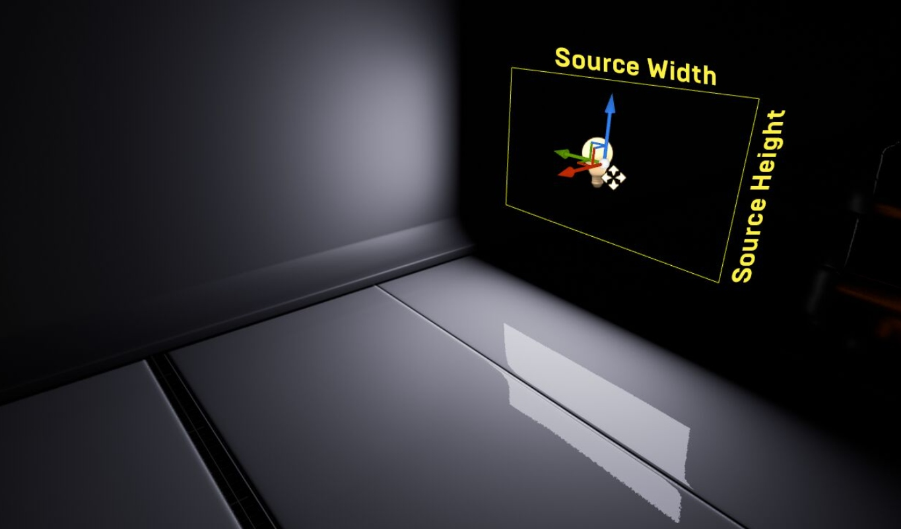

# [剖析虚幻渲染体系（05）- 光源和阴影](https://www.cnblogs.com/timlly/p/14817455.html)


目录

- 5.1 本篇概述
  - [5.1.1 本篇内容](https://www.cnblogs.com/timlly/p/14817455.html#511-本篇内容)
  - [5.1.2 基础概念](https://www.cnblogs.com/timlly/p/14817455.html#512-基础概念)
- 5.2 Shader体系
  - [5.2.1 Shader概览](https://www.cnblogs.com/timlly/p/14817455.html#521-shader概览)
  - [5.2.2 Shader模块层级](https://www.cnblogs.com/timlly/p/14817455.html#522-shader模块层级)
  - 5.2.3 Shader基础模块
    - [5.2.3.1 Platform.ush](https://www.cnblogs.com/timlly/p/14817455.html#5231-platformush)
    - [5.2.3.2 Common.ush](https://www.cnblogs.com/timlly/p/14817455.html#5232-commonush)
    - [5.2.3.3 Definitions.ush](https://www.cnblogs.com/timlly/p/14817455.html#5233-definitionsush)
    - [5.2.3.4 ShadingCommon.ush](https://www.cnblogs.com/timlly/p/14817455.html#5234-shadingcommonush)
    - [5.2.3.5 BasePassCommon.ush](https://www.cnblogs.com/timlly/p/14817455.html#5235-basepasscommonush)
    - [5.2.3.6 BRDF.ush](https://www.cnblogs.com/timlly/p/14817455.html#5236-brdfush)
    - [5.2.3.7 VertexFactoryCommon.ush](https://www.cnblogs.com/timlly/p/14817455.html#5237-vertexfactorycommonush)
    - [5.2.3.8 BasePassVertexCommon.ush](https://www.cnblogs.com/timlly/p/14817455.html#5238-basepassvertexcommonush)
    - [5.2.3.9 ShadingModels.ush](https://www.cnblogs.com/timlly/p/14817455.html#5239-shadingmodelsush)
    - [5.2.3.10 DeferredShadingCommon.ush](https://www.cnblogs.com/timlly/p/14817455.html#52310-deferredshadingcommonush)
    - [5.2.3.11 DeferredLightingCommon.ush](https://www.cnblogs.com/timlly/p/14817455.html#52311-deferredlightingcommonush)
    - [5.2.3.12 ShadingModelsMaterial.ush](https://www.cnblogs.com/timlly/p/14817455.html#52312-shadingmodelsmaterialush)
    - [5.2.3.13 LocalVertexFactoryCommon.ush](https://www.cnblogs.com/timlly/p/14817455.html#52313-localvertexfactorycommonush)
    - [5.2.3.14 LocalVertexFactory.ush](https://www.cnblogs.com/timlly/p/14817455.html#52314-localvertexfactoryush)
- 5.3 BasePass
  - [5.3.1 BasePass渲染流程](https://www.cnblogs.com/timlly/p/14817455.html#531-basepass渲染流程)
  - [5.3.2 BasePass渲染状态](https://www.cnblogs.com/timlly/p/14817455.html#532-basepass渲染状态)
  - 5.3.3 BasePass Shader
    - [5.3.3.1 BasePassVertexShader](https://www.cnblogs.com/timlly/p/14817455.html#5331-basepassvertexshader)
    - [5.3.3.2 BasePassPixelShader](https://www.cnblogs.com/timlly/p/14817455.html#5332-basepasspixelshader)
  - [5.3.4 BasePass总结](https://www.cnblogs.com/timlly/p/14817455.html#534-basepass总结)
- 5.4 UE的光源
  - [5.4.1 光源概述](https://www.cnblogs.com/timlly/p/14817455.html#541-光源概述)
  - 5.4.2 光源算法
    - [5.4.2.1 BRDF概述](https://www.cnblogs.com/timlly/p/14817455.html#5421-brdf概述)
    - [5.4.2.2 特殊光源](https://www.cnblogs.com/timlly/p/14817455.html#5422-特殊光源)
  - 5.4.3 光源分配和裁剪
    - [5.4.3.1 光源基础概念](https://www.cnblogs.com/timlly/p/14817455.html#5431-光源基础概念)
    - [5.4.3.2 GatherAndSortLights](https://www.cnblogs.com/timlly/p/14817455.html#5432-gatherandsortlights)
    - [5.4.3.3 ComputeLightGrid](https://www.cnblogs.com/timlly/p/14817455.html#5433-computelightgrid)
- 5.5 LightingPass
  - [5.5.1 LightingPass渲染流程](https://www.cnblogs.com/timlly/p/14817455.html#551-lightingpass渲染流程)
  - [5.5.2 LightingPass渲染状态](https://www.cnblogs.com/timlly/p/14817455.html#552-lightingpass渲染状态)
  - 5.5.3 LightingPass Shader
    - [5.5.3.1 DeferredLightVertexShader](https://www.cnblogs.com/timlly/p/14817455.html#5531-deferredlightvertexshader)
    - [5.5.3.2 DeferredLightPixelShader](https://www.cnblogs.com/timlly/p/14817455.html#5532-deferredlightpixelshader)
  - [5.5.4 LightingPass总结](https://www.cnblogs.com/timlly/p/14817455.html#554-lightingpass总结)
- 5.6 UE的阴影
  - [5.6.1 阴影概述](https://www.cnblogs.com/timlly/p/14817455.html#561-阴影概述)
  - [5.6.2 阴影基础类型](https://www.cnblogs.com/timlly/p/14817455.html#562-阴影基础类型)
  - 5.6.3 阴影初始化
    - [5.6.3.1 InitDynamicShadows](https://www.cnblogs.com/timlly/p/14817455.html#5631-initdynamicshadows)
    - [5.6.3.2 CreateWholeSceneProjectedShadow](https://www.cnblogs.com/timlly/p/14817455.html#5632-createwholesceneprojectedshadow)
    - [5.6.3.3 AddViewDependentWholeSceneShadowsForView](https://www.cnblogs.com/timlly/p/14817455.html#5633-addviewdependentwholesceneshadowsforview)
    - [5.6.3.4 SetupInteractionShadows](https://www.cnblogs.com/timlly/p/14817455.html#5634-setupinteractionshadows)
    - [5.6.3.5 CreatePerObjectProjectedShadow](https://www.cnblogs.com/timlly/p/14817455.html#5635-createperobjectprojectedshadow)
    - [5.6.3.6 InitProjectedShadowVisibility](https://www.cnblogs.com/timlly/p/14817455.html#5636-initprojectedshadowvisibility)
    - [5.6.3.7 UpdatePreshadowCache](https://www.cnblogs.com/timlly/p/14817455.html#5637-updatepreshadowcache)
    - [5.6.3.8 GatherShadowPrimitives](https://www.cnblogs.com/timlly/p/14817455.html#5638-gathershadowprimitives)
    - [5.6.3.9 FGatherShadowPrimitivesPacket](https://www.cnblogs.com/timlly/p/14817455.html#5639-fgathershadowprimitivespacket)
    - [5.6.3.10 AllocateShadowDepthTargets](https://www.cnblogs.com/timlly/p/14817455.html#56310-allocateshadowdepthtargets)
    - [5.6.3.11 GatherShadowDynamicMeshElements](https://www.cnblogs.com/timlly/p/14817455.html#56311-gathershadowdynamicmeshelements)
    - [5.6.3.12 阴影初始化总结](https://www.cnblogs.com/timlly/p/14817455.html#56312-阴影初始化总结)
  - 5.6.4 阴影渲染
    - [5.6.4.1 RenderShadowDepthMaps](https://www.cnblogs.com/timlly/p/14817455.html#5641-rendershadowdepthmaps)
    - [5.6.4.2 FProjectedShadowInfo::RenderDepth](https://www.cnblogs.com/timlly/p/14817455.html#5642-fprojectedshadowinforenderdepth)
    - [5.6.4.3 FProjectedShadowInfo::RenderTranslucencyDepths](https://www.cnblogs.com/timlly/p/14817455.html#5643-fprojectedshadowinforendertranslucencydepths)
    - [5.6.4.4 RenderShadowDepthMapAtlases](https://www.cnblogs.com/timlly/p/14817455.html#5644-rendershadowdepthmapatlases)
  - 5.6.5 阴影应用
    - [5.6.5.1 RenderLights](https://www.cnblogs.com/timlly/p/14817455.html#5651-renderlights)
    - [5.6.5.2 RenderShadowProjections](https://www.cnblogs.com/timlly/p/14817455.html#5652-rendershadowprojections)
    - [5.6.5.3 FProjectedShadowInfo::RenderProjection](https://www.cnblogs.com/timlly/p/14817455.html#5653-fprojectedshadowinforenderprojection)
    - [5.6.5.4 FShadowProjectionNoTransformVS和TShadowProjectionPS](https://www.cnblogs.com/timlly/p/14817455.html#5654-fshadowprojectionnotransformvs和tshadowprojectionps)
    - [5.6.5.5 RenderLight](https://www.cnblogs.com/timlly/p/14817455.html#5655-renderlight)
    - [5.6.5.6 阴影Shader逻辑](https://www.cnblogs.com/timlly/p/14817455.html#5656-阴影shader逻辑)
    - [5.6.5.7 阴影应用总结](https://www.cnblogs.com/timlly/p/14817455.html#5657-阴影应用总结)
  - [5.6.6 UE阴影总结](https://www.cnblogs.com/timlly/p/14817455.html#566-ue阴影总结)
- 5.7 本篇总结
  - [5.7.1 本篇思考](https://www.cnblogs.com/timlly/p/14817455.html#571-本篇思考)
- [特别说明](https://www.cnblogs.com/timlly/p/14817455.html#特别说明)
- [参考文献](https://www.cnblogs.com/timlly/p/14817455.html#参考文献)


 

 

# **5.1 本篇概述**

## **5.1.1 本篇内容**

本篇主要阐述UE的以下内容：

- Shader代码及主要模块。
- UE的光源。
- UE的阴影。
- BasePass的机制和实现，包含C++和Shader。
- LightingPass的机制和实现，包含C++和Shader。

其中BasePass和LightingPass在上一篇中已经粗略地浅析过，本篇继续深入地剖析。

本篇文章将首次引入**mermaid**语法，它是类似于LATEXLATEX的以文本描述作为画图工具的语法，简单、轻便、小巧，高清无损画质，和Markdown搭配，浑然天成。

OneTwoThreeUnreal EngineRendering SystemRHIDirectXMetalVulkan

*利用mermaid语法做出的矢量图例，开启文本绘图新纪元。*

前方高能预警，本篇篇幅达到5万多字，是目前本系列文章最长的一篇，需做好心理准备。

## **5.1.2 基础概念**

本篇涉及的部分渲染基础概念及解析如下表：

| 概念                            | 缩写 | 中文译名         | 解析                                                         |
| ------------------------------- | ---- | ---------------- | ------------------------------------------------------------ |
| **Shader**                      | -    | 着色器、着色代码 | 用于GPU执行的代码片段，常见的类型有VS（顶点着色器）和PS（像素着色器），也泛指Shader代码文件。 |
| **Vertex Shader**               | VS   | 顶点着色器       | 在GPU的顶点处理阶段执行的代码片段，常用于处理顶点变换。      |
| **Pixel Shader**                | PS   | 像素着色器       | OpenGL中叫片元着色（Fragment Shader），专门执行于像素处理阶段的代码片段，用于处理光栅化后的像素，如光照计算等。 |
| **High Level Shading Language** | HLSL | 高级着色语言     | DirectX的专用Shader语言，Vulkan、OpenGL的被称为GLSL，Metal的被成为MSL。 |

 

# **5.2 Shader体系**

由于后面的章节会直接进行shader代码分析，所以本章先对UE的Shader体系做个简洁的分析，以便大家能够很好地过度到后续章节。

## **5.2.1 Shader概览**

UE的内置Shader文件在Engine\Shaders目录下：


所有Shader文件总数超过了600个，其中Shader头文件的后缀是ush，可被其它Shader文件include，实现文件是usf，通常不可被其它Shader文件include。下面是Shader目录及部分模块一览：

```
Shaders/
  Private/
    BasePassCommon.ush
    BasePassPixelShader.usf
    BasePassVertexCommon.ush
    BasePassVertexShader.usf
    BRDF.ush
    CapsuleLight.ush
    CapsuleLightIntegrate.ush
    CapsuleShadowShaders.usf
    Common.ush
    CommonViewUniformBuffer.ush
    DeferredLightingCommon.ush
    DeferredLightPixelShaders.usf
    DeferredLightVertexShaders.usf
    DeferredShadingCommon.ush
    Definitions.usf
    LightGridCommon.ush
    LightGridInjection.usf
    LocalVertexFactory.ush
    MaterialTemplate.ush
    RectLight.ush
    RectLightIntegrate.ush
    ShadingCommon.ush
    ShadingModels.ush
    ShadingModelsMaterial.ush
    ShadowDepthCommon.ush
    ShadowDepthPixelShader.usf
    ShadowDepthVertexShader.usf
    ShadowProjectionCommon.ush
    ShadowProjectionPixelShader.usf
    ShadowProjectionVertexShader.usf
    SHCommon.ush
    VertexFactoryCommon.ush
    (......)
  Public/
    FP16Math.ush
    Platform.ush
    ShaderVersion.ush
    Platform/
      D3D/
        D3DCommon.ush
      Metal/
        MetalCommon.ush
        MetalSubpassSupport.ush
      Vulkan/
        VulkanCommon.ush
        VulkanSubpassSupport.ush
  Shared/
    (......)
  StandaloneRenderer/
    D3D/
      GammaCorrectionCommon.hlsl
      SlateDefaultVertexShader.hlsl
      (......)
    OpenGL/
      SlateElementPixelShader.glsl
      SlateVertexShader.glsl
      (......)
```

## **5.2.2 Shader模块层级**

**第一梯队**的shader模块是最底层最基础的模块，这些模块不会引用其它模块，但会被其它很多模块引用。这些模块主要有：

- BasePassCommon.ush
- BRDF.ush
- CapsuleLight.ush
- Common.ush
- CommonViewUniformBuffer.ush
- Definitions.usf
- FP16Math.ush
- Platform.ush
- ShaderVersion.ush
- LightGridCommon.ush
- LocalVertexFactoryCommon.ush
- ShadingCommon.ush
- ShadowDepthCommon.ush
- ShadowProjectionCommon.ush
- SHCommon.ush
- (......)

**第二梯队**的重要或基础模块会引用第一梯队的基础模块，但也会被其它梯队或模块引用：

- BasePassVertexCommon.ush
- CapsuleLightIntegrate.ush
- DeferredLightingCommon.ush
- DeferredShadingCommon.ush
- LocalVertexFactory.ush
- MaterialTemplate.ush
- RectLight.ush
- RectLightIntegrate.ush
- ShadingModels.ush
- ShadingModelsMaterial.ush
- VertexFactoryCommon.ush
- (......)

最后是**第三梯队**的模块，重要模块的实现，会引用第一、第二梯队的模块：

- BasePassPixelShader.usf
- BasePassVertexShader.usf
- CapsuleShadowShaders.usf
- DeferredLightPixelShaders.usf
- DeferredLightVertexShaders.usf
- ShadowProjectionPixelShader.usf
- ShadowProjectionVertexShader.usf
- (......)

## **5.2.3 Shader基础模块**

本小节选取部分基础或重要的shader模块，分析它们的接口、类型、定义，以便让大家对UE的内置shader模块有个大致的理解，了解UE自带了哪些模块，拥有哪些内置接口，在面对后续的shader代码剖析时更加了然于胸。

### **5.2.3.1 Platform.ush**

主要定义了跟图形API（DirectX、OpenGL、Vulkan、Metal）和FEATURE_LEVEL相关的宏、变量及工具类接口。部分代码如下：

```c++
// FEATURE_LEVEL的宏定义
#define FEATURE_LEVEL_ES2_REMOVED    1
#define FEATURE_LEVEL_ES3_1            2
#define FEATURE_LEVEL_SM3            3
#define FEATURE_LEVEL_SM4            4
#define FEATURE_LEVEL_SM5            5
#define FEATURE_LEVEL_MAX            6

// 初始化平台相关的宏.
#ifndef COMPILER_HLSLCC
#define COMPILER_HLSLCC 0
#endif

#ifndef COMPILER_HLSL
#define COMPILER_HLSL 0
#endif

#ifndef COMPILER_GLSL
#define COMPILER_GLSL 0
#endif

#ifndef COMPILER_GLSL_ES3_1
#define COMPILER_GLSL_ES3_1 0
#endif

#ifndef COMPILER_METAL
#define COMPILER_METAL 0
#endif

#ifndef SM5_PROFILE
#define SM5_PROFILE 0
#endif

(......)

// 浮点数精度
#ifndef FORCE_FLOATS
#define FORCE_FLOATS 0
#endif

#if (!(ES3_1_PROFILE || METAL_PROFILE) || FORCE_FLOATS)
    #define half float
    #define half1 float1
    #define half2 float2
    #define half3 float3
    #define half4 float4
    #define half3x3 float3x3
    #define half4x4 float4x4 
    #define half4x3 float4x3 
    #define fixed float
    #define fixed1 float1
    #define fixed2 float2
    #define fixed3 float3
    #define fixed4 float4
    #define fixed3x3 float3x3
    #define fixed4x4 float4x4
    #define fixed4x3 float4x3
#endif

// PROFILE宏定义
#if PS4_PROFILE
    #define FEATURE_LEVEL FEATURE_LEVEL_SM5

#elif SM5_PROFILE
    // SM5 = full dx11 features (high end UE4 rendering)
    #define FEATURE_LEVEL FEATURE_LEVEL_SM5

#elif SM4_PROFILE
    #define FEATURE_LEVEL FEATURE_LEVEL_SM4

(......)

// 分支语句.
#ifndef UNROLL
#define UNROLL
#endif

#ifndef UNROLL_N
#define UNROLL_N(N)
#endif

#ifndef LOOP
#define LOOP
#endif

#ifndef BRANCH
#define BRANCH
#endif

#ifndef FLATTEN
#define FLATTEN
#endif

(......)

// 工具类接口(编译不支持时)
#if !COMPILER_SUPPORTS_MINMAX3

float min3( float a, float b, float c );
float max3( float a, float b, float c );
float2 min3( float2 a, float2 b, float2 c );
float2 max3( float2 a, float2 b, float2 c );

(......)

#endif

// 解压数据.
#if !defined(COMPILER_SUPPORTS_UNPACKBYTEN)
float UnpackByte0(uint v) { return float(v & 0xff); }
float UnpackByte1(uint v) { return float((v >> 8) & 0xff); }
float UnpackByte2(uint v) { return float((v >> 16) & 0xff); }
float UnpackByte3(uint v) { return float(v >> 24); }
#endif // !COMPILER_SUPPORTS_UNPACKBYTEN

// 封装部分宏.
#ifndef SNORM
#if COMPILER_HLSLCC || PS4_PROFILE
    #define SNORM 
    #define UNORM
#else
    #define SNORM snorm
    #define UNORM unorm
#endif
#endif

#ifndef INFINITE_FLOAT
    #if COMPILER_HLSLCC
        #define INFINITE_FLOAT 3.402823e+38
    #else
        #define INFINITE_FLOAT 1.#INF
    #endif
#endif
```

### **5.2.3.2 Common.ush**

此模块主要包含了图形API或Feature Level相关的宏、类型、局部变量、静态变量、基础工具接口等，具体如下：

```c++
// 类型定义或封装
#if PIXELSHADER
    #define MaterialFloat half
    #define MaterialFloat2 half2
    #define MaterialFloat3 half3
    #define MaterialFloat4 half4
    #define MaterialFloat3x3 half3x3
    #define MaterialFloat4x4 half4x4 
    #define MaterialFloat4x3 half4x3 
#else
    // Material translated vertex shader code always uses floats, 
    // Because it's used for things like world position and UVs
    #define MaterialFloat float
    #define MaterialFloat2 float2
    #define MaterialFloat3 float3
    #define MaterialFloat4 float4
    #define MaterialFloat3x3 float3x3
    #define MaterialFloat4x4 float4x4 
    #define MaterialFloat4x3 float4x3 
#endif

#if POST_PROCESS_ALPHA
    #define SceneColorLayout float4
    #define CastFloat4ToSceneColorLayout(x) (x)
    #define SetSceneColorLayoutToFloat4(dest,value) dest = (value)
#else
    #define SceneColorLayout float3
    #define CastFloat4ToSceneColorLayout(x) ((x).rgb)
    #define SetSceneColorLayoutToFloat4(dest,value) dest.rgb = (value).rgb
#endif

struct FScreenVertexOutput
{
#if METAL_PROFILE || COMPILER_GLSL_ES3_1
    noperspective float2 UV : TEXCOORD0;
#else
    noperspective MaterialFloat2 UV : TEXCOORD0;
#endif
    float4 Position : SV_POSITION;
};

struct FPixelShaderIn
{
    float4 SvPosition;
    uint Coverage;
    bool bIsFrontFace;
};

struct FPixelShaderOut
{
    float4 MRT[8];
    uint Coverage;
    float Depth;
};

// 宏、常量定义
#define USE_GLOBAL_CLIP_PLANE (PLATFORM_SUPPORTS_GLOBAL_CLIP_PLANE && PROJECT_ALLOW_GLOBAL_CLIP_PLANE && !MATERIAL_DOMAIN_POSTPROCESS && !MATERIAL_DOMAIN_UI)

#define POSITIVE_INFINITY (asfloat(0x7F800000))
#define NEGATIVE_INFINITY (asfloat(0xFF800000))

const static MaterialFloat PI = 3.1415926535897932f;
const static float MaxHalfFloat = 65504.0f;
const static float Max10BitsFloat = 64512.0f;

#define POW_CLAMP 0.000001f

// 通用变量定义
Texture2D        LightAttenuationTexture;
SamplerState    LightAttenuationTextureSampler;

// 基础、工具接口
float  ClampToHalfFloatRange(float  X);
float2 ClampToHalfFloatRange(float2 X);
float3 ClampToHalfFloatRange(float3 X);
float4 ClampToHalfFloatRange(float4 X);
float2 Tile1Dto2D(float xsize, float idx);
MaterialFloat Luminance( MaterialFloat3 LinearColor );
MaterialFloat length2(MaterialFloat2 v);
MaterialFloat length2(MaterialFloat3 v);
MaterialFloat length2(MaterialFloat4 v);
uint Mod(uint a, uint b);
uint2 Mod(uint2 a, uint2 b);
uint3 Mod(uint3 a, uint3 b);
MaterialFloat UnClampedPow(MaterialFloat X, MaterialFloat Y);
MaterialFloat2 UnClampedPow(MaterialFloat2 X, MaterialFloat2 Y);
MaterialFloat3 UnClampedPow(MaterialFloat3 X, MaterialFloat3 Y);
MaterialFloat4 UnClampedPow(MaterialFloat4 X, MaterialFloat4 Y);
MaterialFloat ClampedPow(MaterialFloat X,MaterialFloat Y);
MaterialFloat2 ClampedPow(MaterialFloat2 X,MaterialFloat2 Y);
MaterialFloat3 ClampedPow(MaterialFloat3 X,MaterialFloat3 Y);
MaterialFloat4 ClampedPow(MaterialFloat4 X,MaterialFloat4 Y);
MaterialFloat PositiveClampedPow(MaterialFloat X,MaterialFloat Y);
MaterialFloat2 PositiveClampedPow(MaterialFloat2 X,MaterialFloat2 Y);
MaterialFloat3 PositiveClampedPow(MaterialFloat3 X,MaterialFloat3 Y);
MaterialFloat4 PositiveClampedPow(MaterialFloat4 X,MaterialFloat4 Y);
uint ReverseBits32( uint bits );
uint ReverseBitsN(uint Bitfield, const uint BitCount);

// 数学
float Square( float x );
float2 Square( float2 x );
float3 Square( float3 x );
float4 Square( float4 x );
float Pow2( float x );
float2 Pow2( float2 x );
float3 Pow2( float3 x );
float4 Pow2( float4 x );
float Pow3( float x );
float2 Pow3( float2 x );
float3 Pow3( float3 x );
float4 Pow3( float4 x );
float Pow4( float x );
float2 Pow4( float2 x );
float3 Pow4( float3 x );
float4 Pow4( float4 x );
float Pow5( float x );
float2 Pow5( float2 x );
float3 Pow5( float3 x );
float4 Pow5( float4 x );
float Pow6( float x );
float2 Pow6( float2 x );
float3 Pow6( float3 x );
float4 Pow6( float4 x );
MaterialFloat AtanFast( MaterialFloat x );

// 求导
float DDX(float Input);
float2 DDX(float2 Input);
float3 DDX(float3 Input);
float4 DDX(float4 Input);
float DDY(float Input);
float2 DDY(float2 Input);
float3 DDY(float3 Input);
float4 DDY(float4 Input);

// 数据编码解码
MaterialFloat EncodeLightAttenuation(MaterialFloat InColor);
MaterialFloat4 EncodeLightAttenuation(MaterialFloat4 InColor);
MaterialFloat4 RGBTEncode(MaterialFloat3 Color);
MaterialFloat3 RGBTDecode(MaterialFloat4 RGBT);
MaterialFloat4 RGBMEncode( MaterialFloat3 Color );
MaterialFloat4 RGBMEncodeFast( MaterialFloat3 Color );
MaterialFloat3 RGBMDecode( MaterialFloat4 rgbm, MaterialFloat MaxValue );
MaterialFloat3 RGBMDecode( MaterialFloat4 rgbm );
MaterialFloat4 RGBTEncode8BPC(MaterialFloat3 Color, MaterialFloat Range);
MaterialFloat3 RGBTDecode8BPC(MaterialFloat4 RGBT, MaterialFloat Range);
uint DecodeRTWriteMask(float2 ScreenPos, Texture2D<uint> RTWriteMaskTexture, uint NumEncodedTextures);
float2 EncodeVelocityToTexture(float2 In);
float2 DecodeVelocityFromTexture(float2 In);
float DecodePackedTwoChannelValue(float2 PackedHeight);
float DecodeHeightValue(float InValue);
float DecodePackedHeight(float2 PackedHeight);

// 纹理采样
aterialFloat4 Texture1DSample(Texture1D Tex, SamplerState Sampler, float UV);
MaterialFloat4 Texture2DSample(Texture2D Tex, SamplerState Sampler, float2 UV);
MaterialFloat Texture2DSample_A8(Texture2D Tex, SamplerState Sampler, float2 UV);
MaterialFloat4 Texture3DSample(Texture3D Tex, SamplerState Sampler, float3 UV);
MaterialFloat4 TextureCubeSample(TextureCube Tex, SamplerState Sampler, float3 UV);
MaterialFloat4 Texture2DArraySample(Texture2DArray Tex, SamplerState Sampler, float3 UV);
MaterialFloat4 Texture1DSampleLevel(Texture1D Tex, SamplerState Sampler, float UV, MaterialFloat Mip);
MaterialFloat4 Texture2DSampleLevel(Texture2D Tex, SamplerState Sampler, float2 UV, MaterialFloat Mip);
MaterialFloat4 Texture2DSampleBias(Texture2D Tex, SamplerState Sampler, float2 UV, MaterialFloat MipBias);
MaterialFloat4 Texture2DSampleGrad(Texture2D Tex, SamplerState Sampler, float2 UV, MaterialFloat2 DDX, MaterialFloat2 DDY);
MaterialFloat4 Texture3DSampleLevel(Texture3D Tex, SamplerState Sampler, float3 UV, MaterialFloat Mip);
MaterialFloat4 Texture3DSampleBias(Texture3D Tex, SamplerState Sampler, float3 UV, MaterialFloat MipBias);
MaterialFloat4 Texture3DSampleGrad(Texture3D Tex, SamplerState Sampler, float3 UV, MaterialFloat3 DDX, MaterialFloat3 DDY);
MaterialFloat4 TextureCubeSampleLevel(TextureCube Tex, SamplerState Sampler, float3 UV, MaterialFloat Mip);
MaterialFloat TextureCubeSampleDepthLevel(TextureCube TexDepth, SamplerState Sampler, float3 UV, MaterialFloat Mip);
MaterialFloat4 TextureCubeSampleBias(TextureCube Tex, SamplerState Sampler, float3 UV, MaterialFloat MipBias);
MaterialFloat4 TextureCubeSampleGrad(TextureCube Tex, SamplerState Sampler, float3 UV, MaterialFloat3 DDX, MaterialFloat3 DDY);
MaterialFloat4 TextureExternalSample(TextureExternal Tex, SamplerState Sampler, float2 UV);
MaterialFloat4 TextureExternalSampleGrad(TextureExternal Tex, SamplerState Sampler, float2 UV, ...);
MaterialFloat4 TextureExternalSampleLevel(TextureExternal Tex, SamplerState Sampler, float2 UV, MaterialFloat Mip);
MaterialFloat4 Texture1DSample_Decal(Texture1D Tex, SamplerState Sampler, float UV);
MaterialFloat4 Texture2DSample_Decal(Texture2D Tex, SamplerState Sampler, float2 UV);
MaterialFloat4 Texture3DSample_Decal(Texture3D Tex, SamplerState Sampler, float3 UV);
MaterialFloat4 TextureCubeSample_Decal(TextureCube Tex, SamplerState Sampler, float3 UV);
MaterialFloat4 TextureExternalSample_Decal(TextureExternal Tex, SamplerState Sampler, float2 UV);
MaterialFloat4 Texture2DArraySampleLevel(Texture2DArray Tex, SamplerState Sampler, float3 UV, MaterialFloat Mip);
MaterialFloat4 Texture2DArraySampleBias(Texture2DArray Tex, SamplerState Sampler, float3 UV, MaterialFloat MipBias);
MaterialFloat4 Texture2DArraySampleGrad(Texture2DArray Tex, SamplerState Sampler, float3 UV, ...);

// 特殊采样，噪点
float4 PseudoVolumeTexture(Texture2D Tex, SamplerState TexSampler, float3 inPos, float2 xysize, float numframes, ...);
float AntialiasedTextureMask( Texture2D Tex, SamplerState Sampler, float2 UV, float ThresholdConst, int Channel );
float Noise3D_Multiplexer(int Function, float3 Position, int Quality, bool bTiling, float RepeatSize);
MaterialFloat MaterialExpressionNoise(float3 Position, float Scale, int Quality, int Function, ...);
MaterialFloat4 MaterialExpressionVectorNoise(MaterialFloat3 Position, int Quality, int Function, bool bTiling, float TileSize);
    
// 光照计算
MaterialFloat PhongShadingPow(MaterialFloat X, MaterialFloat Y);

// 数据转换
float ConvertTangentUnormToSnorm8(float Input);
float2 ConvertTangentUnormToSnorm8(float2 Input);
float3 ConvertTangentUnormToSnorm8(float3 Input);
float4 ConvertTangentUnormToSnorm8(float4 Input);
float ConvertTangentUnormToSnorm16(float Input);
float2 ConvertTangentUnormToSnorm16(float2 Input);
float3 ConvertTangentUnormToSnorm16(float3 Input);
float4 ConvertTangentUnormToSnorm16(float4 Input);
float ConvertTangentSnormToUnorm8(float Input);
float2 ConvertTangentSnormToUnorm8(float2 Input);
float3 ConvertTangentSnormToUnorm8(float3 Input);
float4 ConvertTangentSnormToUnorm8(float4 Input);
float ConvertTangentSnormToUnorm16(float Input);
float2 ConvertTangentSnormToUnorm16(float2 Input);
float3 ConvertTangentSnormToUnorm16(float3 Input);
float4 ConvertTangentSnormToUnorm16(float4 Input);

// 坐标、空间转换
float2 CalcScreenUVFromOffsetFraction(float4 ScreenPosition, float2 OffsetFraction);
float4 GetPerPixelLightAttenuation(float2 UV);
float ConvertFromDeviceZ(float DeviceZ);
float ConvertToDeviceZ(float SceneDepth);
float2 ScreenPositionToBufferUV(float4 ScreenPosition);
float2 SvPositionToBufferUV(float4 SvPosition);
float3 SvPositionToTranslatedWorld(float4 SvPosition);
float3 SvPositionToResolvedTranslatedWorld(float4 SvPosition);
float3 SvPositionToWorld(float4 SvPosition);
float4 SvPositionToScreenPosition(float4 SvPosition);
float4 SvPositionToResolvedScreenPosition(float4 SvPosition);
float2 SvPositionToViewportUV(float4 SvPosition);
float2 BufferUVToViewportUV(float2 BufferUV);
float2 ViewportUVToBufferUV(float2 ViewportUV);
float2 ViewportUVToScreenPos(float2 ViewportUV);
float2 ScreenPosToViewportUV(float2 ScreenPos);
float3 ScreenToViewPos(float2 ViewportUV, float SceneDepth);
MaterialFloat2 ScreenAlignedPosition( float4 ScreenPosition );
MaterialFloat2 ScreenAlignedUV( MaterialFloat2 UV );
MaterialFloat2 GetViewportCoordinates(MaterialFloat2 InFragmentCoordinates);

MaterialFloat3 TransformTangentVectorToWorld(MaterialFloat3x3 TangentToWorld, MaterialFloat3 InTangentVector);
MaterialFloat3 TransformWorldVectorToTangent(MaterialFloat3x3 TangentToWorld, MaterialFloat3 InWorldVector);
float3 TransformWorldVectorToView(float3 InTangentVector);
void GenerateCoordinateSystem(float3 ZAxis, out float3 XAxis, out float3 YAxis);

// 几何体交互: 求交, 距离等.
float2 LineBoxIntersect(float3 RayOrigin, float3 RayEnd, float3 BoxMin, float3 BoxMax);
MaterialFloat ComputeDistanceFromBoxToPoint(MaterialFloat3 Mins, MaterialFloat3 Maxs, MaterialFloat3 InPoint);
MaterialFloat ComputeSquaredDistanceFromBoxToPoint(MaterialFloat3 BoxCenter, MaterialFloat3 BoxExtent, MaterialFloat3 InPoint);
float ComputeDistanceFromBoxToPointInside(float3 BoxCenter, float3 BoxExtent, float3 InPoint);
bool RayHitSphere(float3 RayOrigin, float3 UnitRayDirection, float3 SphereCenter, float SphereRadius);
bool RaySegmentHitSphere(float3 RayOrigin, float3 UnitRayDirection, float RayLength, float3 SphereCenter, float SphereRadius);
float2 RayIntersectSphere(float3 RayOrigin, float3 RayDirection, float4 Sphere);
MaterialFloat GetBoxPushout(MaterialFloat3 Normal,MaterialFloat3 Extent);

// 绘制接口
void DrawRectangle(in float4 InPosition, in float2 InTexCoord, out float4 OutPosition, out float2 OutTexCoord);
void DrawRectangle(in float4 InPosition, in float2 InTexCoord, out float4 OutPosition, out float4 OutUVAndScreenPos);
void DrawRectangle(in float4 InPosition, out float4 OutPosition);

(.....)
```

由此可知，common的shader模块封装了大量的基础类型、接口、变量等，以上只是展示了部分接口，而且为了简洁去掉了实现代码，如果想看实现的童鞋自行查阅UE的源码。

### **5.2.3.3 Definitions.ush**

此模块主要是预先定义了一些常见的宏，防止其它模块引用时出现语法错误。部分宏如下：

```c++
#ifndef MATERIAL_TWOSIDED
#define    MATERIAL_TWOSIDED                                0
#endif

#ifndef MATERIAL_TANGENTSPACENORMAL
#define    MATERIAL_TANGENTSPACENORMAL                        0
#endif

#ifndef MATERIAL_TWOSIDED_SEPARATE_PASS
#define    MATERIAL_TWOSIDED_SEPARATE_PASS                    0
#endif

#ifndef MATERIALBLENDING_MASKED
#define MATERIALBLENDING_MASKED                            0
#endif

#ifndef MATERIALBLENDING_TRANSLUCENT
#define MATERIALBLENDING_TRANSLUCENT                    0
#endif

#ifndef TRANSLUCENT_SHADOW_WITH_MASKED_OPACITY
#define TRANSLUCENT_SHADOW_WITH_MASKED_OPACITY            0
#endif

#ifndef MATERIAL_SHADINGMODEL_DEFAULT_LIT
#define MATERIAL_SHADINGMODEL_DEFAULT_LIT                0
#endif

#ifndef MATERIAL_SHADINGMODEL_SUBSURFACE
#define MATERIAL_SHADINGMODEL_SUBSURFACE                0
#endif

#ifndef MATERIAL_SHADINGMODEL_UNLIT
#define    MATERIAL_SHADINGMODEL_UNLIT                        0
#endif

#ifndef MATERIAL_SINGLE_SHADINGMODEL
#define    MATERIAL_SINGLE_SHADINGMODEL                    0
#endif

#ifndef HAS_PRIMITIVE_UNIFORM_BUFFER
#define    HAS_PRIMITIVE_UNIFORM_BUFFER                    0
#endif

#ifndef GBUFFER_HAS_VELOCITY
#define GBUFFER_HAS_VELOCITY                            0
#endif

#ifndef GBUFFER_HAS_TANGENT
#define GBUFFER_HAS_TANGENT                                0
#endif

#define PC_D3D                                            SM5_PROFILE

(......)
```

### **5.2.3.4 ShadingCommon.ush**

此模块主要是定义了材质所有着色模型，并提供了少量相关的工具类接口：

```c++
// 材质着色模型, 每种类型都有对应的光照算法和流程.
#define SHADINGMODELID_UNLIT                0
#define SHADINGMODELID_DEFAULT_LIT            1
#define SHADINGMODELID_SUBSURFACE            2
#define SHADINGMODELID_PREINTEGRATED_SKIN    3
#define SHADINGMODELID_CLEAR_COAT            4
#define SHADINGMODELID_SUBSURFACE_PROFILE    5
#define SHADINGMODELID_TWOSIDED_FOLIAGE        6
#define SHADINGMODELID_HAIR                    7
#define SHADINGMODELID_CLOTH                8
#define SHADINGMODELID_EYE                    9
#define SHADINGMODELID_SINGLELAYERWATER        10
#define SHADINGMODELID_THIN_TRANSLUCENT        11
#define SHADINGMODELID_NUM                    12
#define SHADINGMODELID_MASK                    0xF        // ShadingModelID只占用了GBuffer的4bit.

// 除了ShadingsModelID之外的4bit用作其它用途.
#define HAS_ANISOTROPY_MASK                (1 << 4)
#define SKIP_PRECSHADOW_MASK            (1 << 5)
#define ZERO_PRECSHADOW_MASK            (1 << 6)
#define SKIP_VELOCITY_MASK                (1 << 7)

// 头发反射组件(R, TT, TRT, Local Scattering, Global Scattering, Multi Scattering,...)
#define HAIR_COMPONENT_R            0x1u
#define HAIR_COMPONENT_TT            0x2u
#define HAIR_COMPONENT_TRT            0x4u
#define HAIR_COMPONENT_LS            0x8u 
#define HAIR_COMPONENT_GS            0x10u
#define HAIR_COMPONENT_MULTISCATTER    0x20u
#define HAIR_COMPONENT_TT_MODEL      0x40u

// 着色模型调试颜色.
float3 GetShadingModelColor(uint ShadingModelID);

// 非导体的反射F0.
float DielectricSpecularToF0(float Specular)
{
    return 0.08f * Specular;
}

// 非导体的F0转换到IOR(折射率).
float DielectricF0ToIor(float F0)
{
    return 2.0f / (1.0f - sqrt(F0)) - 1.0f;
}

// 非导体的IOR(折射率)转换到F0.
float DielectricIorToF0(float Ior)
{
    const float F0Sqrt = (Ior-1)/(Ior+1);
    const float F0 = F0Sqrt*F0Sqrt;
    return F0;
}

// 计算物体表面的F0.
float3 ComputeF0(float Specular, float3 BaseColor, float Metallic)
{
    return lerp(DielectricSpecularToF0(Specular).xxx, BaseColor, Metallic.xxx);
}
```

需要注意的是，UE默认的ShadingModelID只占用4bit，最多16个，而目前UE内置着色模型已占用了13个，意味着自定义的ShadingModel最多只能3个了。

### **5.2.3.5 BasePassCommon.ush**

此模块定义了BasePass的一些变量、宏定义、插值结构体和工具类接口：

```c++
// 透明物体BasePass的定义
#if MATERIALBLENDING_ANY_TRANSLUCENT
    #define ForwardLightData TranslucentBasePass.Shared.Forward
    #define ReflectionStruct TranslucentBasePass.Shared.Reflection
    #define PlanarReflectionStruct TranslucentBasePass.Shared.PlanarReflection
    #define FogStruct TranslucentBasePass.Shared.Fog
    #define ActualSSProfilesTexture TranslucentBasePass.Shared.SSProfilesTexture
// 不透明物体BasePass的定义
#else
    #define ForwardLightData OpaqueBasePass.Shared.Forward
    #define ReflectionStruct OpaqueBasePass.Shared.Reflection
    #define PlanarReflectionStruct OpaqueBasePass.Shared.PlanarReflection
    #define FogStruct OpaqueBasePass.Shared.Fog
    #define ActualSSProfilesTexture OpaqueBasePass.Shared.SSProfilesTexture
#endif 

// BasePass相关的宏定义
#undef NEEDS_LIGHTMAP_COORDINATE
#define NEEDS_LIGHTMAP_COORDINATE        (HQ_TEXTURE_LIGHTMAP || LQ_TEXTURE_LIGHTMAP)
#define TRANSLUCENCY_NEEDS_BASEPASS_FOGGING    (MATERIAL_ENABLE_TRANSLUCENCY_FOGGING && MATERIALBLENDING_ANY_TRANSLUCENT && !MATERIAL_USES_SCENE_COLOR_COPY)
#define OPAQUE_NEEDS_BASEPASS_FOGGING        (!MATERIALBLENDING_ANY_TRANSLUCENT && FORWARD_SHADING)

#define NEEDS_BASEPASS_VERTEX_FOGGING        (TRANSLUCENCY_NEEDS_BASEPASS_FOGGING && !MATERIAL_COMPUTE_FOG_PER_PIXEL || OPAQUE_NEEDS_BASEPASS_FOGGING && PROJECT_VERTEX_FOGGING_FOR_OPAQUE)
#define NEEDS_BASEPASS_PIXEL_FOGGING        (TRANSLUCENCY_NEEDS_BASEPASS_FOGGING && MATERIAL_COMPUTE_FOG_PER_PIXEL || OPAQUE_NEEDS_BASEPASS_FOGGING && !PROJECT_VERTEX_FOGGING_FOR_OPAQUE)

#define NEEDS_BASEPASS_PIXEL_VOLUMETRIC_FOGGING        (MATERIALBLENDING_ANY_TRANSLUCENT || FORWARD_SHADING)

#define NEEDS_LIGHTMAP                        (NEEDS_LIGHTMAP_COORDINATE)

#define USES_GBUFFER                        (FEATURE_LEVEL >= FEATURE_LEVEL_SM4 && (MATERIALBLENDING_SOLID || MATERIALBLENDING_MASKED) && !SIMPLE_FORWARD_SHADING && !FORWARD_SHADING)

(......)

// 插值结构体的父类.
struct FSharedBasePassInterpolants
{
    //for texture-lightmapped translucency we can pass the vertex fog in its own interpolator
#if NEEDS_BASEPASS_VERTEX_FOGGING
    float4 VertexFog        : TEXCOORD7;
#endif

#if !TESSELLATION_SUPPORTED
    // Note: TEXCOORD8 is unused

    #if USE_WORLD_POSITION_EXCLUDING_SHADER_OFFSETS
    float3 PixelPositionExcludingWPO : TEXCOORD9;
    #endif
#endif

#if TRANSLUCENCY_PERVERTEX_LIGHTING_VOLUME
    float3 AmbientLightingVector : TEXCOORD12;
#endif

#if TRANSLUCENCY_PERVERTEX_LIGHTING_VOLUME && TRANSLUCENCY_LIGHTING_VOLUMETRIC_PERVERTEX_DIRECTIONAL
    float3 DirectionalLightingVector : TEXCOORD13;
#endif

#if TRANSLUCENCY_PERVERTEX_FORWARD_SHADING
    float3 VertexDiffuseLighting : TEXCOORD12;
#endif

#if PRECOMPUTED_IRRADIANCE_VOLUME_LIGHTING
    #if TRANSLUCENCY_LIGHTING_VOLUMETRIC_PERVERTEX_NONDIRECTIONAL
        float3 VertexIndirectAmbient : TEXCOORD14;
    #elif TRANSLUCENCY_LIGHTING_VOLUMETRIC_PERVERTEX_DIRECTIONAL
        float4 VertexIndirectSH[3] : TEXCOORD14;
    #endif
#endif

#if WRITES_VELOCITY_TO_GBUFFER
    // .xy is clip position, pre divide by w; .w is clip W; .z is 0 or 1 to mask out the velocity output
    float4 VelocityPrevScreenPosition : VELOCITY_PREV_POS;
    #if WRITES_VELOCITY_TO_GBUFFER_USE_POS_INTERPOLATOR
        float4 VelocityScreenPosition : VELOCITY_POS;
    #endif
#endif
};

#if TESSELLATION_SUPPORTED
    // VS -> PS的插值结构体.
    struct FBasePassInterpolantsVSToPS : FSharedBasePassInterpolants
    {
        // Note: TEXCOORD8 is unused

        #if USE_WORLD_POSITION_EXCLUDING_SHADER_OFFSETS
        float3 PixelPositionExcludingWPO : TEXCOORD9;
        #endif
    };
    // VS -> DS(domain shader)的插值结构体.
    struct FBasePassInterpolantsVSToDS : FSharedBasePassInterpolants
    {
        #if USE_WORLD_POSITION_EXCLUDING_SHADER_OFFSETS
        float3 WorldPositionExcludingWPO : TEXCOORD9;
        #endif
    };
#else
    #define FBasePassInterpolantsVSToPS FSharedBasePassInterpolants
#endif

// 采样器封装.
#if SUPPORTS_INDEPENDENT_SAMPLERS
    #define SharedAmbientInnerSampler View.SharedBilinearClampedSampler
    #define SharedAmbientOuterSampler View.SharedBilinearClampedSampler
    #define SharedDirectionalInnerSampler View.SharedBilinearClampedSampler
    #define SharedDirectionalOuterSampler View.SharedBilinearClampedSampler
#else
    #define SharedAmbientInnerSampler TranslucentBasePass.TranslucencyLightingVolumeAmbientInnerSampler
    #define SharedAmbientOuterSampler TranslucentBasePass.TranslucencyLightingVolumeAmbientOuterSampler
    #define SharedDirectionalInnerSampler TranslucentBasePass.TranslucencyLightingVolumeDirectionalInnerSampler
    #define SharedDirectionalOuterSampler TranslucentBasePass.TranslucencyLightingVolumeDirectionalOuterSampler
#endif

// 工具类接口.
void ComputeVolumeUVs(float3 WorldPosition, float3 LightingPositionOffset, out float3 InnerVolumeUVs, out float3 OuterVolumeUVs, out float FinalLerpFactor);
float4 GetAmbientLightingVectorFromTranslucentLightingVolume(float3 InnerVolumeUVs, float3 OuterVolumeUVs, float FinalLerpFactor);
float3 GetDirectionalLightingVectorFromTranslucentLightingVolume(float3 InnerVolumeUVs, float3 OuterVolumeUVs, float FinalLerpFactor);
```

### **5.2.3.6 BRDF.ush**

双向反射分布函数模块，提供了很多基础光照算法及相关辅助接口：

```c++
// BxDF上下文, 存储了常用向量之间的点乘.
struct BxDFContext
{
    float NoV;
    float NoL;
    float VoL;
    float NoH;
    float VoH;
    float XoV;
    float XoL;
    float XoH;
    float YoV;
    float YoL;
    float YoH;
};

// 初始化BxDF上下文
void Init( inout BxDFContext Context, half3 N, half3 V, half3 L );

// 初始化BxDF上下文, 包含了X, Y两个向量(切线和切线和法线的叉乘向量).
void Init( inout BxDFContext Context, half3 N, half3 X, half3 Y, half3 V, half3 L )
{
    Context.NoL = dot(N, L);
    Context.NoV = dot(N, V);
    Context.VoL = dot(V, L);
    float InvLenH = rsqrt( 2 + 2 * Context.VoL );
    Context.NoH = saturate( ( Context.NoL + Context.NoV ) * InvLenH );
    Context.VoH = saturate( InvLenH + InvLenH * Context.VoL );

    Context.XoV = dot(X, V);
    Context.XoL = dot(X, L);
    Context.XoH = (Context.XoL + Context.XoV) * InvLenH;
    Context.YoV = dot(Y, V);
    Context.YoL = dot(Y, L);
    Context.YoH = (Context.YoL + Context.YoV) * InvLenH;
}

// 球形最大的NoH.
void SphereMaxNoH( inout BxDFContext Context, float SinAlpha, bool bNewtonIteration );

// 兰伯特漫反射.
float3 Diffuse_Lambert( float3 DiffuseColor )
{
    return DiffuseColor * (1 / PI);
}

// Burley漫反射.
float3 Diffuse_Burley( float3 DiffuseColor, float Roughness, float NoV, float NoL, float VoH )
{
    float FD90 = 0.5 + 2 * VoH * VoH * Roughness;
    float FdV = 1 + (FD90 - 1) * Pow5( 1 - NoV );
    float FdL = 1 + (FD90 - 1) * Pow5( 1 - NoL );
    return DiffuseColor * ( (1 / PI) * FdV * FdL );
}

// OrenNayar漫反射.
float3 Diffuse_OrenNayar( float3 DiffuseColor, float Roughness, float NoV, float NoL, float VoH )
{
    float a = Roughness * Roughness;
    float s = a;// / ( 1.29 + 0.5 * a );
    float s2 = s * s;
    float VoL = 2 * VoH * VoH - 1;        // double angle identity
    float Cosri = VoL - NoV * NoL;
    float C1 = 1 - 0.5 * s2 / (s2 + 0.33);
    float C2 = 0.45 * s2 / (s2 + 0.09) * Cosri * ( Cosri >= 0 ? rcp( max( NoL, NoV ) ) : 1 );
    return DiffuseColor / PI * ( C1 + C2 ) * ( 1 + Roughness * 0.5 );
}

// Gotanda漫反射.
float3 Diffuse_Gotanda( float3 DiffuseColor, float Roughness, float NoV, float NoL, float VoH );

// Blinn法线分布.
float D_Blinn( float a2, float NoH )
{
    float n = 2 / a2 - 2;
    return (n+2) / (2*PI) * PhongShadingPow( NoH, n );        // 1 mad, 1 exp, 1 mul, 1 log
}

// Beckmann法线分布.
float D_Beckmann( float a2, float NoH )
{
    float NoH2 = NoH * NoH;
    return exp( (NoH2 - 1) / (a2 * NoH2) ) / ( PI * a2 * NoH2 * NoH2 );
}

// GGX法线分布.
float D_GGX( float a2, float NoH )
{
    float d = ( NoH * a2 - NoH ) * NoH + 1;    // 2 mad
    return a2 / ( PI*d*d );                    // 4 mul, 1 rcp
}

// GGX各向异性法线分布.
float D_GGXaniso( float ax, float ay, float NoH, float XoH, float YoH )
{
    float a2 = ax * ay;
    float3 V = float3(ay * XoH, ax * YoH, a2 * NoH);
    float S = dot(V, V);

    return (1.0f / PI) * a2 * Square(a2 / S);
}

// 反转的法线分布函数.
float D_InvBlinn( float a2, float NoH )
{
    float A = 4;
    float Cos2h = NoH * NoH;
    float Sin2h = 1 - Cos2h;
    //return rcp( PI * (1 + A*m2) ) * ( 1 + A * ClampedPow( Sin2h, 1 / m2 - 1 ) );
    return rcp( PI * (1 + A*a2) ) * ( 1 + A * exp( -Cos2h / a2 ) );
}

float D_InvBeckmann( float a2, float NoH )
{
    float A = 4;
    float Cos2h = NoH * NoH;
    float Sin2h = 1 - Cos2h;
    float Sin4h = Sin2h * Sin2h;
    return rcp( PI * (1 + A*a2) * Sin4h ) * ( Sin4h + A * exp( -Cos2h / (a2 * Sin2h) ) );
}

float D_InvGGX( float a2, float NoH )
{
    float A = 4;
    float d = ( NoH - a2 * NoH ) * NoH + a2;
    return rcp( PI * (1 + A*a2) ) * ( 1 + 4 * a2*a2 / ( d*d ) );
}

// 以下是可见性函数, 论文中常被成为几何(G)项.
// 隐式可见性函数.
float Vis_Implicit()
{
    return 0.25;
}

// Neumann可见性函数.
float Vis_Neumann( float NoV, float NoL )
{
    return 1 / ( 4 * max( NoL, NoV ) );
}

// Kelemen可见性函数.
float Vis_Kelemen( float VoH )
{
    // constant to prevent NaN
    return rcp( 4 * VoH * VoH + 1e-5);
}

// Schlick可见性函数.
float Vis_Schlick( float a2, float NoV, float NoL )
{
    float k = sqrt(a2) * 0.5;
    float Vis_SchlickV = NoV * (1 - k) + k;
    float Vis_SchlickL = NoL * (1 - k) + k;
    return 0.25 / ( Vis_SchlickV * Vis_SchlickL );
}

// Smith可见性函数.
float Vis_Smith( float a2, float NoV, float NoL )
{
    float Vis_SmithV = NoV + sqrt( NoV * (NoV - NoV * a2) + a2 );
    float Vis_SmithL = NoL + sqrt( NoL * (NoL - NoL * a2) + a2 );
    return rcp( Vis_SmithV * Vis_SmithL );
}

// SmithJoint近似的可见性函数.
float Vis_SmithJointApprox( float a2, float NoV, float NoL )
{
    float a = sqrt(a2);
    float Vis_SmithV = NoL * ( NoV * ( 1 - a ) + a );
    float Vis_SmithL = NoV * ( NoL * ( 1 - a ) + a );
    return 0.5 * rcp( Vis_SmithV + Vis_SmithL );
}

// SmithJoint可见性函数.
float Vis_SmithJoint(float a2, float NoV, float NoL) 
{
    float Vis_SmithV = NoL * sqrt(NoV * (NoV - NoV * a2) + a2);
    float Vis_SmithL = NoV * sqrt(NoL * (NoL - NoL * a2) + a2);
    return 0.5 * rcp(Vis_SmithV + Vis_SmithL);
}

// SmithJoint各向异性可见性函数.
float Vis_SmithJointAniso(float ax, float ay, float NoV, float NoL, float XoV, float XoL, float YoV, float YoL)
{
    float Vis_SmithV = NoL * length(float3(ax * XoV, ay * YoV, NoV));
    float Vis_SmithL = NoV * length(float3(ax * XoL, ay * YoL, NoL));
    return 0.5 * rcp(Vis_SmithV + Vis_SmithL);
}

// 布料可见性分布函数.
float Vis_Cloth( float NoV, float NoL )
{
    return rcp( 4 * ( NoL + NoV - NoL * NoV ) );
}

// 无菲涅尔函数.
float3 F_None( float3 SpecularColor )
{
    return SpecularColor;
}

// Schlick菲涅尔函数.
float3 F_Schlick( float3 SpecularColor, float VoH )
{
    float Fc = Pow5( 1 - VoH );                    // 1 sub, 3 mul
    return saturate( 50.0 * SpecularColor.g ) * Fc + (1 - Fc) * SpecularColor;
}

// 完整的菲涅尔函数.
float3 F_Fresnel( float3 SpecularColor, float VoH )
{
    float3 SpecularColorSqrt = sqrt( clamp( float3(0, 0, 0), float3(0.99, 0.99, 0.99), SpecularColor ) );
    float3 n = ( 1 + SpecularColorSqrt ) / ( 1 - SpecularColorSqrt );
    float3 g = sqrt( n*n + VoH*VoH - 1 );
    return 0.5 * Square( (g - VoH) / (g + VoH) ) * ( 1 + Square( ((g+VoH)*VoH - 1) / ((g-VoH)*VoH + 1) ) );
}

// 环境相关的BRDF
void ModifyGGXAnisotropicNormalRoughness(float3 WorldTangent, float Anisotropy, inout float Roughness, inout float3 N, float3 V);
void GetAnisotropicRoughness(float Alpha, float Anisotropy, out float ax, out float ay);
half3 EnvBRDF( half3 SpecularColor, half Roughness, half NoV );
half3 EnvBRDFApprox( half3 SpecularColor, half Roughness, half NoV );
half EnvBRDFApproxNonmetal( half Roughness, half NoV );
void EnvBRDFApproxFullyRough(inout half3 DiffuseColor, inout half3 SpecularColor);
void EnvBRDFApproxFullyRough(inout half3 DiffuseColor, inout half SpecularColor);
```

以上接口`void Init( inout BxDFContext Context, half3 N, half3 X, half3 Y, half3 V, half3 L )`中的向量`X`和`Y`代表着世界空间的切线和切线和法线的垂直向量，使用案例：

```c++
half3 X = GBuffer.WorldTangent;
half3 Y = normalize(cross(N, X));
Init(Context, N, X, Y, V, L);
```

回顾一下Cook-Torrance的BRDF公式：


fcook−torrance=D(h)⋅F(l,h)⋅G(l,v,h)4(n⋅l)(n⋅v)fcook−torrance=D(h)⋅F(l,h)⋅G(l,v,h)4(n⋅l)(n⋅v)


上面代码中，`D_`开头的接口对应着Cook-Torrance的`D`项，，`F_`开头的接口对应着Cook-Torrance的`F`项，`Vis_`开头的接口对应着Cook-Torrance的`G`项。更多详细剖析可参考笔者的另一篇关于PBR的文章[由浅入深学习PBR的原理和实现](https://www.cnblogs.com/timlly/p/10631718.html)及相关章节：[3.1.4 双向反射分布函数（BRDF）](https://www.cnblogs.com/timlly/p/10631718.html#314-双向反射分布函数（brdf）)。

### **5.2.3.7 VertexFactoryCommon.ush**

此模块主要定义了顶点变换相关的辅助接口：

```c++
// 顶点变换
float3 TransformLocalToWorld(float3 LocalPosition, uint PrimitiveId);
float4 TransformLocalToWorld(float3 LocalPosition);
float4 TransformLocalToTranslatedWorld(float3 LocalPosition, uint PrimitiveId);
float4 TransformLocalToTranslatedWorld(float3 LocalPosition);
float3 RotateLocalToWorld(float3 LocalDirection, uint PrimitiveId);
float3 RotateLocalToWorld(float3 LocalDirection);
float3 RotateWorldToLocal(float3 WorldDirection);

// 下面两个接口和DeferredShadingCommon.ush的UnitVectorToOctahedron和OctahedronToUnitVector名字不一样, 但实现的功能是一样的.
float2 UnitToOct( float3 N );
float3 OctToUnit( float2 Oct );

(......)
```

### **5.2.3.8 BasePassVertexCommon.ush**

此模块定义了一些BasePass通用的结构体、宏：

```c++
#include "Common.ush"

#if MATERIALBLENDING_TRANSLUCENT || MATERIALBLENDING_ADDITIVE || MATERIALBLENDING_MODULATE
    #define SceneTexturesStruct TranslucentBasePass.SceneTextures
#endif 

#include "/Engine/Generated/Material.ush"
#include "BasePassCommon.ush"
#include "/Engine/Generated/VertexFactory.ush"

#if NEEDS_BASEPASS_VERTEX_FOGGING
    #include "HeightFogCommon.ush"
    #if BASEPASS_ATMOSPHERIC_FOG
        #include "AtmosphereCommon.ush"
    #endif
#endif

// 从VS传到PS/DS的结构体.
struct FBasePassVSToPS
{
    FVertexFactoryInterpolantsVSToPS FactoryInterpolants;
    FBasePassInterpolantsVSToPS BasePassInterpolants;
    float4 Position : SV_POSITION;
};

#if USING_TESSELLATION    
    struct FBasePassVSToDS
    {
        FVertexFactoryInterpolantsVSToDS FactoryInterpolants;
        FBasePassInterpolantsVSToDS BasePassInterpolants;
        float4 Position : VS_To_DS_Position;
        OPTIONAL_VertexID_VS_To_DS
    };
    
    #define FBasePassVSOutput FBasePassVSToDS
    #define VertexFactoryGetInterpolants VertexFactoryGetInterpolantsVSToDS
    #define FPassSpecificVSToDS FBasePassVSToDS
    #define FPassSpecificVSToPS FBasePassVSToPS
#else
    #define FBasePassVSOutput FBasePassVSToPS
    #define VertexFactoryGetInterpolants VertexFactoryGetInterpolantsVSToPS
#endif
```

### **5.2.3.9 ShadingModels.ush**

此模块主要是着色模型以及光照计算相关的类型和辅助接口：

```c++
// 区域光数据.
struct FAreaLight
{
    float        SphereSinAlpha;
    float        SphereSinAlphaSoft;
    float        LineCosSubtended;

    float3        FalloffColor;

    FRect        Rect;
    FRectTexture Texture;
    bool        bIsRect;
};

// 直接光数据.
struct FDirectLighting
{
    float3    Diffuse;
    float3    Specular;
    float3    Transmission;
};

// 阴影数据, 用于存储阴影投射结果.
struct FShadowTerms
{
    float    SurfaceShadow;
    float    TransmissionShadow;
    float    TransmissionThickness;
    FHairTransmittanceData HairTransmittance;
};

// ---- 光照辅助接口 ----
// 能量归一化.
float EnergyNormalization( inout float a2, float VoH, FAreaLight AreaLight );
// GGX高光.
float3 SpecularGGX(float Roughness, float Anisotropy, float3 SpecularColor, ...);
// GGX双层高光.
float3 DualSpecularGGX(float AverageRoughness, float Lobe0Roughness, float Lobe1Roughness,...);
bool IsAreaLight(FAreaLight AreaLight);
float New_a2( float a2, float SinAlpha, float VoH );
float ApproximateHG(float cosJ, float g);
float3 CalcThinTransmission(float NoL, float NoV, FGBufferData GBuffer);
void GetProfileDualSpecular(FGBufferData GBuffer, out float AverageToRoughness0, ...);
bool IsAreaLight(FAreaLight AreaLight);
float New_a2( float a2, float SinAlpha, float VoH );

// 折射相关.
float RefractBlend(float VoH, float Eta);
float RefractBlendClearCoatApprox(float VoH);
float3 Refract(float3 V, float3 H, float Eta);
BxDFContext RefractClearCoatContext(BxDFContext Context);

// ---- Shading Model光照 ----
float3 SimpleShading( float3 DiffuseColor, float3 SpecularColor, float Roughness, float3 L, float3 V, half3 N );
FDirectLighting DefaultLitBxDF( FGBufferData GBuffer, half3 N, half3 V, half3 L, ...);
FDirectLighting HairBxDF(FGBufferData GBuffer, half3 N, half3 V, half3 L, ...);
FDirectLighting ClearCoatBxDF( FGBufferData GBuffer, half3 N, half3 V, half3 L, ... );
FDirectLighting SubsurfaceProfileBxDF( FGBufferData GBuffer, half3 N, half3 V, half3 L, ... );
FDirectLighting ClothBxDF( FGBufferData GBuffer, half3 N, half3 V, half3 L, ... );
FDirectLighting SubsurfaceBxDF( FGBufferData GBuffer, half3 N, half3 V, half3 L, ... );
FDirectLighting TwoSidedBxDF( FGBufferData GBuffer, half3 N, half3 V, half3 L, ... );
FDirectLighting EyeBxDF( FGBufferData GBuffer, half3 N, half3 V, half3 L,  );
FDirectLighting PreintegratedSkinBxDF( FGBufferData GBuffer, half3 N, half3 V, half3 L, ... );
// 集成光照, 会根据ShadingModelID调用上面不同的接口.
FDirectLighting IntegrateBxDF( FGBufferData GBuffer, half3 N, half3 V, half3 L, ... );
FDirectLighting EvaluateBxDF( FGBufferData GBuffer, half3 N, half3 V, half3 L, ... );
```

### **5.2.3.10 DeferredShadingCommon.ush**

此模块主要定义了延迟光照着色的通用的接口、宏、变量、类型：

```c++
// 颜色空间转换
float3 RGBToYCoCg( float3 RGB );
float3 YCoCgToRGB( float3 YCoCg );
    
// 向量压缩和解压(单位向量, 八面体, 半八面体)
float2 UnitVectorToOctahedron( float3 N );
float3 OctahedronToUnitVector( float2 Oct );
float2 UnitVectorToHemiOctahedron( float3 N );
float3 HemiOctahedronToUnitVector( float2 Oct );

// 数据压缩和解压
float3 Pack1212To888( float2 x );
float2 Pack888To1212( float3 x );
float Encode71(float Scalar, uint Mask);
float Decode71(float Scalar, out uint Mask);

// 法线编解码
float3 EncodeNormal( float3 N );
float3 DecodeNormal( float3 N );
void EncodeNormal( inout float3 N, out uint Face );
void DecodeNormal( inout float3 N, in uint Face );

// 颜色, 次表面颜色等数据的编解码.
float3 EncodeBaseColor(float3 BaseColor);
float3 DecodeBaseColor(float3 BaseColor);
float3 EncodeSubsurfaceColor(float3 SubsurfaceColor);
float3 EncodeSubsurfaceProfile(float SubsurfaceProfile);
float SubsurfaceDensityFromOpacity(float Opacity);
float EncodeIndirectIrradiance(float IndirectIrradiance);
float DecodeIndirectIrradiance(float IndirectIrradiance);
float4 EncodeWorldTangentAndAnisotropy(float3 WorldTangent, float Anisotropy);
float ComputeAngleFromRoughness( float Roughness, const float Threshold = 0.04f );
float ComputeRoughnessFromAngle( float Angle, const float Threshold = 0.04f );
float AddAngleToRoughness( float Angle, float Roughness );
float EncodeShadingModelIdAndSelectiveOutputMask(uint ShadingModelId, uint SelectiveOutputMask);
uint DecodeShadingModelId(float InPackedChannel);
uint DecodeSelectiveOutputMask(float InPackedChannel);

// 检测接口.
bool IsSubsurfaceModel(int ShadingModel);
bool UseSubsurfaceProfile(int ShadingModel);
bool HasCustomGBufferData(int ShadingModelID);
bool HasAnisotropy(int SelectiveOutputMask);
bool CastContactShadow(FGBufferData GBufferData);
bool HasDynamicIndirectShadowCasterRepresentation(FGBufferData GBufferData);

// GBuffer数据的结构体, 是几何数据的最大集合.
struct FGBufferData
{
    float3 WorldNormal;
    float3 WorldTangent;
    float3 DiffuseColor;
    float3 SpecularColor;
    float3 BaseColor;
    float Metallic;
    float Specular;
    float4 CustomData;
    float IndirectIrradiance;
    float4 PrecomputedShadowFactors;
    float Roughness;
    float Anisotropy;
    float GBufferAO;
    uint ShadingModelID;
    uint SelectiveOutputMask;
    float PerObjectGBufferData;
    float CustomDepth;
    uint CustomStencil;
    float Depth;
    float4 Velocity;
    float3 StoredBaseColor;
    float StoredSpecular;
    float StoredMetallic;
};

// 屏幕空间数据, 包含了GBuffer和AO.
struct FScreenSpaceData
{
    // GBuffer (material attributes from forward rendering pass)
    FGBufferData GBuffer;
    float AmbientOcclusion;
};

// GBuffer数据操作接口.
void SetGBufferForUnlit(out float4 OutGBufferB);
void EncodeGBuffer(FGBufferData GBuffer, out float4 OutGBufferA, ...);
FGBufferData DecodeGBufferData(float4 InGBufferA, ...);
FGBufferData GetGBufferDataUint(uint2 PixelPos, bool bGetNormalizedNormal);
FScreenSpaceData GetScreenSpaceData(float2 UV, bool bGetNormalizedNormal)
float3 ExtractSubsurfaceColor(FGBufferData BufferData)
uint ExtractSubsurfaceProfileInt(FGBufferData BufferData)
uint GetShadingModelId(float2 UV);
void AdjustBaseColorAndSpecularColorForSubsurfaceProfileLighting(inout float3 BaseColor, ...);

// 棋盘采样.
bool CheckerFromPixelPos(uint2 PixelPos);
bool CheckerFromSceneColorUV(float2 UVSceneColor);
```

需要注意的是核心结构体`FGBufferData`，它是通用的结构体，可用于BasePass和LightingPass的VS和PS之间，也可用于前向和延迟渲染中。是最大数据集合体，在某些情况下，部分属性才有效，具体见ShadingModelsMaterial.ush的`SetGBufferForShadingModel`。

### **5.2.3.11 DeferredLightingCommon.ush**

此模块定义了延迟光照相关的通用的接口、宏、变量、类型等。

```c++
// 单个延迟光源数据（实际也可用于前向渲染）。
struct FDeferredLightData
{
    float3 Position;
    float  InvRadius;
    float3 Color;
    float  FalloffExponent;
    float3 Direction;
    float3 Tangent;
    float SoftSourceRadius;
    float2 SpotAngles;
    float SourceRadius;
    float SourceLength;
    float SpecularScale;
    float ContactShadowLength;
    float ContactShadowNonShadowCastingIntensity;
    float2 DistanceFadeMAD;
    float4 ShadowMapChannelMask;
    bool ContactShadowLengthInWS;
    bool bInverseSquared;
    bool bRadialLight;
    bool bSpotLight;
    bool bRectLight;
    uint ShadowedBits;
    float RectLightBarnCosAngle;
    float RectLightBarnLength;

    FHairTransmittanceData HairTransmittance;
};

// 简单延迟光源数据，模拟简易的光源，常用于特定的简单的着色模型中，以加速和限制特性基。
struct FSimpleDeferredLightData
{
    float3 Position;
    float  InvRadius;
    float3 Color;
    float  FalloffExponent;
    bool bInverseSquared;
};

// 根据光源和摄像机的数据计算渐隐程度。（0表示比渐隐近平面更近，1比渐隐远平面更远。
float DistanceFromCameraFade(float SceneDepth, FDeferredLightData LightData, float3 WorldPosition, float3 CameraPosition);

// ---- 阴影相关的接口 ----
// 阴影射线检测. 如果没有检测到, 则返回负数. 如果射线击中了动态阴影投射者, 则bOutHitCastDynamicShadow为true.
float ShadowRayCast(float3 RayOriginTranslatedWorld, float3 RayDirection, float RayLength, int NumSteps, float StepOffset, out bool bOutHitCastContactShadow );
// 计算指定光源的阴影.
void GetShadowTerms(FGBufferData GBuffer, FDeferredLightData LightData, float3 WorldPosition, float3 L, float4 LightAttenuation, float Dither, inout FShadowTerms Shadow);

// 获取光源对应的几何形状.
FRect GetRect(float3 ToLight, FDeferredLightData LightData);
FCapsuleLight GetCapsule( float3 ToLight, FDeferredLightData LightData );

// ---- 光照计算接口 ----
// 获取指定光源的直接光, 光照结果拆分了漫反射和高光项.
FDeferredLightingSplit GetDynamicLightingSplit(float3 WorldPosition, float3 CameraVector, FGBufferData GBuffer, ...);
// 获取指定光源的直接光.
float4 GetDynamicLighting(float3 WorldPosition, float3 CameraVector, FGBufferData GBuffer, ...);
// 获取指定简单光源的直接光.
float3 GetSimpleDynamicLighting(float3 WorldPosition, float3 CameraVector, float3 WorldNormal, ...);
```

### **5.2.3.12 ShadingModelsMaterial.ush**

提供了根据材质和指定参数设置GBuffe的接口：

```c++
#define SUBSURFACE_PROFILE_OPACITY_THRESHOLD 1

void SetGBufferForShadingModel(
    in out FGBufferData GBuffer, 
    in const FMaterialPixelParameters MaterialParameters,
    const float Opacity,
    const half3 BaseColor,
    const half  Metallic,
    const half  Specular,
    const float Roughness,
    const float Anisotropy,
    const float3 SubsurfaceColor,
    const float SubsurfaceProfile,
    const float Dither,
    const uint ShadingModel)
{
    GBuffer.WorldNormal = MaterialParameters.WorldNormal;
    GBuffer.WorldTangent = MaterialParameters.WorldTangent;
    GBuffer.BaseColor = BaseColor;
    GBuffer.Metallic = Metallic;
    GBuffer.Specular = Specular;
    GBuffer.Roughness = Roughness;
    GBuffer.Anisotropy = Anisotropy;
    GBuffer.ShadingModelID = ShadingModel;

    (......)
    
#if MATERIAL_SHADINGMODEL_SUBSURFACE
    else if (ShadingModel == SHADINGMODELID_SUBSURFACE)
    {
        GBuffer.CustomData.rgb = EncodeSubsurfaceColor(SubsurfaceColor);
        GBuffer.CustomData.a = Opacity;
    }
#endif
#if MATERIAL_SHADINGMODEL_PREINTEGRATED_SKIN
    else if (ShadingModel == SHADINGMODELID_PREINTEGRATED_SKIN)
    {
        GBuffer.CustomData.rgb = EncodeSubsurfaceColor(SubsurfaceColor);
        GBuffer.CustomData.a = Opacity;
    }
#endif
    
    (......)
}
```

### **5.2.3.13 LocalVertexFactoryCommon.ush**

局部顶点工厂通用模块，定义了顶点工厂的数据插值结构体及部分辅助接口：

```c++
// 顶点工厂VS -> PS的插值.
struct FVertexFactoryInterpolantsVSToPS
{
    TANGENTTOWORLD_INTERPOLATOR_BLOCK

#if INTERPOLATE_VERTEX_COLOR
    half4    Color : COLOR0;
#endif

#if USE_INSTANCING
    // x = per-instance random, y = per-instance fade out amount, z = hide/show flag, w dither fade cutoff
    float4  PerInstanceParams : COLOR1;
#endif

#if NUM_TEX_COORD_INTERPOLATORS
    float4    TexCoords[(NUM_TEX_COORD_INTERPOLATORS+1)/2]    : TEXCOORD0;
#elif USE_PARTICLE_SUBUVS
    float4    TexCoords[1] : TEXCOORD0;
#endif

#if NEEDS_LIGHTMAP_COORDINATE
    float4    LightMapCoordinate : TEXCOORD4;
#endif

#if INSTANCED_STEREO
    nointerpolation uint EyeIndex : PACKED_EYE_INDEX;
#endif
#if VF_USE_PRIMITIVE_SCENE_DATA
    nointerpolation uint PrimitiveId : PRIMITIVE_ID;
    #if NEEDS_LIGHTMAP_COORDINATE
        nointerpolation uint LightmapDataIndex : LIGHTMAP_ID;
    #endif
#endif
#if VF_STRAND_HAIR || VF_CARDS_HAIR
    nointerpolation uint HairPrimitiveId    : HAIR_PRIMITIVE_ID; // Control point ID
    float2 HairPrimitiveUV                    : HAIR_PRIMITIVE_UV; // U: parameteric distance between the two surrounding control points. V: parametric distance along the width.
#endif
};

// UV
#if NUM_TEX_COORD_INTERPOLATORS || USE_PARTICLE_SUBUVS
float2 GetUV(FVertexFactoryInterpolantsVSToPS Interpolants, int UVIndex);
void SetUV(inout FVertexFactoryInterpolantsVSToPS Interpolants, int UVIndex, float2 InValue);
#endif

// 颜色
float4 GetColor(FVertexFactoryInterpolantsVSToPS Interpolants);
void SetColor(inout FVertexFactoryInterpolantsVSToPS Interpolants, float4 InValue);

// 光照图坐标
void SetLightmapDataIndex(inout FVertexFactoryInterpolantsVSToPS Interpolants, uint LightmapDataIndex);
#if NEEDS_LIGHTMAP_COORDINATE
void GetLightMapCoordinates(FVertexFactoryInterpolantsVSToPS Interpolants, out float2 LightmapUV0, out float2 LightmapUV1, out uint LightmapDataIndex);
void GetShadowMapCoordinate(FVertexFactoryInterpolantsVSToPS Interpolants, out float2 ShadowMapCoordinate, out uint LightmapDataIndex);
void SetLightMapCoordinate(inout FVertexFactoryInterpolantsVSToPS Interpolants, float2 InLightMapCoordinate, float2 InShadowMapCoordinate);
#endif

// 切线
float4 GetTangentToWorld2(FVertexFactoryInterpolantsVSToPS Interpolants);
float4 GetTangentToWorld0(FVertexFactoryInterpolantsVSToPS Interpolants);
void SetTangents(inout FVertexFactoryInterpolantsVSToPS Interpolants, float3 InTangentToWorld0, float3 InTangentToWorld2, float InTangentToWorldSign);

// 图元id.
uint GetPrimitiveId(FVertexFactoryInterpolantsVSToPS Interpolants);
void SetPrimitiveId(inout FVertexFactoryInterpolantsVSToPS Interpolants, uint PrimitiveId);
```

### **5.2.3.14 LocalVertexFactory.ush**

局部顶点工厂模块，定义了骨骼蒙皮、顶点着色器等相关的数据类型和接口：

```c++
#if GPUSKIN_PASS_THROUGH
#include "GpuSkinCommon.ush"
#endif

#include "/Engine/Generated/UniformBuffers/PrecomputedLightingBuffer.ush"

(......)

#if USE_INSTANCING
#if USE_DITHERED_LOD_TRANSITION
    float4 InstancingViewZCompareZero;  // w contains random lod scale 
    float4 InstancingViewZCompareOne;
    float4 InstancingViewZConstant;
    float4 InstancingWorldViewOriginZero;
    float4 InstancingWorldViewOriginOne;
#endif

float4 InstancingOffset;
float4 InstancingFadeOutParams;
uint InstanceOffset;
#endif    // USE_INSTANCING

(......)

#if MANUAL_VERTEX_FETCH
    #define VF_ColorIndexMask_Index 0
    #define VF_NumTexcoords_Index 1
    #define FV_LightMapIndex_Index 2
    #define VF_VertexOffset 3

    Buffer<float4> VertexFetch_InstanceOriginBuffer;
    Buffer<float4> VertexFetch_InstanceTransformBuffer;
    Buffer<float4> VertexFetch_InstanceLightmapBuffer;

    #if USE_INSTANCING && USE_INSTANCING_BONEMAP
        Buffer<float4> VertexFetch_InstancePrevTransformBuffer;
        Buffer<uint> VertexFetch_InstanceBoneMapBuffer;
    #endif
#endif //! MANUAL_VERTEX_FETCH

// 从绑定的顶点Buffer中获取的顶点输入数据.
struct FVertexFactoryInput
{
    // 位置.
    float4    Position    : ATTRIBUTE0;

    // 切线和颜色
#if !MANUAL_VERTEX_FETCH
    #if METAL_PROFILE
        float3    TangentX    : ATTRIBUTE1;
        // TangentZ.w contains sign of tangent basis determinant
        float4    TangentZ    : ATTRIBUTE2;

        float4    Color        : ATTRIBUTE3;
    #else
        half3    TangentX    : ATTRIBUTE1;
        // TangentZ.w contains sign of tangent basis determinant
        half4    TangentZ    : ATTRIBUTE2;

        half4    Color        : ATTRIBUTE3;
    #endif
#endif

    // 纹理坐标.
#if NUM_MATERIAL_TEXCOORDS_VERTEX
    #if !MANUAL_VERTEX_FETCH
        #if GPUSKIN_PASS_THROUGH
            // These must match GPUSkinVertexFactory.usf
            float2    TexCoords[NUM_MATERIAL_TEXCOORDS_VERTEX] : ATTRIBUTE4;
            #if NUM_MATERIAL_TEXCOORDS_VERTEX > 4
                #error Too many texture coordinate sets defined on GPUSkin vertex input. Max: 4.
            #endif
        #else
            #if NUM_MATERIAL_TEXCOORDS_VERTEX > 1
                float4    PackedTexCoords4[NUM_MATERIAL_TEXCOORDS_VERTEX/2] : ATTRIBUTE4;
            #endif
            #if NUM_MATERIAL_TEXCOORDS_VERTEX == 1
                float2    PackedTexCoords2 : ATTRIBUTE4;
            #elif NUM_MATERIAL_TEXCOORDS_VERTEX == 3
                float2    PackedTexCoords2 : ATTRIBUTE5;
            #elif NUM_MATERIAL_TEXCOORDS_VERTEX == 5
                float2    PackedTexCoords2 : ATTRIBUTE6;
            #elif NUM_MATERIAL_TEXCOORDS_VERTEX == 7
                float2    PackedTexCoords2 : ATTRIBUTE7;
            #endif
        #endif
    #endif
#elif USE_PARTICLE_SUBUVS && !MANUAL_VERTEX_FETCH
    float2    TexCoords[1] : ATTRIBUTE4;
#endif

    // 实例化数据.
#if USE_INSTANCING && !MANUAL_VERTEX_FETCH
    float4 InstanceOrigin : ATTRIBUTE8;  // per-instance random in w 
    half4 InstanceTransform1 : ATTRIBUTE9;  // hitproxy.r + 256 * selected in .w
    half4 InstanceTransform2 : ATTRIBUTE10; // hitproxy.g in .w
    half4 InstanceTransform3 : ATTRIBUTE11; // hitproxy.b in .w
    float4 InstanceLightmapAndShadowMapUVBias : ATTRIBUTE12; 
#endif //USE_INSTANCING

    // 图元id, 用于从GPU Scene访问数据.
#if VF_USE_PRIMITIVE_SCENE_DATA
    uint PrimitiveId : ATTRIBUTE13;
#endif

    // 光照图坐标.
#if NEEDS_LIGHTMAP_COORDINATE && !MANUAL_VERTEX_FETCH
    float2    LightMapCoordinate : ATTRIBUTE15;
#endif

    // 实例化ID.
#if USE_INSTANCING
    uint InstanceId    : SV_InstanceID;
#endif

    // 顶点ID.
#if GPUSKIN_PASS_THROUGH || MANUAL_VERTEX_FETCH
    uint VertexId : SV_VertexID;
#endif
};

#if RAYHITGROUPSHADER || COMPUTESHADER
#if GPUSKIN_PASS_THROUGH
Buffer<float> GPUSkinCachePositionBuffer;
#endif

#endif

// 计算着色器相关.
#if COMPUTESHADER
FVertexFactoryInput LoadVertexFactoryInputForDynamicUpdate(uint TriangleIndex, int VertexIndex, uint PrimitiveId);
#endif

// 只有位置信息的顶点数据输入.
struct FPositionOnlyVertexFactoryInput
{
    float4    Position    : ATTRIBUTE0;

#if USE_INSTANCING && !MANUAL_VERTEX_FETCH
    float4 InstanceOrigin : ATTRIBUTE8;  // per-instance random in w 
    half4 InstanceTransform1 : ATTRIBUTE9;  // hitproxy.r + 256 * selected in .w
    half4 InstanceTransform2 : ATTRIBUTE10; // hitproxy.g in .w
    half4 InstanceTransform3 : ATTRIBUTE11; // hitproxy.b in .w
#endif    // USE_INSTANCING

#if VF_USE_PRIMITIVE_SCENE_DATA
    uint PrimitiveId : ATTRIBUTE1;
#endif

#if USE_INSTANCING
    uint InstanceId    : SV_InstanceID;
#endif

#if MANUAL_VERTEX_FETCH
    uint VertexId : SV_VertexID;
#endif
};

// 仅包含位置和法线的顶点数据输入.
struct FPositionAndNormalOnlyVertexFactoryInput
{
    float4    Position    : ATTRIBUTE0;
    float4    Normal        : ATTRIBUTE2;

#if USE_INSTANCING && !MANUAL_VERTEX_FETCH
    float4 InstanceOrigin : ATTRIBUTE8;  // per-instance random in w 
    half4 InstanceTransform1 : ATTRIBUTE9;  // hitproxy.r + 256 * selected in .w
    half4 InstanceTransform2 : ATTRIBUTE10; // hitproxy.g in .w
    half4 InstanceTransform3 : ATTRIBUTE11; // hitproxy.b in .w
#endif    // USE_INSTANCING

#if VF_USE_PRIMITIVE_SCENE_DATA
    uint PrimitiveId : ATTRIBUTE1;
#endif

#if  USE_INSTANCING
    uint InstanceId    : SV_InstanceID;
#endif

#if MANUAL_VERTEX_FETCH
    uint VertexId : SV_VertexID;
#endif
};

// 缓存中间计算结果的顶点数据, 防止重复计算多次.
struct FVertexFactoryIntermediates
{
    half3x3 TangentToLocal;
    half3x3 TangentToWorld;
    half TangentToWorldSign;

    half4 Color;
#if USE_INSTANCING
        float4 InstanceOrigin;
        float4 InstanceTransform1;
        float4 InstanceTransform2;
        float4 InstanceTransform3;

        #if USE_INSTANCING_BONEMAP
            float4 InstancePrevOrigin;
            float4 InstancePrevTransform1;
            float4 InstancePrevTransform2;
            float4 InstancePrevTransform3;
        #endif

        float4 InstanceLightmapAndShadowMapUVBias;

    // x = per-instance random, y = per-instance fade out amount, z = hide/show flag, w dither fade cutoff
    float4 PerInstanceParams;
#endif    // USE_INSTANCING
    uint PrimitiveId;

    float3 PreSkinPosition;
};

// 获取实例化数据接口.
#if USE_INSTANCING
float4x4 GetInstanceTransform(FVertexFactoryIntermediates Intermediates);
float4x4 GetInstancePrevTransform(FVertexFactoryIntermediates Intermediates);
float4x4 GetInstanceTransform(FPositionOnlyVertexFactoryInput Input);
float4x4 GetInstanceTransform(FPositionAndNormalOnlyVertexFactoryInput Input);
half3x3 GetInstanceToLocal3x3(FVertexFactoryIntermediates Intermediates);
float2 GetInstanceShadowMapBias(FVertexFactoryIntermediates Intermediates);
float2 GetInstanceLightMapBias(FVertexFactoryIntermediates Intermediates);
float GetInstanceSelected(FVertexFactoryIntermediates Intermediates);
float GetInstanceRandom(FVertexFactoryIntermediates Intermediates);
float3 GetInstanceOrigin(FVertexFactoryIntermediates Intermediates);
#endif    // USE_INSTANCING

// 从插值结构体中获取材质参数.
FMaterialPixelParameters GetMaterialPixelParameters(FVertexFactoryInterpolantsVSToPS Interpolants, float4 SvPosition);
half3x3 CalcTangentToWorldNoScale(FVertexFactoryIntermediates Intermediates, half3x3 TangentToLocal);
FMaterialVertexParameters GetMaterialVertexParameters(FVertexFactoryInput Input, ...);

(......)

// 顶点数据计算和获取接口.
float4 CalcWorldPosition(float4 Position, uint PrimitiveId);
half3x3 CalcTangentToLocal(FVertexFactoryInput Input, out float TangentSign);
half3x3 CalcTangentToWorld(FVertexFactoryIntermediates Intermediates, ...);
FVertexFactoryIntermediates GetVertexFactoryIntermediates(FVertexFactoryInput Input);
half3x3 VertexFactoryGetTangentToLocal( FVertexFactoryInput Input, ...);
float4 VertexFactoryGetWorldPosition(FVertexFactoryInput Input, ...);
float4 VertexFactoryGetRasterizedWorldPosition(FVertexFactoryInput Input, ...);
float3 VertexFactoryGetPositionForVertexLighting(FVertexFactoryInput Input, ...);
FVertexFactoryInterpolantsVSToPS VertexFactoryGetInterpolantsVSToPS(FVertexFactoryInput Input, ...);
float4 VertexFactoryGetWorldPosition(FPositionOnlyVertexFactoryInput Input);
float4 VertexFactoryGetWorldPosition(FPositionAndNormalOnlyVertexFactoryInput Input);
float3 VertexFactoryGetWorldNormal(FPositionAndNormalOnlyVertexFactoryInput Input);
float3 VertexFactoryGetWorldNormal(FVertexFactoryInput Input, ...);
float4 VertexFactoryGetPreviousWorldPosition(FVertexFactoryInput Input, ...);
float4 VertexFactoryGetInstanceHitProxyId(FVertexFactoryInput Input, ...);
float4 VertexFactoryGetTranslatedPrimitiveVolumeBounds(FVertexFactoryInterpolantsVSToPS Interpolants);
uint VertexFactoryGetPrimitiveId(FVertexFactoryInterpolantsVSToPS Interpolants);

(......)
```

由于顶点工厂需要兼容众多类型，添加了大量宏来控制数据成员，导致代码臃肿，可读性变差，这也是Uber Shader（全能着色器）设计框架的弊端。

 

# **5.3 BasePass**

本节主要详细阐述BasePass的渲染流程、渲染状态、Shader逻辑等。

## **5.3.1 BasePass渲染流程**

上一篇也涉及到BasePass的渲染流程和部分核心逻辑，本小节简单回顾一下。BasePass在`FDeferredShadingSceneRenderer::Render`是在PrePass之后LightingPass之前：

```c++
void FDeferredShadingSceneRenderer::Render(FRHICommandListImmediate& RHICmdList)
{
    (......)
    
    // 绘制场景深度.
    RenderPrePass(RHICmdList, ...);

    (......)
    
    // 渲染Base Pass.
    RenderBasePass(RHICmdList, ...);

    (......)
    
    // 渲染光源.
    RenderLights(RHICmdList, ...);
    
    (......)
}
```

下面是`RenderBasePass`和`RenderBasePassViewParallel`并行渲染的逻辑：

```c++
bool FDeferredShadingSceneRenderer::RenderBasePass(FRHICommandListImmediate& RHICmdList, FExclusiveDepthStencil::Type BasePassDepthStencilAccess, IPooledRenderTarget* ForwardScreenSpaceShadowMask, bool bParallelBasePass, bool bRenderLightmapDensity)
{
    (......)
    
    FExclusiveDepthStencil::Type BasePassDepthStencilAccess_NoDepthWrite = FExclusiveDepthStencil::Type(BasePassDepthStencilAccess & ~FExclusiveDepthStencil::DepthWrite);
    // 并行模式
    if (bParallelBasePass)
    {
        // 绘制任务等待.
        FScopedCommandListWaitForTasks Flusher(CVarRHICmdFlushRenderThreadTasksBasePass.GetValueOnRenderThread() > 0 || CVarRHICmdFlushRenderThreadTasks.GetValueOnRenderThread() > 0, RHICmdList);
        
        // 遍历所有view, 每个view渲染一次Base Pass.
        for (int32 ViewIndex = 0; ViewIndex < Views.Num(); ViewIndex++)
        {
            FViewInfo& View = Views[ViewIndex];

            // Uniform Buffer
            TUniformBufferRef<FOpaqueBasePassUniformParameters> BasePassUniformBuffer;
            CreateOpaqueBasePassUniformBuffer(RHICmdList, View, ForwardScreenSpaceShadowMask, nullptr, nullptr, nullptr, BasePassUniformBuffer);

            // Render State
            FMeshPassProcessorRenderState DrawRenderState(View, BasePassUniformBuffer);
            SetupBasePassState(BasePassDepthStencilAccess, ViewFamily.EngineShowFlags.ShaderComplexity, DrawRenderState);

            const bool bShouldRenderView = View.ShouldRenderView();
            if (bShouldRenderView)
            {
                Scene->UniformBuffers.UpdateViewUniformBuffer(View);

                // 执行并行渲染.
                RenderBasePassViewParallel(View, RHICmdList, BasePassDepthStencilAccess, DrawRenderState);
            }

            FSceneRenderTargets::Get(RHICmdList).BeginRenderingGBuffer(RHICmdList, ERenderTargetLoadAction::ELoad, ERenderTargetLoadAction::ELoad, BasePassDepthStencilAccess, this->ViewFamily.EngineShowFlags.ShaderComplexity);
            RHICmdList.EndRenderPass();

            (......)
        }
    }

    (......)
}

void FDeferredShadingSceneRenderer::RenderBasePassViewParallel(FViewInfo& View, FRHICommandListImmediate& ParentCmdList, FExclusiveDepthStencil::Type BasePassDepthStencilAccess, const FMeshPassProcessorRenderState& InDrawRenderState)
{
    // 并行绘制的数据: 命令队列, 上下文, 渲染状态等.
    FBasePassParallelCommandListSet ParallelSet(View, ParentCmdList, 
        CVarRHICmdBasePassDeferredContexts.GetValueOnRenderThread() > 0, 
        CVarRHICmdFlushRenderThreadTasksBasePass.GetValueOnRenderThread() == 0 && CVarRHICmdFlushRenderThreadTasks.GetValueOnRenderThread() == 0,
        this,
        BasePassDepthStencilAccess,
        InDrawRenderState);

    // 触发并行绘制指令.
    View.ParallelMeshDrawCommandPasses[EMeshPass::BasePass].DispatchDraw(&ParallelSet, ParentCmdList);
}
```

`RenderBasePass`时依靠`FScopedCommandListWaitForTasks`等待绘制指令完成，下面是后者的实现代码：

```c++
// Engine\Source\Runtime\RHI\Public\RHICommandList.h

// 立即刷新类型.
namespace EImmediateFlushType
{
    enum Type
    { 
        WaitForOutstandingTasksOnly = 0, // 只等待当前未完成的任务.
        DispatchToRHIThread,  // 发送到RHI线程.
        WaitForDispatchToRHIThread, // 等待发送到RHI线程.
        FlushRHIThread, // 刷新RHI线程到GPU.
        FlushRHIThreadFlushResources, // 刷新RHI线程且刷新资源.
        FlushRHIThreadFlushResourcesFlushDeferredDeletes // 刷新RHI线程且刷新资源且刷新延迟的资源删除指令.
    };
};

struct FScopedCommandListWaitForTasks
{
    FRHICommandListImmediate& RHICmdList; // 需要等待的RHICmdList.
    bool bWaitForTasks; // 是否等待任务.

    FScopedCommandListWaitForTasks(bool InbWaitForTasks, FRHICommandListImmediate& InRHICmdList)
        : RHICmdList(InRHICmdList)
        , bWaitForTasks(InbWaitForTasks)
    {
    }
    
    // 等待在析构函数中执行.
    ~FScopedCommandListWaitForTasks()
    {
        if (bWaitForTasks)
        {
            // 如果是独立的RHI线程, 则只等待当前未完成的任务.
            if (IsRunningRHIInSeparateThread())
            {
                RHICmdList.ImmediateFlush(EImmediateFlushType::WaitForOutstandingTasksOnly);
            }
            // 非独立的RHI线程，直接刷新RHI线程.
            else
            {
                RHICmdList.ImmediateFlush(EImmediateFlushType::FlushRHIThread);
            }
        }
    }
};
```

至于是否需要等待BasePass渲染完成，由CVarRHICmdFlushRenderThreadTasksBasePass（r.RHICmdFlushRenderThreadTasksBasePass）或CVarRHICmdFlushRenderThreadTasks（r.RHICmdFlushRenderThreadTasks）两个控制台命令的其中一个来开启。

## **5.3.2 BasePass渲染状态**

本节详细阐述BasePass渲染时使用的各类渲染状态、Shader绑定及绘制参数。我们知道BasePass是通过`FBasePassMeshProcessor`来收集很多shader绑定和绘制参数的，从Processor的过程中可以很容易知道，BasePass绘制时使用的VS和PS分别是`TBasePassVS`和`TBasePassPS`：

```c++
// Engine\Source\Runtime\Renderer\Private\BasePassRendering.cpp

void FBasePassMeshProcessor::Process(const FMeshBatch& RESTRICT MeshBatch, ...)
{
    (......)

    TMeshProcessorShaders<
        TBasePassVertexShaderPolicyParamType<LightMapPolicyType>,
        FBaseHS,
        FBaseDS,
        TBasePassPixelShaderPolicyParamType<LightMapPolicyType>> BasePassShaders;

    GetBasePassShaders<LightMapPolicyType>(MaterialResource,VertexFactory->GetType(), ...);
    
    (......)
}

// Engine\Source\Runtime\Renderer\Private\BasePassRendering.h

template <typename LightMapPolicyType>
void GetBasePassShaders(const FMaterial& Material, ...)
{
    (......)

    VertexShader = Material.GetShader<TBasePassVS<LightMapPolicyType, false> >(VertexFactoryType);
    PixelShader = Material.GetShader<TBasePassPS<LightMapPolicyType, false> >(VertexFactoryType);
    
    (......)
}
```

先分析`TBasePassVS`，它有两个父类：

```c++
// Engine\Source\Runtime\Renderer\Private\BasePassRendering.h

template<typename LightMapPolicyType>
class TBasePassVertexShaderPolicyParamType : public FMeshMaterialShader, public LightMapPolicyType::VertexParametersType
{
protected:
    (......)

    TBasePassVertexShaderPolicyParamType(const FMeshMaterialShaderType::CompiledShaderInitializerType& Initializer): FMeshMaterialShader(Initializer)
    {
        LightMapPolicyType::VertexParametersType::Bind(Initializer.ParameterMap);
        ReflectionCaptureBuffer.Bind(Initializer.ParameterMap, TEXT("ReflectionCapture"));
    }

public:
    // 获取Shader绑定。
    void GetShaderBindings(const FScene* Scene, ERHIFeatureLevel::Type FeatureLevel, ...) const;
    void GetElementShaderBindings(const FShaderMapPointerTable& PointerTable, const FScene* Scene, ...) const;

    // 反射球Uniform Buffer.
    LAYOUT_FIELD(FShaderUniformBufferParameter, ReflectionCaptureBuffer);
};


template<typename LightMapPolicyType>
class TBasePassVertexShaderBaseType : public TBasePassVertexShaderPolicyParamType<LightMapPolicyType>
{
    (......)
    
public:
    static bool ShouldCompilePermutation(const FMeshMaterialShaderPermutationParameters& Parameters)
    {
        return LightMapPolicyType::ShouldCompilePermutation(Parameters);
    }

    static void ModifyCompilationEnvironment(const FMaterialShaderPermutationParameters& Parameters, FShaderCompilerEnvironment& OutEnvironment)
    {
        LightMapPolicyType::ModifyCompilationEnvironment(Parameters, OutEnvironment);
        Super::ModifyCompilationEnvironment(Parameters, OutEnvironment);
    }
};

// BasePass顶点着色器.
template<typename LightMapPolicyType, bool bEnableAtmosphericFog>
class TBasePassVS : public TBasePassVertexShaderBaseType<LightMapPolicyType>
{
    (......)
    
public:
    // 禁掉部分排列的shader编译.
    static bool ShouldCompilePermutation(const FMeshMaterialShaderPermutationParameters& Parameters)
    {
        (......)
        
        return bShouldCache
            && (IsFeatureLevelSupported(Parameters.Platform, ERHIFeatureLevel::SM5));
    }

    // 修改编译环境: 宏定义.
    static void ModifyCompilationEnvironment(const FMaterialShaderPermutationParameters& Parameters, FShaderCompilerEnvironment& OutEnvironment)
    {
        Super::ModifyCompilationEnvironment(Parameters, OutEnvironment);
        OutEnvironment.SetDefine(TEXT("BASEPASS_ATMOSPHERIC_FOG"), !IsMetalMRTPlatform(Parameters.Platform) ? bEnableAtmosphericFog : 0);
    }
};
```

根据以上代码，可知`TBasePassVS`提供了获取Shader绑定、更改编译环境和只编译指定的排列组合shader等接口，此外还拥有反射球、光照图类型等属性。下面是它的获取shader绑定的代码分析：

```c++
// Engine\Source\Runtime\Renderer\Private\BasePassRendering.inl

// 获取指定图元的VS的shader绑定。
template<typename LightMapPolicyType>
void TBasePassVertexShaderPolicyParamType<LightMapPolicyType>::GetShaderBindings(
    const FScene* Scene,
    ERHIFeatureLevel::Type FeatureLevel,
    const FPrimitiveSceneProxy* PrimitiveSceneProxy,
    const FMaterialRenderProxy& MaterialRenderProxy,
    const FMaterial& Material,
    const FMeshPassProcessorRenderState& DrawRenderState,
    const TBasePassShaderElementData<LightMapPolicyType>& ShaderElementData,
    FMeshDrawSingleShaderBindings& ShaderBindings) const
{
    // 先获取FMeshMaterialShader的shader绑定.
    FMeshMaterialShader::GetShaderBindings(Scene, FeatureLevel, PrimitiveSceneProxy, MaterialRenderProxy, Material, DrawRenderState, ShaderElementData, ShaderBindings);

    // 有场景实例, 则获取场景的反射球Buffer.
    if (Scene)
    {
        FRHIUniformBuffer* ReflectionCaptureUniformBuffer = Scene->UniformBuffers.ReflectionCaptureUniformBuffer.GetReference();
        ShaderBindings.Add(ReflectionCaptureBuffer, ReflectionCaptureUniformBuffer);
    }
    // 没有场景, 则创建一个默认的反射球Buffer.
    else
    {
        ShaderBindings.Add(ReflectionCaptureBuffer, DrawRenderState.GetReflectionCaptureUniformBuffer());
    }

    // 最后从光照图类型中获取shader绑定.
    LightMapPolicyType::GetVertexShaderBindings(
        PrimitiveSceneProxy,
        ShaderElementData.LightMapPolicyElementData,
        this,
        ShaderBindings);
}

// 获取指定FMeshBatchElement的VS的shader绑定。
template<typename LightMapPolicyType>
void TBasePassVertexShaderPolicyParamType<LightMapPolicyType>::GetElementShaderBindings(
    const FShaderMapPointerTable& PointerTable,
    const FScene* Scene, 
    const FSceneView* ViewIfDynamicMeshCommand, 
    const FVertexFactory* VertexFactory,
    const EVertexInputStreamType InputStreamType,
    ERHIFeatureLevel::Type FeatureLevel,
    const FPrimitiveSceneProxy* PrimitiveSceneProxy,
    const FMeshBatch& MeshBatch,
    const FMeshBatchElement& BatchElement, 
    const TBasePassShaderElementData<LightMapPolicyType>& ShaderElementData,
    FMeshDrawSingleShaderBindings& ShaderBindings,
    FVertexInputStreamArray& VertexStreams) const
{
    // 直接调用FMeshMaterialShader的对应接口.
    FMeshMaterialShader::GetElementShaderBindings(PointerTable, Scene, ViewIfDynamicMeshCommand, VertexFactory, InputStreamType, FeatureLevel, PrimitiveSceneProxy, MeshBatch, BatchElement, ShaderElementData, ShaderBindings, VertexStreams);
}
```

下面开始分析`TBasePassPS`的代码，跟VS类似，也有两个父类：

```c++
// Engine\Source\Runtime\Renderer\Private\BasePassRendering.h

template<typename LightMapPolicyType>
class TBasePassPixelShaderPolicyParamType : public FMeshMaterialShader, public LightMapPolicyType::PixelParametersType
{
public:
    static void ModifyCompilationEnvironment(const FMaterialShaderPermutationParameters& Parameters, FShaderCompilerEnvironment& OutEnvironment);
    static bool ValidateCompiledResult(EShaderPlatform Platform, const FShaderParameterMap& ParameterMap, TArray<FString>& OutError);

    TBasePassPixelShaderPolicyParamType(const FMeshMaterialShaderType::CompiledShaderInitializerType& Initializer): FMeshMaterialShader(Initializer)
    {
        LightMapPolicyType::PixelParametersType::Bind(Initializer.ParameterMap);
        ReflectionCaptureBuffer.Bind(Initializer.ParameterMap, TEXT("ReflectionCapture"));

        (......)
    }

    // 获取shader绑定.
    void GetShaderBindings(
        const FScene* Scene,
        ERHIFeatureLevel::Type FeatureLevel,
        const FPrimitiveSceneProxy* PrimitiveSceneProxy,
        const FMaterialRenderProxy& MaterialRenderProxy,
        const FMaterial& Material,
        const FMeshPassProcessorRenderState& DrawRenderState,
        const TBasePassShaderElementData<LightMapPolicyType>& ShaderElementData,
        FMeshDrawSingleShaderBindings& ShaderBindings) const;

private:
    // ReflectionCapture缓冲区.
    LAYOUT_FIELD(FShaderUniformBufferParameter, ReflectionCaptureBuffer);
};

template<typename LightMapPolicyType>
class TBasePassPixelShaderBaseType : public TBasePassPixelShaderPolicyParamType<LightMapPolicyType>
{
public:
    static bool ShouldCompilePermutation(const FMeshMaterialShaderPermutationParameters& Parameters)
    {
        return LightMapPolicyType::ShouldCompilePermutation(Parameters);
    }

    static void ModifyCompilationEnvironment(const FMaterialShaderPermutationParameters& Parameters, FShaderCompilerEnvironment& OutEnvironment)
    {
        LightMapPolicyType::ModifyCompilationEnvironment(Parameters, OutEnvironment);
        Super::ModifyCompilationEnvironment(Parameters, OutEnvironment);
    }
};

// BasePass的像素着色器.
template<typename LightMapPolicyType, bool bEnableSkyLight>
class TBasePassPS : public TBasePassPixelShaderBaseType<LightMapPolicyType>
{
public:
    // 开启指定排列的shader.
    static bool ShouldCompilePermutation(const FMeshMaterialShaderPermutationParameters& Parameters)
    {
        (......)
        return bCacheShaders
            && (IsFeatureLevelSupported(Parameters.Platform, ERHIFeatureLevel::SM5))
            && TBasePassPixelShaderBaseType<LightMapPolicyType>::ShouldCompilePermutation(Parameters);
    }

    // 修改编译环境.
    static void ModifyCompilationEnvironment(const FMaterialShaderPermutationParameters& Parameters, FShaderCompilerEnvironment& OutEnvironment)
    {
        OutEnvironment.SetDefine(TEXT("SCENE_TEXTURES_DISABLED"), Parameters.MaterialParameters.MaterialDomain != MD_Surface);
        OutEnvironment.SetDefine(TEXT("COMPILE_BASEPASS_PIXEL_VOLUMETRIC_FOGGING"), DoesPlatformSupportVolumetricFog(Parameters.Platform));
        OutEnvironment.SetDefine(TEXT("ENABLE_SKY_LIGHT"), bEnableSkyLight);
        OutEnvironment.SetDefine(TEXT("PLATFORM_FORCE_SIMPLE_SKY_DIFFUSE"), ForceSimpleSkyDiffuse(Parameters.Platform));

        TBasePassPixelShaderBaseType<LightMapPolicyType>::ModifyCompilationEnvironment(Parameters, OutEnvironment);
    }
};
```

与`TBasePassVS`类似，`TBasePassPS`提供了获取Shader绑定、更改编译环境和只编译指定的排列组合shader等接口，此外还拥有反射球、光照图类型等属性。下面是它的获取shader绑定的代码（由于和VS太过雷同，就不给出注释了）：

```c++
// Engine\Source\Runtime\Renderer\Private\BasePassRendering.inl

template<typename LightMapPolicyType>
void TBasePassPixelShaderPolicyParamType<LightMapPolicyType>::GetShaderBindings(
    const FScene* Scene,
    ERHIFeatureLevel::Type FeatureLevel,
    const FPrimitiveSceneProxy* PrimitiveSceneProxy,
    const FMaterialRenderProxy& MaterialRenderProxy,
    const FMaterial& Material,
    const FMeshPassProcessorRenderState& DrawRenderState,
    const TBasePassShaderElementData<LightMapPolicyType>& ShaderElementData,
    FMeshDrawSingleShaderBindings& ShaderBindings) const
{
    FMeshMaterialShader::GetShaderBindings(Scene, FeatureLevel, PrimitiveSceneProxy, MaterialRenderProxy, Material, DrawRenderState, ShaderElementData, ShaderBindings);

    if (Scene)
    {
        FRHIUniformBuffer* ReflectionCaptureUniformBuffer = Scene->UniformBuffers.ReflectionCaptureUniformBuffer.GetReference();
        ShaderBindings.Add(ReflectionCaptureBuffer, ReflectionCaptureUniformBuffer);
    }
    else
    {
        ShaderBindings.Add(ReflectionCaptureBuffer, DrawRenderState.GetReflectionCaptureUniformBuffer());
    }

    LightMapPolicyType::GetPixelShaderBindings(
        PrimitiveSceneProxy,
        ShaderElementData.LightMapPolicyElementData,
        this,
        ShaderBindings);
}
```

分析完BasePass的VS和PS，将注意力转移到`FDeferredShadingSceneRenderer::RenderBasePass`，继续分析BasePass其它的渲染状态。由于上一篇的章节[4.3.6 BasePass](https://www.cnblogs.com/timlly/p/14732412.html#436-basepass)已经分析过RenderState和材质，这里就直接给出默认情况下的结果：

- **BlendState**：TStaticBlendStateWriteMask<CW_RGBA, CW_RGBA, CW_RGBA, CW_RGBA, CW_RGBA, CW_RGBA, CW_NONE>，开启了RGBA混合。

- **DepthStencilState**：TStaticDepthStencilState<true, CF_DepthNearOrEqual>，开启了深度写入和测试，比较函数为NearOrEqual。

- **Material**：MeshBatch.MaterialRenderProxy->GetMaterialWithFallback(...)，使用的是FMeshBatch收集到的材质，也就是网格自身的材质。

- UniformBuffer

  ：

  - FOpaqueBasePassUniformParameters，BasePass的专用统一缓冲区。
  - Scene->UniformBuffers，场景相关的统一缓冲区。

其它未说明的渲染状态和默认状态一致。

## **5.3.3 BasePass Shader**

上一篇已经分析过BasePass的绘制嵌套逻辑，最外层到内依次是场景、视图、网格：

```c++
foreach(scene in scenes)
{
    foreach(view in views)
    {
        foreach(mesh in meshes)
        {
            DrawMesh(...); // 每次调用渲染就执行一次BasePassVertexShader和BasePassPixelShader的代码.
        }
    }
}
```

意味着BasePassVertexShader和BasePassPixelShader被执行的次数是：


Nscene⋅Nview⋅NmeshNscene⋅Nview⋅Nmesh


这也侧面说明了对`FMeshDrawCommand`进行排序的必要性，可以减少CPU和GPU的交换数据，减少渲染状态切换，提升Cache命中率，提升实例化概率，降低Draw Call。不过，对于实时游戏而言，多数情况下，场景和视图数量都是1，也就是VS和PS的执行次数只与网格数量有关。

后面两个小节将进入BasePass的VS和PS的Shader逻辑进行剖析。

### **5.3.3.1 BasePassVertexShader**

BasePassVertexShader的入口在BasePassVertexShader.usf：

```c++
#include "BasePassVertexCommon.ush"
#include "SHCommon.ush"

(......)

// Base Pass的主入口.
void Main(
    FVertexFactoryInput Input,
    OPTIONAL_VertexID
    out FBasePassVSOutput Output
#if USE_GLOBAL_CLIP_PLANE && !USING_TESSELLATION
    , out float OutGlobalClipPlaneDistance : SV_ClipDistance
#endif
#if INSTANCED_STEREO
    , uint InstanceId : SV_InstanceID
    #if !MULTI_VIEW
        , out float OutClipDistance : SV_ClipDistance1
    #else
        , out uint ViewportIndex : SV_ViewPortArrayIndex
    #endif
#endif
    )
{    
    (......)
    
    uint EyeIndex = 0;
    ResolvedView = ResolveView();

    // 获取顶点的中间派生数据.
    FVertexFactoryIntermediates VFIntermediates = GetVertexFactoryIntermediates(Input);
    // 获取世界空间的位置(不包含偏移).
    float4 WorldPositionExcludingWPO = VertexFactoryGetWorldPosition(Input, VFIntermediates);
    float4 WorldPosition = WorldPositionExcludingWPO;
    float4 ClipSpacePosition;

    // 局部空间的切线.
    float3x3 TangentToLocal = VertexFactoryGetTangentToLocal(Input, VFIntermediates);
    // 获取材质的顶点相关参数.
    FMaterialVertexParameters VertexParameters = GetMaterialVertexParameters(Input, VFIntermediates, WorldPosition.xyz, TangentToLocal);

    // WorldPosition添加了材质偏移.
    {
        WorldPosition.xyz += GetMaterialWorldPositionOffset(VertexParameters);
    }

    (......)
    
    // 计算裁剪空间的位置.
    {
        float4 RasterizedWorldPosition = VertexFactoryGetRasterizedWorldPosition(Input, VFIntermediates, WorldPosition);
        ClipSpacePosition = INVARIANT(mul(RasterizedWorldPosition, ResolvedView.TranslatedWorldToClip));
        Output.Position = INVARIANT(ClipSpacePosition);
    }
    
    (......)
    
    // 全局裁剪平面距离.
#if USE_GLOBAL_CLIP_PLANE
    OutGlobalClipPlaneDistance = dot(ResolvedView.GlobalClippingPlane, float4(WorldPosition.xyz - ResolvedView.PreViewTranslation.xyz, 1));
#endif
    #if USE_WORLD_POSITION_EXCLUDING_SHADER_OFFSETS
        Output.BasePassInterpolants.PixelPositionExcludingWPO = WorldPositionExcludingWPO.xyz;
    #endif

    // 输出需要插值的数据.
    Output.FactoryInterpolants = VertexFactoryGetInterpolants(Input, VFIntermediates, VertexParameters);

    (......)

    // 计算透明需要的雾颜色.
#if NEEDS_BASEPASS_VERTEX_FOGGING
    #if BASEPASS_ATMOSPHERIC_FOG
    Output.BasePassInterpolants.VertexFog = CalculateVertexAtmosphericFog(WorldPosition.xyz, ResolvedView.TranslatedWorldCameraOrigin);
    #else
    Output.BasePassInterpolants.VertexFog = CalculateHeightFog(WorldPosition.xyz - ResolvedView.TranslatedWorldCameraOrigin);
    #endif

    (......)
#endif

    // 透明物体的逐顶点光照.
#if TRANSLUCENCY_ANY_PERVERTEX_LIGHTING
    float3 WorldPositionForVertexLightingTranslated = VertexFactoryGetPositionForVertexLighting(Input, VFIntermediates, WorldPosition.xyz);
    float3 WorldPositionForVertexLighting = WorldPositionForVertexLightingTranslated - ResolvedView.PreViewTranslation.xyz;
#endif

    // 透明物体的两种逐顶点光照: 逐顶点光照体积(TRANSLUCENCY_PERVERTEX_LIGHTING_VOLUME)和逐顶点前向着色(TRANSLUCENCY_PERVERTEX_FORWARD_SHADING).
#if TRANSLUCENCY_PERVERTEX_LIGHTING_VOLUME
    float4 VolumeLighting;
    float3 InterpolatedLighting = 0;

    float3 InnerVolumeUVs;
    float3 OuterVolumeUVs;
    float FinalLerpFactor;

    float3 LightingPositionOffset = 0;
    ComputeVolumeUVs(WorldPositionForVertexLighting, LightingPositionOffset, InnerVolumeUVs, OuterVolumeUVs, FinalLerpFactor);

    #if TRANSLUCENCY_LIGHTING_VOLUMETRIC_PERVERTEX_DIRECTIONAL
    
        Output.BasePassInterpolants.AmbientLightingVector = GetAmbientLightingVectorFromTranslucentLightingVolume(InnerVolumeUVs, OuterVolumeUVs, FinalLerpFactor).xyz;
        Output.BasePassInterpolants.DirectionalLightingVector = GetDirectionalLightingVectorFromTranslucentLightingVolume(InnerVolumeUVs, OuterVolumeUVs, FinalLerpFactor);

    #elif TRANSLUCENCY_LIGHTING_VOLUMETRIC_PERVERTEX_NONDIRECTIONAL

        Output.BasePassInterpolants.AmbientLightingVector = GetAmbientLightingVectorFromTranslucentLightingVolume(InnerVolumeUVs, OuterVolumeUVs, FinalLerpFactor).xyz;

    #endif
#elif TRANSLUCENCY_PERVERTEX_FORWARD_SHADING
    float4 VertexLightingClipSpacePosition = mul(float4(WorldPositionForVertexLightingTranslated, 1), ResolvedView.TranslatedWorldToClip);
    float2 SvPosition = (VertexLightingClipSpacePosition.xy / VertexLightingClipSpacePosition.w * float2(.5f, -.5f) + .5f) * ResolvedView.ViewSizeAndInvSize.xy;
    uint GridIndex = ComputeLightGridCellIndex((uint2)SvPosition, VertexLightingClipSpacePosition.w, EyeIndex);
    Output.BasePassInterpolants.VertexDiffuseLighting = GetForwardDirectLightingForVertexLighting(GridIndex, WorldPositionForVertexLighting, Output.Position.w, VertexParameters.TangentToWorld[2], EyeIndex);

#endif

    // 预计算辉照度体积光照
    #if PRECOMPUTED_IRRADIANCE_VOLUME_LIGHTING && TRANSLUCENCY_ANY_PERVERTEX_LIGHTING
        float3 BrickTextureUVs = ComputeVolumetricLightmapBrickTextureUVs(WorldPositionForVertexLighting);

        #if TRANSLUCENCY_LIGHTING_VOLUMETRIC_PERVERTEX_NONDIRECTIONAL
            FOneBandSHVectorRGB IrradianceSH = GetVolumetricLightmapSH1(BrickTextureUVs);
            Output.BasePassInterpolants.VertexIndirectAmbient = float3(IrradianceSH.R.V, IrradianceSH.G.V, IrradianceSH.B.V);
        #elif TRANSLUCENCY_LIGHTING_VOLUMETRIC_PERVERTEX_DIRECTIONAL
            // Need to interpolate directional lighting so we can incorporate a normal in the pixel shader
            FTwoBandSHVectorRGB IrradianceSH = GetVolumetricLightmapSH2(BrickTextureUVs);
            Output.BasePassInterpolants.VertexIndirectSH[0] = IrradianceSH.R.V;
            Output.BasePassInterpolants.VertexIndirectSH[1] = IrradianceSH.G.V;
            Output.BasePassInterpolants.VertexIndirectSH[2] = IrradianceSH.B.V;
        #endif
    #endif

    // 处理速度缓冲.
#if WRITES_VELOCITY_TO_GBUFFER
    {
        float4 PrevTranslatedWorldPosition = float4(0, 0, 0, 1);
        BRANCH
        if (GetPrimitiveData(VFIntermediates.PrimitiveId).OutputVelocity>0)
        {
            PrevTranslatedWorldPosition = VertexFactoryGetPreviousWorldPosition( Input, VFIntermediates );    
            VertexParameters = GetMaterialVertexParameters(Input, VFIntermediates, PrevTranslatedWorldPosition.xyz, TangentToLocal);
            PrevTranslatedWorldPosition.xyz += GetMaterialPreviousWorldPositionOffset(VertexParameters);
    
            #if !USING_TESSELLATION
                PrevTranslatedWorldPosition = mul(float4(PrevTranslatedWorldPosition.xyz, 1), ResolvedView.PrevTranslatedWorldToClip);
            #endif
        }

        (......)
        
        // compute the old screen pos with the old world position and the old camera matrix
        Output.BasePassInterpolants.VelocityPrevScreenPosition = PrevTranslatedWorldPosition; 
        // 保存速度屏幕空间的位置.
        #if WRITES_VELOCITY_TO_GBUFFER_USE_POS_INTERPOLATOR
        Output.BasePassInterpolants.VelocityScreenPosition = ClipSpacePosition;
        #endif
    }
#endif    // WRITES_VELOCITY_TO_GBUFFER

    OutputVertexID( Output );
}
```

Base Pass的顶点着色器虽然没有计算动态光照，但也并没有想象中的简单：包含了处理中间派生数据、坐标转换、裁剪平面、透明物体的雾效、透明物体的逐顶点光照，以及处理速度缓冲区等功能。

透明物体的逐顶点光照只作用于半透明物体，可在物体使用的材质属性面板中指定：


下面将分析处理顶点中间派生数据`GetVertexFactoryIntermediates`、材质顶点参数`GetMaterialVertexParameters`、顶点插值数据`VertexFactoryGetInterpolantsVSToPS`等接口：

```c++
// Engine\Shaders\Private\LocalVertexFactory.ush

// 处理中间派生数据.
FVertexFactoryIntermediates GetVertexFactoryIntermediates(FVertexFactoryInput Input)
{
    FVertexFactoryIntermediates Intermediates;

    // 图元ID(启用GPU Scene才有效).
#if VF_USE_PRIMITIVE_SCENE_DATA
    Intermediates.PrimitiveId = Input.PrimitiveId;
#else
    Intermediates.PrimitiveId = 0;
#endif

    // 顶点颜色.
#if MANUAL_VERTEX_FETCH
    Intermediates.Color = LocalVF.VertexFetch_ColorComponentsBuffer[(LocalVF.VertexFetch_Parameters[VF_VertexOffset] + Input.VertexId) & LocalVF.VertexFetch_Parameters[VF_ColorIndexMask_Index]] FMANUALFETCH_COLOR_COMPONENT_SWIZZLE; // Swizzle vertex color.
#else
    Intermediates.Color = Input.Color FCOLOR_COMPONENT_SWIZZLE; // Swizzle vertex color.
#endif

    // 实例化数据.
#if USE_INSTANCING && MANUAL_VERTEX_FETCH && !USE_INSTANCING_BONEMAP
    uint InstanceId = GetInstanceId(Input.InstanceId);
    Intermediates.InstanceTransform1 = InstanceVF.VertexFetch_InstanceTransformBuffer[3 * (InstanceId + InstanceOffset) + 0];
    Intermediates.InstanceTransform2 = InstanceVF.VertexFetch_InstanceTransformBuffer[3 * (InstanceId + InstanceOffset) + 1];
    Intermediates.InstanceTransform3 = InstanceVF.VertexFetch_InstanceTransformBuffer[3 * (InstanceId + InstanceOffset) + 2];
    Intermediates.InstanceOrigin = InstanceVF.VertexFetch_InstanceOriginBuffer[(InstanceId + InstanceOffset)];
    Intermediates.InstanceLightmapAndShadowMapUVBias = InstanceVF.VertexFetch_InstanceLightmapBuffer[(InstanceId + InstanceOffset)];
#elif MANUAL_VERTEX_FETCH && USE_INSTANCING_BONEMAP
    uint InstanceIndex = VertexFetch_InstanceBoneMapBuffer[LocalVF.VertexFetch_Parameters[VF_VertexOffset] + Input.VertexId];
    Intermediates.InstanceTransform1 = VertexFetch_InstanceTransformBuffer[4 * InstanceIndex + 0];
    Intermediates.InstanceTransform2 = VertexFetch_InstanceTransformBuffer[4 * InstanceIndex + 1];
    Intermediates.InstanceTransform3 = VertexFetch_InstanceTransformBuffer[4 * InstanceIndex + 2];
    Intermediates.InstanceOrigin = VertexFetch_InstanceTransformBuffer[4 * InstanceIndex + 3];    

    Intermediates.InstancePrevTransform1 = VertexFetch_InstancePrevTransformBuffer[4 * InstanceIndex + 0];
    Intermediates.InstancePrevTransform2 = VertexFetch_InstancePrevTransformBuffer[4 * InstanceIndex + 1];
    Intermediates.InstancePrevTransform3 = VertexFetch_InstancePrevTransformBuffer[4 * InstanceIndex + 2];
    Intermediates.InstancePrevOrigin = VertexFetch_InstancePrevTransformBuffer[4 * InstanceIndex + 3];    

    Intermediates.InstanceLightmapAndShadowMapUVBias = float4(0,0,0,0);
#elif USE_INSTANCING
    Intermediates.InstanceTransform1 = Input.InstanceTransform1;
    Intermediates.InstanceTransform2 = Input.InstanceTransform2;
    Intermediates.InstanceTransform3 = Input.InstanceTransform3;
    Intermediates.InstanceOrigin = Input.InstanceOrigin;
    Intermediates.InstanceLightmapAndShadowMapUVBias = Input.InstanceLightmapAndShadowMapUVBias;
#endif

    // 切线及切线变换矩阵.
    float TangentSign;
    Intermediates.TangentToLocal = CalcTangentToLocal(Input, TangentSign);
    Intermediates.TangentToWorld = CalcTangentToWorld(Intermediates,Intermediates.TangentToLocal);
    Intermediates.TangentToWorldSign = TangentSign * GetPrimitiveData(Intermediates.PrimitiveId).InvNonUniformScaleAndDeterminantSign.w;

    // 实例化数据.
#if USE_INSTANCING && !USE_INSTANCING_BONEMAP
    // x = per-instance random
    // y = per-instance fade out factor
    // z = zero or one depending of if it is shown at all
    // w is dither cutoff 
    // PerInstanceParams.z stores a hide/show flag for this instance
    float SelectedValue = GetInstanceSelected(Intermediates);
    Intermediates.PerInstanceParams.x = GetInstanceRandom(Intermediates);
    float3 InstanceLocation = TransformLocalToWorld(GetInstanceOrigin(Intermediates), Intermediates.PrimitiveId).xyz;
    Intermediates.PerInstanceParams.y = 1.0 - saturate((length(InstanceLocation + ResolvedView.PreViewTranslation.xyz) - InstancingFadeOutParams.x) * InstancingFadeOutParams.y);
    // InstancingFadeOutParams.z,w are RenderSelected and RenderDeselected respectively.
    Intermediates.PerInstanceParams.z = InstancingFadeOutParams.z * SelectedValue + InstancingFadeOutParams.w * (1-SelectedValue);
    #if USE_DITHERED_LOD_TRANSITION
        float RandomLOD = InstancingViewZCompareZero.w * Intermediates.PerInstanceParams.x;
        float ViewZZero = length(InstanceLocation - InstancingWorldViewOriginZero.xyz) + RandomLOD;
        float ViewZOne = length(InstanceLocation - InstancingWorldViewOriginOne.xyz) + RandomLOD;
        Intermediates.PerInstanceParams.w = 
            dot(float3(ViewZZero.xxx > InstancingViewZCompareZero.xyz), InstancingViewZConstant.xyz) * InstancingWorldViewOriginZero.w +
            dot(float3(ViewZOne.xxx > InstancingViewZCompareOne.xyz), InstancingViewZConstant.xyz) * InstancingWorldViewOriginOne.w;
        Intermediates.PerInstanceParams.z *= abs(Intermediates.PerInstanceParams.w) < .999;
    #else
        Intermediates.PerInstanceParams.w = 0;
    #endif
#elif USE_INSTANCING && USE_INSTANCING_BONEMAP    
    Intermediates.PerInstanceParams.x = 0;    
    Intermediates.PerInstanceParams.y = 1;
    Intermediates.PerInstanceParams.z = 1;
    Intermediates.PerInstanceParams.w = 0;
#endif    // USE_INSTANCING

    // GPU蒙皮数据.
#if GPUSKIN_PASS_THROUGH
    uint PreSkinVertexOffset = LocalVF.PreSkinBaseVertexIndex + Input.VertexId * 3;
    Intermediates.PreSkinPosition.x = LocalVF.VertexFetch_PreSkinPositionBuffer[PreSkinVertexOffset + 0];
    Intermediates.PreSkinPosition.y = LocalVF.VertexFetch_PreSkinPositionBuffer[PreSkinVertexOffset + 1];
    Intermediates.PreSkinPosition.z = LocalVF.VertexFetch_PreSkinPositionBuffer[PreSkinVertexOffset + 2];
#else
    Intermediates.PreSkinPosition = Input.Position.xyz;
#endif

    return Intermediates;
}

// 获取材质的顶点参数.
FMaterialVertexParameters GetMaterialVertexParameters(FVertexFactoryInput Input, FVertexFactoryIntermediates Intermediates, float3 WorldPosition, half3x3 TangentToLocal)
{
    FMaterialVertexParameters Result = (FMaterialVertexParameters)0;
    Result.WorldPosition = WorldPosition;
    Result.VertexColor = Intermediates.Color;

    // does not handle instancing!
    Result.TangentToWorld = Intermediates.TangentToWorld;

    // 实例化参数.
#if USE_INSTANCING
    Result.InstanceLocalToWorld = mul(GetInstanceTransform(Intermediates), GetPrimitiveData(Intermediates.PrimitiveId).LocalToWorld);
    Result.InstanceLocalPosition = Input.Position.xyz;
    Result.PerInstanceParams = Intermediates.PerInstanceParams;

    Result.InstanceId = GetInstanceId(Input.InstanceId); 
    
    #if USE_INSTANCING_BONEMAP
        Result.PrevFrameLocalToWorld = mul(GetInstancePrevTransform(Intermediates), GetPrimitiveData(Intermediates.PrimitiveId).PreviousLocalToWorld);
    #else
        Result.PrevFrameLocalToWorld = mul(GetInstanceTransform(Intermediates), GetPrimitiveData(Intermediates.PrimitiveId).PreviousLocalToWorld);
    #endif // USE_INSTANCING_BONEMAP
#else
    Result.PrevFrameLocalToWorld = GetPrimitiveData(Intermediates.PrimitiveId).PreviousLocalToWorld;
#endif    // USE_INSTANCING

    // 上一帧的蒙皮数据和法线.
    Result.PreSkinnedPosition = Intermediates.PreSkinPosition.xyz;
    Result.PreSkinnedNormal = TangentToLocal[2]; //TangentBias(Input.TangentZ.xyz);

    // 处理纹理坐标数据.
#if MANUAL_VERTEX_FETCH && NUM_MATERIAL_TEXCOORDS_VERTEX
        const uint NumFetchTexCoords = LocalVF.VertexFetch_Parameters[VF_NumTexcoords_Index];
        UNROLL
        for (uint CoordinateIndex = 0; CoordinateIndex < NUM_MATERIAL_TEXCOORDS_VERTEX; CoordinateIndex++)
        {
            // Clamp coordinates to mesh's maximum as materials can request more than are available
            uint ClampedCoordinateIndex = min(CoordinateIndex, NumFetchTexCoords-1);
            Result.TexCoords[CoordinateIndex] = LocalVF.VertexFetch_TexCoordBuffer[NumFetchTexCoords * (LocalVF.VertexFetch_Parameters[VF_VertexOffset] + Input.VertexId) + ClampedCoordinateIndex];
        }
#elif NUM_MATERIAL_TEXCOORDS_VERTEX
        #if GPUSKIN_PASS_THROUGH
            UNROLL
            for (int CoordinateIndex = 0; CoordinateIndex < NUM_MATERIAL_TEXCOORDS_VERTEX; CoordinateIndex++)
            {
                Result.TexCoords[CoordinateIndex] = Input.TexCoords[CoordinateIndex].xy;
            }
        #else
            #if NUM_MATERIAL_TEXCOORDS_VERTEX > 1
                UNROLL
                for(int CoordinateIndex = 0; CoordinateIndex < NUM_MATERIAL_TEXCOORDS_VERTEX-1; CoordinateIndex+=2)
                {
                    Result.TexCoords[CoordinateIndex] = Input.PackedTexCoords4[CoordinateIndex/2].xy;
                    if( CoordinateIndex+1 < NUM_MATERIAL_TEXCOORDS_VERTEX )
                    {
                        Result.TexCoords[CoordinateIndex+1] = Input.PackedTexCoords4[CoordinateIndex/2].zw;
                    }
                }
            #endif    // NUM_MATERIAL_TEXCOORDS_VERTEX > 1
            #if NUM_MATERIAL_TEXCOORDS_VERTEX % 2 == 1
                Result.TexCoords[NUM_MATERIAL_TEXCOORDS_VERTEX-1] = Input.PackedTexCoords2;
            #endif    // NUM_MATERIAL_TEXCOORDS_VERTEX % 2 == 1
        #endif
#endif  //MANUAL_VERTEX_FETCH && NUM_MATERIAL_TEXCOORDS_VERTEX

    // 图元id.
    Result.PrimitiveId = Intermediates.PrimitiveId;
    return Result;
}

// 获取顶点插值数据.
FVertexFactoryInterpolantsVSToPS VertexFactoryGetInterpolantsVSToPS(FVertexFactoryInput Input, FVertexFactoryIntermediates Intermediates, FMaterialVertexParameters VertexParameters)
{
    FVertexFactoryInterpolantsVSToPS Interpolants;
    Interpolants = (FVertexFactoryInterpolantsVSToPS)0;

    // 处理纹理数据.
#if NUM_TEX_COORD_INTERPOLATORS
    float2 CustomizedUVs[NUM_TEX_COORD_INTERPOLATORS];
    GetMaterialCustomizedUVs(VertexParameters, CustomizedUVs);
    GetCustomInterpolators(VertexParameters, CustomizedUVs);
    
    UNROLL
    for (int CoordinateIndex = 0; CoordinateIndex < NUM_TEX_COORD_INTERPOLATORS; CoordinateIndex++)
    {
        SetUV(Interpolants, CoordinateIndex, CustomizedUVs[CoordinateIndex]);
    }

#elif NUM_MATERIAL_TEXCOORDS_VERTEX == 0 && USE_PARTICLE_SUBUVS
    #if MANUAL_VERTEX_FETCH
        SetUV(Interpolants, 0, LocalVF.VertexFetch_TexCoordBuffer[LocalVF.VertexFetch_Parameters[VF_NumTexcoords_Index] * (LocalVF.VertexFetch_Parameters[VF_VertexOffset] + Input.VertexId)]);
    #else
        SetUV(Interpolants, 0, Input.TexCoords[0]);
    #endif
#endif

    // 光照图相关数据: 坐标,索引,偏移,阴影坐标等.
#if NEEDS_LIGHTMAP_COORDINATE
    float2 LightMapCoordinate = 0;
    float2 ShadowMapCoordinate = 0;
    #if MANUAL_VERTEX_FETCH
        float2 LightMapCoordinateInput = LocalVF.VertexFetch_TexCoordBuffer[LocalVF.VertexFetch_Parameters[VF_NumTexcoords_Index] * (LocalVF.VertexFetch_Parameters[VF_VertexOffset] + Input.VertexId) + LocalVF.VertexFetch_Parameters[FV_LightMapIndex_Index]];
    #else
        float2 LightMapCoordinateInput = Input.LightMapCoordinate;
    #endif

    uint LightmapDataIndex = 0;

#if VF_USE_PRIMITIVE_SCENE_DATA
    LightmapDataIndex = GetPrimitiveData(Intermediates.PrimitiveId).LightmapDataIndex + LocalVF.LODLightmapDataIndex;
#endif

    float4 LightMapCoordinateScaleBias = GetLightmapData(LightmapDataIndex).LightMapCoordinateScaleBias;

    #if USE_INSTANCING
        LightMapCoordinate = LightMapCoordinateInput * LightMapCoordinateScaleBias.xy + GetInstanceLightMapBias(Intermediates);
    #else
        LightMapCoordinate = LightMapCoordinateInput * LightMapCoordinateScaleBias.xy + LightMapCoordinateScaleBias.zw;
    #endif
    #if STATICLIGHTING_TEXTUREMASK
        float4 ShadowMapCoordinateScaleBias = GetLightmapData(LightmapDataIndex).ShadowMapCoordinateScaleBias;

        #if USE_INSTANCING
            ShadowMapCoordinate = LightMapCoordinateInput * ShadowMapCoordinateScaleBias.xy + GetInstanceShadowMapBias(Intermediates);
        #else
            ShadowMapCoordinate = LightMapCoordinateInput * ShadowMapCoordinateScaleBias.xy + ShadowMapCoordinateScaleBias.zw;
        #endif
    #endif    // STATICLIGHTING_TEXTUREMASK

    SetLightMapCoordinate(Interpolants, LightMapCoordinate, ShadowMapCoordinate);
    SetLightmapDataIndex(Interpolants, LightmapDataIndex);
#endif    // NEEDS_LIGHTMAP_COORDINATE

    SetTangents(Interpolants, Intermediates.TangentToWorld[0], Intermediates.TangentToWorld[2], Intermediates.TangentToWorldSign);
    SetColor(Interpolants, Intermediates.Color);
#if USE_INSTANCING
    Interpolants.PerInstanceParams = Intermediates.PerInstanceParams;
#endif

    // 图元id.
    SetPrimitiveId(Interpolants, Intermediates.PrimitiveId);

    return Interpolants;
}
```

### **5.3.3.2 BasePassPixelShader**

BasePassPixelShader的入口在BasePassPixelShader.usf：

```c++
#include "Common.ush"

// 封装不同宏定义下的基础变量。
#if MATERIALBLENDING_TRANSLUCENT || MATERIALBLENDING_ADDITIVE || MATERIALBLENDING_MODULATE
    #define SceneTexturesStruct TranslucentBasePass.SceneTextures 
    #define EyeAdaptationStruct TranslucentBasePass
    #define SceneColorCopyTexture    TranslucentBasePass.SceneColorCopyTexture
    #define PreIntegratedGF            TranslucentBasePass.PreIntegratedGFTexture
    #if SUPPORTS_INDEPENDENT_SAMPLERS
        #define PreIntegratedGFSampler    View.SharedBilinearClampedSampler
        #define SceneColorCopySampler    View.SharedBilinearClampedSampler
    #else
        #define PreIntegratedGFSampler    TranslucentBasePass.PreIntegratedGFSampler
        #define SceneColorCopySampler    TranslucentBasePass.SceneColorCopySampler
    #endif
#else
    #define EyeAdaptationStruct OpaqueBasePass
#endif

(......)

#include "SHCommon.ush"
#include "BasePassCommon.ush"
#include "BRDF.ush"
#include "DeferredShadingCommon.ush"

(......)

// 法线曲率转成粗糙度.
float NormalCurvatureToRoughness(float3 WorldNormal)
{
    float3 dNdx = ddx(WorldNormal);
    float3 dNdy = ddy(WorldNormal);
    float x = dot(dNdx, dNdx);
    float y = dot(dNdy, dNdy);
    float CurvatureApprox = pow(max(x, y), View.NormalCurvatureToRoughnessScaleBias.z);
    return saturate(CurvatureApprox * View.NormalCurvatureToRoughnessScaleBias.x + View.NormalCurvatureToRoughnessScaleBias.y);
}

#if TRANSLUCENT_SELF_SHADOWING
    #include "ShadowProjectionCommon.ush"     
#endif

#include "ShadingModelsMaterial.ush"
#if MATERIAL_SHADINGMODEL_HAIR || SIMPLE_FORWARD_DIRECTIONAL_LIGHT || MATERIAL_SHADINGMODEL_SINGLELAYERWATER
#include "ShadingModels.ush"
#endif

(......)

// 体积和透明光照.
#if TRANSLUCENCY_LIGHTING_SURFACE_LIGHTINGVOLUME || TRANSLUCENCY_LIGHTING_SURFACE_FORWARDSHADING || FORWARD_SHADING || MATERIAL_SHADINGMODEL_SINGLELAYERWATER
#include "ForwardLightingCommon.ush"
#endif
#if !FORWARD_SHADING
void GetVolumeLightingNonDirectional(float4 AmbientLightingVector, ...);
void GetVolumeLightingDirectional(float4 AmbientLightingVector, ...);
float3 GetTranslucencyVolumeLighting(FMaterialPixelParameters MaterialParameters, ...);
#endif

// 天空光.
#if SIMPLE_FORWARD_SHADING || PLATFORM_FORCE_SIMPLE_SKY_DIFFUSE
    #define GetEffectiveSkySHDiffuse GetSkySHDiffuseSimple
#else
    #define GetEffectiveSkySHDiffuse GetSkySHDiffuse
#endif
void GetSkyLighting(FMaterialPixelParameters MaterialParameters, ...);

// 间接光照.
#if SUPPORTS_INDEPENDENT_SAMPLERS
    #define ILCSharedSampler1 View.SharedBilinearClampedSampler
    #define ILCSharedSampler2 View.SharedBilinearClampedSampler
#else
    #define ILCSharedSampler1 IndirectLightingCache.IndirectLightingCacheTextureSampler1
    #define ILCSharedSampler2 IndirectLightingCache.IndirectLightingCacheTextureSampler2
#endif
void GetPrecomputedIndirectLightingAndSkyLight(FMaterialPixelParameters MaterialParameters, ...);

// 简单前向光.
#if SIMPLE_FORWARD_DIRECTIONAL_LIGHT || MATERIAL_SHADINGMODEL_SINGLELAYERWATER
float3 GetSimpleForwardLightingDirectionalLight(FGBufferData GBuffer, ...);
#endif

// 像素深度偏移.
void ApplyPixelDepthOffsetForBasePass(inout FMaterialPixelParameters MaterialParameters, ...);
// 模拟AO多次反弹.
float3 AOMultiBounce( float3 BaseColor, float AO );
float DotSpecularSG( float Roughness, float3 N, float3 V, FSphericalGaussian LightSG );
// 应用环境法线.
void ApplyBentNormal( in FMaterialPixelParameters MaterialParameters, in float Roughness, ... );

// BasePass像素着色器主入口.
void FPixelShaderInOut_MainPS(
    FVertexFactoryInterpolantsVSToPS Interpolants,
    FBasePassInterpolantsVSToPS BasePassInterpolants,
    in FPixelShaderIn In,
    inout FPixelShaderOut Out)
{
    // 初始化GBuffer和view等数据.
    const uint EyeIndex = 0;
    ResolvedView = ResolveView();

    float4 OutVelocity = 0;
    float4 OutGBufferD = 0;
    float4 OutGBufferE = 0;
    
    // 获取像素的材质参数(此处的材质就是材质辑器编辑出来的材质).
    FMaterialPixelParameters MaterialParameters = GetMaterialPixelParameters(Interpolants, In.SvPosition);
    FPixelMaterialInputs PixelMaterialInputs;

    // 光照图虚拟纹理.
    VTPageTableResult LightmapVTPageTableResult = (VTPageTableResult)0.0f;
#if LIGHTMAP_VT_ENABLED
    {
        float2 LightmapUV0, LightmapUV1;
        uint LightmapDataIndex;
        GetLightMapCoordinates(Interpolants, LightmapUV0, LightmapUV1, LightmapDataIndex);
        LightmapVTPageTableResult = LightmapGetVTSampleInfo(LightmapUV0, LightmapDataIndex, In.SvPosition.xy);
    }
#endif
    
    // 光照图和AO.
#if HQ_TEXTURE_LIGHTMAP && USES_AO_MATERIAL_MASK && !MATERIAL_SHADINGMODEL_UNLIT
    {
        float2 LightmapUV0, LightmapUV1;
        uint LightmapDataIndex;
        GetLightMapCoordinates(Interpolants, LightmapUV0, LightmapUV1, LightmapDataIndex);
        // Must be computed before BaseColor, Normal, etc are evaluated
        MaterialParameters.AOMaterialMask = GetAOMaterialMask(LightmapVTPageTableResult, LightmapUV0 * float2(1, 2), LightmapDataIndex, In.SvPosition.xy);
    }
#endif

    // 材质额外的参数.
#if USE_WORLD_POSITION_EXCLUDING_SHADER_OFFSETS
    {
        float4 ScreenPosition = SvPositionToResolvedScreenPosition(In.SvPosition);
        float3 TranslatedWorldPosition = SvPositionToResolvedTranslatedWorld(In.SvPosition);
        // 计算材质额外的参数.
        CalcMaterialParametersEx(MaterialParameters, PixelMaterialInputs, In.SvPosition, ScreenPosition, In.bIsFrontFace, TranslatedWorldPosition, BasePassInterpolants.PixelPositionExcludingWPO);
    }
#else
    {
        float4 ScreenPosition = SvPositionToResolvedScreenPosition(In.SvPosition);
        float3 TranslatedWorldPosition = SvPositionToResolvedTranslatedWorld(In.SvPosition);
        // 计算材质额外的参数.
        CalcMaterialParametersEx(MaterialParameters, PixelMaterialInputs, In.SvPosition, ScreenPosition, In.bIsFrontFace, TranslatedWorldPosition, TranslatedWorldPosition);
    }
#endif

    // 像素深度偏移.
#if OUTPUT_PIXEL_DEPTH_OFFSET
    ApplyPixelDepthOffsetForBasePass(MaterialParameters, PixelMaterialInputs, BasePassInterpolants, Out.Depth);
#endif

    // 处理像素clip.
#if !EARLY_Z_PASS_ONLY_MATERIAL_MASKING
    if (!bEditorWeightedZBuffering)
    {
#if MATERIALBLENDING_MASKED_USING_COVERAGE
        Out.Coverage = DiscardMaterialWithPixelCoverage(MaterialParameters, PixelMaterialInputs);
#else
        GetMaterialCoverageAndClipping(MaterialParameters, PixelMaterialInputs);
#endif
    }
#endif
    
    // 获取材质的基础属性.
    half3 BaseColor = GetMaterialBaseColor(PixelMaterialInputs);
    half  Metallic = GetMaterialMetallic(PixelMaterialInputs);
    half  Specular = GetMaterialSpecular(PixelMaterialInputs);

    float MaterialAO = GetMaterialAmbientOcclusion(PixelMaterialInputs);
    float Roughness = GetMaterialRoughness(PixelMaterialInputs);
    float Anisotropy = GetMaterialAnisotropy(PixelMaterialInputs);
    uint ShadingModel = GetMaterialShadingModel(PixelMaterialInputs);

    half Opacity = GetMaterialOpacity(PixelMaterialInputs);

    // 0..1, SubsurfaceProfileId = int(x * 255)
    float SubsurfaceProfile = 0;

    float3 SubsurfaceColor = 0;
    
    // 次表面散射.
#if MATERIAL_SHADINGMODEL_SUBSURFACE || MATERIAL_SHADINGMODEL_PREINTEGRATED_SKIN || MATERIAL_SHADINGMODEL_SUBSURFACE_PROFILE || MATERIAL_SHADINGMODEL_TWOSIDED_FOLIAGE || MATERIAL_SHADINGMODEL_CLOTH || MATERIAL_SHADINGMODEL_EYE
    if (ShadingModel == SHADINGMODELID_SUBSURFACE || ShadingModel == SHADINGMODELID_PREINTEGRATED_SKIN || ShadingModel == SHADINGMODELID_SUBSURFACE_PROFILE || ShadingModel == SHADINGMODELID_TWOSIDED_FOLIAGE || ShadingModel == SHADINGMODELID_CLOTH || ShadingModel == SHADINGMODELID_EYE)
    {
        float4 SubsurfaceData = GetMaterialSubsurfaceData(PixelMaterialInputs);

        if (false) // Dummy if to make the ifdef logic play nicely
        {
        }
#if MATERIAL_SHADINGMODEL_SUBSURFACE || MATERIAL_SHADINGMODEL_PREINTEGRATED_SKIN || MATERIAL_SHADINGMODEL_TWOSIDED_FOLIAGE
        else if (ShadingModel == SHADINGMODELID_SUBSURFACE || ShadingModel == SHADINGMODELID_PREINTEGRATED_SKIN || ShadingModel == SHADINGMODELID_TWOSIDED_FOLIAGE)
        {
            SubsurfaceColor = SubsurfaceData.rgb * View.DiffuseOverrideParameter.w + View.DiffuseOverrideParameter.xyz;
        }
#endif
#if MATERIAL_SHADINGMODEL_CLOTH
        else if (ShadingModel == SHADINGMODELID_CLOTH)
        {
            SubsurfaceColor = SubsurfaceData.rgb;
        }
#endif

        SubsurfaceProfile = SubsurfaceData.a;
    }
#endif

    // 贴花数据.
    float DBufferOpacity = 1.0f;
#if USE_DBUFFER && MATERIALDECALRESPONSEMASK && !MATERIALBLENDING_ANY_TRANSLUCENT && !MATERIAL_SHADINGMODEL_SINGLELAYERWATER
    (......)
#endif

    const float BaseMaterialCoverageOverWater = Opacity;
    const float WaterVisibility = 1.0 - BaseMaterialCoverageOverWater;

    // 体积光照图.
    float3 VolumetricLightmapBrickTextureUVs;
#if PRECOMPUTED_IRRADIANCE_VOLUME_LIGHTING
    VolumetricLightmapBrickTextureUVs = ComputeVolumetricLightmapBrickTextureUVs(MaterialParameters.AbsoluteWorldPosition);
#endif

    // 收集GBuffer数据.
    FGBufferData GBuffer = (FGBufferData)0;

    GBuffer.GBufferAO = MaterialAO;
    GBuffer.PerObjectGBufferData = GetPrimitiveData(MaterialParameters.PrimitiveId).PerObjectGBufferData;
    GBuffer.Depth = MaterialParameters.ScreenPosition.w;
    GBuffer.PrecomputedShadowFactors = GetPrecomputedShadowMasks(LightmapVTPageTableResult, Interpolants, MaterialParameters.PrimitiveId, MaterialParameters.AbsoluteWorldPosition, VolumetricLightmapBrickTextureUVs);

    const float GBufferDither = InterleavedGradientNoise(MaterialParameters.SvPosition.xy, View.StateFrameIndexMod8);
    // 设置前面收集到的参数到GBuffer中.
    SetGBufferForShadingModel(GBuffer,  MaterialParameters, Opacity,BaseColor, Metallic, Specular, Roughness, Anisotropy, SubsurfaceColor, SubsurfaceProfile, GBufferDither, ShadingModel);

#if USES_GBUFFER
    GBuffer.SelectiveOutputMask = GetSelectiveOutputMask();
    GBuffer.Velocity = 0;
#endif

    // 速度缓冲.
#if WRITES_VELOCITY_TO_GBUFFER
    BRANCH
    if (GetPrimitiveData(MaterialParameters.PrimitiveId).OutputVelocity > 0 || View.ForceDrawAllVelocities != 0)
    {
    #if WRITES_VELOCITY_TO_GBUFFER_USE_POS_INTERPOLATOR
        float3 Velocity = Calculate3DVelocity(BasePassInterpolants.VelocityScreenPosition, BasePassInterpolants.VelocityPrevScreenPosition);
    #else
        float3 Velocity = Calculate3DVelocity(MaterialParameters.ScreenPosition, BasePassInterpolants.VelocityPrevScreenPosition);
    #endif

        float4 EncodedVelocity = EncodeVelocityToTexture(Velocity);

        FLATTEN
        if (GetPrimitiveData(MaterialParameters.PrimitiveId).DrawsVelocity == 0.0 && View.ForceDrawAllVelocities == 0)
        {
            EncodedVelocity = 0.0;
        }

    #if USES_GBUFFER
        GBuffer.Velocity = EncodedVelocity;
    #else
        OutVelocity = EncodedVelocity;
    #endif
    }
#endif
    
    // 高光颜色.
    GBuffer.SpecularColor = ComputeF0(Specular, BaseColor, Metallic);

    // 法线曲率转成粗糙度.
#if MATERIAL_NORMAL_CURVATURE_TO_ROUGHNESS
#if USE_WORLDVERTEXNORMAL_CENTER_INTERPOLATION
    float GeometricAARoughness = NormalCurvatureToRoughness(MaterialParameters.WorldVertexNormal_Center);
#else
    float GeometricAARoughness = NormalCurvatureToRoughness(MaterialParameters.TangentToWorld[2].xyz);
#endif
    GBuffer.Roughness = max(GBuffer.Roughness, GeometricAARoughness);

#if MATERIAL_SHADINGMODEL_CLEAR_COAT
    if (GBuffer.ShadingModelID == SHADINGMODELID_CLEAR_COAT)
    {
        GBuffer.CustomData.y = max(GBuffer.CustomData.y, GeometricAARoughness);
    }    
#endif
#endif

    // 后处理次表面散射.
#if POST_PROCESS_SUBSURFACE
    // SubsurfaceProfile applies the BaseColor in a later pass. Any lighting output in the base pass needs
    // to separate specular and diffuse lighting in a checkerboard pattern
    bool bChecker = CheckerFromPixelPos(MaterialParameters.SvPosition.xy);
    if (UseSubsurfaceProfile(GBuffer.ShadingModelID))
    {
        AdjustBaseColorAndSpecularColorForSubsurfaceProfileLighting(BaseColor, GBuffer.SpecularColor, Specular, bChecker);
    }
#endif
    
    // 漫反射颜色.
    GBuffer.DiffuseColor = BaseColor - BaseColor * Metallic;

    // 模拟环境BRDF近似的完全粗糙效果.
    #if !FORCE_FULLY_ROUGH
    if (View.RenderingReflectionCaptureMask)
    #endif
    {
        EnvBRDFApproxFullyRough(GBuffer.DiffuseColor, GBuffer.SpecularColor);
    }

    // 环境法线.
    float3 BentNormal = MaterialParameters.WorldNormal;
    // Clear Coat Bottom Normal
    BRANCH if( GBuffer.ShadingModelID == SHADINGMODELID_CLEAR_COAT && CLEAR_COAT_BOTTOM_NORMAL)
    {
        const float2 oct1 = ((float2(GBuffer.CustomData.a, GBuffer.CustomData.z) * 2) - (256.0/255.0)) + UnitVectorToOctahedron(GBuffer.WorldNormal);
        BentNormal = OctahedronToUnitVector(oct1);            
    }
    
    // 处理AO.
    float DiffOcclusion = MaterialAO;
    float SpecOcclusion = MaterialAO;
    // 应用环境法线.
    ApplyBentNormal( MaterialParameters, GBuffer.Roughness, BentNormal, DiffOcclusion, SpecOcclusion );
    // FIXME: ALLOW_STATIC_LIGHTING == 0 expects this to be AO
    GBuffer.GBufferAO = AOMultiBounce( Luminance( GBuffer.SpecularColor ), SpecOcclusion ).g;

    half3 DiffuseColor = 0;
    half3 Color = 0;
    float IndirectIrradiance = 0;

    half3 ColorSeparateSpecular = 0;
    half3 ColorSeparateEmissive = 0;

    // 非Unlit光照模型, 则叠加次表面散射颜色到漫反射中.
    #if !MATERIAL_SHADINGMODEL_UNLIT
        float3 DiffuseDir = BentNormal;
        float3 DiffuseColorForIndirect = GBuffer.DiffuseColor;

        // 次表面散射和预计算皮肤着色模型.
        #if MATERIAL_SHADINGMODEL_SUBSURFACE || MATERIAL_SHADINGMODEL_PREINTEGRATED_SKIN
        if (GBuffer.ShadingModelID == SHADINGMODELID_SUBSURFACE || GBuffer.ShadingModelID == SHADINGMODELID_PREINTEGRATED_SKIN)
        {
            // Add subsurface energy to diffuse
            //@todo - better subsurface handling for these shading models with skylight and precomputed GI
            DiffuseColorForIndirect += SubsurfaceColor;
        }
        #endif

        // 布料着色模型.
        #if MATERIAL_SHADINGMODEL_CLOTH
        if (GBuffer.ShadingModelID == SHADINGMODELID_CLOTH)
        {
            DiffuseColorForIndirect += SubsurfaceColor * saturate(GetMaterialCustomData0(MaterialParameters));
        }
        #endif
        
        // 头发着色模型.
        #if MATERIAL_SHADINGMODEL_HAIR
        if (GBuffer.ShadingModelID == SHADINGMODELID_HAIR)
        {
            FHairTransmittanceData TransmittanceData = InitHairTransmittanceData(true);
            float3 N = MaterialParameters.WorldNormal;
            float3 V = MaterialParameters.CameraVector;
            float3 L = normalize( V - N * dot(V,N) );
            DiffuseDir = L;
            DiffuseColorForIndirect = 2*PI * HairShading( GBuffer, L, V, N, 1, TransmittanceData, 0, 0.2, uint2(0,0));

            #if USE_HAIR_COMPLEX_TRANSMITTANCE
            GBuffer.CustomData.a = 1.f / 255.f;
            #endif
        }
        #endif

        // 计算预计算非直接光照和天空光.
        float3 DiffuseIndirectLighting;
        float3 SubsurfaceIndirectLighting;
        GetPrecomputedIndirectLightingAndSkyLight(MaterialParameters, Interpolants, BasePassInterpolants, LightmapVTPageTableResult, GBuffer, DiffuseDir, VolumetricLightmapBrickTextureUVs, DiffuseIndirectLighting, SubsurfaceIndirectLighting, IndirectIrradiance);
        
        // 非直接光照应用AO.
        float IndirectOcclusion = 1.0f;
        float2 NearestResolvedDepthScreenUV = 0;
        float DirectionalLightShadow = 1.0f;
    
        #if FORWARD_SHADING && (MATERIALBLENDING_SOLID || MATERIALBLENDING_MASKED)
            float2 NDC = MaterialParameters.ScreenPosition.xy / MaterialParameters.ScreenPosition.w;
            float2 ScreenUV = NDC * ResolvedView.ScreenPositionScaleBias.xy + ResolvedView.ScreenPositionScaleBias.wz;
            NearestResolvedDepthScreenUV = CalculateNearestResolvedDepthScreenUV(ScreenUV, MaterialParameters.ScreenPosition.w);

            IndirectOcclusion = GetIndirectOcclusion(NearestResolvedDepthScreenUV, GBuffer);
            DiffuseIndirectLighting *= IndirectOcclusion;
            SubsurfaceIndirectLighting *= IndirectOcclusion;
            IndirectIrradiance *= IndirectOcclusion;
        #endif

        // 最终漫反射.
        DiffuseColor += (DiffuseIndirectLighting * DiffuseColorForIndirect + SubsurfaceIndirectLighting * SubsurfaceColor) * AOMultiBounce( GBuffer.BaseColor, DiffOcclusion );

        // 前向渲染或透明物体光照.
        #if TRANSLUCENCY_PERVERTEX_FORWARD_SHADING
            Color += BasePassInterpolants.VertexDiffuseLighting * GBuffer.DiffuseColor;
        #elif FORWARD_SHADING || TRANSLUCENCY_LIGHTING_SURFACE_FORWARDSHADING || TRANSLUCENCY_LIGHTING_SURFACE_LIGHTINGVOLUME || MATERIAL_SHADINGMODEL_SINGLELAYERWATER
            uint GridIndex = 0;

            #if FEATURE_LEVEL >= FEATURE_LEVEL_SM5
                GridIndex = ComputeLightGridCellIndex((uint2)(MaterialParameters.SvPosition.xy * View.LightProbeSizeRatioAndInvSizeRatio.zw - ResolvedView.ViewRectMin.xy), MaterialParameters.SvPosition.w, EyeIndex);

                #if FORWARD_SHADING || TRANSLUCENCY_LIGHTING_SURFACE_FORWARDSHADING || MATERIAL_SHADINGMODEL_SINGLELAYERWATER
                    const float Dither = InterleavedGradientNoise(MaterialParameters.SvPosition.xy, View.StateFrameIndexMod8);
                    FDeferredLightingSplit ForwardDirectLighting = GetForwardDirectLightingSplit(GridIndex, MaterialParameters.AbsoluteWorldPosition, MaterialParameters.CameraVector, GBuffer, NearestResolvedDepthScreenUV, MaterialParameters.PrimitiveId, EyeIndex, Dither, DirectionalLightShadow);
                    
                    #if MATERIAL_SHADINGMODEL_THIN_TRANSLUCENT
                        DiffuseColor += ForwardDirectLighting.DiffuseLighting.rgb;
                        ColorSeparateSpecular += ForwardDirectLighting.SpecularLighting.rgb;
                    #else
                        Color += ForwardDirectLighting.DiffuseLighting.rgb;
                        Color += ForwardDirectLighting.SpecularLighting.rgb;
                    #endif
                #endif
            #endif
            (......)
        #endif

        // 简单前向平行光光照.
        #if SIMPLE_FORWARD_DIRECTIONAL_LIGHT && !MATERIAL_SHADINGMODEL_SINGLELAYERWATER && !MATERIAL_SHADINGMODEL_THIN_TRANSLUCENT
            float3 DirectionalLighting = GetSimpleForwardLightingDirectionalLight(
                GBuffer,
                DiffuseColorForIndirect,
                GBuffer.SpecularColor,
                GBuffer.Roughness,
                MaterialParameters.WorldNormal, 
                MaterialParameters.CameraVector);
            
            #if STATICLIGHTING_SIGNEDDISTANCEFIELD
                DirectionalLighting *= GBuffer.PrecomputedShadowFactors.x;
            #elif PRECOMPUTED_IRRADIANCE_VOLUME_LIGHTING
                DirectionalLighting *= GetVolumetricLightmapDirectionalLightShadowing(VolumetricLightmapBrickTextureUVs);
            #elif CACHED_POINT_INDIRECT_LIGHTING
                DirectionalLighting *= IndirectLightingCache.DirectionalLightShadowing;
            #endif
            
            Color += DirectionalLighting;

        #endif
    #endif

    // 雾效果.
    #if NEEDS_BASEPASS_VERTEX_FOGGING
        float4 HeightFogging = BasePassInterpolants.VertexFog;
    #elif NEEDS_BASEPASS_PIXEL_FOGGING
        float4 HeightFogging = CalculateHeightFog(MaterialParameters.WorldPosition_CamRelative);
    #else
        float4 HeightFogging = float4(0,0,0,1);
    #endif

    float4 Fogging = HeightFogging;

    // 体积雾.
#if NEEDS_BASEPASS_PIXEL_VOLUMETRIC_FOGGING && COMPILE_BASEPASS_PIXEL_VOLUMETRIC_FOGGING
    if (FogStruct.ApplyVolumetricFog > 0) 
    {
        float3 VolumeUV = ComputeVolumeUV(MaterialParameters.AbsoluteWorldPosition, ResolvedView.WorldToClip);
        Fogging = CombineVolumetricFog(HeightFogging, VolumeUV, EyeIndex);
    }
#endif

    // 逐像素雾.
#if NEEDS_BASEPASS_PIXEL_FOGGING
    const float OneOverPreExposure = USE_PREEXPOSURE ? ResolvedView.OneOverPreExposure : 1.0f;
    float4 NDCPosition = mul(float4(MaterialParameters.AbsoluteWorldPosition.xyz, 1), ResolvedView.WorldToClip);
#endif

    // 天空大气效果.
#if NEEDS_BASEPASS_PIXEL_FOGGING && PROJECT_SUPPORT_SKY_ATMOSPHERE && MATERIAL_IS_SKY==0
    if (ResolvedView.SkyAtmosphereApplyCameraAerialPerspectiveVolume > 0.0f)
    {
        Fogging = GetAerialPerspectiveLuminanceTransmittanceWithFogOver(
            ResolvedView.RealTimeReflectionCapture, ResolvedView.SkyAtmosphereCameraAerialPerspectiveVolumeSizeAndInvSize,
            NDCPosition, MaterialParameters.AbsoluteWorldPosition.xyz*CM_TO_SKY_UNIT, ResolvedView.WorldCameraOrigin.xyz*CM_TO_SKY_UNIT,
            View.CameraAerialPerspectiveVolume, View.CameraAerialPerspectiveVolumeSampler,
            ResolvedView.SkyAtmosphereCameraAerialPerspectiveVolumeDepthResolutionInv,
            ResolvedView.SkyAtmosphereCameraAerialPerspectiveVolumeDepthResolution,
            ResolvedView.SkyAtmosphereAerialPerspectiveStartDepthKm,
            ResolvedView.SkyAtmosphereCameraAerialPerspectiveVolumeDepthSliceLengthKm,
            ResolvedView.SkyAtmosphereCameraAerialPerspectiveVolumeDepthSliceLengthKmInv,
            OneOverPreExposure, Fogging);
    }
#endif

    // 云体雾.
#if NEEDS_BASEPASS_PIXEL_FOGGING && MATERIAL_ENABLE_TRANSLUCENCY_CLOUD_FOGGING
    if (TranslucentBasePass.ApplyVolumetricCloudOnTransparent > 0.0f)
    {
        Fogging = GetCloudLuminanceTransmittanceOverFog(
            NDCPosition, MaterialParameters.AbsoluteWorldPosition.xyz, ResolvedView.WorldCameraOrigin.xyz,
            TranslucentBasePass.VolumetricCloudColor, TranslucentBasePass.VolumetricCloudColorSampler,
            TranslucentBasePass.VolumetricCloudDepth, TranslucentBasePass.VolumetricCloudDepthSampler,
            OneOverPreExposure, Fogging);
    }
#endif

    // 透明物体的体积光照.
#if (MATERIAL_SHADINGMODEL_DEFAULT_LIT || MATERIAL_SHADINGMODEL_SUBSURFACE) && (MATERIALBLENDING_TRANSLUCENT || MATERIALBLENDING_ADDITIVE) && !SIMPLE_FORWARD_SHADING && !FORWARD_SHADING
    if (GBuffer.ShadingModelID == SHADINGMODELID_DEFAULT_LIT || GBuffer.ShadingModelID == SHADINGMODELID_SUBSURFACE)
    {
        Color += GetTranslucencyVolumeLighting(MaterialParameters, PixelMaterialInputs, BasePassInterpolants, GBuffer, IndirectIrradiance);
    }
#endif

    (......)
#endif

    // 如果是次表面散射或薄透明着色模型, 需要保持DiffuseColor分离状态, 而不应该直接将漫反射直接叠加到最终颜色中.
#if !POST_PROCESS_SUBSURFACE && !MATERIAL_SHADINGMODEL_THIN_TRANSLUCENT
    Color += DiffuseColor;
#endif

    // 自发光.
#if !MATERIAL_SHADINGMODEL_THIN_TRANSLUCENT
    Color += Emissive;
#endif

(......)

    // THIN_TRANSLUCENT光照模型.
#if MATERIAL_SHADINGMODEL_THIN_TRANSLUCENT
    float3 DualBlendColorAdd = 0.0f;
    float3 DualBlendColorMul = 1.0f;

    {
        AccumulateThinTranslucentModel(DualBlendColorAdd, DualBlendColorMul, MaterialParameters, GBuffer, ...);

        Color = 0;
        Opacity = 1.0f;
    }
#endif

    // 保存GBuffer到MRT中, 保存的RT位置根据不同着色模型各有不同.
    #if MATERIAL_DOMAIN_POSTPROCESS
        #if MATERIAL_OUTPUT_OPACITY_AS_ALPHA
            Out.MRT[0] = half4(Color, Opacity);
        #else
            Out.MRT[0] = half4(Color, 0);
        #endif
        Out.MRT[0] = RETURN_COLOR(Out.MRT[0]);
    // MATERIAL_SHADINGMODEL_THIN_TRANSLUCENT must come first because it also has MATERIALBLENDING_TRANSLUCENT defined
    #elif MATERIAL_SHADINGMODEL_THIN_TRANSLUCENT
        float3 AdjustedDualBlendAdd = Fogging.rgb + Fogging.a * DualBlendColorAdd;
        float3 AdjustedDualBlendMul =               Fogging.a * DualBlendColorMul;

        #if THIN_TRANSLUCENT_USE_DUAL_BLEND
            // no RETURN_COLOR because these values are explicit multiplies and adds
            Out.MRT[0] = half4(AdjustedDualBlendAdd,0.0);
            Out.MRT[1] = half4(AdjustedDualBlendMul,1.0);
        #else
            // In the fallback case, we are blending with the mode 
            float AdjustedAlpha = saturate(1-dot(AdjustedDualBlendMul,float3(1.0f,1.0f,1.0f)/3.0f));
            Out.MRT[0] = half4(AdjustedDualBlendAdd,AdjustedAlpha);
            Out.MRT[0] = RETURN_COLOR(Out.MRT[0]);
        #endif
    #elif MATERIALBLENDING_ALPHAHOLDOUT
        // not implemented for holdout
        Out.MRT[0] = half4(Color * Fogging.a + Fogging.rgb * Opacity, Opacity);
        Out.MRT[0] = RETURN_COLOR(Out.MRT[0]);
    #elif MATERIALBLENDING_ALPHACOMPOSITE
        Out.MRT[0] = half4(Color * Fogging.a + Fogging.rgb * Opacity, Opacity);
        Out.MRT[0] = RETURN_COLOR(Out.MRT[0]);
    #elif MATERIALBLENDING_TRANSLUCENT
        Out.MRT[0] = half4(Color * Fogging.a + Fogging.rgb, Opacity);
        Out.MRT[0] = RETURN_COLOR(Out.MRT[0]);
    #elif MATERIALBLENDING_ADDITIVE
        Out.MRT[0] = half4(Color * Fogging.a * Opacity, 0.0f);
        Out.MRT[0] = RETURN_COLOR(Out.MRT[0]);
    #elif MATERIALBLENDING_MODULATE
        // RETURN_COLOR not needed with modulative blending
        half3 FoggedColor = lerp(float3(1, 1, 1), Color, Fogging.aaa * Fogging.aaa);
        Out.MRT[0] = half4(FoggedColor, Opacity);
    #else // 其它着色模型.
        {
            FLightAccumulator LightAccumulator = (FLightAccumulator)0;
            Color = Color * Fogging.a + Fogging.rgb;

#if POST_PROCESS_SUBSURFACE
            DiffuseColor = DiffuseColor * Fogging.a + Fogging.rgb;

            if (UseSubsurfaceProfile(GBuffer.ShadingModelID) && 
                View.bSubsurfacePostprocessEnabled > 0 && View.bCheckerboardSubsurfaceProfileRendering > 0 )
            {
                Color *= !bChecker;
            }
            LightAccumulator_Add(LightAccumulator, Color + DiffuseColor, DiffuseColor, 1.0f, UseSubsurfaceProfile(GBuffer.ShadingModelID));
#else
            LightAccumulator_Add(LightAccumulator, Color, 0, 1.0f, false);
#endif
            Out.MRT[0] = RETURN_COLOR(LightAccumulator_GetResult(LightAccumulator));

            #if !USES_GBUFFER
                Out.MRT[0].a = 0;
            #endif
        }
    #endif

    // 将GBuffer数据编码到MRT中.
    #if USES_GBUFFER
        GBuffer.IndirectIrradiance = IndirectIrradiance;

        // -0.5 .. 0.5, could be optimzed as lower quality noise would be sufficient
        float QuantizationBias = PseudoRandom( MaterialParameters.SvPosition.xy ) - 0.5f;
        EncodeGBuffer(GBuffer, Out.MRT[1], Out.MRT[2], Out.MRT[3], OutGBufferD, OutGBufferE, OutVelocity, QuantizationBias);
    #endif 

    (......)

    // 速度缓存及之后的GBuffer.
#if USES_GBUFFER
    #if GBUFFER_HAS_VELOCITY
        Out.MRT[4] = OutVelocity;
    #endif

    Out.MRT[GBUFFER_HAS_VELOCITY ? 5 : 4] = OutGBufferD;

    #if GBUFFER_HAS_PRECSHADOWFACTOR
        Out.MRT[GBUFFER_HAS_VELOCITY ? 6 : 5] = OutGBufferE;
    #endif
#else // 没有GBuffer, 说明是前向渲染, 但依然可以将速度数据写入到MRT[1]中.
    #if GBUFFER_HAS_VELOCITY
        Out.MRT[1] = OutVelocity;
    #endif
#endif

    // 处理预曝光.
#if !MATERIALBLENDING_MODULATE && USE_PREEXPOSURE
    #if MATERIAL_IS_SKY
        // Dynamic capture exposure is 1 as of today.
        const float ViewPreExposure = View.RealTimeReflectionCapture>0.0f ? View.RealTimeReflectionCapturePreExposure : View.PreExposure;
    #else
        const float ViewPreExposure = View.PreExposure;
    #endif

    #if MATERIAL_DOMAIN_POSTPROCESS || MATERIAL_SHADINGMODEL_THIN_TRANSLUCENT || MATERIALBLENDING_ALPHAHOLDOUT || MATERIALBLENDING_ALPHACOMPOSITE || MATERIALBLENDING_TRANSLUCENT || MATERIALBLENDING_ADDITIVE
        Out.MRT[0].rgb  *= ViewPreExposure;
    #else
        Out.MRT[0].rgba *= ViewPreExposure;
    #endif
#endif
    
    (......)
}

#if NUM_VIRTUALTEXTURE_SAMPLES || LIGHTMAP_VT_ENABLED
    #if COMPILER_SUPPORTS_DEPTHSTENCIL_EARLYTEST_LATEWRITE
        #define PIXELSHADER_EARLYDEPTHSTENCIL DEPTHSTENCIL_EARLYTEST_LATEWRITE
    #elif !OUTPUT_PIXEL_DEPTH_OFFSET
        #define PIXELSHADER_EARLYDEPTHSTENCIL EARLYDEPTHSTENCIL
    #endif
#endif

// MRT序号宏定义, 须与FSceneRenderTargets::GetGBufferRenderTargets()保持匹配.
#define PIXELSHADEROUTPUT_BASEPASS 1
#if USES_GBUFFER
#define PIXELSHADEROUTPUT_MRT0 (!SELECTIVE_BASEPASS_OUTPUTS || NEEDS_BASEPASS_VERTEX_FOGGING || USES_EMISSIVE_COLOR || ALLOW_STATIC_LIGHTING || MATERIAL_SHADINGMODEL_SINGLELAYERWATER)
#define PIXELSHADEROUTPUT_MRT1 ((!SELECTIVE_BASEPASS_OUTPUTS || !MATERIAL_SHADINGMODEL_UNLIT))
#define PIXELSHADEROUTPUT_MRT2 ((!SELECTIVE_BASEPASS_OUTPUTS || !MATERIAL_SHADINGMODEL_UNLIT))
#define PIXELSHADEROUTPUT_MRT3 ((!SELECTIVE_BASEPASS_OUTPUTS || !MATERIAL_SHADINGMODEL_UNLIT))
    #if GBUFFER_HAS_VELOCITY
        #define PIXELSHADEROUTPUT_MRT4 WRITES_VELOCITY_TO_GBUFFER
        #define PIXELSHADEROUTPUT_MRT5 (!SELECTIVE_BASEPASS_OUTPUTS || WRITES_CUSTOMDATA_TO_GBUFFER)
        #define PIXELSHADEROUTPUT_MRT6 (GBUFFER_HAS_PRECSHADOWFACTOR && (!SELECTIVE_BASEPASS_OUTPUTS || WRITES_PRECSHADOWFACTOR_TO_GBUFFER && !MATERIAL_SHADINGMODEL_UNLIT))
    #else //GBUFFER_HAS_VELOCITY
        #define PIXELSHADEROUTPUT_MRT4 (!SELECTIVE_BASEPASS_OUTPUTS || WRITES_CUSTOMDATA_TO_GBUFFER)
        #define PIXELSHADEROUTPUT_MRT5 (GBUFFER_HAS_PRECSHADOWFACTOR && (!SELECTIVE_BASEPASS_OUTPUTS || WRITES_PRECSHADOWFACTOR_TO_GBUFFER && !MATERIAL_SHADINGMODEL_UNLIT))
    #endif //GBUFFER_HAS_VELOCITY
#else //USES_GBUFFER
    #define PIXELSHADEROUTPUT_MRT0 1
    // we also need MRT for thin translucency due to dual blending if we are not on the fallback path
    #define PIXELSHADEROUTPUT_MRT1 (WRITES_VELOCITY_TO_GBUFFER || (MATERIAL_SHADINGMODEL_THIN_TRANSLUCENT && THIN_TRANSLUCENT_USE_DUAL_BLEND))
#endif //USES_GBUFFER
#define PIXELSHADEROUTPUT_A2C ((EDITOR_ALPHA2COVERAGE) != 0)
#define PIXELSHADEROUTPUT_COVERAGE (MATERIALBLENDING_MASKED_USING_COVERAGE && !EARLY_Z_PASS_ONLY_MATERIAL_MASKING)


// 下面文件的代码会调用上面的FPixelShaderInOut_MainPS接口和GBuffer对应MRT的输出.
#include "PixelShaderOutputCommon.ush"
```

根据上面的代码分析，总结BasePassPixelShader的主要步骤：

- 初始化ResolvedView、GBuffer等数据。

- GetMaterialPixelParameters：获取材质的参数，从材质编辑器编辑的材质节点和插值数据而来。详细数据由FMaterialPixelParameters定义：

  ```c++
  // Engine\Shaders\Private\MaterialTemplate.ush
  
  struct FMaterialPixelParameters
  {
  #if NUM_TEX_COORD_INTERPOLATORS
      float2 TexCoords[NUM_TEX_COORD_INTERPOLATORS];
  #endif
  
      half4 VertexColor;
      half3 WorldNormal;
      half3 WorldTangent;
      half3 ReflectionVector;
      half3 CameraVector;
      half3 LightVector;
      float4 SvPosition;
      float4 ScreenPosition;
      half UnMirrored;
      half TwoSidedSign;
      half3x3 TangentToWorld;
  
  #if USE_WORLDVERTEXNORMAL_CENTER_INTERPOLATION
      half3 WorldVertexNormal_Center;
  #endif
  
      float3 AbsoluteWorldPosition;
      float3 WorldPosition_CamRelative;
      float3 WorldPosition_NoOffsets;
      float3 WorldPosition_NoOffsets_CamRelative;
      half3 LightingPositionOffset;
  
      float AOMaterialMask;
  
  #if LIGHTMAP_UV_ACCESS
      float2    LightmapUVs;
  #endif
  
  #if USE_INSTANCING
      half4 PerInstanceParams;
  #endif
  
      uint PrimitiveId;
  
      (......)
  };
  ```

- CalcMaterialParametersEx：根据FMaterialPixelParameters计算额外的材质参数。

- 根据FMaterialPixelParameters的数据和从顶点插值而来的数据计算GBuffer数据。

- 计算次表面散射、贴花、体积光照图等数据。

- SetGBufferForShadingModel：设置前面步骤收集到的参数到GBuffer。

- 计算或处理速度缓冲、高光颜色、漫反射颜色、环境法线、AO，叠加次表面散射颜色到漫反射中。

- 处理预计算的非直接光照和天空光、非直接AO，计算最终的漫反射项。

- 处理前向渲染光照或平行光，处理透明物体光照。

- 计算雾效果，包含高度雾、指数雾、体积雾、逐像素雾、云体雾，以及天空大气效果。

- 处理自发光。

- EncodeGBuffer：将GBuffer基础数据编码到MRT中。

- 将GBuffer的非基础数据写入到后面几个RT，如速度缓冲、逐物体阴影等。

- 处理预曝光。

虽然BasePass的像素着色器未计算动态光照，但不等于其没有执行光照处理，主要是处理了静态光、环境光、非直接光、雾效果、次表面散射和自发光等。

## **5.3.4 BasePass总结**

经过上小节的分析，可以得出BasePass的VS和PS虽然没有计算动态光照，但实际上也做了很多跟几何物体相关的处理，由此产生的shader指令数相当可观，如何提升BasePass的渲染效率是值得深入研究的课题。

下面将以ShadingModel为DefaultLit的材质作为研究对象，利用RenderDoc截帧，分析其使用的BasePassPixelShader。材质具体设置如下：


在截取出来的帧数据中选取FPixelShaderInOut_MainPS代码片段如下：

```c++
void FPixelShaderInOut_MainPS(FVertexFactoryInterpolantsVSToPS Interpolants, FBasePassInterpolantsVSToPS BasePassInterpolants, in FPixelShaderIn In, inout FPixelShaderOut Out)
{
    const uint EyeIndex = 0;
    ResolvedView = ResolveView();

    float4 OutVelocity = 0;
    float4 OutGBufferD = 0;
    float4 OutGBufferE = 0;
    float4 OutGBufferF = 0;

    FMaterialPixelParameters MaterialParameters = GetMaterialPixelParameters(Interpolants, In.SvPosition);
    FPixelMaterialInputs PixelMaterialInputs;

    float  LightmapVTPageTableResult = ( float )0.0f;
    {
        float4 ScreenPosition = SvPositionToResolvedScreenPosition(In.SvPosition);
        float3 TranslatedWorldPosition = SvPositionToResolvedTranslatedWorld(In.SvPosition);
        CalcMaterialParametersEx(MaterialParameters, PixelMaterialInputs, In.SvPosition, ScreenPosition, In.bIsFrontFace, TranslatedWorldPosition, TranslatedWorldPosition);
    }

    const bool bEditorWeightedZBuffering = false;

    if (!bEditorWeightedZBuffering)
    {
        GetMaterialCoverageAndClipping(MaterialParameters, PixelMaterialInputs);
    }

    float3  BaseColor = GetMaterialBaseColor(PixelMaterialInputs);
    float  Metallic = GetMaterialMetallic(PixelMaterialInputs);
    float  Specular = GetMaterialSpecular(PixelMaterialInputs);
    float MaterialAO = GetMaterialAmbientOcclusion(PixelMaterialInputs);
    float Roughness = GetMaterialRoughness(PixelMaterialInputs);
    float Anisotropy = GetMaterialAnisotropy(PixelMaterialInputs);
    uint ShadingModel = GetMaterialShadingModel(PixelMaterialInputs);
    float  Opacity = GetMaterialOpacity(PixelMaterialInputs);
    float SubsurfaceProfile = 0;
    float3 SubsurfaceColor = 0;
    float DBufferOpacity = 1.0f;

    if (GetPrimitiveData(MaterialParameters.PrimitiveId).DecalReceiverMask > 0 && View_ShowDecalsMask > 0)
    {
        uint DBufferMask = 0x07;
        if (DBufferMask)
        {
            float2 NDC = MaterialParameters.ScreenPosition.xy / MaterialParameters.ScreenPosition.w;
            float2 ScreenUV = NDC * ResolvedView.ScreenPositionScaleBias.xy + ResolvedView.ScreenPositionScaleBias.wz;
            FDBufferData DBufferData = GetDBufferData(ScreenUV, DBufferMask);

            ApplyDBufferData(DBufferData, MaterialParameters.WorldNormal, SubsurfaceColor, Roughness, BaseColor, Metallic, Specular);
            DBufferOpacity = (DBufferData.ColorOpacity + DBufferData.NormalOpacity + DBufferData.RoughnessOpacity) * (1.0f / 3.0f);
        }
    }

    const float BaseMaterialCoverageOverWater = Opacity;
    const float WaterVisibility = 1.0 - BaseMaterialCoverageOverWater;

    float3 VolumetricLightmapBrickTextureUVs;
    VolumetricLightmapBrickTextureUVs = ComputeVolumetricLightmapBrickTextureUVs(MaterialParameters.AbsoluteWorldPosition);

    FGBufferData GBuffer = (FGBufferData)0;

    GBuffer.GBufferAO = MaterialAO;
    GBuffer.PerObjectGBufferData = GetPrimitiveData(MaterialParameters.PrimitiveId).PerObjectGBufferData;
    GBuffer.Depth = MaterialParameters.ScreenPosition.w;
    GBuffer.PrecomputedShadowFactors = GetPrecomputedShadowMasks(LightmapVTPageTableResult, Interpolants, MaterialParameters.PrimitiveId, MaterialParameters.AbsoluteWorldPosition, VolumetricLightmapBrickTextureUVs);

    const float GBufferDither = InterleavedGradientNoise(MaterialParameters.SvPosition.xy, View_StateFrameIndexMod8);

SetGBufferForShadingModel(GBuffer,MaterialParameters,Opacity,BaseColor,Metallic,Specular,Roughness,Anisotropy,SubsurfaceColor,SubsurfaceProfile,GBufferDither,ShadingModel);

    GBuffer.SelectiveOutputMask = GetSelectiveOutputMask();
    GBuffer.Velocity = 0;
    GBuffer.SpecularColor = ComputeF0(Specular, BaseColor, Metallic);
    GBuffer.DiffuseColor = BaseColor - BaseColor * Metallic;

    GBuffer.DiffuseColor = GBuffer.DiffuseColor * View_DiffuseOverrideParameter.w + View_DiffuseOverrideParameter.xyz;
    GBuffer.SpecularColor = GBuffer.SpecularColor * View_SpecularOverrideParameter.w + View_SpecularOverrideParameter.xyz;

    if (View_RenderingReflectionCaptureMask)
    {
        EnvBRDFApproxFullyRough(GBuffer.DiffuseColor, GBuffer.SpecularColor);
    }

    float3 BentNormal = MaterialParameters.WorldNormal;

    if( GBuffer.ShadingModelID ==  4  &&  0 )
    {
        const float2 oct1 = ((float2(GBuffer.CustomData.a, GBuffer.CustomData.z) * 2) - (256.0/255.0)) + UnitVectorToOctahedron(GBuffer.WorldNormal);
        BentNormal = OctahedronToUnitVector(oct1);
    }

    float DiffOcclusion = MaterialAO;
    float SpecOcclusion = MaterialAO;

    ApplyBentNormal( MaterialParameters, GBuffer.Roughness, BentNormal, DiffOcclusion, SpecOcclusion );

    GBuffer.GBufferAO = AOMultiBounce( Luminance( GBuffer.SpecularColor ), SpecOcclusion ).g;

    float3  DiffuseColor = 0;
    float3  Color = 0;
    float IndirectIrradiance = 0;

    float3  ColorSeparateSpecular = 0;
    float3  ColorSeparateEmissive = 0;

    float3 DiffuseDir = BentNormal;
    float3 DiffuseColorForIndirect = GBuffer.DiffuseColor;
    float3 DiffuseIndirectLighting;
    float3 SubsurfaceIndirectLighting;

    GetPrecomputedIndirectLightingAndSkyLight(MaterialParameters, Interpolants, BasePassInterpolants, LightmapVTPageTableResult, GBuffer, DiffuseDir, VolumetricLightmapBrickTextureUVs, DiffuseIndirectLighting, SubsurfaceIndirectLighting, IndirectIrradiance);

    float IndirectOcclusion = 1.0f;
    float2 NearestResolvedDepthScreenUV = 0;
    float DirectionalLightShadow = 1.0f;
    DiffuseColor += (DiffuseIndirectLighting * DiffuseColorForIndirect + SubsurfaceIndirectLighting * SubsurfaceColor) * AOMultiBounce( GBuffer.BaseColor, DiffOcclusion );
    float4 HeightFogging = float4(0,0,0,1);

    float4 Fogging = HeightFogging;
    float3 GBufferDiffuseColor = GBuffer.DiffuseColor;
    float3 GBufferSpecularColor = GBuffer.SpecularColor;

    EnvBRDFApproxFullyRough(GBufferDiffuseColor, GBufferSpecularColor);

    Color = lerp(Color, GBufferDiffuseColor, View_UnlitViewmodeMask);

    float3  Emissive = GetMaterialEmissive(PixelMaterialInputs);

    if (View_OutOfBoundsMask > 0)
    {
        if (any(abs(MaterialParameters.AbsoluteWorldPosition - GetPrimitiveData(MaterialParameters.PrimitiveId).ObjectWorldPositionAndRadius.xyz) > GetPrimitiveData(MaterialParameters.PrimitiveId).ObjectBounds + 1))
        {
            float Gradient = frac(dot(MaterialParameters.AbsoluteWorldPosition, float3(.577f, .577f, .577f)) / 500.0f);
            Emissive = lerp(float3(1,1,0), float3(0,1,1), Gradient.xxx > .5f);
            Opacity = 1;
        }
    }

    Color += DiffuseColor;
    Color += Emissive;

    {
        FLightAccumulator LightAccumulator = (FLightAccumulator)0;

        Color = Color * Fogging.a + Fogging.rgb;

        LightAccumulator_Add(LightAccumulator, Color, 0, 1.0f, false);

        Out.MRT[0] =  ( LightAccumulator_GetResult(LightAccumulator) ) ;
    }

    GBuffer.IndirectIrradiance = IndirectIrradiance;

    float QuantizationBias = PseudoRandom( MaterialParameters.SvPosition.xy ) - 0.5f;

    EncodeGBuffer(GBuffer, Out.MRT[1], Out.MRT[2], Out.MRT[3], OutGBufferD, OutGBufferE, OutGBufferF, OutVelocity, QuantizationBias);

    Out.MRT[ 0  ||  0  ? 5 : 4] = OutGBufferD;
    Out.MRT[ 0  ||  0  ? 6 : 5] = OutGBufferE;
    Out.MRT[0].rgba *= View_PreExposure;
}
```

这样少了很多宏定义，是不是干净清爽简洁多了？由此可以很容易地抽取DefaultLit着色模型下最终颜色的输出过程：

```c++
float3  Color = 0;

GetPrecomputedIndirectLightingAndSkyLight(MaterialParameters, Interpolants, BasePassInterpolants, LightmapVTPageTableResult, GBuffer, DiffuseDir, VolumetricLightmapBrickTextureUVs, DiffuseIndirectLighting, SubsurfaceIndirectLighting, IndirectIrradiance);

DiffuseColor += (DiffuseIndirectLighting * DiffuseColorForIndirect + SubsurfaceIndirectLighting * SubsurfaceColor) * AOMultiBounce( GBuffer.BaseColor, DiffOcclusion );

Color += DiffuseColor;
Color += Emissive;
Color = Color * Fogging.a + Fogging.rgb;

FLightAccumulator LightAccumulator = (FLightAccumulator)0;
LightAccumulator_Add(LightAccumulator, Color, 0, 1.0f, false);
Out.MRT[0] =  ( LightAccumulator_GetResult(LightAccumulator) ) ;

Out.MRT[0].rgba *= View_PreExposure;
```

若将其分解成图例，则如下图：

FinalColor*LightAccumulatorView.PreExposureColor*Fogging.a+Fogging.rgbDiffuseColorEmissive*AOMultiBounceGBuffer.BaseColorDiffOcclusion+**DiffuseIndirectLightingGBuffer.DiffuseColorSubsurfaceIndirectLightingSubsurfaceColor

因此，在默认着色模型（DefaultLit）下，BasePass的最终输出颜色受GBuffer.BaseColor、GBuffer.DiffuseColor、预计算非直接光、天空光、次表面散射、AO、自发光、雾效、预曝光等因素共同影响。（啊！！原来BasePass OutColor是个海王，同时和那么多颜色小姐姐搞暧昧O_O）

 

# **5.4 UE的光源**

## **5.4.1 光源概述**

UE的内置光源有Directional Light（平行光）、Point Light（点光源）、Spot Light（聚光灯）、Rect Light（矩形光）以及Sky Light（天空光）。（下图）


以上光源都拥有变换（Transform）及移动性（Mobility）等基础属性：


移动性有3种模式：静态（Static）、固定（Stationary）、可移动（Movable）。

静态（Static）光源只能作为预计算光源，离线生成Lightmap光照图，不能在运行时改变它的属性。性能消耗最低，但可调整性最差。

固定（Stationary）光源会离线烘焙阴影和非直接光到静态几何体中，故而运行时不能改变其阴影和间接光，也不能改变位置，其它属性可以改变。性能消耗适中，可调整性适中。

可移动（Movable）光源是完全动态光照和阴影，在运行时可以改变其任意属性。性能消耗最高，可调整性适也最高。

- **Directional Light（平行光）**

模拟太阳、月亮、激光等用同一个方向照射场景全部物体的光源。


它有光照强度、颜色、色温等属性，以及级联阴影（CSM）、光束（Light Shaft）、光照函数（Light Function）等属性组。

- **Point Light（点光源）**

模拟某个点向四面八方扩散的光源，比如灯泡。


它拥有除了基础属性之外，也支持光照函数的设置。

- **Spot Light（聚光灯）**

聚光灯会发出椎体形状的光照，模拟手电筒等光源。


它拥有内锥角、外锥角、衰减半径等特殊属性，也支持光照函数、IES等。

- **Rect Light（矩形光）**

矩形光模拟带有长方形区域的面光源，如LED、电视、显示器等。



它的属性是点光源和聚光灯的混合体，拥有Source Width、Source Height、Barn Door Angle、Barn Door Length等特殊属性，以及IES、光照函数属性组。

- **Sky Light（天空光）**

天空光正如其名，模拟场景（Level）中带有太阳或阴天的光照环境，不仅可以用于户外环境，也可以给室内环境带来环境光效果。


*模拟户外带有太阳和云朵的天空光。*

它也有静态、固定和可移动三种移动属性，它们的含义和普通其它类型的光源比较相似。天空光具有Source Type（来源类型）的属性：


Source Type支持两种模式：

- **Capture Scene**：从场景中捕捉Cubemap（立方体图），这种模式又可以用根据移动性细分3种行为：

  - 对于静态天空光，会在构建场景的光照时自动触发场景步骤。

  - 对于固定或可移动天空光，会在组件被加载时捕捉场景。还有一种特殊情况，当实时捕捉（）被开启时（UE4.25尚未有此特性），捕捉场景接口可以在运行时被调用。

    

- **Specified Cubemap**：可以使用已经存在的cubemap，而不是从场景捕捉。

## **5.4.2 光源算法**

### **5.4.2.1 BRDF概述**

本节将结合[Real Shading in Unreal Engine 4](https://blog.selfshadow.com/publications/s2013-shading-course/karis/s2013_pbs_epic_slides.pdf)和Shader源码解析UE的光照理论、模型和算法，对PBR光照理论和知识薄弱的同学建议看笔者的另一篇文章[由浅入深学习PBR的原理和实现](https://www.cnblogs.com/timlly/p/10631718.html)。

1982年，**Cook-Torrance**的Specular BRDF由Cook和Torrance两人联合提出，该模型考虑在同一景物中不同材料和不同光源的相对亮度。它描述反射光线在方向上的分布和当反射随入射角而改变时颜色的变化，并能求得从具体的实际材料制成的物体反射出来的光线的光谱能量分布，并根据这种光谱能量分布精确地再现颜色。它的公式如下：


fcook−torrance=D(h)⋅F(l,h)⋅G(l,v,h)4(n⋅l)(n⋅v)fcook−torrance=D(h)⋅F(l,h)⋅G(l,v,h)4(n⋅l)(n⋅v)


2012年，**迪斯尼原则的BRDF**由迪斯尼动画工作室的Brent Burly提出，用少量简单易懂的参数和高度完善的美术工作流程，大大简化了此前复杂的PBR的参数和制作流程。它是艺术导向的着色模型，而不完全是物理正确。


*迪斯尼原则BRDF抽象出的各种材质参数，这些参数都被映射到0~1之间的数值。*

迪斯尼原则的BRDF奠定了后续游戏行业和电影行业PBR的方向和标准，随后各大商业引擎纷纷基于迪斯尼原则的BRDF将PBR渲染管线集成进自家引擎，下面是主流商业引擎支持迪斯尼原则的PBR时间表：

- **Unreal Engine 4**：《Real Shading in Unreal Engine 4》，SIGGRAPH 2013
- **Unity 5**：《Physically Based Shading in Unity》，GDC 2014
- **Frostbite（寒霜）**： 《Moving Frostbite to PBR》，SIGGRAPH 2014
- **Cry Engine 3.6**：《Physically Based Shading in Cry Engine》，2015

2013年，反应迅速的以Brian Karis为首的UE团队敢为人先，成为首批将迪斯尼原则的BRDF集成到了商业引擎的先驱。在集成过程中，UE做了取舍、简化、改进、优化，优秀地将原本用于离线领域的迪斯尼BRDF集成进UE的实时渲染体系中。

UE对于Cook-Torrance的各个子项的选取上，做了多维度的对比，最终得出以下的模型选择。

首先是D项（法线分布函数），相比Blinn-Phong模型，GGX的法线分布函数具有更长的拖尾，更加符合自然物理现象，而且相当高效，最终被UE选中：


GGX法线分布函数的公式：


DGGX(n,h,α)=α2π((n⋅h)2(α2−1)+1)2DGGX(n,h,α)=α2π((n⋅h)2(α2−1)+1)2


UE对应的shader实现代码：

```c++
float D_GGX( float a2, float NoH )
{
    float d = ( NoH * a2 - NoH ) * NoH + 1;    // 2 mad
    return a2 / ( PI*d*d );                    // 4 mul, 1 rcp
}
```

其次是F项（菲涅尔），使用的是Schlick近似法：


Schlick的菲涅尔近似法经典公式：


FSchlick(h,v,F0)=F0+(1−F0)(1−(h⋅v))5FSchlick(h,v,F0)=F0+(1−F0)(1−(h⋅v))5


UE对应的shader近似实现代码：

```c++
float3 F_Schlick( float3 SpecularColor, float VoH )
{
    float Fc = Pow5( 1 - VoH );                    // 1 sub, 3 mul
    return saturate( 50.0 * SpecularColor.g ) * Fc + (1 - Fc) * SpecularColor;
}
```

不过，UE并没有完全使用以上公式，而是为了效率采用球面高斯（Spherical Gaussian）近似法代替了Pow运算：


F(v,h)=F0+(1−F0)2(−5.55473(v⋅h)−6.98316)(v⋅h)F(v,h)=F0+(1−F0)2(−5.55473(v⋅h)−6.98316)(v⋅h)


UE4.25对应的实现代码并没有完全按照上面的公式，似乎做了很多近似和优化，如下：

```c++
float3 F_Fresnel( float3 SpecularColor, float VoH )
{
    float3 SpecularColorSqrt = sqrt( clamp( float3(0, 0, 0), float3(0.99, 0.99, 0.99), SpecularColor ) );
    float3 n = ( 1 + SpecularColorSqrt ) / ( 1 - SpecularColorSqrt );
    float3 g = sqrt( n*n + VoH*VoH - 1 );
    return 0.5 * Square( (g - VoH) / (g + VoH) ) * ( 1 + Square( ((g+VoH)*VoH - 1) / ((g-VoH)*VoH + 1) ) );
}
```

最后是G项（几何遮蔽），采用了Smith和Schlick联合遮蔽函数：


它们的联合公式如下：


k=(Roughness+1)28G1(v)=n⋅v(n⋅v)(1−k)+kG(l,v,h)=G1(l)G1(v)k=(Roughness+1)28G1(v)=n⋅v(n⋅v)(1−k)+kG(l,v,h)=G1(l)G1(v)


对应的UE实现代码：

```c++
float Vis_Schlick( float a2, float NoV, float NoL )
{
    float k = sqrt(a2) * 0.5;
    float Vis_SchlickV = NoV * (1 - k) + k;
    float Vis_SchlickL = NoL * (1 - k) + k;
    return 0.25 / ( Vis_SchlickV * Vis_SchlickL );
}
```

Cook-Torrance的各项光照函数除了上述方法，UE还提供了其它若干种近似方法，详情见**5.2.3.6 BRDF.ush**小节。

UE的IBL将光照积分用黎曼和方法来近似模拟，光照函数结合了蒙特卡洛和重要性采样，公式如下：


∫HLi(l)f(l,v)cosθldl≈1N∑k=1NLi(lk)f(lk,v)cosθlkp(lk,v)∫HLi(l)f(l,v)cos⁡θldl≈1N∑k=1NLi(lk)f(lk,v)cos⁡θlkp(lk,v)


对应的shader实现代码：

```c++
float4 ImportanceSampleGGX( float2 E, float a2 )
{
    float Phi = 2 * PI * E.x;
    float CosTheta = sqrt( (1 - E.y) / ( 1 + (a2 - 1) * E.y ) );
    float SinTheta = sqrt( 1 - CosTheta * CosTheta );

    float3 H;
    H.x = SinTheta * cos( Phi );
    H.y = SinTheta * sin( Phi );
    H.z = CosTheta;
    
    float d = ( CosTheta * a2 - CosTheta ) * CosTheta + 1;
    float D = a2 / ( PI*d*d );
    float PDF = D * CosTheta;

    return float4( H, PDF );
}

float3 SpecularIBL( uint2 Random, float3 SpecularColor, float Roughness, float3 N, float3 V )
{
    float3 SpecularLighting = 0;

    const uint NumSamples = 32;
    for( uint i = 0; i < NumSamples; i++ )
    {
        float2 E = Hammersley( i, NumSamples, Random );
        float3 H = TangentToWorld( ImportanceSampleGGX( E, Pow4(Roughness) ).xyz, N );
        float3 L = 2 * dot( V, H ) * H - V;

        float NoV = saturate( dot( N, V ) );
        float NoL = saturate( dot( N, L ) );
        float NoH = saturate( dot( N, H ) );
        float VoH = saturate( dot( V, H ) );
        
        if( NoL > 0 )
        {
            float3 SampleColor = AmbientCubemap.SampleLevel( AmbientCubemapSampler, L, 0 ).rgb;

            float Vis = Vis_SmithJointApprox( Pow4(Roughness), NoV, NoL );
            float Fc = pow( 1 - VoH, 5 );
            float3 F = (1 - Fc) * SpecularColor + Fc;

            // Incident light = SampleColor * NoL
            // Microfacet specular = D*G*F / (4*NoL*NoV) = D*Vis*F
            // pdf = D * NoH / (4 * VoH)
            SpecularLighting += SampleColor * F * ( NoL * Vis * (4 * VoH / NoH) );
        }
    }

    return SpecularLighting / NumSamples;
}
```

之后还会将漫反射项分离成两项，这部分就不再阐述了，有兴趣的童鞋可以参看[由浅入深学习PBR的原理和实现](https://www.cnblogs.com/timlly/p/10631718.html)。

下面将阐述UE的光照模型。对于光源的距离衰减函数，UE采用了如下的物理近似：


Falloff=saturate(1−(distance/lightRadius)4)2distance2+1Falloff=saturate(1−(distance/lightRadius)4)2distance2+1


对应的实现代码：

```c++
// Engine\Shaders\Private\DeferredLightingCommon.ush

float GetLocalLightAttenuation(float3 WorldPosition, FDeferredLightData LightData, inout float3 ToLight, inout float3 L)
{
    ToLight = LightData.Position - WorldPosition;
        
    float DistanceSqr = dot( ToLight, ToLight );
    L = ToLight * rsqrt( DistanceSqr );

    float LightMask;
    if (LightData.bInverseSquared)
    {
        LightMask = Square( saturate( 1 - Square( DistanceSqr * Square(LightData.InvRadius) ) ) );
    }
    
    (......)

    return LightMask;
}
```

相比旧的距离衰减函数，新的更符合物理真实：拥有更合理的辐射范围和更小对比度的亮度变化：


### **5.4.2.2 特殊光源**

对于**区域光（Area Light）**，UE力求达到一致的材质外观表现，对于漫反射和高光反射的BRDF的能量计算尽量保持匹配。当立体角接近于0时，可使用点光源来近似区域光源，最后要保证足够高效，以致可以被广泛地使用。


UE对高光的D项进行了修改，基于立体角的更宽的高光分布。其中粗糙度的改变公式如下：


α′=saturate(α+sourceRadius2∗distance)α′=saturate(α+sourceRadius2∗distance)


这也会导致新的问题：光滑的物体看起来不再光滑（下图）。


同时选取了区域光内的一个代表点（Representative Point）来模拟整片区域，可以直接用来光照着色。对于具有很大范围分布的点是个很好的选择，可以使用足够小的角度近似反射光线。

对于**球形光（Sphere Light）**，辐照度被当成点光源（前提是球体在反射光线的水平面上），然后用反射光线和球体求得最近点：


其中计算球体和反射光线的最小距离的公式如下：


CenterToRayClosetPointl===(L⋅r)r−LL+CenterToRay⋅saturate(SourceRadius|CenterToRay|)||ClosetPoint||CenterToRay=(L⋅r)r−LClosetPoint=L+CenterToRay⋅saturate(SourceRadius|CenterToRay|)l=||ClosetPoint||


其中LL是着色点指向球体光源中心的向量，SourceRadiusSourceRadius是光源球体半径，rr是LL在着色点的反射向量。

接着可以按照以下公式算出着色点的能量积分：


IpointIsphere==p+22πcospϕr⎧⎩⎨⎪⎪⎪⎪⎪⎪⎪⎪p+22πp+22πcosp(ϕr−ϕs)if ϕr<ϕsif ϕr≥ϕsIpoint=p+22πcosp⁡ϕrIsphere={p+22πif ϕr<ϕsp+22πcosp⁡(ϕr−ϕs)if ϕr≥ϕs


其中ϕrϕr是rr和LL之间的角度，ϕsϕs是球体对角（subtended angle）的一半，IpointIpoint已归一化，意味着它在半球的积分是1。IsphereIsphere不再是归一化的且依赖能量pp，积分可能变得非常大：


由于GGX的归一化因子是1πα21πα2，为了获得代表点的近似归一化，由下面的公式承担：


SphereNormalization=(αα′)2SphereNormalization=(αα′)2


由此获得非常不错的球形光照效果：


下面将阐述**管状光源（Tube Light, Capsule Light）**的算法。对于从着色点指向管状光源两端的向量L0L0和L1L1，它们之间线段的辐照度积分的解析解为：


∫L1L0n⋅L|L|3dL=n⋅L0L0+n⋅L1L1|L0||L1|+(L0⋅L1)∫L0L1n⋅L|L|3dL=n⋅L0L0+n⋅L1L1|L0||L1|+(L0⋅L1)


UE为此做了大量的简化和近似，其中最主要的是类似于球体光源，近似最小的角度并用最短距离代替：


Ldt==L1−L0(r⋅L0)(r⋅Ld)−(L0⋅Ld)|Ld|2−(r⋅Ld)2Ld=L1−L0t=(r⋅L0)(r⋅Ld)−(L0⋅Ld)|Ld|2−(r⋅Ld)2


并且根据各项异性GGX的归一化因子是1παxαy1παxαy(假设αx=αy=ααx=αy=α)，由此得到线性的归一化公式：


LineNormalizetion=αα′LineNormalizetion=αα′


由于只需改变光源原点和应用能量守恒项，这些操作可以被累积。因此管状光源的近似卷积效果非常好：


## **5.4.3 光源分配和裁剪**

### **5.4.3.1 光源基础概念**

UE的光源分配由`FDeferredShadingSceneRenderer::Render`内的`bComputeLightGrid`变量决定：

```c++
void FDeferredShadingSceneRenderer::Render(FRHICommandListImmediate& RHICmdList)
{
    (......)
    
    bool bComputeLightGrid = false;
    if (!IsSimpleForwardShadingEnabled(ShaderPlatform))
    {
        if (bUseGBuffer)
        {
            bComputeLightGrid = bRenderDeferredLighting;
        }
        else
        {
            bComputeLightGrid = ViewFamily.EngineShowFlags.Lighting;
        }

        bComputeLightGrid |= (
            ShouldRenderVolumetricFog() ||
            ViewFamily.ViewMode != VMI_Lit);
    }
    
    (......)
}
```

是否开启光源分配任务由几个因素共同影响：不是简单前向着色，并且使用了GBuffer的延迟渲染或开启了ViewFamily的光照计算或需要渲染体积雾等。接着调用下面的逻辑执行光源分配：

```c++
void FDeferredShadingSceneRenderer::Render(FRHICommandListImmediate& RHICmdList)
{
    (......)
    
    // 有序的光源集合.
    FSortedLightSetSceneInfo SortedLightSet;
    {
        // 收集和排序光源.
        GatherAndSortLights(SortedLightSet);
        // 计算光源格子(分配光源).
        ComputeLightGrid(RHICmdList, bComputeLightGrid, SortedLightSet);
    }
    
    (......)
}
```

`FSortedLightSetSceneInfo`是光源非常重要的基础概念，后续的光源处理都会涉及到它。下面看看它和其它光源相关概念的定义：

```c++
// Engine\Source\Runtime\Engine\Public\PrimitiveSceneProxy.h

// 简单动态光源的数据.
class FSimpleLightEntry
{
public:
    FVector Color;
    float Radius;
    float Exponent;
    float VolumetricScatteringIntensity;
    bool bAffectTranslucency;
};

// 简单动态光源的和视图相关的数据.
class FSimpleLightPerViewEntry
{
public:
    FVector Position;
};

// 指向简单光源实例的view相关的数据. 
// 类名应该有误, Instace应该是Instance.
class FSimpleLightInstacePerViewIndexData
{
public:
    uint32 PerViewIndex : 31; // 占31位
    uint32 bHasPerViewData;   // 占1位
};

// 简单动态光源列表.
class FSimpleLightArray
{
public:
    // 简单动态光源列表, 和视图无关.
    TArray<FSimpleLightEntry, TMemStackAllocator<>> InstanceData;
    // 简单动态光源列表, 和视图有关.
    TArray<FSimpleLightPerViewEntry, TMemStackAllocator<>> PerViewData;
    // 指向简单光源实例的view相关的数据列表. 
    TArray<FSimpleLightInstacePerViewIndexData, TMemStackAllocator<>> InstancePerViewDataIndices;

public:
    // 获取简单光源的视图相关的数据.
    inline const FSimpleLightPerViewEntry& GetViewDependentData(int32 LightIndex, int32 ViewIndex, int32 NumViews) const
    {
        if (InstanceData.Num() == PerViewData.Num())
        {
            return PerViewData[LightIndex];
        }
        else 
        {
            // 计算视图索引.
            FSimpleLightInstacePerViewIndexData PerViewIndex = InstancePerViewDataIndices[LightIndex];
            const int32 PerViewDataIndex = PerViewIndex.PerViewIndex + ( PerViewIndex.bHasPerViewData ? ViewIndex : 0 );
            return PerViewData[PerViewDataIndex];
        }
    }
};


// Engine\Source\Runtime\Renderer\Private\LightSceneInfo.h

// 用于排序的光源的信息.
struct FSortedLightSceneInfo
{
    union
    {
        // 类似于FMeshDrawCommand的排序键值, 下列数据成员的顺序控制着光源的排序重要性.
        struct
        {
            // 光源类型.
            uint32 LightType : LightType_NumBits;
            // 是否拥有纹理配置
            uint32 bTextureProfile : 1;
            // 是否拥有光照函数.
            uint32 bLightFunction : 1;
            // 是否计算阴影.
            uint32 bShadowed : 1;
            // 是否使用灯光通道.
            uint32 bUsesLightingChannels : 1;
            // 是否非简单光源.
            uint32 bIsNotSimpleLight : 1;
            // 是否不支持延迟分块渲染.
            uint32 bTiledDeferredNotSupported : 1;
            // 是否不支持延迟分簇渲染.
            uint32 bClusteredDeferredNotSupported : 1;
        } Fields;
        // 打包的排序键值.
        int32 Packed;
    } SortKey;

    // 对应的光源场景信息.
    const FLightSceneInfo* LightSceneInfo;
    // 简单光源索引.
    int32 SimpleLightIndex;

    // 非简单光源构造函数.
    explicit FSortedLightSceneInfo(const FLightSceneInfo* InLightSceneInfo)
        : LightSceneInfo(InLightSceneInfo),
        SimpleLightIndex(-1)
    {
        SortKey.Packed = 0;
        SortKey.Fields.bIsNotSimpleLight = 1;
    }

    // 简单光源构造函数.
    explicit FSortedLightSceneInfo(int32 InSimpleLightIndex)
        : LightSceneInfo(nullptr),
        SimpleLightIndex(InSimpleLightIndex)
    {
        SortKey.Packed = 0;
        SortKey.Fields.bIsNotSimpleLight = 0;
    }
};

struct FSortedLightSetSceneInfo
{
    // 简单光源结束索引.
    int SimpleLightsEnd;
    // 分块光照结束索引.
    int TiledSupportedEnd;
    // 分簇光照结束索引.
    int ClusteredSupportedEnd;

    // 首个带阴影图的光源索引.
    int AttenuationLightStart;

    // 简单光源列表.
    FSimpleLightArray SimpleLights;
    // 有序的非简单光源列表.
    TArray<FSortedLightSceneInfo, SceneRenderingAllocator> SortedLights;
};
```

可以关注的是`FSortedLightSceneInfo`的光源排序键值，最高优先级的属性跟分簇、分块、简单光源相关，其次是灯光通道、阴影、光照函数、光照配置，最低优先级是光源类型。

这样排序的依据是：分簇、分块可以通过提前光源裁剪等操作，极大地降低着色消耗和指令数量，放在最高位；简单光源光照逻辑简单很多，指令数也少很多，所有简单光源都可以分簇分块渲染，所以紧随分簇分块之后；剩下的是非简单光照的特性，由于灯光通道是否开启也直接影响很多逻辑，开启了灯光通道会较大地影响渲染效率，故而放在非简单光源的首位；是否开启阴影对渲染性能的影响也非常大，如果开启了阴影，会增加若干个Pass绘制阴影图和衰减纹理，增加渲染纹理切换，故而排次位合情合理；后面的几个键值以此类推。

### **5.4.3.2 GatherAndSortLights**

本节解析收集和排序光源的接口`GatherAndSortLights`：

```c++
// Engine\Source\Runtime\Renderer\Private\LightRendering.cpp

void FDeferredShadingSceneRenderer::GatherAndSortLights(FSortedLightSetSceneInfo& OutSortedLights)
{
    if (bAllowSimpleLights)
    {
        // 收集简单光源, 详细解析见后面.
        GatherSimpleLights(ViewFamily, Views, OutSortedLights.SimpleLights);
    }
    
    FSimpleLightArray &SimpleLights = OutSortedLights.SimpleLights;
    TArray<FSortedLightSceneInfo, SceneRenderingAllocator> &SortedLights = OutSortedLights.SortedLights;

    // SortedLights包含了简单光源和非简单光源, 方便后面排序.
    SortedLights.Empty(Scene->Lights.Num() + SimpleLights.InstanceData.Num());

    bool bDynamicShadows = ViewFamily.EngineShowFlags.DynamicShadows && GetShadowQuality() > 0;

    // 构建可见光源列表.
    for (TSparseArray<FLightSceneInfoCompact>::TConstIterator LightIt(Scene->Lights); LightIt; ++LightIt)
    {
        const FLightSceneInfoCompact& LightSceneInfoCompact = *LightIt;
        const FLightSceneInfo* const LightSceneInfo = LightSceneInfoCompact.LightSceneInfo;

        if (LightSceneInfo->ShouldRenderLightViewIndependent()
            && !ViewFamily.EngineShowFlags.ReflectionOverride)
        {
            // 检查光源是否在某个vie内可见.
            for (int32 ViewIndex = 0; ViewIndex < Views.Num(); ViewIndex++)
            {
                if (LightSceneInfo->ShouldRenderLight(Views[ViewIndex]))
                {
                    // 创建FSortedLightSceneInfo实例.
                    FSortedLightSceneInfo* SortedLightInfo = new(SortedLights) FSortedLightSceneInfo(LightSceneInfo);

                    // 检测阴影或光照函数.
                    SortedLightInfo->SortKey.Fields.LightType = LightSceneInfoCompact.LightType;
                    SortedLightInfo->SortKey.Fields.bTextureProfile = ViewFamily.EngineShowFlags.TexturedLightProfiles && LightSceneInfo->Proxy->GetIESTextureResource();
                    SortedLightInfo->SortKey.Fields.bShadowed = bDynamicShadows && CheckForProjectedShadows(LightSceneInfo);
                    SortedLightInfo->SortKey.Fields.bLightFunction = ViewFamily.EngineShowFlags.LightFunctions && CheckForLightFunction(LightSceneInfo);
                    SortedLightInfo->SortKey.Fields.bUsesLightingChannels = Views[ViewIndex].bUsesLightingChannels && LightSceneInfo->Proxy->GetLightingChannelMask() != GetDefaultLightingChannelMask();

                    // 非简单光源.
                    SortedLightInfo->SortKey.Fields.bIsNotSimpleLight = 1;

                    // 支持分块或分簇的具体条件: 没有使用光源的附加特性, 也非平行光或矩形光.
                    const bool bTiledOrClusteredDeferredSupported =
                        !SortedLightInfo->SortKey.Fields.bTextureProfile &&
                        !SortedLightInfo->SortKey.Fields.bShadowed &&
                        !SortedLightInfo->SortKey.Fields.bLightFunction &&
                        !SortedLightInfo->SortKey.Fields.bUsesLightingChannels
                        && LightSceneInfoCompact.LightType != LightType_Directional
                        && LightSceneInfoCompact.LightType != LightType_Rect;

                    // 是否不支持分块渲染.
                    SortedLightInfo->SortKey.Fields.bTiledDeferredNotSupported = !(bTiledOrClusteredDeferredSupported && LightSceneInfo->Proxy->IsTiledDeferredLightingSupported());

                    // 是否不支持分簇渲染.
                    SortedLightInfo->SortKey.Fields.bClusteredDeferredNotSupported = !bTiledOrClusteredDeferredSupported;
                    break;
                }
            }
        }
    }
    
    // 加入简单光源.
    for (int32 SimpleLightIndex = 0; SimpleLightIndex < SimpleLights.InstanceData.Num(); SimpleLightIndex++)
    {
        FSortedLightSceneInfo* SortedLightInfo = new(SortedLights) FSortedLightSceneInfo(SimpleLightIndex);
        SortedLightInfo->SortKey.Fields.LightType = LightType_Point;
        SortedLightInfo->SortKey.Fields.bTextureProfile = 0;
        SortedLightInfo->SortKey.Fields.bShadowed = 0;
        SortedLightInfo->SortKey.Fields.bLightFunction = 0;
        SortedLightInfo->SortKey.Fields.bUsesLightingChannels = 0;

        // 简单光源.
        SortedLightInfo->SortKey.Fields.bIsNotSimpleLight = 0;

        // 简单光源都可以被分块或分簇渲染.
        SortedLightInfo->SortKey.Fields.bTiledDeferredNotSupported = 0;
        SortedLightInfo->SortKey.Fields.bClusteredDeferredNotSupported = 0;
    }

    // 光源排序, 无阴影无光照函数的光源优先, 可以避免渲染纹理切换.
    struct FCompareFSortedLightSceneInfo
    {
        FORCEINLINE bool operator()( const FSortedLightSceneInfo& A, const FSortedLightSceneInfo& B ) const
        {
            return A.SortKey.Packed < B.SortKey.Packed;
        }
    };
    SortedLights.Sort( FCompareFSortedLightSceneInfo() );

    // 初始化索引.
    OutSortedLights.SimpleLightsEnd = SortedLights.Num();
    OutSortedLights.TiledSupportedEnd = SortedLights.Num();
    OutSortedLights.ClusteredSupportedEnd = SortedLights.Num();
    OutSortedLights.AttenuationLightStart = SortedLights.Num();

    // 遍历所有待渲染的光源, 构建分簇分块和无阴影光源的范围.
    for (int32 LightIndex = 0; LightIndex < SortedLights.Num(); LightIndex++)
    {
        const FSortedLightSceneInfo& SortedLightInfo = SortedLights[LightIndex];
        const bool bDrawShadows = SortedLightInfo.SortKey.Fields.bShadowed;
        const bool bDrawLightFunction = SortedLightInfo.SortKey.Fields.bLightFunction;
        const bool bTextureLightProfile = SortedLightInfo.SortKey.Fields.bTextureProfile;
        const bool bLightingChannels = SortedLightInfo.SortKey.Fields.bUsesLightingChannels;

        if (SortedLightInfo.SortKey.Fields.bIsNotSimpleLight && OutSortedLights.SimpleLightsEnd == SortedLights.Num())
        {
            // 简单光源的结束索引.
            OutSortedLights.SimpleLightsEnd = LightIndex;
        }

        if (SortedLightInfo.SortKey.Fields.bTiledDeferredNotSupported && OutSortedLights.TiledSupportedEnd == SortedLights.Num())
        {
            // 分块光源的结束索引.
            OutSortedLights.TiledSupportedEnd = LightIndex;
        }

        if (SortedLightInfo.SortKey.Fields.bClusteredDeferredNotSupported && OutSortedLights.ClusteredSupportedEnd == SortedLights.Num())
        {
            // 分簇光源的结束索引.
            OutSortedLights.ClusteredSupportedEnd = LightIndex;
        }

        if (bDrawShadows || bDrawLightFunction || bLightingChannels)
        {
            // 首个带阴影的光源索引.
            OutSortedLights.AttenuationLightStart = LightIndex;
            break;
        }
    }
}
```

上面代码中可以看到，简单光源都可以被分块或分簇渲染，但对于非简单光源，只有满足以下条件的光源才可被分块或分簇渲染：

- 没有使用光源的附加特性（TextureProfile、LightFunction、LightingChannel）。
- 没有开启阴影。
- 非平行光或矩形光。

另外，是否支持分块渲染，还需要光源场景代理的`IsTiledDeferredLightingSupported`返回true：

```c++
// Engine\Source\Runtime\Engine\Public\SceneManagement.h

bool FLightSceneProxy::IsTiledDeferredLightingSupported() const 
{ 
    return bTiledDeferredLightingSupported;  
}
```

整个UE工程源码中，只有以下一句才可能使`bTiledDeferredLightingSupported`为true：

```c++
// GEngine\Source\Runtime\Engine\Private\PointLightSceneProxy.h

class FPointLightSceneProxy : public FLocalLightSceneProxy
{
    FPointLightSceneProxy(const UPointLightComponent* Component)
    ,    SourceLength(Component->SourceLength)
    (......)
    {
        // 是否支持分块渲染.
        bTiledDeferredLightingSupported = (SourceLength == 0.0f);
    }
}
```

也就是说，长度为0的点光源才支持分块渲染，其它类型和情况的光源都不支持。

> 光源长度大于0的点光源变成了球形光照模型，不再适用于简单光照模型，也无法分块渲染。

`GatherSimpleLights`的作用是从场景可见图元收集简单光源：

```c++
void FSceneRenderer::GatherSimpleLights(const FSceneViewFamily& ViewFamily, const TArray<FViewInfo>& Views, FSimpleLightArray& SimpleLights)
{
    TArray<const FPrimitiveSceneInfo*, SceneRenderingAllocator> PrimitivesWithSimpleLights;

    // 从所有可能存在简单光源的视图中收集可见图元.
    for (int32 ViewIndex = 0; ViewIndex < Views.Num(); ViewIndex++)
    {
        const FViewInfo& View = Views[ViewIndex];
        for (int32 PrimitiveIndex = 0; PrimitiveIndex < View.VisibleDynamicPrimitivesWithSimpleLights.Num(); PrimitiveIndex++)
        {
            const FPrimitiveSceneInfo* PrimitiveSceneInfo = View.VisibleDynamicPrimitivesWithSimpleLights[PrimitiveIndex];

            // 注意加入元素使用的是AddUnique, 可以防止同一个光源在列表中存在多份.
            PrimitivesWithSimpleLights.AddUnique(PrimitiveSceneInfo);
        }
    }

    // 从图元中收集简单光源.
    for (int32 PrimitiveIndex = 0; PrimitiveIndex < PrimitivesWithSimpleLights.Num(); PrimitiveIndex++)
    {
        const FPrimitiveSceneInfo* Primitive = PrimitivesWithSimpleLights[PrimitiveIndex];
        Primitive->Proxy->GatherSimpleLights(ViewFamily, SimpleLights);
    }
}
```

收集简单光源时，会调用每个图元场景代表的接口`GatherSimpleLights`。目前，实现了此接口的图元场景代表主要有：

- FNiagaraSceneProxy
- FNiagaraRendererLights
- FDynamicSpriteEmitterData
- FParticleSystemSceneProxy

都是级联粒子和Niagara粒子相关的代理，因此可推断，简单光源只用于粒子特效模块。

### **5.4.3.3 ComputeLightGrid**

ComputeLightGrid作用是在锥体空间（frustum space）裁剪局部光源和反射探针到3D格子中，构建每个视图相关的光源列表和格子。

```c++
// Engine\Source\Runtime\Renderer\Private\LightGridInjection.cpp

void FDeferredShadingSceneRenderer::ComputeLightGrid(FRHICommandListImmediate& RHICmdList, bool bNeedLightGrid, FSortedLightSetSceneInfo &SortedLightSet)
{
    // 不需要光源格子或不支持SM5及以上, 直接返回.
    if (!bNeedLightGrid || FeatureLevel < ERHIFeatureLevel::SM5)
    {
        for (auto& View : Views)
        {
            View.ForwardLightingResources = GetMinimalDummyForwardLightingResources();
        }
        return;
    }

    {
        SCOPED_DRAW_EVENT(RHICmdList, ComputeLightGrid);

        static const auto AllowStaticLightingVar = IConsoleManager::Get().FindTConsoleVariableDataInt(TEXT("r.AllowStaticLighting"));
        const bool bAllowStaticLighting = (!AllowStaticLightingVar || AllowStaticLightingVar->GetValueOnRenderThread() != 0);
        const bool bAllowFormatConversion = RHISupportsBufferLoadTypeConversion(GMaxRHIShaderPlatform);

        // 是否有view使用前向渲染.
        bool bAnyViewUsesForwardLighting = false;
        for (int32 ViewIndex = 0; ViewIndex < Views.Num(); ViewIndex++)
        {
            const FViewInfo& View = Views[ViewIndex];
            bAnyViewUsesForwardLighting |= View.bTranslucentSurfaceLighting || ShouldRenderVolumetricFog() || View.bHasSingleLayerWaterMaterial;
        }

        // 是否裁剪到格子的光源.
        const bool bCullLightsToGrid = GLightCullingQuality 
            && (ViewFamily.EngineShowFlags.DirectLighting 
            && (IsForwardShadingEnabled(ShaderPlatform) || bAnyViewUsesForwardLighting || IsRayTracingEnabled() || ShouldUseClusteredDeferredShading()));
               
        // Store this flag if lights are injected in the grids, check with 'AreClusteredLightsInLightGrid()'
        bClusteredShadingLightsInLightGrid = bCullLightsToGrid;

        for (int32 ViewIndex = 0; ViewIndex < Views.Num(); ViewIndex++)
        {
            FViewInfo& View = Views[ViewIndex];
            FForwardLightData& ForwardLightData = View.ForwardLightingResources->ForwardLightData;
            ForwardLightData = FForwardLightData();

            TArray<FForwardLocalLightData, SceneRenderingAllocator> ForwardLocalLightData;
            
            float FurthestLight = 1000;

            // Track the end markers for different types
            int32 SimpleLightsEnd = 0;
            int32 ClusteredSupportedEnd = 0;

            // 裁剪光源.
            if (bCullLightsToGrid)
            {
                SimpleLightsEnd = SortedLightSet.SimpleLightsEnd;
                // 1. 插入简单光源.
                if (SimpleLightsEnd > 0)
                {
                    const FSimpleLightArray &SimpleLights = SortedLightSet.SimpleLights;

                    const FFloat16 SimpleLightSourceLength16f = FFloat16(0);
                    FLightingChannels SimpleLightLightingChannels;
                    // 将简单光源应用于所有通道上.
                    SimpleLightLightingChannels.bChannel0 = SimpleLightLightingChannels.bChannel1 = SimpleLightLightingChannels.bChannel2 = true;
                    const uint32 SimpleLightLightingChannelMask = GetLightingChannelMaskForStruct(SimpleLightLightingChannels);

                    // 使用有序的光源列表, 跟踪它们的范围.
                    for (int SortedIndex = 0; SortedIndex < SortedLightSet.SimpleLightsEnd; ++SortedIndex)
                    {
                        int32 SimpleLightIndex = SortedLightSet.SortedLights[SortedIndex].SimpleLightIndex;

                        ForwardLocalLightData.AddUninitialized(1);
                        FForwardLocalLightData& LightData = ForwardLocalLightData.Last();

                        const FSimpleLightEntry& SimpleLight = SimpleLights.InstanceData[SimpleLightIndex];
                        const FSimpleLightPerViewEntry& SimpleLightPerViewData = SimpleLights.GetViewDependentData(SimpleLightIndex, ViewIndex, Views.Num());
                        LightData.LightPositionAndInvRadius = FVector4(SimpleLightPerViewData.Position, 1.0f / FMath::Max(SimpleLight.Radius, KINDA_SMALL_NUMBER));
                        LightData.LightColorAndFalloffExponent = FVector4(SimpleLight.Color, SimpleLight.Exponent);

                        // 简单光源没有阴影.
                        uint32 ShadowMapChannelMask = 0;
                        ShadowMapChannelMask |= SimpleLightLightingChannelMask << 8;

                        LightData.LightDirectionAndShadowMapChannelMask = FVector4(FVector(1, 0, 0), *((float*)&ShadowMapChannelMask));

                        const FFloat16 VolumetricScatteringIntensity16f = FFloat16(SimpleLight.VolumetricScatteringIntensity);
                        const uint32 PackedWInt = ((uint32)SimpleLightSourceLength16f.Encoded) | ((uint32)VolumetricScatteringIntensity16f.Encoded << 16);

                        LightData.SpotAnglesAndSourceRadiusPacked = FVector4(-2, 1, 0, *(float*)&PackedWInt);
                        LightData.LightTangentAndSoftSourceRadius = FVector4(1.0f, 0.0f, 0.0f, 0.0f);
                        LightData.RectBarnDoor = FVector4(0, -2, 0, 0);
                    }
                }
                
                const TArray<FSortedLightSceneInfo, SceneRenderingAllocator>& SortedLights = SortedLightSet.SortedLights;
                ClusteredSupportedEnd = SimpleLightsEnd;
                // 2. 增加其它类型的光源, 追踪支持分簇渲染的末尾索引.
                for (int SortedIndex = SimpleLightsEnd; SortedIndex < SortedLights.Num(); ++SortedIndex)
                {
                    const FSortedLightSceneInfo& SortedLightInfo = SortedLights[SortedIndex];
                    const FLightSceneInfo* const LightSceneInfo = SortedLightInfo.LightSceneInfo;
                    const FLightSceneProxy* LightProxy = LightSceneInfo->Proxy;

                    if (LightSceneInfo->ShouldRenderLight(View)
                        && !ViewFamily.EngineShowFlags.ReflectionOverride)
                    {
                        FLightShaderParameters LightParameters;
                        LightProxy->GetLightShaderParameters(LightParameters);

                        if (LightProxy->IsInverseSquared())
                        {
                            LightParameters.FalloffExponent = 0;
                        }

                        if (View.bIsReflectionCapture)
                        {
                            LightParameters.Color *= LightProxy->GetIndirectLightingScale();
                        }

                        int32 ShadowMapChannel = LightProxy->GetShadowMapChannel();
                        int32 DynamicShadowMapChannel = LightSceneInfo->GetDynamicShadowMapChannel();

                        if (!bAllowStaticLighting)
                        {
                            ShadowMapChannel = INDEX_NONE;
                        }

                        // 静态阴影使用ShadowMapChannel, 动态阴影被打包进光源衰减纹理DynamicShadowMapChannel.
                        uint32 LightTypeAndShadowMapChannelMaskPacked =
                            (ShadowMapChannel == 0 ? 1 : 0) |
                            (ShadowMapChannel == 1 ? 2 : 0) |
                            (ShadowMapChannel == 2 ? 4 : 0) |
                            (ShadowMapChannel == 3 ? 8 : 0) |
                            (DynamicShadowMapChannel == 0 ? 16 : 0) |
                            (DynamicShadowMapChannel == 1 ? 32 : 0) |
                            (DynamicShadowMapChannel == 2 ? 64 : 0) |
                            (DynamicShadowMapChannel == 3 ? 128 : 0);

                        LightTypeAndShadowMapChannelMaskPacked |= LightProxy->GetLightingChannelMask() << 8;
                        LightTypeAndShadowMapChannelMaskPacked |= SortedLightInfo.SortKey.Fields.LightType << 16;

                        // 处理局部光源.
                        if ((SortedLightInfo.SortKey.Fields.LightType == LightType_Point && ViewFamily.EngineShowFlags.PointLights) ||
                            (SortedLightInfo.SortKey.Fields.LightType == LightType_Spot && ViewFamily.EngineShowFlags.SpotLights) ||
                            (SortedLightInfo.SortKey.Fields.LightType == LightType_Rect && ViewFamily.EngineShowFlags.RectLights))
                        {
                            ForwardLocalLightData.AddUninitialized(1);
                            FForwardLocalLightData& LightData = ForwardLocalLightData.Last();

                            // Track the last one to support clustered deferred
                            if (!SortedLightInfo.SortKey.Fields.bClusteredDeferredNotSupported)
                            {
                                ClusteredSupportedEnd = FMath::Max(ClusteredSupportedEnd, ForwardLocalLightData.Num());
                            }
                            const float LightFade = GetLightFadeFactor(View, LightProxy);
                            LightParameters.Color *= LightFade;

                            LightData.LightPositionAndInvRadius = FVector4(LightParameters.Position, LightParameters.InvRadius);
                            LightData.LightColorAndFalloffExponent = FVector4(LightParameters.Color, LightParameters.FalloffExponent);
                            LightData.LightDirectionAndShadowMapChannelMask = FVector4(LightParameters.Direction, *((float*)&LightTypeAndShadowMapChannelMaskPacked));

                            LightData.SpotAnglesAndSourceRadiusPacked = FVector4(LightParameters.SpotAngles.X, LightParameters.SpotAngles.Y, LightParameters.SourceRadius, 0);

                            LightData.LightTangentAndSoftSourceRadius = FVector4(LightParameters.Tangent, LightParameters.SoftSourceRadius);

                            LightData.RectBarnDoor = FVector4(LightParameters.RectLightBarnCosAngle, LightParameters.RectLightBarnLength, 0, 0);

                            float VolumetricScatteringIntensity = LightProxy->GetVolumetricScatteringIntensity();

                            if (LightNeedsSeparateInjectionIntoVolumetricFog(LightSceneInfo, VisibleLightInfos[LightSceneInfo->Id]))
                            {
                                // Disable this lights forward shading volumetric scattering contribution
                                VolumetricScatteringIntensity = 0;
                            }

                            // Pack both values into a single float to keep float4 alignment
                            const FFloat16 SourceLength16f = FFloat16(LightParameters.SourceLength);
                            const FFloat16 VolumetricScatteringIntensity16f = FFloat16(VolumetricScatteringIntensity);
                            const uint32 PackedWInt = ((uint32)SourceLength16f.Encoded) | ((uint32)VolumetricScatteringIntensity16f.Encoded << 16);
                            LightData.SpotAnglesAndSourceRadiusPacked.W = *(float*)&PackedWInt;

                            const FSphere BoundingSphere = LightProxy->GetBoundingSphere();
                            const float Distance = View.ViewMatrices.GetViewMatrix().TransformPosition(BoundingSphere.Center).Z + BoundingSphere.W;
                            FurthestLight = FMath::Max(FurthestLight, Distance);
                        }
                        // 平行光源.
                        else if (SortedLightInfo.SortKey.Fields.LightType == LightType_Directional && ViewFamily.EngineShowFlags.DirectionalLights)
                        {
                            (......)
                        }
                    }
                }
            }

            const int32 NumLocalLightsFinal = ForwardLocalLightData.Num();
            if (ForwardLocalLightData.Num() == 0)
            {
                ForwardLocalLightData.AddZeroed();
            }

            // 更新光源的数据到GPU.
            UpdateDynamicVector4BufferData(ForwardLocalLightData, View.ForwardLightingResources->ForwardLocalLightBuffer);

            const FIntPoint LightGridSizeXY = FIntPoint::DivideAndRoundUp(View.ViewRect.Size(), GLightGridPixelSize);
            ForwardLightData.ForwardLocalLightBuffer = View.ForwardLightingResources->ForwardLocalLightBuffer.SRV;
            ForwardLightData.NumLocalLights = NumLocalLightsFinal;
            ForwardLightData.NumReflectionCaptures = View.NumBoxReflectionCaptures + View.NumSphereReflectionCaptures;
            ForwardLightData.NumGridCells = LightGridSizeXY.X * LightGridSizeXY.Y * GLightGridSizeZ;
            ForwardLightData.CulledGridSize = FIntVector(LightGridSizeXY.X, LightGridSizeXY.Y, GLightGridSizeZ);
            ForwardLightData.MaxCulledLightsPerCell = GMaxCulledLightsPerCell;
            ForwardLightData.LightGridPixelSizeShift = FMath::FloorLog2(GLightGridPixelSize);
            ForwardLightData.SimpleLightsEndIndex = SimpleLightsEnd;
            ForwardLightData.ClusteredDeferredSupportedEndIndex = ClusteredSupportedEnd;

            // Clamp far plane to something reasonable
            float FarPlane = FMath::Min(FMath::Max(FurthestLight, View.FurthestReflectionCaptureDistance), (float)HALF_WORLD_MAX / 5.0f);
            FVector ZParams = GetLightGridZParams(View.NearClippingDistance, FarPlane + 10.f);
            ForwardLightData.LightGridZParams = ZParams;

            const uint64 NumIndexableLights = CHANGE_LIGHTINDEXTYPE_SIZE && !bAllowFormatConversion ? (1llu << (sizeof(FLightIndexType32) * 8llu)) : (1llu << (sizeof(FLightIndexType) * 8llu));

            const int32 NumCells = LightGridSizeXY.X * LightGridSizeXY.Y * GLightGridSizeZ * NumCulledGridPrimitiveTypes;

            if (View.ForwardLightingResources->NumCulledLightsGrid.NumBytes != NumCells * NumCulledLightsGridStride * sizeof(uint32))
            {
                View.ForwardLightingResources->NumCulledLightsGrid.Initialize(sizeof(uint32), NumCells * NumCulledLightsGridStride, PF_R32_UINT);
            }

            if (View.ForwardLightingResources->CulledLightDataGrid.NumBytes != NumCells * GMaxCulledLightsPerCell * LightIndexTypeSize)
            {
                View.ForwardLightingResources->CulledLightDataGrid.Initialize(LightIndexTypeSize, NumCells * GMaxCulledLightsPerCell, LightIndexTypeSize == sizeof(uint16) ? PF_R16_UINT : PF_R32_UINT);
            }

            const bool bShouldCacheTemporaryBuffers = View.ViewState != nullptr;
            FForwardLightingCullingResources LocalCullingResources;
            FForwardLightingCullingResources& ForwardLightingCullingResources = bShouldCacheTemporaryBuffers ? View.ViewState->ForwardLightingCullingResources : LocalCullingResources;

            const uint32 CulledLightLinksElements = NumCells * GMaxCulledLightsPerCell * LightLinkStride;

            ForwardLightData.DummyRectLightSourceTexture = GWhiteTexture->TextureRHI;
            ForwardLightData.NumCulledLightsGrid = View.ForwardLightingResources->NumCulledLightsGrid.SRV;
            ForwardLightData.CulledLightDataGrid = View.ForwardLightingResources->CulledLightDataGrid.SRV;

            // 创建光源数据的Uniform Buffer.
            View.ForwardLightingResources->ForwardLightDataUniformBuffer = TUniformBufferRef<FForwardLightData>::CreateUniformBufferImmediate(ForwardLightData, UniformBuffer_SingleFrame);

            // 下面使用RDG和Compute Shader去裁剪局部光源和反射探针.
            
            // 线程组数.
            const FIntVector NumGroups = FIntVector::DivideAndRoundUp(FIntVector(LightGridSizeXY.X, LightGridSizeXY.Y, GLightGridSizeZ), LightGridInjectionGroupSize);

            TArray<FRHIUnorderedAccessView*, TInlineAllocator<2>> OutUAVs({
                View.ForwardLightingResources->NumCulledLightsGrid.UAV,
                View.ForwardLightingResources->CulledLightDataGrid.UAV });

            RHICmdList.TransitionResources(EResourceTransitionAccess::EWritable, EResourceTransitionPipeline::EGfxToCompute, OutUAVs.GetData(), OutUAVs.Num());
            {
                FRDGBuilder GraphBuilder(RHICmdList);
                {
                    RDG_EVENT_SCOPE(GraphBuilder, "CullLights %ux%ux%u NumLights %u NumCaptures %u",
                        ForwardLightData.CulledGridSize.X,
                        ForwardLightData.CulledGridSize.Y,
                        ForwardLightData.CulledGridSize.Z,
                        ForwardLightData.NumLocalLights,
                        ForwardLightData.NumReflectionCaptures);

                    FRDGBufferRef CulledLightLinksBuffer = GraphBuilder.CreateBuffer(FRDGBufferDesc::CreateBufferDesc(sizeof(uint32), CulledLightLinksElements), TEXT("CulledLightLinks"));
                    FRDGBufferRef StartOffsetGridBuffer = GraphBuilder.CreateBuffer(FRDGBufferDesc::CreateBufferDesc(sizeof(uint32), NumCells), TEXT("StartOffsetGrid"));
                    FRDGBufferRef NextCulledLightLinkBuffer = GraphBuilder.CreateBuffer(FRDGBufferDesc::CreateBufferDesc(sizeof(uint32), 1), TEXT("NextCulledLightLink"));
                    FRDGBufferRef NextCulledLightDataBuffer = GraphBuilder.CreateBuffer(FRDGBufferDesc::CreateBufferDesc(sizeof(uint32), 1), TEXT("NextCulledLightData"));

                    // 创建PassParameters实例.
                    FLightGridInjectionCS::FParameters *PassParameters = GraphBuilder.AllocParameters<FLightGridInjectionCS::FParameters>();

                    PassParameters->View = View.ViewUniformBuffer;
                    PassParameters->ReflectionCapture = View.ReflectionCaptureUniformBuffer;
                    PassParameters->Forward = View.ForwardLightingResources->ForwardLightDataUniformBuffer;
                    PassParameters->RWNumCulledLightsGrid = View.ForwardLightingResources->NumCulledLightsGrid.UAV;
                    PassParameters->RWCulledLightDataGrid = View.ForwardLightingResources->CulledLightDataGrid.UAV;
                    PassParameters->RWNextCulledLightLink = GraphBuilder.CreateUAV(NextCulledLightLinkBuffer, PF_R32_UINT);
                    PassParameters->RWStartOffsetGrid = GraphBuilder.CreateUAV(StartOffsetGridBuffer, PF_R32_UINT);
                    PassParameters->RWCulledLightLinks = GraphBuilder.CreateUAV(CulledLightLinksBuffer, PF_R32_UINT);

                    FLightGridInjectionCS::FPermutationDomain PermutationVector;
                    PermutationVector.Set<FLightGridInjectionCS::FUseLinkedListDim>(GLightLinkedListCulling != 0);
                    // 光源格子注入shader.
                    TShaderMapRef<FLightGridInjectionCS> ComputeShader(View.ShaderMap, PermutationVector);

                    // 处理光源格子.
                    if (GLightLinkedListCulling != 0)
                    {
                        // 清理UAV.
                        AddClearUAVPass(GraphBuilder, PassParameters->RWStartOffsetGrid, 0xFFFFFFFF);
                        AddClearUAVPass(GraphBuilder, PassParameters->RWNextCulledLightLink, 0);
                        AddClearUAVPass(GraphBuilder, GraphBuilder.CreateUAV(NextCulledLightDataBuffer, PF_R32_UINT), 0);
                        // 增加光源格子注入Pass.
                        FComputeShaderUtils::AddPass(GraphBuilder, RDG_EVENT_NAME("LightGridInject:LinkedList"), ComputeShader, PassParameters, NumGroups);

                        {
                            // 光源格子压缩shader.
                            TShaderMapRef<FLightGridCompactCS> ComputeShaderCompact(View.ShaderMap);
                            FLightGridCompactCS::FParameters *PassParametersCompact = GraphBuilder.AllocParameters<FLightGridCompactCS::FParameters>();
                            PassParametersCompact->View = View.ViewUniformBuffer;
                            PassParametersCompact->Forward = View.ForwardLightingResources->ForwardLightDataUniformBuffer;

                            PassParametersCompact->CulledLightLinks = GraphBuilder.CreateSRV(CulledLightLinksBuffer, PF_R32_UINT);
                            PassParametersCompact->RWNumCulledLightsGrid = View.ForwardLightingResources->NumCulledLightsGrid.UAV;
                            PassParametersCompact->RWCulledLightDataGrid = View.ForwardLightingResources->CulledLightDataGrid.UAV;
                            PassParametersCompact->RWNextCulledLightData = GraphBuilder.CreateUAV(NextCulledLightDataBuffer, PF_R32_UINT);
                            PassParametersCompact->StartOffsetGrid = GraphBuilder.CreateSRV(StartOffsetGridBuffer, PF_R32_UINT);

                            // 增加光源格子压缩Pass.
                            FComputeShaderUtils::AddPass(GraphBuilder, RDG_EVENT_NAME("CompactLinks"), ComputeShaderCompact, PassParametersCompact, NumGroups);
                        }
                    }
                    else
                    {
                        RHICmdList.ClearUAVUint(View.ForwardLightingResources->NumCulledLightsGrid.UAV, FUintVector4(0, 0, 0, 0));
                        FComputeShaderUtils::AddPass(GraphBuilder, RDG_EVENT_NAME("LightGridInject:NotLinkedList"), ComputeShader, PassParameters, NumGroups);
                    }
                }
                GraphBuilder.Execute();

                RHICmdList.TransitionResources(EResourceTransitionAccess::EReadable, EResourceTransitionPipeline::EComputeToGfx, OutUAVs.GetData(), OutUAVs.Num());
            }
        }
    }
}
```

需要注意的是，只有前向渲染、使用表面着色的透明通道和分簇延迟渲染才有效。处理光源格子使用了RDG和Compute Shader，使用的Shader是FLightGridInjectionCS和FLightGridCompactCS：

```c++
// Engine\Source\Runtime\Renderer\Private\LightGridInjection.cpp

class FLightGridInjectionCS : public FGlobalShader
{
    DECLARE_GLOBAL_SHADER(FLightGridInjectionCS);
    SHADER_USE_PARAMETER_STRUCT(FLightGridInjectionCS, FGlobalShader)
public:
    class FUseLinkedListDim : SHADER_PERMUTATION_BOOL("USE_LINKED_CULL_LIST");
    using FPermutationDomain = TShaderPermutationDomain<FUseLinkedListDim>;

    BEGIN_SHADER_PARAMETER_STRUCT(FParameters, )
        //SHADER_PARAMETER_STRUCT_INCLUDE(FLightGridInjectionCommonParameters, CommonParameters)
        SHADER_PARAMETER_STRUCT_REF(FReflectionCaptureShaderData, ReflectionCapture)
        SHADER_PARAMETER_STRUCT_REF(FForwardLightData, Forward)
        SHADER_PARAMETER_STRUCT_REF(FViewUniformShaderParameters, View)
        SHADER_PARAMETER_UAV(RWBuffer<uint>, RWNumCulledLightsGrid)
        SHADER_PARAMETER_UAV(RWBuffer<uint>, RWCulledLightDataGrid)
        SHADER_PARAMETER_RDG_BUFFER_UAV(RWBuffer<uint>, RWNextCulledLightLink)
        SHADER_PARAMETER_RDG_BUFFER_UAV(RWBuffer<uint>, RWStartOffsetGrid)
        SHADER_PARAMETER_RDG_BUFFER_UAV(RWBuffer<uint>, RWCulledLightLinks)
        SHADER_PARAMETER_SRV(StrongTypedBuffer<float4>, LightViewSpacePositionAndRadius)
        SHADER_PARAMETER_SRV(StrongTypedBuffer<float4>, LightViewSpaceDirAndPreprocAngle)
    END_SHADER_PARAMETER_STRUCT()

    static bool ShouldCompilePermutation(const FGlobalShaderPermutationParameters& Parameters)
    {
        return IsFeatureLevelSupported(Parameters.Platform, ERHIFeatureLevel::SM5);
    }

    static void ModifyCompilationEnvironment(const FGlobalShaderPermutationParameters& Parameters, FShaderCompilerEnvironment& OutEnvironment)
    {
        FGlobalShader::ModifyCompilationEnvironment(Parameters, OutEnvironment);
        OutEnvironment.SetDefine(TEXT("THREADGROUP_SIZE"), LightGridInjectionGroupSize);
        FForwardLightingParameters::ModifyCompilationEnvironment(Parameters.Platform, OutEnvironment);
        OutEnvironment.SetDefine(TEXT("LIGHT_LINK_STRIDE"), LightLinkStride);
        OutEnvironment.SetDefine(TEXT("ENABLE_LIGHT_CULLING_VIEW_SPACE_BUILD_DATA"), ENABLE_LIGHT_CULLING_VIEW_SPACE_BUILD_DATA);
    }
};

class FLightGridCompactCS : public FGlobalShader
{
    DECLARE_GLOBAL_SHADER(FLightGridCompactCS)
    SHADER_USE_PARAMETER_STRUCT(FLightGridCompactCS, FGlobalShader)
public:
    BEGIN_SHADER_PARAMETER_STRUCT(FParameters, )
        SHADER_PARAMETER_STRUCT_REF(FForwardLightData, Forward)
        SHADER_PARAMETER_STRUCT_REF(FViewUniformShaderParameters, View)
        SHADER_PARAMETER_UAV(RWBuffer<uint>, RWNumCulledLightsGrid)
        SHADER_PARAMETER_UAV(RWBuffer<uint>, RWCulledLightDataGrid)
        SHADER_PARAMETER_RDG_BUFFER_UAV(RWBuffer<uint>, RWNextCulledLightData)
        SHADER_PARAMETER_RDG_BUFFER_SRV(Buffer<uint>, StartOffsetGrid)
        SHADER_PARAMETER_RDG_BUFFER_SRV(Buffer<uint>, CulledLightLinks)

    END_SHADER_PARAMETER_STRUCT()

    static bool ShouldCompilePermutation(const FGlobalShaderPermutationParameters& Parameters)
    {
        return IsFeatureLevelSupported(Parameters.Platform, ERHIFeatureLevel::SM5);
    }

    static void ModifyCompilationEnvironment(const FGlobalShaderPermutationParameters& Parameters, FShaderCompilerEnvironment& OutEnvironment)
    {
        FGlobalShader::ModifyCompilationEnvironment(Parameters, OutEnvironment);
        OutEnvironment.SetDefine(TEXT("THREADGROUP_SIZE"), LightGridInjectionGroupSize);
        FForwardLightingParameters::ModifyCompilationEnvironment(Parameters.Platform, OutEnvironment);
        OutEnvironment.SetDefine(TEXT("LIGHT_LINK_STRIDE"), LightLinkStride);
        OutEnvironment.SetDefine(TEXT("MAX_CAPTURES"), GMaxNumReflectionCaptures);
        OutEnvironment.SetDefine(TEXT("ENABLE_LIGHT_CULLING_VIEW_SPACE_BUILD_DATA"), ENABLE_LIGHT_CULLING_VIEW_SPACE_BUILD_DATA);
    }
};
```

对应的shader代码：

```c++
// Engine\Shaders\Private\LightGridInjection.usf

RWBuffer<uint> RWNumCulledLightsGrid;
RWBuffer<uint> RWCulledLightDataGrid;

RWBuffer<uint> RWNextCulledLightLink;
RWBuffer<uint> RWStartOffsetGrid;
RWBuffer<uint> RWCulledLightLinks;

#define REFINE_SPOTLIGHT_BOUNDS 1

// 从Z切片序号转到就近的视图空间深度值.
float ComputeCellNearViewDepthFromZSlice(uint ZSlice)
{
    // 注意切片的深度不是线程的, 而是指数型, 离相机越远的, 深度范围越大.
    float SliceDepth = (exp2(ZSlice / ForwardLightData.LightGridZParams.z) - ForwardLightData.LightGridZParams.y) / ForwardLightData.LightGridZParams.x;

    if (ZSlice == (uint)ForwardLightData.CulledGridSize.z)
    {
        // Extend the last slice depth max out to world max
        // This allows clamping the depth range to reasonable values, 
        // But has the downside that any lights falling into the last depth slice will have very poor culling,
        // Since the view space AABB will be bloated in x and y
        SliceDepth = 2000000.0f;
    }

    if (ZSlice == 0)
    {
        // The exponential distribution of z slices contains an offset, but some screen pixels
        // may be nearer to the camera than this offset. To avoid false light rejection, we set the
        // first depth slice to zero to ensure that the AABB includes the [0, offset] depth range.
        SliceDepth = 0.0f;
    }

    return SliceDepth;
}

// 根据格子计算AABB
void ComputeCellViewAABB(uint3 GridCoordinate, out float3 ViewTileMin, out float3 ViewTileMax)
{
    // Compute extent of tiles in clip-space. Note that the last tile may extend a bit outside of view if view size is not evenly divisible tile size.
    const float2 InvCulledGridSizeF = (1 << ForwardLightData.LightGridPixelSizeShift) * View.ViewSizeAndInvSize.zw;
    const float2 TileSize = float2(2.0f, -2.0f) * InvCulledGridSizeF.xy;
    const float2 UnitPlaneMin = float2(-1.0f, 1.0f);

    float2 UnitPlaneTileMin = GridCoordinate.xy * TileSize + UnitPlaneMin;
    float2 UnitPlaneTileMax = (GridCoordinate.xy + 1) * TileSize + UnitPlaneMin;

    float MinTileZ = ComputeCellNearViewDepthFromZSlice(GridCoordinate.z);
    float MaxTileZ = ComputeCellNearViewDepthFromZSlice(GridCoordinate.z + 1);

    float MinTileDeviceZ = ConvertToDeviceZ(MinTileZ);
    float4 MinDepthCorner0 = mul(float4(UnitPlaneTileMin.x, UnitPlaneTileMin.y, MinTileDeviceZ, 1), View.ClipToView);
    float4 MinDepthCorner1 = mul(float4(UnitPlaneTileMax.x, UnitPlaneTileMax.y, MinTileDeviceZ, 1), View.ClipToView);
    float4 MinDepthCorner2 = mul(float4(UnitPlaneTileMin.x, UnitPlaneTileMax.y, MinTileDeviceZ, 1), View.ClipToView);
    float4 MinDepthCorner3 = mul(float4(UnitPlaneTileMax.x, UnitPlaneTileMin.y, MinTileDeviceZ, 1), View.ClipToView);

    float MaxTileDeviceZ = ConvertToDeviceZ(MaxTileZ);
    float4 MaxDepthCorner0 = mul(float4(UnitPlaneTileMin.x, UnitPlaneTileMin.y, MaxTileDeviceZ, 1), View.ClipToView);
    float4 MaxDepthCorner1 = mul(float4(UnitPlaneTileMax.x, UnitPlaneTileMax.y, MaxTileDeviceZ, 1), View.ClipToView);
    float4 MaxDepthCorner2 = mul(float4(UnitPlaneTileMin.x, UnitPlaneTileMax.y, MaxTileDeviceZ, 1), View.ClipToView);
    float4 MaxDepthCorner3 = mul(float4(UnitPlaneTileMax.x, UnitPlaneTileMin.y, MaxTileDeviceZ, 1), View.ClipToView);

    float2 ViewMinDepthCorner0 = MinDepthCorner0.xy / MinDepthCorner0.w;
    float2 ViewMinDepthCorner1 = MinDepthCorner1.xy / MinDepthCorner1.w;
    float2 ViewMinDepthCorner2 = MinDepthCorner2.xy / MinDepthCorner2.w;
    float2 ViewMinDepthCorner3 = MinDepthCorner3.xy / MinDepthCorner3.w;
    float2 ViewMaxDepthCorner0 = MaxDepthCorner0.xy / MaxDepthCorner0.w;
    float2 ViewMaxDepthCorner1 = MaxDepthCorner1.xy / MaxDepthCorner1.w;
    float2 ViewMaxDepthCorner2 = MaxDepthCorner2.xy / MaxDepthCorner2.w;
    float2 ViewMaxDepthCorner3 = MaxDepthCorner3.xy / MaxDepthCorner3.w;

    ViewTileMin.xy = min(ViewMinDepthCorner0, ViewMinDepthCorner1);
    ViewTileMin.xy = min(ViewTileMin.xy, ViewMinDepthCorner2);
    ViewTileMin.xy = min(ViewTileMin.xy, ViewMinDepthCorner3);
    ViewTileMin.xy = min(ViewTileMin.xy, ViewMaxDepthCorner0);
    ViewTileMin.xy = min(ViewTileMin.xy, ViewMaxDepthCorner1);
    ViewTileMin.xy = min(ViewTileMin.xy, ViewMaxDepthCorner2);
    ViewTileMin.xy = min(ViewTileMin.xy, ViewMaxDepthCorner3);

    ViewTileMax.xy = max(ViewMinDepthCorner0, ViewMinDepthCorner1);
    ViewTileMax.xy = max(ViewTileMax.xy, ViewMinDepthCorner2);
    ViewTileMax.xy = max(ViewTileMax.xy, ViewMinDepthCorner3);
    ViewTileMax.xy = max(ViewTileMax.xy, ViewMaxDepthCorner0);
    ViewTileMax.xy = max(ViewTileMax.xy, ViewMaxDepthCorner1);
    ViewTileMax.xy = max(ViewTileMax.xy, ViewMaxDepthCorner2);
    ViewTileMax.xy = max(ViewTileMax.xy, ViewMaxDepthCorner3);

    ViewTileMin.z = MinTileZ;
    ViewTileMax.z = MaxTileZ; 
}

// 圆锥体和球体相交测试.
bool IntersectConeWithSphere(float3 ConeVertex, float3 ConeAxis, float ConeRadius, float2 CosSinAngle, float4 SphereToTest)
{
    float3 ConeVertexToSphereCenter = SphereToTest.xyz - ConeVertex;
    float ConeVertexToSphereCenterLengthSq = dot(ConeVertexToSphereCenter, ConeVertexToSphereCenter);
    float SphereProjectedOntoConeAxis = dot(ConeVertexToSphereCenter, -ConeAxis);
    float DistanceToClosestPoint = CosSinAngle.x * sqrt(ConeVertexToSphereCenterLengthSq - SphereProjectedOntoConeAxis * SphereProjectedOntoConeAxis) - SphereProjectedOntoConeAxis * CosSinAngle.y;
 
    bool bSphereTooFarFromCone = DistanceToClosestPoint > SphereToTest.w;
    bool bSpherePastConeEnd = SphereProjectedOntoConeAxis > SphereToTest.w + ConeRadius;
    bool bSphereBehindVertex = SphereProjectedOntoConeAxis < -SphereToTest.w;
    return !(bSphereTooFarFromCone || bSpherePastConeEnd || bSphereBehindVertex);
}

bool AabbOutsidePlane(float3 center, float3 extents, float4 plane)
{
    float dist = dot(float4(center, 1.0), plane);
    float radius = dot(extents, abs(plane.xyz));

    return dist > radius;
}

// 近似锥体和AABB的测试. 创建一个在锥体上的面向AABB中心的专用平面.
bool IsAabbOutsideInfiniteAcuteConeApprox(float3 ConeVertex, float3 ConeAxis, float TanConeAngle, float3 AabbCentre, float3 AabbExt)
{
    // 1. find plane (well, base) in which normal lies, and which is perpendicular to axis and centre of aabb.
    float3 D = AabbCentre - ConeVertex;

    // perpendicular to cone axis in plane of cone axis and aabb centre.
    float3 M = -normalize(cross(cross(D, ConeAxis), ConeAxis));
    float3 N = -TanConeAngle * ConeAxis + M;
    float4 Plane = float4(N, 0.0);

    return AabbOutsidePlane(D, AabbExt, Plane);
}

// 光源格子注入主入口.
[numthreads(THREADGROUP_SIZE, THREADGROUP_SIZE, THREADGROUP_SIZE)]
void LightGridInjectionCS(
    uint3 GroupId : SV_GroupID,
    uint3 DispatchThreadId : SV_DispatchThreadID,
    uint3 GroupThreadId : SV_GroupThreadID)
{
    uint3 GridCoordinate = DispatchThreadId;

    if (all(GridCoordinate < (uint3)ForwardLightData.CulledGridSize))
    {
        // 格子索引.
        uint GridIndex = (GridCoordinate.z * ForwardLightData.CulledGridSize.y + GridCoordinate.y) * ForwardLightData.CulledGridSize.x + GridCoordinate.x;

#define CULL_LIGHTS 1
    #if CULL_LIGHTS
        float3 ViewTileMin;
        float3 ViewTileMax;
        // 计算格子包围盒.
        ComputeCellViewAABB(GridCoordinate, ViewTileMin, ViewTileMax);

        float3 ViewTileCenter = .5f * (ViewTileMin + ViewTileMax);
        float3 ViewTileExtent = ViewTileMax - ViewTileCenter;
        float3 WorldTileCenter = mul(float4(ViewTileCenter, 1), View.ViewToTranslatedWorld).xyz - View.PreViewTranslation;
        float4 WorldTileBoundingSphere = float4(WorldTileCenter, length(ViewTileExtent));

        uint NumAvailableLinks = ForwardLightData.NumGridCells * ForwardLightData.MaxCulledLightsPerCell * NUM_CULLED_GRID_PRIMITIVE_TYPES;

        // 遍历所有光源, 将和格子相交的光源写入到列表中.
        LOOP
        for (uint LocalLightIndex = 0; LocalLightIndex < ForwardLightData.NumLocalLights; LocalLightIndex++)
        {
            uint LocalLightBaseIndex = LocalLightIndex * LOCAL_LIGHT_DATA_STRIDE;

#if ENABLE_LIGHT_CULLING_VIEW_SPACE_BUILD_DATA
            float4 LightPositionAndRadius = LightViewSpacePositionAndRadius[LocalLightIndex];
            float3 ViewSpaceLightPosition = LightPositionAndRadius.xyz;
            float LightRadius = LightPositionAndRadius.w;
            float4 LightPositionAndInvRadius = ForwardLightData.ForwardLocalLightBuffer[LocalLightBaseIndex + 0];
#else // !ENABLE_LIGHT_CULLING_VIEW_SPACE_BUILD_DATA
            float4 LightPositionAndInvRadius = ForwardLightData.ForwardLocalLightBuffer[LocalLightBaseIndex + 0];
            float LightRadius = 1.0f / LightPositionAndInvRadius.w;

            float3 ViewSpaceLightPosition = mul(float4(LightPositionAndInvRadius.xyz + View.PreViewTranslation.xyz, 1), View.TranslatedWorldToView).xyz;
#endif // ENABLE_LIGHT_CULLING_VIEW_SPACE_BUILD_DATA

            float BoxDistanceSq = ComputeSquaredDistanceFromBoxToPoint(ViewTileCenter, ViewTileExtent, ViewSpaceLightPosition);

            if (BoxDistanceSq < LightRadius * LightRadius)
            {
#if REFINE_SPOTLIGHT_BOUNDS
                bool bPassSpotlightTest = true;
                {
                    float4 ViewSpaceDirAndPreprocAngle = LightViewSpaceDirAndPreprocAngle[LocalLightIndex];
                    float TanConeAngle = ViewSpaceDirAndPreprocAngle.w;

                    // Set to 0 for non-acute cones, or non-spot lights.
                    if (TanConeAngle > 0.0f)
                    {
                        float3 ViewSpaceLightDirection = -ViewSpaceDirAndPreprocAngle.xyz;
                        // 光源圆锥体和格子的AABB相交测试.
                        bPassSpotlightTest = !IsAabbOutsideInfiniteAcuteConeApprox(ViewSpaceLightPosition, ViewSpaceLightDirection, TanConeAngle, ViewTileCenter, ViewTileExtent);
                    }
                }
                // 如果相交, 写入光源信息.
                if (bPassSpotlightTest)
#endif // REFINE_SPOTLIGHT_BOUNDS
                {
#if USE_LINKED_CULL_LIST
                    uint NextLink;
                    InterlockedAdd(RWNextCulledLightLink[0], 1U, NextLink);

                    // 保存光源链接.
                    if (NextLink < NumAvailableLinks)
                    {
                        uint PreviousLink;
                        InterlockedExchange(RWStartOffsetGrid[GridIndex], NextLink, PreviousLink);
                        RWCulledLightLinks[NextLink * LIGHT_LINK_STRIDE + 0] = LocalLightIndex;
                        RWCulledLightLinks[NextLink * LIGHT_LINK_STRIDE + 1] = PreviousLink;
                    }

#else
                    uint CulledLightIndex;
                    InterlockedAdd(RWNumCulledLightsGrid[GridIndex * NUM_CULLED_LIGHTS_GRID_STRIDE + 0], 1U, CulledLightIndex);
                    RWNumCulledLightsGrid[GridIndex * NUM_CULLED_LIGHTS_GRID_STRIDE + 1] = GridIndex * ForwardLightData.MaxCulledLightsPerCell;

                    // 保存光源索引.
                    if (CulledLightIndex < ForwardLightData.MaxCulledLightsPerCell)
                    {
                        RWCulledLightDataGrid[GridIndex * ForwardLightData.MaxCulledLightsPerCell + CulledLightIndex] = LocalLightIndex;
                    }
#endif
                }
            }
        }
        
        // 处理反射捕捉器.
        LOOP
        for (uint ReflectionCaptureIndex = 0; ReflectionCaptureIndex < ForwardLightData.NumReflectionCaptures; ReflectionCaptureIndex++)
        {
            float4 CapturePositionAndRadius = ReflectionCapture.PositionAndRadius[ReflectionCaptureIndex];
            float3 ViewSpaceCapturePosition = mul(float4(CapturePositionAndRadius.xyz + View.PreViewTranslation.xyz, 1), View.TranslatedWorldToView).xyz;

            float BoxDistanceSq = ComputeSquaredDistanceFromBoxToPoint(ViewTileCenter, ViewTileExtent, ViewSpaceCapturePosition);

            if (BoxDistanceSq < CapturePositionAndRadius.w * CapturePositionAndRadius.w)
            {
                #if USE_LINKED_CULL_LIST
                    uint NextLink;
                    InterlockedAdd(RWNextCulledLightLink[0], 1U, NextLink);

                    if (NextLink < NumAvailableLinks)
                    {
                        uint PreviousLink;
                        InterlockedExchange(RWStartOffsetGrid[ForwardLightData.NumGridCells + GridIndex], NextLink, PreviousLink);
                        RWCulledLightLinks[NextLink * LIGHT_LINK_STRIDE + 0] = ReflectionCaptureIndex;
                        RWCulledLightLinks[NextLink * LIGHT_LINK_STRIDE + 1] = PreviousLink;
                    }

                #else
                    uint CulledCaptureIndex;
                    InterlockedAdd(RWNumCulledLightsGrid[(ForwardLightData.NumGridCells + GridIndex) * NUM_CULLED_LIGHTS_GRID_STRIDE + 0], 1U, CulledCaptureIndex);
                    RWNumCulledLightsGrid[(ForwardLightData.NumGridCells + GridIndex) * NUM_CULLED_LIGHTS_GRID_STRIDE + 1] = (ForwardLightData.NumGridCells + GridIndex) * ForwardLightData.MaxCulledLightsPerCell;

                    if (CulledCaptureIndex < ForwardLightData.MaxCulledLightsPerCell)
                    {
                        RWCulledLightDataGrid[(ForwardLightData.NumGridCells + GridIndex) * ForwardLightData.MaxCulledLightsPerCell + CulledCaptureIndex] = ReflectionCaptureIndex;
                    }
                #endif
            }
        }
#else

        LOOP
        for (uint LocalLightIndex = 0; LocalLightIndex < ForwardLightData.NumLocalLights; LocalLightIndex++)
        {
            if (LocalLightIndex < ForwardLightData.MaxCulledLightsPerCell)
            {
                RWCulledLightDataGrid[GridIndex * ForwardLightData.MaxCulledLightsPerCell + LocalLightIndex] = LocalLightIndex;
            }
        }

        RWNumCulledLightsGrid[GridIndex * NUM_CULLED_LIGHTS_GRID_STRIDE + 0] = ForwardLightData.NumLocalLights;
        RWNumCulledLightsGrid[GridIndex * NUM_CULLED_LIGHTS_GRID_STRIDE + 1] = GridIndex * ForwardLightData.MaxCulledLightsPerCell;
        
        LOOP
        for (uint ReflectionCaptureIndex = 0; ReflectionCaptureIndex < ForwardLightData.NumReflectionCaptures; ReflectionCaptureIndex++)
        {
            if (ReflectionCaptureIndex < ForwardLightData.MaxCulledLightsPerCell)
            {
                RWCulledLightDataGrid[(ForwardLightData.NumGridCells + GridIndex) * ForwardLightData.MaxCulledLightsPerCell + ReflectionCaptureIndex] = ReflectionCaptureIndex;
            }
        }

        RWNumCulledLightsGrid[(ForwardLightData.NumGridCells + GridIndex) * NUM_CULLED_LIGHTS_GRID_STRIDE + 0] = ForwardLightData.NumReflectionCaptures;
        RWNumCulledLightsGrid[(ForwardLightData.NumGridCells + GridIndex) * NUM_CULLED_LIGHTS_GRID_STRIDE + 1] = (ForwardLightData.NumGridCells + GridIndex) * ForwardLightData.MaxCulledLightsPerCell;
#endif
    }
}

RWBuffer<uint> RWNextCulledLightData;
Buffer<uint> StartOffsetGrid;
Buffer<uint> CulledLightLinks;

// 压缩指定的反向链接列表.
void CompactReverseLinkedList(uint GridIndex, uint SceneMax)
{
    uint NumCulledLights = 0;
    uint StartLinkOffset = StartOffsetGrid[GridIndex];
    uint LinkOffset = StartLinkOffset;

    // Traverse the linked list to count how many culled indices we have
    while (LinkOffset != 0xFFFFFFFF && NumCulledLights < SceneMax)
    {
        NumCulledLights++;
        LinkOffset = CulledLightLinks[LinkOffset * LIGHT_LINK_STRIDE + 1];
    }

    uint CulledLightDataStart;
    InterlockedAdd(RWNextCulledLightData[0], NumCulledLights, CulledLightDataStart);
    RWNumCulledLightsGrid[GridIndex * NUM_CULLED_LIGHTS_GRID_STRIDE + 0] = NumCulledLights;
    RWNumCulledLightsGrid[GridIndex * NUM_CULLED_LIGHTS_GRID_STRIDE + 1] = CulledLightDataStart;

    LinkOffset = StartLinkOffset;
    uint CulledLightIndex = 0;

    while (LinkOffset != 0xFFFFFFFF && CulledLightIndex < NumCulledLights)
    {
        // Reverse the order as we write them out, which restores the original order before the reverse linked list was built
        // Reflection captures are order dependent
        RWCulledLightDataGrid[CulledLightDataStart + NumCulledLights - CulledLightIndex - 1] = CulledLightLinks[LinkOffset * LIGHT_LINK_STRIDE + 0];
        CulledLightIndex++;
        LinkOffset = CulledLightLinks[LinkOffset * LIGHT_LINK_STRIDE + 1];
    }
}

// 光源格子压缩主入口.
[numthreads(THREADGROUP_SIZE, THREADGROUP_SIZE, THREADGROUP_SIZE)]
void LightGridCompactCS(
    uint3 GroupId : SV_GroupID,
    uint3 DispatchThreadId : SV_DispatchThreadID,
    uint3 GroupThreadId : SV_GroupThreadID)
{
    uint3 GridCoordinate = DispatchThreadId;

    if (all(GridCoordinate < ForwardLightData.CulledGridSize))
    {
        uint GridIndex = (GridCoordinate.z * ForwardLightData.CulledGridSize.y + GridCoordinate.y) * ForwardLightData.CulledGridSize.x + GridCoordinate.x;

        // 压缩光源
        CompactReverseLinkedList(GridIndex, ForwardLightData.NumLocalLights);

        // 压缩反射捕捉器.
        CompactReverseLinkedList(ForwardLightData.NumGridCells + GridIndex, ForwardLightData.NumReflectionCaptures);
    }
}
```

在格子中存储光源有点类似上一篇中提及的[Volume Tiled Forward Rendering](https://www.cnblogs.com/timlly/p/14732412.html#4242-前向渲染的变种)：


*Volume Light Grid数据结构示意图。*

 

# **5.5 LightingPass**

本节主要详细阐述LightingPass的渲染流程、渲染状态、Shader逻辑等。

## **5.5.1 LightingPass渲染流程**

上一篇也涉及到LightingPass的渲染流程和部分核心逻辑，本小节简单回顾一下。LightingPass在`FDeferredShadingSceneRenderer::Render`是在BasePass之后：

```c++
void FDeferredShadingSceneRenderer::Render(FRHICommandListImmediate& RHICmdList)
{
    (......)
    
    // 渲染Base Pass.
    RenderBasePass(RHICmdList, ...);

    (......)
    
    // 渲染光源.
    RenderLights(RHICmdList, ...);
    
    (......)
}
```

下面再次简单回顾`RenderLights`和`RenderLight`的渲染逻辑：

```c++
// Engine\Source\Runtime\Renderer\Private\LightRendering.cpp

// 渲染所有光源.
void FDeferredShadingSceneRenderer::RenderLights(FRHICommandListImmediate& RHICmdList, FSortedLightSetSceneInfo &SortedLightSet, const FHairStrandsDatas* HairDatas)
{
    (......)
    
    bool bStencilBufferDirty = false; 

    const FSimpleLightArray &SimpleLights = SortedLightSet.SimpleLights;
    const TArray<FSortedLightSceneInfo, SceneRenderingAllocator> &SortedLights = SortedLightSet.SortedLights;
    // 带阴影的光源起始索引.
    const int32 AttenuationLightStart = SortedLightSet.AttenuationLightStart;
    const int32 SimpleLightsEnd = SortedLightSet.SimpleLightsEnd;

    // 直接光照
    {
        SCOPED_DRAW_EVENT(RHICmdList, DirectLighting);

        FSceneRenderTargets& SceneContext = FSceneRenderTargets::Get(RHICmdList);

        (......)

        // 无阴影光照
        if(ViewFamily.EngineShowFlags.DirectLighting)
        {
            SCOPED_DRAW_EVENT(RHICmdList, NonShadowedLights);

            // 无阴影的光源起始索引.
            int32 StandardDeferredStart = SortedLightSet.SimpleLightsEnd;
            bool bRenderSimpleLightsStandardDeferred = SortedLightSet.SimpleLights.InstanceData.Num() > 0;
            
            // 分簇延迟光照.
            if (ShouldUseClusteredDeferredShading() && AreClusteredLightsInLightGrid())
            {
                StandardDeferredStart = SortedLightSet.ClusteredSupportedEnd;
                bRenderSimpleLightsStandardDeferred = false;
                // 增加分簇延迟渲染Pass.
                AddClusteredDeferredShadingPass(RHICmdList, SortedLightSet);
            }
            // 分块延迟光照.
            else if (CanUseTiledDeferred())
            {
                (......)

                if (ShouldUseTiledDeferred(SortedLightSet.TiledSupportedEnd) && !bAnyViewIsStereo)
                {
                    StandardDeferredStart = SortedLightSet.TiledSupportedEnd;
                    bRenderSimpleLightsStandardDeferred = false;
                    // 渲染分块延迟光照.
                    RenderTiledDeferredLighting(RHICmdList, SortedLights, SortedLightSet.SimpleLightsEnd, SortedLightSet.TiledSupportedEnd, SimpleLights);
                }
            }

            // 简单光照.
            if (bRenderSimpleLightsStandardDeferred)
            {
                SceneContext.BeginRenderingSceneColor(RHICmdList, ESimpleRenderTargetMode::EExistingColorAndDepth, FExclusiveDepthStencil::DepthRead_StencilWrite);
                // 渲染简单光照.
                RenderSimpleLightsStandardDeferred(RHICmdList, SortedLightSet.SimpleLights);
                SceneContext.FinishRenderingSceneColor(RHICmdList);
            }

            // 标准延迟光照.
            if (!bUseHairLighting)
            {
                SCOPED_DRAW_EVENT(RHICmdList, StandardDeferredLighting);

                SceneContext.BeginRenderingSceneColor(RHICmdList, ESimpleRenderTargetMode::EExistingColorAndDepth, FExclusiveDepthStencil::DepthRead_StencilWrite, true);

                for (int32 LightIndex = StandardDeferredStart; LightIndex < AttenuationLightStart; LightIndex++)
                {
                    const FSortedLightSceneInfo& SortedLightInfo = SortedLights[LightIndex];
                    const FLightSceneInfo* const LightSceneInfo = SortedLightInfo.LightSceneInfo;

                    // 渲染无阴影光照.
                    RenderLight(RHICmdList, LightSceneInfo, nullptr, nullptr, false, false);
                }

                SceneContext.FinishRenderingSceneColor(RHICmdList);
            }
            
            (......)
        }

        (......)

        // 带阴影的光照
        {
            SCOPED_DRAW_EVENT(RHICmdList, ShadowedLights);

            const int32 DenoiserMode = CVarShadowUseDenoiser.GetValueOnRenderThread();

            const IScreenSpaceDenoiser* DefaultDenoiser = IScreenSpaceDenoiser::GetDefaultDenoiser();
            const IScreenSpaceDenoiser* DenoiserToUse = DenoiserMode == 1 ? DefaultDenoiser : GScreenSpaceDenoiser;

            TArray<TRefCountPtr<IPooledRenderTarget>> PreprocessedShadowMaskTextures;
            TArray<TRefCountPtr<IPooledRenderTarget>> PreprocessedShadowMaskSubPixelTextures;

            const int32 MaxDenoisingBatchSize = FMath::Clamp(CVarMaxShadowDenoisingBatchSize.GetValueOnRenderThread(), 1, IScreenSpaceDenoiser::kMaxBatchSize);
            const int32 MaxRTShadowBatchSize = CVarMaxShadowRayTracingBatchSize.GetValueOnRenderThread();
            const bool bDoShadowDenoisingBatching = DenoiserMode != 0 && MaxDenoisingBatchSize > 1;

            (......)

            bool bDirectLighting = ViewFamily.EngineShowFlags.DirectLighting;
            bool bShadowMaskReadable = false;
            TRefCountPtr<IPooledRenderTarget> ScreenShadowMaskTexture;
            TRefCountPtr<IPooledRenderTarget> ScreenShadowMaskSubPixelTexture;

            // 渲染带阴影的光源和光照函数光源.
            for (int32 LightIndex = AttenuationLightStart; LightIndex < SortedLights.Num(); LightIndex++)
            {
                const FSortedLightSceneInfo& SortedLightInfo = SortedLights[LightIndex];
                const FLightSceneInfo& LightSceneInfo = *SortedLightInfo.LightSceneInfo;

                const bool bDrawShadows = SortedLightInfo.SortKey.Fields.bShadowed && !ShouldRenderRayTracingStochasticRectLight(LightSceneInfo);
                bool bDrawLightFunction = SortedLightInfo.SortKey.Fields.bLightFunction;
                bool bDrawPreviewIndicator = ViewFamily.EngineShowFlags.PreviewShadowsIndicator && !LightSceneInfo.IsPrecomputedLightingValid() && LightSceneInfo.Proxy->HasStaticShadowing();
                bool bInjectedTranslucentVolume = false;
                bool bUsedShadowMaskTexture = false;
                const bool bDrawHairShadow = bDrawShadows && bUseHairLighting;
                const bool bUseHairDeepShadow = bDrawShadows && bUseHairLighting && LightSceneInfo.Proxy->CastsHairStrandsDeepShadow();

                FScopeCycleCounter Context(LightSceneInfo.Proxy->GetStatId());

                if ((bDrawShadows || bDrawLightFunction || bDrawPreviewIndicator) && !ScreenShadowMaskTexture.IsValid())
                {
                    SceneContext.AllocateScreenShadowMask(RHICmdList, ScreenShadowMaskTexture);
                    bShadowMaskReadable = false;
                    if (bUseHairLighting)
                    {
                        SceneContext.AllocateScreenShadowMask(RHICmdList, ScreenShadowMaskSubPixelTexture, true);
                    }
                }

                FString LightNameWithLevel;
                GetLightNameForDrawEvent(LightSceneInfo.Proxy, LightNameWithLevel);
                SCOPED_DRAW_EVENTF(RHICmdList, EventLightPass, *LightNameWithLevel);

                if (bDrawShadows)
                {
                    INC_DWORD_STAT(STAT_NumShadowedLights);

                    const FLightOcclusionType OcclusionType = GetLightOcclusionType(*LightSceneInfo.Proxy);

                    (......)
                    
                    // 处理阴影遮蔽图.
                    else // (OcclusionType == FOcclusionType::Shadowmap)
                    {
                        for (int32 ViewIndex = 0; ViewIndex < Views.Num(); ViewIndex++)
                        {
                            const FViewInfo& View = Views[ViewIndex];
                            View.HeightfieldLightingViewInfo.ClearShadowing(View, RHICmdList, LightSceneInfo);
                        }
                    
                        // 清理阴影遮蔽图.
                        auto ClearShadowMask = [&](TRefCountPtr<IPooledRenderTarget>& InScreenShadowMaskTexture)
                        {
                            const bool bClearLightScreenExtentsOnly = CVarAllowClearLightSceneExtentsOnly.GetValueOnRenderThread() && SortedLightInfo.SortKey.Fields.LightType != LightType_Directional;
                            bool bClearToWhite = !bClearLightScreenExtentsOnly;

                            FRHIRenderPassInfo RPInfo(InScreenShadowMaskTexture->GetRenderTargetItem().TargetableTexture, ERenderTargetActions::Load_Store);
                            RPInfo.DepthStencilRenderTarget.Action = MakeDepthStencilTargetActions(ERenderTargetActions::Load_DontStore, ERenderTargetActions::Load_Store);
                            RPInfo.DepthStencilRenderTarget.DepthStencilTarget = SceneContext.GetSceneDepthSurface();
                            RPInfo.DepthStencilRenderTarget.ExclusiveDepthStencil = FExclusiveDepthStencil::DepthRead_StencilWrite;
                            if (bClearToWhite)
                            {
                                RPInfo.ColorRenderTargets[0].Action = ERenderTargetActions::Clear_Store;
                            }

                            TransitionRenderPassTargets(RHICmdList, RPInfo);
                            RHICmdList.BeginRenderPass(RPInfo, TEXT("ClearScreenShadowMask"));
                            if (bClearLightScreenExtentsOnly)
                            {
                                SCOPED_DRAW_EVENT(RHICmdList, ClearQuad);
    
                                for (int32 ViewIndex = 0; ViewIndex < Views.Num(); ViewIndex++)
                                {
                                    const FViewInfo& View = Views[ViewIndex];
                                    FIntRect ScissorRect;

                                    if (!LightSceneInfo.Proxy->GetScissorRect(ScissorRect, View, View.ViewRect))
                                    {
                                        ScissorRect = View.ViewRect;
                                    }

                                    if (ScissorRect.Min.X < ScissorRect.Max.X && ScissorRect.Min.Y < ScissorRect.Max.Y)
                                    {
                                        RHICmdList.SetViewport(ScissorRect.Min.X, ScissorRect.Min.Y, 0.0f, ScissorRect.Max.X, ScissorRect.Max.Y, 1.0f);
                                        DrawClearQuad(RHICmdList, true, FLinearColor(1, 1, 1, 1), false, 0, false, 0);
                                    }
                                    else
                                    {
                                        LightSceneInfo.Proxy->GetScissorRect(ScissorRect, View, View.ViewRect);
                                    }
                                }
                            }
                            RHICmdList.EndRenderPass();
                        };

                        ClearShadowMask(ScreenShadowMaskTexture);
                        if (ScreenShadowMaskSubPixelTexture)
                        {
                            ClearShadowMask(ScreenShadowMaskSubPixelTexture);
                        }

                        RenderShadowProjections(RHICmdList, &LightSceneInfo, ScreenShadowMaskTexture, ScreenShadowMaskSubPixelTexture, HairDatas, bInjectedTranslucentVolume);
                    }

                    bUsedShadowMaskTexture = true;
                }

                for (int32 ViewIndex = 0; ViewIndex < Views.Num(); ViewIndex++)
                {
                    const FViewInfo& View = Views[ViewIndex];
                    View.HeightfieldLightingViewInfo.ComputeLighting(View, RHICmdList, LightSceneInfo);
                }

                // 处理光照函数(light function).
                if (bDirectLighting)
                {
                    if (bDrawLightFunction)
                    {
                        const bool bLightFunctionRendered = RenderLightFunction(RHICmdList, &LightSceneInfo, ScreenShadowMaskTexture, bDrawShadows, false);
                        bUsedShadowMaskTexture |= bLightFunctionRendered;
                    }
                    
                    (......)
                }

                if (bUsedShadowMaskTexture)
                {
                    check(ScreenShadowMaskTexture);
                    RHICmdList.CopyToResolveTarget(ScreenShadowMaskTexture->GetRenderTargetItem().TargetableTexture, ScreenShadowMaskTexture->GetRenderTargetItem().ShaderResourceTexture, FResolveParams(FResolveRect()));
                    if (ScreenShadowMaskSubPixelTexture)
                    {
                        RHICmdList.CopyToResolveTarget(ScreenShadowMaskSubPixelTexture->GetRenderTargetItem().TargetableTexture, ScreenShadowMaskSubPixelTexture->GetRenderTargetItem().ShaderResourceTexture, FResolveParams(FResolveRect()));
                    }

                    if (!bShadowMaskReadable)
                    {
                        RHICmdList.TransitionResource(EResourceTransitionAccess::EReadable, ScreenShadowMaskTexture->GetRenderTargetItem().ShaderResourceTexture);
                        if (ScreenShadowMaskSubPixelTexture)
                        {
                            RHICmdList.TransitionResource(EResourceTransitionAccess::EReadable, ScreenShadowMaskSubPixelTexture->GetRenderTargetItem().ShaderResourceTexture);
                        }
                        bShadowMaskReadable = true;
                    }

                    GVisualizeTexture.SetCheckPoint(RHICmdList, ScreenShadowMaskTexture);
                    if (ScreenShadowMaskSubPixelTexture)
                    {
                        GVisualizeTexture.SetCheckPoint(RHICmdList, ScreenShadowMaskSubPixelTexture);
                    }
                }

                (......)
                
                // 渲染标准延迟光照.
                {
                    SCOPED_DRAW_EVENT(RHICmdList, StandardDeferredLighting);
                    SceneContext.BeginRenderingSceneColor(RHICmdList, ESimpleRenderTargetMode::EExistingColorAndDepth, FExclusiveDepthStencil::DepthRead_StencilWrite, true);

                    IPooledRenderTarget* LightShadowMaskTexture = nullptr;
                    IPooledRenderTarget* LightShadowMaskSubPixelTexture = nullptr;
                    if (bUsedShadowMaskTexture)
                    {
                        LightShadowMaskTexture = ScreenShadowMaskTexture;
                        LightShadowMaskSubPixelTexture = ScreenShadowMaskSubPixelTexture;
                    }

                    if (bDirectLighting)
                    {
                        // 渲染带阴影的光源.
                        RenderLight(RHICmdList, &LightSceneInfo, LightShadowMaskTexture, InHairVisibilityViews, false, true);
                    }

                    SceneContext.FinishRenderingSceneColor(RHICmdList);

                    (......)
                }
            }
        }
    }
}

// 渲染单个光源.
void FDeferredShadingSceneRenderer::RenderLight(FRHICommandList& RHICmdList, const FLightSceneInfo* LightSceneInfo, IPooledRenderTarget* ScreenShadowMaskTexture, const FHairStrandsVisibilityViews* InHairVisibilityViews,  bool bRenderOverlap, bool bIssueDrawEvent)
{
    FGraphicsPipelineStateInitializer GraphicsPSOInit;
    RHICmdList.ApplyCachedRenderTargets(GraphicsPSOInit);

    // 设置混合状态为叠加, 以便将所有光源的光照强度叠加到同一张纹理中.
    GraphicsPSOInit.BlendState = TStaticBlendState<CW_RGBA, BO_Add, BF_One, BF_One, BO_Add, BF_One, BF_One>::GetRHI();

    GraphicsPSOInit.PrimitiveType = PT_TriangleList;

    const FSphere LightBounds = LightSceneInfo->Proxy->GetBoundingSphere();
    const bool bTransmission = LightSceneInfo->Proxy->Transmission();

    // 遍历所有view, 将此光源给每个view都绘制一次.
    for (int32 ViewIndex = 0; ViewIndex < Views.Num(); ViewIndex++)
    {
        FViewInfo& View = Views[ViewIndex];

        // 确保光源在此视图中有效.
        if (!LightSceneInfo->ShouldRenderLight(View))
        {
            continue;
        }

        bool bUseIESTexture = false;

        if(View.Family->EngineShowFlags.TexturedLightProfiles)
        {
            bUseIESTexture = (LightSceneInfo->Proxy->GetIESTextureResource() != 0);
        }

        RHICmdList.SetViewport(View.ViewRect.Min.X, View.ViewRect.Min.Y, 0.0f, View.ViewRect.Max.X, View.ViewRect.Max.Y, 1.0f);

        (......)
        
        // 绘制平行方向光.
        if (LightSceneInfo->Proxy->GetLightType() == LightType_Directional)
        {
            GraphicsPSOInit.bDepthBounds = false;
            TShaderMapRef<TDeferredLightVS<false> > VertexShader(View.ShaderMap);

            GraphicsPSOInit.RasterizerState = TStaticRasterizerState<FM_Solid, CM_None>::GetRHI();
            GraphicsPSOInit.DepthStencilState = TStaticDepthStencilState<false, CF_Always>::GetRHI();

            // 设置延迟光源的shader和pso参数.
            if (bRenderOverlap)
            {
                TShaderMapRef<TDeferredLightOverlapPS<false> > PixelShader(View.ShaderMap);
                GraphicsPSOInit.BoundShaderState.VertexDeclarationRHI = GFilterVertexDeclaration.VertexDeclarationRHI;
                GraphicsPSOInit.BoundShaderState.VertexShaderRHI = VertexShader.GetVertexShader();
                GraphicsPSOInit.BoundShaderState.PixelShaderRHI = PixelShader.GetPixelShader();
                SetGraphicsPipelineState(RHICmdList, GraphicsPSOInit);
                PixelShader->SetParameters(RHICmdList, View, LightSceneInfo);
            }
            else
            {
                const bool bAtmospherePerPixelTransmittance = LightSceneInfo->Proxy->IsUsedAsAtmosphereSunLight() && ShouldApplyAtmosphereLightPerPixelTransmittance(Scene, View.Family->EngineShowFlags);

                FDeferredLightPS::FPermutationDomain PermutationVector;
                PermutationVector.Set< FDeferredLightPS::FSourceShapeDim >( ELightSourceShape::Directional );
                PermutationVector.Set< FDeferredLightPS::FIESProfileDim >( false );
                PermutationVector.Set< FDeferredLightPS::FInverseSquaredDim >( false );
                PermutationVector.Set< FDeferredLightPS::FVisualizeCullingDim >( View.Family->EngineShowFlags.VisualizeLightCulling );
                PermutationVector.Set< FDeferredLightPS::FLightingChannelsDim >( View.bUsesLightingChannels );
                PermutationVector.Set< FDeferredLightPS::FTransmissionDim >( bTransmission );
                PermutationVector.Set< FDeferredLightPS::FHairLighting>(bHairLighting ? 1 : 0);
                PermutationVector.Set< FDeferredLightPS::FAtmosphereTransmittance >(bAtmospherePerPixelTransmittance);

                TShaderMapRef< FDeferredLightPS > PixelShader( View.ShaderMap, PermutationVector );
                GraphicsPSOInit.BoundShaderState.VertexDeclarationRHI = GFilterVertexDeclaration.VertexDeclarationRHI;
                GraphicsPSOInit.BoundShaderState.VertexShaderRHI = VertexShader.GetVertexShader();
                GraphicsPSOInit.BoundShaderState.PixelShaderRHI = PixelShader.GetPixelShader();

                SetGraphicsPipelineState(RHICmdList, GraphicsPSOInit);
                PixelShader->SetParameters(RHICmdList, View, LightSceneInfo, ScreenShadowMaskTexture, (bHairLighting) ? &RenderLightParams : nullptr);
            }

            VertexShader->SetParameters(RHICmdList, View, LightSceneInfo);

            // 由于是平行光, 将会覆盖屏幕空间的所有区域, 故而使用全屏范围的矩形来绘制.
            DrawRectangle(
                RHICmdList,
                0, 0,
                View.ViewRect.Width(), View.ViewRect.Height(),
                View.ViewRect.Min.X, View.ViewRect.Min.Y,
                View.ViewRect.Width(), View.ViewRect.Height(),
                View.ViewRect.Size(),
                FSceneRenderTargets::Get(RHICmdList).GetBufferSizeXY(),
                VertexShader,
                EDRF_UseTriangleOptimization);
        }
        else // 局部光源
        {
            // 是否开启深度包围盒测试(DBT).
            GraphicsPSOInit.bDepthBounds = GSupportsDepthBoundsTest && GAllowDepthBoundsTest != 0;

            TShaderMapRef<TDeferredLightVS<true> > VertexShader(View.ShaderMap);

            SetBoundingGeometryRasterizerAndDepthState(GraphicsPSOInit, View, LightBounds);

            // 设置延迟光源的shader和pso参数.
            if (bRenderOverlap)
            {
                TShaderMapRef<TDeferredLightOverlapPS<true> > PixelShader(View.ShaderMap);
                GraphicsPSOInit.BoundShaderState.VertexDeclarationRHI = GetVertexDeclarationFVector4();
                GraphicsPSOInit.BoundShaderState.VertexShaderRHI = VertexShader.GetVertexShader();
                GraphicsPSOInit.BoundShaderState.PixelShaderRHI = PixelShader.GetPixelShader();

                SetGraphicsPipelineState(RHICmdList, GraphicsPSOInit);
                PixelShader->SetParameters(RHICmdList, View, LightSceneInfo);
            }
            else
            {
                FDeferredLightPS::FPermutationDomain PermutationVector;
                PermutationVector.Set< FDeferredLightPS::FSourceShapeDim >( LightSceneInfo->Proxy->IsRectLight() ? ELightSourceShape::Rect : ELightSourceShape::Capsule );
                PermutationVector.Set< FDeferredLightPS::FSourceTextureDim >( LightSceneInfo->Proxy->IsRectLight() && LightSceneInfo->Proxy->HasSourceTexture() );
                PermutationVector.Set< FDeferredLightPS::FIESProfileDim >( bUseIESTexture );
                PermutationVector.Set< FDeferredLightPS::FInverseSquaredDim >( LightSceneInfo->Proxy->IsInverseSquared() );
                PermutationVector.Set< FDeferredLightPS::FVisualizeCullingDim >( View.Family->EngineShowFlags.VisualizeLightCulling );
                PermutationVector.Set< FDeferredLightPS::FLightingChannelsDim >( View.bUsesLightingChannels );
                PermutationVector.Set< FDeferredLightPS::FTransmissionDim >( bTransmission );
                PermutationVector.Set< FDeferredLightPS::FHairLighting>(bHairLighting ? 1 : 0);
                PermutationVector.Set < FDeferredLightPS::FAtmosphereTransmittance >(false);

                TShaderMapRef< FDeferredLightPS > PixelShader( View.ShaderMap, PermutationVector );
                GraphicsPSOInit.BoundShaderState.VertexDeclarationRHI = GetVertexDeclarationFVector4();
                GraphicsPSOInit.BoundShaderState.VertexShaderRHI = VertexShader.GetVertexShader();
                GraphicsPSOInit.BoundShaderState.PixelShaderRHI = PixelShader.GetPixelShader();

                SetGraphicsPipelineState(RHICmdList, GraphicsPSOInit);
                PixelShader->SetParameters(RHICmdList, View, LightSceneInfo, ScreenShadowMaskTexture, (bHairLighting) ? &RenderLightParams : nullptr);
            }

            VertexShader->SetParameters(RHICmdList, View, LightSceneInfo);

            // 深度包围盒测试(DBT)只在带阴影的光源中有效, 可以有效剔除在深度范围之外的像素.
            if (GraphicsPSOInit.bDepthBounds)
            {
                // UE4使用了逆反的深度(reversed depth), 所以far<near.
                float NearDepth = 1.f;
                float FarDepth = 0.f;
                CalculateLightNearFarDepthFromBounds(View,LightBounds,NearDepth,FarDepth);

                if (NearDepth <= FarDepth)
                {
                    NearDepth = 1.0f;
                    FarDepth = 0.0f;
                }

                // 设置深度包围盒参数.
                RHICmdList.SetDepthBounds(FarDepth, NearDepth);
            }

            // 点光源或区域光使用球体绘制.
            if( LightSceneInfo->Proxy->GetLightType() == LightType_Point ||
                LightSceneInfo->Proxy->GetLightType() == LightType_Rect )
            {
                StencilingGeometry::DrawSphere(RHICmdList);
            }
            // 聚光灯使用圆锥体绘制.
            else if (LightSceneInfo->Proxy->GetLightType() == LightType_Spot)
            {
                StencilingGeometry::DrawCone(RHICmdList);
            }
        }
    }
}
```

## **5.5.2 LightingPass渲染状态**

本节将阐述LightingPass渲染时使用的各类渲染状态、Shader绑定及绘制参数。

首先看看渲染单个光源时的混合状态：

```c++
GraphicsPSOInit.BlendState = TStaticBlendState<CW_RGBA, BO_Add, BF_One, BF_One, BO_Add, BF_One, BF_One>::GetRHI();
```

意味着光源的颜色和Alpha都是叠加状态，公式如下：


FinalColorFinalAlpha==1⋅SourceColor1⋅SourceAlpha++1⋅DestColor1⋅DestAlpha==SourceColorSourceAlpha++DestColorDestAlphaFinalColor=1⋅SourceColor+1⋅DestColor=SourceColor+DestColorFinalAlpha=1⋅SourceAlpha+1⋅DestAlpha=SourceAlpha+DestAlpha


这也符合物理常识，单个表面物体受到多个光源照射时，无论是颜色还是强度，都应该是叠加状态。

其它渲染状态如下表（平行光为例）：

| 渲染状态              | 值                                         | 描述                                       |
| --------------------- | ------------------------------------------ | ------------------------------------------ |
| **PrimitiveType**     | PT_TriangleList                            | 图元类型是三角形。                         |
| **bDepthBounds**      | false                                      | 不同类型光源的深度边界取值不一样。         |
| **RasterizerState**   | StaticRasterizerState<FM_Solid, CM_None>   | 实体渲染，关闭背面或正面裁剪。             |
| **DepthStencilState** | TStaticDepthStencilState<false, CF_Always> | 关闭深度写入，深度比较函数为总是通过测试。 |
| **VertexShader**      | TDeferredLightVS                           | 非辐射光的顶点着色器。                     |
| **PixelShader**       | FDeferredLightPS                           | 像素着色器。                               |

下面剖析渲染光源时使用的VS和PS的C++代码：

```c++
// Engine\Source\Runtime\Renderer\Private\LightRendering.h

// 顶点着色器.
template<bool bRadialLight>
class TDeferredLightVS : public FGlobalShader
{
    DECLARE_SHADER_TYPE(TDeferredLightVS,Global);
public:

    static bool ShouldCompilePermutation(const FGlobalShaderPermutationParameters& Parameters)
    {
        return bRadialLight ? IsFeatureLevelSupported(Parameters.Platform, ERHIFeatureLevel::SM5) : true;
    }

    static void ModifyCompilationEnvironment(const FGlobalShaderPermutationParameters& Parameters, FShaderCompilerEnvironment& OutEnvironment)
    {
        FGlobalShader::ModifyCompilationEnvironment(Parameters, OutEnvironment);
        OutEnvironment.SetDefine(TEXT("SHADER_RADIAL_LIGHT"), bRadialLight ? 1 : 0);
    }

    TDeferredLightVS()    {}
    TDeferredLightVS(const ShaderMetaType::CompiledShaderInitializerType& Initializer):
        FGlobalShader(Initializer)
    {
        StencilingGeometryParameters.Bind(Initializer.ParameterMap);
    }

    // 设置参数.
    void SetParameters(FRHICommandList& RHICmdList, const FViewInfo& View, const FLightSceneInfo* LightSceneInfo)
    {
        // 设置视图Uniform Buffer.
        FGlobalShader::SetParameters<FViewUniformShaderParameters>(RHICmdList, RHICmdList.GetBoundVertexShader(), View.ViewUniformBuffer);
        StencilingGeometryParameters.Set(RHICmdList, this, View, LightSceneInfo);
    }

    // 设置简单光源参数.
    void SetSimpleLightParameters(FRHICommandList& RHICmdList, const FViewInfo& View, const FSphere& LightBounds)
    {
        FGlobalShader::SetParameters<FViewUniformShaderParameters>(RHICmdList, RHICmdList.GetBoundVertexShader(), View.ViewUniformBuffer);

        FVector4 StencilingSpherePosAndScale;
        StencilingGeometry::GStencilSphereVertexBuffer.CalcTransform(StencilingSpherePosAndScale, LightBounds, View.ViewMatrices.GetPreViewTranslation());
        StencilingGeometryParameters.Set(RHICmdList, this, StencilingSpherePosAndScale);
    }

private:

    LAYOUT_FIELD(FStencilingGeometryShaderParameters, StencilingGeometryParameters);
};

// Engine\Source\Runtime\Renderer\Private\LightRendering.cpp

// 光源的像素着色器.
class FDeferredLightPS : public FGlobalShader
{
    DECLARE_SHADER_TYPE(FDeferredLightPS, Global)

    class FSourceShapeDim        : SHADER_PERMUTATION_ENUM_CLASS("LIGHT_SOURCE_SHAPE", ELightSourceShape);
    class FSourceTextureDim        : SHADER_PERMUTATION_BOOL("USE_SOURCE_TEXTURE");
    class FIESProfileDim        : SHADER_PERMUTATION_BOOL("USE_IES_PROFILE");
    class FInverseSquaredDim    : SHADER_PERMUTATION_BOOL("INVERSE_SQUARED_FALLOFF");
    class FVisualizeCullingDim    : SHADER_PERMUTATION_BOOL("VISUALIZE_LIGHT_CULLING");
    class FLightingChannelsDim    : SHADER_PERMUTATION_BOOL("USE_LIGHTING_CHANNELS");
    class FTransmissionDim        : SHADER_PERMUTATION_BOOL("USE_TRANSMISSION");
    class FHairLighting            : SHADER_PERMUTATION_INT("USE_HAIR_LIGHTING", 3);
    class FAtmosphereTransmittance: SHADER_PERMUTATION_BOOL("USE_ATMOSPHERE_TRANSMITTANCE");

    using FPermutationDomain = TShaderPermutationDomain<
        FSourceShapeDim,
        FSourceTextureDim,
        FIESProfileDim,
        FInverseSquaredDim,
        FVisualizeCullingDim,
        FLightingChannelsDim,
        FTransmissionDim,
        FHairLighting,
        FAtmosphereTransmittance>;

    // 减少shader的组合.
    static bool ShouldCompilePermutation(const FGlobalShaderPermutationParameters& Parameters)
    {
        FPermutationDomain PermutationVector(Parameters.PermutationId);

        if( PermutationVector.Get< FSourceShapeDim >() == ELightSourceShape::Directional && (
            PermutationVector.Get< FIESProfileDim >() ||
            PermutationVector.Get< FInverseSquaredDim >() ) )
        {
            return false;
        }

        if (PermutationVector.Get< FSourceShapeDim >() != ELightSourceShape::Directional && PermutationVector.Get<FAtmosphereTransmittance>())
        {
            return false;
        }

        if( PermutationVector.Get< FSourceShapeDim >() == ELightSourceShape::Rect )
        {
            if(    !PermutationVector.Get< FInverseSquaredDim >() )
            {
                return false;
            }
        }
        else
        {
            if( PermutationVector.Get< FSourceTextureDim >() )
            {
                return false;
            }
        }

        if (PermutationVector.Get<FHairLighting>() && !IsHairStrandsSupported(Parameters.Platform))
        {
            return false;
        }

        if (PermutationVector.Get< FHairLighting >() == 2 && (
            PermutationVector.Get< FVisualizeCullingDim >() ||
            PermutationVector.Get< FTransmissionDim >()))
        {
            return false;
        }

        return IsFeatureLevelSupported(Parameters.Platform, ERHIFeatureLevel::SM5);
    }

    FDeferredLightPS(const ShaderMetaType::CompiledShaderInitializerType& Initializer)
    :    FGlobalShader(Initializer)
    {
        // 绑定shader参数.
        SceneTextureParameters.Bind(Initializer);
        LightAttenuationTexture.Bind(Initializer.ParameterMap, TEXT("LightAttenuationTexture"));
        LightAttenuationTextureSampler.Bind(Initializer.ParameterMap, TEXT("LightAttenuationTextureSampler"));
        LTCMatTexture.Bind(Initializer.ParameterMap, TEXT("LTCMatTexture"));
        LTCMatSampler.Bind(Initializer.ParameterMap, TEXT("LTCMatSampler"));
        LTCAmpTexture.Bind(Initializer.ParameterMap, TEXT("LTCAmpTexture"));
        LTCAmpSampler.Bind(Initializer.ParameterMap, TEXT("LTCAmpSampler"));
        IESTexture.Bind(Initializer.ParameterMap, TEXT("IESTexture"));
        IESTextureSampler.Bind(Initializer.ParameterMap, TEXT("IESTextureSampler"));
        LightingChannelsTexture.Bind(Initializer.ParameterMap, TEXT("LightingChannelsTexture"));
        LightingChannelsSampler.Bind(Initializer.ParameterMap, TEXT("LightingChannelsSampler"));
        TransmissionProfilesTexture.Bind(Initializer.ParameterMap, TEXT("SSProfilesTexture"));
        TransmissionProfilesLinearSampler.Bind(Initializer.ParameterMap, TEXT("TransmissionProfilesLinearSampler"));

        HairTransmittanceBuffer.Bind(Initializer.ParameterMap, TEXT("HairTransmittanceBuffer"));
        HairTransmittanceBufferMaxCount.Bind(Initializer.ParameterMap, TEXT("HairTransmittanceBufferMaxCount"));
        ScreenShadowMaskSubPixelTexture.Bind(Initializer.ParameterMap, TEXT("ScreenShadowMaskSubPixelTexture")); // TODO hook the shader itself

        HairLUTTexture.Bind(Initializer.ParameterMap, TEXT("HairLUTTexture"));
        HairLUTSampler.Bind(Initializer.ParameterMap, TEXT("HairLUTSampler"));
        HairComponents.Bind(Initializer.ParameterMap, TEXT("HairComponents"));
        HairShadowMaskValid.Bind(Initializer.ParameterMap, TEXT("HairShadowMaskValid"));
        HairDualScatteringRoughnessOverride.Bind(Initializer.ParameterMap, TEXT("HairDualScatteringRoughnessOverride"));

        HairCategorizationTexture.Bind(Initializer.ParameterMap, TEXT("HairCategorizationTexture"));
        HairVisibilityNodeOffsetAndCount.Bind(Initializer.ParameterMap, TEXT("HairVisibilityNodeOffsetAndCount"));
        HairVisibilityNodeCoords.Bind(Initializer.ParameterMap, TEXT("HairVisibilityNodeCoords"));
        HairVisibilityNodeData.Bind(Initializer.ParameterMap, TEXT("HairVisibilityNodeData"));
    }

    FDeferredLightPS()
    {}

public:
    // 设置光源参数.
    void SetParameters(
        FRHICommandList& RHICmdList, 
        const FSceneView& View, 
        const FLightSceneInfo* LightSceneInfo, 
        IPooledRenderTarget* ScreenShadowMaskTexture, 
        FRenderLightParams* RenderLightParams)
    {
        FRHIPixelShader* ShaderRHI = RHICmdList.GetBoundPixelShader();
        // 设置光源基础参数.
        SetParametersBase(RHICmdList, ShaderRHI, View, ScreenShadowMaskTexture, LightSceneInfo->Proxy->GetIESTextureResource(), RenderLightParams);
        // 设置延迟光源的参数.
        SetDeferredLightParameters(RHICmdList, ShaderRHI, GetUniformBufferParameter<FDeferredLightUniformStruct>(), LightSceneInfo, View);
    }

    // 设置简单光源参数.
    void SetParametersSimpleLight(FRHICommandList& RHICmdList, const FSceneView& View, const FSimpleLightEntry& SimpleLight, const FSimpleLightPerViewEntry& SimpleLightPerViewData)
    {
        FRHIPixelShader* ShaderRHI = RHICmdList.GetBoundPixelShader();
        SetParametersBase(RHICmdList, ShaderRHI, View, nullptr, nullptr, nullptr);
        SetSimpleDeferredLightParameters(RHICmdList, ShaderRHI, GetUniformBufferParameter<FDeferredLightUniformStruct>(), SimpleLight, SimpleLightPerViewData, View);
    }

private:
    void SetParametersBase(
        FRHICommandList& RHICmdList, 
        FRHIPixelShader* ShaderRHI, 
        const FSceneView& View, 
        IPooledRenderTarget* ScreenShadowMaskTexture, 
        FTexture* IESTextureResource, 
        FRenderLightParams* RenderLightParams)
    {
        FGlobalShader::SetParameters<FViewUniformShaderParameters>(RHICmdList, ShaderRHI,View.ViewUniformBuffer);
        SceneTextureParameters.Set(RHICmdList, ShaderRHI, View.FeatureLevel, ESceneTextureSetupMode::All);

        FSceneRenderTargets& SceneRenderTargets = FSceneRenderTargets::Get(RHICmdList);

        // 光源衰减图.
        if(LightAttenuationTexture.IsBound())
        {
            SetTextureParameter(
                RHICmdList,
                ShaderRHI,
                LightAttenuationTexture,
                LightAttenuationTextureSampler,
                TStaticSamplerState<SF_Point,AM_Wrap,AM_Wrap,AM_Wrap>::GetRHI(),
                ScreenShadowMaskTexture ? ScreenShadowMaskTexture->GetRenderTargetItem().ShaderResourceTexture : GWhiteTexture->TextureRHI
                );
        }

        // 区域光LCT纹理.
        SetTextureParameter(
            RHICmdList,
            ShaderRHI,
            LTCMatTexture,
            LTCMatSampler,
            TStaticSamplerState<SF_Bilinear,AM_Clamp,AM_Clamp,AM_Clamp>::GetRHI(),
            GSystemTextures.LTCMat->GetRenderTargetItem().ShaderResourceTexture
            );

        SetTextureParameter(
            RHICmdList,
            ShaderRHI,
            LTCAmpTexture,
            LTCAmpSampler,
            TStaticSamplerState<SF_Bilinear,AM_Clamp,AM_Clamp,AM_Clamp>::GetRHI(),
            GSystemTextures.LTCAmp->GetRenderTargetItem().ShaderResourceTexture
            );

        {
            FRHITexture* TextureRHI = IESTextureResource ? IESTextureResource->TextureRHI : GSystemTextures.WhiteDummy->GetRenderTargetItem().TargetableTexture;

            SetTextureParameter(
                RHICmdList,
                ShaderRHI,
                IESTexture,
                IESTextureSampler,
                TStaticSamplerState<SF_Bilinear,AM_Clamp,AM_Clamp,AM_Clamp>::GetRHI(),
                TextureRHI
                );
        }

        // 灯光通道纹理.
        if( LightingChannelsTexture.IsBound() )
        {
            FRHITexture* LightingChannelsTextureRHI = SceneRenderTargets.LightingChannels ? SceneRenderTargets.LightingChannels->GetRenderTargetItem().ShaderResourceTexture : GSystemTextures.WhiteDummy->GetRenderTargetItem().TargetableTexture;

            SetTextureParameter(
                RHICmdList,
                ShaderRHI,
                LightingChannelsTexture,
                LightingChannelsSampler,
                TStaticSamplerState<SF_Point,AM_Clamp,AM_Clamp,AM_Clamp>::GetRHI(),
                LightingChannelsTextureRHI
                );
        }

        if( TransmissionProfilesTexture.IsBound() )
        {
            FSceneRenderTargets& SceneContext = FSceneRenderTargets::Get(RHICmdList);
            const IPooledRenderTarget* PooledRT = GetSubsufaceProfileTexture_RT((FRHICommandListImmediate&)RHICmdList);

            if (!PooledRT)
            {
                // no subsurface profile was used yet
                PooledRT = GSystemTextures.BlackDummy;
            }

            const FSceneRenderTargetItem& Item = PooledRT->GetRenderTargetItem();

            SetTextureParameter(RHICmdList,
                ShaderRHI,
                TransmissionProfilesTexture,
                TransmissionProfilesLinearSampler,
                TStaticSamplerState<SF_Bilinear, AM_Clamp, AM_Clamp, AM_Clamp>::GetRHI(),
                Item.ShaderResourceTexture);
        }

        if (HairTransmittanceBuffer.IsBound())
        {
            const uint32 TransmittanceBufferMaxCount = RenderLightParams ? RenderLightParams->DeepShadow_TransmittanceMaskBufferMaxCount : 0;
            SetShaderValue(
                RHICmdList,
                ShaderRHI,
                HairTransmittanceBufferMaxCount,
                TransmittanceBufferMaxCount);
            if (RenderLightParams && RenderLightParams->DeepShadow_TransmittanceMaskBuffer)
            {
                SetSRVParameter(RHICmdList, ShaderRHI, HairTransmittanceBuffer, RenderLightParams->DeepShadow_TransmittanceMaskBuffer);
            }
        }

        if (ScreenShadowMaskSubPixelTexture.IsBound())
        {
            if (RenderLightParams)
            {
                SetTextureParameter(
                    RHICmdList,
                    ShaderRHI,
                    ScreenShadowMaskSubPixelTexture,
                    LightAttenuationTextureSampler,
                    TStaticSamplerState<SF_Point, AM_Clamp, AM_Clamp, AM_Clamp>::GetRHI(),
                    (RenderLightParams && RenderLightParams->ScreenShadowMaskSubPixelTexture) ? RenderLightParams->ScreenShadowMaskSubPixelTexture->GetRenderTargetItem().ShaderResourceTexture : GWhiteTexture->TextureRHI);

                uint32 InHairShadowMaskValid = RenderLightParams->ScreenShadowMaskSubPixelTexture ? 1 : 0;
                SetShaderValue(
                    RHICmdList,
                    ShaderRHI,
                    HairShadowMaskValid,
                    InHairShadowMaskValid);
            }
        }

        if (HairCategorizationTexture.IsBound())
        {
            if (RenderLightParams && RenderLightParams->HairCategorizationTexture)
            {
                SetTextureParameter(
                    RHICmdList,
                    ShaderRHI,
                    HairCategorizationTexture,
                    LightAttenuationTextureSampler,
                    TStaticSamplerState<SF_Point, AM_Clamp, AM_Clamp, AM_Clamp>::GetRHI(),
                    RenderLightParams->HairCategorizationTexture->GetRenderTargetItem().TargetableTexture);
            }
        }

        if (HairVisibilityNodeOffsetAndCount.IsBound())
        {
            if (RenderLightParams && RenderLightParams->HairVisibilityNodeOffsetAndCount)
            {
                SetTextureParameter(
                    RHICmdList,
                    ShaderRHI,
                    HairVisibilityNodeOffsetAndCount,
                    LightAttenuationTextureSampler,
                    TStaticSamplerState<SF_Point, AM_Clamp, AM_Clamp, AM_Clamp>::GetRHI(),
                    RenderLightParams->HairVisibilityNodeOffsetAndCount->GetRenderTargetItem().TargetableTexture);
            }
        }
        
        if (HairVisibilityNodeCoords.IsBound())
        {
            if (RenderLightParams && RenderLightParams->HairVisibilityNodeCoordsSRV)
            {
                FShaderResourceViewRHIRef SRV = RenderLightParams->HairVisibilityNodeCoordsSRV;
                SetSRVParameter(
                    RHICmdList, 
                    ShaderRHI, 
                    HairVisibilityNodeCoords,
                    SRV);
            }
        }

        if (HairVisibilityNodeData.IsBound())
        {
            if (RenderLightParams && RenderLightParams->HairVisibilityNodeDataSRV)
            {
                FShaderResourceViewRHIRef SRV = RenderLightParams->HairVisibilityNodeDataSRV;
                SetSRVParameter(
                    RHICmdList, 
                    ShaderRHI, 
                    HairVisibilityNodeData, 
                    SRV);
            }
        }

        if (HairLUTTexture.IsBound())
        {
            IPooledRenderTarget* HairLUTTextureResource = GSystemTextures.HairLUT0;
            SetTextureParameter(
                RHICmdList,
                ShaderRHI,
                HairLUTTexture,
                HairLUTSampler,
                TStaticSamplerState<SF_Bilinear, AM_Clamp, AM_Clamp, AM_Clamp>::GetRHI(),
                HairLUTTextureResource ? HairLUTTextureResource->GetRenderTargetItem().ShaderResourceTexture : GBlackVolumeTexture->TextureRHI);
        }

        if (HairComponents.IsBound())
        {
            uint32 InHairComponents = ToBitfield(GetHairComponents());
            SetShaderValue(
                RHICmdList,
                ShaderRHI,
                HairComponents,
                InHairComponents);
        }

        if (HairDualScatteringRoughnessOverride.IsBound())
        {
            const float DualScatteringRoughness = GetHairDualScatteringRoughnessOverride();
            SetShaderValue(
                RHICmdList,
                ShaderRHI,
                HairDualScatteringRoughnessOverride,
                DualScatteringRoughness);
        }
        
    }

    LAYOUT_FIELD(FSceneTextureShaderParameters, SceneTextureParameters);
    LAYOUT_FIELD(FShaderResourceParameter, LightAttenuationTexture);
    LAYOUT_FIELD(FShaderResourceParameter, LightAttenuationTextureSampler);
    LAYOUT_FIELD(FShaderResourceParameter, LTCMatTexture);
    LAYOUT_FIELD(FShaderResourceParameter, LTCMatSampler);
    LAYOUT_FIELD(FShaderResourceParameter, LTCAmpTexture);
    LAYOUT_FIELD(FShaderResourceParameter, LTCAmpSampler);
    LAYOUT_FIELD(FShaderResourceParameter, IESTexture);
    LAYOUT_FIELD(FShaderResourceParameter, IESTextureSampler);
    LAYOUT_FIELD(FShaderResourceParameter, LightingChannelsTexture);
    LAYOUT_FIELD(FShaderResourceParameter, LightingChannelsSampler);
    LAYOUT_FIELD(FShaderResourceParameter, TransmissionProfilesTexture);
    LAYOUT_FIELD(FShaderResourceParameter, TransmissionProfilesLinearSampler);

    LAYOUT_FIELD(FShaderParameter, HairTransmittanceBufferMaxCount);
    LAYOUT_FIELD(FShaderResourceParameter, HairTransmittanceBuffer);
    LAYOUT_FIELD(FShaderResourceParameter, HairCategorizationTexture);
    LAYOUT_FIELD(FShaderResourceParameter, HairVisibilityNodeOffsetAndCount);
    LAYOUT_FIELD(FShaderResourceParameter, HairVisibilityNodeCoords);
    LAYOUT_FIELD(FShaderResourceParameter, HairVisibilityNodeData);
    LAYOUT_FIELD(FShaderResourceParameter, ScreenShadowMaskSubPixelTexture);

    LAYOUT_FIELD(FShaderResourceParameter, HairLUTTexture);
    LAYOUT_FIELD(FShaderResourceParameter, HairLUTSampler);
    LAYOUT_FIELD(FShaderParameter, HairComponents);
    LAYOUT_FIELD(FShaderParameter, HairShadowMaskValid);
    LAYOUT_FIELD(FShaderParameter, HairDualScatteringRoughnessOverride);
};
```

## **5.5.3 LightingPass Shader**

上一篇文章中已经指出场景、光源、视图和shader调用的嵌套关系：

```c++
foreach(scene in scenes)
{
    foreach(light in lights)
    {
        foreach(view in views)
        {
            RenderLight(); // 每次调用渲染光源就执行一遍DeferredLightVertexShaders和DeferredLightPixelShaders的代码.
        }
    }
}
```

意味着DeferredLightVertexShader和DeferredLightPixelShader被执行的次数是：


Nscene⋅Nlight⋅NviewNscene⋅Nlight⋅Nview


这也侧面说明了对光源和阴影进行排序的必要性，可以减少CPU和GPU的交换数据，减少渲染状态切换，提升Cache命中率，提升实例化概率，降低Draw Call。不过，对于实时游戏而言，多数情况下，场景和视图数量都是1，也就是VS和PS的执行次数只与光源数量有关。

后面两个小节将进入LightingPass的VS和PS的Shader逻辑进行剖析。

### **5.5.3.1 DeferredLightVertexShader**

DeferredLightVertexShader的入口在DeferredLightVertexShaders.usf：

```c++
#include "Common.ush"

#if defined(SHADER_RADIAL_LIGHT)
float4 StencilingGeometryPosAndScale;
float4 StencilingConeParameters;    // .x NumSides (0 if not cone), .y NumSlices, .z ConeAngle, .w ConeSphereRadius
float4x4 StencilingConeTransform;
float3 StencilingPreViewTranslation;
#endif

#if defined(SHADER_RADIAL_LIGHT) && SHADER_RADIAL_LIGHT == 0

// 使用全屏方块渲染平行光的VS.
void DirectionalVertexMain(
    in float2 InPosition : ATTRIBUTE0,
    in float2 InUV       : ATTRIBUTE1,
    out float2 OutTexCoord : TEXCOORD0,
    out float3 OutScreenVector : TEXCOORD1,
    out float4 OutPosition : SV_POSITION
    )
{
    // 绘制矩形.
    DrawRectangle(float4(InPosition.xy, 0, 1), InUV, OutPosition, OutTexCoord);
    // 将输出位置转换成屏幕向量.
    OutScreenVector = mul(float4(OutPosition.xy, 1, 0), View.ScreenToTranslatedWorld).xyz;
}
#endif

#if FEATURE_LEVEL >= FEATURE_LEVEL_SM4 && SHADER_RADIAL_LIGHT == 1
// 使用近似边界几何体绘制点光源或聚光灯的VS.
void RadialVertexMain(
    in uint InVertexId : SV_VertexID,
    in float3 InPosition : ATTRIBUTE0,
    out float4 OutScreenPosition : TEXCOORD0,
    out float4 OutPosition : SV_POSITION
    )
{
    float3 WorldPosition;
    uint NumSides = StencilingConeParameters.x;
    // 圆锥体形状
    if (NumSides != 0)
    {
        float SphereRadius = StencilingConeParameters.w;
        float ConeAngle = StencilingConeParameters.z;

        // 锥体顶点着色.
        const float InvCosRadiansPerSide = 1.0f / cos(PI / (float)NumSides);
        // 使用Cos(Theta)=邻边(Adjacent)/斜边(Hypotenuse)的公式来求圆锥末端沿圆锥Z轴的距离.
        const float ZRadius = SphereRadius * cos(ConeAngle);
        const float TanConeAngle = tan(ConeAngle);

        uint NumSlices = StencilingConeParameters.y;
        uint CapIndexStart = NumSides * NumSlices;
        // 生成圆锥形的顶点
        if (InVertexId < CapIndexStart)
        {
            uint SliceIndex = InVertexId / NumSides;
            uint SideIndex = InVertexId % NumSides;

            const float CurrentAngle = SideIndex * 2 * PI / (float)NumSides;
            const float DistanceDownConeDirection = ZRadius * SliceIndex / (float)(NumSlices - 1);
            // 使用Tan(Theta)=对边(Opposite)/邻边(Adjacent)的公式来求解这个切片的半径.
            // 提高有效半径，使圆的边缘位于圆锥体上, 从而代替顶点.
            const float SliceRadius = DistanceDownConeDirection * TanConeAngle * InvCosRadiansPerSide;
            // 在圆锥的局部空间创建一个位置，在XY平面上形成一个圆，并沿Z轴偏移.
            const float3 LocalPosition = float3(ZRadius * SliceIndex / (float)(NumSlices - 1), SliceRadius * sin(CurrentAngle), SliceRadius * cos(CurrentAngle));
            // 转换到世界空间并应用pre-view translation，因为这些顶点将与一个已删除pre-view translation的着色器一起使用.
            WorldPosition = mul(float4(LocalPosition, 1), StencilingConeTransform).xyz + StencilingPreViewTranslation;
        }
        else
        {
            // 为球帽生成顶点.
            const float CapRadius = ZRadius * tan(ConeAngle);

            uint VertexId = InVertexId - CapIndexStart;
            uint SliceIndex = VertexId / NumSides;
            uint SideIndex = VertexId % NumSides;

            const float UnadjustedSliceRadius = CapRadius * SliceIndex / (float)(NumSlices - 1);
            // 提高有效半径，使圆的边缘位于圆锥体上, 从而代替顶点.
            const float SliceRadius = UnadjustedSliceRadius * InvCosRadiansPerSide;
            // 用勾股定理(Pythagorean theorem)求出这个切片的Z轴距离.
            const float ZDistance = sqrt(SphereRadius * SphereRadius - UnadjustedSliceRadius * UnadjustedSliceRadius);

            const float CurrentAngle = SideIndex * 2 * PI / (float)NumSides;
            const float3 LocalPosition = float3(ZDistance, SliceRadius * sin(CurrentAngle), SliceRadius * cos(CurrentAngle));
            WorldPosition = mul(float4(LocalPosition, 1), StencilingConeTransform).xyz + StencilingPreViewTranslation;
        }
    }
    else // 球形.
    {
        WorldPosition = InPosition * StencilingGeometryPosAndScale.w + StencilingGeometryPosAndScale.xyz;
    }

    OutScreenPosition = OutPosition = mul(float4(WorldPosition, 1), View.TranslatedWorldToClip);
}
#endif

(......)
```

上面用到了三角形的构图定理以及各种三角函数定义，如下图：


对于平行光，由于影响全场景的物体表面，所以直接全屏幕方块绘制。

对于点光源和聚光灯，则需要特殊处理，分别使用球体和圆锥体绘制，以便剔除在光源影响范围之外的像素，所以它们的顶点处理会比平行光复杂一些。


*场景中的聚光灯在延迟光照的VS阶段使用了圆锥体绘制光照。*

需要注意的是，对于点光源或聚光灯，VS的顶点数据只有顶点ID而没有顶点数据，输出的顶点数据由顶点着色器中生成：


*注意左上角VS Input的ATTRIBUTE的值都是0，右上角VS Output才真正有了正常的值。*

### **5.5.3.2 DeferredLightPixelShader**

DeferredLightPixelShader的入口在DeferredLightPixelShaders.usf：

```c++
#define SUPPORT_CONTACT_SHADOWS 1

#include "Common.ush"
#include "DeferredShadingCommon.ush"
#include "DeferredLightingCommon.ush"

(......)

#if USE_ATMOSPHERE_TRANSMITTANCE
#include "/Engine/Private/SkyAtmosphereCommon.ush"
#endif

// 输入参数.
struct FInputParams
{
    float2 PixelPos;
    float4 ScreenPosition;
    float2 ScreenUV;
    float3 ScreenVector;
};

// 派生参数.
struct FDerivedParams
{
    float3 CameraVector;
    float3 WorldPosition;
};

// 获取派生参数.
FDerivedParams GetDerivedParams(in FInputParams Input, in float SceneDepth)
{
    FDerivedParams Out;
#if LIGHT_SOURCE_SHAPE > 0
    // With a perspective projection, the clip space position is NDC * Clip.w
    // With an orthographic projection, clip space is the same as NDC
    float2 ClipPosition = Input.ScreenPosition.xy / Input.ScreenPosition.w * (View.ViewToClip[3][3] < 1.0f ? SceneDepth : 1.0f);
    Out.WorldPosition = mul(float4(ClipPosition, SceneDepth, 1), View.ScreenToWorld).xyz;
    Out.CameraVector = normalize(Out.WorldPosition - View.WorldCameraOrigin);
#else
    Out.WorldPosition = Input.ScreenVector * SceneDepth + View.WorldCameraOrigin;
    Out.CameraVector = normalize(Input.ScreenVector);
#endif
    return Out;
}

// 创建并设置延迟光照数据结构FDeferredLightData.
FDeferredLightData SetupLightDataForStandardDeferred()
{
    FDeferredLightData LightData;
    
    LightData.Position = DeferredLightUniforms.Position;
    LightData.InvRadius = DeferredLightUniforms.InvRadius;
    LightData.Color = DeferredLightUniforms.Color;
    LightData.FalloffExponent = DeferredLightUniforms.FalloffExponent;
    LightData.Direction = DeferredLightUniforms.Direction;
    LightData.Tangent = DeferredLightUniforms.Tangent;
    LightData.SpotAngles = DeferredLightUniforms.SpotAngles;
    LightData.SourceRadius = DeferredLightUniforms.SourceRadius;
    LightData.SourceLength = DeferredLightUniforms.SourceLength;
    LightData.SoftSourceRadius = DeferredLightUniforms.SoftSourceRadius;
    LightData.SpecularScale = DeferredLightUniforms.SpecularScale;
    LightData.ContactShadowLength = abs(DeferredLightUniforms.ContactShadowLength);
    LightData.ContactShadowLengthInWS = DeferredLightUniforms.ContactShadowLength < 0.0f;
    LightData.DistanceFadeMAD = DeferredLightUniforms.DistanceFadeMAD;
    LightData.ShadowMapChannelMask = DeferredLightUniforms.ShadowMapChannelMask;
    LightData.ShadowedBits = DeferredLightUniforms.ShadowedBits;

    LightData.bInverseSquared = INVERSE_SQUARED_FALLOFF;
    LightData.bRadialLight = LIGHT_SOURCE_SHAPE > 0;
    LightData.bSpotLight = LIGHT_SOURCE_SHAPE > 0;
    LightData.bRectLight = LIGHT_SOURCE_SHAPE == 2;
    
    LightData.RectLightBarnCosAngle = DeferredLightUniforms.RectLightBarnCosAngle;
    LightData.RectLightBarnLength = DeferredLightUniforms.RectLightBarnLength;

    LightData.HairTransmittance = InitHairTransmittanceData();
    return LightData;
}

// 灯光通道纹理.
Texture2D<uint> LightingChannelsTexture;
// 获取灯光通道掩码.
uint GetLightingChannelMask(float2 UV)
{
    uint2 IntegerUV = UV * View.BufferSizeAndInvSize.xy;
    return LightingChannelsTexture.Load(uint3(IntegerUV, 0)).x;
}

float GetExposure()
{
#if USE_PREEXPOSURE
    return View.PreExposure;
#else
    return 1;
#endif
}

(......)


#if USE_HAIR_LIGHTING == 0 || USE_HAIR_LIGHTING == 1

// 延迟灯光像素着色器主入口.
void DeferredLightPixelMain(
#if LIGHT_SOURCE_SHAPE > 0
    float4 InScreenPosition : TEXCOORD0,
#else
    float2 ScreenUV            : TEXCOORD0,
    float3 ScreenVector        : TEXCOORD1,
#endif
    float4 SVPos            : SV_POSITION,
    out float4 OutColor        : SV_Target0
    )
{
    const float2 PixelPos = SVPos.xy;
    OutColor = 0;

    // Convert input data (directional/local light)
    FInputParams InputParams = (FInputParams)0;
    InputParams.PixelPos        = SVPos.xy;
#if LIGHT_SOURCE_SHAPE > 0
    InputParams.ScreenPosition    = InScreenPosition;
    // 计算特殊光源的屏幕UV.
    InputParams.ScreenUV        = InScreenPosition.xy / InScreenPosition.w * View.ScreenPositionScaleBias.xy + View.ScreenPositionScaleBias.wz;
    InputParams.ScreenVector    = 0;
#else
    InputParams.ScreenPosition    = 0;
    InputParams.ScreenUV        = ScreenUV;
    InputParams.ScreenVector    = ScreenVector;
#endif

    // 获取屏幕空间的数据, 包含GBuffer和AO.
    FScreenSpaceData ScreenSpaceData = GetScreenSpaceData(InputParams.ScreenUV);

    // 只有ShadingModelID不为0的像素才是延迟着色.
    BRANCH if( ScreenSpaceData.GBuffer.ShadingModelID > 0 
        // 检测灯光通道是否重合.
        #if USE_LIGHTING_CHANNELS
        && (GetLightingChannelMask(InputParams.ScreenUV) & DeferredLightUniforms.LightingChannelMask)
        #endif
        )
    {
        const float OpaqueVisibility = 1.0f;

        // 计算场景深度值.
        const float SceneDepth = CalcSceneDepth(InputParams.ScreenUV);
        // 获取派生数据.
        const FDerivedParams DerivedParams = GetDerivedParams(InputParams, SceneDepth);

        // 设置延迟光源数据.
        FDeferredLightData LightData = SetupLightDataForStandardDeferred();

        // 获取抖动.
        float Dither = InterleavedGradientNoise(InputParams.PixelPos, View.StateFrameIndexMod8 );

        // 从光源的源纹理获取矩形纹理.
        FRectTexture RectTexture = InitRectTexture(DeferredLightUniforms.SourceTexture);
        float SurfaceShadow = 1.0f;
        // 计算动态光照.
        const float4 Radiance = GetDynamicLighting(DerivedParams.WorldPosition, DerivedParams.CameraVector, ScreenSpaceData.GBuffer, ScreenSpaceData.AmbientOcclusion, ScreenSpaceData.GBuffer.ShadingModelID, LightData, GetPerPixelLightAttenuation(InputParams.ScreenUV), Dither, uint2(InputParams.PixelPos), RectTexture, SurfaceShadow);
        // 计算光源配置的额外衰减系数.
        const float  Attenuation = ComputeLightProfileMultiplier(DerivedParams.WorldPosition, DeferredLightUniforms.Position, -DeferredLightUniforms.Direction, DeferredLightUniforms.Tangent);

        // 计算最终颜色.
        OutColor += (Radiance * Attenuation) * OpaqueVisibility;

        // 大气透射.
    #if USE_ATMOSPHERE_TRANSMITTANCE
        OutColor.rgb *= GetAtmosphericLightTransmittance(SVPos, InputParams.ScreenUV, DeferredLightUniforms.Direction.xyz);
    #endif
    }

    // RGB:SceneColor Specular and Diffuse
    // A:Non Specular SceneColor Luminance
    // So we need PreExposure for both color and alpha
    OutColor.rgba *= GetExposure();
}
#endif

(......)
```

上面就是延迟光源的像素着色过程，看起来 很简单？非也，里边有两个重要的接口蕴含了大量的逻辑。

第一个是相对简单的`GetScreenSpaceData`，追踪它的逻辑堆栈：

```c++
// Engine\Shaders\Private\DeferredShadingCommon.ush

// 获取屏幕空间的数据.
FScreenSpaceData GetScreenSpaceData(float2 UV, bool bGetNormalizedNormal = true)
{
    FScreenSpaceData Out;

    // 获取GBuffer数据.
    Out.GBuffer = GetGBufferData(UV, bGetNormalizedNormal);
    // 获取屏幕空间AO.
    float4 ScreenSpaceAO = Texture2DSampleLevel(SceneTexturesStruct.ScreenSpaceAOTexture, SceneTexturesStruct.ScreenSpaceAOTextureSampler, UV, 0);

    // 注意AO只取r通道.
    Out.AmbientOcclusion = ScreenSpaceAO.r;

    return Out;
}

// 获取指定屏幕空间UV的GBuffer数据.
FGBufferData GetGBufferData(float2 UV, bool bGetNormalizedNormal = true)
{
    (......)
    
    // 从GBuffer纹理中采样数据.
    float4 GBufferA = Texture2DSampleLevel(SceneTexturesStruct.GBufferATexture, SceneTexturesStruct.GBufferATextureSampler, UV, 0);
    float4 GBufferB = Texture2DSampleLevel(SceneTexturesStruct.GBufferBTexture, SceneTexturesStruct.GBufferBTextureSampler, UV, 0);
    float4 GBufferC = Texture2DSampleLevel(SceneTexturesStruct.GBufferCTexture, SceneTexturesStruct.GBufferCTextureSampler, UV, 0);
    float4 GBufferD = Texture2DSampleLevel(SceneTexturesStruct.GBufferDTexture, SceneTexturesStruct.GBufferDTextureSampler, UV, 0);
    float CustomNativeDepth = Texture2DSampleLevel(SceneTexturesStruct.CustomDepthTexture, SceneTexturesStruct.CustomDepthTextureSampler, UV, 0).r;

    int2 IntUV = (int2)trunc(UV * View.BufferSizeAndInvSize.xy);
    // 自定义模板值.
    uint CustomStencil = SceneTexturesStruct.CustomStencilTexture.Load(int3(IntUV, 0)) STENCIL_COMPONENT_SWIZZLE;
    
    (......)

    // 静态光.
    #if ALLOW_STATIC_LIGHTING
        float4 GBufferE = Texture2DSampleLevel(SceneTexturesStruct.GBufferETexture, SceneTexturesStruct.GBufferETextureSampler, UV, 0);
    #else
        float4 GBufferE = 1;
    #endif

    // 切线.
    #if GBUFFER_HAS_TANGENT
        float4 GBufferF = Texture2DSampleLevel(SceneTexturesStruct.GBufferFTexture, SceneTexturesStruct.GBufferFTextureSampler, UV, 0);
    #else
        float4 GBufferF = 0.5f;
    #endif 

    // 速度.
    #if WRITES_VELOCITY_TO_GBUFFER
        float4 GBufferVelocity = Texture2DSampleLevel(SceneTexturesStruct.GBufferVelocityTexture, SceneTexturesStruct.GBufferVelocityTextureSampler, UV, 0);
    #else
        float4 GBufferVelocity = 0;
    #endif
#endif

    // 深度.
    float SceneDepth = CalcSceneDepth(UV);
    
    // 解码纹理值到对应的结构体.
    return DecodeGBufferData(GBufferA, GBufferB, GBufferC, GBufferD, GBufferE, GBufferF, GBufferVelocity, CustomNativeDepth, CustomStencil, SceneDepth, bGetNormalizedNormal, CheckerFromSceneColorUV(UV));
}

// 解码纹理值到对应的结构体.
FGBufferData DecodeGBufferData(float4 InGBufferA, float4 InGBufferB, float4 InGBufferC, float4 InGBufferD, float4 InGBufferE, float4 InGBufferF, float4 InGBufferVelocity, float CustomNativeDepth, uint CustomStencil, float SceneDepth, bool bGetNormalizedNormal, bool bChecker)
{
    FGBufferData GBuffer;

    // 法线.
    GBuffer.WorldNormal = DecodeNormal( InGBufferA.xyz );
    if(bGetNormalizedNormal)
    {
        GBuffer.WorldNormal = normalize(GBuffer.WorldNormal);
    }

    // 逐物体, 金属度, 高光度, 粗糙度.
    GBuffer.PerObjectGBufferData = InGBufferA.a;  
    GBuffer.Metallic    = InGBufferB.r;
    GBuffer.Specular    = InGBufferB.g;
    GBuffer.Roughness    = InGBufferB.b;
    // 着色模型ID.
    GBuffer.ShadingModelID = DecodeShadingModelId(InGBufferB.a);
    GBuffer.SelectiveOutputMask = DecodeSelectiveOutputMask(InGBufferB.a);

    // 基础色.
    GBuffer.BaseColor = DecodeBaseColor(InGBufferC.rgb);

    // AO和非直接光.
#if ALLOW_STATIC_LIGHTING
    GBuffer.GBufferAO = 1;
    GBuffer.IndirectIrradiance = DecodeIndirectIrradiance(InGBufferC.a);
#else
    GBuffer.GBufferAO = InGBufferC.a;
    GBuffer.IndirectIrradiance = 1;
#endif

    // 自定义数据.
    GBuffer.CustomData = !(GBuffer.SelectiveOutputMask & SKIP_CUSTOMDATA_MASK) ? InGBufferD : 0;

    // 场景或自定义的深度模板.
    GBuffer.PrecomputedShadowFactors = !(GBuffer.SelectiveOutputMask & SKIP_PRECSHADOW_MASK) ? InGBufferE :  ((GBuffer.SelectiveOutputMask & ZERO_PRECSHADOW_MASK) ? 0 :  1);
    GBuffer.CustomDepth = ConvertFromDeviceZ(CustomNativeDepth);
    GBuffer.CustomStencil = CustomStencil;
    GBuffer.Depth = SceneDepth;

    // 保持初始的基本值.
    GBuffer.StoredBaseColor = GBuffer.BaseColor;
    GBuffer.StoredMetallic = GBuffer.Metallic;
    GBuffer.StoredSpecular = GBuffer.Specular;

    (......)

    // 派生自BaseColor, Metalness, Specular的数据.
    {
        GBuffer.SpecularColor = ComputeF0(GBuffer.Specular, GBuffer.BaseColor, GBuffer.Metallic);

        if (UseSubsurfaceProfile(GBuffer.ShadingModelID))
        {
            AdjustBaseColorAndSpecularColorForSubsurfaceProfileLighting(GBuffer.BaseColor, GBuffer.SpecularColor, GBuffer.Specular, bChecker);
        }

        GBuffer.DiffuseColor = GBuffer.BaseColor - GBuffer.BaseColor * GBuffer.Metallic;

        (......)
    }

    // 切线.
#if GBUFFER_HAS_TANGENT
    GBuffer.WorldTangent = DecodeNormal(InGBufferF.rgb);
    GBuffer.Anisotropy = InGBufferF.a * 2.0f - 1.0f;

    if(bGetNormalizedNormal)
    {
        GBuffer.WorldTangent = normalize(GBuffer.WorldTangent);
    }
#else
    GBuffer.WorldTangent = 0;
    GBuffer.Anisotropy = 0;
#endif

    // 速度.
    GBuffer.Velocity = !(GBuffer.SelectiveOutputMask & SKIP_VELOCITY_MASK) ? InGBufferVelocity : 0;

    return GBuffer;
}
```

解码GBuffer的过程大致是从GBuffer纹理中采样数据，再进行二次加工并存储到FGBufferData中，然后FGBufferData的实例又存储到FScreenSpaceData中。以便后续的光照计算中直接访问，也可以防止多次采样纹理造成GPU和显存之间的IO瓶颈和GPU Cache命中率降低。

第一个是非常复杂的`GetDynamicLighting`，进入复杂的光照计算逻辑：

```c++
// Engine\Shaders\Private\DeferredLightingCommon.ush

// 计算动态光照.
float4 GetDynamicLighting(
    float3 WorldPosition, float3 CameraVector, FGBufferData GBuffer, float AmbientOcclusion, uint ShadingModelID, 
    FDeferredLightData LightData, float4 LightAttenuation, float Dither, uint2 SVPos, FRectTexture SourceTexture,
    inout float SurfaceShadow)
{
    FDeferredLightingSplit SplitLighting = GetDynamicLightingSplit(
        WorldPosition, CameraVector, GBuffer, AmbientOcclusion, ShadingModelID, 
        LightData, LightAttenuation, Dither, SVPos, SourceTexture,
        SurfaceShadow);

    return SplitLighting.SpecularLighting + SplitLighting.DiffuseLighting;
}

// 计算动态光照, 分离了漫反射和高光项.
FDeferredLightingSplit GetDynamicLightingSplit(
    float3 WorldPosition, float3 CameraVector, FGBufferData GBuffer, float AmbientOcclusion, uint ShadingModelID, 
    FDeferredLightData LightData, float4 LightAttenuation, float Dither, uint2 SVPos, FRectTexture SourceTexture,
    inout float SurfaceShadow)
{
    FLightAccumulator LightAccumulator = (FLightAccumulator)0;

    float3 V = -CameraVector;
    float3 N = GBuffer.WorldNormal;
    BRANCH if( GBuffer.ShadingModelID == SHADINGMODELID_CLEAR_COAT && CLEAR_COAT_BOTTOM_NORMAL)
    {
        const float2 oct1 = ((float2(GBuffer.CustomData.a, GBuffer.CustomData.z) * 2) - (256.0/255.0)) + UnitVectorToOctahedron(GBuffer.WorldNormal);
        N = OctahedronToUnitVector(oct1);            
    }
    
    float3 L = LightData.Direction;    // Already normalized
    float3 ToLight = L;
    
    float LightMask = 1;
    // 获取辐射光源的衰减.
    if (LightData.bRadialLight)
    {
        LightMask = GetLocalLightAttenuation( WorldPosition, LightData, ToLight, L );
    }

    LightAccumulator.EstimatedCost += 0.3f;        // running the PixelShader at all has a cost

    BRANCH
    // 只计算有效强度的表面.
    if( LightMask > 0 )
    {
        // 处理表面阴影.
        FShadowTerms Shadow;
        Shadow.SurfaceShadow = AmbientOcclusion;
        Shadow.TransmissionShadow = 1;
        Shadow.TransmissionThickness = 1;
        Shadow.HairTransmittance.Transmittance = 1;
        Shadow.HairTransmittance.OpaqueVisibility = 1;
        // 计算表面阴影数据.
        GetShadowTerms(GBuffer, LightData, WorldPosition, L, LightAttenuation, Dither, Shadow);
        SurfaceShadow = Shadow.SurfaceShadow;

        LightAccumulator.EstimatedCost += 0.3f;        // add the cost of getting the shadow terms

        BRANCH
        // 如果受阴影后的光照强度和透射强度之和>0才继续计算光照.
        if( Shadow.SurfaceShadow + Shadow.TransmissionShadow > 0 )
        {
            const bool bNeedsSeparateSubsurfaceLightAccumulation = UseSubsurfaceProfile(GBuffer.ShadingModelID);
            float3 LightColor = LightData.Color;

        #if NON_DIRECTIONAL_DIRECT_LIGHTING // 非平行直接光
            float Lighting;

            if( LightData.bRectLight ) // 矩形光
            {
                FRect Rect = GetRect( ToLight, LightData );

                // 积分矩形光照.
                Lighting = IntegrateLight( Rect, SourceTexture);
            }
            else // 胶囊光
            {
                FCapsuleLight Capsule = GetCapsule( ToLight, LightData );

                // 积分胶囊光照.
                Lighting = IntegrateLight( Capsule, LightData.bInverseSquared );
            }

            float3 LightingDiffuse = Diffuse_Lambert( GBuffer.DiffuseColor ) * Lighting;
            LightAccumulator_AddSplit(LightAccumulator, LightingDiffuse, 0.0f, 0, LightColor * LightMask * Shadow.SurfaceShadow, bNeedsSeparateSubsurfaceLightAccumulation);
        #else // 平行直接光
            FDirectLighting Lighting;

            if (LightData.bRectLight)
            {
                FRect Rect = GetRect( ToLight, LightData );

                #if REFERENCE_QUALITY
                    Lighting = IntegrateBxDF( GBuffer, N, V, Rect, Shadow, SourceTexture, SVPos );
                #else
                    Lighting = IntegrateBxDF( GBuffer, N, V, Rect, Shadow, SourceTexture);
                #endif
            }
            else
            {
                FCapsuleLight Capsule = GetCapsule( ToLight, LightData );

                #if REFERENCE_QUALITY
                    Lighting = IntegrateBxDF( GBuffer, N, V, Capsule, Shadow, SVPos );
                #else
                    Lighting = IntegrateBxDF( GBuffer, N, V, Capsule, Shadow, LightData.bInverseSquared );
                #endif
            }

            Lighting.Specular *= LightData.SpecularScale;
                
            LightAccumulator_AddSplit( LightAccumulator, Lighting.Diffuse, Lighting.Specular, Lighting.Diffuse, LightColor * LightMask * Shadow.SurfaceShadow, bNeedsSeparateSubsurfaceLightAccumulation );
            LightAccumulator_AddSplit( LightAccumulator, Lighting.Transmission, 0.0f, Lighting.Transmission, LightColor * LightMask * Shadow.TransmissionShadow, bNeedsSeparateSubsurfaceLightAccumulation );

            LightAccumulator.EstimatedCost += 0.4f;        // add the cost of the lighting computations (should sum up to 1 form one light)
        #endif
        }
    }

    return LightAccumulator_GetResultSplit(LightAccumulator);
}
```

上面的代码中在NON_DIRECTIONAL_DIRECT_LIGHTING为0的分支下，会根据是否矩形光和质量参考(REFERENCE_QUALITY)来进入4种不同的BxDF接口，下面就以非矩形光非质量参考版本的IntegrateBxDF进行剖析：

```c++
// Engine\Shaders\Private\CapsuleLightIntegrate.ush

// 积分胶囊光照.
FDirectLighting IntegrateBxDF( FGBufferData GBuffer, half3 N, half3 V, FCapsuleLight Capsule, FShadowTerms Shadow, bool bInverseSquared )
{
    float NoL;
    float Falloff;
    float LineCosSubtended = 1;

    // Clip to horizon
    //float NoP0 = dot( N, Capsule.LightPos[0] );
    //float NoP1 = dot( N, Capsule.LightPos[1] );
    //if( NoP0 < 0 ) Capsule.LightPos[0] = (  Capsule.LightPos[0] * NoP1 - Capsule.LightPos[1] * NoP0 ) / ( NoP1 - NoP0);
    //if( NoP1 < 0 ) Capsule.LightPos[1] = ( -Capsule.LightPos[0] * NoP1 + Capsule.LightPos[1] * NoP0 ) / (-NoP1 + NoP0);

    BRANCH
    // 处理衰减, N和L的点积.
    if( Capsule.Length > 0 ) // 如果是有效胶囊体, 则只需线段积分(具体公式见5.4.2.2)
    {
        LineIrradiance( N, Capsule.LightPos[0], Capsule.LightPos[1], Capsule.DistBiasSqr, LineCosSubtended, Falloff, NoL );
    }
    else // 光源当成一个点
    {
        float DistSqr = dot( Capsule.LightPos[0], Capsule.LightPos[0] );
        Falloff = rcp( DistSqr + Capsule.DistBiasSqr );

        float3 L = Capsule.LightPos[0] * rsqrt( DistSqr );
        NoL = dot( N, L );
    }

    // 胶囊半径>0, 当球体盖帽来调整N和L的点积. 
    if( Capsule.Radius > 0 )
    {
        // TODO Use capsule area?
        float SinAlphaSqr = saturate( Pow2( Capsule.Radius ) * Falloff );
        NoL = SphereHorizonCosWrap( NoL, SinAlphaSqr );
    }

    NoL = saturate( NoL );
    Falloff = bInverseSquared ? Falloff : 1;

    // 调整有效长度的光源方向.
    float3 ToLight = Capsule.LightPos[0];
    if( Capsule.Length > 0 )
    {
        float3 R = reflect( -V, N );

        ToLight = ClosestPointLineToRay( Capsule.LightPos[0], Capsule.LightPos[1], Capsule.Length, R );
    }

    float DistSqr = dot( ToLight, ToLight );
    float InvDist = rsqrt( DistSqr );
    float3 L = ToLight * InvDist;
    
    GBuffer.Roughness = max( GBuffer.Roughness, View.MinRoughness );
    float a = Pow2( GBuffer.Roughness );
    
    // 根据上面的信息构建区域光信息.
    FAreaLight AreaLight;
    AreaLight.SphereSinAlpha = saturate( Capsule.Radius * InvDist * (1 - a) );
    AreaLight.SphereSinAlphaSoft = saturate( Capsule.SoftRadius * InvDist );
    AreaLight.LineCosSubtended = LineCosSubtended;
    AreaLight.FalloffColor = 1;
    AreaLight.Rect = (FRect)0;
    AreaLight.bIsRect = false;
    AreaLight.Texture = InitRectTexture(DummyRectLightTextureForCapsuleCompilerWarning);

    // 积分区域光
    return IntegrateBxDF( GBuffer, N, V, L, Falloff, NoL, AreaLight, Shadow );
}

// Engine\Shaders\Private\ShadingModels.ush

FDirectLighting IntegrateBxDF( FGBufferData GBuffer, half3 N, half3 V, half3 L, float Falloff, float NoL, FAreaLight AreaLight, FShadowTerms Shadow )
{
    // 根据不同的着色模型进入不同的光照BxDF.
    switch( GBuffer.ShadingModelID )
    {
        case SHADINGMODELID_DEFAULT_LIT:
        case SHADINGMODELID_SINGLELAYERWATER:
        case SHADINGMODELID_THIN_TRANSLUCENT:
            // 默认光照
            return DefaultLitBxDF( GBuffer, N, V, L, Falloff, NoL, AreaLight, Shadow );
        case SHADINGMODELID_SUBSURFACE:
            // 次表面散射
            return SubsurfaceBxDF( GBuffer, N, V, L, Falloff, NoL, AreaLight, Shadow );
        case SHADINGMODELID_PREINTEGRATED_SKIN:
            // 预积分皮肤
            return PreintegratedSkinBxDF( GBuffer, N, V, L, Falloff, NoL, AreaLight, Shadow );
        case SHADINGMODELID_CLEAR_COAT:
            // 清漆
            return ClearCoatBxDF( GBuffer, N, V, L, Falloff, NoL, AreaLight, Shadow );
        case SHADINGMODELID_SUBSURFACE_PROFILE:
            // 次表面散射配置
            return SubsurfaceProfileBxDF( GBuffer, N, V, L, Falloff, NoL, AreaLight, Shadow );
        case SHADINGMODELID_TWOSIDED_FOLIAGE:
            // 双面
            return TwoSidedBxDF( GBuffer, N, V, L, Falloff, NoL, AreaLight, Shadow );
        case SHADINGMODELID_HAIR:
            // 头发
            return HairBxDF( GBuffer, N, V, L, Falloff, NoL, AreaLight, Shadow );
        case SHADINGMODELID_CLOTH:
            // 布料
            return ClothBxDF( GBuffer, N, V, L, Falloff, NoL, AreaLight, Shadow );
        case SHADINGMODELID_EYE:
            // 眼睛
            return EyeBxDF( GBuffer, N, V, L, Falloff, NoL, AreaLight, Shadow );
        default:
            return (FDirectLighting)0;
    }
}
```

上面的代码可知，积分区域光的逻辑中，会根据表面的着色模型进入不同的着色BxDF接口，下面剖析最常见的`DefaultLitBxDF`：

```c++
// Engine\Shaders\Private\ShadingModels.ush

// 默认光照模型BxDF.
FDirectLighting DefaultLitBxDF( FGBufferData GBuffer, half3 N, half3 V, half3 L, float Falloff, float NoL, FAreaLight AreaLight, FShadowTerms Shadow )
{
#if GBUFFER_HAS_TANGENT
    half3 X = GBuffer.WorldTangent;
    half3 Y = normalize(cross(N, X));
#else
    half3 X = 0;
    half3 Y = 0;
#endif
    
    // 初始上下文, 内含各种点积.
    BxDFContext Context;
    Init( Context, N, X, Y, V, L );
    SphereMaxNoH( Context, AreaLight.SphereSinAlpha, true );
    Context.NoV = saturate( abs( Context.NoV ) + 1e-5 );

    FDirectLighting Lighting;
    // 用兰伯特计算直接光的漫反射.
    Lighting.Diffuse  = AreaLight.FalloffColor * (Falloff * NoL) * Diffuse_Lambert( GBuffer.DiffuseColor );

    // 使用矩形的GGX近似法的LTC计算直接光的镜面反射.
    if( AreaLight.bIsRect )
        Lighting.Specular = RectGGXApproxLTC( GBuffer.Roughness, GBuffer.SpecularColor, N, V, AreaLight.Rect, AreaLight.Texture );
    else
        Lighting.Specular = AreaLight.FalloffColor * (Falloff * NoL) * SpecularGGX( GBuffer.Roughness, GBuffer.Anisotropy, GBuffer.SpecularColor, Context, NoL, AreaLight );

    Lighting.Transmission = 0;
    return Lighting;
}
```

`SphereMaxNoH`是调整模拟区域光后的各种向量之间的点积，由论文[DECIMA ENGINE: ADVANCES IN LIGHTING AND AA](https://www.guerrilla-games.com/read/decima-engine-advances-in-lighting-and-aa)提出，它的核心思想在于先拉长调整切线、副切线、光源方向：


直接解析求得最大化的N⋅HN⋅H是比较困难的，但是可以假设一些条件，然后提供有理多项式模拟(N⋅H)2(N⋅H)2：


先用Karis近似法估算出第一项，再用牛顿迭代法求得第二项，然后用它模拟(N⋅H)2(N⋅H)2：


`SphereMaxNoH`对应的实现代码：

```c++
// Engine\Shaders\Private\BRDF.ush

void SphereMaxNoH( inout BxDFContext Context, float SinAlpha, bool bNewtonIteration )
{
    if( SinAlpha > 0 )
    {
        float CosAlpha = sqrt( 1 - Pow2( SinAlpha ) );
    
        float RoL = 2 * Context.NoL * Context.NoV - Context.VoL;
        if( RoL >= CosAlpha )
        {
            Context.NoH = 1;
            Context.XoH = 0;
            Context.YoH = 0;
            Context.VoH = abs( Context.NoV );
        }
        else
        {
            float rInvLengthT = SinAlpha * rsqrt( 1 - RoL*RoL );
            float NoTr = rInvLengthT * ( Context.NoV - RoL * Context.NoL );
            float VoTr = rInvLengthT * ( 2 * Context.NoV*Context.NoV - 1 - RoL * Context.VoL );

            if (bNewtonIteration)
            {
                // dot( cross(N,L), V )
                float NxLoV = sqrt( saturate( 1 - Pow2(Context.NoL) - Pow2(Context.NoV) - Pow2(Context.VoL) + 2 * Context.NoL * Context.NoV * Context.VoL ) );

                float NoBr = rInvLengthT * NxLoV;
                float VoBr = rInvLengthT * NxLoV * 2 * Context.NoV;

                float NoLVTr = Context.NoL * CosAlpha + Context.NoV + NoTr;
                float VoLVTr = Context.VoL * CosAlpha + 1   + VoTr;

                float p = NoBr   * VoLVTr;
                float q = NoLVTr * VoLVTr;
                float s = VoBr   * NoLVTr;

                float xNum = q * ( -0.5 * p + 0.25 * VoBr * NoLVTr );
                float xDenom = p*p + s * (s - 2*p) + NoLVTr * ( (Context.NoL * CosAlpha + Context.NoV) * Pow2(VoLVTr) + q * (-0.5 * (VoLVTr + Context.VoL * CosAlpha) - 0.5) );
                float TwoX1 = 2 * xNum / ( Pow2(xDenom) + Pow2(xNum) );
                float SinTheta = TwoX1 * xDenom;
                float CosTheta = 1.0 - TwoX1 * xNum;
                NoTr = CosTheta * NoTr + SinTheta * NoBr;
                VoTr = CosTheta * VoTr + SinTheta * VoBr;
            }

            Context.NoL = Context.NoL * CosAlpha + NoTr; // dot( N, L * CosAlpha + T * SinAlpha )
            Context.VoL = Context.VoL * CosAlpha + VoTr;

            float InvLenH = rsqrt( 2 + 2 * Context.VoL );
            Context.NoH = saturate( ( Context.NoL + Context.NoV ) * InvLenH );
            Context.VoH = saturate( InvLenH + InvLenH * Context.VoL );
        }
    }
}
```

调整表面各类向量的点积之后，会使用兰伯特计算漫反射，使用矩形的GGX近似法的LTC计算直接光的镜面反射，后者的实现代码如下：

```c++
// Engine\Shaders\Private\RectLight.ush

float3 RectGGXApproxLTC( float Roughness, float3 SpecularColor, half3 N, float3 V, FRect Rect, FRectTexture RectTexture )
{
    // No visibile rect light due to barn door occlusion
    if (Rect.Extent.x == 0 || Rect.Extent.y == 0) return 0;

    float NoV = saturate( abs( dot(N, V) ) + 1e-5 );

    float2 UV = float2( Roughness, sqrt( 1 - NoV ) );
    UV = UV * (63.0 / 64.0) + (0.5 / 64.0);
   
    float4 LTCMat = LTCMatTexture.SampleLevel( LTCMatSampler, UV, 0 );
    float4 LTCAmp = LTCAmpTexture.SampleLevel( LTCAmpSampler, UV, 0 );

    float3x3 LTC = {
        float3( LTCMat.x, 0, LTCMat.z ),
        float3(        0, 1,        0 ),
        float3( LTCMat.y, 0, LTCMat.w )
    };

    float LTCDet = LTCMat.x * LTCMat.w - LTCMat.y * LTCMat.z;

    float4 InvLTCMat = LTCMat / LTCDet;
    float3x3 InvLTC = {
        float3( InvLTCMat.w, 0,-InvLTCMat.z ),
        float3(              0, 1,           0 ),
        float3(-InvLTCMat.y, 0, InvLTCMat.x )
    };

    // Rotate to tangent space
    float3 T1 = normalize( V - N * dot( N, V ) );
    float3 T2 = cross( N, T1 );
    float3x3 TangentBasis = float3x3( T1, T2, N );

    LTC = mul( LTC, TangentBasis );
    InvLTC = mul( transpose( TangentBasis ), InvLTC );

    float3 Poly[4];
    Poly[0] = mul( LTC, Rect.Origin - Rect.Axis[0] * Rect.Extent.x - Rect.Axis[1] * Rect.Extent.y );
    Poly[1] = mul( LTC, Rect.Origin + Rect.Axis[0] * Rect.Extent.x - Rect.Axis[1] * Rect.Extent.y );
    Poly[2] = mul( LTC, Rect.Origin + Rect.Axis[0] * Rect.Extent.x + Rect.Axis[1] * Rect.Extent.y );
    Poly[3] = mul( LTC, Rect.Origin - Rect.Axis[0] * Rect.Extent.x + Rect.Axis[1] * Rect.Extent.y );

    // Vector irradiance
    float3 L = PolygonIrradiance( Poly );

    float LengthSqr = dot( L, L );
    float InvLength = rsqrt( LengthSqr );
    float Length = LengthSqr * InvLength;

    // Mean light direction
    L *= InvLength;

    // Solid angle of sphere        = 2*PI * ( 1 - sqrt(1 - r^2 / d^2 ) )
    // Cosine weighted integration    = PI * r^2 / d^2
    // SinAlphaSqr = r^2 / d^2;
    float SinAlphaSqr = Length;

    float NoL = SphereHorizonCosWrap( L.z, SinAlphaSqr );
    float Irradiance = SinAlphaSqr * NoL;

    // Kill negative and NaN
    Irradiance = -min(-Irradiance, 0.0);
    
    SpecularColor = LTCAmp.y + ( LTCAmp.x - LTCAmp.y ) * SpecularColor;
    
    // Transform to world space
    L = mul( InvLTC, L );

    float3 LightColor = SampleSourceTexture( L, Rect, RectTexture );
    
    return LightColor * Irradiance * SpecularColor;
}
```

以上实现出自论文[Real-Time Polygonal-Light Shading with Linearly Transformed Cosines](https://eheitzresearch.wordpress.com/415-2/)，其核心思想在于通过线性预先变换近似任意形体的面光源的BRDF的粗糙度、各向异性以及斜切等特性：


而且效率比球体、半球体、夹紧余弦光照模型相当，比冯氏光照模型要快：


然后将最耗时的LTC矩阵和缩放预积分到纹理中，分别是LTCMatTexture和LTCAmpTexture：


不过以上两张纹理是在引擎初始化时运行时算出来的，之后就缓存住并直接使用：

```c++
// Engine\Source\Runtime\Renderer\Private\SystemTextures.cpp

void FSystemTextures::InitializeFeatureLevelDependentTextures(FRHICommandListImmediate& RHICmdList, const ERHIFeatureLevel::Type InFeatureLevel)
{
    (......)
    
    // LTCMatTexture
    {
        FPooledRenderTargetDesc Desc(FPooledRenderTargetDesc::Create2DDesc(FIntPoint(LTC_Size, LTC_Size), PF_FloatRGBA, FClearValueBinding::None, TexCreate_FastVRAM, TexCreate_ShaderResource, false));
        Desc.AutoWritable = false;

        GRenderTargetPool.FindFreeElement(RHICmdList, Desc, LTCMat, TEXT("LTCMat"));
        // Write the contents of the texture.
        uint32 DestStride;
        uint8* DestBuffer = (uint8*)RHICmdList.LockTexture2D((FTexture2DRHIRef&)LTCMat->GetRenderTargetItem().ShaderResourceTexture, 0, RLM_WriteOnly, DestStride, false);

        for (int32 y = 0; y < Desc.Extent.Y; ++y)
        {
            for (int32 x = 0; x < Desc.Extent.X; ++x)
            {
                uint16* Dest = (uint16*)(DestBuffer + x * 4 * sizeof(uint16) + y * DestStride);

                for (int k = 0; k < 4; k++)
                    Dest[k] = FFloat16(LTC_Mat[4 * (x + y * LTC_Size) + k]).Encoded;
            }
        }
        RHICmdList.UnlockTexture2D((FTexture2DRHIRef&)LTCMat->GetRenderTargetItem().ShaderResourceTexture, 0, false);
    }

    // LTCAmpTexture
    {
        FPooledRenderTargetDesc Desc(FPooledRenderTargetDesc::Create2DDesc(FIntPoint(LTC_Size, LTC_Size), PF_G16R16F, FClearValueBinding::None, TexCreate_FastVRAM, TexCreate_ShaderResource, false));
        Desc.AutoWritable = false;

        GRenderTargetPool.FindFreeElement(RHICmdList, Desc, LTCAmp, TEXT("LTCAmp"));
        // Write the contents of the texture.
        uint32 DestStride;
        uint8* DestBuffer = (uint8*)RHICmdList.LockTexture2D((FTexture2DRHIRef&)LTCAmp->GetRenderTargetItem().ShaderResourceTexture, 0, RLM_WriteOnly, DestStride, false);

        for (int32 y = 0; y < Desc.Extent.Y; ++y)
        {
            for (int32 x = 0; x < Desc.Extent.X; ++x)
            {
                uint16* Dest = (uint16*)(DestBuffer + x * 2 * sizeof(uint16) + y * DestStride);

                for (int k = 0; k < 2; k++)
                    Dest[k] = FFloat16(LTC_Amp[4 * (x + y * LTC_Size) + k]).Encoded;
            }
        }
        RHICmdList.UnlockTexture2D((FTexture2DRHIRef&)LTCAmp->GetRenderTargetItem().ShaderResourceTexture, 0, false);
    }
    
    (......)
}
```

## **5.5.4 LightingPass总结**

下面总结光照计算像素着色器的主要流程和步骤：

SUBSURFACECLEAR_COATHAIRSINGLELAYERWATERDEFAULT_LITTHIN_TRANSLUCENTCLOTHEYE...DeferredLightPixelMainSetupLightDataForStandardDeferredGetDynamicLightingGetDynamicLightingSplitGetLocalLightAttenuationGetShadowTermsIntegrateBxDF_CapsuleLightLineIrradianceSphereHorizonCosWrapClosestPointLineToRayIntegrateBxDF_AreaLightShadingModelIDSubsurfaceBxDFClearCoatBxDFHairBxDFDefaultLitBxDFClothBxDFEyeBxDF...SphereMaxNoHDiffuse_LambertRectGGXApproxLTCSpecularGGXLightAccumulator_AddSplitLightAccumulator_GetResultSplit

上面的主要步骤的具体逻辑就不在累述了，可以参看之前的代码分析。

 

# **5.6 UE的阴影**

UE的阴影种类繁多，实现复杂，涉及的优化技术也多。本章将花大篇幅介绍和阐述UE的阴影渲染机制。

## **5.6.1 阴影概述**

UE的光源类型有多种，而UE的阴影则具有更丰富的类型，如下所述。

- **静态阴影（Static Shadow）**

静态阴影由静态光源射到静态物体在静态接收体中产生的投影，故而只会在静态物体中产生，动态物体通常不能产生静态阴影。


*左边的动态角色在静态光源下不会受到光照也不会产生投影，而右边的静态角色则会。*

- **级联阴影（Cascading Shadow Map）**

级联阴影又被称为Directional Light Cascading Shadow Maps或Whole Scene Shadows，是针对平行光影响全场景范围内的多级阴影图，以解决光源视图空间远处的深度图精度不足出现各类视觉瑕疵的问题。


*级联阴影示意图，在光源视图空间中，红色最近，深度图分辨率最小，黄色最远，深度图分辨率最大。*


*平行光的Cascaded Shadow Maps属性组可以设置级联阴影的详细参数。*

此外，平行固定光源（Directional Stationary Lights）比较特殊，因为它们支持静态阴影的同时又可以通过级联阴影贴图支持整个场景的阴影。对于拥有海量带动画的植被的关卡非常有用。因为可以支持动态物体的阴影，而在远处某个距离会逐渐过渡到静态阴影。

> 可以通过调整平行光级联阴影属性组的Dynamic Shadow Distance StationaryLight的数值来调整过渡区域。

- **固定光源阴影（Stationary Light Shadows）**

动态物体必须从距离场阴影图集成到世界的静态阴影中。为此，需要借助逐物体阴影。每个可移动的物体都会从一个固定光源中产生两个动态阴影：一个阴影用来处理静态世界投影到动态物体上，另一个阴影用来处理动态物体投影到世界上。

通过这种设置，固定光源的唯一阴影成本来自它所影响的动态物体。这意味着成本可大可小，取决于有多少动态物体。如果场景中足够多的动态物体，使用可移动光源会更加高效。


- **逐物体阴影（Per Object Shadow）**

可移动组件使用的逐物体阴影应用阴影图到物体的包围盒，因此包围盒必须是精确的。对于骨骼网格，这意味着它们应该有一个物理资产。对于粒子系统，任何固定的边界框必须足够大，以容纳所有的粒子。


*在网格的Lighting属性组中，Dynamic Inset Shadow可以开启逐物体阴影，对需要高质量高精度的物体非常有用。*

- **动态阴影（Dynamic Shadow）**

可移动光源在所有物体上投射出完全动态的阴影(和光)。这种光源的任何数据不会被烘焙到光照图中，它可以自由地在所有东西上投射动态阴影。静态网格、骨架网格、粒子效果等等将完全从可移动光源投射和接收动态阴影。

一般来说，可移动的动态阴影投射光源是最耗性能的。

- **预览阴影（Preview Shadow）**

当正在编辑固定或静态光源时，而它们没有被及时构建，UE会使用预览阴影来代替未构建的阴影。预览阴影将带有Preview字样：


- **胶囊体阴影（Capsule Shadow）**

UE支持使用物体的物理资产（Physics Asset）生成的胶囊体代替物体本身投射阴影，可以产生软阴影，主要用于拥有物理资产的蒙皮网格（Skeletal Mesh）。


*上：胶囊体阴影；下：对应的物理资产代表。*

- **接触阴影（Contact Shadow）**

接触阴影是逐光源的基于屏幕空间的补偿阴影，原理在于阴影计算阶段，若开启了光源的接触阴影，会额外投射可见性判定射线，执行场景深度缓冲射的Ray Marching，以确定该像素是否被遮挡（在阴影中），从而获得更加精准的阴影信息。


*左：关闭接触阴影；右：开启接触阴影。*

- **距离场阴影（Distance Field Shadow）**

距离场阴影故名意思就是利用预先生成的距离场信息投射的阴影。

> 在使用需要场景距离场的特性之前，都需要在Project Setting中开启**Generate Mesh Distance Fields**，包含距离场阴影、距离场碰撞、距离场AO等。

距离场阴影支持软阴影、非直接阴影、远距离阴影等等，还可以结合级联阴影实现更加细腻接近真实的阴影效果（下图）。


*上：级联阴影效果；下：级联阴影+距离场阴影。*

下表是传统阴影和距离场阴影的性能对比（GPU是 Radeon 7870，分辨率是1080p，单位是ms）：

| 场景                        | 级联、立方体阴影图消耗 | 距离场阴影消耗 | 速度提升 |
| --------------------------- | ---------------------- | -------------- | -------- |
| 平行光，10k距离单位，3级CSM | 3.1                    | 2.3            | 25%      |
| 平行光，30k距离单位，6级CSM | 4.9                    | 2.8            | 43%      |
| 拥有超大半径的点光源        | 1.8                    | 1.3            | 30%      |
| 5个拥有小半径的点光源       | 3.2                    | 1.8            | 45%      |

由此可见，距离场阴影的渲染性能会高一筹，但会增加场景构建时间，增加磁盘、内存、显存消耗。

## **5.6.2 阴影基础类型**

在进入阴影渲染剖析前，先详细理解阴影相关的部分关键概念：

```c++
// Engine\Source\Runtime\Renderer\Private\ShadowRendering.h

// 投射阴影信息.
class FProjectedShadowInfo : public FRefCountedObject
{
public:
    typedef TArray<const FPrimitiveSceneInfo*,SceneRenderingAllocator> PrimitiveArrayType;

    // 渲染阴影时使用的view.
    FViewInfo* ShadowDepthView;
    // 阴影必须渲染的主view, Null表示独立于view的阴影.
    FViewInfo* DependentView;

    // 阴影Uniform Buffer.
    TUniformBufferRef<FShadowDepthPassUniformParameters> ShadowDepthPassUniformBuffer;
    TUniformBufferRef<FMobileShadowDepthPassUniformParameters> MobileShadowDepthPassUniformBuffer;

    // 阴影图渲染纹理(深度或颜色).
    FShadowMapRenderTargets RenderTargets;
    // FVisibleLightInfo::AllProjectedShadows的索引.
    int32 ShadowId;
    
    // 缓存模式.
    EShadowDepthCacheMode CacheMode;
    // 变换阴影矩阵之前须偏移的位置.
    FVector PreShadowTranslation;
    // 阴影的视图矩阵, 用来代替DependentView的视图矩阵.
    FMatrix ShadowViewMatrix;
    // 主体和接收者矩阵, 用来渲染阴影深度缓冲的矩阵.
    FMatrix SubjectAndReceiverMatrix;
    FMatrix ReceiverMatrix;
    FMatrix InvReceiverMatrix;
    
    float InvMaxSubjectDepth;

    // 主体深度扩展, 世界空间的单位. 可用于转换阴影深度值到世界空间.
    float MaxSubjectZ;
    float MinSubjectZ;
    float MinPreSubjectZ;

    // 包含所有潜在的阴影投射者的锥体.
    FConvexVolume CasterFrustum;
    FConvexVolume ReceiverFrustum;
    // 阴影的球体包围盒.
    FSphere ShadowBounds;
    // 级联阴影设置.
    FShadowCascadeSettings CascadeSettings;
    
    // 边界尺寸, 防止在图集(atlas)中过滤阴影时引入错误的效果.
    uint32 BorderSize;
    // 阴影在深度缓冲(或atlas)中的位置(偏移), 实际的阴影图内容在: X + BorderSize, Y + BorderSize.
    uint32 X;
    uint32 Y;
    // 阴影的分辨率, 包含了边界. 实际分配的阴影分辨率是: ResolutionX + 2 * BorderSize, ResolutionY + 2 * BorderSize.
    uint32 ResolutionX;
    uint32 ResolutionY;

    // 最大屏幕百分比, 取任意一个view的宽或高的最大值.
    float MaxScreenPercent;
    // 每个view的过渡值.
    TArray<float, TInlineAllocator<2> > FadeAlphas;

    // 阴影是否在深度缓冲区分配过, 若是, 则X和Y属性将被初始化过.
    uint32 bAllocated : 1;
    // 阴影投射是否已被渲染过.
    uint32 bRendered : 1;
    
    // 阴影是否已在preshadow缓存中分配过, 若是, 则X和Y就是preshadow缓存深度buffer的偏移.
    uint32 bAllocatedInPreshadowCache : 1;
    // 阴影是否在preshadow缓存中且它的深度已被更新.
    uint32 bDepthsCached : 1;

    uint32 bDirectionalLight : 1;
    
    // 是否在同一个通道中渲染完cubemap的所有面的点光源阴影.
    uint32 bOnePassPointLightShadow : 1;
    // 是影响整个场景还是一组物体的阴影.
    uint32 bWholeSceneShadow : 1;
    // 是否RSM(ReflectiveShadowmap).
    uint32 bReflectiveShadowmap : 1; 
    // 是否透明物体阴影.
    uint32 bTranslucentShadow : 1;
    // 是否胶囊体阴影.
    uint32 bCapsuleShadow : 1;
    // 是否预阴影, 预阴影是处理静态环境投射到动态接收者的逐物体阴影.
    uint32 bPreShadow : 1;
    // 是否只有自阴影, 若是, 则不会投影到自身之外的物体, 拥有高质量阴影(适用于第一人称游戏).
    uint32 bSelfShadowOnly : 1;
    // 是否逐物体不透明阴影.
    uint32 bPerObjectOpaqueShadow : 1;
    // 是否开启背光传输.
    uint32 bTransmission : 1;

    // 用于点光源渲染cubemap6个面的阴影图使用的视图投影矩阵.
    TArray<FMatrix> OnePassShadowViewProjectionMatrices;
    // 用于点光源渲染cubemap6个面的阴影图使用的视图矩阵.
    TArray<FMatrix> OnePassShadowViewMatrices;
    /** Frustums for each cubemap face, used for object culling one pass point light shadows. */
    TArray<FConvexVolume> OnePassShadowFrustums;

    (......)

    // 控制逐物体阴影之外的过渡参数, 防止远处出现超级锐利的阴影.
    float PerObjectShadowFadeStart;
    float InvPerObjectShadowFadeLength;

public:
    // 设置逐物体阴影.
    bool SetupPerObjectProjection(FLightSceneInfo* InLightSceneInfo, ...);
    // 设置全场景(全景)阴影.
    void SetupWholeSceneProjection(FLightSceneInfo* InLightSceneInfo, ...);

    // 渲染不透明物体的阴影深度.
    void RenderDepth(FRHICommandListImmediate& RHICmdList, ...);
    // 渲染透明物体的阴影深度.
    void RenderTranslucencyDepths(FRHICommandList& RHICmdList, ...);
    // 为特殊的view渲染投射到场景的阴影.
    void RenderProjection(FRHICommandListImmediate& RHICmdList, ...) const;
    // 渲染单通道点光源阴影.
    void RenderOnePassPointLightProjection(FRHICommandListImmediate& RHICmdList, ...) const;
    void RenderFrustumWireframe(FPrimitiveDrawInterface* PDI) const;
    
    // 渲染状态接口.
    void SetStateForView(FRHICommandList& RHICmdList) const;
    void SetStateForDepth(FMeshPassProcessorRenderState& DrawRenderState) const;
    void ClearDepth(FRHICommandList& RHICmdList, class FSceneRenderer* SceneRenderer, ...);
    static FRHIBlendState* GetBlendStateForProjection(int32 ShadowMapChannel, ...);
    FRHIBlendState* GetBlendStateForProjection(bool bProjectingForForwardShading, ...) const;

    // 增加需要投射阴影的主体图元.
    void AddSubjectPrimitive(FPrimitiveSceneInfo* PrimitiveSceneInfo, TArray<FViewInfo>* ViewArray, ...);
    // 增加阴影接收者图元.
    void AddReceiverPrimitive(FPrimitiveSceneInfo* PrimitiveSceneInfo);

    // 为所有须投射阴影的图元收集动态网格元素.
    void GatherDynamicMeshElements(FSceneRenderer& Renderer, ...);
    // 将DynamicMeshElement转换成FMeshDrawCommand.
    void SetupMeshDrawCommandsForShadowDepth(FSceneRenderer& Renderer, ...);
    void SetupMeshDrawCommandsForProjectionStenciling(FSceneRenderer& Renderer);
    
    // 从内存池中创建一个新的view且在ShadowDepthView中缓存起来, 用以渲染阴影深度.
    void SetupShadowDepthView(FRHICommandListImmediate& RHICmdList, FSceneRenderer* SceneRenderer);
    // 设置和更新Uniform Buffer.
    void SetupShadowUniformBuffers(FRHICommandListImmediate& RHICmdList, FScene* Scene, ...);
    // 保证缓存的阴影图处于EReadable状态.
    void TransitionCachedShadowmap(FRHICommandListImmediate& RHICmdList, FScene* Scene);
    
     // 计算和更新ShaderDepthBias和ShaderSlopeDepthBias.
    void UpdateShaderDepthBias();
    // 计算PCF比较参数.
    float ComputeTransitionSize() const;

     // 数据获取和操作接口.
    float GetShaderDepthBias() const;
    float GetShaderSlopeDepthBias() const;
    float GetShaderMaxSlopeDepthBias() const;
    float GetShaderReceiverDepthBias() const;
    
    bool HasSubjectPrims() const;
    bool SubjectsVisible(const FViewInfo& View) const;
    void ClearTransientArrays();
    friend uint32 GetTypeHash(const FProjectedShadowInfo* ProjectedShadowInfo);
    
    FMatrix GetScreenToShadowMatrix(const FSceneView& View) const;
    FMatrix GetScreenToShadowMatrix(const FSceneView& View, ...) const;
    FMatrix GetWorldToShadowMatrix(FVector4& ShadowmapMinMax, ...) const;
    FIntPoint GetShadowBufferResolution() const
    
    bool IsWholeSceneDirectionalShadow() const;
    bool IsWholeScenePointLightShadow() const;
    const FLightSceneInfo& GetLightSceneInfo() const;
    const FLightSceneInfoCompact& GetLightSceneInfoCompact() const;
    const FPrimitiveSceneInfo* GetParentSceneInfo() const;
    FShadowDepthType GetShadowDepthType() const;

    (......)
    
private:
    const FLightSceneInfo* LightSceneInfo;
    FLightSceneInfoCompact LightSceneInfoCompact;
    const FPrimitiveSceneInfo* ParentSceneInfo;

    // 阴影投射图元列表.
    PrimitiveArrayType DynamicSubjectPrimitives;
    // 接收者图元, 只在preshadow有效.
    PrimitiveArrayType ReceiverPrimitives;
    // 透明阴影投射图元列表.
    PrimitiveArrayType SubjectTranslucentPrimitives;

    // 投射阴影的图元对应的网格元素.
    TArray<FMeshBatchAndRelevance,SceneRenderingAllocator> DynamicSubjectMeshElements;
    TArray<FMeshBatchAndRelevance,SceneRenderingAllocator> DynamicSubjectTranslucentMeshElements;

    TArray<const FStaticMeshBatch*, SceneRenderingAllocator> SubjectMeshCommandBuildRequests;

    // DynamicSubjectMeshElements数量.
    int32 NumDynamicSubjectMeshElements;
    // SubjectMeshCommandBuildRequests数量.
    int32 NumSubjectMeshCommandBuildRequestElements;

    // 绘制阴影所需的绘制命令/渲染状态等.
    FMeshCommandOneFrameArray ShadowDepthPassVisibleCommands;
    FParallelMeshDrawCommandPass ShadowDepthPass;
    TArray<FShadowMeshDrawCommandPass, TInlineAllocator<2>> ProjectionStencilingPasses;
    FDynamicMeshDrawCommandStorage DynamicMeshDrawCommandStorage;
    FGraphicsMinimalPipelineStateSet GraphicsMinimalPipelineStateSet;
    bool NeedsShaderInitialisation;

    // 阴影渲染时的偏移值. 会被UpdateShaderDepthBias()设置, 被GetShaderDepthBias()获取, -1表示未初始化.
    float ShaderDepthBias;
    float ShaderSlopeDepthBias;
    float ShaderMaxSlopeDepthBias;

    // 内部接口
    void CopyCachedShadowMap(FRHICommandList& RHICmdList, ...);
    void RenderDepthInner(FRHICommandListImmediate& RHICmdList, ...);
    void ModifyViewForShadow(FRHICommandList& RHICmdList, FViewInfo* FoundView) const;
    FViewInfo* FindViewForShadow(FSceneRenderer* SceneRenderer) const;
    void AddCachedMeshDrawCommandsForPass(int32 PrimitiveIndex, ...);
    bool ShouldDrawStaticMeshes(FViewInfo& InCurrentView, ...);
    void GetShadowTypeNameForDrawEvent(FString& TypeName) const;
    int32 UpdateShadowCastingObjectBuffers() const;
    void GatherDynamicMeshElementsArray(FViewInfo* FoundView, ...);
    void SetupFrustumForProjection(const FViewInfo* View, ...) const;
    void SetupProjectionStencilMask(FRHICommandListImmediate& RHICmdList, ...) const;
};
```

由上面的代码可知，`FProjectedShadowInfo`几乎囊括了阴影处理和渲染所需的重要数据和操作接口。当然，UE的阴影系统太过复杂，单单它一个，还不足以解决阴影的所有渲染功能。下面继续分析其它基础或关键性类型：

```c++
// Engine\Source\Runtime\Renderer\Private\SceneRendering.h

// 视图[不]相关的可见光源信息, 主要是阴影相关的信息.
class FVisibleLightInfo
{
public:
    // 在场景内存堆栈(mem stack)分配和管理的投射阴影信息.
    TArray<FProjectedShadowInfo*,SceneRenderingAllocator> MemStackProjectedShadows;
    // 所有可见的投射阴影信息, 由阴影设置阶段输出, 不是所有的都会被渲染.
    TArray<FProjectedShadowInfo*,SceneRenderingAllocator> AllProjectedShadows;

    // 特殊的阴影投射信息, 用于专用的特性, 如投射物/胶囊体阴影/RSM等.
    TArray<FProjectedShadowInfo*,SceneRenderingAllocator> ShadowsToProject;
    TArray<FProjectedShadowInfo*,SceneRenderingAllocator> CapsuleShadowsToProject;
    TArray<FProjectedShadowInfo*,SceneRenderingAllocator> RSMsToProject;

    // 所有可见的投射预阴影. 这些不在场景的内存堆栈中分配和管理, 所以需要用TRefCountPtr引用计数.
    TArray<TRefCountPtr<FProjectedShadowInfo>,SceneRenderingAllocator> ProjectedPreShadows;
    // 被遮挡的逐物体阴影, 为了提交遮挡剔除申请所以需要追踪它们.
    TArray<FProjectedShadowInfo*,SceneRenderingAllocator> OccludedPerObjectShadows;
};

// 视图相关的可见光源信息.
class FVisibleLightViewInfo
{
public:
    // 光源能够影响到的可见图元.
    TArray<FPrimitiveSceneInfo*,SceneRenderingAllocator> VisibleDynamicLitPrimitives;
    // 对应FVisibleLightInfo::AllProjectedShadows的阴影可见性映射表.
    FSceneBitArray ProjectedShadowVisibilityMap;
    // 对应FVisibleLightInfo::AllProjectedShadows的阴影ViewRelevance.
    TArray<FPrimitiveViewRelevance,SceneRenderingAllocator> ProjectedShadowViewRelevanceMap;
    // 是否在视锥体内. (平行光/天空光总是true)
    uint32 bInViewFrustum : 1;

    (......)
};

// Engine\Source\Runtime\Renderer\Private\ScenePrivate.h

class FSceneViewState
{
public:
    // 投射阴影的键值. 主要用于比较两个投射阴影实例是否一样.
    class FProjectedShadowKey
    {
    public:
        // 键值比较接口.
        inline bool operator == (const FProjectedShadowKey &Other) const
        {
            return (PrimitiveId == Other.PrimitiveId && Light == Other.Light && ShadowSplitIndex == Other.ShadowSplitIndex && bTranslucentShadow == Other.bTranslucentShadow);
        }
        // 键值哈希接口.
        friend inline uint32 GetTypeHash(const FSceneViewState::FProjectedShadowKey& Key)
        {
            return PointerHash(Key.Light,GetTypeHash(Key.PrimitiveId));
        }

    private:
        // 阴影的图元id.
        FPrimitiveComponentId PrimitiveId;
        // 阴影的光源.
        const ULightComponent* Light;
        // 阴影在阴影图集中的索引.
        int32 ShadowSplitIndex;
        // 是否透明阴影.
        bool bTranslucentShadow;
    };
};
```

## **5.6.3 阴影初始化**

本节将花大篇幅分析阴影的初始化。如果不想看冗余的代码分析的童鞋，可以直接跳到**5.6.3.12 阴影初始化总结**。

阴影的初始化位于InitViews阶段，调用堆栈示意图如下：

```c++
void FDeferredShadingSceneRenderer::Render(FRHICommandListImmediate& RHICmdList)
{
    bool FDeferredShadingSceneRenderer::InitViews(RHICmdList, ...)
    {
        void FDeferredShadingSceneRenderer::InitViewsPossiblyAfterPrepass(FRHICommandListImmediate& RHICmdList, ...)
        {
            // 初始化动态阴影.
            void FSceneRenderer::InitDynamicShadows(FRHICommandListImmediate& RHICmdList, ...)
            {
                (......)
            }
        }
    }
}
```

### **5.6.3.1 InitDynamicShadows**

下面是`FSceneRenderer::InitDynamicShadows`的代码分析（节选）：

```c++
// Engine\Source\Runtime\Renderer\Private\ShadowSetup.cpp

void FSceneRenderer::InitDynamicShadows(FRHICommandListImmediate& RHICmdList, FGlobalDynamicIndexBuffer& DynamicIndexBuffer, FGlobalDynamicVertexBuffer& DynamicVertexBuffer, FGlobalDynamicReadBuffer& DynamicReadBuffer)
{
    // 初始化各类标记和数量.
    const bool bMobile = FeatureLevel < ERHIFeatureLevel::SM5;
    bool bStaticSceneOnly = false;
    for (int32 ViewIndex = 0; ViewIndex < Views.Num(); ViewIndex++)
    {
        FViewInfo& View = Views[ViewIndex];
        bStaticSceneOnly = bStaticSceneOnly || View.bStaticSceneOnly;
    }

    const bool bProjectEnablePointLightShadows = Scene->ReadOnlyCVARCache.bEnablePointLightShadows;
    uint32 NumPointShadowCachesUpdatedThisFrame = 0;
    uint32 NumSpotShadowCachesUpdatedThisFrame = 0;

    // 预计算阴影.
    TArray<FProjectedShadowInfo*,SceneRenderingAllocator> PreShadows;
    // 视图关联的全景阴影.
    TArray<FProjectedShadowInfo*,SceneRenderingAllocator> ViewDependentWholeSceneShadows;
    // 视图关联的需要裁剪的全景阴影.
    TArray<FProjectedShadowInfo*,SceneRenderingAllocator> ViewDependentWholeSceneShadowsThatNeedCulling;
    {
        // 遍历所有光源, 将不同类型的光源加入不同类型的待渲染的阴影列表中.
        for (TSparseArray<FLightSceneInfoCompact>::TConstIterator LightIt(Scene->Lights); LightIt; ++LightIt)
        {
            const FLightSceneInfoCompact& LightSceneInfoCompact = *LightIt;
            FLightSceneInfo* LightSceneInfo = LightSceneInfoCompact.LightSceneInfo;

            FScopeCycleCounter Context(LightSceneInfo->Proxy->GetStatId());

            FVisibleLightInfo& VisibleLightInfo = VisibleLightInfos[LightSceneInfo->Id];

            // LightOcclusionType有阴影图和光追两种, 如果非阴影图类型, 则忽略.
            const FLightOcclusionType OcclusionType = GetLightOcclusionType(LightSceneInfoCompact);
            if (OcclusionType != FLightOcclusionType::Shadowmap)
                continue;

            // 如果光源没有开启阴影或阴影质量太小, 则忽略阴影图.
            if ((LightSceneInfoCompact.bCastStaticShadow || LightSceneInfoCompact.bCastDynamicShadow) && GetShadowQuality() > 0)
            {
                // 检测该光源是否在某个view里可见, 如果不可见, 则忽略.
                bool bIsVisibleInAnyView = false;
                for (int32 ViewIndex = 0; ViewIndex < Views.Num(); ViewIndex++)
                {
                    bIsVisibleInAnyView = LightSceneInfo->ShouldRenderLight(Views[ViewIndex]);

                    if (bIsVisibleInAnyView) 
                    {
                        break;
                    }
                }

                // 所有裁剪条件都通过了, 处理光源的阴影.
                if (bIsVisibleInAnyView)
                {
                    // 初始化阴影的各种标记和变量.
                    static const auto AllowStaticLightingVar = IConsoleManager::Get().FindTConsoleVariableDataInt(TEXT("r.AllowStaticLighting"));
                    const bool bAllowStaticLighting = (!AllowStaticLightingVar || AllowStaticLightingVar->GetValueOnRenderThread() != 0);
                    // 是否点光源阴影. 注意矩形光也当做点光源处理.
                    const bool bPointLightShadow = LightSceneInfoCompact.LightType == LightType_Point || LightSceneInfoCompact.LightType == LightType_Rect;

                    // 对不预计算阴影的移动光源只创建全景阴影(whole scene shadow).
                    const bool bShouldCreateShadowForMovableLight = 
                        LightSceneInfoCompact.bCastDynamicShadow
                        && (!LightSceneInfo->Proxy->HasStaticShadowing() || !bAllowStaticLighting);

                    const bool bCreateShadowForMovableLight = 
                        bShouldCreateShadowForMovableLight
                        && (!bPointLightShadow || bProjectEnablePointLightShadows);

                    // 对带有预计算阴影的尚未构建的光源创建全景阴影.
                    const bool bShouldCreateShadowToPreviewStaticLight =
                        LightSceneInfo->Proxy->HasStaticShadowing()
                        && LightSceneInfoCompact.bCastStaticShadow
                        && !LightSceneInfo->IsPrecomputedLightingValid();                        

                    const bool bCreateShadowToPreviewStaticLight = 
                        bShouldCreateShadowToPreviewStaticLight                        
                        && (!bPointLightShadow || bProjectEnablePointLightShadows);

                    // 对需要静态阴影但由于重叠导致没有有效阴影图的光源创建全景阴影.
                    const bool bShouldCreateShadowForOverflowStaticShadowing =
                        LightSceneInfo->Proxy->HasStaticShadowing()
                        && !LightSceneInfo->Proxy->HasStaticLighting()
                        && LightSceneInfoCompact.bCastStaticShadow
                        && LightSceneInfo->IsPrecomputedLightingValid()
                        && LightSceneInfo->Proxy->GetShadowMapChannel() == INDEX_NONE;

                    const bool bCreateShadowForOverflowStaticShadowing =
                        bShouldCreateShadowForOverflowStaticShadowing
                        && (!bPointLightShadow || bProjectEnablePointLightShadows);

                    // 添加点光源的全景阴影.
                    const bool bPointLightWholeSceneShadow = (bShouldCreateShadowForMovableLight || bShouldCreateShadowForOverflowStaticShadowing || bShouldCreateShadowToPreviewStaticLight) && bPointLightShadow;
                    if (bPointLightWholeSceneShadow)
                    {                        
                        UsedWholeScenePointLightNames.Add(LightSceneInfoCompact.LightSceneInfo->Proxy->GetComponentName());
                    }

                    // 创建光源的全景阴影.
                    if (bCreateShadowForMovableLight || bCreateShadowToPreviewStaticLight || bCreateShadowForOverflowStaticShadowing)
                    {
                        CreateWholeSceneProjectedShadow(LightSceneInfo, NumPointShadowCachesUpdatedThisFrame, NumSpotShadowCachesUpdatedThisFrame);
                    }

                    // 允许移动和固定的光源创建CSM(级联阴影), 或者是尚未构建的静态光源.
                    if ((!LightSceneInfo->Proxy->HasStaticLighting() && LightSceneInfoCompact.bCastDynamicShadow) || bCreateShadowToPreviewStaticLight)
                    {
                        // 增加视图关联的全景阴影.
                        if( !bMobile ||
                            ((LightSceneInfo->Proxy->UseCSMForDynamicObjects() || LightSceneInfo->Proxy->IsMovable()) 
                                && (LightSceneInfo == Scene->MobileDirectionalLights[0] || LightSceneInfo == Scene->MobileDirectionalLights[1] || LightSceneInfo == Scene->MobileDirectionalLights[2])))
                        {
                            AddViewDependentWholeSceneShadowsForView(ViewDependentWholeSceneShadows, ViewDependentWholeSceneShadowsThatNeedCulling, VisibleLightInfo, *LightSceneInfo);
                        }

                        // 处理交互阴影, 此处的交互是指光源和图元之间的影响. 包含PerObject阴影、透明阴影、自阴影等. 
                        if( !bMobile || (LightSceneInfo->Proxy->CastsModulatedShadows() && !LightSceneInfo->Proxy->UseCSMForDynamicObjects()))
                        {
                            Scene->FlushAsyncLightPrimitiveInteractionCreation();

                            // 处理动态图元的交互阴影.
                            for (FLightPrimitiveInteraction* Interaction = LightSceneInfo->GetDynamicInteractionOftenMovingPrimitiveList(false); Interaction; Interaction = Interaction->GetNextPrimitive())
                            {
                                SetupInteractionShadows(RHICmdList, Interaction, VisibleLightInfo, bStaticSceneOnly, ViewDependentWholeSceneShadows, PreShadows);
                            }

                            // 处理静态图元的交互阴影.
                            for (FLightPrimitiveInteraction* Interaction = LightSceneInfo->GetDynamicInteractionStaticPrimitiveList(false); Interaction; Interaction = Interaction->GetNextPrimitive())
                            {
                                SetupInteractionShadows(RHICmdList, Interaction, VisibleLightInfo, bStaticSceneOnly, ViewDependentWholeSceneShadows, PreShadows);
                            }
                        }
                    }
                }
            }
        }

        // 计算投射阴影的可见性.
        InitProjectedShadowVisibility(RHICmdList);
    }

    // 清理旧的预计算阴影, 尝试增加新的到缓存中.
    UpdatePreshadowCache(FSceneRenderTargets::Get(RHICmdList));

    // 收集图元列表, 以绘制不同类型的阴影.
    GatherShadowPrimitives(PreShadows, ViewDependentWholeSceneShadowsThatNeedCulling, bStaticSceneOnly);

    // 分配阴影深度渲染纹理.
    AllocateShadowDepthTargets(RHICmdList);

    // 收集阴影的动态网格元素, 跟之前剖析的GatherDynamicMeshElements类似.
    GatherShadowDynamicMeshElements(DynamicIndexBuffer, DynamicVertexBuffer, DynamicReadBuffer);
}
```

### **5.6.3.2 CreateWholeSceneProjectedShadow**

继续分析上面代码中涉及的几个重要接口，首先是`CreateWholeSceneProjectedShadow`：

```c++
void FSceneRenderer::CreateWholeSceneProjectedShadow(FLightSceneInfo* LightSceneInfo, uint32& InOutNumPointShadowCachesUpdatedThisFrame, uint32& InOutNumSpotShadowCachesUpdatedThisFrame)
{
    SCOPE_CYCLE_COUNTER(STAT_CreateWholeSceneProjectedShadow);
    FVisibleLightInfo& VisibleLightInfo = VisibleLightInfos[LightSceneInfo->Id];

    // 尝试为光源创建全景投射阴影的初始化器.
    TArray<FWholeSceneProjectedShadowInitializer, TInlineAllocator<6> > ProjectedShadowInitializers;
    if (LightSceneInfo->Proxy->GetWholeSceneProjectedShadowInitializer(ViewFamily, ProjectedShadowInitializers))
    {
        FSceneRenderTargets& SceneContext_ConstantsOnly = FSceneRenderTargets::Get_FrameConstantsOnly();

        // 阴影分辨率常量.
        const uint32 ShadowBorder = ProjectedShadowInitializers[0].bOnePassPointLightShadow ? 0 : SHADOW_BORDER;
        const uint32 EffectiveDoubleShadowBorder = ShadowBorder * 2;
        const uint32 MinShadowResolution = FMath::Max<int32>(0, CVarMinShadowResolution.GetValueOnRenderThread());
        const int32 MaxShadowResolutionSetting = GetCachedScalabilityCVars().MaxShadowResolution;
        const FIntPoint ShadowBufferResolution = SceneContext_ConstantsOnly.GetShadowDepthTextureResolution();
        const uint32 MaxShadowResolution = FMath::Min(MaxShadowResolutionSetting, ShadowBufferResolution.X) - EffectiveDoubleShadowBorder;
        const uint32 MaxShadowResolutionY = FMath::Min(MaxShadowResolutionSetting, ShadowBufferResolution.Y) - EffectiveDoubleShadowBorder;
        const uint32 ShadowFadeResolution = FMath::Max<int32>(0, CVarShadowFadeResolution.GetValueOnRenderThread());

        // 计算视图内的阴影需要的最大分辨率, 包含用于过渡的未限制分辨率.
        float MaxDesiredResolution = 0;
        TArray<float, TInlineAllocator<2> > FadeAlphas;
        float MaxFadeAlpha = 0;
        bool bStaticSceneOnly = false;
        bool bAnyViewIsSceneCapture = false;
        for(int32 ViewIndex = 0, ViewCount = Views.Num(); ViewIndex < ViewCount; ++ViewIndex)
        {
            const FViewInfo& View = Views[ViewIndex];

            const float ScreenRadius = LightSceneInfo->Proxy->GetEffectiveScreenRadius(View.ShadowViewMatrices);

            // 计算分辨率缩放因子UnclampedResolution.
            float UnclampedResolution = 1.0f;

            switch (LightSceneInfo->Proxy->GetLightType())
            {
            case LightType_Point:
                UnclampedResolution = ScreenRadius * CVarShadowTexelsPerPixelPointlight.GetValueOnRenderThread();
                break;
            case LightType_Spot:
                UnclampedResolution = ScreenRadius * CVarShadowTexelsPerPixelSpotlight.GetValueOnRenderThread();
                break;
            case LightType_Rect:
                UnclampedResolution = ScreenRadius * CVarShadowTexelsPerPixelRectlight.GetValueOnRenderThread();
                break;
            default:
                // 平行光并不在此处理.
                checkf(false, TEXT("Unexpected LightType %d appears in CreateWholeSceneProjectedShadow %s"),
                    (int32)LightSceneInfo->Proxy->GetLightType(),
                    *LightSceneInfo->Proxy->GetComponentName().ToString());
            }

            // 在应用ShadowResolutionScale贡献之前计算过渡因子FadeAlpha.
            const float FadeAlpha = CalculateShadowFadeAlpha( UnclampedResolution, ShadowFadeResolution, MinShadowResolution ) * LightSceneInfo->Proxy->GetShadowAmount();
            MaxFadeAlpha = FMath::Max(MaxFadeAlpha, FadeAlpha);
            FadeAlphas.Add(FadeAlpha);

            const float ShadowResolutionScale = LightSceneInfo->Proxy->GetShadowResolutionScale();

            float ClampedResolution = UnclampedResolution;

            if (ShadowResolutionScale > 1.0f)
            {
                ClampedResolution *= ShadowResolutionScale;
            }

            ClampedResolution = FMath::Min<float>(ClampedResolution, MaxShadowResolution);

            if (ShadowResolutionScale <= 1.0f)
            {
                ClampedResolution *= ShadowResolutionScale;
            }

            MaxDesiredResolution = FMath::Max(
                MaxDesiredResolution,
                FMath::Max<float>(
                    ClampedResolution,
                    FMath::Min<float>(MinShadowResolution, ShadowBufferResolution.X - EffectiveDoubleShadowBorder)
                    )
                );

            bStaticSceneOnly = bStaticSceneOnly || View.bStaticSceneOnly;
            bAnyViewIsSceneCapture = bAnyViewIsSceneCapture || View.bIsSceneCapture;
        }

        // 过渡因子大于阈值才创建阴影.
        if (MaxFadeAlpha > 1.0f / 256.0f)
        {
            Scene->FlushAsyncLightPrimitiveInteractionCreation();

            // 遍历该光源的所有阴影初始化器, 根据级联数量创建和设置ProjectedShadowInfo.
            for (int32 ShadowIndex = 0, ShadowCount = ProjectedShadowInitializers.Num(); ShadowIndex < ShadowCount; ShadowIndex++)
            {
                FWholeSceneProjectedShadowInitializer& ProjectedShadowInitializer = ProjectedShadowInitializers[ShadowIndex];

                int32 RoundedDesiredResolution = FMath::Max<int32>((1 << (FMath::CeilLogTwo(MaxDesiredResolution + 1.0f) - 1)) - ShadowBorder * 2, 1);
                int32 SizeX = MaxDesiredResolution >= MaxShadowResolution ? MaxShadowResolution : RoundedDesiredResolution;
                int32 SizeY = MaxDesiredResolution >= MaxShadowResolutionY ? MaxShadowResolutionY : RoundedDesiredResolution;

                if (ProjectedShadowInitializer.bOnePassPointLightShadow)
                {
                    // Round to a resolution that is supported for one pass point light shadows
                    SizeX = SizeY = SceneContext_ConstantsOnly.GetCubeShadowDepthZResolution(SceneContext_ConstantsOnly.GetCubeShadowDepthZIndex(MaxDesiredResolution));
                }

                int32 NumShadowMaps = 1;
                EShadowDepthCacheMode CacheMode[2] = { SDCM_Uncached, SDCM_Uncached };

                if (!bAnyViewIsSceneCapture && !ProjectedShadowInitializer.bRayTracedDistanceField)
                {
                    FIntPoint ShadowMapSize(SizeX + ShadowBorder * 2, SizeY + ShadowBorder * 2);

                    // 计算全景阴影的缓存模式, 包含阴影图的尺寸和数量等数据.
                    ComputeWholeSceneShadowCacheModes(
                        LightSceneInfo,
                        ProjectedShadowInitializer.bOnePassPointLightShadow,
                        ViewFamily.CurrentRealTime,
                        MaxDesiredResolution,
                        FIntPoint(MaxShadowResolution, MaxShadowResolutionY),
                        Scene,
                        // 下面是传入或传出参数, 可被接口内部改变.
                        ProjectedShadowInitializer,
                        ShadowMapSize,
                        InOutNumPointShadowCachesUpdatedThisFrame,
                        InOutNumSpotShadowCachesUpdatedThisFrame,
                        NumShadowMaps,
                        CacheMode);

                    SizeX = ShadowMapSize.X - ShadowBorder * 2;
                    SizeY = ShadowMapSize.Y - ShadowBorder * 2;
                }

                // 创建NumShadowMaps个阴影图, 每个阴影图的数据存于FProjectedShadowInfo实例中.
                for (int32 CacheModeIndex = 0; CacheModeIndex < NumShadowMaps; CacheModeIndex++)
                {
                    // 创建FProjectedShadowInfo实例.
                    FProjectedShadowInfo* ProjectedShadowInfo = new(FMemStack::Get(), 1, 16) FProjectedShadowInfo;

                    // 设置ProjectedShadowInfo的全景投射参数(视锥体边界, 变换矩阵, 深度, 深度偏移等).
                    ProjectedShadowInfo->SetupWholeSceneProjection(
                        LightSceneInfo,
                        NULL,
                        ProjectedShadowInitializer,
                        SizeX,
                        SizeY,
                        ShadowBorder,
                        false    // no RSM
                        );

                    ProjectedShadowInfo->CacheMode = CacheMode[CacheModeIndex];
                    ProjectedShadowInfo->FadeAlphas = FadeAlphas;

                    // 加入可见光源的投射阴影列表.
                    VisibleLightInfo.MemStackProjectedShadows.Add(ProjectedShadowInfo);

                    // 单通道点光源阴影.
                    if (ProjectedShadowInitializer.bOnePassPointLightShadow)
                    {
                        const static FVector CubeDirections[6] =
                        {
                            FVector(-1, 0, 0),
                            FVector(1, 0, 0),
                            FVector(0, -1, 0),
                            FVector(0, 1, 0),
                            FVector(0, 0, -1),
                            FVector(0, 0, 1)
                        };

                        const static FVector UpVectors[6] =
                        {
                            FVector(0, 1, 0),
                            FVector(0, 1, 0),
                            FVector(0, 0, -1),
                            FVector(0, 0, 1),
                            FVector(0, 1, 0),
                            FVector(0, 1, 0)
                        };

                        const FLightSceneProxy& LightProxy = *(ProjectedShadowInfo->GetLightSceneInfo().Proxy);

                        const FMatrix FaceProjection = FPerspectiveMatrix(PI / 4.0f, 1, 1, 1, LightProxy.GetRadius());
                        const FVector LightPosition = LightProxy.GetPosition();

                        ProjectedShadowInfo->OnePassShadowViewMatrices.Empty(6);
                        ProjectedShadowInfo->OnePassShadowViewProjectionMatrices.Empty(6);
                        ProjectedShadowInfo->OnePassShadowFrustums.Empty(6);
                        ProjectedShadowInfo->OnePassShadowFrustums.AddZeroed(6);
                        const FMatrix ScaleMatrix = FScaleMatrix(FVector(1, -1, 1));
                        
                        // 利用投射锥体和远平面填充所有(6个)面的数据.
                        ProjectedShadowInfo->CasterFrustum.Planes.Empty();
                        for (int32 FaceIndex = 0; FaceIndex < 6; FaceIndex++)
                        {
                            // 给每个面创建视图投影矩阵.
                            const FMatrix WorldToLightMatrix = FLookAtMatrix(LightPosition, LightPosition + CubeDirections[FaceIndex], UpVectors[FaceIndex]) * ScaleMatrix;
                            ProjectedShadowInfo->OnePassShadowViewMatrices.Add(WorldToLightMatrix);
                            const FMatrix ShadowViewProjectionMatrix = WorldToLightMatrix * FaceProjection;
                            ProjectedShadowInfo->OnePassShadowViewProjectionMatrices.Add(ShadowViewProjectionMatrix);
                            // 创建凸面体积包围锥体, 用来物体的快速裁剪.
                            GetViewFrustumBounds(ProjectedShadowInfo->OnePassShadowFrustums[FaceIndex], ShadowViewProjectionMatrix, false);

                            // 确保有有效的锥体.
                            if (ProjectedShadowInfo->OnePassShadowFrustums[FaceIndex].Planes.Num() > 0 )
                            {
                                // 假设了最后那个面是远平面, 须包含PreShadowTranslation
                                FPlane Src = ProjectedShadowInfo->OnePassShadowFrustums[FaceIndex].Planes.Last();
                                // add world space preview translation
                                Src.W += (FVector(Src) | ProjectedShadowInfo->PreShadowTranslation);
                                ProjectedShadowInfo->CasterFrustum.Planes.Add(Src);
                            }
                        }
                        // 初始化投射锥体.
                        ProjectedShadowInfo->CasterFrustum.Init();
                    }

                    // 对非光追距离场阴影, 执行CPU侧裁剪.
                    if (!ProjectedShadowInfo->bRayTracedDistanceField)
                    {
                        // 构建光源视图的凸面体, 以裁剪阴影投射.
                        FLightViewFrustumConvexHulls LightViewFrustumConvexHulls;
                        if (CacheMode[CacheModeIndex] != SDCM_StaticPrimitivesOnly)
                        {
                            FVector const& LightOrigin = LightSceneInfo->Proxy->GetOrigin();
                            BuildLightViewFrustumConvexHulls(LightOrigin, Views, LightViewFrustumConvexHulls);
                        }

                        bool bCastCachedShadowFromMovablePrimitives = GCachedShadowsCastFromMovablePrimitives || LightSceneInfo->Proxy->GetForceCachedShadowsForMovablePrimitives();
                        if (CacheMode[CacheModeIndex] != SDCM_StaticPrimitivesOnly 
                            && (CacheMode[CacheModeIndex] != SDCM_MovablePrimitivesOnly || bCastCachedShadowFromMovablePrimitives))
                        {
                            // 将所有受光源影响的图元加入到受影响的图元列表(subject primitive list).
                            for (FLightPrimitiveInteraction* Interaction = LightSceneInfo->GetDynamicInteractionOftenMovingPrimitiveList(false);
                                Interaction;
                                Interaction = Interaction->GetNextPrimitive())
                            {
                                // 投射阴影且非自阴影(InsetShader)且和光源相交的图元才加入subject primitive list.
                                if (Interaction->HasShadow()
                                    && !Interaction->CastsSelfShadowOnly()
                                    && (!bStaticSceneOnly || Interaction->GetPrimitiveSceneInfo()->Proxy->HasStaticLighting()))
                                {
                                    FBoxSphereBounds const& Bounds = Interaction->GetPrimitiveSceneInfo()->Proxy->GetBounds();
                                    if (IntersectsConvexHulls(LightViewFrustumConvexHulls, Bounds))
                                    {
                                        ProjectedShadowInfo->AddSubjectPrimitive(Interaction->GetPrimitiveSceneInfo(), &Views, FeatureLevel, false);
                                    }
                                }
                            }
                        }
                        
                        if (CacheMode[CacheModeIndex] != SDCM_MovablePrimitivesOnly)
                        {
                            // 将所有受阴影投射锥体影响的图元添加到SubjectPrimitiveList.
                            for (FLightPrimitiveInteraction* Interaction = LightSceneInfo->GetDynamicInteractionStaticPrimitiveList(false);
                                Interaction;
                                Interaction = Interaction->GetNextPrimitive())
                            {
                                if (Interaction->HasShadow()
                                    && !Interaction->CastsSelfShadowOnly()
                                    && (!bStaticSceneOnly || Interaction->GetPrimitiveSceneInfo()->Proxy->HasStaticLighting()))
                                {
                                    FBoxSphereBounds const& Bounds = Interaction->GetPrimitiveSceneInfo()->Proxy->GetBounds();
                                    if (IntersectsConvexHulls(LightViewFrustumConvexHulls, Bounds))
                                    {
                                        ProjectedShadowInfo->AddSubjectPrimitive(Interaction->GetPrimitiveSceneInfo(), &Views, FeatureLevel, false);
                                    }
                                }
                            }
                        }
                    }

                    bool bRenderShadow = true;
                    
                    // 缓存模式是否只有静态图元.
                    if (CacheMode[CacheModeIndex] == SDCM_StaticPrimitivesOnly)
                    {
                        const bool bHasStaticPrimitives = ProjectedShadowInfo->HasSubjectPrims();
                        // 静态阴影不需要渲染.
                        bRenderShadow = bHasStaticPrimitives;
                        FCachedShadowMapData& CachedShadowMapData = Scene->CachedShadowMaps.FindChecked(ProjectedShadowInfo->GetLightSceneInfo().Id);
                        CachedShadowMapData.bCachedShadowMapHasPrimitives = bHasStaticPrimitives;
                    }

                    // 需要渲染阴影则添加到VisibleLightInfo.AllProjectedShadows列表中.
                    if (bRenderShadow)
                    {
                        VisibleLightInfo.AllProjectedShadows.Add(ProjectedShadowInfo);
                    }
                }
            }
        }
    }
}
```

### **5.6.3.3 AddViewDependentWholeSceneShadowsForView**

下面将分析`AddViewDependentWholeSceneShadowsForView`：

```c++
void FSceneRenderer::AddViewDependentWholeSceneShadowsForView(
    TArray<FProjectedShadowInfo*, SceneRenderingAllocator>& ShadowInfos, 
    TArray<FProjectedShadowInfo*, SceneRenderingAllocator>& ShadowInfosThatNeedCulling,
    FVisibleLightInfo& VisibleLightInfo, 
    FLightSceneInfo& LightSceneInfo)
{
    // 遍历所有view, 给每个view创建view关联的全景阴影.
    for (int32 ViewIndex = 0; ViewIndex < Views.Num(); ViewIndex++)
    {
        FViewInfo& View = Views[ViewIndex];

        const float LightShadowAmount = LightSceneInfo.Proxy->GetShadowAmount();
        TArray<float, TInlineAllocator<2> > FadeAlphas;
        FadeAlphas.Init(0.0f, Views.Num());
        FadeAlphas[ViewIndex] = LightShadowAmount;    
        
        (......)

        // 如果是主视图, 处理投射阴影.
        if (IStereoRendering::IsAPrimaryView(View))
        {
            const bool bExtraDistanceFieldCascade = LightSceneInfo.Proxy->ShouldCreateRayTracedCascade(View.GetFeatureLevel(), LightSceneInfo.IsPrecomputedLightingValid(), View.MaxShadowCascades);

            // 获取视图相关的投影数量.
            const int32 ProjectionCount = LightSceneInfo.Proxy->GetNumViewDependentWholeSceneShadows(View, LightSceneInfo.IsPrecomputedLightingValid()) + (bExtraDistanceFieldCascade?1:0);

            FSceneRenderTargets& SceneContext_ConstantsOnly = FSceneRenderTargets::Get_FrameConstantsOnly();

            // 根据投影数量, 创建投射阴影初始化器和对应的FProjectedShadowInfo.
            for (int32 Index = 0; Index < ProjectionCount; Index++)
            {
                FWholeSceneProjectedShadowInitializer ProjectedShadowInitializer;

                int32 LocalIndex = Index;

                // Indexing like this puts the ray traced shadow cascade last (might not be needed)
                if(bExtraDistanceFieldCascade && LocalIndex + 1 == ProjectionCount)
                {
                    LocalIndex = INDEX_NONE;
                }

                if (LightSceneInfo.Proxy->GetViewDependentWholeSceneProjectedShadowInitializer(View, LocalIndex, LightSceneInfo.IsPrecomputedLightingValid(), ProjectedShadowInitializer))
                {
                    const FIntPoint ShadowBufferResolution(
                    FMath::Clamp(GetCachedScalabilityCVars().MaxCSMShadowResolution, 1, (int32)GMaxShadowDepthBufferSizeX),
                    FMath::Clamp(GetCachedScalabilityCVars().MaxCSMShadowResolution, 1, (int32)GMaxShadowDepthBufferSizeY));

                    // 创建FProjectedShadowInfo实例.
                    FProjectedShadowInfo* ProjectedShadowInfo = new(FMemStack::Get(), 1, 16) FProjectedShadowInfo;
                    // 阴影边界.
                    uint32 ShadowBorder = NeedsUnatlasedCSMDepthsWorkaround(FeatureLevel) ? 0 : SHADOW_BORDER;
                    // 设置全景投影.
                    ProjectedShadowInfo->SetupWholeSceneProjection(
                        &LightSceneInfo,
                        &View,
                        ProjectedShadowInitializer,
                        ShadowBufferResolution.X - ShadowBorder * 2,
                        ShadowBufferResolution.Y - ShadowBorder * 2,
                        ShadowBorder,
                        false    // no RSM
                        );

                    ProjectedShadowInfo->FadeAlphas = FadeAlphas;

                    // 将ProjectedShadowInfo添加到可见光源信息的相关列表中.
                    FVisibleLightInfo& LightViewInfo = VisibleLightInfos[LightSceneInfo.Id];
                    VisibleLightInfo.MemStackProjectedShadows.Add(ProjectedShadowInfo);
                    VisibleLightInfo.AllProjectedShadows.Add(ProjectedShadowInfo);
                    ShadowInfos.Add(ProjectedShadowInfo);

                    // 添加到待裁剪阴影列表.
                    if (!ProjectedShadowInfo->bRayTracedDistanceField)
                    {
                        ShadowInfosThatNeedCulling.Add(ProjectedShadowInfo);
                    }
                }
            }

            // 处理RSM(Refletive Shadow Map), 用于LPV光照.
            FSceneViewState* ViewState = (FSceneViewState*)View.State;
            if (ViewState)
            {
                (......)
            }
        }
    }
}
```

### **5.6.3.4 SetupInteractionShadows**

接着继续分析`SetupInteractionShadows`：

```c++
void FSceneRenderer::SetupInteractionShadows(
    FRHICommandListImmediate& RHICmdList,
    FLightPrimitiveInteraction* Interaction, 
    FVisibleLightInfo& VisibleLightInfo, 
    bool bStaticSceneOnly,
    const TArray<FProjectedShadowInfo*,SceneRenderingAllocator>& ViewDependentWholeSceneShadows,
    TArray<FProjectedShadowInfo*,SceneRenderingAllocator>& PreShadows)
{
    FPrimitiveSceneInfo* PrimitiveSceneInfo = Interaction->GetPrimitiveSceneInfo();
    FLightSceneProxy* LightProxy = Interaction->GetLight()->Proxy;
    extern bool GUseTranslucencyShadowDepths;

    bool bShadowHandledByParent = false;

    // 处理光源附加根组件, 如果存在附加根节点, 置bShadowHandledByParent为true.
    if (PrimitiveSceneInfo->LightingAttachmentRoot.IsValid())
    {
        FAttachmentGroupSceneInfo& AttachmentGroup = Scene->AttachmentGroups.FindChecked(PrimitiveSceneInfo->LightingAttachmentRoot);
        bShadowHandledByParent = AttachmentGroup.ParentSceneInfo && AttachmentGroup.ParentSceneInfo->Proxy->LightAttachmentsAsGroup();
    }

    // bShadowHandledByParent的阴影会被父节点组件处理.
    if (!bShadowHandledByParent)
    {
        const bool bCreateTranslucentObjectShadow = GUseTranslucencyShadowDepths && Interaction->HasTranslucentObjectShadow();
        const bool bCreateInsetObjectShadow = Interaction->HasInsetObjectShadow();
        const bool bCreateObjectShadowForStationaryLight = ShouldCreateObjectShadowForStationaryLight(Interaction->GetLight(), PrimitiveSceneInfo->Proxy, Interaction->IsShadowMapped());

        if (Interaction->HasShadow() 
            && (!bStaticSceneOnly || PrimitiveSceneInfo->Proxy->HasStaticLighting())
            && (bCreateTranslucentObjectShadow || bCreateInsetObjectShadow || bCreateObjectShadowForStationaryLight))
        {
            // 创建逐物体阴影.
            CreatePerObjectProjectedShadow(RHICmdList, Interaction, bCreateTranslucentObjectShadow, bCreateInsetObjectShadow || bCreateObjectShadowForStationaryLight, ViewDependentWholeSceneShadows, PreShadows);
        }
    }
}
```

### **5.6.3.5 CreatePerObjectProjectedShadow**

上面代码涉及了`CreatePerObjectProjectedShadow`，进入其实现代码分析：

```c++
void FSceneRenderer::CreatePerObjectProjectedShadow(
    FRHICommandListImmediate& RHICmdList,
    FLightPrimitiveInteraction* Interaction, 
    bool bCreateTranslucentObjectShadow, 
    bool bCreateOpaqueObjectShadow,
    const TArray<FProjectedShadowInfo*,SceneRenderingAllocator>& ViewDependentWholeSceneShadows,
    TArray<FProjectedShadowInfo*, SceneRenderingAllocator>& OutPreShadows)
{
    FPrimitiveSceneInfo* PrimitiveSceneInfo = Interaction->GetPrimitiveSceneInfo();
    const int32 PrimitiveId = PrimitiveSceneInfo->GetIndex();

    FLightSceneInfo* LightSceneInfo = Interaction->GetLight();
    FVisibleLightInfo& VisibleLightInfo = VisibleLightInfos[LightSceneInfo->Id];

    // 检测阴影是否在任意一个view内可见.
    bool bShadowIsPotentiallyVisibleNextFrame = false;
    bool bOpaqueShadowIsVisibleThisFrame = false;
    bool bSubjectIsVisible = false;
    bool bOpaque = false;
    bool bTranslucentRelevance = false;
    bool bTranslucentShadowIsVisibleThisFrame = false;
    int32 NumBufferedFrames = FOcclusionQueryHelpers::GetNumBufferedFrames(FeatureLevel);

    for (int32 ViewIndex = 0; ViewIndex < Views.Num(); ViewIndex++)
    {
        const FViewInfo& View = Views[ViewIndex];

        // 获取图元的缓存ViewRelevance.
        FPrimitiveViewRelevance ViewRelevance = View.PrimitiveViewRelevanceMap[PrimitiveId];

        if (!ViewRelevance.bInitializedThisFrame)
        {
            // Compute the subject primitive's view relevance since it wasn't cached
            ViewRelevance = PrimitiveSceneInfo->Proxy->GetViewRelevance(&View);
        }

        // Check if the subject primitive is shadow relevant.
        const bool bPrimitiveIsShadowRelevant = ViewRelevance.bShadowRelevance;

        // 不透明物体阴影键值, 依次是: 图元id, 光源组件地址, 阴影拆分后的索引, 是否透明阴影.
        const FSceneViewState::FProjectedShadowKey OpaqueKey(PrimitiveSceneInfo->PrimitiveComponentId, LightSceneInfo->Proxy->GetLightComponent(), INDEX_NONE, false);

        // 检测不透明物体阴影或预阴影是否被遮挡.
        const bool bOpaqueShadowIsOccluded = 
            !bCreateOpaqueObjectShadow ||
            (
                !View.bIgnoreExistingQueries &&    View.State &&
                ((FSceneViewState*)View.State)->IsShadowOccluded(RHICmdList, OpaqueKey, NumBufferedFrames)
            );

        // 透明物体阴影排序键值.
        const FSceneViewState::FProjectedShadowKey TranslucentKey(PrimitiveSceneInfo->PrimitiveComponentId, LightSceneInfo->Proxy->GetLightComponent(), INDEX_NONE, true);

        // 检测透明物体阴影或预阴影是否被遮挡.
        const bool bTranslucentShadowIsOccluded = 
            !bCreateTranslucentObjectShadow ||
            (
                !View.bIgnoreExistingQueries && View.State &&
                ((FSceneViewState*)View.State)->IsShadowOccluded(RHICmdList, TranslucentKey, NumBufferedFrames)
            );

        // 忽略不在主Pass渲染的图元.
        if (PrimitiveSceneInfo->Proxy->ShouldRenderInMainPass())
        {
            const bool bSubjectIsVisibleInThisView = View.PrimitiveVisibilityMap[PrimitiveSceneInfo->GetIndex()];
            bSubjectIsVisible |= bSubjectIsVisibleInThisView;
        }

        // 阴影如果与视图关联且未被遮挡, 则视为可见.
        bOpaqueShadowIsVisibleThisFrame |= (bPrimitiveIsShadowRelevant && !bOpaqueShadowIsOccluded);
        bTranslucentShadowIsVisibleThisFrame |= (bPrimitiveIsShadowRelevant && !bTranslucentShadowIsOccluded);
        bShadowIsPotentiallyVisibleNextFrame |= bPrimitiveIsShadowRelevant;
        bOpaque |= ViewRelevance.bOpaque;
        bTranslucentRelevance |= ViewRelevance.HasTranslucency();
    } // for

    // 如果本帧不可见且下一帧也没有潜在可见, 则直接返回, 以跳过后续的阴影创建和设置.
    if (!bOpaqueShadowIsVisibleThisFrame && !bTranslucentShadowIsVisibleThisFrame && !bShadowIsPotentiallyVisibleNextFrame)
    {
        return;
    }

    // 收集阴影组图元.
    TArray<FPrimitiveSceneInfo*, SceneRenderingAllocator> ShadowGroupPrimitives;
    PrimitiveSceneInfo->GatherLightingAttachmentGroupPrimitives(ShadowGroupPrimitives);

#if ENABLE_NAN_DIAGNOSTIC
    // 没有有效的阴影组图元, 直接返回.
    if (ShadowGroupPrimitives.Num() == 0)
    {
        return;
    }
#endif

    // 计算该组的阴影图元的组合包围盒.
    FBoxSphereBounds OriginalBounds = ShadowGroupPrimitives[0]->Proxy->GetBounds();
    // 修正非法的包围盒.
    if (!ensureMsgf(OriginalBounds.ContainsNaN() == false, TEXT("OriginalBound contains NaN : %s"), *OriginalBounds.ToString()))
    {
        OriginalBounds = FBoxSphereBounds(FVector::ZeroVector, FVector(1.f), 1.f);
    }
    for (int32 ChildIndex = 1; ChildIndex < ShadowGroupPrimitives.Num(); ChildIndex++)
    {
        const FPrimitiveSceneInfo* ShadowChild = ShadowGroupPrimitives[ChildIndex];
        if (ShadowChild->Proxy->CastsDynamicShadow())
        {
            FBoxSphereBounds ChildBound = ShadowChild->Proxy->GetBounds();
            OriginalBounds = OriginalBounds + ChildBound;

            if (!ensureMsgf(OriginalBounds.ContainsNaN() == false, TEXT("Child %s contains NaN : %s"), *ShadowChild->Proxy->GetOwnerName().ToString(), *ChildBound.ToString()))
            {
                // fix up OriginalBounds. This is going to cause flickers
                OriginalBounds = FBoxSphereBounds(FVector::ZeroVector, FVector(1.f), 1.f);
            }
        }
    }

    // 下面的代码和CreateWholeSceneProjectedShadow比较相似, 将省略分析...
    FSceneRenderTargets& SceneContext = FSceneRenderTargets::Get(RHICmdList);
    
    // 阴影常量.
    const uint32 MaxShadowResolutionSetting = GetCachedScalabilityCVars().MaxShadowResolution;
    const FIntPoint ShadowBufferResolution = SceneContext.GetShadowDepthTextureResolution();
    const uint32 MaxShadowResolution = FMath::Min<int32>(MaxShadowResolutionSetting, ShadowBufferResolution.X) - SHADOW_BORDER * 2;
    const uint32 MaxShadowResolutionY = FMath::Min<int32>(MaxShadowResolutionSetting, ShadowBufferResolution.Y) - SHADOW_BORDER * 2;
    const uint32 MinShadowResolution     = FMath::Max<int32>(0, CVarMinShadowResolution.GetValueOnRenderThread());
    const uint32 ShadowFadeResolution    = FMath::Max<int32>(0, CVarShadowFadeResolution.GetValueOnRenderThread());
    const uint32 MinPreShadowResolution  = FMath::Max<int32>(0, CVarMinPreShadowResolution.GetValueOnRenderThread());
    const uint32 PreShadowFadeResolution = FMath::Max<int32>(0, CVarPreShadowFadeResolution.GetValueOnRenderThread());
    
    // 阴影最大分辨率.
    uint32 MaxDesiredResolution = 0;
    float MaxScreenPercent = 0;
    TArray<float, TInlineAllocator<2> > ResolutionFadeAlphas;
    TArray<float, TInlineAllocator<2> > ResolutionPreShadowFadeAlphas;
    float MaxResolutionFadeAlpha = 0;
    float MaxResolutionPreShadowFadeAlpha = 0;

    (......)

    FBoxSphereBounds Bounds = OriginalBounds;

    // 是否渲染预阴影(阴影缓存).
    const bool bRenderPreShadow = 
        CVarAllowPreshadows.GetValueOnRenderThread() 
        && LightSceneInfo->Proxy->HasStaticShadowing()
        && bSubjectIsVisible 
        && (!PrimitiveSceneInfo->Proxy->HasStaticLighting() || !Interaction->IsShadowMapped())
        && !(PrimitiveSceneInfo->Proxy->UseSingleSampleShadowFromStationaryLights() && LightSceneInfo->Proxy->GetLightType() == LightType_Directional);

    // 如果需要渲染预阴影, 则扩大包围盒, 以提升缓存利用率.
    if (bRenderPreShadow && ShouldUseCachePreshadows())
    {
        float PreshadowExpandFraction = FMath::Max(CVarPreshadowExpandFraction.GetValueOnRenderThread(), 0.0f);
        Bounds.SphereRadius += (Bounds.BoxExtent * PreshadowExpandFraction).Size();
        Bounds.BoxExtent *= PreshadowExpandFraction + 1.0f;
    }

    // 阴影初始化器.
    FPerObjectProjectedShadowInitializer ShadowInitializer;

    if ((MaxResolutionFadeAlpha > 1.0f / 256.0f || (bRenderPreShadow && MaxResolutionPreShadowFadeAlpha > 1.0f / 256.0f))
        && LightSceneInfo->Proxy->GetPerObjectProjectedShadowInitializer(Bounds, ShadowInitializer))
    {
        const float MaxFadeAlpha = MaxResolutionFadeAlpha;

        // 没有完全过渡掉的阴影才需要创建阴影投射实例.
        if (CVarAllowPerObjectShadows.GetValueOnRenderThread() && MaxFadeAlpha > 1.0f / 256.0f)
        {
            const int32 SizeX = MaxDesiredResolution >= MaxShadowResolution ? MaxShadowResolution : (1 << (FMath::CeilLogTwo(MaxDesiredResolution) - 1));

            if (bOpaque && bCreateOpaqueObjectShadow && (bOpaqueShadowIsVisibleThisFrame || bShadowIsPotentiallyVisibleNextFrame))
            {
                // 创建FProjectedShadowInfo实例.
                FProjectedShadowInfo* ProjectedShadowInfo = new(FMemStack::Get(),1,16) FProjectedShadowInfo;

                if(ProjectedShadowInfo->SetupPerObjectProjection(
                    LightSceneInfo,
                    PrimitiveSceneInfo,
                    ShadowInitializer,
                    false,                    // no preshadow
                    SizeX,
                    MaxShadowResolutionY,
                    SHADOW_BORDER,
                    MaxScreenPercent,
                    false))                    // no translucent shadow
                {
                    ProjectedShadowInfo->bPerObjectOpaqueShadow = true;
                    ProjectedShadowInfo->FadeAlphas = ResolutionFadeAlphas;
                    VisibleLightInfo.MemStackProjectedShadows.Add(ProjectedShadowInfo);

                    // 将ProjectedShadowInfo添加到对应的列表.
                    if (bOpaqueShadowIsVisibleThisFrame)
                    {
                        VisibleLightInfo.AllProjectedShadows.Add(ProjectedShadowInfo);

                        for (int32 ChildIndex = 0, ChildCount = ShadowGroupPrimitives.Num(); ChildIndex < ChildCount; ChildIndex++)
                        {
                            FPrimitiveSceneInfo* ShadowChild = ShadowGroupPrimitives[ChildIndex];
                            ProjectedShadowInfo->AddSubjectPrimitive(ShadowChild, &Views, FeatureLevel, false);
                        }
                    }
                    else if (bShadowIsPotentiallyVisibleNextFrame)
                    {
                        VisibleLightInfo.OccludedPerObjectShadows.Add(ProjectedShadowInfo);
                    }
                }
            }

            // 半透明物体阴影.
            if (bTranslucentRelevance
                && Scene->GetFeatureLevel() >= ERHIFeatureLevel::SM5
                && bCreateTranslucentObjectShadow 
                && (bTranslucentShadowIsVisibleThisFrame || bShadowIsPotentiallyVisibleNextFrame))
            {
                (......)
            }
        }

        const float MaxPreFadeAlpha = MaxResolutionPreShadowFadeAlpha;

        // 处理有效的预阴影.
        if (MaxPreFadeAlpha > 1.0f / 256.0f 
            && bRenderPreShadow
            && bOpaque
            && Scene->GetFeatureLevel() >= ERHIFeatureLevel::SM5)
        {
            int32 PreshadowSizeX = 1 << (FMath::CeilLogTwo(FMath::TruncToInt(MaxDesiredResolution * CVarPreShadowResolutionFactor.GetValueOnRenderThread())) - 1);

            const FIntPoint PreshadowCacheResolution = SceneContext.GetPreShadowCacheTextureResolution();
            
            // 检测是否在全景阴影之内.
            bool bIsOutsideWholeSceneShadow = true;
            for (int32 i = 0; i < ViewDependentWholeSceneShadows.Num(); i++)
            {
                const FProjectedShadowInfo* WholeSceneShadow = ViewDependentWholeSceneShadows[i];
                const FVector2D DistanceFadeValues = WholeSceneShadow->GetLightSceneInfo().Proxy->GetDirectionalLightDistanceFadeParameters(Scene->GetFeatureLevel(), WholeSceneShadow->GetLightSceneInfo().IsPrecomputedLightingValid(), WholeSceneShadow->DependentView->MaxShadowCascades);
                const float DistanceFromShadowCenterSquared = (WholeSceneShadow->ShadowBounds.Center - Bounds.Origin).SizeSquared();
                const float DistanceFromViewSquared = ((FVector)WholeSceneShadow->DependentView->ShadowViewMatrices.GetViewOrigin() - Bounds.Origin).SizeSquared();
                // 如果preshadow的球体包围盒在近过渡距离之内, 则表示它在全景阴影内.
                if (DistanceFromShadowCenterSquared < FMath::Square(FMath::Max(WholeSceneShadow->ShadowBounds.W - Bounds.SphereRadius, 0.0f))
                    && DistanceFromViewSquared < FMath::Square(FMath::Max(DistanceFadeValues.X - 200.0f - Bounds.SphereRadius, 0.0f)))
                {
                    bIsOutsideWholeSceneShadow = false;
                    break;
                }
            }

            // 只有部分阴影投射者在全景阴影之外才创建不透明preshadow.
            if (bIsOutsideWholeSceneShadow)
            {
                // 尝试从缓存中重用preshadow.
                TRefCountPtr<FProjectedShadowInfo> ProjectedPreShadowInfo = GetCachedPreshadow(Interaction, ShadowInitializer, OriginalBounds, PreshadowSizeX);

                bool bOk = true;

                // 创建和设置ProjectedPreShadowInfo.
                if(!ProjectedPreShadowInfo)
                {
                    ProjectedPreShadowInfo = new FProjectedShadowInfo;

                    bOk = ProjectedPreShadowInfo->SetupPerObjectProjection(
                        LightSceneInfo,
                        PrimitiveSceneInfo,
                        ShadowInitializer,
                        true,                // preshadow
                        PreshadowSizeX,
                        FMath::TruncToInt(MaxShadowResolutionY * CVarPreShadowResolutionFactor.GetValueOnRenderThread()),
                        SHADOW_BORDER,
                        MaxScreenPercent,
                        false                // not translucent shadow
                        );
                }

                // 继续设置有效的ProjectedPreShadowInfo的其它数据, 并添加到VisibleLightInfo相关列表中.
                if (bOk)
                {
                    ProjectedPreShadowInfo->FadeAlphas = ResolutionPreShadowFadeAlphas;

                    VisibleLightInfo.AllProjectedShadows.Add(ProjectedPreShadowInfo);
                    VisibleLightInfo.ProjectedPreShadows.Add(ProjectedPreShadowInfo);

                    // 如果preshadow没有深度缓存, 则将它加进OutPreShadows列表中. OutPreShadows用于仅生成在渲染阴影图所需的信息.
                    if (!ProjectedPreShadowInfo->bDepthsCached && ProjectedPreShadowInfo->CasterFrustum.PermutedPlanes.Num())
                    {
                        OutPreShadows.Add(ProjectedPreShadowInfo);
                    }

                    // 将所有可见的图元加进阴影的接收图元列表.
                    for (int32 ChildIndex = 0; ChildIndex < ShadowGroupPrimitives.Num(); ChildIndex++)
                    {
                        FPrimitiveSceneInfo* ShadowChild = ShadowGroupPrimitives[ChildIndex];
                        bool bChildIsVisibleInAnyView = false;
                        for (int32 ViewIndex = 0; ViewIndex < Views.Num(); ViewIndex++)
                        {
                            const FViewInfo& View = Views[ViewIndex];
                            if (View.PrimitiveVisibilityMap[ShadowChild->GetIndex()])
                            {
                                bChildIsVisibleInAnyView = true;
                                break;
                            }
                        }
                        if (bChildIsVisibleInAnyView)
                        {
                            ProjectedPreShadowInfo->AddReceiverPrimitive(ShadowChild);
                        }
                    }
                }
            }
        }
    }
}
```

### **5.6.3.6 InitProjectedShadowVisibility**

阴影的可见性初始化由`InitProjectedShadowVisibility`担当，它的部分代码和解析如下：

```c++
void FSceneRenderer::InitProjectedShadowVisibility(FRHICommandListImmediate& RHICmdList)
{
    int32 NumBufferedFrames = FOcclusionQueryHelpers::GetNumBufferedFrames(FeatureLevel);

    // 遍历场景的所有光源, 初始化视图的ProjectedShadowVisibilityMaps, 删除没有主体图元的阴影.
    for(TSparseArray<FLightSceneInfoCompact>::TConstIterator LightIt(Scene->Lights);LightIt;++LightIt)
    {
        FVisibleLightInfo& VisibleLightInfo = VisibleLightInfos[LightIt.GetIndex()];

        // 分配视图内的投射阴影可见性和关联容器.
        for(int32 ViewIndex = 0;ViewIndex < Views.Num();ViewIndex++)
        {
            FViewInfo& View = Views[ViewIndex];
            FVisibleLightViewInfo& VisibleLightViewInfo = View.VisibleLightInfos[LightIt.GetIndex()];
            VisibleLightViewInfo.ProjectedShadowVisibilityMap.Init(false,VisibleLightInfo.AllProjectedShadows.Num());
            VisibleLightViewInfo.ProjectedShadowViewRelevanceMap.Empty(VisibleLightInfo.AllProjectedShadows.Num());
            VisibleLightViewInfo.ProjectedShadowViewRelevanceMap.AddZeroed(VisibleLightInfo.AllProjectedShadows.Num());
        }

        // 遍历可见光源的所有投射阴影实例.
        for( int32 ShadowIndex=0; ShadowIndex<VisibleLightInfo.AllProjectedShadows.Num(); ShadowIndex++ )
        {
            FProjectedShadowInfo& ProjectedShadowInfo = *VisibleLightInfo.AllProjectedShadows[ShadowIndex];

            // 保存阴影索引.
            ProjectedShadowInfo.ShadowId = ShadowIndex;

            for(int32 ViewIndex = 0;ViewIndex < Views.Num();ViewIndex++)
            {
                FViewInfo& View = Views[ViewIndex];

                // 处理视图关联的阴影.
                if (ProjectedShadowInfo.DependentView && ProjectedShadowInfo.DependentView != &View)
                {
                    (......)
                }

                FVisibleLightViewInfo& VisibleLightViewInfo = View.VisibleLightInfos[LightIt.GetIndex()];

                // 确保光源处于视锥体内.
                if(VisibleLightViewInfo.bInViewFrustum)
                {
                    // 计算主体图元的视图关联数据.
                    FPrimitiveViewRelevance ViewRelevance;
                    if(ProjectedShadowInfo.GetParentSceneInfo())
                    {
                        ViewRelevance = ProjectedShadowInfo.GetParentSceneInfo()->Proxy->GetViewRelevance(&View);
                    }
                    else
                    {
                        ViewRelevance.bDrawRelevance = ViewRelevance.bStaticRelevance = ViewRelevance.bDynamicRelevance = ViewRelevance.bShadowRelevance = true;
                    }                            
                    VisibleLightViewInfo.ProjectedShadowViewRelevanceMap[ShadowIndex] = ViewRelevance;

                    // Check if the subject primitive's shadow is view relevant.
                    const bool bPrimitiveIsShadowRelevant = ViewRelevance.bShadowRelevance;

                    // 判断阴影是否被遮挡.
                    bool bShadowIsOccluded = false;
                    if (!View.bIgnoreExistingQueries && View.State)
                    {
                        // Check if the shadow is occluded.
                        bShadowIsOccluded =
                            ((FSceneViewState*)View.State)->IsShadowOccluded(
                            RHICmdList,
                            FSceneViewState::FProjectedShadowKey(ProjectedShadowInfo),
                            NumBufferedFrames
                            );
                    }

                    // 如果符合可见性条件, 则设置标记
                    if(bPrimitiveIsShadowRelevant && !bShadowIsOccluded)
                    {
                        VisibleLightViewInfo.ProjectedShadowVisibilityMap[ShadowIndex] = true;
                    }

                    // 如果阴影可见且不是RSM阴影, 则绘制阴影锥体.
                    if(bPrimitiveIsShadowRelevant && !bShadowIsOccluded && !ProjectedShadowInfo.bReflectiveShadowmap)  
                    {
                        bool bDrawPreshadowFrustum = CVarDrawPreshadowFrustum.GetValueOnRenderThread() != 0;

                        // 绘制preshadow锥体.
                        if ((ViewFamily.EngineShowFlags.ShadowFrustums)
                            && ((bDrawPreshadowFrustum && ProjectedShadowInfo.bPreShadow) || (!bDrawPreshadowFrustum && !ProjectedShadowInfo.bPreShadow)))
                        {
                            // 绘制阴影锥体的PDI.
                            FViewElementPDI ShadowFrustumPDI(&Views[ViewIndex], nullptr, &Views[ViewIndex].DynamicPrimitiveShaderData);
                            
                            // 全景平行阴影才需要绘制锥体.
                            if(ProjectedShadowInfo.IsWholeSceneDirectionalShadow())
                            {
                                // Get split color
                                FColor Color = FColor::White;
                                switch(ProjectedShadowInfo.CascadeSettings.ShadowSplitIndex)
                                {
                                    case 0: Color = FColor::Red; break;
                                    case 1: Color = FColor::Yellow; break;
                                    case 2: Color = FColor::Green; break;
                                    case 3: Color = FColor::Blue; break;
                                }

                                const FMatrix ViewMatrix = View.ViewMatrices.GetViewMatrix();
                                const FMatrix ProjectionMatrix = View.ViewMatrices.GetProjectionMatrix();
                                const FVector4 ViewOrigin = View.ViewMatrices.GetViewOrigin();

                                float AspectRatio = ProjectionMatrix.M[1][1] / ProjectionMatrix.M[0][0];
                                float ActualFOV = (ViewOrigin.W > 0.0f) ? FMath::Atan(1.0f / ProjectionMatrix.M[0][0]) : PI/4.0f;

                                float Near = ProjectedShadowInfo.CascadeSettings.SplitNear;
                                float Mid = ProjectedShadowInfo.CascadeSettings.FadePlaneOffset;
                                float Far = ProjectedShadowInfo.CascadeSettings.SplitFar;

                                // 摄像机子锥体.
                                DrawFrustumWireframe(&ShadowFrustumPDI, (ViewMatrix * FPerspectiveMatrix(ActualFOV, AspectRatio, 1.0f, Near, Mid)).Inverse(), Color, 0);
                                DrawFrustumWireframe(&ShadowFrustumPDI, (ViewMatrix * FPerspectiveMatrix(ActualFOV, AspectRatio, 1.0f, Mid, Far)).Inverse(), FColor::White, 0);

                                // 阴影图投影包围盒.
                                DrawFrustumWireframe(&ShadowFrustumPDI, ProjectedShadowInfo.SubjectAndReceiverMatrix.Inverse() * FTranslationMatrix(-ProjectedShadowInfo.PreShadowTranslation), Color, 0);
                            }
                            else // 非全景阴影, 直接调用ProjectedShadowInfo的绘制接口.
                            {
                                ProjectedShadowInfo.RenderFrustumWireframe(&ShadowFrustumPDI);
                            }
                        }
                    }
                }
            }
        }
    }
    
    (......)
}
```

以上调用`DrawFrustumWireframe`和`RenderFrustumWireframe`后并不是立即绘制，而是通过`FViewElementPDI`生成了`FBatchedElements`，然后将它们保存到view内，以便后续在阴影渲染阶段真正地执行绘制。

### **5.6.3.7 UpdatePreshadowCache**

下面继续分析初始化阶段的`UpdatePreshadowCache`：

```c++
void FSceneRenderer::UpdatePreshadowCache(FSceneRenderTargets& SceneContext)
{
    if (ShouldUseCachePreshadows() && !Views[0].bIsSceneCapture)
    {
        // 初始化纹理布局.
        if (Scene->PreshadowCacheLayout.GetSizeX() == 0)
        {
            const FIntPoint PreshadowCacheBufferSize = SceneContext.GetPreShadowCacheTextureResolution();
            Scene->PreshadowCacheLayout = FTextureLayout(1, 1, PreshadowCacheBufferSize.X, PreshadowCacheBufferSize.Y, false, ETextureLayoutAspectRatio::None, false);
        }

        // 遍历所有缓存的预阴影, 删除不在此帧渲染的实例.
        for (int32 CachedShadowIndex = Scene->CachedPreshadows.Num() - 1; CachedShadowIndex >= 0; CachedShadowIndex--)
        {
            TRefCountPtr<FProjectedShadowInfo> CachedShadow = Scene->CachedPreshadows[CachedShadowIndex];
            bool bShadowBeingRenderedThisFrame = false;

            for (int32 LightIndex = 0; LightIndex < VisibleLightInfos.Num() && !bShadowBeingRenderedThisFrame; LightIndex++)
            {
                bShadowBeingRenderedThisFrame = VisibleLightInfos[LightIndex].ProjectedPreShadows.Find(CachedShadow) != INDEX_NONE;
            }

            if (!bShadowBeingRenderedThisFrame)
            {
                Scene->CachedPreshadows.RemoveAt(CachedShadowIndex);
            }
        }

        TArray<TRefCountPtr<FProjectedShadowInfo>, SceneRenderingAllocator> UncachedPreShadows;
        
        // 收集可以被缓存的preshadow列表.
        for (int32 LightIndex = 0; LightIndex < VisibleLightInfos.Num(); LightIndex++)
        {
            for (int32 ShadowIndex = 0; ShadowIndex < VisibleLightInfos[LightIndex].ProjectedPreShadows.Num(); ShadowIndex++)
            {
                TRefCountPtr<FProjectedShadowInfo> CurrentShadow = VisibleLightInfos[LightIndex].ProjectedPreShadows[ShadowIndex];
                checkSlow(CurrentShadow->bPreShadow);

                if (!CurrentShadow->bAllocatedInPreshadowCache)
                {
                    UncachedPreShadows.Add(CurrentShadow);
                }
            }
        }

        // 对preshadow从大到小排序, 假设更大的preshadow在渲染深度时会有更多的物体.
        UncachedPreShadows.Sort(FComparePreshadows());

        for (int32 ShadowIndex = 0; ShadowIndex < UncachedPreShadows.Num(); ShadowIndex++)
        {
            TRefCountPtr<FProjectedShadowInfo> CurrentShadow = UncachedPreShadows[ShadowIndex];
            // 尝试从纹理布局中给preshadow找到空间, 若找到, 则设置相关数据.
            if (Scene->PreshadowCacheLayout.AddElement(CurrentShadow->X, CurrentShadow->Y, CurrentShadow->ResolutionX + CurrentShadow->BorderSize * 2, CurrentShadow->ResolutionY + CurrentShadow->BorderSize * 2))
            {
                CurrentShadow->bAllocatedInPreshadowCache = true;
                CurrentShadow->bAllocated = true;
                Scene->CachedPreshadows.Add(CurrentShadow);
            }
        }
    }
}
```

### **5.6.3.8 GatherShadowPrimitives**

接下来分析初始化阶段的`GatherShadowPrimitives`：

```c++
void FSceneRenderer::GatherShadowPrimitives(const TArray<FProjectedShadowInfo*, SceneRenderingAllocator>& PreShadows, const TArray<FProjectedShadowInfo*, SceneRenderingAllocator>& ViewDependentWholeSceneShadows, bool bStaticSceneOnly)
{
    // 存在预阴影或视图关联全景阴影.
    if (PreShadows.Num() || ViewDependentWholeSceneShadows.Num())
    {
        TArray<FGatherShadowPrimitivesPacket*,SceneRenderingAllocator> Packets;

        // 八叉树遍历裁剪阴影.
        if (GUseOctreeForShadowCulling)
        {
            Packets.Reserve(100);

            // 查找和位于八叉树的阴影锥体相交的图元.
            for(FScenePrimitiveOctree::TConstIterator<SceneRenderingAllocator> PrimitiveOctreeIt(Scene->PrimitiveOctree); PrimitiveOctreeIt.HasPendingNodes(); PrimitiveOctreeIt.Advance())
            {
                const FScenePrimitiveOctree::FNode& PrimitiveOctreeNode = PrimitiveOctreeIt.GetCurrentNode();
                const FOctreeNodeContext& PrimitiveOctreeNodeContext = PrimitiveOctreeIt.GetCurrentContext();
                
                {
                    // 查找八叉树节点可能包含关联图元的孩子节点.
                    FOREACH_OCTREE_CHILD_NODE(ChildRef)
                    {
                        if(PrimitiveOctreeNode.HasChild(ChildRef))
                        {
                            // 检查孩子节点是否至少在一个阴影内.
                            const FOctreeNodeContext ChildContext = PrimitiveOctreeNodeContext.GetChildContext(ChildRef);
                            bool bIsInFrustum = false;
                            
                            if(!bIsInFrustum)
                            {
                                // 遍历所有的preshadow, 判断孩子节点是否和preshadow相交.
                                for(int32 ShadowIndex = 0, Num = PreShadows.Num(); ShadowIndex < Num; ShadowIndex++)
                                {
                                    FProjectedShadowInfo* ProjectedShadowInfo = PreShadows[ShadowIndex];
                                    // 检测图元是否在阴影锥体内.
                                    if(ProjectedShadowInfo->CasterFrustum.IntersectBox(ChildContext.Bounds.Center + ProjectedShadowInfo->PreShadowTranslation, ChildContext.Bounds.Extent))
                                    {
                                        bIsInFrustum = true;
                                        break;
                                    }
                                }
                            }

                            // 如果还不在锥体内, 则让孩子节点的包围盒和视图相关的全景阴影执行相交检测.
                            if (!bIsInFrustum)
                            {
                                for(int32 ShadowIndex = 0, Num = ViewDependentWholeSceneShadows.Num(); ShadowIndex < Num; ShadowIndex++)
                                {
                                    FProjectedShadowInfo* ProjectedShadowInfo = ViewDependentWholeSceneShadows[ShadowIndex];

                                    //check(ProjectedShadowInfo->CasterFrustum.PermutedPlanes.Num());
                                    // Check if this primitive is in the shadow's frustum.
                                    if(ProjectedShadowInfo->CasterFrustum.IntersectBox(
                                        ChildContext.Bounds.Center + ProjectedShadowInfo->PreShadowTranslation,
                                        ChildContext.Bounds.Extent
                                        ))
                                    {
                                        bIsInFrustum = true;
                                        break;
                                    }
                                }
                            }

                            // 如何图元和至少一个阴影相交, 则加入图元八叉树迭代器的待定节点堆栈(pending node stack)中.
                            if(bIsInFrustum)
                            {
                                PrimitiveOctreeIt.PushChild(ChildRef);
                            }
                        }
                    } // FOREACH_OCTREE_CHILD_NODE
                }

                if (PrimitiveOctreeNode.GetElementCount() > 0)
                {
                    FGatherShadowPrimitivesPacket* Packet = new(FMemStack::Get()) FGatherShadowPrimitivesPacket(Scene, Views, &PrimitiveOctreeNode, 0, 0, PreShadows, ViewDependentWholeSceneShadows, FeatureLevel, bStaticSceneOnly);
                    Packets.Add(Packet);
                }
            } // for
        }
        else // 非八叉树遍历.
        {
            const int32 PacketSize = CVarParallelGatherNumPrimitivesPerPacket.GetValueOnRenderThread();
            const int32 NumPackets = FMath::DivideAndRoundUp(Scene->Primitives.Num(), PacketSize);
            
            Packets.Reserve(NumPackets);

            // 非八叉树模式, 直接线性遍历所有图元, 添加同等数量的FGatherShadowPrimitivesPacket实例.
            for (int32 PacketIndex = 0; PacketIndex < NumPackets; PacketIndex++)
            {
                const int32 StartPrimitiveIndex = PacketIndex * PacketSize;
                const int32 NumPrimitives = FMath::Min(PacketSize, Scene->Primitives.Num() - StartPrimitiveIndex);
                FGatherShadowPrimitivesPacket* Packet = new(FMemStack::Get()) FGatherShadowPrimitivesPacket(Scene, Views, NULL, StartPrimitiveIndex, NumPrimitives, PreShadows, ViewDependentWholeSceneShadows, FeatureLevel, bStaticSceneOnly);
                Packets.Add(Packet);
            }
        }
        
        // 调用并行For过滤掉和阴影不相交的图元
        ParallelFor(Packets.Num(), 
            [&Packets](int32 Index)
            {
                Packets[Index]->AnyThreadTask();
            },
            !(FApp::ShouldUseThreadingForPerformance() && CVarParallelGatherShadowPrimitives.GetValueOnRenderThread() > 0) );

        // 释放资源.
        for (int32 PacketIndex = 0; PacketIndex < Packets.Num(); PacketIndex++)
        {
            FGatherShadowPrimitivesPacket* Packet = Packets[PacketIndex];
            Packet->RenderThreadFinalize();
            Packet->~FGatherShadowPrimitivesPacket();
        }
    }
}
```

### **5.6.3.9 FGatherShadowPrimitivesPacket**

上面代码中调用`Packets[Index]->AnyThreadTask()`以收集阴影图元数据包，调用`FilterPrimitiveForShadows`过滤不受阴影影响的图元，调用`Packet->RenderThreadFinalize()`将收集的图元添加到对应的阴影列表中。下面分析它们的具体执行逻辑：

```c++
void FGatherShadowPrimitivesPacket::AnyThreadTask()
{
    if (Node) // 如果存在节点
    {
        // 利用八叉树过滤和收集受阴影影响的图元.
        for (FScenePrimitiveOctree::ElementConstIt NodePrimitiveIt(Node->GetElementIt()); NodePrimitiveIt; ++NodePrimitiveIt)
        {
            if (NodePrimitiveIt->PrimitiveFlagsCompact.bCastDynamicShadow)
            {
                FilterPrimitiveForShadows(NodePrimitiveIt->Bounds, NodePrimitiveIt->PrimitiveFlagsCompact, NodePrimitiveIt->PrimitiveSceneInfo, NodePrimitiveIt->Proxy);
            }
        }
    }
    else
    {
        // 利用信息包的索引范围遍历, 逐个去过滤和收集受阴影影响的图元.
        for (int32 PrimitiveIndex = StartPrimitiveIndex; PrimitiveIndex < StartPrimitiveIndex + NumPrimitives; PrimitiveIndex++)
        {
            FPrimitiveFlagsCompact PrimitiveFlagsCompact = Scene->PrimitiveFlagsCompact[PrimitiveIndex];

            if (PrimitiveFlagsCompact.bCastDynamicShadow)
            {
                FilterPrimitiveForShadows(Scene->PrimitiveBounds[PrimitiveIndex].BoxSphereBounds, PrimitiveFlagsCompact, Scene->Primitives[PrimitiveIndex], Scene->PrimitiveSceneProxies[PrimitiveIndex]);
            }
        }
    }
}

void FGatherShadowPrimitivesPacket::FilterPrimitiveForShadows(const FBoxSphereBounds& PrimitiveBounds, FPrimitiveFlagsCompact PrimitiveFlagsCompact, FPrimitiveSceneInfo* PrimitiveSceneInfo, FPrimitiveSceneProxy* PrimitiveProxy)
{
    // 检测图元是否受任意一个preshadow影响。
    if (PreShadows.Num() && PrimitiveFlagsCompact.bCastStaticShadow && PrimitiveFlagsCompact.bStaticLighting)
    {
        for (int32 ShadowIndex = 0, Num = PreShadows.Num(); ShadowIndex < Num; ShadowIndex++)
        {
            FProjectedShadowInfo* RESTRICT ProjectedShadowInfo = PreShadows[ShadowIndex];
            // 图元包围盒和阴影投射锥体相交测试.
            bool bInFrustum = ProjectedShadowInfo->CasterFrustum.IntersectBox(PrimitiveBounds.Origin, ProjectedShadowInfo->PreShadowTranslation, PrimitiveBounds.BoxExtent);
            // 在投影锥体内且相互影响的加入PreShadowSubjectPrimitives中.
            if (bInFrustum && ProjectedShadowInfo->GetLightSceneInfoCompact().AffectsPrimitive(PrimitiveBounds, PrimitiveProxy))
            {
                PreShadowSubjectPrimitives[ShadowIndex].Add(PrimitiveSceneInfo);
            }
        }
    }

    // 图元和全景阴影相交测试.
    for (int32 ShadowIndex = 0, Num = ViewDependentWholeSceneShadows.Num();ShadowIndex < Num;ShadowIndex++)
    {
        const FProjectedShadowInfo* RESTRICT ProjectedShadowInfo = ViewDependentWholeSceneShadows[ShadowIndex];
        const FLightSceneInfo& RESTRICT LightSceneInfo = ProjectedShadowInfo->GetLightSceneInfo();
        const FLightSceneProxy& RESTRICT LightProxy = *LightSceneInfo.Proxy;

        const FVector LightDirection = LightProxy.GetDirection();
        const FVector PrimitiveToShadowCenter = ProjectedShadowInfo->ShadowBounds.Center - PrimitiveBounds.Origin;
        // 投影图元的包围盒到光源向量上.
        const float ProjectedDistanceFromShadowOriginAlongLightDir = PrimitiveToShadowCenter | LightDirection;
        const float PrimitiveDistanceFromCylinderAxisSq = (-LightDirection * ProjectedDistanceFromShadowOriginAlongLightDir + PrimitiveToShadowCenter).SizeSquared();
        const float CombinedRadiusSq = FMath::Square(ProjectedShadowInfo->ShadowBounds.W + PrimitiveBounds.SphereRadius);

        // 检测图元是否在阴影的[圆柱体]内.
        if (PrimitiveDistanceFromCylinderAxisSq < CombinedRadiusSq
            && !(ProjectedDistanceFromShadowOriginAlongLightDir < 0 && PrimitiveToShadowCenter.SizeSquared() > CombinedRadiusSq)
            && ProjectedShadowInfo->CascadeSettings.ShadowBoundsAccurate.IntersectBox(PrimitiveBounds.Origin, PrimitiveBounds.BoxExtent))
        {
            // 为RSM执行距离裁剪.
            const float MinScreenRadiusForShadowCaster = ProjectedShadowInfo->bReflectiveShadowmap ? GMinScreenRadiusForShadowCasterRSM : GMinScreenRadiusForShadowCaster;

            // 屏幕空间尺寸裁剪
            bool bScreenSpaceSizeCulled = false;
            {
                const float DistanceSquared = (PrimitiveBounds.Origin - ProjectedShadowInfo->DependentView->ShadowViewMatrices.GetViewOrigin()).SizeSquared();
                bScreenSpaceSizeCulled = FMath::Square(PrimitiveBounds.SphereRadius) < FMath::Square(MinScreenRadiusForShadowCaster) * DistanceSquared * ProjectedShadowInfo->DependentView->LODDistanceFactorSquared;
            }

            // 是否计算嵌入阴影(InsetShadow).
            bool bCastsInsetShadows = PrimitiveProxy->CastsInsetShadow();
            // 处理图元的光源附加根组件.
            if (PrimitiveSceneInfo->LightingAttachmentRoot.IsValid())
            {
                FAttachmentGroupSceneInfo& AttachmentGroup = PrimitiveSceneInfo->Scene->AttachmentGroups.FindChecked(PrimitiveSceneInfo->LightingAttachmentRoot);
                bCastsInsetShadows = AttachmentGroup.ParentSceneInfo && AttachmentGroup.ParentSceneInfo->Proxy->CastsInsetShadow();
            }

            // 检测各种各样的条件判断, 所有条件通过后才加入ViewDependentWholeSceneShadowSubjectPrimitives列表.
            if (!bScreenSpaceSizeCulled
                && ProjectedShadowInfo->GetLightSceneInfoCompact().AffectsPrimitive(PrimitiveBounds, PrimitiveProxy)
                && (!LightProxy.HasStaticLighting() || (!LightSceneInfo.IsPrecomputedLightingValid() || LightProxy.UseCSMForDynamicObjects()))
                && !(ProjectedShadowInfo->bReflectiveShadowmap && !PrimitiveProxy->AffectsDynamicIndirectLighting())
                && (!bCastsInsetShadows || ProjectedShadowInfo->bReflectiveShadowmap)
                && !ShouldCreateObjectShadowForStationaryLight(&LightSceneInfo, PrimitiveProxy, true)
                && (!bStaticSceneOnly || PrimitiveProxy->HasStaticLighting())
                && (!LightProxy.UseCSMForDynamicObjects() || !PrimitiveProxy->HasStaticLighting()))
            {
                ViewDependentWholeSceneShadowSubjectPrimitives[ShadowIndex].Add(PrimitiveSceneInfo);
            }
        }
    }
}

void FGatherShadowPrimitivesPacket::RenderThreadFinalize()
{
    // 将每个PreShadow实例内的所有图元都加入该阴影实例中.
    for (int32 ShadowIndex = 0; ShadowIndex < PreShadowSubjectPrimitives.Num(); ShadowIndex++)
    {
        FProjectedShadowInfo* ProjectedShadowInfo = PreShadows[ShadowIndex];

        for (int32 PrimitiveIndex = 0; PrimitiveIndex < PreShadowSubjectPrimitives[ShadowIndex].Num(); PrimitiveIndex++)
        {
            ProjectedShadowInfo->AddSubjectPrimitive(PreShadowSubjectPrimitives[ShadowIndex][PrimitiveIndex], &Views, FeatureLevel, false);
        }
    }

    // 将每个全景阴影实例内的所有图元都加入该阴影实例中.
    for (int32 ShadowIndex = 0; ShadowIndex < ViewDependentWholeSceneShadowSubjectPrimitives.Num(); ShadowIndex++)
    {
        FProjectedShadowInfo* ProjectedShadowInfo = ViewDependentWholeSceneShadows[ShadowIndex];

        (......)

        for (int32 PrimitiveIndex = 0; PrimitiveIndex < ViewDependentWholeSceneShadowSubjectPrimitives[ShadowIndex].Num(); PrimitiveIndex++)
        {
            ProjectedShadowInfo->AddSubjectPrimitive(ViewDependentWholeSceneShadowSubjectPrimitives[ShadowIndex][PrimitiveIndex], NULL, FeatureLevel, bRecordShadowSubjectsForMobile);
        }
    }
}
```

### **5.6.3.10 AllocateShadowDepthTargets**

继续分析初始化阶段的`AllocateShadowDepthTargets`：

```c++
void FSceneRenderer::AllocateShadowDepthTargets(FRHICommandListImmediate& RHICmdList)
{
    FSceneRenderTargets& SceneContext = FSceneRenderTargets::Get(RHICmdList);

    // 对可见阴影基于分配需求排序.
    // 此帧的2d阴影图可以跨光源合并成图集.
    TArray<FProjectedShadowInfo*, SceneRenderingAllocator> Shadows;
    // 横跨持续存在于多帧的2d阴影图不能合并成图集.
    TArray<FProjectedShadowInfo*, SceneRenderingAllocator> CachedSpotlightShadows;
    TArray<FProjectedShadowInfo*, SceneRenderingAllocator> TranslucentShadows;
    // 横跨持续存在于多帧的2d阴影图
    TArray<FProjectedShadowInfo*, SceneRenderingAllocator> CachedPreShadows;
    TArray<FProjectedShadowInfo*, SceneRenderingAllocator> RSMShadows;
    // 点光源的cubemap, 不能合并成图集.
    TArray<FProjectedShadowInfo*, SceneRenderingAllocator> WholeScenePointShadows;

    // 遍历所有光源
    for (TSparseArray<FLightSceneInfoCompact>::TConstIterator LightIt(Scene->Lights); LightIt; ++LightIt)
    {
        const FLightSceneInfoCompact& LightSceneInfoCompact = *LightIt;
        FLightSceneInfo* LightSceneInfo = LightSceneInfoCompact.LightSceneInfo;
        FVisibleLightInfo& VisibleLightInfo = VisibleLightInfos[LightSceneInfo->Id];

        // 同一个光源的所有级联阴影须在同一个纹理中.
        TArray<FProjectedShadowInfo*, SceneRenderingAllocator> WholeSceneDirectionalShadows;

        // 遍历光源的所有投射阴影实例.
        for (int32 ShadowIndex = 0; ShadowIndex < VisibleLightInfo.AllProjectedShadows.Num(); ShadowIndex++)
        {
            FProjectedShadowInfo* ProjectedShadowInfo = VisibleLightInfo.AllProjectedShadows[ShadowIndex];

            // 检测阴影是否至少在一个view中可见.
            bool bShadowIsVisible = false;
            for (int32 ViewIndex = 0; ViewIndex < Views.Num(); ViewIndex++)
            {
                FViewInfo& View = Views[ViewIndex];

                if (ProjectedShadowInfo->DependentView && ProjectedShadowInfo->DependentView != &View)
                {
                    continue;
                }

                const FVisibleLightViewInfo& VisibleLightViewInfo = View.VisibleLightInfos[LightSceneInfo->Id];
                const FPrimitiveViewRelevance ViewRelevance = VisibleLightViewInfo.ProjectedShadowViewRelevanceMap[ShadowIndex];
                const bool bHasViewRelevance = (ProjectedShadowInfo->bTranslucentShadow && ViewRelevance.HasTranslucency()) 
                    || (!ProjectedShadowInfo->bTranslucentShadow && ViewRelevance.bOpaque);

                bShadowIsVisible |= bHasViewRelevance && VisibleLightViewInfo.ProjectedShadowVisibilityMap[ShadowIndex];
            }

            // 检测阴影缓存模式为可移动图元时的条件可见性.
            if (ProjectedShadowInfo->CacheMode == SDCM_MovablePrimitivesOnly && !ProjectedShadowInfo->HasSubjectPrims())
            {
                FCachedShadowMapData& CachedShadowMapData = Scene->CachedShadowMaps.FindChecked(ProjectedShadowInfo->GetLightSceneInfo().Id);
                if (!CachedShadowMapData.bCachedShadowMapHasPrimitives)
                {
                    bShadowIsVisible = false;
                }
            }

            // 移动端渲染器只支持半透明物体逐阴影或CSM.
            if (FeatureLevel < ERHIFeatureLevel::SM5
                && (!ProjectedShadowInfo->bPerObjectOpaqueShadow && !(ProjectedShadowInfo->bDirectionalLight && ProjectedShadowInfo->bWholeSceneShadow)))
            {
                bShadowIsVisible = false;
            }

            // 前向渲染路径中, 动态阴影会被投射到光源衰减纹理(light attenuation texture)的通道中.
            if (IsForwardShadingEnabled(ShaderPlatform)
                && ProjectedShadowInfo->GetLightSceneInfo().GetDynamicShadowMapChannel() == -1)
            {
                bShadowIsVisible = false;
            }

            // 阴影可见, 则根据不同类型加入到不同的阴影实例列表中.
            if (bShadowIsVisible)
            {
                (......)

                bool bNeedsProjection = ProjectedShadowInfo->CacheMode != SDCM_StaticPrimitivesOnly
                    // Mobile rendering only projects opaque per object shadows.
                    && (FeatureLevel >= ERHIFeatureLevel::SM5 || ProjectedShadowInfo->bPerObjectOpaqueShadow);

                if (bNeedsProjection)
                {
                    if (ProjectedShadowInfo->bReflectiveShadowmap)
                    {
                        VisibleLightInfo.RSMsToProject.Add(ProjectedShadowInfo);
                    }
                    else if (ProjectedShadowInfo->bCapsuleShadow)
                    {
                        VisibleLightInfo.CapsuleShadowsToProject.Add(ProjectedShadowInfo);
                    }
                    else
                    {
                        VisibleLightInfo.ShadowsToProject.Add(ProjectedShadowInfo);
                    }
                }

                const bool bNeedsShadowmapSetup = !ProjectedShadowInfo->bCapsuleShadow && !ProjectedShadowInfo->bRayTracedDistanceField;

                if (bNeedsShadowmapSetup)
                {
                    if (ProjectedShadowInfo->bReflectiveShadowmap)
                    {
                        check(ProjectedShadowInfo->bWholeSceneShadow);
                        RSMShadows.Add(ProjectedShadowInfo);
                    }
                    else if (ProjectedShadowInfo->bPreShadow && ProjectedShadowInfo->bAllocatedInPreshadowCache)
                    {
                        CachedPreShadows.Add(ProjectedShadowInfo);
                    }
                    else if (ProjectedShadowInfo->bDirectionalLight && ProjectedShadowInfo->bWholeSceneShadow)
                    {
                        WholeSceneDirectionalShadows.Add(ProjectedShadowInfo);
                    }
                    else if (ProjectedShadowInfo->bOnePassPointLightShadow)
                    {
                        WholeScenePointShadows.Add(ProjectedShadowInfo);
                    }
                    else if (ProjectedShadowInfo->bTranslucentShadow)
                    {
                        TranslucentShadows.Add(ProjectedShadowInfo);
                    }
                    else if (ProjectedShadowInfo->CacheMode == SDCM_StaticPrimitivesOnly)
                    {
                        check(ProjectedShadowInfo->bWholeSceneShadow);
                        CachedSpotlightShadows.Add(ProjectedShadowInfo);
                    }
                    else
                    {
                        Shadows.Add(ProjectedShadowInfo);
                    }
                }
            }
        }

        // 排序级联阴影, 在级联之间的混合是必须的.
        VisibleLightInfo.ShadowsToProject.Sort(FCompareFProjectedShadowInfoBySplitIndex());
        VisibleLightInfo.RSMsToProject.Sort(FCompareFProjectedShadowInfoBySplitIndex());

        // 分配CSM深度渲染纹理.
        AllocateCSMDepthTargets(RHICmdList, WholeSceneDirectionalShadows);
    }

    // 处理缓存的PreShadow.
    if (CachedPreShadows.Num() > 0)
    {
        // 创建场景的PreShadow缓存深度纹理.
        if (!Scene->PreShadowCacheDepthZ)
        {
            FPooledRenderTargetDesc Desc(FPooledRenderTargetDesc::Create2DDesc(SceneContext.GetPreShadowCacheTextureResolution(), PF_ShadowDepth, FClearValueBinding::None, TexCreate_None, TexCreate_DepthStencilTargetable | TexCreate_ShaderResource, false));
            Desc.AutoWritable = false;
            GRenderTargetPool.FindFreeElement(RHICmdList, Desc, Scene->PreShadowCacheDepthZ, TEXT("PreShadowCacheDepthZ"), true, ERenderTargetTransience::NonTransient);
        }

        SortedShadowsForShadowDepthPass.PreshadowCache.RenderTargets.DepthTarget = Scene->PreShadowCacheDepthZ;

        for (int32 ShadowIndex = 0; ShadowIndex < CachedPreShadows.Num(); ShadowIndex++)
        {
            FProjectedShadowInfo* ProjectedShadowInfo = CachedPreShadows[ShadowIndex];
            ProjectedShadowInfo->RenderTargets.DepthTarget = Scene->PreShadowCacheDepthZ.GetReference();
            // 设置阴影深度视图, 会在场景渲染器中为阴影找到一个专用的视图.
            ProjectedShadowInfo->SetupShadowDepthView(RHICmdList, this);
            SortedShadowsForShadowDepthPass.PreshadowCache.Shadows.Add(ProjectedShadowInfo);
        }
    }

    // 分配各类阴影的渲染纹理, 包含点光源cubemap,RSM,缓存的聚光灯,逐物体,透明阴影等.(CSM已经在前面分配过了)
    AllocateOnePassPointLightDepthTargets(RHICmdList, WholeScenePointShadows);
    AllocateRSMDepthTargets(RHICmdList, RSMShadows);
    AllocateCachedSpotlightShadowDepthTargets(RHICmdList, CachedSpotlightShadows);
    AllocatePerObjectShadowDepthTargets(RHICmdList, Shadows);
    AllocateTranslucentShadowDepthTargets(RHICmdList, TranslucentShadows);

    // 更新透明阴影图的uniform buffer.
    for (int32 TranslucentShadowIndex = 0; TranslucentShadowIndex < TranslucentShadows.Num(); ++TranslucentShadowIndex)
    {
        FProjectedShadowInfo* ShadowInfo = TranslucentShadows[TranslucentShadowIndex];
        const int32 PrimitiveIndex = ShadowInfo->GetParentSceneInfo()->GetIndex();

        for (int32 ViewIndex = 0; ViewIndex < Views.Num(); ++ViewIndex)
        {
            FViewInfo& View = Views[ViewIndex];
            FUniformBufferRHIRef* UniformBufferPtr = View.TranslucentSelfShadowUniformBufferMap.Find(PrimitiveIndex);
            if (UniformBufferPtr)
            {
                FTranslucentSelfShadowUniformParameters Parameters;
                SetupTranslucentSelfShadowUniformParameters(ShadowInfo, Parameters);
                RHIUpdateUniformBuffer(*UniformBufferPtr, &Parameters);
            }
        }
    }

    // 删除完全没有被使用的阴影缓存.
    for (TMap<int32, FCachedShadowMapData>::TIterator CachedShadowMapIt(Scene->CachedShadowMaps); CachedShadowMapIt; ++CachedShadowMapIt)
    {
        FCachedShadowMapData& ShadowMapData = CachedShadowMapIt.Value();
        if (ShadowMapData.ShadowMap.IsValid() && ViewFamily.CurrentRealTime - ShadowMapData.LastUsedTime > 2.0f)
        {
            ShadowMapData.ShadowMap.Release();
        }
    }
}
```

### **5.6.3.11 GatherShadowDynamicMeshElements**

阴影初始化阶段的最后一步是`GatherShadowDynamicMeshElements`：

```c++
void FSceneRenderer::GatherShadowDynamicMeshElements(FGlobalDynamicIndexBuffer& DynamicIndexBuffer, FGlobalDynamicVertexBuffer& DynamicVertexBuffer, FGlobalDynamicReadBuffer& DynamicReadBuffer)
{
    TArray<const FSceneView*> ReusedViewsArray;
    ReusedViewsArray.AddZeroed(1);

    // 遍历所有阴影图图集.
    for (int32 AtlasIndex = 0; AtlasIndex < SortedShadowsForShadowDepthPass.ShadowMapAtlases.Num(); AtlasIndex++)
    {
        FSortedShadowMapAtlas& Atlas = SortedShadowsForShadowDepthPass.ShadowMapAtlases[AtlasIndex];

        // 遍历阴影图图集上的所有阴影实例, 收集它们需要投射阴影的网格元素.
        for (int32 ShadowIndex = 0; ShadowIndex < Atlas.Shadows.Num(); ShadowIndex++)
        {
            FProjectedShadowInfo* ProjectedShadowInfo = Atlas.Shadows[ShadowIndex];
            FVisibleLightInfo& VisibleLightInfo = VisibleLightInfos[ProjectedShadowInfo->GetLightSceneInfo().Id];
            ProjectedShadowInfo->GatherDynamicMeshElements(*this, VisibleLightInfo, ReusedViewsArray, DynamicIndexBuffer, DynamicVertexBuffer, DynamicReadBuffer);
        }
    }

    // 遍历所有RSM阴影图图集, 收集每个图集内的所有阴影实例的网格元素.
    for (int32 AtlasIndex = 0; AtlasIndex < SortedShadowsForShadowDepthPass.RSMAtlases.Num(); AtlasIndex++)
    {
        FSortedShadowMapAtlas& Atlas = SortedShadowsForShadowDepthPass.RSMAtlases[AtlasIndex];

        for (int32 ShadowIndex = 0; ShadowIndex < Atlas.Shadows.Num(); ShadowIndex++)
        {
            FProjectedShadowInfo* ProjectedShadowInfo = Atlas.Shadows[ShadowIndex];
            FVisibleLightInfo& VisibleLightInfo = VisibleLightInfos[ProjectedShadowInfo->GetLightSceneInfo().Id];
            ProjectedShadowInfo->GatherDynamicMeshElements(*this, VisibleLightInfo, ReusedViewsArray, DynamicIndexBuffer, DynamicVertexBuffer, DynamicReadBuffer);
        }
    }

    // 遍历所有点光源立方体阴影图, 收集每个立方体阴影图内的所有阴影实例的网格元素.
    for (int32 AtlasIndex = 0; AtlasIndex < SortedShadowsForShadowDepthPass.ShadowMapCubemaps.Num(); AtlasIndex++)
    {
        FSortedShadowMapAtlas& Atlas = SortedShadowsForShadowDepthPass.ShadowMapCubemaps[AtlasIndex];

        for (int32 ShadowIndex = 0; ShadowIndex < Atlas.Shadows.Num(); ShadowIndex++)
        {
            FProjectedShadowInfo* ProjectedShadowInfo = Atlas.Shadows[ShadowIndex];
            FVisibleLightInfo& VisibleLightInfo = VisibleLightInfos[ProjectedShadowInfo->GetLightSceneInfo().Id];
            ProjectedShadowInfo->GatherDynamicMeshElements(*this, VisibleLightInfo, ReusedViewsArray, DynamicIndexBuffer, DynamicVertexBuffer, DynamicReadBuffer);
        }
    }

    // 遍历所有PreShadow缓存的阴影图, 收集阴影实例的网格元素.
    for (int32 ShadowIndex = 0; ShadowIndex < SortedShadowsForShadowDepthPass.PreshadowCache.Shadows.Num(); ShadowIndex++)
    {
        FProjectedShadowInfo* ProjectedShadowInfo = SortedShadowsForShadowDepthPass.PreshadowCache.Shadows[ShadowIndex];
        FVisibleLightInfo& VisibleLightInfo = VisibleLightInfos[ProjectedShadowInfo->GetLightSceneInfo().Id];
        ProjectedShadowInfo->GatherDynamicMeshElements(*this, VisibleLightInfo, ReusedViewsArray, DynamicIndexBuffer, DynamicVertexBuffer, DynamicReadBuffer);
    }

    // 遍历所有透明物体阴影图图集, 收集每个图集内的所有阴影实例的网格元素.
    for (int32 AtlasIndex = 0; AtlasIndex < SortedShadowsForShadowDepthPass.TranslucencyShadowMapAtlases.Num(); AtlasIndex++)
    {
        FSortedShadowMapAtlas& Atlas = SortedShadowsForShadowDepthPass.TranslucencyShadowMapAtlases[AtlasIndex];

        for (int32 ShadowIndex = 0; ShadowIndex < Atlas.Shadows.Num(); ShadowIndex++)
        {
            FProjectedShadowInfo* ProjectedShadowInfo = Atlas.Shadows[ShadowIndex];
            FVisibleLightInfo& VisibleLightInfo = VisibleLightInfos[ProjectedShadowInfo->GetLightSceneInfo().Id];
            ProjectedShadowInfo->GatherDynamicMeshElements(*this, VisibleLightInfo, ReusedViewsArray, DynamicIndexBuffer, DynamicVertexBuffer, DynamicReadBuffer);
        }
    }
}
```

### **5.6.3.12 阴影初始化总结**

用于前面花费很多笔墨和小节来详细剖析阴影初始化的具体步骤和细节，难免会让很多童鞋望而生畏，那么本节就简洁扼要地总结阴影初始化`InitDynamicShadows`的主要过程，如下：

- 根据view、场景光源、控制台变量初始化阴影相关标记。
- 遍历场景所有光源（Scene->Lights），执行以下操作：
  - 如果光源没有开启阴影或阴影质量太小，或者光源在所有view都不可见，忽略之，不执行阴影投射。
  - 如果是点光源全景阴影，则将该光源组件名字加入Scene的UsedWholeScenePointLightNames列表中。
  - 如果符合全景阴影的创建条件，调用CreateWholeSceneProjectedShadow：
    - 初始化阴影数据，计算阴影所需的分辨率、过渡因子（FadeAlpha）等。
    - 若过渡因子太小（小于1/256），则直接返回。
    - 遍历光源的投射阴影数量，每次都执行分辨率计算、位置（SizeX、SizeY）计算、需创建的阴影图数量等。
      - 根据阴影图数量创建同等个数的FProjectedShadowInfo阴影实例，对每个阴影实例：
        - 设置全景投射参数（视锥体边界、变换矩阵、深度、深度偏移等）、过渡因子、缓存模式等。
        - 加入VisibleLightInfo.MemStackProjectedShadows列表；如果是单通道点光源阴影，填充阴影实例的cubemap6个面的数据（视图投影矩阵、包围盒、远近裁剪面等），并初始化锥体。
        - 对非光追距离场阴影，执行CPU侧裁剪。构建光源视图的凸面体，再遍历光源的移动图元列表，调用IntersectsConvexHulls让光源包围盒和图元包围盒求交测试，相交的那些图元才会添加到阴影实例的主体图元列表中。对光源的静态图元做相似的操作。
        - 最后将需要渲染的阴影实例加入VisibleLightInfo.AllProjectedShadows列表中。
  - 针对两类光源（移动和固定的光源、尚未构建的静态光源）创建CSM（级联阴影）。调用AddViewDependentWholeSceneShadowsForView创建视图关联的CSM：
    - 遍历所有view，针对每个view：
      - 如果不是主view，直接跳过后续步骤。
      - 获取视图相关的全景投影数量，创建同等数量的FProjectedShadowInfo阴影实例，给每个阴影实例设置全景投影参数，最后添加到阴影实例列表和待裁剪列表中。
  - 处理交互阴影（指光源和图元之间的影响，包含PerObject阴影、透明阴影、自阴影等），遍历光源的动态和静态图元，给每个图元调用SetupInteractionShadows设置交互阴影：
    - 处理光源附加根组件，设置相关标记。如果存在附加根组件，跳过后续步骤。
    - 如果需要创建阴影实例，则调用CreatePerObjectProjectedShadow创建逐物体阴影：
      - 遍历所有view，收集阴影相关的标记。
      - 如果本帧不可见且下一帧也没有潜在可见，则直接返回，跳过后续的阴影创建和设置。
      - 没有有效的阴影组图元，直接返回。
      - 计算阴影的各类数据（阴影视锥、分辨率、可见性标记、图集位置等）。
      - 若过渡因子（FadeAlpha）小于某个阈值（1.0/256.0），直接返回。
      - 符合阴影创建条件且是不透明阴影，则创和设置建阴影实例，加入VisibleLightInfo.MemStackProjectedShadows列表中。如果本帧可见则加入到阴影实例的主体图元列表，如果下一帧潜在可见则加入到VisibleLightInfo.OccludedPerObjectShadows的实例中。
      - 符合阴影创建条件且是半透明阴影，执行上步骤类似操作。
- 调用InitProjectedShadowVisibility执行阴影可见性判定：
  - 遍历场景的所有光源，针对每个光源：
    - 分配视图内的投射阴影可见性和关联的容器。
    - 遍历可见光源所有的阴影实例，针对每个阴影实例：
      - 保存阴影索引。
      - 遍历所有view，针对每个view：
        - 处理视图关联的阴影，跳过那些不在视图视锥内的光源。
        - 计算主体图元的视图关联数据，断阴影是否被遮挡，设置阴影可见性标记。
        - 如果阴影可见且不是RSM，利用FViewElementPDI绘制阴影锥体。
- 调用UpdatePreshadowCache清理旧的预计算阴影，尝试增加新的到缓存中：
  - 初始化纹理布局。
  - 遍历所有缓存的预阴影, 删除不在此帧渲染的实例。
  - 收集可以被缓存的PreShadow列表。
  - 对PreShadow从大到小排序（更大的PreShadow在渲染深度时会有更多的物体）。
  - 遍历所有未缓存的PreShadow，尝试从纹理布局中给PreShadow找空间，若找到，则设置相关数据并添加到Scene->CachedPreshadows列表中。
- 调用GatherShadowPrimitives收集图元列表，以处理不同类型的阴影：
  - 如果没有PreShadow且没有视图关联的全景阴影（ViewDependentWholeSceneShadows），则直接返回。
  - 如果允许八叉树遍历（GUseOctreeForShadowCulling决定），利用八叉树遍历Scene->PrimitiveOctree，针对每个孩子节点：
    - 检查孩子节点是否至少在一个阴影（包含PreShadow和视图相关的全景阴影）内，如果是，则push到节点容器中。
    - 如果图元节点的元素大于0，从FMemStack创建一个FGatherShadowPrimitivesPacket实例，将该节点的相关数据存入其中，添加到FGatherShadowPrimitivesPacket实例列表中。
  - 如果是非八叉树遍历模式，则线性遍历图元，创建FGatherShadowPrimitivesPacket并加入到列表中。
  - 利用ParallelFor并行地过滤掉和阴影不相交的图元，收集和阴影相交的图元。
  - 收集最后阶段，将受阴影影响的图元加入阴影实例的SubjectPrimitive列表中，清理之前申请的资源。
- 调用AllocateShadowDepthTargets分配阴影图所需的渲染纹理：
  - 初始化不同类型的指定了分配器的阴影列表。
  - 遍历所有光源，针对每个光源：
    - 遍历光源的所有阴影实例，针对每个阴影实例：
      - 检测阴影是否至少在一个view中可见。
      - 检测阴影缓存模式为可移动图元时的条件可见性。
      - 其它特殊的可见性判断。
      - 如果阴影可见，根据不同类型加入到不同的阴影实例列表中。
    - 排序级联阴影，因为在级联之间的混合要求是有序的。
    - 调用AllocateCSMDepthTargets分配CSM深度渲染纹理。
    - 处理PreShadow。
    - 依次分配点光源cubemap、RSM、缓存的聚光灯、逐物体、透明阴影的渲染纹理。
    - 更新透明阴影图的uniform buffer。
    - 删除完全没有被使用的阴影缓存。
- 调用GatherShadowDynamicMeshElements收集阴影的动态网格元素：
  - 遍历所有阴影图图集（ShadowMapAtlases），收集每个图集内的所有阴影实例的网格元素。
  - 遍历所有RSM阴影图图集（RSMAtlases），收集每个图集内的所有阴影实例的网格元素。
  - 遍历所有点光源立方体阴影图（ShadowMapCubemaps），收集每个立方体阴影图内的所有阴影实例的网格元素。
  - 遍历所有PreShadow缓存的阴影图（PreshadowCache），收集阴影实例的网格元素。
  - 遍历所有透明物体阴影图图集（TranslucencyShadowMapAtlases），收集每个图集内的所有阴影实例的网格元素。

阴影初始化总结完了，由此可知阴影的处理非常非常复杂，涉及的逻辑和优化技术甚多。这里粗略总结一下阴影初始化阶段涉及的**优化技巧**：

- 利用物体（视图、光源、阴影、图元）的简单形状做相交测试，剔除不相交的阴影元素。
- 利用各类标记（物体、视图、控制台、全局变量等等）及衍生标记，剔除不符合的阴影元素。
- 利用中间数据（过渡因子、屏幕尺寸大小、深度值等等）剔除不符合的阴影元素。
- 特殊数据结构（纹理布局、阴影图集、八叉树、连续线性数组）和遍历方式（并行、八叉树、线性）提升执行效果。
- 充分利用缓存（PreShadowCache、潜在可见性等）减少渲染效果。
- 对阴影类型进行排序，减少渲染状态切换，减少CPU和GPU交互数据，提升缓存命中率。
- 不同粒度的遮挡剔除。

## **5.6.4 阴影渲染**

上面分析完阴影的初始化阶段，接下来分析阴影的渲染阶段。阴影的渲染Pass在PrePass之后BasePass之前：

```c++
void FDeferredShadingSceneRenderer::Render(FRHICommandListImmediate& RHICmdList)
{
    (......)
    
    RenderPrePass(RHICmdList, ...);
    
    (......)
    
    // 阴影渲染Pass.
    RenderShadowDepthMaps(RHICmdList);
    
    (......)
    
    RenderBasePass(RHICmdList, ...);
    
    (......)
}
```

### **5.6.4.1 RenderShadowDepthMaps**

下面直接进入`RenderShadowDepthMaps`分析源码：

```c++
// Engine\Source\Runtime\Renderer\Private\ShadowDepthRendering.cpp

void FSceneRenderer::RenderShadowDepthMaps(FRHICommandListImmediate& RHICmdList)
{
    (......)
    
    // 渲染阴影图集. 
    FSceneRenderer::RenderShadowDepthMapAtlases(RHICmdList);

    // 渲染点光源阴影立方体图.
    for (int32 CubemapIndex = 0; CubemapIndex < SortedShadowsForShadowDepthPass.ShadowMapCubemaps.Num(); CubemapIndex++)
    {
        const FSortedShadowMapAtlas& ShadowMap = SortedShadowsForShadowDepthPass.ShadowMapCubemaps[CubemapIndex];
        FSceneRenderTargetItem& RenderTarget = ShadowMap.RenderTargets.DepthTarget->GetRenderTargetItem();
        FIntPoint TargetSize = ShadowMap.RenderTargets.DepthTarget->GetDesc().Extent;

        FProjectedShadowInfo* ProjectedShadowInfo = ShadowMap.Shadows[0];

        // 是否可以并行绘制
        const bool bDoParallelDispatch = RHICmdList.IsImmediate() &&  // translucent shadows are draw on the render thread, using a recursive cmdlist (which is not immediate)
            GRHICommandList.UseParallelAlgorithms() && CVarParallelShadows.GetValueOnRenderThread() &&
            (ProjectedShadowInfo->IsWholeSceneDirectionalShadow() || CVarParallelShadowsNonWholeScene.GetValueOnRenderThread());
        
        FString LightNameWithLevel;
        GetLightNameForDrawEvent(ProjectedShadowInfo->GetLightSceneInfo().Proxy, LightNameWithLevel);

        // 设置Uniform Buffer.
        ProjectedShadowInfo->SetupShadowUniformBuffers(RHICmdList, Scene);

        // 阴影渲染Pass开始.
        auto BeginShadowRenderPass = [this, &RenderTarget, &SceneContext](FRHICommandList& InRHICmdList, bool bPerformClear)
        {
            FRHITexture* DepthTarget = RenderTarget.TargetableTexture;
            ERenderTargetLoadAction DepthLoadAction = bPerformClear ? ERenderTargetLoadAction::EClear : ERenderTargetLoadAction::ELoad;

            // 渲染Pass信息.
            FRHIRenderPassInfo RPInfo(DepthTarget, MakeDepthStencilTargetActions(MakeRenderTargetActions(DepthLoadAction, ERenderTargetStoreAction::EStore), ERenderTargetActions::Load_Store), nullptr, FExclusiveDepthStencil::DepthWrite_StencilWrite);

            if (!GSupportsDepthRenderTargetWithoutColorRenderTarget)
            {
                RPInfo.ColorRenderTargets[0].Action = ERenderTargetActions::DontLoad_DontStore;
                RPInfo.ColorRenderTargets[0].ArraySlice = -1;
                RPInfo.ColorRenderTargets[0].MipIndex = 0;
                RPInfo.ColorRenderTargets[0].RenderTarget = SceneContext.GetOptionalShadowDepthColorSurface(InRHICmdList, DepthTarget->GetTexture2D()->GetSizeX(), DepthTarget->GetTexture2D()->GetSizeY());

                InRHICmdList.TransitionResource(EResourceTransitionAccess::EWritable, RPInfo.ColorRenderTargets[0].RenderTarget);
            }
            // 转换渲染纹理状态为可写.
            InRHICmdList.TransitionResource(EResourceTransitionAccess::EWritable, DepthTarget);
            InRHICmdList.BeginRenderPass(RPInfo, TEXT("ShadowDepthCubeMaps"));
        };

        // 是否需要清理阴影图.
        {
            bool bDoClear = true;

            if (ProjectedShadowInfo->CacheMode == SDCM_MovablePrimitivesOnly
                && Scene->CachedShadowMaps.FindChecked(ProjectedShadowInfo->GetLightSceneInfo().Id).bCachedShadowMapHasPrimitives)
            {
                // Skip the clear when we'll copy from a cached shadowmap
                bDoClear = false;
            }

            BeginShadowRenderPass(RHICmdList, bDoClear);
        }

        if (bDoParallelDispatch)
        {
            // In parallel mode this first pass will just be the clear.
            RHICmdList.EndRenderPass();
        }

        // 真正开始渲染阴影图.
        ProjectedShadowInfo->RenderDepth(RHICmdList, this, BeginShadowRenderPass, bDoParallelDispatch);

        if (!bDoParallelDispatch)
        {
            RHICmdList.EndRenderPass();
        }

        // 转换渲染纹理状态为可读.
        RHICmdList.TransitionResource(EResourceTransitionAccess::EReadable, RenderTarget.TargetableTexture);
    }
    
    // Preshadow缓存.
    if (SortedShadowsForShadowDepthPass.PreshadowCache.Shadows.Num() > 0)
    {
        FSceneRenderTargetItem& RenderTarget = SortedShadowsForShadowDepthPass.PreshadowCache.RenderTargets.DepthTarget->GetRenderTargetItem();

        // 遍历所有PreshadowCache的所有阴影实例.
        for (int32 ShadowIndex = 0; ShadowIndex < SortedShadowsForShadowDepthPass.PreshadowCache.Shadows.Num(); ShadowIndex++)
        {
            FProjectedShadowInfo* ProjectedShadowInfo = SortedShadowsForShadowDepthPass.PreshadowCache.Shadows[ShadowIndex];

            // 没有被缓存的才需要绘制.
            if (!ProjectedShadowInfo->bDepthsCached)
            {
                const bool bDoParallelDispatch = RHICmdList.IsImmediate() && GRHICommandList.UseParallelAlgorithms() && CVarParallelShadows.GetValueOnRenderThread() && (ProjectedShadowInfo->IsWholeSceneDirectionalShadow() || CVarParallelShadowsNonWholeScene.GetValueOnRenderThread());

                ProjectedShadowInfo->SetupShadowUniformBuffers(RHICmdList, Scene);

                auto BeginShadowRenderPass = [this, ProjectedShadowInfo](FRHICommandList& InRHICmdList, bool bPerformClear)
                {
                    FRHITexture* PreShadowCacheDepthZ = Scene->PreShadowCacheDepthZ->GetRenderTargetItem().TargetableTexture.GetReference();
                    InRHICmdList.TransitionResources(EResourceTransitionAccess::EWritable, &PreShadowCacheDepthZ, 1);

                    FRHIRenderPassInfo RPInfo(PreShadowCacheDepthZ, EDepthStencilTargetActions::LoadDepthStencil_StoreDepthStencil, nullptr, FExclusiveDepthStencil::DepthWrite_StencilWrite);

                    // Must preserve existing contents as the clear will be scissored
                    InRHICmdList.BeginRenderPass(RPInfo, TEXT("ShadowDepthMaps"));
                    ProjectedShadowInfo->ClearDepth(InRHICmdList, this, 0, nullptr, PreShadowCacheDepthZ, bPerformClear);
                };

                BeginShadowRenderPass(RHICmdList, true);

                if (bDoParallelDispatch)
                {
                    // In parallel mode the first pass is just the clear.
                    RHICmdList.EndRenderPass();
                }

                // 开始绘制.
                ProjectedShadowInfo->RenderDepth(RHICmdList, this, BeginShadowRenderPass, bDoParallelDispatch);

                if (!bDoParallelDispatch)
                {
                    RHICmdList.EndRenderPass();
                }

                // 已经绘制过, 标记已缓存.
                ProjectedShadowInfo->bDepthsCached = true;
            }
        }

        RHICmdList.TransitionResource(EResourceTransitionAccess::EReadable, RenderTarget.TargetableTexture);
    }

    // 半透明物体阴影图集.
    for (int32 AtlasIndex = 0; AtlasIndex < SortedShadowsForShadowDepthPass.TranslucencyShadowMapAtlases.Num(); AtlasIndex++)
    {
        const FSortedShadowMapAtlas& ShadowMapAtlas = SortedShadowsForShadowDepthPass.TranslucencyShadowMapAtlases[AtlasIndex];
        FIntPoint TargetSize = ShadowMapAtlas.RenderTargets.ColorTargets[0]->GetDesc().Extent;

        // 半透明阴影需要用到两张渲染纹理.
        FSceneRenderTargetItem ColorTarget0 = ShadowMapAtlas.RenderTargets.ColorTargets[0]->GetRenderTargetItem();
        FSceneRenderTargetItem ColorTarget1 = ShadowMapAtlas.RenderTargets.ColorTargets[1]->GetRenderTargetItem();

        FRHITexture* RenderTargetArray[2] =
        {
            ColorTarget0.TargetableTexture,
            ColorTarget1.TargetableTexture
        };

        FRHIRenderPassInfo RPInfo(UE_ARRAY_COUNT(RenderTargetArray), RenderTargetArray, ERenderTargetActions::Load_Store);
        TransitionRenderPassTargets(RHICmdList, RPInfo);
        RHICmdList.BeginRenderPass(RPInfo, TEXT("RenderTranslucencyDepths"));
        {
            // 遍历半透明阴影图集的所有阴影实例, 执行半透明阴影深度绘制.
            for (int32 ShadowIndex = 0; ShadowIndex < ShadowMapAtlas.Shadows.Num(); ShadowIndex++)
            {
                FProjectedShadowInfo* ProjectedShadowInfo = ShadowMapAtlas.Shadows[ShadowIndex];
                // 渲染半透明阴影深度.
                ProjectedShadowInfo->RenderTranslucencyDepths(RHICmdList, this);
            }
        }
        RHICmdList.EndRenderPass();

        RHICmdList.TransitionResource(EResourceTransitionAccess::EReadable, ColorTarget0.TargetableTexture);
        RHICmdList.TransitionResource(EResourceTransitionAccess::EReadable, ColorTarget1.TargetableTexture);
    }

    // 设置LPV的RSM uniform Buffer, 以便后面可以并行提交绘制.
    {
        for (int32 ViewIdx = 0; ViewIdx < Views.Num(); ++ViewIdx)
        {
            FViewInfo& View = Views[ViewIdx];
            FSceneViewState* ViewState = View.ViewState;

            if (ViewState)
            {
                FLightPropagationVolume* Lpv = ViewState->GetLightPropagationVolume(FeatureLevel);

                if (Lpv)
                {
                    Lpv->SetRsmUniformBuffer();
                }
            }
        }
    }

    // 渲染RSM(Reflective Shadow Map, 反射阴影图)图集.
    for (int32 AtlasIndex = 0; AtlasIndex < SortedShadowsForShadowDepthPass.RSMAtlases.Num(); AtlasIndex++)
    {
        checkSlow(RHICmdList.IsOutsideRenderPass());

        const FSortedShadowMapAtlas& ShadowMapAtlas = SortedShadowsForShadowDepthPass.RSMAtlases[AtlasIndex];
        FSceneRenderTargetItem ColorTarget0 = ShadowMapAtlas.RenderTargets.ColorTargets[0]->GetRenderTargetItem();
        FSceneRenderTargetItem ColorTarget1 = ShadowMapAtlas.RenderTargets.ColorTargets[1]->GetRenderTargetItem();
        FSceneRenderTargetItem DepthTarget = ShadowMapAtlas.RenderTargets.DepthTarget->GetRenderTargetItem();
        FIntPoint TargetSize = ShadowMapAtlas.RenderTargets.DepthTarget->GetDesc().Extent;

        SCOPED_DRAW_EVENTF(RHICmdList, EventShadowDepths, TEXT("RSM%u %ux%u"), AtlasIndex, TargetSize.X, TargetSize.Y);

        for (int32 ShadowIndex = 0; ShadowIndex < ShadowMapAtlas.Shadows.Num(); ShadowIndex++)
        {
            FProjectedShadowInfo* ProjectedShadowInfo = ShadowMapAtlas.Shadows[ShadowIndex];
            SCOPED_GPU_MASK(RHICmdList, GetGPUMaskForShadow(ProjectedShadowInfo));

            const bool bDoParallelDispatch = RHICmdList.IsImmediate() &&  // translucent shadows are draw on the render thread, using a recursive cmdlist (which is not immediate)
                GRHICommandList.UseParallelAlgorithms() && CVarParallelShadows.GetValueOnRenderThread() &&
                (ProjectedShadowInfo->IsWholeSceneDirectionalShadow() || CVarParallelShadowsNonWholeScene.GetValueOnRenderThread());

            FSceneViewState* ViewState = (FSceneViewState*)ProjectedShadowInfo->DependentView->State;
            FLightPropagationVolume* LightPropagationVolume = ViewState->GetLightPropagationVolume(FeatureLevel);

            ProjectedShadowInfo->SetupShadowUniformBuffers(RHICmdList, Scene, LightPropagationVolume);

            auto BeginShadowRenderPass = [this, LightPropagationVolume, ProjectedShadowInfo, &ColorTarget0, &ColorTarget1, &DepthTarget](FRHICommandList& InRHICmdList, bool bPerformClear)
            {
                FRHITexture* RenderTargets[2];
                RenderTargets[0] = ColorTarget0.TargetableTexture;
                RenderTargets[1] = ColorTarget1.TargetableTexture;

                // Hook up the geometry volume UAVs
                FRHIUnorderedAccessView* Uavs[4];
                Uavs[0] = LightPropagationVolume->GetGvListBufferUav();
                Uavs[1] = LightPropagationVolume->GetGvListHeadBufferUav();
                Uavs[2] = LightPropagationVolume->GetVplListBufferUav();
                Uavs[3] = LightPropagationVolume->GetVplListHeadBufferUav();

                FRHIRenderPassInfo RPInfo(UE_ARRAY_COUNT(RenderTargets), RenderTargets, ERenderTargetActions::Load_Store);
                RPInfo.DepthStencilRenderTarget.Action = EDepthStencilTargetActions::LoadDepthStencil_StoreDepthStencil;
                RPInfo.DepthStencilRenderTarget.DepthStencilTarget = DepthTarget.TargetableTexture;
                RPInfo.DepthStencilRenderTarget.ExclusiveDepthStencil = FExclusiveDepthStencil::DepthWrite_StencilWrite;


                InRHICmdList.TransitionResources(EResourceTransitionAccess::ERWBarrier, EResourceTransitionPipeline::EGfxToGfx, Uavs, UE_ARRAY_COUNT(Uavs));
                InRHICmdList.BeginRenderPass(RPInfo, TEXT("ShadowAtlas"));

                ProjectedShadowInfo->ClearDepth(InRHICmdList, this, UE_ARRAY_COUNT(RenderTargets), RenderTargets, DepthTarget.TargetableTexture, bPerformClear);
            };

            {
                SCOPED_DRAW_EVENT(RHICmdList, Clear);
                BeginShadowRenderPass(RHICmdList, true);
            }

            // In parallel mode the first renderpass is just the clear.
            if (bDoParallelDispatch)
            {
                RHICmdList.EndRenderPass();
            }

            ProjectedShadowInfo->RenderDepth(RHICmdList, this, BeginShadowRenderPass, bDoParallelDispatch);

            if (!bDoParallelDispatch)
            {
                RHICmdList.EndRenderPass();
            }
            {
                // Resolve the shadow depth z surface.
                RHICmdList.CopyToResolveTarget(DepthTarget.TargetableTexture, DepthTarget.ShaderResourceTexture, FResolveParams());
                RHICmdList.CopyToResolveTarget(ColorTarget0.TargetableTexture, ColorTarget0.ShaderResourceTexture, FResolveParams());
                RHICmdList.CopyToResolveTarget(ColorTarget1.TargetableTexture, ColorTarget1.ShaderResourceTexture, FResolveParams());

                FRHIUnorderedAccessView* UavsToReadable[2];
                UavsToReadable[0] = LightPropagationVolume->GetGvListBufferUav();
                UavsToReadable[1] = LightPropagationVolume->GetGvListHeadBufferUav();
                RHICmdList.TransitionResources(EResourceTransitionAccess::EReadable, EResourceTransitionPipeline::EGfxToGfx, UavsToReadable, UE_ARRAY_COUNT(UavsToReadable));
            }
        }
    }
}
```

总结阴影渲染流程，就是先后绘制全景阴影图集、点光源阴影立方体图、PreShadow、半透明物体阴影图集、RSM。期间会调用FProjectedShadowInfo的RenderDepth和RenderTranslucencyDepths渲染不透明阴影和半透明阴影。

### **5.6.4.2 FProjectedShadowInfo::RenderDepth**

```c++
// Engine\Source\Runtime\Renderer\Private\ShadowDepthRendering.cpp

void FProjectedShadowInfo::RenderDepth(FRHICommandListImmediate& RHICmdList, FSceneRenderer* SceneRenderer, FBeginShadowRenderPassFunction BeginShadowRenderPass, bool bDoParallelDispatch)
{
    RenderDepthInner(RHICmdList, SceneRenderer, BeginShadowRenderPass, bDoParallelDispatch);
}

void FProjectedShadowInfo::RenderDepthInner(FRHICommandListImmediate& RHICmdList, FSceneRenderer* SceneRenderer, FBeginShadowRenderPassFunction BeginShadowRenderPass, bool bDoParallelDispatch)
{
    const ERHIFeatureLevel::Type FeatureLevel = ShadowDepthView->FeatureLevel;
    FRHIUniformBuffer* PassUniformBuffer = ShadowDepthPassUniformBuffer;

    const bool bIsWholeSceneDirectionalShadow = IsWholeSceneDirectionalShadow();

    // 平行光全景阴影的Uniform Buffer更新.
    if (bIsWholeSceneDirectionalShadow)
    {
        // 利用缓存的Uniform Buffer更新阴影视图的Uniform Buffer.
        ShadowDepthView->ViewUniformBuffer.UpdateUniformBufferImmediate(*ShadowDepthView->CachedViewUniformShaderParameters);
        
        // 如果存在依赖视图, 遍历所有持续存在的视图UB扩展, 执行开始渲染命令.
        if (DependentView)
        {
            extern TSet<IPersistentViewUniformBufferExtension*> PersistentViewUniformBufferExtensions;

            for (IPersistentViewUniformBufferExtension* Extension : PersistentViewUniformBufferExtensions)
            {
                Extension->BeginRenderView(DependentView);
            }
        }
    }

    // 移动端平台的绘制的Uniform Buffer更新.
    if (FSceneInterface::GetShadingPath(FeatureLevel) == EShadingPath::Mobile)
    {
        FMobileShadowDepthPassUniformParameters ShadowDepthPassParameters;
        SetupShadowDepthPassUniformBuffer(this, RHICmdList, *ShadowDepthView, ShadowDepthPassParameters);
        SceneRenderer->Scene->UniformBuffers.MobileCSMShadowDepthPassUniformBuffer.UpdateUniformBufferImmediate(ShadowDepthPassParameters);
        MobileShadowDepthPassUniformBuffer.UpdateUniformBufferImmediate(ShadowDepthPassParameters);
        PassUniformBuffer = SceneRenderer->Scene->UniformBuffers.MobileCSMShadowDepthPassUniformBuffer;
    }

    // 设置网格Pass的渲染状态.
    FMeshPassProcessorRenderState DrawRenderState(*ShadowDepthView, PassUniformBuffer);
    SetStateForShadowDepth(bReflectiveShadowmap, bOnePassPointLightShadow, DrawRenderState);
    SetStateForView(RHICmdList);

    if (CacheMode == SDCM_MovablePrimitivesOnly)
    {
        if (bDoParallelDispatch)
        {
            BeginShadowRenderPass(RHICmdList, false);
        }

        // 在渲染可移动图元的深度之前拷贝静态图元的深度.
        CopyCachedShadowMap(RHICmdList, DrawRenderState, SceneRenderer, *ShadowDepthView);

        if (bDoParallelDispatch)
        {
            RHICmdList.EndRenderPass();
        }
    }

    // 并行绘制
    if (bDoParallelDispatch)
    {
        bool bFlush = CVarRHICmdFlushRenderThreadTasksShadowPass.GetValueOnRenderThread() > 0
            || CVarRHICmdFlushRenderThreadTasks.GetValueOnRenderThread() > 0;
        FScopedCommandListWaitForTasks Flusher(bFlush);

        // 发送渲染命令.
        {
            FShadowParallelCommandListSet ParallelCommandListSet(*ShadowDepthView, SceneRenderer, RHICmdList, CVarRHICmdShadowDeferredContexts.GetValueOnRenderThread() > 0, !bFlush, DrawRenderState, *this, BeginShadowRenderPass);

            ShadowDepthPass.DispatchDraw(&ParallelCommandListSet, RHICmdList);
        }
    }
    // 非并行绘制
    else
    {
        ShadowDepthPass.DispatchDraw(nullptr, RHICmdList);
    }
}
```

由此看到，深度渲染的Pass和场景的深度Pass大同小异，只是部分状态处理略有差异。

### **5.6.4.3 FProjectedShadowInfo::RenderTranslucencyDepths**

```c++
// Engine\Source\Runtime\Renderer\Private\TranslucentLighting.cpp

void FProjectedShadowInfo::RenderTranslucencyDepths(FRHICommandList& RHICmdList, FSceneRenderer* SceneRenderer)
{
    // 设置透明深度Pass的Uniform Buffer.
    FTranslucencyDepthPassUniformParameters TranslucencyDepthPassParameters;
    SetupTranslucencyDepthPassUniformBuffer(this, RHICmdList, *ShadowDepthView, TranslucencyDepthPassParameters);
    TUniformBufferRef<FTranslucencyDepthPassUniformParameters> PassUniformBuffer = TUniformBufferRef<FTranslucencyDepthPassUniformParameters>::CreateUniformBufferImmediate(TranslucencyDepthPassParameters, UniformBuffer_SingleFrame, EUniformBufferValidation::None);

    // 设置MeshPassProcessor的渲染状态.
    FMeshPassProcessorRenderState DrawRenderState(*ShadowDepthView, PassUniformBuffer);
    {
        // 清理阴影和边框.
        RHICmdList.SetViewport(
            X, Y, 0.0f,
            // 注意视口长宽包含了2*BorderSize.
            (X + BorderSize * 2 + ResolutionX),
            (Y + BorderSize * 2 + ResolutionY), 1.0f);

        FLinearColor ClearColors[2] = {FLinearColor(0,0,0,0), FLinearColor(0,0,0,0)};
        DrawClearQuadMRT(RHICmdList, true, UE_ARRAY_COUNT(ClearColors), ClearColors, false, 1.0f, false, 0);

        // Set the viewport for the shadow.
        RHICmdList.SetViewport(
            (X + BorderSize), (Y + BorderSize), 0.0f,
            // 注意视口长宽包含了BorderSize(不是上面的2*BorderSize).
            (X + BorderSize + ResolutionX),
            (Y + BorderSize + ResolutionY), 1.0f);

        DrawRenderState.SetDepthStencilState(TStaticDepthStencilState<false, CF_Always>::GetRHI());
        // 混合状态为叠加.
        DrawRenderState.SetBlendState(TStaticBlendState<
            CW_RGBA, BO_Add, BF_One, BF_One, BO_Add, BF_One, BF_One,
            CW_RGBA, BO_Add, BF_One, BF_One, BO_Add, BF_One, BF_One>::GetRHI());

        // 可见的MeshDrawCommand列表.
        FMeshCommandOneFrameArray VisibleMeshDrawCommands;
        FDynamicPassMeshDrawListContext TranslucencyDepthContext(DynamicMeshDrawCommandStorage, VisibleMeshDrawCommands, GraphicsMinimalPipelineStateSet, NeedsShaderInitialisation);

        // 声明透明深度Pass处理器.
        FTranslucencyDepthPassMeshProcessor TranslucencyDepthPassMeshProcessor(
            SceneRenderer->Scene,
            ShadowDepthView,
            DrawRenderState,
            this,
            &TranslucencyDepthContext);

        // 遍历所有动态透明网格元素
        for (int32 MeshBatchIndex = 0; MeshBatchIndex < DynamicSubjectTranslucentMeshElements.Num(); MeshBatchIndex++)
        {
            const FMeshBatchAndRelevance& MeshAndRelevance = DynamicSubjectTranslucentMeshElements[MeshBatchIndex];
            const uint64 BatchElementMask = ~0ull;
            // 将透明MeshBatch加入到Processor中, 以便转换成MeshDrawCommand.
            TranslucencyDepthPassMeshProcessor.AddMeshBatch(*MeshAndRelevance.Mesh, BatchElementMask, MeshAndRelevance.PrimitiveSceneProxy);
        }

        // 遍历所有静态透明网格图元.
        for (int32 PrimitiveIndex = 0; PrimitiveIndex < SubjectTranslucentPrimitives.Num(); PrimitiveIndex++)
        {
            const FPrimitiveSceneInfo* PrimitiveSceneInfo = SubjectTranslucentPrimitives[PrimitiveIndex];
            int32 PrimitiveId = PrimitiveSceneInfo->GetIndex();
            FPrimitiveViewRelevance ViewRelevance = ShadowDepthView->PrimitiveViewRelevanceMap[PrimitiveId];

            if (!ViewRelevance.bInitializedThisFrame)
            {
                // Compute the subject primitive's view relevance since it wasn't cached
                ViewRelevance = PrimitiveSceneInfo->Proxy->GetViewRelevance(ShadowDepthView);
            }

            if (ViewRelevance.bDrawRelevance && ViewRelevance.bStaticRelevance)
            {
                for (int32 MeshIndex = 0; MeshIndex < PrimitiveSceneInfo->StaticMeshes.Num(); MeshIndex++)
                {
                    const FStaticMeshBatch& StaticMeshBatch = PrimitiveSceneInfo->StaticMeshes[MeshIndex];
                    const uint64 BatchElementMask = StaticMeshBatch.bRequiresPerElementVisibility ? ShadowDepthView->StaticMeshBatchVisibility[StaticMeshBatch.BatchVisibilityId] : ~0ull;
                    TranslucencyDepthPassMeshProcessor.AddMeshBatch(StaticMeshBatch, BatchElementMask, StaticMeshBatch.PrimitiveSceneInfo->Proxy, StaticMeshBatch.Id);
                }
            }
        }

        // 存在有效的网格绘制指令才真正提交绘制指令.
        if (VisibleMeshDrawCommands.Num() > 0)
        {
            const bool bDynamicInstancing = IsDynamicInstancingEnabled(ShadowDepthView->FeatureLevel);

            FRHIVertexBuffer* PrimitiveIdVertexBuffer = nullptr;
            // 视图的数据到网格绘制指令.
            ApplyViewOverridesToMeshDrawCommands(*ShadowDepthView, VisibleMeshDrawCommands, DynamicMeshDrawCommandStorage, GraphicsMinimalPipelineStateSet, NeedsShaderInitialisation);
            // 排序网格绘制指令.
            SortAndMergeDynamicPassMeshDrawCommands(SceneRenderer->FeatureLevel, VisibleMeshDrawCommands, DynamicMeshDrawCommandStorage, PrimitiveIdVertexBuffer, 1);
            // 提交网格绘制指令.
            SubmitMeshDrawCommands(VisibleMeshDrawCommands, GraphicsMinimalPipelineStateSet, PrimitiveIdVertexBuffer, 0, bDynamicInstancing, 1, RHICmdList);
        }
    }
}
```

由此可知，渲染半透明物体阴影时，跟不透明不一样的是，它在渲染阶段才会通过FTranslucencyDepthPassMeshProcessor将FMesh转成FMeshDrawCommand，存在有效指令才会对指令排序并真正提交绘制。

### **5.6.4.4 RenderShadowDepthMapAtlases**

`RenderShadowDepthMaps`的最开头就是调用`RenderShadowDepthMapAtlases`绘制CSM阴影图集，下面是它的代码剖析：

```c++
void FSceneRenderer::RenderShadowDepthMapAtlases(FRHICommandListImmediate& RHICmdList)
{
    FSceneRenderTargets& SceneContext = FSceneRenderTargets::Get(RHICmdList);

    // 是否可用并行绘制.
    bool bCanUseParallelDispatch = RHICmdList.IsImmediate() &&
        GRHICommandList.UseParallelAlgorithms() && CVarParallelShadows.GetValueOnRenderThread();

    // 遍历所有阴影图图集.
    for (int32 AtlasIndex = 0; AtlasIndex < SortedShadowsForShadowDepthPass.ShadowMapAtlases.Num(); AtlasIndex++)
    {
        const FSortedShadowMapAtlas& ShadowMapAtlas = SortedShadowsForShadowDepthPass.ShadowMapAtlases[AtlasIndex];
        // 渲染纹理.
        FSceneRenderTargetItem& RenderTarget = ShadowMapAtlas.RenderTargets.DepthTarget->GetRenderTargetItem();
        FIntPoint AtlasSize = ShadowMapAtlas.RenderTargets.DepthTarget->GetDesc().Extent;

        // 开始阴影渲染Pass.
        auto BeginShadowRenderPass = [this, &RenderTarget, &SceneContext](FRHICommandList& InRHICmdList, bool bPerformClear)
        {
            ERenderTargetLoadAction DepthLoadAction = bPerformClear ? ERenderTargetLoadAction::EClear : ERenderTargetLoadAction::ELoad;

            // 渲染Pass信息.
            FRHIRenderPassInfo RPInfo(RenderTarget.TargetableTexture, MakeDepthStencilTargetActions(MakeRenderTargetActions(DepthLoadAction, ERenderTargetStoreAction::EStore), ERenderTargetActions::Load_Store), nullptr, FExclusiveDepthStencil::DepthWrite_StencilWrite);

            // 如果不支持不带颜色的深度渲染纹理, 则重新分配渲染纹理, 改变其Action状态.
            if (!GSupportsDepthRenderTargetWithoutColorRenderTarget)
            {
                RPInfo.ColorRenderTargets[0].Action = ERenderTargetActions::DontLoad_DontStore;
                RPInfo.ColorRenderTargets[0].RenderTarget = SceneContext.GetOptionalShadowDepthColorSurface(InRHICmdList, RPInfo.DepthStencilRenderTarget.DepthStencilTarget->GetTexture2D()->GetSizeX(), RPInfo.DepthStencilRenderTarget.DepthStencilTarget->GetTexture2D()->GetSizeY());
                InRHICmdList.TransitionResource(EResourceTransitionAccess::EWritable, RPInfo.ColorRenderTargets[0].RenderTarget);
            }
            InRHICmdList.TransitionResource(EResourceTransitionAccess::EWritable, RPInfo.DepthStencilRenderTarget.DepthStencilTarget);
            InRHICmdList.BeginRenderPass(RPInfo, TEXT("ShadowMapAtlases"));

            if (!bPerformClear)
            {
                InRHICmdList.BindClearMRTValues(false, true, false);
            }
        };

        TArray<FProjectedShadowInfo*, SceneRenderingAllocator> ParallelShadowPasses;
        TArray<FProjectedShadowInfo*, SceneRenderingAllocator> SerialShadowPasses;

        // 在此处收集渲染Pass, 以最小化切换渲染Pass.
        for (int32 ShadowIndex = 0; ShadowIndex < ShadowMapAtlas.Shadows.Num(); ShadowIndex++)
        {
            FProjectedShadowInfo* ProjectedShadowInfo = ShadowMapAtlas.Shadows[ShadowIndex];

            const bool bDoParallelDispatch = bCanUseParallelDispatch &&
                (ProjectedShadowInfo->IsWholeSceneDirectionalShadow() || CVarParallelShadowsNonWholeScene.GetValueOnRenderThread());

            // 根据是否并行加入到不同的渲染Pass列表.
            if (bDoParallelDispatch)
            {
                // 并行列表.
                ParallelShadowPasses.Add(ProjectedShadowInfo);
            }
            else
            {
                // 连续列表.
                SerialShadowPasses.Add(ProjectedShadowInfo);
            }
        }

        FLightSceneProxy* CurrentLightForDrawEvent = NULL;

        // 并行渲染队列.
        if (ParallelShadowPasses.Num() > 0)
        {
            {
                // Clear before going wide.
                BeginShadowRenderPass(RHICmdList, true);
                RHICmdList.EndRenderPass();
            }

            for (int32 ShadowIndex = 0; ShadowIndex < ParallelShadowPasses.Num(); ShadowIndex++)
            {
                FProjectedShadowInfo* ProjectedShadowInfo = ParallelShadowPasses[ShadowIndex];
                
                (......)
                
                ProjectedShadowInfo->SetupShadowUniformBuffers(RHICmdList, Scene);
                ProjectedShadowInfo->TransitionCachedShadowmap(RHICmdList, Scene);
                // 调用阴影实例的渲染深度接口.
                ProjectedShadowInfo->RenderDepth(RHICmdList, this, BeginShadowRenderPass, true);
            }
        }

        CurrentLightForDrawEvent = nullptr;

        // 非并行绘制方式.
        if (SerialShadowPasses.Num() > 0)
        {
            bool bForceSingleRenderPass = CVarShadowForceSerialSingleRenderPass.GetValueOnAnyThread() != 0;
            if(bForceSingleRenderPass)
            {
                BeginShadowRenderPass(RHICmdList, true);
            }

            for (int32 ShadowIndex = 0; ShadowIndex < SerialShadowPasses.Num(); ShadowIndex++)
            {
                FProjectedShadowInfo* ProjectedShadowInfo = SerialShadowPasses[ShadowIndex];

                (......)

                ProjectedShadowInfo->SetupShadowUniformBuffers(RHICmdList, Scene);
                ProjectedShadowInfo->TransitionCachedShadowmap(RHICmdList, Scene);
                if (!bForceSingleRenderPass)
                {
                    BeginShadowRenderPass(RHICmdList, ShadowIndex == 0);
                }
                
                // 调用阴影实例的渲染深度接口.
                ProjectedShadowInfo->RenderDepth(RHICmdList, this, BeginShadowRenderPass, false);
                
                if(!bForceSingleRenderPass)
                {
                    RHICmdList.EndRenderPass();
                }
            }
            if(bForceSingleRenderPass)
            {
                RHICmdList.EndRenderPass();
            }
        }
        
        // 转换渲染纹理为可读取.
        RHICmdList.TransitionResource(EResourceTransitionAccess::EReadable, RenderTarget.TargetableTexture);
    }
}
```

## **5.6.5 阴影应用**

前面两节详尽地剖析了阴影的初始化和渲染逻辑，那么渲染完成的深度图是怎么被应用到光照当中的呢？本节将揭晓期间的技术细节。

### **5.6.5.1 RenderLights**

阴影图的应用还是要从`RenderLights`接口开始着色分析，虽然上一篇文章已经介绍过`RenderLights`的逻辑，不过这里主要聚焦在阴影的应用逻辑：

```c++
void FDeferredShadingSceneRenderer::RenderLights(FRHICommandListImmediate& RHICmdList, FSortedLightSetSceneInfo &SortedLightSet, ...)
{
    (......)
    
    const TArray<FSortedLightSceneInfo, SceneRenderingAllocator> &SortedLights = SortedLightSet.SortedLights;
    const int32 AttenuationLightStart = SortedLightSet.AttenuationLightStart;

    (......)
    
    {
        SCOPED_DRAW_EVENT(RHICmdList, DirectLighting);

        FSceneRenderTargets& SceneContext = FSceneRenderTargets::Get(RHICmdList);
        EShaderPlatform ShaderPlatformForFeatureLevel = GShaderPlatformForFeatureLevel[FeatureLevel];
        
        (......)

        // 处理带阴影的光照.
        {
            SCOPED_DRAW_EVENT(RHICmdList, ShadowedLights);

            (......)

            bool bDirectLighting = ViewFamily.EngineShowFlags.DirectLighting;
            bool bShadowMaskReadable = false;
            TRefCountPtr<IPooledRenderTarget> ScreenShadowMaskTexture;
            TRefCountPtr<IPooledRenderTarget> ScreenShadowMaskSubPixelTexture;
            
            // 遍历所有光源，绘制带阴影和光照函数的光源.
            for (int32 LightIndex = AttenuationLightStart; LightIndex < SortedLights.Num(); LightIndex++)
            {
                const FSortedLightSceneInfo& SortedLightInfo = SortedLights[LightIndex];
                const FLightSceneInfo& LightSceneInfo = *SortedLightInfo.LightSceneInfo;

                const bool bDrawShadows = SortedLightInfo.SortKey.Fields.bShadowed && !ShouldRenderRayTracingStochasticRectLight(LightSceneInfo);
                bool bUsedShadowMaskTexture = false;
                
                (......)

                // 分配屏幕阴影遮蔽纹理.
                if ((bDrawShadows || bDrawLightFunction || bDrawPreviewIndicator) && !ScreenShadowMaskTexture.IsValid())
                {
                    SceneContext.AllocateScreenShadowMask(RHICmdList, ScreenShadowMaskTexture);
                    bShadowMaskReadable = false;
                    
                    (......)
                }

                // 绘制阴影.
                if (bDrawShadows)
                {
                    INC_DWORD_STAT(STAT_NumShadowedLights);

                    const FLightOcclusionType OcclusionType = GetLightOcclusionType(*LightSceneInfo.Proxy);

                    (......)
                    // 阴影图遮蔽类型.
                    else // (OcclusionType == FOcclusionType::Shadowmap)
                    {
                        (......)
                    
                        // 清理阴影遮蔽.
                        auto ClearShadowMask = [&](TRefCountPtr<IPooledRenderTarget>& InScreenShadowMaskTexture)
                        {
                            const bool bClearLightScreenExtentsOnly = CVarAllowClearLightSceneExtentsOnly.GetValueOnRenderThread() && SortedLightInfo.SortKey.Fields.LightType != LightType_Directional;
                            bool bClearToWhite = !bClearLightScreenExtentsOnly;

                            // 阴影渲染通道信息.
                            FRHIRenderPassInfo RPInfo(InScreenShadowMaskTexture->GetRenderTargetItem().TargetableTexture, ERenderTargetActions::Load_Store);
                            RPInfo.DepthStencilRenderTarget.Action = MakeDepthStencilTargetActions(ERenderTargetActions::Load_DontStore, ERenderTargetActions::Load_Store);
                            RPInfo.DepthStencilRenderTarget.DepthStencilTarget = SceneContext.GetSceneDepthSurface();
                            RPInfo.DepthStencilRenderTarget.ExclusiveDepthStencil = FExclusiveDepthStencil::DepthRead_StencilWrite;
                            if (bClearToWhite)
                            {
                                RPInfo.ColorRenderTargets[0].Action = ERenderTargetActions::Clear_Store;
                            }

                            // 转换渲染Pass的渲染目标.
                            TransitionRenderPassTargets(RHICmdList, RPInfo);
                            RHICmdList.BeginRenderPass(RPInfo, TEXT("ClearScreenShadowMask"));
                            if (bClearLightScreenExtentsOnly)
                            {
                                SCOPED_DRAW_EVENT(RHICmdList, ClearQuad);
    
                                for (int32 ViewIndex = 0; ViewIndex < Views.Num(); ViewIndex++)
                                {
                                    const FViewInfo& View = Views[ViewIndex];
                                    FIntRect ScissorRect;

                                    if (!LightSceneInfo.Proxy->GetScissorRect(ScissorRect, View, View.ViewRect))
                                    {
                                        ScissorRect = View.ViewRect;
                                    }

                                    if (ScissorRect.Min.X < ScissorRect.Max.X && ScissorRect.Min.Y < ScissorRect.Max.Y)
                                    {
                                        RHICmdList.SetViewport(ScissorRect.Min.X, ScissorRect.Min.Y, 0.0f, ScissorRect.Max.X, ScissorRect.Max.Y, 1.0f);
                                        // 阴影遮蔽纹理原始状态是全白.
                                        DrawClearQuad(RHICmdList, true, FLinearColor(1, 1, 1, 1), false, 0, false, 0);
                                    }
                                    else
                                    {
                                        LightSceneInfo.Proxy->GetScissorRect(ScissorRect, View, View.ViewRect);
                                    }
                                }
                            }
                            RHICmdList.EndRenderPass();
                        };

                        // 清理屏幕的阴影遮蔽.
                        ClearShadowMask(ScreenShadowMaskTexture);
                        // 清理屏幕的阴影遮蔽子像素纹理.
                        if (ScreenShadowMaskSubPixelTexture)
                        {
                            ClearShadowMask(ScreenShadowMaskSubPixelTexture);
                        }

                        // 渲染阴影投射.
                        RenderShadowProjections(RHICmdList, &LightSceneInfo, ScreenShadowMaskTexture, ScreenShadowMaskSubPixelTexture, HairDatas, bInjectedTranslucentVolume);
                    }

                    // 标记已渲染阴影遮蔽纹理.
                    bUsedShadowMaskTexture = true;
                }

                (......)

                // 使用阴影遮蔽纹理.
                if (bUsedShadowMaskTexture)
                {
                    // 拷贝并解析阴影遮蔽纹理.
                    RHICmdList.CopyToResolveTarget(ScreenShadowMaskTexture->GetRenderTargetItem().TargetableTexture, ScreenShadowMaskTexture->GetRenderTargetItem().ShaderResourceTexture, FResolveParams(FResolveRect()));
                    if (ScreenShadowMaskSubPixelTexture)
                    {
                        RHICmdList.CopyToResolveTarget(ScreenShadowMaskSubPixelTexture->GetRenderTargetItem().TargetableTexture, ScreenShadowMaskSubPixelTexture->GetRenderTargetItem().ShaderResourceTexture, FResolveParams(FResolveRect()));
                    }

                    // 转换ScreenShadowMaskTexture为可读.
                    if (!bShadowMaskReadable)
                    {
                        RHICmdList.TransitionResource(EResourceTransitionAccess::EReadable, ScreenShadowMaskTexture->GetRenderTargetItem().ShaderResourceTexture);
                        if (ScreenShadowMaskSubPixelTexture)
                        {
                            RHICmdList.TransitionResource(EResourceTransitionAccess::EReadable, ScreenShadowMaskSubPixelTexture->GetRenderTargetItem().ShaderResourceTexture);
                        }
                        bShadowMaskReadable = true;
                    }
                }

                (......)
                
                else
                {
                    // 计算标准延迟光照, 包含阴影.
                    SCOPED_DRAW_EVENT(RHICmdList, StandardDeferredLighting);
                    SceneContext.BeginRenderingSceneColor(RHICmdList, ESimpleRenderTargetMode::EExistingColorAndDepth, FExclusiveDepthStencil::DepthRead_StencilWrite, true);

                    // 光照图可能已被上一个灯光创建过, 但只有本光源有写入有效数据, 才可用. 故而用bUsedShadowMaskTexture来判断而不是用ScreenShadowMaskTexture的地址判断.
                    IPooledRenderTarget* LightShadowMaskTexture = nullptr;
                    IPooledRenderTarget* LightShadowMaskSubPixelTexture = nullptr;
                    if (bUsedShadowMaskTexture)
                    {
                        LightShadowMaskTexture = ScreenShadowMaskTexture;
                        LightShadowMaskSubPixelTexture = ScreenShadowMaskSubPixelTexture;
                    }

                    // 渲染延迟光照, 其中LightShadowMaskTexture就是光源LightSceneInfo的阴影信息.
                    if (bDirectLighting)
                    {
                        RenderLight(RHICmdList, &LightSceneInfo, LightShadowMaskTexture, InHairVisibilityViews, false, true);
                    }

                    SceneContext.FinishRenderingSceneColor(RHICmdList);

                    (......)
                }
            }
        } // shadowed lights
    }
}
```

### **5.6.5.2 RenderShadowProjections**

上一小节有调用RenderShadowProjections为光源再次渲染屏幕空间的阴影遮蔽纹理，代码如下：

```c++
// Engine\Source\Runtime\Renderer\Private\ShadowRendering.cpp

bool FDeferredShadingSceneRenderer::RenderShadowProjections(FRHICommandListImmediate& RHICmdList, const FLightSceneInfo* LightSceneInfo, IPooledRenderTarget* ScreenShadowMaskTexture, IPooledRenderTarget* ScreenShadowMaskSubPixelTexture, ...)
{
    (......)

    FVisibleLightInfo& VisibleLightInfo = VisibleLightInfos[LightSceneInfo->Id];

    // 调用父类渲染阴影投射.
    FSceneRenderer::RenderShadowProjections(RHICmdList, LightSceneInfo, ScreenShadowMaskTexture, ScreenShadowMaskSubPixelTexture, false, false, ...);

    // 遍历所有可见光源待投射的阴影.
    for (int32 ShadowIndex = 0; ShadowIndex < VisibleLightInfo.ShadowsToProject.Num(); ShadowIndex++)
    {
        FProjectedShadowInfo* ProjectedShadowInfo = VisibleLightInfo.ShadowsToProject[ShadowIndex];

        // 处理透明体积阴影.
        if (ProjectedShadowInfo->bAllocated
            && ProjectedShadowInfo->bWholeSceneShadow
            && !ProjectedShadowInfo->bRayTracedDistanceField
            && (!LightSceneInfo->Proxy->HasStaticShadowing() || ProjectedShadowInfo->IsWholeSceneDirectionalShadow()))
        {
            (......)
        }
    }

    // 渲染胶囊体直接阴影.
    RenderCapsuleDirectShadows(RHICmdList, *LightSceneInfo, ScreenShadowMaskTexture, VisibleLightInfo.CapsuleShadowsToProject, false);

    // 高度场阴影.
    for (int32 ViewIndex = 0; ViewIndex < Views.Num(); ViewIndex++)
    {
        (......)
    }

    // 头发阴影.
    if (HairDatas)
    {
        RenderHairStrandsShadowMask(RHICmdList, Views, LightSceneInfo, HairDatas, ScreenShadowMaskTexture);
    }

    return true;
}

bool FSceneRenderer::RenderShadowProjections(FRHICommandListImmediate& RHICmdList, const FLightSceneInfo* LightSceneInfo, IPooledRenderTarget* ScreenShadowMaskTexture, IPooledRenderTarget* ScreenShadowMaskSubPixelTexture, ...)
{
    FVisibleLightInfo& VisibleLightInfo = VisibleLightInfos[LightSceneInfo->Id];
    FSceneRenderTargets& SceneContext = FSceneRenderTargets::Get(RHICmdList);

    // 收集光源的所有阴影信息, 以便后面只需一个Pass可以渲染完成.
    TArray<FProjectedShadowInfo*> DistanceFieldShadows; // 距离场阴影.
    TArray<FProjectedShadowInfo*> NormalShadows; // 普遍阴影.

    // 收集光源的阴影实例, 按类型分别放到距离场或普遍阴影列表中.
    for (int32 ShadowIndex = 0; ShadowIndex < VisibleLightInfo.ShadowsToProject.Num(); ShadowIndex++)
    {
        FProjectedShadowInfo* ProjectedShadowInfo = VisibleLightInfo.ShadowsToProject[ShadowIndex];
        // 收集距离场或普遍阴影.
        if (ProjectedShadowInfo->bRayTracedDistanceField)
        {
            DistanceFieldShadows.Add(ProjectedShadowInfo);
        }
        else
        {
            NormalShadows.Add(ProjectedShadowInfo);
            if (ProjectedShadowInfo->bAllocated && ProjectedShadowInfo->RenderTargets.DepthTarget 
                && !bMobileModulatedProjections) 
            {
                // 转换资源状态为可读.
                RHICmdList.TransitionResource(EResourceTransitionAccess::EReadable, ProjectedShadowInfo->RenderTargets.DepthTarget->GetRenderTargetItem().ShaderResourceTexture.GetReference());
            }
        }
    }

    // 普通阴影渲染.
    if (NormalShadows.Num() > 0)
    {
        // 渲染阴影遮蔽接口.
        auto RenderShadowMask = [&](const FHairStrandsVisibilityViews* HairVisibilityViews)
        {
            // 为所有视图渲染阴影.
            for (int32 ViewIndex = 0; ViewIndex < Views.Num(); ViewIndex++)
            {
                const FViewInfo& View = Views[ViewIndex];

                (......)

                RHICmdList.SetViewport(View.ViewRect.Min.X, View.ViewRect.Min.Y, 0.0f, View.ViewRect.Max.X, View.ViewRect.Max.Y, 1.0f);
                LightSceneInfo->Proxy->SetScissorRect(RHICmdList, View, View.ViewRect);

                // 更新场景的Uniform Buffer.
                Scene->UniformBuffers.UpdateViewUniformBuffer(View);

                // 投影所有普通阴影深度缓冲到场景.
                for (int32 ShadowIndex = 0; ShadowIndex < NormalShadows.Num(); ShadowIndex++)
                {
                    FProjectedShadowInfo* ProjectedShadowInfo = NormalShadows[ShadowIndex];

                    if (ProjectedShadowInfo->bAllocated && ProjectedShadowInfo->FadeAlphas[ViewIndex] > 1.0f / 256.0f)
                    {
                        // 渲染点光源阴影.
                        if (ProjectedShadowInfo->bOnePassPointLightShadow)
                        {
                            ProjectedShadowInfo->RenderOnePassPointLightProjection(RHICmdList, ViewIndex, View, bProjectingForForwardShading, HairVisibilityData);
                        }
                        else // 普遍光源阴影.
                        {
                            ProjectedShadowInfo->RenderProjection(RHICmdList, ViewIndex, &View, this, bProjectingForForwardShading, bMobileModulatedProjections, HairVisibilityData);
                        }
                    }
                }
            }
        };

        (......)
        else // 渲染普通阴影.
        {
            // 构造渲染Pass信息, 渲染纹理是ScreenShadowMaskTexture.
            FRHIRenderPassInfo RPInfo(ScreenShadowMaskTexture->GetRenderTargetItem().TargetableTexture, ERenderTargetActions::Load_Store);
            RPInfo.DepthStencilRenderTarget.Action = MakeDepthStencilTargetActions(ERenderTargetActions::Load_DontStore, ERenderTargetActions::Load_Store);
            RPInfo.DepthStencilRenderTarget.DepthStencilTarget = SceneContext.GetSceneDepthSurface();
            RPInfo.DepthStencilRenderTarget.ExclusiveDepthStencil = FExclusiveDepthStencil::DepthRead_StencilWrite;

            TransitionRenderPassTargets(RHICmdList, RPInfo);
            RHICmdList.BeginRenderPass(RPInfo, TEXT("RenderShadowProjection"));
            
            // 渲染阴影遮蔽.
            RenderShadowMask(nullptr);
            
            RHICmdList.SetScissorRect(false, 0, 0, 0, 0);
            RHICmdList.EndRenderPass();
        }

        // 子像素阴影.
        if (!bMobileModulatedProjections && ScreenShadowMaskSubPixelTexture && InHairVisibilityViews)
        {            
            (......)
        }
    }

    // 距离场阴影.
    if (DistanceFieldShadows.Num() > 0)
    {
        (......)
    }

    return true;
}
```

由此可见，利用RenderShadowProjections可以将光源关联的所有阴影投射到ScreenShadowMaskTexture中，此外，还可能包含距离场阴影、子像素阴影、透明体积阴影、胶囊体阴影、高度场阴影、头发阴影等类型。

### **5.6.5.3 FProjectedShadowInfo::RenderProjection**

为了查探ScreenShadowMaskTexture的渲染细节，进入`FProjectedShadowInfo::RenderProjection`（注意，阴影渲染阶段剖析的是`FProjectedShadowInfo::RenderDepth`和`FProjectedShadowInfo::RenderTranslucencyDepth`）：

```c++
void FProjectedShadowInfo::RenderProjection(FRHICommandListImmediate& RHICmdList, int32 ViewIndex, const FViewInfo* View, const FSceneRenderer* SceneRender, bool bProjectingForForwardShading, bool bMobileModulatedProjections, ...) const
{
    (......)

    FGraphicsPipelineStateInitializer GraphicsPSOInit;
    RHICmdList.ApplyCachedRenderTargets(GraphicsPSOInit);

    // 检测阴影的视图标记是否开启, 没开启直接返回.
    const FVisibleLightViewInfo& VisibleLightViewInfo = View->VisibleLightInfos[LightSceneInfo->Id];
    {
        FPrimitiveViewRelevance ViewRelevance = VisibleLightViewInfo.ProjectedShadowViewRelevanceMap[ShadowId];
        if (ViewRelevance.bShadowRelevance == false)
        {
            return;
        }
    }

    bool bCameraInsideShadowFrustum;
    TArray<FVector4, TInlineAllocator<8>> FrustumVertices;
    SetupFrustumForProjection(View, FrustumVertices, bCameraInsideShadowFrustum);

    const bool bSubPixelSupport = HairVisibilityData != nullptr;
    const bool bStencilTestEnabled = !bSubPixelSupport;
    const bool bDepthBoundsTestEnabled = IsWholeSceneDirectionalShadow() && GSupportsDepthBoundsTest && CVarCSMDepthBoundsTest.GetValueOnRenderThread() != 0 && !bSubPixelSupport;
    
    if (!bDepthBoundsTestEnabled && bStencilTestEnabled)
    {
        SetupProjectionStencilMask(RHICmdList, View, ViewIndex, SceneRender, FrustumVertices, bMobileModulatedProjections, bCameraInsideShadowFrustum);
    }

    // 光栅化状态.
    GraphicsPSOInit.RasterizerState = (View->bReverseCulling || IsWholeSceneDirectionalShadow()) ? TStaticRasterizerState<FM_Solid,CM_CCW>::GetRHI() : TStaticRasterizerState<FM_Solid,CM_CW>::GetRHI();

    // 深度模板状态.
    GraphicsPSOInit.bDepthBounds = bDepthBoundsTestEnabled;
    if (bDepthBoundsTestEnabled)
    {
        GraphicsPSOInit.DepthStencilState = TStaticDepthStencilState<false, CF_Always>::GetRHI();
    }
    else if (bStencilTestEnabled)
    {
        if (GStencilOptimization)
        {
            // No depth test or writes, zero the stencil
            // Note: this will disable hi-stencil on many GPUs, but still seems 
            // to be faster. However, early stencil still works 
            GraphicsPSOInit.DepthStencilState =
                TStaticDepthStencilState<
                false, CF_Always,
                true, CF_NotEqual, SO_Zero, SO_Zero, SO_Zero,
                false, CF_Always, SO_Zero, SO_Zero, SO_Zero,
                0xff, 0xff
                >::GetRHI();
        }
        else
        {
            // no depth test or writes, Test stencil for non-zero.
            GraphicsPSOInit.DepthStencilState = 
                TStaticDepthStencilState<
                false, CF_Always,
                true, CF_NotEqual, SO_Keep, SO_Keep, SO_Keep,
                false, CF_Always, SO_Keep, SO_Keep, SO_Keep,
                0xff, 0xff
                >::GetRHI();
        }
    }
    else
    {
        GraphicsPSOInit.DepthStencilState = TStaticDepthStencilState<false, CF_Always>::GetRHI();
    }

    // 获取混合状态, 具体逻辑见后面的剖析.
    GraphicsPSOInit.BlendState = GetBlendStateForProjection(bProjectingForForwardShading, bMobileModulatedProjections);
    GraphicsPSOInit.PrimitiveType = IsWholeSceneDirectionalShadow() ? PT_TriangleStrip : PT_TriangleList;

    {
        uint32 LocalQuality = GetShadowQuality();

        // 处理阴影质量和阴影分辨率.
        if (LocalQuality > 1)
        {
            if (IsWholeSceneDirectionalShadow() && CascadeSettings.ShadowSplitIndex > 0)
            {
                // adjust kernel size so that the penumbra size of distant splits will better match up with the closer ones
                const float SizeScale = CascadeSettings.ShadowSplitIndex / FMath::Max(0.001f, CVarCSMSplitPenumbraScale.GetValueOnRenderThread());
            }
            else if (LocalQuality > 2 && !bWholeSceneShadow)
            {
                static auto CVarPreShadowResolutionFactor = IConsoleManager::Get().FindTConsoleVariableDataFloat(TEXT("r.Shadow.PreShadowResolutionFactor"));
                const int32 TargetResolution = bPreShadow ? FMath::TruncToInt(512 * CVarPreShadowResolutionFactor->GetValueOnRenderThread()) : 512;

                int32 Reduce = 0;

                {
                    int32 Res = ResolutionX;

                    while (Res < TargetResolution)
                    {
                        Res *= 2;
                        ++Reduce;
                    }
                }

                // Never drop to quality 1 due to low resolution, aliasing is too bad
                LocalQuality = FMath::Clamp((int32)LocalQuality - Reduce, 3, 5);
            }
        }

        // 绑定顶点布局
        GraphicsPSOInit.BoundShaderState.VertexDeclarationRHI = GetVertexDeclarationFVector4();
        // 绑定阴影投影shader.
        BindShadowProjectionShaders(LocalQuality, RHICmdList, GraphicsPSOInit, ViewIndex, *View, HairVisibilityData, this, bMobileModulatedProjections);

        if (bDepthBoundsTestEnabled)
        {
            SetDepthBoundsTest(RHICmdList, CascadeSettings.SplitNear, CascadeSettings.SplitFar, View->ViewMatrices.GetProjectionMatrix());
        }

        RHICmdList.SetStencilRef(0);
    }

    // 执行屏幕空间的绘制.
    if (IsWholeSceneDirectionalShadow()) // 全景平行光阴影.
    {
        // 设置顶点buffer.
        RHICmdList.SetStreamSource(0, GClearVertexBuffer.VertexBufferRHI, 0);
        // 调用绘制.
        RHICmdList.DrawPrimitive(0, 2, 1);
    }
    else
    {
        // 动态创建顶点缓冲.
        FRHIResourceCreateInfo CreateInfo;
        FVertexBufferRHIRef VertexBufferRHI = RHICreateVertexBuffer(sizeof(FVector4) * FrustumVertices.Num(), BUF_Volatile, CreateInfo);
        // 上传数据到顶点缓冲.
        void* VoidPtr = RHILockVertexBuffer(VertexBufferRHI, 0, sizeof(FVector4) * FrustumVertices.Num(), RLM_WriteOnly);
        FPlatformMemory::Memcpy(VoidPtr, FrustumVertices.GetData(), sizeof(FVector4) * FrustumVertices.Num());
        RHIUnlockVertexBuffer(VertexBufferRHI);

        // 设置顶点缓冲并绘制.
        RHICmdList.SetStreamSource(0, VertexBufferRHI, 0);
        // Draw the frustum using the projection shader..
        RHICmdList.DrawIndexedPrimitive(GCubeIndexBuffer.IndexBufferRHI, 0, 0, 8, 0, 12, 1);
        // 释放顶点缓冲.
        VertexBufferRHI.SafeRelease();
    }

    // 清理模板缓冲成0.
    if (!bDepthBoundsTestEnabled && bStencilTestEnabled)
    {
        if (!GStencilOptimization)
        {
            DrawClearQuad(RHICmdList, false, FLinearColor::Transparent, false, 0, true, 0);
        }
    }
}
```

以上代码调用了几个关键的接口：`GetBlendStateForProjection`和`BindShadowProjectionShaders`，下面对它们进行分析：

```c++
// Engine\Source\Runtime\Renderer\Private\ShadowRendering.cpp

FRHIBlendState* FProjectedShadowInfo::GetBlendStateForProjection(bool bProjectingForForwardShading, bool bMobileModulatedProjections) const
{
    return GetBlendStateForProjection(
        GetLightSceneInfo().GetDynamicShadowMapChannel(),
        IsWholeSceneDirectionalShadow(),
        CascadeSettings.FadePlaneLength > 0 && !bRayTracedDistanceField,
        bProjectingForForwardShading,
        bMobileModulatedProjections);
}

FRHIBlendState* FProjectedShadowInfo::GetBlendStateForProjection(
    int32 ShadowMapChannel, 
    bool bIsWholeSceneDirectionalShadow,
    bool bUseFadePlane,
    bool bProjectingForForwardShading, 
    bool bMobileModulatedProjections)
{
    // 延迟渲染模式每个光源有4个通道(RGBA).
    // CSM和逐物体阴影被存在独立的通道, 以允许CSM过渡到预计算阴影而逐物体阴影可以超过渐隐距离.
    // 次表面阴影需要一个额外的通道.

    FRHIBlendState* BlendState = nullptr;

    // 前向渲染模式
    if (bProjectingForForwardShading)
    {
        (......)
    }
    else // 延迟渲染模式
    {
        // 光照衰减(ScreenShadowMaskTexture)的通道分配:
        //  R:     WholeSceneShadows, non SSS
        //  G:     WholeSceneShadows,     SSS
        //  B: non WholeSceneShadows, non SSS
        //  A: non WholeSceneShadows,     SSS
        //
        // 以上名词解析:
        // SSS: 次表面散射材质.
        // non SSS: 不透明物体阴影.
        // WholeSceneShadows: 平行光CSM.
        // non WholeSceneShadows: 聚光灯、逐物体阴影、透明照明、全方位平行光（omni-directional lights）.

        if (bIsWholeSceneDirectionalShadow) // 全景平行光阴影.
        {
            // 混合逻辑需要匹配FCompareFProjectedShadowInfoBySplitIndex的顺序. 比如渐隐平面混合模式需要阴影先被渲染.
            // 全景阴影只启用了R和G通道.
            if (bUseFadePlane) // 使用渐隐平面.
            {
                // alpha通道用来在层级之间过渡. 不需要BO_Min, 因为B和A通道被用作透明阴影.
                BlendState = TStaticBlendState<CW_RG, BO_Add, BF_SourceAlpha, BF_InverseSourceAlpha>::GetRHI();
            }
            else // 不使用渐隐平面.
            {
                // CSM首个层级不需要过渡.  BO_Min是为了组合多个阴影通道.
                BlendState = TStaticBlendState<CW_RG, BO_Min, BF_One, BF_One>::GetRHI();
            }
        }
        else // 非全景平行光阴影.
        {
            if (bMobileModulatedProjections) // 颜色调制阴影.
            {
                // 颜色调制阴影, 忽略Alpha.
                BlendState = TStaticBlendState<CW_RGB, BO_Add, BF_Zero, BF_SourceColor, BO_Add, BF_Zero, BF_One>::GetRHI();
            }
            else // 非颜色调制阴影.
            {
                // BO_Min是为了组合多个阴影通道.
                BlendState = TStaticBlendState<CW_BA, BO_Min, BF_One, BF_One, BO_Min, BF_One, BF_One>::GetRHI();
            }
        }
    }

    return BlendState;
}

// 绑定阴影投影shader.
static void BindShadowProjectionShaders(int32 Quality, FRHICommandList& RHICmdList, FGraphicsPipelineStateInitializer GraphicsPSOInit, int32 ViewIndex, const FViewInfo& View, const FHairStrandsVisibilityData* HairVisibilityData, const FProjectedShadowInfo* ShadowInfo, bool bMobileModulatedProjections)
{
    if (HairVisibilityData)
    {
        (......)
        
        return;
    }

    // 透明阴影.
    if (ShadowInfo->bTranslucentShadow)
    {
        (......)
    }
    // 全景平行光阴影.
    else if (ShadowInfo->IsWholeSceneDirectionalShadow())
    {
        // PCF软阴影.
        if (CVarFilterMethod.GetValueOnRenderThread() == 1)
        {
            if (ShadowInfo->CascadeSettings.FadePlaneLength > 0)
                BindShaderShaders<FShadowProjectionNoTransformVS, TDirectionalPercentageCloserShadowProjectionPS<5, true> >(RHICmdList, GraphicsPSOInit, ViewIndex, View, HairVisibilityData, ShadowInfo);
            else
                BindShaderShaders<FShadowProjectionNoTransformVS, TDirectionalPercentageCloserShadowProjectionPS<5, false> >(RHICmdList, GraphicsPSOInit, ViewIndex, View, HairVisibilityData, ShadowInfo);
        }
        else if (ShadowInfo->CascadeSettings.FadePlaneLength > 0)
        {
            if (ShadowInfo->bTransmission)
            {
                (......)
            }
            else
            {
                switch (Quality)
                {
                case 1: BindShaderShaders<FShadowProjectionNoTransformVS, TShadowProjectionPS<1, true> >(RHICmdList, GraphicsPSOInit, ViewIndex, View, HairVisibilityData, ShadowInfo); break;
                case 2: BindShaderShaders<FShadowProjectionNoTransformVS, TShadowProjectionPS<2, true> >(RHICmdList, GraphicsPSOInit, ViewIndex, View, HairVisibilityData, ShadowInfo); break;
                case 3: BindShaderShaders<FShadowProjectionNoTransformVS, TShadowProjectionPS<3, true> >(RHICmdList, GraphicsPSOInit, ViewIndex, View, HairVisibilityData, ShadowInfo); break;
                case 4: BindShaderShaders<FShadowProjectionNoTransformVS, TShadowProjectionPS<4, true> >(RHICmdList, GraphicsPSOInit, ViewIndex, View, HairVisibilityData, ShadowInfo); break;
                case 5: BindShaderShaders<FShadowProjectionNoTransformVS, TShadowProjectionPS<5, true> >(RHICmdList, GraphicsPSOInit, ViewIndex, View, HairVisibilityData, ShadowInfo); break;
                default:
                    check(0);
                }
            }
        }
        else
        {
            if (ShadowInfo->bTransmission)
            {
                (......)
            }
            else
            { 
                switch (Quality)
                {
                case 1: BindShaderShaders<FShadowProjectionNoTransformVS, TShadowProjectionPS<1, false> >(RHICmdList, GraphicsPSOInit, ViewIndex, View, HairVisibilityData, ShadowInfo); break;
                case 2: BindShaderShaders<FShadowProjectionNoTransformVS, TShadowProjectionPS<2, false> >(RHICmdList, GraphicsPSOInit, ViewIndex, View, HairVisibilityData, ShadowInfo); break;
                case 3: BindShaderShaders<FShadowProjectionNoTransformVS, TShadowProjectionPS<3, false> >(RHICmdList, GraphicsPSOInit, ViewIndex, View, HairVisibilityData, ShadowInfo); break;
                case 4: BindShaderShaders<FShadowProjectionNoTransformVS, TShadowProjectionPS<4, false> >(RHICmdList, GraphicsPSOInit, ViewIndex, View, HairVisibilityData, ShadowInfo); break;
                case 5: BindShaderShaders<FShadowProjectionNoTransformVS, TShadowProjectionPS<5, false> >(RHICmdList, GraphicsPSOInit, ViewIndex, View, HairVisibilityData, ShadowInfo); break;
                default:
                    check(0);
                }
            }
        }
    }
    // 局部光源/逐物体等阴影.
    else
    {
        if(bMobileModulatedProjections)
        {
            (......)
        }
        else if (ShadowInfo->bTransmission)
        {
            (......)
        }
        else
        {
            if (CVarFilterMethod.GetValueOnRenderThread() == 1 && ShadowInfo->GetLightSceneInfo().Proxy->GetLightType() == LightType_Spot)
            {
                BindShaderShaders<FShadowVolumeBoundProjectionVS, TSpotPercentageCloserShadowProjectionPS<5, false> >(RHICmdList, GraphicsPSOInit, ViewIndex, View, HairVisibilityData, ShadowInfo);
            }
            else
            {
                switch (Quality)
                {
                case 1: BindShaderShaders<FShadowVolumeBoundProjectionVS, TShadowProjectionPS<1, false> >(RHICmdList, GraphicsPSOInit, ViewIndex, View, HairVisibilityData, ShadowInfo); break;
                case 2: BindShaderShaders<FShadowVolumeBoundProjectionVS, TShadowProjectionPS<2, false> >(RHICmdList, GraphicsPSOInit, ViewIndex, View, HairVisibilityData, ShadowInfo); break;
                case 3: BindShaderShaders<FShadowVolumeBoundProjectionVS, TShadowProjectionPS<3, false> >(RHICmdList, GraphicsPSOInit, ViewIndex, View, HairVisibilityData, ShadowInfo); break;
                case 4: BindShaderShaders<FShadowVolumeBoundProjectionVS, TShadowProjectionPS<4, false> >(RHICmdList, GraphicsPSOInit, ViewIndex, View, HairVisibilityData, ShadowInfo); break;
                case 5: BindShaderShaders<FShadowVolumeBoundProjectionVS, TShadowProjectionPS<5, false> >(RHICmdList, GraphicsPSOInit, ViewIndex, View, HairVisibilityData, ShadowInfo); break;
                default:
                    check(0);
                }
            }
        }
    }
}

// 绑定阴影投射VS和PS.
template<typename VertexShaderType, typename PixelShaderType>
static void BindShaderShaders(FRHICommandList& RHICmdList, FGraphicsPipelineStateInitializer& GraphicsPSOInit, int32 ViewIndex, const FViewInfo& View, const FHairStrandsVisibilityData* HairVisibilityData, const FProjectedShadowInfo* ShadowInfo)
{
    TShaderRef<VertexShaderType> VertexShader = View.ShaderMap->GetShader<VertexShaderType>();
    TShaderRef<PixelShaderType> PixelShader = View.ShaderMap->GetShader<PixelShaderType>();

    // 绑定shader和渲染状态.
    GraphicsPSOInit.BoundShaderState.VertexShaderRHI = VertexShader.GetVertexShader();
    GraphicsPSOInit.BoundShaderState.PixelShaderRHI = PixelShader.GetPixelShader();
    SetGraphicsPipelineState(RHICmdList, GraphicsPSOInit);

    // 设置shader参数.
    VertexShader->SetParameters(RHICmdList, View, ShadowInfo);
    PixelShader->SetParameters(RHICmdList, ViewIndex, View, HairVisibilityData, ShadowInfo);
}
```

### **5.6.5.4 FShadowProjectionNoTransformVS和TShadowProjectionPS**

上一小节可以看出，不同类型的阴影会调用不同的VS和PS。其中以具有代表性的全景阴影为例，分析其使用的FShadowProjectionNoTransformVS和TShadowProjectionPS在C++和Shader逻辑：

```c++
// Engine\Source\Runtime\Renderer\Private\ShadowRendering.h

// 阴影投射VS.
class FShadowProjectionNoTransformVS : public FShadowProjectionVertexShaderInterface
{
    DECLARE_SHADER_TYPE(FShadowProjectionNoTransformVS,Global);
public:
    (......)

    static void ModifyCompilationEnvironment(const FGlobalShaderPermutationParameters& Parameters, FShaderCompilerEnvironment& OutEnvironment)
    {
        FShadowProjectionVertexShaderInterface::ModifyCompilationEnvironment(Parameters, OutEnvironment);
        // 不使用USE_TRANSFORM.
        OutEnvironment.SetDefine(TEXT("USE_TRANSFORM"), (uint32)0);
    }

    static bool ShouldCompilePermutation(const FGlobalShaderPermutationParameters& Parameters)
    {
        return true;
    }

    // 设置view的Uniform Buffer.
    void SetParameters(FRHICommandList& RHICmdList, FRHIUniformBuffer* ViewUniformBuffer)
    {
        FGlobalShader::SetParameters<FViewUniformShaderParameters>(RHICmdList, RHICmdList.GetBoundVertexShader(), ViewUniformBuffer);
    }

    void SetParameters(FRHICommandList& RHICmdList, const FSceneView& View, const FProjectedShadowInfo*)
    {
        FGlobalShader::SetParameters<FViewUniformShaderParameters>(RHICmdList, RHICmdList.GetBoundVertexShader(), View.ViewUniformBuffer);
    }
};

// 阴影投射PS.
template<uint32 Quality, bool bUseFadePlane = false, bool bModulatedShadows = false, bool bUseTransmission = false, bool SubPixelShadow = false>
class TShadowProjectionPS : public FShadowProjectionPixelShaderInterface
{
    DECLARE_SHADER_TYPE(TShadowProjectionPS,Global);
public:

    (.....)
    
    TShadowProjectionPS(const ShaderMetaType::CompiledShaderInitializerType& Initializer):
        FShadowProjectionPixelShaderInterface(Initializer)
    {
        ProjectionParameters.Bind(Initializer);
        ShadowFadeFraction.Bind(Initializer.ParameterMap,TEXT("ShadowFadeFraction"));
        ShadowSharpen.Bind(Initializer.ParameterMap,TEXT("ShadowSharpen"));
        TransmissionProfilesTexture.Bind(Initializer.ParameterMap, TEXT("SSProfilesTexture"));
        LightPosition.Bind(Initializer.ParameterMap, TEXT("LightPositionAndInvRadius"));

    }

    static bool ShouldCompilePermutation(const FGlobalShaderPermutationParameters& Parameters)
    {
        return IsFeatureLevelSupported(Parameters.Platform, ERHIFeatureLevel::SM5);
    }

    // 修改宏定义.
    static void ModifyCompilationEnvironment(const FGlobalShaderPermutationParameters& Parameters, FShaderCompilerEnvironment& OutEnvironment)
    {
        FShadowProjectionPixelShaderInterface::ModifyCompilationEnvironment(Parameters,OutEnvironment);
        OutEnvironment.SetDefine(TEXT("SHADOW_QUALITY"), Quality);
        OutEnvironment.SetDefine(TEXT("SUBPIXEL_SHADOW"), (uint32)(SubPixelShadow ? 1 : 0));
        OutEnvironment.SetDefine(TEXT("USE_FADE_PLANE"), (uint32)(bUseFadePlane ? 1 : 0));
        OutEnvironment.SetDefine(TEXT("USE_TRANSMISSION"), (uint32)(bUseTransmission ? 1 : 0));
    }

    void SetParameters(
        FRHICommandList& RHICmdList, 
        int32 ViewIndex,
        const FSceneView& View,
        const FHairStrandsVisibilityData* HairVisibilityData,
        const FProjectedShadowInfo* ShadowInfo)
    {
        FRHIPixelShader* ShaderRHI = RHICmdList.GetBoundPixelShader();

        // 这里会设置跟阴影渲染相关的很多shader绑定.(见后面代码)
        FShadowProjectionPixelShaderInterface::SetParameters(RHICmdList, ViewIndex, View, HairVisibilityData, ShadowInfo);

        const bool bUseFadePlaneEnable = ShadowInfo->CascadeSettings.FadePlaneLength > 0;

        // 设置shader值.
        ProjectionParameters.Set(RHICmdList, this, View, ShadowInfo, HairVisibilityData, bModulatedShadows, bUseFadePlaneEnable);
        const FLightSceneProxy& LightProxy = *(ShadowInfo->GetLightSceneInfo().Proxy);
        SetShaderValue(RHICmdList, ShaderRHI, ShadowFadeFraction, ShadowInfo->FadeAlphas[ViewIndex] );
        SetShaderValue(RHICmdList, ShaderRHI, ShadowSharpen, LightProxy.GetShadowSharpen() * 7.0f + 1.0f );
        SetShaderValue(RHICmdList, ShaderRHI, LightPosition, FVector4(LightProxy.GetPosition(), 1.0f / LightProxy.GetRadius()));

        // 绑定延迟光源的Uniform Buffer.
        auto DeferredLightParameter = GetUniformBufferParameter<FDeferredLightUniformStruct>();
        if (DeferredLightParameter.IsBound())
        {
            SetDeferredLightParameters(RHICmdList, ShaderRHI, DeferredLightParameter, &ShadowInfo->GetLightSceneInfo(), View);
        }
        
        FScene* Scene = nullptr;

        if (View.Family->Scene)
        {
            Scene = View.Family->Scene->GetRenderScene();
        }

        // 绑定纹理资源.
        FSceneRenderTargets& SceneContext = FSceneRenderTargets::Get(RHICmdList);
        {
            const IPooledRenderTarget* PooledRT = GetSubsufaceProfileTexture_RT((FRHICommandListImmediate&)RHICmdList);

            if (!PooledRT)
            {
                PooledRT = GSystemTextures.BlackDummy;
            }

            const FSceneRenderTargetItem& Item = PooledRT->GetRenderTargetItem();
            SetTextureParameter(RHICmdList, ShaderRHI, TransmissionProfilesTexture, Item.ShaderResourceTexture);
        }
    }

protected:
    LAYOUT_FIELD(FShadowProjectionShaderParameters, ProjectionParameters);
    LAYOUT_FIELD(FShaderParameter, ShadowFadeFraction);
    LAYOUT_FIELD(FShaderParameter, ShadowSharpen);
    LAYOUT_FIELD(FShaderParameter, LightPosition);
    LAYOUT_FIELD(FShaderResourceParameter, TransmissionProfilesTexture);
};

// 设置阴影投射相关的很多shader绑定参数.
void FShadowProjectionShaderParameters::Set(FRHICommandList& RHICmdList, FShader* Shader, const FSceneView& View, const FProjectedShadowInfo* ShadowInfo, const FHairStrandsVisibilityData* HairVisibilityData, bool bModulatedShadows, bool bUseFadePlane)
{
    FRHIPixelShader* ShaderRHI = RHICmdList.GetBoundPixelShader();

    // 设置场景纹理.
    SceneTextureParameters.Set(RHICmdList, ShaderRHI, View.FeatureLevel, ESceneTextureSetupMode::All);

    const FIntPoint ShadowBufferResolution = ShadowInfo->GetShadowBufferResolution();

    // 阴影偏移和尺寸.
    if (ShadowTileOffsetAndSizeParam.IsBound())
    {
        FVector2D InverseShadowBufferResolution(1.0f / ShadowBufferResolution.X, 1.0f / ShadowBufferResolution.Y);
        FVector4 ShadowTileOffsetAndSize(
            (ShadowInfo->BorderSize + ShadowInfo->X) * InverseShadowBufferResolution.X,
            (ShadowInfo->BorderSize + ShadowInfo->Y) * InverseShadowBufferResolution.Y,
            ShadowInfo->ResolutionX * InverseShadowBufferResolution.X,
            ShadowInfo->ResolutionY * InverseShadowBufferResolution.Y);
        SetShaderValue(RHICmdList, ShaderRHI, ShadowTileOffsetAndSizeParam, ShadowTileOffsetAndSize);
    }

    // 设置从屏幕坐标转换到阴影深度纹理坐标的变换矩阵.
    if (bModulatedShadows)
    {
        const FMatrix ScreenToShadow = ShadowInfo->GetScreenToShadowMatrix(View, 0, 0, ShadowBufferResolution.X, ShadowBufferResolution.Y);
        SetShaderValue(RHICmdList, ShaderRHI, ScreenToShadowMatrix, ScreenToShadow);
    }
    else
    {
        const FMatrix ScreenToShadow = ShadowInfo->GetScreenToShadowMatrix(View);
        SetShaderValue(RHICmdList, ShaderRHI, ScreenToShadowMatrix, ScreenToShadow);
    }

    // 阴影过渡缩放.
    if (SoftTransitionScale.IsBound())
    {
        const float TransitionSize = ShadowInfo->ComputeTransitionSize();

        SetShaderValue(RHICmdList, ShaderRHI, SoftTransitionScale, FVector(0, 0, 1.0f / TransitionSize));
    }

    // 阴影缓冲尺寸.
    if (ShadowBufferSize.IsBound())
    {
        FVector2D ShadowBufferSizeValue(ShadowBufferResolution.X, ShadowBufferResolution.Y);

        SetShaderValue(RHICmdList, ShaderRHI, ShadowBufferSize,
                       FVector4(ShadowBufferSizeValue.X, ShadowBufferSizeValue.Y, 1.0f / ShadowBufferSizeValue.X, 1.0f / ShadowBufferSizeValue.Y));
    }

    // ------ 处理阴影深度纹理 ------
    
    FRHITexture* ShadowDepthTextureValue;
    if (ShadowInfo->RenderTargets.DepthTarget)
    {
        // 如果阴影存在深度纹理, 则取之作为PS的ShadowDepthTextureValue.
        ShadowDepthTextureValue = ShadowInfo->RenderTargets.DepthTarget->GetRenderTargetItem().ShaderResourceTexture.GetReference();
    }
    // 透明阴影没有深度纹理.
    else
    {
        ShadowDepthTextureValue = GSystemTextures.BlackDummy->GetRenderTargetItem().ShaderResourceTexture.GetReference();
    }

    // 阴影深度纹理的采样器, 注意是点采样, 且是Clamp模式.
    FRHISamplerState* DepthSamplerState = TStaticSamplerState<SF_Point,AM_Clamp,AM_Clamp,AM_Clamp>::GetRHI();
    
    // 设置阴影深度纹理和采样器.
    SetTextureParameter(RHICmdList, ShaderRHI, ShadowDepthTexture, ShadowDepthTextureSampler, DepthSamplerState, ShadowDepthTextureValue);
    if (ShadowDepthTextureSampler.IsBound())
    {
        RHICmdList.SetShaderSampler(
            ShaderRHI, 
            ShadowDepthTextureSampler.GetBaseIndex(),
            DepthSamplerState
        );
    }

    // 深度偏移和渐隐平面偏移.
    SetShaderValue(RHICmdList, ShaderRHI, ProjectionDepthBias, FVector4(ShadowInfo->GetShaderDepthBias(), ShadowInfo->GetShaderSlopeDepthBias(), ShadowInfo->GetShaderReceiverDepthBias(), ShadowInfo->MaxSubjectZ - ShadowInfo->MinSubjectZ));
    SetShaderValue(RHICmdList, ShaderRHI, FadePlaneOffset, ShadowInfo->CascadeSettings.FadePlaneOffset);

    if(InvFadePlaneLength.IsBound() && bUseFadePlane)
    {
        SetShaderValue(RHICmdList, ShaderRHI, InvFadePlaneLength, 1.0f / ShadowInfo->CascadeSettings.FadePlaneLength);
    }

    // 光源方向或位置.
    if (LightPositionOrDirection.IsBound())
    {
        const FVector LightDirection = ShadowInfo->GetLightSceneInfo().Proxy->GetDirection();
        const FVector LightPosition = ShadowInfo->GetLightSceneInfo().Proxy->GetPosition();
        const bool bIsDirectional = ShadowInfo->GetLightSceneInfo().Proxy->GetLightType() == LightType_Directional;
        SetShaderValue(RHICmdList, ShaderRHI, LightPositionOrDirection, bIsDirectional ? FVector4(LightDirection,0) : FVector4(LightPosition,1));
    }

    (......)

    // 逐物体阴影参数.
    SetShaderValue(RHICmdList, ShaderRHI, PerObjectShadowFadeStart, ShadowInfo->PerObjectShadowFadeStart);
    SetShaderValue(RHICmdList, ShaderRHI, InvPerObjectShadowFadeLength, ShadowInfo->InvPerObjectShadowFadeLength);
}
```

上面详尽地剖析了FShadowProjectionNoTransformVS和TShadowProjectionPS在C++层的逻辑，下面转到它们对应的Shader代码：

```c++
// Engine\Shaders\Private\ShadowProjectionVertexShader.usf

#include "Common.ush"

#ifndef USE_TRANSFORM
    #define USE_TRANSFORM 1
#endif

#if USE_TRANSFORM
    float4 StencilingGeometryPosAndScale;
#endif

// VS主入口.
void Main(in float4 InPosition : ATTRIBUTE0, out float4 OutPosition : SV_POSITION)
{
    #if USE_TRANSFORM // 使用变换.
        // 转换物体位置到裁剪空间.
        float3 WorldPosition = InPosition.xyz * StencilingGeometryPosAndScale.w + StencilingGeometryPosAndScale.xyz;
        OutPosition = mul(float4(WorldPosition,1), View.TranslatedWorldToClip);
    #else // 不使用变换.
        // 物体位置已经在裁剪空间, 不需要再变换.
        OutPosition = float4(InPosition.xyz, 1);
    #endif
}


// Engine\Shaders\Private\ShadowProjectionPixelShader.usf

(......)

float ShadowFadeFraction;
float ShadowSharpen;
float4 LightPositionAndInvRadius;

float PerObjectShadowFadeStart;
float InvPerObjectShadowFadeLength;

float4 LightPositionOrDirection;
float ShadowReceiverBias;

#if USE_FADE_PLANE || SUBPIXEL_SHADOW
    float FadePlaneOffset;
    float InvFadePlaneLength;
    uint bCascadeUseFadePlane;
#endif

#if USE_PCSS
    // PCSS specific parameters.
    //    - x: tan(0.5 * Directional Light Angle) in shadow projection space;
    //  - y: Max filter size in shadow tile UV space.
    float4 PCSSParameters;
#endif

float4 ModulatedShadowColor;
float4 ShadowTileOffsetAndSize;

(.....)

// PS主入口.
void Main(in float4 SVPos : SV_POSITION, 
          out float4 OutColor : SV_Target0)
{
    #if USE_FADE_PLANE
    const bool bUseFadePlane = true;
    #endif

    const FPQMPContext PQMPContext = PQMPInit(SVPos.xy);
    float2 ScreenUV = float2(SVPos.xy * View.BufferSizeAndInvSize.zw);
    float SceneW = CalcSceneDepth(ScreenUV);

    (......)

    // 计算屏幕空间/阴影空间/世界空间的坐标.
    float4 ScreenPosition = float4(((ScreenUV.xy - View.ScreenPositionScaleBias.wz ) / View.ScreenPositionScaleBias.xy) * SceneW, SceneW, 1);
    float4 ShadowPosition = mul(ScreenPosition, ScreenToShadowMatrix);
    float3 WorldPosition = mul(ScreenPosition, View.ScreenToWorld).xyz;

    // 计算阴影空间的坐标(其中阴影裁剪空间坐标需要除以w, 以转换到阴影的屏幕空间)
    float ShadowZ = ShadowPosition.z;
    ShadowPosition.xyz /= ShadowPosition.w;

#if MODULATED_SHADOWS
    ShadowPosition.xy *= ShadowTileOffsetAndSize.zw;
    ShadowPosition.xy += ShadowTileOffsetAndSize.xy;
#endif

    // PCSS软阴影.
#if USE_PCSS
    float3 ScreenPositionDDX = DDX(ScreenPosition.xyz);
    float3 ScreenPositionDDY = DDY(ScreenPosition.xyz);
    float4 ShadowPositionDDX = mul(float4(ScreenPositionDDX, 0), ScreenToShadowMatrix);
    float4 ShadowPositionDDY = mul(float4(ScreenPositionDDY, 0), ScreenToShadowMatrix);
    #if SPOT_LIGHT_PCSS
        ShadowPositionDDX.xyz -= ShadowPosition.xyz * ShadowPositionDDX.w;
        ShadowPositionDDY.xyz -= ShadowPosition.xyz * ShadowPositionDDY.w;
    #endif
#endif

    // 调整阴影空间(光源空间)的深度到0.99999f, 因为阴影深度缓冲无法被清除到1的值. 也可以强制光源空间远平面的像素不被遮挡.
    float LightSpacePixelDepthForOpaque = min(ShadowZ, 0.99999f);
    // SSS的深度不能调整, 因为次表面的渐变必须超过远平面.
    float LightSpacePixelDepthForSSS = ShadowZ;

    // 逐物体阴影在被剪掉之前执行过渡, 开始平面是1而结束平面是0.
    float PerObjectDistanceFadeFraction = 1.0f - saturate((LightSpacePixelDepthForSSS - PerObjectShadowFadeStart) * InvPerObjectShadowFadeLength);

    // 初始化阴影和投射等参数.
    float Shadow = 1;
    float SSSTransmission = 1;
    
    float BlendFactor = 1;

    // 未过滤的阴影投射.
    #if UNFILTERED_SHADOW_PROJECTION
    {
        // 直接对比调整过的光源空间(阴影空间)的像素深度和对应像素坐标的阴影深度的r通道值.
        // 如果前者<后者, 说明未被遮挡, Shadow=1; 反之, Shadow=0.
        Shadow = LightSpacePixelDepthForOpaque < Texture2DSampleLevel(ShadowDepthTexture, ShadowDepthTextureSampler, ShadowPosition.xy, 0).r;
    }
    // 透明阴影.
    #elif APPLY_TRANSLUCENCY_SHADOWS
    {
        Shadow = CalculateTranslucencyShadowing(ShadowPosition.xy, ShadowZ);
    }
    // PCSS软阴影.
    #elif USE_PCSS
    {
        FPCSSSamplerSettings Settings;

        #if SPOT_LIGHT_PCSS
        {
            float CotanOuterCone = DeferredLightUniforms.SpotAngles.x * rsqrt(1. - DeferredLightUniforms.SpotAngles.x * DeferredLightUniforms.SpotAngles.x);
            float WorldLightDistance = dot(DeferredLightUniforms.Direction, DeferredLightUniforms.Position - WorldPosition);
            Settings.ProjectedSourceRadius = 0.5 * DeferredLightUniforms.SourceRadius * CotanOuterCone / WorldLightDistance;
            Settings.TanLightSourceAngle = 0;
        }
        #else
        {
            Settings.ProjectedSourceRadius = 0;
            Settings.TanLightSourceAngle = PCSSParameters.x;
        }
        #endif
        Settings.ShadowDepthTexture = ShadowDepthTexture;
        Settings.ShadowDepthTextureSampler = ShadowDepthTextureSampler;
        Settings.ShadowBufferSize = ShadowBufferSize;
        Settings.ShadowTileOffsetAndSize = ShadowTileOffsetAndSize;
        Settings.SceneDepth = LightSpacePixelDepthForOpaque;
        Settings.TransitionScale = SoftTransitionScale.z;
        Settings.MaxKernelSize = PCSSParameters.y;
        Settings.SvPosition = SVPos.xy;
        Settings.PQMPContext = PQMPContext;
        Settings.DebugViewportUV = ScreenUV;
        
        Shadow = DirectionalPCSS(Settings, ShadowPosition.xy, ShadowPositionDDX.xyz, ShadowPositionDDY.xyz);
    }
    // 自定义的PCF阴影.
    #else 
    {
        #if SHADING_PATH_DEFERRED && !FORWARD_SHADING
            FGBufferData GBufferData = GetGBufferData(ScreenUV);
            const bool bIsDirectional = LightPositionOrDirection.w == 0;
            const float3 LightDirection = bIsDirectional ? -LightPositionOrDirection.xyz : normalize(LightPositionOrDirection.xyz - WorldPosition);
            const float NoL = saturate(dot(GBufferData.WorldNormal, LightDirection));
        #endif
        
        FPCFSamplerSettings Settings;
        
        Settings.ShadowDepthTexture = ShadowDepthTexture;
        Settings.ShadowDepthTextureSampler = ShadowDepthTextureSampler;
        Settings.ShadowBufferSize = ShadowBufferSize;
        #if SHADING_PATH_DEFERRED && !FORWARD_SHADING
        Settings.TransitionScale = SoftTransitionScale.z * lerp(ProjectionDepthBiasParameters.z, 1.0, NoL);
        #else
        Settings.TransitionScale = SoftTransitionScale.z;
        #endif
        Settings.SceneDepth = LightSpacePixelDepthForOpaque;
        Settings.bSubsurface = false;
        Settings.bTreatMaxDepthUnshadowed = false;
        Settings.DensityMulConstant = 0;
        Settings.ProjectionDepthBiasParameters = 0;

        // 自定义的PCF阴影.
        Shadow = ManualPCF(ShadowPosition.xy, Settings);
    }
    #endif // !USE_PCSS
        
    #if USE_FADE_PLANE || SUBPIXEL_SHADOW
    if (bUseFadePlane)
    {
        // Create a blend factor which is one before and at the fade plane, and lerps to zero at the far plane.
        BlendFactor = 1.0f - saturate((SceneW - FadePlaneOffset) * InvFadePlaneLength);
    }
    #endif

    // 次表面阴影.
    #if FEATURE_LEVEL >= FEATURE_LEVEL_SM4 && !FORWARD_SHADING && !APPLY_TRANSLUCENCY_SHADOWS

        FGBufferData GBufferData = GetGBufferData(ScreenUV);

        BRANCH
        if (bIsSubsurfaceCompatible && IsSubsurfaceModel(GBufferData.ShadingModelID))
        {
            float Opacity = GBufferData.CustomData.a;
            float Density = -.05f * log(1 - min(Opacity, .999f));
            if( GBufferData.ShadingModelID == SHADINGMODELID_HAIR || GBufferData.ShadingModelID == SHADINGMODELID_EYE )
            {
                Opacity = 1;
                Density = 1;
            }
            
            float SquareRootFilterScale = lerp(1.999f, 0, Opacity);
            int SquareRootFilterScaleInt = int(SquareRootFilterScale) + 1;

            #if UNFILTERED_SHADOW_PROJECTION
                float ShadowMapDepth = Texture2DSampleLevel(ShadowDepthTexture, ShadowDepthTextureSampler, ShadowPosition.xy, 0).x;
                SSSTransmission = CalculateSubsurfaceOcclusion(Density, LightSpacePixelDepthForSSS, ShadowMapDepth.xxx).x;
            #else
        
                // default code path
                FPCFSamplerSettings Settings;
                
                Settings.ShadowDepthTexture = ShadowDepthTexture;
                Settings.ShadowDepthTextureSampler = ShadowDepthTextureSampler;
                Settings.ShadowBufferSize = ShadowBufferSize;
                Settings.TransitionScale = SoftTransitionScale.z;
                Settings.SceneDepth = LightSpacePixelDepthForSSS + ProjectionDepthBiasParameters.x;
                Settings.bSubsurface = true;
                Settings.bTreatMaxDepthUnshadowed = false;
                Settings.DensityMulConstant = Density * ProjectionDepthBiasParameters.w;
                Settings.ProjectionDepthBiasParameters = ProjectionDepthBiasParameters.xw;

              #if USE_TRANSMISSION
                if (GBufferData.ShadingModelID == SHADINGMODELID_SUBSURFACE_PROFILE)
                {
                    SSSTransmission = CalcTransmissionThickness(ScreenPosition.xyz, LightPositionAndInvRadius.xyz, GBufferData, Settings);
                }
                else
              #endif
                {
                    SSSTransmission = ManualPCF(ShadowPosition.xy, Settings);
                }
            #endif
        }

    #endif
    
    // 如果不使用PCSS软阴影, 则用ShadowSharpen来调整阴影的强度, 类似Half Lambert的做法.
    #if !USE_PCSS
        Shadow = saturate( (Shadow - 0.5) * ShadowSharpen + 0.5 );
    #endif

    // 过渡阴影. 0是被阴影遮蔽, 1是未被遮蔽. 无需返回颜色, 除非是调制阴影模式需要写入场景颜色.
    float FadedShadow = lerp(1.0f, Square(Shadow), ShadowFadeFraction * PerObjectDistanceFadeFraction);

#if FORWARD_SHADING
    (......)
#else
    // 点光源阴影被写到b通道.
    OutColor.b = EncodeLightAttenuation(FadedShadow);
    OutColor.rga = 1;
    // SSS阴影模拟, 虽然不够准确, 但至少有被阴影遮蔽.
    OutColor.a = OutColor.b;
#endif

#if USE_FADE_PLANE || SUBPIXEL_SHADOW
    // 如果是CSM, 则输出Alpha通道来混合.
    if (bUseFadePlane)
    {
        OutColor.a = BlendFactor;
    }
#endif

    // 调制阴影.
#if MODULATED_SHADOWS
    OutColor.rgb = lerp(ModulatedShadowColor.rgb, float3(1, 1, 1), FadedShadow);
    OutColor.a = 0;
#endif
}

(......)
```

以上可知，对ScreenShadowMaskTexture执行绘制时，是在屏幕空间进行的，并且ScreenShadowMask会被叠加多次（视光源的阴影实例个数而定），不同的通道存储了不同类型的阴影信息。

### **5.6.5.5 RenderLight**

本小节将分析有了光源和ScreenShadowMaskTexture信息之后如何使用它们。直接进入RenderLight分析阴影相关的逻辑：

```c++
void FDeferredShadingSceneRenderer::RenderLight(FRHICommandList& RHICmdList, const FLightSceneInfo* LightSceneInfo, IPooledRenderTarget* ScreenShadowMaskTexture, ...)
{
    (......)

    // 遍历所有view
    for (int32 ViewIndex = 0; ViewIndex < Views.Num(); ViewIndex++)
    {
        (......)
        
        // 平行光.
        if (LightSceneInfo->Proxy->GetLightType() == LightType_Directional)
        {
            (......)
            
            else
            {
                FDeferredLightPS::FPermutationDomain PermutationVector;
                
                (......)
                
                // 声明光照像素着色器FDeferredLightPS实例.
                TShaderMapRef< FDeferredLightPS > PixelShader( View.ShaderMap, PermutationVector );
                GraphicsPSOInit.BoundShaderState.PixelShaderRHI = PixelShader.GetPixelShader();
                (......)
                SetGraphicsPipelineState(RHICmdList, GraphicsPSOInit);
                
                // 将ScreenShadowMaskTexture绑定到像素着色器中.
                PixelShader->SetParameters(RHICmdList, View, LightSceneInfo, ScreenShadowMaskTexture, (bHairLighting) ? &RenderLightParams : nullptr);
            }

            (......)

            // 绘制全屏幕矩形, 以便在屏幕空间计算平行光光照.
            DrawRectangle(
                RHICmdList,
                0, 0,
                View.ViewRect.Width(), View.ViewRect.Height(),
                View.ViewRect.Min.X, View.ViewRect.Min.Y,
                View.ViewRect.Width(), View.ViewRect.Height(),
                View.ViewRect.Size(),
                FSceneRenderTargets::Get(RHICmdList).GetBufferSizeXY(),
                VertexShader,
                EDRF_UseTriangleOptimization);
        }
        else // 非平行光.
        {
            (......)
        }
    }
}
```

上面可知，是通过调用`PixelShader->SetParameters`将`ScreenShadowMaskTexture`绑定到shader中，下面分析其绑定过程：

```c++
// Engine\Source\Runtime\Renderer\Private\LightRendering.cpp

void FDeferredLightPS::SetParameters(FRHICommandList& RHICmdList, const FSceneView& View, const FLightSceneInfo* LightSceneInfo, IPooledRenderTarget* ScreenShadowMaskTexture, ...)
{
    FRHIPixelShader* ShaderRHI = RHICmdList.GetBoundPixelShader();
    SetParametersBase(RHICmdList, ShaderRHI, View, ScreenShadowMaskTexture, LightSceneInfo->Proxy->GetIESTextureResource(), RenderLightParams);
    
    (......)
}

void FDeferredLightPS::SetParametersBase(FRHICommandList& RHICmdList, FRHIPixelShader* ShaderRHI, const FSceneView& View, IPooledRenderTarget* ScreenShadowMaskTexture, ...)
{
    if(LightAttenuationTexture.IsBound())
    {
        // 绑定ScreenShadowMaskTexture到LightAttenuationTexture
        SetTextureParameter(
            RHICmdList,
            ShaderRHI,
            LightAttenuationTexture,
            LightAttenuationTextureSampler,
            TStaticSamplerState<SF_Point,AM_Wrap,AM_Wrap,AM_Wrap>::GetRHI(),
            ScreenShadowMaskTexture ? ScreenShadowMaskTexture->GetRenderTargetItem().ShaderResourceTexture : GWhiteTexture->TextureRHI
        );
    }

    (......)
}
```

从上面可知，**光源的阴影遮蔽纹理在shader的名字叫：LightAttenuationTexture，采用器名字叫：LightAttenuationTextureSampler。**

### **5.6.5.6 阴影Shader逻辑**

搜索所有Shader文件的关键字LightAttenuationTexture，不难在common.ush中找到相关的逻辑：

```c++
// Engine\Shaders\Private\Common.ush

(......)

// 声明阴影遮蔽变量.
Texture2D        LightAttenuationTexture;
SamplerState    LightAttenuationTextureSampler;

(......)

// 获取像素的光照衰减(即阴影)的平方.
float4 GetPerPixelLightAttenuation(float2 UV)
{
    return Square(Texture2DSampleLevel(LightAttenuationTexture, LightAttenuationTextureSampler, UV, 0));
}

(......)
```

继续追踪`GetPerPixelLightAttenuation`接口，最终发现唯一的一处调用，在DeferredLightPixelShaders.usf中：

```c++
// Engine\Shaders\Private\DeferredLightPixelShaders.usf

(.....)

void DeferredLightPixelMain(
#if LIGHT_SOURCE_SHAPE > 0
    float4 InScreenPosition : TEXCOORD0,
#else
    float2 ScreenUV            : TEXCOORD0,
    float3 ScreenVector        : TEXCOORD1,
#endif
    float4 SVPos            : SV_POSITION,
    out float4 OutColor        : SV_Target0
    )
{
    const float2 PixelPos = SVPos.xy;
    OutColor = 0;

    (......)

    const float SceneDepth = CalcSceneDepth(InputParams.ScreenUV);
    FDeferredLightData LightData = SetupLightDataForStandardDeferred();

    (......)
    
    float SurfaceShadow = 1.0f;
    // 注意此处调用了GetPerPixelLightAttenuation(InputParams.ScreenUV)作为GetDynamicLighting的float4 LightAttenuation实参.
    const float4 Radiance = GetDynamicLighting(DerivedParams.WorldPosition, DerivedParams.CameraVector, ScreenSpaceData.GBuffer, ScreenSpaceData.AmbientOcclusion, ScreenSpaceData.GBuffer.ShadingModelID, LightData, GetPerPixelLightAttenuation(InputParams.ScreenUV), Dither, uint2(InputParams.PixelPos), RectTexture, SurfaceShadow);
    const float  Attenuation = ComputeLightProfileMultiplier(DerivedParams.WorldPosition, DeferredLightUniforms.Position, -DeferredLightUniforms.Direction, DeferredLightUniforms.Tangent);

    OutColor += (Radiance * Attenuation) * OpaqueVisibility;

    (......)

    OutColor.rgba *= GetExposure();
}
```

注意上面的`GetDynamicLighting`的形参`float4 LightAttenuation`正是调用了`GetPerPixelLightAttenuation(InputParams.ScreenUV)`进行赋值。要理解这个参数的具体计算逻辑，还得深入`GetDynamicLighting`：

```c++
// Engine\Shaders\Private\DeferredLightingCommon.ush

float4 GetDynamicLighting(..., float4 LightAttenuation, ..., inout float SurfaceShadow)
{
    // 此处调用了GetDynamicLightingSplit(分析见下面)
    FDeferredLightingSplit SplitLighting = GetDynamicLightingSplit(
        WorldPosition, CameraVector, GBuffer, AmbientOcclusion, ShadingModelID, 
        LightData, LightAttenuation, Dither, SVPos, SourceTexture,
        SurfaceShadow);

    return SplitLighting.SpecularLighting + SplitLighting.DiffuseLighting;
}

FDeferredLightingSplit GetDynamicLightingSplit(..., float4 LightAttenuation, ..., inout float SurfaceShadow)
{
    (......)

    BRANCH
    if( LightMask > 0 )
    {
        FShadowTerms Shadow;
        Shadow.SurfaceShadow = AmbientOcclusion;
        
        (......)
        
        // 获取阴影数据项, 这里会传入LightAttenuation, 后面会继续追踪GetShadowTerms.
        GetShadowTerms(GBuffer, LightData, WorldPosition, L, LightAttenuation, Dither, Shadow);
        
        SurfaceShadow = Shadow.SurfaceShadow;

        if( Shadow.SurfaceShadow + Shadow.TransmissionShadow > 0 )
        {
            const bool bNeedsSeparateSubsurfaceLightAccumulation = UseSubsurfaceProfile(GBuffer.ShadingModelID);
            float3 LightColor = LightData.Color;

            (......)

            float3 LightingDiffuse = Diffuse_Lambert( GBuffer.DiffuseColor ) * Lighting;
            LightAccumulator_AddSplit(LightAccumulator, LightingDiffuse, 0.0f, 0, LightColor * LightMask * Shadow.SurfaceShadow, bNeedsSeparateSubsurfaceLightAccumulation);
            
            (......)
        }
    }

    return LightAccumulator_GetResultSplit(LightAccumulator);
}

void GetShadowTerms(FGBufferData GBuffer, FDeferredLightData LightData, float3 WorldPosition, float3 L, float4 LightAttenuation, float Dither, inout FShadowTerms Shadow)
{
    float ContactShadowLength = 0.0f;
    const float ContactShadowLengthScreenScale = View.ClipToView[1][1] * GBuffer.Depth;

    BRANCH
    if (LightData.ShadowedBits)
    {
        // 重映射光照衰减缓冲. (具体参见ShadowRendering.cpp)
        // LightAttenuation的数据布局:
        // LightAttenuation.x: 全景平行光阴影.
        // LightAttenuation.y: 全景平行光SSS阴影.
        // LightAttenuation.z: 光照函数+逐物体阴影.
        // LightAttenuation.w: 逐物体SSS阴影.

        // 从近似的GBuffer通道获取静态阴影.
        float UsesStaticShadowMap = dot(LightData.ShadowMapChannelMask, float4(1, 1, 1, 1));
        // 恢复静态阴影.
        float StaticShadowing = lerp(1, dot(GBuffer.PrecomputedShadowFactors, LightData.ShadowMapChannelMask), UsesStaticShadowMap);

        if (LightData.bRadialLight) // 径向光源
        {
            // 恢复阴影数据.
            // 表面阴影 = (光照函数+逐物体阴影) * 静态阴影.
            Shadow.SurfaceShadow = LightAttenuation.z * StaticShadowing;
            Shadow.TransmissionShadow = LightAttenuation.w * StaticShadowing;
            Shadow.TransmissionThickness = LightAttenuation.w;
        }
        else // 非径向光源(平行光)
        {
            // Remapping the light attenuation buffer (see ShadowRendering.cpp)
            // Also fix up the fade between dynamic and static shadows
            // to work with plane splits rather than spheres.

            float DynamicShadowFraction = DistanceFromCameraFade(GBuffer.Depth, LightData, WorldPosition, View.WorldCameraOrigin);
            // For a directional light, fade between static shadowing and the whole scene dynamic shadowing based on distance + per object shadows
            Shadow.SurfaceShadow = lerp(LightAttenuation.x, StaticShadowing, DynamicShadowFraction);
            // Fade between SSS dynamic shadowing and static shadowing based on distance
            Shadow.TransmissionShadow = min(lerp(LightAttenuation.y, StaticShadowing, DynamicShadowFraction), LightAttenuation.w);

            Shadow.SurfaceShadow *= LightAttenuation.z;
            Shadow.TransmissionShadow *= LightAttenuation.z;

            // Need this min or backscattering will leak when in shadow which cast by non perobject shadow(Only for directional light)
            Shadow.TransmissionThickness = min(LightAttenuation.y, LightAttenuation.w);
        }

        FLATTEN
        if (LightData.ShadowedBits > 1 && LightData.ContactShadowLength > 0)
        {
            ContactShadowLength = LightData.ContactShadowLength * (LightData.ContactShadowLengthInWS ? 1.0f : ContactShadowLengthScreenScale);
        }
    }

    // 接触阴影.
#if SUPPORT_CONTACT_SHADOWS
    if ((LightData.ShadowedBits < 2 && (GBuffer.ShadingModelID == SHADINGMODELID_HAIR))
        || GBuffer.ShadingModelID == SHADINGMODELID_EYE)
    {
        ContactShadowLength = 0.2 * ContactShadowLengthScreenScale;
    }

    #if MATERIAL_CONTACT_SHADOWS
        ContactShadowLength = 0.2 * ContactShadowLengthScreenScale;
    #endif

    BRANCH
    if (ContactShadowLength > 0.0)
    {
        float StepOffset = Dither - 0.5;
        float ContactShadow = ShadowRayCast( WorldPosition + View.PreViewTranslation, L, ContactShadowLength, 8, StepOffset );
        
        Shadow.SurfaceShadow *= ContactShadow;

        FLATTEN
        if( GBuffer.ShadingModelID == SHADINGMODELID_HAIR ||  GBuffer.ShadingModelID == SHADINGMODELID_EYE  )
        {
            const bool bUseComplexTransmittance = (LightData.HairTransmittance.ScatteringComponent & HAIR_COMPONENT_MULTISCATTER) > 0;
            if (!bUseComplexTransmittance)
            {
                Shadow.TransmissionShadow *= ContactShadow;
            }
        }
        else
            Shadow.TransmissionShadow *= ContactShadow * 0.5 + 0.5;
    }
#endif

    Shadow.HairTransmittance = LightData.HairTransmittance;
    Shadow.HairTransmittance.OpaqueVisibility = Shadow.SurfaceShadow;
}
```

在计算表面阴影时，直接采样一次LightAttenuationTexture的值，恢复出各类阴影的参数，最后应用于光照计算中。

### **5.6.5.7 阴影应用总结**

阴影应用阶段可以关注几个重要步骤和额外说明：

- 每个开启了阴影且拥有有效阴影的光源都会渲染一次ScreenShadowMaskTexture。
- 渲染ScreenShadowMaskTexture前，会调用ClearShadowMask清理ScreenShadowMaskTexture，保证ScreenShadowMaskTexture是原始状态（全白）。
- 调用RenderShadowProjections，将光源下的所有阴影实例投射并叠加到**屏幕空间**的ScreenShadowMaskTexture。这样做的目的是类似于延迟着色，将多个阴影提前合并到View的视图空间，以便后续光照阶段只需要采样一次即可得到阴影信息，提升渲染效率。缺点是要多一个Pass来合并光源的阴影，增加了Draw Call，也增加了少量的显存消耗。
- ScreenShadowMaskTexture除了常规的深度图阴影，还可能包含距离场阴影、次表面阴影、透明体积阴影、胶囊体阴影、高度场阴影、头发阴影、RT阴影等类型。它的每个通道都有特殊的用途，用于细分和存储不同类型的阴影信息。
- 渲染ScreenShadowMaskTexture的shader在过滤阴影图时，支持三种过滤方式：无过滤、PCSS和自定义PCF。
- 在光照计算的shader中，ScreenShadowMaskTexture被绑定到LightAttenuationTexture（光照衰减纹理）的变量中，亦即C++层的ScreenShadowMaskTexture其实就是光照Shader的LightAttenuationTexture。
- 在光照Shader文件DeferredLightPixelShaders.usf中，计算动态光照时，只调用一次了GetPerPixelLightAttenuation()的值（亦即只采样一次LightAttenuationTexture），即可计算出物体表面受阴影影响的光照结果。

## **5.6.6 UE阴影总结**

UE阴影系统的复杂度大大超乎了笔者原有的想象，阴影篇章只不过是分析了阴影的主要渲染流程和基础技术，不包含其他类型的阴影，都已经有2万多字的篇幅了，远远超出了原先的设想和规划。

下图总结了阴影渲染的主要流程和关键调用：

InitDynamicShadowsRenderShadowDepthMapsRenderShadowProjectionsGetPerPixelLightAttenuationGetShadowTermsGetDynamicLighting初始化阴影渲染阴影图渲染ScreenShadowMaskTexture采样LightAttenuationTexture计算表面阴影计算表面光照输出结果

上面最出彩的莫过于增加了ScreenShadowMaskTexture的渲染步骤，充分利用GBuffer的几何数据、特殊混合模式和精细的通道分配，提前将光源复杂的阴影数据渲染到屏幕空间的光照衰减纹理中，以便在光照计算时，只需要采样一次光照衰减纹理即可重建出表面阴影。

需要特意指出的是，增加额外的Pass来渲染ScreenShadowMaskTexture会增加Draw Call，增加显存消耗，对于简单光影的场景，可能会带来性能的下降。

 

# **5.7 本篇总结**

本篇主要阐述了UE的直接光影的渲染流程和主要算法，使得读者对光影的渲染有着大致的理解，至于更多技术细节和原理，需要读者自己去研读UE源码发掘。

本篇篇幅达到5万多字，是目前本系列文章最长的一篇，但也是撰写时间最短的一篇，5月果然是高效的月份。

恰逢昨天（2021.5.27），千呼万唤使出来的UE5终于发布了预览版，笔者第一时间下载并简略体验了一下，领略UE5的次世代光影的魅力。


*UE5炫酷的启动画面。*

笔者兴许会抽时间撰写一篇UE5特辑，剖析其使用的Lumen和Nanite的技术原理和实现细节。

## **5.7.1 本篇思考**

按惯例，本篇也布置一些小思考，以助理解和加深UE BasePass和LightingPass的掌握和理解：

- 请简述UE的光源的类型和主要渲染流程。
- 请简述UE的阴影的类型和主要渲染流程。
- 请修复UE官方版本中透明物体在区域光下无法被照亮的问题。
- 扩充UE的灯光通道数量。
- 请实现逐网格的虚拟光源，使得每个网格可以被单独打光，并支持不透明、Masked、半透明物体。