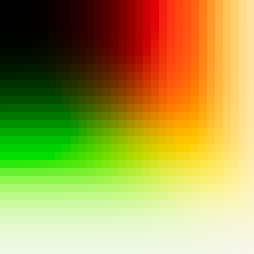
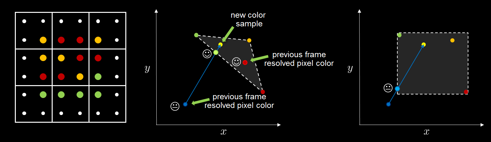
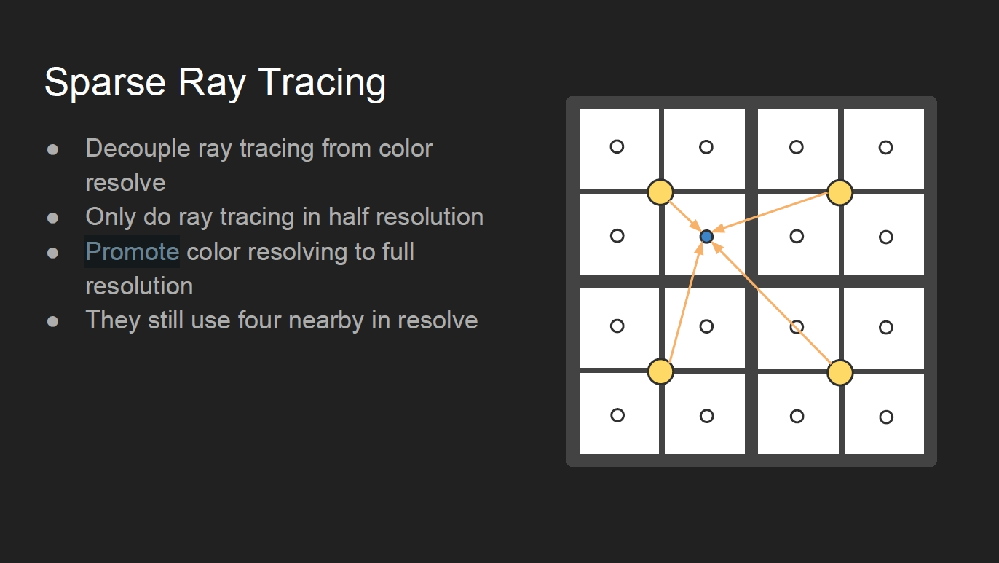
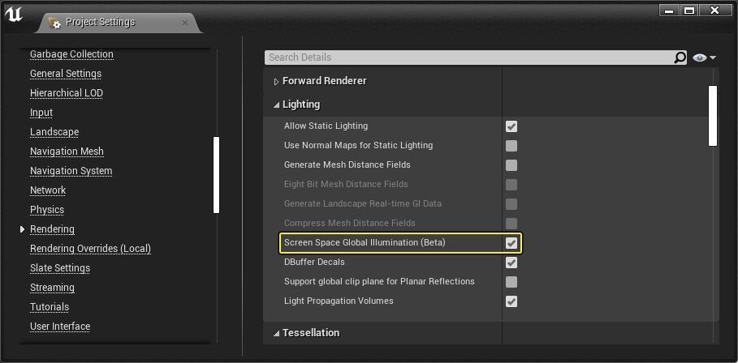
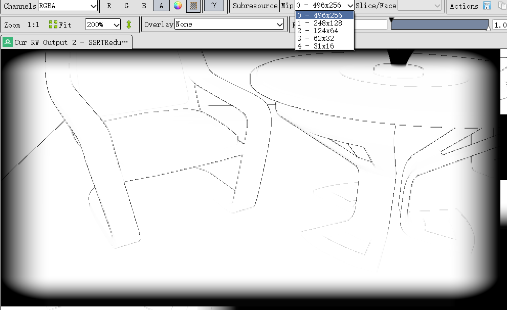

# [剖析虚幻渲染体系（07）- 后处理](https://www.cnblogs.com/timlly/p/15048404.html)


目录

- 7.1 本篇概述
  - [7.1.1 本篇内容](https://www.cnblogs.com/timlly/p/15048404.html#711-本篇内容)
  - [7.1.2 后处理重要性](https://www.cnblogs.com/timlly/p/15048404.html#712-后处理重要性)
- 7.2 后处理基础
  - [7.2.1 后处理简介](https://www.cnblogs.com/timlly/p/15048404.html#721-后处理简介)
  - [7.2.2 后处理体积](https://www.cnblogs.com/timlly/p/15048404.html#722-后处理体积)
  - [7.2.3 后处理材质](https://www.cnblogs.com/timlly/p/15048404.html#723-后处理材质)
- 7.3 后处理流程
  - [7.3.1 AddPostProcessingPasses](https://www.cnblogs.com/timlly/p/15048404.html#731-addpostprocessingpasses)
  - [7.3.2 TOverridePassSequence](https://www.cnblogs.com/timlly/p/15048404.html#732-toverridepasssequence)
  - [7.3.3 BlendableLocation](https://www.cnblogs.com/timlly/p/15048404.html#733-blendablelocation)
  - [7.3.4 PostProcessMaterial](https://www.cnblogs.com/timlly/p/15048404.html#734-postprocessmaterial)
- 7.4 后处理技术
  - [7.4.1 Gamma和线性空间](https://www.cnblogs.com/timlly/p/15048404.html#741-gamma和线性空间)
  - [7.4.2 HDR和色调映射](https://www.cnblogs.com/timlly/p/15048404.html#742-hdr和色调映射)
  - [7.4.3 Screen Percentage](https://www.cnblogs.com/timlly/p/15048404.html#743-screen-percentage)
  - [7.4.4 FXAA](https://www.cnblogs.com/timlly/p/15048404.html#744-fxaa)
  - [7.4.5 TAA](https://www.cnblogs.com/timlly/p/15048404.html#745-taa)
  - [7.4.6 SSR](https://www.cnblogs.com/timlly/p/15048404.html#746-ssr)
  - [7.4.7 SSAO](https://www.cnblogs.com/timlly/p/15048404.html#747-ssao)
  - 7.4.8 SSGI
    - [7.4.8.1 SSGI渲染](https://www.cnblogs.com/timlly/p/15048404.html#7481-ssgi渲染)
    - [7.4.8.2 SSGI降噪](https://www.cnblogs.com/timlly/p/15048404.html#7482-ssgi降噪)
    - [7.4.8.3 SSGI组合](https://www.cnblogs.com/timlly/p/15048404.html#7483-ssgi组合)
  - [7.4.9 其它后处理](https://www.cnblogs.com/timlly/p/15048404.html#749-其它后处理)
- 7.5 本篇总结
  - [7.5.1 本篇思考](https://www.cnblogs.com/timlly/p/15048404.html#751-本篇思考)
- [特别说明](https://www.cnblogs.com/timlly/p/15048404.html#特别说明)
- [参考文献](https://www.cnblogs.com/timlly/p/15048404.html#参考文献)


 

 

# **7.1 本篇概述**

为了与时俱进，紧跟UE官方的步伐，从本篇起：

分析的**UE源码升级到4.26.2**，不再是4.25的源码！

分析的**UE源码升级到4.26.2**，不再是4.25的源码！！

分析的**UE源码升级到4.26.2**，不再是4.25的源码！！！

重要的事情说三遍，需要同步看源码的同学注意更新了。

## **7.1.1 本篇内容**

其实在[剖析虚幻渲染体系（04）- 延迟渲染管线](https://www.cnblogs.com/timlly/p/14732412.html)的章节[4.3.9 PostProcessing](https://www.cnblogs.com/timlly/p/14732412.html#439-postprocessing)就已经粗略地介绍过后处理的内容，不过本篇将更加深入详细地阐述后处理的流程和主要技术点。

更具体地，本篇主要阐述UE的以下内容：

- 后处理主流程
- 后处理序列
- 后处理主要技术点

不过，还是推荐先阅读[剖析虚幻渲染体系（04）- 延迟渲染管线](https://www.cnblogs.com/timlly/p/14732412.html)，再阅读此篇，保持循序渐进地学习UE渲染体系的步伐。另外，也推荐先阅读笔者的一篇文章[2.1 色彩理论](https://www.cnblogs.com/timlly/p/11664635.html#21-色彩理论)，对颜色空间、色彩理论、线性空间和Gamma校正有了清晰的认知之后更好地过渡到本篇文章。

本篇涉及的源码目录主要在：

- Engine\Source\Runtime\Renderer\Private\PostProcess\
- Engine\Shaders\Private\

## **7.1.2 后处理重要性**

可能有些同学会疑惑，后处理不就是对渲染完的图片进行处理吗？跟图形渲染的紧密性有那么大么？可以忽略学习后处理么？

为了解答以上疑问，也体现后处理的重要性，以及其在UE或图形渲染的关联和地位，特地开辟了此小节。

以UE的默认场景为例，它的画面如下：


现在用以下命令行关闭所有后处理：

```
ShowFlag.PostProcessing 0
```

结果画面变成了下面这般模样：


用RenderDoc截帧，发现上面的画面其实还应用了后处理阶段的Gamma校正，好家伙，把它也关了，由此得到彻底没有后处理的画面：


对比第一幅图，看到差别了么？是不是颜色的亮度、对比度、色彩、还有锯齿都不一样？

这也印证了，即便你没有对后处理做任何设置或更改，UE依然在默认情况下执行了很多后处理，才使得渲染画面最终正常地呈现在屏幕前。

由此可知，后处理之于渲染、之于UE，有着何等重要的位置。有了后处理，我们便可如虎添翼，画龙点睛，让画面才更加可信、生动、有趣。

实际上，后处理的应用远不止于此，结合深度、法线等屏幕空间的信息之后，将拥有更广阔更丰富的魔法世界。

 

# **7.2 后处理基础**

本章将阐述后处理的一些基础知识点和概念及UE的操作使用。

## **7.2.1 后处理简介**

艺术家和设计师使用虚幻引擎提供的后期处理效果，可以调整场景的整体外观和感觉。

默认情况下，UE会开启抗锯齿、自动曝光、Bloom、色调映射和Gamma校正等后处理：


当然，可以通过场景视图的Show/Post Processing菜单下的选项动态开启关闭后处理，以便观察指定后处理的对场景产生的效果和变化。


也可以通过之前提及的控制台命令开启或关闭后处理。

## **7.2.2 后处理体积**

对于艺术家，更通用且方便的方法是往场景拖曳后处理体积（Post Processing Volume），以便精确地控制后处理效果和参数。


后处理体积涉及的类型和参数非常多，下面是后处理体积的属性分类：


其中**Lens**是镜头相关的后处理效果，包含Bloom、Exposure、Flares、DOF等效果；**Color Grading**是颜色分级，包含白平衡、全局、阴影、中调、高调等效果；**Film**就是电影色调映射，可以调整斜度、低调、黑色、肩部、白色等曲线参数；**Rendering Feature**包含了渲染管线相关的效果，包含后处理材质、环境立方图、AO、光追相关特性、GI、运动模糊、LPV、反射、SSR、透明、路径追踪以及屏幕百分比；最后是**Post Processing Volume Setting**，可以指定优先级、混合权重、设定是否影响无限范围（上图）。

同一个场景可以同时存在多个后处理体积，但为了性能和可维护性，应该保持一个场景只有一个全局后处理（Infinite Extent），其余的设置为局部范围。

## **7.2.3 后处理材质**

虽然后处理体积提供了很多内置的后处理效果，但渲染的效果千变万化，它们肯定无法全部满足应用的实际需求。UE的后处理材质（Post Processing Material）便满足自定义要求，可以利用材质编辑器实现自定义的后处理效果。

添加后处理材质也不复杂，新建材质，将材质域（Material Domain）设置为Post Process，此时材质引脚只有Emissive Color被点亮：


并且Post Process Material属性栏处于可编辑状态：


这些参数的含义说明如下：

- **Blendable Location**：材质混合位置，可选的有After Tonemapping（色调映射之后）、Before Tonemapping（色调映射之前）、Before Translucency（透明之前）、Replacing Tonemapping（替换色调映射）、SSR Input（屏幕空间反射输入），默认是After Tonemapping（色调映射之后）。
- **Output Alpha**：是否输出Alpha，如果是，则需要正确处理和输出Emissive Color的Alpha通道。默认不开启。
- **Blendable Priority**：混合优先级，数值越高越后被渲染（即优先级小的先被渲染）。默认是0。
- **Is Blendable**：是否可混合，如果可混合，会在C++层预先插值混合共享同一母材质的所有材质（或材质实例）参数。默认是可以。
- **Enable Stencil Test**：是否开启模板测试，如果开启，可以设置比较方式和参考值。默认不开启。

编辑好后处理材质之后，为了将它应用到场景上，可以在后处理体积的Rendering Feature属性栏的Post Process Material列表中设置：


还可以调整每个材质的混合权重和顺序（拖曳权重左边的点阵）。

值得注意的是，在后处理材质中，SceneTexture材质节点的SceneColor无法访问，否则会报错：


*后处理材质中无法访问SceneColor，提示SceneColor只能在Surface材质域中使用。*

解决这个问题就是选中SceneTexture节点，在属性栏的Scene Texture Id选择PostProcessInput0：


除了PostProcessInput0，还有其它很多屏幕空间的数据（GBuffer）可以被后处理材质读取：


但是，在多数后处理通道中，PostProcessInput1~PostProcessInput6是空纹理。

 

# **7.3 后处理流程**

本章将进入UE的后处理代码进行分析。

## **7.3.1 AddPostProcessingPasses**

后处理的主入口是`AddPostProcessingPasses`，位于的`FDeferred`末尾：

```c++
void FDeferredShadingSceneRenderer::Render(FRHICommandListImmediate& RHICmdList)
{
    (......)
    
    RenderTranslucency(RHICmdList, ...);
    
    (......)
    
    // 后处理阶段。
    if (ViewFamily.bResolveScene)
    {
        GRenderTargetPool.AddPhaseEvent(TEXT("PostProcessing"));

        (......)
        
        // 后处理的输入参数.
        FPostProcessingInputs PostProcessingInputs;
        PostProcessingInputs.ViewFamilyTexture = ViewFamilyTexture;
        PostProcessingInputs.SeparateTranslucencyTextures = &SeparateTranslucencyTextures;
        PostProcessingInputs.SceneTextures = SceneTextures;

        (......)
        
        {
            // 遍历所有view, 每个view增加后处理Pass.
            for (int32 ViewIndex = 0; ViewIndex < Views.Num(); ViewIndex++)
            {
                FViewInfo& View = Views[ViewIndex];
                // 增加后处理通道.
                AddPostProcessingPasses(GraphBuilder, View, PostProcessingInputs);
            }
        }

        // 将场景上下文的场景颜色纹理置空.
        AddPass(GraphBuilder, [this, &SceneContext](FRHICommandListImmediate&)
        {
            SceneContext.SetSceneColor(nullptr);
        });
    }
    
    (......)
}
```

`AddPostProcessingPasses`是处理UE内置后处理序列的，涉及的代码量大，不过下面先分析其主要流程：

```c++
// Engine\Source\Runtime\Renderer\Private\PostProcess\PostProcessing.cpp

void AddPostProcessingPasses(FRDGBuilder& GraphBuilder, const FViewInfo& View, const FPostProcessingInputs& Inputs)
{
    Inputs.Validate();

    // 获取纹理和视图数据.
    const FIntRect PrimaryViewRect = View.ViewRect;
    const FSceneTextureParameters SceneTextureParameters = GetSceneTextureParameters(GraphBuilder, Inputs.SceneTextures);
    const FScreenPassRenderTarget ViewFamilyOutput = FScreenPassRenderTarget::CreateViewFamilyOutput(Inputs.ViewFamilyTexture, View);
    const FScreenPassTexture SceneDepth(SceneTextureParameters.SceneDepthTexture, PrimaryViewRect);
    const FScreenPassTexture SeparateTranslucency(Inputs.SeparateTranslucencyTextures->GetColorForRead(GraphBuilder), PrimaryViewRect);
    const FScreenPassTexture CustomDepth((*Inputs.SceneTextures)->CustomDepthTexture, PrimaryViewRect);
    const FScreenPassTexture Velocity(SceneTextureParameters.GBufferVelocityTexture, PrimaryViewRect);
    const FScreenPassTexture BlackDummy(GSystemTextures.GetBlackDummy(GraphBuilder));

    // 场景颜色.
    FScreenPassTexture SceneColor((*Inputs.SceneTextures)->SceneColorTexture, PrimaryViewRect);
    FScreenPassTexture SceneColorBeforeTonemap;
    FScreenPassTexture SceneColorAfterTonemap;
    const FScreenPassTexture OriginalSceneColor = SceneColor;

    // 初始化纹理.
    const FEyeAdaptationParameters EyeAdaptationParameters = GetEyeAdaptationParameters(View, ERHIFeatureLevel::SM5);
    FRDGTextureRef LastEyeAdaptationTexture = GetEyeAdaptationTexture(GraphBuilder, View);
    FRDGTextureRef EyeAdaptationTexture = LastEyeAdaptationTexture;
    FRDGTextureRef HistogramTexture = BlackDummy.Texture;

    // 处理后处理开启标记.
    const FEngineShowFlags& EngineShowFlags = View.Family->EngineShowFlags;
    const bool bVisualizeHDR = EngineShowFlags.VisualizeHDR;
    const bool bViewFamilyOutputInHDR = GRHISupportsHDROutput && IsHDREnabled();
    const bool bVisualizeGBufferOverview = IsVisualizeGBufferOverviewEnabled(View);
    const bool bVisualizeGBufferDumpToFile = IsVisualizeGBufferDumpToFileEnabled(View);
    const bool bVisualizeGBufferDumpToPIpe = IsVisualizeGBufferDumpToPipeEnabled(View);
    const bool bOutputInHDR = IsPostProcessingOutputInHDR();

    const FPaniniProjectionConfig PaniniConfig(View);

    // 后处理特定Pass.
    enum class EPass : uint32
    {
        MotionBlur,    // 运动模糊
        Tonemap,     // 色调映射
        FXAA,        // FXAA抗锯齿    
        PostProcessMaterialAfterTonemapping, // 色调映射之后的后处理
        VisualizeDepthOfField,
        VisualizeStationaryLightOverlap,
        VisualizeLightCulling,
        SelectionOutline,
        EditorPrimitive,
        VisualizeShadingModels,
        VisualizeGBufferHints,
        VisualizeSubsurface,
        VisualizeGBufferOverview,
        VisualizeHDR,
        PixelInspector,
        HMDDistortion,
        HighResolutionScreenshotMask,
        PrimaryUpscale,     // 主放大
        SecondaryUpscale,     // 次放大
        MAX
    };
    
    (......)

    // 后处理特定Pass对应的名字.
    const TCHAR* PassNames[] =
    {
        TEXT("MotionBlur"),
        TEXT("Tonemap"),
        TEXT("FXAA"),
        TEXT("PostProcessMaterial (AfterTonemapping)"),
        TEXT("VisualizeDepthOfField"),
        TEXT("VisualizeStationaryLightOverlap"),
        TEXT("VisualizeLightCulling"),
        TEXT("SelectionOutline"),
        TEXT("EditorPrimitive"),
        TEXT("VisualizeShadingModels"),
        TEXT("VisualizeGBufferHints"),
        TEXT("VisualizeSubsurface"),
        TEXT("VisualizeGBufferOverview"),
        TEXT("VisualizeHDR"),
        TEXT("PixelInspector"),
        TEXT("HMDDistortion"),
        TEXT("HighResolutionScreenshotMask"),
        TEXT("PrimaryUpscale"),
        TEXT("SecondaryUpscale")
    };

    static_assert(static_cast<uint32>(EPass::MAX) == UE_ARRAY_COUNT(PassNames), "EPass does not match PassNames.");

    // 声明后处理序列PassSequence实例.
    TOverridePassSequence<EPass> PassSequence(ViewFamilyOutput);
    PassSequence.SetNames(PassNames, UE_ARRAY_COUNT(PassNames));
    
    // 开启或关闭指定Pass.
    PassSequence.SetEnabled(EPass::VisualizeStationaryLightOverlap, EngineShowFlags.StationaryLightOverlap);
    PassSequence.SetEnabled(EPass::VisualizeLightCulling, EngineShowFlags.VisualizeLightCulling);
    PassSequence.SetEnabled(EPass::SelectionOutline, false);
    PassSequence.SetEnabled(EPass::EditorPrimitive, false);
    PassSequence.SetEnabled(EPass::VisualizeShadingModels, EngineShowFlags.VisualizeShadingModels);
    PassSequence.SetEnabled(EPass::VisualizeGBufferHints, EngineShowFlags.GBufferHints);
    PassSequence.SetEnabled(EPass::VisualizeSubsurface, EngineShowFlags.VisualizeSSS);
    PassSequence.SetEnabled(EPass::VisualizeGBufferOverview, bVisualizeGBufferOverview || bVisualizeGBufferDumpToFile || bVisualizeGBufferDumpToPIpe);
    PassSequence.SetEnabled(EPass::VisualizeHDR, EngineShowFlags.VisualizeHDR);
    PassSequence.SetEnabled(EPass::PixelInspector, false);
    PassSequence.SetEnabled(EPass::HMDDistortion, EngineShowFlags.StereoRendering && EngineShowFlags.HMDDistortion);
    PassSequence.SetEnabled(EPass::HighResolutionScreenshotMask, IsHighResolutionScreenshotMaskEnabled(View));
    PassSequence.SetEnabled(EPass::PrimaryUpscale, PaniniConfig.IsEnabled() || (View.PrimaryScreenPercentageMethod == EPrimaryScreenPercentageMethod::SpatialUpscale && PrimaryViewRect.Size() != View.GetSecondaryViewRectSize()));
    PassSequence.SetEnabled(EPass::SecondaryUpscale, View.RequiresSecondaryUpscale());
    
    (......)

    if (IsPostProcessingEnabled(View)) // 视图启用后处理
    {
        const EStereoscopicPass StereoPass = View.StereoPass;
        
        // 处理数据和标记.
        const bool bPrimaryView = IStereoRendering::IsAPrimaryView(View);
        const bool bHasViewState = View.ViewState != nullptr;
        const bool bDepthOfFieldEnabled = DiaphragmDOF::IsEnabled(View);
        const bool bVisualizeDepthOfField = bDepthOfFieldEnabled && EngineShowFlags.VisualizeDOF;
        const bool bVisualizeMotionBlur = IsVisualizeMotionBlurEnabled(View);
        const EAutoExposureMethod AutoExposureMethod = GetAutoExposureMethod(View);
        const EAntiAliasingMethod AntiAliasingMethod = !bVisualizeDepthOfField ? View.AntiAliasingMethod : AAM_None;
        const EDownsampleQuality DownsampleQuality = GetDownsampleQuality();
        const EPixelFormat DownsampleOverrideFormat = PF_FloatRGB;
        const bool bMotionBlurEnabled = !bVisualizeMotionBlur && IsMotionBlurEnabled(View);
        const bool bTonemapEnabled = !bVisualizeMotionBlur;
        const bool bTonemapOutputInHDR = View.Family->SceneCaptureSource == SCS_FinalColorHDR || View.Family->SceneCaptureSource == SCS_FinalToneCurveHDR || bOutputInHDR || bViewFamilyOutputInHDR;
        const bool bEyeAdaptationEnabled = bHasViewState && bPrimaryView;
        const bool bHistogramEnabled = bVisualizeHDR || (bEyeAdaptationEnabled && AutoExposureMethod == EAutoExposureMethod::AEM_Histogram && View.FinalPostProcessSettings.AutoExposureMinBrightness < View.FinalPostProcessSettings.AutoExposureMaxBrightness);
        const bool bBloomEnabled = View.FinalPostProcessSettings.BloomIntensity > 0.0f;

        // 色调映射之后的后处理材质.
        const FPostProcessMaterialChain PostProcessMaterialAfterTonemappingChain = GetPostProcessMaterialChain(View, BL_AfterTonemapping);

        PassSequence.SetEnabled(EPass::MotionBlur, bVisualizeMotionBlur || bMotionBlurEnabled);
        PassSequence.SetEnabled(EPass::Tonemap, bTonemapEnabled);
        PassSequence.SetEnabled(EPass::FXAA, AntiAliasingMethod == AAM_FXAA);
        PassSequence.SetEnabled(EPass::PostProcessMaterialAfterTonemapping, PostProcessMaterialAfterTonemappingChain.Num() != 0);
        PassSequence.SetEnabled(EPass::VisualizeDepthOfField, bVisualizeDepthOfField);

        // 插件后处理回调.
        for (int32 ViewExt = 0; ViewExt < View.Family->ViewExtensions.Num(); ++ViewExt)
        {
            for (int32 SceneViewPassId = 0; SceneViewPassId != static_cast<int>(ISceneViewExtension::EPostProcessingPass::MAX); SceneViewPassId++)
            {
                ISceneViewExtension::EPostProcessingPass SceneViewPass = static_cast<ISceneViewExtension::EPostProcessingPass>(SceneViewPassId);
                EPass PostProcessingPass = TranslatePass(SceneViewPass);

                View.Family->ViewExtensions[ViewExt]->SubscribeToPostProcessingPass(
                    SceneViewPass,
                    PassSequence.GetAfterPassCallbacks(PostProcessingPass),
                    PassSequence.IsEnabled(PostProcessingPass));
            }
        }

        // 后处理序列开启或关闭处理完毕.
        PassSequence.Finalize();

        // 后处理材质链 - 透明混合之前(Before Translucency)
        {
            const FPostProcessMaterialChain MaterialChain = GetPostProcessMaterialChain(View, BL_BeforeTranslucency);

            if (MaterialChain.Num())
            {
                SceneColor = AddPostProcessMaterialChain(GraphBuilder, View, GetPostProcessMaterialInputs(SceneColor), MaterialChain);
            }
        }

        // 光圈DOF
        {
            FRDGTextureRef LocalSceneColorTexture = SceneColor.Texture;

            if (bDepthOfFieldEnabled)
            {
                LocalSceneColorTexture = DiaphragmDOF::AddPasses(GraphBuilder, SceneTextureParameters, View, SceneColor.Texture, *Inputs.SeparateTranslucencyTextures);
            }

            if (LocalSceneColorTexture == SceneColor.Texture)
            {
                LocalSceneColorTexture = AddSeparateTranslucencyCompositionPass(GraphBuilder, View, SceneColor.Texture, *Inputs.SeparateTranslucencyTextures);
            }

            SceneColor.Texture = LocalSceneColorTexture;
        }

        // 后处理材质链 - 色调映射之前(Before Tonemapping)
        {
            const FPostProcessMaterialChain MaterialChain = GetPostProcessMaterialChain(View, BL_BeforeTonemapping);

            if (MaterialChain.Num())
            {
                SceneColor = AddPostProcessMaterialChain(GraphBuilder, View, GetPostProcessMaterialInputs(SceneColor), MaterialChain);
            }
        }

        FScreenPassTexture HalfResolutionSceneColor;

        // 主视图区域.
        FIntRect SecondaryViewRect = PrimaryViewRect;

        // 时间抗锯齿TAA.
        if (AntiAliasingMethod == AAM_TemporalAA)
        {
            // 是否允许场景颜色下采样.
            const bool bAllowSceneDownsample =
                IsTemporalAASceneDownsampleAllowed(View) &&
                // We can only merge if the normal downsample pass would happen immediately after.
                !bMotionBlurEnabled && !bVisualizeMotionBlur &&
                // TemporalAA is only able to match the low quality mode (box filter).
                GetDownsampleQuality() == EDownsampleQuality::Low;

            int32 UpscaleMode = ITemporalUpscaler::GetTemporalUpscalerMode();

            const ITemporalUpscaler* DefaultTemporalUpscaler = ITemporalUpscaler::GetDefaultTemporalUpscaler();
            const ITemporalUpscaler* UpscalerToUse = ( UpscaleMode == 0 || !View.Family->GetTemporalUpscalerInterface())? DefaultTemporalUpscaler : View.Family->GetTemporalUpscalerInterface();

            const TCHAR* UpscalerName = UpscalerToUse->GetDebugName();

            (......)

            ITemporalUpscaler::FPassInputs UpscalerPassInputs;

            UpscalerPassInputs.bAllowDownsampleSceneColor = bAllowSceneDownsample;
            UpscalerPassInputs.DownsampleOverrideFormat = DownsampleOverrideFormat;
            UpscalerPassInputs.SceneColorTexture = SceneColor.Texture;
            UpscalerPassInputs.SceneDepthTexture = SceneDepth.Texture;
            UpscalerPassInputs.SceneVelocityTexture = Velocity.Texture;
            UpscalerPassInputs.EyeAdaptationTexture = GetEyeAdaptationTexture(GraphBuilder, View);

            // 增加TAA Pass.
            UpscalerToUse->AddPasses(
                GraphBuilder,
                View,
                UpscalerPassInputs,
                &SceneColor.Texture,
                &SecondaryViewRect,
                &HalfResolutionSceneColor.Texture,
                &HalfResolutionSceneColor.ViewRect);
        }
        // 屏幕空间反射(SSR).
        else if (ShouldRenderScreenSpaceReflections(View))
        {
            if (!View.bStatePrevViewInfoIsReadOnly)
            {
                check(View.ViewState);
                FTemporalAAHistory& OutputHistory = View.ViewState->PrevFrameViewInfo.TemporalAAHistory;
                GraphBuilder.QueueTextureExtraction(SceneColor.Texture, &OutputHistory.RT[0]);

                FTAAPassParameters TAAInputs(View);
                TAAInputs.SceneColorInput = SceneColor.Texture;
                TAAInputs.SetupViewRect(View);
                OutputHistory.ViewportRect = TAAInputs.OutputViewRect;
                OutputHistory.ReferenceBufferSize = TAAInputs.GetOutputExtent() * TAAInputs.ResolutionDivisor;
            }
        }

        // 场景颜色视图区域编程次视图的.
        SceneColor.ViewRect = SecondaryViewRect;

        // 后处理材质链 - 屏幕空间反射输入(SSR Input)
        if (View.ViewState && !View.bStatePrevViewInfoIsReadOnly)
        {
            const FPostProcessMaterialChain MaterialChain = GetPostProcessMaterialChain(View, BL_SSRInput);

            if (MaterialChain.Num())
            {
                // 保存SSR的后处理输出给下一帧使用.
                FScreenPassTexture PassOutput = AddPostProcessMaterialChain(GraphBuilder, View, GetPostProcessMaterialInputs(SceneColor), MaterialChain);
                GraphBuilder.QueueTextureExtraction(PassOutput.Texture, &View.ViewState->PrevFrameViewInfo.CustomSSRInput);
            }
        }

        // 运动模糊.
        if (PassSequence.IsEnabled(EPass::MotionBlur))
        {
            FMotionBlurInputs PassInputs;
            PassSequence.AcceptOverrideIfLastPass(EPass::MotionBlur, PassInputs.OverrideOutput);
            PassInputs.SceneColor = SceneColor;
            PassInputs.SceneDepth = SceneDepth;
            PassInputs.SceneVelocity = Velocity;
            PassInputs.Quality = GetMotionBlurQuality();
            PassInputs.Filter = GetMotionBlurFilter();

            if (bVisualizeMotionBlur)
            {
                SceneColor = AddVisualizeMotionBlurPass(GraphBuilder, View, PassInputs);
            }
            else
            {
                SceneColor = AddMotionBlurPass(GraphBuilder, View, PassInputs);
            }
        }

        SceneColor = AddAfterPass(EPass::MotionBlur, SceneColor);

        // 如果TAA没有下采样场景颜色, 这里将采用半尺寸分辨率执行之.
        if (!HalfResolutionSceneColor.Texture)
        {
            FDownsamplePassInputs PassInputs;
            PassInputs.Name = TEXT("HalfResolutionSceneColor");
            PassInputs.SceneColor = SceneColor;
            PassInputs.Quality = DownsampleQuality;
            PassInputs.FormatOverride = DownsampleOverrideFormat;

            HalfResolutionSceneColor = AddDownsamplePass(GraphBuilder, View, PassInputs);
        }

        // 保存半尺寸分辨率的场景颜色到历史中.
        extern int32 GSSRHalfResSceneColor;
        if (ShouldRenderScreenSpaceReflections(View) && !View.bStatePrevViewInfoIsReadOnly && GSSRHalfResSceneColor)
        {
            check(View.ViewState);
            GraphBuilder.QueueTextureExtraction(HalfResolutionSceneColor.Texture, &View.ViewState->PrevFrameViewInfo.HalfResTemporalAAHistory);
        }

        FSceneDownsampleChain SceneDownsampleChain;

        // 直方图.
        if (bHistogramEnabled)
        {
            HistogramTexture = AddHistogramPass(GraphBuilder, View, EyeAdaptationParameters, HalfResolutionSceneColor, LastEyeAdaptationTexture);
        }

        // 人眼适应(自动曝光).
        if (bEyeAdaptationEnabled)
        {
            const bool bBasicEyeAdaptationEnabled = bEyeAdaptationEnabled && (AutoExposureMethod == EAutoExposureMethod::AEM_Basic);

            if (bBasicEyeAdaptationEnabled)
            {
                const bool bLogLumaInAlpha = true;
                SceneDownsampleChain.Init(GraphBuilder, View, EyeAdaptationParameters, HalfResolutionSceneColor, DownsampleQuality, bLogLumaInAlpha);

                // Use the alpha channel in the last downsample (smallest) to compute eye adaptations values.
                EyeAdaptationTexture = AddBasicEyeAdaptationPass(GraphBuilder, View, EyeAdaptationParameters, SceneDownsampleChain.GetLastTexture(), LastEyeAdaptationTexture);
            }
            // Add histogram eye adaptation pass even if no histogram exists to support the manual clamping mode.
            else
            {
                EyeAdaptationTexture = AddHistogramEyeAdaptationPass(GraphBuilder, View, EyeAdaptationParameters, HistogramTexture);
            }
        }

        FScreenPassTexture Bloom;

        // 泛光.
        if (bBloomEnabled)
        {
            FSceneDownsampleChain BloomDownsampleChain;

            FBloomInputs PassInputs;
            PassInputs.SceneColor = SceneColor;

            const bool bBloomThresholdEnabled = View.FinalPostProcessSettings.BloomThreshold > -1.0f;

            // Reuse the main scene downsample chain if a threshold isn't required for bloom.
            if (SceneDownsampleChain.IsInitialized() && !bBloomThresholdEnabled)
            {
                PassInputs.SceneDownsampleChain = &SceneDownsampleChain;
            }
            else
            {
                FScreenPassTexture DownsampleInput = HalfResolutionSceneColor;

                if (bBloomThresholdEnabled)
                {
                    const float BloomThreshold = View.FinalPostProcessSettings.BloomThreshold;

                    FBloomSetupInputs SetupPassInputs;
                    SetupPassInputs.SceneColor = DownsampleInput;
                    SetupPassInputs.EyeAdaptationTexture = EyeAdaptationTexture;
                    SetupPassInputs.Threshold = BloomThreshold;

                    DownsampleInput = AddBloomSetupPass(GraphBuilder, View, SetupPassInputs);
                }

                const bool bLogLumaInAlpha = false;
                BloomDownsampleChain.Init(GraphBuilder, View, EyeAdaptationParameters, DownsampleInput, DownsampleQuality, bLogLumaInAlpha);

                PassInputs.SceneDownsampleChain = &BloomDownsampleChain;
            }

            FBloomOutputs PassOutputs = AddBloomPass(GraphBuilder, View, PassInputs);
            SceneColor = PassOutputs.SceneColor;
            Bloom = PassOutputs.Bloom;

            FScreenPassTexture LensFlares = AddLensFlaresPass(GraphBuilder, View, Bloom, *PassInputs.SceneDownsampleChain);

            if (LensFlares.IsValid())
            {
                Bloom = LensFlares;
            }
        }

        if (!Bloom.IsValid())
        {
            Bloom = BlackDummy;
        }

        SceneColorBeforeTonemap = SceneColor;

        // 色调映射.
        if (PassSequence.IsEnabled(EPass::Tonemap))
        {
            const FPostProcessMaterialChain MaterialChain = GetPostProcessMaterialChain(View, BL_ReplacingTonemapper);

            if (MaterialChain.Num())
            {
                const UMaterialInterface* HighestPriorityMaterial = MaterialChain[0];

                FPostProcessMaterialInputs PassInputs;
                PassSequence.AcceptOverrideIfLastPass(EPass::Tonemap, PassInputs.OverrideOutput);
                PassInputs.SetInput(EPostProcessMaterialInput::SceneColor, SceneColor);
                PassInputs.SetInput(EPostProcessMaterialInput::SeparateTranslucency, SeparateTranslucency);
                PassInputs.SetInput(EPostProcessMaterialInput::CombinedBloom, Bloom);
                PassInputs.SceneTextures = GetSceneTextureShaderParameters(Inputs.SceneTextures);
                PassInputs.CustomDepthTexture = CustomDepth.Texture;

                SceneColor = AddPostProcessMaterialPass(GraphBuilder, View, PassInputs, HighestPriorityMaterial);
            }
            else
            {
                FRDGTextureRef ColorGradingTexture = nullptr;

                if (bPrimaryView)
                {
                    ColorGradingTexture = AddCombineLUTPass(GraphBuilder, View);
                }
                // We can re-use the color grading texture from the primary view.
                else if (View.GetTonemappingLUT())
                {
                    ColorGradingTexture = TryRegisterExternalTexture(GraphBuilder, View.GetTonemappingLUT());
                }
                else
                {
                    const FViewInfo* PrimaryView = static_cast<const FViewInfo*>(View.Family->Views[0]);
                    ColorGradingTexture = TryRegisterExternalTexture(GraphBuilder, PrimaryView->GetTonemappingLUT());
                }

                FTonemapInputs PassInputs;
                PassSequence.AcceptOverrideIfLastPass(EPass::Tonemap, PassInputs.OverrideOutput);
                PassInputs.SceneColor = SceneColor;
                PassInputs.Bloom = Bloom;
                PassInputs.EyeAdaptationTexture = EyeAdaptationTexture;
                PassInputs.ColorGradingTexture = ColorGradingTexture;
                PassInputs.bWriteAlphaChannel = AntiAliasingMethod == AAM_FXAA || IsPostProcessingWithAlphaChannelSupported();
                PassInputs.bOutputInHDR = bTonemapOutputInHDR;

                SceneColor = AddTonemapPass(GraphBuilder, View, PassInputs);
            }
        }
        
        SceneColor = AddAfterPass(EPass::Tonemap, SceneColor);
        
        SceneColorAfterTonemap = SceneColor;

        // FXAA抗锯齿.
        if (PassSequence.IsEnabled(EPass::FXAA))
        {
            FFXAAInputs PassInputs;
            PassSequence.AcceptOverrideIfLastPass(EPass::FXAA, PassInputs.OverrideOutput);
            PassInputs.SceneColor = SceneColor;
            PassInputs.Quality = GetFXAAQuality();

            SceneColor = AddFXAAPass(GraphBuilder, View, PassInputs);
        }

        SceneColor = AddAfterPass(EPass::FXAA, SceneColor);

        // 后处理材质链 - 色调映射之后(After Tonemapping)
        if (PassSequence.IsEnabled(EPass::PostProcessMaterialAfterTonemapping))
        {
            FPostProcessMaterialInputs PassInputs = GetPostProcessMaterialInputs(SceneColor);
            PassSequence.AcceptOverrideIfLastPass(EPass::PostProcessMaterialAfterTonemapping, PassInputs.OverrideOutput);
            PassInputs.SetInput(EPostProcessMaterialInput::PreTonemapHDRColor, SceneColorBeforeTonemap);
            PassInputs.SetInput(EPostProcessMaterialInput::PostTonemapHDRColor, SceneColorAfterTonemap);
            PassInputs.SceneTextures = GetSceneTextureShaderParameters(Inputs.SceneTextures);

            SceneColor = AddPostProcessMaterialChain(GraphBuilder, View, PassInputs, PostProcessMaterialAfterTonemappingChain);
        }

        (......)

        SceneColor = AddAfterPass(EPass::VisualizeDepthOfField, SceneColor);
    }
    else // 视图不启用后处理, 则最小化后处理序列: 只混合透明纹理和Gamma校正.
    {
        PassSequence.SetEnabled(EPass::MotionBlur, false);
        PassSequence.SetEnabled(EPass::Tonemap, true);
        PassSequence.SetEnabled(EPass::FXAA, false);
        PassSequence.SetEnabled(EPass::PostProcessMaterialAfterTonemapping, false);
        PassSequence.SetEnabled(EPass::VisualizeDepthOfField, false);
        PassSequence.Finalize();

        SceneColor.Texture = AddSeparateTranslucencyCompositionPass(GraphBuilder, View, SceneColor.Texture, *Inputs.SeparateTranslucencyTextures);

        SceneColorBeforeTonemap = SceneColor;

        if (PassSequence.IsEnabled(EPass::Tonemap))
        {
            FTonemapInputs PassInputs;
            PassSequence.AcceptOverrideIfLastPass(EPass::Tonemap, PassInputs.OverrideOutput);
            PassInputs.SceneColor = SceneColor;
            PassInputs.EyeAdaptationTexture = EyeAdaptationTexture;
            PassInputs.bOutputInHDR = bViewFamilyOutputInHDR;
            PassInputs.bGammaOnly = true;

            SceneColor = AddTonemapPass(GraphBuilder, View, PassInputs);
        }

        SceneColor = AddAfterPass(EPass::Tonemap, SceneColor);

        SceneColorAfterTonemap = SceneColor;
    }

    // 可视化后处理Pass.
    if (PassSequence.IsEnabled(EPass::VisualizeStationaryLightOverlap))
    {
        (......)

        SceneColor = AddVisualizeComplexityPass(GraphBuilder, View, PassInputs);
    }

    (......) // 忽略编辑器或可视化代码.

    // 主放大Pass
    if (PassSequence.IsEnabled(EPass::PrimaryUpscale))
    {
        FUpscaleInputs PassInputs;
        PassSequence.AcceptOverrideIfLastPass(EPass::PrimaryUpscale, PassInputs.OverrideOutput);
        PassInputs.SceneColor = SceneColor;
        PassInputs.Method = GetUpscaleMethod();
        PassInputs.Stage = PassSequence.IsEnabled(EPass::SecondaryUpscale) ? EUpscaleStage::PrimaryToSecondary : EUpscaleStage::PrimaryToOutput;

        // 帕尼尼投影(Panini projection)由主放大通道处理。
        PassInputs.PaniniConfig = PaniniConfig;

        SceneColor = AddUpscalePass(GraphBuilder, View, PassInputs);
    }

    // 次放大Pass
    if (PassSequence.IsEnabled(EPass::SecondaryUpscale))
    {
        FUpscaleInputs PassInputs;
        PassSequence.AcceptOverrideIfLastPass(EPass::SecondaryUpscale, PassInputs.OverrideOutput);
        PassInputs.SceneColor = SceneColor;
        PassInputs.Method = View.Family->SecondaryScreenPercentageMethod == ESecondaryScreenPercentageMethod::LowerPixelDensitySimulation ? EUpscaleMethod::SmoothStep : EUpscaleMethod::Nearest;
        PassInputs.Stage = EUpscaleStage::SecondaryToOutput;

        SceneColor = AddUpscalePass(GraphBuilder, View, PassInputs);
    }
}
```

后处理材质会先声明一个TOverridePassSequence实例，然后按需开启或关闭它们，之后会根据视图是否启用后处理进入两个分支：如果启用，则按序列先后处理每个后处理效果；如果不启用，则只保留最小化的后处理序列，仅包含透明纹理混合和Gamma校正。

至于判断视图是否开启后处理，由以下接口实现：

```c++
bool IsPostProcessingEnabled(const FViewInfo& View)
{
    if (View.GetFeatureLevel() >= ERHIFeatureLevel::SM5) // 高于SM5的设备
    {
        return
            // 视图家族开启后处理
             View.Family->EngineShowFlags.PostProcessing &&
            // 并且不是可视化调试模式.
            !View.Family->EngineShowFlags.VisualizeDistanceFieldAO &&
            !View.Family->EngineShowFlags.VisualizeShadingModels &&
            !View.Family->EngineShowFlags.VisualizeMeshDistanceFields &&
            !View.Family->EngineShowFlags.VisualizeGlobalDistanceField &&
            !View.Family->EngineShowFlags.ShaderComplexity;
    }
    // < SM5的设备
    else
    {
        // 视图家族开启后处理且不开启着色复杂度调试模式且是移动端HDR管线.
        return View.Family->EngineShowFlags.PostProcessing && !View.Family->EngineShowFlags.ShaderComplexity && IsMobileHDR();
    }
}
```

这些特定后处理Pass都有统一的形式：输入纹理、输入参数、输出纹理，输入纹理必然包含SceneColor，输出纹理通常也是SceneColor，并且上一个后处理Pass的SceneColor输出作为下一个后处理Pass的SceneColor输入，以实现不同后处理效果的叠加。

另外，需要注意的是，有一些后处理（屏幕空间）的效果并没有在PassSequence中体现，而是安插在后处理渲染管线的特定位置中。

## **7.3.2 TOverridePassSequence**

由于后处理效果是叠加状态，意味着它们的混合（处理）顺序相关，如果处理顺序不当，将得到非预想的结果。

TOverridePassSequence就是给定一个枚举类型，按照特殊规则管理和有序地执行所有的Pass。它的定义如下：

```c++
// Engine\Source\Runtime\Renderer\Private\OverridePassSequence.h

template <typename EPass>
class TOverridePassSequence final
{
public:
    TOverridePassSequence(const FScreenPassRenderTarget& InOverrideOutput)
        : OverrideOutput(InOverrideOutput)
    {}

    ~TOverridePassSequence();

    // 设置名字
    void SetName(EPass Pass, const TCHAR* Name);
    void SetNames(const TCHAR* const* Names, uint32 NameCount);

    // 开启指定Pass.
    void SetEnabled(EPass Pass, bool bEnabled);
    bool IsEnabled(EPass Pass) const;

    // 是否最后一个Pass.
    bool IsLastPass(EPass Pass) const;

    // 接受Pass, 如果没有按顺序, 则会报错.
    void AcceptPass(EPass Pass)
    {
#if RDG_ENABLE_DEBUG
        const int32 PassIndex = (int32)Pass;

        check(bFinalized);
        checkf(NextPass == Pass, TEXT("Pass was accepted out of order: %s. Expected %s."), Passes[PassIndex].Name, Passes[(int32)NextPass].Name);
        checkf(Passes[PassIndex].bEnabled, TEXT("Only accepted passes can be enabled: %s."), Passes[PassIndex].Name);

        Passes[PassIndex].bAccepted = true;

        // Walk the remaining passes until we hit one that's enabled. This will be the next pass to add.
        for (int32 NextPassIndex = int32(NextPass) + 1; NextPassIndex < PassCountMax; ++NextPassIndex)
        {
            if (Passes[NextPassIndex].bEnabled)
            {
                NextPass = EPass(NextPassIndex);
                break;
            }
        }
#endif
    }

    // 如果Pass是最后一个, 则接受覆盖的RT.
    bool AcceptOverrideIfLastPass(EPass Pass, FScreenPassRenderTarget& OutTargetToOverride, const TOptional<int32>& AfterPassCallbackIndex = TOptional<int32>())
    {
        bool bLastAfterPass = AfterPass[(int32)Pass].Num() == 0;

        if (AfterPassCallbackIndex)
        {
            bLastAfterPass = AfterPassCallbackIndex.GetValue() == AfterPass[(int32)Pass].Num() - 1;
        }
        else
        {
            // Display debug information for a Pass unless it is an after pass.
            AcceptPass(Pass);
        }

        // We need to override output only if this is the last pass and the last after pass.
        if (IsLastPass(Pass) && bLastAfterPass)
        {
            OutTargetToOverride = OverrideOutput;
            return true;
        }

        return false;
    }

    // Pass开启结束.
    void Finalize()
    {
#if RDG_ENABLE_DEBUG
        check(!bFinalized);
        bFinalized = true;

        for (int32 PassIndex = 0; PassIndex < PassCountMax; ++PassIndex)
        {
            checkf(Passes[PassIndex].bAssigned, TEXT("Pass was not assigned to enabled or disabled: %s."), Passes[PassIndex].Name);
        }
#endif

        bool bFirstPass = true;

        for (int32 PassIndex = 0; PassIndex < PassCountMax; ++PassIndex)
        {
            if (Passes[PassIndex].bEnabled)
            {
                if (bFirstPass)
                {
#if RDG_ENABLE_DEBUG
                    NextPass = (EPass)PassIndex;
#endif
                    bFirstPass = false;
                }
                LastPass = (EPass)PassIndex;
            }
        }
    }

    FAfterPassCallbackDelegateArray& GetAfterPassCallbacks(EPass Pass);

private:
    static const int32 PassCountMax = (int32)EPass::MAX;

    struct FPassInfo
    {
#if RDG_ENABLE_DEBUG
        const TCHAR* Name = nullptr;
        bool bAssigned = false;
        bool bAccepted = false;
#endif
        bool bEnabled = false;
    };

    FScreenPassRenderTarget OverrideOutput;
    TStaticArray<FPassInfo, PassCountMax> Passes;
    TStaticArray<FAfterPassCallbackDelegateArray, PassCountMax> AfterPass;
    EPass LastPass = EPass::MAX;

#if RDG_ENABLE_DEBUG
    EPass NextPass = EPass(0);
    bool bFinalized = false;
#endif
};
```

通过TOverridePassSequence可以方便地实现、管理、执行一组有序的后处理效果。但也需要注意以下几点：

- PassSequence在处理完通道开启和关闭之后，需要手动调用一次`Finalize`，否则开发者模式下会报错。

- TOverridePassSequence需要显示开启和关闭指定通道，如果开启或关闭的通道和实际加入的Pass不一致，则会报错。下面详细地按某些情形讨论PassSequence是否会产生报错（开发模式下）：

  - 通道A被开启，没有向GraphBuilder添加Pass，没有调用`AcceptOverrideIfLastPass`，会报错。
  - 通道A被开启，向GraphBuilder添加了Pass，没有调用`AcceptOverrideIfLastPass`，会报错。
  - 通道A被开启，没有向GraphBuilder添加Pass，有调用`AcceptOverrideIfLastPass`，不会报错。PassSequence无法察觉到这种情况的异常！！
  - 通道A被关闭，向GraphBuilder添加了Pass，有调用`AcceptOverrideIfLastPass`，会报错。
  - 通道A被关闭，向GraphBuilder添加了Pass，没有调用`AcceptOverrideIfLastPass`，不会报错。PassSequence无法察觉到这种情况的异常！！
  - 如果通道A和B都被开启，但B在A之前向GraphBuilder添加了Pass并调用`AcceptOverrideIfLastPass`，会报错。

  举个具体的例子，有以下代码：

  ```c++
  // 关闭通道序列的FXAA.
  PassSequence.SetEnabled(EPass::FXAA, false);
  
  (......)
  
  // 构造FXAA输入参数
  FFXAAInputs PassInputs;
  // 调用Pass接受.
  PassSequence.AcceptOverrideIfLastPass(EPass::FXAA, PassInputs.OverrideOutput);
  PassInputs.SceneColor = SceneColor;
  PassInputs.Quality = GetFXAAQuality();
  
  // 加入FXAA通道.
  SceneColor = AddFXAAPass(GraphBuilder, View, PassInputs);
  ```

  由于以上代码中已经关闭了PassSequence的FXAA通道，但又尝试进行对其添加通道并调用`AcceptOverrideIfLastPass`，则开发者模式下会报以下错误：

  

  意思是说Pass没有按照开启的Pass顺序被接受，是在`AcceptOverrideIfLastPass`内部触发的。

## **7.3.3 BlendableLocation**

BlendableLocation就是后处理材质的混合位置，它的定义如下：

```c++
enum EBlendableLocation
{
    // 色调映射之后.
    BL_AfterTonemapping,
    // 色调映射之前.
    BL_BeforeTonemapping,
    // 半透明组合之前.
    BL_BeforeTranslucency,
    // 替换掉色调映射.
    BL_ReplacingTonemapper,
    // SSR输入.
    BL_SSRInput,

    BL_MAX,
};
```

`EBlendableLocation`可在材质编辑器的属性面板中指定：


默认的混合阶段是在色调映射之后（After Tonemapping），但是，我们可以改变混合位置来实现不同的效果。比如，我们的后处理效果需要用到色调映射之前的场景颜色，那么就需要将混合位置改成Before Tonemapping；如果需要自定义色调映射算法，以代替UE的默认色调映射效果，那么可以改成Replacing the Tonemapper；如果我们的后处理效果不希望影响透明物体，则可以改成Before Translucency；如果想实现自定义的SSR算法，则可以改成SSR Input。

为了阐明BlendableLocation在后处理管线中的作用及处理过程，抽取其相关的类型、代码和步骤：

```c++
// Engine\Source\Runtime\Renderer\Private\PostProcess\PostProcessMaterial.h

using FPostProcessMaterialChain = TArray<const UMaterialInterface*, TInlineAllocator<10>>;
FPostProcessMaterialChain GetPostProcessMaterialChain(const FViewInfo& View, EBlendableLocation Location);

// Engine\Source\Runtime\Renderer\Private\PostProcess\PostProcessMaterial.cpp
    
FPostProcessMaterialChain GetPostProcessMaterialChain(const FViewInfo& View, EBlendableLocation Location)
{
    if (!IsPostProcessMaterialsEnabledForView(View))
    {
        return {};
    }

    const FSceneViewFamily& ViewFamily = *View.Family;

    TArray<FPostProcessMaterialNode, TInlineAllocator<10>> Nodes;
    FBlendableEntry* Iterator = nullptr;

    (......)

    // 遍历视图的后处理设置, 获取所有后处理材质节点. 注意, 这里的迭代器已经指明了Location, 意味着添加到Nodes的都是在Location的材质.
    while (FPostProcessMaterialNode* Data = IteratePostProcessMaterialNodes(View.FinalPostProcessSettings, Location, Iterator))
    {
        check(Data->GetMaterialInterface());
        Nodes.Add(*Data);
    }

    if (!Nodes.Num())
    {
        return {};
    }

    // 按优先级排序.
    ::Sort(Nodes.GetData(), Nodes.Num(), FPostProcessMaterialNode::FCompare());

    FPostProcessMaterialChain OutputChain;
    OutputChain.Reserve(Nodes.Num());

    // 添加材质到输出列表.
    for (const FPostProcessMaterialNode& Node : Nodes)
    {
        OutputChain.Add(Node.GetMaterialInterface());
    }

    return OutputChain;
}

// Engine\Source\Runtime\Renderer\Private\PostProcess\PostProcessing.cpp

void AddPostProcessingPasses(FRDGBuilder& GraphBuilder, const FViewInfo& View, const FPostProcessingInputs& Inputs)
{
    (......)
    
    const FPostProcessMaterialChain PostProcessMaterialAfterTonemappingChain = GetPostProcessMaterialChain(View, BL_AfterTonemapping);
    
    (......)
    
    // 后处理材质链 - Before Translucency
    const FPostProcessMaterialChain MaterialChain = GetPostProcessMaterialChain(View, BL_BeforeTranslucency);
    SceneColor = AddPostProcessMaterialChain(GraphBuilder, View, GetPostProcessMaterialInputs(SceneColor), MaterialChain);
    
    (......)
    
    // 组合半透明纹理到场景颜色纹理中.
    LocalSceneColorTexture = AddSeparateTranslucencyCompositionPass(GraphBuilder, View, SceneColor.Texture, *Inputs.SeparateTranslucencyTextures);
    
    (......)
    
    // 后处理材质链 - Before Tonemapping
    const FPostProcessMaterialChain MaterialChain = GetPostProcessMaterialChain(View, BL_BeforeTonemapping);
    SceneColor = AddPostProcessMaterialChain(GraphBuilder, View, GetPostProcessMaterialInputs(SceneColor), MaterialChain);
    
    (......)
    
    // 后处理材质链 - SSR Input
    const FPostProcessMaterialChain MaterialChain = GetPostProcessMaterialChain(View, BL_SSRInput);
    GraphBuilder.QueueTextureExtraction(PassOutput.Texture, &View.ViewState->PrevFrameViewInfo.CustomSSRInput);
    
    (......)
    
    // 色调映射
    if (PassSequence.IsEnabled(EPass::Tonemap))
    {
        const FPostProcessMaterialChain MaterialChain = GetPostProcessMaterialChain(View, BL_ReplacingTonemapper);

        // 如果存在需要替换UE默认色调映射的材质, 则执行之.
        if (MaterialChain.Num())
        {
            SceneColor = AddPostProcessMaterialPass(GraphBuilder, View, PassInputs, HighestPriorityMaterial);
        }
        // 不存在需要替换UE默认色调映射的材质, 执行UE默认的色调映射.
        else
        {
            SceneColor = AddTonemapPass(GraphBuilder, View, PassInputs);
        }
    }

    // 后处理材质链 - After Tonemapping
    SceneColor = AddPostProcessMaterialChain(GraphBuilder, View, PassInputs, PostProcessMaterialAfterTonemappingChain);

    (......)
}
```

由以上代码可知，BlendableLocation名符其实，单看Location的字面意思就已经知道它的运行位置。其中最重要的是色调映射，在之前、之中、之后都可以自定义后处理材质，为引擎可扩展性添砖加瓦。

## **7.3.4 PostProcessMaterial**

PostProcessMaterial就是处理和渲染BlendableLocation的后处理材质类，其定义和相关类型如下：

```c++
// Engine\Source\Runtime\Renderer\Private\PostProcess\PostProcessMaterial.h

// 后处理材质输入槽. 
enum class EPostProcessMaterialInput : uint32
{
    SceneColor = 0, // 场景颜色, 总是激活(可用)状态. 来自上一个后处理的输出.
    SeparateTranslucency = 1, // 透明纹理, 总是激活状态.
    CombinedBloom = 2, // 组合的泛光.

    // 仅用于可视化.
    PreTonemapHDRColor = 2,
    PostTonemapHDRColor = 3,

    // 速度.
    Velocity = 4
};

// 后处理材质Uniform Buffer.
BEGIN_SHADER_PARAMETER_STRUCT(FPostProcessMaterialParameters, )
    SHADER_PARAMETER_STRUCT_REF(FViewUniformShaderParameters, View)
    SHADER_PARAMETER_STRUCT_INCLUDE(FSceneTextureShaderParameters, SceneTextures)
    SHADER_PARAMETER_STRUCT(FScreenPassTextureViewportParameters, PostProcessOutput)
    SHADER_PARAMETER_STRUCT_ARRAY(FScreenPassTextureInput, PostProcessInput, [kPostProcessMaterialInputCountMax])
    SHADER_PARAMETER_SAMPLER(SamplerState, PostProcessInput_BilinearSampler)
    SHADER_PARAMETER_RDG_TEXTURE(Texture2D, MobileCustomStencilTexture)
    SHADER_PARAMETER_SAMPLER(SamplerState, MobileCustomStencilTextureSampler)
    SHADER_PARAMETER_RDG_TEXTURE(Texture2D, EyeAdaptationTexture)
    SHADER_PARAMETER_SRV(Buffer<float4>, EyeAdaptationBuffer)
    SHADER_PARAMETER(int32, MobileStencilValueRef)
    SHADER_PARAMETER(uint32, bFlipYAxis)
    SHADER_PARAMETER(uint32, bMetalMSAAHDRDecode)
    RENDER_TARGET_BINDING_SLOTS()
END_SHADER_PARAMETER_STRUCT()

// 后处理材质输入.
struct FPostProcessMaterialInputs
{
    inline void SetInput(EPostProcessMaterialInput Input, FScreenPassTexture Texture)
    {
        Textures[(uint32)Input] = Texture;
    }

    inline FScreenPassTexture GetInput(EPostProcessMaterialInput Input) const
    {
        return Textures[(uint32)Input];
    }

    // 验证纹理有效性.
    inline void Validate() const
    {
        ValidateInputExists(EPostProcessMaterialInput::SceneColor);
        ValidateInputExists(EPostProcessMaterialInput::SeparateTranslucency);

        // Either override output format is valid or the override output texture is; not both.
        if (OutputFormat != PF_Unknown)
        {
            check(OverrideOutput.Texture == nullptr);
        }
        if (OverrideOutput.Texture)
        {
            check(OutputFormat == PF_Unknown);
        }

        check(SceneTextures.SceneTextures || SceneTextures.MobileSceneTextures);
    }

    inline void ValidateInputExists(EPostProcessMaterialInput Input) const
    {
        const FScreenPassTexture Texture = GetInput(EPostProcessMaterialInput::SceneColor);
        check(Texture.IsValid());
    }

    // 可选的, 渲染到指定的RT. 如果没有, 则新的纹理被创建.
    FScreenPassRenderTarget OverrideOutput;
    // 纹理列表.
    TStaticArray<FScreenPassTexture, kPostProcessMaterialInputCountMax> Textures;
    // 输出RT格式.
    EPixelFormat OutputFormat = PF_Unknown;
    // 自定义深度纹理.
    FRDGTextureRef CustomDepthTexture = nullptr;

    // 场景的GBuffer.
    FSceneTextureShaderParameters SceneTextures;

    // 是否翻转Y轴.
    bool bFlipYAxis = false;
    // 是否允许输入的场景颜色作为输出.
    bool bAllowSceneColorInputAsOutput = true;
    // Metal MSAA特殊标记.
    bool bMetalMSAAHDRDecode = false;
};

// 增加后处理材质Pass.
FScreenPassTexture AddPostProcessMaterialPass(FRDGBuilder& GraphBuilder, const FViewInfo& View, const FPostProcessMaterialInputs& Inputs, const UMaterialInterface* MaterialInterface);

// 增加后处理材质链.
FScreenPassTexture AddPostProcessMaterialChain(FRDGBuilder& GraphBuilder, const FViewInfo& View, const FPostProcessMaterialInputs& Inputs, const FPostProcessMaterialChain& MaterialChain);
```

下面继续分析在后处理管线需要调用到的`AddPostProcessMaterialChain`：

```c++
// Engine\Source\Runtime\Renderer\Private\PostProcess\PostProcessMaterial.cpp

FScreenPassTexture AddPostProcessMaterialChain(
    FRDGBuilder& GraphBuilder,
    const FViewInfo& View,
    const FPostProcessMaterialInputs& InputsTemplate,
    const FPostProcessMaterialChain& Materials)
{
    // 初始化输出为场景颜色的输入.
    FScreenPassTexture Outputs = InputsTemplate.GetInput(EPostProcessMaterialInput::SceneColor);

    (......)
    
    // 遍历材质链, 给每个材质添加一个通道.
    for (const UMaterialInterface* MaterialInterface : Materials)
    {
        FPostProcessMaterialInputs Inputs = InputsTemplate;
        Inputs.SetInput(EPostProcessMaterialInput::SceneColor, Outputs);
        
        (......)

        // 如果不是最后一个材质, 则不应用输出覆盖.
        if (MaterialInterface != Materials.Last())
        {
            Inputs.OverrideOutput = FScreenPassRenderTarget();
            Inputs.bFlipYAxis = false;
        }

        // 增加单个后处理材质通道. (见后面分析)
        Outputs = AddPostProcessMaterialPass(GraphBuilder, View, Inputs, MaterialInterface);
    }

    return Outputs;
}

// 增加单个后处理材质通道.
FScreenPassTexture AddPostProcessMaterialPass(
    FRDGBuilder& GraphBuilder,
    const FViewInfo& View,
    const FPostProcessMaterialInputs& Inputs,
    const UMaterialInterface* MaterialInterface)
{
    // 验证输入有效性.
    Inputs.Validate();

    // 初始化输入数据.
    const FScreenPassTexture SceneColor = Inputs.GetInput(EPostProcessMaterialInput::SceneColor);
    const ERHIFeatureLevel::Type FeatureLevel = View.GetFeatureLevel();

    const FMaterial* Material = nullptr;
    const FMaterialRenderProxy* MaterialRenderProxy = nullptr;
    const FMaterialShaderMap* MaterialShaderMap = nullptr;
    GetMaterialInfo(MaterialInterface, FeatureLevel, Inputs.OutputFormat, Material, MaterialRenderProxy, MaterialShaderMap);

    FRHIDepthStencilState* DefaultDepthStencilState = FScreenPassPipelineState::FDefaultDepthStencilState::GetRHI();
    FRHIDepthStencilState* DepthStencilState = DefaultDepthStencilState;

    FRDGTextureRef DepthStencilTexture = nullptr;

    // Allocate custom depth stencil texture(s) and depth stencil state.
    const ECustomDepthPolicy CustomStencilPolicy = GetMaterialCustomDepthPolicy(Material, FeatureLevel);

    if (CustomStencilPolicy == ECustomDepthPolicy::Enabled)
    {
        check(Inputs.CustomDepthTexture);
        DepthStencilTexture = Inputs.CustomDepthTexture;
        DepthStencilState = GetMaterialStencilState(Material);
    }

    // 混合状态.
    FRHIBlendState* DefaultBlendState = FScreenPassPipelineState::FDefaultBlendState::GetRHI();
    FRHIBlendState* BlendState = DefaultBlendState;
    
    if (IsMaterialBlendEnabled(Material))
    {
        BlendState = GetMaterialBlendState(Material);
    }

    // 处理各种标记.
    const bool bCompositeWithInput = DepthStencilState != DefaultDepthStencilState || BlendState != DefaultBlendState;
    const bool bPrimeOutputColor = bCompositeWithInput || !View.IsFirstInFamily();
    const bool bBackbufferWithDepthStencil = (DepthStencilTexture != nullptr && !GRHISupportsBackBufferWithCustomDepthStencil && Inputs.OverrideOutput.IsValid());
    const bool bCompositeWithInputAndFlipY = bCompositeWithInput && Inputs.bFlipYAxis;
    const bool bCompositeWithInputAndDecode = Inputs.bMetalMSAAHDRDecode && bCompositeWithInput;
    const bool bForceIntermediateTarget = bBackbufferWithDepthStencil || bCompositeWithInputAndFlipY || bCompositeWithInputAndDecode;

    // 渲染输出.
    FScreenPassRenderTarget Output = Inputs.OverrideOutput;

    // 将场景颜色作为输出.
    if (!Output.IsValid() && !MaterialShaderMap->UsesSceneTexture(PPI_PostProcessInput0) && bPrimeOutputColor && !bForceIntermediateTarget && Inputs.bAllowSceneColorInputAsOutput)
    {
        Output = FScreenPassRenderTarget(SceneColor, ERenderTargetLoadAction::ELoad);
    }
    else
    {
        // 创新新的纹理作为输出.
        if (!Output.IsValid() || bForceIntermediateTarget)
        {
            FRDGTextureDesc OutputDesc = SceneColor.Texture->Desc;
            OutputDesc.Reset();
            if (Inputs.OutputFormat != PF_Unknown)
            {
                OutputDesc.Format = Inputs.OutputFormat;
            }
            OutputDesc.ClearValue = FClearValueBinding(FLinearColor::Black);
            OutputDesc.Flags |= GFastVRamConfig.PostProcessMaterial;

            Output = FScreenPassRenderTarget(GraphBuilder.CreateTexture(OutputDesc, TEXT("PostProcessMaterial")), SceneColor.ViewRect, View.GetOverwriteLoadAction());
        }

        if (bPrimeOutputColor || bForceIntermediateTarget)
        {
            // Copy existing contents to new output and use load-action to preserve untouched pixels.
            if (Inputs.bMetalMSAAHDRDecode)
            {
                AddMobileMSAADecodeAndDrawTexturePass(GraphBuilder, View, SceneColor, Output);
            }
            else
            {
                AddDrawTexturePass(GraphBuilder, View, SceneColor, Output);
            }
            Output.LoadAction = ERenderTargetLoadAction::ELoad;
        }
    }

    const FScreenPassTextureViewport SceneColorViewport(SceneColor);
    const FScreenPassTextureViewport OutputViewport(Output);

    RDG_EVENT_SCOPE(GraphBuilder, "PostProcessMaterial %dx%d Material=%s", SceneColorViewport.Rect.Width(), SceneColorViewport.Rect.Height(), *Material->GetFriendlyName());

    const uint32 MaterialStencilRef = Material->GetStencilRefValue();

    const bool bMobilePlatform = IsMobilePlatform(View.GetShaderPlatform());

    // 处理后处理材质参数.
    FPostProcessMaterialParameters* PostProcessMaterialParameters = GraphBuilder.AllocParameters<FPostProcessMaterialParameters>();
    PostProcessMaterialParameters->SceneTextures = Inputs.SceneTextures;
    PostProcessMaterialParameters->View = View.ViewUniformBuffer;
    if (bMobilePlatform)
    {
        PostProcessMaterialParameters->EyeAdaptationBuffer = GetEyeAdaptationBuffer(View);
    }
    else
    {
        PostProcessMaterialParameters->EyeAdaptationTexture = GetEyeAdaptationTexture(GraphBuilder, View);
    }
    PostProcessMaterialParameters->PostProcessOutput = GetScreenPassTextureViewportParameters(OutputViewport);
    PostProcessMaterialParameters->MobileCustomStencilTexture = DepthStencilTexture;
    PostProcessMaterialParameters->MobileCustomStencilTextureSampler = TStaticSamplerState<SF_Point, AM_Clamp, AM_Clamp, AM_Clamp>::GetRHI();
    PostProcessMaterialParameters->MobileStencilValueRef = MaterialStencilRef;
    PostProcessMaterialParameters->RenderTargets[0] = Output.GetRenderTargetBinding();
    PostProcessMaterialParameters->bMetalMSAAHDRDecode = Inputs.bMetalMSAAHDRDecode ? 1 : 0;

    // 处理深度模板缓冲.
    if (DepthStencilTexture && !bMobilePlatform)
    {
        PostProcessMaterialParameters->RenderTargets.DepthStencil = FDepthStencilBinding(
            DepthStencilTexture,
            ERenderTargetLoadAction::ELoad,
            ERenderTargetLoadAction::ELoad,
            FExclusiveDepthStencil::DepthRead_StencilRead);
    }
    else if (!DepthStencilTexture && bMobilePlatform && Material->IsStencilTestEnabled())
    {
        PostProcessMaterialParameters->MobileCustomStencilTexture = GSystemTextures.GetBlackDummy(GraphBuilder);
        
        switch (Material->GetStencilCompare())
        {
        case EMaterialStencilCompare::MSC_Less:
            PostProcessMaterialParameters->MobileStencilValueRef = -1;
            break;
        case EMaterialStencilCompare::MSC_LessEqual:
        case EMaterialStencilCompare::MSC_GreaterEqual:
        case EMaterialStencilCompare::MSC_Equal:
            PostProcessMaterialParameters->MobileStencilValueRef = 0;
            break;
        case EMaterialStencilCompare::MSC_Greater:
        case EMaterialStencilCompare::MSC_NotEqual:
            PostProcessMaterialParameters->MobileStencilValueRef = 1;
            break;
        case EMaterialStencilCompare::MSC_Always:
            PostProcessMaterialParameters->MobileStencilValueRef = 256;
            break;
        default:
            break;
        }
    }

    // 系统纹理和采样器.
    PostProcessMaterialParameters->PostProcessInput_BilinearSampler = TStaticSamplerState<SF_Bilinear, AM_Clamp, AM_Clamp, AM_Clamp>::GetRHI();;
    const FScreenPassTexture BlackDummy(GSystemTextures.GetBlackDummy(GraphBuilder));
    GraphBuilder.RemoveUnusedTextureWarning(BlackDummy.Texture);
    FRHISamplerState* PointClampSampler = TStaticSamplerState<SF_Point, AM_Clamp, AM_Clamp, AM_Clamp>::GetRHI();

    // 处理材质后处理参数的输入槽(PostProcessInput0~PostProcessInput4).
    for (uint32 InputIndex = 0; InputIndex < kPostProcessMaterialInputCountMax; ++InputIndex)
    {
        FScreenPassTexture Input = Inputs.GetInput((EPostProcessMaterialInput)InputIndex);

        // 如果指定插槽的输入纹理不存在或后处理材质没有用到该插槽，则将输入纹理置空。
        if (!Input.Texture || !MaterialShaderMap->UsesSceneTexture(PPI_PostProcessInput0 + InputIndex))
        {
            Input = BlackDummy;
        }

        PostProcessMaterialParameters->PostProcessInput[InputIndex] = GetScreenPassTextureInput(Input, PointClampSampler);
    }

    const bool bIsMobile = FeatureLevel <= ERHIFeatureLevel::ES3_1;
    PostProcessMaterialParameters->bFlipYAxis = Inputs.bFlipYAxis && !bForceIntermediateTarget;

    // 处理后处理材质的VS和PS.
    FPostProcessMaterialShader::FPermutationDomain PermutationVector;
    PermutationVector.Set<FPostProcessMaterialShader::FMobileDimension>(bIsMobile);

    TShaderRef<FPostProcessMaterialVS> VertexShader = MaterialShaderMap->GetShader<FPostProcessMaterialVS>(PermutationVector);
    TShaderRef<FPostProcessMaterialPS> PixelShader = MaterialShaderMap->GetShader<FPostProcessMaterialPS>(PermutationVector);
    ClearUnusedGraphResources(VertexShader, PixelShader, PostProcessMaterialParameters);

    EScreenPassDrawFlags ScreenPassFlags = EScreenPassDrawFlags::AllowHMDHiddenAreaMask;

    if (PostProcessMaterialParameters->bFlipYAxis)
    {
        ScreenPassFlags |= EScreenPassDrawFlags::FlipYAxis;
    }

    // 增加全屏幕绘制.
    AddDrawScreenPass(
        GraphBuilder,
        RDG_EVENT_NAME("PostProcessMaterial"),
        View,
        OutputViewport,
        SceneColorViewport,
        FScreenPassPipelineState(VertexShader, PixelShader, BlendState, DepthStencilState),
        PostProcessMaterialParameters,
        ScreenPassFlags,
        [&View, VertexShader, PixelShader, MaterialRenderProxy, PostProcessMaterialParameters, MaterialStencilRef](FRHICommandListImmediate& RHICmdList)
    {
        FPostProcessMaterialVS::SetParameters(RHICmdList, VertexShader, View, MaterialRenderProxy, *PostProcessMaterialParameters);
        FPostProcessMaterialPS::SetParameters(RHICmdList, PixelShader, View, MaterialRenderProxy, *PostProcessMaterialParameters);
        RHICmdList.SetStencilRef(MaterialStencilRef);
    });

    // 处理翻转和输出覆盖.
    if (bForceIntermediateTarget && !bCompositeWithInputAndDecode)
    {
        if (!Inputs.bFlipYAxis)
        {
            // We shouldn't get here unless we had an override target.
            check(Inputs.OverrideOutput.IsValid());
            AddDrawTexturePass(GraphBuilder, View, Output.Texture, Inputs.OverrideOutput.Texture);
            Output = Inputs.OverrideOutput;
        }
        else
        {
            FScreenPassRenderTarget TempTarget = Output;
            if (Inputs.OverrideOutput.IsValid())
            {
                Output = Inputs.OverrideOutput;
            }
            else
            {
                Output = FScreenPassRenderTarget(SceneColor, ERenderTargetLoadAction::ENoAction);
            }

            AddCopyAndFlipTexturePass(GraphBuilder, View, TempTarget.Texture, Output.Texture);
        }
    }

    return MoveTemp(Output);
}
```

需要注意，在后处理材质中，处理的PostProcessInput0~PostProcessInput4对应着材质编辑器SceneTexture节点的PostProcessInput（下图）。


除了PostProcessInput0被SceneColor占用，其它插槽可以搭载自定义的纹理，以便在材质编辑器中访问。示例：

```c++
for (uint32 InputIndex = 0; InputIndex < kPostProcessMaterialInputCountMax; ++InputIndex)
{
    FScreenPassTexture Input = Inputs.GetInput((EPostProcessMaterialInput)InputIndex);

    if (!Input.Texture || !MaterialShaderMap->UsesSceneTexture(PPI_PostProcessInput0 + InputIndex))
    {
        // 如果自定义的输入纹理有效, 则放到插槽4.
        if(MyInput.Texture && InputIndex == 4)
        {
            Input = MyInput;
        }
        else
        {
            Input = BlackDummy;
        }
    }

    PostProcessMaterialParameters->PostProcessInput[InputIndex] = GetScreenPassTextureInput(Input, PointClampSampler);
}
```

这样就实现了搭载自定义的纹理。当然这种方式带点侵入性，如果需要更加优雅的方式，则需要扩展`EPostProcessMaterialInput`并修改相关代码。

 

# **7.4 后处理技术**

本章将阐述UE内置的常见的后处理技术，包含部分屏幕空间的渲染技术。

## **7.4.1 Gamma和线性空间**

对图形学或PBR有所了解的同学应该清楚，现代图形引擎中存在线性空间的渲染管线和传统的sRGB空间的渲染管线，它们之间的区别如下图所示：


*上：Gamma空间渲染管线。在渲染前后不会对纹理颜色执行线性转换。*

*下：线性空间渲染管线。在shader前期去除了Gamma校正，在shader后期恢复Gamma校正。*

> **为什么线性空间的渲染管线要在前期和后期分别去掉又加回Gamma校正呢？**
>
> 这其实是历史遗留的问题。
>
> 早期的电视机采用CRT显像管，由于电压的强度与人眼感知的亮度不成正比，成指数为0.45的指数级曲线。为了解决这个问题，就引入指数为2.2的Gamma校正，强行提升显示图像的数据让电压与人眼感知亮度成线性比例。久而久之，之后的很多硬件设备、色彩空间(如sRGB)、文件格式（如jpeg,png等）、DDC软件（如ps）默认都执行了Gamma校正，并且一直沿用至今。
>
> 虽然当今的液晶显示器不再需要Gamma校正，但为了兼容已经广泛存在的有着Gamma校正的色彩空间及标准，也不得不保留Gamma校正。所以在shader后期还是要恢复Gamma校正，以便图片能够在显示设备正常显示。

两个不同的渲染管线，对最终的光照结果会产生较大的差异：


*上半部分是线性空间，在不同光强度的反应下，能够得到更加物理正确的结果；下半部分是Gamma空间的计算，对光强度的反应过于强烈，得到过暗或过曝的画面。*

Gamma和线性空间的颜色是可以互相转换的，利用简单的指数运算即可：


c′=f(c)=cn=pow(c,n)c′=f(c)=cn=pow(c,n)


其中，cc是输入颜色，c′c′是输出颜色，nn是Gamma校正指数。下图中，分别是nn分别取0.45, 1.0, 2.2的Gamma校正曲线图：


1.0是线性空间，输入输出值一样；0.45和2.2是Gamma曲线，处于此空间的色彩将被提亮或压暗，并且0.45⋅2.2≈1.00.45⋅2.2≈1.0，以保证两次Gamma校正之后能够恢复到线性空间：


c′=fgamma2.2(fgamma0.45(c))=(c0.45)2.2=c0.45⋅2.2=c0.99≈cc′=fgamma2.2(fgamma0.45(c))=(c0.45)2.2=c0.45⋅2.2=c0.99≈c


默认情况下，UE的渲染管线已经是线性空间的，意味着所有纹理和颜色在shader计算过程中需要在保持在线性空间状态，最后呈现到屏幕前又需要经过Gamma校正转换成sRGB（如果显示器支持HDR或线性空间，则可以不需要）。

通常情况下，UE在导入原始的纹理资源时，已经将纹理转换成了线性空间：


*导入sRGB的图片后，UE默认将其转换成线性空间。*

如果导入的图片已经是线性空间的，则需要去掉sRGB的勾选。如果想在材质编辑器中动态地转换Gamma校正，则可以使用类似以下的材质节点：


当然，绝大多数情况下，在材质编辑器中，我们不需要关心Gamma和线性空间的转换，因为UE已经在背后为我们进行了处理。通常情况下，Gamma恢复会和色调映射一起处理。

## **7.4.2 HDR和色调映射**

**HDR（High Dynamic Range）**即高动态范围，拥有更高的对比度和更广的色域，可分为基于软件的后处理HDR和基于硬件的显示设备HDR。

与HDR相对立的是**LDR**（Low Dynamic Range，低动态范围）。

由于UE等现代引擎都已经支持了线性空间的渲染管线，由此在光照计算过程中可能产生大于普通白色（颜色值为1.0）的成百上千倍的亮度，此时，如果不用某些曲线将其压缩到合理的值域，在很多设备都会显示异常。

**色调映射（Tone Mapping）**就是将过高的颜色值调整到和显示设备兼容的色彩范围。

UE支持基于物理的色调映射技术，被称为**ACES Tonemapper**。ACES Tonemapper采用以下的曲线来映射线性空间的颜色：


实现代码如下：

```c++
float3 ACESToneMapping(float3 color, float adapted_lum)
{
    const float A = 2.51f;
    const float B = 0.03f;
    const float C = 2.43f;
    const float D = 0.59f;
    const float E = 0.14f;

    color *= adapted_lum;
    return (color * (A * color + B)) / (color * (C * color + D) + E);
}
```

相较旧的色调映射器，ACES Tonemapper的渲染结果更加接近物理真实：


*上图是UE旧的色调映射，下图采用了ACES的色调映射。可见新的色调映射在自发光率足够大时，颜色开始变白，更符合物理真实。*

UE的实际实现代码远上面介绍的复杂，对应的C++实现代码如下：

```c++
// Engine\Source\Runtime\Renderer\Private\PostProcess\PostProcessTonemap.cpp

FScreenPassTexture AddTonemapPass(FRDGBuilder& GraphBuilder, const FViewInfo& View, const FTonemapInputs& Inputs)
{
    const FSceneViewFamily& ViewFamily = *(View.Family);
    const FPostProcessSettings& PostProcessSettings = View.FinalPostProcessSettings;

    const bool bIsEyeAdaptationResource = (View.GetFeatureLevel() >= ERHIFeatureLevel::SM5) ? Inputs.EyeAdaptationTexture != nullptr : Inputs.EyeAdaptationBuffer != nullptr;
    const bool bEyeAdaptation = ViewFamily.EngineShowFlags.EyeAdaptation && bIsEyeAdaptationResource;

    const FScreenPassTextureViewport SceneColorViewport(Inputs.SceneColor);

    FScreenPassRenderTarget Output = Inputs.OverrideOutput;

    // 创建输出纹理.
    if (!Output.IsValid())
    {
        FRDGTextureDesc OutputDesc = Inputs.SceneColor.Texture->Desc;
        OutputDesc.Reset();
        OutputDesc.Flags |= View.bUseComputePasses ? TexCreate_UAV : TexCreate_RenderTargetable;
        OutputDesc.Flags |= GFastVRamConfig.Tonemap;
        // RGB is the color in LDR, A is the luminance for PostprocessAA
        OutputDesc.Format = Inputs.bOutputInHDR ? GRHIHDRDisplayOutputFormat : PF_B8G8R8A8;
        OutputDesc.ClearValue = FClearValueBinding(FLinearColor(0, 0, 0, 0));

        const FTonemapperOutputDeviceParameters OutputDeviceParameters = GetTonemapperOutputDeviceParameters(*View.Family);
        const ETonemapperOutputDevice OutputDevice = static_cast<ETonemapperOutputDevice>(OutputDeviceParameters.OutputDevice);

        if (OutputDevice == ETonemapperOutputDevice::LinearEXR)
        {
            OutputDesc.Format = PF_A32B32G32R32F;
        }
        if (OutputDevice == ETonemapperOutputDevice::LinearNoToneCurve || OutputDevice == ETonemapperOutputDevice::LinearWithToneCurve)
        {
            OutputDesc.Format = PF_FloatRGBA;
        }

        Output = FScreenPassRenderTarget(
            GraphBuilder.CreateTexture(OutputDesc, TEXT("Tonemap")),
            Inputs.SceneColor.ViewRect,
            ERenderTargetLoadAction::EClear);
    }

    const FScreenPassTextureViewport OutputViewport(Output);

    FRHITexture* BloomDirtMaskTexture = GBlackTexture->TextureRHI;

    if (PostProcessSettings.BloomDirtMask && PostProcessSettings.BloomDirtMask->Resource)
    {
        BloomDirtMaskTexture = PostProcessSettings.BloomDirtMask->Resource->TextureRHI;
    }

    // 采样器.
    FRHISamplerState* BilinearClampSampler = TStaticSamplerState<SF_Bilinear, AM_Clamp, AM_Clamp, AM_Clamp>::GetRHI();
    FRHISamplerState* PointClampSampler = TStaticSamplerState<SF_Point, AM_Clamp, AM_Clamp, AM_Clamp>::GetRHI();

    const float DefaultEyeExposure = bEyeAdaptation ? 0.0f : GetEyeAdaptationFixedExposure(View);

    const float SharpenDiv6 = FMath::Clamp(CVarTonemapperSharpen.GetValueOnRenderThread(), 0.0f, 10.0f) / 6.0f;

    // 处理色差参数.
    FVector4 ChromaticAberrationParams;
    {
        // 处理场景颜色边缘
        // 从百分比到分数
        float Offset = 0.0f;
        float StartOffset = 0.0f;
        float Multiplier = 1.0f;

        if (PostProcessSettings.ChromaticAberrationStartOffset < 1.0f - KINDA_SMALL_NUMBER)
        {
            Offset = PostProcessSettings.SceneFringeIntensity * 0.01f;
            StartOffset = PostProcessSettings.ChromaticAberrationStartOffset;
            Multiplier = 1.0f / (1.0f - StartOffset);
        }

        // 基色的波长，单位是纳米.
        const float PrimaryR = 611.3f;
        const float PrimaryG = 549.1f;
        const float PrimaryB = 464.3f;

        // 简单透镜的色差在波长上大致是线性的.
        float ScaleR = 0.007f * (PrimaryR - PrimaryB);
        float ScaleG = 0.007f * (PrimaryG - PrimaryB);
        ChromaticAberrationParams = FVector4(Offset * ScaleR * Multiplier, Offset * ScaleG * Multiplier, StartOffset, 0.f);
    }

    // 处理色调映射参数.
    FTonemapParameters CommonParameters;
    CommonParameters.View = View.ViewUniformBuffer;
    CommonParameters.FilmGrain = GetFilmGrainParameters(View);
    CommonParameters.OutputDevice = GetTonemapperOutputDeviceParameters(ViewFamily);
    CommonParameters.Color = GetScreenPassTextureViewportParameters(SceneColorViewport);
    if (Inputs.Bloom.Texture)
    {
        const FScreenPassTextureViewport BloomViewport(Inputs.Bloom);
        CommonParameters.Bloom = GetScreenPassTextureViewportParameters(BloomViewport);
        CommonParameters.ColorToBloom = GetScreenPassTextureViewportTransform(CommonParameters.Color, CommonParameters.Bloom);
    }
    CommonParameters.Output = GetScreenPassTextureViewportParameters(OutputViewport);
    CommonParameters.ColorTexture = Inputs.SceneColor.Texture;
    CommonParameters.BloomTexture = Inputs.Bloom.Texture;
    CommonParameters.EyeAdaptationTexture = Inputs.EyeAdaptationTexture;
    CommonParameters.ColorGradingLUT = Inputs.ColorGradingTexture;
    CommonParameters.BloomDirtMaskTexture = BloomDirtMaskTexture;
    CommonParameters.ColorSampler = BilinearClampSampler;
    CommonParameters.BloomSampler = BilinearClampSampler;
    CommonParameters.ColorGradingLUTSampler = BilinearClampSampler;
    CommonParameters.BloomDirtMaskSampler = BilinearClampSampler;
    CommonParameters.ColorScale0 = PostProcessSettings.SceneColorTint;
    CommonParameters.ColorScale1 = FLinearColor::White * PostProcessSettings.BloomIntensity;
    CommonParameters.BloomDirtMaskTint = PostProcessSettings.BloomDirtMaskTint * PostProcessSettings.BloomDirtMaskIntensity;
    CommonParameters.ChromaticAberrationParams = ChromaticAberrationParams;
    CommonParameters.TonemapperParams = FVector4(PostProcessSettings.VignetteIntensity, SharpenDiv6, 0.0f, 0.0f);
    CommonParameters.SwitchVerticalAxis = Inputs.bFlipYAxis;
    CommonParameters.DefaultEyeExposure = DefaultEyeExposure;
    CommonParameters.EditorNITLevel = EditorNITLevel;
    CommonParameters.bOutputInHDR = ViewFamily.bIsHDR;
    CommonParameters.LensPrincipalPointOffsetScale = View.LensPrincipalPointOffsetScale;
    CommonParameters.LensPrincipalPointOffsetScaleInverse.X = -View.LensPrincipalPointOffsetScale.X / View.LensPrincipalPointOffsetScale.Z;
    CommonParameters.LensPrincipalPointOffsetScaleInverse.Y = -View.LensPrincipalPointOffsetScale.Y / View.LensPrincipalPointOffsetScale.W;
    CommonParameters.LensPrincipalPointOffsetScaleInverse.Z = 1.0f / View.LensPrincipalPointOffsetScale.Z;
    CommonParameters.LensPrincipalPointOffsetScaleInverse.W = 1.0f / View.LensPrincipalPointOffsetScale.W;
    CommonParameters.EyeAdaptationBuffer = Inputs.EyeAdaptationBuffer;

    // 处理桌面版色调映射的排列.
    TonemapperPermutation::FDesktopDomain DesktopPermutationVector;
    {
        TonemapperPermutation::FCommonDomain CommonDomain = TonemapperPermutation::BuildCommonPermutationDomain(View, Inputs.bGammaOnly, Inputs.bFlipYAxis, Inputs.bMetalMSAAHDRDecode);
        DesktopPermutationVector.Set<TonemapperPermutation::FCommonDomain>(CommonDomain);

        if (!CommonDomain.Get<TonemapperPermutation::FTonemapperGammaOnlyDim>())
        {
            // 量化颗粒.
            {
                static TConsoleVariableData<int32>* CVar = IConsoleManager::Get().FindTConsoleVariableDataInt(TEXT("r.Tonemapper.GrainQuantization"));
                const int32 Value = CVar->GetValueOnRenderThread();
                DesktopPermutationVector.Set<TonemapperPermutation::FTonemapperGrainQuantizationDim>(Value > 0);
            }

            DesktopPermutationVector.Set<TonemapperPermutation::FTonemapperColorFringeDim>(PostProcessSettings.SceneFringeIntensity > 0.01f);
        }

        DesktopPermutationVector.Set<TonemapperPermutation::FTonemapperOutputDeviceDim>(ETonemapperOutputDevice(CommonParameters.OutputDevice.OutputDevice));

        DesktopPermutationVector = TonemapperPermutation::RemapPermutation(DesktopPermutationVector, View.GetFeatureLevel());
    }

    const bool bComputePass = (Output.Texture->Desc.Flags & TexCreate_UAV) == TexCreate_UAV ? View.bUseComputePasses : false;

    if (bComputePass) // 启用CS.
    {
        FTonemapCS::FParameters* PassParameters = GraphBuilder.AllocParameters<FTonemapCS::FParameters>();
        PassParameters->Tonemap = CommonParameters;
        PassParameters->RWOutputTexture = GraphBuilder.CreateUAV(Output.Texture);

        FTonemapCS::FPermutationDomain PermutationVector;
        PermutationVector.Set<TonemapperPermutation::FDesktopDomain>(DesktopPermutationVector);
        PermutationVector.Set<TonemapperPermutation::FTonemapperEyeAdaptationDim>(bEyeAdaptation);

        TShaderMapRef<FTonemapCS> ComputeShader(View.ShaderMap, PermutationVector);

        FComputeShaderUtils::AddPass(
            GraphBuilder,
            RDG_EVENT_NAME("Tonemap %dx%d (CS GammaOnly=%d)", OutputViewport.Rect.Width(), OutputViewport.Rect.Height(), Inputs.bGammaOnly),
            ComputeShader,
            PassParameters,
            FComputeShaderUtils::GetGroupCount(OutputViewport.Rect.Size(), FIntPoint(GTonemapComputeTileSizeX, GTonemapComputeTileSizeY)));
    }
    else // 启用PS
    {
        FTonemapPS::FParameters* PassParameters = GraphBuilder.AllocParameters<FTonemapPS::FParameters>();
        PassParameters->Tonemap = CommonParameters;
        PassParameters->RenderTargets[0] = Output.GetRenderTargetBinding();

        FTonemapVS::FPermutationDomain VertexPermutationVector;
        VertexPermutationVector.Set<TonemapperPermutation::FTonemapperSwitchAxis>(Inputs.bFlipYAxis);
        VertexPermutationVector.Set<TonemapperPermutation::FTonemapperEyeAdaptationDim>(bEyeAdaptation);

        TShaderMapRef<FTonemapVS> VertexShader(View.ShaderMap, VertexPermutationVector);
        TShaderMapRef<FTonemapPS> PixelShader(View.ShaderMap, DesktopPermutationVector);

        const bool bIsStereo = IStereoRendering::IsStereoEyeView(View);
        FRHIBlendState* BlendState = Inputs.bWriteAlphaChannel || bIsStereo ? FScreenPassPipelineState::FDefaultBlendState::GetRHI() : TStaticBlendStateWriteMask<CW_RGB>::GetRHI();
        FRHIDepthStencilState* DepthStencilState = FScreenPassPipelineState::FDefaultDepthStencilState::GetRHI();

        EScreenPassDrawFlags DrawFlags = EScreenPassDrawFlags::AllowHMDHiddenAreaMask;

        // 绘制全屏纹理.
        AddDrawScreenPass(
            GraphBuilder,
            RDG_EVENT_NAME("Tonemap %dx%d (PS GammaOnly=%d)", OutputViewport.Rect.Width(), OutputViewport.Rect.Height(), Inputs.bGammaOnly),
            View,
            OutputViewport,
            SceneColorViewport,
            FScreenPassPipelineState(VertexShader, PixelShader, BlendState, DepthStencilState),
            PassParameters,
            DrawFlags,
            [VertexShader, PixelShader, PassParameters](FRHICommandList& RHICmdList)
        {
            SetShaderParameters(RHICmdList, VertexShader, VertexShader.GetVertexShader(), PassParameters->Tonemap);
            SetShaderParameters(RHICmdList, PixelShader, PixelShader.GetPixelShader(), *PassParameters);
        });
    }

    return MoveTemp(Output);
}
```

由于在笔者的PC电脑上，运行的是PS分支的色调映射，下面就分析其使用的PS及相关代码：

```c++
// Engine\Shaders\Private\PostProcessTonemap.usf

// PS入口.
void MainPS(
    in noperspective float2 UV : TEXCOORD0,
    in noperspective float3 InExposureScaleVignette : TEXCOORD1,
    in noperspective float4 GrainUV : TEXCOORD2,
    in noperspective float2 ScreenPos : TEXCOORD3,
    in noperspective float2 FullViewUV : TEXCOORD4,
    float4 SvPosition : SV_POSITION,        // after all interpolators
    out float4 OutColor : SV_Target0
    )
{
    OutColor = TonemapCommonPS(UV, InExposureScaleVignette, GrainUV, ScreenPos, FullViewUV, SvPosition);
}
```

PS主入口会调用`TonemapCommonPS`，由于`TonemapCommonPS`存在大量宏定义，影响正常主流程分析，下面直接用RenderDoc截帧得到的简化版代码：

```c++
// 注意是RenderDoc截帧得到的简化版代码, 非原版代码.
float4 TonemapCommonPS(
    float2 UV,
    float3 ExposureScaleVignette,
    float4 GrainUV,
    float2 ScreenPos,
    float2 FullViewUV,
    float4 SvPosition
    )
{
    float4 OutColor = 0;

    const float OneOverPreExposure = View_OneOverPreExposure;
    float  Grain = GrainFromUV(GrainUV.zw);
    float2 SceneUV = UV.xy;
    
    // 获取场景颜色
    float4  SceneColor = SampleSceneColor(SceneUV);
    SceneColor.rgb *= OneOverPreExposure;
    
    float ExposureScale = ExposureScaleVignette.x;
    float SharpenMultiplierDiv6 = TonemapperParams.y;
    
    float3  LinearColor = SceneColor.rgb * ColorScale0.rgb;
    
    // Bloom
    float2 BloomUV = ColorToBloom_Scale * UV + ColorToBloom_Bias;
    BloomUV = clamp(BloomUV, Bloom_UVViewportBilinearMin, Bloom_UVViewportBilinearMax);
    float4 CombinedBloom = Texture2DSample(BloomTexture, BloomSampler, BloomUV);
    CombinedBloom.rgb *= OneOverPreExposure;

    // 暗角参数.
    float2 DirtLensUV = ConvertScreenViewportSpaceToLensViewportSpace(ScreenPos) * float2(1.0f, -1.0f);
    float3 BloomDirtMaskColor = Texture2DSample(BloomDirtMaskTexture, BloomDirtMaskSampler, DirtLensUV * .5f + .5f).rgb * BloomDirtMaskTint.rgb;
    
    LinearColor += CombinedBloom.rgb * (ColorScale1.rgb + BloomDirtMaskColor);
    LinearColor *= ExposureScale;
    // 暗角.
    LinearColor.rgb *= ComputeVignetteMask( ExposureScaleVignette.yz, TonemapperParams.x );

    // LUT
    float3  OutDeviceColor = ColorLookupTable(LinearColor);

    // 颗粒.
    float  LuminanceForPostProcessAA = dot(OutDeviceColor,  float3 (0.299f, 0.587f, 0.114f));
    float  GrainQuantization = 1.0/256.0;
    float  GrainAdd = (Grain * GrainQuantization) + (-0.5 * GrainQuantization);
    OutDeviceColor.rgb += GrainAdd;

    OutColor = float4(OutDeviceColor, saturate(LuminanceForPostProcessAA));

    // HDR输出.
    [branch]
    if(bOutputInHDR)
    {
        OutColor.rgb = ST2084ToLinear(OutColor.rgb);
        OutColor.rgb = OutColor.rgb / EditorNITLevel;
        OutColor.rgb = LinearToPostTonemapSpace(OutColor.rgb);
    }

    return OutColor;
}
```

色调映射阶段处理和组合了颗粒、暗角、Bloom、曝光、LUT、HDR等处理，不过，这里有点奇怪，为什么没有找到色调映射相关的代码？

结合RenderDoc截帧，可以发现端倪，原来答案就藏在`ColorLookupTable`，这里的LUT查找不是简单的ColorGrading之类的效果，而是将执行了色调映射。下面进入`ColorLookupTable`：

```c++
Texture3D ColorGradingLUT;
SamplerState ColorGradingLUTSampler;
static const float LUTSize = 32;

float3 LinToLog( float3 LinearColor )
{
    const float LinearRange = 14;
    const float LinearGrey = 0.18;
    const float ExposureGrey = 444;

    // 使用剥离，“纯对数”公式。参数化的灰点和动态范围覆盖。
    float3 LogColor = log2(LinearColor) / LinearRange - log2(LinearGrey) / LinearRange + ExposureGrey / 1023.0;
    LogColor = saturate( LogColor );

    return LogColor;
}

float3  ColorLookupTable(  float3  LinearColor )
{
    float3 LUTEncodedColor;
    // 线性转Log空间.
    LUTEncodedColor = LinToLog( LinearColor + LogToLin( 0 ) );

    // 将float转成int.
    float3 UVW = LUTEncodedColor * ((LUTSize - 1) / LUTSize) + (0.5f / LUTSize);
    // 采样3D的ColorGradingLUT纹理.
    float3  OutDeviceColor = Texture3DSample( ColorGradingLUT, ColorGradingLUTSampler, UVW ).rgb;

    return OutDeviceColor * 1.05;
}
```

下面简单分析ColorGradingLUT的生成过程。从截帧数据可以看到ColorGradingLUT是在Tonemap之前的CombineLUT生成的：


它是一个32x32x32的3D纹理，下图是切片0的颜色值（放大8倍）：



需要注意的是，ColorGradingLUT会每帧动态生成，根据场景颜色动态调整，不是生成一次之后就缓存起来。下面直接进入其使用的PS代码（RenderDoc截帧的简化版本）：

```c++
// Engine\Shaders\Private\PostProcessCombineLUTs.usf

// 校正颜色.
float3 ColorCorrect( float3 WorkingColor,
    float4 ColorSaturation,
    float4 ColorContrast,
    float4 ColorGamma,
    float4 ColorGain,
    float4 ColorOffset )
{
    float Luma = dot( WorkingColor, AP1_RGB2Y );
    WorkingColor = max( 0, lerp( Luma.xxx, WorkingColor, ColorSaturation.xyz*ColorSaturation.w ) );
    WorkingColor = pow( WorkingColor * (1.0 / 0.18), ColorContrast.xyz*ColorContrast.w ) * 0.18;
    WorkingColor = pow( WorkingColor, 1.0 / (ColorGamma.xyz*ColorGamma.w) );
    WorkingColor = WorkingColor * (ColorGain.xyz * ColorGain.w) + (ColorOffset.xyz + ColorOffset.w);
    return WorkingColor;
}

// 对颜色的阴影/中调/高调执行校正.
float3 ColorCorrectAll( float3 WorkingColor )
{
    float Luma = dot( WorkingColor, AP1_RGB2Y );

    float3 CCColorShadows = ColorCorrect(...);
    float CCWeightShadows = 1- smoothstep(0, ColorCorrectionShadowsMax, Luma);

    float3 CCColorHighlights = ColorCorrect(...);
    float CCWeightHighlights = smoothstep(ColorCorrectionHighlightsMin, 1, Luma);

    float3 CCColorMidtones = ColorCorrect...);
    float CCWeightMidtones = 1 - CCWeightShadows - CCWeightHighlights;

    float3 WorkingColorSMH = CCColorShadows*CCWeightShadows + CCColorMidtones*CCWeightMidtones + CCColorHighlights*CCWeightHighlights;

    return WorkingColorSMH;
}

float BlueCorrection;
float ExpandGamut;
float ToneCurveAmount;

float4 CombineLUTsCommon(float2 InUV, uint InLayerIndex)
{
    // 计算自然色彩.
    float4 Neutral;
    {
        float2 UV = InUV - float2(0.5f / LUTSize, 0.5f / LUTSize);
        Neutral = float4(UV * LUTSize / (LUTSize - 1), InLayerIndex / (LUTSize - 1), 0);
    }

    float4 OutColor = 0;

    // 初始化颜色转换系数.
    const float3x3 sRGB_2_AP1 = mul( XYZ_2_AP1_MAT, mul( D65_2_D60_CAT, sRGB_2_XYZ_MAT ) );
    const float3x3 AP1_2_sRGB = mul( XYZ_2_sRGB_MAT, mul( D60_2_D65_CAT, AP1_2_XYZ_MAT ) );
    const float3x3 AP0_2_AP1 = mul( XYZ_2_AP1_MAT, AP0_2_XYZ_MAT );
    const float3x3 AP1_2_AP0 = mul( XYZ_2_AP0_MAT, AP1_2_XYZ_MAT );
    const float3x3 AP1_2_Output = OuputGamutMappingMatrix( OutputGamut );

    float3 LUTEncodedColor = Neutral.rgb;
    float3 LinearColor;

    if (GetOutputDevice() >= 3)
        LinearColor = ST2084ToLinear(LUTEncodedColor) * LinearToNitsScaleInverse;
    else
        LinearColor = LogToLin( LUTEncodedColor ) - LogToLin( 0 );

    // 色彩平衡.
    float3 BalancedColor = WhiteBalance( LinearColor );
    
    // 计算颜色调整系数.
    float3 ColorAP1 = mul( sRGB_2_AP1, BalancedColor );
    if (!bUseMobileTonemapper)
    {
        float LumaAP1 = dot( ColorAP1, AP1_RGB2Y );
        float3 ChromaAP1 = ColorAP1 / LumaAP1;
        float ChromaDistSqr = dot( ChromaAP1 - 1, ChromaAP1 - 1 );
        float ExpandAmount = ( 1 - exp2( -4 * ChromaDistSqr ) ) * ( 1 - exp2( -4 * ExpandGamut * LumaAP1*LumaAP1 ) );

        const float3x3 Wide_2_XYZ_MAT =
        {
            0.5441691, 0.2395926, 0.1666943,
            0.2394656, 0.7021530, 0.0583814,
            -0.0023439, 0.0361834, 1.0552183,
        };

        const float3x3 Wide_2_AP1 = mul( XYZ_2_AP1_MAT, Wide_2_XYZ_MAT );
        const float3x3 ExpandMat = mul( Wide_2_AP1, AP1_2_sRGB );

        float3 ColorExpand = mul( ExpandMat, ColorAP1 );
        ColorAP1 = lerp( ColorAP1, ColorExpand, ExpandAmount );
    }

    // 校正颜色的高中低调.
    ColorAP1 = ColorCorrectAll( ColorAP1 );
    float3 GradedColor = mul( AP1_2_sRGB, ColorAP1 );

    // 蓝色校正.
    const float3x3 BlueCorrect =
    {
        0.9404372683, -0.0183068787, 0.0778696104,
        0.0083786969, 0.8286599939, 0.1629613092,
        0.0005471261, -0.0008833746, 1.0003362486
    };
    const float3x3 BlueCorrectInv =
    {
        1.06318, 0.0233956, -0.0865726,
        -0.0106337, 1.20632, -0.19569,
        -0.000590887, 0.00105248, 0.999538
    };
    const float3x3 BlueCorrectAP1 = mul( AP0_2_AP1, mul( BlueCorrect, AP1_2_AP0 ) );
    const float3x3 BlueCorrectInvAP1 = mul( AP0_2_AP1, mul( BlueCorrectInv, AP1_2_AP0 ) );

    ColorAP1 = lerp( ColorAP1, mul( BlueCorrectAP1, ColorAP1 ), BlueCorrection );
    
    // Film色调映射.
    float3 ToneMappedColorAP1 = FilmToneMap( ColorAP1 );
    
    ColorAP1 = lerp(ColorAP1, ToneMappedColorAP1, ToneCurveAmount);
    ColorAP1 = lerp( ColorAP1, mul( BlueCorrectInvAP1, ColorAP1 ), BlueCorrection );

    float3 FilmColor = max(0, mul( AP1_2_sRGB, ColorAP1 ));
    FilmColor = ColorCorrection( FilmColor );
    
    float3 FilmColorNoGamma = lerp( FilmColor * ColorScale, OverlayColor.rgb, OverlayColor.a );
    GradedColor = lerp(GradedColor * ColorScale, OverlayColor.rgb, OverlayColor.a);
    
    FilmColor = pow( max(0, FilmColorNoGamma), InverseGamma.y );

    float3  OutDeviceColor = 0;
    
    // 根据输出设备的类型调用不同的色彩处理, 默认是0.
    if( GetOutputDevice() == 0 )
    {
        // 高阶(原始)颜色是FilmColor.
        float3 OutputGamutColor = FilmColor;
        // 线性空间转到sRGB.
        OutDeviceColor = LinearToSrgb( OutputGamutColor );
    }
    else if( GetOutputDevice() == 1 )
    {
        float3 OutputGamutColor = mul( AP1_2_Output, mul( sRGB_2_AP1, FilmColor ) );
        OutDeviceColor = LinearTo709Branchless( OutputGamutColor );
    }
    else if( GetOutputDevice() == 3 || GetOutputDevice() == 5 )
    {
        float3 ODTColor = ACESOutputTransforms1000( GradedColor );
        ODTColor = mul( AP1_2_Output, ODTColor );
        OutDeviceColor = LinearToST2084( ODTColor );
    }
    else if( GetOutputDevice() == 4 || GetOutputDevice() == 6 )
    {
        float3 ODTColor = ACESOutputTransforms2000( GradedColor );
        ODTColor = mul( AP1_2_Output, ODTColor );
        OutDeviceColor = LinearToST2084( ODTColor );
    }
    else if( GetOutputDevice() == 7 )
    {
        float3 OutputGamutColor = mul( AP1_2_Output, mul( sRGB_2_AP1, GradedColor ) );
        OutDeviceColor = LinearToST2084( OutputGamutColor );
    }
    else if( GetOutputDevice() == 8 )
    {
        OutDeviceColor = GradedColor;
    }
    else if (GetOutputDevice() == 9)
    {
        float3 OutputGamutColor = mul(AP1_2_Output, mul(sRGB_2_AP1, FilmColorNoGamma));
        OutDeviceColor = OutputGamutColor;
    }
    else
    {
        float3 OutputGamutColor = mul( AP1_2_Output, mul( sRGB_2_AP1, FilmColor ) );
        OutDeviceColor = pow( OutputGamutColor, InverseGamma.z );
    }

    OutColor.rgb = OutDeviceColor / 1.05;
    OutColor.a = 0;

    return OutColor;
}

// PS主入口.
void MainPS(FWriteToSliceGeometryOutput Input, out float4 OutColor : SV_Target0)
{
    OutColor = CombineLUTsCommon(Input.Vertex.UV, Input.LayerIndex);
}
```

上面密密麻麻布满了颜色的系数计算、空间转换，着实让人眼花，不过我们只需要重点关注`FilmToneMap`：

```c++
// Engine\Shaders\Private\TonemapCommon.ush

// 在后处理体积中编辑得到, 然后由C++传入.
float FilmSlope;
float FilmToe;
float FilmShoulder;
float FilmBlackClip;
float FilmWhiteClip;

half3 FilmToneMap( half3 LinearColor ) 
{
    const float3x3 sRGB_2_AP0 = mul( XYZ_2_AP0_MAT, mul( D65_2_D60_CAT, sRGB_2_XYZ_MAT ) );
    const float3x3 sRGB_2_AP1 = mul( XYZ_2_AP1_MAT, mul( D65_2_D60_CAT, sRGB_2_XYZ_MAT ) );

    const float3x3 AP0_2_sRGB = mul( XYZ_2_sRGB_MAT, mul( D60_2_D65_CAT, AP0_2_XYZ_MAT ) );
    const float3x3 AP1_2_sRGB = mul( XYZ_2_sRGB_MAT, mul( D60_2_D65_CAT, AP1_2_XYZ_MAT ) );
    
    const float3x3 AP0_2_AP1 = mul( XYZ_2_AP1_MAT, AP0_2_XYZ_MAT );
    const float3x3 AP1_2_AP0 = mul( XYZ_2_AP0_MAT, AP1_2_XYZ_MAT );
    
    float3 ColorAP1 = LinearColor;

#if 1
    // 发光模块常数
    const float RRT_GLOW_GAIN = 0.05;
    const float RRT_GLOW_MID = 0.08;

    float saturation = rgb_2_saturation( ColorAP0 );
    float ycIn = rgb_2_yc( ColorAP0 );
    float s = sigmoid_shaper( (saturation - 0.4) / 0.2);
    float addedGlow = 1 + glow_fwd( ycIn, RRT_GLOW_GAIN * s, RRT_GLOW_MID);
    ColorAP0 *= addedGlow;
#endif

#if 1
    // --- 红色修改系数 --- //
    const float RRT_RED_SCALE = 0.82;
    const float RRT_RED_PIVOT = 0.03;
    const float RRT_RED_HUE = 0;
    const float RRT_RED_WIDTH = 135;
    float hue = rgb_2_hue( ColorAP0 );
    float centeredHue = center_hue( hue, RRT_RED_HUE );
    float hueWeight = Square( smoothstep( 0, 1, 1 - abs( 2 * centeredHue / RRT_RED_WIDTH ) ) );
        
    ColorAP0.r += hueWeight * saturation * (RRT_RED_PIVOT - ColorAP0.r) * (1. - RRT_RED_SCALE);
#endif
    
    // 使用ACEScg基数作为工作空间.
    float3 WorkingColor = mul( AP0_2_AP1_MAT, ColorAP0 );

    WorkingColor = max( 0, WorkingColor );

    // 准备降低饱和度.
    WorkingColor = lerp( dot( WorkingColor, AP1_RGB2Y ), WorkingColor, 0.96 );
    
    const half ToeScale            = 1 + FilmBlackClip - FilmToe;
    const half ShoulderScale    = 1 + FilmWhiteClip - FilmShoulder;
    
    const float InMatch = 0.18;
    const float OutMatch = 0.18;

    float ToeMatch;
    if( FilmToe > 0.8 )
    {
        // 0.18 will be on straight segment
        ToeMatch = ( 1 - FilmToe  - OutMatch ) / FilmSlope + log10( InMatch );
    }
    else
    {
        // 0.18 will be on toe segment

        // Solve for ToeMatch such that input of InMatch gives output of OutMatch.
        const float bt = ( OutMatch + FilmBlackClip ) / ToeScale - 1;
        ToeMatch = log10( InMatch ) - 0.5 * log( (1+bt)/(1-bt) ) * (ToeScale / FilmSlope);
    }

    float StraightMatch = ( 1 - FilmToe ) / FilmSlope - ToeMatch;
    float ShoulderMatch = FilmShoulder / FilmSlope - StraightMatch;
    
    half3 LogColor = log10( WorkingColor );
    half3 StraightColor = FilmSlope * ( LogColor + StraightMatch );
    
    half3 ToeColor        = (    -FilmBlackClip ) + (2 *      ToeScale) / ( 1 + exp( (-2 * FilmSlope /      ToeScale) * ( LogColor -      ToeMatch ) ) );
    half3 ShoulderColor    = ( 1 + FilmWhiteClip ) - (2 * ShoulderScale) / ( 1 + exp( ( 2 * FilmSlope / ShoulderScale) * ( LogColor - ShoulderMatch ) ) );

    ToeColor        = LogColor <      ToeMatch ?      ToeColor : StraightColor;
    ShoulderColor    = LogColor > ShoulderMatch ? ShoulderColor : StraightColor;

    half3 t = saturate( ( LogColor - ToeMatch ) / ( ShoulderMatch - ToeMatch ) );
    t = ShoulderMatch < ToeMatch ? 1 - t : t;
    t = (3-2*t)*t*t;
    half3 ToneColor = lerp( ToeColor, ShoulderColor, t );

    // 后置降饱和度
    ToneColor = lerp( dot( float3(ToneColor), AP1_RGB2Y ), ToneColor, 0.93 );

    return max( 0, ToneColor );
}
```

可知UE的Film Tonemapping（电影色调映射）除了常规的色彩空间转换和曲线映射，还增加了Slope（斜率）、Toe（脚趾）、Shoulder（肩部）、Black Clip（黑色裁剪）、White Clip（白色裁剪）等不同色阶的调整，以便艺术家精确地控制画面效果。

它们在后处理体积中可以编辑：


上图是UE的默认值，但实际上在代码中，UE还给出了不同游戏和配置的参考系数：

```c++
// Default settings
Slope = 0.88;
Toe = 0.55;
Shoulder = 0.26;
BlackClip= 0;
WhiteClip = 0.04;

// Uncharted settings
Slope = 0.63;
Toe = 0.55;
Shoulder = 0.47;
BlackClip= 0;
WhiteClip = 0.01;

// HP settings
Slope = 0.65;
Toe = 0.63;
Shoulder = 0.45;
BlackClip = 0;
WhiteClip = 0;

// Legacy settings
Slope = 0.98;
Toe = 0.3;
Shoulder = 0.22;
BlackClip = 0;
WhiteClip = 0.025;

// ACES settings
Slope = 0.91;
Toe = 0.53;
Shoulder = 0.23;
BlackClip = 0;
WhiteClip = 0.035;
```

更加具体的参数含义和效果变化参加官方文档：[Color Grading and Filmic Tonemapper](https://docs.unrealengine.com/4.26/en-US/RenderingAndGraphics/PostProcessEffects/ColorGrading/)。

值得一提的是，前述代码隐含了大量的色彩空间转换、色调曲线映射等知识点，如果没有接触过这类知识，将会云里雾里。幸好，它们可以在这篇文献[Tone Mapping](https://www.cl.cam.ac.uk/~rkm38/pdfs/tone_mapping.pdf)找到理论依据和参考实现，值得一读。通篇理解之后，将会豁然开朗，之前的很多疑团将被解开！


*参考文献[Tone Mapping](https://www.cl.cam.ac.uk/~rkm38/pdfs/tone_mapping.pdf)展示XYZ色彩空间转换到sRGB的过程和公式。*

## **7.4.3 Screen Percentage**

UE存在**屏幕百分比（Screen Percentage）技术**，用于比显示屏幕分辨率更低的分辨率进行渲染，然后上采样到指定屏幕分辨率。它有两种屏幕百分比：**Primary Screen Percentage（主屏幕百分比）**和**Secondary Screen Percentage（次屏幕百分比）**。

Primary Screen Percentage是用户可以设置和修改的分辨率比例，它基于以较低的分辨率渲染帧，然后在用户界面(UI)绘制之前将其升级的想法。Secondary Screen Percentage在Primary Screen Percentage之后再一次也是最后一次执行的分辨率上采样通道，它不可在运行时动态地修改，用于高DPI但性能较低的设备，以便使用较低的分辨率然后上采样到高DPI分辨率。


*渲染阶段的较低分辨率经过主屏幕百分比后放大纹理分辨率，经过各种后处理效果后再由次屏幕百分比放大到适配屏幕的分辨率，之后再处理UI。*

在场景视图中可以调整主屏幕百分比：


在后处理体积中也可以设置主屏幕百分比：


当然，还可以通过控制台命令来更改：

```
r.ScreenPercentage 100
```

它们的实现在后处理渲染管线的最后阶段：

```c++
void AddPostProcessingPasses(FRDGBuilder& GraphBuilder, const FViewInfo& View, const FPostProcessingInputs& Inputs)
{
    (......)
    
    // 主放大
    if (PassSequence.IsEnabled(EPass::PrimaryUpscale))
    {
        FUpscaleInputs PassInputs;
        PassSequence.AcceptOverrideIfLastPass(EPass::PrimaryUpscale, PassInputs.OverrideOutput);
        PassInputs.SceneColor = SceneColor;
        PassInputs.Method = GetUpscaleMethod();
        PassInputs.Stage = PassSequence.IsEnabled(EPass::SecondaryUpscale) ? EUpscaleStage::PrimaryToSecondary : EUpscaleStage::PrimaryToOutput;

        // Panini projection is handled by the primary upscale pass.
        PassInputs.PaniniConfig = PaniniConfig;

        SceneColor = AddUpscalePass(GraphBuilder, View, PassInputs);
    }

    // 次放大
    if (PassSequence.IsEnabled(EPass::SecondaryUpscale))
    {
        FUpscaleInputs PassInputs;
        PassSequence.AcceptOverrideIfLastPass(EPass::SecondaryUpscale, PassInputs.OverrideOutput);
        PassInputs.SceneColor = SceneColor;
        PassInputs.Method = View.Family->SecondaryScreenPercentageMethod == ESecondaryScreenPercentageMethod::LowerPixelDensitySimulation ? EUpscaleMethod::SmoothStep : EUpscaleMethod::Nearest;
        PassInputs.Stage = EUpscaleStage::SecondaryToOutput;

        SceneColor = AddUpscalePass(GraphBuilder, View, PassInputs);
    }
}
```

主放大和次放大都调用了`AddUpscalePass`：

```c++
// Engine\Source\Runtime\Renderer\Private\PostProcess\PostProcessUpscale.cpp

FScreenPassTexture AddUpscalePass(FRDGBuilder& GraphBuilder, const FViewInfo& View, const FUpscaleInputs& Inputs)
{
    FScreenPassRenderTarget Output = Inputs.OverrideOutput;

    // 创建新的输出纹理.
    if (!Output.IsValid())
    {
        FRDGTextureDesc OutputDesc = Inputs.SceneColor.Texture->Desc;
        OutputDesc.Reset();

        if (Inputs.Stage == EUpscaleStage::PrimaryToSecondary)
        {
            const FIntPoint SecondaryViewRectSize = View.GetSecondaryViewRectSize();
            QuantizeSceneBufferSize(SecondaryViewRectSize, OutputDesc.Extent);
            Output.ViewRect.Min = FIntPoint::ZeroValue;
            Output.ViewRect.Max = SecondaryViewRectSize;
        }
        else
        {
            OutputDesc.Extent = View.UnscaledViewRect.Max;
            Output.ViewRect = View.UnscaledViewRect;
        }

        OutputDesc.Flags |= GFastVRamConfig.Upscale;

        Output.Texture = GraphBuilder.CreateTexture(OutputDesc, TEXT("Upscale"));
        Output.LoadAction = ERenderTargetLoadAction::EClear;
    }

    const FScreenPassTextureViewport InputViewport(Inputs.SceneColor);
    const FScreenPassTextureViewport OutputViewport(Output);

    // Panini投影.
    FPaniniProjectionConfig PaniniConfig = Inputs.PaniniConfig;
    PaniniConfig.Sanitize();

    const bool bUsePaniniProjection = PaniniConfig.IsEnabled();

    // 上采用参数.
    FUpscaleParameters* PassParameters = GraphBuilder.AllocParameters<FUpscaleParameters>();
    PassParameters->RenderTargets[0] = Output.GetRenderTargetBinding();
    PassParameters->Input = GetScreenPassTextureViewportParameters(InputViewport);
    PassParameters->Output = GetScreenPassTextureViewportParameters(OutputViewport);
    PassParameters->SceneColorTexture = Inputs.SceneColor.Texture;
    PassParameters->SceneColorSampler = TStaticSamplerState<SF_Bilinear, AM_Border, AM_Border, AM_Border>::GetRHI();
    PassParameters->PointSceneColorTexture = Inputs.SceneColor.Texture;
    PassParameters->PointSceneColorTextureArray = Inputs.SceneColor.Texture;
    PassParameters->PointSceneColorSampler = TStaticSamplerState<SF_Point, AM_Border, AM_Border, AM_Border>::GetRHI();
    PassParameters->Panini = GetPaniniProjectionParameters(PaniniConfig, View);
    PassParameters->UpscaleSoftness = FMath::Clamp(CVarUpscaleSoftness.GetValueOnRenderThread(), 0.0f, 1.0f);
    PassParameters->View = View.ViewUniformBuffer;

    // 处理FUpscalePS.
    FUpscalePS::FPermutationDomain PixelPermutationVector;
    PixelPermutationVector.Set<FUpscalePS::FMethodDimension>(Inputs.Method);
    TShaderMapRef<FUpscalePS> PixelShader(View.ShaderMap, PixelPermutationVector);

    const TCHAR* const StageNames[] = { TEXT("PrimaryToSecondary"), TEXT("PrimaryToOutput"), TEXT("SecondaryToOutput") };
    static_assert(UE_ARRAY_COUNT(StageNames) == static_cast<uint32>(EUpscaleStage::MAX), "StageNames does not match EUpscaleStage");
    const TCHAR* StageName = StageNames[static_cast<uint32>(Inputs.Stage)];

    GraphBuilder.AddPass(
        RDG_EVENT_NAME("Upscale (%s) %dx%d", StageName, Output.ViewRect.Width(), Output.ViewRect.Height()),
        PassParameters,
        ERDGPassFlags::Raster,
        [&View, bUsePaniniProjection, PixelShader, PassParameters, InputViewport, OutputViewport](FRHICommandList& RHICmdList)
    {
        RHICmdList.SetViewport(OutputViewport.Rect.Min.X, OutputViewport.Rect.Min.Y, 0.0f, OutputViewport.Rect.Max.X, OutputViewport.Rect.Max.Y, 1.0f);

        TShaderRef<FShader> VertexShader;
        // Panini投影使用特殊的VS. 亦即在VS里处理Panini投影.
        if (bUsePaniniProjection)
        {
            TShaderMapRef<FUpscaleVS> TypedVertexShader(View.ShaderMap);
            SetScreenPassPipelineState(RHICmdList, FScreenPassPipelineState(TypedVertexShader, PixelShader));
            SetShaderParameters(RHICmdList, TypedVertexShader, TypedVertexShader.GetVertexShader(), *PassParameters);
            VertexShader = TypedVertexShader;
        }
        else
        {
            TShaderMapRef<FScreenPassVS> TypedVertexShader(View.ShaderMap);
            SetScreenPassPipelineState(RHICmdList, FScreenPassPipelineState(TypedVertexShader, PixelShader));
            VertexShader = TypedVertexShader;
        }
        check(VertexShader.IsValid());

        SetShaderParameters(RHICmdList, PixelShader, PixelShader.GetPixelShader(), *PassParameters);

        // 全屏绘制.
        DrawRectangle(
            RHICmdList,
            // Output Rect (RHI viewport relative).
            0, 0, OutputViewport.Rect.Width(), OutputViewport.Rect.Height(),
            // Input Rect
            InputViewport.Rect.Min.X, InputViewport.Rect.Min.Y, InputViewport.Rect.Width(), InputViewport.Rect.Height(),
            OutputViewport.Rect.Size(),
            InputViewport.Extent,
            VertexShader,
            // Panini投影使用曲面细分.
            bUsePaniniProjection ? EDRF_UseTesselatedIndexBuffer : EDRF_UseTriangleOptimization);
    });

    return MoveTemp(Output);
}
```

以上可知根据是否Panini投影，会使用不同的VS，但PS一样，都是FUpscaleVS，下面分析FUpscaleVS的shader代码：

```c++
// Engine\Shaders\Private\PostProcessUpscale.usf

void MainPS(noperspective float4 UVAndScreenPos : TEXCOORD0, float4 SvPosition : SV_POSITION, out float4 OutColor : SV_Target0)
{
    OutColor = 0;

    // 最近点上采样.(不会模糊, 但有块状)
#if METHOD == UPSCALE_METHOD_NEAREST
    #if ES3_1_PROFILE
        #if MOBILE_MULTI_VIEW
            OutColor = Texture2DArraySample(PointSceneColorTextureArray, PointSceneColorSampler, float3(UVAndScreenPos.xy,0));
        #else
            OutColor = Texture2DSample(PointSceneColorTexture, PointSceneColorSampler, UVAndScreenPos.xy);
        #endif
    #else
        #if MOBILE_MULTI_VIEW
            OutColor = PointSceneColorTextureArray.SampleLevel(PointSceneColorSampler, vec3(UVAndScreenPos.xy,0), 0, int2(0, 0));
        #else
            OutColor = PointSceneColorTexture.SampleLevel(PointSceneColorSampler, UVAndScreenPos.xy, 0, int2(0, 0));
        #endif
    #endif

    // 双线性上采样.(快, 但有锯齿)
#elif METHOD == UPSCALE_METHOD_BILINEAR
    OutColor.rgb = SampleSceneColorRGB(UVAndScreenPos.xy);

    // 定向模糊上采样, 使用了与不锐利的蒙版.
#elif METHOD == UPSCALE_METHOD_DIRECTIONAL
    float2 UV = UVAndScreenPos.xy;
    float X = 0.5;
    float3 ColorNW = SampleSceneColorRGB(UV + float2(-X, -X) * Input_ExtentInverse);
    float3 ColorNE = SampleSceneColorRGB(UV + float2( X, -X) * Input_ExtentInverse);
    float3 ColorSW = SampleSceneColorRGB(UV + float2(-X,  X) * Input_ExtentInverse);
    float3 ColorSE = SampleSceneColorRGB(UV + float2( X,  X) * Input_ExtentInverse);
    OutColor.rgb = (ColorNW * 0.25) + (ColorNE * 0.25) + (ColorSW * 0.25) + (ColorSE * 0.25);
    
    float LumaNW = Luma(ColorNW);
    float LumaNE = Luma(ColorNE);
    float LumaSW = Luma(ColorSW);
    float LumaSE = Luma(ColorSE);

    float2 IsoBrightnessDir;
    float DirSWMinusNE = LumaSW - LumaNE;
    float DirSEMinusNW = LumaSE - LumaNW;
    IsoBrightnessDir.x = DirSWMinusNE + DirSEMinusNW;
    IsoBrightnessDir.y = DirSWMinusNE - DirSEMinusNW;

    // avoid NaN on zero vectors by adding 2^-24 (float ulp when length==1, and also minimum representable half)
    IsoBrightnessDir = IsoBrightnessDir * (0.125 * rsqrt(dot(IsoBrightnessDir, IsoBrightnessDir) + 6e-8));

    float3 ColorN = SampleSceneColorRGB(UV - IsoBrightnessDir * Input_ExtentInverse);
    float3 ColorP = SampleSceneColorRGB(UV + IsoBrightnessDir * Input_ExtentInverse);

    float UnsharpMask = 0.25;
    OutColor.rgb = (ColorN + ColorP) * ((UnsharpMask + 1.0) * 0.5) - (OutColor.rgb * UnsharpMask);

    // 双立方的Catmull-Rom上采样, 每像素使用5个采样点.
#elif METHOD == UPSCALE_METHOD_CATMULL_ROM
    FCatmullRomSamples Samples = GetBicubic2DCatmullRomSamples(UVAndScreenPos.xy, Input_Extent, Input_ExtentInverse);
    for (uint i = 0; i < Samples.Count; i++)
    {
        OutColor.rgb += SampleSceneColorRGB(Samples.UV[i]) * Samples.Weight[i];
    }
    OutColor *= Samples.FinalMultiplier;

    // LANCZOS上采样.
#elif METHOD == UPSCALE_METHOD_LANCZOS
    {
        // Lanczos 3
        float2 UV = UVAndScreenPos.xy * Input_Extent;
        float2 tc = floor(UV - 0.5) + 0.5;
        float2 f = UV - tc + 2;

        // compute at f, f-1, f-2, f-3, f-4, and f-5 using trig angle addition
        float2 fpi = f*PI, fpi3 = f * (PI / 3.0);
        float2 sinfpi = sin(fpi), sinfpi3 = sin(fpi3), cosfpi3 = cos(fpi3);
        const float r3 = sqrt(3.0);
        float2 w0 = ( sinfpi *       sinfpi3              ) / ( f       * f       );
        float2 w1 = (-sinfpi * (     sinfpi3 - r3*cosfpi3)) / ((f - 1.0)*(f - 1.0));
        float2 w2 = ( sinfpi * (    -sinfpi3 - r3*cosfpi3)) / ((f - 2.0)*(f - 2.0));
        float2 w3 = (-sinfpi * (-2.0*sinfpi3             )) / ((f - 3.0)*(f - 3.0));
        float2 w4 = ( sinfpi * (    -sinfpi3 + r3*cosfpi3)) / ((f - 4.0)*(f - 4.0));
        float2 w5 = (-sinfpi * (     sinfpi3 + r3*cosfpi3)) / ((f - 5.0)*(f - 5.0));

        // use bilinear texture weights to merge center two samples in each dimension
        float2 Weight[5];
        Weight[0] = w0;
        Weight[1] = w1;
        Weight[2] = w2 + w3;
        Weight[3] = w4;
        Weight[4] = w5;

        float2 Sample[5];
        Sample[0] = Input_ExtentInverse * (tc - 2);
        Sample[1] = Input_ExtentInverse * (tc - 1);
        Sample[2] = Input_ExtentInverse * (tc + w3 / Weight[2]);
        Sample[3] = Input_ExtentInverse * (tc + 2);
        Sample[4] = Input_ExtentInverse * (tc + 3);

        OutColor = 0;

        // 5x5 footprint with corners dropped to give 13 texture taps
        OutColor += float4(SampleSceneColorRGB(float2(Sample[0].x, Sample[2].y)), 1) * Weight[0].x * Weight[2].y;

        OutColor += float4(SampleSceneColorRGB(float2(Sample[1].x, Sample[1].y)), 1) * Weight[1].x * Weight[1].y;
        OutColor += float4(SampleSceneColorRGB(float2(Sample[1].x, Sample[2].y)), 1) * Weight[1].x * Weight[2].y;
        OutColor += float4(SampleSceneColorRGB(float2(Sample[1].x, Sample[3].y)), 1) * Weight[1].x * Weight[3].y;

        OutColor += float4(SampleSceneColorRGB(float2(Sample[2].x, Sample[0].y)), 1) * Weight[2].x * Weight[0].y;
        OutColor += float4(SampleSceneColorRGB(float2(Sample[2].x, Sample[1].y)), 1) * Weight[2].x * Weight[1].y;
        OutColor += float4(SampleSceneColorRGB(float2(Sample[2].x, Sample[2].y)), 1) * Weight[2].x * Weight[2].y;
        OutColor += float4(SampleSceneColorRGB(float2(Sample[2].x, Sample[3].y)), 1) * Weight[2].x * Weight[3].y;
        OutColor += float4(SampleSceneColorRGB(float2(Sample[2].x, Sample[4].y)), 1) * Weight[2].x * Weight[4].y;

        OutColor += float4(SampleSceneColorRGB(float2(Sample[3].x, Sample[1].y)), 1) * Weight[3].x * Weight[1].y;
        OutColor += float4(SampleSceneColorRGB(float2(Sample[3].x, Sample[2].y)), 1) * Weight[3].x * Weight[2].y;
        OutColor += float4(SampleSceneColorRGB(float2(Sample[3].x, Sample[3].y)), 1) * Weight[3].x * Weight[3].y;

        OutColor += float4(SampleSceneColorRGB(float2(Sample[4].x, Sample[2].y)), 1) * Weight[4].x * Weight[2].y;

        OutColor /= OutColor.w;
    }

    // 高斯上采样.
#elif METHOD == UPSCALE_METHOD_GAUSSIAN
    {
        // Gaussian filtered unsharp mask
        float2 UV = UVAndScreenPos.xy * Input_Extent;
        float2 tc = floor(UV) + 0.5;

        // estimate pixel value and derivatives
        OutColor = 0;
        float3 Laplacian = 0;
        UNROLL for (int i = -3; i <= 2; ++i)
        {
            UNROLL for (int j = -3; j <= 2; ++j)
            {
                float2 TexelOffset = float2(i, j) + 0.5;

                // skip corners: eliminated entirely by UNROLL
                if (dot(TexelOffset, TexelOffset) > 9) continue;

                float2 Texel = tc + TexelOffset;
                float2 Offset = UV - Texel;
                float OffsetSq = 2 * dot(Offset, Offset);    // texel loop is optimized for variance = 0.5
                float Weight = exp(-0.5 * OffsetSq);
                float4 Sample = Weight * float4(SampleSceneColorRGB(Texel * Input_ExtentInverse), 1);

                OutColor += Sample;
                Laplacian += Sample.rgb * (OffsetSq - 2);
            }
        }
        OutColor /= OutColor.a;
        Laplacian /= OutColor.a;

        float UnsharpScale = UpscaleSoftness * (1 - Input_Extent.x * Input_Extent.y * Output_ViewportSizeInverse.x * Output_ViewportSizeInverse.y);
        OutColor.rgb -= UnsharpScale * Laplacian;
    }

    // 平滑采样.
#elif METHOD == UPSCALE_METHOD_SMOOTHSTEP
    OutColor.rgb = SampleSceneColorRGB(GetSmoothstepUV(UVAndScreenPos.xy, Input_Extent, Input_ExtentInverse));
#endif
}
```

上面涉及到了部分纹理过滤和采样技术：最近点、双线性、双立方、Lanczos等，其中部分采样曲线示意图如下：


部分曲线的效果对比图如下：


这里说一下最复杂的**Lanczos**采样算法。Lanczos的卷积核普态公式如下：


L(x)=⎧⎩⎨⎪⎪⎪⎪1asin(πx)sin(πx/a)π2x20if x=0,if −a≤x<a and x≠0,otherwise.L(x)={1if x=0,asin⁡(πx)sin⁡(πx/a)π2x2if −a≤x<a and x≠0,0otherwise.


其中aa是正整数，通常是2或3，表示卷积核的尺寸。当a=2a=2和=3=3时，卷积核曲线如下所示：


利用卷积核公式，可以获得Lanczos的插值（采样）公式：


S(x)=∑i=⌊x⌋−a+1⌊x⌋+asiL(x−i)S(x)=∑i=⌊x⌋−a+1⌊x⌋+asiL(x−i)


其中xx是采样位置，aa是过滤尺寸大小，⌊x⌋⌊x⌋是`floor`函数。

不过上面的PS的shader代码中并没有完全按照公式实现，而是对三角函数运算和循环语句做了优化。

此外，上面的C++代码中涉及到了[Panini Projection](https://docs.unrealengine.com/4.26/en-US/RenderingAndGraphics/PostProcessEffects/PaniniProjection/)，它是用来校正广角FOV的透视畸变。


*上：未采用Panini Projection，画面产生了明显的畸变；下：采用了Panini Projection，画面恢复正常。*

## **7.4.4 FXAA**

UE的内置抗锯齿算法有MSAA、FXAA、TAA，MSAA主要用于前向渲染的基于硬件抗锯齿的算法，TAA主要用于延迟渲染的抗锯齿算法，而FXAA是基于后处理的抗锯齿算法。它们的比较如下表：

|          | 适用管线   | 效果                                                       | 消耗           | 其它描述                         |
| -------- | ---------- | ---------------------------------------------------------- | -------------- | -------------------------------- |
| **MSAA** | 前向       | 清晰度高，抗锯齿好                                         | 带宽中，显存中 | 需要额外记录采样覆盖数据         |
| **FXAA** | 前向，延迟 | 清晰度较高，抗锯齿较好                                     | 带宽低，显存低 | 不需要额外记录数据，计算量较大   |
| **TAA**  | 延迟       | 清晰度较低，存在延时、闪烁、鬼影等，但静态画面抗锯齿非常好 | 带宽高，显存高 | 需要速度缓冲和额外记录历史帧数据 |


*UE4.26延迟渲染管线下的TAA和FXAA对比图。上面是TAA，下面是FXAA。*

**FXAA**全称**F**ast appro**X**imate **A**nti-**A**liasing，是就职于NVIDIA的Timothy Lottes首次提出的一种快速近似MSAA的后处理抗锯齿方法，他分别在2009年、2011年发表了文献[FXAA](https://developer.download.nvidia.com/assets/gamedev/files/sdk/11/FXAA_WhitePaper.pdf)和[Filtering Approaches for Real-Time Anti-Aliasing](http://iryoku.com/aacourse/downloads/09-FXAA-3.11-in-15-Slides.pdf)。

FXAA的核心算法如下图和文字所示（序号和图片一一对应）：


1、输入一副没有抗锯齿的sRGB颜色空间的纹理，在Shader逻辑中，它将内部转换为亮度的估计标量值。

2、检查局部对比度以避免处理非边缘的部分。检测到的边缘数据放到R通道，用向黄色混合来表示检测到的子像素锯齿量。

这一步实现中做了优化，会对低对比度（非边缘）的像素进行早期返回（Early Exit）。


3、通过局部对比度检测的像素被分类为水平（金色）或垂直（蓝色）。

4、给定边缘方向，选择与边缘成90度的最高对比度的像素作为一对（Pair），用蓝/绿表示。

5、在边缘的正负（红/蓝）方向上搜索边缘末端（end-of-edge）。检查沿边缘高对比度像素对（Pair）的平均亮度的显著变化。

6、给定边缘末端，将边缘上的像素位置转换为垂直于边缘的子像素偏移90度，以减少锯齿。其中，红/蓝是减少/增加水平偏移，金色/天空蓝是减少/增加垂直偏移。

7、给定子像素偏移量，对输入纹理重新采样。

8、最后根据检测到的子像素锯齿量加入一个低通滤波器。

关于FXAA需要补充几点说明：

- 由于FXAA不需要额外的纹理数据，输入和输出纹理只有一张，所以可以在一个Pass处理完，带宽和显存消耗低。
- 要求输入纹理是sRGB，如果是XYZ或线性空间的颜色将得不到预想的效果。
- 由于FXAA需要进行多次步骤的计算，因此计算消耗理论上要比MSAA高，相当于时间换空间。
- FXAA是基于屏幕空间的后处理算法，不需要用到法线、深度等GBuffer数据。
- 由于FXAA只根据颜色的亮度来查找边缘，所以效果有限，无法检测出深度边缘和曲面边缘。
- UE4.26的实现正是基于第二篇文献的算法，有很多种预设（Preset），它们是针对不同平台和质量等级执行的优化和适配。

下面分析UE的FXAA在PC平台的算法，其它平台核心算法类似，此文不涉及。下面代码涉及的很多后缀，它们的含义如下图：


上图的各个缩写含义如下：

- **M**：Median，中心像素。
- **N**：North，M上面的像素。
- **S**：South，M下面的像素。
- **W**：West，M左边的像素。
- **E**：East，M右边的像素。
- **NW**：Northwest，M左上角的像素。
- **NE**：Northeast，M右上角的像素。
- **SW**：Southwest，M左下角的像素。
- **SE**：Southeast，M右下角的像素。

```c++
// Engine\Shaders\Private\FXAAShader.usf

// 包含NVIDIA的FXAA实现文件.
#include "Fxaa3_11.ush"

// FXAA的PS主入口.
void FxaaPS(noperspective float2 TexCenter : TEXCOORD0, noperspective float4 TexCorners : TEXCOORD1, out float4 OutColor : SV_Target0)
{
    FxaaTex TextureAndSampler;
    TextureAndSampler.tex = Input_Texture;
    TextureAndSampler.smpl = Input_Sampler;
    TextureAndSampler.UVMinMax = float4(Input_UVViewportBilinearMin, Input_UVViewportBilinearMax);

    OutColor = FxaaPixelShader(
        TexCenter, TexCorners,
        TextureAndSampler,
        TextureAndSampler,
        TextureAndSampler,
        Input_ExtentInverse,
        fxaaConsoleRcpFrameOpt,
        fxaaConsoleRcpFrameOpt2,
        fxaaConsole360RcpFrameOpt2,
        fxaaQualitySubpix,
        fxaaQualityEdgeThreshold,
        fxaaQualityEdgeThresholdMin,
        fxaaConsoleEdgeSharpness,
        fxaaConsoleEdgeThreshold,
        fxaaConsoleEdgeThresholdMin,
        fxaaConsole360ConstDir);

    #if (POST_PROCESS_ALPHA != 2)
        OutColor.a = 1.0;
    #endif
}
```

下面直接分析PC平台的`FxaaPixelShader`：

```c++
// Engine\Shaders\Private\Fxaa3_11.ush

#if (FXAA_PC == 1) // 表明是PC平台

FxaaFloat4 FxaaPixelShader(
    FxaaFloat2 pos, // 是像素中心, 这里使用非透视插值 (关闭透视插值).
    FxaaFloat4 fxaaConsolePosPos, // 只用于Console平台.
    FxaaTex tex, // 输入纹理
    FxaaTex fxaaConsole360TexExpBiasNegOne, // 只用于360平台.
    FxaaTex fxaaConsole360TexExpBiasNegTwo, // 只用于360平台.
    FxaaFloat2 fxaaQualityRcpFrame, // 只用于FXAA的质量, 必须是constant/uniform, {x_} = 1.0/screenWidthInPixels, {_y} = 1.0/screenHeightInPixels
    FxaaFloat4 fxaaConsoleRcpFrameOpt, // 只用于360平台.
    FxaaFloat4 fxaaConsoleRcpFrameOpt2, // 只用于360平台.
    FxaaFloat4 fxaaConsole360RcpFrameOpt2, // 只用于360平台.
    FxaaFloat fxaaQualitySubpix, // 只用于FXAA的质量. 控制锐利度.
    FxaaFloat fxaaQualityEdgeThreshold, // 边缘阈值. 只用于FXAA的质量. 
    FxaaFloat fxaaQualityEdgeThresholdMin, // 最小边缘阈值. 只用于FXAA的质量. 
    FxaaFloat fxaaConsoleEdgeSharpness, // 只用于360平台.
    FxaaFloat fxaaConsoleEdgeThreshold,
    FxaaFloat fxaaConsoleEdgeThresholdMin,
    FxaaFloat4 fxaaConsole360ConstDir
) {
    FxaaFloat2 posM;
    posM.x = pos.x;
    posM.y = pos.y;
    
    // 从输入纹理采样数据, 计算亮度值.
    #if (FXAA_GATHER4_ALPHA == 1)
        #if (FXAA_DISCARD == 0)
            FxaaFloat4 rgbyM = FxaaTexTop(tex, posM);
            #if (FXAA_GREEN_AS_LUMA == 0)
                #define lumaM rgbyM.w
            #else
                #define lumaM rgbyM.y
            #endif
        #endif
        #if (FXAA_GREEN_AS_LUMA == 0)
            FxaaFloat4 luma4A = FxaaTexAlpha4(tex, posM);
            FxaaFloat4 luma4B = FxaaTexOffAlpha4(tex, posM, FxaaInt2(-1, -1));
        #else
            FxaaFloat4 luma4A = FxaaTexGreen4(tex, posM);
            FxaaFloat4 luma4B = FxaaTexOffGreen4(tex, posM, FxaaInt2(-1, -1));
        #endif
        #if (FXAA_DISCARD == 1)
            #define lumaM luma4A.w
        #endif
        #define lumaE luma4A.z
        #define lumaS luma4A.x
        #define lumaSE luma4A.y
        #define lumaNW luma4B.w
        #define lumaN luma4B.z
        #define lumaW luma4B.x
    #else
        FxaaFloat4 rgbyM = FxaaTexTop(tex, posM);
        #if (FXAA_GREEN_AS_LUMA == 0)
            #define lumaM rgbyM.w
        #else
            #define lumaM rgbyM.y
        #endif
        FxaaFloat lumaS = FxaaLuma(FxaaTexOff(tex, posM, FxaaInt2( 0, 1), fxaaQualityRcpFrame.xy));
        FxaaFloat lumaE = FxaaLuma(FxaaTexOff(tex, posM, FxaaInt2( 1, 0), fxaaQualityRcpFrame.xy));
        FxaaFloat lumaN = FxaaLuma(FxaaTexOff(tex, posM, FxaaInt2( 0,-1), fxaaQualityRcpFrame.xy));
        FxaaFloat lumaW = FxaaLuma(FxaaTexOff(tex, posM, FxaaInt2(-1, 0), fxaaQualityRcpFrame.xy));
    #endif
/*--------------------------------------------------------------------------*/
    // 计算各个方向上的亮度最大最小值, 检测是否可提前退出.
    FxaaFloat maxSM = max(lumaS, lumaM);
    FxaaFloat minSM = min(lumaS, lumaM);
    FxaaFloat maxESM = max(lumaE, maxSM);
    FxaaFloat minESM = min(lumaE, minSM);
    FxaaFloat maxWN = max(lumaN, lumaW);
    FxaaFloat minWN = min(lumaN, lumaW);
    FxaaFloat rangeMax = max(maxWN, maxESM);
    FxaaFloat rangeMin = min(minWN, minESM);
    FxaaFloat rangeMaxScaled = rangeMax * fxaaQualityEdgeThreshold;
    FxaaFloat range = rangeMax - rangeMin;
    FxaaFloat rangeMaxClamped = max(fxaaQualityEdgeThresholdMin, rangeMaxScaled);
    FxaaBool earlyExit = range < rangeMaxClamped;
/*--------------------------------------------------------------------------*/
    if(earlyExit)
        #if (FXAA_DISCARD == 1)
            FxaaDiscard;
        #else
            return rgbyM;
        #endif
/*--------------------------------------------------------------------------*/
    // 计算对角方向的亮度值.
    #if (FXAA_GATHER4_ALPHA == 0)
        FxaaFloat lumaNW = FxaaLuma(FxaaTexOff(tex, posM, FxaaInt2(-1,-1), fxaaQualityRcpFrame.xy));
        FxaaFloat lumaSE = FxaaLuma(FxaaTexOff(tex, posM, FxaaInt2( 1, 1), fxaaQualityRcpFrame.xy));
        FxaaFloat lumaNE = FxaaLuma(FxaaTexOff(tex, posM, FxaaInt2( 1,-1), fxaaQualityRcpFrame.xy));
        FxaaFloat lumaSW = FxaaLuma(FxaaTexOff(tex, posM, FxaaInt2(-1, 1), fxaaQualityRcpFrame.xy));
    #else
        FxaaFloat lumaNE = FxaaLuma(FxaaTexOff(tex, posM, FxaaInt2(1, -1), fxaaQualityRcpFrame.xy));
        FxaaFloat lumaSW = FxaaLuma(FxaaTexOff(tex, posM, FxaaInt2(-1, 1), fxaaQualityRcpFrame.xy));
    #endif
/*--------------------------------------------------------------------------*/
    // 下面计算各个方向的边缘在水平和竖直的值, 以及子像素的值.
/*--------------------------------------------------------------------------*/
    FxaaFloat lumaNS = lumaN + lumaS;
    FxaaFloat lumaWE = lumaW + lumaE;
    FxaaFloat subpixRcpRange = 1.0/range;
    FxaaFloat subpixNSWE = lumaNS + lumaWE;
    FxaaFloat edgeHorz1 = (-2.0 * lumaM) + lumaNS;
    FxaaFloat edgeVert1 = (-2.0 * lumaM) + lumaWE;
/*--------------------------------------------------------------------------*/
    FxaaFloat lumaNESE = lumaNE + lumaSE;
    FxaaFloat lumaNWNE = lumaNW + lumaNE;
    FxaaFloat edgeHorz2 = (-2.0 * lumaE) + lumaNESE;
    FxaaFloat edgeVert2 = (-2.0 * lumaN) + lumaNWNE;
/*--------------------------------------------------------------------------*/
    FxaaFloat lumaNWSW = lumaNW + lumaSW;
    FxaaFloat lumaSWSE = lumaSW + lumaSE;
    FxaaFloat edgeHorz4 = (abs(edgeHorz1) * 2.0) + abs(edgeHorz2);
    FxaaFloat edgeVert4 = (abs(edgeVert1) * 2.0) + abs(edgeVert2);
    FxaaFloat edgeHorz3 = (-2.0 * lumaW) + lumaNWSW;
    FxaaFloat edgeVert3 = (-2.0 * lumaS) + lumaSWSE;
    FxaaFloat edgeHorz = abs(edgeHorz3) + edgeHorz4;
    FxaaFloat edgeVert = abs(edgeVert3) + edgeVert4;
/*--------------------------------------------------------------------------*/
    FxaaFloat subpixNWSWNESE = lumaNWSW + lumaNESE;
    FxaaFloat lengthSign = fxaaQualityRcpFrame.x;
    // 如果水平方向的边缘长度>竖直边缘长度, 说明是水平方向的边缘.
    FxaaBool horzSpan = edgeHorz >= edgeVert;
    FxaaFloat subpixA = subpixNSWE * 2.0 + subpixNWSWNESE;
/*--------------------------------------------------------------------------*/
    // 如果不是水平边缘, 则将N和S换成W和E.(这样后面就避免了重复的代码)
    if(!horzSpan) lumaN = lumaW;
    if(!horzSpan) lumaS = lumaE;
    if(horzSpan) lengthSign = fxaaQualityRcpFrame.y;
    FxaaFloat subpixB = (subpixA * (1.0/12.0)) - lumaM;
/*--------------------------------------------------------------------------*/
    // 根据梯度计算配对.
    FxaaFloat gradientN = lumaN - lumaM;
    FxaaFloat gradientS = lumaS - lumaM;
    FxaaFloat lumaNN = lumaN + lumaM;
    FxaaFloat lumaSS = lumaS + lumaM;
    FxaaBool pairN = abs(gradientN) >= abs(gradientS);
    FxaaFloat gradient = max(abs(gradientN), abs(gradientS));
    if(pairN) lengthSign = -lengthSign;
    FxaaFloat subpixC = FxaaSat(abs(subpixB) * subpixRcpRange);
/*--------------------------------------------------------------------------*/
    // 计算偏移.
    FxaaFloat2 posB;
    posB.x = posM.x;
    posB.y = posM.y;
    FxaaFloat2 offNP;
    offNP.x = (!horzSpan) ? 0.0 : fxaaQualityRcpFrame.x;
    offNP.y = ( horzSpan) ? 0.0 : fxaaQualityRcpFrame.y;
    if(!horzSpan) posB.x += lengthSign * 0.5;
    if( horzSpan) posB.y += lengthSign * 0.5;
/*--------------------------------------------------------------------------*/
    // 计算偏移后的位置.
    // 上面的像素位置.
    FxaaFloat2 posN; 
    posN.x = posB.x - offNP.x * FXAA_QUALITY__P0;
    posN.y = posB.y - offNP.y * FXAA_QUALITY__P0;
    // 下面的像素位置.
    FxaaFloat2 posP; 
    posP.x = posB.x + offNP.x * FXAA_QUALITY__P0;
    posP.y = posB.y + offNP.y * FXAA_QUALITY__P0;
    FxaaFloat subpixD = ((-2.0)*subpixC) + 3.0;
    FxaaFloat lumaEndN = FxaaLuma(FxaaTexTop(tex, posN));
    FxaaFloat subpixE = subpixC * subpixC;
    FxaaFloat lumaEndP = FxaaLuma(FxaaTexTop(tex, posP));
/*--------------------------------------------------------------------------*/
    if(!pairN) lumaNN = lumaSS;
    // 梯度缩放.
    FxaaFloat gradientScaled = gradient * 1.0/4.0;
    FxaaFloat lumaMM = lumaM - lumaNN * 0.5;
    FxaaFloat subpixF = subpixD * subpixE;
    FxaaBool lumaMLTZero = lumaMM < 0.0;
/*--------------------------------------------------------------------------*/
    // 第1次边缘末端查找.
    lumaEndN -= lumaNN * 0.5;
    lumaEndP -= lumaNN * 0.5;
    FxaaBool doneN = abs(lumaEndN) >= gradientScaled;
    FxaaBool doneP = abs(lumaEndP) >= gradientScaled;
    if(!doneN) posN.x -= offNP.x * FXAA_QUALITY__P1;
    if(!doneN) posN.y -= offNP.y * FXAA_QUALITY__P1;
    FxaaBool doneNP = (!doneN) || (!doneP);
    if(!doneP) posP.x += offNP.x * FXAA_QUALITY__P1;
    if(!doneP) posP.y += offNP.y * FXAA_QUALITY__P1;
/*--------------------------------------------------------------------------*/
    // 第2次边缘末端查找.
    if(doneNP) {
        if(!doneN) lumaEndN = FxaaLuma(FxaaTexTop(tex, posN.xy));
        if(!doneP) lumaEndP = FxaaLuma(FxaaTexTop(tex, posP.xy));
        if(!doneN) lumaEndN = lumaEndN - lumaNN * 0.5;
        if(!doneP) lumaEndP = lumaEndP - lumaNN * 0.5;
        doneN = abs(lumaEndN) >= gradientScaled;
        doneP = abs(lumaEndP) >= gradientScaled;
        if(!doneN) posN.x -= offNP.x * FXAA_QUALITY__P2;
        if(!doneN) posN.y -= offNP.y * FXAA_QUALITY__P2;
        doneNP = (!doneN) || (!doneP);
        if(!doneP) posP.x += offNP.x * FXAA_QUALITY__P2;
        if(!doneP) posP.y += offNP.y * FXAA_QUALITY__P2;
/*--------------------------------------------------------------------------*/
        // 第3次边缘末端查找.
        #if (FXAA_QUALITY__PS > 3)
        if(doneNP) {
            if(!doneN) lumaEndN = FxaaLuma(FxaaTexTop(tex, posN.xy));
            if(!doneP) lumaEndP = FxaaLuma(FxaaTexTop(tex, posP.xy));
            if(!doneN) lumaEndN = lumaEndN - lumaNN * 0.5;
            if(!doneP) lumaEndP = lumaEndP - lumaNN * 0.5;
            doneN = abs(lumaEndN) >= gradientScaled;
            doneP = abs(lumaEndP) >= gradientScaled;
            if(!doneN) posN.x -= offNP.x * FXAA_QUALITY__P3;
            if(!doneN) posN.y -= offNP.y * FXAA_QUALITY__P3;
            doneNP = (!doneN) || (!doneP);
            if(!doneP) posP.x += offNP.x * FXAA_QUALITY__P3;
            if(!doneP) posP.y += offNP.y * FXAA_QUALITY__P3;
/*--------------------------------------------------------------------------*/
            #if (FXAA_QUALITY__PS > 4)
                (......) // 最多到12个以上的采样像素.
            #endif
/*--------------------------------------------------------------------------*/
        }
        #endif
/*--------------------------------------------------------------------------*/
    }
/*--------------------------------------------------------------------------*/
    FxaaFloat dstN = posM.x - posN.x;
    FxaaFloat dstP = posP.x - posM.x;
    if(!horzSpan) dstN = posM.y - posN.y;
    if(!horzSpan) dstP = posP.y - posM.y;
/*--------------------------------------------------------------------------*/
    FxaaBool goodSpanN = (lumaEndN < 0.0) != lumaMLTZero;
    FxaaFloat spanLength = (dstP + dstN);
    FxaaBool goodSpanP = (lumaEndP < 0.0) != lumaMLTZero;
    FxaaFloat spanLengthRcp = 1.0/spanLength;
/*--------------------------------------------------------------------------*/
    FxaaBool directionN = dstN < dstP;
    FxaaFloat dstMin = min(dstN, dstP);
    FxaaBool goodSpan = directionN ? goodSpanN : goodSpanP;
    FxaaFloat subpixG = subpixF * subpixF;
    FxaaFloat pixelOffset = (dstMin * (-spanLengthRcp)) + 0.5;
    FxaaFloat subpixH = subpixG * fxaaQualitySubpix;
/*--------------------------------------------------------------------------*/
    // 计算最终的采样位置并从输入纹理中采样.
    FxaaFloat pixelOffsetGood = goodSpan ? pixelOffset : 0.0;
    FxaaFloat pixelOffsetSubpix = max(pixelOffsetGood, subpixH);
    if(!horzSpan) posM.x += pixelOffsetSubpix * lengthSign;
    if( horzSpan) posM.y += pixelOffsetSubpix * lengthSign;
    // 注意FxaaTexTop使用了纹理的双线性采样, 所以才能呈现出混合过渡的效果.
    #if ((FXAA_DISCARD == 1) || (POST_PROCESS_ALPHA == 2))
        return FxaaTexTop(tex, posM);
    #else
        return FxaaFloat4(FxaaTexTop(tex, posM).xyz, lumaM);
    #endif
}
#endif
```

以上代码须知，最终计算出来的是当前像素偏移后的采样位置，并且使用了双线性采样，所以才能达到混合过渡的抗锯齿效果。

FXAA在延迟渲染的表现不甚理想，综合抗锯齿效果上不如TAA或SMAA好。不过SMAA需要额外集成或实现，SMAA在UE的实现在GitHub上可以找到：https://github.com/inequation/UnrealEngine/tree/SMAA-4.12。


*FXAA、TAA和SMAA的效果对比图。*

## **7.4.5 TAA**

**TAA**全称是**Temporal Anti-Aliasing**，通常被翻译成时间抗锯齿（或临时抗锯齿）。它是Epic Game的**Brian Karis**（很熟悉的名字吧，本系列文章数次提及他）实现并提出的UE当家抗锯齿技术，并且在SIGGRAPH2014发表了演讲[High Quality Temporal Supersampling](https://de45xmedrsdbp.cloudfront.net/Resources/files/TemporalAA_small-59732822.pdf)。2016年，NVIDIA的研究员**Marco Salvi**发表了改进篇[An Excursion in Temporal Superampling](http://developer.download.nvidia.com/gameworks/events/GDC2016/msalvi_temporal_supersampling.pdf)。

TAA的核心思想是将MSAA在同一帧的空间采样分摊到时间轴上的多帧采样，然后按照某种权重混合它们：


由于要在多帧中生成采样偏移量（被称为Jitter），可以通过修改投影矩阵达成：


当然，Jitter也可以通过特殊的Pattern或Halton等低差异序列算法生成：


对于移动平均数（Moving Average），可以使用简单的多帧历史数据和当前帧数据混合，但这种采样不足，受限于历史帧的数量，太大会导致带宽暴增。可以用指数型移动平均数，可以模拟几乎无穷大的样本与固定存储：


当当前帧的混合权重αα（UE默认是0.04）足够小时，可以近似等于Simple的方法（这样就可以只保留一帧历史数据）：


但是，以上方法只是适用于静态场景，对于动态场景，需要配合某些方法（如速度缓冲、深度、材质索引、颜色差别、法线变化等）丢弃无效的采样样本（如突然出现或消失在屏幕的像素）。

UE使用的是结合了速度缓冲的重投影（Reprojection）和邻居截取（Neighborhood Clamping）的技术。其中速度缓冲和运动模糊的一致，需要根据速度缓冲重投影或删除Jitter：


这就对速度缓冲的精度要求非常高，需要记录所有像素的运动向量，需要R16G16精度的速度缓冲，对于程序化的动画、滚动的纹理以及半透明物体可能产生瑕疵：


UE为了防止Ghost鬼影，采用了邻居截取（Neighborhood Clamping），先对当前的像素以及周围数个像素的颜色建立一个颜色空间Bounding Box，然后在使用历史的颜色样本之前，先将这个历史的颜色Clamp在这个包围盒的区域内。直观的理解就是，当历史样本的颜色和当前的颜色差别特别大的时候，用这个Clamping尽量拉回到和当前帧这个像素周围差不多的颜色。



需要注意的是，Clamping使用的颜色空间是[YCoCg](https://en.wikipedia.org/wiki/YCoCg)，可以将min和max的基数视作RGB空间的AABB，且可以将Box的朝向定位到亮度方向上：


> **关于YCoCg颜色空间**
>
> 也被称为YCgCo，其中Y是亮度值，Cg是绿色量，Co是橙色量。可以和sRGB空间互转，公式如下：
>
> 
>
> 
>
> ⎡⎣⎢YCoCg⎤⎦⎥=⎡⎣⎢⎢1412−141201214−12−14⎤⎦⎥⎥⋅⎡⎣⎢RGB⎤⎦⎥[YCoCg]=[141214120−12−1412−14]⋅[RGB]
>
> 
>
> 
>
> 
>
> ⎡⎣⎢RGB⎤⎦⎥=⎡⎣⎢11110−1−11−1⎤⎦⎥⋅⎡⎣⎢YCoCg⎤⎦⎥[RGB]=[11−11011−1−1]⋅[YCoCg]
>
> 
>
> 下图是正常图片被分解成YCoCg空间的图例（从上到下依次是正常、亮度Y、绿色Cg、橙色Co）：
>
> 

有了YCoCg的AABB的Box，便可以裁剪历史数据到这个Box的边缘：


NVIDIA版本提出一种改进的方式，叫**方差裁剪（Variance Clipping）**。先计算最早的两个颜色的矩（Moment），用来建立一个改进的AABB；利用两个矩可以计算出平均值和标准方差，进一步地可以计算出新的基数minc和maxc，用它们来代替旧的AABB：


根据新的AABB计算出一个Gaussian模型，然后用它可以生成更加紧凑的包围盒：


理论部分已经说完了，接下来分析UE的具体实现代码。首先分析TAA的Jitter生成，在`InitViews`阶段的`PreVisibilityFrameSetup`：

```c++
// Engine\Source\Runtime\Renderer\Private\SceneVisibility.cpp

void FSceneRenderer::PreVisibilityFrameSetup(FRHICommandListImmediate& RHICmdList)
{
    RHICmdList.BeginScene();
    
    (......)

    for(int32 ViewIndex = 0;ViewIndex < Views.Num();ViewIndex++)
    {
        FViewInfo& View = Views[ViewIndex];
        FSceneViewState* ViewState = View.ViewState;

        (......)
        
        // TAA子像素采样数量.
        int32 CVarTemporalAASamplesValue = CVarTemporalAASamples.GetValueOnRenderThread();

        bool bTemporalUpsampling = View.PrimaryScreenPercentageMethod == EPrimaryScreenPercentageMethod::TemporalUpscale;
        
        // 计算视图的TAA子像素偏移量(Jitter).
        if (View.AntiAliasingMethod == AAM_TemporalAA && ViewState && (CVarTemporalAASamplesValue > 0 || bTemporalUpsampling) && View.bAllowTemporalJitter)
        {
            float EffectivePrimaryResolutionFraction = float(View.ViewRect.Width()) / float(View.GetSecondaryViewRectSize().X);

            // 计算TAA采样数量.
            int32 TemporalAASamples = CVarTemporalAASamplesValue;
            {
                if (Scene->GetFeatureLevel() < ERHIFeatureLevel::SM5)
                {
                    // 移动端只能使用2采样数量.
                    TemporalAASamples = 2;
                }
                else if (bTemporalUpsampling)
                {
                    // 屏幕百分比<100%的TAA上采样需要额外的时间采样数量, 为最终输出纹理获得稳定的时间采样密度, 避免输出像素对齐的收敛问题.
                    TemporalAASamples = float(TemporalAASamples) * FMath::Max(1.f, 1.f / (EffectivePrimaryResolutionFraction * EffectivePrimaryResolutionFraction));
                }
                else if (CVarTemporalAASamplesValue == 5)
                {
                    TemporalAASamples = 4;
                }

                TemporalAASamples = FMath::Clamp(TemporalAASamples, 1, 255);
            }

            // 计算在时间序列的采样点的索引.
            int32 TemporalSampleIndex            = ViewState->TemporalAASampleIndex + 1;
            if(TemporalSampleIndex >= TemporalAASamples || View.bCameraCut)
            {
                TemporalSampleIndex = 0;
            }

            // 更新view state.
            if (!View.bStatePrevViewInfoIsReadOnly && !bFreezeTemporalSequences)
            {
                ViewState->TemporalAASampleIndex          = TemporalSampleIndex;
                ViewState->TemporalAASampleIndexUnclamped = ViewState->TemporalAASampleIndexUnclamped+1;
            }

            // 在时间序列上选择一个子像素采样坐标.
            float SampleX, SampleY;
            if (Scene->GetFeatureLevel() < ERHIFeatureLevel::SM5)
            {
                float SamplesX[] = { -8.0f/16.0f, 0.0/16.0f };
                float SamplesY[] = { /* - */ 0.0f/16.0f, 8.0/16.0f };
                check(TemporalAASamples == UE_ARRAY_COUNT(SamplesX));
                SampleX = SamplesX[ TemporalSampleIndex ];
                SampleY = SamplesY[ TemporalSampleIndex ];
            }
            else if (View.PrimaryScreenPercentageMethod == EPrimaryScreenPercentageMethod::TemporalUpscale)
            {
                // 均匀分布时域Jitter在[-0.5, 0.5]，因为不再有任何输入和输出像素对齐. 注意此处用的Halton序列.
                SampleX = Halton(TemporalSampleIndex + 1, 2) - 0.5f;
                SampleY = Halton(TemporalSampleIndex + 1, 3) - 0.5f;

                View.MaterialTextureMipBias = -(FMath::Max(-FMath::Log2(EffectivePrimaryResolutionFraction), 0.0f) ) + CVarMinAutomaticViewMipBiasOffset.GetValueOnRenderThread();
                View.MaterialTextureMipBias = FMath::Max(View.MaterialTextureMipBias, CVarMinAutomaticViewMipBias.GetValueOnRenderThread());
            }
            else if( CVarTemporalAASamplesValue == 2 )
            {
                // 2xMSAA
                // Pattern docs: http://msdn.microsoft.com/en-us/library/windows/desktop/ff476218(v=vs.85).aspx
                //   N.
                //   .S
                float SamplesX[] = { -4.0f/16.0f, 4.0/16.0f };
                float SamplesY[] = { -4.0f/16.0f, 4.0/16.0f };
                check(TemporalAASamples == UE_ARRAY_COUNT(SamplesX));
                SampleX = SamplesX[ TemporalSampleIndex ];
                SampleY = SamplesY[ TemporalSampleIndex ];
            }
            else if( CVarTemporalAASamplesValue == 3 )
            {
                // 3xMSAA
                //   A..
                //   ..B
                //   .C.
                // Rolling circle pattern (A,B,C).
                float SamplesX[] = { -2.0f/3.0f,  2.0/3.0f,  0.0/3.0f };
                float SamplesY[] = { -2.0f/3.0f,  0.0/3.0f,  2.0/3.0f };
                check(TemporalAASamples == UE_ARRAY_COUNT(SamplesX));
                SampleX = SamplesX[ TemporalSampleIndex ];
                SampleY = SamplesY[ TemporalSampleIndex ];
            }
            else if( CVarTemporalAASamplesValue == 4 )
            {
                // 4xMSAA
                // Pattern docs: http://msdn.microsoft.com/en-us/library/windows/desktop/ff476218(v=vs.85).aspx
                //   .N..
                //   ...E
                //   W...
                //   ..S.
                // Rolling circle pattern (N,E,S,W).
                float SamplesX[] = { -2.0f/16.0f,  6.0/16.0f, 2.0/16.0f, -6.0/16.0f };
                float SamplesY[] = { -6.0f/16.0f, -2.0/16.0f, 6.0/16.0f,  2.0/16.0f };
                check(TemporalAASamples == UE_ARRAY_COUNT(SamplesX));
                SampleX = SamplesX[ TemporalSampleIndex ];
                SampleY = SamplesY[ TemporalSampleIndex ];
            }
            else if( CVarTemporalAASamplesValue == 5 )
            {
                // Compressed 4 sample pattern on same vertical and horizontal line (less temporal flicker).
                // Compressed 1/2 works better than correct 2/3 (reduced temporal flicker).
                //   . N .
                //   W . E
                //   . S .
                // Rolling circle pattern (N,E,S,W).
                float SamplesX[] = {  0.0f/2.0f,  1.0/2.0f,  0.0/2.0f, -1.0/2.0f };
                float SamplesY[] = { -1.0f/2.0f,  0.0/2.0f,  1.0/2.0f,  0.0/2.0f };
                check(TemporalAASamples == UE_ARRAY_COUNT(SamplesX));
                SampleX = SamplesX[ TemporalSampleIndex ];
                SampleY = SamplesY[ TemporalSampleIndex ];
            }
            else // 大于5采样数, 则使用Halton序列.
            {
                float u1 = Halton( TemporalSampleIndex + 1, 2 );
                float u2 = Halton( TemporalSampleIndex + 1, 3 );

                // 生成正态分布的样本.
                // exp( x^2 / Sigma^2 )
                    
                static auto CVar = IConsoleManager::Get().FindConsoleVariable(TEXT("r.TemporalAAFilterSize"));
                float FilterSize = CVar->GetFloat();

                // 缩放分布以设置非单位方差.
                // Variance = Sigma^2
                float Sigma = 0.47f * FilterSize;

                float OutWindow = 0.5f;
                float InWindow = FMath::Exp( -0.5 * FMath::Square( OutWindow / Sigma ) );
                    
                // Box-Muller变换
                float Theta = 2.0f * PI * u2;
                float r = Sigma * FMath::Sqrt( -2.0f * FMath::Loge( (1.0f - u1) * InWindow + u1 ) );
                
                SampleX = r * FMath::Cos( Theta );
                SampleY = r * FMath::Sin( Theta );
            }

            // 保存采样数据到View.
            View.TemporalJitterSequenceLength = TemporalAASamples;
            View.TemporalJitterIndex = TemporalSampleIndex;
            View.TemporalJitterPixels.X = SampleX;
            View.TemporalJitterPixels.Y = SampleY;

            View.ViewMatrices.HackAddTemporalAAProjectionJitter(FVector2D(SampleX * 2.0f / View.ViewRect.Width(), SampleY * -2.0f / View.ViewRect.Height()));
        }

    (......)
}
```

由于UE在PC平台默认的采样数量是8，所以默认使用[Halton序列](https://en.wikipedia.org/wiki/Halton_sequence)来采样子像素。其中Halton的生成序列如下图所示：


相比随机采样，Halton获得的采样序列更加均匀，且可以获得没有上限的样本数（UE默认限制在8以内）。除此之外，还有Sobel、Niederreiter、Kronecker等低差异序列算法，它们的比较如下图：


对于UE的默认设置，利用Halton生成的前8个序列计算出来的SampleX和SampleY分别是：

```
0: (-0.163972363, 0.284008324)
1: (-0.208000556, -0.360267729)
2: (0.172162965, 0.144461900)
3: (-0.430473328, 0.156679258)
4: (0.0485312343, -0.275233328)
5: (0.0647613853, 0.367280841)
6: (-0.147184864, -0.0535709597)
7: (0.366960347, -0.307915747)
```

由于有正数有负数，且处于[-0.5, 0.5]之间，说明是基于像素中心(0.5, 0.5)的子像素偏移量。图形化后的坐标点如下：


解析完了Jitter，继续分析TAA是如何在C++组织绘制逻辑的（UE4.26支持第4代和第5代TAA，此处以第4代为分析对象）：

```c++
// Engine\Source\Runtime\Renderer\Private\PostProcess\TemporalAA.cpp

FTAAOutputs AddTemporalAAPass(
    FRDGBuilder& GraphBuilder,
    const FViewInfo& View,
    const FTAAPassParameters& Inputs,
    const FTemporalAAHistory& InputHistory,
    FTemporalAAHistory* OutputHistory)
{
    // 记录标记等.
    const bool bSupportsAlpha = IsPostProcessingWithAlphaChannelSupported();
    const int32 IntputTextureCount = (IsDOFTAAConfig(Inputs.Pass) && bSupportsAlpha) ? 2 : 1;
    const bool bIsMainPass = IsMainTAAConfig(Inputs.Pass);
    const bool bCameraCut = !InputHistory.IsValid() || View.bCameraCut;

    const FIntPoint OutputExtent = Inputs.GetOutputExtent();

    // 记录输入区域.
    const FIntRect SrcRect = Inputs.InputViewRect;
    const FIntRect DestRect = Inputs.OutputViewRect;
    const FIntRect PracticableSrcRect = FIntRect::DivideAndRoundUp(SrcRect, Inputs.ResolutionDivisor);
    const FIntRect PracticableDestRect = FIntRect::DivideAndRoundUp(DestRect, Inputs.ResolutionDivisor);

    const uint32 PassIndex = static_cast<uint32>(Inputs.Pass);
    const TCHAR* PassName = kTAAPassNames[PassIndex];

    // 输出纹理.
    FTAAOutputs Outputs;
    // 当前帧的历史纹理.
    TStaticArray<FRDGTextureRef, FTemporalAAHistory::kRenderTargetCount> NewHistoryTexture;

    // 创建输出和历史帧纹理.
    {
        EPixelFormat HistoryPixelFormat = PF_FloatRGBA;
        if (bIsMainPass && Inputs.bUseFast && !bSupportsAlpha && CVarTAAR11G11B10History.GetValueOnRenderThread())
        {
            HistoryPixelFormat = PF_FloatR11G11B10;
        }

        FRDGTextureDesc SceneColorDesc = FRDGTextureDesc::Create2D(
            OutputExtent,
            HistoryPixelFormat,
            FClearValueBinding::Black,
            TexCreate_ShaderResource | TexCreate_UAV);

        if (Inputs.bOutputRenderTargetable)
        {
            SceneColorDesc.Flags |= TexCreate_RenderTargetable;
        }

        const TCHAR* OutputName = kTAAOutputNames[PassIndex];

        for (int32 i = 0; i < FTemporalAAHistory::kRenderTargetCount; i++)
        {
            NewHistoryTexture[i] = GraphBuilder.CreateTexture(
                SceneColorDesc,
                OutputName,
                ERDGTextureFlags::MultiFrame);
        }

        NewHistoryTexture[0] = Outputs.SceneColor = NewHistoryTexture[0];

        if (IntputTextureCount == 2)
        {
            Outputs.SceneMetadata = NewHistoryTexture[1];
        }

        if (Inputs.bDownsample)
        {
            const FRDGTextureDesc HalfResSceneColorDesc = FRDGTextureDesc::Create2D(
                SceneColorDesc.Extent / 2,
                Inputs.DownsampleOverrideFormat != PF_Unknown ? Inputs.DownsampleOverrideFormat : Inputs.SceneColorInput->Desc.Format,
                FClearValueBinding::Black,
                TexCreate_ShaderResource | TexCreate_UAV | GFastVRamConfig.Downsample);

            Outputs.DownsampledSceneColor = GraphBuilder.CreateTexture(HalfResSceneColorDesc, TEXT("SceneColorHalfRes"));
        }
    }

    RDG_GPU_STAT_SCOPE(GraphBuilder, TAA);

    TStaticArray<bool, FTemporalAAHistory::kRenderTargetCount> bUseHistoryTexture;

    // 处理FTAAStandaloneCS参数.
    {
        FTAAStandaloneCS::FPermutationDomain PermutationVector;
        PermutationVector.Set<FTAAStandaloneCS::FTAAPassConfigDim>(Inputs.Pass);
        PermutationVector.Set<FTAAStandaloneCS::FTAAFastDim>(Inputs.bUseFast);
        PermutationVector.Set<FTAAStandaloneCS::FTAADownsampleDim>(Inputs.bDownsample);
        PermutationVector.Set<FTAAStandaloneCS::FTAAUpsampleFilteredDim>(true);

        if (IsTAAUpsamplingConfig(Inputs.Pass))
        {
            const bool bUpsampleFiltered = CVarTemporalAAUpsampleFiltered.GetValueOnRenderThread() != 0 || Inputs.Pass != ETAAPassConfig::MainUpsampling;
            PermutationVector.Set<FTAAStandaloneCS::FTAAUpsampleFilteredDim>(bUpsampleFiltered);

            // 根据屏幕百分比设置排列.
            if (SrcRect.Width() > DestRect.Width() ||
                SrcRect.Height() > DestRect.Height())
            {
                PermutationVector.Set<FTAAStandaloneCS::FTAAScreenPercentageDim>(2);
            }
            else if (SrcRect.Width() * 100 < 50 * DestRect.Width() &&
                SrcRect.Height() * 100 < 50 * DestRect.Height() &&
                Inputs.Pass == ETAAPassConfig::MainSuperSampling)
            {
                PermutationVector.Set<FTAAStandaloneCS::FTAAScreenPercentageDim>(3);
            }
            else if (SrcRect.Width() * 100 < 71 * DestRect.Width() &&
                SrcRect.Height() * 100 < 71 * DestRect.Height())
            {
                PermutationVector.Set<FTAAStandaloneCS::FTAAScreenPercentageDim>(1);
            }
        }

        FTAAStandaloneCS::FParameters* PassParameters = GraphBuilder.AllocParameters<FTAAStandaloneCS::FParameters>();

        // 设置通用的着色器参数.
        const FIntPoint InputExtent = Inputs.SceneColorInput->Desc.Extent;
        const FIntRect InputViewRect = Inputs.InputViewRect;
        const FIntRect OutputViewRect = Inputs.OutputViewRect;

        if (!IsTAAUpsamplingConfig(Inputs.Pass))
        {
            SetupSampleWeightParameters(PassParameters, Inputs, View.TemporalJitterPixels);
        }

        const float ResDivisor = Inputs.ResolutionDivisor;
        const float ResDivisorInv = 1.0f / ResDivisor;

        PassParameters->ViewUniformBuffer = View.ViewUniformBuffer;
        PassParameters->CurrentFrameWeight = CVarTemporalAACurrentFrameWeight.GetValueOnRenderThread();
        PassParameters->bCameraCut = bCameraCut;

        PassParameters->SceneDepthTexture = Inputs.SceneDepthTexture;
        PassParameters->GBufferVelocityTexture = Inputs.SceneVelocityTexture;

        PassParameters->SceneDepthTextureSampler = TStaticSamplerState<SF_Point>::GetRHI();
        PassParameters->GBufferVelocityTextureSampler = TStaticSamplerState<SF_Point>::GetRHI();

        PassParameters->StencilTexture = GraphBuilder.CreateSRV(FRDGTextureSRVDesc::CreateWithPixelFormat(Inputs.SceneDepthTexture, PF_X24_G8));

        // 速度缓冲.
        if (!PassParameters->GBufferVelocityTexture)
        {
            PassParameters->GBufferVelocityTexture = GraphBuilder.RegisterExternalTexture(GSystemTextures.BlackDummy);;
        }

        // 输入缓冲着色器参数.
        {
            PassParameters->InputSceneColorSize = FVector4(
                InputExtent.X,
                InputExtent.Y,
                1.0f / float(InputExtent.X),
                1.0f / float(InputExtent.Y));
            PassParameters->InputMinPixelCoord = PracticableSrcRect.Min;
            PassParameters->InputMaxPixelCoord = PracticableSrcRect.Max - FIntPoint(1, 1);
            PassParameters->InputSceneColor = Inputs.SceneColorInput;
            PassParameters->InputSceneColorSampler = TStaticSamplerState<SF_Point>::GetRHI();
            PassParameters->InputSceneMetadata = Inputs.SceneMetadataInput;
            PassParameters->InputSceneMetadataSampler = TStaticSamplerState<SF_Point>::GetRHI();
        }

        PassParameters->OutputViewportSize = FVector4(
            PracticableDestRect.Width(), PracticableDestRect.Height(), 1.0f / float(PracticableDestRect.Width()), 1.0f / float(PracticableDestRect.Height()));
        PassParameters->OutputViewportRect = FVector4(PracticableDestRect.Min.X, PracticableDestRect.Min.Y, PracticableDestRect.Max.X, PracticableDestRect.Max.Y);
        PassParameters->OutputQuantizationError = ComputePixelFormatQuantizationError(NewHistoryTexture[0]->Desc.Format);

        // 设置历史着色器参数.
        {
            FRDGTextureRef BlackDummy = GraphBuilder.RegisterExternalTexture(GSystemTextures.BlackDummy);

            if (bCameraCut)
            {
                PassParameters->ScreenPosToHistoryBufferUV = FVector4(1.0f, 1.0f, 1.0f, 1.0f);
                PassParameters->ScreenPosAbsMax = FVector2D(0.0f, 0.0f);
                PassParameters->HistoryBufferUVMinMax = FVector4(0.0f, 0.0f, 0.0f, 0.0f);
                PassParameters->HistoryBufferSize = FVector4(1.0f, 1.0f, 1.0f, 1.0f);

                for (int32 i = 0; i < FTemporalAAHistory::kRenderTargetCount; i++)
                {
                    PassParameters->HistoryBuffer[i] = BlackDummy;
                }

                // Remove dependency of the velocity buffer on camera cut, given it's going to be ignored by the shader.
                PassParameters->GBufferVelocityTexture = BlackDummy;
            }
            else
            {
                FIntPoint ReferenceViewportOffset = InputHistory.ViewportRect.Min;
                FIntPoint ReferenceViewportExtent = InputHistory.ViewportRect.Size();
                FIntPoint ReferenceBufferSize = InputHistory.ReferenceBufferSize;

                float InvReferenceBufferSizeX = 1.f / float(InputHistory.ReferenceBufferSize.X);
                float InvReferenceBufferSizeY = 1.f / float(InputHistory.ReferenceBufferSize.Y);

                PassParameters->ScreenPosToHistoryBufferUV = FVector4(
                    ReferenceViewportExtent.X * 0.5f * InvReferenceBufferSizeX,
                    -ReferenceViewportExtent.Y * 0.5f * InvReferenceBufferSizeY,
                    (ReferenceViewportExtent.X * 0.5f + ReferenceViewportOffset.X) * InvReferenceBufferSizeX,
                    (ReferenceViewportExtent.Y * 0.5f + ReferenceViewportOffset.Y) * InvReferenceBufferSizeY);

                FIntPoint ViewportOffset = ReferenceViewportOffset / Inputs.ResolutionDivisor;
                FIntPoint ViewportExtent = FIntPoint::DivideAndRoundUp(ReferenceViewportExtent, Inputs.ResolutionDivisor);
                FIntPoint BufferSize = ReferenceBufferSize / Inputs.ResolutionDivisor;

                PassParameters->ScreenPosAbsMax = FVector2D(1.0f - 1.0f / float(ViewportExtent.X), 1.0f - 1.0f / float(ViewportExtent.Y));

                float InvBufferSizeX = 1.f / float(BufferSize.X);
                float InvBufferSizeY = 1.f / float(BufferSize.Y);

                PassParameters->HistoryBufferUVMinMax = FVector4(
                    (ViewportOffset.X + 0.5f) * InvBufferSizeX,
                    (ViewportOffset.Y + 0.5f) * InvBufferSizeY,
                    (ViewportOffset.X + ViewportExtent.X - 0.5f) * InvBufferSizeX,
                    (ViewportOffset.Y + ViewportExtent.Y - 0.5f) * InvBufferSizeY);

                PassParameters->HistoryBufferSize = FVector4(BufferSize.X, BufferSize.Y, InvBufferSizeX, InvBufferSizeY);

                for (int32 i = 0; i < FTemporalAAHistory::kRenderTargetCount; i++)
                {
                    if (InputHistory.RT[i].IsValid())
                    {
                        PassParameters->HistoryBuffer[i] = GraphBuilder.RegisterExternalTexture(InputHistory.RT[i]);
                    }
                    else
                    {
                        PassParameters->HistoryBuffer[i] = BlackDummy;
                    }
                }
            }

            for (int32 i = 0; i < FTemporalAAHistory::kRenderTargetCount; i++)
            {
                PassParameters->HistoryBufferSampler[i] = TStaticSamplerState<SF_Bilinear>::GetRHI();
            }
        }

        PassParameters->MaxViewportUVAndSvPositionToViewportUV = FVector4(
            (PracticableDestRect.Width() - 0.5f * ResDivisor) / float(PracticableDestRect.Width()),
            (PracticableDestRect.Height() - 0.5f * ResDivisor) / float(PracticableDestRect.Height()),
            ResDivisor / float(DestRect.Width()),
            ResDivisor / float(DestRect.Height()));

        PassParameters->HistoryPreExposureCorrection = View.PreExposure / View.PrevViewInfo.SceneColorPreExposure;

        {
            float InvSizeX = 1.0f / float(InputExtent.X);
            float InvSizeY = 1.0f / float(InputExtent.Y);
            PassParameters->ViewportUVToInputBufferUV = FVector4(
                ResDivisorInv * InputViewRect.Width() * InvSizeX,
                ResDivisorInv * InputViewRect.Height() * InvSizeY,
                ResDivisorInv * InputViewRect.Min.X * InvSizeX,
                ResDivisorInv * InputViewRect.Min.Y * InvSizeY);
        }

        PassParameters->EyeAdaptationTexture = GetEyeAdaptationTexture(GraphBuilder, View);

        // 时间上采样特定的参数.
        {
            float InputViewSizeInvScale = Inputs.ResolutionDivisor;
            float InputViewSizeScale = 1.0f / InputViewSizeInvScale;

            PassParameters->TemporalJitterPixels = InputViewSizeScale * View.TemporalJitterPixels;
            PassParameters->ScreenPercentage = float(InputViewRect.Width()) / float(OutputViewRect.Width());
            PassParameters->UpscaleFactor = float(OutputViewRect.Width()) / float(InputViewRect.Width());
            PassParameters->InputViewMin = InputViewSizeScale * FVector2D(InputViewRect.Min.X, InputViewRect.Min.Y);
            PassParameters->InputViewSize = FVector4(
                InputViewSizeScale * InputViewRect.Width(), InputViewSizeScale * InputViewRect.Height(),
                InputViewSizeInvScale / InputViewRect.Width(), InputViewSizeInvScale / InputViewRect.Height());
        }

        // UAVs
        {
            for (int32 i = 0; i < FTemporalAAHistory::kRenderTargetCount; i++)
            {
                PassParameters->OutComputeTex[i] = GraphBuilder.CreateUAV(NewHistoryTexture[i]);
            }

            if (Outputs.DownsampledSceneColor)
            {
                PassParameters->OutComputeTexDownsampled = GraphBuilder.CreateUAV(Outputs.DownsampledSceneColor);
            }
        }

        // Debug UAVs
        {
            FRDGTextureDesc DebugDesc = FRDGTextureDesc::Create2D(
                OutputExtent,
                PF_FloatRGBA,
                FClearValueBinding::None,
                /* InFlags = */ TexCreate_ShaderResource | TexCreate_UAV);

            FRDGTextureRef DebugTexture = GraphBuilder.CreateTexture(DebugDesc, TEXT("Debug.TAA"));
            PassParameters->DebugOutput = GraphBuilder.CreateUAV(DebugTexture);
        }

        TShaderMapRef<FTAAStandaloneCS> ComputeShader(View.ShaderMap, PermutationVector);

        ClearUnusedGraphResources(ComputeShader, PassParameters);
        for (int32 i = 0; i < FTemporalAAHistory::kRenderTargetCount; i++)
        {
            bUseHistoryTexture[i] = PassParameters->HistoryBuffer[i] != nullptr;
        }

        // 增加TAA处理CS通道.
        FComputeShaderUtils::AddPass(
            GraphBuilder,
            RDG_EVENT_NAME("TAA %s%s %dx%d -> %dx%d",
                PassName, Inputs.bUseFast ? TEXT(" Fast") : TEXT(""),
                PracticableSrcRect.Width(), PracticableSrcRect.Height(),
                PracticableDestRect.Width(), PracticableDestRect.Height()),
            ComputeShader,
            PassParameters,
            FComputeShaderUtils::GetGroupCount(PracticableDestRect.Size(), GTemporalAATileSizeX));
    }
    
    // 处理历史输出数据.
    if (!View.bStatePrevViewInfoIsReadOnly)
    {
        OutputHistory->SafeRelease();

        for (int32 i = 0; i < FTemporalAAHistory::kRenderTargetCount; i++)
        {
            if (bUseHistoryTexture[i])
            {
                GraphBuilder.QueueTextureExtraction(NewHistoryTexture[i], &OutputHistory->RT[i]);
            }
        }

        OutputHistory->ViewportRect = DestRect;
        OutputHistory->ReferenceBufferSize = OutputExtent * Inputs.ResolutionDivisor;
    }

    return Outputs;
} // AddTemporalAAPass()
```

下面分析FTAAStandaloneCS使用的CS shader：

```c++
// Engine\Shaders\Private\TemporalAA\TAAStandalone.usf

[numthreads(THREADGROUP_SIZEX, THREADGROUP_SIZEY, 1)]
void MainCS(
    uint2 DispatchThreadId : SV_DispatchThreadID,
    uint2 GroupId : SV_GroupID,
    uint2 GroupThreadId : SV_GroupThreadID,
    uint GroupThreadIndex : SV_GroupIndex)
{
    // 获取视口UV.
    float2 ViewportUV = (float2(DispatchThreadId) + 0.5f) * OutputViewportSize.zw;
    
    #if AA_LOWER_RESOLUTION
    {
        ViewportUV = (float2(DispatchThreadId) + 0.5f) * MaxViewportUVAndSvPositionToViewportUV.zw;
        ViewportUV = min(ViewportUV, MaxViewportUVAndSvPositionToViewportUV.xy);
    }
    #endif

    // 曝光缩放.
    float FrameExposureScale = EyeAdaptationLookup();
    FTAAHistoryPayload OutputPayload = TemporalAASample(GroupId, GroupThreadId, GroupThreadIndex, ViewportUV, FrameExposureScale);

    float4 OutColor0 = 0;
    float4 OutColor1 = 0;

    // 处理输出数据.
    #if AA_HISTORY_PAYLOAD == HISTORY_PAYLOAD_RGB_COC
    {
        OutColor0.rgb = OutputPayload.Color.rgb;
        OutColor0.a = OutputPayload.CocRadius;
    }
    #elif AA_HISTORY_PAYLOAD == HISTORY_PAYLOAD_RGB_OPACITY_COC
    {
        OutColor0 = OutputPayload.Color;
        OutColor1.r = OutputPayload.CocRadius;
    }
    #else
    {
        OutColor0 = OutputPayload.Color;
    }
    #endif

    uint2 PixelPos = DispatchThreadId + OutputViewportRect.xy;
    if (all(PixelPos < OutputViewportRect.zw))
    {
        float4 FinalOutput0 = min(MaxHalfFloat.xxxx, OutColor0);
        // 随机量化采样.
        #if AA_ENABLE_STOCASTIC_QUANTIZATION
        {
            uint2 Random = Rand3DPCG16(int3(PixelPos, View.StateFrameIndexMod8)).xy;
            float2 E = Hammersley16(0, 1, Random);

            FinalOutput0.rgb += FinalOutput0.rgb * (E.x * OutputQuantizationError);
        }
        #endif

        // 存储最终的颜色输出.
        OutComputeTex_0[PixelPos] = FinalOutput0;

        #if HISTORY_RENDER_TARGETS == 2
            OutComputeTex_1[PixelPos] = OutColor1;
        #endif
    }

    // 下采样.
    #if TAA_DOWNSAMPLE
    {
        uint P0 = GroupThreadId.x + GroupThreadId.y * THREADGROUP_SIZEX;
        uint P1 = P0 + 1;
        uint P2 = P0 + THREADGROUP_SIZEX;
        uint P3 = P2 + 1;

        GroupSharedDownsampleArray[P0] = OutColor0;

        GroupMemoryBarrierWithGroupSync();

        if (((GroupThreadId.x | GroupThreadId.y) & 1) == 0)
        {
            OutComputeTexDownsampled[PixelPos / 2] =
                (OutColor0 + GroupSharedDownsampleArray[P1] + GroupSharedDownsampleArray[P2] + GroupSharedDownsampleArray[P3]) * 0.25;
        }
    }
    #endif //TAA_DOWNSAMPLE
}
```

TAA的主要逻辑在`TemporalAASample`：

```c++
FTAAHistoryPayload TemporalAASample(uint2 GroupId, uint2 GroupThreadId, uint GroupThreadIndex, float2 ViewportUV, float FrameExposureScale)
{
    // 设置TAA输入参数.
    FTAAInputParameters InputParams;

    // 预曝光.
    #if USE_PREEXPOSURE
        InputParams.FrameExposureScale = ToScalarMemory(FrameExposureScale * View.OneOverPreExposure);
    #else
        InputParams.FrameExposureScale = ToScalarMemory(FrameExposureScale);
    #endif

    // 逐像素设置.
    {
        InputParams.GroupId = GroupId;
        InputParams.GroupThreadId = GroupThreadId;
        InputParams.GroupThreadIndex = GroupThreadIndex;
        InputParams.ViewportUV = ViewportUV;
        InputParams.ScreenPos = ViewportUVToScreenPos(ViewportUV);
        InputParams.NearestBufferUV = ViewportUV * ViewportUVToInputBufferUV.xy + ViewportUVToInputBufferUV.zw;

        // 处理单个或多通道的响应AA(responsive AA).
        #if AA_SINGLE_PASS_RESPONSIVE
        {
            const uint kResponsiveStencilMask = 1 << 3;
            
            int2 SceneStencilUV = (int2)trunc(InputParams.NearestBufferUV * InputSceneColorSize.xy);
            uint SceneStencilRef = StencilTexture.Load(int3(SceneStencilUV, 0)) STENCIL_COMPONENT_SWIZZLE;

            InputParams.bIsResponsiveAAPixel = (SceneStencilRef & kResponsiveStencilMask) ? 1.f : 0.f;
        }
        #elif TAA_RESPONSIVE
            InputParams.bIsResponsiveAAPixel = 1.f;
        #else
            InputParams.bIsResponsiveAAPixel = 0.f;
        #endif
    
        // 处理上采样.
        #if AA_UPSAMPLE
        {
            // 像素原点坐标.
            float2 PPCo = ViewportUV * InputViewSize.xy + TemporalJitterPixels;
            // 像素中心坐标.
            float2 PPCk = floor(PPCo) + 0.5;
            // 像素左上角的中心坐标.
            float2 PPCt = floor(PPCo - 0.5) + 0.5;
        
            InputParams.NearestBufferUV = InputSceneColorSize.zw * (InputViewMin + PPCk);
            InputParams.NearestTopLeftBufferUV = InputSceneColorSize.zw * (InputViewMin + PPCt);
        }
        #endif
    }

    // 设置中间结果.
    FTAAIntermediaryResult IntermediaryResult = CreateIntermediaryResult();

    // 查找像素和最近相邻像素的运动向量.
    // ------------------------------------------------
    float3 PosN; // 本像素的位置, 但随后可能是最近的相邻像素.
    PosN.xy = InputParams.ScreenPos;

    PrecacheInputSceneDepth(InputParams);
    PosN.z = SampleCachedSceneDepthTexture(InputParams, int2(0, 0));

    // 最小深度的屏幕位置.
    float2 VelocityOffset = float2(0.0, 0.0);
    #if AA_CROSS // 在深度搜索X模式中使用的像素交叉距离。
    {
        float4 Depths;
        // AA_CROSS默认是2.
        // 左下
        Depths.x = SampleCachedSceneDepthTexture(InputParams, int2(-AA_CROSS, -AA_CROSS));
        // 右上
        Depths.y = SampleCachedSceneDepthTexture(InputParams, int2( AA_CROSS, -AA_CROSS));
        // 左下
        Depths.z = SampleCachedSceneDepthTexture(InputParams, int2(-AA_CROSS,  AA_CROSS));
        // 右下
        Depths.w = SampleCachedSceneDepthTexture(InputParams, int2( AA_CROSS,  AA_CROSS));

        float2 DepthOffset = float2(AA_CROSS, AA_CROSS);
        float DepthOffsetXx = float(AA_CROSS);
        #if HAS_INVERTED_Z_BUFFER
            // Nearest depth is the largest depth (depth surface 0=far, 1=near).
            if(Depths.x > Depths.y) 
            {
                DepthOffsetXx = -AA_CROSS;
            }
            if(Depths.z > Depths.w) 
            {
                DepthOffset.x = -AA_CROSS;
            }
            float DepthsXY = max(Depths.x, Depths.y);
            float DepthsZW = max(Depths.z, Depths.w);
            if(DepthsXY > DepthsZW) 
            {
                DepthOffset.y = -AA_CROSS;
                DepthOffset.x = DepthOffsetXx; 
            }
            float DepthsXYZW = max(DepthsXY, DepthsZW);
            if(DepthsXYZW > PosN.z) 
            {
                VelocityOffset = DepthOffset * InputSceneColorSize.zw;

                PosN.z = DepthsXYZW;
            }
        #else // !HAS_INVERTED_Z_BUFFER
            #error Fix me!
        #endif // !HAS_INVERTED_Z_BUFFER
    }
    #endif    // AA_CROSS

    // 像素或最近像素的摄像机运动(在ScreenPos空间中).
    bool OffScreen = false;
    float Velocity = 0;
    float HistoryBlur = 0;
    float2 HistoryScreenPosition = InputParams.ScreenPos;

    #if 1
    {
        // 当前和上一帧裁剪数据.
        float4 ThisClip = float4( PosN.xy, PosN.z, 1 );
        float4 PrevClip = mul( ThisClip, View.ClipToPrevClip );
        float2 PrevScreen = PrevClip.xy / PrevClip.w;
        float2 BackN = PosN.xy - PrevScreen;

        float2 BackTemp = BackN * OutputViewportSize.xy;

        #if AA_DYNAMIC // 动态模糊.
        {
            float4 EncodedVelocity = GBufferVelocityTexture.SampleLevel(GBufferVelocityTextureSampler, InputParams.NearestBufferUV + VelocityOffset, 0);
            bool DynamicN = EncodedVelocity.x > 0.0;
            if(DynamicN)
            {
                BackN = DecodeVelocityFromTexture(EncodedVelocity).xy;
            }
            BackTemp = BackN * OutputViewportSize.xy;
        }
        #endif

        Velocity = sqrt(dot(BackTemp, BackTemp));
        #if !AA_BICUBIC
            // Save the amount of pixel offset of just camera motion, used later as the amount of blur introduced by history.
            float HistoryBlurAmp = 2.0;
            HistoryBlur = saturate(abs(BackTemp.x) * HistoryBlurAmp + abs(BackTemp.y) * HistoryBlurAmp);
        #endif
        // 当前像素对应的历史帧位置.
        HistoryScreenPosition = InputParams.ScreenPos - BackN;

        // 检测HistoryBufferUV是否在视口之外.
        OffScreen = max(abs(HistoryScreenPosition.x), abs(HistoryScreenPosition.y)) >= 1.0;
    }
    #endif

    // 缓存输入的颜色数据, 将它们加载到LDS中.
    PrecacheInputSceneColor(/* inout = */ InputParams);

    #if AA_UPSAMPLE_ADAPTIVE_FILTERING == 0
        // 过滤输入数据.
        FilterCurrentFrameInputSamples(
            InputParams,
            /* inout = */ IntermediaryResult);
    #endif
    
    // 计算邻域的包围盒.
    FTAAHistoryPayload NeighborMin;
    FTAAHistoryPayload NeighborMax;

    ComputeNeighborhoodBoundingbox(
        InputParams,
        /* inout = */ IntermediaryResult,
        NeighborMin, NeighborMax);

    // 采样历史数据.
    FTAAHistoryPayload History = SampleHistory(HistoryScreenPosition);

    // 是否需要忽略历史数据(历史数据在视口之外或突然出现).
    bool IgnoreHistory = OffScreen || bCameraCut;

    // 动态抗鬼影.
    // ---------------------
    #if AA_DYNAMIC_ANTIGHOST && AA_DYNAMIC && HISTORY_PAYLOAD_COMPONENTS == 3
    bool Dynamic4; // 判断这个点是不是运动的
    {
        #if !AA_DYNAMIC
            #error AA_DYNAMIC_ANTIGHOST requires AA_DYNAMIC
        #endif
        // 分别采样速度缓冲的下边(Dynamic1), 左边(Dynamic3), 自身(Dynamic4), 右边(Dynamic5), 上面(Dynamic7).
        bool Dynamic1 = GBufferVelocityTexture.SampleLevel(GBufferVelocityTextureSampler, InputParams.NearestBufferUV, 0, int2( 0, -1)).x > 0;
        bool Dynamic3 = GBufferVelocityTexture.SampleLevel(GBufferVelocityTextureSampler, InputParams.NearestBufferUV, 0, int2(-1,  0)).x > 0;
        Dynamic4 = GBufferVelocityTexture.SampleLevel(GBufferVelocityTextureSampler, InputParams.NearestBufferUV, 0).x > 0;
        bool Dynamic5 = GBufferVelocityTexture.SampleLevel(GBufferVelocityTextureSampler, InputParams.NearestBufferUV, 0, int2( 1,  0)).x > 0;
        bool Dynamic7 = GBufferVelocityTexture.SampleLevel(GBufferVelocityTextureSampler, InputParams.NearestBufferUV, 0, int2( 0,  1)).x > 0;

        // 判断以上任意一点是否运动的
        bool Dynamic = Dynamic1 || Dynamic3 || Dynamic4 || Dynamic5 || Dynamic7;
        // 继续判断是否需要忽略历史数据(不运动且历史的alpha>0).
        IgnoreHistory = IgnoreHistory || (!Dynamic && History.Color.a > 0);
    }
    #endif
    
    // Clamp历史亮度之前先保存之.
    float LumaMin     = GetSceneColorLuma4(NeighborMin.Color);
    float LumaMax     = GetSceneColorLuma4(NeighborMax.Color);
    float LumaHistory = GetSceneColorLuma4(History.Color);
    
    FTAAHistoryPayload PreClampingHistoryColor = History;
    // Clamp历史数据.
    History = ClampHistory(IntermediaryResult, History, NeighborMin, NeighborMax);
    
    // 颜色Clamp之后过滤输入.
    #if AA_UPSAMPLE_ADAPTIVE_FILTERING == 1
    {
        #if AA_VARIANCE
            #error AA_VARIANCE and AA_UPSAMPLE_ADAPTIVE_FILTERING are not compatible because of circular code dependency.
        #endif

        // 忽略历史帧数据.
        if (IgnoreHistory)
        {
            IntermediaryResult.InvFilterScaleFactor = 0;
        }

        IntermediaryResult.InvFilterScaleFactor -= (Velocity * UpscaleFactor) * 0.1;
        IntermediaryResult.InvFilterScaleFactor = max(IntermediaryResult.InvFilterScaleFactor, ScreenPercentage);

        FilterCurrentFrameInputSamples(
            InputParams,
            /* inout = */ IntermediaryResult);
    }
    #endif

    // 重新添加锯齿以锐化
    // -------------------------------
    #if AA_FILTERED && !AA_BICUBIC
    {
        #if AA_UPSAMPLE
            #error Temporal upsample does not support sharpen.
        #endif
        
        // Blend in non-filtered based on the amount of sub-pixel motion.
        float AddAliasing = saturate(HistoryBlur) * 0.5;
        float LumaContrastFactor = 32.0;
        #if AA_YCOCG // TODO: Probably a bug arround here because using Luma4() even with YCOCG=0.
            // 1/4 as bright.
            LumaContrastFactor *= 4.0;
        #endif
        float LumaContrast = LumaMax - LumaMin;
        AddAliasing = saturate(AddAliasing + rcp(1.0 + LumaContrast * LumaContrastFactor));
        IntermediaryResult.Filtered.Color = lerp(IntermediaryResult.Filtered.Color, SampleCachedSceneColorTexture(InputParams, int2(0, 0)).Color, AddAliasing);
    }
    #endif
    
    // 计算混合因子.
    // --------------------
    float BlendFinal;
    {
        float LumaFiltered = GetSceneColorLuma4(IntermediaryResult.Filtered.Color);

        // CurrentFrameWeight是从c++传入的，默认为0.04f
        BlendFinal = IntermediaryResult.FilteredTemporalWeight * CurrentFrameWeight;
        // 根据速度进行插值，速度越大，则BlendFinal越大
        // 速度越大，历史帧越不可信
        BlendFinal = lerp(BlendFinal, 0.2, saturate(Velocity / 40));

        // 确保至少有一些小的贡献.
        BlendFinal = max( BlendFinal, saturate( 0.01 * LumaHistory / abs( LumaFiltered - LumaHistory ) ) );

        #if AA_NAN && (COMPILER_GLSL || COMPILER_METAL)
            // The current Metal & GLSL compilers don't handle saturate(NaN) -> 0, instead they return NaN/INF.
            BlendFinal = -min(-BlendFinal, 0.0);
        #endif

        // ResponsiveAA强制成新帧的1/4.
        BlendFinal = InputParams.bIsResponsiveAAPixel ? (1.0/4.0) : BlendFinal;

        #if AA_LERP 
            BlendFinal = 1.0/float(AA_LERP);
        #endif
    
        // 处理DOF.
        #if AA_HISTORY_PAYLOAD == HISTORY_PAYLOAD_RGB_COC || AA_HISTORY_PAYLOAD == HISTORY_PAYLOAD_RGB_OPACITY_COC
        {
            float BilateralWeight = ComputeBilateralWeight(IntermediaryResult.Filtered.CocRadius, History.CocRadius);

            BlendFinal = lerp(1, BlendFinal, BilateralWeight);
        }
        #endif
        
        // 如果是镜头切换, 当前帧强制成1.
        if (bCameraCut)
        {
            BlendFinal = 1.0;
        }
    }

    // 忽略历史帧, 重置数据.
    if (IgnoreHistory)
    {
        // 历史帧等于滤波后的结果.
        History = IntermediaryResult.Filtered;
        #if HISTORY_PAYLOAD_COMPONENTS == 3
            History.Color.a = 0.0;
        #endif
    }
    
    // 最终在历史和过滤颜色之间混合
    // -------------------------------------------------
    // 亮度权重混合.
    float FilterWeight = GetSceneColorHdrWeight(InputParams, IntermediaryResult.Filtered.Color.x);
    float HistoryWeight = GetSceneColorHdrWeight(InputParams, History.Color.x);

    FTAAHistoryPayload OutputPayload;
    {
        // 计算带权重的插值.
        float2 Weights = WeightedLerpFactors(HistoryWeight, FilterWeight, BlendFinal);
        // 增加输出的历史负载数据, 会进行加权, 历史帧的alpha会乘以Weights.x系数下降.
        OutputPayload = AddPayload(MulPayload(History, Weights.x), MulPayload(IntermediaryResult.Filtered, Weights.y));
    }

    // 调整靠近1的Alpha, 0.995 < 0.996 = 254/255
    if (OutputPayload.Color.a > 0.995)
    {
        OutputPayload.Color.a = 1;
    }

    // 转换颜色回到线性空间.
    OutputPayload.Color = TransformBackToRawLinearSceneColor(OutputPayload.Color);
    
    #if AA_NAN // 非法数据.
        OutputPayload.Color = -min(-OutputPayload.Color, 0.0);
        OutputPayload.CocRadius = isnan(OutputPayload.CocRadius) ? 0.0 : OutputPayload.CocRadius;
    #endif

    #if HISTORY_PAYLOAD_COMPONENTS == 3
        #if  AA_DYNAMIC_ANTIGHOST && AA_DYNAMIC 
            // 如果这一帧是运动的话，那么alpha为1，写入历史帧.
            OutputPayload.Color.a = Dynamic4 ? 1 : 0;
        #else
            // 不运动或非动态, Alpha为0.
            OutputPayload.Color.a = 0;
        #endif
    #endif

    return OutputPayload;
}
```

上面TAA的主流程中涉及到了很多个重要的接口调用，下面继续解析之：

```c++
// 过滤当前帧的输入采样数据.
void FilterCurrentFrameInputSamples(
    in FTAAInputParameters InputParams,
    inout FTAAIntermediaryResult IntermediaryResult)
{
    (......)

    FTAAHistoryPayload Filtered;

    {
        // 上采样.
        #if AA_UPSAMPLE
            // Pixel coordinate of the center of output pixel O in the input viewport.
            float2 PPCo = InputParams.ViewportUV * InputViewSize.xy + TemporalJitterPixels;

            // Pixel coordinate of the center of the nearest input pixel K.
            float2 PPCk = floor(PPCo) + 0.5;
        
            // Vector in pixel between pixel K -> O.
            float2 dKO = PPCo - PPCk;
        #endif
        
        // 根据采样数量选择不同的卷积核.
        #if AA_SAMPLES == 9
            const uint SampleIndexes[9] = kSquareIndexes3x3;
        #elif AA_SAMPLES == 5 || AA_SAMPLES == 6
            const uint SampleIndexes[5] = kPlusIndexes3x3;
        #endif

        #if AA_HISTORY_PAYLOAD == HISTORY_PAYLOAD_RGB_COC || AA_HISTORY_PAYLOAD == HISTORY_PAYLOAD_RGB_OPACITY_COC
            // Fetches center pixel's Coc for the bilateral filtering.
            float CenterCocRadius = SampleCachedSceneColorTexture(InputParams, int2(0, 0)).CocRadius;
        #endif

        // 计算邻居的HDR, 最终权重和颜色.
        float NeighborsHdrWeight = 0;
        float NeighborsFinalWeight = 0;
        float4 NeighborsColor = 0;

        UNROLL
        for (uint i = 0; i < AA_SAMPLES; i++)
        {
            // 从最近的输入像素获得样本偏移量.
            int2 SampleOffset;
            
            #if AA_UPSAMPLE && AA_SAMPLES == 6
                if (i == 5)
                {
                    SampleOffset = SignFastInt(dKO);
                }
                else
            #endif
            {
                const uint SampleIndex = SampleIndexes[i];
                SampleOffset = kOffsets3x3[SampleIndex];
            }
            float2 fSampleOffset = float2(SampleOffset);
            
            // When doing Coc bilateral, the center sample is accumulated last.
            #if AA_HISTORY_PAYLOAD == HISTORY_PAYLOAD_RGB_COC && 0
                if (all(SampleOffset == 0) && (AA_SAMPLES != 6 || i != 5))
                {
                    continue;
                }
            #endif

            // 找出这个输入样本的空间权值.
            #if AA_UPSAMPLE
                // 计算输出像素和输入像素I之间的像素增量.
                // 注意: abs() 不必要, 因为后面会用dot(dPP, dPP).
                float2 dPP = fSampleOffset - dKO;

                float SampleSpatialWeight = ComputeSampleWeigth(IntermediaryResult, dPP);

            #elif AA_SAMPLES == 9
                float SampleSpatialWeight = SampleWeights[i];

            #elif AA_SAMPLES == 5
                float SampleSpatialWeight = PlusWeights[i];

            #else
                #error Do not know how to compute filtering sample weight.
            #endif

            // 获取颜色采样.
            FTAASceneColorSample Sample = SampleCachedSceneColorTexture(InputParams, SampleOffset);
                
            // 查找采样点的HDR权重.
            #if AA_TONE
                float SampleHdrWeight = Sample.HdrWeight;
            #else
                float SampleHdrWeight = 1;
            #endif

            // 根据有效负载求出样本的双边权重.
            #if AA_HISTORY_PAYLOAD == HISTORY_PAYLOAD_RGB_COC
                float BilateralWeight = ComputeNeightborSampleBilateralWeight(CenterCocRadius, Sample.CocRadius);

            #else
                float BilateralWeight = 1;

            #endif

            // 计算最终采样权重.
            float SampleFinalWeight = SampleSpatialWeight * SampleHdrWeight * BilateralWeight;

            // 应用权重到采样颜色中.
            NeighborsColor       += SampleFinalWeight * Sample.Color;
            NeighborsFinalWeight += SampleFinalWeight;

            NeighborsHdrWeight   += SampleSpatialWeight * SampleHdrWeight;
        }
        
        (......)
    }

    IntermediaryResult.Filtered = Filtered;
}

// 计算用于拒绝历史记录的邻域包围盒.
void ComputeNeighborhoodBoundingbox(
    in FTAAInputParameters InputParams,
    in FTAAIntermediaryResult IntermediaryResult,
    out FTAAHistoryPayload OutNeighborMin,
    out FTAAHistoryPayload OutNeighborMax)
{
    // 相邻像素的数据.
    FTAAHistoryPayload Neighbors[kNeighborsCount];
    UNROLL
    for (uint i = 0; i < kNeighborsCount; i++)
    {
        Neighbors[i].Color = SampleCachedSceneColorTexture(InputParams, kOffsets3x3[i]).Color;
        Neighbors[i].CocRadius = SampleCachedSceneColorTexture(InputParams, kOffsets3x3[i]).CocRadius;
    }

    FTAAHistoryPayload NeighborMin;
    FTAAHistoryPayload NeighborMax;

    #if AA_HISTORY_CLAMPING_BOX == HISTORY_CLAMPING_BOX_VARIANCE 
    // 这个就是NVIDIA版本的Variance Clipping.
    {
        #if AA_SAMPLES == 9
            const uint SampleIndexes[9] = kSquareIndexes3x3;
        #elif AA_SAMPLES == 5
            const uint SampleIndexes[5] = kPlusIndexes3x3;
        #else
            #error Unknown number of samples.
        #endif

        // 计算当前像素的矩(moment).
        float4 m1 = 0;
        float4 m2 = 0;
        for( uint i = 0; i < AA_SAMPLES; i++ )
        {
            float4 SampleColor = Neighbors[ SampleIndexes[i] ];

            m1 += SampleColor;
            m2 += Pow2( SampleColor );
        }

        m1 *= (1.0 / AA_SAMPLES);
        m2 *= (1.0 / AA_SAMPLES);

        // 标准方差.
        float4 StdDev = sqrt( abs(m2 - m1 * m1) );
        // 邻居的最大最小值.
        NeighborMin = m1 - 1.25 * StdDev;
        NeighborMax = m1 + 1.25 * StdDev;

        // 跟输入的过滤数据做比较, 找出最大最小值.
        NeighborMin = min( NeighborMin, IntermediaryResult.Filtered );
        NeighborMax = max( NeighborMax, IntermediaryResult.Filtered );
    }
    #elif AA_HISTORY_CLAMPING_BOX == HISTORY_CLAMPING_BOX_SAMPLE_DISTANCE
    // 只在某个半径内执行颜色裁剪.
    {
        float2 PPCo = InputParams.ViewportUV * InputViewSize.xy + TemporalJitterPixels;
        float2 PPCk = floor(PPCo) + 0.5;
        float2 dKO = PPCo - PPCk;
        
        // 总是考虑4个样本.
        NeighborMin = Neighbors[4];
        NeighborMax = Neighbors[4];
        
        // 减少距离阈值作为upsacale因素增加, 以减少鬼影.
        float DistthresholdLerp = UpscaleFactor - 1;
        float DistThreshold = lerp(1.51, 1.3, DistthresholdLerp);

        #if AA_SAMPLES == 9
            const uint Indexes[9] = kSquareIndexes3x3;
        #else
            const uint Indexes[5] = kPlusIndexes3x3;
        #endif

        // 计算所有样本的最大最小值.
        UNROLL
        for( uint i = 0; i < AA_SAMPLES; i++ )
        {
            uint NeightborId = Indexes[i];
            if (NeightborId != 4)
            {
                float2 dPP = float2(kOffsets3x3[NeightborId]) - dKO;

                FLATTEN
                if (dot(dPP, dPP) < (DistThreshold * DistThreshold))
                {
                    NeighborMin = MinPayload(NeighborMin, Neighbors[NeightborId]);
                    NeighborMax = MaxPayload(NeighborMax, Neighbors[NeightborId]);
                }
            }
        }
    }
    #elif AA_HISTORY_CLAMPING_BOX == HISTORY_CLAMPING_BOX_MIN_MAX
    // 用最大最小包围盒来裁剪, 是默认的方式.
    {
        NeighborMin = MinPayload3( Neighbors[1], Neighbors[3], Neighbors[4] );
        NeighborMin = MinPayload3( NeighborMin,  Neighbors[5], Neighbors[7] );

        NeighborMax = MaxPayload3( Neighbors[1], Neighbors[3], Neighbors[4] );
        NeighborMax = MaxPayload3( NeighborMax,  Neighbors[5], Neighbors[7] );
        
        #if AA_SAMPLES == 6
        {
            float2 PPCo = InputParams.ViewportUV * InputViewSize.xy + TemporalJitterPixels;
            float2 PPCk = floor(PPCo) + 0.5;
            float2 dKO = PPCo - PPCk;
            
            int2 FifthNeighborOffset = SignFastInt(dKO);

            FTAAHistoryPayload FifthNeighbor;
            FifthNeighbor.Color = SampleCachedSceneColorTexture(InputParams, FifthNeighborOffset).Color;
            FifthNeighbor.CocRadius = SampleCachedSceneColorTexture(InputParams, FifthNeighborOffset).CocRadius;
            
            NeighborMin = MinPayload(NeighborMin, FifthNeighbor);
            NeighborMax = MaxPayload(NeighborMax, FifthNeighbor);
        }
        #elif AA_SAMPLES == 9
        {
            FTAAHistoryPayload NeighborMinPlus = NeighborMin;
            FTAAHistoryPayload NeighborMaxPlus = NeighborMax;

            NeighborMin = MinPayload3( NeighborMin, Neighbors[0], Neighbors[2] );
            NeighborMin = MinPayload3( NeighborMin, Neighbors[6], Neighbors[8] );

            NeighborMax = MaxPayload3( NeighborMax, Neighbors[0], Neighbors[2] );
            NeighborMax = MaxPayload3( NeighborMax, Neighbors[6], Neighbors[8] );

            if( AA_ROUND )
            {
                NeighborMin = AddPayload(MulPayload(NeighborMin, 0.5), MulPayload(NeighborMinPlus, 0.5));
                NeighborMax = AddPayload(MulPayload(NeighborMax, 0.5), MulPayload(NeighborMaxPlus, 0.5));
            }
        }
        #endif
    }
    #else
        #error Unknown history clamping box.
    #endif

    OutNeighborMin = NeighborMin;
    OutNeighborMax = NeighborMax;
}

// 采样历史数据.
FTAAHistoryPayload SampleHistory(in float2 HistoryScreenPosition)
{
    float4 RawHistory0 = 0;
    float4 RawHistory1 = 0;

    #if AA_BICUBIC // 用Catmull-Rom曲线采样历史数据, 以减少运动模糊.(默认使用)
    {
        float2 HistoryBufferUV = HistoryScreenPosition * ScreenPosToHistoryBufferUV.xy + ScreenPosToHistoryBufferUV.zw;

        // 裁剪HistoryBufferUV，避免对额外样本的计算.
        #if AA_MANUALLY_CLAMP_HISTORY_UV
            HistoryBufferUV = clamp(HistoryBufferUV, HistoryBufferUVMinMax.xy, HistoryBufferUVMinMax.zw);
        #endif

        FCatmullRomSamples Samples = GetBicubic2DCatmullRomSamples(HistoryBufferUV, HistoryBufferSize.xy, HistoryBufferSize.zw);
        for (uint i = 0; i < Samples.Count; i++)
        {
            float2 SampleUV = Samples.UV[i];

            // 裁剪SampleUV在HistoryBufferUVMinMax内, 避免取样潜在NaN跑到视图区域之外.
            // 可能消耗很大，但Samples.UVDir实际上是编译期常数。
            if (AA_MANUALLY_CLAMP_HISTORY_UV)
            {
                if (Samples.UVDir[i].x < 0)
                {
                    SampleUV.x = max(SampleUV.x, HistoryBufferUVMinMax.x);
                }
                else if (Samples.UVDir[i].x > 0)
                {
                    SampleUV.x = min(SampleUV.x, HistoryBufferUVMinMax.z);
                }

                if (Samples.UVDir[i].y < 0)
                {
                    SampleUV.y = max(SampleUV.y, HistoryBufferUVMinMax.y);
                }
                else if (Samples.UVDir[i].y > 0)
                {
                    SampleUV.y = min(SampleUV.y, HistoryBufferUVMinMax.w);
                }
            }

            RawHistory0 += HistoryBuffer_0.SampleLevel(HistoryBufferSampler_0, SampleUV, 0) * Samples.Weight[i];
        }
        RawHistory0 *= Samples.FinalMultiplier;
    }
    // 双线性采样历史数据.
    #else
    {
        // Clamp HistoryScreenPosition to be within viewport.
        if (AA_MANUALLY_CLAMP_HISTORY_UV)
        {
            HistoryScreenPosition = clamp(HistoryScreenPosition, -ScreenPosAbsMax, ScreenPosAbsMax);
        }

        float2 HistoryBufferUV = HistoryScreenPosition * ScreenPosToHistoryBufferUV.xy + ScreenPosToHistoryBufferUV.zw;

        RawHistory0 = HistoryBuffer_0.SampleLevel(HistoryBufferSampler_0, HistoryBufferUV, 0);
    }
    #endif

    #if HISTORY_RENDER_TARGETS == 2
    {
        if (AA_MANUALLY_CLAMP_HISTORY_UV)
        {
            HistoryScreenPosition = clamp(HistoryScreenPosition, -ScreenPosAbsMax, ScreenPosAbsMax);
        }

        float2 HistoryBufferUV = HistoryScreenPosition * ScreenPosToHistoryBufferUV.xy + ScreenPosToHistoryBufferUV.zw;

        RawHistory1 = HistoryBuffer_1.SampleLevel(HistoryBufferSampler_1, HistoryBufferUV, 0);
    }
    #endif
    
    // 处理和保存历史数据的结果.
    FTAAHistoryPayload HistoryPayload;
    HistoryPayload.Color = RawHistory0;

    #if AA_HISTORY_PAYLOAD == HISTORY_PAYLOAD_RGB_OPACITY_COC
        HistoryPayload.CocRadius = RawHistory1.r;
    #else
        HistoryPayload.CocRadius = RawHistory0.a;
    #endif

    #if USE_PREEXPOSURE
        HistoryPayload.Color.rgb *= HistoryPreExposureCorrection;
    #endif

    HistoryPayload.Color = TransformSceneColor(HistoryPayload.Color);

    return HistoryPayload;
}

// 裁剪历史数据.
FTAAHistoryPayload ClampHistory(inout FTAAIntermediaryResult IntermediaryResult, FTAAHistoryPayload History, FTAAHistoryPayload NeighborMin, FTAAHistoryPayload NeighborMax)
{
    #if !AA_CLAMP
        return History;
    
    #elif AA_CLIP // 使用更紧的AABB裁剪历史数据.
        // 裁剪历史，这使用颜色AABB相交更紧.
        float4 TargetColor = Filtered;

        // 历史裁剪.
        float ClipBlend = HistoryClip( HistoryColor.rgb, TargetColor.rgb, NeighborMin.rgb, NeighborMax.rgb );
        // 裁剪到0~1.
        ClipBlend = saturate( ClipBlend );

        // 根据混合权重插值历史和目标颜色.
        HistoryColor = lerp( HistoryColor, TargetColor, ClipBlend );

        #if AA_FORCE_ALPHA_CLAMP
            HistoryColor.a = clamp( HistoryColor.a, NeighborMin.a, NeighborMax.a );
        #endif

        return HistoryColor;

    #else //!AA_CLIP, 使用Neighborhood clamping(邻域裁剪).
        History.Color = clamp(History.Color, NeighborMin.Color, NeighborMax.Color);
        History.CocRadius = clamp(History.CocRadius, NeighborMin.CocRadius, NeighborMax.CocRadius);
        return History;
    #endif
}
```

此外，重点说下当前帧和历史帧的权重插值`WeightedLerpFactors`：

```c++
// Engine\Shaders\Private\TemporalAA\TAACommon.ush

taa_half2 WeightedLerpFactors(taa_half WeightA, taa_half WeightB, taa_half Blend)
{
    // 先插值获得带权重的A和B.
    taa_half BlendA = (taa_half(1.0) - Blend) * WeightA;
    taa_half BlendB = Blend * WeightB;
    // 计算它们和的倒数.
    taa_half RcpBlend = SafeRcp(BlendA + BlendB);
    // 用它们和的倒数归一化.
    BlendA *= RcpBlend;
    BlendB *= RcpBlend;
    // 输出结果.
    return taa_half2(BlendA, BlendB);
}
```

上面的权重插值和线性插值不一样，关键是会将A和B的权重考虑进去，并除以它们的和来达到归一化的目的。

若用公式表达，则WeightA的插值结果WeightA‘的计算公式为：


WeightA′=(1.0−Blend)⋅WeightA(1.0−Blend)⋅WeightA+Blend⋅WeightBWeightA′=(1.0−Blend)⋅WeightA(1.0−Blend)⋅WeightA+Blend⋅WeightB


WeightB的插值结果WeightB‘的计算公式为：


WeightB′=Blend⋅WeightB(1.0−Blend)⋅WeightA+Blend⋅WeightBWeightB′=Blend⋅WeightB(1.0−Blend)⋅WeightA+Blend⋅WeightB


下面展示一下无AA、FXX、TAA的对比效果图：


不过，不要被上面的静态对比图给蒙蔽了，实际上，在运动的画面中，TAA还是存在不少问题，比如细小的物体的颗粒感、画面变模糊、突然消失或出现的像素有瑕疵、存在少许的延时等等。

但目前的硬件性能，在延迟管线下，TAA还是首选的抗锯齿技术。可以用一些Hack方法来缓解上述的瑕疵。

## **7.4.6 SSR**

**SSR**全称**Screen Space Reflections**（屏幕空间的反射），是在屏幕空间计算光滑表面的反射效果的技术。


*UE的SSR效果一览。*

SSR和Cubemap、平面反射不一样，效果和效率都鉴于它们之间：

| 反射类型                     | 效果     | 消耗 | 描述                                         |
| ---------------------------- | -------- | ---- | -------------------------------------------- |
| **Planar Reflections**       | 高，动态 | 高   | 需要用镜像的摄像机渲染多一次                 |
| **Screen Space Reflections** | 中，动态 | 中   | 基于屏幕空间，存在隐藏几何体和边缘裁剪的问题 |
| **Cubemap Reflections**      | 低，静态 | 低   | 预生成，只适用于静态物体的反射               |

SSR的核心思想在于重用屏幕空间的数据：


SSR的核心算法和步骤是对每个像素执行以下步骤：

- 计算反射射线。
- 沿着反射射线方向追踪（可用深度缓冲）。
- 用交点的颜色作为反射颜色。

.jpg)

*SSR的步骤和依赖的屏幕空间数据，包含场景颜色、法线、深度和蒙版。*

沿着反射射线方向追踪交点时，可用的方法有：

- 固定步长的Raymarch：实现最简单，但效率差，追踪次数多。
- 距离场：需预生成，可有效减少追踪次数。
- Mesh/BVH：要用到分支，实现和数据结构复杂，非缓存一致性的内存访问。
- Voxels：需预生成，内存消耗大，只能针对高端设备。
- Hi-Z Buffer（Depth Mip-Map）：GPU友好，不能完美覆盖空间。（下图）


在使用Hi-Z Buffer追踪之前，需要用最小最大值生成深度的MipMap：


对于粗糙（模糊）表面的反射方向，可以使用重要性采样（Halton序列和BRDF）：


在实现过程中，可以使用符合权重条件的邻域射线来复用交点：


如何判定邻域射线可用呢？下图就是其中的一个权重算法：


另外，还有半分辨率来计算SSR，用类似TAA的Jitter方法达到多采样效果：


在追踪方式上，可用稀疏（Sparse）光线追踪优化，将光线追踪从颜色解析中解耦出来，只在半分辨率上执行，提升颜色解析到全分辨率，依然使用4邻域作为解析：



在生成重要性采样的射线时，需要过滤之，将射线模拟成椎体，获得更广范围的交点：


这就需要对场景颜色进行下采样获得Mipmap，模拟不同粗糙度的表面反射交点覆盖的范围。

SSR由于基于屏幕空间数据（相当于覆盖视锥体最前方的一层纸片），因此，会产生隐藏几何体的问题：


*SSR的瑕疵，注意食指的倒影，明显被截掉了。*

另外，还存在边缘裁剪（Edge Cutoff）的问题：


以上问题可以使用边缘过渡来缓解：


SSR只能用于延迟渲染管线，因为要依赖GBuffer数据、场景颜色和深度的Mipmap，它在渲染管线的流程示意图如下：


SSR内部的渲染过程图示如下：


下面转向分析UE的实现。首先来看SSR渲染的入口和逻辑：

```c++
void FDeferredShadingSceneRenderer::Render(FRHICommandListImmediate& RHICmdList)
{
    (......)
    
    // 渲染光源.
    RenderLights(GraphBuilder, ...);
    
    (......)
    
    // 渲染反射(包含SSR)和天空光.
    RenderDeferredReflectionsAndSkyLighting(GraphBuilder, ...);
    
    (......)
}

void FDeferredShadingSceneRenderer::RenderDeferredReflectionsAndSkyLighting(
    FRDGBuilder& GraphBuilder,
    TRDGUniformBufferRef<FSceneTextureUniformParameters> SceneTexturesUniformBuffer,
    FRDGTextureMSAA SceneColorTexture,
    FRDGTextureRef DynamicBentNormalAOTexture,
    FRDGTextureRef VelocityTexture,
    FHairStrandsRenderingData* HairDatas)
{
    (......)

    for (FViewInfo& View : Views)
    {  
        (......)

        // 处理SSR.
        else if (bScreenSpaceReflections)
        {
            bDenoise = DenoiserMode != 0 && CVarDenoiseSSR.GetValueOnRenderThread();
            bTemporalFilter = !bDenoise && View.ViewState && IsSSRTemporalPassRequired(View);

            ESSRQuality SSRQuality;
            GetSSRQualityForView(View, &SSRQuality, &DenoiserConfig);

            RDG_EVENT_SCOPE(GraphBuilder, "ScreenSpaceReflections(Quality=%d)", int32(SSRQuality));

            // 渲染SSR.
            RenderScreenSpaceReflections(GraphBuilder, SceneTextures, SceneColorTexture.Resolve, View, SSRQuality, bDenoise, &DenoiserInputs);
        }
            
    (......)
}

// Engine\Source\Runtime\Renderer\Private\ScreenSpaceRayTracing.cpp
    
void RenderScreenSpaceReflections(
    FRDGBuilder& GraphBuilder,
    const FSceneTextureParameters& SceneTextures,
    const FRDGTextureRef CurrentSceneColor,
    const FViewInfo& View,
    ESSRQuality SSRQuality,
    bool bDenoiser,
    IScreenSpaceDenoiser::FReflectionsInputs* DenoiserInputs,
    FTiledScreenSpaceReflection* TiledScreenSpaceReflection)
{
    // 处理输入纹理.
    FRDGTextureRef InputColor = CurrentSceneColor;
    if (SSRQuality != ESSRQuality::VisualizeSSR)
    {
        if (View.PrevViewInfo.CustomSSRInput.IsValid())
        {
            InputColor = GraphBuilder.RegisterExternalTexture(View.PrevViewInfo.CustomSSRInput);
        }
        else if (GSSRHalfResSceneColor && View.PrevViewInfo.HalfResTemporalAAHistory.IsValid())
        {
            InputColor = GraphBuilder.RegisterExternalTexture(View.PrevViewInfo.HalfResTemporalAAHistory);
        }
        else if (View.PrevViewInfo.TemporalAAHistory.IsValid())
        {
            InputColor = GraphBuilder.RegisterExternalTexture(View.PrevViewInfo.TemporalAAHistory.RT[0]);
        }
    }

    const bool SSRStencilPrePass = CVarSSRStencil.GetValueOnRenderThread() != 0 && SSRQuality != ESSRQuality::VisualizeSSR && TiledScreenSpaceReflection == nullptr;
    
    // 为降噪分配输入.
    {
        FRDGTextureDesc Desc = FRDGTextureDesc::Create2D(
            FSceneRenderTargets::Get_FrameConstantsOnly().GetBufferSizeXY(),
            PF_FloatRGBA, FClearValueBinding(FLinearColor(0, 0, 0, 0)),
            TexCreate_RenderTargetable | TexCreate_ShaderResource | TexCreate_UAV);

        Desc.Flags |= GFastVRamConfig.SSR;

        DenoiserInputs->Color = GraphBuilder.CreateTexture(Desc, TEXT("ScreenSpaceReflections"));

        if (bDenoiser)
        {
            Desc.Format = PF_R16F;
            DenoiserInputs->RayHitDistance = GraphBuilder.CreateTexture(Desc, TEXT("ScreenSpaceReflectionsHitDistance"));
        }
    }

    IScreenSpaceDenoiser::FReflectionsRayTracingConfig RayTracingConfigs;
    GetSSRShaderOptionsForQuality(SSRQuality, &RayTracingConfigs);
        
    // SSR通用shader参数.
    FSSRCommonParameters CommonParameters;
    CommonParameters.SSRParams = ComputeSSRParams(View, SSRQuality, false);
    CommonParameters.ViewUniformBuffer = View.ViewUniformBuffer;
    CommonParameters.SceneTextures = SceneTextures;

    if (InputColor == CurrentSceneColor || !CommonParameters.SceneTextures.GBufferVelocityTexture)
    {
        CommonParameters.SceneTextures.GBufferVelocityTexture = GraphBuilder.RegisterExternalTexture(GSystemTextures.MidGreyDummy);
    }
    
    FRenderTargetBindingSlots RenderTargets;
    RenderTargets[0] = FRenderTargetBinding(DenoiserInputs->Color, ERenderTargetLoadAction::ENoAction);

    if (bDenoiser)
    {
        RenderTargets[1] = FRenderTargetBinding(DenoiserInputs->RayHitDistance, ERenderTargetLoadAction::ENoAction);
    }

    // SSR的模板缓冲Pass.
    if (SSRStencilPrePass)
    {
        // 绑定深度缓冲.
        RenderTargets.DepthStencil = FDepthStencilBinding(
            SceneTextures.SceneDepthTexture,
            ERenderTargetLoadAction::ENoAction,
            ERenderTargetLoadAction::ELoad,
            FExclusiveDepthStencil::DepthNop_StencilWrite);

        FScreenSpaceReflectionsStencilPS::FPermutationDomain PermutationVector;
        PermutationVector.Set<FSSROutputForDenoiser>(bDenoiser);

        FScreenSpaceReflectionsStencilPS::FParameters* PassParameters = GraphBuilder.AllocParameters<FScreenSpaceReflectionsStencilPS::FParameters>();
        PassParameters->CommonParameters = CommonParameters;
        PassParameters->RenderTargets = RenderTargets;
        
        TShaderMapRef<FScreenSpaceReflectionsStencilPS> PixelShader(View.ShaderMap, PermutationVector);
        ClearUnusedGraphResources(PixelShader, PassParameters);
        
        // SSR模板Pass.
        GraphBuilder.AddPass(
            RDG_EVENT_NAME("SSR StencilSetup %dx%d", View.ViewRect.Width(), View.ViewRect.Height()),
            PassParameters,
            ERDGPassFlags::Raster,
            [PassParameters, &View, PixelShader](FRHICommandList& RHICmdList)
        {
            SCOPED_GPU_STAT(RHICmdList, ScreenSpaceReflections);
            RHICmdList.SetViewport(View.ViewRect.Min.X, View.ViewRect.Min.Y, 0.0f, View.ViewRect.Max.X, View.ViewRect.Max.Y, 1.0f);
        
            FGraphicsPipelineStateInitializer GraphicsPSOInit;
            FPixelShaderUtils::InitFullscreenPipelineState(RHICmdList, View.ShaderMap, PixelShader, /* out */ GraphicsPSOInit);
            // Clobers the stencil to pixel that should not compute SSR
            GraphicsPSOInit.DepthStencilState = TStaticDepthStencilState<false, CF_Always, true, CF_Always, SO_Replace, SO_Replace, SO_Replace>::GetRHI();

            SetGraphicsPipelineState(RHICmdList, GraphicsPSOInit);
            SetShaderParameters(RHICmdList, PixelShader, PixelShader.GetPixelShader(), *PassParameters);

            RHICmdList.SetStencilRef(0x80);

            FPixelShaderUtils::DrawFullscreenTriangle(RHICmdList);
        });
    }

    // 增加SSR pass.
    auto SetSSRParameters = [&](auto* PassParameters)
    {
        {
            const FVector2D HZBUvFactor(
                float(View.ViewRect.Width()) / float(2 * View.HZBMipmap0Size.X),
                float(View.ViewRect.Height()) / float(2 * View.HZBMipmap0Size.Y));
            PassParameters->HZBUvFactorAndInvFactor = FVector4(
                HZBUvFactor.X,
                HZBUvFactor.Y,
                1.0f / HZBUvFactor.X,
                1.0f / HZBUvFactor.Y);
        }
        {
            FIntPoint ViewportOffset = View.ViewRect.Min;
            FIntPoint ViewportExtent = View.ViewRect.Size();
            FIntPoint BufferSize = SceneTextures.SceneDepthTexture->Desc.Extent;

            if (View.PrevViewInfo.TemporalAAHistory.IsValid())
            {
                ViewportOffset = View.PrevViewInfo.TemporalAAHistory.ViewportRect.Min;
                ViewportExtent = View.PrevViewInfo.TemporalAAHistory.ViewportRect.Size();
                BufferSize = View.PrevViewInfo.TemporalAAHistory.ReferenceBufferSize;
                ensure(ViewportExtent.X > 0 && ViewportExtent.Y > 0);
                ensure(BufferSize.X > 0 && BufferSize.Y > 0);
            }

            FVector2D InvBufferSize(1.0f / float(BufferSize.X), 1.0f / float(BufferSize.Y));

            PassParameters->PrevScreenPositionScaleBias = FVector4(
                ViewportExtent.X * 0.5f * InvBufferSize.X,
                -ViewportExtent.Y * 0.5f * InvBufferSize.Y,
                (ViewportExtent.X * 0.5f + ViewportOffset.X) * InvBufferSize.X,
                (ViewportExtent.Y * 0.5f + ViewportOffset.Y) * InvBufferSize.Y);

            PassParameters->ScreenSpaceRayTracingDebugOutput = CreateScreenSpaceRayTracingDebugUAV(GraphBuilder, DenoiserInputs->Color->Desc, TEXT("DebugSSR"), true);
        }
        PassParameters->PrevSceneColorPreExposureCorrection = InputColor != CurrentSceneColor ? View.PreExposure / View.PrevViewInfo.SceneColorPreExposure : 1.0f;
        
        PassParameters->SceneColor = InputColor;
        PassParameters->SceneColorSampler = GSSRHalfResSceneColor ? TStaticSamplerState<SF_Bilinear>::GetRHI() : TStaticSamplerState<SF_Point>::GetRHI();
        
        PassParameters->HZB = GraphBuilder.RegisterExternalTexture(View.HZB);
        PassParameters->HZBSampler = TStaticSamplerState<SF_Point>::GetRHI();
    };

    // SSR的PS参数.
    FScreenSpaceReflectionsPS::FPermutationDomain PermutationVector;
    PermutationVector.Set<FSSRQualityDim>(SSRQuality);
    PermutationVector.Set<FSSROutputForDenoiser>(bDenoiser);
        
    FScreenSpaceReflectionsPS::FParameters* PassParameters = GraphBuilder.AllocParameters<FScreenSpaceReflectionsPS::FParameters>();
    PassParameters->CommonParameters = CommonParameters;
    SetSSRParameters(&PassParameters->SSRPassCommonParameter);
    PassParameters->RenderTargets = RenderTargets;

    TShaderMapRef<FScreenSpaceReflectionsPS> PixelShader(View.ShaderMap, PermutationVector);

    if (TiledScreenSpaceReflection == nullptr) // 非分块SSR(PC默认方式).
    {
        ClearUnusedGraphResources(PixelShader, PassParameters);
        
        // 增加SSR RayMarch通道.
        GraphBuilder.AddPass(
            RDG_EVENT_NAME("SSR RayMarch(Quality=%d RayPerPixel=%d%s) %dx%d",
                SSRQuality, RayTracingConfigs.RayCountPerPixel, bDenoiser ? TEXT(" DenoiserOutput") : TEXT(""),
                View.ViewRect.Width(), View.ViewRect.Height()),
            PassParameters,
            ERDGPassFlags::Raster,
            [PassParameters, &View, PixelShader, SSRStencilPrePass](FRHICommandList& RHICmdList)
        {
            SCOPED_GPU_STAT(RHICmdList, ScreenSpaceReflections);
            RHICmdList.SetViewport(View.ViewRect.Min.X, View.ViewRect.Min.Y, 0.0f, View.ViewRect.Max.X, View.ViewRect.Max.Y, 1.0f);
        
            FGraphicsPipelineStateInitializer GraphicsPSOInit;
            FPixelShaderUtils::InitFullscreenPipelineState(RHICmdList, View.ShaderMap, PixelShader, /* out */ GraphicsPSOInit);
            if (SSRStencilPrePass)
            {
                // Clobers the stencil to pixel that should not compute SSR
                GraphicsPSOInit.DepthStencilState = TStaticDepthStencilState<false, CF_Always, true, CF_Equal, SO_Keep, SO_Keep, SO_Keep>::GetRHI();
            }

            SetGraphicsPipelineState(RHICmdList, GraphicsPSOInit);
            SetShaderParameters(RHICmdList, PixelShader, PixelShader.GetPixelShader(), *PassParameters);

            RHICmdList.SetStencilRef(0x80);

            // 绘制全屏幕.
            FPixelShaderUtils::DrawFullscreenTriangle(RHICmdList);
        });
    }
    else // 分块SSR.
    {
        check(TiledScreenSpaceReflection->TileSize == 8); // WORK_TILE_SIZE

        FScreenSpaceReflectionsTileVS::FPermutationDomain VsPermutationVector;
        TShaderMapRef<FScreenSpaceReflectionsTileVS> VertexShader(View.ShaderMap, VsPermutationVector);

        PassParameters->TileListData = TiledScreenSpaceReflection->TileListStructureBufferSRV;
        PassParameters->IndirectDrawParameter = TiledScreenSpaceReflection->DispatchIndirectParametersBuffer;

        ValidateShaderParameters(VertexShader, *PassParameters);
        ValidateShaderParameters(PixelShader, *PassParameters);

        // 增加SSR RayMarch通道.
        GraphBuilder.AddPass(
            RDG_EVENT_NAME("SSR RayMarch(Quality=%d RayPerPixel=%d%s) %dx%d",
                SSRQuality, RayTracingConfigs.RayCountPerPixel, bDenoiser ? TEXT(" DenoiserOutput") : TEXT(""),
                View.ViewRect.Width(), View.ViewRect.Height()),
            PassParameters,
            ERDGPassFlags::Raster,
            [PassParameters, &View, VertexShader, PixelShader, SSRStencilPrePass](FRHICommandList& RHICmdList)
        {
            SCOPED_GPU_STAT(RHICmdList, ScreenSpaceReflections);
            RHICmdList.SetViewport(View.ViewRect.Min.X, View.ViewRect.Min.Y, 0.0f, View.ViewRect.Max.X, View.ViewRect.Max.Y, 1.0f);

            FGraphicsPipelineStateInitializer GraphicsPSOInit;
            FPixelShaderUtils::InitFullscreenPipelineState(RHICmdList, View.ShaderMap, PixelShader, /* out */ GraphicsPSOInit);
            if (SSRStencilPrePass)
            {
                // Clobers the stencil to pixel that should not compute SSR
                GraphicsPSOInit.DepthStencilState = TStaticDepthStencilState<false, CF_Always, true, CF_Equal, SO_Keep, SO_Keep, SO_Keep>::GetRHI();
            }
            GraphicsPSOInit.PrimitiveType = GRHISupportsRectTopology ? PT_RectList : PT_TriangleList;
            GraphicsPSOInit.BoundShaderState.VertexDeclarationRHI = GEmptyVertexDeclaration.VertexDeclarationRHI;
            GraphicsPSOInit.BoundShaderState.VertexShaderRHI = VertexShader.GetVertexShader();
            GraphicsPSOInit.BoundShaderState.PixelShaderRHI = PixelShader.GetPixelShader();

            SetGraphicsPipelineState(RHICmdList, GraphicsPSOInit);
            SetShaderParameters(RHICmdList, VertexShader, VertexShader.GetVertexShader(), *PassParameters);
            SetShaderParameters(RHICmdList, PixelShader, PixelShader.GetPixelShader(), *PassParameters);

            RHICmdList.SetStencilRef(0x80);

            PassParameters->IndirectDrawParameter->MarkResourceAsUsed();

            RHICmdList.DrawPrimitiveIndirect(PassParameters->IndirectDrawParameter->GetIndirectRHICallBuffer(), 0);
        });
    }
} // RenderScreenSpaceReflections()
```

以上代码可知，SSR是`RenderLights`之后渲染的。在笔者的PC设备中，SSR采用Quality为2、每像素射线数量为1、非分块的参数：


下面继续分析SSR RayMarch使用的Shader代码：

```c++
// Engine\Shaders\Private\SSRT\SSRTReflections.usf

void ScreenSpaceReflections(
    float4 SvPosition
    , out float4 OutColor
#if SSR_OUTPUT_FOR_DENOISER
    , out float4 OutClosestHitDistance
#endif
)
{
    // 获取坐标.
    float2 UV = SvPosition.xy * View.BufferSizeAndInvSize.zw;
    float2 ScreenPos = ViewportUVToScreenPos((SvPosition.xy - View.ViewRectMin.xy) * View.ViewSizeAndInvSize.zw);
    uint2 PixelPos = (uint2)SvPosition.xy;
    
    bool bDebugPrint = all(PixelPos == uint2(View.ViewSizeAndInvSize.xy) / 2);

    OutColor = 0;
    
    #if SSR_OUTPUT_FOR_DENOISER
        OutClosestHitDistance = -2.0;
    #endif

    // 获取GBuffer.
    FGBufferData GBuffer = GetGBufferDataFromSceneTextures(UV);

    float3 N = GBuffer.WorldNormal;
    const float SceneDepth = GBuffer.Depth;
    const float3 PositionTranslatedWorld = mul( float4( ScreenPos * SceneDepth, SceneDepth, 1 ), View.ScreenToTranslatedWorld ).xyz;
    const float3 V = normalize(View.TranslatedWorldCameraOrigin - PositionTranslatedWorld);

    // 修改GGX各向异性法线粗糙度.
    ModifyGGXAnisotropicNormalRoughness(GBuffer.WorldTangent, GBuffer.Anisotropy, GBuffer.Roughness, N, V);
    
    float Roughness = GetRoughness(GBuffer);
    float RoughnessFade = GetRoughnessFade(Roughness);

    // 提前退出. 如果用了模板prepass, 则无用.
    BRANCH if( RoughnessFade <= 0.0 || GBuffer.ShadingModelID == 0 )
    {
        return;
    }

    // 初始化粗糙度, Vis, 最近交点等数据.
    float a = Roughness * Roughness;
    float a2 = a * a;
    
    float NoV = saturate( dot( N, V ) );
    float G_SmithV = 2 * NoV / (NoV + sqrt(NoV * (NoV - NoV * a2) + a2));

    float ClosestHitDistanceSqr = INFINITE_FLOAT;

    // 根据质量等级设置步数, 每像素光线数量, 是否光滑.
#if SSR_QUALITY == 1
    uint NumSteps = 8;
    uint NumRays = 1;
    bool bGlossy = false;
#elif SSR_QUALITY == 2
    uint NumSteps = 16;
    uint NumRays = 1;
    #if SSR_OUTPUT_FOR_DENOISER
        bool bGlossy = true;
    #else
        bool bGlossy = false;
    #endif
#elif SSR_QUALITY == 3
    uint NumSteps = 8;
    uint NumRays = 4;
    bool bGlossy = true;
#else // SSR_QUALITY == 4
    uint NumSteps = 12;
    uint NumRays = 12;
    bool bGlossy = true;
#endif
    
    if( NumRays > 1 ) // 每像素射线大于1
    {
        // 计算噪点和随机数.
        float2 Noise;
        Noise.x = InterleavedGradientNoise( SvPosition.xy, View.StateFrameIndexMod8 );
        Noise.y = InterleavedGradientNoise( SvPosition.xy, View.StateFrameIndexMod8 * 117 );
    
        uint2 Random = Rand3DPCG16( int3( PixelPos, View.StateFrameIndexMod8 ) ).xy;
        
        // 获取当前法线在切线空间的3个正交的基向量.
        float3x3 TangentBasis = GetTangentBasis( N );
        // 切线空间的V向量.
        float3 TangentV = mul( TangentBasis, V );

        float Count = 0;

        // 如果粗糙度很小, 说明是光滑的表面, 修改步数和射线数量.
        if( Roughness < 0.1 )
        {
            NumSteps = min( NumSteps * NumRays, 24u );
            NumRays = 1;
        }

        // 发射NumRays条射线.
        LOOP for( uint i = 0; i < NumRays; i++ )
        {
            float StepOffset = Noise.x;
            StepOffset -= 0.5;
            
            // Hammersley低差异序列.
            float2 E = Hammersley16( i, NumRays, Random );
            // 先对E在圆盘上采样, 再结合粗糙度和切线空间的V向量做GGX重要性采样, 最后将结果变换到切线空间, 获得了切线空间的半向量H.
            float3 H = mul( ImportanceSampleVisibleGGX(UniformSampleDisk(E), a2, TangentV ).xyz, TangentBasis );
            // 计算光源方向.
            float3 L = 2 * dot( V, H ) * H - V;

            float3 HitUVz;
            float Level = 0;
            
            // 如果是光滑表面, 将光源方向转化成其反射向量.
            if( Roughness < 0.1 )
            {
                L = reflect(-V, N);
            }
            
            // 执行HZB射线检测.
            bool bHit = RayCast(
                HZB, HZBSampler,
                PositionTranslatedWorld, L, Roughness, SceneDepth, 
                NumSteps, StepOffset,
                HZBUvFactorAndInvFactor,
                bDebugPrint,
                HitUVz,
                Level
            );

            // 如果命中, 采样场景颜色.
            BRANCH if( bHit )
            {
                ClosestHitDistanceSqr = min(ClosestHitDistanceSqr, ComputeRayHitSqrDistance(PositionTranslatedWorld, HitUVz));

                float2 SampleUV;
                float Vignette;
                // 重投影交点.
                ReprojectHit(PrevScreenPositionScaleBias, GBufferVelocityTexture, GBufferVelocityTextureSampler, HitUVz, SampleUV, Vignette);

                // 采样场景颜色.
                float4 SampleColor = SampleScreenColor( SceneColor, SceneColorSampler, SampleUV ) * Vignette;

                SampleColor.rgb *= rcp( 1 + Luminance(SampleColor.rgb) );
                OutColor += SampleColor;
            }
        }

        OutColor /= max( NumRays, 0.0001 );
        OutColor.rgb *= rcp( 1 - Luminance(OutColor.rgb) );
    }
    else // 每像素射线==1
    {
        float StepOffset = InterleavedGradientNoise(SvPosition.xy, View.StateFrameIndexMod8);
        StepOffset -= 0.5;
        
        float3 L;
        if (bGlossy)
        {
            float2 E = Rand1SPPDenoiserInput(PixelPos);
            
            #if SSR_OUTPUT_FOR_DENOISER
            {
                E.y *= 1 - GGX_IMPORTANT_SAMPLE_BIAS;
            }
            #endif
            
            float3x3 TangentBasis = GetTangentBasis( N );
            float3 TangentV = mul( TangentBasis, V );

            float3 H = mul( ImportanceSampleVisibleGGX(UniformSampleDisk(E), a2, TangentV ).xyz, TangentBasis );
            L = 2 * dot( V, H ) * H - V;
        }
        else
        {
            L = reflect( -V, N );
        }
        
        float3 HitUVz;
        float Level = 0;
        
        // HZB射线检测.
        bool bHit = RayCast(
            HZB, HZBSampler,
            PositionTranslatedWorld, L, Roughness, SceneDepth,
            NumSteps, StepOffset,
            HZBUvFactorAndInvFactor,
            bDebugPrint,
            HitUVz,
            Level
        );

        // 处理交点后的采样数据.
        BRANCH if( bHit )
        {
            ClosestHitDistanceSqr = ComputeRayHitSqrDistance(PositionTranslatedWorld, HitUVz);

            float2 SampleUV;
            float Vignette;
            ReprojectHit(PrevScreenPositionScaleBias, GBufferVelocityTexture, GBufferVelocityTextureSampler, HitUVz, SampleUV, Vignette);

            OutColor = SampleScreenColor(SceneColor, SceneColorSampler, SampleUV) * Vignette;
        }
    }
    
    // 颜色过渡.
    OutColor *= RoughnessFade;
    OutColor *= SSRParams.r;

#if USE_PREEXPOSURE
    OutColor.rgb *= PrevSceneColorPreExposureCorrection;
#endif
    
    // 为降噪输出最近交点的距离.
    #if SSR_OUTPUT_FOR_DENOISER
    {
        OutClosestHitDistance = ComputeDenoiserConfusionFactor(
            ClosestHitDistanceSqr > 0,
            length(View.TranslatedWorldCameraOrigin - PositionTranslatedWorld),
            sqrt(ClosestHitDistanceSqr));
    }
    #endif
}

// PS主入口.
void ScreenSpaceReflectionsPS(
    float4 SvPosition : SV_POSITION
    , out float4 OutColor : SV_Target0
#if SSR_OUTPUT_FOR_DENOISER
    , out float4 OutClosestHitDistance : SV_Target1
#endif
)
{
    ScreenSpaceReflections(SvPosition, OutColor
#if SSR_OUTPUT_FOR_DENOISER
        ,OutClosestHitDistance
#endif
    );
}
```

下面分析射线检测`RayCast`的逻辑主堆栈：

```c++
// 射线检测.
bool RayCast(
    Texture2D Texture, SamplerState Sampler,
    float3 RayOriginTranslatedWorld, float3 RayDirection,
    float Roughness, float SceneDepth,
    uint NumSteps, float StepOffset,
    float4 HZBUvFactorAndInvFactor, 
    bool bDebugPrint,
    out float3 OutHitUVz,
    out float Level)
{
    FSSRTRay Ray = InitScreenSpaceRayFromWorldSpace(RayOriginTranslatedWorld, RayDirection, SceneDepth);

    // 检测单个屏幕空间的射线.
    return CastScreenSpaceRay(
        Texture, Sampler,
        Ray,
        Roughness, NumSteps, StepOffset,
        HZBUvFactorAndInvFactor, bDebugPrint,
        /* out */ OutHitUVz,
        /* out */ Level);
} // RayCast()


// 检测单个屏幕空间的射线.
bool CastScreenSpaceRay(
    Texture2D Texture, SamplerState Sampler,
    FSSRTRay Ray,
    float Roughness,
    uint NumSteps, float StepOffset,
    float4 HZBUvFactorAndInvFactor, 
    bool bDebugPrint,
    out float3 OutHitUVz,
    out float Level)
{
    // 初始化射线的起点, 步长等.
    const float3 RayStartScreen = Ray.RayStartScreen;
    float3 RayStepScreen = Ray.RayStepScreen;

    float3 RayStartUVz = float3( (RayStartScreen.xy * float2( 0.5, -0.5 ) + 0.5) * HZBUvFactorAndInvFactor.xy, RayStartScreen.z );
    float3 RayStepUVz  = float3(  RayStepScreen.xy  * float2( 0.5, -0.5 )         * HZBUvFactorAndInvFactor.xy, RayStepScreen.z );
    
    const float Step = 1.0 / NumSteps;
    float CompareTolerance = Ray.CompareTolerance * Step;
    
    float LastDiff = 0;
    Level = 1;

    RayStepUVz *= Step;
    float3 RayUVz = RayStartUVz + RayStepUVz * StepOffset;
    #if IS_SSGI_SHADER && SSGI_TRACE_CONE
        RayUVz = RayStartUVz;
    #endif
    
    float4 MultipleSampleDepthDiff;
    bool4 bMultipleSampleHit; // TODO: Might consumes VGPRS if bug in compiler.
    bool bFoundAnyHit = false;
    
    #if IS_SSGI_SHADER && SSGI_TRACE_CONE
        const float ConeAngle = PI / 4;
        const float d = 1;
        const float r = d * sin(0.5 * ConeAngle);
        const float Exp = 1.6; //(d + r) / (d - r);
        const float ExpLog2 = log2(Exp);
        const float MaxPower = exp2(log2(Exp) * (NumSteps + 1.0)) - 0.9;

        {
            //Level = 2;
        }
    #endif

    uint i;

    // 最多检测NumSteps次, 找到交点就退出循环. 每次检测SSRT_SAMPLE_BATCH_SIZE(4)个采样点.
    LOOP
    for (i = 0; i < NumSteps; i += SSRT_SAMPLE_BATCH_SIZE)
    {
        float2 SamplesUV[SSRT_SAMPLE_BATCH_SIZE];
        float4 SamplesZ;
        float4 SamplesMip;

        // 计算采样坐标, 深度和深度纹理Mip层级.
        #if IS_SSGI_SHADER && SSGI_TRACE_CONE // SSGI或锥体追踪
        {
            UNROLL_N(SSRT_SAMPLE_BATCH_SIZE)
            for (uint j = 0; j < SSRT_SAMPLE_BATCH_SIZE; j++)
            {
                float S = float(i + j) + StepOffset;

                float NormalizedPower = (exp2(ExpLog2 * S) - 0.9) / MaxPower;

                float Offset = NormalizedPower * NumSteps;

                SamplesUV[j] = RayUVz.xy + Offset * RayStepUVz.xy;
                SamplesZ[j] = RayUVz.z + Offset * RayStepUVz.z;
            }
        
            SamplesMip.xy = Level;
            Level += (8.0 / NumSteps) * Roughness;
        
            SamplesMip.zw = Level;
            Level += (8.0 / NumSteps) * Roughness;
        }
        #else // SSR执行此分支.
        {
            UNROLL_N(SSRT_SAMPLE_BATCH_SIZE)
            for (uint j = 0; j < SSRT_SAMPLE_BATCH_SIZE; j++)
            {
                SamplesUV[j] = RayUVz.xy + (float(i) + float(j + 1)) * RayStepUVz.xy;
                SamplesZ[j] = RayUVz.z + (float(i) + float(j + 1)) * RayStepUVz.z;
            }
        
            // 采样深度的Mip层级.
            SamplesMip.xy = Level;
            // 调整层级, 注意受粗糙度影响, 粗糙度越小, Level也越小.
            Level += (8.0 / NumSteps) * Roughness;
        
            SamplesMip.zw = Level;
            Level += (8.0 / NumSteps) * Roughness;
        }
        #endif

        // 采样场景深度.
        float4 SampleDepth;
        {
            UNROLL_N(SSRT_SAMPLE_BATCH_SIZE)
            for (uint j = 0; j < SSRT_SAMPLE_BATCH_SIZE; j++)
            {
                SampleDepth[j] = Texture.SampleLevel(Sampler, SamplesUV[j], SamplesMip[j]).r;
            }
        }

        // 计算是否相交.
        // 计算射线采样点深度和深度纹理的差异.
        MultipleSampleDepthDiff = SamplesZ - SampleDepth;
        // 检测是否小于深度对比容忍值.
        bMultipleSampleHit = abs(MultipleSampleDepthDiff + CompareTolerance) < CompareTolerance;
        // 4个采样点只要有1个满足就算相交.
        bFoundAnyHit = any(bMultipleSampleHit);

        // 找到交点, 退出循环.
        BRANCH
        if (bFoundAnyHit)
        {
            break;
        }

        LastDiff = MultipleSampleDepthDiff.w;
    } // for( uint i = 0; i < NumSteps; i += 4 )
    
    // 计算输出坐标.
    BRANCH
    if (bFoundAnyHit)
    {
        (......)
        #else // SSR
        {
            float DepthDiff0 = MultipleSampleDepthDiff[2];
            float DepthDiff1 = MultipleSampleDepthDiff[3];
            float Time0 = 3;

            FLATTEN
            if (bMultipleSampleHit[2])
            {
                DepthDiff0 = MultipleSampleDepthDiff[1];
                DepthDiff1 = MultipleSampleDepthDiff[2];
                Time0 = 2;
            }
            FLATTEN
            if (bMultipleSampleHit[1])
            {
                DepthDiff0 = MultipleSampleDepthDiff[0];
                DepthDiff1 = MultipleSampleDepthDiff[1];
                Time0 = 1;
            }
            FLATTEN
            if (bMultipleSampleHit[0])
            {
                DepthDiff0 = LastDiff;
                DepthDiff1 = MultipleSampleDepthDiff[0];
                Time0 = 0;
            }

            Time0 += float(i);
            float Time1 = Time0 + 1;

            // 利用线段交点找到更准确的交点.
            float TimeLerp = saturate(DepthDiff0 / (DepthDiff0 - DepthDiff1));
            float IntersectTime = Time0 + TimeLerp;
                
            OutHitUVz = RayUVz + RayStepUVz * IntersectTime;
        }
        #endif

        // 输出交点的数据.
        OutHitUVz.xy *= HZBUvFactorAndInvFactor.zw;
        OutHitUVz.xy = OutHitUVz.xy * float2( 2, -2 ) + float2( -1, 1 );
        OutHitUVz.xy = OutHitUVz.xy * View.ScreenPositionScaleBias.xy + View.ScreenPositionScaleBias.wz;
    }
    else
    {
        OutHitUVz = float3(0, 0, 0);
    }
    
    return bFoundAnyHit;
} // CastScreenSpaceRay()
```

SSR的RayMarch每次循环执行4个采样点，以减少循环次数，深度的Level随着采样点而增加，且受粗糙度影响，这也符合物理原理：越光滑的表面，反射的颜色越清晰，对应的Mip层级越小。在测试交点时允许一定范围的深度误差，以加快检测。

根据RenderDoc截帧，可以发现其使用的场景颜色不是本帧的，而是上一帧的TAA数据：


这主要是因为TAA在后处理阶段执行，在SSR阶段，本帧的场景颜色还未执行后处理，还处于未抗锯齿的原始状态，直接使用势必降低SSR效果。由于SSR的RayMarch的SPP默认才1，意味着此阶段的颜色带有明显的噪点：


这就需要后续步骤进行降噪，UE是在TAA阶段处理的：


*上：SSR带噪点纹理；中：TAA的历史帧纹理；下：TAA处理后的纹理。*

## **7.4.7 SSAO**

**AO（Ambient Occlusion）**的本质是遮蔽来自环境光（非直接光），它可以通过发射很多射线来计算被遮挡的系数：


在实时渲染，计算遮挡系数存在两种方式：物体空间和屏幕空间。物体空间的AO使用真实的几何体进行射线检测，根据场景复杂度呈指数级的消耗，通常比较慢，需要复杂的物体简化和空间的数据结构技术。而屏幕空间的AO在后处理阶段完成，不需要预处理数据，不依赖场景复杂度，实现简单，消耗较低，但不是物理正确的，只能得到近似的遮挡结果。

限制表面法线形成的半球半径来近似AO，可以在封闭区域（enclosed area，如室内）比较好且有效地获得遮挡效果：


**SSAO（Screen Space Ambient Occlusion）**使用深度缓冲来近似场景物体，给每个像素在球体范围内采样若干次，并测试深度缓冲：


如果超过一半的采样点不被遮挡（通过了深度测试），AO将被应用。如果法线不可以，则需要用球体代替半球体：


这种基于屏幕空间的深度测试是存在瑕疵的，比如下图中的箭头所指的点，虽然不可以通过深度测试，但其实是没有被遮挡的点：


如果拥有法线信息，则可以将SSAO升级成**HBAO（Horizon Based Ambient Occlusion）**，它会在法线形成的半球内采样，在深度缓冲中近似光线追踪：


HBAO采用更加精准的计算公式：


SSAO还可以采用半分辨率来加速计算，但也会在细小的高频物体（如草）产生闪烁的瑕疵。

除了SSAO和HBAO之外，还存在**SSDO**（Screen Space Directional Occlusion，屏幕空间方向遮挡）的技术，它和SSAO不同之处在于：SSAO会给每个像素生成多个采样点来累积遮挡系数，而SSDO会给每个像素生成多个方向来累积它们的辐射率：


SSDO在可见性测试也有所不同，过程更加复杂，结合下图加以描述。


对每个像素执行以下操作：

- 在像素P点以半径

  rmaxrmax

  结合法线形成的半球内计算N个采样点（A-D），每个采样点执行以下操作：

  - 将采样点投影到屏幕空间。
  - 根据深度缓冲计算表面位置。
  - 如果采样点向上，将视作被遮挡（如图中的A、B、D点）。
  - 如果采样点向下，则P点被来自这个方向（C）的光照照亮（采用模糊的环境图，滤波约等于2π/N2π/N）。

对于非直接光照的计算，SSDO采用这样的方式：将每个采样点当成很小的区域光，朝向像素法线，然后给每个采样点计算到P点的形状因子（form factor），并累积贡献量，获得一次间接光反弹的近似结果：


相比SSAO，SDAO有方向性，且有颜色，从而获得了类似Color Bleeding的GI效果：


除了上述的AO技术，还有HBAO+、HDAO（High Definition Ambient Occlusion）、[Hybrid Ambient Occlusion](https://perso.telecom-paristech.fr/boubek/papers/HAO/HAO.pdf)、[MSSAO（Multi-Resolution Screen-Space Ambient Occlusion）](https://pdfs.semanticscholar.org/4f70/7bf1658e6504caf4af09bfd3b24978ea2c5f.pdf)、[VXAO（Voxel Accelerated Ambient Occlusion）](http://graphics.cs.aueb.gr/graphics/docs/papers/VolumeBasedAmbientOcclusion_Web.pdf)和[GTAO（Ground-Truth Ambient Occlusion）](https://iryoku.com/downloads/Practical-Realtime-Strategies-for-Accurate-Indirect-Occlusion.pdf)等等AO技术。

阐述完SSAO及相关技术的理论，接下来直接进入UE的代码实现。UE的SSAO入口位于RenderBasePass和RenderLights之间：

```c++
void FDeferredShadingSceneRenderer::Render(FRHICommandListImmediate& RHICmdList)
{
    (......)
    
    RenderBasePass(...);
    
    (......)
    
    // 准备光照之前的组合光照阶段，如延迟贴花、SSO等。
    GCompositionLighting.Reset();
    if (FeatureLevel >= ERHIFeatureLevel::SM5)
    {
        (......)

        for (int32 ViewIndex = 0; ViewIndex < Views.Num(); ViewIndex++)
        {
            const FViewInfo& View = Views[ViewIndex];
            // SSAO在此接口渲染.
            GCompositionLighting.ProcessAfterBasePass(GraphBuilder, Scene->UniformBuffers, View, SceneTextures);
        }
        
        (......)
    }
    
    (......)
    
    RenderLights(...);
}
```

下面分析`GCompositionLighting::ProcessAfterBasePass`：

```c++
// Engine\Source\Runtime\Renderer\Private\CompositionLighting\CompositionLighting.cpp

void FCompositionLighting::ProcessAfterBasePass(
    FRDGBuilder& GraphBuilder,
    FPersistentUniformBuffers& UniformBuffers,
    const FViewInfo& View,
    TRDGUniformBufferRef<FSceneTextureUniformParameters> SceneTexturesUniformBuffer)
{
    FSceneRenderTargets& SceneContext = FSceneRenderTargets::Get(GraphBuilder.RHICmdList);

    if (CanOverlayRayTracingOutput(View))
    {
        const FSceneViewFamily& ViewFamily = *View.Family;
        RDG_EVENT_SCOPE(GraphBuilder, "LightCompositionTasks_PreLighting");

        AddPass(GraphBuilder, [&UniformBuffers, &View](FRHICommandList&)
        {
            UniformBuffers.UpdateViewUniformBuffer(View);
        });

        (......)

        // Forward shading SSAO is applied before the base pass using only the depth buffer.
        // SSAO只需要深度缓冲, 不需要GBuffer, 可以在
        if (!IsForwardShadingEnabled(View.GetShaderPlatform()))
        {
            FScreenPassRenderTarget FinalTarget = FScreenPassRenderTarget(GraphBuilder.RegisterExternalTexture(SceneContext.ScreenSpaceAO, TEXT("AmbientOcclusionDirect")), View.ViewRect, ERenderTargetLoadAction::ENoAction);

            FScreenPassTexture AmbientOcclusion;

            // 根据SSAO级别和类型选择不同的渲染方式.
            const uint32 SSAOLevels = FSSAOHelper::ComputeAmbientOcclusionPassCount(View);
            if (SSAOLevels)
            {
                const EGTAOType GTAOType = FSSAOHelper::GetGTAOPassType(View, SSAOLevels);

                TUniformBufferRef<FSceneTextureUniformParameters> SceneTexturesUniformBufferRHI = CreateSceneTextureUniformBuffer(GraphBuilder.RHICmdList, View.FeatureLevel);

                // 分离的GTAO.
                if (GTAOType == EGTAOType::EAsyncHorizonSearch || GTAOType == EGTAOType::EAsyncCombinedSpatial)
                {
                    (......)
                    
                    AmbientOcclusion = AddPostProcessingGTAOPostAsync(GraphBuilder, View, Parameters, GTAOHorizons, FinalTarget);
                }
                else // 非分离的GTAO
                {
                    if (GTAOType == EGTAOType::ENonAsync)
                    {
                        FGTAOCommonParameters Parameters = GetGTAOCommonParameters(GraphBuilder, View, SceneTexturesUniformBuffer, SceneTexturesUniformBufferRHI, GTAOType);
                        AmbientOcclusion = AddPostProcessingGTAOAllPasses(GraphBuilder, View, Parameters, FinalTarget);
                    }
                    else // 默认情况下, UE执行此分支.
                    {
                        FSSAOCommonParameters Parameters = GetSSAOCommonParameters(GraphBuilder, View, SceneTexturesUniformBuffer, SceneTexturesUniformBufferRHI, SSAOLevels, true);
                        AmbientOcclusion = AddPostProcessingAmbientOcclusion(GraphBuilder, View, Parameters, FinalTarget);
                    }
                    
                    (......)
                }

                SceneContext.bScreenSpaceAOIsValid = true;
            }
        }
    }
}
```

在默认情况下，UE会执行`AddPostProcessingAmbientOcclusion`，进入此接口分析：

```c++
// @param Levels 0..3, how many different resolution levels we want to render
static FScreenPassTexture AddPostProcessingAmbientOcclusion(
    FRDGBuilder& GraphBuilder,
    const FViewInfo& View,
    const FSSAOCommonParameters& CommonParameters,
    FScreenPassRenderTarget FinalTarget)
{
    check(CommonParameters.Levels >= 0 && CommonParameters.Levels <= 3);

    FScreenPassTexture AmbientOcclusionInMip1;
    FScreenPassTexture AmbientOcclusionPassMip1;
    // 如果Level>=2, 则执行1~2次SetupPass, 1~2次StepPass, 1次FinalPass
    if (CommonParameters.Levels >= 2)
    {
        AmbientOcclusionInMip1 =
            AddAmbientOcclusionSetupPass(
                GraphBuilder,
                View,
                CommonParameters,
                CommonParameters.SceneDepth);

        FScreenPassTexture AmbientOcclusionPassMip2;
        if (CommonParameters.Levels >= 3)
        {
            FScreenPassTexture AmbientOcclusionInMip2 =
                AddAmbientOcclusionSetupPass(
                    GraphBuilder,
                    View,
                    CommonParameters,
                    AmbientOcclusionInMip1);

            AmbientOcclusionPassMip2 =
                AddAmbientOcclusionStepPass(
                    GraphBuilder,
                    View,
                    CommonParameters,
                    AmbientOcclusionInMip2,
                    AmbientOcclusionInMip2,
                    FScreenPassTexture(),
                    CommonParameters.HZBInput);
        }

        AmbientOcclusionPassMip1 =
            AddAmbientOcclusionStepPass(
                GraphBuilder,
                View,
                CommonParameters,
                AmbientOcclusionInMip1,
                AmbientOcclusionInMip1,
                AmbientOcclusionPassMip2,
                CommonParameters.HZBInput);
    }

    FScreenPassTexture FinalOutput =
        AddAmbientOcclusionFinalPass(
            GraphBuilder,
            View,
            CommonParameters,
            CommonParameters.GBufferA,
            AmbientOcclusionInMip1,
            AmbientOcclusionPassMip1,
            CommonParameters.HZBInput,
            FinalTarget);

    return FinalOutput;
}
```

上面会根据不同的Levels执行不同次数的Setup、Step、Final通道，以笔者的截帧为例，执行了一次Setup两次PS：


Setup阶段只要是对法线执行下采样，以获得半分辨率的法线。下采样的PS代码如下：

```c++
// Engine\Shaders\Private\PostProcessAmbientOcclusion.usf

void MainSetupPS(in noperspective float4 UVAndScreenPos : TEXCOORD0, float4 SvPosition : SV_POSITION, out float4 OutColor0 : SV_Target0)
{
    float2 ViewPortSize = AOViewport_ViewportSize;
    float2 InUV = UVAndScreenPos.xy;

    // 4个采样点.
    float2 UV[4];
    UV[0] = InUV + float2(-0.5f, -0.5f) * InputExtentInverse;
    UV[1] = min(InUV + float2( 0.5f, -0.5f) * InputExtentInverse, View.BufferBilinearUVMinMax.zw);
    UV[2] = min(InUV + float2(-0.5f,  0.5f) * InputExtentInverse, View.BufferBilinearUVMinMax.zw);
    UV[3] = min(InUV + float2( 0.5f,  0.5f) * InputExtentInverse, View.BufferBilinearUVMinMax.zw);

    float4 Samples[4];
    
    // 获取输入纹理的4个采样点数据.
    UNROLL for(uint i = 0; i < 4; ++i)
    {
#if COMPUTE_SHADER || FORWARD_SHADING
        // Async compute and forward shading don't have access to the gbuffer.
        Samples[i].rgb = normalize(ReconstructNormalFromDepthBuffer(float4(UV[i] * ViewPortSize, SvPosition.zw))) * 0.5f + 0.5f;
#else
        Samples[i].rgb = GetGBufferData(UV[i], true).WorldNormal * 0.5f + 0.5f;
#endif
        Samples[i].a = CalcSceneDepth(UV[i]);
    }
    
    float MaxZ = max( max(Samples[0].a, Samples[1].a), max(Samples[2].a, Samples[3].a));

    // 平均颜色值, 此处采样了深度相似度来作为缩放权重.
    float4 AvgColor = 0.0f;
    if (USE_NORMALS)
    {
        AvgColor = 0.0001f;

        {
            UNROLL for(uint i = 0; i < 4; ++i)
            {
                AvgColor += float4(Samples[i].rgb, 1) * ComputeDepthSimilarity(Samples[i].a, MaxZ, ThresholdInverse);
            }
            AvgColor.rgb /= AvgColor.w;
        }
    }

    OutColor0 = float4(AvgColor.rgb, MaxZ / Constant_Float16F_Scale);
}
```

上面在平均颜色值时使用了深度相似度`ComputeDepthSimilarity`作为颜色的缩放权重：

```c++
// 0表示非常不相似, 1表示非常相似.
float ComputeDepthSimilarity(float DepthA, float DepthB, float TweakScale)
{
    return saturate(1 - abs(DepthA - DepthB) * TweakScale);
}
```

在StepPass，执行半分辨率的AO计算，而在FinalPass，执行了上采样的AO计算，它们使用了一样的PS Shader代码（但参数和宏不一样）：

```c++
void MainPS(in noperspective float4 UVAndScreenPos : TEXCOORD0, float4 SvPosition : SV_POSITION, out float4 OutColor : SV_Target0)
{
    MainPSandCS(UVAndScreenPos, SvPosition, OutColor);    
}

// AO计算的主逻辑
void MainPSandCS(in float4 UVAndScreenPos, float4 SvPosition, out float4 OutColor)
{
    OutColor = 0;

    // 下列常量在C++层设置而来.
    float AmbientOcclusionPower = ScreenSpaceAOParams[0].x;
    float Ratio = ScreenSpaceAOParams[1].w;
    float AORadiusInShader = ScreenSpaceAOParams[1].z;
    float InvAmbientOcclusionDistance = ScreenSpaceAOParams[0].z;
    float AmbientOcclusionIntensity = ScreenSpaceAOParams[0].w;
    float2 ViewportUVToRandomUV = ScreenSpaceAOParams[1].xy;
    float AmbientOcclusionBias = ScreenSpaceAOParams[0].y;
    float ScaleFactor = ScreenSpaceAOParams[2].x;
    float ScaleRadiusInWorldSpace = ScreenSpaceAOParams[2].z;

    float2 UV = UVAndScreenPos.xy;
    float2 ScreenPos = UVAndScreenPos.zw;

    float InvTanHalfFov = ScreenSpaceAOParams[3].w;
    float3 FovFix = float3(InvTanHalfFov, Ratio * InvTanHalfFov, 1);
    float3 InvFovFix = 1.0f / FovFix;

    float SceneDepth = GetDepthFromAOInput(UV);
    float3 WorldNormal = GetWorldSpaceNormalFromAOInput(UV, SvPosition);

    // 如果不使用法线(!USE_NORMALS), ViewSpaceNormal可能是NaN.
    float3 ViewSpaceNormal = normalize(mul(WorldNormal, (float3x3)View.TranslatedWorldToView));
    float3 ViewSpacePosition = ReconstructCSPos(SceneDepth, ScreenPos);

    // 计算AO的半球体实际半径.
    float ActualAORadius = AORadiusInShader * lerp(SceneDepth, 1, ScaleRadiusInWorldSpace);

    // 修复之后增加偏移.
    if (USE_NORMALS)
    {
        ViewSpacePosition += AmbientOcclusionBias * SceneDepth * ScaleFactor * (ViewSpaceNormal * FovFix);
    }

    float2 WeightAccumulator = 0.0001f;
    
    // 根据采样质量选择不同的随机向量.
#if AO_SAMPLE_QUALITY != 0
    // no SSAO in this pass, only upsampling

#if AO_SAMPLE_QUALITY == 1
    // no 4x4 randomization
    float2 RandomVec = float2(0, 1) * ActualAORadius;
    {
#elif AO_SAMPLE_QUALITY == 2
    // 从一个4x4重复的纹理中提取16个基向量(旋转和缩放)中的一个.
    float2 RandomVec = (Texture2DSample(RandomNormalTexture, RandomNormalTextureSampler, UV * ViewportUVToRandomUV).rg * 2 - 1) * ActualAORadius;
    {
#else // AO_SAMPLE_QUALITY == 3
    // 从一个4x4重复的纹理中提取16个基向量(旋转和缩放)中的一个，如果启用TemporalAA，则随时间变化.

    // 通过多帧, 仅当TAA启用时, 每帧增加一点抖动可获得更高的质量, 但可能引发鬼影效果.
    const float2 TemporalOffset = ScreenSpaceAOParams[3].xy;

    // 调试模式.
    const bool bDebugLookups = DEBUG_LOOKUPS && ViewSpacePosition.x > 0;

    float2 RandomVec = (Texture2DSample(RandomNormalTexture, RandomNormalTextureSampler, TemporalOffset + UV * ViewportUVToRandomUV).rg * 2 - 1) * ActualAORadius;
    {
#endif // AO_SAMPLE_QUALITY == 

        if(bDebugLookups && ViewSpacePosition.y > 0)
        {
            // top sample are not per pixel rotated
            RandomVec = float2(0, 1) * ActualAORadius;
        }

        float2 FovFixXY = FovFix.xy * (1.0f / ViewSpacePosition.z);
        float4 RandomBase = float4(RandomVec, -RandomVec.y, RandomVec.x) * float4(FovFixXY, FovFixXY);
        float2 ScreenSpacePos = ViewSpacePosition.xy / ViewSpacePosition.z;

        // .x意味着对于非常各向异性的视图用x来缩放.
        float InvHaloSize = 1.0f / (ActualAORadius * FovFixXY.x * 2);

        float3 ScaledViewSpaceNormal = ViewSpaceNormal;

#if OPTIMIZATION_O1
        ScaledViewSpaceNormal *= 0.08f * lerp(SceneDepth, 1000, ScaleRadiusInWorldSpace);
#endif

        UNROLL for(int i = 0; i < SAMPLESET_ARRAY_SIZE; ++i)
        {
            // -1..1
            float2 UnrotatedRandom = OcclusionSamplesOffsets[i].xy;

            float2 LocalRandom = (UnrotatedRandom.x * RandomBase.xy + UnrotatedRandom.y * RandomBase.zw);

            if (bDebugLookups)
            {
                (......)
            }
            else if (USE_NORMALS) // 有法线
            {
                float3 LocalAccumulator = 0;

                UNROLL for(uint step = 0; step < SAMPLE_STEPS; ++step)
                {
                    // 运行时是常量.
                    float Scale = (step + 1) / (float)SAMPLE_STEPS;
                    // 运行时是常量(越高对纹理的缓存和性能越好, 越低对质量越好).
                    float MipLevel = ComputeMipLevel(i, step);

                    // 单步的采样点.
                    float3 StepSample = WedgeWithNormal(ScreenSpacePos, Scale * LocalRandom, InvFovFix, ViewSpacePosition, ScaledViewSpaceNormal, InvHaloSize, MipLevel);

                    // 组合水平方向的样本.
                    LocalAccumulator = lerp(LocalAccumulator, float3(max(LocalAccumulator.xy, StepSample.xy), 1), StepSample.z);
                }

                // Square(): 用角度的二次曲线缩放面积, 获得更暗一点的效果.
                WeightAccumulator += float2(Square(1 - LocalAccumulator.x) * LocalAccumulator.z, LocalAccumulator.z);
                WeightAccumulator += float2(Square(1 - LocalAccumulator.y) * LocalAccumulator.z, LocalAccumulator.z);
            }
            else // 没有法线
            {
                (......)
            }
        }
    }

#endif // #if AO_SAMPLE_QUALITY == 0

    OutColor.r = WeightAccumulator.x / WeightAccumulator.y;
    OutColor.gb = float2(0, 0);

    if(!bDebugLookups)
    {
#if COMPUTE_SHADER || FORWARD_SHADING
        // In compute, Input1 and Input2 are not necessarily valid.
        float4 Filtered = 1;
#else
        // 上采样.
        float4 Filtered = ComputeUpsampleContribution(SceneDepth, UV, WorldNormal);
#endif
        // recombined result from multiple resolutions
        OutColor.r = lerp(OutColor.r, Filtered.r, ComputeLerpFactor());
    }

#if !USE_AO_SETUP_AS_INPUT // FinalPass会执行此逻辑.
    if(!bDebugLookups)
    {
        // 全分辨率

        // 在距离上软过渡AO
        {
            float Mul = ScreenSpaceAOParams[4].x;
            float Add = ScreenSpaceAOParams[4].y;
            OutColor.r = lerp(OutColor.r, 1, saturate(SceneDepth * Mul + Add));
        }

        // 用户修改的AO
        OutColor.r = 1 - (1 - pow(abs(OutColor.r), AmbientOcclusionPower)) * AmbientOcclusionIntensity;

        // 只输出单通道
        OutColor = OutColor.r;
    }
    else
    {
        OutColor.r = pow(1 - OutColor.r, 16);    // constnt is tweaked with radius and sample count
    }
#endif

    // SM4不支持ddx_fine()
#if !COMPUTE_SHADER && QUAD_MESSAGE_PASSING_BLUR > 0 && FEATURE_LEVEL >= FEATURE_LEVEL_SM5
    {
        // .x: AO output, .y:SceneDepth .zw:view space normal
        float4 CenterPixel = float4(OutColor.r, SceneDepth, normalize(ViewSpaceNormal).xy); 

        float4 dX = ddx_fine(CenterPixel);
        float4 dY = ddy_fine(CenterPixel);

        int2 Mod = (uint2)(SvPosition.xy) % 2;

        float4 PixA = CenterPixel;
        float4 PixB = CenterPixel - dX * (Mod.x * 2 - 1);
        float4 PixC = CenterPixel - dY * (Mod.y * 2 - 1);

        float WeightA = 1.0f;
        float WeightB = 1.0f;
        float WeightC = 1.0f;

        // 用法线计算权重.
#if QUAD_MESSAGE_PASSING_NORMAL
        const float NormalTweak = 4.0f;
        float3 NormalA = ReconstructNormal(PixA.zw);
        float3 NormalB = ReconstructNormal(PixB.zw);
        float3 NormalC = ReconstructNormal(PixC.zw);
        WeightB *= saturate(pow(saturate(dot(NormalA, NormalB)), NormalTweak));
        WeightC *= saturate(pow(saturate(dot(NormalA, NormalC)), NormalTweak));
#endif

        // 用深度计算权重.
#if QUAD_MESSAGE_PASSING_DEPTH
        const float DepthTweak = 1;
        float InvDepth = 1.0f / PixA.y;
        WeightB *= 1 - saturate(abs(1 - PixB.y * InvDepth) * DepthTweak);
        WeightC *= 1 - saturate(abs(1 - PixC.y * InvDepth) * DepthTweak);
#endif

        // + 1.0f to avoid div by 0
        float InvWeightABC = 1.0f / (WeightA + WeightB + WeightC);

        // 缩放权重.
        WeightA *= InvWeightABC;
        WeightB *= InvWeightABC;
        WeightC *= InvWeightABC;

        // 用权重计算最终的输出颜色.
        OutColor = WeightA * PixA.x + WeightB * PixB.x + WeightC * PixC.x;
    }
#endif
}
```

上述提供了法线和深度作为权重的算法，它们的计算公式如下（摘自MSSAO）：


UE在PC端的SSAO使用了法线，所以其在计算采样点时考虑了法线，由`WedgeWithNormal`担当：

```c++
float3 WedgeWithNormal(float2 ScreenSpacePosCenter, float2 InLocalRandom, float3 InvFovFix, float3 ViewSpacePosition, float3 ScaledViewSpaceNormal, float InvHaloSize, float MipLevel)
{
    float2 ScreenSpacePosL = ScreenSpacePosCenter + InLocalRandom;
    float2 ScreenSpacePosR = ScreenSpacePosCenter - InLocalRandom;

    float AbsL = GetHZBDepth(ScreenSpacePosL, MipLevel);
    float AbsR = GetHZBDepth(ScreenSpacePosR, MipLevel);

    float3 SamplePositionL = ReconstructCSPos(AbsL, ScreenSpacePosL);
    float3 SamplePositionR = ReconstructCSPos(AbsR, ScreenSpacePosR);

    float3 DeltaL = (SamplePositionL - ViewSpacePosition) * InvFovFix;
    float3 DeltaR = (SamplePositionR - ViewSpacePosition) * InvFovFix;
        
#if OPTIMIZATION_O1
    float InvNormAngleL = saturate(dot(DeltaL, ScaledViewSpaceNormal) / dot(DeltaL, DeltaL));
    float InvNormAngleR = saturate(dot(DeltaR, ScaledViewSpaceNormal) / dot(DeltaR, DeltaR));
    float Weight = 1;
#else
    float InvNormAngleL = saturate(dot(DeltaL, ScaledViewSpaceNormal) * rsqrt(dot(DeltaL, DeltaL)));
    float InvNormAngleR = saturate(dot(DeltaR, ScaledViewSpaceNormal) * rsqrt(dot(DeltaR, DeltaR)));

    float Weight = 
          saturate(1.0f - length(DeltaL) * InvHaloSize)
        * saturate(1.0f - length(DeltaR) * InvHaloSize);
#endif

    return float3(InvNormAngleL, InvNormAngleR, Weight);
}
```

利用法线构造了一个楔形（下图），在此楔形内生成采样数据和权重。主要过程是在法线周围生成屏幕空间的左右偏移量，结合HZB深度值重建出左右两个采样位置，最后输出左右角度的倒数和权重。


从上面的代码分析可知，UE的SSAO在渲染流程、下采样、权重计算、AO混合等等和[MSSAO](https://pdfs.semanticscholar.org/4f70/7bf1658e6504caf4af09bfd3b24978ea2c5f.pdf)版本高度相似：


经过上述的步骤渲染之后，会得到如下所示的全分辨率单通道ScreenSpaceAO纹理数据：


那么ScreenSpaceAO又是在哪里怎么被应用到光照中呢？下面继续追踪和分析之。

利用RenderDoc截帧分析可以发现有几个渲染阶段都会用到ScreenSpaceAO纹理：


上图显示组合非直接光和AO、渲染延迟标准光源、反射环境和天空光的渲染阶段都会引用到ScreenSpaceAO。

其中组合非直接光和AO涉及到SSAO的代码逻辑如下：

```c++
// Engine\Shaders\Private\DiffuseIndirectComposite.usf

Texture2D AmbientOcclusionTexture;
SamplerState AmbientOcclusionSampler;

void MainPS(float4 SvPosition : SV_POSITION, out float4 OutColor : SV_Target0)
{
    (......)

    // 采样SSAO数据.
    float DynamicAmbientOcclusion = 1.0f;
#if DIM_APPLY_AMBIENT_OCCLUSION
    DynamicAmbientOcclusion = AmbientOcclusionTexture.SampleLevel(AmbientOcclusionSampler, BufferUV, 0).r;
#endif

    // 计算最终AO: 材质AO * SSAO.
    float FinalAmbientOcclusion = GBuffer.GBufferAO * DynamicAmbientOcclusion;

    (......)

    {
        float AOMask = (GBuffer.ShadingModelID != SHADINGMODELID_UNLIT);
        // 利用AOMask和AmbientOcclusionStaticFraction作为权重插值最终AO, 然后将AO值保存到Alpha通道, 而不是直接应用到rgb颜色中.
        OutColor.a = lerp(1.0f, FinalAmbientOcclusion, AOMask * AmbientOcclusionStaticFraction);
    }
}
```

渲染延迟标准光源涉及的SSAO计算代码如下：

```c++
// Engine\Shaders\Private\DeferredShadingCommon.ush

FScreenSpaceData GetScreenSpaceData(float2 UV, bool bGetNormalizedNormal = true)
{
    FScreenSpaceData Out;

    Out.GBuffer = GetGBufferData(UV, bGetNormalizedNormal);
    // 采样SSAO
    float4 ScreenSpaceAO = Texture2DSampleLevel(SceneTexturesStruct.ScreenSpaceAOTexture, SceneTexturesStruct_ScreenSpaceAOTextureSampler, UV, 0);

    // 直接将SSAO作为最终AO.
    Out.AmbientOcclusion = ScreenSpaceAO.r;

    return Out;
}

FDeferredLightingSplit GetDynamicLightingSplit(..., float AmbientOcclusion, ...)
{
    (......)

    FShadowTerms Shadow;
    // 直接将SSAO作为阴影的初始值, 后面还会叠加阴影的系数.
    Shadow.SurfaceShadow = AmbientOcclusion;
        
    (......)
    
    LightAccumulator_AddSplit( LightAccumulator, Lighting.Diffuse, Lighting.Specular, Lighting.Diffuse,
                              // 注意, 此处利用Shadow.SurfaceShadow缩放了光源颜色.
                              LightColor * LightMask * Shadow.SurfaceShadow,
                              bNeedsSeparateSubsurfaceLightAccumulation );
    (......)
}
```

延迟灯光渲染阶段将叠加了AO和阴影的系数缩放了光源颜色，从而对漫反射和高光都起了影响。

反射环境和天空光也类似，此处就不再冗余分析了。本节的最后放出UE的SSAO开启和关闭的效果对比图（上无下有）：


此外，UE也支持GTAO的版本，本文就不解析了。

## **7.4.8 SSGI**

**SSGI（Screen Space Global IIlumination）**译为屏幕空间的全局光照，是基于屏幕空间的GBuffer数据进行光线追踪的GI技术。

默认情况下，UE是关闭SSGI的，需要在工程配置里显式开启：



开启SSGI后，可以增加角落、凹槽等表面的间接光照，减少它们的漏光，提升画面可信度。


*上：关闭SSGI；下：开启SSGI，桌子和椅子下方的漏光明显减少。*

UE的SSGI是在`DiffuseIndirectAndAO`内完成的，意味着它也是位于BasePass和Lighting之间。SSGI主要分为以下几个阶段：


- SSGI渲染阶段：
  - 第一次下采样上一帧数据（4个Mip层级）。
  - 第二次下采样上一帧数据（1个Mip层级，最低级）。
  - 计算屏幕空间非直接漫反射。
- 屏幕空间降噪：
  - 压缩元数据。
  - 重建数据。
  - 时间累积降噪。
- 组合SSGI和SSAO等非直接光。

### **7.4.8.1 SSGI渲染**

下面就按照上述步骤阐述SSGI的具体实现过程。首先看SSGI渲染阶段：

```c++
// Engine\Source\Runtime\Renderer\Private\ScreenSpaceRayTracing.cpp

void RenderScreenSpaceDiffuseIndirect(
    FRDGBuilder& GraphBuilder, 
    const FSceneTextureParameters& SceneTextures,
    const FRDGTextureRef CurrentSceneColor,
    const FViewInfo& View,
    IScreenSpaceDenoiser::FAmbientOcclusionRayTracingConfig* OutRayTracingConfig,
    IScreenSpaceDenoiser::FDiffuseIndirectInputs* OutDenoiserInputs)
{
    // 初始化质量, 标记, 尺寸等数据.
    const int32 Quality = FMath::Clamp( CVarSSGIQuality.GetValueOnRenderThread(), 1, 4 );
    bool bHalfResolution = IsSSGIHalfRes();

    FIntPoint GroupSize;
    int32 RayCountPerPixel;
    GetSSRTGIShaderOptionsForQuality(Quality, &GroupSize, &RayCountPerPixel);

    FIntRect Viewport = View.ViewRect;
    if (bHalfResolution)
    {
        Viewport = FIntRect::DivideAndRoundUp(Viewport, 2);
    }

    RDG_EVENT_SCOPE(GraphBuilder, "SSGI %dx%d", Viewport.Width(), Viewport.Height());

    const FVector2D ViewportUVToHZBBufferUV(
        float(View.ViewRect.Width()) / float(2 * View.HZBMipmap0Size.X),
        float(View.ViewRect.Height()) / float(2 * View.HZBMipmap0Size.Y)
    );

    FRDGTexture* FurthestHZBTexture = GraphBuilder.RegisterExternalTexture(View.HZB);
    FRDGTexture* ClosestHZBTexture = GraphBuilder.RegisterExternalTexture(View.ClosestHZB);

    // 重投影和下采样上一帧的颜色.
    FRDGTexture* ReducedSceneColor;
    FRDGTexture* ReducedSceneAlpha = nullptr;
    {
        // 忽略最前面mip的数量.
        const int32 DownSamplingMip = 1;
        // mip数量.
        const int32 kNumMips = 5;

        bool bUseLeakFree = View.PrevViewInfo.ScreenSpaceRayTracingInput != nullptr;

        // 分配ReducedSceneColor.
        {
            FIntPoint RequiredSize = SceneTextures.SceneDepthTexture->Desc.Extent / (1 << DownSamplingMip);

            int32 QuantizeMultiple = 1 << (kNumMips - 1);
            FIntPoint QuantizedSize = FIntPoint::DivideAndRoundUp(RequiredSize, QuantizeMultiple);

            FRDGTextureDesc Desc = FRDGTextureDesc::Create2D(
                FIntPoint(QuantizeMultiple * QuantizedSize.X, QuantizeMultiple * QuantizedSize.Y),
                PF_FloatR11G11B10,
                FClearValueBinding::None,
                TexCreate_ShaderResource | TexCreate_UAV);
            Desc.NumMips = kNumMips;

            ReducedSceneColor = GraphBuilder.CreateTexture(Desc, TEXT("SSRTReducedSceneColor"));

            if (bUseLeakFree)
            {
                Desc.Format = PF_A8;
                ReducedSceneAlpha = GraphBuilder.CreateTexture(Desc, TEXT("SSRTReducedSceneAlpha"));
            }
        }

        // 处理第易次下采样Pass.(有4个mip纹理)
        
        // FSSRTPrevFrameReductionCS参数处理.
        FSSRTPrevFrameReductionCS::FParameters DefaultPassParameters;
        {
            DefaultPassParameters.SceneTextures = SceneTextures;
            DefaultPassParameters.View = View.ViewUniformBuffer;

            DefaultPassParameters.ReducedSceneColorSize = FVector2D(
                ReducedSceneColor->Desc.Extent.X, ReducedSceneColor->Desc.Extent.Y);
            DefaultPassParameters.ReducedSceneColorTexelSize = FVector2D(
                1.0f / float(ReducedSceneColor->Desc.Extent.X), 1.0f / float(ReducedSceneColor->Desc.Extent.Y));
        }

        {
            FSSRTPrevFrameReductionCS::FParameters* PassParameters = GraphBuilder.AllocParameters<FSSRTPrevFrameReductionCS::FParameters>();
            *PassParameters = DefaultPassParameters;

            FIntPoint ViewportOffset;
            FIntPoint ViewportExtent;
            FIntPoint BufferSize;

            // 是否不漏光的处理.
            if (bUseLeakFree)
            {
                BufferSize = View.PrevViewInfo.ScreenSpaceRayTracingInput->GetDesc().Extent;
                ViewportOffset = View.ViewRect.Min; // TODO
                ViewportExtent = View.ViewRect.Size();

                PassParameters->PrevSceneColor = GraphBuilder.RegisterExternalTexture(View.PrevViewInfo.ScreenSpaceRayTracingInput);
                PassParameters->PrevSceneColorSampler = TStaticSamplerState<SF_Point>::GetRHI();

                PassParameters->PrevSceneDepth = GraphBuilder.RegisterExternalTexture(View.PrevViewInfo.DepthBuffer);
                PassParameters->PrevSceneDepthSampler = TStaticSamplerState<SF_Bilinear>::GetRHI();
            }
            else
            {
                BufferSize = View.PrevViewInfo.TemporalAAHistory.ReferenceBufferSize;
                ViewportOffset = View.PrevViewInfo.TemporalAAHistory.ViewportRect.Min;
                ViewportExtent = View.PrevViewInfo.TemporalAAHistory.ViewportRect.Size();

                PassParameters->PrevSceneColor = GraphBuilder.RegisterExternalTexture(View.PrevViewInfo.TemporalAAHistory.RT[0]);
                PassParameters->PrevSceneColorSampler = TStaticSamplerState<SF_Bilinear>::GetRHI();
            }

            PassParameters->PrevSceneColorPreExposureCorrection = View.PreExposure / View.PrevViewInfo.SceneColorPreExposure;

            PassParameters->PrevScreenPositionScaleBias = FVector4(
                ViewportExtent.X * 0.5f / BufferSize.X,
                -ViewportExtent.Y * 0.5f / BufferSize.Y,
                (ViewportExtent.X * 0.5f + ViewportOffset.X) / BufferSize.X,
                (ViewportExtent.Y * 0.5f + ViewportOffset.Y) / BufferSize.Y);

            // 给每个mip创建输出的UAV.
            for (int32 MipLevel = 0; MipLevel < (PassParameters->ReducedSceneColorOutput.Num() - DownSamplingMip); MipLevel++)
            {
                PassParameters->ReducedSceneColorOutput[DownSamplingMip + MipLevel] = GraphBuilder.CreateUAV(FRDGTextureUAVDesc(ReducedSceneColor, MipLevel));
                if (ReducedSceneAlpha)
                    PassParameters->ReducedSceneAlphaOutput[DownSamplingMip + MipLevel] = GraphBuilder.CreateUAV(FRDGTextureUAVDesc(ReducedSceneAlpha, MipLevel));
            }

            FSSRTPrevFrameReductionCS::FPermutationDomain PermutationVector;
            PermutationVector.Set<FSSRTPrevFrameReductionCS::FLowerMips>(false); 
            PermutationVector.Set<FSSRTPrevFrameReductionCS::FLeakFree>(bUseLeakFree);

            // 增加CS Pass以下采样颜色和alpha.
            TShaderMapRef<FSSRTPrevFrameReductionCS> ComputeShader(View.ShaderMap, PermutationVector);
            FComputeShaderUtils::AddPass(
                GraphBuilder,
                RDG_EVENT_NAME("PrevFrameReduction(LeakFree=%i) %dx%d",
                    bUseLeakFree ? 1 : 0,
                    View.ViewRect.Width(), View.ViewRect.Height()),
                ComputeShader,
                PassParameters,
                FComputeShaderUtils::GetGroupCount(View.ViewRect.Size(), 8));
        }
        
        // 处理第二次下采样Pass.(只有1个mip纹理)

        for (int32 i = 0; i < 1; i++)
        {
            int32 SrcMip = i * 3 + 2 - DownSamplingMip;
            int32 StartDestMip = SrcMip + 1;
            int32 Divisor = 1 << (StartDestMip + DownSamplingMip);

            FSSRTPrevFrameReductionCS::FParameters* PassParameters = GraphBuilder.AllocParameters<FSSRTPrevFrameReductionCS::FParameters>();
            *PassParameters = DefaultPassParameters;

            PassParameters->HigherMipTexture = GraphBuilder.CreateSRV(FRDGTextureSRVDesc::CreateForMipLevel(ReducedSceneColor, SrcMip));
            if (bUseLeakFree)
            {
                check(ReducedSceneAlpha);
                PassParameters->HigherMipTextureSampler = TStaticSamplerState<SF_Point>::GetRHI();
                PassParameters->HigherAlphaMipTexture = GraphBuilder.CreateSRV(FRDGTextureSRVDesc::CreateForMipLevel(ReducedSceneAlpha, SrcMip));
                PassParameters->HigherAlphaMipTextureSampler = TStaticSamplerState<SF_Point>::GetRHI();
            }
            else
            {
                PassParameters->HigherMipTextureSampler = TStaticSamplerState<SF_Bilinear>::GetRHI();
            }

            PassParameters->HigherMipDownScaleFactor = 1 << (DownSamplingMip + SrcMip);

            PassParameters->HigherMipBufferBilinearMax = FVector2D(
                (0.5f * View.ViewRect.Width() - 0.5f) / float(ReducedSceneColor->Desc.Extent.X),
                (0.5f * View.ViewRect.Height() - 0.5f) / float(ReducedSceneColor->Desc.Extent.Y));

            PassParameters->ViewportUVToHZBBufferUV = ViewportUVToHZBBufferUV;
            PassParameters->FurthestHZBTexture = FurthestHZBTexture;
            PassParameters->FurthestHZBTextureSampler = TStaticSamplerState<SF_Point>::GetRHI();

            for (int32 MipLevel = 0; MipLevel < PassParameters->ReducedSceneColorOutput.Num(); MipLevel++)
            {
                PassParameters->ReducedSceneColorOutput[MipLevel] = GraphBuilder.CreateUAV(FRDGTextureUAVDesc(ReducedSceneColor, StartDestMip + MipLevel));
                if (ReducedSceneAlpha)
                    PassParameters->ReducedSceneAlphaOutput[MipLevel] = GraphBuilder.CreateUAV(FRDGTextureUAVDesc(ReducedSceneAlpha, StartDestMip + MipLevel));
            }

            FSSRTPrevFrameReductionCS::FPermutationDomain PermutationVector;
            PermutationVector.Set<FSSRTPrevFrameReductionCS::FLowerMips>(true);
            PermutationVector.Set<FSSRTPrevFrameReductionCS::FLeakFree>(bUseLeakFree);

            // 第二次下采样Pass
            TShaderMapRef<FSSRTPrevFrameReductionCS> ComputeShader(View.ShaderMap, PermutationVector);
            FComputeShaderUtils::AddPass(
                GraphBuilder,
                RDG_EVENT_NAME("PrevFrameReduction(LeakFree=%i) %dx%d",
                    bUseLeakFree ? 1 : 0,
                    View.ViewRect.Width() / Divisor, View.ViewRect.Height() / Divisor),
                ComputeShader,
                PassParameters,
                FComputeShaderUtils::GetGroupCount(View.ViewRect.Size(), 8 * Divisor));
        }
    }

    {
        // 分配输出.
        {
            FRDGTextureDesc Desc = FRDGTextureDesc::Create2D(
                SceneTextures.SceneDepthTexture->Desc.Extent / (bHalfResolution ? 2 : 1),
                PF_FloatRGBA,
                FClearValueBinding::Transparent,
                TexCreate_ShaderResource | TexCreate_UAV);

            OutDenoiserInputs->Color = GraphBuilder.CreateTexture(Desc, TEXT("SSRTDiffuseIndirect"));

            Desc.Format = PF_R16F;
            Desc.Flags |= TexCreate_RenderTargetable;
            OutDenoiserInputs->AmbientOcclusionMask = GraphBuilder.CreateTexture(Desc, TEXT("SSRTAmbientOcclusion"));
        }
    
        // 处理FScreenSpaceDiffuseIndirectCS参数.
        
        FScreenSpaceDiffuseIndirectCS::FParameters* PassParameters = GraphBuilder.AllocParameters<FScreenSpaceDiffuseIndirectCS::FParameters>();

        if (bHalfResolution)
        {
            PassParameters->PixelPositionToFullResPixel = 2.0f;
            PassParameters->FullResPixelOffset = FVector2D(0.5f, 0.5f); // TODO.
        }
        else
        {
            PassParameters->PixelPositionToFullResPixel = 1.0f;
            PassParameters->FullResPixelOffset = FVector2D(0.5f, 0.5f);
        }

        {
            PassParameters->ColorBufferScaleBias = FVector4(
                0.5f * SceneTextures.SceneDepthTexture->Desc.Extent.X / float(ReducedSceneColor->Desc.Extent.X),
                0.5f * SceneTextures.SceneDepthTexture->Desc.Extent.Y / float(ReducedSceneColor->Desc.Extent.Y),
                -0.5f * View.ViewRect.Min.X / float(ReducedSceneColor->Desc.Extent.X),
                -0.5f * View.ViewRect.Min.Y / float(ReducedSceneColor->Desc.Extent.Y));

            PassParameters->ReducedColorUVMax = FVector2D(
                (0.5f * View.ViewRect.Width() - 0.5f) / float(ReducedSceneColor->Desc.Extent.X),
                (0.5f * View.ViewRect.Height() - 0.5f) / float(ReducedSceneColor->Desc.Extent.Y));
        }

        PassParameters->FurthestHZBTexture = FurthestHZBTexture;
        PassParameters->FurthestHZBTextureSampler = TStaticSamplerState<SF_Point>::GetRHI();
        PassParameters->ColorTexture = ReducedSceneColor;
        PassParameters->ColorTextureSampler = TStaticSamplerState<SF_Bilinear>::GetRHI();

        PassParameters->HZBUvFactorAndInvFactor = FVector4(
            ViewportUVToHZBBufferUV.X,
            ViewportUVToHZBBufferUV.Y,
            1.0f / ViewportUVToHZBBufferUV.X,
            1.0f / ViewportUVToHZBBufferUV.Y );

        PassParameters->SceneTextures = SceneTextures;
        PassParameters->View = View.ViewUniformBuffer;
    
        PassParameters->IndirectDiffuseOutput = GraphBuilder.CreateUAV(OutDenoiserInputs->Color);
        PassParameters->AmbientOcclusionOutput = GraphBuilder.CreateUAV(OutDenoiserInputs->AmbientOcclusionMask);
        PassParameters->DebugOutput = CreateScreenSpaceRayTracingDebugUAV(GraphBuilder, OutDenoiserInputs->Color->Desc, TEXT("DebugSSGI"));
        PassParameters->ScreenSpaceRayTracingDebugOutput = CreateScreenSpaceRayTracingDebugUAV(GraphBuilder, OutDenoiserInputs->Color->Desc, TEXT("DebugSSGIMarshing"), true);

        FScreenSpaceDiffuseIndirectCS::FPermutationDomain PermutationVector;
        PermutationVector.Set<FScreenSpaceDiffuseIndirectCS::FQualityDim>(Quality);

        // 增加SSGI计算Pass.
        TShaderMapRef<FScreenSpaceDiffuseIndirectCS> ComputeShader(View.ShaderMap, PermutationVector);
        FComputeShaderUtils::AddPass(
            GraphBuilder,
            RDG_EVENT_NAME("ScreenSpaceDiffuseIndirect(Quality=%d RayPerPixel=%d) %dx%d",
                Quality, RayCountPerPixel, Viewport.Width(), Viewport.Height()),
            ComputeShader,
            PassParameters,
            FComputeShaderUtils::GetGroupCount(Viewport.Size(), GroupSize));
    }

    OutRayTracingConfig->ResolutionFraction = bHalfResolution ? 0.5f : 1.0f;
    OutRayTracingConfig->RayCountPerPixel = RayCountPerPixel;
} // RenderScreenSpaceDiffuseIndirect()
```

下面分析下采样Pass使用的CS Shader：

```c++
// Engine\Shaders\Private\SSRT\SSRTPrevFrameReduction.usf

[numthreads(GROUP_TILE_SIZE, GROUP_TILE_SIZE, 1)]
void MainCS(
    uint2 DispatchThreadId : SV_DispatchThreadID,
    uint2 GroupId : SV_GroupID,
    uint2 GroupThreadId : SV_GroupThreadID,
    uint GroupThreadIndex : SV_GroupIndex)
{
    #if DIM_LOWER_MIPS
        float2 SceneBufferUV = HigherMipDownScaleFactor * (2.0 * float2(DispatchThreadId) + 1.0) * View.BufferSizeAndInvSize.zw;
    #else
        float2 SceneBufferUV = (float2(DispatchThreadId) + 0.5) * View.BufferSizeAndInvSize.zw;
    #endif

    SceneBufferUV = clamp(SceneBufferUV, View.BufferBilinearUVMinMax.xy, View.BufferBilinearUVMinMax.zw);
    float2 ViewportUV = BufferUVToViewportUV(SceneBufferUV);
    float2 ScreenPosition = ViewportUVToScreenPos(ViewportUV);
    
    float4 PrevColor;
    float WorldDepth;

    #if DIM_LOWER_MIPS // 第二次下采样Pass进入此分支.
        #if DIM_LEAK_FREE
        {
            {
                float HZBDeviceZ = FurthestHZBTexture.SampleLevel(FurthestHZBTextureSampler, ViewportUV * ViewportUVToHZBBufferUV, 2.0).r;
                WorldDepth = ConvertFromDeviceZ(HZBDeviceZ);
            }

            float WorldDepthToPixelWorldRadius = GetTanHalfFieldOfView().x * View.ViewSizeAndInvSize.z * 100;

            float WorldBluringRadius = WorldDepthToPixelWorldRadius * WorldDepth;
            float InvSquareWorldBluringRadius = rcp(WorldBluringRadius * WorldBluringRadius);

            PrevColor = 0.0;

            // 根据深度缓存还原当前像素及相邻4个像素的世界坐标，使用世界坐标之间的距离平方衰减作为权重缩小Color的值.
            UNROLL_N(4)
            for (uint i = 0; i < 4; i++)
            {
                const float2 TexelOffset = float2(i % 2, i / 2) - 0.5;

                // 采样UV
                float2 HZBBufferUV = (ViewportUV + TexelOffset * HigherMipDownScaleFactor * View.ViewSizeAndInvSize.zw) * ViewportUVToHZBBufferUV;
                // 采样的深度
                float SampleDeviceZ = FurthestHZBTexture.SampleLevel(FurthestHZBTextureSampler, HZBBufferUV, 1.0).r;
                // 当前像素和采样深度的距离.
                float SampleDist = WorldDepth - ConvertFromDeviceZ(SampleDeviceZ);

                // 采样权重.
                float SampleWeight = 0.25 * saturate(1 - SampleDist * SampleDist * InvSquareWorldBluringRadius);

                float2 SampleUV = HigherMipDownScaleFactor * (2.0 * float2(DispatchThreadId) + 1.0 + TexelOffset) * 0.5 * ReducedSceneColorTexelSize;
                SampleUV = min(SampleUV, HigherMipBufferBilinearMax);

                float4 SampleColor = float4(
                    HigherMipTexture.SampleLevel(HigherMipTextureSampler, SampleUV, 0).rgb,
                    Texture2DSample_A8(HigherAlphaMipTexture,HigherAlphaMipTextureSampler, SampleUV));

                // 累加应用权重后的颜色.
                PrevColor += SampleColor * SampleWeight;
            }
        }
        #else
        {
            float2 HigherMipUV = HigherMipDownScaleFactor * (float2(DispatchThreadId) * 1.0 + 0.5) * ReducedSceneColorTexelSize;
            PrevColor = float4(HigherMipTexture.SampleLevel(HigherMipTextureSampler, HigherMipUV, 0).rgb, 1);
        }
        #endif
    #else // 第一次下采样Pass进入此分支.
    {
        float DeviceZ = SampleDeviceZFromSceneTextures(SceneBufferUV);
        WorldDepth = ConvertFromDeviceZ(DeviceZ);

        // 当前像素的在屏幕空间的镜头运动向量.
        float4 ThisClip = float4(ScreenPosition, DeviceZ, 1);
        float4 PrevClip = mul(ThisClip, View.ClipToPrevClip);
        float2 PrevScreen = PrevClip.xy / PrevClip.w;

        bool bIsSky = WorldDepth > 100 * 1000;

        // 获取速度.
        float4 EncodedVelocity = GBufferVelocityTexture.SampleLevel(GBufferVelocityTextureSampler, SceneBufferUV, 0);
        if (EncodedVelocity.x > 0.0)
        {
            PrevScreen = ThisClip.xy - DecodeVelocityFromTexture(EncodedVelocity).xy;
        }

        float2 PrevFrameUV = PrevScreen.xy * PrevScreenPositionScaleBias.xy + PrevScreenPositionScaleBias.zw;

        // 获取颜色(与上面类似)
        #if DIM_LEAK_FREE
        {
            float3 RefWorldPosition = ComputeTranslatedWorldPosition(ScreenPosition, WorldDepth, /* bIsPrevFrame = */ false);

            float NoV = dot(View.TranslatedWorldCameraOrigin - normalize(RefWorldPosition), GetGBufferDataFromSceneTextures(SceneBufferUV).WorldNormal);
                
            float WorldDepthToPixelWorldRadius = GetTanHalfFieldOfView().x * View.ViewSizeAndInvSize.z * 100;

            float WorldBluringRadius = WorldDepthToPixelWorldRadius * WorldDepth;
            float InvSquareWorldBluringRadius = rcp(WorldBluringRadius * WorldBluringRadius);

            {
                float2 SampleUV = PrevFrameUV;
                
                SampleUV = clamp(SampleUV, View.BufferBilinearUVMinMax.xy, View.BufferBilinearUVMinMax.zw);

                float PrevDeviceZ = PrevSceneDepth.SampleLevel(PrevSceneDepthSampler, SampleUV, 0).r;

                float3 SampleWorldPosition = ComputeTranslatedWorldPosition(PrevScreen.xy, ConvertFromDeviceZ(PrevDeviceZ), /* bIsPrevFrame = */ true);

                float SampleDistSquare = length2(RefWorldPosition - SampleWorldPosition);

                float SampleWeight = saturate(1 - SampleDistSquare * InvSquareWorldBluringRadius);

                PrevColor = float4(PrevSceneColor.SampleLevel(PrevSceneColorSampler, SampleUV, 0).rgb * SampleWeight, SampleWeight);
            }
        }
        #else
        {
            PrevColor = float4(PrevSceneColor.SampleLevel(PrevSceneColorSampler, PrevFrameUV, 0).rgb, 1.0);
        }
        #endif

        PrevColor = -min(-PrevColor, 0.0);

        #if CONFIG_COLOR_TILE_CLASSIFICATION
        {
            if (bIsSky)
                PrevColor = 0;
        }
        #endif

        // 校正预曝光.
        #if USE_PREEXPOSURE
            PrevColor.rgb *= PrevSceneColorPreExposureCorrection;
        #endif

        // 应用暗角.
        {
            float Vignette = min(ComputeHitVignetteFromScreenPos(ScreenPosition), ComputeHitVignetteFromScreenPos(PrevScreen));
            PrevColor *= Vignette;
        }

        (......)
    }
    #endif

    // 输出mip 0
    #if DIM_LOWER_MIPS
    {
        ReducedSceneColorOutput_0[DispatchThreadId] = float4(PrevColor.rgb, 0);

        #if DIM_LEAK_FREE
            ReducedSceneAlphaOutput_0[DispatchThreadId] = PrevColor.a;
        #endif
    }
    #endif

    // 下采样低mip级别.
    {
        // 存储颜色到LDS.
        {
            SharedMemory[GROUP_PIXEL_COUNT * 0 | GroupThreadIndex] = (f32tof16(PrevColor.r) << 0) | (f32tof16(PrevColor.g) << 16);
            SharedMemory[GROUP_PIXEL_COUNT * 1 | GroupThreadIndex] = (f32tof16(PrevColor.b) << 0) | (f32tof16(PrevColor.a) << 16);

            #if DIM_LEAK_FREE
                SharedFurthestDepth[GroupThreadIndex] = WorldDepth;
            #endif
        }
    
        GroupMemoryBarrierWithGroupSync();

        // 下采样低mip级别.
        UNROLL
        for (uint MipLevel = 1; MipLevel < 3; MipLevel++)
        {
            const uint ReductionAmount = 1 << MipLevel;
            const uint NumberPixelInMip = GROUP_PIXEL_COUNT / (ReductionAmount * ReductionAmount);
            
            if (GroupThreadIndex < NumberPixelInMip)
            {
                uint2 OutputCoord = uint2(
                    GroupThreadIndex % (GROUP_TILE_SIZE / ReductionAmount),
                    GroupThreadIndex / (GROUP_TILE_SIZE / ReductionAmount));

                // 利用FurthestHZB执行Ray marchsing以避免自相交, 所以这里要保持保守策略。
                #if DIM_LEAK_FREE
                // 下采样深度, 计算自身和周边4个像素的最大深度(最靠近相机的深度).
                float FurthestDepth;
                {
                    UNROLL_N(2)
                    for (uint x = 0; x < 2; x++)
                    {
                        UNROLL_N(2)
                        for (uint y = 0; y < 2; y++)
                        {
                            uint2 Coord = OutputCoord * 2 + uint2(x, y);
                            uint LDSIndex = Coord.x + Coord.y * ((2 * GROUP_TILE_SIZE) / ReductionAmount);

                            float NeighborDepth = SharedFurthestDepth[LDSIndex];

                            if (x == 0 && y == 0)
                                FurthestDepth = NeighborDepth;
                            else
                                FurthestDepth = max(FurthestDepth, NeighborDepth);
                        }
                    }
                }

                float WorldDepthToPixelWorldRadius = GetTanHalfFieldOfView().x * View.ViewSizeAndInvSize.z * 100;

                float WorldBluringRadius = WorldDepthToPixelWorldRadius * FurthestDepth;
                float InvSquareWorldBluringRadius = rcp(WorldBluringRadius * WorldBluringRadius);

                #endif

                // 下采样颜色, 也会考量采样深度到当前像素深度的距离作为权重以缩放颜色值.
                float4 ReducedColor = 0;

                UNROLL
                for (uint x = 0; x < 2; x++)
                {
                    UNROLL
                    for (uint y = 0; y < 2; y++)
                    {
                        uint2 Coord = OutputCoord * 2 + uint2(x, y);
                        uint LDSIndex = Coord.x + Coord.y * ((2 * GROUP_TILE_SIZE) / ReductionAmount);

                        uint Raw0 = SharedMemory[GROUP_PIXEL_COUNT * 0 | LDSIndex];
                        uint Raw1 = SharedMemory[GROUP_PIXEL_COUNT * 1 | LDSIndex];

                        float4 Color;
                        Color.r = f16tof32(Raw0 >> 0);
                        Color.g = f16tof32(Raw0 >> 16);
                        Color.b = f16tof32(Raw1 >> 0);
                        Color.a = f16tof32(Raw1 >> 16);

                        float SampleWeight = 1.0;
                        #if DIM_LEAK_FREE
                        {
                            float NeighborDepth = SharedFurthestDepth[LDSIndex];
                            float SampleDist = (FurthestDepth - NeighborDepth);

                            SampleWeight = saturate(1 - (SampleDist * SampleDist) * InvSquareWorldBluringRadius);
                        }
                        #endif

                        ReducedColor += Color * SampleWeight;
                    }
                }

                // 处理并输出结果.
                
                ReducedColor *= rcp(4.0);

                uint2 OutputPosition = GroupId * (GROUP_TILE_SIZE / ReductionAmount) + OutputCoord;

                if (MipLevel == 1)
                {
                    ReducedSceneColorOutput_1[OutputPosition] = float4(ReducedColor.rgb, 0);
                    #if DIM_LEAK_FREE
                        ReducedSceneAlphaOutput_1[OutputPosition] = ReducedColor.a;
                    #endif
                }
                else if (MipLevel == 2)
                {
                    ReducedSceneColorOutput_2[OutputPosition] = float4(ReducedColor.rgb, 0);
                    #if DIM_LEAK_FREE
                        ReducedSceneAlphaOutput_2[OutputPosition] = ReducedColor.a;
                    #endif
                }
                
                SharedMemory[GROUP_PIXEL_COUNT * 0 | GroupThreadIndex] = (f32tof16(ReducedColor.r) << 0) | (f32tof16(ReducedColor.g) << 16);
                SharedMemory[GROUP_PIXEL_COUNT * 1 | GroupThreadIndex] = (f32tof16(ReducedColor.b) << 0) | (f32tof16(ReducedColor.a) << 16);

                #if DIM_LEAK_FREE
                {
                    SharedFurthestDepth[GroupThreadIndex] = FurthestDepth;
                }
                #endif
            } // if (GroupThreadIndex < NumberPixelInMip)
        } // for (uint MipLevel = 1; MipLevel < 3; MipLevel++)
    }
} // MainCS()
```

经过上述处理之后，输出了下采样的拥有5个Mip级别的颜色和深度纹理：




接下来继续分析SSGI的渲染部分，此Pass的输入有场景深度、HZB、GBuffer和上一阶段生成的下采样纹理，下面直接分析其使用的CS Shader：

```c++
// Engine\Shaders\Private\SSRT\SSRTDiffuseIndirect.usf

[numthreads(TILE_PIXEL_SIZE_X, TILE_PIXEL_SIZE_Y, CONFIG_RAY_COUNT)]
void MainCS(
    uint2 GroupId : SV_GroupID,
    uint GroupThreadIndex : SV_GroupIndex)
{
    // 线程组的波形(wave)ID.
    uint GroupWaveIndex = GroupThreadIndex / 64;
    
    FSSRTTileInfos TileInfos;
    {
        const uint BinsAddress = TILE_PIXEL_COUNT * 2;

        uint GroupPixelId = GroupThreadIndex % TILE_PIXEL_COUNT;
        uint RaySequenceId = GroupThreadIndex / TILE_PIXEL_COUNT;

        // 计算TileCoord, 保证编译器将它用标量来加载.
        uint2 TileCoord = GroupId / uint2(TILE_RES_DIVISOR / TILE_PIXEL_SIZE_X, TILE_RES_DIVISOR / TILE_PIXEL_SIZE_Y);
        TileInfos = LoadTileInfos(TileCoord);

        // 存储GBuffer到LDS
        {
            BRANCH
            if (RaySequenceId == 0)
            {
                uint2 GroupPixelOffset = DecodeGroupPixelOffset(GroupPixelId);
                uint2 PixelPosition = ComputePixelPosition(GroupId, GroupPixelOffset);
                
                float2 BufferUV;
                float2 ScreenPos;
                UpdateLane2DCoordinateInformations(PixelPosition, /* out */ BufferUV, /* out */ ScreenPos);
    
                FGBufferData GBuffer = GetGBufferDataFromSceneTextures(BufferUV);
                float3 N = mul(float4(GBuffer.WorldNormal, 0), View.TranslatedWorldToView).xyz;
                float DeviceZ = SampleDeviceZFromSceneTextures(BufferUV);

                bool bTraceRay = GBuffer.ShadingModelID != SHADINGMODELID_UNLIT;
                
                SharedMemory[TILE_PIXEL_COUNT * 0 | GroupPixelId] = CompressN(N);
                SharedMemory[TILE_PIXEL_COUNT * 1 | GroupPixelId] = asuint(bTraceRay ? DeviceZ : -1.0);
            }
            else if (GroupWaveIndex == 1) // TODO.
            {
                // Clears the bins
                SharedMemory[BinsAddress | GroupPixelId] = 0;
            }
        }
        
        (......)
    }
    
    GroupMemoryBarrierWithGroupSync();
    
    // 发射射线
    {
        uint GroupPixelId;
        uint RaySequenceId;
        uint CompressedN;
        float DeviceZ;
        bool bTraceRay;
        #if CONFIG_SORT_RAYS
        {
            uint Raw0 = SharedMemory[LANE_PER_GROUPS * 0 | GroupThreadIndex];
            uint Raw1 = SharedMemory[LANE_PER_GROUPS * 1 | GroupThreadIndex];

            // 解压射线数据.
            RaySequenceId = Raw0 >> (24 + TILE_PIXEL_SIZE_X_LOG + TILE_PIXEL_SIZE_Y_LOG);
            GroupPixelId = (Raw0 >> 24) % TILE_PIXEL_COUNT;
            CompressedN = Raw0;
            DeviceZ = asfloat(Raw1);
            bTraceRay = asfloat(Raw1) > 0;
        }
        #else // !CONFIG_SORT_RAYS
        {
            GroupPixelId = GroupThreadIndex % TILE_PIXEL_COUNT;
            RaySequenceId = GroupThreadIndex / TILE_PIXEL_COUNT;

            uint Raw0 = SharedMemory[TILE_PIXEL_COUNT * 0 | GroupPixelId];
            uint Raw1 = SharedMemory[TILE_PIXEL_COUNT * 1 | GroupPixelId];

            CompressedN = Raw0;
            DeviceZ = asfloat(Raw1);
            bTraceRay = asfloat(Raw1) > 0;
        }
        #endif // !CONFIG_SORT_RAYS

        GroupMemoryBarrierWithGroupSync();

        #if DEBUG_RAY_COUNT
            float DebugRayCount = 0.0;
        #endif
        uint2 CompressedColor;

        BRANCH
        if (bTraceRay) // 确保需要时才发射射线
        {
            // 计算坐标, uv, 屏幕位置.
            uint2 GroupPixelOffset = DecodeGroupPixelOffset(GroupPixelId);
            uint2 PixelPosition = ComputePixelPosition(GroupId, GroupPixelOffset);
    
            float2 BufferUV;
            float2 ScreenPos;
            UpdateLane2DCoordinateInformations(PixelPosition, /* out */ BufferUV, /* out */ ScreenPos);
    
            // 随机采样光源方向.
            uint2 RandomSeed = ComputeRandomSeed(PixelPosition);
            float2 E = Hammersley16(RaySequenceId, CONFIG_RAY_COUNT, RandomSeed);        
            float3 L = ComputeL(DecompressN(CompressedN), E);
            
            // 步进偏移
            float StepOffset = InterleavedGradientNoise(PixelPosition + 0.5, View.StateFrameIndexMod8);
    
            #if !SSGI_TRACE_CONE
                StepOffset -= 0.9;
            #endif

            bool bDebugPrint = all(PixelPosition == uint2(View.ViewSizeAndInvSize.xy) / 2);

            // 初始化射线.
            FSSRTRay Ray = InitScreenSpaceRay(ScreenPos, DeviceZ, L);
            
            float Level;
            float3 HitUVz;
            bool bHit;

            #if !CONFIG_SORT_RAYS
            // 如果分块分类可以检测出射线不能有任何交点, 则可以提前退出.
            bool bEarlyOut = TestRayEarlyReturn(TileInfos, Ray);
            
            BRANCH
            if (bEarlyOut)
            {
                bHit = false;
                Level = 0;
                HitUVz = 0;
            }
            else
            #endif
            {
                // HZB屏幕空间的光线追踪(SSAO已解析过)
                bHit = CastScreenSpaceRay(
                    FurthestHZBTexture, FurthestHZBTextureSampler,
                    Ray, 1, CONFIG_RAY_STEPS, StepOffset,
                    HZBUvFactorAndInvFactor, bDebugPrint,
                    /* out */ HitUVz,
                    /* out */ Level);
            }
            
            // 如果找到交点, 则计算权重, 采样颜色, 应用权重到颜色并累加.
            BRANCH
            if (bHit)
            {
                float2 ReducedColorUV =  HitUVz.xy * ColorBufferScaleBias.xy + ColorBufferScaleBias.zw;
                ReducedColorUV = min(ReducedColorUV, ReducedColorUVMax);

                float4 SampleColor = ColorTexture.SampleLevel(ColorTextureSampler, ReducedColorUV, Level);
                
                float SampleColorWeight = 1.0;

                // 交点表面的背面调整
                #if CONFIG_BACKFACE_MODULATION
                {
                    float3 SampleNormal = GetGBufferDataFromSceneTextures(HitUVz.xy).WorldNormal;
                    
                    uint2 GroupPixelOffset = DecodeGroupPixelOffset(GroupPixelId);
                    uint2 PixelPosition = ComputePixelPosition(GroupId, GroupPixelOffset);

                    uint2 RandomSeed = ComputeRandomSeed(PixelPosition);

                    float2 E = Hammersley16(RaySequenceId, CONFIG_RAY_COUNT, RandomSeed);
        
                    float3 L = ComputeL(DecompressN(CompressedN), E);
        
                    SampleColorWeight *= saturate( 1 - dot( SampleNormal, L ) );
                }
                #endif
                
                #if CONFIG_RAY_COUNT > 1
                    SampleColorWeight *= rcp( 1 + Luminance(SampleColor.rgb) );
                #endif
                
                // 应用权重到颜色.
                float3 DiffuseColor = SampleColor.rgb * SampleColorWeight;
                float AmbientOcclusion = 1.0;
                
                #if CONFIG_COLOR_TILE_CLASSIFICATION
                {
                    float Lumi = Luminance(DiffuseColor.rgb);
                    AmbientOcclusion *= saturate(Lumi / 0.25);
                }
                #endif

                // 压缩颜色RGB和AO到XY通道中.
                CompressedColor.x = asuint(f32tof16(DiffuseColor.r) << 16 | f32tof16(DiffuseColor.g));
                CompressedColor.y = asuint(f32tof16(DiffuseColor.b) << 16 | f32tof16(AmbientOcclusion));
            }
            else
            {
                CompressedColor = uint2(0, 0);
            }
            
        }
        else if (!bTraceRay)
        {
            CompressedColor = uint2(0, 0);
        }
        
        uint DestPos = GroupPixelId + RaySequenceId * TILE_PIXEL_COUNT;
        
        // 保存压缩的颜色和AO数据到LDS中.
        SharedMemory[LANE_PER_GROUPS * 0 | DestPos] = CompressedColor.x;
        SharedMemory[LANE_PER_GROUPS * 1 | DestPos] = CompressedColor.y;
    }
    
    GroupMemoryBarrierWithGroupSync();
    
    // 将LDS数据解压并保存到UAV中.
    BRANCH
    if (GroupThreadIndex < TILE_PIXEL_COUNT)
    {
        const uint GroupPixelId = GroupThreadIndex;
    
        float3 DiffuseColor = 0;
        float AmbientOcclusion = 0;

        // LDS保存了当前像素的多条射线的数据, 此处将它们解压并累加起来.
        UNROLL
        for (uint RaySequenceId = 0; RaySequenceId < CONFIG_RAY_COUNT; RaySequenceId++)
        {
            uint SrcPos = GroupPixelId + RaySequenceId * TILE_PIXEL_COUNT;

            uint Row0 = SharedMemory[LANE_PER_GROUPS * 0 | SrcPos];
            uint Row1 = SharedMemory[LANE_PER_GROUPS * 1 | SrcPos];

            DiffuseColor.r += f16tof32(Row0 >> 16);
            DiffuseColor.g += f16tof32(Row0 >>  0);
            DiffuseColor.b += f16tof32(Row1 >> 16);
            AmbientOcclusion += f16tof32(Row1 >> 0);
        }

        // 归一化颜色和AO等数据.
        #if CONFIG_RAY_COUNT > 1
        {
            DiffuseColor *= rcp(float(CONFIG_RAY_COUNT));
            AmbientOcclusion *= rcp(float(CONFIG_RAY_COUNT));

            DiffuseColor *= rcp( 1 - Luminance(DiffuseColor) );
        }    
        #endif

        DiffuseColor *= View.IndirectLightingColorScale;
        AmbientOcclusion = 1 - AmbientOcclusion;

        // 保存结果到UAV中.
        {
            uint2 GroupPixelOffset = DecodeGroupPixelOffset(GroupPixelId);
            uint2 OutputPixelCoordinate = ComputePixelPosition(GroupId, GroupPixelOffset);

            IndirectDiffuseOutput[OutputPixelCoordinate] = float4(DiffuseColor, 1.0);
            AmbientOcclusionOutput[OutputPixelCoordinate] = AmbientOcclusion;
        }
    } // if (GroupThreadIndex < TILE_PIXEL_COUNT)
} // MainCS()
```

由此可知，SSGI的采样生成、光线追踪、权重计算和结果累加的过程跟SSAO比较相似。经过上面的计算，最终输出了带噪点的颜色和AO纹理：


### **7.4.8.2 SSGI降噪**

噪点的产生是由于每像素采样数不足，估算的结果跟实际值的方差比较大。这就需要后面的降噪步骤。降噪阶段分为三个Pass：压缩元数据、重建数据、时间累积降噪。压缩元数据Pass的输入有深度、法线等GBuffer数据，下面分析其使用的CS：

```c++
// Engine\Shaders\Private\ScreenSpaceDenoise\SSDCompressMetadata.usf

[numthreads(TILE_PIXEL_SIZE, TILE_PIXEL_SIZE, 1)]
void MainCS(uint2 DispatchThreadId : SV_DispatchThreadID)
{
    // 计算UV和屏幕位置.
    float2 SceneBufferUV = DispatchThreadId * ThreadIdToBufferUV.xy + ThreadIdToBufferUV.zw;
    float2 ViewportUV = BufferUVToViewportUV(SceneBufferUV);
    float2 ScreenPosition = ViewportUVToScreenPos(ViewportUV);

    // 获取场景元数据.
    FSSDSampleSceneInfos SceneMetadata = FetchCurrentSceneInfosFromGBuffer(ScreenPosition, SceneBufferUV);

    // 压缩元数据.
    FSSDCompressedSceneInfos CompressedMetadata = CompressSampleSceneInfo(DIM_METADATA_LAYOUT, SceneMetadata);

    // No need to keep DispatchThreadId, while SceneBufferUV is arround at highest VGPR peak.
    uint2 OutputPixelPostion = uint2(SceneBufferUV * BufferUVToOutputPixelPosition);

    // 保存压缩后的元数据.
    BRANCH
    if (all(OutputPixelPostion < ViewportMax))
    {
        CompressedMetadataOutput_0[OutputPixelPostion] = CompressedMetadata.VGPR[0];
    }
} // MainCS
```

什么是场景的元数据？答案可以在`FetchCurrentSceneInfosFromGBuffer`：

```c++
FSSDSampleSceneInfos FetchCurrentSceneInfosFromGBuffer(float2 ScreenPosition, float2 BufferUV)
{
    float DeviceZ = SampleDeviceZFromSceneTextures(BufferUV);
    FGBufferData GBufferData = GetGBufferDataFromSceneTextures(BufferUV);
    
    // 处理场景采样信息.
    FSSDSampleSceneInfos Infos = CreateSampleSceneInfos();
    Infos.ScreenPosition = ScreenPosition;
    Infos.DeviceZ = DeviceZ;
    Infos.WorldDepth = GBufferData.Depth;
    Infos.WorldNormal = GBufferData.WorldNormal;
    Infos.Roughness = GBufferData.Roughness;
    
    // 计算平移后的世界位置.
    {
        float2 ClipPosition = ScreenPosition * (View.ViewToClip[3][3] < 1.0f ? Infos.WorldDepth : 1.0f);
        Infos.TranslatedWorldPosition = mul(float4(ClipPosition, Infos.WorldDepth, 1), View.ScreenToTranslatedWorld).xyz;
    }
    
    // 计算视图空间的法线.
    Infos.ViewNormal = mul(float4(Infos.WorldNormal, 0), View.TranslatedWorldToView).xyz;

    return Infos;
}
```

所谓的场景元数据，就是当前像素的屏幕坐标、设备深度、世界深度、世界法线、粗糙度、偏移世界坐标和视图空间的法线等信息。至于压缩它们的过程，则需要进入`CompressSampleSceneInfo`分析：

```c++
// Engine\Shaders\Private\ScreenSpaceDenoise\SSDMetadata.ush

FSSDCompressedSceneInfos CompressSampleSceneInfo(
    const uint CompressedLayout,
    FSSDSampleSceneInfos Infos)
{
    FSSDCompressedSceneInfos CompressedInfos = CreateCompressedSceneInfos();

    (......)
    
    // 压缩深度和视图空间的法线.(默认执行此分支)
    else if (CompressedLayout == METADATA_BUFFER_LAYOUT_DEPTH_VIEWNORMAL)
    {
        CompressedInfos.VGPR[0] = CompressDevizeZAndN(Infos.DeviceZ, Infos.ViewNormal);
    }
    
    (......)

    return CompressedInfos;
}
```

在SSGI涉及的压缩元数据Pass中，压缩的是深度和视图空间的法线，由`CompressDevizeZAndN`完成：

```c++
uint CompressDevizeZAndN(float DevizeZ, float3 N)
{
    uint FaceN;
    // 压缩法线.(后面由解析)
    EncodeNormal(/* inout */ N, /* out */ FaceN);

    // 将法线的xy从float转成uint.
    uint2 FaceCood = uint2(clamp(round(127.0 * N.xy), 0, 127.0));
    // 压缩法线和深度到32位uint.
    uint Compressed = f32tof16(DevizeZ) | (FaceN << 15) | (FaceCood.x << 18) | (FaceCood.y << 25);
    return Compressed;
}

// Engine\Shaders\Private\DeferredShadingCommon.ush
    
void EncodeNormal( inout float3 N, out uint Face )
{
    // 默认的法线朝向z.
    uint Axis = 2;
    // 如果法线的x值最大, 则将轴调整成x.
    if( abs(N.x) >= abs(N.y) && abs(N.x) >= abs(N.z) )
    {
        Axis = 0;
    }
    // 如果法线的y值最大, 则将轴调整成y.
    else if( abs(N.y) > abs(N.z) )
    {
        Axis = 1;
    }
    Face = Axis * 2;

    // 根据轴向调整法线的各个分量.
    N = Axis == 0 ? N.yzx : N;
    N = Axis == 1 ? N.xzy : N;
    
    // 将法线的值域调整到[0, 1]
    float MaxAbs = 1.0 / sqrt(2.0);
    Face += N.z > 0 ? 0 : 1;
    N.xy *= N.z > 0 ? 1 : -1;
    N.xy = N.xy * (0.5 / MaxAbs) + 0.5;
}
```

由上可知，元数据压缩就是将场景的深度和视图空间的法线压缩到32位的无符号整型，其中深度占前15bit，法线的朝向、X、Y分别占随后的3bit、7bit、7bit。元数据压缩后的输出纹理如下所示（值做了调整）：


重建数据Pass的输入有压缩的元数据、带噪点的颜色和AO纹理，下面直接分析其使用的CS Shader（结合RenderDoc截帧做了简化）：

```c++
// Engine\Shaders\Private\ScreenSpaceDenoise\SSDSpatialAccumulation.usf

[numthreads(TILE_PIXEL_SIZE, TILE_PIXEL_SIZE, 1)]
void MainCS(
    uint2 DispatchThreadId : SV_DispatchThreadID,
    uint2 GroupId : SV_GroupID,
    uint2 GroupThreadId : SV_GroupThreadID,
    uint GroupThreadIndex : SV_GroupIndex)
{
#if CONFIG_SIGNAL_INPUT_TEXTURE_TYPE == SIGNAL_TEXTURE_TYPE_FLOAT4
    Texture2D Signal_Textures_0 = SignalInput_Textures_0;
    Texture2D Signal_Textures_1 = SignalInput_Textures_1;
    Texture2D Signal_Textures_2 = SignalInput_Textures_2;
    Texture2D Signal_Textures_3 = SignalInput_Textures_3;
#else
    (......)
#endif

    // 计算UV.
    float2 SceneBufferUV = DispatchThreadId * ThreadIdToBufferUV.xy + ThreadIdToBufferUV.zw;
    if (true)
    {
        SceneBufferUV = clamp(SceneBufferUV, BufferBilinearUVMinMax.xy, BufferBilinearUVMinMax.zw);
    }
    
    // 读取相关的元数据.
    FSSDCompressedSceneInfos CompressedRefSceneMetadata;
    FSSDSampleSceneInfos RefSceneMetadata;
    {
        CompressedRefSceneMetadata = SampleCompressedSceneMetadata(
            /* bPrevFrame = */ false,
            SceneBufferUV, BufferUVToBufferPixelCoord(SceneBufferUV));
        
        float2 ScreenPosition = DenoiserBufferUVToScreenPosition(SceneBufferUV);
    
        RefSceneMetadata = UncompressSampleSceneInfo(
            CONFIG_METADATA_BUFFER_LAYOUT, /* bPrevFrame = */ false,
            ScreenPosition, CompressedRefSceneMetadata);
    }

    // 采样相关的采样数据.
    #if !CONFIG_UPSCALE || 1
        FSSDSignalArray RefSamples;
        FSSDSignalFrequencyArray RefFrequencies;
        SampleMultiplexedSignals(
            Signal_Textures_0,
            Signal_Textures_1,
            Signal_Textures_2,
            Signal_Textures_3,
            GlobalPointClampedSampler,
            CONFIG_SIGNAL_INPUT_LAYOUT,
            /* MultiplexedSampleId = */ 0,
            /* bNormalizeSample = */ CONFIG_NORMALIZE_INPUT != 0,
            SceneBufferUV,
            /* out */ RefSamples,
            /* out */ RefFrequencies);
        
        #if CONFIG_NORMALIZE_INPUT
            FSSDSignalArray NormalizedRefSamples = RefSamples;
        #else
            // TODO(Denoiser): Decode twice instead.
            FSSDSignalArray NormalizedRefSamples = NormalizeToOneSampleArray(RefSamples);
        #endif
    #endif

    // 缩放卷积核系数.
    #if CONFIG_UPSCALE
        float KernelSpreadFactor = UpscaleFactor;
    #elif !CONFIG_CUSTOM_SPREAD_FACTOR
        const float KernelSpreadFactor = 1;
    #endif

    // 计算所需的采样数量.
    float RequestedSampleCount = 1024;
    
    #if CONFIG_SAMPLE_SET == SAMPLE_SET_NONE
        RequestedSampleCount = 1;
    #elif CONFIG_SAMPLE_COUNT_POLICY == SAMPLE_COUNT_POLICY_DISABLED
        // NOP
    #elif CONFIG_SAMPLE_COUNT_POLICY == SAMPLE_COUNT_POLICY_SAMPLE_ACCUMULATION_BASED
    {
        #if CONFIG_SIGNAL_BATCH_SIZE != 1
            #error Unable to support more than one signal.
        #endif
        RequestedSampleCount = clamp(TARGETED_SAMPLE_COUNT / RefSamples.Array[0].SampleCount, 1, MaxSampleCount);
    }
    #else
        #error Unknown policy to control the number of samples.
    #endif

    // 卷积核成员的别名.
    #if (CONFIG_SAMPLE_SET == SAMPLE_SET_STACKOWIAK_4_SETS) && CONFIG_VGPR_OPTIMIZATION
        float2 KernelBufferUV;
        uint SampleTrackId;
    #endif

    // 在空间上积累输入.
    FSSDSignalAccumulatorArray SignalAccumulators;
    {
        FSSDKernelConfig KernelConfig = CreateKernelConfig();

        #if DEBUG_OUTPUT
        {
            KernelConfig.DebugPixelPosition = DispatchThreadId;
            KernelConfig.DebugEventCounter = 0;
        }
        #endif

        // 填充卷积核配置.
        KernelConfig.SampleSet = CONFIG_SAMPLE_SET;
        KernelConfig.SampleSubSetId = CONFIG_SAMPLE_SUBSET;
        KernelConfig.BufferLayout = CONFIG_SIGNAL_INPUT_LAYOUT;
        KernelConfig.MultiplexedSignalsPerSignalDomain = CONFIG_MULTIPLEXED_SIGNALS_PER_SIGNAL_DOMAIN;
        KernelConfig.NeighborToRefComputation = NEIGHBOR_TO_REF_LOWEST_VGPR_PRESSURE;
        KernelConfig.bUnroll = CONFIG_SAMPLE_SET != SAMPLE_SET_STACKOWIAK_4_SETS;
        KernelConfig.bDescOrder = CONFIG_OUTPUT_MODE == OUTPUT_MODE_DRB;
        KernelConfig.BilateralDistanceComputation = CONFIG_BILATERAL_DISTANCE_COMPUTATION;
        KernelConfig.WorldBluringDistanceMultiplier = CONFIG_BILATERAL_DISTANCE_MULTIPLIER;
        KernelConfig.bNormalizeSample = CONFIG_NORMALIZE_INPUT != 0;
        KernelConfig.bSampleKernelCenter = CONFIG_UPSCALE;
        KernelConfig.bForceKernelCenterAccumulation = true;
        KernelConfig.bClampUVPerMultiplexedSignal = CONFIG_CLAMP_UV_PER_SIGNAL != 0;

        // 从1spp重构球谐函数.
        KernelConfig.bComputeSampleColorSH = DIM_STAGE == STAGE_RECONSTRUCTION && DIM_MULTI_SPP == 0;
        
        // 填充颜色空间.
        {
            UNROLL_N(SIGNAL_ARRAY_SIZE)
            for (uint MultiplexId = 0; MultiplexId < SIGNAL_ARRAY_SIZE; MultiplexId++)
            {
                KernelConfig.BufferColorSpace[MultiplexId] = CONFIG_INPUT_COLOR_SPACE;
                KernelConfig.AccumulatorColorSpace[MultiplexId] = CONFIG_ACCUMULATION_COLOR_SPACE;
            }
        }

        // 设置双边滤波预设.
        SetBilateralPreset(CONFIG_BILATERAL_PRESET, /* inout */ KernelConfig);

        // SGPRs
        KernelConfig.BufferSizeAndInvSize = BufferSizeAndInvSize;
        KernelConfig.BufferBilinearUVMinMax = BufferBilinearUVMinMax;
        KernelConfig.KernelSpreadFactor = KernelSpreadFactor;
        KernelConfig.HarmonicPeriode = HarmonicPeriode;

        (......)

        // VGPRs
        KernelConfig.BufferUV = SceneBufferUV; 
        {
            #if CONFIG_REF_METADATA_COMPRESSION == CONFIG_METADATA_BUFFER_LAYOUT
                // Straight up plumb down the compress layout to save any VALU.
                KernelConfig.CompressedRefSceneMetadata = CompressedRefSceneMetadata;
            #else
                // Recompress the reference scene metadata
                KernelConfig.CompressedRefSceneMetadata = CompressSampleSceneInfo(CONFIG_REF_METADATA_COMPRESSION, RefSceneMetadata);
            #endif
            KernelConfig.RefBufferUV = SceneBufferUV;
            KernelConfig.RefSceneMetadataLayout = CONFIG_REF_METADATA_COMPRESSION;
        }
        KernelConfig.HammersleySeed = Rand3DPCG16(int3(SceneBufferUV * BufferUVToOutputPixelPosition, View.StateFrameIndexMod8)).xy;

        (......)

        // 创建未压缩的累积器.
        FSSDSignalAccumulatorArray UncompressedAccumulators = CreateSignalAccumulatorArray();

        // 当不进行缩放时，手动强制累积内核的样本.
        if (!KernelConfig.bSampleKernelCenter && !KernelConfig.bDescOrder)
        {
            // SIGNAL_ARRAY_SIZE默认是1, 即1spp.
            UNROLL_N(SIGNAL_ARRAY_SIZE)
            for (uint SignalMultiplexId = 0; SignalMultiplexId < SIGNAL_ARRAY_SIZE; SignalMultiplexId++)
            {
                const uint BatchedSignalId = ComputeSignalBatchIdFromSignalMultiplexId(KernelConfig, SignalMultiplexId);
                FSSDSignalDomainKnowledge DomainKnowledge = GetSignalDomainKnowledge(BatchedSignalId);

                uint2 RefPixelCoord = floor(KernelConfig.BufferUV * KernelConfig.BufferSizeAndInvSize.xy);
                // 采样数据.
                FSSDSignalSample CenterSample = TransformSignalSampleForAccumulation(
                    KernelConfig,
                    SignalMultiplexId,
                    RefSceneMetadata,
                    RefSamples.Array[SignalMultiplexId],
                    RefPixelCoord);
                
                // 采样累积信息.
                FSSDSampleAccumulationInfos SampleInfos;
                SampleInfos.Sample = CenterSample;
                SampleInfos.Frequency = RefFrequencies.Array[SignalMultiplexId];
                SampleInfos.FinalWeight = 1.0;
                SampleInfos.InvFrequency = GetSignalWorldBluringRadius(SampleInfos.Frequency, RefSceneMetadata, DomainKnowledge);
                
                if (KernelConfig.BilateralDistanceComputation == SIGNAL_WORLD_FREQUENCY_PRECOMPUTED_BLURING_RADIUS)
                {
                    SampleInfos.InvFrequency = SampleInfos.Frequency.WorldBluringRadius;
                }

                // 累积样本.
                AccumulateSample(
                    /* inout */ UncompressedAccumulators.Array[SignalMultiplexId],
                    SampleInfos);
            }
        }

        #if CONFIG_SAMPLE_SET == SAMPLE_SET_STACKOWIAK_4_SETS
        {
            KernelConfig.SampleCount = clamp(uint(RequestedSampleCount) / kStackowiakSampleSetCount, 1, MaxSampleCount);

            (......)
            {
                // 将内核中心放在四边形的中心, 在样本偏移中进行了半像素偏移.
                KernelConfig.BufferUV = float2(DispatchThreadId | 1) * ThreadIdToBufferUV.xy + ThreadIdToBufferUV.zw;

                // Id of the pixel in the quad. This is to match hard coded first samples of the sample set.
                KernelConfig.SampleTrackId = ((DispatchThreadId.x & 1) | ((DispatchThreadId.y & 1) << 1));
            }
            (......)
        }
        #elif CONFIG_SAMPLE_SET == SAMPLE_SET_DIRECTIONAL_RECT || CONFIG_SAMPLE_SET == SAMPLE_SET_DIRECTIONAL_ELLIPSE
        (......)
        #endif // CONFIG_SAMPLE_SET == SAMPLE_SET_DIRECTIONAL_*
        
        FSSDCompressedSignalAccumulatorArray CompressedAccumulators = CompressAccumulatorArray(UncompressedAccumulators, CONFIG_ACCUMULATOR_VGPR_COMPRESSION);

        if (1)
        {
            // 累积卷积核.
            AccumulateKernel(
                KernelConfig,
                Signal_Textures_0,
                Signal_Textures_1,
                Signal_Textures_2,
                Signal_Textures_3,
                /* inout */ UncompressedAccumulators,
                /* inout */ CompressedAccumulators);
        }

        (......)
        
        // 当按降序进行累积时，在任何累积之后手动采样内核的中心.
        if (!KernelConfig.bSampleKernelCenter && KernelConfig.bDescOrder)
        {
            KernelConfig.BufferUV = SceneBufferUV;

            SampleAndAccumulateCenterSampleAsItsOwnCluster(
                KernelConfig,
                Signal_Textures_0,
                Signal_Textures_1,
                Signal_Textures_2,
                Signal_Textures_3,
                /* inout */ UncompressedAccumulators,
                /* inout */ CompressedAccumulators);
        }
        
        #if CONFIG_ACCUMULATOR_VGPR_COMPRESSION == ACCUMULATOR_COMPRESSION_DISABLED
            SignalAccumulators = UncompressedAccumulators;
        #else
            SignalAccumulators = UncompressAccumulatorArray(CompressedAccumulators, CONFIG_ACCUMULATOR_VGPR_COMPRESSION);
        #endif
    }

    (......)

    // 将空间积累信号按不同的模式转换成多路复用信号.
    uint MultiplexCount = 1;
    FSSDSignalArray OutputSamples = CreateSignalArrayFromScalarValue(0.0);
    FSSDSignalFrequencyArray OutputFrequencies = CreateInvalidSignalFrequencyArray();
    {
        {
            MultiplexCount = CONFIG_SIGNAL_BATCH_SIZE;
            
            UNROLL_N(CONFIG_SIGNAL_BATCH_SIZE)
            for (uint MultiplexId = 0; MultiplexId < CONFIG_SIGNAL_BATCH_SIZE; MultiplexId++)
            {
                UncompressSignalAccumulator(/* inout */ SignalAccumulators.Array[MultiplexId]);

                OutputSamples.Array[MultiplexId] = SignalAccumulators.Array[MultiplexId].Moment1;
                
                // 输出最小的逆反频率作为新世界模糊半径的subsequent pass.
                OutputFrequencies.Array[MultiplexId] = SignalAccumulators.Array[MultiplexId].MinFrequency;
            }
        }
        (......)
    }
    
    (......)

    // 计算输出像素位置.
    uint2 OutputPixelPostion;
    #if CONFIG_VGPR_OPTIMIZATION && !CONFIG_UPSCALE // TODO(Denoiser)
    {
        OutputPixelPostion = (uint2(KernelBufferUV * BufferUVToOutputPixelPosition) & ~0x1) | (uint2(SampleTrackId, SampleTrackId >> 1) & 0x1);
        (......)
    }
    #else
        OutputPixelPostion = ViewportMin + DispatchThreadId;
    #endif 

    BRANCH
    if (all(OutputPixelPostion < ViewportMax))
    {
        // 输出多路复合信号.
        (......)
        {
            OutputMultiplexedSignal(
                SignalOutput_UAVs_0,
                SignalOutput_UAVs_1,
                SignalOutput_UAVs_2,
                SignalOutput_UAVs_3,
                CONFIG_SIGNAL_OUTPUT_LAYOUT,
                MultiplexCount,
                OutputPixelPostion,
                OutputSamples,
                OutputFrequencies);
        }
    }
} // MainCS
```

经过数据重建之后，输出的颜色和AO噪点有所降低：


*经过数据重建之后的颜色和AO对比图。左侧是重建前的数据，右侧是重建后的数据。*

由于数据重建之后的图像依然存在明显的噪点，这就需要降噪的最后一个阶段：时间累积降噪。它的输入有当前帧和上一帧的压缩元数据、场景颜色、时间累积数据等。其使用的CS Shader如下：

```c++
// Engine\Shaders\Private\ScreenSpaceDenoise\SSDTemporalAccumulation.usf

void TemporallyAccumulate(
    uint2 DispatchThreadId : SV_DispatchThreadID,
    uint2 GroupId : SV_GroupID,
    uint2 GroupThreadId : SV_GroupThreadID,
    uint GroupThreadIndex : SV_GroupIndex)
{
    // 计算buffer UV.
    float2 SceneBufferUV = DispatchThreadId * ThreadIdToBufferUV.xy + ThreadIdToBufferUV.zw;
    if (true)
    {
        SceneBufferUV = clamp(SceneBufferUV, BufferBilinearUVMinMax.xy, BufferBilinearUVMinMax.zw);
    }

    // 采样当前帧数据.
    FSSDCompressedSceneInfos CompressedRefSceneMetadata = SampleCompressedSceneMetadata(
        /* bPrevFrame = */ false,
        SceneBufferUV, BufferUVToBufferPixelCoord(SceneBufferUV));

    float DeviceZ;
    {
        FSSDSampleSceneInfos RefInfo = UncompressSampleSceneInfo(
            CONFIG_METADATA_BUFFER_LAYOUT, /* bIsPrevFrame = */ false,
            DenoiserBufferUVToScreenPosition(SceneBufferUV),
            CompressedRefSceneMetadata);

        DeviceZ = RefInfo.DeviceZ;
    }

    // 重投影到上一帧.
    float3 HistoryScreenPosition = float3(DenoiserBufferUVToScreenPosition(SceneBufferUV), DeviceZ);
    bool bIsDynamicPixel = false;
    if (1)
    {
        float4 ThisClip = float4(HistoryScreenPosition, 1);

        float4 PrevClip = mul(ThisClip, View.ClipToPrevClip);
        float3 PrevScreen = PrevClip.xyz * rcp(PrevClip.w);
        float3 Velocity = HistoryScreenPosition - PrevScreen;

        if (1)
        {
            float4 EncodedVelocity = GBufferVelocityTexture.SampleLevel(GlobalPointClampedSampler, SceneBufferUV, 0);
            if (EncodedVelocity.x > 0.0)
            {
                Velocity = DecodeVelocityFromTexture(EncodedVelocity);
            }
        }

        HistoryScreenPosition -= Velocity;
    }

    // 采样多路复合信号.
    FSSDSignalArray CurrentFrameSamples;
    FSSDSignalFrequencyArray CurrentFrameFrequencies;
    SampleMultiplexedSignals(
        SignalInput_Textures_0,
        SignalInput_Textures_1,
        SignalInput_Textures_2,
        SignalInput_Textures_3,
        GlobalPointClampedSampler,
        CONFIG_SIGNAL_INPUT_LAYOUT,
        /* MultiplexedSampleId = */ 0,
        /* bNormalizeSample = */ CONFIG_NORMALIZED_INPUT != 0,
        SceneBufferUV,
        /* out */ CurrentFrameSamples,
        /* out */ CurrentFrameFrequencies);

    // 采样历史帧数据.
    FSSDSignalArray HistorySamples = CreateSignalArrayFromScalarValue(0.0);
    {
        float2 HistoryBufferUV = HistoryScreenPosition.xy* ScreenPosToHistoryBufferUV.xy + ScreenPosToHistoryBufferUV.zw;
        float2 ClampedHistoryBufferUV = clamp(HistoryBufferUV, HistoryBufferUVMinMax.xy, HistoryBufferUVMinMax.zw);
        bool bIsPreviousFrameOffscreen = any(HistoryBufferUV != ClampedHistoryBufferUV);

        BRANCH
        if (!bIsPreviousFrameOffscreen)
        {
            FSSDKernelConfig KernelConfig = CreateKernelConfig();

            #if DEBUG_OUTPUT
            {
                KernelConfig.DebugPixelPosition = DispatchThreadId;
                KernelConfig.DebugEventCounter = 0;
            }
            #endif
            
            // 填充卷积核配置.
            KernelConfig.SampleSet = CONFIG_HISTORY_KERNEL;
            KernelConfig.bSampleKernelCenter = true;
            KernelConfig.BufferLayout = CONFIG_SIGNAL_HISTORY_LAYOUT;
            KernelConfig.MultiplexedSignalsPerSignalDomain = CONFIG_MULTIPLEXED_SIGNALS_PER_SIGNAL_DOMAIN;
            KernelConfig.bUnroll = true;
            KernelConfig.bPreviousFrameMetadata = true;
            KernelConfig.BilateralDistanceComputation = SIGNAL_WORLD_FREQUENCY_MIN_METADATA;
            KernelConfig.bClampUVPerMultiplexedSignal = CONFIG_CLAMP_UV_PER_SIGNAL != 0;

            // 允许做双边拒绝历史时的一点错误，以适配每帧TAA抖动.
            KernelConfig.WorldBluringDistanceMultiplier = max(CONFIG_BILATERAL_DISTANCE_MULTIPLIER, 3.0);
            
            // 设置双边预设.
            SetBilateralPreset(CONFIG_HISTORY_BILATERAL_PRESET, /* inout */ KernelConfig);
            // 卷积核的SGPR配置.
            KernelConfig.BufferSizeAndInvSize = HistoryBufferSizeAndInvSize;
            KernelConfig.BufferBilinearUVMinMax = HistoryBufferUVMinMax;
            
            #if CONFIG_CLAMP_UV_PER_SIGNAL
            {
                UNROLL_N(CONFIG_SIGNAL_BATCH_SIZE)
                for (uint BatchedSignalId = 0; BatchedSignalId < CONFIG_SIGNAL_BATCH_SIZE; BatchedSignalId++)
                {
                    uint MultiplexId = BatchedSignalId / CONFIG_MULTIPLEXED_SIGNALS_PER_SIGNAL_DOMAIN;
                    KernelConfig.PerSignalUVMinMax[MultiplexId] = HistoryBufferScissorUVMinMax[MultiplexId];
                }
            }
            #endif
            
            // 卷积核的VGPR配置.
            KernelConfig.BufferUV = HistoryBufferUV + BufferUVBilinearCorrection;
            KernelConfig.bIsDynamicPixel = bIsDynamicPixel;

            #if CONFIG_PATCH_PREV_SCENE_DEPTH
            {
                KernelConfig.RefBufferUV = HistoryBufferUV;
                KernelConfig.RefSceneMetadataLayout = CONFIG_METADATA_BUFFER_LAYOUT;
                KernelConfig.bPreviousFrameRefMetadata = true;

                FSSDSampleSceneInfos PrevRefInfo = UncompressSampleSceneInfo(
                    CONFIG_METADATA_BUFFER_LAYOUT, /* bIsPrevFrame = */ false,
                    BufferUVToBufferPixelCoord(SceneBufferUV),
                    CompressedRefSceneMetadata);

                PrevRefInfo.ScreenPosition = HistoryScreenPosition.xy;
                PrevRefInfo.DeviceZ = HistoryScreenPosition.z;
                PrevRefInfo.WorldDepth = ConvertFromDeviceZ(HistoryScreenPosition.z);
                
                float4 ClipPosition = float4(HistoryScreenPosition.xy * (View.ViewToClip[3][3] < 1.0f ? PrevRefInfo.WorldDepth : 1.0f), PrevRefInfo.WorldDepth, 1);
                
                PrevRefInfo.TranslatedWorldPosition = mul(ClipPosition, View.PrevScreenToTranslatedWorld).xyz + (View.PreViewTranslation.xyz - View.PrevPreViewTranslation.xyz);
                
                KernelConfig.CompressedRefSceneMetadata = CompressSampleSceneInfo(
                    KernelConfig.RefSceneMetadataLayout,
                    PrevRefInfo);
            }
            #else
            {
                KernelConfig.CompressedRefSceneMetadata = CompressedRefSceneMetadata;
                KernelConfig.RefBufferUV = SceneBufferUV;
                KernelConfig.RefSceneMetadataLayout = CONFIG_METADATA_BUFFER_LAYOUT;
            }
            #endif

            // 计算随机信号.
            ISOLATE
            {
                KernelConfig.Randoms[0] = InterleavedGradientNoise(SceneBufferUV * BufferUVToOutputPixelPosition, View.StateFrameIndexMod8);
            }
            
            FSSDSignalAccumulatorArray SignalAccumulators = CreateSignalAccumulatorArray();
            FSSDCompressedSignalAccumulatorArray UnusedCompressedAccumulators = CreateUninitialisedCompressedAccumulatorArray();

            // 累计卷积核.
            AccumulateKernel(
                KernelConfig,
                PrevHistory_Textures_0,
                PrevHistory_Textures_1,
                PrevHistory_Textures_2,
                PrevHistory_Textures_3,
                /* inout */ SignalAccumulators,
                /* inout */ UnusedCompressedAccumulators);
        
            // 从累加器导出历史帧采样.
            UNROLL_N(CONFIG_SIGNAL_BATCH_SIZE)
            for (uint BatchedSignalId = 0; BatchedSignalId < CONFIG_SIGNAL_BATCH_SIZE; BatchedSignalId++)
            {
                HistorySamples.Array[BatchedSignalId] = SignalAccumulators.Array[BatchedSignalId].Moment1;
                BRANCH
                if (bCameraCut[BatchedSignalId])
                {
                    HistorySamples.Array[BatchedSignalId] = CreateSignalSampleFromScalarValue(0.0);
                }
            }

            UNROLL_N(CONFIG_SIGNAL_BATCH_SIZE)
            for (uint BatchedSignalId = 0; BatchedSignalId < CONFIG_SIGNAL_BATCH_SIZE; BatchedSignalId++)
            {
                FSSDSignalSample CurrentFrameSample = CurrentFrameSamples.Array[BatchedSignalId];
                FSSDSignalSample HistorySample = HistorySamples.Array[BatchedSignalId];

                // 应用历史帧的预曝光.
                #if COMPILE_SIGNAL_COLOR
                    HistorySamples.Array[BatchedSignalId].SceneColor.rgb *= HistoryPreExposureCorrection;
                #endif
            } // for (uint BatchedSignalId = 0; BatchedSignalId < CONFIG_SIGNAL_BATCH_SIZE; BatchedSignalId++)
        } // if (!bIsPreviousFrameOffscreen)
    }
    
    #if CONFIG_SIGNAL_PROCESSING == SIGNAL_PROCESSING_DIFFUSE_INDIRECT_AND_AO && 0
        DebugOutput[DispatchThreadId] = float4(
            HistorySamples.Array[0].SampleCount / 4096,
            0,
            0,
            0);
    #endif
    
    const bool bPostRejectionBlending = true;

    // 历史帧数据的摒弃.
    #if (CONFIG_HISTORY_REJECTION == HISTORY_REJECTION_MINMAX_BOUNDARIES || CONFIG_HISTORY_REJECTION == HISTORY_REJECTION_VAR_BOUNDARIES)
    {
        FSSDKernelConfig KernelConfig = CreateKernelConfig();
        
        #if DEBUG_OUTPUT
        {
            KernelConfig.DebugPixelPosition = DispatchThreadId;
            KernelConfig.DebugEventCounter = 0;
        }
        #endif

        {
            KernelConfig.bSampleKernelCenter = CONFIG_USE_REJECTION_BUFFER != 0;
        
            // 历史帧摒弃已经通过任何重投影模糊了系数. 为了优先考虑样本比精度更大的抑制稳定性，所以只取参考样本的模糊距离，这取决于当前帧的深度和像素大小。
            KernelConfig.BilateralDistanceComputation = SIGNAL_WORLD_FREQUENCY_REF_METADATA_ONLY;
            KernelConfig.NeighborToRefComputation = NEIGHBOR_TO_REF_LOWEST_VGPR_PRESSURE;

            if (CONFIG_SIGNAL_PROCESSING == SIGNAL_PROCESSING_SHADOW_VISIBILITY_MASK)
                KernelConfig.BilateralDistanceComputation = SIGNAL_WORLD_FREQUENCY_PRECOMPUTED_BLURING_RADIUS;
            KernelConfig.WorldBluringDistanceMultiplier = CONFIG_BILATERAL_DISTANCE_MULTIPLIER;
            
            #if CONFIG_REJECTION_SAMPLE_SET == SAMPLE_SET_NXN
            {
                KernelConfig.SampleSet = SAMPLE_SET_NXN;
                KernelConfig.BoxKernelRadius = 3;
                KernelConfig.bUnroll = false;
            }
            #else
            {
                KernelConfig.SampleSet = CONFIG_REJECTION_SAMPLE_SET;
                KernelConfig.bUnroll = true;
            }
            #endif

            if (CONFIG_USE_REJECTION_BUFFER)
            {
                // 历史摒弃有被去噪信号的两个矩(moment).
                KernelConfig.MultiplexedSignalsPerSignalDomain = 2;
                
                KernelConfig.BufferLayout = CONFIG_SIGNAL_HISTORY_REJECTION_LAYOUT;
                KernelConfig.bNormalizeSample = false;
            
                for (uint MultiplexId = 0; MultiplexId < SIGNAL_ARRAY_SIZE; MultiplexId++)
                {
                    KernelConfig.BufferColorSpace[MultiplexId] = CONFIG_REJECTION_BUFFER_COLOR_SPACE;
                    KernelConfig.AccumulatorColorSpace[MultiplexId] = CONFIG_HISTORY_REJECTION_COLOR_SPACE;
                }

                // 强制采样内核中心，因为它将包含两个用于匹配场景元数据的矩.
                KernelConfig.bForceKernelCenterAccumulation = true;
            }
            else
            {
                KernelConfig.MultiplexedSignalsPerSignalDomain = CONFIG_MULTIPLEXED_SIGNALS_PER_SIGNAL_DOMAIN;
                KernelConfig.BufferLayout = CONFIG_SIGNAL_INPUT_LAYOUT;
                KernelConfig.bNormalizeSample = true;
            
                for (uint MultiplexId = 0; MultiplexId < SIGNAL_ARRAY_SIZE; MultiplexId++)
                {
                    KernelConfig.AccumulatorColorSpace[MultiplexId] = CONFIG_HISTORY_REJECTION_COLOR_SPACE;
                }
            
                if (MAX_SIGNAL_BATCH_SIZE == 1)
                {
                    KernelConfig.bForceAllAccumulation = CurrentFrameSamples.Array[0].SampleCount == 0;
                }
            }
            
            SetBilateralPreset(CONFIG_BILATERAL_PRESET, /* inout */ KernelConfig);
        }

        // SGPR配置.
        {
            KernelConfig.BufferSizeAndInvSize = BufferSizeAndInvSize;
            KernelConfig.BufferBilinearUVMinMax = BufferBilinearUVMinMax;
        }

        // VGPR配置.
        {
            KernelConfig.BufferUV = SceneBufferUV;
            {
                KernelConfig.CompressedRefSceneMetadata = CompressedRefSceneMetadata;
                KernelConfig.RefBufferUV = SceneBufferUV;
                KernelConfig.RefSceneMetadataLayout = CONFIG_METADATA_BUFFER_LAYOUT;
            }
        }

        // 累积当前帧以节省不必要的双边性能评估.
        FSSDSignalAccumulatorArray SignalAccumulators = CreateSignalAccumulatorArray();
        {
            FSSDSampleSceneInfos RefSceneMetadata = UncompressRefSceneMetadata(KernelConfig);
            
            FSSDCompressedSignalAccumulatorArray UnusedCompressedAccumulators = CreateUninitialisedCompressedAccumulatorArray();

            FSSDSignalArray CenterSample = CurrentFrameSamples;
            if (KernelConfig.bNormalizeSample)
            {
                CenterSample = NormalizeToOneSampleArray(CurrentFrameSamples);
            }

            AccumulateRefSampleAsKernelCenter(
                KernelConfig,
                /* inout */ SignalAccumulators,
                /* inout */ UnusedCompressedAccumulators,
                KernelConfig.RefBufferUV,
                RefSceneMetadata,
                CenterSample,
                CurrentFrameFrequencies);
        }

        {
            FSSDCompressedSignalAccumulatorArray UnusedCompressedAccumulators = CreateUninitialisedCompressedAccumulatorArray();

            #if CONFIG_USE_REJECTION_BUFFER
                AccumulateKernel(
                    KernelConfig,
                    HistoryRejectionSignal_Textures_0,
                    HistoryRejectionSignal_Textures_1,
                    HistoryRejectionSignal_Textures_2,
                    HistoryRejectionSignal_Textures_3,
                    /* inout */ SignalAccumulators,
                    /* inout */ UnusedCompressedAccumulators);
            #else
                AccumulateKernel(
                    KernelConfig,
                    SignalInput_Textures_0,
                    SignalInput_Textures_1,
                    SignalInput_Textures_2,
                    SignalInput_Textures_3,
                    /* inout */ SignalAccumulators,
                    /* inout */ UnusedCompressedAccumulators);
            #endif
        }

        // 裁剪历史数据.
        UNROLL_N(CONFIG_SIGNAL_BATCH_SIZE)
        for (uint BatchedSignalId = 0; BatchedSignalId < CONFIG_SIGNAL_BATCH_SIZE; BatchedSignalId++)
        {
            FSSDSignalSample NeighborMoment1 = CreateSignalSampleFromScalarValue(0.0);
            FSSDSignalSample NeighborMoment2 = CreateSignalSampleFromScalarValue(0.0);
            #if CONFIG_REJECTION_INPUT_MODE == REJECTION_INPUT_MODE_1UNNORMALIZED
            {
                float NormalizeFactor = SafeRcp(SignalAccumulators.Array[BatchedSignalId].Moment1.SampleCount);
                NeighborMoment1 = MulSignal(SignalAccumulators.Array[BatchedSignalId].Moment1, NormalizeFactor);
                
                #if COMPILE_MOMENT2_ACCUMULATOR
                    NeighborMoment2 = MulSignal(SignalAccumulators.Array[BatchedSignalId].Moment2, NormalizeFactor);
                #endif
            }
            #elif CONFIG_REJECTION_INPUT_MODE == REJECTION_INPUT_MODE_2PRETRANSFORMED_MOMMENTS
            {
                #if SIGNAL_ARRAY_SIZE != 2 * MAX_SIGNAL_BATCH_SIZE
                    #error Invalid signal array size.
                #endif

                float NormalizeFactor = SafeRcp(SignalAccumulators.Array[BatchedSignalId * 2 + 0].Moment1.SampleCount);
                NeighborMoment1 = MulSignal(SignalAccumulators.Array[BatchedSignalId * 2 + 0].Moment1, NormalizeFactor);
                NeighborMoment2 = MulSignal(SignalAccumulators.Array[BatchedSignalId * 2 + 1].Moment1, NormalizeFactor);
            }
            #else
                #error NOrmalized samples. 
            #endif
        
            #if CONFIG_SIGNAL_PROCESSING == SIGNAL_PROCESSING_REFLECTIONS && 0
                FSSDSignalSample Temp = TransformSignalForPostRejection(NeighborMoment1);
                DebugOutput[DispatchThreadId] = float4(
                    Temp.SceneColor.rgb,
                    0);
            #endif
                
            FSSDSignalSample CurrentFrameSample = CurrentFrameSamples.Array[BatchedSignalId];
            FSSDSignalSample HistorySample = HistorySamples.Array[BatchedSignalId];

            // 裁剪历史数据.
            #if CONFIG_HISTORY_REJECTION == HISTORY_REJECTION_VAR_BOUNDARIES
            {
                #if CONFIG_SIGNAL_PROCESSING == SIGNAL_PROCESSING_AO
                    const float StdDevMultiplier = 6.00;
                #else
                    const float StdDevMultiplier = 1.25;
                #endif

                FSSDSignalSample StdDev = SqrtSignal(AbsSignal(SubtractSignal(NeighborMoment2, PowerSignal(NeighborMoment1, 2))));
                FSSDSignalSample NeighborMin = AddSignal(NeighborMoment1, MulSignal(StdDev, -StdDevMultiplier));
                FSSDSignalSample NeighborMax = AddSignal(NeighborMoment1, MulSignal(StdDev,  StdDevMultiplier));

                if (0)
                {
                    FSSDSignalSample QuantizationErrorMin = MulSignal(NeighborMoment1, 1 - SafeRcp(HistorySample.SampleCount));
                    FSSDSignalSample QuantizationErrorMax = MulSignal(NeighborMoment1, 1 + SafeRcp(HistorySample.SampleCount));

                    NeighborMin = MinSignal(NeighborMin, QuantizationErrorMin);
                    NeighborMax = MaxSignal(NeighborMax, QuantizationErrorMax);
                }

                // 变换历史数据，使其在正确的组件空间中，并规范化为裁剪盒.
                FSSDSignalSample NormalizedHistorySample = NormalizeToOneSample(HistorySample);
                FSSDSignalSample TransformedHistorySample = TransformInputBufferForPreRejection(NormalizedHistorySample);

                // 裁剪历史.
                FSSDSignalSample ClampedTransformedHistorySample = ClampSignal(TransformedHistorySample, NeighborMin, NeighborMax);

                // 变换历史回到线性组件空间.
                FSSDSignalSample ClampedHistorySample = TransformSignalForPostRejection(ClampedTransformedHistorySample);

                // 重估抗鬼影的历史数据.
                {
                    FSSDSignalSample RejectedDiff = AbsSignal(SubtractSignal(ClampedTransformedHistorySample, TransformedHistorySample));

                    // 计算历史数据被改变的程度.
                    float RejectionFactor = 0.0;
                    #if CONFIG_SIGNAL_PROCESSING == SIGNAL_PROCESSING_REFLECTIONS && (CONFIG_HISTORY_REJECTION_COLOR_SPACE & COLOR_SPACE_LCOCG)
                    {
                        #if !COMPILE_SIGNAL_COLOR
                            #error Need to compile signal color.
                        #endif
                        RejectionFactor = abs(
                            Luma_To_LumaLog(ClampedTransformedHistorySample.SceneColor.x) -
                            Luma_To_LumaLog(TransformedHistorySample.SceneColor.x));
                
                        RejectionFactor = max(RejectionFactor, 1 * max(RejectedDiff.SceneColor.y, RejectedDiff.SceneColor.z));
                        RejectionFactor = max(RejectionFactor, 1 * RejectedDiff.SceneColor.a);
                    }
                    #elif CONFIG_SIGNAL_PROCESSING == SIGNAL_PROCESSING_SHADOW_VISIBILITY_MASK || CONFIG_SIGNAL_PROCESSING == SIGNAL_PROCESSING_POLYCHROMATIC_PENUMBRA_HARMONIC || CONFIG_SIGNAL_PROCESSING == SIGNAL_PROCESSING_AO || CONFIG_SIGNAL_PROCESSING == SIGNAL_PROCESSING_DIFFUSE_INDIRECT_AND_AO
                    {
                        RejectionFactor = abs(ClampedTransformedHistorySample.MissCount - TransformedHistorySample.MissCount);
                    }
                    #elif CONFIG_SIGNAL_PROCESSING == SIGNAL_PROCESSING_SSGI
                    {
                        RejectionFactor = abs(ClampedTransformedHistorySample.MissCount - TransformedHistorySample.MissCount);
                    }
                    #else
                        #error Unsupported signal rejection.
                    #endif
            
                    // 计算一个初始历史权重，就像已经删除了样本一样.
                    float FinalHistoryWeight = HistorySample.SampleCount * saturate(1 - RejectionFactor);

                    // 在进行摒弃前的积累时，需要确保输入权重通过.
                    if (!bPostRejectionBlending)
                    {
                        FinalHistoryWeight = max(FinalHistoryWeight, CurrentFrameSample.SampleCount);
                    }

                    // 当执行上采样时, 可能拥有非法的输入样本.
                    FinalHistoryWeight = max(FinalHistoryWeight, NeighborMoment1.SampleCount * 0.1);
            
                    // 应用历史权重.
                    HistorySample = MulSignal(ClampedHistorySample, FinalHistoryWeight);
                    HistorySample.SampleCount = FinalHistoryWeight;
                }
            }
            #elif CONFIG_HISTORY_REJECTION == HISTORY_REJECTION_MINMAX_BOUNDARIES
            {
                FSSDSignalSample NeighborMin = SignalAccumulators.Array[BatchedSignalId].Min;
                FSSDSignalSample NeighborMax = SignalAccumulators.Array[BatchedSignalId].Max;

                // 如果没有邻居有样本, 最大样本数将为0.
                bool bIsValid = NeighborMax.SampleCount > 0.0;

                float RejectedSampleCount = 0;
                HistorySample = MulSignal(TransformSignalForPostRejection(ClampSignal(TransformInputBufferForPreRejection(NormalizeToOneSample(HistorySample)), NeighborMin, NeighborMax)), HistorySample.SampleCount - RejectedSampleCount);

                // 所有的裁剪盒都是无效的，所以历史样本也无效.
                FLATTEN
                if (!bIsValid)
                {
                    HistorySample = CreateSignalSampleFromScalarValue(0.0);
                }
            }
            #endif

            // 扩大最小的逆反频率.
            if (1)
            {
                CurrentFrameFrequencies.Array[BatchedSignalId] = MinSignalFrequency(
                    CurrentFrameFrequencies.Array[BatchedSignalId],
                    SignalAccumulators.Array[BatchedSignalId].MinFrequency);
            }
            
            HistorySamples.Array[BatchedSignalId] = HistorySample;
            CurrentFrameSamples.Array[BatchedSignalId] = CurrentFrameSample;
        } // for (uint BatchedSignalId = 0; BatchedSignalId < CONFIG_SIGNAL_BATCH_SIZE; BatchedSignalId++)
    }
    #endif // CONFIG_HISTORY_REJECTION > 0
    
    // 处理并保存当前像素的所有历史样本.
    {
        UNROLL
        for (uint BatchedSignalId = 0; BatchedSignalId < MAX_SIGNAL_BATCH_SIZE; BatchedSignalId++)
        {
            FSSDSignalSample CurrentFrameSample = CurrentFrameSamples.Array[BatchedSignalId];
            FSSDSignalSample HistorySample = HistorySamples.Array[BatchedSignalId];
            FSSDSignalFrequency CurrentFrequency = CurrentFrameFrequencies.Array[BatchedSignalId];

            float TargetedSampleCount;
            {
                float2 ScreenPosition = DenoiserBufferUVToScreenPosition(SceneBufferUV);
    
                FSSDSampleSceneInfos RefSceneMetadata = UncompressSampleSceneInfo(
                    CONFIG_METADATA_BUFFER_LAYOUT, /* bPrevFrame = */ false,
                    ScreenPosition, CompressedRefSceneMetadata);

                // Use the diameter, because that is the distance between two pixel.
                float PixelWorldBluringRadius = ComputeWorldBluringRadiusCausedByPixelSize(RefSceneMetadata);
                float WorldBluringRadius = WorldBluringRadiusToBilateralWorldDistance(PixelWorldBluringRadius);
    
                #if CONFIG_SIGNAL_PROCESSING == SIGNAL_PROCESSING_SHADOW_VISIBILITY_MASK
                {
                    float ResolutionFraction = 0.5;
                    float ToleratedNoiseRatio = 0.25 * rcp(9 * sqrt(2));

                    float OutputPixelRadius = CurrentFrequency.WorldBluringRadius * rcp(PixelWorldBluringRadius) * ResolutionFraction;

                    TargetedSampleCount = clamp(OutputPixelRadius * OutputPixelRadius * (PI * ToleratedNoiseRatio), 1, TARGETED_SAMPLE_COUNT);
                }
                #elif CONFIG_SIGNAL_PROCESSING == SIGNAL_PROCESSING_REFLECTIONS
                {
                    float2 NormalizedScreenMajorAxis;
                    float InifinityMajorViewportRadius;
                    float InifinityMinorViewportRadius;
                    ProjectSpecularLobeToScreenSpace(
                        RefSceneMetadata,
                        /* out */ NormalizedScreenMajorAxis,
                        /* out */ InifinityMajorViewportRadius,
                        /* out */ InifinityMinorViewportRadius);

                    InifinityMajorViewportRadius *= View.ViewSizeAndInvSize.x;
                    InifinityMinorViewportRadius *= View.ViewSizeAndInvSize.x;

                    TargetedSampleCount = PI * InifinityMajorViewportRadius * InifinityMinorViewportRadius;
                    TargetedSampleCount = clamp(TargetedSampleCount, 1, TARGETED_SAMPLE_COUNT);
                }
                #else
                {
                    TargetedSampleCount = TARGETED_SAMPLE_COUNT;
                }
                #endif
            }

            float PreviousFrameWeight = min(HistorySample.SampleCount, TargetedSampleCount - CurrentFrameSample.SampleCount);
            float PreviousFrameMultiplier = HistorySample.SampleCount > 0 ? PreviousFrameWeight / HistorySample.SampleCount : 0;

            // 信号的预变换.
            HistorySample = TransformSignal(
                HistorySample,
                /* SrcBasis = */ STANDARD_BUFFER_COLOR_SPACE,
                /* DestBasis = */ CONFIG_HISTORY_BLENDING_COLOR_SPACE);
            CurrentFrameSample = TransformSignal(
                CurrentFrameSample,
                /* SrcBasis = */ STANDARD_BUFFER_COLOR_SPACE,
                /* DestBasis = */ CONFIG_HISTORY_BLENDING_COLOR_SPACE);

            // 混合当前帧和历史帧的样本.
            HistorySample = AddSignal(MulSignal(HistorySample, PreviousFrameMultiplier), CurrentFrameSample);
        
            // 信号的后置变换.
            HistorySample = TransformSignal(
                HistorySample,
                /* SrcBasis = */ CONFIG_HISTORY_BLENDING_COLOR_SPACE,
                /* DestBasis = */ STANDARD_BUFFER_COLOR_SPACE);
            
            HistorySamples.Array[BatchedSignalId] = HistorySample;
        }
    }
    
    // 白名单应该输出，以确保编译器编译出所有最终不需要的东西.
    uint MultiplexCount = 1;
    FSSDSignalArray OutputSamples = CreateSignalArrayFromScalarValue(0.0);
    FSSDSignalFrequencyArray OutputFrequencies = CreateInvalidSignalFrequencyArray();
    {
        MultiplexCount = CONFIG_SIGNAL_BATCH_SIZE;
        
        UNROLL
        for (uint BatchedSignalId = 0; BatchedSignalId < MultiplexCount; BatchedSignalId++)
        {
            OutputSamples.Array[BatchedSignalId] = HistorySamples.Array[BatchedSignalId];
            OutputFrequencies.Array[BatchedSignalId] = CurrentFrameFrequencies.Array[BatchedSignalId];
        }
    }
    
    uint2 OutputPixelPostion = BufferUVToBufferPixelCoord(SceneBufferUV);
        
    BRANCH
    if (all(OutputPixelPostion < ViewportMax))
    {
        OutputMultiplexedSignal(
            SignalHistoryOutput_UAVs_0,
            SignalHistoryOutput_UAVs_1,
            SignalHistoryOutput_UAVs_2,
            SignalHistoryOutput_UAVs_3,
            CONFIG_SIGNAL_HISTORY_LAYOUT,
            MultiplexCount,
            OutputPixelPostion,
            OutputSamples,
            OutputFrequencies);
    }
} // TemporallyAccumulate

// 时间累积主入口.
[numthreads(TILE_PIXEL_SIZE, TILE_PIXEL_SIZE, 1)]
void MainCS(
    uint2 DispatchThreadId : SV_DispatchThreadID,
    uint2 GroupId : SV_GroupID,
    uint2 GroupThreadId : SV_GroupThreadID,
    uint GroupThreadIndex : SV_GroupIndex)
{
    // 时间累积主调用.
    TemporallyAccumulate(DispatchThreadId, GroupId, GroupThreadId, GroupThreadIndex);
}
```

在实时光线追踪领域，降噪算法有很多，诸如使用引导的模糊内核的滤波，机器学习驱动滤波器或重要采样，通过更好的准随机序列（如蓝色噪声和时空积累）改进采样方案以及近似技术，尝试用某种空间结构来量化结果（如探针、辐照度缓存）。

**滤波（Filtering）**技术有Gaussian、Bilateral、[À-Trous](https://alain.xyz/blog/ray-tracing-denoising#ref_dammertz2010)、[Guided](https://alain.xyz/blog/ray-tracing-denoising#ref_he2012)以及[Median](https://alain.xyz/blog/ray-tracing-denoising#ref_mara2017)，这些方法常用于过滤蒙特卡洛追踪的模糊照片。特别是由特性缓冲区（如延迟渲染的GBuffer）和特殊缓冲区（如first-bounce data, reprojected path length, view position）驱动的引导滤波器已被广泛使用。

**采样（Sampling）**技术有TAA、Spatio-Temporal Filter、SVGF（Spatio-Temporal Variance Guided Filter）、Adaptive SVGF (A-SVGF)、BMFR（Blockwise Multi-Order Feature Regression）、ReSTIR（Spatiotemporal Importance Resampling for Many-Light Ray Tracing）等技术。

**近似（approximation ）**技术常用于尝试微调路径跟踪器的不同方面的行为。

还有基于深度学习的技术（如DLSS），更多降噪的说明可以参看[Ray Tracing Denoising](https://alain.xyz/blog/ray-tracing-denoising)。

从上面分析的代码来看，UE的屏幕空间降噪综合使用了滤波、采样的若干种技术（双边滤波、空间卷积、时间卷积、随机采样、信号和频率等等）。

结果时间累积之后，可以看到画面的噪点更少且不明显了：


### **7.4.8.3 SSGI组合**

SSGI组合的最后一个阶段，它结合降噪阶段输出的颜色、AO以及GBuffer，组合成当前帧的带非直接光和AO的场景颜色：


组合Pass使用的是PS，代码如下：

```c++
// Engine\Shaders\Private\DiffuseIndirectComposite.usf

void MainPS(float4 SvPosition : SV_POSITION, out float4 OutColor : SV_Target0)
{
    float2 BufferUV = SvPositionToBufferUV(SvPosition);
    float2 ScreenPosition = SvPositionToScreenPosition(SvPosition).xy;

    // 采样GBuffer.
    FGBufferData GBuffer = GetGBufferDataFromSceneTextures(BufferUV);

    // 采样每帧动态生成的AO.
    float DynamicAmbientOcclusion = 1.0f;
#if DIM_APPLY_AMBIENT_OCCLUSION
    DynamicAmbientOcclusion = AmbientOcclusionTexture.SampleLevel(AmbientOcclusionSampler, BufferUV, 0).r;
#endif

    // 计算最终要被应用的AO.
    float FinalAmbientOcclusion = GBuffer.GBufferAO * DynamicAmbientOcclusion;

    OutColor.rgb = 0.0f;
    OutColor.a = 1.0f;

    // 应用漫反射非直接光.
#if DIM_APPLY_DIFFUSE_INDIRECT
    {
        float3 DiffuseColor = GBuffer.DiffuseColor;
        if (UseSubsurfaceProfile(GBuffer.ShadingModelID))
        {
            DiffuseColor = GBuffer.StoredBaseColor;
        }

        OutColor.rgb += DiffuseColor * DiffuseIndirectTexture.SampleLevel(DiffuseIndirectSampler, BufferUV, 0).rgb;
    }
#endif

    // 应用AO到场景颜色. 因为在延迟直接照明之前，假设SceneColor中的所有照明都是间接照明.
    {
        float AOMask = (GBuffer.ShadingModelID != SHADINGMODELID_UNLIT);
        OutColor.a = lerp(1.0f, FinalAmbientOcclusion, AOMask * AmbientOcclusionStaticFraction);
    }
}
```

SSGI的组合逻辑跟SSAO非常相似。

## **7.4.9 其它后处理**

除了上述章节的后处理技术，实际上，还存在很多本章未阐述的技术，例如：

- 泛光（Bloom）
- 景深（DOF）
- 自动曝光（又叫人眼适应，Eye Adaptation）
- 暗角（Vignette）
- 颗粒（Grain）
- 颜色分级（Color Grading）
- 颜色查找（LUT）
- ......

这些就留待读者自己去挖掘和研读UE源码了。

 

# **7.5 本篇总结**

本篇主要阐述了UE的后处理，包含传统的后处理技术，如抗锯齿、色调映射、Gamma校正、屏幕半分比等，以及广义的后处理技术，如SSR、SSAO、SSGI等。

当然，还有更多后处理本篇为涉及，这里就抛砖引玉，让读者对UE有了基础理解之后，再迈向后处理技术的更广阔的天地。

## **7.5.1 本篇思考**

按惯例，本篇也布置一些小思考，以助理解和加深本篇知识的掌握和理解：

- 阐述后处理管线的主要流程和步骤。
- 阐述PassSequence的作用和注意事项。
- 实现SMAA。
- 实现自定义色调映射的后处理材质，以替换UE的默认色调映射。

 