# [剖析虚幻渲染体系（08）- Shader体系](https://www.cnblogs.com/timlly/p/15092257.html)


目录

- [8.1 本篇概述](https://www.cnblogs.com/timlly/p/15092257.html#81-本篇概述)
- 8.2 Shader基础
  - [8.2.1 FShader](https://www.cnblogs.com/timlly/p/15092257.html#821-fshader)
  - [8.2.2 Shader Parameter](https://www.cnblogs.com/timlly/p/15092257.html#822-shader-parameter)
  - [8.2.3 Uniform Buffer](https://www.cnblogs.com/timlly/p/15092257.html#823-uniform-buffer)
  - [8.2.4 Vertex Factory](https://www.cnblogs.com/timlly/p/15092257.html#824-vertex-factory)
  - [8.2.5 Shader Permutation](https://www.cnblogs.com/timlly/p/15092257.html#825-shader-permutation)
- 8.3 Shader机制
  - 8.3.1 Shader Map
    - [8.3.1.1 FShaderMapBase](https://www.cnblogs.com/timlly/p/15092257.html#8311-fshadermapbase)
    - [8.3.1.2 FGlobalShaderMap](https://www.cnblogs.com/timlly/p/15092257.html#8312-fglobalshadermap)
    - [8.3.1.3 FMaterialShaderMap](https://www.cnblogs.com/timlly/p/15092257.html#8313-fmaterialshadermap)
    - [8.3.1.4 FMeshMaterialShaderMap](https://www.cnblogs.com/timlly/p/15092257.html#8314-fmeshmaterialshadermap)
  - [8.3.2 Shader编译](https://www.cnblogs.com/timlly/p/15092257.html#832-shader编译)
  - [8.3.3 Shader跨平台](https://www.cnblogs.com/timlly/p/15092257.html#833-shader跨平台)
  - [8.3.4 Shader缓存](https://www.cnblogs.com/timlly/p/15092257.html#834-shader缓存)
- 8.4 Shader开发
  - [8.4.1 Shader调试](https://www.cnblogs.com/timlly/p/15092257.html#841-shader调试)
  - 8.4.2 Shader优化
    - [8.4.2.1 优化排列](https://www.cnblogs.com/timlly/p/15092257.html#8421-优化排列)
    - [8.4.2.2 指令优化](https://www.cnblogs.com/timlly/p/15092257.html#8422-指令优化)
  - 8.4.3 Shader开发案例
    - [8.4.3.1 新增Global Shader](https://www.cnblogs.com/timlly/p/15092257.html#8431-新增global-shader)
    - [8.4.3.2 新增Vertex Factory](https://www.cnblogs.com/timlly/p/15092257.html#8432-新增vertex-factory)
- 8.5 本篇总结
  - [8.5.1 本篇思考](https://www.cnblogs.com/timlly/p/15092257.html#851-本篇思考)
- [特别说明](https://www.cnblogs.com/timlly/p/15092257.html#特别说明)
- [参考文献](https://www.cnblogs.com/timlly/p/15092257.html#参考文献)


 

 

# **8.1 本篇概述**

Shader是在GPU侧执行的逻辑指令，根据执行单元的不同，可分为顶点着色器（Vertex Shader）、像素着色器（Pixel Shader）、计算着色器（Compute Shader），以及几何着色器、网格着色器等等。

**UE的Shader**为了跨平台、跨图形API，做了很多封装和抽象，由此阐述的类型和概念非常多，另外，为了优化，提升代码复用率，又增加了**排列**、==PSO==、**DDC**等概念和类型。

前面很多篇章都有涉及Shader的概念、类型和代码，本篇将更加深入且广泛低阐述它的体系。主要阐述UE的以下内容：

- Shader的基础概念。
- Shader的基础类型。
- Shader的实现层级。
- Shader的使用方法和用例。
- Shader的实现和原理。
- Shader的跨平台机制。

需要注意的是，本篇涉及的Shader既包含C++层的概念和类型，也包括GPU层的概念和类型。

 

# **8.2 Shader基础**

本章将分析Shader涉及的基础概念和类型，阐述它们之间的基本关系和使用方法。

## **8.2.1 FShader**

**FShader**是一个**已经编译好的着色器代码**和它的参数绑定的类型，是我们在渲染代码中最基础、核心、常见的一个类型。它的定义如下：

```c++
// Engine\Source\Runtime\RenderCore\Public\Shader.h

class RENDERCORE_API FShader
{
public:
    (......)

    // 在编译触发之前修改编译环境参数, 可由子类覆盖.
    static void ModifyCompilationEnvironment(const FShaderPermutationParameters&, FShaderCompilerEnvironment&) {}
    // 是否需要编译指定的排列, 可由子类覆盖.
    static bool ShouldCompilePermutation(const FShaderPermutationParameters&) { return true; }
    // 检测编译结果是否有效, 可由子类覆盖.
    static bool ValidateCompiledResult(EShaderPlatform InPlatform, const FShaderParameterMap& InParameterMap, TArray<FString>& OutError) { return true; }

    // 获取各类数据的Hash的接口.
    const FSHAHash& GetHash() const;
    const FSHAHash& GetVertexFactoryHash() const;
    const FSHAHash& GetOutputHash() const;

    // 保存并检测shader代码的编译结果.
    void Finalize(const FShaderMapResourceCode* Code);

    // 数据获取接口.
    inline FShaderType* GetType(const FShaderMapPointerTable& InPointerTable) const { return Type.Get(InPointerTable.ShaderTypes); }
    inline FShaderType* GetType(const FPointerTableBase* InPointerTable) const { return Type.Get(InPointerTable); }
    inline FVertexFactoryType* GetVertexFactoryType(const FShaderMapPointerTable& InPointerTable) const { return VFType.Get(InPointerTable.VFTypes); }
    inline FVertexFactoryType* GetVertexFactoryType(const FPointerTableBase* InPointerTable) const { return VFType.Get(InPointerTable); }
    inline FShaderType* GetTypeUnfrozen() const { return Type.GetUnfrozen(); }
    inline int32 GetResourceIndex() const { checkSlow(ResourceIndex != INDEX_NONE); return ResourceIndex; }
    inline EShaderPlatform GetShaderPlatform() const { return Target.GetPlatform(); }
    inline EShaderFrequency GetFrequency() const { return Target.GetFrequency(); }
    inline const FShaderTarget GetTarget() const { return Target; }
    inline bool IsFrozen() const { return Type.IsFrozen(); }
    inline uint32 GetNumInstructions() const { return NumInstructions; }

#if WITH_EDITORONLY_DATA
    inline uint32 GetNumTextureSamplers() const { return NumTextureSamplers; }
    inline uint32 GetCodeSize() const { return CodeSize; }
    inline void SetNumInstructions(uint32 Value) { NumInstructions = Value; }
#else
    inline uint32 GetNumTextureSamplers() const { return 0u; }
    inline uint32 GetCodeSize() const { return 0u; }
#endif

    // 尝试返回匹配指定类型的自动绑定的Uniform Buffer, 如果不存在则返回未绑定的.
    template<typename UniformBufferStructType>
    const TShaderUniformBufferParameter<UniformBufferStructType>& GetUniformBufferParameter() const;
    const FShaderUniformBufferParameter& GetUniformBufferParameter(const FShaderParametersMetadata* SearchStruct) const;
    const FShaderUniformBufferParameter& GetUniformBufferParameter(const FHashedName SearchName) const;
    const FShaderParametersMetadata* FindAutomaticallyBoundUniformBufferStruct(int32 BaseIndex) const;
    static inline const FShaderParametersMetadata* GetRootParametersMetadata();

    (......)

public:
    // 着色器参数绑定.
    LAYOUT_FIELD(FShaderParameterBindings, Bindings);
    // 着色器参数绑定的映射信息.
    LAYOUT_FIELD(FShaderParameterMapInfo, ParameterMapInfo);

protected:
    LAYOUT_FIELD(TMemoryImageArray<FHashedName>, UniformBufferParameterStructs);
    LAYOUT_FIELD(TMemoryImageArray<FShaderUniformBufferParameter>, UniformBufferParameters);

    // 下面3个是编辑器参数.
    // 着色器的编译输出和结果参数映射的哈希值, 用于查找匹配的资源.
    LAYOUT_FIELD_EDITORONLY(FSHAHash, OutputHash);
    // 顶点工厂资源哈希值
    LAYOUT_FIELD_EDITORONLY(FSHAHash, VFSourceHash);
    // shader资源哈希值.
    LAYOUT_FIELD_EDITORONLY(FSHAHash, SourceHash);

private:
    // 着色器类型.
    LAYOUT_FIELD(TIndexedPtr<FShaderType>, Type);
    // 顶点工厂类型.
    LAYOUT_FIELD(TIndexedPtr<FVertexFactoryType>, VFType);
    // 目标平台和着色频率(frequency).
    LAYOUT_FIELD(FShaderTarget, Target);
    
    // 在FShaderMapResource的shader索引.
    LAYOUT_FIELD(int32, ResourceIndex);
    // shader指令数.
    LAYOUT_FIELD(uint32, NumInstructions);
    // 纹理采样器数量.
    LAYOUT_FIELD_EDITORONLY(uint32, NumTextureSamplers);
    // shader代码尺寸.
    LAYOUT_FIELD_EDITORONLY(uint32, CodeSize);
};
```

以上可知，==FShader==存储着Shader关联的**绑定参数**、**顶点工厂**、编译后的各类资源等数据，并提供了编译器修改和检测接口，还有各类数据获取接口。

FShader实际上是个基础父类，它的子类有：

- **FGlobalShader**：**全局着色器**，它的子类在内存中只有**唯一的实例**，常用于屏幕方块绘制、**后处理**等。它的定义如下：

  ```c++
  // Engine\Source\Runtime\RenderCore\Public\GlobalShader.h
  
  class FGlobalShader : public FShader
  {
  public:
      (......)
  
      FGlobalShader() : FShader() {}
      FGlobalShader(const ShaderMetaType::CompiledShaderInitializerType& Initializer);
      
      // 设置视图着色器参数.
      template<typename TViewUniformShaderParameters, typename ShaderRHIParamRef, typename TRHICmdList>
      inline void SetParameters(TRHICmdList& RHICmdList, ...);
  };
  ```

  相比父类FShader，增加了`SetParameters`设置视图统一缓冲的接口。

- **FMaterialShader**：**材质着色器**，由`FMaterialShaderType`指定的材质引用的着色器，是材质蓝图在实例化后的一个shader子集。它的定义如下：

  ```c++
  // Engine\Source\Runtime\Renderer\Public\MaterialShader.h
  
  class RENDERER_API FMaterialShader : public FShader
  {
  public:
      (......)
  
      FMaterialShader() = default;
      FMaterialShader(const FMaterialShaderType::CompiledShaderInitializerType& Initializer);
  
      // 设置视图Uniform Buffer参数.
      template<typename ShaderRHIParamRef>
      void SetViewParameters(FRHICommandList& RHICmdList, ...);
      // 设置材质相关但非FMeshBatch相关的像素着色器参数
      template< typename TRHIShader >
      void SetParameters(FRHICommandList& RHICmdList, ...);
      // 获取着色器参数绑定.
      void GetShaderBindings(const FScene* Scene, ...) const;
  
  private:
      // 是否允许Uniform表达式缓存.
      static int32 bAllowCachedUniformExpressions;
      // bAllowCachedUniformExpressions对应的控制台遍历.
      static FAutoConsoleVariableRef CVarAllowCachedUniformExpressions;
  
  #if !(UE_BUILD_TEST || UE_BUILD_SHIPPING || !WITH_EDITOR)
      // 验证表达式和着色器图的有效性.
      void VerifyExpressionAndShaderMaps(const FMaterialRenderProxy* MaterialRenderProxy, const FMaterial& Material, const FUniformExpressionCache* UniformExpressionCache) const;
  #endif
      // 分配的参数Uniform Buffer.
      LAYOUT_FIELD(TMemoryImageArray<FShaderUniformBufferParameter>, ParameterCollectionUniformBuffers);
      // 材质的着色器Uniform Buffer.
      LAYOUT_FIELD(FShaderUniformBufferParameter, MaterialUniformBuffer);
  
      (......)
  };
  ```

下面是FShader继承体系下的部分子类：

```
FShader
    FGlobalShader
        TMeshPaintVertexShader
        TMeshPaintPixelShader
        FDistanceFieldDownsamplingCS
        FBaseGPUSkinCacheCS
            TGPUSkinCacheCS
        FBaseRecomputeTangentsPerTriangleShader
        FBaseRecomputeTangentsPerVertexShader
        FRadixSortUpsweepCS
        FRadixSortDownsweepCS
        FParticleTileVS
        FBuildMipTreeCS
        FScreenVS
        FScreenPS
        FScreenPSInvertAlpha
        FSimpleElementVS
        FSimpleElementPS
        FStereoLayerVS
        FStereoLayerPS_Base
            FStereoLayerPS
        FUpdateTexture2DSubresouceCS
        FUpdateTexture3DSubresouceCS
        FCopyTexture2DCS
        TCopyDataCS
        FLandscapeLayersVS
        FLandscapeLayersHeightmapPS
        FGenerateMipsCS
        FGenerateMipsVS
        FGenerateMipsPS
        FCopyTextureCS
        FMediaShadersVS
        FRGBConvertPS
        FYUVConvertPS
        FYUY2ConvertPS
        FRGB10toYUVv210ConvertPS
        FInvertAlphaPS
        FSetAlphaOnePS
        FReadTextureExternalPS
        FOculusVertexShader
        FRasterizeToRectsVS
        FResolveVS
        FResolveDepthPS
        FResolveDepth2XPS
        FAmbientOcclusionPS
        FGTAOSpatialFilterCS
        FGTAOTemporalFilterCS
        FDeferredDecalVS
        FDitheredTransitionStencilPS
        FObjectCullVS
        FObjectCullPS
        FDeferredLightPS
        TDeferredLightHairVS
        FFXAAVS
        FFXAAPS
        FMotionBlurShader
        FSubsurfaceShader
        FTonemapVS
        FTonemapPS
        FTonemapCS
        FUpscalePS
        FTAAStandaloneCS
        FSceneCapturePS
        FHZBTestPS
        FOcclusionQueryVS
        FOcclusionQueryPS
        FHZBBuildPS
        FHZBBuildCS
        FDownsampleDepthPS
        FTiledDeferredLightingCS
        FShader_VirtualTextureCompress
        FShader_VirtualTextureCopy
        FPageTableUpdateVS
        FPageTableUpdatePS
        FSlateElementVS
        FSlateElementPS
        (......)
    FMaterialShader
        FDeferredDecalPS
        FLightHeightfieldsPS
        FLightFunctionVS
        FLightFunctionPS
        FPostProcessMaterialShader
        TTranslucentLightingInjectPS
        FVolumetricFogLightFunctionPS
        FMeshMaterialShader
            FLightmapGBufferVS
            FLightmapGBufferPS
            FVLMVoxelizationVS
            FVLMVoxelizationGS
            FVLMVoxelizationPS
            FLandscapeGrassWeightVS
            FLandscapeGrassWeightPS
            FLandscapePhysicalMaterial
            FAnisotropyVS
            FAnisotropyPS
            TBasePassVertexShaderPolicyParamType
                TBasePassVertexShaderBaseType
                    TBasePassVS
            TBasePassPixelShaderPolicyParamType
                TBasePassPixelShaderBaseType
                    TBasePassPS
            FMeshDecalsVS
            FMeshDecalsPS
            TDepthOnlyVS
            TDepthOnlyPS
            FDistortionMeshVS
            FDistortionMeshPS
            FHairMaterialVS
            FHairMaterialPS
            FHairVisibilityVS
            FHairVisibilityPS
            TLightMapDensityVS
            TLightMapDensityPS
            FShadowDepthVS
            FShadowDepthBasePS
                TShadowDepthPS
            FTranslucencyShadowDepthVS
            FTranslucencyShadowDepthPS
            FVelocityVS
            FVelocityPS
            FRenderVolumetricCloudVS
            FVolumetricCloudShadowPS
            FVoxelizeVolumeVS
            FVoxelizeVolumePS
            FShader_VirtualTextureMaterialDraw
            (......)
        FSlateMaterialShaderVS
        FSlateMaterialShaderPS
        (......)
```

上述只是列出了**FShader的部分继承体系**，包含了部分之前已经解析过的Shader类型，比如FDeferredLightPS、FFXAAPS、FTonemapPS、FUpscalePS、TBasePassPS、TDepthOnlyPS等等。

FGlobalShader包含了后处理、光照、工具类、可视化、地形、虚拟纹理等方面的Shader代码，可以是VS、PS、CS，但CS必然是FGlobalShader的子类；FMaterialShader主要包含了模型、专用Pass、体素化等方面的Shader代码，可以是VS、PS、GS等，但不会有CS。

==如果新定义了FShader的子类，需要借助下面的宏声明和实现对应的代码（部分常见的宏）：==

```c++
// ------ Shader声明和实现宏 ------

// 声明指定类型（FShader子类）的Shader, 可以是Global, Material, MeshMaterial, ...
#define DECLARE_SHADER_TYPE(ShaderClass,ShaderMetaTypeShortcut,...)
// 实现指定类型的Shader, 可以是Global, Material, MeshMaterial, ...
#define IMPLEMENT_SHADER_TYPE(TemplatePrefix,ShaderClass,SourceFilename,FunctionName,Frequency)

// 声明FGlobalShader及其子类.
#define DECLARE_GLOBAL_SHADER(ShaderClass)
// 实现FGlobalShader及其子类.
#define IMPLEMENT_GLOBAL_SHADER(ShaderClass,SourceFilename,FunctionName,Frequency)

// 实现Material着色器.
#define IMPLEMENT_MATERIAL_SHADER_TYPE(TemplatePrefix,ShaderClass,SourceFilename,FunctionName,Frequency)

// 其它不常见的宏
(......)

// ------ 示例1 ------

class FDeferredLightPS : public FGlobalShader
{
    // 在FDeferredLightPS类内声明全局着色器
    DECLARE_SHADER_TYPE(FDeferredLightPS, Global)
    (......)
};
// 实现FDeferredLightPS着色器, 让它和代码文件, 主入口及着色频率关联起来.
IMPLEMENT_GLOBAL_SHADER(FDeferredLightPS, "/Engine/Private/DeferredLightPixelShaders.usf", "DeferredLightPixelMain", SF_Pixel);


// ------ 示例2 ------

class FDeferredDecalPS : public FMaterialShader
{
    // 在类内声明材质着色器
    DECLARE_SHADER_TYPE(FDeferredDecalPS,Material);
    (......)
};
// 实现FDeferredDecalPS类, 让它和代码文件, 主入口以及着色频率关联起来.
IMPLEMENT_MATERIAL_SHADER_TYPE(,FDeferredDecalPS,TEXT("/Engine/Private/DeferredDecal.usf"),TEXT("MainPS"),SF_Pixel);
```

## **8.2.2 Shader Parameter**

**着色器参数**是一组由CPU的C++层传入`GPU Shader`，并存储于**GPU寄存器或显存**的数据。下面是**着色器参数常见类型**的定义：

```c++
// Engine\Source\Runtime\RenderCore\Public\ShaderParameters.h

// 着色器的寄存器绑定参数, 它的类型可以是float1/2/3/4，数组, UAV等.
class FShaderParameter
{
    (......)
public:
    // 绑定指定名称的参数.
    void Bind(const FShaderParameterMap& ParameterMap,const TCHAR* ParameterName, EShaderParameterFlags Flags = SPF_Optional);
    // 是否已被着色器绑定.
    bool IsBound() const;
    // 是否初始化.
    inline bool IsInitialized() const;

    // 数据获取接口.
    uint32 GetBufferIndex() const;
    uint32 GetBaseIndex() const;
    uint32 GetNumBytes() const;

    (......)
};

// 着色器资源绑定(纹理或采样器)
class FShaderResourceParameter
{
    (......)
public:
    // 绑定指定名称的参数.
    void Bind(const FShaderParameterMap& ParameterMap,const TCHAR* ParameterName,EShaderParameterFlags Flags = SPF_Optional);
    bool IsBound() const;
    inline bool IsInitialized() const;

    uint32 GetBaseIndex() const;
    uint32 GetNumResources() const;

    (......)
};

// 绑定了UAV或SRV资源的类型.
class FRWShaderParameter
{
    (......)
public:
    // 绑定指定名称的参数.
    void Bind(const FShaderParameterMap& ParameterMap,const TCHAR* BaseName);

    bool IsBound() const;
    bool IsUAVBound() const;
    uint32 GetUAVIndex() const;

    // 设置缓冲数据到RHI.
    template<typename TShaderRHIRef, typename TRHICmdList>
    inline void SetBuffer(TRHICmdList& RHICmdList, const TShaderRHIRef& Shader, const FRWBuffer& RWBuffer) const;
    template<typename TShaderRHIRef, typename TRHICmdList>
    inline void SetBuffer(TRHICmdList& RHICmdList, const TShaderRHIRef& Shader, const FRWBufferStructured& RWBuffer) const;

    // 设置纹理数据到RHI.
    template<typename TShaderRHIRef, typename TRHICmdList>
    inline void SetTexture(TRHICmdList& RHICmdList, const TShaderRHIRef& Shader, FRHITexture* Texture, FRHIUnorderedAccessView* UAV) const;

    // 从RHI取消设置UAV.
    template<typename TRHICmdList>
    inline void UnsetUAV(TRHICmdList& RHICmdList, FRHIComputeShader* ComputeShader) const;

    (......)
};

// 创建指定平台下的Uniform Buffer结构体的着色器代码声明.
extern void CreateUniformBufferShaderDeclaration(const TCHAR* Name,const FShaderParametersMetadata& UniformBufferStruct, EShaderPlatform Platform, FString& OutDeclaration);

// 着色器统一缓冲参数.
class FShaderUniformBufferParameter
{
    (......)
public:
    // 修改编译环境变量.
    static void ModifyCompilationEnvironment(const TCHAR* ParameterName,const FShaderParametersMetadata& Struct,EShaderPlatform Platform,FShaderCompilerEnvironment& OutEnvironment);

    // 绑定着色器参数.
    void Bind(const FShaderParameterMap& ParameterMap,const TCHAR* ParameterName,EShaderParameterFlags Flags = SPF_Optional);

    bool IsBound() const;
    inline bool IsInitialized() const;
    uint32 GetBaseIndex() const;

    (......)
};

// 指定结构体的着色器统一缓冲参数
template<typename TBufferStruct>
class TShaderUniformBufferParameter : public FShaderUniformBufferParameter
{
public:
    static void ModifyCompilationEnvironment(const TCHAR* ParameterName,EShaderPlatform Platform, FShaderCompilerEnvironment& OutEnvironment);

    (......)
};
```

由此可见，着色器参数可以绑定**任何GPU类型的资源或数据**，但不同的类只能绑定特定的着色器类型，不能够混用，比如：`FRWShaderParameter`只能绑定`UAV`或`SRV`。有了以上类型，就可以在**C++层的Shader类**配合**LAYOUT_FIELD的相关宏**声明**具体的Shader参数了**。

`LAYOUT_FIELD`是可以声明指定着色器参数的类型、名字、初始值、位域、写入函数等数据的宏，其相关定义如下：

```c++
// Engine\Source\Runtime\Core\Public\Serialization\MemoryLayout.h

// 普通布局
#define LAYOUT_FIELD(T, Name, ...)
// 带初始值
#define LAYOUT_FIELD_INITIALIZED(T, Name, Value, ...)
// 带mutable和初始值
#define LAYOUT_MUTABLE_FIELD_INITIALIZED(T, Name, Value, ...)
// 数组布局
#define LAYOUT_ARRAY(T, Name, NumArray, ...)
#define LAYOUT_MUTABLE_BITFIELD(T, Name, BitFieldSize, ...)
// 位域
#define LAYOUT_BITFIELD(T, Name, BitFieldSize, ...)
// 带写入函数
#define LAYOUT_FIELD_WITH_WRITER(T, Name, Func)
#define LAYOUT_MUTABLE_FIELD_WITH_WRITER(T, Name, Func)
#define LAYOUT_WRITE_MEMORY_IMAGE(Func)
#define LAYOUT_TOSTRING(Func)
```

借助LAYOUT_FIELD等宏，就可以在C++类中声明**指定类型的着色器参数**，示例：

```c++
struct FMyExampleParam
{
    // 声明非虚类.
    DECLARE_TYPE_LAYOUT(FMyExampleParam, NonVirtual);
    
    // 位域
    LAYOUT_FIELD(FShaderParameter, ShaderParam); // 等价于: FShaderParameter ShaderParam;
    LAYOUT_FIELD(FShaderResourceParameter, TextureParam); // 等价于: FShaderResourceParameter TextureParam;
    LAYOUT_FIELD(FRWShaderParameter, OutputUAV); // 等价于: FRWShaderParameter OutputUAV;
    
    // 数组, 第3个参数是最大数量.
    LAYOUT_ARRAY(FShaderResourceParameter, TextureArray, 5); // 等价于: FShaderResourceParameter TextureArray[5];
    LAYOUT_ARRAY(int32, Ids, 64); // 等价于: int32 Ids[64];
    
    LAYOUT_FIELD_INITIALIZED(uint32, Size, 0); // 等价于: int32 Size = 0;

    void WriteDataFunc(FMemoryImageWriter& Writer, const TMemoryImagePtr<FOtherExampleParam>& InParameters) const;
    // 带写入函数.
    LAYOUT_FIELD_WITH_WRITER(TMemoryImagePtr<FOtherExampleParam>, Parameters, WriteDataFunc);
};
```

## **8.2.3 Uniform Buffer**

UE的Uniform Buffer涉及了几个核心的概念，最底层的是RHI层的FRHIUniformBuffer，封装了各种图形API的统一缓冲区（也叫Constant Buffer），它的定义如下（去掉了实现和调试代码）：

```c++
// Engine\Source\Runtime\RHI\Public\RHIResources.h

class FRHIUniformBuffer : public FRHIResource
{
public:
    // 构造函数.
    FRHIUniformBuffer(const FRHIUniformBufferLayout& InLayout);

    // 引用计数操作.
    uint32 AddRef() const;
    uint32 Release() const;
    
    // 数据获取接口.
    uint32 GetSize() const;
    const FRHIUniformBufferLayout& GetLayout() const;
    bool IsGlobal() const;

private:
    // RHI Uniform Buffer的布局.
    const FRHIUniformBufferLayout* Layout;
    // 缓冲区尺寸.
    uint32 LayoutConstantBufferSize;
};
```

再往上一层就是TUniformBufferRef，会引用到上述的FRHIUniformBuffer：

```c++
// Engine\Source\Runtime\RHI\Public\RHIResources.h

// 定义FRHIUniformBuffer的引用类型.
typedef TRefCountPtr<FRHIUniformBuffer> FUniformBufferRHIRef;


// Engine\Source\Runtime\RenderCore\Public\ShaderParameterMacros.h

// 引用了指定类型的FRHIUniformBuffer的实例资源. 注意是继承了FUniformBufferRHIRef.
template<typename TBufferStruct>
class TUniformBufferRef : public FUniformBufferRHIRef
{
public:
    TUniformBufferRef();

    // 根据给定的值创建Uniform Buffer, 并返回结构体引用. (模板)
    static TUniformBufferRef<TBufferStruct> CreateUniformBufferImmediate(const TBufferStruct& Value, EUniformBufferUsage Usage, EUniformBufferValidation Validation = EUniformBufferValidation::ValidateResources);
    // 根据给定的值创建[局部]的Uniform Buffer, 并返回结构体引用.
    static FLocalUniformBuffer CreateLocalUniformBuffer(FRHICommandList& RHICmdList, const TBufferStruct& Value, EUniformBufferUsage Usage);

    // 立即刷新缓冲区数据到RHI.
    void UpdateUniformBufferImmediate(const TBufferStruct& Value);

private:
    // 私有构造体, 只能给TUniformBuffer和TRDGUniformBuffer创建.
    TUniformBufferRef(FRHIUniformBuffer* InRHIRef);

    template<typename TBufferStruct2>
    friend class TUniformBuffer;

    friend class TRDGUniformBuffer<TBufferStruct>;
};
```

再往上一层就是引用了FUniformBufferRHIRef的TUniformBuffer和TRDGUniformBuffer，它们的定义如下：

```c++
// Engine\Source\Runtime\RenderCore\Public\UniformBuffer.h

// 引用了Uniform Buffer的资源.
template<typename TBufferStruct>
class TUniformBuffer : public FRenderResource
{
public:
    // 构造函数.
    TUniformBuffer()
        : BufferUsage(UniformBuffer_MultiFrame)
        , Contents(nullptr){}

    // 析构函数.
    ~TUniformBuffer()
    {
        if (Contents)
        {
            FMemory::Free(Contents);
        }
    }

    // 设置Uniform Buffer的内容数据.
    void SetContents(const TBufferStruct& NewContents)
    {
        SetContentsNoUpdate(NewContents);
        UpdateRHI();
    }
    // 清零Uniform Buffer的内容数据. (若内容为空会先创建)
    void SetContentsToZero()
    {
        if (!Contents)
        {
            Contents = (uint8*)FMemory::Malloc(sizeof(TBufferStruct), SHADER_PARAMETER_STRUCT_ALIGNMENT);
        }
        FMemory::Memzero(Contents, sizeof(TBufferStruct));
        UpdateRHI();
    }

    // 获取内容.
    const uint8* GetContents() const 
    {
        return Contents;
    }

    // ----重载FRenderResource的接口----
    
    // 初始化动态RHI资源.
    virtual void InitDynamicRHI() override
    {
        check(IsInRenderingThread());
        UniformBufferRHI.SafeRelease();
        if (Contents)
        {
            // 根据二进制流的内容数据创建RHI资源.
            UniformBufferRHI = CreateUniformBufferImmediate<TBufferStruct>(*((const TBufferStruct*)Contents), BufferUsage);
        }
    }
    // 释放动态RHI资源.
    virtual void ReleaseDynamicRHI() override
    {
        UniformBufferRHI.SafeRelease();
    }

    // 数据访问接口.
    FRHIUniformBuffer* GetUniformBufferRHI() const
    { 
        return UniformBufferRHI; 
    }
    const TUniformBufferRef<TBufferStruct>& GetUniformBufferRef() const
    {
        return UniformBufferRHI;
    }

    // Buffer标记.
    EUniformBufferUsage BufferUsage;

protected:
    // 设置Uniform Buffer的内容数据.
    void SetContentsNoUpdate(const TBufferStruct& NewContents)
    {
        if (!Contents)
        {
            Contents = (uint8*)FMemory::Malloc(sizeof(TBufferStruct), SHADER_PARAMETER_STRUCT_ALIGNMENT);
        }
        FMemory::Memcpy(Contents,&NewContents,sizeof(TBufferStruct));
    }

private:
    // TUniformBufferRef的引用.
    TUniformBufferRef<TBufferStruct> UniformBufferRHI;
    // CPU侧的内容数据.
    uint8* Contents;
};


// Engine\Source\Runtime\RenderCore\Public\RenderGraphResources.h

class FRDGUniformBuffer : public FRDGResource
{
public:
    bool IsGlobal() const;
    const FRDGParameterStruct& GetParameters() const;

    //////////////////////////////////////////////////////////////////////////
    // 获取RHI, 只可在Pass执行时调用.
    FRHIUniformBuffer* GetRHI() const
    {
        return static_cast<FRHIUniformBuffer*>(FRDGResource::GetRHI());
    }
    //////////////////////////////////////////////////////////////////////////

protected:
    // 构造函数.
    template <typename TParameterStruct>
    explicit FRDGUniformBuffer(TParameterStruct* InParameters, const TCHAR* InName)
        : FRDGResource(InName)
        , ParameterStruct(InParameters)
        , bGlobal(ParameterStruct.HasStaticSlot())
    {}

private:
    const FRDGParameterStruct ParameterStruct;
    // 引用了FRHIUniformBuffer的资源.
    // 注意TUniformBufferRef<TBufferStruct>和FUniformBufferRHIRef时等价的.
    TRefCountPtr<FRHIUniformBuffer> UniformBufferRHI;
    FRDGUniformBufferHandle Handle;

    // 是否被全局Shader还是局部Shader绑定.
    uint8 bGlobal : 1;

    friend FRDGBuilder;
    friend FRDGUniformBufferRegistry;
    friend FRDGAllocator;
};

// FRDGUniformBuffer的模板版本.
template <typename ParameterStructType>
class TRDGUniformBuffer : public FRDGUniformBuffer
{
public:
    // 数据获取接口.
    const TRDGParameterStruct<ParameterStructType>& GetParameters() const;
    TUniformBufferRef<ParameterStructType> GetRHIRef() const;
    const ParameterStructType* operator->() const;

private:
    explicit TRDGUniformBuffer(ParameterStructType* InParameters, const TCHAR* InName)
        : FRDGUniformBuffer(InParameters, InName)
    {}

    friend FRDGBuilder;
    friend FRDGUniformBufferRegistry;
    friend FRDGAllocator;
};
```

将它们抽象成UML继承图之后，如下所示：

FRHIResourceFRHIUniformBufferFRHIUniformBufferLayout* Layoutuint32 LayoutConstantBufferSizeFUniformBufferRHIRefFRHIUniformBuffer* ReferenceTUniformBufferRefTUniformBufferRef(FRHIUniformBuffer* InRHIRef)CreateUniformBufferImmediate()CreateLocalUniformBuffer()UpdateUniformBufferImmediate()FRenderResourceTUniformBufferuint8* ContentsEUniformBufferUsage BufferUsageTUniformBufferRef UniformBufferRHISetContents()GetUniformBufferRHI()GetUniformBufferRef()FRDGUniformBufferFUniformBufferRHIRef UniformBufferRHIFRDGUniformBufferHandle HandleTRDGUniformBufferGetRHIRef()

> 吐槽一下：文本绘图语法Mermaid不能指定布局，自动生成的图形布局不够美观，并且在window下放大UI之后，文字显示不全了。凑合着看吧。

以上Uniform Buffer的类型可以通过SHADER_PARAMETER的相关宏定义结构体和结构体成员。SHADER_PARAMETER的相关宏定义如下：

```c++
// Engine\Source\Runtime\RenderCore\Public\ShaderParameterMacros.h

// Shader Parameter Struct: 开始/结束.
#define BEGIN_SHADER_PARAMETER_STRUCT(StructTypeName, PrefixKeywords)
#define END_SHADER_PARAMETER_STRUCT()

// Uniform Buffer Struct: 开始/结束/实现.
#define BEGIN_UNIFORM_BUFFER_STRUCT(StructTypeName, PrefixKeywords)
#define BEGIN_UNIFORM_BUFFER_STRUCT_WITH_CONSTRUCTOR(StructTypeName, PrefixKeywords)
#define END_UNIFORM_BUFFER_STRUCT()
#define IMPLEMENT_UNIFORM_BUFFER_STRUCT(StructTypeName,ShaderVariableName)
#define IMPLEMENT_UNIFORM_BUFFER_ALIAS_STRUCT(StructTypeName, UniformBufferAlias)
#define IMPLEMENT_STATIC_UNIFORM_BUFFER_STRUCT(StructTypeName,ShaderVariableName,StaticSlotName)
#define IMPLEMENT_STATIC_UNIFORM_BUFFER_SLOT(SlotName)

// Global Shader Parameter Struct: 开始/结束/实现.
#define BEGIN_GLOBAL_SHADER_PARAMETER_STRUCT
#define BEGIN_GLOBAL_SHADER_PARAMETER_STRUCT_WITH_CONSTRUCTOR
#define END_GLOBAL_SHADER_PARAMETER_STRUCT
#define IMPLEMENT_GLOBAL_SHADER_PARAMETER_STRUCT
#define IMPLEMENT_GLOBAL_SHADER_PARAMETER_ALIAS_STRUCT

// Shader Parameter: 单个, 数组.
#define SHADER_PARAMETER(MemberType, MemberName)
#define SHADER_PARAMETER_EX(MemberType,MemberName,Precision)
#define SHADER_PARAMETER_ARRAY(MemberType,MemberName,ArrayDecl)
#define SHADER_PARAMETER_ARRAY_EX(MemberType,MemberName,ArrayDecl,Precision)

// Shader Parameter: 纹理, SRV, UAV, 采样器及其数组
#define SHADER_PARAMETER_TEXTURE(ShaderType,MemberName)
#define SHADER_PARAMETER_TEXTURE_ARRAY(ShaderType,MemberName, ArrayDecl)
#define SHADER_PARAMETER_SRV(ShaderType,MemberName)
#define SHADER_PARAMETER_UAV(ShaderType,MemberName)
#define SHADER_PARAMETER_SAMPLER(ShaderType,MemberName)
#define SHADER_PARAMETER_SAMPLER_ARRAY(ShaderType,MemberName, ArrayDecl)

// Shader Parameter Struct内的Shader Parameter Struct参数.
#define SHADER_PARAMETER_STRUCT(StructType,MemberName)
#define SHADER_PARAMETER_STRUCT_ARRAY(StructType,MemberName, ArrayDecl)
#define SHADER_PARAMETER_STRUCT_INCLUDE(StructType,MemberName)
// 引用一个[全局]的着色器参数结构体.
#define SHADER_PARAMETER_STRUCT_REF(StructType,MemberName)

// RDG模式的Shader Parameter.
#define SHADER_PARAMETER_RDG_TEXTURE(ShaderType,MemberName)
#define SHADER_PARAMETER_RDG_TEXTURE_SRV(ShaderType,MemberName)
#define SHADER_PARAMETER_RDG_TEXTURE_UAV(ShaderType,MemberName)
#define SHADER_PARAMETER_RDG_TEXTURE_UAV_ARRAY(ShaderType,MemberName, ArrayDecl)
#define SHADER_PARAMETER_RDG_BUFFER(ShaderType,MemberName)
#define SHADER_PARAMETER_RDG_BUFFER_SRV(ShaderType,MemberName)
#define SHADER_PARAMETER_RDG_BUFFER_SRV_ARRAY(ShaderType,MemberName, ArrayDecl)
#define SHADER_PARAMETER_RDG_BUFFER_UAV(ShaderType,MemberName)
#define SHADER_PARAMETER_RDG_BUFFER_UAV(ShaderType,MemberName)
#define SHADER_PARAMETER_RDG_BUFFER_UAV_ARRAY(ShaderType,MemberName, ArrayDecl)
#define SHADER_PARAMETER_RDG_UNIFORM_BUFFER(StructType, MemberName)
```

注意局部（普通）的Shader Parameter Struct没有实现（IMPLEMENT_SHADER_PARAMETER_STRUCT）宏，Global的才有（IMPLEMENT_GLOBAL_SHADER_PARAMETER_STRUCT）。

下面给出示例，展示如何用上述部分宏来声明着色器的各类参数：

```c++
// 定义全局的着色器参数结构体(可在.h或.cpp, 不过一般在.h)
BEGIN_GLOBAL_SHADER_PARAMETER_STRUCT(FMyShaderParameterStruct, )
    // 常规单个和数组参数.
    SHADER_PARAMETER(float, Intensity)
    SHADER_PARAMETER_ARRAY(FVector3, Vertexes, [8])
    
    // 采样器, 纹理, SRV, UAV
    SHADER_PARAMETER_SAMPLER(SamplerState, TextureSampler)
    SHADER_PARAMETER_TEXTURE(Texture3D, Texture3d)
    SHADER_PARAMETER_SRV(Buffer<float4>, VertexColorBuffer)
    SHADER_PARAMETER_UAV(RWStructuredBuffer<float4>, OutputTexture)
    
    // 着色器参数结构体
    // 引用着色器参数结构体(全局的才行)
    SHADER_PARAMETER_STRUCT_REF(FViewUniformShaderParameters, View)
    // 包含着色器参数结构体(局部或全局都行)
    SHADER_PARAMETER_STRUCT_INCLUDE(FSceneTextureShaderParameters, SceneTextures)
END_GLOBAL_SHADER_PARAMETER_STRUCT()

// 实现全局的着色器参数结构体(只能在.cpp)
IMPLEMENT_GLOBAL_SHADER_PARAMETER_STRUCT(FMyShaderParameterStruct, "MyShaderParameterStruct");
```

上面的着色器结构体是在C++侧声明和实现的，如果需要正确传入到Shader中，还需要额外的C++代码来完成：

```c++
// 声明结构体.
FMyShaderParameterStruct MyShaderParameterStruct;

// 创建RHI资源.
// 可以是多帧(UniformBuffer_MultiFrame)的, 这样只需创建1次就可以缓存指针, 后续有数据更新调用UpdateUniformBufferImmediate即可.
// 也可以是单帧的(UniformBuffer_SingleFrame), 则每帧需要创建和更新数据.
auto MyShaderParameterStructRHI = TUniformBufferRef<FMyShaderParameterStruct>::CreateUniformBufferImmediate(ShaderParameterStruct, EUniformBufferUsage::UniformBuffer_MultiFrame);

// 更新着色器参数结构体.
MyShaderParameterStruct.Intensity = 1.0f;
(......)

// 更新数据到RHI.
MyShaderParameterStructRHI.UpdateUniformBufferImmediate(MyShaderParameterStruct);
```

## **8.2.4 Vertex Factory**

我们知道，在引擎中存在着静态网格、蒙皮骨骼、程序化网格以及地形等等类型的网格类型，而材质就是通过顶点工厂FVertexFactory来支持这些网格类型。实际上，顶点工厂要涉及各方面的数据和类型，包含但不限于：

- 顶点着色器。顶点着色器的输入输出需要顶点工厂来表明数据的布局。
- 顶点工厂的参数和RHI资源。这些数据将从C++层传入到顶点着色器中进行处理。
- 顶点缓冲和顶点布局。通过顶点布局，我们可以自定义和扩展顶点缓冲的输入，从而实现定制化的Shader代码。
- 几何预处理。顶点缓冲、网格资源、材质参数等等都可以在真正渲染前预处理它们。

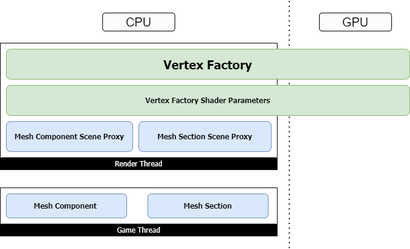

*顶点工厂在渲染层级中的关系。由图可知，顶点工厂是渲染线程的对象，横跨于CPU和GPU两端。*

FVertexFactory封装了可以链接到顶点着色器的顶点数据资源，它和相关类型的定义如下：

```c++
// Engine\Source\Runtime\RHI\Public\RHI.h

// 顶点元素.
struct FVertexElement
{
    uint8 StreamIndex;      // 流索引
    uint8 Offset;          // 偏移
    TEnumAsByte<EVertexElementType> Type; // 类型
    uint8 AttributeIndex;// 属性索引
    uint16 Stride;          // 步长
    // 实例索引或顶点索引是否实例化的, 若是0, 则元素会对每个实例进行重复.
    uint16 bUseInstanceIndex;

    FVertexElement();
    FVertexElement(uint8 InStreamIndex, ...);
    
    void operator=(const FVertexElement& Other);
    friend FArchive& operator<<(FArchive& Ar,FVertexElement& Element);
    
    FString ToString() const;
    void FromString(const FString& Src);
    void FromString(const FStringView& Src);
};

// 顶点声明元素列表的类型.
typedef TArray<FVertexElement,TFixedAllocator<MaxVertexElementCount> > FVertexDeclarationElementList;


// Engine\Source\Runtime\RHI\Public\RHIResources.h

// 顶点声明的RHI资源
class FRHIVertexDeclaration : public FRHIResource
{
public:
    virtual bool GetInitializer(FVertexDeclarationElementList& Init) { return false; }
};

// 顶点缓冲区
class FRHIVertexBuffer : public FRHIResource
{
public:
    FRHIVertexBuffer(uint32 InSize,uint32 InUsage);

    uint32 GetSize() const;
    uint32 GetUsage() const;

protected:
    FRHIVertexBuffer();

    void Swap(FRHIVertexBuffer& Other);
    void ReleaseUnderlyingResource();

private:
    // 尺寸.
    uint32 Size;
    // 缓冲区标记, 如BUF_UnorderedAccess
    uint32 Usage;
};


// Engine\Source\Runtime\RenderCore\Public\VertexFactory.h

// 顶点输入流.
struct FVertexInputStream
{
    // 顶点流索引
    uint32 StreamIndex : 4;
    // 在VertexBuffer的偏移.
    uint32 Offset : 28;
    // 顶点缓存区
    FRHIVertexBuffer* VertexBuffer;

    FVertexInputStream();
    FVertexInputStream(uint32 InStreamIndex, uint32 InOffset, FRHIVertexBuffer* InVertexBuffer);

    inline bool operator==(const FVertexInputStream& rhs) const;
    inline bool operator!=(const FVertexInputStream& rhs) const;
};

// 顶点输入流数组.
typedef TArray<FVertexInputStream, TInlineAllocator<4>> FVertexInputStreamArray;

// 顶点流标记
enum class EVertexStreamUsage : uint8
{
    Default            = 0 << 0, // 默认
    Instancing        = 1 << 0, // 实例化
    Overridden        = 1 << 1, // 覆盖
    ManualFetch        = 1 << 2  // 手动获取
};

// 顶点输入流类型.
enum class EVertexInputStreamType : uint8
{
    Default = 0,  // 默认
    PositionOnly, // 只有位置
    PositionAndNormalOnly // 只有位置和法线
};

// 顶点流组件.
struct FVertexStreamComponent
{
    // 流数据的顶点缓冲区, 如果为null, 则不会有数据从此顶点流被读取.
    const FVertexBuffer* VertexBuffer = nullptr;

    // vertex buffer的偏移.
    uint32 StreamOffset = 0;
    // 数据的偏移, 相对于顶点缓冲区中每个元素的开头.
    uint8 Offset = 0;
    // 数据的步长.
    uint8 Stride = 0;
    // 从流读取的数据类型.
    TEnumAsByte<EVertexElementType> Type = VET_None;
    // 顶点流标记.
    EVertexStreamUsage VertexStreamUsage = EVertexStreamUsage::Default;

    (......)
};

// 着色器使用的顶点工厂的参数绑定接口.
class FVertexFactoryShaderParameters
{
public:
    // 绑定参数到ParameterMap. 具体逻辑由子类完成.
    void Bind(const class FShaderParameterMap& ParameterMap) {}

    // 获取顶点工厂的着色器绑定和顶点流. 具体逻辑由子类完成.
    void GetElementShaderBindings(
        const class FSceneInterface* Scene,
        const class FSceneView* View,
        const class FMeshMaterialShader* Shader,
        const EVertexInputStreamType InputStreamType,
        ERHIFeatureLevel::Type FeatureLevel,
        const class FVertexFactory* VertexFactory,
        const struct FMeshBatchElement& BatchElement,
        class FMeshDrawSingleShaderBindings& ShaderBindings,
        FVertexInputStreamArray& VertexStreams) const {}

    (......)
};

// 用来表示顶点工厂类型的类.
class FVertexFactoryType
{
public:
    // 类型定义
    typedef FVertexFactoryShaderParameters* (*ConstructParametersType)(EShaderFrequency ShaderFrequency, const class FShaderParameterMap& ParameterMap);
    typedef const FTypeLayoutDesc* (*GetParameterTypeLayoutType)(EShaderFrequency ShaderFrequency);
    (......)

    // 获取顶点工厂类型数量.
    static int32 GetNumVertexFactoryTypes();

    // 获取全局的着色器工厂列表.
    static RENDERCORE_API TLinkedList<FVertexFactoryType*>*& GetTypeList();
    // 获取已存的材质类型列表.
    static RENDERCORE_API const TArray<FVertexFactoryType*>& GetSortedMaterialTypes();
    // 通过名字查找FVertexFactoryType
    static RENDERCORE_API FVertexFactoryType* GetVFByName(const FHashedName& VFName);

    // 初始化FVertexFactoryType静态成员, 必须在VF类型创建之前调用.
    static void Initialize(const TMap<FString, TArray<const TCHAR*> >& ShaderFileToUniformBufferVariables);
    static void Uninitialize();

    // 构造/析构函数.
    RENDERCORE_API FVertexFactoryType(...);
    virtual ~FVertexFactoryType();

    // 数据获取接口.
    const TCHAR* GetName() const;
    FName GetFName() const;
    const FHashedName& GetHashedName() const;
    const TCHAR* GetShaderFilename() const;

    // 着色器参数接口.
    FVertexFactoryShaderParameters* CreateShaderParameters(...) const;
    const FTypeLayoutDesc* GetShaderParameterLayout(...) const;
    void GetShaderParameterElementShaderBindings(...) const;

    // 标记访问.
    bool IsUsedWithMaterials() const;
    bool SupportsStaticLighting() const;
    bool SupportsDynamicLighting() const;
    bool SupportsPrecisePrevWorldPos() const;
    bool SupportsPositionOnly() const;
    bool SupportsCachingMeshDrawCommands() const;
    bool SupportsPrimitiveIdStream() const;

    // 获取哈希.
    friend uint32 GetTypeHash(const FVertexFactoryType* Type);
    // 基于顶点工厂类型的源码和包含计算出来的哈希.
    const FSHAHash& GetSourceHash(EShaderPlatform ShaderPlatform) const;
    // 是否需要缓存材质的着色器类型.
    bool ShouldCache(const FVertexFactoryShaderPermutationParameters& Parameters) const;

    void ModifyCompilationEnvironment(...);
    void ValidateCompiledResult(EShaderPlatform Platform, ...);

    bool SupportsTessellationShaders() const;

    // 增加引用的Uniform Buffer包含.
    void AddReferencedUniformBufferIncludes(...);
    void FlushShaderFileCache(...);
    const TMap<const TCHAR*, FCachedUniformBufferDeclaration>& GetReferencedUniformBufferStructsCache() const;

private:
    static uint32 NumVertexFactories;
    static bool bInitializedSerializationHistory;

    // 顶点工厂类型的各类数据和标记.
    const TCHAR* Name;
    const TCHAR* ShaderFilename;
    FName TypeName;
    FHashedName HashedName;
    uint32 bUsedWithMaterials : 1;
    uint32 bSupportsStaticLighting : 1;
    uint32 bSupportsDynamicLighting : 1;
    uint32 bSupportsPrecisePrevWorldPos : 1;
    uint32 bSupportsPositionOnly : 1;
    uint32 bSupportsCachingMeshDrawCommands : 1;
    uint32 bSupportsPrimitiveIdStream : 1;
    ConstructParametersType ConstructParameters;
    GetParameterTypeLayoutType GetParameterTypeLayout;
    GetParameterTypeElementShaderBindingsType GetParameterTypeElementShaderBindings;
    ShouldCacheType ShouldCacheRef;
    ModifyCompilationEnvironmentType ModifyCompilationEnvironmentRef;
    ValidateCompiledResultType ValidateCompiledResultRef;
    SupportsTessellationShadersType SupportsTessellationShadersRef;

    // 全局顶点工厂类型列表.
    TLinkedList<FVertexFactoryType*> GlobalListLink;
    // 缓存引用的Uniform Buffer的包含.
    TMap<const TCHAR*, FCachedUniformBufferDeclaration> ReferencedUniformBufferStructsCache;
    // 跟踪ReferencedUniformBufferStructsCache缓存了哪些平台的声明.
    bool bCachedUniformBufferStructDeclarations;
};


// ------顶点工厂的工具宏------

// 实现顶点工厂参数类型
#define IMPLEMENT_VERTEX_FACTORY_PARAMETER_TYPE(FactoryClass, ShaderFrequency, ParameterClass)

// 顶点工厂类型的声明
#define DECLARE_VERTEX_FACTORY_TYPE(FactoryClass)
// 顶点工厂类型的实现
#define IMPLEMENT_VERTEX_FACTORY_TYPE(FactoryClass,ShaderFilename,bUsedWithMaterials,bSupportsStaticLighting,bSupportsDynamicLighting,bPrecisePrevWorldPos,bSupportsPositionOnly)
// 顶点工厂的虚函数表实现
#define IMPLEMENT_VERTEX_FACTORY_VTABLE(FactoryClass


// 顶点工厂
class FVertexFactory : public FRenderResource
{
public:
    FVertexFactory(ERHIFeatureLevel::Type InFeatureLevel);

    virtual FVertexFactoryType* GetType() const;

    // 获取顶点数据流.
    void GetStreams(ERHIFeatureLevel::Type InFeatureLevel, EVertexInputStreamType VertexStreamType, FVertexInputStreamArray& OutVertexStreams) const
    {
        // Default顶点流类型
        if (VertexStreamType == EVertexInputStreamType::Default)
        {
            bool bSupportsVertexFetch = SupportsManualVertexFetch(InFeatureLevel);

            // 将顶点工厂的数据构造到FVertexInputStream中并添加到输出列表
            for (int32 StreamIndex = 0;StreamIndex < Streams.Num();StreamIndex++)
            {
                const FVertexStream& Stream = Streams[StreamIndex];

                if (!(EnumHasAnyFlags(EVertexStreamUsage::ManualFetch, Stream.VertexStreamUsage) && bSupportsVertexFetch))
                {
                    if (!Stream.VertexBuffer)
                    {
                        OutVertexStreams.Add(FVertexInputStream(StreamIndex, 0, nullptr));
                    }
                    else
                    {
                        if (EnumHasAnyFlags(EVertexStreamUsage::Overridden, Stream.VertexStreamUsage) && !Stream.VertexBuffer->IsInitialized())
                        {
                            OutVertexStreams.Add(FVertexInputStream(StreamIndex, 0, nullptr));
                        }
                        else
                        {
                            OutVertexStreams.Add(FVertexInputStream(StreamIndex, Stream.Offset, Stream.VertexBuffer->VertexBufferRHI));
                        }
                    }
                }
            }
        }
        // 只有位置和的顶点流类型
        else if (VertexStreamType == EVertexInputStreamType::PositionOnly)
        {
            // Set the predefined vertex streams.
            for (int32 StreamIndex = 0; StreamIndex < PositionStream.Num(); StreamIndex++)
            {
                const FVertexStream& Stream = PositionStream[StreamIndex];
                OutVertexStreams.Add(FVertexInputStream(StreamIndex, Stream.Offset, Stream.VertexBuffer->VertexBufferRHI));
            }
        }
        // 只有位置和法线的顶点流类型
        else if (VertexStreamType == EVertexInputStreamType::PositionAndNormalOnly)
        {
            // Set the predefined vertex streams.
            for (int32 StreamIndex = 0; StreamIndex < PositionAndNormalStream.Num(); StreamIndex++)
            {
                const FVertexStream& Stream = PositionAndNormalStream[StreamIndex];
                OutVertexStreams.Add(FVertexInputStream(StreamIndex, Stream.Offset, Stream.VertexBuffer->VertexBufferRHI));
            }
        }
        else
        {
            // NOT_IMPLEMENTED
        }
    }
    
    // 偏移实例的数据流.
    void OffsetInstanceStreams(uint32 InstanceOffset, EVertexInputStreamType VertexStreamType, FVertexInputStreamArray& VertexStreams) const;
    
    static void ModifyCompilationEnvironment(...);
    static void ValidateCompiledResult(...);

    static bool SupportsTessellationShaders();

    // FRenderResource接口, 释放RHI资源.
    virtual void ReleaseRHI();

    // 设置/获取顶点声明的RHI引用.
    FVertexDeclarationRHIRef& GetDeclaration();
    void SetDeclaration(FVertexDeclarationRHIRef& NewDeclaration);

    // 根据类型获取顶点声明的RHI引用.
    const FVertexDeclarationRHIRef& GetDeclaration(EVertexInputStreamType InputStreamType) const 
    {
        switch (InputStreamType)
        {
        case EVertexInputStreamType::Default:                return Declaration;
        case EVertexInputStreamType::PositionOnly:            return PositionDeclaration;
        case EVertexInputStreamType::PositionAndNormalOnly:    return PositionAndNormalDeclaration;
        }
        return Declaration;
    }

    // 各类标记.
    virtual bool IsGPUSkinned() const;
    virtual bool SupportsPositionOnlyStream() const;
    virtual bool SupportsPositionAndNormalOnlyStream() const;
    virtual bool SupportsNullPixelShader() const;

    // 用面向摄像机精灵的方式渲染图元.
    virtual bool RendersPrimitivesAsCameraFacingSprites() const;

    // 是否需要顶点声明.
    bool NeedsDeclaration() const;
    // 是否支持手动的顶点获取.
    inline bool SupportsManualVertexFetch(const FStaticFeatureLevel InFeatureLevel) const;
    // 根据流类型获取索引.
    inline int32 GetPrimitiveIdStreamIndex(EVertexInputStreamType InputStreamType) const;

protected:
    inline void SetPrimitiveIdStreamIndex(EVertexInputStreamType InputStreamType, int32 StreamIndex)
    {
        PrimitiveIdStreamIndex[static_cast<uint8>(InputStreamType)] = StreamIndex;
    }

    // 为顶点流组件创建顶点元素.
    FVertexElement AccessStreamComponent(const FVertexStreamComponent& Component,uint8 AttributeIndex);
    FVertexElement AccessStreamComponent(const FVertexStreamComponent& Component, uint8 AttributeIndex, EVertexInputStreamType InputStreamType);
    // 初始化顶点声明.
    void InitDeclaration(const FVertexDeclarationElementList& Elements, EVertexInputStreamType StreamType = EVertexInputStreamType::Default)
    {
        if (StreamType == EVertexInputStreamType::PositionOnly)
        {
            PositionDeclaration = PipelineStateCache::GetOrCreateVertexDeclaration(Elements);
        }
        else if (StreamType == EVertexInputStreamType::PositionAndNormalOnly)
        {
            PositionAndNormalDeclaration = PipelineStateCache::GetOrCreateVertexDeclaration(Elements);
        }
        else // (StreamType == EVertexInputStreamType::Default)
        {
            // Create the vertex declaration for rendering the factory normally.
            Declaration = PipelineStateCache::GetOrCreateVertexDeclaration(Elements);
        }
    }

    // 顶点流, 需要设置到顶点流的信息体.
    struct FVertexStream
    {
        const FVertexBuffer* VertexBuffer = nullptr;
        uint32 Offset = 0;
        uint16 Stride = 0;
        EVertexStreamUsage VertexStreamUsage = EVertexStreamUsage::Default;
        uint8 Padding = 0;

        friend bool operator==(const FVertexStream& A,const FVertexStream& B);
        FVertexStream();
    };

    // 用于渲染顶点工厂的顶点流.
    TArray<FVertexStream,TInlineAllocator<8> > Streams;

    // VF(顶点工厂)可以显式地将此设置为false，以避免在没有声明的情况下出现错误. 主要用于需要直接从缓冲区获取数据的VF(如Niagara).
    bool bNeedsDeclaration = true;
    bool bSupportsManualVertexFetch = false;
    int8 PrimitiveIdStreamIndex[3] = { -1, -1, -1 };

private:
    // 只有位置的顶点流, 用于渲染深度Pass的顶点工厂.
    TArray<FVertexStream,TInlineAllocator<2> > PositionStream;
    // 只有位置和法线的顶点流.
    TArray<FVertexStream, TInlineAllocator<3> > PositionAndNormalStream;

    // 用于常规渲染顶点工厂的RHI顶点声明.
    FVertexDeclarationRHIRef Declaration;

    // PositionStream和PositionAndNormalStream对应的RHI资源.
    FVertexDeclarationRHIRef PositionDeclaration;
    FVertexDeclarationRHIRef PositionAndNormalDeclaration;
};
```

上面展示了Vertex Factory的很多类型，有好几个是核心类，比如FVertexFactory、FVertexElement、FRHIVertexDeclaration、FRHIVertexBuffer、FVertexFactoryType、FVertexStreamComponent、FVertexInputStream、FVertexFactoryShaderParameters等。那么它们之间的关系是什么呢？

为了更好地说明它们之间的关系，以静态模型的FStaticMeshDataType为例：

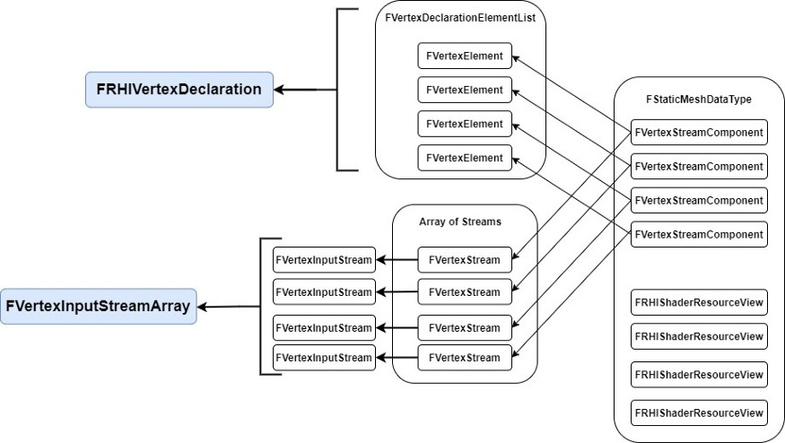

FStaticMeshDataType会包含若干个FVertexStreamComponent实例，每个FVertexStreamComponent包含了一个在FVertexDeclarationElementList的FVertexElement实例索引和一个在FVertexInputStreamArray列表的FVertexStream实例索引。

此外，FVertexFactory是个基类，内置的子类主要有：

- FGeometryCacheVertexVertexFactory：几何缓存顶点的顶点工厂，常用于预生成的布料、动作等网格类型。
- FGPUBaseSkinVertexFactory：GPU蒙皮骨骼网格的父类，它的子类有：
  - TGPUSkinVertexFactory：可指定骨骼权重方式的GPU蒙皮的顶点工厂。
- FLocalVertexFactory：局部顶点工厂，常用于静态网格，它拥有数量较多的子类：
  - FInstancedStaticMeshVertexFactory：实例化的静态网格顶点工厂。
  - FSplineMeshVertexFactory：样条曲线网格顶点工厂。
  - FGeometryCollectionVertexFactory：几何收集顶点工厂。
  - FGPUSkinPassthroughVertexFactory：启用了Skin Cache模式的蒙皮骨骼顶点工厂。
  - FSingleTriangleMeshVertexFactory：单个三角形网格的顶点工厂，用于体积云渲染。
  - ......
- FParticleVertexFactoryBase：用于粒子渲染的顶点工厂基类。
- FLandscapeVertexFactory：用于渲染地形的顶点工厂。

除了以上继承自FVertexFactory，还有一些不是继承自FVertexFactory的类型，如：

- FGPUBaseSkinAPEXClothVertexFactory：布料顶点工厂。
  - TGPUSkinAPEXClothVertexFactory：可带骨骼权重模式的布料顶点工厂。

除了FVertexFactory，相应的其它核心类也有继承体系。比如FVertexFactoryShaderParameters的子类有：

- FGeometryCacheVertexFactoryShaderParameters
- FGPUSkinVertexFactoryShaderParameters
- FMeshParticleVertexFactoryShaderParameters
- FParticleSpriteVertexFactoryShaderParameters
- FGPUSpriteVertexFactoryShaderParametersVS
- FGPUSpriteVertexFactoryShaderParametersPS
- FSplineMeshVertexFactoryShaderParameters
- FLocalVertexFactoryShaderParametersBase
- FLandscapeVertexFactoryVertexShaderParameters
- FLandscapeVertexFactoryPixelShaderParameters
- ......

另外，有部分顶点工厂还会在内部派生FStaticMeshDataType的类型，以复用静态网格相关的数据成员。

为了更好地说明顶点工厂的使用方式，下面就以最常见的FLocalVertexFactory和使用了FLocalVertexFactory的CableComponent为例：

```c++
// Engine\Source\Runtime\Engine\Public\LocalVertexFactory.h

class ENGINE_API FLocalVertexFactory : public FVertexFactory
{
public:
    FLocalVertexFactory(ERHIFeatureLevel::Type InFeatureLevel, const char* InDebugName)；

    // 派生自FStaticMeshDataType的数据类型.
    struct FDataType : public FStaticMeshDataType
    {
        FRHIShaderResourceView* PreSkinPositionComponentSRV = nullptr;
    };

    // 环境变量更改和校验.
    static bool ShouldCompilePermutation(const FVertexFactoryShaderPermutationParameters& Parameters);
    static void ModifyCompilationEnvironment(const FVertexFactoryShaderPermutationParameters& Parameters, FShaderCompilerEnvironment& OutEnvironment);
    static void ValidateCompiledResult(const FVertexFactoryType* Type, EShaderPlatform Platform, const FShaderParameterMap& ParameterMap, TArray<FString>& OutErrors);

    // 由TSynchronizedResource从游戏线程更新而来的数据.
    void SetData(const FDataType& InData);
    // 从其它顶点工厂复制数据.
    void Copy(const FLocalVertexFactory& Other);

    // FRenderResource接口.
    virtual void InitRHI() override;
    virtual void ReleaseRHI() override
    {
        UniformBuffer.SafeRelease();
        FVertexFactory::ReleaseRHI();
    }

    // 顶点颜色接口.
    void SetColorOverrideStream(FRHICommandList& RHICmdList, const FVertexBuffer* ColorVertexBuffer) const;
    void GetColorOverrideStream(const FVertexBuffer* ColorVertexBuffer, FVertexInputStreamArray& VertexStreams) const;
    
    // 着色器参数和其它数据接口.
    inline FRHIShaderResourceView* GetPositionsSRV() const;
    inline FRHIShaderResourceView* GetPreSkinPositionSRV() const;
    inline FRHIShaderResourceView* GetTangentsSRV() const;
    inline FRHIShaderResourceView* GetTextureCoordinatesSRV() const;
    inline FRHIShaderResourceView* GetColorComponentsSRV() const;
    inline const uint32 GetColorIndexMask() const;
    inline const int GetLightMapCoordinateIndex() const;
    inline const int GetNumTexcoords() const;
    FRHIUniformBuffer* GetUniformBuffer() const;
    
    (......)

protected:
    // 从游戏线程传入的数据. FDataType是FStaticMeshDataType的子类.
    FDataType Data;
    // 局部顶点工厂的着色器参数.
    TUniformBufferRef<FLocalVertexFactoryUniformShaderParameters> UniformBuffer;
    // 顶点颜色流索引.
    int32 ColorStreamIndex;

    (......)
};

// Engine\Source\Runtime\Engine\Public\LocalVertexFactory.cpp

void FLocalVertexFactory::InitRHI()
{
    // 是否使用gpu场景.
    const bool bCanUseGPUScene = UseGPUScene(GMaxRHIShaderPlatform, GMaxRHIFeatureLevel);

    // 初始化位置流和位置声明.
    if (Data.PositionComponent.VertexBuffer != Data.TangentBasisComponents[0].VertexBuffer)
    {
        // 增加顶点声明.
        auto AddDeclaration = [this, bCanUseGPUScene](EVertexInputStreamType InputStreamType, bool bAddNormal)
        {
            // 顶点流元素.
            FVertexDeclarationElementList StreamElements;
            StreamElements.Add(AccessStreamComponent(Data.PositionComponent, 0, InputStreamType));

            bAddNormal = bAddNormal && Data.TangentBasisComponents[1].VertexBuffer != NULL;
            if (bAddNormal)
            {
                StreamElements.Add(AccessStreamComponent(Data.TangentBasisComponents[1], 2, InputStreamType));
            }

            const uint8 TypeIndex = static_cast<uint8>(InputStreamType);
            PrimitiveIdStreamIndex[TypeIndex] = -1;
            if (GetType()->SupportsPrimitiveIdStream() && bCanUseGPUScene)
            {
                // When the VF is used for rendering in normal mesh passes, this vertex buffer and offset will be overridden
                StreamElements.Add(AccessStreamComponent(FVertexStreamComponent(&GPrimitiveIdDummy, 0, 0, sizeof(uint32), VET_UInt, EVertexStreamUsage::Instancing), 1, InputStreamType));
                PrimitiveIdStreamIndex[TypeIndex] = StreamElements.Last().StreamIndex;
            }

            // 初始化声明.
            InitDeclaration(StreamElements, InputStreamType);
        };

        // 增加PositionOnly和PositionAndNormalOnly两种顶点声明, 其中前者不需要法线.
        AddDeclaration(EVertexInputStreamType::PositionOnly, false);
        AddDeclaration(EVertexInputStreamType::PositionAndNormalOnly, true);
    }

    // 顶点声明元素列表.
    FVertexDeclarationElementList Elements;
    
    // 顶点位置
    if(Data.PositionComponent.VertexBuffer != NULL)
    {
        Elements.Add(AccessStreamComponent(Data.PositionComponent,0));
    }

    // 图元id
    {
        const uint8 Index = static_cast<uint8>(EVertexInputStreamType::Default);
        PrimitiveIdStreamIndex[Index] = -1;
        if (GetType()->SupportsPrimitiveIdStream() && bCanUseGPUScene)
        {
            // When the VF is used for rendering in normal mesh passes, this vertex buffer and offset will be overridden
            Elements.Add(AccessStreamComponent(FVertexStreamComponent(&GPrimitiveIdDummy, 0, 0, sizeof(uint32), VET_UInt, EVertexStreamUsage::Instancing), 13));
            PrimitiveIdStreamIndex[Index] = Elements.Last().StreamIndex;
        }
    }

    // 切线和法线, 切线法线才需要被顶点流使用, 副法线由shader生成.
    uint8 TangentBasisAttributes[2] = { 1, 2 };
    for(int32 AxisIndex = 0;AxisIndex < 2;AxisIndex++)
    {
        if(Data.TangentBasisComponents[AxisIndex].VertexBuffer != NULL)
        {
            Elements.Add(AccessStreamComponent(Data.TangentBasisComponents[AxisIndex],TangentBasisAttributes[AxisIndex]));
        }
    }

    if (Data.ColorComponentsSRV == nullptr)
    {
        Data.ColorComponentsSRV = GNullColorVertexBuffer.VertexBufferSRV;
        Data.ColorIndexMask = 0;
    }

    // 顶点颜色
    ColorStreamIndex = -1;
    if(Data.ColorComponent.VertexBuffer)
    {
        Elements.Add(AccessStreamComponent(Data.ColorComponent,3));
        ColorStreamIndex = Elements.Last().StreamIndex;
    }
    else
    {
        FVertexStreamComponent NullColorComponent(&GNullColorVertexBuffer, 0, 0, VET_Color, EVertexStreamUsage::ManualFetch);
        Elements.Add(AccessStreamComponent(NullColorComponent, 3));
        ColorStreamIndex = Elements.Last().StreamIndex;
    }

    // 纹理坐标
    if(Data.TextureCoordinates.Num())
    {
        const int32 BaseTexCoordAttribute = 4;
        for(int32 CoordinateIndex = 0;CoordinateIndex < Data.TextureCoordinates.Num();CoordinateIndex++)
        {
            Elements.Add(AccessStreamComponent(
                Data.TextureCoordinates[CoordinateIndex],
                BaseTexCoordAttribute + CoordinateIndex
                ));
        }

        for (int32 CoordinateIndex = Data.TextureCoordinates.Num(); CoordinateIndex < MAX_STATIC_TEXCOORDS / 2; CoordinateIndex++)
        {
            Elements.Add(AccessStreamComponent(
                Data.TextureCoordinates[Data.TextureCoordinates.Num() - 1],
                BaseTexCoordAttribute + CoordinateIndex
                ));
        }
    }

    // 光照图
    if(Data.LightMapCoordinateComponent.VertexBuffer)
    {
        Elements.Add(AccessStreamComponent(Data.LightMapCoordinateComponent,15));
    }
    else if(Data.TextureCoordinates.Num())
    {
        Elements.Add(AccessStreamComponent(Data.TextureCoordinates[0],15));
    }

    // 初始化顶点声明
    InitDeclaration(Elements);

    const int32 DefaultBaseVertexIndex = 0;
    const int32 DefaultPreSkinBaseVertexIndex = 0;
    if (RHISupportsManualVertexFetch(GMaxRHIShaderPlatform) || bCanUseGPUScene)
    {
        SCOPED_LOADTIMER(FLocalVertexFactory_InitRHI_CreateLocalVFUniformBuffer);
        UniformBuffer = CreateLocalVFUniformBuffer(this, Data.LODLightmapDataIndex, nullptr, DefaultBaseVertexIndex, DefaultPreSkinBaseVertexIndex);
    }
}

// 实现FLocalVertexFactory的参数类型.
IMPLEMENT_VERTEX_FACTORY_PARAMETER_TYPE(FLocalVertexFactory, SF_Vertex, FLocalVertexFactoryShaderParameters);

// 实现FLocalVertexFactory.
IMPLEMENT_VERTEX_FACTORY_TYPE_EX(FLocalVertexFactory,"/Engine/Private/LocalVertexFactory.ush",true,true,true,true,true,true,true);
```

下面进入CableComponent相关类型关于FLocalVertexFactory的使用：

```c++
// Engine\Plugins\Runtime\CableComponent\Source\CableComponent\Private\CableComponent.cpp

class FCableSceneProxy final : public FPrimitiveSceneProxy
{
public:
    FCableSceneProxy(UCableComponent* Component)
        : FPrimitiveSceneProxy(Component)
        , Material(NULL)
        // 构造顶点工厂.
        , VertexFactory(GetScene().GetFeatureLevel(), "FCableSceneProxy")
        (......)
    {
        // 利用顶点工厂初始化缓冲区.
        VertexBuffers.InitWithDummyData(&VertexFactory, GetRequiredVertexCount());
        (......)
    }

    virtual ~FCableSceneProxy()
    {
        // 释放顶点工厂.
        VertexFactory.ReleaseResource();
        (......)
    }

    // 构建Cable网格.
    void BuildCableMesh(const TArray<FVector>& InPoints, TArray<FDynamicMeshVertex>& OutVertices, TArray<int32>& OutIndices)
    {
        (......)
    }

    // 设置动态数据(渲染线程调用)
    void SetDynamicData_RenderThread(FCableDynamicData* NewDynamicData)
    {
        // 释放旧数据.
        if(DynamicData)
        {
            delete DynamicData;
            DynamicData = NULL;
        }
        DynamicData = NewDynamicData;

        // 从Cable点构建顶点.
        TArray<FDynamicMeshVertex> Vertices;
        TArray<int32> Indices;
        BuildCableMesh(NewDynamicData->CablePoints, Vertices, Indices);

        // 填充顶点缓冲区数据.
        for (int i = 0; i < Vertices.Num(); i++)
        {
            const FDynamicMeshVertex& Vertex = Vertices[i];

            VertexBuffers.PositionVertexBuffer.VertexPosition(i) = Vertex.Position;
            VertexBuffers.StaticMeshVertexBuffer.SetVertexTangents(i, Vertex.TangentX.ToFVector(), Vertex.GetTangentY(), Vertex.TangentZ.ToFVector());
            VertexBuffers.StaticMeshVertexBuffer.SetVertexUV(i, 0, Vertex.TextureCoordinate[0]);
            VertexBuffers.ColorVertexBuffer.VertexColor(i) = Vertex.Color;
        }

        // 更新顶点缓冲区数据到RHI.
        {
            auto& VertexBuffer = VertexBuffers.PositionVertexBuffer;
            void* VertexBufferData = RHILockVertexBuffer(VertexBuffer.VertexBufferRHI, 0, VertexBuffer.GetNumVertices() * VertexBuffer.GetStride(), RLM_WriteOnly);
            FMemory::Memcpy(VertexBufferData, VertexBuffer.GetVertexData(), VertexBuffer.GetNumVertices() * VertexBuffer.GetStride());
            RHIUnlockVertexBuffer(VertexBuffer.VertexBufferRHI);
        }

        (......)
    }

    virtual void GetDynamicMeshElements(const TArray<const FSceneView*>& Views, const FSceneViewFamily& ViewFamily, uint32 VisibilityMap, FMeshElementCollector& Collector) const override
    {
        (......)

        for (int32 ViewIndex = 0; ViewIndex < Views.Num(); ViewIndex++)
        {
            if (VisibilityMap & (1 << ViewIndex))
            {
                const FSceneView* View = Views[ViewIndex];
                
                // 构造FMeshBatch实例.
                FMeshBatch& Mesh = Collector.AllocateMesh();
                // 将顶点工厂实例传给FMeshBatch实例.
                Mesh.VertexFactory = &VertexFactory;
                
                (......)
                
                Collector.AddMesh(ViewIndex, Mesh);
            }
        }
    }

    (......)

private:
    // 材质
    UMaterialInterface* Material;
    // 顶点和索引缓冲.
    FStaticMeshVertexBuffers VertexBuffers;
    FCableIndexBuffer IndexBuffer;
    // 顶点工厂.
    FLocalVertexFactory VertexFactory;
    // 动态数据.
    FCableDynamicData* DynamicData;

    (......)
};
```

由上面的代码可知，使用**已有**的顶点工厂的步骤并复杂，主要在于初始化、赋值和传递给FMeshBatch实例等步骤。

不过，无论是使用已有的还是自定义的顶点工厂，顶点工厂的顶点声明的顺序、类型、组件数量和插槽需要和HLSL层的FVertexFactoryInput保持一致。比如说FLocalVertexFactory::InitRHI的顶点声明顺序是位置、切线、颜色、纹理坐标、光照图，那么我们进入FLocalVertexFactory对应的HLSL文件（由IMPLEMENT_VERTEX_FACTORY_TYPE等宏指定）看看：

```c++
// Engine\Shaders\Private\LocalVertexFactory.ush

// 局部顶点工厂对应的输入结构体.
struct FVertexFactoryInput
{
    // 位置
    float4    Position    : ATTRIBUTE0;

    // 切线和颜色
#if !MANUAL_VERTEX_FETCH
    #if METAL_PROFILE
        float3    TangentX    : ATTRIBUTE1;
        // TangentZ.w contains sign of tangent basis determinant
        float4    TangentZ    : ATTRIBUTE2;

        float4    Color        : ATTRIBUTE3;
    #else
        half3    TangentX    : ATTRIBUTE1;
        // TangentZ.w contains sign of tangent basis determinant
        half4    TangentZ    : ATTRIBUTE2;

        half4    Color        : ATTRIBUTE3;
    #endif
#endif

    // 纹理坐标
#if NUM_MATERIAL_TEXCOORDS_VERTEX
    #if !MANUAL_VERTEX_FETCH
        #if GPUSKIN_PASS_THROUGH
            // These must match GPUSkinVertexFactory.usf
            float2    TexCoords[NUM_MATERIAL_TEXCOORDS_VERTEX] : ATTRIBUTE4;
            #if NUM_MATERIAL_TEXCOORDS_VERTEX > 4
                #error Too many texture coordinate sets defined on GPUSkin vertex input. Max: 4.
            #endif
        #else
            #if NUM_MATERIAL_TEXCOORDS_VERTEX > 1
                float4    PackedTexCoords4[NUM_MATERIAL_TEXCOORDS_VERTEX/2] : ATTRIBUTE4;
            #endif
            #if NUM_MATERIAL_TEXCOORDS_VERTEX == 1
                float2    PackedTexCoords2 : ATTRIBUTE4;
            #elif NUM_MATERIAL_TEXCOORDS_VERTEX == 3
                float2    PackedTexCoords2 : ATTRIBUTE5;
            #elif NUM_MATERIAL_TEXCOORDS_VERTEX == 5
                float2    PackedTexCoords2 : ATTRIBUTE6;
            #elif NUM_MATERIAL_TEXCOORDS_VERTEX == 7
                float2    PackedTexCoords2 : ATTRIBUTE7;
            #endif
        #endif
    #endif
#elif USE_PARTICLE_SUBUVS && !MANUAL_VERTEX_FETCH
    float2    TexCoords[1] : ATTRIBUTE4;
#endif

    (......)
};
```

因此可知，FVertexFactoryInput结构体的数据顺序和FLocalVertexFactory的顶点声明是一一对应的。

## **8.2.5 Shader Permutation**

UE的Shader代码是采样的了全能着色器（Uber Shader）的设计架构，这就需要在同一个shader代码文件里增加许多各种各样的宏，以区分不同Pass、功能、Feature Level和质量等级的分支代码。在C++层，为了方便扩展、设置这些宏定义的开启及不同的值，UE采用了**着色器排列（Shader Permutation）**的概念。

每一个排列包含着一个唯一的哈希键值，将这组排列的值填充到HLSL，编译出对应的着色器代码。下面分析着色器排列的核心类型的定义：

```c++
// Engine\Source\Runtime\RenderCore\Public\ShaderPermutation.h

// Bool的着色器排列
struct FShaderPermutationBool
{
    using Type = bool;

    // 维度数量.
    static constexpr int32 PermutationCount = 2;
    // 是否多维的排列.
    static constexpr bool IsMultiDimensional = false;
    // 转换bool到int值.
    static int32 ToDimensionValueId(Type E)
    {
        return E ? 1 : 0;
    }
    // 转换为定义的值.
    static bool ToDefineValue(Type E)
    {
        return E;
    }
    // 从排列id转成bool.
    static Type FromDimensionValueId(int32 PermutationId)
    {
        checkf(PermutationId == 0 || PermutationId == 1, TEXT("Invalid shader permutation dimension id %i."), PermutationId);
        return PermutationId == 1;
    }
};

// 整型的着色器排列
template <typename TType, int32 TDimensionSize, int32 TFirstValue=0>
struct TShaderPermutationInt
{
    using Type = TType;
    static constexpr int32 PermutationCount = TDimensionSize;
    static constexpr bool IsMultiDimensional = false;
    
    // 最大最小值.
    static constexpr Type MinValue = static_cast<Type>(TFirstValue);
    static constexpr Type MaxValue = static_cast<Type>(TFirstValue + TDimensionSize - 1);

    static int32 ToDimensionValueId(Type E)
    static int32 ToDefineValue(Type E);
    static Type FromDimensionValueId(int32 PermutationId);
};

// 可变维度的整型着色器排列.
template <int32... Ts>
struct TShaderPermutationSparseInt
{
    using Type = int32;
    static constexpr int32 PermutationCount = 0;
    static constexpr bool IsMultiDimensional = false;

    static int32 ToDimensionValueId(Type E);
    static Type FromDimensionValueId(int32 PermutationId);
};

// 着色器排列域, 数量是可变的
template <typename... Ts>
struct TShaderPermutationDomain
{
    using Type = TShaderPermutationDomain<Ts...>;

    static constexpr bool IsMultiDimensional = true;
    static constexpr int32 PermutationCount = 1;

    // 构造函数.
    TShaderPermutationDomain<Ts...>() {}
    explicit TShaderPermutationDomain<Ts...>(int32 PermutationId)
    {
        checkf(PermutationId == 0, TEXT("Invalid shader permutation id %i."), PermutationId);
    }

    // 设置某个维度的值.
    template<class DimensionToSet>
    void Set(typename DimensionToSet::Type)
    {
        static_assert(sizeof(typename DimensionToSet::Type) == 0, "Unknown shader permutation dimension.");
    }
    // 获取某个维度的值.
    template<class DimensionToGet>
    const typename DimensionToGet::Type Get() const
    {
        static_assert(sizeof(typename DimensionToGet::Type) == 0, "Unknown shader permutation dimension.");
        return DimensionToGet::Type();
    }

    // 修改编译环境变量.
    void ModifyCompilationEnvironment(FShaderCompilerEnvironment& OutEnvironment) const {}

    // 数据转换.
    static int32 ToDimensionValueId(const Type& PermutationVector)
    {
        return 0;
    }
    int32 ToDimensionValueId() const
    {
        return ToDimensionValueId(*this);
    }
    static Type FromDimensionValueId(const int32 PermutationId)
    {
        return Type(PermutationId);
    }

    bool operator==(const Type& Other) const
    {
        return true;
    }
};


// 下面的宏方便编写shader的c++代码时实现和设置着色器排列.

// 声明指定名字的bool类型着色器排列
#define SHADER_PERMUTATION_BOOL(InDefineName)
// 声明指定名字的int类型着色器排列
#define SHADER_PERMUTATION_INT(InDefineName, Count)
// 声明指定名字和范围的int类型着色器排列
#define SHADER_PERMUTATION_RANGE_INT(InDefineName, Start, Count)
// 声明指定名字的稀疏int类型着色器排列
#define SHADER_PERMUTATION_SPARSE_INT(InDefineName,...)
// 声明指定名字的枚举类型着色器排列
#define SHADER_PERMUTATION_ENUM_CLASS(InDefineName, EnumName)
```

看上面的模板和宏定义是不是有点懵、不知所以然？没关系，结合FDeferredLightPS的使用案例，会发现着色器排列其实很简单：

```c++
// 延迟光源的PS.
class FDeferredLightPS : public FGlobalShader
{
    DECLARE_SHADER_TYPE(FDeferredLightPS, Global)

    // 声明各个维度的着色器排列, 注意用的是继承, 且父类是用SHADER_PERMUTATION_xxx定义的类型.
    // 注意父类的名词(如LIGHT_SOURCE_SHAPE, USE_SOURCE_TEXTURE, USE_IES_PROFILE, ...)就是在HLSL代码中的宏名称.
    class FSourceShapeDim        : SHADER_PERMUTATION_ENUM_CLASS("LIGHT_SOURCE_SHAPE", ELightSourceShape);
    class FSourceTextureDim        : SHADER_PERMUTATION_BOOL("USE_SOURCE_TEXTURE");
    class FIESProfileDim        : SHADER_PERMUTATION_BOOL("USE_IES_PROFILE");
    class FInverseSquaredDim    : SHADER_PERMUTATION_BOOL("INVERSE_SQUARED_FALLOFF");
    class FVisualizeCullingDim    : SHADER_PERMUTATION_BOOL("VISUALIZE_LIGHT_CULLING");
    class FLightingChannelsDim    : SHADER_PERMUTATION_BOOL("USE_LIGHTING_CHANNELS");
    class FTransmissionDim        : SHADER_PERMUTATION_BOOL("USE_TRANSMISSION");
    class FHairLighting            : SHADER_PERMUTATION_INT("USE_HAIR_LIGHTING", 2);
    class FAtmosphereTransmittance : SHADER_PERMUTATION_BOOL("USE_ATMOSPHERE_TRANSMITTANCE");
    class FCloudTransmittance     : SHADER_PERMUTATION_BOOL("USE_CLOUD_TRANSMITTANCE");
    class FAnistropicMaterials     : SHADER_PERMUTATION_BOOL("SUPPORTS_ANISOTROPIC_MATERIALS");

    // 声明着色器排列域, 包含了上面定义的所有维度.
    using FPermutationDomain = TShaderPermutationDomain<
        FSourceShapeDim,
        FSourceTextureDim,
        FIESProfileDim,
        FInverseSquaredDim,
        FVisualizeCullingDim,
        FLightingChannelsDim,
        FTransmissionDim,
        FHairLighting,
        FAtmosphereTransmittance,
        FCloudTransmittance,
        FAnistropicMaterials>;

    // 是否需要编译指定的着色器排列.
    static bool ShouldCompilePermutation(const FGlobalShaderPermutationParameters& Parameters)
    {
        // 获取着色器排列的值.
        FPermutationDomain PermutationVector(Parameters.PermutationId);

        // 如果是平行光, 那么IES光照和逆反的衰减将没有任何意义, 可以不编译.
        if( PermutationVector.Get< FSourceShapeDim >() == ELightSourceShape::Directional && (
            PermutationVector.Get< FIESProfileDim >() ||
            PermutationVector.Get< FInverseSquaredDim >() ) )
        {
            return false;
        }

        // 如果不是平行光, 那么大气和云体透射将没有任何意义, 可以不编译.
        if (PermutationVector.Get< FSourceShapeDim >() != ELightSourceShape::Directional && (PermutationVector.Get<FAtmosphereTransmittance>() || PermutationVector.Get<FCloudTransmittance>()))
        {
            return false;
        }

        (......)

        return IsFeatureLevelSupported(Parameters.Platform, ERHIFeatureLevel::SM5);
    }

    (......)
};

// 渲染光源.
void FDeferredShadingSceneRenderer::RenderLight(FRHICommandList& RHICmdList, ...)
{
    (......)

    for (int32 ViewIndex = 0; ViewIndex < Views.Num(); ViewIndex++)
    {
        FViewInfo& View = Views[ViewIndex];
        
        (......)
        
        if (LightSceneInfo->Proxy->GetLightType() == LightType_Directional)
        {
            (......)

            // 声明FDeferredLightPS的着色器排列的实例.
            FDeferredLightPS::FPermutationDomain PermutationVector;
            
            // 根据渲染状态填充排列值.
            PermutationVector.Set< FDeferredLightPS::FSourceShapeDim >( ELightSourceShape::Directional );
            PermutationVector.Set< FDeferredLightPS::FIESProfileDim >( false );
            PermutationVector.Set< FDeferredLightPS::FInverseSquaredDim >( false );
            PermutationVector.Set< FDeferredLightPS::FVisualizeCullingDim >( View.Family->EngineShowFlags.VisualizeLightCulling );
            PermutationVector.Set< FDeferredLightPS::FLightingChannelsDim >( View.bUsesLightingChannels );
            PermutationVector.Set< FDeferredLightPS::FAnistropicMaterials >(ShouldRenderAnisotropyPass());
            PermutationVector.Set< FDeferredLightPS::FTransmissionDim >( bTransmission );
            PermutationVector.Set< FDeferredLightPS::FHairLighting>(0);
            PermutationVector.Set< FDeferredLightPS::FAtmosphereTransmittance >(bAtmospherePerPixelTransmittance);
            PermutationVector.Set< FDeferredLightPS::FCloudTransmittance >(bLight0CloudPerPixelTransmittance || bLight1CloudPerPixelTransmittance);

            // 用填充好的排列从视图的ShaderMap获取对应的PS实例.
            TShaderMapRef< FDeferredLightPS > PixelShader( View.ShaderMap, PermutationVector );
            
            // 填充PS的其它数据.
            GraphicsPSOInit.BoundShaderState.VertexDeclarationRHI = GFilterVertexDeclaration.VertexDeclarationRHI;
            GraphicsPSOInit.BoundShaderState.VertexShaderRHI = VertexShader.GetVertexShader();
            GraphicsPSOInit.BoundShaderState.PixelShaderRHI = PixelShader.GetPixelShader();

            SetGraphicsPipelineState(RHICmdList, GraphicsPSOInit);
            PixelShader->SetParameters(RHICmdList, View, LightSceneInfo, ScreenShadowMaskTexture, LightingChannelsTexture, &RenderLightParams);
            
             (......)
        }
            
    (......)
}
```

由此可知，着色器排列本质上只是一组拥有不定维度的键值，在编译shader阶段，shader编译器会尽量为每个不同的排列生成对应的shader实例代码，当然也可以通过ShouldCompilePermutation排除掉部分无意义的排列。预编译好的所有shader存放于视图的ShaderMap中。每个维度的键值可在运行时动态生成，然后用它们组合成的排列域去视图的ShaderMap获取对应的编译好的shader代码，从而进行后续的着色器数据设置和渲染。

另外，值得一提的是，排列维度父类的名词（如LIGHT_SOURCE_SHAPE, USE_SOURCE_TEXTURE, USE_IES_PROFILE, ...）就是在HLSL代码中的宏名称。比如FSourceShapeDim正是控制着HLSL代码的LIGHT_SOURCE_SHAPE，根据FSourceShapeDim的值会选用不同片段的代码，从而控制不同版本和分支的shader代码。

 

# **8.3 Shader机制**

本章主要分析Shader的部分底层机制，比如Shader Map的存储机制，Shader的编译和缓存策略等。

## **8.3.1 Shader Map**

ShaderMap是存储编译后的shader代码，分为FGlobalShaderMap、FMaterialShaderMap、FMeshMaterialShaderMap三种类型。

### **8.3.1.1 FShaderMapBase**

本小节先阐述Shader Map相关的基础类型和概念，如下：

```c++
// Engine\Source\Runtime\Core\Public\Serialization\MemoryImage.h

// 指针表基类.
class FPointerTableBase
{
public:
    virtual ~FPointerTableBase() {}
    virtual int32 AddIndexedPointer(const FTypeLayoutDesc& TypeDesc, void* Ptr) = 0;
    virtual void* GetIndexedPointer(const FTypeLayoutDesc& TypeDesc, uint32 i) const = 0;
};

// Engine\Source\Runtime\RenderCore\Public\Shader.h

// 用以序列化, 反序列化, 编译, 缓存一个专用的shader类. 一个FShaderType可以跨多个维度管理FShader的多个实例，如EShaderPlatform，或permutation id. FShaderType的排列数量简单地由GetPermutationCount()给出。  
class FShaderType
{
public:
    // 着色器种类, 有全局, 材质, 网格材质, Niagara等.
    enum class EShaderTypeForDynamicCast : uint32
    {
        Global,
        Material,
        MeshMaterial,
        Niagara,
        OCIO,
        NumShaderTypes,
    };

    (......)

    // 静态数据获取接口.
    static TLinkedList<FShaderType*>*& GetTypeList();
    static FShaderType* GetShaderTypeByName(const TCHAR* Name);
    static TArray<const FShaderType*> GetShaderTypesByFilename(const TCHAR* Filename);
    static TMap<FHashedName, FShaderType*>& GetNameToTypeMap();
    static const TArray<FShaderType*>& GetSortedTypes(EShaderTypeForDynamicCast Type);
    
    static void Initialize(const TMap<FString, TArray<const TCHAR*> >& ShaderFileToUniformBufferVariables);
    static void Uninitialize();

    // 构造函数.
    FShaderType(...);
    virtual ~FShaderType();

    FShader* ConstructForDeserialization() const;
    FShader* ConstructCompiled(const FShader::CompiledShaderInitializerType& Initializer) const;

    bool ShouldCompilePermutation(...) const;
    void ModifyCompilationEnvironment(..) const;
    bool ValidateCompiledResult(...) const;

    // 基于shader type的源码和包含计算哈希值.
    const FSHAHash& GetSourceHash(EShaderPlatform ShaderPlatform) const;
    // 获取FShaderType指针的哈希值.
    friend uint32 GetTypeHash(FShaderType* Ref);

    // 访问接口.
    (......)

    void AddReferencedUniformBufferIncludes(FShaderCompilerEnvironment& OutEnvironment, FString& OutSourceFilePrefix, EShaderPlatform Platform);
    void FlushShaderFileCache(const TMap<FString, TArray<const TCHAR*> >& ShaderFileToUniformBufferVariables);
    void GetShaderStableKeyParts(struct FStableShaderKeyAndValue& SaveKeyVal);

private:
    EShaderTypeForDynamicCast ShaderTypeForDynamicCast;
    const FTypeLayoutDesc* TypeLayout;
    // 名称.
    const TCHAR* Name;
    // 类型名.
    FName TypeName;
    // 哈希名
    FHashedName HashedName;
    // 哈希的源码文件名.
    FHashedName HashedSourceFilename;
    // 源文件名.
    const TCHAR* SourceFilename;
    // 入口命.
    const TCHAR* FunctionName;
    // 着色频率.
    uint32 Frequency;
    uint32 TypeSize;
    // 排列数量.
    int32 TotalPermutationCount;

    (......)

    // 全局的列表.
    TLinkedList<FShaderType*> GlobalListLink;

protected:
    bool bCachedUniformBufferStructDeclarations;
    // 引用的Uniform Buffer包含的缓存.
    TMap<const TCHAR*, FCachedUniformBufferDeclaration> ReferencedUniformBufferStructsCache;
};

// 着色器映射表指针表
class FShaderMapPointerTable : public FPointerTableBase
{
public:
    virtual int32 AddIndexedPointer(const FTypeLayoutDesc& TypeDesc, void* Ptr) override;
    virtual void* GetIndexedPointer(const FTypeLayoutDesc& TypeDesc, uint32 i) const override;

    virtual void SaveToArchive(FArchive& Ar, void* FrozenContent, bool bInlineShaderResources) const;
    virtual void LoadFromArchive(FArchive& Ar, void* FrozenContent, bool bInlineShaderResources, bool bLoadedByCookedMaterial);

    // 着色器类型
    TPtrTable<FShaderType> ShaderTypes;
    // 顶点工厂类型
    TPtrTable<FVertexFactoryType> VFTypes;
};

// 包含编译期状态的着色器管线实例.
class FShaderPipeline
{
public:
    explicit FShaderPipeline(const FShaderPipelineType* InType);
    ~FShaderPipeline();

    // 增加着色器.
    void AddShader(FShader* Shader, int32 PermutationId);
    // 获取着色器数量.
    inline uint32 GetNumShaders() const;

    // 查找shader.
    template<typename ShaderType>
    ShaderType* GetShader(const FShaderMapPointerTable& InPtrTable);
    FShader* GetShader(EShaderFrequency Frequency);
    const FShader* GetShader(EShaderFrequency Frequency) const;
    inline TArray<TShaderRef<FShader>> GetShaders(const FShaderMapBase& InShaderMap) const;

    // 校验.
    void Validate(const FShaderPipelineType* InPipelineType) const;
    // 处理编译好的着色器代码.
    void Finalize(const FShaderMapResourceCode* Code);
    
    (......)

    enum EFilter
    {
        EAll,            // All pipelines
        EOnlyShared,    // Only pipelines with shared shaders
        EOnlyUnique,    // Only pipelines with unique shaders
    };

    // 哈希值.
    LAYOUT_FIELD(FHashedName, TypeName);
    // 所有着色频率的FShader实例.
    LAYOUT_ARRAY(TMemoryImagePtr<FShader>, Shaders, SF_NumGraphicsFrequencies);
    // 排列id.
    LAYOUT_ARRAY(int32, PermutationIds, SF_NumGraphicsFrequencies);
};

// 着色器映射表内容.
class FShaderMapContent
{
public:
    struct FProjectShaderPipelineToKey
    {
        inline FHashedName operator()(const FShaderPipeline* InShaderPipeline) 
        { return InShaderPipeline->TypeName; }
    };

    explicit FShaderMapContent(EShaderPlatform InPlatform);
    ~FShaderMapContent();

    EShaderPlatform GetShaderPlatform() const;

    // 校验.
    void Validate(const FShaderMapBase& InShaderMap);

    // 查找shader.
    template<typename ShaderType>
    ShaderType* GetShader(int32 PermutationId = 0) const;
    template<typename ShaderType>
    ShaderType* GetShader( const typename ShaderType::FPermutationDomain& PermutationVector ) const;
    FShader* GetShader(FShaderType* ShaderType, int32 PermutationId = 0) const;
    FShader* GetShader(const FHashedName& TypeName, int32 PermutationId = 0) const;

    // 检测是否有指定shader.
    bool HasShader(const FHashedName& TypeName, int32 PermutationId) const;
    bool HasShader(const FShaderType* Type, int32 PermutationId) const;

    inline TArrayView<const TMemoryImagePtr<FShader>> GetShaders() const;
    inline TArrayView<const TMemoryImagePtr<FShaderPipeline>> GetShaderPipelines() const;

    // 增加, 查找shader或Pipeline接口.
    void AddShader(const FHashedName& TypeName, int32 PermutationId, FShader* Shader);
    FShader* FindOrAddShader(const FHashedName& TypeName, int32 PermutationId, FShader* Shader);
    void AddShaderPipeline(FShaderPipeline* Pipeline);
    FShaderPipeline* FindOrAddShaderPipeline(FShaderPipeline* Pipeline);

    // 删除接口.
    void RemoveShaderTypePermutaion(const FHashedName& TypeName, int32 PermutationId);
    inline void RemoveShaderTypePermutaion(const FShaderType* Type, int32 PermutationId);
    void RemoveShaderPipelineType(const FShaderPipelineType* ShaderPipelineType);

    // 获取着色器列表.
    void GetShaderList(const FShaderMapBase& InShaderMap, const FSHAHash& InMaterialShaderMapHash, TMap<FShaderId, TShaderRef<FShader>>& OutShaders) const;
    void GetShaderList(const FShaderMapBase& InShaderMap, TMap<FHashedName, TShaderRef<FShader>>& OutShaders) const;

    // 获取着色器管线列表.
    void GetShaderPipelineList(const FShaderMapBase& InShaderMap, TArray<FShaderPipelineRef>& OutShaderPipelines, FShaderPipeline::EFilter Filter) const;

    (.......)

    // 获取着色器最大的指令数.
    uint32 GetMaxNumInstructionsForShader(const FShaderMapBase& InShaderMap, FShaderType* ShaderType) const;
    // 保存编译好的shader代码.
    void Finalize(const FShaderMapResourceCode* Code);
    // 更新哈希值.
    void UpdateHash(FSHA1& Hasher) const;

protected:
    using FMemoryImageHashTable = THashTable<FMemoryImageAllocator>;

    // 着色器哈希.
    LAYOUT_FIELD(FMemoryImageHashTable, ShaderHash);
    // 着色器类型.
    LAYOUT_FIELD(TMemoryImageArray<FHashedName>, ShaderTypes);
    // 着色器排列列表.
    LAYOUT_FIELD(TMemoryImageArray<int32>, ShaderPermutations);
    // 着色器实例列表.
    LAYOUT_FIELD(TMemoryImageArray<TMemoryImagePtr<FShader>>, Shaders);
    // 着色器管线列表.
    LAYOUT_FIELD(TMemoryImageArray<TMemoryImagePtr<FShaderPipeline>>, ShaderPipelines);
    // 着色器编译所在的平台.
    LAYOUT_FIELD(TEnumAsByte<EShaderPlatform>, Platform);
};

// FShaderMa的基类.
class FShaderMapBase
{
public:
    (......)

private:
    const FTypeLayoutDesc& ContentTypeLayout;
    // ShaderMap资源.
    TRefCountPtr<FShaderMapResource> Resource;
    // ShaderMap资源代码.
    TRefCountPtr<FShaderMapResourceCode> Code;
    // ShaderMap指针表.
    FShaderMapPointerTable* PointerTable;
    // ShaderMap内容.
    FShaderMapContent* Content;
    // 内容尺寸.
    uint32 FrozenContentSize;
    // 着色器数量.
    uint32 NumFrozenShaders;
};

// 着色器映射表. 需指定FShaderMapContent和FShaderMapPointerTable
template<typename ContentType, typename PointerTableType = FShaderMapPointerTable>
class TShaderMap : public FShaderMapBase
{
public:
    inline const PointerTableType& GetPointerTable();
    inline const ContentType* GetContent() const;
    inline ContentType* GetMutableContent();

    void FinalizeContent()
    {
        ContentType* LocalContent = this->GetMutableContent();
        LocalContent->Finalize(this->GetResourceCode());
        FShaderMapBase::FinalizeContent();
    }

protected:
    TShaderMap();
    virtual FShaderMapPointerTable* CreatePointerTable();
};

// 着色器管线引用.
class FShaderPipelineRef
{
public:
    FShaderPipelineRef();
    FShaderPipelineRef(FShaderPipeline* InPipeline, const FShaderMapBase& InShaderMap);

    (......)

    // 获取着色器
    template<typename ShaderType>
    TShaderRef<ShaderType> GetShader() const;
    TShaderRef<FShader> GetShader(EShaderFrequency Frequency) const;
    inline TArray<TShaderRef<FShader>> GetShaders() const;

    // 获取着色管线, 资源等接口.
    inline FShaderPipeline* GetPipeline() const;
    FShaderMapResource* GetResource() const;
    const FShaderMapPointerTable& GetPointerTable() const;

    inline FShaderPipeline* operator->() const;

private:
    FShaderPipeline* ShaderPipeline; // 着色器管线.
    const FShaderMapBase* ShaderMap; // 着色器映射表.
};
```

上面的很多类型是基类，具体的逻辑需要由子类完成。

### **8.3.1.2 FGlobalShaderMap**

FGlobalShaderMap保存并管理着所有编译好的FGlobalShader代码，它的定义和相关类型如下所示：

```c++
// Engine\Source\Runtime\RenderCore\Public\GlobalShader.h

// 用于处理最简单的着色器(没有材质和顶点工厂链接)的shader meta type, 每个简单的shader都应该只有一个实例.
class FGlobalShaderType : public FShaderType
{
    friend class FGlobalShaderTypeCompiler;
public:

    typedef FShader::CompiledShaderInitializerType CompiledShaderInitializerType;

    FGlobalShaderType(...);

    bool ShouldCompilePermutation(EShaderPlatform Platform, int32 PermutationId) const;
    void SetupCompileEnvironment(EShaderPlatform Platform, int32 PermutationId, FShaderCompilerEnvironment& Environment);
};

// 全局着色器子表.
class FGlobalShaderMapContent : public FShaderMapContent
{
    (......)
public:
    const FHashedName& GetHashedSourceFilename();

private:
    inline FGlobalShaderMapContent(EShaderPlatform InPlatform, const FHashedName& InHashedSourceFilename);

    // 哈希的源文件名.
    LAYOUT_FIELD(FHashedName, HashedSourceFilename);
};

class FGlobalShaderMapSection : public TShaderMap<FGlobalShaderMapContent, FShaderMapPointerTable>
{
    (......)
    
private:
    inline FGlobalShaderMapSection();
    inline FGlobalShaderMapSection(EShaderPlatform InPlatform, const FHashedName& InHashedSourceFilename);

    TShaderRef<FShader> GetShader(FShaderType* ShaderType, int32 PermutationId = 0) const;
    FShaderPipelineRef GetShaderPipeline(const FShaderPipelineType* PipelineType) const;
};

// 全局ShaderMap.
class FGlobalShaderMap
{
public:
    explicit FGlobalShaderMap(EShaderPlatform InPlatform);
    ~FGlobalShaderMap();

    // 根据着色器类型和排列id获取编译后的shader代码.
    TShaderRef<FShader> GetShader(FShaderType* ShaderType, int32 PermutationId = 0) const;
    // 根据排列id获取编译后的shader代码.
    template<typename ShaderType>
    TShaderRef<ShaderType> GetShader(int32 PermutationId = 0) const
    {
        TShaderRef<FShader> Shader = GetShader(&ShaderType::StaticType, PermutationId);
        return TShaderRef<ShaderType>::Cast(Shader);
    }
    // 根据着色器类型内的排列获取编译后的shader代码.
    template<typename ShaderType>
    TShaderRef<ShaderType> GetShader(const typename ShaderType::FPermutationDomain& PermutationVector) const
    {
        return GetShader<ShaderType>(PermutationVector.ToDimensionValueId());
    }
    
    // 检测是否有指定的shader.
    bool HasShader(FShaderType* Type, int32 PermutationId) const
    {
        return GetShader(Type, PermutationId).IsValid();
    }
    
    // 获取着色器管线
    FShaderPipelineRef GetShaderPipeline(const FShaderPipelineType* PipelineType) const;

    // 是否有着色器管线.
    bool HasShaderPipeline(const FShaderPipelineType* ShaderPipelineType) const
    {
        return GetShaderPipeline(ShaderPipelineType).IsValid();
    }

    bool IsEmpty() const;
    void Empty();
    void ReleaseAllSections();

    // 查找或增加shader.
    FShader* FindOrAddShader(const FShaderType* ShaderType, int32 PermutationId, FShader* Shader);
    // 查找或增加shader管线.
    FShaderPipeline* FindOrAddShaderPipeline(const FShaderPipelineType* ShaderPipelineType, FShaderPipeline* ShaderPipeline);

    // 删除接口
    void RemoveShaderTypePermutaion(const FShaderType* Type, int32 PermutationId);
    void RemoveShaderPipelineType(const FShaderPipelineType* ShaderPipelineType);

    // ShaderMapSection操作.
    void AddSection(FGlobalShaderMapSection* InSection);
    FGlobalShaderMapSection* FindSection(const FHashedName& HashedShaderFilename);
    FGlobalShaderMapSection* FindOrAddSection(const FShaderType* ShaderType);
    
    // IO接口.
    void LoadFromGlobalArchive(FArchive& Ar);
    void SaveToGlobalArchive(FArchive& Ar);

    // 清理所有shader.
    void BeginCreateAllShaders();

    (......)

private:
    // 存储了FGlobalShaderMapSection的映射表.
    TMap<FHashedName, FGlobalShaderMapSection*> SectionMap;
    EShaderPlatform Platform;
};

// 全局ShaderMap的列表, 其中SP_NumPlatforms是49.
extern RENDERCORE_API FGlobalShaderMap* GGlobalShaderMap[SP_NumPlatforms];
```

上面涉及到了ShaderMap的Content、Section、PointerTable、ShaderType等等方面的类型和概念，数据多，关系复杂，不过抽象成UML图之后就简单明了多了：

FShaderTypeFGlobalShaderTypeFPointerTableBaseFShaderMapPointerTableFShaderMapContentFGlobalShaderMapContentFShaderMapBaseTShaderMapFGlobalShaderMapSectionFShaderPipelineFShaderPipelineRef

以上类图为了简明，只展示了继承关系，若是添加关联、聚合、组合等关系之后，则是以下的模样：

FShaderTypeFGlobalShaderTypeFPointerTableBaseFShaderMapPointerTableFShaderMapContentFHashedName ShaderTypesFShader ShadersFShaderPipeline ShaderPipelinesFGlobalShaderMapContentFHashedName HashedSourceFilenameFShaderMapBaseFShaderMapPointerTable* PointerTableFShaderMapContent* ContentTShaderMapFGlobalShaderMapSectionFShaderPipelineFShader ShadersFShaderPipelineRefFShaderPipeline* ShaderPipelineFShaderFGlobalShaderMapTMap SectionMap

上面阐述完了FGlobalShaderMap及其核心类的关联，下面再看看它是任何被应用到实际渲染中的。首先是在GlobalShader.h和GlobalShader.cpp声明和定义了FGlobalShaderMap的实例和相关接口：

```c++
// Engine\Source\Runtime\RenderCore\Private\GlobalShader.h

// 声明可外部访问的FGlobalShaderMap列表.
extern RENDERCORE_API FGlobalShaderMap* GGlobalShaderMap[SP_NumPlatforms];

// 获取指定着色平台的FGlobalShaderMap.
extern RENDERCORE_API FGlobalShaderMap* GetGlobalShaderMap(EShaderPlatform Platform);

// 获取指定FeatureLevel的FGlobalShaderMap.
inline FGlobalShaderMap* GetGlobalShaderMap(ERHIFeatureLevel::Type FeatureLevel)
{ 
    return GetGlobalShaderMap(GShaderPlatformForFeatureLevel[FeatureLevel]); 
}

// Engine\Source\Runtime\RenderCore\Private\GlobalShader.cpp

// 声明所有着色平台的FGlobalShaderMap.
FGlobalShaderMap* GGlobalShaderMap[SP_NumPlatforms] = {};

// 获取FGlobalShaderMap.
FGlobalShaderMap* GetGlobalShaderMap(EShaderPlatform Platform)
{
    return GGlobalShaderMap[Platform];
}
```

不过上面只是定义了GGlobalShaderMap，数组内只是一个空的列表，真正的创建堆栈链如下所示：

```c++
// Engine\Source\Runtime\Launch\Private\LaunchEngineLoop.cpp

// 引擎预初始化.
int32 FEngineLoop::PreInitPreStartupScreen(const TCHAR* CmdLine)
{
    (......)
    
    // 是否开启shader编译, 一般情况下都会开启.
    bool bEnableShaderCompile = !FParse::Param(FCommandLine::Get(), TEXT("NoShaderCompile"));
    
    (......)
    
    if (bEnableShaderCompile && !IsRunningDedicatedServer() && !bIsCook)
    {
        (......)
        
        // 编译GlobalShaderMap
        CompileGlobalShaderMap(false);
        
        (......)
    }
    
    (......)
}

// Engine\Source\Runtime\Engine\Private\ShaderCompiler\ShaderCompiler.cpp

void CompileGlobalShaderMap(EShaderPlatform Platform, const ITargetPlatform* TargetPlatform, bool bRefreshShaderMap)
{
    (......)

    // 如果对应平台的GlobalShaderMap未创建, 则创建之.
    if (!GGlobalShaderMap[Platform])
    {
        (......)

        // 创建对应平台的FGlobalShaderMap.
        GGlobalShaderMap[Platform] = new FGlobalShaderMap(Platform);

        // Cooked模式.
        if (FPlatformProperties::RequiresCookedData())
        {
            (......)
        }
        // Uncooked模式
        else
        {
            // FGlobalShaderMap的id.
            FGlobalShaderMapId ShaderMapId(Platform);

            const int32 ShaderFilenameNum = ShaderMapId.GetShaderFilenameToDependeciesMap().Num();
            const float ProgressStep = 25.0f / ShaderFilenameNum;

            TArray<uint32> AsyncDDCRequestHandles;
            AsyncDDCRequestHandles.SetNum(ShaderFilenameNum);

            int32 HandleIndex = 0;

            // 提交DDC请求.
            for (const auto& ShaderFilenameDependencies : ShaderMapId.GetShaderFilenameToDependeciesMap())
            {
                SlowTask.EnterProgressFrame(ProgressStep);

                const FString DataKey = GetGlobalShaderMapKeyString(ShaderMapId, Platform, TargetPlatform, ShaderFilenameDependencies.Value);

                AsyncDDCRequestHandles[HandleIndex] = GetDerivedDataCacheRef().GetAsynchronous(*DataKey, TEXT("GlobalShaderMap"_SV));

                ++HandleIndex;
            }

            // 处理已经结束的DDC请求.
            TArray<uint8> CachedData;
            HandleIndex = 0;
            for (const auto& ShaderFilenameDependencies : ShaderMapId.GetShaderFilenameToDependeciesMap())
            {
                SlowTask.EnterProgressFrame(ProgressStep);
                CachedData.Reset();
                
                GetDerivedDataCacheRef().WaitAsynchronousCompletion(AsyncDDCRequestHandles[HandleIndex]);
                if (GetDerivedDataCacheRef().GetAsynchronousResults(AsyncDDCRequestHandles[HandleIndex], CachedData))
                {
                    FMemoryReader MemoryReader(CachedData);
                    GGlobalShaderMap[Platform]->AddSection(FGlobalShaderMapSection::CreateFromArchive(MemoryReader));
                }
                else
                {
                    // 没有在DDC中找到, 忽略之.
                }

                ++HandleIndex;
            }
        }

        // 如果有shader没有被加载, 编译之.
        VerifyGlobalShaders(Platform, bLoadedFromCacheFile);

        // 创建所有着色器.
        if (GCreateShadersOnLoad && Platform == GMaxRHIShaderPlatform)
        {
            GGlobalShaderMap[Platform]->BeginCreateAllShaders();
        }
    }
}
```

以上可知，FGlobalShaderMap是在引擎预初始化阶段就被创建出实例，然后会尝试从DDC中读取已经编译好的shader数据。在此之后，其它模块就可以正常访问和操作FGlobalShaderMap的对象了。

另外，在FViewInfo内部，也存有FGlobalShaderMap的实例，不过它也是通过GetGlobalShaderMap获取的实例：

```c++
// Engine\Source\Runtime\Renderer\Private\SceneRendering.h

class FViewInfo : public FSceneView
{
public:
    (......)
    
    FGlobalShaderMap* ShaderMap;
    
    (......)
};

// Engine\Source\Runtime\Renderer\Private\SceneRendering.cpp

void FViewInfo::Init()
{
    (......)

    ShaderMap = GetGlobalShaderMap(FeatureLevel);
    
    (......)
}
```

如此一来，渲染模块内的大多数逻辑都可以方便地获取到FViewInfo的实例，因此也就可以方便地访问FGlobalShaderMap的实例（还不需要指定FeatureLevel）。

### **8.3.1.3 FMaterialShaderMap**

FMaterialShaderMap存储和管理着一组FMaterialShader实例的对象。它和相关的类型定义如下：

```c++
// Engine\Source\Runtime\Engine\Public\MaterialShared.h

// 材质ShaderMap内容.
class FMaterialShaderMapContent : public FShaderMapContent
{
public:
    (......)

    inline uint32 GetNumShaders() const;
    inline uint32 GetNumShaderPipelines() const;

private:
    struct FProjectMeshShaderMapToKey
    {
        inline const FHashedName& operator()(const FMeshMaterialShaderMap* InShaderMap) { return InShaderMap->GetVertexFactoryTypeName(); }
    };

    // 获取/增加/删除操作.
    FMeshMaterialShaderMap* GetMeshShaderMap(const FHashedName& VertexFactoryTypeName) const;
    void AddMeshShaderMap(const FVertexFactoryType* VertexFactoryType, FMeshMaterialShaderMap* MeshShaderMap);
    void RemoveMeshShaderMap(const FVertexFactoryType* VertexFactoryType);

    // 有序的网格着色器映射表, 通过VFType->GetId()索引, 用于运行时快速查找.
    LAYOUT_FIELD(TMemoryImageArray<TMemoryImagePtr<FMeshMaterialShaderMap>>, OrderedMeshShaderMaps);
    // 材质编译输出.
    LAYOUT_FIELD(FMaterialCompilationOutput, MaterialCompilationOutput);
    // 着色器内容哈希.
    LAYOUT_FIELD(FSHAHash, ShaderContentHash);

    LAYOUT_FIELD_EDITORONLY(TMemoryImageArray<FMaterialProcessedSource>, ShaderProcessedSource);
    LAYOUT_FIELD_EDITORONLY(FMemoryImageString, FriendlyName);
    LAYOUT_FIELD_EDITORONLY(FMemoryImageString, DebugDescription);
    LAYOUT_FIELD_EDITORONLY(FMemoryImageString, MaterialPath);
};

// 材质着色器映射表, 父类是TShaderMap.
class FMaterialShaderMap : public TShaderMap<FMaterialShaderMapContent, FShaderMapPointerTable>, public FDeferredCleanupInterface
{
public:
    using Super = TShaderMap<FMaterialShaderMapContent, FShaderMapPointerTable>;

    // 查找指定id和平台的FMaterialShaderMap实例.
    static TRefCountPtr<FMaterialShaderMap> FindId(const FMaterialShaderMapId& ShaderMapId, EShaderPlatform Platform);

    (......)

    // ShaderMap interface
    // 获取着色器实例.
    TShaderRef<FShader> GetShader(FShaderType* ShaderType, int32 PermutationId = 0) const;
    template<typename ShaderType> TShaderRef<ShaderType> GetShader(int32 PermutationId = 0) const;
    template<typename ShaderType> TShaderRef<ShaderType> GetShader(const typename ShaderType::FPermutationDomain& PermutationVector) const;

    uint32 GetMaxNumInstructionsForShader(FShaderType* ShaderType) const;

    void FinalizeContent();

    // 编译一个材质的着色器并缓存到shader map中.
    void Compile(FMaterial* Material,const FMaterialShaderMapId& ShaderMapId, TRefCountPtr<FShaderCompilerEnvironment> MaterialEnvironment, const FMaterialCompilationOutput& InMaterialCompilationOutput, EShaderPlatform Platform, bool bSynchronousCompile);

    // 检测是否有shader丢失.
    bool IsComplete(const FMaterial* Material, bool bSilent);
    // 尝试增加已有的编译任务.
    bool TryToAddToExistingCompilationTask(FMaterial* Material);

    // 构建在shader map的shader列表.
    void GetShaderList(TMap<FShaderId, TShaderRef<FShader>>& OutShaders) const;
    void GetShaderList(TMap<FHashedName, TShaderRef<FShader>>& OutShaders) const;
    void GetShaderPipelineList(TArray<FShaderPipelineRef>& OutShaderPipelines) const;

    uint32 GetShaderNum() const;

    // 注册一个材质着色器映射表到全局表中, 那样就可以被材质使用.
    void Register(EShaderPlatform InShaderPlatform);

    // Reference counting.
    void AddRef();
    void Release();

    // 删除指定shader type的所有在缓存的入口.
    void FlushShadersByShaderType(const FShaderType* ShaderType);
    void FlushShadersByShaderPipelineType(const FShaderPipelineType* ShaderPipelineType);
    void FlushShadersByVertexFactoryType(const FVertexFactoryType* VertexFactoryType);
    
    static void RemovePendingMaterial(FMaterial* Material);
    static const FMaterialShaderMap* GetShaderMapBeingCompiled(const FMaterial* Material);

    // Accessors.
    FMeshMaterialShaderMap* GetMeshShaderMap(FVertexFactoryType* VertexFactoryType) const;
    FMeshMaterialShaderMap* GetMeshShaderMap(const FHashedName& VertexFactoryTypeName) const;
    const FMaterialShaderMapId& GetShaderMapId() const;
    
    (......)

private:
    // 全局的材质shader map.
    static TMap<FMaterialShaderMapId,FMaterialShaderMap*> GIdToMaterialShaderMap[SP_NumPlatforms];
    static FCriticalSection GIdToMaterialShaderMapCS;
    // 正在编译的材质.
    static TMap<TRefCountPtr<FMaterialShaderMap>, TArray<FMaterial*> > ShaderMapsBeingCompiled;

    // 着色器映射表id.
    FMaterialShaderMapId ShaderMapId;
    // 编译期间的id.
    uint32 CompilingId;
    // 对应的平台.
    const ITargetPlatform* CompilingTargetPlatform;

    // 被引用的数量.
    mutable int32 NumRefs;

    // 标记
    bool bDeletedThroughDeferredCleanup;
    uint32 bRegistered : 1;
    uint32 bCompilationFinalized : 1;
    uint32 bCompiledSuccessfully : 1;
    uint32 bIsPersistent : 1;

    (......)
};
```

FMaterialShaderMap和FGlobalShaderMap不一样的是，它会额外关联一个材质和一个顶点工厂。对于单个FMaterialShaderMap的内部数据内容，如下所示：

```
FMaterialShaderMap
    FLightFunctionPixelShader - FMaterialShaderType
    FLocalVertexFactory - FVertexFactoryType
        TDepthOnlyPS - FMeshMaterialShaderType
        TDepthOnlyVS - FMeshMaterialShaderType
        TBasePassPS - FMeshMaterialShaderType
        TBasePassVS - FMeshMaterialShaderType
        (......)
    FGPUSkinVertexFactory - FVertexFactoryType
        (......)
```

由于FMaterialShaderMap跟材质蓝图绑定的，因为它是FMaterial的一个成员：

```c++
// Engine\Source\Runtime\Engine\Public\MaterialShared.h

class FMaterial
{
public:
    // 获取材质的shader实例.
    TShaderRef<FShader> GetShader(class FMeshMaterialShaderType* ShaderType, FVertexFactoryType* VertexFactoryType, int32 PermutationId, bool bFatalIfMissing = true) const;
    
    (......)
    
private:
    // 游戏线程的材质ShaderMap
    TRefCountPtr<FMaterialShaderMap> GameThreadShaderMap;
    // 渲染线程的材质ShaderMap
    TRefCountPtr<FMaterialShaderMap> RenderingThreadShaderMap;
    
    (......)
};

// Engine\Source\Runtime\Engine\Private\Materials\MaterialShared.cpp

TShaderRef<FShader> FMaterial::GetShader(FMeshMaterialShaderType* ShaderType, FVertexFactoryType* VertexFactoryType, int32 PermutationId, bool bFatalIfMissing) const
{
    // 从RenderingThreadShaderMap获取shader.
    const FMeshMaterialShaderMap* MeshShaderMap = RenderingThreadShaderMap->GetMeshShaderMap(VertexFactoryType);
    FShader* Shader = MeshShaderMap ? MeshShaderMap->GetShader(ShaderType, PermutationId) : nullptr;
    
    (......)

    // 返回FShader引用.
    return TShaderRef<FShader>(Shader, *RenderingThreadShaderMap);
}
```

因此可以找到，每个FMaterial都有一个FMaterialShaderMap（游戏线程一个，渲染线程一个），如果要获取FMaterial的指定类型的Shader，就需要从该FMaterial的FMaterialShaderMap实例中获取，从而完成了它们之间的链接。

### **8.3.1.4 FMeshMaterialShaderMap**

以上小节阐述了，FGlobalShaderMap存储和管理FGlobalShader，而FMaterialShaderMap存储和管理FMaterialShader，相应地，FMeshMaterialShaderMap则存储和管理FMeshMaterialShader。它的定义如下：

```c++
// Engine\Source\Runtime\Engine\Public\MaterialShared.h

class FMeshMaterialShaderMap : public FShaderMapContent
{
public:
    FMeshMaterialShaderMap(EShaderPlatform InPlatform, FVertexFactoryType* InVFType);

    // 开始编译指定材质和顶点工厂类型的所有材质.
    uint32 BeginCompile(
        uint32 ShaderMapId,
        const FMaterialShaderMapId& InShaderMapId, 
        const FMaterial* Material,
        const FMeshMaterialShaderMapLayout& MeshLayout,
        FShaderCompilerEnvironment* MaterialEnvironment,
        EShaderPlatform Platform,
        TArray<TSharedRef<FShaderCommonCompileJob, ESPMode::ThreadSafe>>& NewJobs,
        FString DebugDescription,
        FString DebugExtension
        );

    void FlushShadersByShaderType(const FShaderType* ShaderType);
    void FlushShadersByShaderPipelineType(const FShaderPipelineType* ShaderPipelineType);

    (......)

private:
    // 顶点工厂类型名称.
    LAYOUT_FIELD(FHashedName, VertexFactoryTypeName);
};
```

FMeshMaterialShaderMap通常不能单独被创建，而是附加在FMaterialShaderMapContent之中，随着FMaterialShaderMapContent一起被创建和销毁，具体细节和应用见上一小节。

## **8.3.2 Shader编译**

本节讲的是如何将材质蓝图和usf文件编译成对应目标平台的shader代码。为了便于阐述单个Shader文件的编译过程，我们不妨追踪`RecompileShaders`的命令的处理过程（编译的是全局shader）：

```c++
// Engine\Source\Runtime\Engine\Private\ShaderCompiler\ShaderCompiler.cpp

bool RecompileShaders(const TCHAR* Cmd, FOutputDevice& Ar)
{
    (......)

    FString FlagStr(FParse::Token(Cmd, 0));
    if( FlagStr.Len() > 0 )
    {
        // 刷新着色器文件缓存.
        FlushShaderFileCache();
        // 刷新渲染指令.
        FlushRenderingCommands();

        // 处理`RecompileShaders Changed`命令
        if( FCString::Stricmp(*FlagStr,TEXT("Changed"))==0)
        {
            (......)
        }
        // 处理`RecompileShaders Global`命令
        else if( FCString::Stricmp(*FlagStr,TEXT("Global"))==0)
        {
            (......)
        }
        // 处理`RecompileShaders Material`命令
        else if( FCString::Stricmp(*FlagStr,TEXT("Material"))==0)
        {
            (......)
        }
        // 处理`RecompileShaders All`命令
        else if( FCString::Stricmp(*FlagStr,TEXT("All"))==0)
        {
            (......)
        }
        // 处理`RecompileShaders <ShaderPath>`命令
        else
        {
            // 根据文件名获取FShaderType.
            TArray<const FShaderType*> ShaderTypes = FShaderType::GetShaderTypesByFilename(*FlagStr);
            // 根据FShaderType获取FShaderPipelineType.
            TArray<const FShaderPipelineType*> ShaderPipelineTypes = FShaderPipelineType::GetShaderPipelineTypesByFilename(*FlagStr);
            if (ShaderTypes.Num() > 0 || ShaderPipelineTypes.Num() > 0)
            {
                FRecompileShadersTimer TestTimer(TEXT("RecompileShaders SingleShader"));
                
                TArray<const FVertexFactoryType*> FactoryTypes;

                // 遍历材质所有激活的FeatureLevel, 逐个编译它们.
                UMaterialInterface::IterateOverActiveFeatureLevels([&](ERHIFeatureLevel::Type InFeatureLevel) {
                    auto ShaderPlatform = GShaderPlatformForFeatureLevel[InFeatureLevel];
                    // 开始编译指定ShaderTypes,ShaderPipelineTypes,ShaderPlatform的shader.
                    BeginRecompileGlobalShaders(ShaderTypes, ShaderPipelineTypes, ShaderPlatform);
                    // 结束编译.
                    FinishRecompileGlobalShaders();
                });
            }
        }

        return 1;
    }

    (......)
}
```

上面代码进入了关键接口BeginRecompileGlobalShaders开始编译指定的shader：

```c++
void BeginRecompileGlobalShaders(const TArray<const FShaderType*>& OutdatedShaderTypes, const TArray<const FShaderPipelineType*>& OutdatedShaderPipelineTypes, EShaderPlatform ShaderPlatform, const ITargetPlatform* TargetPlatform)
{
    if (!FPlatformProperties::RequiresCookedData())
    {
        // 刷新对现有全局着色器的挂起访问.
        FlushRenderingCommands();

        // 编译全局的ShaderMap.
        CompileGlobalShaderMap(ShaderPlatform, TargetPlatform, false);
        
        // 检测有效性.
        FGlobalShaderMap* GlobalShaderMap = GetGlobalShaderMap(ShaderPlatform);
        if (OutdatedShaderTypes.Num() > 0 || OutdatedShaderPipelineTypes.Num() > 0)
        {
            VerifyGlobalShaders(ShaderPlatform, false, &OutdatedShaderTypes, &OutdatedShaderPipelineTypes);
        }
    }
}

// 编译单个全局着色器映射表.
void CompileGlobalShaderMap(EShaderPlatform Platform, const ITargetPlatform* TargetPlatform, bool bRefreshShaderMap)
{
    (......)

    // 删除旧的资源.
    if (bRefreshShaderMap || GGlobalShaderTargetPlatform[Platform] != TargetPlatform)
    {
        delete GGlobalShaderMap[Platform];
        GGlobalShaderMap[Platform] = nullptr;

        GGlobalShaderTargetPlatform[Platform] = TargetPlatform;

        // 确保我们查找更新的shader源文件.
        FlushShaderFileCache();
    }

    // 创建并编译shader.
    if (!GGlobalShaderMap[Platform])
    {
        (......)

        GGlobalShaderMap[Platform] = new FGlobalShaderMap(Platform);

        (......)

        // 检测是否有shader未加载, 是则编译之.
        VerifyGlobalShaders(Platform, bLoadedFromCacheFile);

        if (GCreateShadersOnLoad && Platform == GMaxRHIShaderPlatform)
        {
            GGlobalShaderMap[Platform]->BeginCreateAllShaders();
        }
    }
}

// 检测是否有shader未加载, 是则编译之.
void VerifyGlobalShaders(EShaderPlatform Platform, bool bLoadedFromCacheFile, const TArray<const FShaderType*>* OutdatedShaderTypes, const TArray<const FShaderPipelineType*>* OutdatedShaderPipelineTypes)
{
    (......)

    // 获取FGlobalShaderMap实例.
    FGlobalShaderMap* GlobalShaderMap = GetGlobalShaderMap(Platform);
    
    (......)

    // 所有作业, 包含single和pipeline.
    TArray<TSharedRef<FShaderCommonCompileJob, ESPMode::ThreadSafe>> GlobalShaderJobs;

    // 先添加single jobs.
    TMap<TShaderTypePermutation<const FShaderType>, FShaderCompileJob*> SharedShaderJobs;

    for (TLinkedList<FShaderType*>::TIterator ShaderTypeIt(FShaderType::GetTypeList()); ShaderTypeIt; ShaderTypeIt.Next())
    {
        FGlobalShaderType* GlobalShaderType = ShaderTypeIt->GetGlobalShaderType();
        if (!GlobalShaderType)
        {
            continue;
        }

        int32 PermutationCountToCompile = 0;
        for (int32 PermutationId = 0; PermutationId < GlobalShaderType->GetPermutationCount(); PermutationId++)
        {
            if (GlobalShaderType->ShouldCompilePermutation(Platform, PermutationId) 
                && (!GlobalShaderMap->HasShader(GlobalShaderType, PermutationId) || (OutdatedShaderTypes && OutdatedShaderTypes->Contains(GlobalShaderType))))
            {
                // 如果是过期的shader类型, 删除之.
                if (OutdatedShaderTypes)
                {
                    GlobalShaderMap->RemoveShaderTypePermutaion(GlobalShaderType, PermutationId);
                }

                // 创建编译global shader type的作业
                auto* Job = FGlobalShaderTypeCompiler::BeginCompileShader(GlobalShaderType, PermutationId, Platform, nullptr, GlobalShaderJobs);
                TShaderTypePermutation<const FShaderType> ShaderTypePermutation(GlobalShaderType, PermutationId);
                // 添加到作业列表.
                SharedShaderJobs.Add(ShaderTypePermutation, Job);
                PermutationCountToCompile++;
            }
        }

        (......)
    }

    // 处理FShaderPipeline, 如果是可共享的pipeline, 则不需要重复添加作业.
    for (TLinkedList<FShaderPipelineType*>::TIterator ShaderPipelineIt(FShaderPipelineType::GetTypeList()); ShaderPipelineIt; ShaderPipelineIt.Next())
    {
        const FShaderPipelineType* Pipeline = *ShaderPipelineIt;
        if (Pipeline->IsGlobalTypePipeline())
        {
            if (!GlobalShaderMap->HasShaderPipeline(Pipeline) || (OutdatedShaderPipelineTypes && OutdatedShaderPipelineTypes->Contains(Pipeline)))
            {
                auto& StageTypes = Pipeline->GetStages();
                TArray<FGlobalShaderType*> ShaderStages;
                for (int32 Index = 0; Index < StageTypes.Num(); ++Index)
                {
                    FGlobalShaderType* GlobalShaderType = ((FShaderType*)(StageTypes[Index]))->GetGlobalShaderType();
                    if (GlobalShaderType->ShouldCompilePermutation(Platform, kUniqueShaderPermutationId))
                    {
                        ShaderStages.Add(GlobalShaderType);
                    }
                    else
                    {
                        break;
                    }
                }

                // 删除过期的PipelineType
                if (OutdatedShaderPipelineTypes)
                {
                    GlobalShaderMap->RemoveShaderPipelineType(Pipeline);
                }

                if (ShaderStages.Num() == StageTypes.Num())
                {
                    (......)

                    if (Pipeline->ShouldOptimizeUnusedOutputs(Platform))
                    {
                        // Make a pipeline job with all the stages
                        FGlobalShaderTypeCompiler::BeginCompileShaderPipeline(Platform, Pipeline, ShaderStages, GlobalShaderJobs);
                    }
                    else
                    {
                        for (const FShaderType* ShaderType : StageTypes)
                        {
                            TShaderTypePermutation<const FShaderType> ShaderTypePermutation(ShaderType, kUniqueShaderPermutationId);

                            FShaderCompileJob** Job = SharedShaderJobs.Find(ShaderTypePermutation);
                            auto* SingleJob = (*Job)->GetSingleShaderJob();
                            auto& SharedPipelinesInJob = SingleJob->SharingPipelines.FindOrAdd(nullptr);
                            // 添加pipeline作业.
                            SharedPipelinesInJob.Add(Pipeline);
                        }
                    }
                }
            }
        }
    }

    if (GlobalShaderJobs.Num() > 0)
    {
        GetOnGlobalShaderCompilation().Broadcast();
        // 添加编译作业到GShaderCompilingManager中.
        GShaderCompilingManager->AddJobs(GlobalShaderJobs, true, false, "Globals");

        // 部分平台不支持异步shader编译.
        const bool bAllowAsynchronousGlobalShaderCompiling =
            !IsOpenGLPlatform(GMaxRHIShaderPlatform) && !IsVulkanPlatform(GMaxRHIShaderPlatform) &&
            !IsMetalPlatform(GMaxRHIShaderPlatform) && !IsSwitchPlatform(GMaxRHIShaderPlatform) &&
            GShaderCompilingManager->AllowAsynchronousShaderCompiling();

        if (!bAllowAsynchronousGlobalShaderCompiling)
        {
            TArray<int32> ShaderMapIds;
            ShaderMapIds.Add(GlobalShaderMapId);

            GShaderCompilingManager->FinishCompilation(TEXT("Global"), ShaderMapIds);
        }
    }
}
```

由此可知，shader的编译作业由全局对象GShaderCompilingManager完成，下面进入FShaderCompilingManager的类型定义：

```c++
// Engine\Source\Runtime\Engine\Public\ShaderCompiler.h

class FShaderCompilingManager
{
    (......)
    
private:
    //////////////////////////////////////////////////////
    // 线程共享的属性: 只有当CompileQueueSection获得时才能读写.
    bool bCompilingDuringGame;
    // 正在编译的作业列表.
    TArray<TSharedRef<FShaderCommonCompileJob, ESPMode::ThreadSafe>> CompileQueue;
    TMap<int32, FShaderMapCompileResults> ShaderMapJobs;
    int32 NumOutstandingJobs;
    int32 NumExternalJobs;
    FCriticalSection CompileQueueSection;

    //////////////////////////////////////////////////////
    // 主线程状态 - 只有主线程可访问.
    TMap<int32, FShaderMapFinalizeResults> PendingFinalizeShaderMaps;
    TUniquePtr<FShaderCompileThreadRunnableBase> Thread;

    //////////////////////////////////////////////////////
    // 配置属性
    uint32 NumShaderCompilingThreads;
    uint32 NumShaderCompilingThreadsDuringGame;
    int32 MaxShaderJobBatchSize;
    int32 NumSingleThreadedRunsBeforeRetry;
    uint32 ProcessId;
    (......)

public:
    // 数据访问和设置接口.
    bool ShouldDisplayCompilingNotification() const;
    bool AllowAsynchronousShaderCompiling() const;
    bool IsCompiling() const;
    bool HasShaderJobs() const;
    int32 GetNumRemainingJobs() const;
    void SetExternalJobs(int32 NumJobs);

    enum class EDumpShaderDebugInfo : int32
    {
        Never                = 0,
        Always                = 1,
        OnError                = 2,
        OnErrorOrWarning    = 3
    };
    
    (......)

    // 增加编译作业.
    ENGINE_API void AddJobs(TArray<TSharedRef<FShaderCommonCompileJob, ESPMode::ThreadSafe>>& NewJobs, bool bOptimizeForLowLatency, bool bRecreateComponentRenderStateOnCompletion, const FString MaterialBasePath, FString PermutationString = FString(""), bool bSkipResultProcessing = false);
    
    // 删除编译作业.
    ENGINE_API void CancelCompilation(const TCHAR* MaterialName, const TArray<int32>& ShaderMapIdsToCancel);
    // 结束编译作业, 会阻塞线程直到指定的材质编译完成.
    ENGINE_API void FinishCompilation(const TCHAR* MaterialName, const TArray<int32>& ShaderMapIdsToFinishCompiling);
    // 阻塞所有shader编译, 直到完成.
    ENGINE_API void FinishAllCompilation();
    // 关闭编译管理器.
    ENGINE_API void Shutdown();
    // 处理已经完成的异步结果, 将它们附加到关联的材质上.
    ENGINE_API void ProcessAsyncResults(bool bLimitExecutionTime, bool bBlockOnGlobalShaderCompletion);

    static bool IsShaderCompilerWorkerRunning(FProcHandle & WorkerHandle);
};

// Engine\Source\Runtime\Engine\Private\ShaderCompiler\ShaderCompiler.cpp

void FShaderCompilingManager::AddJobs(TArray<TSharedRef<FShaderCommonCompileJob, ESPMode::ThreadSafe>>& NewJobs, bool bOptimizeForLowLatency, bool bRecreateComponentRenderStateOnCompletion, const FString MaterialBasePath, const FString PermutationString, bool bSkipResultProcessing)
{
    (......)
    
    // 注册作业到GShaderCompilerStats.
    if(NewJobs.Num())
    {
        FShaderCompileJob* Job = NewJobs[0]->GetSingleShaderJob();
        if(Job) //assume that all jobs are for the same platform
        {
            GShaderCompilerStats->RegisterCompiledShaders(NewJobs.Num(), Job->Input.Target.GetPlatform(), MaterialBasePath, PermutationString);
        }
        else
        {
            GShaderCompilerStats->RegisterCompiledShaders(NewJobs.Num(), SP_NumPlatforms, MaterialBasePath, PermutationString);
        }
    }
    
    // 入队编译列表.
    if (bOptimizeForLowLatency)
    {
        int32 InsertIndex = 0;

        for (; InsertIndex < CompileQueue.Num(); InsertIndex++)
        {
            if (!CompileQueue[InsertIndex]->bOptimizeForLowLatency)
            {
                break;
            }
        }

        CompileQueue.InsertZeroed(InsertIndex, NewJobs.Num());

        for (int32 JobIndex = 0; JobIndex < NewJobs.Num(); JobIndex++)
        {
            CompileQueue[InsertIndex + JobIndex] = NewJobs[JobIndex];
        }
    }
    else
    {
        CompileQueue.Append(NewJobs);
    }

    // 增加作业数量.
    FPlatformAtomics::InterlockedAdd(&NumOutstandingJobs, NewJobs.Num());

    // 增加着色器映射表的作业数量.
    for (int32 JobIndex = 0; JobIndex < NewJobs.Num(); JobIndex++)
    {
        NewJobs[JobIndex]->bOptimizeForLowLatency = bOptimizeForLowLatency;
        FShaderMapCompileResults& ShaderMapInfo = ShaderMapJobs.FindOrAdd(NewJobs[JobIndex]->Id);
        ShaderMapInfo.bRecreateComponentRenderStateOnCompletion = bRecreateComponentRenderStateOnCompletion;
        ShaderMapInfo.bSkipResultProcessing = bSkipResultProcessing;
        auto* PipelineJob = NewJobs[JobIndex]->GetShaderPipelineJob();
        if (PipelineJob)
        {
            ShaderMapInfo.NumJobsQueued += PipelineJob->StageJobs.Num();
        }
        else
        {
            ShaderMapInfo.NumJobsQueued++;
        }
    }
}

void FShaderCompilingManager::FinishCompilation(const TCHAR* MaterialName, const TArray<int32>& ShaderMapIdsToFinishCompiling)
{
    (......)

    TMap<int32, FShaderMapFinalizeResults> CompiledShaderMaps;
    CompiledShaderMaps.Append( PendingFinalizeShaderMaps );
    PendingFinalizeShaderMaps.Empty();
    
    // 阻塞编译.
    BlockOnShaderMapCompletion(ShaderMapIdsToFinishCompiling, CompiledShaderMaps);

    // 重试并获取潜在的错误.
    bool bRetry = false;
    do 
    {
        bRetry = HandlePotentialRetryOnError(CompiledShaderMaps);
    } 
    while (bRetry);

    // 处理编译好的ShaderMap.
    ProcessCompiledShaderMaps(CompiledShaderMaps, FLT_MAX);

    (......)
}
```

以上可知，最终的shader编译作业实例类型是FShaderCommonCompileJob，它的实例对进入一个全局的队列，以便多线程异步地编译。下面是FShaderCommonCompileJob及其相关类型的定义：

```c++
// Engine\Source\Runtime\Engine\Public\ShaderCompiler.h

// 存储了用于编译shader或shader pipeline的通用数据.
class FShaderCommonCompileJob
{
public:
    uint32 Id;
    // 是否完成了编译.
    bool bFinalized;
    // 是否成功.
    bool bSucceeded;
    bool bOptimizeForLowLatency;

    FShaderCommonCompileJob(uint32 InId);
    virtual ~FShaderCommonCompileJob();

    // 数据接口.
    virtual FShaderCompileJob* GetSingleShaderJob();
    virtual const FShaderCompileJob* GetSingleShaderJob() const;
    virtual FShaderPipelineCompileJob* GetShaderPipelineJob();
    virtual const FShaderPipelineCompileJob* GetShaderPipelineJob() const;

    // 未着色编译器作业获取一个全局的id.
    ENGINE_API static uint32 GetNextJobId();

private:
    // 作业id的计数器.
    static FThreadSafeCounter JobIdCounter;
};

// 用于编译单个shader的所有输入和输出信息.
class FShaderCompileJob : public FShaderCommonCompileJob
{
public:
    // 着色器的顶点工厂, 可能是null.
    FVertexFactoryType* VFType;
    // 着色器类型.
    FShaderType* ShaderType;
    // 排列id.
    int32 PermutationId;
    // 编译的输入和输出.
    FShaderCompilerInput Input;
    FShaderCompilerOutput Output;

    // 共享此作业的Pipeline列表.
    TMap<const FVertexFactoryType*, TArray<const FShaderPipelineType*>> SharingPipelines;

    FShaderCompileJob(uint32 InId, FVertexFactoryType* InVFType, FShaderType* InShaderType, int32 InPermutationId);

    virtual FShaderCompileJob* GetSingleShaderJob() override;
    virtual const FShaderCompileJob* GetSingleShaderJob() const override;
};

// 用于编译ShaderPipeline的信息.
class FShaderPipelineCompileJob : public FShaderCommonCompileJob
{
public:
    // 作业列表.
    TArray<TSharedRef<FShaderCommonCompileJob, ESPMode::ThreadSafe>> StageJobs;
    bool bFailedRemovingUnused;

    // 所属的ShaderPipeline
    const FShaderPipelineType* ShaderPipeline;

    FShaderPipelineCompileJob(uint32 InId, const FShaderPipelineType* InShaderPipeline, int32 NumStages);

    virtual FShaderPipelineCompileJob* GetShaderPipelineJob() override;
    virtual const FShaderPipelineCompileJob* GetShaderPipelineJob() const override;
};
```

以上作业经过FShaderCompilingManager::AddJobs等接口加入到FShaderCompilingManager::CompileQueue队列中，然后主要由FShaderCompileThreadRunnable::PullTasksFromQueue接口拉取作业并执行（多生产者多消费者模式）：

```c++
// Engine\Source\Runtime\Engine\Private\ShaderCompiler\ShaderCompiler.cpp

int32 FShaderCompileThreadRunnable::PullTasksFromQueue()
{
    int32 NumActiveThreads = 0;
    {
        // 进入临界区, 以便访问输入和输出队列.
        FScopeLock Lock(&Manager->CompileQueueSection);

        const int32 NumWorkersToFeed = Manager->bCompilingDuringGame ? Manager->NumShaderCompilingThreadsDuringGame : WorkerInfos.Num();
        // 计算每个工作线程的作业数量.
        const auto NumJobsPerWorker = (Manager->CompileQueue.Num() / NumWorkersToFeed) + 1;
        
        // 遍历所有WorkerInfos.
        for (int32 WorkerIndex = 0; WorkerIndex < WorkerInfos.Num(); WorkerIndex++)
        {
            FShaderCompileWorkerInfo& CurrentWorkerInfo = *WorkerInfos[WorkerIndex];

            // 如果本工作线程没有任何队列作业, 从其它输入队列查找.
            if (CurrentWorkerInfo.QueuedJobs.Num() == 0 && WorkerIndex < NumWorkersToFeed)
            {
                if (Manager->CompileQueue.Num() > 0)
                {
                    bool bAddedLowLatencyTask = false;
                    const auto MaxNumJobs = FMath::Min3(NumJobsPerWorker, Manager->CompileQueue.Num(), Manager->MaxShaderJobBatchSize);
                    
                    int32 JobIndex = 0;
                    // Don't put more than one low latency task into a batch
                    for (; JobIndex < MaxNumJobs && !bAddedLowLatencyTask; JobIndex++)
                    {
                        bAddedLowLatencyTask |= Manager->CompileQueue[JobIndex]->bOptimizeForLowLatency;
                        // 从管理器的CompileQueue添加到本工作线程的QueuedJobs.
                        CurrentWorkerInfo.QueuedJobs.Add(Manager->CompileQueue[JobIndex]);
                    }

                    CurrentWorkerInfo.bIssuedTasksToWorker = false;                    
                    CurrentWorkerInfo.bLaunchedWorker = false;
                    CurrentWorkerInfo.StartTime = FPlatformTime::Seconds();
                    NumActiveThreads++;
                    // 从从管理器的CompileQueue删除已经劫取的作业. 其中CompileQueue是ThreadSafe模式的TArray.
                    Manager->CompileQueue.RemoveAt(0, JobIndex);
                }
            }
            // 本工作线程有作业.
            else
            {
                if (CurrentWorkerInfo.QueuedJobs.Num() > 0)
                {
                    NumActiveThreads++;
                }

                // 增加已经完成的作业到输出队列(ShaderMapJobs)
                if (CurrentWorkerInfo.bComplete)
                {
                    for (int32 JobIndex = 0; JobIndex < CurrentWorkerInfo.QueuedJobs.Num(); JobIndex++)
                    {
                        FShaderMapCompileResults& ShaderMapResults = Manager->ShaderMapJobs.FindChecked(CurrentWorkerInfo.QueuedJobs[JobIndex]->Id);
                        ShaderMapResults.FinishedJobs.Add(CurrentWorkerInfo.QueuedJobs[JobIndex]);
                        ShaderMapResults.bAllJobsSucceeded = ShaderMapResults.bAllJobsSucceeded && CurrentWorkerInfo.QueuedJobs[JobIndex]->bSucceeded;
                    }
                    
                    (......)
                    
                    // 更新NumOutstandingJobs数量.
                    FPlatformAtomics::InterlockedAdd(&Manager->NumOutstandingJobs, -CurrentWorkerInfo.QueuedJobs.Num());

                    // 清空作业数据.
                    CurrentWorkerInfo.bComplete = false;
                    CurrentWorkerInfo.QueuedJobs.Empty();
                }
            }
        }
    }
    return NumActiveThreads;
}
```

以上工作线程信息CurrentWorkerInfo的类型是FShaderCompileWorkerInfo：

```c++
// 着色器编译工作线程信息.
struct FShaderCompileWorkerInfo
{
    // 工作进程的handle. 可能是非法的.
    FProcHandle WorkerProcess;
    // 追踪是否存在有问题的任何.
    bool bIssuedTasksToWorker;    
    // 是否已启动.
    bool bLaunchedWorker;
    // 是否所有任务问题都已收到.
    bool bComplete;
    // 最近启动任务批次的时间.
    double StartTime;
    
    // 工作进程需负责编译的工作.（注意是线程安全模式）
    TArray<TSharedRef<FShaderCommonCompileJob, ESPMode::ThreadSafe>> QueuedJobs;

    // 构造函数.
    FShaderCompileWorkerInfo();
    // 析构函数, 不是Virtual的.
    ~FShaderCompileWorkerInfo()
    {
        if(WorkerProcess.IsValid())
        {
            FPlatformProcess::TerminateProc(WorkerProcess);
            FPlatformProcess::CloseProc(WorkerProcess);
        }
    }
};
```

至此，Shader的编译流程和机制已经阐述得差不多了，剩下的细节和机理可以自行研究。

## **8.3.3 Shader跨平台**

我们在开发的时候，只会编写一种UE Style的HLSL，那么UE背后是如何将它们编译成不同图形API（下表）和FeatureLevel的Shader指令呢？

| 图形API   | 着色语言                            | 解析                                                 |
| --------- | ----------------------------------- | ---------------------------------------------------- |
| Direct3D  | HLSL（High Level Shading Language） | 高级着色语言，只能用于windows平台                    |
| OpenGL    | GLSL（OpenGL Shading Language）     | 可跨平台，但基于状态机的设计和现代GPU架构格格不入    |
| OpenGL ES | ES GLSL                             | 专用于移动平台                                       |
| Metal     | MSL（Metal Shading Language）       | 只能用于Apple系统                                    |
| Vulkan    | SPIR-V                              | SPIR-V是中间语言，可方便且完整地转译其它平台的shader |

SPIR-V由Khronos（也是OpenGL和Vulkan的缔造者）掌管，它实际上是个庞大的生态系统，包含了着色语言、工具链及运行时库：

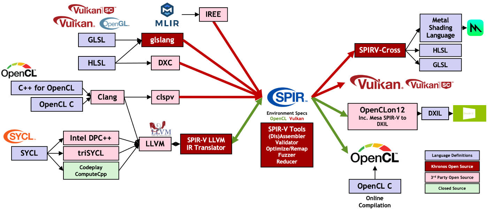

*SPIR-V的生态系统一览，Shader跨平台只是其中一部分。*

SPIR-V也是目前不少商业引擎或渲染器的shader跨平台方案。那么UE是不是也是使用SPIR-V，还是选择了其它方案？本节将解答此问题，挖掘UE使用的Shader跨平台方案。

对于Shader跨平台，通常需要考虑以下几点：

- **单次编码多平台使用。**这个是基本要求，不能实现此特性，则无从谈起跨平台，也增加开发人员的工作量，降低工作效率。
- **可离线编译。**目前多数shader编译器都支持这个功能。
- **需要反射来创建在运行时渲染器使用的元数据。** 比如纹理被绑定到哪个索引，Uniform是否被使用使用等等。
- **特定的优化措施。**如离线校验，内联化，无用的指令和数据检测、删除，指令合并和简化，离线编译的是中间语言还是目标机器码等等。

UE早期在Shader跨平台方案考虑了几种思路：

- 纯粹用宏封装各种着色语言的差异。简单的着色逻辑应该可行，但实际上，各种着色语言存在巨大的差异，几乎无法用宏抽象。因此不可行。
- 使用FXC编译HLSL，然后转换字节码。良好的效果，但致命缺点是无法支持Mac OS平台，因此被弃用。
- 第三方跨平台编译器。在当时（2014年），没有一个能够支持SM5.0的语法和Coumte Shader的编译器。

面对当时（2014年前后）的现状，UE4.3受[glsl-optimizer](https://github.com/aras-p/glsl-optimizer)的启发，基于[Mesa GLSL parser and IR](https://www.mesa3d.org/)造了个自己的轮子HLSLCC（HLSL Cross Compiler）。HLSLCC将分析器用来分析SM5.0（而非GLSL），实现Mesa IR到GLSL的转换器（类似于glsl-optimizer）。另外，Mesa天然支持IR优化，因此HLSLCC也支持IR优化。

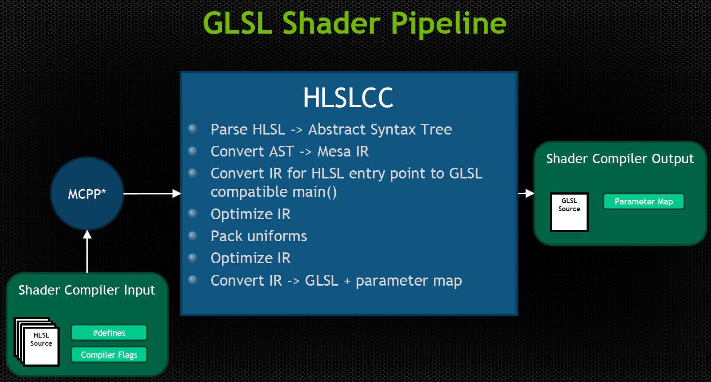

*HLSLCC在GLSL下的管线示意图。Shader编译器的输入是HLSL源码，会先转成MCPP，然后经过HLSLCC处理成GLSL源码和参数表。*

HLSLCC的主要工作步骤如下所述：

- **Preprocessing**，预处理阶段。通过类似C风格的预处理器运行，在编译之前，UE使用MCPP进行预处理，因此跳过了这一步。
- **Parsing**，语法分析阶段。通过Mesa的**_mesa_hlsl_parse**接口，HLSL将被分析成抽象语法树，Lexer（语法分析）和Parser分别由flex和bison生成。
- **Compilation**，编译阶段。利用 **_mesa_ast_to_hir**，将AST（抽象语法树）编译为Mesa IR。在此阶段，编译器执行隐式转换、函数重载解析、生成内部函数的指令等功能，也将生成 GLSL 主入口点，会将输入及输出变量的全局声明添加到IR，同时计算HLSL入口点的输入，调用HLSL入口点，并将输出写入全局输出变量。
- **Optimization**，优化阶段。主要通过**do_optimization_pass**对IR执行多遍优化，包括直接插入函数、消除无用代码、传播常量、消除公共的子表达式等等。
- **Uniform packing**，全局变量打包。将全局统一变量打包成数组并保留映射信息，以便引擎可将参数与一致变量数组的相关部分绑定。
- **Final optimization**，最终优化阶段。打包统一变量之后，将对IR运行第二遍优化，以简化打包统一变量时生成的代码。
- **Generate GLSL**，生成GLSL。最后步骤，将已经优化的IR转换为GLSL源代码。除了生成所有构造及统一变量缓冲区的定义以及源代码本身以外，还会在文件开头的注释中写入一个映射表。

以上的阐述涉及的源码在Engine\Source\ThirdParty\hlslcc目录下面，核心文件有：

- ast.h
- glcpp-parse.h
- glsl_parser_extras.h
- hlsl_parser.h
- ir_optimization.h

下面是编译阶段涉及到的核心函数：

| 函数名                              | 解析                                                         |
| ----------------------------------- | ------------------------------------------------------------ |
| **apply_type_conversion**           | 此函数将一种类型的值转换为另一种类型（如果有可能的话）。是执行隐式转换还是显式转换由参数控制。 |
| **arithmetic_result_type**          | 这组函数确定对输入值应用操作的结果类型。                     |
| **validate_assignment**             | 确定某个 rvalue 是否可赋予特定类型的 lvalue。必要时，将应用允许的隐式转换。 |
| **do_assignment**                   | 将 rvalue 赋予 lvalue（如果可使用 validate_assignment 完成）。 |
| **ast_expression::hir**             | 将AST中的表达式节点转换为一组IR指令。                        |
| **process_initializer**             | 将初始化表达式应用于变量。                                   |
| **ast_struct_specifier::hir**       | 构建聚合类型，以表示所声明的结构。                           |
| **ast_cbuffer_declaration::hir**    | 构建常量缓冲区布局的结构体，并将其存储为统一变量块。         |
| **process_mul**                     | 处理HLSL内部乘法的特殊代码。                                 |
| **match_function_by_name**          | 根据输入参数的名称和列表来查找函数特征符。                   |
| **rank_parameter_lists**            | 对两个参数列表进行比较，并指定数字排名以指示这两个列表的匹配程度。是一个辅助函数，用于执行重载解析：排名最低的特征符将胜出，如果有任何特征符的排名与排名最低的特征符相同，那么将函数调用声明为具有歧义。排名为零表示精确匹配。 |
| **gen_texture_op**                  | 处理内置HLSL纹理和采样对象的方法调用。                       |
| **_mesa_glsl_initialize_functions** | 生成HLSL内部函数的内置函数。大部分函数（例如 sin 和 cos）会生成IR代码以执行操作，但某些函数（例如 transpose 和 determinant）会保留函数调用以推迟操作，使其由驱动程序的 GLSL 编译器执行。 |

HLSLCC从UE4.3的首个版本开始，到至今的4.26，经历了数次迭代。例如在UE4.22，Shader的跨平台示意图如下：

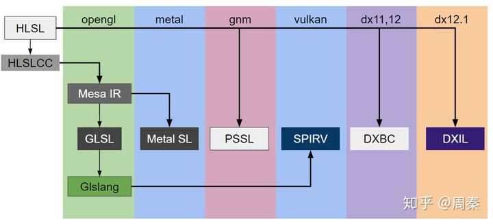

*UE4.22的shader跨平台示意图，其中Metal SL由Mesa IR转译而来，Vulkan由Mesa IR-GLSL-GLSlang-SPIR-V多重转义而来。*

在UE4.25，Shader的跨平台示意图如下：

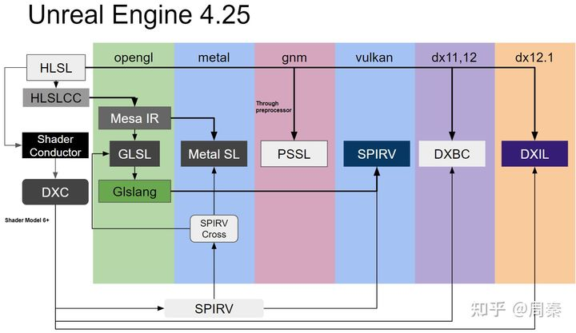

*UE4.25的shader跨平台示意图，最大的改变在于增加了Shader Conductor，从而通过DXC->SPIR-V再转译到Metal、Vulkan、DX等平台。*

因此，UE4.25的最大改变在于新增了Shader Conductor，转换成SPIR-V，以实现Metal、Vulkan等平台的转移。

其中Shader Conductor也是第三方库，位于引擎的Engine\Source\ThirdParty\ShaderConductor目录下。它的核心模块有：

- ShaderConductor.hpp
- ShaderConductor.cpp
- Native.h
- Native.cpp

Shader Conductor内部还包含了DirectXShaderCompiler、SPIRV-Cross、SPIRV-Headers、SPIRV-Tools等组件。

UE4.25的思路跟叛逆者（龚敏敏）的[KlayGE](https://github.com/gongminmin/KlayGE)的Shader跨平台方案如出一辙：

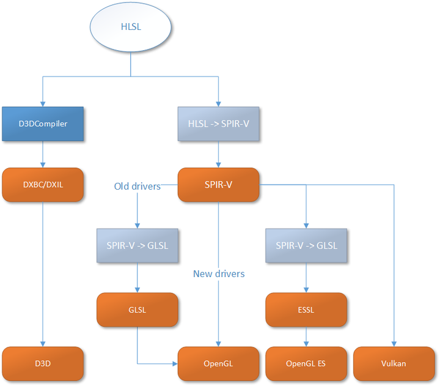

Vulkan不但拥有全新的API，还带来了一个新的shader中间格式SPIR-V。这正是通往统一的跨平台shader编译路上最更要的一级台阶。从趋势来看，未来将会越来越多引擎和渲染器以SPIR-V做为首选的跨平台技术解决方案。

另外提一个小细节，Direct3D和OpenGL虽然在标准化设备坐标一致，但在UV空间的坐标是不一致的：

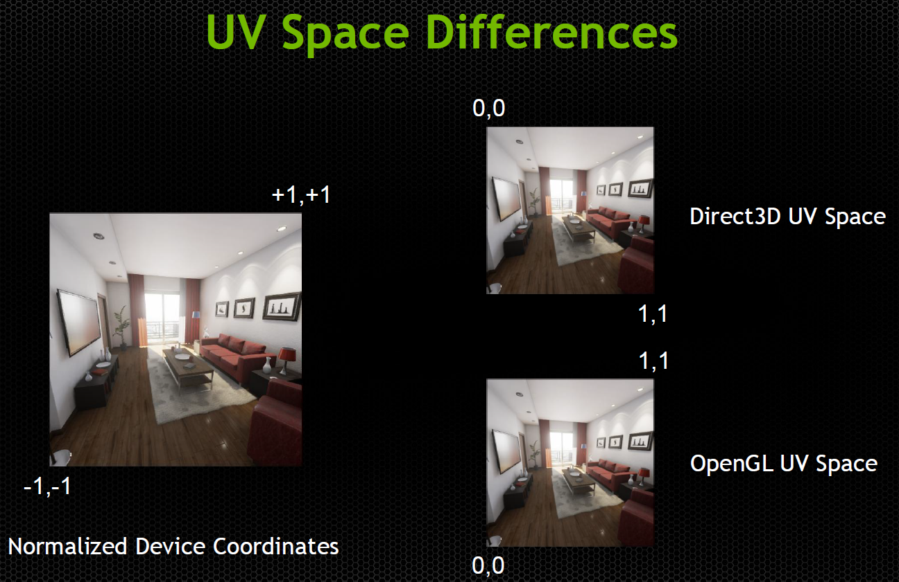

UE为了不让shader的开发人员察觉到这一差异，采用了翻转的图片，强制使得UV坐标用统一的范式：

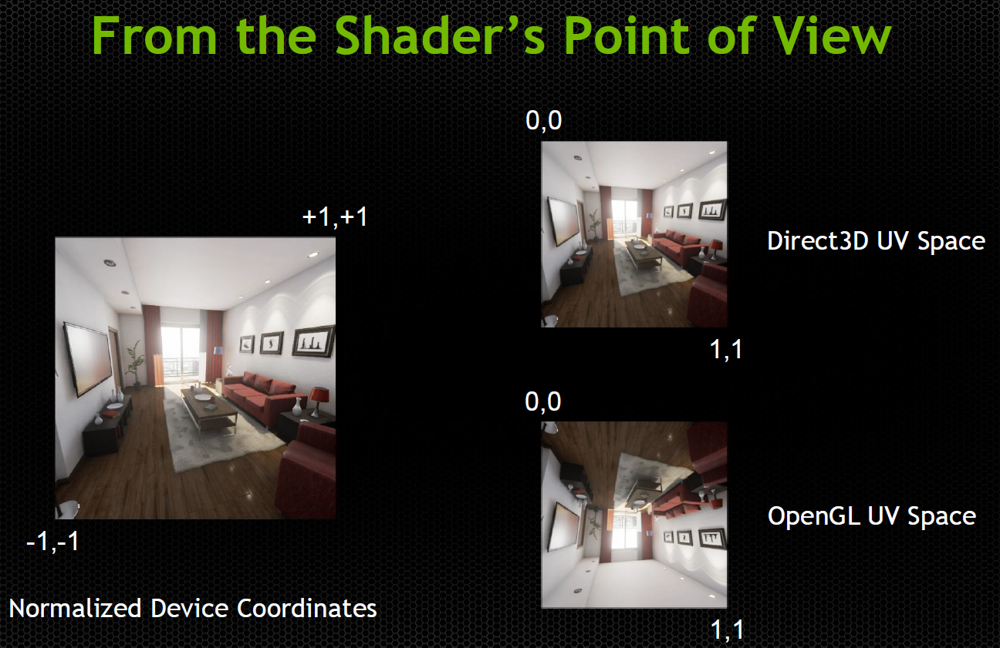

这样做的后果就是OpenGL的纹理实际上是垂直翻转的（从RenderDoc截取的UE在OpenGL平台下的应用也可佐证），不过渲染后期可以再次翻转就行了。但是，UE采用颠倒（Upside down）的渲染方式，并且将颠倒的参数集成到投影矩阵：


因此，看起来标准化设备坐标和D3D下的纹理都是垂直翻转的。

## **8.3.4 Shader缓存**

Shader缓存有两种，一种是存于DDC的离线数据，常用来加速编辑器阶段和开发阶段的效率，具体可参见8.3.1.2 FGlobalShaderMap。另一种是运行时的Shader缓存，早期的UE由FShaderCache承担，但UE4.26已经取消了FShaderCache，由FShaderPipelineCache取而代之。

FShaderPipelineCache提供了新的管道状态对象(PSO)日志记录、序列化和预编译机制 。缓存管道状态对象并将初始化器序列化到磁盘，允许在下次游戏运行时预编译这些状态，这可以减少卡顿。但FShaderPipelineCache依赖于FShaderCodeLibrary、Share Material Shader Code和RHI侧的PipelineFileCache。

下面是FShaderPipelineCache的定义：

```c++
// Engine\Source\Runtime\RenderCore\Public\ShaderPipelineCache.h

class FShaderPipelineCache : public FTickableObjectRenderThread
{
    // 编译作业结构体.
    struct CompileJob
    {
        FPipelineCacheFileFormatPSO PSO;
        FShaderPipelineCacheArchive* ReadRequests;
    };

public:
    // 初始化FShaderPipelineCache.
    static void Initialize(EShaderPlatform Platform);
    // 销毁FShaderPipelineCache
    static void Shutdown();
    // 暂停/继续打包预编译.
    static void PauseBatching();
    static void ResumeBatching();
    
    // 打包模式
    enum class BatchMode
    {
        Background, // 最大打包尺寸由r.ShaderPipelineCache.BackgroundBatchSize决定.
        Fast, // 最大打包尺寸由r.ShaderPipelineCache.BatchSize决定.
        Precompile // 最大打包尺寸由r.ShaderPipelineCache.PrecompileBatchSize决定.
    };
    
    // 设置和获取数据接口.
    static void SetBatchMode(BatchMode Mode);
    static uint32 NumPrecompilesRemaining();
    static uint32 NumPrecompilesActive();
    
    static int32 GetGameVersionForPSOFileCache();
    static bool SetGameUsageMaskWithComparison(uint64 Mask, FPSOMaskComparisonFn InComparisonFnPtr);
    static bool IsBatchingPaused();
    
    // 打开FShaderPipelineCache
    static bool OpenPipelineFileCache(EShaderPlatform Platform);
    static bool OpenPipelineFileCache(FString const& Name, EShaderPlatform Platform);
    
    // 保存/关闭FShaderPipelineCache
    static bool SavePipelineFileCache(FPipelineFileCache::SaveMode Mode);
    static void ClosePipelineFileCache();

    // 构造/析构函数.
    FShaderPipelineCache(EShaderPlatform Platform);
    virtual ~FShaderPipelineCache();

    // Tick相关接口.
    bool IsTickable() const;
    // 帧Tick
    void Tick( float DeltaTime );
    bool NeedsRenderingResumedForRenderingThreadTick() const;
    
    TStatId GetStatId() const;
    
    enum ELibraryState
    {
        Opened,
        Closed
    };
    
    // 状态变换通知.
    static void ShaderLibraryStateChanged(ELibraryState State, EShaderPlatform Platform, FString const& Name);

    // 预编译上下文.
    class FShaderCachePrecompileContext
    {
        bool bSlowPrecompileTask;
    public:
        FShaderCachePrecompileContext() : bSlowPrecompileTask(false) {}
        void SetPrecompilationIsSlowTask() { bSlowPrecompileTask = true; }
        bool IsPrecompilationSlowTask() const { return bSlowPrecompileTask; }
    };

    // 信号委托函数.
    static FShaderCachePreOpenDelegate& GetCachePreOpenDelegate();
    static FShaderCacheOpenedDelegate& GetCacheOpenedDelegate();
    static FShaderCacheClosedDelegate& GetCacheClosedDelegate();
    static FShaderPrecompilationBeginDelegate& GetPrecompilationBeginDelegate();
    static FShaderPrecompilationCompleteDelegate& GetPrecompilationCompleteDelegate();

    (......)
    
private:
    // 打包预编译的各种数据.
    static FShaderPipelineCache* ShaderPipelineCache;
    TArray<CompileJob> ReadTasks;
    TArray<CompileJob> CompileTasks;
    TArray<FPipelineCachePSOHeader> OrderedCompileTasks;
    TDoubleLinkedList<FPipelineCacheFileFormatPSORead*> FetchTasks;
    TSet<uint32> CompiledHashes;
    
    FString FileName;
    EShaderPlatform CurrentPlatform;
    FGuid CacheFileGuid;
    uint32 BatchSize;
    
    FShaderCachePrecompileContext ShaderCachePrecompileContext;

    FCriticalSection Mutex;
    TArray<FPipelineCachePSOHeader> PreFetchedTasks;
    TArray<CompileJob> ShutdownReadCompileTasks;
    TDoubleLinkedList<FPipelineCacheFileFormatPSORead*> ShutdownFetchTasks;

    TMap<FBlendStateInitializerRHI, FRHIBlendState*> BlendStateCache;
    TMap<FRasterizerStateInitializerRHI, FRHIRasterizerState*> RasterizerStateCache;
    TMap<FDepthStencilStateInitializerRHI, FRHIDepthStencilState*> DepthStencilStateCache;
    
    (......)
};
```

FShaderPipelineCache的打包预编译获得的数据保存在工程目录的Saved目录下，后缀是.upipelinecache：

```c++
// Engine\Source\Runtime\RHI\Private\PipelineFileCache.cpp

bool FPipelineFileCache::SavePipelineFileCache(FString const& Name, SaveMode Mode)
{
    bool bOk = false;
    
    // 必须开启PipelineFileCache且记录PSO到文件缓存.
    if(IsPipelineFileCacheEnabled() && LogPSOtoFileCache())
    {
        if(FileCache)
        {
            // 保存的平台名称.
            FName PlatformName = FileCache->GetPlatformName();
            // 保存的目录
            FString Path = FPaths::ProjectSavedDir() / FString::Printf(TEXT("%s_%s.upipelinecache"), *Name, *PlatformName.ToString());
            // 执行保存操作.
            bOk = FileCache->SavePipelineFileCache(Path, Mode, Stats, NewPSOs, RequestedOrder, NewPSOUsage);
            
            (......)
        }
    }
    
    return bOk;
}
```

由于是运行时生效的Shader缓存，那么必然是要集成到UE的运行时模块中。实际上是在FEngineLoop内完成对它的操控：

```c++
int32 FEngineLoop::PreInitPreStartupScreen(const TCHAR* CmdLine)
{
    (......)
    
    {
        bool bUseCodeLibrary = FPlatformProperties::RequiresCookedData() || GAllowCookedDataInEditorBuilds;
        if (bUseCodeLibrary)
        {
            {
                FShaderCodeLibrary::InitForRuntime(GMaxRHIShaderPlatform);
            }

    #if !UE_EDITOR
            // Cooked data only - but also requires the code library - game only
            if (FPlatformProperties::RequiresCookedData())
            {
                // 初始化FShaderPipelineCache
                FShaderPipelineCache::Initialize(GMaxRHIShaderPlatform);
            }
    #endif //!UE_EDITOR
        }
    }
    
    (......)
}

int32 FEngineLoop::PreInitPostStartupScreen(const TCHAR* CmdLine)
{
    (......)
    
    IInstallBundleManager* BundleManager = IInstallBundleManager::GetPlatformInstallBundleManager();
    if (BundleManager == nullptr || BundleManager->IsNullInterface())
    {
        (......)

        {
            // 打开包含了材质着色器的游戏库.
            FShaderCodeLibrary::OpenLibrary(FApp::GetProjectName(), FPaths::ProjectContentDir());
            for (const FString& RootDir : FPlatformMisc::GetAdditionalRootDirectories())
            {
                FShaderCodeLibrary::OpenLibrary(FApp::GetProjectName(), FPaths::Combine(RootDir, FApp::GetProjectName(), TEXT("Content")));
            }

            // 打开FShaderPipelineCache.
            FShaderPipelineCache::OpenPipelineFileCache(GMaxRHIShaderPlatform);
        }
    }
    
    (......)
}
```

此外，GameEngine也会运行时相应命令行的继续和暂停预编译打包。一旦FShaderPipelineCache的实际准备好，RHI层就可以相应它的实际和信号，以Vulkan的FVulkanPipelineStateCacheManager为例：

```c++
// Engine\Source\Runtime\VulkanRHI\Private\VulkanPipeline.h

class FVulkanPipelineStateCacheManager
{
    (......)

private:
    // 追踪ShaderPipelineCache的预编译的委托.
    void OnShaderPipelineCacheOpened(FString const& Name, EShaderPlatform Platform, uint32 Count, const FGuid& VersionGuid, FShaderPipelineCache::FShaderCachePrecompileContext& ShaderCachePrecompileContext);
    void OnShaderPipelineCachePrecompilationComplete(uint32 Count, double Seconds, const FShaderPipelineCache::FShaderCachePrecompileContext& ShaderCachePrecompileContext);

    (......)
};
```

如果要开启Shader Pipeline Cache，需要在工程配置里勾选以下两项（默认已开启）：

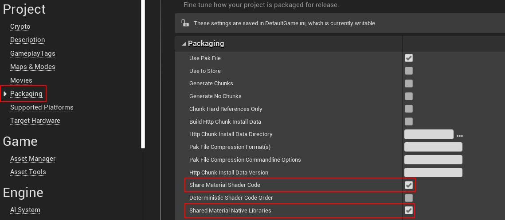

下面有一些命令行变量可以设置Shader Pipeline Cache的属性：

| 命令行                                                | 作用                                                         |
| ----------------------------------------------------- | ------------------------------------------------------------ |
| r.ShaderPipelineCache.Enabled                         | 开启Shader Pipeline Cache，以便从磁盘加载已有的数据并预编译。 |
| r.ShaderPipelineCache.BatchSize / BackgroundBatchSize | 可以设置不同Batch模式下的尺寸。                              |
| r.ShaderPipelineCache.LogPSO                          | 开启Shader Pipeline Cache下的PSO记录。                       |
| r.ShaderPipelineCache.SaveAfterPSOsLogged             | 设置预期的PSO记录数量，到了此数量便自动保存。                |

另外，在GGameIni或GGameUserSettingsIni内，Shader Pipeline Cache用字段 [ShaderPipelineCache.CacheFile]存储信息。

 

# **8.4 Shader开发**

本章将讲述Shader的开发案例、调试技巧和优化技术。

## **8.4.1 Shader调试**

如果项目处于开发阶段，最好将Shader的编译选项改成Development，可以通过修改Engine\Config\ConsoleVariables.ini的以下配置达成：

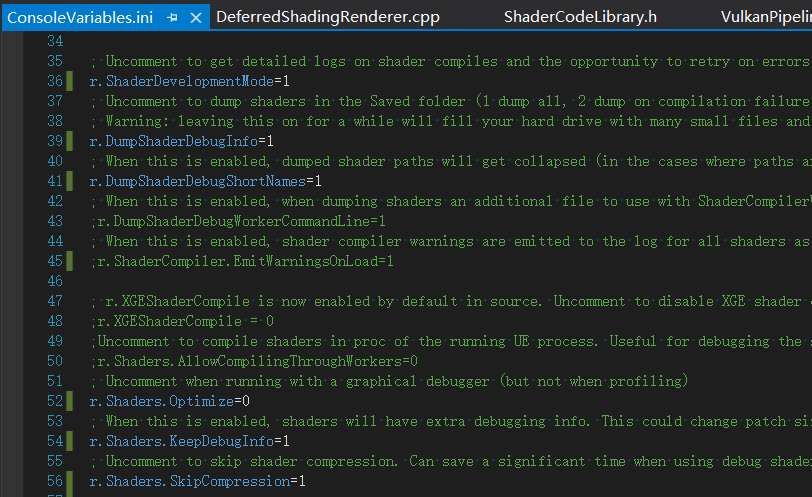

将命令变量前面的分号去掉即可。它们的含义如下：

| 命令行                        | 解析                                                         |
| ----------------------------- | ------------------------------------------------------------ |
| r.ShaderDevelopmentMode=1     | 获得关于着色器编译的详细日志和错误重试的机会。               |
| r.DumpShaderDebugInfo=1       | 将编译的所有着色器的文件保存到磁盘ProjectName/Saved/ShaderDebugInfo的目录。包含源文件、预处理后的版本、一个批处理文件（用于使用编译器等效的命令行选项来编译预处理版本）。 |
| r.DumpShaderDebugShortNames=1 | 保存的Shader路径将被精简。                                   |
| r.Shaders.Optimize=0          | 禁用着色器优化，使得shader的调试信息被保留。                 |
| r.Shaders.KeepDebugInfo=1     | 保留调试信息，配合RenderDoc等截帧工具时特别有用。            |
| r.Shaders.SkipCompression=1   | 忽略shader压缩，可以节省调试shader的时间。                   |

开启了以上命令之后，用RenderDoc截帧将可以完整地看到Shader的变量、HLSL代码（不开启将是汇编指令），还可以单步调试。能够有效提升Shader开发和调试的效率。

r.DumpShaderDebugInfo开启后，随意在UE的内置shader修改一行代码（比如在Common.ush加个空格），重启UE编辑器，着色器将被重新编译，完成之后在ProjectName/Saved/ShaderDebugInfo的目录下生成有用的调试信息：

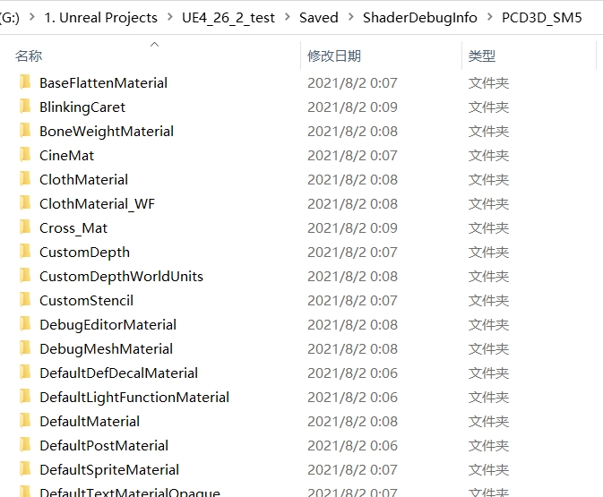

打开某个具体的材质shader目录，可以发现有源文件、预处理后的版本、批处理文件以及哈希值：

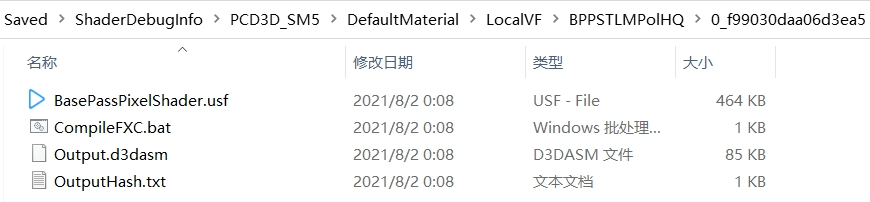

另外，如果修改了Shader的某些文件（如BasePassPixelShader.ush），不需要重启UE编辑器，可以在控制台输入`RecompileShaders`命令重新编译指定的shader文件。其中`RecompileShaders`的具体含义如下：

| 命令                      | 解析                                                         |
| ------------------------- | ------------------------------------------------------------ |
| RecompileShaders all      | 编译源码有修改的所有shader，包含global、material、meshmaterial。 |
| RecompileShaders changed  | 编译源码有修改的shader。                                     |
| RecompileShaders global   | 编译源码有修改的global shader。                              |
| RecompileShaders material | 编译源码有修改的material shader。                            |
| RecompileShaders material | 编译指定名称的材质。                                         |
| RecompileShaders          | 编译指定路径的shader源文件。                                 |

执行以上命令之前，必须先保存shader文件的修改。

另外，要在调试时构建项目时，可以设置ShaderCompileWorker的解决方案属性（Visual Studio：生成 -> 配置管理器）为 Debug_Program：

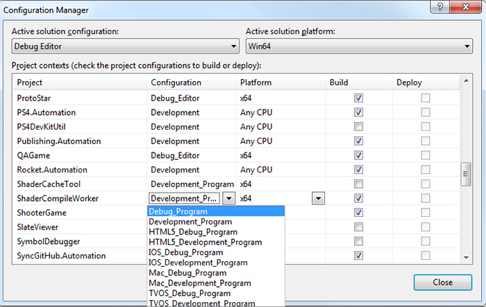

这样就可以用ShaderCompileWorker (SCW) 添加Shader调试命令行：

```ini
PathToGeneratedUsfFile -directcompile -format=ShaderFormat -ShaderType -entry=EntryPoint
```

- *PathToGeneratedUsfFile* 是 ShaderDebugInfo 文件夹中的最终 usf 文件。
- *ShaderFormat* 是您想要调试的着色器平台格式（在本例中，这是 PCD3D_SM5）。
- *ShaderType* 是 vs/ps/gs/hs/ds/cs 中的一项，分别对应于“顶点”、“像素”、“几何体”、“物体外壳”、“域”和“计算”着色器类型。
- *EntryPoint* 是 usf 文件中此着色器的入口点的函数名称。

例如：

```ini
<ProjectPath>\Saved\ShaderDebugInfo\PCD3D_SM5\M_Egg\LocalVF\BPPSFNoLMPolicy\BasePassPixelShader.usf -format=PCD3D_SM5 -ps -entry=Main
```

可以对D3D11ShaderCompiler.cpp中的CompileD3DShader()函数设置断点，通过命令行运行 SCW，可以了解如何调用平台编译器：

```c++
// Engine\Source\Developer\Windows\ShaderFormatD3D\Private\D3DShaderCompiler.cpp

void CompileD3DShader(const FShaderCompilerInput& Input, FShaderCompilerOutput& Output, FShaderCompilerDefinitions& AdditionalDefines, const FString& WorkingDirectory, ELanguage Language)
{
    FString PreprocessedShaderSource;
    const bool bIsRayTracingShader = IsRayTracingShader(Input.Target);
    const bool bUseDXC = bIsRayTracingShader
        || Input.Environment.CompilerFlags.Contains(CFLAG_WaveOperations)
        || Input.Environment.CompilerFlags.Contains(CFLAG_ForceDXC);
    const TCHAR* ShaderProfile = GetShaderProfileName(Input.Target, bUseDXC);

    if(!ShaderProfile)
    {
        Output.Errors.Add(FShaderCompilerError(TEXT("Unrecognized shader frequency")));
        return;
    }

    // 设置附加的定义.
    AdditionalDefines.SetDefine(TEXT("COMPILER_HLSL"), 1);

    if (bUseDXC)
    {
        AdditionalDefines.SetDefine(TEXT("PLATFORM_SUPPORTS_SM6_0_WAVE_OPERATIONS"), 1);
        AdditionalDefines.SetDefine(TEXT("PLATFORM_SUPPORTS_STATIC_SAMPLERS"), 1);
    }

    if (Input.bSkipPreprocessedCache)
    {
        if (!FFileHelper::LoadFileToString(PreprocessedShaderSource, *Input.VirtualSourceFilePath))
        {
            return;
        }

        // 删除常量, 因为是仅调试模式.
        CrossCompiler::CreateEnvironmentFromResourceTable(PreprocessedShaderSource, (FShaderCompilerEnvironment&)Input.Environment);
    }
    else
    {
        if (!PreprocessShader(PreprocessedShaderSource, Output, Input, AdditionalDefines))
        {
            return;
        }
    }

    GD3DAllowRemoveUnused = Input.Environment.CompilerFlags.Contains(CFLAG_ForceRemoveUnusedInterpolators) ? 1 : 0;

    FString EntryPointName = Input.EntryPointName;

    Output.bFailedRemovingUnused = false;
    if (GD3DAllowRemoveUnused == 1 && Input.Target.Frequency == SF_Vertex && Input.bCompilingForShaderPipeline)
    {
        // 总是增加SV_Position
        TArray<FString> UsedOutputs = Input.UsedOutputs;
        UsedOutputs.AddUnique(TEXT("SV_POSITION"));

        // 不能删除任何仅输出的系统语法.
        TArray<FString> Exceptions;
        Exceptions.AddUnique(TEXT("SV_ClipDistance"));
        Exceptions.AddUnique(TEXT("SV_ClipDistance0"));
        Exceptions.AddUnique(TEXT("SV_ClipDistance1"));
        Exceptions.AddUnique(TEXT("SV_ClipDistance2"));
        Exceptions.AddUnique(TEXT("SV_ClipDistance3"));
        Exceptions.AddUnique(TEXT("SV_ClipDistance4"));
        Exceptions.AddUnique(TEXT("SV_ClipDistance5"));
        Exceptions.AddUnique(TEXT("SV_ClipDistance6"));
        Exceptions.AddUnique(TEXT("SV_ClipDistance7"));

        Exceptions.AddUnique(TEXT("SV_CullDistance"));
        Exceptions.AddUnique(TEXT("SV_CullDistance0"));
        Exceptions.AddUnique(TEXT("SV_CullDistance1"));
        Exceptions.AddUnique(TEXT("SV_CullDistance2"));
        Exceptions.AddUnique(TEXT("SV_CullDistance3"));
        Exceptions.AddUnique(TEXT("SV_CullDistance4"));
        Exceptions.AddUnique(TEXT("SV_CullDistance5"));
        Exceptions.AddUnique(TEXT("SV_CullDistance6"));
        Exceptions.AddUnique(TEXT("SV_CullDistance7"));
        
        DumpDebugShaderUSF(PreprocessedShaderSource, Input);

        TArray<FString> Errors;
        if (!RemoveUnusedOutputs(PreprocessedShaderSource, UsedOutputs, Exceptions, EntryPointName, Errors))
        {
            DumpDebugShaderUSF(PreprocessedShaderSource, Input);
            UE_LOG(LogD3D11ShaderCompiler, Warning, TEXT("Failed to Remove unused outputs [%s]!"), *Input.DumpDebugInfoPath);
            for (int32 Index = 0; Index < Errors.Num(); ++Index)
            {
                FShaderCompilerError NewError;
                NewError.StrippedErrorMessage = Errors[Index];
                Output.Errors.Add(NewError);
            }
            Output.bFailedRemovingUnused = true;
        }
    }

    FShaderParameterParser ShaderParameterParser;
    if (!ShaderParameterParser.ParseAndMoveShaderParametersToRootConstantBuffer(
        Input, Output, PreprocessedShaderSource,
        IsRayTracingShader(Input.Target) ? TEXT("cbuffer") : nullptr))
    {
        return;
    }

    RemoveUniformBuffersFromSource(Input.Environment, PreprocessedShaderSource);

    uint32 CompileFlags = D3D10_SHADER_ENABLE_BACKWARDS_COMPATIBILITY
        // 解压unifor矩阵成行优先(row-major), 以匹配CPU布局.
        | D3D10_SHADER_PACK_MATRIX_ROW_MAJOR;

    if (Input.Environment.CompilerFlags.Contains(CFLAG_Debug)) 
    {
        // 增加调试标记.
        CompileFlags |= D3D10_SHADER_DEBUG | D3D10_SHADER_SKIP_OPTIMIZATION;
    }
    else
    {
        if (Input.Environment.CompilerFlags.Contains(CFLAG_StandardOptimization))
        {
            CompileFlags |= D3D10_SHADER_OPTIMIZATION_LEVEL1;
        }
        else
        {
            CompileFlags |= D3D10_SHADER_OPTIMIZATION_LEVEL3;
        }
    }

    for (int32 FlagIndex = 0; FlagIndex < Input.Environment.CompilerFlags.Num(); FlagIndex++)
    {
        // 累积标记设置到shader.
        CompileFlags |= TranslateCompilerFlagD3D11((ECompilerFlags)Input.Environment.CompilerFlags[FlagIndex]);
    }

    TArray<FString> FilteredErrors;
    if (bUseDXC)
    {
        if (!CompileAndProcessD3DShaderDXC(PreprocessedShaderSource, CompileFlags, Input, EntryPointName, ShaderProfile, Language, false, FilteredErrors, Output))
        {
            if (!FilteredErrors.Num())
            {
                FilteredErrors.Add(TEXT("Compile Failed without errors!"));
            }
        }
        CrossCompiler::FShaderConductorContext::ConvertCompileErrors(MoveTemp(FilteredErrors), Output.Errors);
    }
    else
    {
        // 重写默认的编译器路径到更新的dll.
        FString CompilerPath = FPaths::EngineDir();
        CompilerPath.Append(TEXT("Binaries/ThirdParty/Windows/DirectX/x64/d3dcompiler_47.dll"));

        if (!CompileAndProcessD3DShaderFXC(PreprocessedShaderSource, CompilerPath, CompileFlags, Input, EntryPointName, ShaderProfile, false, FilteredErrors, Output))
        {
            if (!FilteredErrors.Num())
            {
                FilteredErrors.Add(TEXT("Compile Failed without errors!"));
            }
        }

        // 处理错误.
        for (int32 ErrorIndex = 0; ErrorIndex < FilteredErrors.Num(); ErrorIndex++)
        {
            const FString& CurrentError = FilteredErrors[ErrorIndex];
            FShaderCompilerError NewError;

            // Extract filename and line number from FXC output with format:
            // "d:\UE4\Binaries\BasePassPixelShader(30,7): error X3000: invalid target or usage string"
            int32 FirstParenIndex = CurrentError.Find(TEXT("("));
            int32 LastParenIndex = CurrentError.Find(TEXT("):"));
            if (FirstParenIndex != INDEX_NONE &&
                LastParenIndex != INDEX_NONE &&
                LastParenIndex > FirstParenIndex)
            {
                // Extract and store error message with source filename
                NewError.ErrorVirtualFilePath = CurrentError.Left(FirstParenIndex);
                NewError.ErrorLineString = CurrentError.Mid(FirstParenIndex + 1, LastParenIndex - FirstParenIndex - FCString::Strlen(TEXT("(")));
                NewError.StrippedErrorMessage = CurrentError.Right(CurrentError.Len() - LastParenIndex - FCString::Strlen(TEXT("):")));
            }
            else
            {
                NewError.StrippedErrorMessage = CurrentError;
            }
            Output.Errors.Add(NewError);
        }
    }

    const bool bDirectCompile = FParse::Param(FCommandLine::Get(), TEXT("directcompile"));
    if (bDirectCompile)
    {
        for (const auto& Error : Output.Errors)
        {
            FPlatformMisc::LowLevelOutputDebugStringf(TEXT("%s\n"), *Error.GetErrorStringWithLineMarker());
        }
    }

    ShaderParameterParser.ValidateShaderParameterTypes(Input, Output);

    if (Input.ExtraSettings.bExtractShaderSource)
    {
        Output.OptionalFinalShaderSource = PreprocessedShaderSource;
    }
}
```

此外，如果不借助RenderDoc等工具，可以将需要调试的数据转换成合理范围的颜色值，以观察它的值是否正常，例如：

```c++
// 将世界坐标除以一个范围内的数值, 并输出到颜色.
OutColor = frac(WorldPosition / 1000);
```

配合RecompileShaders的指令，这一技巧非常管用且高效。

## **8.4.2 Shader优化**

渲染的优化技术五花八门，大到系统、架构、工程层级，小到具体的语句，不过本节专注于UE环境下的Shader常规优化技巧。

### **8.4.2.1 优化排列**

由于UE采用了Uber Shader的设计，同一个shader源文件包含了大量的宏定义，这些宏定义根据不同的值可以组合成非常非常多的目标代码，而这些宏通常由排列来控制。如果我们能够有效控制排列的数量，也可以减少Shader的编译数量、时间，提升运行时的效率。

在工厂配置中，有一些选项可以取消勾选，以减少排列的数量：


但需要注意，如果取消了勾选，意味着引擎将禁用该功能，需要根据实际情况做出权衡和选择，而不应该为了优化而优化。

此外，在引擎渲染模块的很多内置类型，都提供ShouldCompilePermutation的接口，以便编译器在正式编译之前向被编译对象查询某个排列是否需要编译，如果返回false，编译器将忽略该排列，从而减少shader数量。支持ShouldCompilePermutation的类型包含但不限于：

- FShader
- FGlobalShader
- FMaterialShader
- FMeshMaterialShader
- FVertexFactory
- FLocalVertexFactory
- FShaderType
- FGlobalShaderType
- FMaterialShaderType
- 上述类型的子类

所以，我们在新添加以上类型的子类时，有必要认真对待ShouldCompilePermutation，以便剔除一些无用的shader排列。

对于材质，可以关闭材质属性模板的 Automatically Set Usage in Editor选项，防止编辑过程中产生额外的标记，增加shader排列：

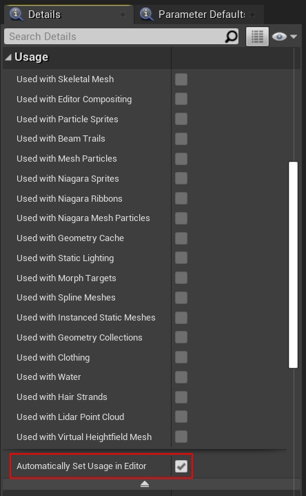

但带来的效益可能不明显，还会因为漏选某些标记导致材质不能正常工作（比如不支持蒙皮骨骼，不支持BS等）。

此外，要谨慎添加Switch节点，这些通常也会增加排列数量：

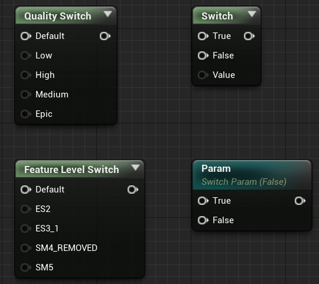

### **8.4.2.2 指令优化**

- 避免if、switch分支语句。

- 避免`for`循环语句，特别是循环次数可变的。

- 减少纹理采样次数。

- 禁用`clip`或`discard`操作。

- 减少复杂数学函数调用。

- 使用更低精度的浮点数。OpenGL ES的浮点数有三种精度：highp（32位浮点）, mediump（16位浮点）, lowp（8位浮点），很多计算不需要高精度，可以改成低精度浮点。

- 避免重复计算。可以将所有像素一样的变量提前计算好，或者由C++层传入：

  ```glsl
  precision mediump float;
  float a = 0.9;
  float b = 0.6;
  
  varying vec4 vColor;
  
  void main()
  {
      gl_FragColor = vColor * a * b; // a * b每个像素都会计算，导致冗余的消耗。可将a * b在c++层计算好再传进shader。
  }
  ```

- 向量延迟计算。

  ```glsl
  highp float f0, f1;
  highp vec4 v0, v1;
  
  v0 = (v1 * f0) * f1; // v1和f0计算后返回一个向量，再和f1计算，多了一次向量计算。
  // 改成：
  v0 = v1 * (f0 * f1); // 先计算两个浮点数，这样只需跟向量计算一次。
  ```

- 充分利用向量分量掩码。

  ```glsl
  highp vec4 v0;
  highp vec4 v1;
  highp vec4 v2;
  v2.xz = v0 * v1; // v2只用了xz分量，比v2 = v0 * v1的写法要快。
  ```

- 避免或减少临时变量。

- 尽量将Pixel Shader计算移到Vertex Shader。例如像素光改成顶点光。

- 将跟顶点或像素无关的计算移到CPU，然后通过uniform传进来。

- 分级策略。不同画质不同平台采用不同复杂度的算法。

- 顶点输入应当采用逐Structure的布局，避免每个顶点属性一个数组。逐Structure的布局有利于提升GPU缓存命中率。

- 尽可能用Compute Shader代替传统的VS、PS管线。CS的管线更加简单、纯粹，利于并行化计算，结合LDS机制，可有效提升效率。

- 降分辨率渲染。有些信息没有必要全分配率渲染，如模糊的倒影、SSR、SSGI等。

## **8.4.3 Shader开发案例**

结合开发案例，有利于巩固对UE Shader体系的掌握和理解。

### **8.4.3.1 新增Global Shader**

本节通过增加一个全新的最简化的Global Shader，以阐述Shader添加过程和步骤。

首先需要新增加一个shader源文件，此处命名为MyTest.ush：

```c++
// VS主入口.
void MainVS(
    in float4 InPosition : ATTRIBUTE0,
    out float4 Output : SV_POSITION)
{
    Output = InPosition;
}


// 颜色变量, 由c++层传入.
float4 MyColor;

// PS主入口.
float4 MainPS() : SV_Target0
{
    return MyColor;
}
```

再添加C++相关的VS和PS：

```c++
#include "GlobalShader.h"

// VS, 继承自FGlobalShader
class FMyVS : public FGlobalShader
{
    DECLARE_EXPORTED_SHADER_TYPE(FMyVS, Global, /*MYMODULE_API*/);

    FMyTestVS() {}
    FMyTestVS(const ShaderMetaType::CompiledShaderInitializerType& Initializer)
        : FGlobalShader(Initializer)
    {
    }

    static bool ShouldCache(EShaderPlatform Platform)
    {
        return true;
    }
};

// 实现VS.
IMPLEMENT_SHADER_TYPE(, FMyVS, TEXT("MyTest"), TEXT("MainVS"), SF_Vertex);


// PS, 继承自FGlobalShader
class FMyTestPS : public FGlobalShader
{
    DECLARE_EXPORTED_SHADER_TYPE(FMyPS, Global, /*MYMODULE_API*/);

    FShaderParameter MyColorParameter;

    FMyTestPS() {}
    FMyTestPS(const ShaderMetaType::CompiledShaderInitializerType& Initializer)
        : FGlobalShader(Initializer)
    {
        // 绑定着色器参数.
        MyColorParameter.Bind(Initializer.ParameterMap, TEXT("MyColor"), SPF_Mandatory);
    }

    static void ModifyCompilationEnvironment(EShaderPlatform Platform, FShaderCompilerEnvironment& OutEnvironment)
    {
        FGlobalShader::ModifyCompilationEnvironment(Platform, OutEnvironment);
        // 增加定义.
        OutEnvironment.SetDefine(TEXT("MY_DEFINE"), 1);
    }

    static bool ShouldCache(EShaderPlatform Platform)
    {
        return true;
    }

    // 序列化.
    virtual bool Serialize(FArchive& Ar) override
    {
        bool bShaderHasOutdatedParameters = FGlobalShader::Serialize(Ar);
        Ar << MyColorParameter;
        return bShaderHasOutdatedParameters;
    }

    void SetColor(FRHICommandList& RHICmdList, const FLinearColor& Color)
    {
        // 设置颜色到RHI.
        SetShaderValue(RHICmdList, RHICmdList.GetBoundPixelShader(), MyColorParameter, Color);
    }
};

// 实现PS.
IMPLEMENT_SHADER_TYPE(, FMyPS, TEXT("MyTest"), TEXT("MainPS"), SF_Pixel);
```

最后编写渲染代码调用上述自定义的VS和PS：

```c++
void RenderMyTest(FRHICommandList& RHICmdList, ERHIFeatureLevel::Type FeatureLevel, const FLinearColor& Color)
{
    // 获取全局着色器映射表.
    auto ShaderMap = GetGlobalShaderMap(FeatureLevel);

    // 获取VS和PS实例.
    TShaderMapRef<FMyVS> MyVS(ShaderMap);
    TShaderMapRef<FMyPS> MyPS(ShaderMap);

    // 渲染状态.
    static FGlobalBoundShaderState MyTestBoundShaderState;
    SetGlobalBoundShaderState(RHICmdList, FeatureLevel, MyTestBoundShaderState, GetVertexDeclarationFVector4(), *MyVS, *MyPS);

    // 设置PS的颜色.
    MyPS->SetColor(RHICmdList, Color);

    // 设置渲染状态.
    RHICmdList.SetRasterizerState(TStaticRasterizerState::GetRHI());
    RHICmdList.SetBlendState(TStaticBlendState<>::GetRHI());
    RHICmdList.SetDepthStencilState(TStaticDepthStencilState::GetRHI(), 0);

    // 建立全屏幕方块的顶点.
    FVector4 Vertices[4];
    Vertices[0].Set(-1.0f, 1.0f, 0, 1.0f);
    Vertices[1].Set(1.0f, 1.0f, 0, 1.0f);
    Vertices[2].Set(-1.0f, -1.0f, 0, 1.0f);
    Vertices[3].Set(1.0f, -1.0f, 0, 1.0f);

    // 绘制方块.
    DrawPrimitiveUP(RHICmdList, PT_TriangleStrip, 2, Vertices, sizeof(Vertices[0]));
}
```

RenderMyTest实现完之后，可以添加到FDeferredShadingSceneRenderer::RenderFinish之中，以接入到主渲染流程中：

```c++
// 控制台变量, 以便运行时查看效果.
static TAutoConsoleVariable CVarMyTest(
    TEXT("r.MyTest"),
    0,
    TEXT("Test My Global Shader, set it to 0 to disable, or to 1, 2 or 3 for fun!"),
    ECVF_RenderThreadSafe
);

void FDeferredShadingSceneRenderer::RenderFinish(FRHICommandListImmediate& RHICmdList)
{
    (......)
    
    // 增加自定义的代码，以覆盖UE之前的渲染。
    int32 MyTestValue = CVarMyTest.GetValueOnAnyThread();
    if (MyTestValue != 0)
    {
        FLinearColor Color(MyTestValue == 1, MyTestValue == 2, MyTestValue == 3, 1);
        RenderMyTest(RHICmdList, FeatureLevel, Color);
    }

    FSceneRenderer::RenderFinish(RHICmdList);
    
    (......)
}
```

以上逻辑最终渲染的颜色由r.MyTest决定：如果是0，则禁用；是1显示红色；是2显示绿色；是3显示蓝色。

### **8.4.3.2 新增Vertex Factory**

新增加FVertexFactory子类的过程如下：

```c++
// FMyVertexFactory.h

// 声明顶点工厂着色器参数.
BEGIN_GLOBAL_SHADER_PARAMETER_STRUCT(FMyVertexFactoryParameters, )
    SHADER_PARAMETER(FVector4, Color)
END_GLOBAL_SHADER_PARAMETER_STRUCT()

// 声明类型.
typedef TUniformBufferRef<FMyVertexFactoryParameters> FMyVertexFactoryBufferRef;

// 索引缓冲.
class FMyMeshIndexBuffer : public FIndexBuffer
{
public:
    FMyMeshIndexBuffer(int32 InNumQuadsPerSide) : NumQuadsPerSide(InNumQuadsPerSide) {}

    void InitRHI() override
    {
        if (NumQuadsPerSide < 256)
        {
            IndexBufferRHI = CreateIndexBuffer<uint16>();
        }
        else
        {
            IndexBufferRHI = CreateIndexBuffer<uint32>();
        }
    }

    int32 GetIndexCount() const { return NumIndices; };

private:
    template <typename IndexType>
    FIndexBufferRHIRef CreateIndexBuffer()
    {
        TResourceArray<IndexType, INDEXBUFFER_ALIGNMENT> Indices;

        // 分配顶点索引内存.
        Indices.Reserve(NumQuadsPerSide * NumQuadsPerSide * 6);

        // 用Morton顺序构建索引缓冲, 以更好地重用顶点.
        for (int32 Morton = 0; Morton < NumQuadsPerSide * NumQuadsPerSide; Morton++)
        {
            int32 SquareX = FMath::ReverseMortonCode2(Morton);
            int32 SquareY = FMath::ReverseMortonCode2(Morton >> 1);

            bool ForwardDiagonal = false;

            if (SquareX % 2)
            {
                ForwardDiagonal = !ForwardDiagonal;
            }
            if (SquareY % 2)
            {
                ForwardDiagonal = !ForwardDiagonal;
            }

            int32 Index0 = SquareX + SquareY * (NumQuadsPerSide + 1);
            int32 Index1 = Index0 + 1;
            int32 Index2 = Index0 + (NumQuadsPerSide + 1);
            int32 Index3 = Index2 + 1;

            Indices.Add(Index3);
            Indices.Add(Index1);
            Indices.Add(ForwardDiagonal ? Index2 : Index0);
            Indices.Add(Index0);
            Indices.Add(Index2);
            Indices.Add(ForwardDiagonal ? Index1 : Index3);
        }

        NumIndices = Indices.Num();
        const uint32 Size = Indices.GetResourceDataSize();
        const uint32 Stride = sizeof(IndexType);

        // Create index buffer. Fill buffer with initial data upon creation
        FRHIResourceCreateInfo CreateInfo(&Indices);
        return RHICreateIndexBuffer(Stride, Size, BUF_Static, CreateInfo);
    }

    int32 NumIndices = 0;
    const int32 NumQuadsPerSide = 0;
};

// 顶点索引.
class FMyMeshVertexBuffer : public FVertexBuffer
{
public:
    FMyMeshVertexBuffer(int32 InNumQuadsPerSide) : NumQuadsPerSide(InNumQuadsPerSide) {}

    virtual void InitRHI() override
    {
        const uint32 NumVertsPerSide = NumQuadsPerSide + 1;
        
        NumVerts = NumVertsPerSide * NumVertsPerSide;

        FRHIResourceCreateInfo CreateInfo;
        void* BufferData = nullptr;
        VertexBufferRHI = RHICreateAndLockVertexBuffer(sizeof(FVector4) * NumVerts, BUF_Static, CreateInfo, BufferData);
        FVector4* DummyContents = (FVector4*)BufferData;

        for (uint32 VertY = 0; VertY < NumVertsPerSide; VertY++)
        {
            FVector4 VertPos;
            VertPos.Y = (float)VertY / NumQuadsPerSide - 0.5f;

            for (uint32 VertX = 0; VertX < NumVertsPerSide; VertX++)
            {
                VertPos.X = (float)VertX / NumQuadsPerSide - 0.5f;

                DummyContents[NumVertsPerSide * VertY + VertX] = VertPos;
            }
        }

        RHIUnlockVertexBuffer(VertexBufferRHI);
    }

    int32 GetVertexCount() const { return NumVerts; }

private:
    int32 NumVerts = 0;
    const int32 NumQuadsPerSide = 0;
};

// 顶点工厂.
class FMyVertexFactory : public FVertexFactory
{
    DECLARE_VERTEX_FACTORY_TYPE(FMyVertexFactory);

public:
    using Super = FVertexFactory;

    FMyVertexFactory(ERHIFeatureLevel::Type InFeatureLevel);
    ~FMyVertexFactory();

    virtual void InitRHI() override;
    virtual void ReleaseRHI() override;

    static bool ShouldCompilePermutation(const FVertexFactoryShaderPermutationParameters& Parameters);
    static void ModifyCompilationEnvironment(const FVertexFactoryShaderPermutationParameters& Parameters, FShaderCompilerEnvironment& OutEnvironment);
    static void ValidateCompiledResult(const FVertexFactoryType* Type, EShaderPlatform Platform, const FShaderParameterMap& ParameterMap, TArray<FString>& OutErrors);

    inline const FUniformBufferRHIRef GetMyVertexFactoryUniformBuffer() const { return UniformBuffer; }

private:
    void SetupUniformData();

    FMyMeshVertexBuffer* VertexBuffer = nullptr;
    FMyMeshIndexBuffer* IndexBuffer = nullptr;

    FMyVertexFactoryBufferRef UniformBuffer;
};


// FMyVertexFactory.cpp

#include "ShaderParameterUtils.h"

// 实现FMyVertexFactoryParameters, 注意在shader的名字是MyVF.
IMPLEMENT_GLOBAL_SHADER_PARAMETER_STRUCT(FMyVertexFactoryParameters, "MyVF");


// 顶点工厂着色器参数.
class FMyVertexFactoryShaderParameters : public FVertexFactoryShaderParameters
{
    DECLARE_TYPE_LAYOUT(FMyVertexFactoryShaderParameters, NonVirtual);

public:
    
    void Bind(const FShaderParameterMap& ParameterMap)
    {
    }

    void GetElementShaderBindings(
        const class FSceneInterface* Scene,
        const class FSceneView* View,
        const class FMeshMaterialShader* Shader,
        const EVertexInputStreamType InputStreamType,
        ERHIFeatureLevel::Type FeatureLevel,
        const class FVertexFactory* InVertexFactory,
        const struct FMeshBatchElement& BatchElement,
        class FMeshDrawSingleShaderBindings& ShaderBindings,
        FVertexInputStreamArray& VertexStreams) const
    {
        // 强制转换成FMyVertexFactory.
        FMyVertexFactory* VertexFactory = (FMyVertexFactory*)InVertexFactory;

        // 增加shader帮定到表格.
        ShaderBindings.Add(Shader->GetUniformBufferParameter<FMyVertexFactoryShaderParameters>(), VertexFactory->GetMyVertexFactoryUniformBuffer());

        // 填充顶点流.
        if (VertexStreams.Num() > 0)
        {
            // 处理顶点流索引.
            for (int32 i = 0; i < 2; ++i)
            {
                FVertexInputStream* InstanceInputStream = VertexStreams.FindByPredicate([i](const FVertexInputStream& InStream) { return InStream.StreamIndex == i+1; });
                // 绑定顶点流索引.
                InstanceInputStream->VertexBuffer = InstanceDataBuffers->GetBuffer(i);
            }

            // 处理偏移.
            if (InstanceOffsetValue > 0)
            {
                VertexFactory->OffsetInstanceStreams(InstanceOffsetValue, InputStreamType, VertexStreams);
            }
        }
    }
};

// ----------- 实现顶点工厂 -----------

FMyVertexFactory::FMyVertexFactory(ERHIFeatureLevel::Type InFeatureLevel)
{
    VertexBuffer = new FMyMeshVertexBuffer(16);
    IndexBuffer = new FMyMeshIndexBuffer(16);
}

FMyVertexFactory::~FMyVertexFactory()
{
    delete VertexBuffer;
    delete IndexBuffer;
}

void FMyVertexFactory::InitRHI()
{
    Super::InitRHI();

    // 设置Uniform数据.
    SetupUniformData();

    VertexBuffer->InitResource();
    IndexBuffer->InitResource();

    // 顶点流: 位置
    FVertexStream PositionVertexStream;
    PositionVertexStream.VertexBuffer = VertexBuffer;
    PositionVertexStream.Stride = sizeof(FVector4);
    PositionVertexStream.Offset = 0;
    PositionVertexStream.VertexStreamUsage = EVertexStreamUsage::Default;

    // 简单的实例化顶点流数据 其中VertexBuffer在绑定时设置.
    FVertexStream InstanceDataVertexStream;
    InstanceDataVertexStream.VertexBuffer = nullptr;
    InstanceDataVertexStream.Stride = sizeof(FVector4);
    InstanceDataVertexStream.Offset = 0;
    InstanceDataVertexStream.VertexStreamUsage = EVertexStreamUsage::Instancing;

    FVertexElement VertexPositionElement(Streams.Add(PositionVertexStream), 0, VET_Float4, 0, PositionVertexStream.Stride, false);

    // 顶点声明.
    FVertexDeclarationElementList Elements;
    Elements.Add(VertexPositionElement);

    // 添加索引顶点流.
    for (int32 StreamIdx = 0; StreamIdx < NumAdditionalVertexStreams; ++StreamIdx)
    {
        FVertexElement InstanceElement(Streams.Add(InstanceDataVertexStream), 0, VET_Float4, 8 + StreamIdx, InstanceDataVertexStream.Stride, true);
        Elements.Add(InstanceElement);
    }

    // 初始化声明.
    InitDeclaration(Elements);
}

void FMyVertexFactory::ReleaseRHI()
{
    UniformBuffer.SafeRelease();
    
    if (VertexBuffer)
    {
        VertexBuffer->ReleaseResource();
    }

    if (IndexBuffer)
    {
        IndexBuffer->ReleaseResource();
    }

    Super::ReleaseRHI();
}

void FMyVertexFactory::SetupUniformData()
{
    FMyVertexFactoryParameters UniformParams;
    UniformParams.Color = FVector4(1,0,0,1);

    UniformBuffer = FMyVertexFactoryBufferRef::CreateUniformBufferImmediate(UniformParams, UniformBuffer_MultiFrame);
}

void FMyVertexFactory::ShouldCompilePermutation(const FVertexFactoryShaderPermutationParameters& Parameters)
{
    return true;
}

void FMyVertexFactory::ModifyCompilationEnvironment(const FVertexFactoryShaderPermutationParameters& Parameters, FShaderCompilerEnvironment& OutEnvironment)
{
    OutEnvironment.SetDefine(TEXT("MY_MESH_FACTORY"), 1);
}

void FMyVertexFactory::ValidateCompiledResult(const FVertexFactoryType* Type, EShaderPlatform Platform, const FShaderParameterMap& ParameterMap, TArray<FString>& OutErrors)
{
}
```

C++层的逻辑已经完成，但HLSL层也需要编写对应的代码：

```c++
#include "/Engine/Private/VertexFactoryCommon.ush"

// VS插值到PS的结构体。
struct FVertexFactoryInterpolantsVSToPS
{
#if NUM_TEX_COORD_INTERPOLATORS
    float4    TexCoords[(NUM_TEX_COORD_INTERPOLATORS+1)/2] : TEXCOORD0;
#endif

#if VF_USE_PRIMITIVE_SCENE_DATA
    nointerpolation uint PrimitiveId : PRIMITIVE_ID;
#endif

#if INSTANCED_STEREO
    nointerpolation uint EyeIndex : PACKED_EYE_INDEX;
#endif
};

struct FVertexFactoryInput
{
    float4    Position    : ATTRIBUTE0;

    float4 InstanceData0 : ATTRIBUTE8;
    float4 InstanceData1 : ATTRIBUTE9; 

#if VF_USE_PRIMITIVE_SCENE_DATA
    uint PrimitiveId : ATTRIBUTE13;
#endif
};

struct FPositionOnlyVertexFactoryInput
{
    float4    Position    : ATTRIBUTE0;

    float4 InstanceData0 : ATTRIBUTE8;
    float4 InstanceData1 : ATTRIBUTE9; 

#if VF_USE_PRIMITIVE_SCENE_DATA
    uint PrimitiveId : ATTRIBUTE1;
#endif
};

struct FPositionAndNormalOnlyVertexFactoryInput
{
    float4    Position    : ATTRIBUTE0;
    float4    Normal        : ATTRIBUTE2;

    float4 InstanceData0 : ATTRIBUTE8;
    float4 InstanceData1 : ATTRIBUTE9; 

#if VF_USE_PRIMITIVE_SCENE_DATA
    uint PrimitiveId : ATTRIBUTE1;
#endif
};

struct FVertexFactoryIntermediates
{
    float3 OriginalWorldPos;
    
    uint PrimitiveId;
};

uint GetPrimitiveId(FVertexFactoryInterpolantsVSToPS Interpolants)
{
#if VF_USE_PRIMITIVE_SCENE_DATA
    return Interpolants.PrimitiveId;
#else
    return 0;
#endif
}

void SetPrimitiveId(inout FVertexFactoryInterpolantsVSToPS Interpolants, uint PrimitiveId)
{
#if VF_USE_PRIMITIVE_SCENE_DATA
    Interpolants.PrimitiveId = PrimitiveId;
#endif
}

#if NUM_TEX_COORD_INTERPOLATORS
float2 GetUV(FVertexFactoryInterpolantsVSToPS Interpolants, int UVIndex)
{
    float4 UVVector = Interpolants.TexCoords[UVIndex / 2];
    return UVIndex % 2 ? UVVector.zw : UVVector.xy;
}

void SetUV(inout FVertexFactoryInterpolantsVSToPS Interpolants, int UVIndex, float2 InValue)
{
    FLATTEN
    if (UVIndex % 2)
    {
        Interpolants.TexCoords[UVIndex / 2].zw = InValue;
    }
    else
    {
        Interpolants.TexCoords[UVIndex / 2].xy = InValue;
    }
}
#endif

FMaterialPixelParameters GetMaterialPixelParameters(FVertexFactoryInterpolantsVSToPS Interpolants, float4 SvPosition)
{
    // GetMaterialPixelParameters is responsible for fully initializing the result
    FMaterialPixelParameters Result = MakeInitializedMaterialPixelParameters();

#if NUM_TEX_COORD_INTERPOLATORS
    UNROLL
    for (int CoordinateIndex = 0; CoordinateIndex < NUM_TEX_COORD_INTERPOLATORS; CoordinateIndex++)
    {
        Result.TexCoords[CoordinateIndex] = GetUV(Interpolants, CoordinateIndex);
    }
#endif    //NUM_MATERIAL_TEXCOORDS

    Result.TwoSidedSign = 1;
    Result.PrimitiveId = GetPrimitiveId(Interpolants);

    return Result;
}

FMaterialVertexParameters GetMaterialVertexParameters(FVertexFactoryInput Input, FVertexFactoryIntermediates Intermediates, float3 WorldPosition, half3x3 TangentToLocal)
{
    FMaterialVertexParameters Result = (FMaterialVertexParameters)0;
    
    Result.WorldPosition = WorldPosition;
    Result.TangentToWorld = float3x3(1,0,0,0,1,0,0,0,1);
    Result.PreSkinnedPosition = Input.Position.xyz;
    Result.PreSkinnedNormal = float3(0,0,1);

#if NUM_MATERIAL_TEXCOORDS_VERTEX
    UNROLL
    for(int CoordinateIndex = 0; CoordinateIndex < NUM_MATERIAL_TEXCOORDS_VERTEX; CoordinateIndex++)
    {
        Result.TexCoords[CoordinateIndex] = Intermediates.MorphedWorldPosRaw.xy;
    }
#endif  //NUM_MATERIAL_TEXCOORDS_VERTEX

    return Result;
}

FVertexFactoryIntermediates GetVertexFactoryIntermediates(FVertexFactoryInput Input)
{
    FVertexFactoryIntermediates Intermediates;

    // Get the packed instance data
    float4 Data0 = Input.InstanceData0;
    float4 Data1 = Input.InstanceData1;

    const float3 Translation = Data0.xyz;
    const float3 Scale = float3(Data1.zw, 1.0f);
    const uint PackedDataChannel = asuint(Data1.x);

    // Lod level is in first 8 bits and ShouldMorph bit is in the 9th bit
    const float LODLevel = (float)(PackedDataChannel & 0xFF);
    const uint ShouldMorph = ((PackedDataChannel >> 8) & 0x1); 

    // Calculate the world pos
    Intermediates.OriginalWorldPos = float3(Input.Position.xy, 0.0f) * Scale + Translation;

#if VF_USE_PRIMITIVE_SCENE_DATA
    Intermediates.PrimitiveId = Input.PrimitiveId;
#else
    Intermediates.PrimitiveId = 0;
#endif

    return Intermediates;
}

half3x3 VertexFactoryGetTangentToLocal(FVertexFactoryInput Input, FVertexFactoryIntermediates Intermediates)
{
    return half3x3(1,0,0,0,1,0,0,0,1);
}

float4 VertexFactoryGetRasterizedWorldPosition(FVertexFactoryInput Input, FVertexFactoryIntermediates Intermediates, float4 InWorldPosition)
{
    return InWorldPosition;
}

float3 VertexFactoryGetPositionForVertexLighting(FVertexFactoryInput Input, FVertexFactoryIntermediates Intermediates, float3 TranslatedWorldPosition)
{
    return TranslatedWorldPosition;
}

FVertexFactoryInterpolantsVSToPS VertexFactoryGetInterpolantsVSToPS(FVertexFactoryInput Input, FVertexFactoryIntermediates Intermediates, FMaterialVertexParameters VertexParameters)
{
    FVertexFactoryInterpolantsVSToPS Interpolants;

    Interpolants = (FVertexFactoryInterpolantsVSToPS)0;

#if NUM_TEX_COORD_INTERPOLATORS
    float2 CustomizedUVs[NUM_TEX_COORD_INTERPOLATORS];
    GetMaterialCustomizedUVs(VertexParameters, CustomizedUVs);
    GetCustomInterpolators(VertexParameters, CustomizedUVs);
    
    UNROLL
    for (int CoordinateIndex = 0; CoordinateIndex < NUM_TEX_COORD_INTERPOLATORS; CoordinateIndex++)
    {
        SetUV(Interpolants, CoordinateIndex, CustomizedUVs[CoordinateIndex]);
    }
#endif

#if INSTANCED_STEREO
    Interpolants.EyeIndex = 0;
#endif

    SetPrimitiveId(Interpolants, Intermediates.PrimitiveId);

    return Interpolants;
}

float4 VertexFactoryGetWorldPosition(FPositionOnlyVertexFactoryInput Input)
{
    return Input.Position;
}

float4 VertexFactoryGetPreviousWorldPosition(FVertexFactoryInput Input, FVertexFactoryIntermediates Intermediates)
{
    float4x4 PreviousLocalToWorldTranslated = GetPrimitiveData(Intermediates.PrimitiveId).PreviousLocalToWorld;
    PreviousLocalToWorldTranslated[3][0] += ResolvedView.PrevPreViewTranslation.x;
    PreviousLocalToWorldTranslated[3][1] += ResolvedView.PrevPreViewTranslation.y;
    PreviousLocalToWorldTranslated[3][2] += ResolvedView.PrevPreViewTranslation.z;

    return mul(Input.Position, PreviousLocalToWorldTranslated);
}

float4 VertexFactoryGetTranslatedPrimitiveVolumeBounds(FVertexFactoryInterpolantsVSToPS Interpolants)
{
    float4 ObjectWorldPositionAndRadius = GetPrimitiveData(GetPrimitiveId(Interpolants)).ObjectWorldPositionAndRadius;
    return float4(ObjectWorldPositionAndRadius.xyz + ResolvedView.PreViewTranslation.xyz, ObjectWorldPositionAndRadius.w);
}

uint VertexFactoryGetPrimitiveId(FVertexFactoryInterpolantsVSToPS Interpolants)
{
    return GetPrimitiveId(Interpolants);
}

float3 VertexFactoryGetWorldNormal(FPositionAndNormalOnlyVertexFactoryInput Input)
{
    return Input.Normal.xyz;
}

float3 VertexFactoryGetWorldNormal(FVertexFactoryInput Input, FVertexFactoryIntermediates Intermediates)
{
    return float3(0.0f, 0.0f, 1.0f);
}
```

由此可见，如果新增加了FVertexFactory的自定义类型，需要在HLSL实现以下接口：

| 函数                               | 描述                                                         |
| ---------------------------------- | ------------------------------------------------------------ |
| FVertexFactoryInput                | 定义输入到VS的数据布局，需要匹配c++侧的FVertexFactory的类型。 |
| FVertexFactoryIntermediates        | 用于存储将在多个顶点工厂函数中使用的缓存中间数据，比如TangentToLocal。 |
| FVertexFactoryInterpolantsVSToPS   | 从VS传递到PS的顶点工厂数据。                                 |
| VertexFactoryGetWorldPosition      | 从顶点着色器调用来获得世界空间的顶点位置。                   |
| VertexFactoryGetInterpolantsVSToPS | 转换FVertexFactoryInput到FVertexFactoryInterpolants，在硬件光栅化插值之前计算需要插值或传递到PS的数据。 |
| GetMaterialPixelParameters         | 由PS调用，根据FVertexFactoryInterpolants计算并填充FMaterialPixelParameters结构体。 |

 

# **8.5 本篇总结**

本篇主要阐述了UE的shader体系的基础概念、类型、机制，希望童鞋们学习完本篇之后，对UE的shader不再陌生，并能够应用于实际项目实践中。