# [剖析虚幻渲染体系（09）- 材质体系](https://www.cnblogs.com/timlly/p/15109132.html)


目录

- [9.1 本篇概述](https://www.cnblogs.com/timlly/p/15109132.html#91-本篇概述)
- 9.2 材质基础
  - [9.2.1 UMaterial](https://www.cnblogs.com/timlly/p/15109132.html#921-umaterial)
  - [9.2.2 UMaterialInstance](https://www.cnblogs.com/timlly/p/15109132.html#922-umaterialinstance)
  - [9.2.3 FMaterialRenderProxy](https://www.cnblogs.com/timlly/p/15109132.html#923-fmaterialrenderproxy)
  - [9.2.4 FMaterial, FMaterialResource](https://www.cnblogs.com/timlly/p/15109132.html#924-fmaterial-fmaterialresource)
  - [9.2.5 材质总览](https://www.cnblogs.com/timlly/p/15109132.html#925-材质总览)
- 9.3 材质机制
  - [9.3.1 材质渲染](https://www.cnblogs.com/timlly/p/15109132.html#931-材质渲染)
  - 9.3.2 材质编译
    - [9.3.2.1 UMaterialExpression](https://www.cnblogs.com/timlly/p/15109132.html#9321-umaterialexpression)
    - [9.3.2.2 UMaterialGraphNode](https://www.cnblogs.com/timlly/p/15109132.html#9322-umaterialgraphnode)
    - [9.3.2.3 UMaterialGraph](https://www.cnblogs.com/timlly/p/15109132.html#9323-umaterialgraph)
    - [9.3.2.4 FHLSLMaterialTranslator](https://www.cnblogs.com/timlly/p/15109132.html#9324-fhlslmaterialtranslator)
    - [9.3.2.5 MaterialTemplate.ush](https://www.cnblogs.com/timlly/p/15109132.html#9325-materialtemplateush)
    - [9.3.2.6 材质编译流程](https://www.cnblogs.com/timlly/p/15109132.html#9326-材质编译流程)
- 9.4 材质开发
  - [9.4.1 材质调试与优化](https://www.cnblogs.com/timlly/p/15109132.html#941-材质调试与优化)
  - 9.4.2 材质开发案例
    - [9.4.2.1 增加材质节点](https://www.cnblogs.com/timlly/p/15109132.html#9421-增加材质节点)
    - [9.4.2.2 扩展自定义节点](https://www.cnblogs.com/timlly/p/15109132.html#9422-扩展自定义节点)
    - [9.4.2.3 扩展材质模板](https://www.cnblogs.com/timlly/p/15109132.html#9423-扩展材质模板)
- 9.5 本篇总结
  - [9.5.1 本篇思考](https://www.cnblogs.com/timlly/p/15109132.html#951-本篇思考)
- [特别说明](https://www.cnblogs.com/timlly/p/15109132.html#特别说明)
- [参考文献](https://www.cnblogs.com/timlly/p/15109132.html#参考文献)


 

 

# **9.1 本篇概述**

**材质（Material）**是UE渲染体系中非常重要的基础体系，包含了材质蓝图、渲染状态、几何体属性等等数据。由于UE做了各种跨平台和细节封装，使得材质体系显得庞大且复杂。本篇就视图从表面到底层，层层剖析它的技术、特征和机制。

前面很多篇章都有大量涉及材质的概念、类型和代码，本篇将更加深入且广泛低阐述它的体系。主要阐述UE的以下内容：

- 材质的基础概念和基础类型。
- 材质的实现层级。
- 材质的实现和原理。
- 材质的使用方法和用例。

材质体系建立于Shader体系之上，是链接图形程序、TA、艺术家的最主要的桥梁。

 

# **9.2 材质基础**

本章将分析材质涉及的基础概念和类型，阐述它们之间的基本关系和使用方法。

## **9.2.1 UMaterial**

UMaterial是属于引擎层的概念，对应着我们在材质编辑器编辑的uasset资源文件，可以被应用到网格上，以便控制它在场景中的视觉效果。它继承自UMaterialInterface，它们的定义如下：

```c++
// Engine\Source\Runtime\Engine\Classes\Materials\MaterialInterface.h

// 材质的基础接口类, 定义了大量材质相关的数据和接口, 部分接口是空实现或未实现的接口.
class UMaterialInterface : public UObject, public IBlendableInterface, public IInterface_AssetUserData
{
    // 次表面散射轮廓(配置)
    class USubsurfaceProfile* SubsurfaceProfile;
    // 当图元不再被用作父元素时进行跟踪的栅栏.
    FRenderCommandFence ParentRefFence;

protected:
    // Lightmass离线的GI设置.
    struct FLightmassMaterialInterfaceSettings LightmassSettings;
    // 纹理流数据.
    TArray<FMaterialTextureInfo> TextureStreamingData;
    // 存于此材质资源内的用户数据列表.
    TArray<UAssetUserData*> AssetUserData;

private:
    // 强制编译的目标Feature Level.
    uint32 FeatureLevelsToForceCompile;

public:
    //---- IInterface_AssetUserData接口 ----
    virtual void AddAssetUserData(UAssetUserData* InUserData) override;
    virtual void RemoveUserDataOfClass(TSubclassOf<UAssetUserData> InUserDataClass) override;
    virtual UAssetUserData* GetAssetUserDataOfClass(TSubclassOf<UAssetUserData> InUserDataClass) override;
    //---- IInterface_AssetUserData接口 ----

    // 为所有材质编译的Featurelevel位域.
    static uint32 FeatureLevelsForAllMaterials;
    void SetFeatureLevelToCompile(ERHIFeatureLevel::Type FeatureLevel, bool bShouldCompile);
    static void SetGlobalRequiredFeatureLevel(ERHIFeatureLevel::Type FeatureLevel, bool bShouldCompile);

    //---- UObject接口 ----
    virtual void BeginDestroy() override;
    virtual bool IsReadyForFinishDestroy() override;
    virtual void PostLoad() override;
    virtual void PostDuplicate(bool bDuplicateForPIE) override;
    virtual void PostCDOContruct() override;
    //---- UObject接口 ----

    //---- IBlendableInterface接口 ----
    virtual void OverrideBlendableSettings(class FSceneView& View, float Weight) const override;
    //---- IBlendableInterface接口 ----

    // 沿着父链查找这个实例所在的基础材质.
    UMaterial* GetBaseMaterial();
    // 获取正在实例化的材质
    virtual class UMaterial* GetMaterial() PURE_VIRTUAL(UMaterialInterface::GetMaterial,return NULL;);
    virtual const class UMaterial* GetMaterial() const PURE_VIRTUAL(UMaterialInterface::GetMaterial,return NULL;);
    // 获取正在实例化的材质(并发模式)
    virtual const class UMaterial* GetMaterial_Concurrent(TMicRecursionGuard RecursionGuard = TMicRecursionGuard()) const PURE_VIRTUAL(UMaterialInterface::GetMaterial_Concurrent,return NULL;);

    // 测试该材质是否依赖指定的材料.
    virtual bool IsDependent(UMaterialInterface* TestDependency);
    virtual bool IsDependent_Concurrent(UMaterialInterface* TestDependency, TMicRecursionGuard RecursionGuard = TMicRecursionGuard());

    // 获取此材质对应的用于渲染的FMaterialRenderProxy实例.
    virtual class FMaterialRenderProxy* GetRenderProxy() const PURE_VIRTUAL(UMaterialInterface::GetRenderProxy,return NULL;);
    
    (......)

    // 获取用于渲染此材质的纹理列表.
    virtual void GetUsedTextures(TArray<UTexture*>& OutTextures, EMaterialQualityLevel::Type QualityLevel, bool bAllQualityLevels, ERHIFeatureLevel::Type FeatureLevel, bool bAllFeatureLevels) const
        PURE_VIRTUAL(UMaterialInterface::GetUsedTextures,);
    // 获取用于渲染此材质的纹理列表和索引.
    virtual void GetUsedTexturesAndIndices(TArray<UTexture*>& OutTextures, TArray< TArray<int32> >& OutIndices, EMaterialQualityLevel::Type QualityLevel, ERHIFeatureLevel::Type FeatureLevel) const;
    // 覆盖指定的纹理.
    virtual void OverrideTexture(const UTexture* InTextureToOverride, UTexture* OverrideTexture, ERHIFeatureLevel::Type InFeatureLevel) PURE_VIRTUAL(UMaterialInterface::OverrideTexture, return;);

    // 覆盖给定参数的默认值(短暂的)  
    virtual void OverrideVectorParameterDefault(const FHashedMaterialParameterInfo& ParameterInfo, const FLinearColor& Value, bool bOverride, ERHIFeatureLevel::Type FeatureLevel) PURE_VIRTUAL(UMaterialInterface::OverrideTexture, return;);

    // 检测指定的材质标记, 如果存在就返回true.
    virtual bool CheckMaterialUsage(const EMaterialUsage Usage) PURE_VIRTUAL(UMaterialInterface::CheckMaterialUsage,return false;);
    virtual bool CheckMaterialUsage_Concurrent(const EMaterialUsage Usage) const PURE_VIRTUAL(UMaterialInterface::CheckMaterialUsage,return false;);

    // 获取材质的渲染纹理, 需要指定FeatureLevel/QualityLevel.
    virtual FMaterialResource* GetMaterialResource(ERHIFeatureLevel::Type InFeatureLevel, EMaterialQualityLevel::Type QualityLevel = EMaterialQualityLevel::Num);

    // 获取组排序优先级.
    virtual bool GetGroupSortPriority(const FString& InGroupName, int32& OutSortPriority) const
        PURE_VIRTUAL(UMaterialInterface::GetGroupSortPriority, return false;);

    // 获取材质的各种类型的所有数据.
    virtual void GetAllScalarParameterInfo(TArray<FMaterialParameterInfo>& OutParameterInfo, TArray<FGuid>& OutParameterIds) const
        PURE_VIRTUAL(UMaterialInterface::GetAllScalarParameterInfo,return;);
    virtual void GetAllVectorParameterInfo(TArray<FMaterialParameterInfo>& OutParameterInfo, TArray<FGuid>& OutParameterIds) const
        PURE_VIRTUAL(UMaterialInterface::GetAllVectorParameterInfo,return;);
    virtual void GetAllTextureParameterInfo(TArray<FMaterialParameterInfo>& OutParameterInfo, TArray<FGuid>& OutParameterIds) const
        PURE_VIRTUAL(UMaterialInterface::GetAllTextureParameterInfo,return;);
    virtual void GetAllRuntimeVirtualTextureParameterInfo(TArray<FMaterialParameterInfo>& OutParameterInfo, TArray<FGuid>& OutParameterIds) const
        PURE_VIRTUAL(UMaterialInterface::GetAllRuntimeVirtualTextureParameterInfo, return;);
    virtual void GetAllFontParameterInfo(TArray<FMaterialParameterInfo>& OutParameterInfo, TArray<FGuid>& OutParameterIds) const
        PURE_VIRTUAL(UMaterialInterface::GetAllFontParameterInfo,return;);
    
    // 获取材质的各种类型的数据.
    virtual bool GetScalarParameterDefaultValue(const FHashedMaterialParameterInfo& ParameterInfo, float& OutValue, bool bOveriddenOnly = false, bool bCheckOwnedGlobalOverrides = false) const
        PURE_VIRTUAL(UMaterialInterface::GetScalarParameterDefaultValue,return false;);
    virtual bool GetVectorParameterDefaultValue(const FHashedMaterialParameterInfo& ParameterInfo, FLinearColor& OutValue, bool bOveriddenOnly = false, bool bCheckOwnedGlobalOverrides = false) const
        PURE_VIRTUAL(UMaterialInterface::GetVectorParameterDefaultValue,return false;);
    virtual bool GetTextureParameterDefaultValue(const FHashedMaterialParameterInfo& ParameterInfo, class UTexture*& OutValue, bool bCheckOwnedGlobalOverrides = false) const
        PURE_VIRTUAL(UMaterialInterface::GetTextureParameterDefaultValue,return false;);
    virtual bool GetRuntimeVirtualTextureParameterDefaultValue(const FHashedMaterialParameterInfo& ParameterInfo, class URuntimeVirtualTexture*& OutValue, bool bCheckOwnedGlobalOverrides = false) const
        PURE_VIRTUAL(UMaterialInterface::GetRuntimeVirtualTextureParameterDefaultValue, return false;);
    virtual bool GetFontParameterDefaultValue(const FHashedMaterialParameterInfo& ParameterInfo, class UFont*& OutFontValue, int32& OutFontPage, bool bCheckOwnedGlobalOverrides = false) const
        PURE_VIRTUAL(UMaterialInterface::GetFontParameterDefaultValue,return false;);

    // 获取分层数据.
    virtual int32 GetLayerParameterIndex(EMaterialParameterAssociation Association, UMaterialFunctionInterface * LayerFunction) const
        PURE_VIRTUAL(UMaterialInterface::GetLayerParameterIndex, return INDEX_NONE;);

    // 获取由表达式引用的纹理，包括嵌套函数.
    virtual TArrayView<UObject* const> GetReferencedTextures() const
        PURE_VIRTUAL(UMaterialInterface::GetReferencedTextures,return TArrayView<UObject* const>(););

    // 保存shader稳定的键值.
    virtual void SaveShaderStableKeysInner(const class ITargetPlatform* TP, const struct FStableShaderKeyAndValue& SaveKeyVal)
        PURE_VIRTUAL(UMaterialInterface::SaveShaderStableKeysInner, );

    // 获取材质参数信息.
    FMaterialParameterInfo GetParameterInfo(EMaterialParameterAssociation Association, FName ParameterName, UMaterialFunctionInterface* LayerFunction) const;
    // 获取材质关联标记.
    ENGINE_API FMaterialRelevance GetRelevance(ERHIFeatureLevel::Type InFeatureLevel) const;
    ENGINE_API FMaterialRelevance GetRelevance_Concurrent(ERHIFeatureLevel::Type InFeatureLevel) const;

#if !(UE_BUILD_SHIPPING || UE_BUILD_TEST)
    // 记录材质和纹理.
    ENGINE_API virtual void LogMaterialsAndTextures(FOutputDevice& Ar, int32 Indent) const {}
#endif

private:
    int32 GetWidth() const;
    int32 GetHeight() const;

    // Lightmass接口.
    const FGuid& GetLightingGuid() const;
    void SetLightingGuid();
    virtual void GetLightingGuidChain(bool bIncludeTextures, TArray<FGuid>& OutGuids) const;
    virtual bool UpdateLightmassTextureTracking();
    inline bool GetOverrideCastShadowAsMasked() const;
    inline bool GetOverrideEmissiveBoost() const;
    (......)

    // 数据获取接口.
    virtual bool GetScalarParameterValue(const FHashedMaterialParameterInfo& ParameterInfo, float& OutValue, bool bOveriddenOnly = false) const;
    virtual bool GetScalarCurveParameterValue(const FHashedMaterialParameterInfo& ParameterInfo, FInterpCurveFloat& OutValue) const;
    virtual bool GetVectorParameterValue(const FHashedMaterialParameterInfo& ParameterInfo, FLinearColor& OutValue, bool bOveriddenOnly = false) const;
    virtual bool GetVectorCurveParameterValue(const FHashedMaterialParameterInfo& ParameterInfo, FInterpCurveVector& OutValue) const;
    virtual bool GetLinearColorParameterValue(const FHashedMaterialParameterInfo& ParameterInfo, FLinearColor& OutValue) const;
    virtual bool GetLinearColorCurveParameterValue(const FHashedMaterialParameterInfo& ParameterInfo, FInterpCurveLinearColor& OutValue) const;
    virtual bool GetTextureParameterValue(const FHashedMaterialParameterInfo& ParameterInfo, class UTexture*& OutValue, bool bOveriddenOnly = false) const;
    virtual bool GetRuntimeVirtualTextureParameterValue(const FHashedMaterialParameterInfo& ParameterInfo, class URuntimeVirtualTexture*& OutValue, bool bOveriddenOnly = false) const;
    virtual bool GetFontParameterValue(const FHashedMaterialParameterInfo& ParameterInfo,class UFont*& OutFontValue, int32& OutFontPage, bool bOveriddenOnly = false) const;
    virtual bool GetRefractionSettings(float& OutBiasValue) const;

    // 访问基础材质的覆盖属性.
    virtual float GetOpacityMaskClipValue() const;
    virtual bool GetCastDynamicShadowAsMasked() const;
    virtual EBlendMode GetBlendMode() const;
    virtual FMaterialShadingModelField GetShadingModels() const;
    virtual bool IsShadingModelFromMaterialExpression() const;
    virtual bool IsTwoSided() const;
    virtual bool IsDitheredLODTransition() const;
    virtual bool IsTranslucencyWritingCustomDepth() const;
    virtual bool IsTranslucencyWritingVelocity() const;
    virtual bool IsMasked() const;
    virtual bool IsDeferredDecal() const;
    virtual USubsurfaceProfile* GetSubsurfaceProfile_Internal() const;
    virtual bool CastsRayTracedShadows() const;

    // 强制流系统忽略指定持续时间的正常逻辑，而总是加载此材质使用的所有纹理的所有mip级别.
    virtual void SetForceMipLevelsToBeResident( bool OverrideForceMiplevelsToBeResident, bool bForceMiplevelsToBeResidentValue, float ForceDuration, int32 CinematicTextureGroups = 0, bool bFastResponse = false );

    // 重新缓存所有材材质接口的统一表达式.
    static void RecacheAllMaterialUniformExpressions(bool bRecreateUniformBuffer);
    virtual void RecacheUniformExpressions(bool bRecreateUniformBuffer) const;
    // 初始化所有的系统默认材质.
    static void InitDefaultMaterials();
    virtual bool IsPropertyActive(EMaterialProperty InProperty) const;
    static uint32 GetFeatureLevelsToCompileForAllMaterials()

    // 返回使用纹理坐标的数量，以及顶点数据是否在着色器图中使用.
    void AnalyzeMaterialProperty(EMaterialProperty InProperty, int32& OutNumTextureCoordinates, bool& bOutRequiresVertexData);

    // 遍历所有的FeatureLevel, 可以指定回调.
    template <typename FunctionType>
    static void IterateOverActiveFeatureLevels(FunctionType InHandler);

    // 访问材质采样器类型的缓存的UEnum类型信息.
    static UEnum* GetSamplerTypeEnum();

    bool UseAnyStreamingTexture() const;
    bool HasTextureStreamingData() const;
    const TArray<FMaterialTextureInfo>& GetTextureStreamingData() const;
    FORCEINLINE TArray<FMaterialTextureInfo>& GetTextureStreamingData();
    // 纹理流接口.
    bool FindTextureStreamingDataIndexRange(FName TextureName, int32& LowerIndex, int32& HigherIndex) const;
    void SetTextureStreamingData(const TArray<FMaterialTextureInfo>& InTextureStreamingData);
    // 返回纹理的比例(LocalSpace Unit / Texture), 用于纹理流矩阵.
    virtual float GetTextureDensity(FName TextureName, const struct FMeshUVChannelInfo& UVChannelData) const;
    // 预保存.
    virtual void PreSave(const class ITargetPlatform* TargetPlatform) override;
    // 按名称对纹理流数据进行排序，以加速搜索. 只在需要时排序.
    void SortTextureStreamingData(bool bForceSort, bool bFinalSort);

protected:
    uint32 GetFeatureLevelsToCompileForRendering() const;
    void UpdateMaterialRenderProxy(FMaterialRenderProxy& Proxy);

private:
    static void PostLoadDefaultMaterials();
    // 材质采样器类型的缓存的UEnum类型信息.
    static UEnum* SamplerTypeEnum;
};


// Engine\Source\Runtime\Engine\Classes\Materials\Material.h

// 材质类, 对应着一个材质资源文件.
class UMaterial : public UMaterialInterface
{
    // 物理材质.
    class UPhysicalMaterial* PhysMaterial;
    class UPhysicalMaterialMask* PhysMaterialMask;
    class UPhysicalMaterial* PhysicalMaterialMap[EPhysicalMaterialMaskColor::MAX];

    // 材质属性.
    FScalarMaterialInput Metallic;
    FScalarMaterialInput Specular;
    FScalarMaterialInput Anisotropy;
    FVectorMaterialInput Normal;
    FVectorMaterialInput Tangent;
    FColorMaterialInput EmissiveColor;

#if WITH_EDITORONLY_DATA
    // 透射.
    FScalarMaterialInput Opacity;
    FScalarMaterialInput OpacityMask;
#endif
    
    TEnumAsByte<enum EMaterialDomain> MaterialDomain;
    TEnumAsByte<enum EBlendMode> BlendMode;
    TEnumAsByte<enum EDecalBlendMode> DecalBlendMode;
    TEnumAsByte<enum EMaterialDecalResponse> MaterialDecalResponse;
    TEnumAsByte<enum EMaterialShadingModel> ShadingModel; 
    UPROPERTY(AssetRegistrySearchable)
    FMaterialShadingModelField ShadingModels;

public:
    // 材质属性.
    float OpacityMaskClipValue;
    FVectorMaterialInput WorldPositionOffset;
    FScalarMaterialInput Refraction;
    FMaterialAttributesInput MaterialAttributes;
    FScalarMaterialInput PixelDepthOffset;
    FShadingModelMaterialInput ShadingModelFromMaterialExpression;
    
#if WITH_EDITORONLY_DATA
    FVectorMaterialInput WorldDisplacement;
    FScalarMaterialInput TessellationMultiplier;
    FColorMaterialInput SubsurfaceColor;
    FScalarMaterialInput ClearCoat;
    FScalarMaterialInput ClearCoatRoughness;
    FScalarMaterialInput AmbientOcclusion;
    FVector2MaterialInput CustomizedUVs[8];
#endif
    int32 NumCustomizedUVs;

    // 材质标记.
    uint8 bCastDynamicShadowAsMasked : 1;
    uint8 bEnableSeparateTranslucency : 1;
    uint8 bEnableResponsiveAA : 1;
    uint8 bScreenSpaceReflections : 1;
    uint8 bContactShadows : 1;
    uint8 TwoSided : 1;
    uint8 DitheredLODTransition : 1;
    uint8 DitherOpacityMask : 1;
    uint8 bAllowNegativeEmissiveColor : 1;

    // 透明相关.
    TEnumAsByte<enum ETranslucencyLightingMode> TranslucencyLightingMode;
    uint8 bEnableMobileSeparateTranslucency : 1;
    float TranslucencyDirectionalLightingIntensity;
    float TranslucentShadowDensityScale;
    float TranslucentSelfShadowDensityScale;
    float TranslucentSelfShadowSecondDensityScale;
    float TranslucentSelfShadowSecondOpacity;
    float TranslucentBackscatteringExponent;
    FLinearColor TranslucentMultipleScatteringExtinction;
    float TranslucentShadowStartOffset;

    // 使用标记.
    uint8 bDisableDepthTest : 1;
    uint8 bWriteOnlyAlpha : 1;
    uint8 bGenerateSphericalParticleNormals : 1;
    uint8 bTangentSpaceNormal : 1;
    uint8 bUseEmissiveForDynamicAreaLighting : 1;
    uint8 bBlockGI : 1;
    uint8 bUsedAsSpecialEngineMaterial : 1;
    uint8 bUsedWithSkeletalMesh : 1;
    uint8 bUsedWithEditorCompositing : 1;
    uint8 bUsedWithParticleSprites : 1;
    uint8 bUsedWithBeamTrails : 1;
    uint8 bUsedWithMeshParticles : 1;
    uint8 bUsedWithNiagaraSprites : 1;
    uint8 bUsedWithNiagaraRibbons : 1;
    uint8 bUsedWithNiagaraMeshParticles : 1;
    uint8 bUsedWithGeometryCache : 1;
    uint8 bUsedWithStaticLighting : 1;
    uint8 bUsedWithMorphTargets : 1;
    uint8 bUsedWithSplineMeshes : 1;
    uint8 bUsedWithInstancedStaticMeshes : 1;
    uint8 bUsedWithGeometryCollections : 1;
    uint8 bUsesDistortion : 1;
    uint8 bUsedWithClothing : 1;
    uint32 bUsedWithWater : 1;
    uint32 bUsedWithHairStrands : 1;
    uint32 bUsedWithLidarPointCloud : 1;
    uint32 bUsedWithVirtualHeightfieldMesh : 1;
    uint8 bAutomaticallySetUsageInEditor : 1;
    uint8 bFullyRough : 1;
    uint8 bUseFullPrecision : 1;
    uint8 bUseLightmapDirectionality : 1;
    uint8 bUseAlphaToCoverage : 1;
    uint32 bForwardRenderUsePreintegratedGFForSimpleIBL : 1;
    uint8 bUseHQForwardReflections : 1;
    uint8 bUsePlanarForwardReflections : 1;

    // 根据屏幕空间法向变化降低粗糙度.
    uint8 bNormalCurvatureToRoughness : 1;
    uint8 AllowTranslucentCustomDepthWrites : 1;
    uint8 Wireframe : 1;
    // 着色频率.
    TEnumAsByte<EMaterialShadingRate> ShadingRate;
    uint8 bCanMaskedBeAssumedOpaque : 1;
    uint8 bIsPreviewMaterial : 1;
    uint8 bIsFunctionPreviewMaterial : 1;
    uint8 bUseMaterialAttributes : 1;
    uint8 bCastRayTracedShadows : 1;
    uint8 bUseTranslucencyVertexFog : 1;
    uint8 bApplyCloudFogging : 1;
    uint8 bIsSky : 1;
    uint8 bComputeFogPerPixel : 1;
    uint8 bOutputTranslucentVelocity : 1;
    uint8 bAllowDevelopmentShaderCompile : 1;
    uint8 bIsMaterialEditorStatsMaterial : 1;
    TEnumAsByte<enum EBlendableLocation> BlendableLocation;
    uint8 BlendableOutputAlpha : 1;
    uint8 bEnableStencilTest : 1;
    TEnumAsByte<EMaterialStencilCompare> StencilCompare;
    uint8 StencilRefValue = 0;
    TEnumAsByte<enum ERefractionMode> RefractionMode;
    int32 BlendablePriority;
    uint8 bIsBlendable : 1;
    uint32 UsageFlagWarnings;
    float RefractionDepthBias;
    FGuid StateId;
    float MaxDisplacement;

    // 当渲染器需要获取参数值时，代表这个材质到渲染器的FMaterialRenderProxy衍生物.
    class FDefaultMaterialInstance* DefaultMaterialInstance;

#if WITH_EDITORONLY_DATA
    // 编辑器参数.
    TMap<FName, TArray<UMaterialExpression*> > EditorParameters;
    // 材质图. 编辑器模型下的数据.
    class UMaterialGraph*    MaterialGraph;
#endif

private:
    // 从地盘序列化而来的内联材质资源. 由游戏线程的PostLoad处理.
    TArray<FMaterialResource> LoadedMaterialResources;
    // 用于渲染材质的资源列表.
    TArray<FMaterialResource*> MaterialResources;
#if WITH_EDITOR
    // 正在缓存或烘焙的材质资源.
    TMap<const class ITargetPlatform*, TArray<FMaterialResource*>> CachedMaterialResourcesForCooking;
#endif
    
    // 用于保证在清理之前使用此UMaterial中的各种资源完成RT的标志.
    FThreadSafeBool ReleasedByRT;
    FMaterialCachedExpressionData CachedExpressionData;
    
public:
    //~ Begin UMaterialInterface Interface.
    virtual UMaterial* GetMaterial() override;
    virtual const UMaterial* GetMaterial() const override;
    virtual const UMaterial* GetMaterial_Concurrent(TMicRecursionGuard RecursionGuard = TMicRecursionGuard()) const override;
    virtual bool GetScalarParameterValue(...) const override;
    (......)
    void SetShadingModel(EMaterialShadingModel NewModel);
    virtual bool IsPropertyActive(EMaterialProperty InProperty) const override;
    //~ End UMaterialInterface Interface.

    //~ Begin UObject Interface
    virtual void PreSave(const class ITargetPlatform* TargetPlatform) override;
    virtual void PostInitProperties() override;
    virtual void Serialize(FArchive& Ar) override;
    virtual void PostDuplicate(bool bDuplicateForPIE) override;
    virtual void PostLoad() override;
    virtual void BeginDestroy() override;
    virtual bool IsReadyForFinishDestroy() override;
    virtual void FinishDestroy() override;
    virtual void GetResourceSizeEx(FResourceSizeEx& CumulativeResourceSize) override;
    static void AddReferencedObjects(UObject* InThis, FReferenceCollector& Collector);
    virtual bool CanBeClusterRoot() const override;
    virtual void GetAssetRegistryTags(TArray<FAssetRegistryTag>& OutTags) const override;
    //~ End UObject Interface

    // 数据获取接口.
    bool IsDefaultMaterial() const;
    void ReleaseResources();
    bool IsUsageFlagDirty(EMaterialUsage Usage);
    bool IsCompilingOrHadCompileError(ERHIFeatureLevel::Type InFeatureLevel);
    
    (......)

private:
    // 新版的获取材质数据接口.
    bool GetScalarParameterValue_New(...) const;
    bool GetVectorParameterValue_New(...) const;
    bool GetTextureParameterValue_New(...) const;
    bool GetRuntimeVirtualTextureParameterValue_New(...) const;
    bool GetFontParameterValue_New(...) const;
    
    FString GetUsageName(const EMaterialUsage Usage) const;
    bool GetUsageByFlag(const EMaterialUsage Usage) const;
    bool SetMaterialUsage(bool &bNeedsRecompile, const EMaterialUsage Usage);
    
    (......)

private:
    virtual void FlushResourceShaderMaps();
    // 缓冲资源或数据.
    void CacheResourceShadersForRendering(bool bRegenerateId);
    void CacheResourceShadersForCooking(...);
    void CacheShadersForResources(...);

public:
    // 静态工具箱或操作接口.
    static UMaterial* GetDefaultMaterial(EMaterialDomain Domain);
    static void UpdateMaterialShaders(...);
    static void BackupMaterialShadersToMemory(...);
    static void RestoreMaterialShadersFromMemory(...);
    static void CompileMaterialsForRemoteRecompile(...);
    static bool GetExpressionParameterName(const UMaterialExpression* Expression, FName& OutName);
    static bool CopyExpressionParameters(UMaterialExpression* Source, UMaterialExpression* Destination);
    static bool IsParameter(const UMaterialExpression* Expression);
    static bool IsDynamicParameter(const UMaterialExpression* Expression);
    static const TCHAR* GetMaterialShadingModelString(EMaterialShadingModel InMaterialShadingModel);
    static EMaterialShadingModel GetMaterialShadingModelFromString(const TCHAR* InMaterialShadingModelStr);
    static const TCHAR* GetBlendModeString(EBlendMode InBlendMode);
    static EBlendMode GetBlendModeFromString(const TCHAR* InBlendModeStr);
    virtual TArrayView<UObject* const> GetReferencedTextures() const override final;
    
    (......)
};
```

**UMaterialInterface**是个基础的抽象类，定义了一组通用的材质属性和接口。UMaterialInterface声明的主要数据有：

- USubsurfaceProfile* SubsurfaceProfile：次表面散射轮廓，常用于皮肤、玉石等材质。
- TArray<UAssetUserData*> AssetUserData：用户数据，可以存多个数据。
- FLightmassMaterialInterfaceSettings LightmassSettings：离线GI数据。
- TArray TextureStreamingData：纹理流数据。

UMaterialInterface的子类不止UMaterial，还有UMaterialInstance（后面又解析）。

**UMaterial**定义了材质所需的所有数据和操作接口，并负责打通其它关联类型的链接。它的核心数据有：

- TArray<FMaterialResource*> MaterialResources：材质渲染资源，一个材质可以拥有多个渲染资源实例。
- FDefaultMaterialInstance* DefaultMaterialInstance：默认的材质渲染代理，继承自FMaterialRenderProxy。
- UPhysicalMaterial* PhysMaterial：物理材质。
- TArray LoadedMaterialResources：已经加载的材质资源，通常由游戏线程从磁盘加载并序列化而来。
- 材质的各种属性和标记。

其中FMaterialResource是渲染材质的资源，属于渲染层的类型和数据，后面会有章节解析。

一个UMaterial正是对应着材质编辑器的资源，也是我们最常接触的对象：

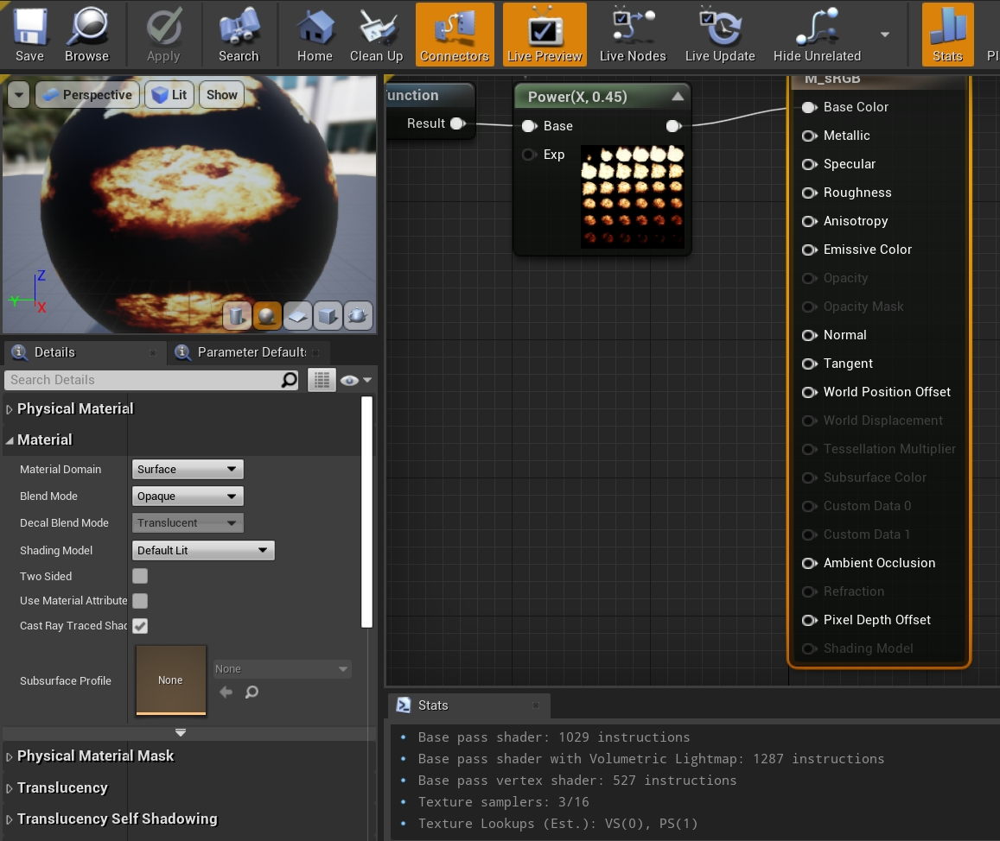

*我们最常接触的材质编辑器编辑的正是UMaterial实例，左侧属性面板的选项跟UMaterial的声明一致。*

UMaterial拥有唯一一个特殊的子类UPreviewMaterial，它主要用于编辑器相关的材质预览，如材质编辑器左上角的预览窗口、浏览器的材质缩略图等等。

## **9.2.2 UMaterialInstance**

UMaterialInstance是材质实例，不能单独存在，而需要依赖UMaterialInterface类型的父类，意味着父类可以是UMaterialInterface的任意一个子类，但最上层的父类必须是UMaterial。它的定义如下：

```c++
class UMaterialInstance : public UMaterialInterface
{
    // 物理材质.
    class UPhysicalMaterial* PhysMaterial;
    class UPhysicalMaterial* PhysicalMaterialMap[EPhysicalMaterialMaskColor::MAX];
    // 材质父亲.
    class UMaterialInterface* Parent;
    // 当渲染器需要获取参数值时，代表这个材质实例的FMaterialRenderProxy的子类.
    class FMaterialInstanceResource* Resource;

    // 可以部分覆盖Parent的属性, 和UMaterial相比, 只是一小部分.
    uint8 bHasStaticPermutationResource:1;
    uint8 bOverrideSubsurfaceProfile:1;
    uint8 TwoSided : 1;
    uint8 DitheredLODTransition : 1;
    uint8 bCastDynamicShadowAsMasked : 1;
    uint8 bIsShadingModelFromMaterialExpression : 1;
    TEnumAsByte<EBlendMode> BlendMode;
    float OpacityMaskClipValue;
    FMaterialShadingModelField ShadingModels;

    // 覆盖Parent的各种类型的数据.
    TArray<struct FScalarParameterValue> ScalarParameterValues;
    TArray<struct FVectorParameterValue> VectorParameterValues;
    TArray<struct FTextureParameterValue> TextureParameterValues;
    TArray<struct FRuntimeVirtualTextureParameterValue> RuntimeVirtualTextureParameterValues;
    TArray<struct FFontParameterValue> FontParameterValues;
    struct FMaterialInstanceBasePropertyOverrides BasePropertyOverrides;

    (......)

private:
    FStaticParameterSet StaticParameters;
    FMaterialCachedParameters CachedLayerParameters;
    TArray<UObject*> CachedReferencedTextures;
    // 已加载的材质资源.
    TArray<FMaterialResource> LoadedMaterialResources;
    TArray<FMaterialResource*> StaticPermutationMaterialResources;
    FThreadSafeBool ReleasedByRT;

public:
    // Begin UMaterialInterface interface.
    virtual ENGINE_API UMaterial* GetMaterial() override;
    virtual ENGINE_API const UMaterial* GetMaterial() const override;
    virtual ENGINE_API const UMaterial* GetMaterial_Concurrent(TMicRecursionGuard RecursionGuard = TMicRecursionGuard()) const override;
    virtual ENGINE_API FMaterialResource* AllocatePermutationResource();
    (......)
    //~ End UMaterialInterface Interface.

    //~ Begin UObject Interface.
    virtual ENGINE_API void GetResourceSizeEx(FResourceSizeEx& CumulativeResourceSize) override;
    virtual ENGINE_API void PostInitProperties() override;    
    virtual ENGINE_API void Serialize(FArchive& Ar) override;
    virtual ENGINE_API void PostLoad() override;
    virtual ENGINE_API void BeginDestroy() override;
    virtual ENGINE_API bool IsReadyForFinishDestroy() override;
    virtual ENGINE_API void FinishDestroy() override;
    ENGINE_API static void AddReferencedObjects(UObject* InThis, FReferenceCollector& Collector);
    //~ End UObject Interface.

    void GetAllShaderMaps(TArray<FMaterialShaderMap*>& OutShaderMaps);
    void GetAllParametersOfType(EMaterialParameterType Type, TArray<FMaterialParameterInfo>& OutParameterInfo, TArray<FGuid>& OutParameterIds) const;
    
    (......)

protected:
    void CopyMaterialUniformParametersInternal(UMaterialInterface* Source);
    bool UpdateParameters();
    ENGINE_API void SetParentInternal(class UMaterialInterface* NewParent, bool RecacheShaders);

    (......)

    // 初始化材质实例的资源.
    ENGINE_API void InitResources();

    // 缓存资源.
    void CacheResourceShadersForRendering();
    void CacheResourceShadersForRendering(FMaterialResourceDeferredDeletionArray& OutResourcesToFree);
    void CacheShadersForResources(...);
    void DeleteDeferredResources(FMaterialResourceDeferredDeletionArray& ResourcesToFree);
    
    ENGINE_API void CopyMaterialInstanceParameters(UMaterialInterface* Source);
    
    (......)
};
```

UMaterialInstance和UMaterial不一样，它需要依附于父亲实例，而且最顶层的父亲必然是UMaterial实例。它只能覆盖UMaterial的一小部分参数，通常不会被单独创建，而是以它的两个子类**UMaterialInstanceConstant**和**UMaterialInstanceDynamic**被创建：

```c++
// Engine\Source\Runtime\Engine\Classes\Materials\MaterialInstanceConstant.h

// 固定材质实例
class UMaterialInstanceConstant : public UMaterialInstance
{
    // 编辑器数据
#if WITH_EDITOR
    friend class UMaterialInstanceConstantFactoryNew;
    friend class UMaterialEditorInstanceConstant;
    virtual ENGINE_API void PostEditChangeProperty(FPropertyChangedEvent& PropertyChangedEvent) override;
#endif

    class UPhysicalMaterialMask* PhysMaterialMask;

    // Begin UMaterialInterface interface.
    virtual UPhysicalMaterialMask* GetPhysicalMaterialMask() const override;
    // End UMaterialInterface interface.

    float K2_GetScalarParameterValue(FName ParameterName);
    class UTexture* K2_GetTextureParameterValue(FName ParameterName);
    FLinearColor K2_GetVectorParameterValue(FName ParameterName);

    ENGINE_API void PostLoad();
    
    (......)
};


// Engine\Source\Runtime\Engine\Classes\Materials\MaterialInstanceDynamic.h

// 动态材质实例
class ENGINE_API UMaterialInstanceDynamic : public UMaterialInstance
{
    // 创建动态实例, 需要给定父亲实例.
    static UMaterialInstanceDynamic* Create(class UMaterialInterface* ParentMaterial, class UObject* InOuter);
    static UMaterialInstanceDynamic* Create( class UMaterialInterface* ParentMaterial, class UObject* InOuter, FName Name );
    
    // 从材质或实例层级拷贝Uniform参数((scalar, vector and texture).
    void CopyMaterialUniformParameters(UMaterialInterface* Source);
    void CopyInterpParameters(UMaterialInstance* Source);
    void CopyParameterOverrides(UMaterialInstance* MaterialInstance);
    void CopyScalarAndVectorParameters(const UMaterialInterface& SourceMaterialToCopyFrom, ERHIFeatureLevel::Type FeatureLevel);
    
    // 清理参数.
    void ClearParameterValues();
    
    // 初始化.
    bool InitializeScalarParameterAndGetIndex(const FName& ParameterName, float Value, int32& OutParameterIndex);
    bool InitializeVectorParameterAndGetIndex(const FName& ParameterName, const FLinearColor& Value, int32& OutParameterIndex);
    
    // 数据设置接口.
    void SetScalarParameterValue(FName ParameterName, float Value);
    void SetScalarParameterValueByInfo(const FMaterialParameterInfo& ParameterInfo, float Value);
    bool SetScalarParameterByIndex(int32 ParameterIndex, float Value);
    bool SetVectorParameterByIndex(int32 ParameterIndex, const FLinearColor& Value);
    void SetTextureParameterValue(FName ParameterName, class UTexture* Value);
    void SetTextureParameterValueByInfo(const FMaterialParameterInfo& ParameterInfo, class UTexture* Value);
    void SetVectorParameterValue(FName ParameterName, FLinearColor Value);
    void SetVectorParameterValueByInfo(const FMaterialParameterInfo& ParameterInfo, FLinearColor Value);
    void SetFontParameterValue(const FMaterialParameterInfo& ParameterInfo, class UFont* FontValue, int32 FontPage);
    
    // 数据获取接口.
    float K2_GetScalarParameterValue(FName ParameterName);
    float K2_GetScalarParameterValueByInfo(const FMaterialParameterInfo& ParameterInfo);
    class UTexture* K2_GetTextureParameterValue(FName ParameterName);
    class UTexture* K2_GetTextureParameterValueByInfo(const FMaterialParameterInfo& ParameterInfo);
    FLinearColor K2_GetVectorParameterValue(FName ParameterName);
    FLinearColor K2_GetVectorParameterValueByInfo(const FMaterialParameterInfo& ParameterInfo);
    void K2_InterpolateMaterialInstanceParams(UMaterialInstance* SourceA, UMaterialInstance* SourceB, float Alpha);
    void K2_CopyMaterialInstanceParameters(UMaterialInterface* Source, bool bQuickParametersOnly = false);

    virtual bool HasOverridenBaseProperties()const override{ return false; }
    virtual float GetOpacityMaskClipValue() const override;
    virtual bool GetCastDynamicShadowAsMasked() const override;
    virtual FMaterialShadingModelField GetShadingModels() const override;
    virtual bool IsShadingModelFromMaterialExpression() const override;
    virtual EBlendMode GetBlendMode() const override;
    virtual bool IsTwoSided() const override;
    virtual bool IsDitheredLODTransition() const override;
    virtual bool IsMasked() const override;

    // 为了重映射到正确的纹理流数据, 必须追踪每个改了名的纹理.
    TMap<FName, TArray<FName> > RenamedTextures;
    
    // 获取纹理密度.
    virtual float GetTextureDensity(FName TextureName, const struct FMeshUVChannelInfo& UVChannelData) const override;
};
```

UMaterialInstanceConstant顾名思义固定材质实例，用于编辑器预先创建和编辑好的材质实例资源：

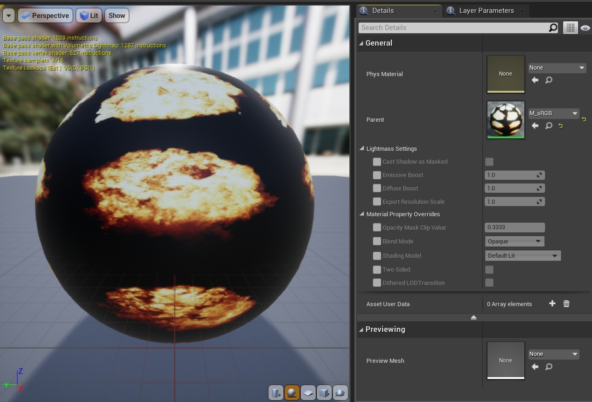

*材质实例编辑器一览。右侧中间Material Property Overrides显示了材质实例可以编辑和覆盖的属性，比较受限。*

UMaterialInstanceConstant的诞生就是为了避免运行时因修改材质参数而引起重新编译，它内部有限的数据覆盖也是因为此。如果不重新编译，就无法支持对材质的常规修改，因此实例只能更改预定义的材质参数的值。 这里的参数就是在材质编辑器内定义的唯一的名称、类型和默认值静态定义。另外，需要明确注意的是，在运行时的代码（非编辑器代码）中，我们是无法更改UMaterialInstanceConstant实例的材质属性。UMaterialInstanceConstant还有一个专用于渲染地貌的ULandscapeMaterialInstanceConstant的子类。

UMaterialInstanceDynamic与UMaterialInstanceConstant不同，它提供了可以在运行时代码动态创建和修改材质属性的功能，并且同样不会引起材质重新编译。UE内置代码中包含了大量的UMaterialInstanceDynamic创建、设置和渲染代码，下面举个使用案例：

```c++
// Engine\Source\Runtime\Engine\Private\Components\DecalComponent.cpp

class UMaterialInstanceDynamic* UDecalComponent::CreateDynamicMaterialInstance()
{
    // 创建动态实例, 其中DecalMaterial是动态实例的父亲, 由用户指定UDecalComponent的材质.
    UMaterialInstanceDynamic* Instance = UMaterialInstanceDynamic::Create(DecalMaterial, this);

    // 覆盖成新的贴花材质.
    SetDecalMaterial(Instance);

    return Instance;
}
```

UMaterialInstance之间的继承关系可以是任意的树状结构，理论上继承的层级没有限制（但太多的继承层级增加维护难度，降低运行效率）。最顶层的父类一定是UMaterial实例，次级及之后的父类一定是UMaterialInstance实例。下图是材质实例编辑器显示的4级层级：

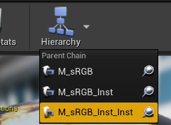

*4级材质实例层级。其中最顶层是UMaterial实例，下面 的3级则是UMaterialInstance实例。*

若尝试将顶层或中间层的父类置为空，UE也可以容忍，只是材质的渲染效果会异常：

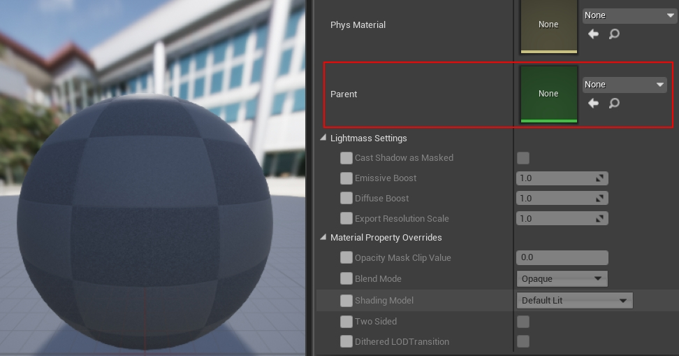

## **9.2.3 FMaterialRenderProxy**

我们知道图元、网格、光源等场景的类型都有游戏线程代表和渲染线程代表，而材质也不例外。作为游戏线程代表的UMaterialInterface对应的渲染线程代表便是FMaterialRenderProxy。FMaterialRenderProxy负责接收游戏线程代表的数据，然后传递给渲染器去处理和渲染。FMaterialRenderProxy的定义如下：

```c++
// Engine\Source\Runtime\Engine\Public\MaterialShared.h

class FMaterialRenderProxy : public FRenderResource
{
public:
    // 缓存数据.
    mutable FUniformExpressionCacheContainer UniformExpressionCache;
    mutable FImmutableSamplerState ImmutableSamplerState;

    // 构造/析构函数.
    ENGINE_API FMaterialRenderProxy();
    ENGINE_API virtual ~FMaterialRenderProxy();

    // 计算表达式并存储到OutUniformExpressionCache.
    void ENGINE_API EvaluateUniformExpressions(FUniformExpressionCache& OutUniformExpressionCache, const FMaterialRenderContext& Context, class FRHICommandList* CommandListIfLocalMode = nullptr) const;

    // UniformExpression接口.
    void ENGINE_API CacheUniformExpressions(bool bRecreateUniformBuffer);
    void ENGINE_API CacheUniformExpressions_GameThread(bool bRecreateUniformBuffer);
    void ENGINE_API InvalidateUniformExpressionCache(bool bRecreateUniformBuffer);
    void ENGINE_API UpdateUniformExpressionCacheIfNeeded(ERHIFeatureLevel::Type InFeatureLevel) const;

    // 返回有效的FMaterial实例.
    const class FMaterial* GetMaterial(ERHIFeatureLevel::Type InFeatureLevel) const;
    // 查找用于渲染此FMaterialRenderProxy的FMaterial实例.
    virtual const FMaterial& GetMaterialWithFallback(ERHIFeatureLevel::Type InFeatureLevel, const FMaterialRenderProxy*& OutFallbackMaterialRenderProxy) const = 0;
    virtual FMaterial* GetMaterialNoFallback(ERHIFeatureLevel::Type InFeatureLevel) const { return NULL; }
    // 获取对应的UMaterialInterface实例.
    virtual UMaterialInterface* GetMaterialInterface() const { return NULL; }
    
    // 获取材质属性的值.
    virtual bool GetVectorValue(const FHashedMaterialParameterInfo& ParameterInfo, FLinearColor* OutValue, const FMaterialRenderContext& Context) const = 0;
    virtual bool GetScalarValue(const FHashedMaterialParameterInfo& ParameterInfo, float* OutValue, const FMaterialRenderContext& Context) const = 0;
    virtual bool GetTextureValue(const FHashedMaterialParameterInfo& ParameterInfo,const UTexture** OutValue, const FMaterialRenderContext& Context) const = 0;
    virtual bool GetTextureValue(const FHashedMaterialParameterInfo& ParameterInfo, const URuntimeVirtualTexture** OutValue, const FMaterialRenderContext& Context) const = 0;
    
    bool IsDeleted() const;
    void MarkForGarbageCollection();
    bool IsMarkedForGarbageCollection() const;

    // FRenderResource interface.
    ENGINE_API virtual void InitDynamicRHI() override;
    ENGINE_API virtual void ReleaseDynamicRHI() override;
    ENGINE_API virtual void ReleaseResource() override;

    // 获取静态的材质渲染代表的映射表.
    ENGINE_API static const TSet<FMaterialRenderProxy*>& GetMaterialRenderProxyMap();

    void SetSubsurfaceProfileRT(const USubsurfaceProfile* Ptr);
    const USubsurfaceProfile* GetSubsurfaceProfileRT() const;

    ENGINE_API static void UpdateDeferredCachedUniformExpressions();
    static inline bool HasDeferredUniformExpressionCacheRequests();

    int32 GetExpressionCacheSerialNumber() const { return UniformExpressionCacheSerialNumber; }
    
private:
    const USubsurfaceProfile* SubsurfaceProfileRT;
    mutable int32 UniformExpressionCacheSerialNumber = 0;

    // 材质标记.
    mutable int8 MarkedForGarbageCollection : 1;
    mutable int8 DeletedFlag : 1;
    mutable int8 ReleaseResourceFlag : 1;
    mutable int8 HasVirtualTextureCallbacks : 1;

    // 追踪在所有场景的所有材质渲染代表. 只可在渲染线程访问. 用来传播新的着色器映射到渲染所用的材质.  
    ENGINE_API static TSet<FMaterialRenderProxy*> MaterialRenderProxyMap;
    ENGINE_API static TSet<FMaterialRenderProxy*> DeferredUniformExpressionCacheRequests;
};
```

FMaterialRenderProxy是个抽象类，定义了一个静态全局的材质渲染代理映射表和获取FMaterial渲染实例的接口。具体的逻辑由子类完成，它的子类有：

- **FDefaultMaterialInstance**：渲染UMaterial的默认代表实例。
- **FMaterialInstanceResource**：渲染UMaterialInstance实例的代表。
- FColoredMaterialRenderProxy：覆盖材质颜色向量参数的材质渲染代表。
- FLandscapeMaskMaterialRenderProxy：地貌遮罩材质渲染代表。
- FLightmassMaterialProxy：Lightmass材质渲染代理。
- ......

我们将注意力放到两个重要的子类：FDefaultMaterialInstance和FMaterialInstanceResource，它们的定义如下：

```c++
// Engine\Source\Runtime\Engine\Private\Materials\Material.cpp

// 用于渲染UMaterial的默认渲染代表, 默认的参数值已经存储于FMaterialUniformExpressionXxxParameter对象, 此资源值用来存储选中的颜色.
class FDefaultMaterialInstance : public FMaterialRenderProxy
{
public:

    // 游戏线程销毁接口.
    void GameThread_Destroy()
    {
        FDefaultMaterialInstance* Resource = this;
        ENQUEUE_RENDER_COMMAND(FDestroyDefaultMaterialInstanceCommand)(
            [Resource](FRHICommandList& RHICmdList)
        {
            delete Resource;
        });
    }

    // FMaterialRenderProxy interface.
    // 获取材质接口.
    virtual const FMaterial& GetMaterialWithFallback(ERHIFeatureLevel::Type InFeatureLevel, const FMaterialRenderProxy*& OutFallbackMaterialRenderProxy) const
    {
        const FMaterialResource* MaterialResource = Material->GetMaterialResource(InFeatureLevel);
        if (MaterialResource && MaterialResource->GetRenderingThreadShaderMap())
        {
            return *MaterialResource;
        }

        OutFallbackMaterialRenderProxy = &GetFallbackRenderProxy();
        return OutFallbackMaterialRenderProxy->GetMaterialWithFallback(InFeatureLevel, OutFallbackMaterialRenderProxy);
    }
    virtual FMaterial* GetMaterialNoFallback(ERHIFeatureLevel::Type InFeatureLevel) const
    {
        return Material->GetMaterialResource(InFeatureLevel);
    }

    // 获取对应的UMaterialInterface接口.
    virtual UMaterialInterface* GetMaterialInterface() const override
    {
        return Material;
    }

    // 获取向量的参数值.
    virtual bool GetVectorValue(const FHashedMaterialParameterInfo& ParameterInfo, FLinearColor* OutValue, const FMaterialRenderContext& Context) const
    {
        const FMaterialResource* MaterialResource = Material->GetMaterialResource(Context.Material.GetFeatureLevel());
        if(MaterialResource && MaterialResource->GetRenderingThreadShaderMap())
        {
            return false;
        }
        else
        {
            return GetFallbackRenderProxy().GetVectorValue(ParameterInfo, OutValue, Context);
        }
    }
    // 获取标量的参数值.
    virtual bool GetScalarValue(const FHashedMaterialParameterInfo& ParameterInfo, float* OutValue, const FMaterialRenderContext& Context) const
    {
        const FMaterialResource* MaterialResource = Material->GetMaterialResource(Context.Material.GetFeatureLevel());
        if(MaterialResource && MaterialResource->GetRenderingThreadShaderMap())
        {
            static FName NameSubsurfaceProfile(TEXT("__SubsurfaceProfile"));
            if (ParameterInfo.Name == NameSubsurfaceProfile)
            {
                const USubsurfaceProfile* MySubsurfaceProfileRT = GetSubsurfaceProfileRT();

                int32 AllocationId = 0;
                if(MySubsurfaceProfileRT)
                {
                    // can be optimized (cached)
                    AllocationId = GSubsurfaceProfileTextureObject.FindAllocationId(MySubsurfaceProfileRT);
                }
                else
                {
                    // no profile specified means we use the default one stored at [0] which is human skin
                    AllocationId = 0;
                }

                *OutValue = AllocationId / 255.0f;

                return true;
            }

            return false;
        }
        else
        {
            return GetFallbackRenderProxy().GetScalarValue(ParameterInfo, OutValue, Context);
        }
    }
    // 获取纹理的参数值.
    virtual bool GetTextureValue(const FHashedMaterialParameterInfo& ParameterInfo,const UTexture** OutValue, const FMaterialRenderContext& Context) const
    {
        const FMaterialResource* MaterialResource = Material->GetMaterialResource(Context.Material.GetFeatureLevel());
        if(MaterialResource && MaterialResource->GetRenderingThreadShaderMap())
        {
            return false;
        }
        else
        {
            return GetFallbackRenderProxy().GetTextureValue(ParameterInfo,OutValue,Context);
        }
    }
    virtual bool GetTextureValue(const FHashedMaterialParameterInfo& ParameterInfo, const URuntimeVirtualTexture** OutValue, const FMaterialRenderContext& Context) const
    {
        const FMaterialResource* MaterialResource = Material->GetMaterialResource(Context.Material.GetFeatureLevel());
        if (MaterialResource && MaterialResource->GetRenderingThreadShaderMap())
        {
            return false;
        }
        else
        {
            return GetFallbackRenderProxy().GetTextureValue(ParameterInfo, OutValue, Context);
        }
    }

    // FRenderResource interface.
    virtual FString GetFriendlyName() const { return Material->GetName(); }

    // Constructor.
    FDefaultMaterialInstance(UMaterial* InMaterial);

private:
    // 获取备份的材质渲染代理.
    FMaterialRenderProxy& GetFallbackRenderProxy() const
    {
        return *(UMaterial::GetDefaultMaterial(Material->MaterialDomain)->GetRenderProxy());
    }

    // 对应的材质实例.
    UMaterial* Material;
};


// Engine\Source\Runtime\Engine\Private\Materials\MaterialInstanceSupport.h

// 渲染UMaterialInstance的材质资源.
class FMaterialInstanceResource: public FMaterialRenderProxy
{
public:

    // 存储材质实例的名称和值的配对.
    template <typename ValueType>
    struct TNamedParameter
    {
        FHashedMaterialParameterInfo Info;
        ValueType Value;
    };

    FMaterialInstanceResource(UMaterialInstance* InOwner);

    void GameThread_Destroy()
    {
        FMaterialInstanceResource* Resource = this;
        ENQUEUE_RENDER_COMMAND(FDestroyMaterialInstanceResourceCommand)(
            [Resource](FRHICommandList& RHICmdList)
            {
                delete Resource;
            });
    }

    // FRenderResource interface.
    virtual FString GetFriendlyName() const override { return Owner->GetName(); }

    // FMaterialRenderProxy interface.
    // 获取材质渲染资源.
    virtual const FMaterial& GetMaterialWithFallback(ERHIFeatureLevel::Type FeatureLevel, const FMaterialRenderProxy*& OutFallbackMaterialRenderProxy) const override;
    virtual FMaterial* GetMaterialNoFallback(ERHIFeatureLevel::Type FeatureLevel) const override;
    virtual UMaterialInterface* GetMaterialInterface() const override;
    
    // 获取材质的值.
    virtual bool GetVectorValue(const FHashedMaterialParameterInfo& ParameterInfo, FLinearColor* OutValue, const FMaterialRenderContext& Context) const override;
    virtual bool GetScalarValue(const FHashedMaterialParameterInfo& ParameterInfo, float* OutValue, const FMaterialRenderContext& Context) const override;
    virtual bool GetTextureValue(const FHashedMaterialParameterInfo& ParameterInfo, const UTexture** OutValue, const FMaterialRenderContext& Context) const override;
    virtual bool GetTextureValue(const FHashedMaterialParameterInfo& ParameterInfo, const URuntimeVirtualTexture** OutValue, const FMaterialRenderContext& Context) const override;

    void GameThread_SetParent(UMaterialInterface* ParentMaterialInterface);
    void InitMIParameters(struct FMaterialInstanceParameterSet& ParameterSet);
    void RenderThread_ClearParameters()
    {
        VectorParameterArray.Empty();
        ScalarParameterArray.Empty();
        TextureParameterArray.Empty();
        RuntimeVirtualTextureParameterArray.Empty();
        InvalidateUniformExpressionCache(false);
    }

    // 更新参数.
    template <typename ValueType>
    void RenderThread_UpdateParameter(const FHashedMaterialParameterInfo& ParameterInfo, const ValueType& Value )
    {
        LLM_SCOPE(ELLMTag::MaterialInstance);

        InvalidateUniformExpressionCache(false);
        TArray<TNamedParameter<ValueType> >& ValueArray = GetValueArray<ValueType>();
        const int32 ParameterCount = ValueArray.Num();
        for (int32 ParameterIndex = 0; ParameterIndex < ParameterCount; ++ParameterIndex)
        {
            TNamedParameter<ValueType>& Parameter = ValueArray[ParameterIndex];
            if (Parameter.Info == ParameterInfo)
            {
                Parameter.Value = Value;
                return;
            }
        }
        TNamedParameter<ValueType> NewParameter;
        NewParameter.Info = ParameterInfo;
        NewParameter.Value = Value;
        ValueArray.Add(NewParameter);
    }

    // 查找指定名字的参数值.
    template <typename ValueType>
    const ValueType* RenderThread_FindParameterByName(const FHashedMaterialParameterInfo& ParameterInfo) const
    {
        const TArray<TNamedParameter<ValueType> >& ValueArray = GetValueArray<ValueType>();
        const int32 ParameterCount = ValueArray.Num();
        for (int32 ParameterIndex = 0; ParameterIndex < ParameterCount; ++ParameterIndex)
        {
            const TNamedParameter<ValueType>& Parameter = ValueArray[ParameterIndex];
            if (Parameter.Info == ParameterInfo)
            {
                return &Parameter.Value;
            }
        }
        return NULL;
    }
    
private:
    template <typename ValueType> TArray<TNamedParameter<ValueType> >& GetValueArray();

    // 材质实例的父亲.
    UMaterialInterface* Parent;
    // 游戏线程的父亲.
    UMaterialInterface* GameThreadParent;
    // 所属的材质实例.
    UMaterialInstance* Owner;
    
    // 各种类型的参数值列表.
    TArray<TNamedParameter<FLinearColor> > VectorParameterArray;
    TArray<TNamedParameter<float> > ScalarParameterArray;
    TArray<TNamedParameter<const UTexture*> > TextureParameterArray;
    TArray<TNamedParameter<const URuntimeVirtualTexture*> > RuntimeVirtualTextureParameterArray; 
};
```

需要格外注意的是，FMaterialRenderProxy既会被游戏线程处理，又会被渲染线程处理，需要小心注意它们之间的数据访问和接口调用。带有GameThread的是专用于游戏线程，带有RenderThread的专用于渲染线程，如果没有特别说明，一般（非绝对）用于渲染线程。如果错误地调用了不该调用的接口或访问了数据，将出现竞争条件，引发随机崩溃，增加指数级的调试难度。

## **9.2.4 FMaterial, FMaterialResource**

**FMaterial**有3个功能：

- 表示材质到材质的编译过程，并提供可扩展性钩子(CompileProperty等) 。
- 将材质数据传递到渲染器，并使用函数访问材质属性。
- 存储缓存的shader map，和其他来自编译的瞬态输出，这对异步着色器编译是必要的。

下面是FMaterial的定义：

```c++
// Engine\Source\Runtime\Engine\Public\MaterialShared.h

class FMaterial
{
public:
#if UE_CHECK_FMATERIAL_LIFETIME
    uint32 AddRef() const;
    uint32 Release() const;
    inline uint32 GetRefCount() const { return uint32(NumDebugRefs.GetValue()); }

    mutable FThreadSafeCounter NumDebugRefs;
#else
    FORCEINLINE uint32 AddRef() const { return 0u; }
    FORCEINLINE uint32 Release() const { return 0u; }
    FORCEINLINE uint32 GetRefCount() const { return 0u; }
#endif

    FMaterial();
    ENGINE_API virtual ~FMaterial();

    // 缓存shader.
    ENGINE_API bool CacheShaders(EShaderPlatform Platform, const ITargetPlatform* TargetPlatform = nullptr);
    ENGINE_API bool CacheShaders(const FMaterialShaderMapId& ShaderMapId, EShaderPlatform Platform, const ITargetPlatform* TargetPlatform = nullptr);

    // 是否需要缓存指定shader type的数据.
    ENGINE_API virtual bool ShouldCache(EShaderPlatform Platform, const FShaderType* ShaderType, const FVertexFactoryType* VertexFactoryType) const;
    ENGINE_API bool ShouldCachePipeline(EShaderPlatform Platform, const FShaderPipelineType* PipelineType, const FVertexFactoryType* VertexFactoryType) const;

    // 序列化.
    ENGINE_API virtual void LegacySerialize(FArchive& Ar);
    void SerializeInlineShaderMap(FArchive& Ar);

    // ShaderMap接口.
    void RegisterInlineShaderMap(bool bLoadedByCookedMaterial);
    void ReleaseShaderMap();
    void DiscardShaderMap();

    // 材质属性.
    ENGINE_API virtual void GetShaderMapId(EShaderPlatform Platform, const ITargetPlatform* TargetPlatform, FMaterialShaderMapId& OutId) const;
    virtual EMaterialDomain GetMaterialDomain() const = 0; // See EMaterialDomain.
    virtual bool IsTwoSided() const = 0;
    virtual bool IsDitheredLODTransition() const = 0;
    virtual bool IsTranslucencyWritingCustomDepth() const { return false; }
    virtual bool IsTranslucencyWritingVelocity() const { return false; }
    virtual bool IsTangentSpaceNormal() const { return false; }
    
    (......)
    
    // 是否需要保存到磁盘.
    virtual bool IsPersistent() const = 0;
    // 获取材质实例.
    virtual UMaterialInterface* GetMaterialInterface() const { return NULL; }

    ENGINE_API bool HasValidGameThreadShaderMap() const;
    inline bool ShouldCastDynamicShadows() const;
    EMaterialQualityLevel::Type GetQualityLevel() const 

    // 数据访问接口.
    ENGINE_API const FUniformExpressionSet& GetUniformExpressions() const;
    ENGINE_API TArrayView<const FMaterialTextureParameterInfo> GetUniformTextureExpressions(EMaterialTextureParameterType Type) const;
    ENGINE_API TArrayView<const FMaterialVectorParameterInfo> GetUniformVectorParameterExpressions() const;
    ENGINE_API TArrayView<const FMaterialScalarParameterInfo> GetUniformScalarParameterExpressions() const;
    inline TArrayView<const FMaterialTextureParameterInfo> GetUniform2DTextureExpressions() const { return GetUniformTextureExpressions(EMaterialTextureParameterType::Standard2D); }
    inline TArrayView<const FMaterialTextureParameterInfo> GetUniformCubeTextureExpressions() const { return GetUniformTextureExpressions(EMaterialTextureParameterType::Cube); }
    inline TArrayView<const FMaterialTextureParameterInfo> GetUniform2DArrayTextureExpressions() const { return GetUniformTextureExpressions(EMaterialTextureParameterType::Array2D); }
    inline TArrayView<const FMaterialTextureParameterInfo> GetUniformVolumeTextureExpressions() const { return GetUniformTextureExpressions(EMaterialTextureParameterType::Volume); }
    inline TArrayView<const FMaterialTextureParameterInfo> GetUniformVirtualTextureExpressions() const { return GetUniformTextureExpressions(EMaterialTextureParameterType::Virtual); }

    const FStaticFeatureLevel GetFeatureLevel() const { return FeatureLevel; }
    bool GetUsesDynamicParameter() const;
    ENGINE_API bool RequiresSceneColorCopy_GameThread() const;
    ENGINE_API bool RequiresSceneColorCopy_RenderThread() const;
    ENGINE_API bool NeedsSceneTextures() const;
    ENGINE_API bool NeedsGBuffer() const;
    ENGINE_API bool UsesEyeAdaptation() const;    
    ENGINE_API bool UsesGlobalDistanceField_GameThread() const;
    ENGINE_API bool UsesWorldPositionOffset_GameThread() const;

    // 材质标记.
    ENGINE_API bool MaterialModifiesMeshPosition_RenderThread() const;
    ENGINE_API bool MaterialModifiesMeshPosition_GameThread() const;
    ENGINE_API bool MaterialUsesPixelDepthOffset() const;
    ENGINE_API bool MaterialUsesDistanceCullFade_GameThread() const;
    ENGINE_API bool MaterialUsesSceneDepthLookup_RenderThread() const;
    ENGINE_API bool MaterialUsesSceneDepthLookup_GameThread() const;
    ENGINE_API bool UsesCustomDepthStencil_GameThread() const;
    ENGINE_API bool MaterialMayModifyMeshPosition() const;
    ENGINE_API bool MaterialUsesAnisotropy_GameThread() const;
    ENGINE_API bool MaterialUsesAnisotropy_RenderThread() const;

    // shader map接口.
    class FMaterialShaderMap* GetGameThreadShaderMap() const 
    { 
        return GameThreadShaderMap; 
    }
    void SetGameThreadShaderMap(FMaterialShaderMap* InMaterialShaderMap)
    {
        GameThreadShaderMap = InMaterialShaderMap;

        TRefCountPtr<FMaterialShaderMap> ShaderMap = GameThreadShaderMap;
        TRefCountPtr<FMaterial> Material = this;
        
        // 将游戏线程的shader map设置到渲染线程.
        ENQUEUE_RENDER_COMMAND(SetGameThreadShaderMap)([Material = MoveTemp(Material), ShaderMap = MoveTemp(ShaderMap)](FRHICommandListImmediate& RHICmdList) mutable
        {
            Material->RenderingThreadShaderMap = MoveTemp(ShaderMap);
        });
    }
    void SetInlineShaderMap(FMaterialShaderMap* InMaterialShaderMap);
    ENGINE_API class FMaterialShaderMap* GetRenderingThreadShaderMap() const;
    ENGINE_API void SetRenderingThreadShaderMap(const TRefCountPtr<FMaterialShaderMap>& InMaterialShaderMap);

    ENGINE_API virtual void AddReferencedObjects(FReferenceCollector& Collector);

    virtual TArrayView<UObject* const> GetReferencedTextures() const = 0;

    // 获取shader/shader pipeline.
    template<typename ShaderType>
    TShaderRef<ShaderType> GetShader(FVertexFactoryType* VertexFactoryType, const typename ShaderType::FPermutationDomain& PermutationVector, bool bFatalIfMissing = true) const;
    template <typename ShaderType>
    TShaderRef<ShaderType> GetShader(FVertexFactoryType* VertexFactoryType, int32 PermutationId = 0, bool bFatalIfMissing = true) const;
    ENGINE_API FShaderPipelineRef GetShaderPipeline(class FShaderPipelineType* ShaderPipelineType, FVertexFactoryType* VertexFactoryType, bool bFatalIfNotFound = true) const;

    // 材质接口.
    virtual FString GetMaterialUsageDescription() const = 0;
    virtual bool GetAllowDevelopmentShaderCompile()const{ return true; }
    virtual EMaterialShaderMapUsage::Type GetMaterialShaderMapUsage() const { return EMaterialShaderMapUsage::Default; }
    ENGINE_API bool GetMaterialExpressionSource(FString& OutSource);
    ENGINE_API bool WritesEveryPixel(bool bShadowPass = false) const;
    virtual void SetupExtaCompilationSettings(const EShaderPlatform Platform, FExtraShaderCompilerSettings& Settings) const;

    (......)

protected:
    const FMaterialShaderMap* GetShaderMapToUse() const;

    virtual int32 CompilePropertyAndSetMaterialProperty(EMaterialProperty Property, class FMaterialCompiler* Compiler, EShaderFrequency OverrideShaderFrequency = SF_NumFrequencies, bool bUsePreviousFrameTime = false) const = 0;

    void SetQualityLevelProperties(ERHIFeatureLevel::Type InFeatureLevel, EMaterialQualityLevel::Type InQualityLevel = EMaterialQualityLevel::Num);
    virtual EMaterialShaderMapUsage::Type GetShaderMapUsage() const;
    virtual FGuid GetMaterialId() const = 0;
    ENGINE_API void GetDependentShaderAndVFTypes(EShaderPlatform Platform, TArray<FShaderType*>& OutShaderTypes, TArray<const FShaderPipelineType*>& OutShaderPipelineTypes, TArray<FVertexFactoryType*>& OutVFTypes) const;
    bool GetLoadedCookedShaderMapId() const;

private:
    // 游戏线程和渲染线程的shader map.
    TRefCountPtr<FMaterialShaderMap> GameThreadShaderMap;
    TRefCountPtr<FMaterialShaderMap> RenderingThreadShaderMap;

    // 质量等级.
    EMaterialQualityLevel::Type QualityLevel;
    ERHIFeatureLevel::Type FeatureLevel;

    // 特殊标记.
    uint32 bStencilDitheredLOD : 1;
    uint32 bContainsInlineShaders : 1;
    uint32 bLoadedCookedShaderMapId : 1;

    bool BeginCompileShaderMap(
        const FMaterialShaderMapId& ShaderMapId,
        const FStaticParameterSet &StaticParameterSet,
        EShaderPlatform Platform, 
        TRefCountPtr<class FMaterialShaderMap>& OutShaderMap, 
        const ITargetPlatform* TargetPlatform = nullptr);
    void SetupMaterialEnvironment(
        EShaderPlatform Platform,
        const FShaderParametersMetadata& InUniformBufferStruct,
        const FUniformExpressionSet& InUniformExpressionSet,
        FShaderCompilerEnvironment& OutEnvironment
        ) const;

    ENGINE_API TShaderRef<FShader> GetShader(class FMeshMaterialShaderType* ShaderType, FVertexFactoryType* VertexFactoryType, int32 PermutationId, bool bFatalIfMissing = true) const;
};
```

由上面可知，FMaterial集大之所成，囊括了材质、Shader、VertexFactory、ShaderPipeline、ShaderMap等各种数据和操作接口，是这些数据的集散地。不过，它只是个抽象的父类，具体的功能需要由子类实现。它的子类只有FMaterialResource：

```c++
// 实现FMaterial的接口, 用于渲染UMaterial或UMaterialInstance.
class FMaterialResource : public FMaterial
{
public:
    ENGINE_API FMaterialResource();
    ENGINE_API virtual ~FMaterialResource();

    // 设置材质.
    void SetMaterial(UMaterial* InMaterial, UMaterialInstance* InInstance, ERHIFeatureLevel::Type InFeatureLevel, EMaterialQualityLevel::Type InQualityLevel = EMaterialQualityLevel::Num)
    {
        Material = InMaterial;
        MaterialInstance = InInstance;
        SetQualityLevelProperties(InFeatureLevel, InQualityLevel);
    }

    ENGINE_API uint32 GetNumVirtualTextureStacks() const;
    ENGINE_API virtual FString GetMaterialUsageDescription() const override;

    // FMaterial interface.
    ENGINE_API virtual void GetShaderMapId(EShaderPlatform Platform, const ITargetPlatform* TargetPlatform, FMaterialShaderMapId& OutId) const override;
    ENGINE_API virtual EMaterialDomain GetMaterialDomain() const override;
    ENGINE_API virtual bool IsTwoSided() const override;
    ENGINE_API virtual bool IsDitheredLODTransition() const override;
    ENGINE_API virtual bool IsTranslucencyWritingCustomDepth() const override;
    ENGINE_API virtual bool IsTranslucencyWritingVelocity() const override;
    ENGINE_API virtual bool IsTangentSpaceNormal() const override;
    ENGINE_API virtual EMaterialShadingRate  GetShadingRate() const override;
    
    (......)
    
    // 材质接口.
    inline const UMaterial* GetMaterial() const { return Material; }
    inline const UMaterialInstance* GetMaterialInstance() const { return MaterialInstance; }
    inline void SetMaterial(UMaterial* InMaterial) { Material = InMaterial; }
    inline void SetMaterialInstance(UMaterialInstance* InMaterialInstance) { MaterialInstance = InMaterialInstance; }

protected:
    // 对应的材质.
    UMaterial* Material;
    // 对应的材质实例.
    UMaterialInstance* MaterialInstance;

    // 编译指定材质属性的入口, 须有SetMaterialProperty调用.
    ENGINE_API virtual int32 CompilePropertyAndSetMaterialProperty(EMaterialProperty Property, class FMaterialCompiler* Compiler, EShaderFrequency OverrideShaderFrequency, bool bUsePreviousFrameTime) const override;
    
    ENGINE_API virtual bool HasVertexPositionOffsetConnected() const override;
    ENGINE_API virtual bool HasPixelDepthOffsetConnected() const override;
    ENGINE_API virtual bool HasMaterialAttributesConnected() const override;
    
    (......)
};
```

FMaterialResource只是实现了FMaterial未实现的接口，并且存储了UMaterial或UMaterialInstance的实例。如果UMaterialInstance和UMaterial的实例都有效的情况下，那么它们重叠的数据会优先取UMaterialInstance的数据，比如：

```c++
// 获取着色模型域
FMaterialShadingModelField FMaterialResource::GetShadingModels() const 
{
    // 优先选用MaterialInstance的数据.
    return MaterialInstance ? MaterialInstance->GetShadingModels() : Material->GetShadingModels();
}
```

需要注意的是FMaterialResource须保证UMaterial实例有效，MaterialInstance可以为空。

FMaterialResource还有子类FLandscapeMaterialResource，对应渲染ULandscapeMaterialInstanceConstant的材质。

渲染资源除了FMaterial之外，还有个比较核心的概念就是FMaterialRenderContext，它保存了FMaterialRenderProxy和FMaterial之间的关联配对：

```c++
struct ENGINE_API FMaterialRenderContext
{
    // 用于材质shader的材质渲染代表.
    const FMaterialRenderProxy* MaterialRenderProxy;
    // 材质渲染资源.
    const FMaterial& Material;

    // 是否显示选中时的颜色.
    bool bShowSelection;

    // 构造函数.
    FMaterialRenderContext(const FMaterialRenderProxy* InMaterialRenderProxy, const FMaterial& InMaterial, const FSceneView* InView);
};
```

FMaterialRenderContext较多地用于材质各种类型的接口的形参，比如：

```c++
// FDefaultMaterialInstance中的获取向量参数值, 用到了FMaterialRenderContext参数.
virtual bool FDefaultMaterialInstance::GetVectorValue(const FHashedMaterialParameterInfo& ParameterInfo, FLinearColor* OutValue, const FMaterialRenderContext& Context) const
{
    const FMaterialResource* MaterialResource = Material->GetMaterialResource(Context.Material.GetFeatureLevel());
    
    if(MaterialResource && MaterialResource->GetRenderingThreadShaderMap())
    {
        return false;
    }
    else
    {
        return GetFallbackRenderProxy().GetVectorValue(ParameterInfo, OutValue, Context);
    }
}
```

## **9.2.5 材质总览**

前几几节已经详细阐述了材质体系内的基础类型、概念和它们的定义。本节直接上它们的UML图，以统览它们的关系：

UObjectUMaterialInterfaceUMaterial* GetBaseMaterial()UMaterial* GetMaterial()FMaterialRenderProxy* GetRenderProxy()UMaterialTArray MaterialResourcesUMaterialInstanceUMaterialInterface* ParentUMaterialInstanceConstantULandscapeMaterialInstanceConstantUMaterialInstanceDynamicFRenderResourceFMaterialRenderProxystatic TSetFMaterial* GetMaterial()FDefaultMaterialInstanceUMaterial* MaterialFMaterialInstanceResourceUMaterialInterface* ParentUMaterialInterface* GameThreadParentUMaterialInstance* OwnerFColoredMaterialRenderProxyFMaterialFMaterialShaderMap GameThreadShaderMapFMaterialShaderMap RenderingThreadShaderMapFMaterialResourceUMaterial* MaterialUMaterialInstance* MaterialInstanceFLandscapeMaterialResourceFMaterialContextMaterialResourcesMaterialMaterialInstance

如果上图文字太小看不清，可以点击放大下面的图片版本：

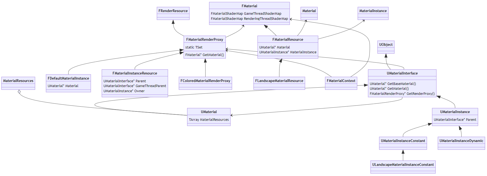

UE的材质为何会有如此多的概念和类型，它们的关系到底怎么样？本节尝试阐述它们的关联和作用。

首先阐述UMaterialInterface和它的子类们，它们是引擎模块在游戏线程的代表。UMaterialInterface继承UOjbect，提供了材质的抽象接口，为子类提供了一致的行为和规范，也好统一不同类型的子类之间的差异。子类UMaterial则对应着用材质编辑器生成的材质蓝图的资源，保存了各种表达式节点及各种参数。另一个子类UMaterialInstance则抽象了材质实例的接口，是为了支持修改材质参数后不引发材质重新编译而存在的，同时统一和规范固定实例（UMaterialInstanceConstant）和动态实例（UMaterialInstanceDynamic）两种子类的数据和行为。UMaterialInstanceConstant在编辑器期间创建和修改好材质参数，运行时不可修改，提升数据更新和渲染的性能；UMaterialInstanceDynamic则可以运行时创建实例和修改数据，提升材质的扩展性和可定制性，但性能较UMaterialInstanceConstant差一些。UMaterialInstance需要指定一个父类，最顶层的父类要求是UMaterial实例。

FMaterialRenderProxy是UMaterialInterface的渲染线程的代表，类似于UPrimitiveComponent和FPrimitiveSceneProxy的关系。FMaterialRenderProxy将UMaterialInterface实例的数据搬运（拷贝）到渲染线程，但同时也会在游戏线程被访问到，是两个线程的耦合类型，需要谨慎处理它们的数据和接口调用。FMaterialRenderProxy的子类对应着UMaterialInterface的子类，以便将UMaterialInterface的子类数据被精准地搬运（拷贝）到渲染线程，避免游戏线程和渲染线程的竞争。FMaterialRenderProxy及其子类都是引擎模块的类型。

既然已经有了FMaterialRenderProxy的渲染线程代表，为什么还要存在FMaterial和FMaterialResource呢？答案有两点：

- FMaterialRenderProxy及其子类是引擎模块的类型，是游戏线程和渲染线程的胶囊类，需要谨慎处理两个线程的数据和接口调用，渲染模块无法真正完全拥有它的管辖权。
- FMaterialRenderProxy的数据由UMaterialInterface传递而来，意味着FMaterialRenderProxy的信息有限，无法包含使用了材质的网格的其它信息，如顶点工厂、ShaderMap、ShaderPipelineline、FShader及各种着色器参数等。

所以，FMaterial应运而生。FMaterial同是引擎模块的类型，但存储了游戏线程和渲染线程的两个ShaderMap，意味着渲染模块可以自由地访问渲染线程的ShaderMap，而又不影响游戏线程的访问。而且FMaterial包含了渲染材质所需的所有数据，渲染器的其它地方，只要拿到网格的FMaterial，便可以正常地获取材质数据，从而提交绘制指令。比如FBasePassMeshProcessor::AddMeshBatch的代码：

```c++
// Engine\Source\Runtime\Renderer\Private\BasePassRendering.cpp

void FBasePassMeshProcessor::AddMeshBatch(const FMeshBatch& RESTRICT MeshBatch, uint64 BatchElementMask, const FPrimitiveSceneProxy* RESTRICT PrimitiveSceneProxy, int32 StaticMeshId)
{
    if (MeshBatch.bUseForMaterial)
    {
        const FMaterialRenderProxy* FallbackMaterialRenderProxyPtr = nullptr;
        // 获取FMaterial实例.
        const FMaterial& Material = MeshBatch.MaterialRenderProxy->GetMaterialWithFallback(FeatureLevel, FallbackMaterialRenderProxyPtr);
        const FMaterialRenderProxy& MaterialRenderProxy = FallbackMaterialRenderProxyPtr ? *FallbackMaterialRenderProxyPtr : *MeshBatch.MaterialRenderProxy;

        // 通过FMaterial接口获取材质数据.
        const EBlendMode BlendMode = Material.GetBlendMode();
        const FMaterialShadingModelField ShadingModels = Material.GetShadingModels();
        const bool bIsTranslucent = IsTranslucentBlendMode(BlendMode);
        const FMeshDrawingPolicyOverrideSettings OverrideSettings = ComputeMeshOverrideSettings(MeshBatch);
        const ERasterizerFillMode MeshFillMode = ComputeMeshFillMode(MeshBatch, Material, OverrideSettings);
        const ERasterizerCullMode MeshCullMode = ComputeMeshCullMode(MeshBatch, Material, OverrideSettings);
        
    (......)
}
```

 

# **9.3 材质机制**

本章主要分析材质的部分底层机制，比如材质的渲染、编译机制和过程、材质的缓存策略等。

## **9.3.1 材质渲染**

本节将阐述材质的数据传递、更新、渲染逻辑。

材质数据的发起者依然是游戏线程侧的资源，一般是从磁盘加载的二进制资源，然后序列化成UMaterialInterface实例，或者由运行时动态创建并设置材质数据。不过绝大多数是由磁盘加载而来。

当使用了材质的图元组件在被要求收集网格元素的时候，可以将其使用的UMaterialInterface对应的FMaterialRenderProxy传递到FMeshBatchElement中。下面以StaticMesh为例：

```c++
// Engine\Source\Runtime\Engine\Private\StaticMeshRender.cpp

bool FStaticMeshSceneProxy::GetMeshElement(
    int32 LODIndex, 
    int32 BatchIndex, 
    int32 SectionIndex, 
    uint8 InDepthPriorityGroup, 
    bool bUseSelectionOutline,
    bool bAllowPreCulledIndices, 
    FMeshBatch& OutMeshBatch) const
{
    const ERHIFeatureLevel::Type FeatureLevel = GetScene().GetFeatureLevel();
    const FStaticMeshLODResources& LOD = RenderData->LODResources[LODIndex];
    const FStaticMeshVertexFactories& VFs = RenderData->LODVertexFactories[LODIndex];
    const FStaticMeshSection& Section = LOD.Sections[SectionIndex];
    const FLODInfo& ProxyLODInfo = LODs[LODIndex];

    // 获取材质的各种实例(包含UMaterialInterface, FMaterialRenderProxy和FMaterial)
    UMaterialInterface* MaterialInterface = ProxyLODInfo.Sections[SectionIndex].Material;
    FMaterialRenderProxy* MaterialRenderProxy = MaterialInterface->GetRenderProxy();
    const FMaterial* Material = MaterialRenderProxy->GetMaterial(FeatureLevel);

    FMeshBatchElement& OutMeshBatchElement = OutMeshBatch.Elements[0];

    // 处理顶点工厂
    const FVertexFactory* VertexFactory = nullptr;
    if (ProxyLODInfo.OverrideColorVertexBuffer)
    {
        (......)
    }

    (......)

    if(NumPrimitives > 0)
    {
        OutMeshBatch.SegmentIndex = SectionIndex;

        OutMeshBatch.LODIndex = LODIndex;
        
        // 赋值材质和渲染代表.
        OutMeshBatch.MaterialRenderProxy = MaterialRenderProxy;

        (......)
    }
}
```

因此，可以知道，在组件收集网格元素的时候，材质的所有类型的数据已经准备好，并且可以被访问了。说明在游戏线程阶段，材质的各种类型的实例已经被加载、设置和创建。我们继续深究到底是什么时候创建的。首先看FMaterialRenderProxy，不同的UMaterialInterface的子类稍有不一样，具体如下代码所示：

```c++
// Engine\Source\Runtime\Engine\Private\Materials\MaterialInstance.cpp

void UMaterialInstance::PostInitProperties()    
{
    Super::PostInitProperties();

    if(!HasAnyFlags(RF_ClassDefaultObject))
    {
        // 创建FMaterialRenderProxy.
        Resource = new FMaterialInstanceResource(this);
    }
}

FMaterialRenderProxy* UMaterialInstance::GetRenderProxy() const
{
    return Resource;
}

// Engine\Source\Runtime\Engine\Private\Materials\Material.cpp

void UMaterial::PostInitProperties()
{
    Super::PostInitProperties();
    if(!HasAnyFlags(RF_ClassDefaultObject))
    {
        // 创建FMaterialRenderProxy.
        DefaultMaterialInstance = new FDefaultMaterialInstance(this);
    }

    FPlatformMisc::CreateGuid(StateId);
}

FMaterialRenderProxy* UMaterial::GetRenderProxy() const
{
    return DefaultMaterialInstance;
}
```

由此可推断，UMaterialInstance对应的FMaterialRenderProxy是在子类的PostInitProperties阶段被创建的。

我们继续查明UMaterialInterface获取对应的FMaterial实例是哪个接口哪个成员：

```c++
// Engine\Source\Runtime\Engine\Private\Materials\Material.cpp

// 获取UMaterial对应的FMaterialResource(FMaterial的子类)实例.
FMaterialResource* UMaterial::GetMaterialResource(ERHIFeatureLevel::Type InFeatureLevel, EMaterialQualityLevel::Type QualityLevel)
{
    if (QualityLevel == EMaterialQualityLevel::Num)
    {
        QualityLevel = GetCachedScalabilityCVars().MaterialQualityLevel;
    }
    return FindMaterialResource(MaterialResources, InFeatureLevel, QualityLevel, true);
}
```

以上可以知道，是查找UMaterial::MaterialResources，那么继续深究其何时被创建：

```c++
FMaterialResource* FindOrCreateMaterialResource(TArray<FMaterialResource*>& MaterialResources,
    UMaterial* OwnerMaterial,
    UMaterialInstance* OwnerMaterialInstance,
    ERHIFeatureLevel::Type InFeatureLevel,
    EMaterialQualityLevel::Type InQualityLevel)
{
    (......)
    
    FMaterialResource* CurrentResource = FindMaterialResource(MaterialResources, InFeatureLevel, QualityLevelForResource, false);
    
    // 如果当前资源列表不存在就创建新的FMaterialResource实例.
    if (!CurrentResource)
    {
        // 优先使用材质实例的的接口来创建.
        CurrentResource = OwnerMaterialInstance ? OwnerMaterialInstance->AllocatePermutationResource() : OwnerMaterial->AllocateResource();
        CurrentResource->SetMaterial(OwnerMaterial, OwnerMaterialInstance, InFeatureLevel, QualityLevelForResource);
        // 添加到FMaterialResource实例列表.
        MaterialResources.Add(CurrentResource);
    }
    
    (......)

    return CurrentResource;
}
```

以上创建FMaterialResource实例时会优先使用有效的OwnerMaterialInstance，然后才使用UMaterial的接口，下面进入它们创建FMaterialResource实例的接口：

```c++
FMaterialResource* UMaterialInstance::AllocatePermutationResource()
{
    return new FMaterialResource();
}

FMaterialResource* UMaterial::AllocateResource()
{
    return new FMaterialResource();
}
```

好家伙，逻辑一样的，都是直接new一个FMaterialResource对象并返回。下面继续追踪有哪些接口会调用FindOrCreateMaterialResource：

- ProcessSerializedInlineShaderMaps
- UMaterial::PostLoad
- UMaterial::CacheResourceShadersForRendering
- UMaterial::AllMaterialsCacheResourceShadersForRendering
- UMaterial::ForceRecompileForRendering
- UMaterial::PostEditChangePropertyInternal
- UMaterial::SetMaterialUsage
- UMaterial::UpdateMaterialShaders
- UMaterial::UpdateMaterialShaderCacheAndTextureReferences

以上接口都会直接或间接调用到FindOrCreateMaterialResource接口，从而触发FMaterialResource对象的创建。但在运行时的版本中，通常由UMaterial::PostLoad触发，调用堆栈如下所示：

- UMaterial::PostLoad
  - ProcessSerializedInlineShaderMaps
    - FindOrCreateMaterialResource

此外，UMaterialInstance的部分接口也会触发FMaterialResource实例的创建，此文不继续追踪了。

我们继续研究FMaterial的GameThreadShaderMap和RenderingThreadShaderMap是在何处何时被设置和传递的：

```c++
// 直接设置RenderingThreadShaderMap
void FMaterial::SetRenderingThreadShaderMap(const TRefCountPtr<FMaterialShaderMap>& InMaterialShaderMap)
{
    RenderingThreadShaderMap = InMaterialShaderMap;
}

// 设置游戏线程ShaderMap.
void FMaterial::SetGameThreadShaderMap(FMaterialShaderMap* InMaterialShaderMap)
{
    GameThreadShaderMap = InMaterialShaderMap;

    TRefCountPtr<FMaterialShaderMap> ShaderMap = GameThreadShaderMap;
    TRefCountPtr<FMaterial> Material = this;
    // 向渲染线程推送设置ShaderMap的指令.
    ENQUEUE_RENDER_COMMAND(SetGameThreadShaderMap)([Material = MoveTemp(Material), ShaderMap = MoveTemp(ShaderMap)](FRHICommandListImmediate& RHICmdList) mutable
    {
        Material->RenderingThreadShaderMap = MoveTemp(ShaderMap);
    });
}

// 设置内联ShaderMap
void FMaterial::SetInlineShaderMap(FMaterialShaderMap* InMaterialShaderMap)
{
    GameThreadShaderMap = InMaterialShaderMap;
    bContainsInlineShaders = true;
    bLoadedCookedShaderMapId = true;

    TRefCountPtr<FMaterialShaderMap> ShaderMap = GameThreadShaderMap;
    TRefCountPtr<FMaterial> Material = this;
    // 向渲染线程推送设置ShaderMap的指令.
    ENQUEUE_RENDER_COMMAND(SetInlineShaderMap)([Material = MoveTemp(Material), ShaderMap = MoveTemp(ShaderMap)](FRHICommandListImmediate& RHICmdList) mutable
    {
        Material->RenderingThreadShaderMap = MoveTemp(ShaderMap);
    });
}
```

以上可以设置FMaterial的RenderingThreadShaderMap有3个接口，继续追踪有哪些接口会调用到它们：

- FMaterial::CacheShaders
  - FMaterial::SetGameThreadShaderMap
- FMaterialShaderMap::LoadForRemoteRecompile
  - FMaterial::SetGameThreadShaderMap
- ProcessSerializedInlineShaderMaps
  - FMaterial::SetInlineShaderMap
- SetShaderMapsOnMaterialResources_RenderThread
  - FMaterial::SetRenderingThreadShaderMap

虽然上面有很多接口最终会设置到FMaterial的RenderingThreadShaderMap，不过多数情况下，运行时RenderingThreadShaderMap被设置的调用堆栈如下：

- UMaterial::PostLoad
  - ProcessSerializedInlineShaderMaps
    - FMaterial::SetInlineShaderMap

一旦FMaterial的RenderingThreadShaderMap被正确设置，材质相关的其它众多数据将被渲染线程和渲染器自由地读取，如同鱼儿无忧无虑地遨游在湛蓝的大海之中。

## **9.3.2 材质编译**

在上一篇文章Shader体系中，已经阐述过Shader的编译过程，不过本节讲述的是如何将材质蓝图转成HLSL代码的过程和机制。

前面几个小节先了解材质蓝图编译过程涉及的主要类型和概念。

### **9.3.2.1 UMaterialExpression**

UMaterialExpression就是表达式，每个材质节点UMaterialGraphNode都有一个UMaterialExpression实例，它的主要定义如下：

```c++
// Engine\Source\Runtime\Engine\Classes\Materials\MaterialExpression.h

class ENGINE_API UMaterialExpression : public UObject
{
#if WITH_EDITORONLY_DATA
    int32 MaterialExpressionEditorX;
    int32 MaterialExpressionEditorY;
    // 材质节点.
    UEdGraphNode*    GraphNode;
#endif
    // 所属的材质.
    class UMaterial* Material;
    // 所属的材质函数.
    class UMaterialFunction* Function;

    uint8 bIsParameterExpression : 1;

    // 编辑器数据和标记.
#if WITH_EDITORONLY_DATA
    uint32 bShowInputs:1;
    uint32 bShowOutputs:1;
    TArray<FText> MenuCategories;
    // 表达式输出.
    TArray<FExpressionOutput> Outputs;
#endif

    //~ Begin UObject Interface.
    virtual void PostInitProperties() override;
    virtual void PostLoad() override;
    virtual void PostDuplicate(bool bDuplicateForPIE) override;
    virtual void Serialize( FStructuredArchive::FRecord Record ) override;
    virtual bool IsEditorOnly() const
    {
        return true;
    }
    //~ End UObject Interface.

#if WITH_EDITOR
    // 编译
    virtual int32 Compile(class FMaterialCompiler* Compiler, int32 OutputIndex) { return INDEX_NONE; }
    virtual int32 CompilePreview(class FMaterialCompiler* Compiler, int32 OutputIndex) { return Compile(Compiler, OutputIndex); }
#endif

    // 数据获取接口.
    virtual void GetTexturesForceMaterialRecompile(TArray<UTexture *> &Textures) const { }
    virtual UObject* GetReferencedTexture() const { return nullptr; }
    virtual bool CanReferenceTexture() const { return false; }

#if WITH_EDITOR
    // 获取所有输入表达式.
    bool GetAllInputExpressions(TArray<UMaterialExpression*>& InputExpressions);

    // 参数接口.
    virtual bool HasAParameterName() const { return false; }
    virtual void ValidateParameterName(const bool bAllowDuplicateName = true);
    virtual bool HasClassAndNameCollision(UMaterialExpression* OtherExpression) const;
    virtual void SetValueToMatchingExpression(UMaterialExpression* OtherExpression) {};
    virtual FName GetParameterName() const { return NAME_None; }
    virtual void SetParameterName(const FName& Name) {}

    (......)
#endif // WITH_EDITOR
};
```

继承自UMaterialExpression的子类非常非常多（约200个），因为UE内置了很多材质节点，下图是其中一小部分子类：

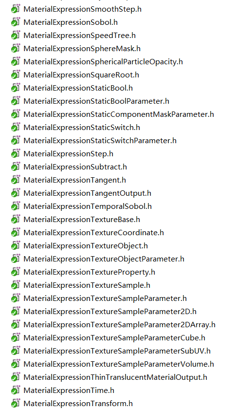

下面选两个最常用的子类作为分析的案例：

```c++
// Engine\Source\Runtime\Engine\Classes\Materials\MaterialExpressionAdd.h

class UMaterialExpressionAdd : public UMaterialExpression
{
    // 加法表达的两个操作数.
    FExpressionInput A;
    FExpressionInput B;

    // 当A和B非法时的代替值.
    float ConstA;
    float ConstB;

    //~ Begin UMaterialExpression Interface
#if WITH_EDITOR
    virtual int32 Compile(class FMaterialCompiler* Compiler, int32 OutputIndex) override;
    virtual void GetCaption(TArray<FString>& OutCaptions) const override;
    virtual FText GetKeywords() const override {return FText::FromString(TEXT("+"));}
#endif // WITH_EDITOR
    //~ End UMaterialExpression Interface
};

// Engine\Source\Runtime\Engine\Private\Materials\MaterialExpressions.cpp

// 编译表达式.
int32 UMaterialExpressionAdd::Compile(class FMaterialCompiler* Compiler, int32 OutputIndex)
{
    // 获取两个操作数.
    int32 Arg1 = A.GetTracedInput().Expression ? A.Compile(Compiler) : Compiler->Constant(ConstA);
    int32 Arg2 = B.GetTracedInput().Expression ? B.Compile(Compiler) : Compiler->Constant(ConstB);
    
    // 相加并返回结果.
    return Compiler->Add(Arg1, Arg2);
}

// 获取说明.
void UMaterialExpressionAdd::GetCaption(TArray<FString>& OutCaptions) const
{
    FString ret = TEXT("Add");

    FExpressionInput ATraced = A.GetTracedInput();
    FExpressionInput BTraced = B.GetTracedInput();
    if(!ATraced.Expression || !BTraced.Expression)
    {
        ret += TEXT("(");
        ret += ATraced.Expression ? TEXT(",") : FString::Printf( TEXT("%.4g,"), ConstA);
        ret += BTraced.Expression ? TEXT(")") : FString::Printf( TEXT("%.4g)"), ConstB);
    }

    OutCaptions.Add(ret);
}

// Engine\Source\Runtime\Engine\Classes\Materials\MaterialExpressionDDX.h

class UMaterialExpressionDDX : public UMaterialExpression
{
    FExpressionInput Value;

    //~ Begin UMaterialExpression Interface
#if WITH_EDITOR
    virtual int32 Compile(class FMaterialCompiler* Compiler, int32 OutputIndex) override;
    virtual void GetCaption(TArray<FString>& OutCaptions) const override;
#endif
    //~ End UMaterialExpression Interface
};

int32 UMaterialExpressionDDX::Compile(class FMaterialCompiler* Compiler, int32 OutputIndex)
{
    int32 ValueInput = INDEX_NONE;

    if(Value.GetTracedInput().Expression)
    {
        ValueInput = Value.Compile(Compiler);
    }

    if(ValueInput == INDEX_NONE)
    {
        return INDEX_NONE;
    }

    return Compiler->DDX(ValueInput);
}

void UMaterialExpressionDDX::GetCaption(TArray<FString>& OutCaptions) const
{
    OutCaptions.Add(FString(TEXT("DDX")));
}
```

上面两个类型在Compile时调用了编译器的Add和DDX，下面进入FMaterialCompiler（是抽象类，由子类FHLSLMaterialTranslator实现）的这两个接口的实现：

```c++
// Engine\Source\Runtime\Engine\Private\Materials\HLSLMaterialTranslator.cpp

int32 FHLSLMaterialTranslator::Add(int32 A,int32 B)
{
    if(A == INDEX_NONE || B == INDEX_NONE)
    {
        return INDEX_NONE;
    }

    const uint64 Hash = CityHash128to64({ GetParameterHash(A), GetParameterHash(B) });
    if(GetParameterUniformExpression(A) && GetParameterUniformExpression(B))
    {
        return AddUniformExpressionWithHash(Hash, new FMaterialUniformExpressionFoldedMath(GetParameterUniformExpression(A),GetParameterUniformExpression(B),FMO_Add),GetArithmeticResultType(A,B),TEXT("(%s + %s)"),*GetParameterCode(A),*GetParameterCode(B));
    }
    else
    {
        return AddCodeChunkWithHash(Hash, GetArithmeticResultType(A,B),TEXT("(%s + %s)"),*GetParameterCode(A),*GetParameterCode(B));
    }
}

int32 FHLSLMaterialTranslator::DDX( int32 X )
{
    if (X == INDEX_NONE)
    {
        return INDEX_NONE;
    }

    if (ShaderFrequency == SF_Compute)
    {
        // running a material in a compute shader pass (e.g. when using SVOGI)
        return AddInlinedCodeChunk(MCT_Float, TEXT("0"));    
    }

    if (ShaderFrequency != SF_Pixel)
    {
        return NonPixelShaderExpressionError();
    }

    return AddCodeChunk(GetParameterType(X),TEXT("DDX(%s)"),*GetParameterCode(X));
}
```

因此材质表达式的编译，实际上就是对参数和对应的函数序列化成HLSL片段。

### **9.3.2.2 UMaterialGraphNode**

UMaterialGraphNode即我们在材质编辑器创建的材质节点，继承的父类依次是UMaterialGraphNode_Base、UEdGraphNode，它们的定义如下：

```c++
// Engine\Source\Runtime\Engine\Classes\EdGraph\EdGraphNode.h

class ENGINE_API UEdGraphNode : public UObject
{
public:
    // 引脚
    TArray<UEdGraphPin*> Pins;

    int32 NodePosX;
    int32 NodePosY;
    int32 NodeWidth;
    int32 NodeHeight;

    TEnumAsByte<ENodeAdvancedPins::Type> AdvancedPinDisplay;

private:
    // 状态和标记.
    ENodeEnabledState EnabledState;
    ESaveOrphanPinMode OrphanedPinSaveMode;
    uint8 bDisableOrphanPinSaving:1;
    uint8 bDisplayAsDisabled:1;
    uint8 bUserSetEnabledState:1;
    uint8 bIsIntermediateNode : 1;
    uint8 bHasCompilerMessage:1;

    // 接口.
    virtual bool IsInDevelopmentMode() const;
    bool IsAutomaticallyPlacedGhostNode() const;
    void MakeAutomaticallyPlacedGhostNode();
    virtual void Serialize(FArchive& Ar) override;

    (......)
};

// Engine\Source\Editor\UnrealEd\Classes\MaterialGraph\MaterialGraphNode_Base.h

class UMaterialGraphNode_Base : public UEdGraphNode
{
    // Pin接口.
    virtual void CreateInputPins() {};
    virtual void CreateOutputPins() {};
    virtual bool IsRootNode() const {return false;}
    class UEdGraphPin* GetInputPin(int32 InputIndex) const;
    UNREALED_API void GetInputPins(TArray<class UEdGraphPin*>& OutInputPins) const;
    class UEdGraphPin* GetOutputPin(int32 OutputIndex) const;
    UNREALED_API void GetOutputPins(TArray<class UEdGraphPin*>& OutOutputPins) const;
    UNREALED_API void ReplaceNode(UMaterialGraphNode_Base* OldNode);

    // 输入接口.
    virtual int32 GetInputIndex(const UEdGraphPin* InputPin) const {return -1;}
    virtual uint32 GetInputType(const UEdGraphPin* InputPin) const;
    void InsertNewNode(UEdGraphPin* FromPin, UEdGraphPin* NewLinkPin, TSet<UEdGraphNode*>& OutNodeList);

    //~ Begin UEdGraphNode Interface.
    virtual void AllocateDefaultPins() override;
    virtual void ReconstructNode() override;
    virtual void RemovePinAt(const int32 PinIndex, const EEdGraphPinDirection PinDirection) override;
    virtual void AutowireNewNode(UEdGraphPin* FromPin) override;
    virtual bool CanCreateUnderSpecifiedSchema(const UEdGraphSchema* Schema) const override;
    virtual FString GetDocumentationLink() const override;
    //~ End UEdGraphNode Interface.

protected:
    void ModifyAndCopyPersistentPinData(UEdGraphPin& TargetPin, const UEdGraphPin& SourcePin) const;
};

// Engine\Source\Editor\UnrealEd\Classes\MaterialGraph\MaterialGraphNode.h

class UMaterialGraphNode : public UMaterialGraphNode_Base
{
    // 材质表达式.
    class UMaterialExpression* MaterialExpression;

    bool bPreviewNeedsUpdate;
    bool bIsErrorExpression;
    bool bIsPreviewExpression;

    FRealtimeStateGetter RealtimeDelegate;
    FSetMaterialDirty MaterialDirtyDelegate;
    FSimpleDelegate InvalidatePreviewMaterialDelegate;

public:
    UNREALED_API void PostCopyNode();
    UNREALED_API FMaterialRenderProxy* GetExpressionPreview();
    UNREALED_API void RecreateAndLinkNode();
    UNREALED_API int32 GetOutputIndex(const UEdGraphPin* OutputPin);
    uint32 GetOutputType(const UEdGraphPin* OutputPin);

    //~ Begin UObject Interface
    virtual void PostEditChangeProperty(FPropertyChangedEvent& PropertyChangedEvent) override;
    virtual void PostEditImport() override;
    virtual void PostDuplicate(bool bDuplicateForPIE) override;
    //~ End UObject Interface

    //~ Begin UMaterialGraphNode_Base Interface
    virtual void CreateInputPins() override;
    virtual void CreateOutputPins() override;
    virtual UNREALED_API int32 GetInputIndex(const UEdGraphPin* InputPin) const override;
    virtual uint32 GetInputType(const UEdGraphPin* InputPin) const override;
    //~ End UMaterialGraphNode_Base Interface

    (......)
};
```

材质节点包含了图形界面的信息和对应的表达式，采用了视图和数据相分离的经典设计模式。

### **9.3.2.3 UMaterialGraph**

UMaterialGraph是UMaterial的一个成员，用来存储编辑器产生的材质节点和参数。它和相关类型的定义如下：

```c++
// Engine\Source\Runtime\Engine\Classes\EdGraph\EdGraph.h

class ENGINE_API UEdGraph : public UObject
{
public:
    // 图形样式.
    TSubclassOf<class UEdGraphSchema>  Schema;
    // 图形节点.
    TArray<class UEdGraphNode*> Nodes;

    uint32 bEditable:1;
    uint32 bAllowDeletion:1;
    uint32 bAllowRenaming:1;

    (......)

public:
    FDelegateHandle AddOnGraphChangedHandler( const FOnGraphChanged::FDelegate& InHandler );
    void RemoveOnGraphChangedHandler( FDelegateHandle Handle );
    //~ Begin UObject interface
    virtual void BuildSubobjectMapping(UObject* OtherObject, TMap<UObject*, UObject*>& ObjectMapping) const override;

    // 节点操作.
    template <typename NodeClass>
    NodeClass* CreateIntermediateNode();
    void AddNode( UEdGraphNode* NodeToAdd, bool bUserAction = false, bool bSelectNewNode = true );
    bool RemoveNode( UEdGraphNode* NodeToRemove, bool bBreakAllLinks = true );
    
    (......)

protected:
    // 创建节点.
    UEdGraphNode* CreateNode( TSubclassOf<UEdGraphNode> NewNodeClass, bool bFromUI, bool bSelectNewNode );
    UEdGraphNode* CreateNode(TSubclassOf<UEdGraphNode> NewNodeClass, bool bSelectNewNode = true)
    UEdGraphNode* CreateUserInvokedNode(TSubclassOf<UEdGraphNode> NewNodeClass, bool bSelectNewNode = true)

private:
    FOnGraphChanged OnGraphChanged;
};

// Engine\Source\Editor\UnrealEd\Classes\MaterialGraph\MaterialGraph.h

class UNREALED_API UMaterialGraph : public UEdGraph
{
    // 对应的材质实例.
    class UMaterial*                Material;
    // 材质函数.
    class UMaterialFunction*        MaterialFunction;
    // 根节点.
    class UMaterialGraphNode_Root*    RootNode;

    // 材质输入列表.
    TArray<FMaterialInputInfo> MaterialInputs;

    // 委托.
    FRealtimeStateGetter RealtimeDelegate;
    FSetMaterialDirty MaterialDirtyDelegate;
    FToggleExpressionCollapsed ToggleCollapsedDelegate;

public:
    // 重建材质图.
    void RebuildGraph();

    // 增加表达式到材质图.
    class UMaterialGraphNode*            AddExpression(UMaterialExpression* Expression, bool bUserInvoked);
    class UMaterialGraphNode_Comment*    AddComment(UMaterialExpressionComment* Comment, bool bIsUserInvoked = false);

    // 连接所有节点.
    void LinkGraphNodesFromMaterial();
    void LinkMaterialExpressionsFromGraph() const;

    (......)
};
```

### **9.3.2.4 FHLSLMaterialTranslator**

FHLSLMaterialTranslator继承自FMaterialCompiler，作用就是将材质的表达式转译成HLSL代码，填充到MaterialTemplate.ush的宏和空缺代码段。它们的定义如下：

```c++
// Engine\Source\Runtime\Engine\Public\MaterialCompiler.h

class FMaterialCompiler
{
public:
    virtual ~FMaterialCompiler() { }
    // 材质属性接口.
    virtual void SetMaterialProperty(EMaterialProperty InProperty, EShaderFrequency OverrideShaderFrequency = SF_NumFrequencies, bool bUsePreviousFrameTime = false) = 0;
    virtual void PushMaterialAttribute(const FGuid& InAttributeID) = 0;
    virtual FGuid PopMaterialAttribute() = 0;
    virtual const FGuid GetMaterialAttribute() = 0;
    virtual void SetBaseMaterialAttribute(const FGuid& InAttributeID) = 0;
    virtual void PushParameterOwner(const FMaterialParameterInfo& InOwnerInfo) = 0;
    virtual FMaterialParameterInfo PopParameterOwner() = 0;
    
    // 调用材质表达式.
    virtual int32 CallExpression(FMaterialExpressionKey ExpressionKey,FMaterialCompiler* InCompiler) = 0;

    // 平台和着色模型相关.
    virtual EShaderFrequency GetCurrentShaderFrequency() const = 0;
    virtual EMaterialCompilerType GetCompilerType() const;
    inline bool IsVertexInterpolatorBypass() const;
    virtual EMaterialValueType GetType(int32 Code) = 0;
    virtual EMaterialQualityLevel::Type GetQualityLevel() = 0;
    virtual ERHIFeatureLevel::Type GetFeatureLevel() = 0;
    virtual EShaderPlatform GetShaderPlatform() = 0;
    virtual const ITargetPlatform* GetTargetPlatform() const = 0;
    virtual FMaterialShadingModelField GetMaterialShadingModels() const = 0;
    
    (......)

    // 材质表达式对应的接口.
    virtual int32 AccessCollectionParameter(UMaterialParameterCollection* ParameterCollection, int32 ParameterIndex, int32 ComponentIndex) = 0;    
    virtual int32 ScalarParameter(FName ParameterName, float DefaultValue) = 0;
    virtual int32 VectorParameter(FName ParameterName, const FLinearColor& DefaultValue) = 0;
    virtual int32 Constant(float X) = 0;
    virtual int32 Constant2(float X,float Y) = 0;
    virtual int32 Sine(int32 X) = 0;
    virtual int32 Cosine(int32 X) = 0;
    virtual int32 Tangent(int32 X) = 0;
    virtual int32 ReflectionVector() = 0;

    virtual int32 If(int32 A,int32 B,int32 AGreaterThanB,int32 AEqualsB,int32 ALessThanB,int32 Threshold) = 0;
    virtual int32 VertexInterpolator(uint32 InterpolatorIndex) = 0;

    virtual int32 Add(int32 A,int32 B) = 0;
    virtual int32 Sub(int32 A,int32 B) = 0;
    virtual int32 Mul(int32 A,int32 B) = 0;
    virtual int32 Div(int32 A,int32 B) = 0;
    virtual int32 Dot(int32 A,int32 B) = 0;
    virtual int32 Cross(int32 A,int32 B) = 0;

    virtual int32 DDX(int32 X) = 0;
    virtual int32 DDY(int32 X) = 0;

    (......)
};

// Engine\Source\Runtime\Engine\Private\Materials\HLSLMaterialTranslator.h

class FHLSLMaterialTranslator : public FMaterialCompiler
{
protected:
    // 编译的材质.
    FMaterial* Material;
    // 编译输出结果, 会被存储到DDC.
    FMaterialCompilationOutput& MaterialCompilationOutput;
    
    // 资源字符串.
    FString ResourcesString;
    // MaterialTemplate.usf字符串内容.
    FString MaterialTemplate;
    
    // 平台相关.
    EShaderFrequency ShaderFrequency;
    EShaderPlatform Platform;
    EMaterialQualityLevel::Type QualityLevel;
    ERHIFeatureLevel::Type FeatureLevel;
    FMaterialShadingModelField ShadingModelsFromCompilation;
    const ITargetPlatform* TargetPlatform;
    
    // 编译的中间数据.
    EMaterialProperty MaterialProperty;
    TArray<FGuid> MaterialAttributesStack;
    TArray<FMaterialParameterInfo> ParameterOwnerStack;
    TArray<FShaderCodeChunk>* CurrentScopeChunks;
    bool SharedPixelProperties[CompiledMP_MAX];
    TArray<FMaterialFunctionCompileState*> FunctionStacks[SF_NumFrequencies];
    FStaticParameterSet StaticParameters;

    TArray<FShaderCodeChunk> SharedPropertyCodeChunks[SF_NumFrequencies];
    TArray<FShaderCodeChunk> UniformExpressions;
    TArray<TRefCountPtr<FMaterialUniformExpression> > UniformVectorExpressions;
    TArray<TRefCountPtr<FMaterialUniformExpression> > UniformScalarExpressions;
    TArray<TRefCountPtr<FMaterialUniformExpressionTexture> > UniformTextureExpressions[NumMaterialTextureParameterTypes];
    TArray<TRefCountPtr<FMaterialUniformExpressionExternalTexture>> UniformExternalTextureExpressions;

    TArray<UMaterialParameterCollection*> ParameterCollections;
    TArray<FMaterialCustomExpressionEntry> CustomExpressions;
    TArray<FString> CustomOutputImplementations;
    TArray<UMaterialExpressionVertexInterpolator*> CustomVertexInterpolators;

    // 顶点工厂栈入口.
    TArray<FMaterialVTStackEntry> VTStacks;
    FHashTable VTStackHash;

    TBitArray<> AllocatedUserTexCoords;
    TBitArray<> AllocatedUserVertexTexCoords;
    
    (.....)
    
public: 
    // 执行HLSL转译.
    bool Translate();
    // 获取材质环境.
    void GetMaterialEnvironment(EShaderPlatform InPlatform, FShaderCompilerEnvironment& OutEnvironment);
    void GetSharedInputsMaterialCode(FString& PixelMembersDeclaration, FString& NormalAssignment, FString& PixelMembersInitializationEpilog);
    // 获取材质着色器代码.
    FString GetMaterialShaderCode();

protected:
    // 获取所有定义.
    FString GetDefinitions(TArray<FShaderCodeChunk>& CodeChunks, int32 StartChunk, int32 EndChunk) const;
    
    // 代码块.
    int32 AddCodeChunkInner(uint64 Hash, const TCHAR* FormattedCode, EMaterialValueType Type, bool bInlined);
    int32 AddCodeChunk(EMaterialValueType Type, const TCHAR* Format, ...);
    int32 AddCodeChunkWithHash(uint64 BaseHash, EMaterialValueType Type, const TCHAR* Format, ...);
    int32 AddInlinedCodeChunk(EMaterialValueType Type, const TCHAR* Format, ...);
    int32 AddInlinedCodeChunkWithHash(uint64 BaseHash, EMaterialValueType Type, const TCHAR* Format, ...);

    int32 AddUniformExpressionInner(uint64 Hash, FMaterialUniformExpression* UniformExpression, EMaterialValueType Type, const TCHAR* FormattedCode);
    int32 AddUniformExpression(FMaterialUniformExpression* UniformExpression, EMaterialValueType Type, const TCHAR* Format, ...);
    int32 AddUniformExpressionWithHash(uint64 BaseHash, FMaterialUniformExpression* UniformExpression, EMaterialValueType Type, const TCHAR* Format, ...);

    // 材质表达式.
    virtual int32 Sine(int32 X) override;
    virtual int32 Cosine(int32 X) override;
    virtual int32 Tangent(int32 X) override;
    virtual int32 Arcsine(int32 X) override;
    virtual int32 ArcsineFast(int32 X) override;
    virtual int32 Arccosine(int32 X) override;
    virtual int32 Floor(int32 X) override;
    virtual int32 Ceil(int32 X) override;
    virtual int32 Round(int32 X) override;
    virtual int32 Truncate(int32 X) override;
    virtual int32 Sign(int32 X) override;
    virtual int32 Frac(int32 X) override;
    virtual int32 Fmod(int32 A, int32 B) override;
    
    (......)
};
```

FHLSLMaterialTranslator实现了FMaterialCompiler的所有抽象接口，它的核心核心成员和接口如下：

- FMaterial* Material：编译的目标材质。
- FMaterialCompilationOutput& MaterialCompilationOutput：编译后的结果。
- FString MaterialTemplate：待填充或填充后的MaterialTemplate.ush字符串。
- Translate()：执行HLSL转译，将表达式转译成代码块保存到对应的属性槽中。
- GetMaterialShaderCode()：将材质的宏、属性、表达式等数据填充到MaterialTemplate.ush并返回结果。

后面有小节专门阐述FHLSLMaterialTranslator的转译过程。

另外，FMaterialCompiler还有个子类FProxyMaterialCompiler，用于Lightmass渲染器和材质烘焙。

### **9.3.2.5 MaterialTemplate.ush**

MaterialTemplate.usf是材质shader模板，内涵大量%s的空缺和待替换的宏，它们由FHLSLMaterialTranslator::GetMaterialShaderCode负责填充。它的部分原始代码如下：

```c++
// Engine\Shaders\Private\MaterialTemplate.ush

#include "/Engine/Private/SceneTexturesCommon.ush"
#include "/Engine/Private/EyeAdaptationCommon.ush"
#include "/Engine/Private/Random.ush"
#include "/Engine/Private/SobolRandom.ush"
#include "/Engine/Private/MonteCarlo.ush"
#include "/Engine/Generated/UniformBuffers/Material.ush"
#include "/Engine/Private/DepthOfFieldCommon.ush"
#include "/Engine/Private/CircleDOFCommon.ush"
#include "/Engine/Private/GlobalDistanceFieldShared.ush"
#include "/Engine/Private/SceneData.ush"
#include "/Engine/Private/HairShadingCommon.ush"

//////////////////////////////////////////////////////////////////////////
//! Must match ESceneTextureId

// 后处理属性宏.
#define PPI_SceneColor 0
#define PPI_SceneDepth 1
#define PPI_DiffuseColor 2
#define PPI_SpecularColor 3
#define PPI_SubsurfaceColor 4
#define PPI_BaseColor 5
#define PPI_Specular 6
#define PPI_Metallic 7
#define PPI_WorldNormal 8
#define PPI_SeparateTranslucency 9
#define PPI_Opacity 10
#define PPI_Roughness 11
#define PPI_MaterialAO 12
#define PPI_CustomDepth 13
(......)

//////////////////////////////////////////////////////////////////////////

// 待填充的宏定义.
#define NUM_MATERIAL_TEXCOORDS_VERTEX %s
#define NUM_MATERIAL_TEXCOORDS %s
#define NUM_CUSTOM_VERTEX_INTERPOLATORS %s
#define NUM_TEX_COORD_INTERPOLATORS %s

// 顶点插值位置定义.
%s

// 文件引用和宏定义.

#include "/Engine/Private/PaniniProjection.ush"

#ifndef USE_DITHERED_LOD_TRANSITION
    #if USE_INSTANCING
        #ifndef USE_DITHERED_LOD_TRANSITION_FOR_INSTANCED
            #error "USE_DITHERED_LOD_TRANSITION_FOR_INSTANCED should have been defined"
        #endif
        #define USE_DITHERED_LOD_TRANSITION USE_DITHERED_LOD_TRANSITION_FOR_INSTANCED
    #else
        #ifndef USE_DITHERED_LOD_TRANSITION_FROM_MATERIAL
            #error "USE_DITHERED_LOD_TRANSITION_FROM_MATERIAL should have been defined"
        #endif
        #define USE_DITHERED_LOD_TRANSITION USE_DITHERED_LOD_TRANSITION_FROM_MATERIAL
    #endif
#endif

#ifndef USE_STENCIL_LOD_DITHER
    #define USE_STENCIL_LOD_DITHER    USE_STENCIL_LOD_DITHER_DEFAULT
#endif

#define MATERIALBLENDING_ANY_TRANSLUCENT (MATERIALBLENDING_TRANSLUCENT || MATERIALBLENDING_ADDITIVE || MATERIALBLENDING_MODULATE)

(......)

// 材质的各类结构体.
struct FMaterialAttributes
{
%s
};

struct FPixelMaterialInputs
{
%s
};

// 像素参数.
struct FMaterialPixelParameters
{
#if NUM_TEX_COORD_INTERPOLATORS
    float2 TexCoords[NUM_TEX_COORD_INTERPOLATORS];
#endif

    half4 VertexColor;
    half3 WorldNormal;
    half3 WorldTangent;
    half3 ReflectionVector;
    half3 CameraVector;
    half3 LightVector;
    float4 SvPosition;
    float4 ScreenPosition;
    half UnMirrored;
    half TwoSidedSign;
    half3x3 TangentToWorld;

#if USE_WORLDVERTEXNORMAL_CENTER_INTERPOLATION
    half3 WorldVertexNormal_Center;
#endif

    float3 AbsoluteWorldPosition;
    float3 WorldPosition_CamRelative;
    float3 WorldPosition_NoOffsets;
    float3 WorldPosition_NoOffsets_CamRelative;
    half3 LightingPositionOffset;
    float AOMaterialMask;

#if LIGHTMAP_UV_ACCESS
    float2    LightmapUVs;
#endif

#if USE_INSTANCING
    half4 PerInstanceParams;
#endif

    uint PrimitiveId;

#if TEX_COORD_SCALE_ANALYSIS
    FTexCoordScalesParams TexCoordScalesParams;
#endif

    (.....)
};

// 顶点参数.
struct FMaterialVertexParameters
{
    float3 WorldPosition;
    half3x3 TangentToWorld;
#if USE_INSTANCING
    float4x4 InstanceLocalToWorld;
    float3 InstanceLocalPosition;
    float4 PerInstanceParams;
    uint InstanceId;
    uint InstanceOffset;

#elif IS_MESHPARTICLE_FACTORY 
    float4x4 InstanceLocalToWorld;
#endif
    float4x4 PrevFrameLocalToWorld;

    float3 PreSkinnedPosition;
    float3 PreSkinnedNormal;

#if GPU_SKINNED_MESH_FACTORY
    float3 PreSkinOffset;
    float3 PostSkinOffset;
#endif

    half4 VertexColor;
#if NUM_MATERIAL_TEXCOORDS_VERTEX
    float2 TexCoords[NUM_MATERIAL_TEXCOORDS_VERTEX];
    #if ES3_1_PROFILE
    float2 TexCoordOffset;
    #endif
#endif

    FMaterialParticleParameters Particle;
    uint PrimitiveId;

    (......)
};

// 数据操作接口.
MaterialFloat3x3 GetLocalToWorld3x3(uint PrimitiveId);
MaterialFloat3x3 GetLocalToWorld3x3();
float3 GetObjectWorldPosition(FMaterialPixelParameters Parameters);
float3 GetObjectWorldPosition(FMaterialTessellationParameters Parameters);
(......)

// 材质表达式接口.
float MaterialExpressionDepthOfFieldFunction(float SceneDepth, int FunctionValueIndex);
float2 MaterialExpressionGetAtlasUVs(FMaterialPixelParameters Parameters);
float4 MaterialExpressionGetHairAuxilaryData(FMaterialPixelParameters Parameters);
float3 MaterialExpressionGetHairColorFromMelanin(float Melanin, float Redness, float3 DyeColor);
(......)

// 材质属性查找.
MaterialFloat4 ProcessMaterialColorTextureLookup(MaterialFloat4 TextureValue);
MaterialFloat4 ProcessMaterialVirtualColorTextureLookup(MaterialFloat4 TextureValue);
MaterialFloat4 ProcessMaterialExternalTextureLookup(MaterialFloat4 TextureValue);
MaterialFloat4 ProcessMaterialLinearColorTextureLookup(MaterialFloat4 TextureValue);
MaterialFloat ProcessMaterialGreyscaleTextureLookup(MaterialFloat TextureValue);
(......)

// 统一材质表达式.
%s

// 材质属性获取接口.
half3 GetMaterialNormalRaw(FPixelMaterialInputs PixelMaterialInputs);
half3 GetMaterialNormal(FMaterialPixelParameters Parameters, FPixelMaterialInputs PixelMaterialInputs);
half3 GetMaterialTangentRaw(FPixelMaterialInputs PixelMaterialInputs);
half3 GetMaterialTangent(FPixelMaterialInputs PixelMaterialInputs);
half3 GetMaterialEmissiveRaw(FPixelMaterialInputs PixelMaterialInputs);
half3 GetMaterialEmissive(FPixelMaterialInputs PixelMaterialInputs);
half3 GetMaterialEmissiveForCS(FMaterialPixelParameters Parameters);
{
%s;
}
uint GetMaterialShadingModel(FPixelMaterialInputs PixelMaterialInputs);
half3 GetMaterialBaseColorRaw(FPixelMaterialInputs PixelMaterialInputs);
half3 GetMaterialBaseColor(FPixelMaterialInputs PixelMaterialInputs);
half GetMaterialCustomData0(FMaterialPixelParameters Parameters)
{
%s;
}
half GetMaterialCustomData1(FMaterialPixelParameters Parameters)
{
%s;
}
half GetMaterialAmbientOcclusionRaw(FPixelMaterialInputs PixelMaterialInputs);
half GetMaterialAmbientOcclusion(FPixelMaterialInputs PixelMaterialInputs);
half2 GetMaterialRefraction(FPixelMaterialInputs PixelMaterialInputs);
(......)

// 计算材质参数接口.
void CalcMaterialParametersEx(
    in out FMaterialPixelParameters Parameters,
    in out FPixelMaterialInputs PixelMaterialInputs,
    float4 SvPosition,
    float4 ScreenPosition,
    FIsFrontFace bIsFrontFace,
    float3 TranslatedWorldPosition,
    float3 TranslatedWorldPositionExcludingShaderOffsets);
void CalcMaterialParameters(
    in out FMaterialPixelParameters Parameters,
    in out FPixelMaterialInputs PixelMaterialInputs,
    float4 SvPosition,
    FIsFrontFace bIsFrontFace);
void CalcMaterialParametersPost(
    in out FMaterialPixelParameters Parameters,
    in out FPixelMaterialInputs PixelMaterialInputs,
    float4 SvPosition,
    FIsFrontFace bIsFrontFace);
float ApplyPixelDepthOffsetToMaterialParameters(inout FMaterialPixelParameters MaterialParameters, FPixelMaterialInputs PixelMaterialInputs, out float OutDepth);

(......)
```

以上可知，MaterialTemplate.ush包含了大量的数据和接口，主要有几类：

- 基础shader模块引用。
- 待填充的宏定义。
- 待填充的接口实现。
- 顶点、像素、材质属性等结构体定义。部分结构体待填充。
- 材质属性、数据处理、表达式、工具类接口定义。部分接口待填充。

### **9.3.2.6 材质编译流程**

上面几个小节详细分析了材质编译涉及到的核心类型，本节将直接分析材质蓝图编译换成HLSL代码的过程。

材质ShaderMap的编译入口在FMaterial的以下两个接口：

- FMaterial::BeginCompileShaderMap
- FMaterial::GetMaterialExpressionSource

不过BeginCompileShaderMap处于主流程中，适用性更强，下面以它为起点，解析材质蓝图的编译流程：

```c++
// Engine\Source\Runtime\Engine\Private\Materials\MaterialShared.cpp

bool FMaterial::BeginCompileShaderMap(const FMaterialShaderMapId& ShaderMapId, const FStaticParameterSet &StaticParameterSet,
 EShaderPlatform Platform, TRefCountPtr<FMaterialShaderMap>& OutShaderMap, const ITargetPlatform* TargetPlatform)
{
    // 注意只在编辑器期间才会执行.
#if WITH_EDITORONLY_DATA
    bool bSuccess = false;
    // 新建shader map.
    TRefCountPtr<FMaterialShaderMap> NewShaderMap = new FMaterialShaderMap();

#if WITH_EDITOR
    NewShaderMap->AssociateWithAsset(GetAssetPath());
#endif
    
    // 生成材质shader代码.
    // 输出结果.
    FMaterialCompilationOutput NewCompilationOutput;
    // 转换器.
    FHLSLMaterialTranslator MaterialTranslator(this, NewCompilationOutput, StaticParameterSet, Platform,GetQualityLevel(), ShaderMapId.FeatureLevel, TargetPlatform);
    // 执行表达式转换, 填充到MaterialTemplate.ush.
    bSuccess = MaterialTranslator.Translate();

    // 表达式转换成功才需要执行后续操作.
    if(bSuccess)
    {
        // 为材质创建一个着色器编译环境，所有的编译作业将共享此材质.
        TRefCountPtr<FShaderCompilerEnvironment> MaterialEnvironment = new FShaderCompilerEnvironment();
        MaterialEnvironment->TargetPlatform = TargetPlatform;
        // 获取材质环境.
        MaterialTranslator.GetMaterialEnvironment(Platform, *MaterialEnvironment);
        // 获取材质shader代码.
        const FString MaterialShaderCode = MaterialTranslator.GetMaterialShaderCode();
        
        const bool bSynchronousCompile = RequiresSynchronousCompilation() || !GShaderCompilingManager->AllowAsynchronousShaderCompiling();

        // 包含虚拟的材质文件路径.
        MaterialEnvironment->IncludeVirtualPathToContentsMap.Add(TEXT("/Engine/Generated/Material.ush"), MaterialShaderCode);

        // 编译材质的shader代码.
        NewShaderMap->Compile(this, ShaderMapId, MaterialEnvironment, NewCompilationOutput, Platform, bSynchronousCompile);

        if (bSynchronousCompile) // 同步编译
        {
            // 同步模式, 直接赋值给OutShaderMap.
            OutShaderMap = NewShaderMap->CompiledSuccessfully() ? NewShaderMap : nullptr;
        }
        else // 异步编译
        {
            // 先将NewShaderMap放到等待编译结束的列表.
            OutstandingCompileShaderMapIds.AddUnique( NewShaderMap->GetCompilingId() );
            // 异步模式, OutShaderMap先设为null, 会回退到默认的材质.
            OutShaderMap = nullptr;
        }
    }

    return bSuccess;
#else
    UE_LOG(LogMaterial, Fatal,TEXT("Not supported."));
    return false;
#endif
}
```

以上接口分为几步：初始化数据和新建编译对象，执行材质蓝图转译，如果转译成功，创建材质着色器编译环境，然后编译转译后的材质蓝图shader代码，最后会分为是否异步处理不同的返回ShaderMap，如果是同步直接返回，如果是异步则先放入到等待编译结束的列表OutstandingCompileShaderMapIds。

处理OutstandingCompileShaderMapIds的逻辑堆栈链如下所示：

- UMaterial::Serialize
  - SerializeInlineShaderMaps
    - FMaterial::SerializeInlineShaderMap
      - FMaterial::FinishCompilation
        - FMaterial::GetShaderMapIDsWithUnfinishedCompilation

其中FMaterial::GetShaderMapIDsWithUnfinishedCompilation的代码如下：

```c++
void FMaterial::GetShaderMapIDsWithUnfinishedCompilation(TArray<int32>& ShaderMapIds)
{
    // 添加尚未完成编译的ShaderMapId到列表.(先检测GameThreadShaderMap, 再检测OutstandingCompileShaderMapIds)
    if (GameThreadShaderMap && !GameThreadShaderMap->IsCompilationFinalized())
    {
        ShaderMapIds.Add(GameThreadShaderMap->GetCompilingId());
    }
    else if (OutstandingCompileShaderMapIds.Num() != 0 )
    {
        ShaderMapIds.Append(OutstandingCompileShaderMapIds);
    }
}
```

FMaterial::BeginCompileShaderMap还有几个FHLSLMaterialTranslator的重要接口未解析，下面将它们一网打尽：

```c++
// Engine\Source\Runtime\Engine\Private\Materials\HLSLMaterialTranslator.cpp

bool FHLSLMaterialTranslator::Translate()
{
    bSuccess = true;

    // 编译输出需要保存到MaterialCompilationOutput, 它可以自动保存到DDC.

    Material->CompileErrors.Empty();
    Material->ErrorExpressions.Empty();
    bCompileForComputeShader = Material->IsLightFunction();
    int32 NormalCodeChunkEnd = -1;
    int32 Chunk[CompiledMP_MAX];

    memset(Chunk, INDEX_NONE, sizeof(Chunk));

    // 在访问主要属性之前转译所有自定义顶点插值器，以便类型信息可用.
    {
        CustomVertexInterpolators.Empty();
        CurrentCustomVertexInterpolatorOffset = 0;
        NextVertexInterpolatorIndex = 0;
        MaterialProperty = MP_MAX;
        ShaderFrequency = SF_Vertex;

        TArray<UMaterialExpression*> Expressions;
        Material->GatherExpressionsForCustomInterpolators(Expressions);
        GatherCustomVertexInterpolators(Expressions);

        // 重置共享的堆栈数据.
        while (FunctionStacks[SF_Vertex].Num() > 1)
        {
            FMaterialFunctionCompileState* Stack = FunctionStacks[SF_Vertex].Pop(false);
            delete Stack;
        }
        FunctionStacks[SF_Vertex][0]->Reset();

        // 当表达式列表可用时，应用节点计数限制.
        int32 NumMaterialLayersAttributes = 0;
        for (UMaterialExpression* Expression : Expressions)
        {
            if (UMaterialExpressionMaterialAttributeLayers* Layers = Cast<UMaterialExpressionMaterialAttributeLayers>(Expression))
            {
                ++NumMaterialLayersAttributes;

                if (NumMaterialLayersAttributes > 1)
                {
                    Errorf(TEXT("Materials can contain only one Material Attribute Layers node."));
                    break;
                }
            }
        }
    }

    const EShaderFrequency NormalShaderFrequency = FMaterialAttributeDefinitionMap::GetShaderFrequency(MP_Normal);
    const EMaterialDomain Domain = Material->GetMaterialDomain();
    const EBlendMode BlendMode = Material->GetBlendMode();

    // 收集任何自定义输出表达式的实现.
    TArray<UMaterialExpressionCustomOutput*> CustomOutputExpressions;
    Material->GatherCustomOutputExpressions(CustomOutputExpressions);
    TSet<UClass*> SeenCustomOutputExpressionsClasses;

    // 一些自定义输出必须预先编译，以便它们可以作为共享输入重用.
    CompileCustomOutputs(CustomOutputExpressions, SeenCustomOutputExpressionsClasses, true);            

    // 法线最先被编译.
    {
        Chunk[MP_Normal]    = Material->CompilePropertyAndSetMaterialProperty(MP_Normal, this);
        NormalCodeChunkEnd    = SharedPropertyCodeChunks[NormalShaderFrequency].Num();
    }

    (......)

    // 其余材质属性.
    Chunk[MP_EmissiveColor]                    = Material->CompilePropertyAndSetMaterialProperty(MP_EmissiveColor            ,this);
    Chunk[MP_DiffuseColor]                    = Material->CompilePropertyAndSetMaterialProperty(MP_DiffuseColor            ,this);
    Chunk[MP_SpecularColor]                    = Material->CompilePropertyAndSetMaterialProperty(MP_SpecularColor            ,this);
    Chunk[MP_BaseColor]                        = Material->CompilePropertyAndSetMaterialProperty(MP_BaseColor                ,this);
    Chunk[MP_Metallic]                        = Material->CompilePropertyAndSetMaterialProperty(MP_Metallic                ,this);
    Chunk[MP_Specular]                        = Material->CompilePropertyAndSetMaterialProperty(MP_Specular                ,this);
    Chunk[MP_Roughness]                        = Material->CompilePropertyAndSetMaterialProperty(MP_Roughness                ,this);
    Chunk[MP_Anisotropy]                    = Material->CompilePropertyAndSetMaterialProperty(MP_Anisotropy                ,this);
    Chunk[MP_Opacity]                        = Material->CompilePropertyAndSetMaterialProperty(MP_Opacity                ,this);
    Chunk[MP_OpacityMask]                    = Material->CompilePropertyAndSetMaterialProperty(MP_OpacityMask            ,this);
    Chunk[MP_Tangent]                        = Material->CompilePropertyAndSetMaterialProperty(MP_Tangent                ,this);
    Chunk[MP_WorldPositionOffset]            = Material->CompilePropertyAndSetMaterialProperty(MP_WorldPositionOffset    ,this);
    Chunk[MP_WorldDisplacement]                = Material->CompilePropertyAndSetMaterialProperty(MP_WorldDisplacement        ,this);
    Chunk[MP_TessellationMultiplier]        = Material->CompilePropertyAndSetMaterialProperty(MP_TessellationMultiplier    ,this);

    // 处理shading model.
    Chunk[MP_ShadingModel]                    = Material->CompilePropertyAndSetMaterialProperty(MP_ShadingModel            ,this);
    FMaterialShadingModelField MaterialShadingModels = Material->GetShadingModels(); 
    if (Material->IsShadingModelFromMaterialExpression() && ShadingModelsFromCompilation.IsValid())
    {
        MaterialShadingModels = ShadingModelsFromCompilation;
    }
    ValidateShadingModelsForFeatureLevel(MaterialShadingModels);

    (......)

    // 自义定等数据.
    Chunk[MP_CustomData0]                    = Material->CompilePropertyAndSetMaterialProperty(MP_CustomData0        ,this);
    Chunk[MP_CustomData1]                    = Material->CompilePropertyAndSetMaterialProperty(MP_CustomData1        ,this);
    Chunk[MP_AmbientOcclusion]                = Material->CompilePropertyAndSetMaterialProperty(MP_AmbientOcclusion    ,this);
    if (IsTranslucentBlendMode(BlendMode) || MaterialShadingModels.HasShadingModel(MSM_SingleLayerWater))
    {
        int32 UserRefraction = ForceCast(Material->CompilePropertyAndSetMaterialProperty(MP_Refraction, this), MCT_Float1);
        int32 RefractionDepthBias = ForceCast(ScalarParameter(FName(TEXT("RefractionDepthBias")), Material->GetRefractionDepthBiasValue()), MCT_Float1);

        Chunk[MP_Refraction] = AppendVector(UserRefraction, RefractionDepthBias);
    }
    
    (......)

    ResourcesString = TEXT("");

    (......)

    // 代码块生成已完成.
    bAllowCodeChunkGeneration = false;

    // 处理编译和材质的各种标记.
    bUsesEmissiveColor = IsMaterialPropertyUsed(MP_EmissiveColor, Chunk[MP_EmissiveColor], FLinearColor(0, 0, 0, 0), 3);
    bUsesPixelDepthOffset = (AllowPixelDepthOffset(Platform) && IsMaterialPropertyUsed(MP_PixelDepthOffset, Chunk[MP_PixelDepthOffset], FLinearColor(0, 0, 0, 0), 1))
        || (Domain == MD_DeferredDecal && Material->GetDecalBlendMode() == DBM_Volumetric_DistanceFunction);
    bool bUsesWorldPositionOffsetCurrent = IsMaterialPropertyUsed(MP_WorldPositionOffset, Chunk[MP_WorldPositionOffset], FLinearColor(0, 0, 0, 0), 3);
    bool bUsesWorldPositionOffsetPrevious = IsMaterialPropertyUsed(MP_WorldPositionOffset, Chunk[CompiledMP_PrevWorldPositionOffset], FLinearColor(0, 0, 0, 0), 3);
    bUsesWorldPositionOffset = bUsesWorldPositionOffsetCurrent || bUsesWorldPositionOffsetPrevious;
    MaterialCompilationOutput.bModifiesMeshPosition = bUsesPixelDepthOffset || bUsesWorldPositionOffset;
    MaterialCompilationOutput.bUsesWorldPositionOffset = bUsesWorldPositionOffset;
    MaterialCompilationOutput.bUsesPixelDepthOffset = bUsesPixelDepthOffset;
    bIsFullyRough = Chunk[MP_Roughness] != INDEX_NONE && IsMaterialPropertyUsed(MP_Roughness, Chunk[MP_Roughness], FLinearColor(1, 0, 0, 0), 1) == false;
    bUsesAnisotropy = IsMaterialPropertyUsed(MP_Anisotropy, Chunk[MP_Anisotropy], FLinearColor(0, 0, 0, 0), 1);
    MaterialCompilationOutput.bUsesAnisotropy = bUsesAnisotropy;
    if (bUsesSceneDepth)
    {
        MaterialCompilationOutput.SetIsSceneTextureUsed(PPI_SceneDepth);
    }
    MaterialCompilationOutput.bUsesDistanceCullFade = bUsesDistanceCullFade;
    
    (......)

    bool bDBufferAllowed = IsUsingDBuffers(Platform);
    bool bDBufferBlendMode = IsDBufferDecalBlendMode((EDecalBlendMode)Material->GetDecalBlendMode());

    FString InterpolatorsOffsetsDefinitionCode;
    TBitArray<> FinalAllocatedCoords = GetVertexInterpolatorsOffsets(InterpolatorsOffsetsDefinitionCode);

    MaterialCompilationOutput.NumUsedUVScalars = GetNumUserTexCoords() * 2;
    MaterialCompilationOutput.NumUsedCustomInterpolatorScalars = CurrentCustomVertexInterpolatorOffset;

    // 先处理法线代码块.
    {
        GetFixedParameterCode(
            0,
            NormalCodeChunkEnd,
            Chunk[MP_Normal],
            SharedPropertyCodeChunks[NormalShaderFrequency],
            TranslatedCodeChunkDefinitions[MP_Normal],
            TranslatedCodeChunks[MP_Normal]);

        if (TranslatedCodeChunkDefinitions[MP_Normal].IsEmpty())
        {
            TranslatedCodeChunkDefinitions[MP_Normal] = GetDefinitions(SharedPropertyCodeChunks[NormalShaderFrequency], 0, NormalCodeChunkEnd);
        }
    }

    // 其余属性的代码块, 将忽略法线.
    for(uint32 PropertyId = 0; PropertyId < MP_MAX; ++PropertyId)
    {
        if (PropertyId == MP_MaterialAttributes || PropertyId == MP_Normal || PropertyId == MP_CustomOutput)
        {
            continue;
        }

        const EShaderFrequency PropertyShaderFrequency = FMaterialAttributeDefinitionMap::GetShaderFrequency((EMaterialProperty)PropertyId);

        int32 StartChunk = 0;
        if (PropertyShaderFrequency == NormalShaderFrequency && SharedPixelProperties[PropertyId])
        {
            StartChunk = NormalCodeChunkEnd;
        }

        GetFixedParameterCode(
            StartChunk,
            SharedPropertyCodeChunks[PropertyShaderFrequency].Num(),
            Chunk[PropertyId],
            SharedPropertyCodeChunks[PropertyShaderFrequency],
            TranslatedCodeChunkDefinitions[PropertyId],
            TranslatedCodeChunks[PropertyId]);
    }

    // 处理材质属性.
    for(uint32 PropertyId = MP_MAX; PropertyId < CompiledMP_MAX; ++PropertyId)
    {
        switch(PropertyId)
        {
            case CompiledMP_EmissiveColorCS:
                if (bCompileForComputeShader)
                {
                    GetFixedParameterCode(Chunk[PropertyId], SharedPropertyCodeChunks[SF_Compute], TranslatedCodeChunkDefinitions[PropertyId], TranslatedCodeChunks[PropertyId]);
                }
                break;
            case CompiledMP_PrevWorldPositionOffset:
                {
                    GetFixedParameterCode(Chunk[PropertyId], SharedPropertyCodeChunks[SF_Vertex], TranslatedCodeChunkDefinitions[PropertyId], TranslatedCodeChunks[PropertyId]);
                }
                break;
            default: check(0);
                break;
        }
    }

    // 输出任何自定义输出表达式的实现.
    for (int32 ExpressionIndex = 0; ExpressionIndex < CustomOutputImplementations.Num(); ExpressionIndex++)
    {
        ResourcesString += CustomOutputImplementations[ExpressionIndex] + "\r\n\r\n";
    }

    // Uniform标量表达式.
    for (const FMaterialUniformExpression* ScalarExpression : UniformScalarExpressions)
    {
        FMaterialUniformPreshaderHeader& Preshader = MaterialCompilationOutput.UniformExpressionSet.UniformScalarPreshaders.AddDefaulted_GetRef();
        Preshader.OpcodeOffset = MaterialCompilationOutput.UniformExpressionSet.UniformPreshaderData.Num();
        ScalarExpression->WriteNumberOpcodes(MaterialCompilationOutput.UniformExpressionSet.UniformPreshaderData);
        Preshader.OpcodeSize = MaterialCompilationOutput.UniformExpressionSet.UniformPreshaderData.Num() - Preshader.OpcodeOffset;
    }

    // Uniform向量表达式.
    for (FMaterialUniformExpression* VectorExpression : UniformVectorExpressions)
    {
        FMaterialUniformPreshaderHeader& Preshader = MaterialCompilationOutput.UniformExpressionSet.UniformVectorPreshaders.AddDefaulted_GetRef();
        Preshader.OpcodeOffset = MaterialCompilationOutput.UniformExpressionSet.UniformPreshaderData.Num();
        VectorExpression->WriteNumberOpcodes(MaterialCompilationOutput.UniformExpressionSet.UniformPreshaderData);
        Preshader.OpcodeSize = MaterialCompilationOutput.UniformExpressionSet.UniformPreshaderData.Num() - Preshader.OpcodeOffset;
    }

    // Uniform标量表达式.
    for (uint32 TypeIndex = 0u; TypeIndex < NumMaterialTextureParameterTypes; ++TypeIndex)
    {
        MaterialCompilationOutput.UniformExpressionSet.UniformTextureParameters[TypeIndex].Empty(UniformTextureExpressions[TypeIndex].Num());
        for (FMaterialUniformExpressionTexture* TextureExpression : UniformTextureExpressions[TypeIndex])
        {
            TextureExpression->GetTextureParameterInfo(MaterialCompilationOutput.UniformExpressionSet.UniformTextureParameters[TypeIndex].AddDefaulted_GetRef());
        }
    }
    
    // 外部纹理.
     MaterialCompilationOutput.UniformExpressionSet.UniformExternalTextureParameters.Empty(UniformExternalTextureExpressions.Num());
    for (FMaterialUniformExpressionExternalTexture* TextureExpression : UniformExternalTextureExpressions)
    {
        TextureExpression->GetExternalTextureParameterInfo(MaterialCompilationOutput.UniformExpressionSet.UniformExternalTextureParameters.AddDefaulted_GetRef());
    }

    // 加载MaterialTemplate.ush文件的代码.
    LoadShaderSourceFileChecked(TEXT("/Engine/Private/MaterialTemplate.ush"), GetShaderPlatform(), MaterialTemplate);

    // 找到'#line'的字符串位置.
    const int32 LineIndex = MaterialTemplate.Find(TEXT("#line"), ESearchCase::CaseSensitive);

    // 计算'#line'语句之前的行结束位置.
    MaterialTemplateLineNumber = INDEX_NONE;
    int32 StartPosition = LineIndex + 1;
    do 
    {
        MaterialTemplateLineNumber++;
        StartPosition = MaterialTemplate.Find(TEXT("\n"), ESearchCase::CaseSensitive, ESearchDir::FromEnd, StartPosition - 1);
    } 
    while (StartPosition != INDEX_NONE);
   
    MaterialTemplateLineNumber += 3;

    // 材质参数集.
    MaterialCompilationOutput.UniformExpressionSet.SetParameterCollections(ParameterCollections);
    // 创建材质统一缓冲结构.
    MaterialCompilationOutput.UniformExpressionSet.CreateBufferStruct();
    // 存储统一VT采样的数量.
    MaterialCompilationOutput.EstimatedNumVirtualTextureLookups = NumVtSamples;

    // 清理所有函数堆栈.
    ClearAllFunctionStacks();

    return bSuccess;
}

// 获取材质的环境(宏定义).
void FHLSLMaterialTranslator::GetMaterialEnvironment(EShaderPlatform InPlatform, FShaderCompilerEnvironment& OutEnvironment)
{
    if (bNeedsParticlePosition || Material->ShouldGenerateSphericalParticleNormals() || bUsesSphericalParticleOpacity)
    {
        OutEnvironment.SetDefine(TEXT("NEEDS_PARTICLE_POSITION"), 1);
    }

    if (bNeedsParticleVelocity || Material->IsUsedWithNiagaraMeshParticles())
    {
        OutEnvironment.SetDefine(TEXT("NEEDS_PARTICLE_VELOCITY"), 1);
    }

    (......)

    OutEnvironment.SetDefine(TEXT("MATERIAL_ENABLE_TRANSLUCENCY_FOGGING"), Material->ShouldApplyFogging());
    OutEnvironment.SetDefine(TEXT("MATERIAL_ENABLE_TRANSLUCENCY_CLOUD_FOGGING"), Material->ShouldApplyCloudFogging());
    OutEnvironment.SetDefine(TEXT("MATERIAL_IS_SKY"), Material->IsSky());
    OutEnvironment.SetDefine(TEXT("MATERIAL_COMPUTE_FOG_PER_PIXEL"), Material->ComputeFogPerPixel());
    OutEnvironment.SetDefine(TEXT("MATERIAL_FULLY_ROUGH"), bIsFullyRough || Material->IsFullyRough());
    OutEnvironment.SetDefine(TEXT("MATERIAL_USES_ANISOTROPY"), bUsesAnisotropy);

    (......)

    // 材质参数合.
    for (int32 CollectionIndex = 0; CollectionIndex < ParameterCollections.Num(); CollectionIndex++)
    {
        const FString CollectionName = FString::Printf(TEXT("MaterialCollection%u"), CollectionIndex);
        FShaderUniformBufferParameter::ModifyCompilationEnvironment(*CollectionName, ParameterCollections[CollectionIndex]->GetUniformBufferStruct(), InPlatform, OutEnvironment);
    }
    OutEnvironment.SetDefine(TEXT("IS_MATERIAL_SHADER"), TEXT("1"));

    // 处理shading model.
    FMaterialShadingModelField ShadingModels = Material->GetShadingModels();
    if (Material->IsShadingModelFromMaterialExpression() && ShadingModelsFromCompilation.IsValid())
    {
        ShadingModels = ShadingModelsFromCompilation;
    }
    if (ShadingModels.IsLit())
    {    
        int NumSetMaterials = 0;
        if (ShadingModels.HasShadingModel(MSM_DefaultLit))
        {
            OutEnvironment.SetDefine(TEXT("MATERIAL_SHADINGMODEL_DEFAULT_LIT"), TEXT("1"));
            NumSetMaterials++;
        }
        if (ShadingModels.HasShadingModel(MSM_Subsurface))
        {
            OutEnvironment.SetDefine(TEXT("MATERIAL_SHADINGMODEL_SUBSURFACE"), TEXT("1"));
            NumSetMaterials++;
        }
        if (ShadingModels.HasShadingModel(MSM_PreintegratedSkin))
        {
            OutEnvironment.SetDefine(TEXT("MATERIAL_SHADINGMODEL_PREINTEGRATED_SKIN"), TEXT("1"));
            NumSetMaterials++;
        }
        if (ShadingModels.HasShadingModel(MSM_SubsurfaceProfile))
        {
            OutEnvironment.SetDefine(TEXT("MATERIAL_SHADINGMODEL_SUBSURFACE_PROFILE"), TEXT("1"));
            NumSetMaterials++;
        }
        
        (......)
    }
    else
    {
        OutEnvironment.SetDefine(TEXT("MATERIAL_SINGLE_SHADINGMODEL"), TEXT("1"));
        OutEnvironment.SetDefine(TEXT("MATERIAL_SHADINGMODEL_UNLIT"), TEXT("1"));
    }

    (......)
}

// 获取材质表达式转译后的shader代码. (填充MaterialTemplate带%s的空缺代码)
FString FHLSLMaterialTranslator::GetMaterialShaderCode()
{    
    // 延迟格式化MaterialTemplate字符串.
    FLazyPrintf LazyPrintf(*MaterialTemplate);

    // 为顶点插值器分配插槽.
    FString VertexInterpolatorsOffsetsDefinition;
    TBitArray<> FinalAllocatedCoords = GetVertexInterpolatorsOffsets(VertexInterpolatorsOffsetsDefinition);

    const uint32 NumUserVertexTexCoords = GetNumUserVertexTexCoords();
    const uint32 NumUserTexCoords = GetNumUserTexCoords();
    const uint32 NumCustomVectors = FMath::DivideAndRoundUp((uint32)CurrentCustomVertexInterpolatorOffset, 2u);
    const uint32 NumTexCoordVectors = FinalAllocatedCoords.FindLast(true) + 1;

    LazyPrintf.PushParam(*FString::Printf(TEXT("%u"),NumUserVertexTexCoords));
    LazyPrintf.PushParam(*FString::Printf(TEXT("%u"),NumUserTexCoords));
    LazyPrintf.PushParam(*FString::Printf(TEXT("%u"),NumCustomVectors));
    LazyPrintf.PushParam(*FString::Printf(TEXT("%u"),NumTexCoordVectors));

    LazyPrintf.PushParam(*VertexInterpolatorsOffsetsDefinition);

    FString MaterialAttributesDeclaration;

    // 将材质的浮点类型序列化成HLSL类型.
    const TArray<FGuid>& OrderedVisibleAttributes = FMaterialAttributeDefinitionMap::GetOrderedVisibleAttributeList();
    for(const FGuid& AttributeID : OrderedVisibleAttributes)
    {
        const FString PropertyName = FMaterialAttributeDefinitionMap::GetAttributeName(AttributeID);
        const EMaterialValueType PropertyType = FMaterialAttributeDefinitionMap::GetValueType(AttributeID);
        switch (PropertyType)
        {
        case MCT_Float1: case MCT_Float: MaterialAttributesDeclaration += FString::Printf(TEXT("\tfloat %s;") LINE_TERMINATOR, *PropertyName); break;
        case MCT_Float2: MaterialAttributesDeclaration += FString::Printf(TEXT("\tfloat2 %s;") LINE_TERMINATOR, *PropertyName); break;
        case MCT_Float3: MaterialAttributesDeclaration += FString::Printf(TEXT("\tfloat3 %s;") LINE_TERMINATOR, *PropertyName); break;
        case MCT_Float4: MaterialAttributesDeclaration += FString::Printf(TEXT("\tfloat4 %s;") LINE_TERMINATOR, *PropertyName); break;
        case MCT_ShadingModel: MaterialAttributesDeclaration += FString::Printf(TEXT("\tuint %s;") LINE_TERMINATOR, *PropertyName); break;
        }
    }
    LazyPrintf.PushParam(*MaterialAttributesDeclaration);

    FString PixelMembersDeclaration;
    FString NormalAssignment;
    FString PixelMembersSetupAndAssignments;
    // 获取共享的输入材质代码.
    GetSharedInputsMaterialCode(PixelMembersDeclaration, NormalAssignment, PixelMembersSetupAndAssignments);
    LazyPrintf.PushParam(*PixelMembersDeclaration);
    LazyPrintf.PushParam(*ResourcesString);

    if (bCompileForComputeShader)
    {
        LazyPrintf.PushParam(*GenerateFunctionCode(CompiledMP_EmissiveColorCS));
    }
    else
    {
        LazyPrintf.PushParam(TEXT("return 0"));
    }

    LazyPrintf.PushParam(*FString::Printf(TEXT("return %.5f"), Material->GetTranslucencyDirectionalLightingIntensity()));
    LazyPrintf.PushParam(*FString::Printf(TEXT("return %.5f"), Material->GetTranslucentShadowDensityScale()));
    LazyPrintf.PushParam(*FString::Printf(TEXT("return %.5f"), Material->GetTranslucentSelfShadowDensityScale()));
    LazyPrintf.PushParam(*FString::Printf(TEXT("return %.5f"), Material->GetTranslucentSelfShadowSecondDensityScale()));
    LazyPrintf.PushParam(*FString::Printf(TEXT("return %.5f"), Material->GetTranslucentSelfShadowSecondOpacity()));
    LazyPrintf.PushParam(*FString::Printf(TEXT("return %.5f"), Material->GetTranslucentBackscatteringExponent()));

    {
        FLinearColor Extinction = Material->GetTranslucentMultipleScatteringExtinction();
        LazyPrintf.PushParam(*FString::Printf(TEXT("return MaterialFloat3(%.5f, %.5f, %.5f)"), Extinction.R, Extinction.G, Extinction.B));
    }

    LazyPrintf.PushParam(*FString::Printf(TEXT("return %.5f"), Material->GetOpacityMaskClipValue()));
    LazyPrintf.PushParam(*GenerateFunctionCode(MP_WorldPositionOffset));
    LazyPrintf.PushParam(*GenerateFunctionCode(CompiledMP_PrevWorldPositionOffset));
    LazyPrintf.PushParam(*GenerateFunctionCode(MP_WorldDisplacement));
    LazyPrintf.PushParam(*FString::Printf(TEXT("return %.5f"), Material->GetMaxDisplacement()));
    LazyPrintf.PushParam(*GenerateFunctionCode(MP_TessellationMultiplier));
    LazyPrintf.PushParam(*GenerateFunctionCode(MP_CustomData0));
    LazyPrintf.PushParam(*GenerateFunctionCode(MP_CustomData1));

    // 填充自定义纹理坐标分配.
    FString CustomUVAssignments;
    int32 LastProperty = -1;
    for (uint32 CustomUVIndex = 0; CustomUVIndex < NumUserTexCoords; CustomUVIndex++)
    {
        if (CustomUVIndex == 0)
        {
            CustomUVAssignments += TranslatedCodeChunkDefinitions[MP_CustomizedUVs0 + CustomUVIndex];
        }

        if (TranslatedCodeChunkDefinitions[MP_CustomizedUVs0 + CustomUVIndex].Len() > 0)
        {
            if (LastProperty >= 0)
            {
                check(TranslatedCodeChunkDefinitions[LastProperty].Len() == TranslatedCodeChunkDefinitions[MP_CustomizedUVs0 + CustomUVIndex].Len());
            }
            LastProperty = MP_CustomizedUVs0 + CustomUVIndex;
        }
        CustomUVAssignments += FString::Printf(TEXT("\tOutTexCoords[%u] = %s;") LINE_TERMINATOR, CustomUVIndex, *TranslatedCodeChunks[MP_CustomizedUVs0 + CustomUVIndex]);
    }
    LazyPrintf.PushParam(*CustomUVAssignments);

    // 填充自定义顶点着色器插值器分配.
    FString CustomInterpolatorAssignments;
    for (UMaterialExpressionVertexInterpolator* Interpolator : CustomVertexInterpolators)
    {
        if (Interpolator->InterpolatorOffset != INDEX_NONE)
        {
            const EMaterialValueType Type = Interpolator->InterpolatedType == MCT_Float ? MCT_Float1 : Interpolator->InterpolatedType;
            const TCHAR* Swizzle[2] = { TEXT("x"), TEXT("y") };
            const int32 Offset = Interpolator->InterpolatorOffset;
            const int32 Index = Interpolator->InterpolatorIndex;

            CustomInterpolatorAssignments += FString::Printf(TEXT("\tOutTexCoords[VERTEX_INTERPOLATOR_%i_TEXCOORDS_X].%s = VertexInterpolator%i(Parameters).x;") LINE_TERMINATOR, Index, Swizzle[Offset%2], Index);
                
            if (Type >= MCT_Float2)
            {
                (......)
            }
        }
    }
    LazyPrintf.PushParam(*CustomInterpolatorAssignments);

    // Normal所需的初始化器
    LazyPrintf.PushParam(*TranslatedCodeChunkDefinitions[MP_Normal]);
    LazyPrintf.PushParam(*NormalAssignment);
    //最后是剩余的通用代码，然后是对每个输入的赋值
    LazyPrintf.PushParam(*PixelMembersSetupAndAssignments);
    LazyPrintf.PushParam(*FString::Printf(TEXT("%u"),MaterialTemplateLineNumber));

    return LazyPrintf.GetResultString();
}
```

现在简明扼要地总结FHLSLMaterialTranslator的几个重要接口：

- **Translate**：转译材质蓝图的材质节点表达式，将所有材质属性的编译结果填充到格子的FShaderCodeChunk中。
- **GetMaterialEnvironment**：处理材质蓝图的编译环境（宏定义）。
- **GetMaterialShaderCode**：填充MaterialTemplate.ush的空缺代码，根据Translate编译的FShaderCodeChunk对应的材质属性接口，以及其它的宏定义、结构体、工具类接口。

经过FHLSLMaterialTranslator的编译之后，将获得完整的材质Shader代码，便会送入FMaterialShaderMap::Compile接口进行编译，编译后的shader代码保存到FMaterialShaderMap之中。

调用FMaterial::BeginCompileShaderMap的接口只有FMaterial::CacheShaders，调用FMaterial::CacheShaders的核心调用堆栈如下：

- UMaterial::CacheResourceShadersForRendering
  - UMaterial::CacheShadersForResources
    - FMaterial::CacheShaders
- UMaterialInstance::CacheResourceShadersForRendering
  - UMaterialInstance::CacheShadersForResources
    - FMaterial::CacheShaders

而CacheResourceShadersForRendering调用逻辑很多，包含UMaterial和UMaterialInstance的各种设置接口：

- SetMaterialUsage
- UpdateMaterialShaderCacheAndTextureReferences
- PostLoad
- PostEditChangePropertyInternal
- ForceRecompileForRendering
- AllMaterialsCacheResourceShadersForRendering

以上接口中，必定会调用的是PostLoad。

至此，材质编译的整个流程就明晰了，流程图如下所示（以UMaterial为例，UMaterialInstance也一样）：

UMaterial::SetMaterialUsageUMaterial::CacheResourceShadersForRenderingUMaterial::PostLoadUMaterial::ForceRecompileForRenderingUMaterial::CacheShadersForResourcesFMaterial::CacheShadersFMaterial::BeginCompileShaderMapFHLSLMaterialTranslator::TranslateFHLSLMaterialTranslator::GetMaterialEnvironmentFHLSLMaterialTranslator::GetMaterialShaderCodeFMaterialShaderMap::Compile处理编译结果

实际上，在编译不同类型的shader时，需要的数据不完全一样：

| 类型               | 组成                                                        |
| ------------------ | ----------------------------------------------------------- |
| GlobalShader       | Shader_x.usf                                                |
| MaterialShader     | Shader_x.usf + MaterialTemplate_x.usf                       |
| MeshMaterialShader | Shader_x.usf + MaterialTemplate_x.usf + VertexFactory_x.usf |

其中：

- Shader_x.usf：引擎Shader目录下的已有文件，如DeferredLightVertexShaders.usf、DeferredLightPixelShaders.usf。
- MaterialTemplate_x.usf：FHLSLMaterialTranslator编译材质蓝图后填充MaterialTemplate.ush的代码。
- VertexFactory_x.usf：引擎Shader目录下的已有顶点工厂文件代码，如LocalVertexFactory.ush、GpuSkinVertexFactory.ush。

另外，生成同个材质蓝图的不同着色频率的shader代码，所需的数据也有所不同：

| 着色频率       | 组成                                                         |
| -------------- | ------------------------------------------------------------ |
| PixelShader    | MaterialTemplate_x.usf + VertexFactory_x.usf + PixelShader_x.usf |
| VertexShader   | MaterialTemplate_x.usf + VertexFactory_x.usf + VertexShader_x.usf |
| GeometryShader | MaterialTemplate_x.usf + VertexFactory_x.usf + VertexShader_x.usf |

其中：

- PixelShader_x.usf：某个渲染Pass的PixelShader代码，如BasePassPixelShader.usf、ShadowDepthPixelShader.usf、DepthOnlyPixelShader.usf。
- VertexShader_x.usf：某个渲染Pass的VertexShader代码，如BasePassVertexShader.usf、ShadowDepthVertexShader.usf、DepthOnlyVertexShader.usf。

另外提一下，在材质编辑器之中是可以查看填充MaterialTemplate之后的各个目标平台代码的：

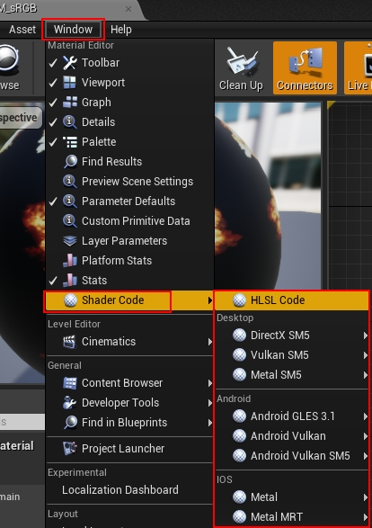

下图是打开HLSL之后的代码预览界面：

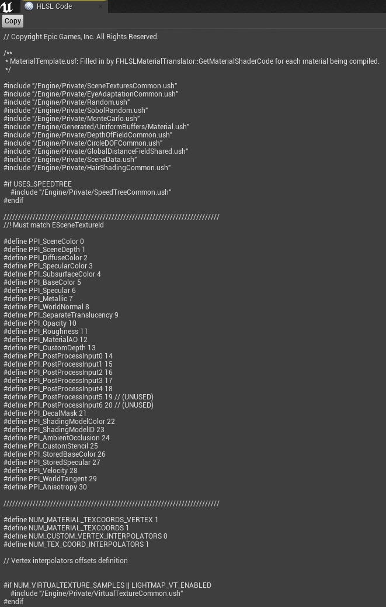

 

# **9.4 材质开发**

本章将讲述材质的开发案例、调试技巧和优化技术。

## **9.4.1 材质调试与优化**

在材质和材质实例编辑器都可以查看当前材质编译后的指令数量、纹理采样数量、插值器数据等：

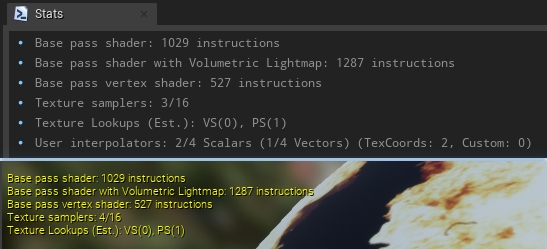

*上：材质编辑器的统计数据窗口；下：材质实例编辑器的统计数据。*

打开材质编辑器上侧的Platform Stats（平台数据）之后，可以查看指定平台更详细的数据（PS、VS、采样器等等）：

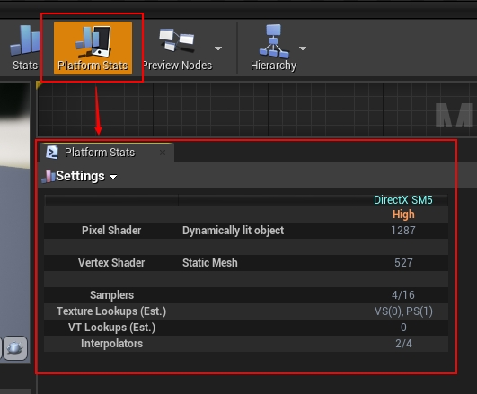

点击上图的Settings按钮，可以查看其它平台的数据。

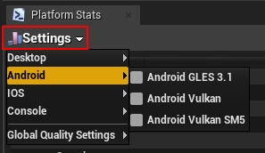

打开材质编辑器的菜单Asset / Size Map，可以打开材质资源的占用空间（磁盘和内存）布局图：

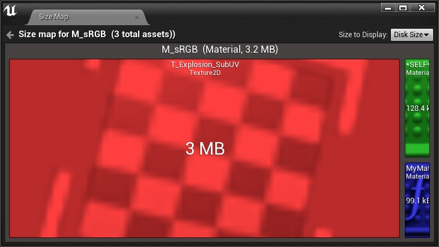

打开材质编辑器的菜单Windows / Developer Tools / Material Analyzer，可以查看指定材质的层级、各种类型属性的数量：

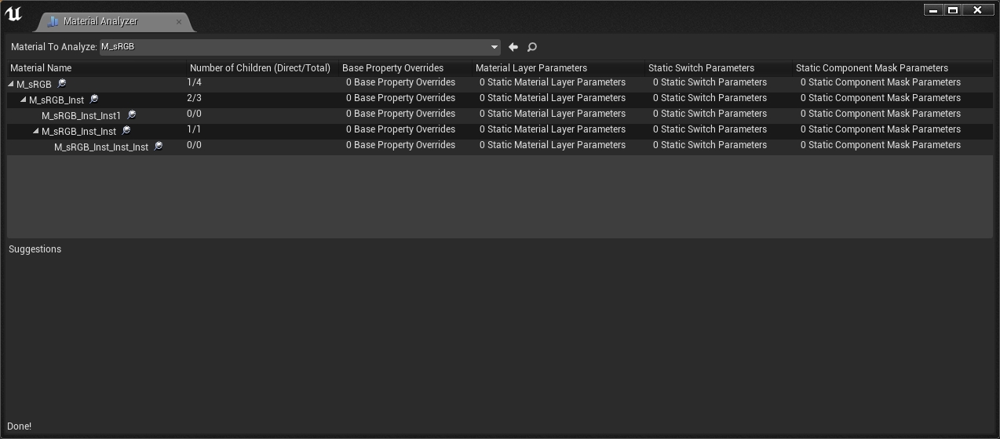

如果某些数据异常或可改进，系统会提示并给出修改意见。例如下图提示有多个材质拥有相同的排列：

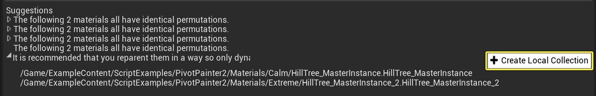

可以点击Create Local Collection将所有相关实例放置到一个本地集合中，这样就可以轻松地找到并更新它们，以获得更有效的材质参数设置。

当然，上面的材质分析器一次只能手动选择一个材质，效率很慢。实际上可以基于此开发批处理检查工具，甚至可以定制某些规则，自动创建本地参数集合，以提升材质优化的效率和效果。

另外，在编辑材质蓝图时，可以注意以下几点：

1、注意静态变量、开关、等级和FeatureLevel的数量，这些通常会增加排列数量。

2、合并材质参数，减少或避免不必要的材质节点。

3、合理增加注解，模块化并抽象成材质函数，对于复杂的材质非常必要，有利于维护和扩展，提升材质复用率。

4、虽然材质节点大多数是PS节点，但也有少量是VS节点，如下所示：

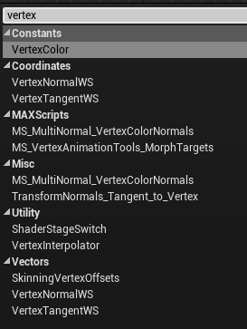

特别是VertexInterpolator节点，可以将部分逻辑放到VS计算，然后利用VertexInterpolator进行硬件插值之后输出PS的值：

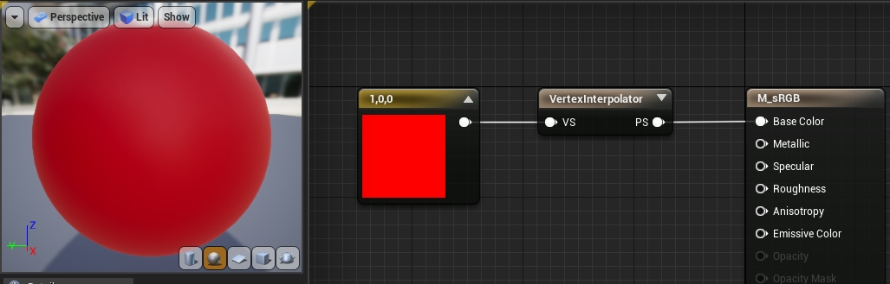

VertexInterpolator支持Float~Float4的插值，最多支持4个Float4插值，如果想知道当前VertexInterpolator的数量，可以在Stats窗口看到：

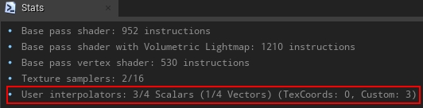

另外Shader Stage Switch也可以区别对待VS和PS的值：

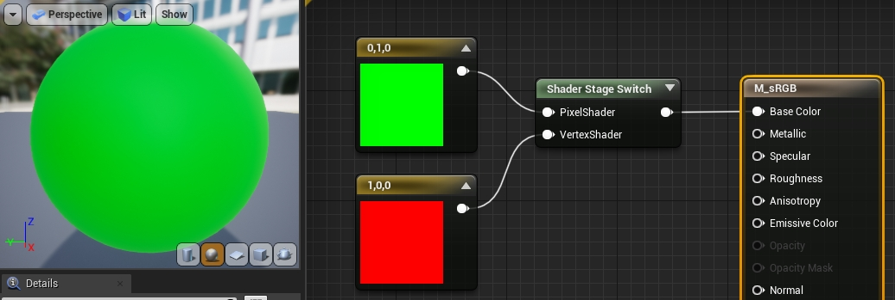

## **9.4.2 材质开发案例**

### **9.4.2.1 增加材质节点**

本小节以添加名为`MyCustomOperation`的材质节点为例。

首先需要在FMaterialCompiler和FHLSLMaterialTranslator添加相关接口和实现：

```c++
// Engine\Source\Runtime\Engine\Public\MaterialCompiler.h

class FMaterialCompiler
{
public:
    virtual int32 MyCustomOperation(int32 A, int32 B) { return 0; } // 不写成抽象接口, 防止其它子类报错.
    
    (......)
};

// Engine\Source\Runtime\Engine\Private\Materials\HLSLMaterialTranslator.h

class FHLSLMaterialTranslator : public FMaterialCompiler
{
public:
    virtual int32 MyCustomOperation(int32 A, int32 B) override;
    
    (......)
};

// Engine\Source\Runtime\Engine\Private\Materials\HLSLMaterialTranslator.cpp

int32 FHLSLMaterialTranslator::MyCustomOperation(int32 A, int32 B)
{
    // 注意两个操作数是索引, 而不是值!!
    if(A == INDEX_NONE || B == INDEX_NONE)
    {
        return INDEX_NONE;
    }

    const uint64 Hash = CityHash128to64({ GetParameterHash(A), GetParameterHash(B) });
    if(GetParameterUniformExpression(A) && GetParameterUniformExpression(B))
    {
        // 既然是自定义的操作节点, 可以随意指定符合HLSL标准语法的代码片段^_^
        return AddUniformExpressionWithHash(Hash, new FMaterialUniformExpressionFoldedMath(GetParameterUniformExpression(A),GetParameterUniformExpression(B),FMO_Add),GetArithmeticResultType(A,B),TEXT("(%s + %s * 0.5)"),*GetParameterCode(A),*GetParameterCode(B));
    }
    else
    {
        return AddCodeChunkWithHash(Hash, GetArithmeticResultType(A,B),TEXT("(%s + %s * 0.5)"),*GetParameterCode(A),*GetParameterCode(B));
    }
}
```

实现以上接口之后，需要添加对应的材质表达式的类型和文件：

```c++
// Engine\Source\Runtime\Engine\Classes\Materials\MaterialExpressionMyCustomOperation.h

#pragma once

#include "CoreMinimal.h"
#include "UObject/ObjectMacros.h"
#include "MaterialExpressionIO.h"
#include "Materials/MaterialExpression.h"
// UBT编译而成的头文件, 不能遗漏.
#include "MaterialExpressionMyCustomOperation.generated.h"

UCLASS(MinimalAPI)
class UMaterialExpressionMyCustomOperation : public UMaterialExpression
{
    GENERATED_UCLASS_BODY()

    UPROPERTY(meta = (RequiredInput = "false", ToolTip = "Defaults to 'ConstA' if not specified"))
    FExpressionInput A;
    
    UPROPERTY(meta = (RequiredInput = "false", ToolTip = "Defaults to 'ConstB' if not specified"))
    FExpressionInput B;

    UPROPERTY(EditAnywhere, Category=MaterialExpressionAdd, meta=(OverridingInputProperty = "A"))
    float ConstA;
    
    UPROPERTY(EditAnywhere, Category=MaterialExpressionAdd, meta=(OverridingInputProperty = "B"))
    float ConstB;

    //~ Begin UMaterialExpression Interface
#if WITH_EDITOR
    virtual int32 Compile(class FMaterialCompiler* Compiler, int32 OutputIndex) override;
    virtual void GetCaption(TArray<FString>& OutCaptions) const override;
#endif // WITH_EDITOR
    //~ End UMaterialExpression Interface
};

// Engine\Source\Runtime\Engine\Private\Materials\MaterialExpressions.cpp

// 增加新节点的头文件引用.
#include "Materials/MaterialExpressionMyCustomOperation.h"


// 默认构造函数.
UMaterialExpressionMyCustomOperation::UMaterialExpressionMyCustomOperation(const FObjectInitializer& ObjectInitializer)
    : Super(ObjectInitializer)
{
    // Structure to hold one-time initialization
    struct FConstructorStatics
    {
        FText NAME_Math;
        FConstructorStatics()
            : NAME_Math(LOCTEXT( "Math", "Math" ))
        {
        }
    };
    static FConstructorStatics ConstructorStatics;

    ConstA = 0.0f;
    ConstB = 1.0f;

#if WITH_EDITORONLY_DATA
    MenuCategories.Add(ConstructorStatics.NAME_Math);
#endif
}

// 编译.
int32 UMaterialExpressionMyCustomOperation::Compile(class FMaterialCompiler* Compiler, int32 OutputIndex)
{
    int32 Arg1 = A.GetTracedInput().Expression ? A.Compile(Compiler) : Compiler->Constant(ConstA);
    int32 Arg2 = B.GetTracedInput().Expression ? B.Compile(Compiler) : Compiler->Constant(ConstB);

    return Compiler->MyCustomOperation(Arg1, Arg2);
}

// 说明.
void UMaterialExpressionMyCustomOperation::GetCaption(TArray<FString>& OutCaptions) const
{
    FString ret = TEXT("MyCustomOperation");

    FExpressionInput ATraced = A.GetTracedInput();
    FExpressionInput BTraced = B.GetTracedInput();
    if(!ATraced.Expression || !BTraced.Expression)
    {
        ret += TEXT("(");
        ret += ATraced.Expression ? TEXT(",") : FString::Printf( TEXT("%.4g,"), ConstA);
        ret += BTraced.Expression ? TEXT(")") : FString::Printf( TEXT("%.4g)"), ConstB);
    }

    OutCaptions.Add(ret);
}
```

添加以上代码后，编译引擎代码，启动UE编辑器，打开材质编辑器，便可以在节点中搜索到MyCustomOperation材质节点并使用它了（下图）。

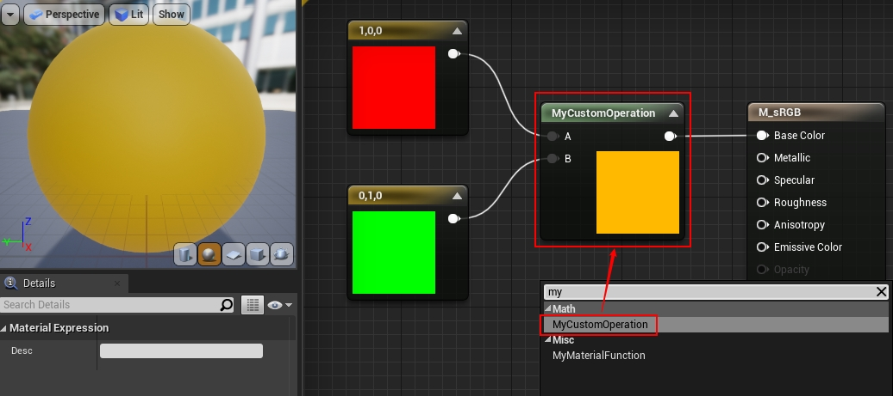

### **9.4.2.2 扩展自定义节点**

UE自带的Custom材质节点虽然可以编写任意代码，但它限制在某个函数内。比如在Custom编写了以下代码：

```c++
return 1.0;
```

实际上HLSL编译器会将它编译成类似以下的代码：

```c++
float CustomExpression0()
{
    return 1.0;
}
```

限制在了函数体内，将极大地限制我们的发挥，比如不能在Custom节点定义函数、结构体，也不能引用其它ush文件。

常规且快速的做法是在Custom阶段的前后增加大括号：

```c++
return 0.0; } // 匹配编译器的{

float MyParameter = 1.0;

// 正常的代码.
float MyFunction()
{
    return MyParameter;
// 此处不需要加}, 因为编译器后面会加
```

生成的HLSL代码如下所示：

```c++
float CustomExpression0()
{
    return 1.0;
}

float MyParameter = 1.0;

float MyFunction()
{
    return MyParameter;
}
```

但是这种方式非常不雅观，而且材质节点获得的结果是第一个return的值。下面是另外一种稍微优雅一点的方式，支持多个函数和变量的定义：

```c++
struct FMyStruct
{
    float3 ColorDensity;
    
    float3 ColorOperation(float3 Color)
    {
        return Color * ColorDensity;
    } 
    
    float3 Out()
    {
        // InColor是函数输入参数.
        return ColorOperation(InColor);
    }
};

FMyStruct MyStruct;
FMyStruct.ColorDensity = float3(0.5, 0.5, 0);

return MyStruct.Out();
```

上面的代码利用HLSL的函数体内可以定义局部结构体的特性，支持了对任意数量的函数和变量的定义。

### **9.4.2.3 扩展材质模板**

MaterialTemplate.ush定义了大量全局的宏、结构体、接口，我们当然也可以修改它，增加所需的代码或数据，比如：

- 增加全局静态变量。
- 增加宏定义。
- 增加引用文件。
- 增加%s的空缺代码，在HLSL编译器填充它。
- 增加结构体。
- 增加自定义函数。

以上所有数据和接口，可以结合Custom节点和MaterialFunction，暴露给材质蓝图访问。

举个例子，比如我们在MaterialTemplate.ush增加一个全局静态常量：

```c++
// Engine\Shaders\Private\MaterialTemplate.ush

// 紧挨着include之后.
static const float MyGlobalParameter = 0.5;
```

编译引擎，启动后打开材质编辑器，新增一个材质函数，在材质函数增加一个Custom节点，Custom节点的代码如下：

```c++
return MyGlobalParameter;
```

然后勾选材质函数的Expose to Library：

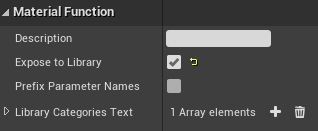

这样就可以在材质节点中搜索并应用改材质函数了：

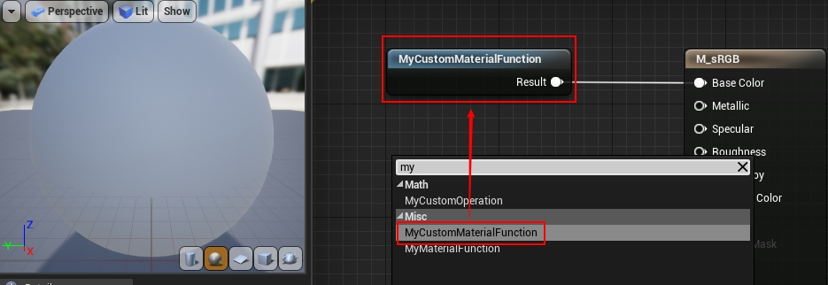

 

# **9.5 本篇总结**

本篇主要阐述了UE的材质体系的基础概念、类型、机制，希望童鞋们学习完本篇之后，对UE的材质不再陌生，能够轻松自如地掌握、应用、扩展它。

## **9.5.1 本篇思考**

按惯例，本篇也布置一些小思考，以助理解和加深UE材质体系的掌握和理解：

- UMaterialInterface、FMaterialRenderProxy、FMaterial的关联和区别是什么？为什么要有这么多材质的类型？
- 材质渲染时的数据更新流程是什么？
- 材质蓝图编译的流程是怎样的？编译器的主要接口功能是什么？
- 编辑材质时，需要注意哪些性能数据？如何查看？
- 增加新的Shading Model，以支持二次元风格的渲染。