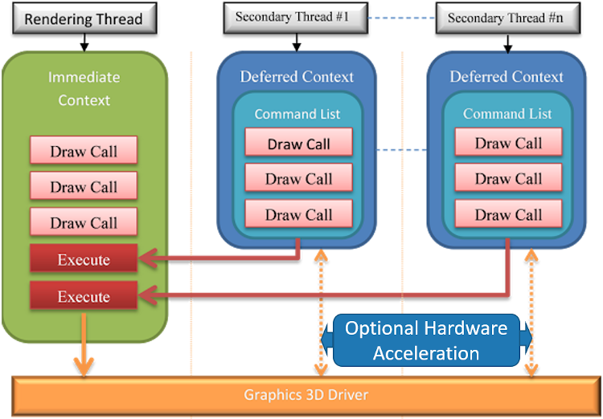
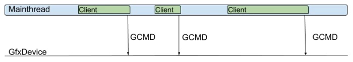
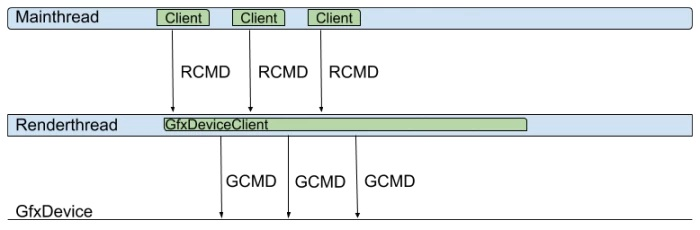
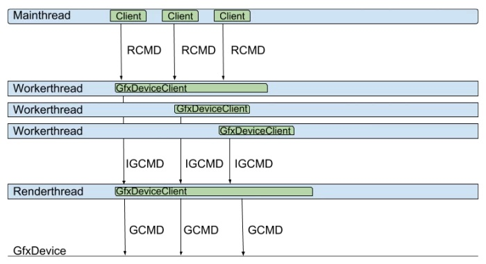

# 1. 基础

## 1. 概述

**进程（Process）**是操作系统执行应用程序的基本单元和实体，**它本身只是个容器**，通常包含内核对象、地址空间、统计信息和若干线程。**它本身并不真正执行代码指令，而是交由进程内的线程执行**。

对Windows而言，操作系统在创建进程时，同时也会给它创建一个线程，该线程被称为**主线程**（Primary thread, Main thread）。

**线程（Thread）**是**可以执行代码的实体**，通常不能独立存在，需要依附在某个进程内部。**一个进程可以拥有多个线程**，这些线程可以共享进程的数据，以便并行或并发地执行多个任务。

**协程（Coroutine）**是一种**轻量级（lightweight）的用户态线程**，通常跑在同一个线程，利用同一个线程的不同时间片段执行指令，**没有线程、进程切换和调度的开销**。从使用者角度，**可以利用协程机制实现在同个线程模拟异步的任务和编码方式**。在同个线程内，它不会造成数据竞争，但也会因线程阻塞而阻塞。

**纤程（Fiber）**如同协程，也是一种**轻量级的用户态线程**，可以使得应用程序独立决定自己的线程要如何运作。**操作系统内核不知道纤程的存在，也不会为它进行调度。**

**线程池**提供了一种**新的任务并发的方式**，调用者只需要**传入一组可并行的任务和分组的策略**，便可以使用线程池的若干线程并发地执行任务，使得调用者无需接直接触线程的调用和管理细节，降低了调用者的成本，也提升了线程的调度效率和吞吐量。


## 2. C++的多线程

### **C++多线程关键字**

:one:`thread_local`是C++实现**线程局部存储**的关键，添加了此关键字的变量意味着**每个线程都有自己的一份数据**，不会共享同一份数据，避免数据竞争。

```c++
#include <threads.h>
thread_local int foo = 0;
```

使用了**volatile修饰符**的变量意味着它**在内存中的值可能随时发生变化**，也告诉编译器**不能做任何优化**，每次使用到此变量的值都**必须从内存中读取**，而不应该直接使用寄存器的值。`volatile`并不能解决多线程的同步问题，只适合以下三种情况使用：

1、和信号处理（signal handler）相关的场合。

2、和内存映射硬件（memory mapped hardware）相关的场合。

3、和非本地跳转（`setjmp` 和 `longjmp`）相关的场合。

严格来说`atomic`并不是关键字，而是**STL的模板类**，可以支持指定类型的原子操作。使用原子的类型意味着**该类型的实例的读写操作都是原子性的**，无法被其它线程切割，从而达到线程安全和同步的目标。

### C++ 线程

C++的线程类型是`std::thread`，它提供的接口如下表：

| 接口                 | 解析                                           |
| -------------------- | ---------------------------------------------- |
| join                 | 加入主线程，使得主线程强制等待该线程执行完。   |
| detach               | 从主线程分离，使得主线程无需等待该线程执行完。 |
| swap                 | 与另外一个线程交换线程对象。                   |
| joinable             | 查询是否可加入主线程。                         |
| get_id               | 获取该线程的唯一标识符。                       |
| native_handle        | 返回实现层的线程句柄。                         |
| hardware_concurrency | 静态接口，返回硬件支持的并发线程数量。         |

`C++20`已经支持**轻量级的协程**（coroutine）了，相关的关键字：`co_await`，`co_return`，`co_yield`，跟C#等脚本语言的概念和用法如出一辙，但行为和实现机制可能会稍有不同，此文不展开探讨了。

### C++线程同步

具体还是看另外一本书吧。


# 2. **现代图形API的多线程特性**

## **1. 传统图形API的多线程特性**

DirectX11尝试从**硬件层面**解决多线程渲染的问题。它支持了两种设备上下文：**即时上下文（Immediate Context）**和**延迟上下文（Deferred Context）**。不同的延迟上下文可以同时在不同的线程中使用，生成将在“即时上下文”中执行的命令列表。这种多线程策略允许将复杂的场景分解成并发任务。



//todo

# **3. 游戏引擎的多线程渲染**

## **1. Unity**

Unity的渲染体系中有几个核心概念，一个是`Client`，**运行于主线程**（逻辑线程），负责**产生渲染指令**；另一个是`Worker Thread`，工作线程，用于协助处理主线程或生成渲染指令等各类子工作。Unity的渲染架构中支持以下几种模式：

- **Singlethreaded Rendering**

  **单线程渲染模式**，此模式下只有**单个Client组件**，没有工作线程。唯一的Client在主线程中产生所有的渲染命令（rendering command，`RCMD`），并且拥有图形设备对象，也会在主线程向图形设备产生调用**图形API命令**（graphics API，`GCMD`），它的调度示意图如下：

  

- **Multithreaded Rendering **

  **多线程渲染模式**，这种模式下和单线程对比，就是**多了一条工作线程**，即用于生成**GCMD的渲染线程**，其中渲染线程跑的是GfxDeviceClient对象，专用于生成对应平台的图形API指令：

  

- **Jobified Rendering**

  **作业化渲染模式**，此模式下有**多个Client对象**，**单个渲染线程**。此外，**有多个作业对象**，每个作业对象跑在专用独立的线程，用于生成即时图形命令（intermediate graphics commands，IGCMD）。此外，还有一个工作线程（渲染线程）用于将作业线程生成的IGCMD转换成图形API的GCMD，运行示意图如下：

  


//todo

# **4. UE的多线程机制**

## **1. UE的多线程基础**

介绍UE4自己实现的`atomic`等，具体见网址。

## 2. UE的多线程实现

**UE的多线程**实现上并没有采纳C++11标准库的那一套，而是自己从系统级做了封装和实现，包括系统线程、线程池、异步任务、任务图以及相关的通知和同步机制。

### **FRunnable**

`FRunnable`是所有可以在多个线程并行地运行的物体的父类，它提供的基础接口如下：

```c++
// Engine\Source\Runtime\Core\Public\HAL\Runnable.h

class CORE_API FRunnable
{
public:
    virtual bool Init();    // 初始化, 成功返回True.
    virtual uint32 Run();    // 运行, 只有Init成功才会被调用.
    virtual void Stop();    // 请求提前停止.
    virtual void Exit();    // 退出, 清理数据.
};
```

`FRunnable`的子类非常多，以下是常见的**部分核心子类**及其解析。

- **FRenderingThread**：运行于**渲染线程**上的对象。后面有章节会专门剖析。
- **FRHIThread**：运行于**RHI线程**上的对象。后面有章节会专门剖析。
- **FRenderingThreadTickHeartbeat**：运行于**心跳渲染线程**上的物体。
- **FTaskThreadBase**：在线程执行的任务父类，后面会有章节专门解析这部分。
- **FQueuedThread**：可存储在线程池的线程父类。
- **TAsyncRunnable**：异步地在单独线程运行的任务，是个模板类。

由此可见，**FRunnable对象**并不能独立存在，总是要依赖线程来真正地执行任务。

//TODO


# 5. UE的多线程渲染

## **1. UE的多线程渲染基础**

:one:UE的场景和渲染模块涉及到概念非常多，主要类型和解析如下：

| 类型                     | 解析                                                         |
| ------------------------ | ------------------------------------------------------------ |
| **UWorld**               | 包含了一组可以相互交互的Actor和组件的集合，多个关卡（Level）可以被加载进UWorld或从UWorld卸载。可以同时存在多个UWorld实例。 |
| **ULevel**               | 关卡，存储着一组Actor和组件，并且存储在同一个文件。          |
| **USceneComponent**      | 场景组件，是所有可以被加入到场景的物体的父类，比如灯光、模型、雾等。 |
| **UPrimitiveComponent**  | 图元组件，是所有可渲染或拥有物理模拟的物体父类。是CPU层裁剪的最小粒度单位， |
| **ULightComponent**      | 光源组件，是所有光源类型的父类。                             |
| **FScene**               | 是UWorld在渲染模块的代表。只有加入到FScene的物体才会被渲染器感知到。渲染线程拥有FScene的所有状态（游戏线程不可直接修改）。 |
| **FPrimitiveSceneProxy** | 图元场景代理，是UPrimitiveComponent在渲染器的代表，镜像了UPrimitiveComponent在渲染线程的状态。 |
| **FPrimitiveSceneInfo**  | 渲染器内部状态（描述了FRendererModule的实现），相当于融合了UPrimitiveComponent and FPrimitiveSceneProxy。只存在渲染器模块，所以引擎模块无法感知到它的存在。 |
| **FSceneView**           | 描述了FScene内的单个视图（view），同个FScene允许有多个view，换言之，一个场景可以被多个view绘制，或者多个view同时被绘制。每一帧都会创建新的view实例。 |
| **FViewInfo**            | view在渲染器的内部代表，只存在渲染器模块，引擎模块不可见。   |
| **FSceneViewState**      | 存储了有关view的渲染器私有信息，这些信息需要被跨帧访问。在Game实例，每个ULocalPlayer拥有一个FSceneViewState实例。 |
| **FSceneRenderer**       | 每帧都会被创建，封装帧间临时数据。下派生FDeferredShadingSceneRenderer（延迟着色场景渲染器）和FMobileSceneRenderer（移动端场景渲染器），分别代表PC和移动端的默认渲染器。 |
