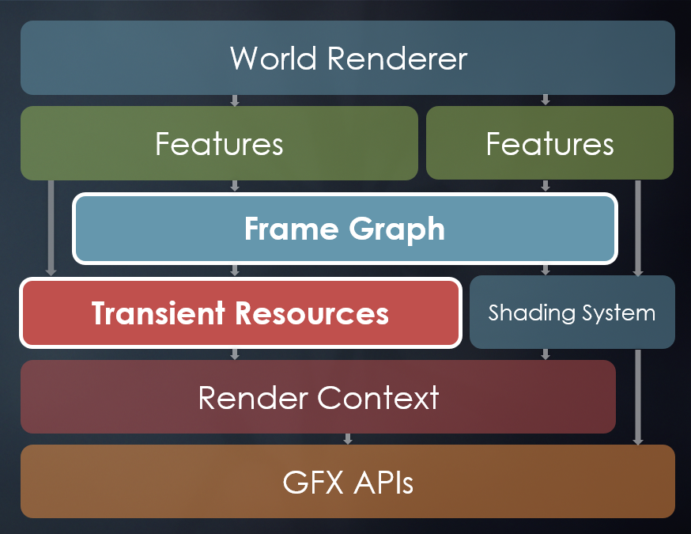
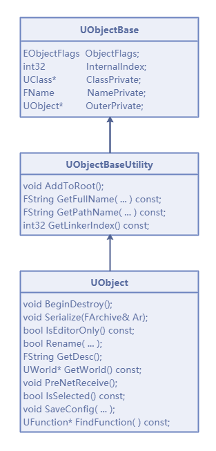
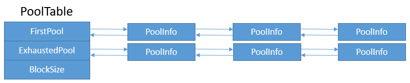
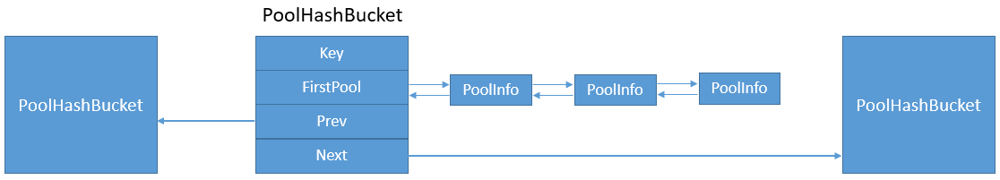
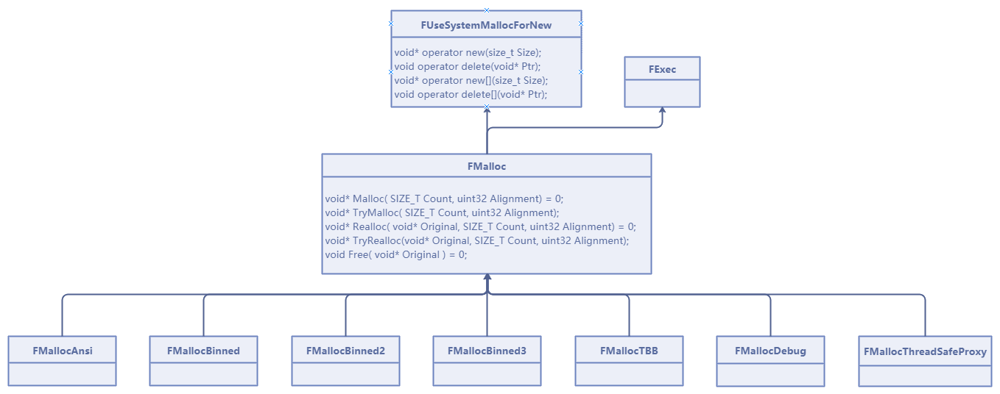
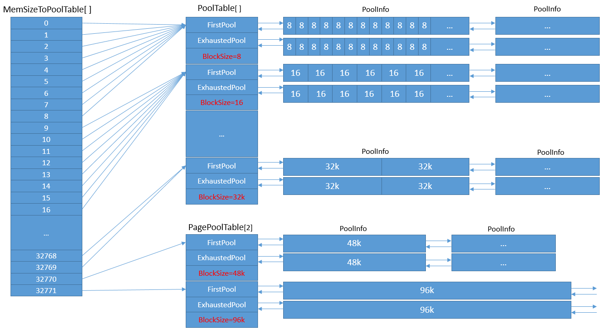
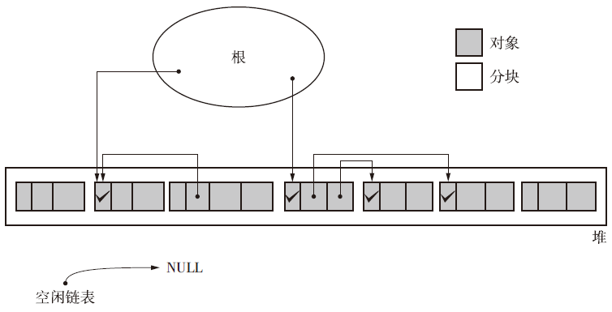
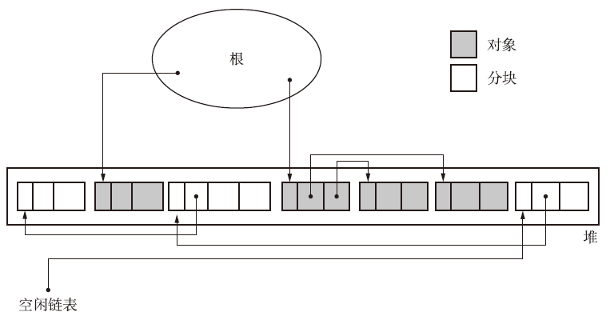
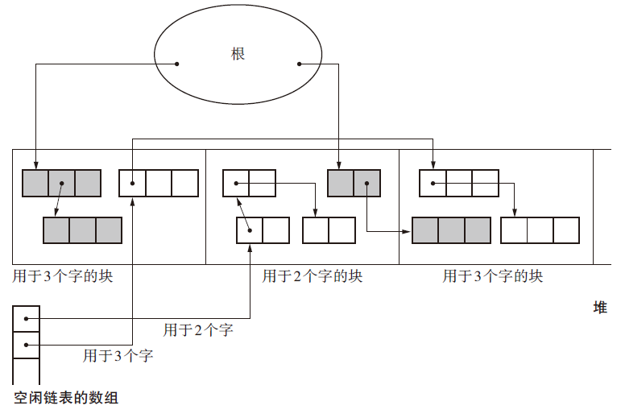

# 1. 渲染综述

为了跨**多种图形API**，加入了**RHI体系**，解决**用户层**裸调用**图形API**的问题。

为了充分发挥**多核优势**，引入了**游戏线程**、**渲染线程**、**RHI线程**，为了解决**线程访问冲突和竞争**，引入了以`U`开头的游戏线程代表，同时有与之对应的以`F`开头的渲染线程代表；

为了适应和充分利用`Vulkan`、`DirectX12`等这种新型轻量级现代图形API，UE还在4.22引入了==RDG==（**渲染依赖图表**）。




## 1. UE4中需要注意的C++新特性

:one:`lambda`表达式用得最多的是==给渲染线程压入渲染命令==，如`FScene::AddPrimitive`。对于`[]`捕获列表，`UE`大多使用的是**按值传递**的方式。

:two:关于**智能指针**，可见：

| **名称**     | **UE**     | **C++**    | **说明**                                                     |
| ------------ | ---------- | ---------- | ------------------------------------------------------------ |
| **共享指针** | TSharedPtr | shared_ptr | 共享指针拥有其引用的对象，无限防止该对象被删除，并在无共享指针或共享引用引用其时，最终处理其的删除。共享指针可为空白，意味其不引用任何对象。任何非空共享指针都可对其引用的对象生成共享引用。 |
| **唯一指针** | TUniquePtr | unique_ptr | 唯一指针仅会显式拥有其引用的对象。仅有一个唯一指针指向给定资源，因此唯一指针可转移所有权，但无法共享。复制唯一指针的任何尝试都将导致编译错误。唯一指针超出范围时，其将自动删除其所引用的对象。 |
| **弱指针**   | TWeakPtr   | weak_ptr   | 弱指针类与共享指针类似，但不拥有其引用的对象，因此不影响其生命周期。此属性中断引用循环，因此十分有用，但也意味弱指针可在无预警的情况下随时变为空。因此，弱指针可生成指向其引用对象的共享指针，确保程序员能对该对象进行安全临时访问。 |
| **共享引用** | TSharedRef | -          | 共享引用的行为与共享指针类似，即其拥有自身引用的对象。对于空对象而言，其存在不同；共享引用须固定引用非空对象。共享指针无此类限制，因此共享引用可固定转换为共享指针，且该共享指针固定引用有效对象。**要确认引用的对象是非空，或者要表明共享对象所有权时，请使用共享引用。** |

UE4还提供了智能指针的线程安全版本。

:three:关于**委托**。`UE`在内部也实现了一套**委托机制**。`UE`的委托有三种类型：

- 单点委托

- 组播委托
  - 事件
- 动态物体
  - UObject
  - Serializable

> 现在C++，可以使用`Function`和`bind`来实现委托。

具体委托使用，可以见之前的《UE4——C++教程》.


## 2. 数学库

:one:虚幻引擎实现了一套**数学库**，代码在`Engine\Source\Runtime\Core\Public\Math`目录下。下面将列出常用的类型和解析：

| **类型**             | **名称**        | **解析**                                                     |
| -------------------- | --------------- | ------------------------------------------------------------ |
| **FBox**             | 包围盒          | 轴平行的三维包围盒，常用于包围体、碰撞体、可见性判定等。     |
| **FBoxSphereBounds** | 球-立方体包围盒 | 内含一个球体和一个轴平行的立方体包围盒数据，它们各用于不同的用途，如球体用于场景遍历加速结构，而立方体用于碰撞检测等。是大多数可见物体的包围盒的类型。 |
| **FColor**           | Gamma空间颜色   | 存储RGBA8888 4个通道的颜色值，它们处于Gamma空间，可由线性空间的FLinearColor转换而来。 |
| **FLinearColor**     | 线性空间颜色    | 存储RGBA4个通道的颜色值，每个通道精度是32位浮点值，它们处于线性空间，可由Gamma空间的FColor转换而来。 |
| **FCapsuleShape**    | 胶囊体          | 存储了两个圆和一个圆柱体的数据，两个圆位于圆柱体两端，从而组合成胶囊体。常用于物理碰撞胶囊体。 |

...etc.

:two:值得一提的是，`UE`提供了数个**向量[SIMD](https://zh.wikipedia.org/wiki/%E5%8D%95%E6%8C%87%E4%BB%A4%E6%B5%81%E5%A4%9A%E6%95%B0%E6%8D%AE%E6%B5%81)指令优化版本**，可定义**不同的宏**启用对应版本：

```c++
// Engine\Source\Runtime\Core\Public\Math\VectorRegister.h

// Platform specific vector intrinsics include.
#if WITH_DIRECTXMATH
    #define SIMD_ALIGNMENT (16)
    #include "Math/UnrealMathDirectX.h"
#elif PLATFORM_ENABLE_VECTORINTRINSICS
    #define SIMD_ALIGNMENT (16)
    #include "Math/UnrealMathSSE.h"
#elif PLATFORM_ENABLE_VECTORINTRINSICS_NEON
    #define SIMD_ALIGNMENT (16)
    #include "Math/UnrealMathNeon.h"
#else
    #define SIMD_ALIGNMENT (4)
    #include "Math/UnrealMathFPU.h"
#endif
```

由上面的代码可知，`UE`支持**DirectX内建库**、`Arm Neon`指令、`SSE`指令、`FPU`等版本。

> **Neon**由Arm公司设计而成，是一套单指令多数据（SIMD）的架构扩展技术，适用于Arm Cortex-A和Cortex-R系列处理器。
>
> **SSE**(Stream SIMD Extensions)由Intel设计而成，最先在其计算机芯片Pentium3中引入的指令集，是继MMX的扩充指令集，适用于x86和x64架构架构。目前已经存在SSE2、SSE3、SSSE3、SSE4等指令集。
>
> **FPU**（Floating-point unit）是浮点数计算单元，组成CPU核心的一部分硬件结构，是CPU处理浮点数和向量运算的核心单元。


# 2. 引擎模块

## 1. Object , Actor, ActorComponent

:one:`UObject`是`UE`所有物体类型的基类，它继承于`UObjectBaseUtility`，而`UObjectBaseUtility`又继承于`UObjectBase`。它提供了**元数据、反射生成、GC垃圾回收、序列化、部分编辑器信息、物体创建销毁、事件回调**等功能，子类具体的类型由`UClass`描述而定。它们的继承关系如下图：



这个具体见大钊老师的博客。


## 2. 内存分配

### 基础

先阐述一下涉及到的**基本概念**：

- **FFreeMem**

  可分配的**小块内存信息记录体**，在`FMallocBinned`定义如下：

  ```c++
  struct FMallocBinned::FFreeMem
  {
      FFreeMem*    Next;            // 指向下一块内存或结尾. 由内存池(pool)管理, 保证有序.
      uint32        NumFreeBlocks;    // 可分配的连续内存块数量, 至少为1.
      uint32        Padding;        // 让结构体16字节对齐的填补字节.
  };
  ```

- **FPoolInfo**

  **内存池**，在常用的内存分配器中，为了减少系统操作内存的开销，通常会先分配**一块较大的内存**，然后再在此大内存分割成若干小块（UE的小块内存是相等尺寸）。

  ```c++
  struct FMallocBinned::FPoolInfo
  {
      uint16            Taken;        // 已分配的内存块数量.
      uint16            TableIndex; 	// 所在的MemSizeToPoolTable索引.
      uint32            AllocSize;    // 已分配的内存大小.
      
      FFreeMem*        FirstMem;   	// 如果是装箱模式, 指向内存池可用的内存块; 如果非装箱模式, 指向由操作系统直接分配的内存块.
      FPoolInfo*        Next;         // 指向下一个内存池.
      FPoolInfo**        PrevLink;    // 指向上一个内存池.
  };
  ```

  由于**内存池内的内存块**（`Block`）是等尺寸的，所以内存池的**内存分布示意图**如下：

  

- **FPoolTable**

  ==内存池表==，采用**双向链表**存储了**一组内存池**。当内存池表中的内存池**没有可分配的内存块**时，就会重新创建一个内存池，加入双向链表中。

  ```c++
  struct FMallocBinned::FPoolTable
  {
      FPoolInfo*            FirstPool;        // 初始内存池, 是双向链表的表头.
      FPoolInfo*            ExhaustedPool;    // 已经耗尽（没有可分配的内存）的内存池链表
      uint32                BlockSize;        // 内存块大小
  };
  ```

  

- **PoolHashBucket**
  **内存池哈希桶**，用于存放由内存地址**哈希出来的键**对应的所有内存池。

  

- **内存尺寸**

  **UE的内存尺寸**涉及的参数比较多，有内存池大小（`PoolSize`）、内存页大小（`PageSize`）和内存块（`BlockSize`），它们的实际大小与分配器、系统平台、内存对齐方式、调用者都有关系。


### 内存分配器

:one:**FMalloc**是UE内存分配器的==核心类==，掌控着UE所有的内存分配和释放操作。然而它是个**虚基类**，它继承自`FUseSystemMallocForNew`和`FExec`，同时也有多个子类，分别对应**不同的内存分配方案和策略**。FMalloc的**主体继承关系**如下图：



**FMalloc继承体系主要类**的解析如下：

- **FUseSystemMallocForNew**

  `FUseSystemMallocForNew`提供了`new`和`delete`关键字的操作符支持，而FMalloc继承了FUseSystemMallocForNew，意味着`FMalloc`的所有子类都支持C++的**new和delete等关键字的内存操作**。

- **FMallocAnsi**

  **标准分配器**，直接调用C的`malloc`和`free`操作，未做任何的内存缓存和分配策略管理。

- **FMallocBinned**

  **标准(旧有)的装箱管理方式**，启用了内存池表（`FPoolTable`）、页面内存池表（`FPagePoolTable`）和内存池哈希桶（`PoolHashBucket`），是UE默认的内存分配方式，也是**支持所有平台的一种内存分配方式**。它的核心定义如下：

  ```c++
  // Engine\Source\Runtime\Core\Public\HAL\MallocBinned.h
  
  class FMallocBinned : public FMalloc
  {
  private:
      enum { POOL_COUNT = 42 };
      enum { EXTENDED_PAGE_POOL_ALLOCATION_COUNT = 2 };
      enum { MAX_POOLED_ALLOCATION_SIZE   = 32768+1 };
      
      (......)
  
      FPoolTable  PoolTable[POOL_COUNT];    // 所有的内存池表列表, 单个内存池的Block尺寸是一样的.
      FPoolTable    OsTable;    // 管理由系统直接分配的内存的内存池表. 不过研读源码后发现并未使用.
      FPoolTable    PagePoolTable[EXTENDED_PAGE_POOL_ALLOCATION_COUNT];    // 内存页(非小块内存)的内存池表.
      FPoolTable* MemSizeToPoolTable[MAX_POOLED_ALLOCATION_SIZE+EXTENDED_PAGE_POOL_ALLOCATION_COUNT];    // 根据尺寸索引的内存池表, 实际会指向PoolTable和PagePoolTable.
      
      PoolHashBucket* HashBuckets;        // 内存池哈希桶
      PoolHashBucket* HashBucketFreeList;    // 可分配的内存池哈希桶
      
      uint32        PageSize;    // 内存页大小
      
      (......)
  };
  ```

  为了更好地理解后续的内存分配机制，这里先分析一下**内存分配器的初始化代码**， 这里我们略。但大佬画了示意图：

  

  

分析`FMallocBinned::Malloc`函数，在非IOS平台且默认页面尺寸（64k）的情况下，`FMallocBinned`的分配策略简述如下：

- 待分配内存的大小处于(0, 32k)，使用MemSizeToPoolTable的PoolTable分配和存储。
- 待分配内存的大小处于[32k, 48K]或者[64k, 96k]，使用PagePoolTable的PoolTable分配和存储。
- 其它待分配内存的大小直接使用系统分配，且放入HashBuckets中。

`FMallocBinned`和下面提及的`FMallocBinned2`、`FMallocBinned3`实际上就是**预先分配大内存**，然后在大内存中再分配合适的小内存块。这些方式虽然可提高**内存分配效率**，但是**瞬时io压力**会变大，也不可避免地出现**内存浪费**。

- **FMallocBinned2**

  新的箱装内存分配方式，从源码上分析可知，FMallocBinned2比FMallocBinned的分配方式会简单一些，会根据小块内存、对齐大小和是否开启线程缓存（默认开启）选择对应分配器和策略。

- **FMallocBinned3**

  仅64位系统可用的新型箱装内存分配方式。实现方式和FMallocBinned2类似，支持线程缓存。

- **FMallocTBB**

  FMallocTBB采纳的是第三方内存分配器TBB中的scalable_allocator分配器

:two:上面阐述了**内存的分配方式和策略技术**，接下来说说**内存使用方式**。对调用者而言，有以下几种方式操作内存：

- **GMalloc**：`GMalloc`是==全局的内存分配器==，在UE启动之初就通过`FPlatformMemory`被创建：

  ```c++
  // Engine\Source\Runtime\Core\Private\HAL\UnrealMemory.cpp
  
  static int FMemory_GCreateMalloc_ThreadUnsafe()
  {
      (......)
  
      GMalloc = FPlatformMemory::BaseAllocator();
      
      (......)
  }
  ```

  ```c++
  // Engine\Source\Runtime\Core\Public\Windows\WindowsPlatformMemory.h
  
  struct CORE_API FWindowsPlatformMemory : public FGenericPlatformMemory
  {
      (......)
      
      static class FMalloc* BaseAllocator();
      
      (......)
  };
  
  typedef FWindowsPlatformMemory FPlatformMemory;
  ```

  从上面代码可以看出，`GMalloc`实际上就是`FMalloc`的实例，在不同的操作系统用`FPlatformMemory`创建不同的**FMalloc子类**，从而应用**不同的内存分配策略**。

- **FMemory**：`FMemory`是UE的**静态工具类**，它提供了**很多静态方法**，用于操作内存。`FMemory`既支持GMalloc，也支持C风格的内存操作。

- **new/delete操作符**：除了部分类重载了new和delete操作符之外，其它**全局的new和delete**使用的是以下声明。**全局的内存操作符**也是通过调用`FMemory`完成内存操作。

- **特定API**：除了以上三种内存操作方式，UE还提供了各类创建、销毁特定内存的接口，它们通常是**成对出现**。

> 从调用者的角度，多数情况下使用`new/delete`操作符和`FMemory`方式操作内存，直接申请系统内存的情况并不多见。


## 3. 垃圾回收

**垃圾回收**的简称是`GC`（Garbage Collection），是一种将无效的资源，以某种策略**回收或重利用的机制**，常用于游戏引擎、虚拟机、操作系统等。

### CG算法一览

:one:在[《垃圾回收的算法与实现》](https://book.douban.com/subject/26821357/)一书中，提到的GC算法有：

- **Mark-Sweep。**即==标记-清理算法==，算法分两个阶段：

  第一阶段是**标记（Mark）阶段**，过程是遍历**根的活动对象列表**，将所有活动对象指向的堆对象标记为`TRUE`。

  

  第二阶段是**清理（Sweep）阶段**，过程是**遍历堆列表**，将所有标记为`FALSE`的对象释放到可分配堆，且**重置活动对象的标记**，以便下次执行标记行为。

  

- **BiBOP**。全称是`Big Bag Of Pages`，它的做法是将**大小相近的对象**整理成**固定大小的块**进行管理，跟UE的`FMallocBinned`分配器的策略如出一辙。

  

- **Conservative GC。**==保守式GC==，特点是不能识别指针和非指针。由于在GC层面，单凭一个变量的内存值无法判断它是否指针，由此引申出很多方法来判断，需要付出一定的成本。与之相反的是**准确式GC（Exact GC）**，它能通过标签（tag）来明确标识是否指针。
- **Generational GC**。==分代垃圾回收==，该方法在对象中引入年龄的概念，通过优先回收容易成为垃圾的对象，提高垃圾回收的效率。
- **Incremental GC**。==增量式垃圾回收==，通过逐渐推进垃圾回收来控制mutator最大暂停时间的方法。
- **Reference Counting Immix**。简称RC Immix算法，即合并引用型GC算法。目的是通过某种策略改善引用计数的行为，以达到提升GC吞吐量的目的。

### **UE的GC**

UE的**GC模块**的主体实现代码和解析见书。从源码可知，UE的GC有以下特点：

- 主要算法是`Mark-Sweep`。但不同于**传统Mark-Sweep算法**只有`2`个步骤，UE的GC有`3`个步骤：

  1、索引可达对象。

  2、收集待清理对象。

  3、清理步骤2收集到的对象。

- 在游戏线程上对`UObject`进行清理。

- 线程安全，支持**多线程并行(Parallel)和群簇(Cluster)处理**，以提升吞吐率。

- 支持全量清理，编辑器模式下强制此模式；也支持增量清理，防止GC处理线程卡顿太久。

- 可指定某些标记的物体不被清理。

实际上，UE的GC机制和原理远比上面的表述要复杂得多，不过限于篇幅和主题，就不过多介绍了，有兴趣的可以研读UE源码或寻求参考文献。


## 4. 内存屏障

**内存屏障（Memory Barrier）**又被成为**membar**, **memory fence**或**fence instruction**，它的出现是为了**解决内存访问的乱序问题**以及**CPU缓冲数据的不同步问题**。

内存乱序问题可由编译期或运行时产生，**编译期乱序是由于编译器做了优化导致指令顺序变更**，运行时乱序常由多处理多线程的无序访问产生。

###  **编译期内存屏障**

这个乱序问题，可以去看看`Effective C++`的一些条款，应该是`条款17：以独立语句将newed对象置入智能指针`。

为了防止**编译期的乱序问题**，就需要在指令之间**显式地添加内存屏障**，如：

```
sum = a + b;
__COMPILE_MEMORY_BARRIER__;
sum = sum + c;
```

### **运行时内存屏障**

这个具体去看Ｃ++并行那本书吧。

```c++
while (f == 0);
_RUNTIME_MEMORY_BARRIAR_; // 加入内存屏障, 保证f的值能够读取到其它处理器的最新值, 才会执行print(x)
print(x);
```

```c++
x = 42;
_RUNTIME_MEMORY_BARRIAR_; // 加入内存屏障, 保证x对其它处理器可见, 才会执行f=1
f = 1;
```

上面的`_RUNTIME_MEMORY_BARRIAR_`是运行时内存屏障的代表，实际在不同硬件架构有着不同的实现，稍后会具体说到。

//todo

## 5. **引擎启动流程**

### **引擎预初始化**

**UE引擎预初始化**主要是在**启动页面期间**，做的很多初始化和基础核心相关模块的事情。


```c++
// Engine\Source\Runtime\Launch\Private\Launch.cpp

int32 EnginePreInit( const TCHAR* CmdLine )
{
    // 调用GEngineLoop预初始化.
    int32 ErrorLevel = GEngineLoop.PreInit( CmdLine );

    return( ErrorLevel );
}


// Engine\Source\Runtime\Launch\Private\LaunchEngineLoop.cpp

int32 FEngineLoop::PreInit(const TCHAR* CmdLine)
{
    // 启动小窗口的进度条
    const int32 rv1 = PreInitPreStartupScreen(CmdLine);
    if (rv1 != 0)
    {
        PreInitContext.Cleanup();
        return rv1;
    }

    const int32 rv2 = PreInitPostStartupScreen(CmdLine);
    if (rv2 != 0)
    {
        PreInitContext.Cleanup();
        return rv2;
    }

    return 0;
}
```

预初始化阶段会**初始化随机种子**，加载`CoreUObject`模块，启动**FTaskGraphInterface模块**，并将**当前游戏线程**附加进去，之后加载UE的部分基础核心模块（Engine、Renderer、SlateRHIRenderer、Landscape、TextureCompressor等），由`LoadPreInitModules`完成：

```c++
void FEngineLoop::LoadPreInitModules()
{
#if WITH_ENGINE
    FModuleManager::Get().LoadModule(TEXT("Engine"));
    FModuleManager::Get().LoadModule(TEXT("Renderer"));
    FModuleManager::Get().LoadModule(TEXT("AnimGraphRuntime"));

    FPlatformApplicationMisc::LoadPreInitModules();

#if !UE_SERVER
    if (!IsRunningDedicatedServer() )
    {
        if (!GUsingNullRHI)
        {
            // This needs to be loaded before InitializeShaderTypes is called
            FModuleManager::Get().LoadModuleChecked<ISlateRHIRendererModule>("SlateRHIRenderer");
        }
    }
#endif

    FModuleManager::Get().LoadModule(TEXT("Landscape"));
    FModuleManager::Get().LoadModule(TEXT("RenderCore"));

#if WITH_EDITORONLY_DATA
    FModuleManager::Get().LoadModule(TEXT("TextureCompressor"));
#endif

#endif // WITH_ENGINE

#if (WITH_EDITOR && !(UE_BUILD_SHIPPING || UE_BUILD_TEST))
    FModuleManager::Get().LoadModule(TEXT("AudioEditor"));
    FModuleManager::Get().LoadModule(TEXT("AnimationModifiers"));
#endif
}
```

随后处理的是**配置Log**、加载进度信息、内存分配器的TLS（线程局部范围）缓存、设置部分全局状态、处理工作目录、**初始化部分基础核心模块**（FModuleManager、IFileManager、FPlatformFileManager等）。还有比较重要的一点：==处理游戏线程==，将当前执行`WinMain`的线程**设置成游戏线程（主线程）并记录线程ID**。

接着设置**Shader源码目录映射**，处理网络令牌（Token），初始化部分基础模块（FCsvProfiler、AppLifetimeEventCapture、FTracingProfiler）以及App，随后会根据平台**是否支持多线程**，来创建线程池和指定数量的线程：

然后初始化或处理UGameUserSettings、Scalability、渲染线程（如果开启）、FConfigCacheIni、FPlatformMemory、游戏物理、RHI、RenderUtils、FShaderCodeLibrary、ShaderHashCache。

在**预初始化后期阶段**，引擎会处理SlateRenderer、IProjectManager、IInstallBundleManager、MoviePlayer、PIE预览设备、引擎默认材质等模块。

### **引擎初始化**

**引擎初始化**要分编辑器和非编辑器两种模式，非编辑器执行的是`FEngineLoop::Init`，编辑器执行的是`EditorInit`+`FEngineLoop::Init`，这里只分析非编辑器执行的初始化逻辑。

引擎初始化的流程由`FEngineLoop::Init`完成，它的主要流程如下：

- 根据配置文件创建对应的游戏引擎实例并存储到`GEngine`， 后面会大量使用到`GEngine`实例。
- 根据是否支持多线程判断是否需要创建EngineService实例。
- 执行`GEngine->Start()`。
- 加载Media、AutomationWorker、AutomationController、ProfilerClient、SequenceRecorder、SequenceRecorderSections模块。
- 开启**线程心跳**FThreadHeartBeat。
- 注册外部分析器FExternalProfiler。

###  **引擎帧更新**

//todo

### **引擎退出**

//todo


