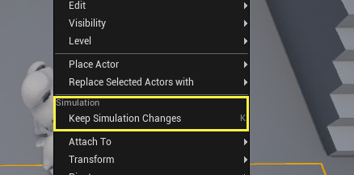
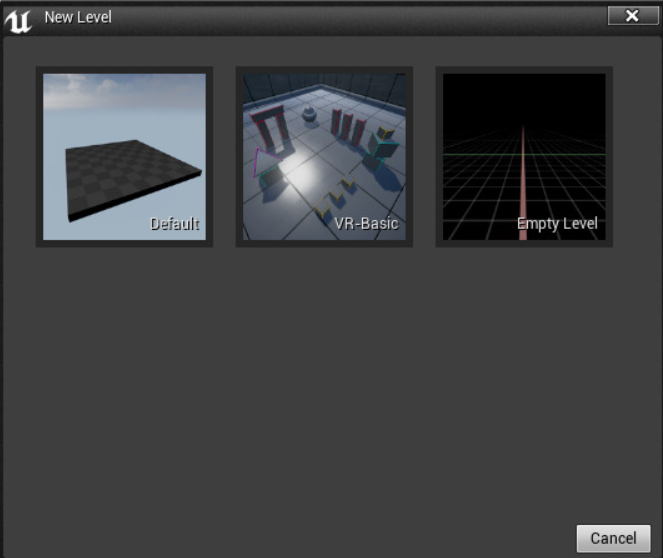
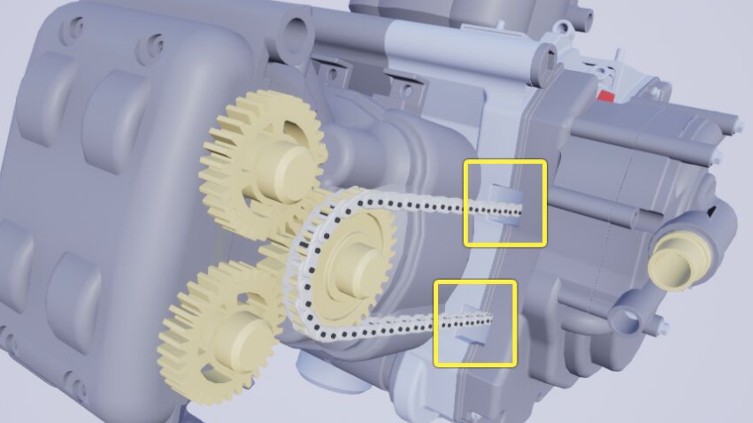
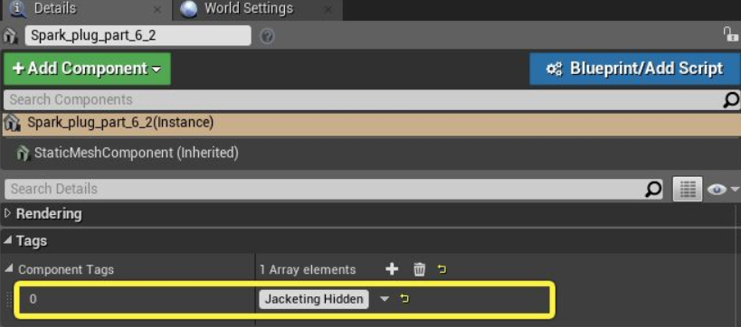
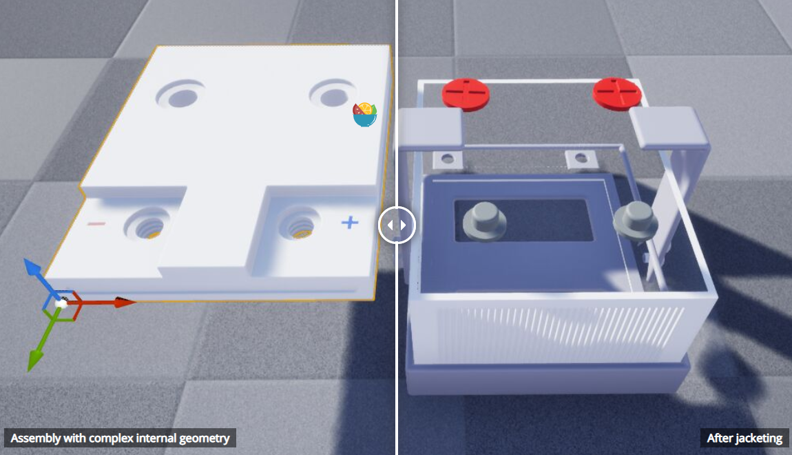
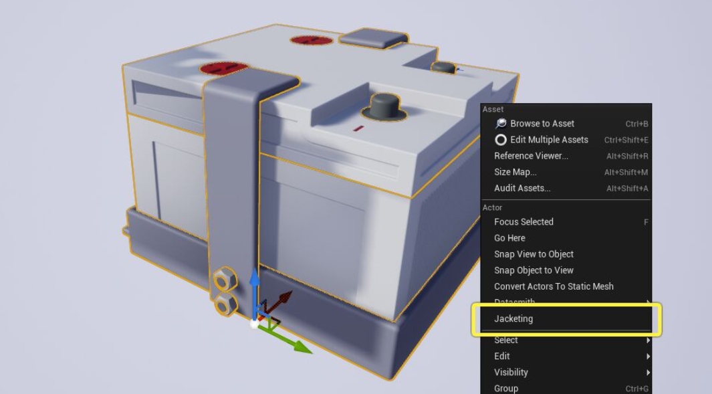
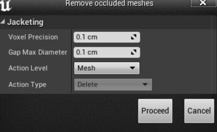
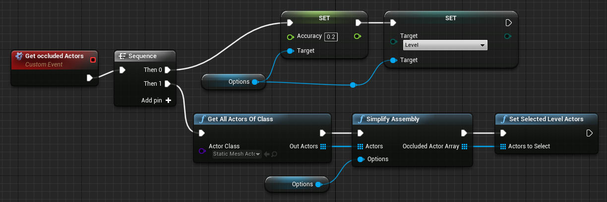
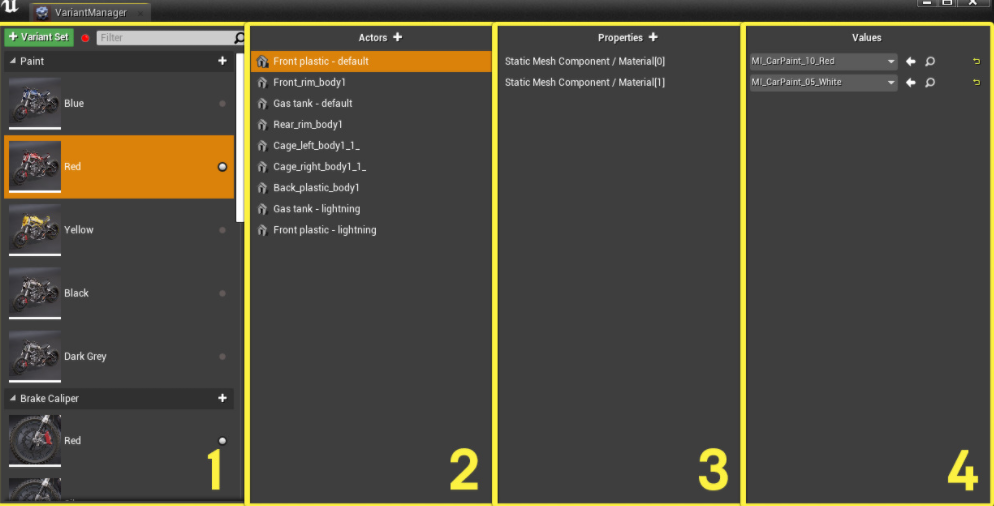

#  相对Unity的一些变更

1. 运行后，会出现`弹出`按钮，作用是：使你能够结束会话，或从角色中分离。具体来说，就是：可以选择游戏空间内的物体。

    > 虚幻没有区分Scene和Game试图。

2. 在运行时，进行的修改，如果想要保存，可以在**大纲视图**里右键点击该物体：

    

3. ==PIE控制台==： 是一种游戏内控制台，允许你输入命令并显示性能数据，启用或禁用引擎功能，或者执行其他操作。按~建打开。
4. 模拟(**SIE**)。具体啥用还不知道。

# 关卡

### 使用关卡资源

#### 创建关卡

在 **Content Browser** 中创建关卡的方法和 [创建其他资源](https://docs.unrealengine.com/zh-CN/Basics/ContentBrowser/UserGuide/BrowserAssetCreation/index.html#addingassets) 相同，如蓝图类、材质，或粒子系统。 然而也可从 **File** 菜单创建关卡，因为它们是项目的布局和组织。

- **Default：**创建一个带基础设置的新关卡，包括一个玩家出生点、一个穹顶，以及关卡正常使用所需的诸多 Actors。
- **VR-Basic：**创建一个新关卡，包含互动的 Actor，可指导您学习 VR 编辑器操作。
- **Blank：**创建一个完全空白的新关卡

关于保存和打开，太简单就不赘述了。

> 虚幻里面的Level和Unity的Scene是一致的

### 查找和移除完全遮挡的网格体

在任何实时3D应用程序中提高渲染性能的一种方法是直接减少每一帧需要绘制的对象数量。通常，相机不会同时看到3D场景中的所有对象。任何被遮挡的对象，也就是被其他对象遮挡在相机当前视图之外的对象，都可以在渲染过程中安全地略过，从而在不改变最终图像的情况下提高性能。

虚幻引擎有几个内置的方法来移除每个帧的被遮挡网格体，如剔除相机视锥体之外的网格体，或离相机太远的网格体。然而，在某些情况下，当一个网格体位于另一个网格体的边界框中时，虚幻引擎无法在运行时有效地确定哪些网格体被其他网格体遮挡。这种情况在计算机辅助设计(CAD)数据中很常见，这些数据被带到虚幻引擎中进行渲染，其中的程序集通常包含各种小部件，这些小部件完全隐藏在外壳中。如果==这些部件在实时渲染中永远不可见，那么通常可以通过隐藏它们或将它们完全从关卡中删除来提高渲染性能==。如果你将一辆完全建模的汽车导入到虚幻引擎中进行渲染，并且不提供方法让玩家或查看者查看引擎罩下面的细节，那么就没有理由每一帧都花费资源来渲染引擎内部部件。

==虚幻编辑器提供了一个按需处理的过程，该过程扫描关卡中选择的静态网格体Actor，以确定哪些角色被完全遮挡==，也就是说，哪些角色不能从任何外部视点看到。一旦流程确定了这些完全遮挡的Actor，你就可以在它们自己的图层上隔离它们，将它们完全从图层中删除，或者简化它们的几何体以删除内部细节。

==这个过程有时被称为 *包壳（jacketing）*。==

#### 间隙

通常，隐藏内部网格体的几何体外壳并不是完全封闭的。外部几何体可能包含小的间隙或间断，但仍会阻止查看者看清内部细节。例如，在这个电机中，链条通过小孔穿过外部壳体：

在这种情况下，你仍然想要隐藏内部网格体。因此，当确定哪些三角形被遮挡时，包壳算法可以桥接小间隙，就像这些间隙被网格体覆盖一样。这使你获得隐藏内部遮挡部件的益处，即使遮挡网格体不是完全密封的。你可以==配置希望在遮挡测试期间忽略的间隙的最大大小==。

#### 目标

可以将包壳操作的结果应用于以下两个目标之一：[关卡中的静态网格体Actor](https://docs.unrealengine.com/zh-CN/Basics/Levels/HowTo/Jacketing/index.html#关卡目标) ，或[静态网格体资源中的几何体](https://docs.unrealengine.com/zh-CN/Basics/Levels/HowTo/Jacketing/index.html#网格体目标) 。

#### 关卡目标

1. 用一个新的组件标签 **包壳隐藏（Jacketing Hidden）** 标记被遮挡的Actor

    

2. 将被遮挡的Actor放在名为 **包壳（Jacketing）** 的新图层上。

3. 通过关闭 **隐藏在游戏中的Actor（Actor Hidden in Game）** 设置来隐藏被遮挡的Actor。

4. 从关卡中移除被遮挡的Actor。

如果你在蓝图或Python脚本中以关卡目标模式运行该工具，==它只返回被遮挡的Actor列表==，这样你的脚本就可以确定要采取的适当操作。

如果你有许多小部件，每个部件由一个单独的静态网格体Actor表示，并位于具有相对简单几何外形的盒子或外壳中，则关卡目标模式是一个不错的选择。

> 在关卡目标模式中，包壳工具从==不修改==任何静态网格体资源。它只运行==遮挡测试==并确定完全遮挡的Actor。

#### 网格体目标

当你在==网格体目标模式==下使用包壳工具时，它会在使用单独三角形的关卡上考虑遮挡。在进行遮挡测试之后，它将从各个静态网格体资源中删除所有它认为被遮挡的三角形。这有效地将遮挡网格体减少为空外壳，删除了其内表面的细节。 

当你的盒套或遮挡网格体有复杂的内表面，或你有多个Actor且其几何体有重叠时，这是一个很好的选择。重叠区域内的任何几何体都尽可能地简化。

==包壳工具==使用一种保守的方法来识别它可以安全删除的三角形，以避免降低视觉效果。任何可能可见的三角形都保持原样不变。==包壳工具不重新三角化或简化任何几何体。它只删除不必要的三角形==。 

例如，下图所示的封闭组件内部有一些复杂的几何体，从外部是永远看不到的。通过在==网格体目标模式==下运行包壳工具，可以删除所有内部细节。注意，即使是外壳的内表面也已被移除，只留一个有外表面的单面几何体。

#### 项目设置

要使用包壳，必须为项目启用 ==**多边形编辑（Polygon Editing）**== 插件。

#### 关卡视口中的包壳

要在关卡视口中==应用包壳==，请执行以下操作：

1. 在关卡中选择要在遮挡测试中考虑的静态网格体Actor。你需要选择构成外部外壳的网格体，以及任何内部的网格体。

2. 右键单击关卡视口或 **世界大纲视图（World Outliner）** 中的任何选定Actor，并选择 **包壳（Jacketing）**。

    

3. 在 **Remove occluded meshes** 窗口中，配置==遮挡测试==的灵敏度并设置你想要影响的目标。

    

    | **体素精度（Voxel precision）**      | 控制遮挡测试的灵敏度。对于较小的模型，降低此值，以实现更高的精度。 |
    | ------------------------------------ | ------------------------------------------------------------ |
    | **间隙最大直径（Gap max diameter）** | 设置==遮挡测试==将考虑填充的==遮挡体积==中的间隙的最大大小。 |
    | **操作关卡（Action Level）**         | 决定工具将使用 **关卡（Level）** 目标还是 **网格体（Mesh）** 目标。 |
    | **操作类型（Action Type）**          | 如果你选择影响关卡目标，还可以使用 **操作类型（Action Type）** 下拉列表来确定应该如何处理包壳工具确定为完全被遮挡的Actor集。详情请参阅上文的[关卡目标](https://docs.unrealengine.com/zh-CN/Basics/Levels/HowTo/Jacketing/index.html#关卡目标) 。 |

4. 点击 **继续（Proceed）** 启动==遮挡测试==。

5. 如果你选择了网格体目标，修改后的网格体将被标记为已修改。如果你想保留更改，请在关闭虚幻编辑器之前保存它们。

#### 编辑器脚本中的包壳

可以在==蓝图==和==Python==中执行关卡视口（以及世界大纲视图）提供的相同包壳操作。

> **先决条件：** 如果你尚未进行此操作，则需要安装 **编辑器脚本工具插件（Editor Scripting Utilities Plugin）**。有关详情，请参阅[脚本化和自动化编辑器](https://docs.unrealengine.com/zh-CN/ProductionPipelines/ScriptingAndAutomation/index.html) 。

具体怎么形成，以及Python代码版，可以见教程。

## 变体管理器

==**变体管理器**== 是虚幻编辑器中的特殊UI面板，可用于设置关卡中Actor的多个不同配置。每个配置都称为 **变体**。

> 要使用变体管理器，须启用项目的 **编辑器（Editor）> 变体管理器（Variant Manager）** 插件。

### 变体管理器面板

变体管理器UI是用于名为 **关卡变体集** 的特定资产类型的编辑器。每次双击关卡变体集资产，变体管理器面板将打开，即可设置和使用该资产管理的变体。

变体管理器UI分为四列：

1. **变体列：**面板**左侧列**示==此关卡变体集==资产管理的所有变体和变体集。例如，上图显示了两个变体集：**油漆（Paint）** 和 **制动卡钳（Brake Caliper）**。此类变体集包含数个变体：图像中可见的有 **蓝色**、**红色**、**黄色**、**黑色** 和 **深灰色** 油漆的变体，以及 **红色** 制动卡钳的变体。

2. **Actor列：**在最左侧列选择变体后，第二列（**Actor**）列示 *绑定* 到此变体的所有Actor。上图选择了 **蓝色车身油漆（Body Paint Blue）** 变体，因此 **Actor** 列表包括摩托车所有喷漆件的静态网格体Actor。

3. **属性列：**在第二列中选择一个或多个绑定Actor时，第三列（**属性**）显示此变体中已*采集* 的此类Actor的属性。上图中采集了 **Material[0]** 和 **Material[1]** 的属性；这些材质决定了表面的可见漆色。

4. **值列：**最后，最右侧列（**值**）显示变体中存储的 **属性** 列中==各个可见属性==的值。本例中，启用 **红色** 变体后，变体管理器将所有绑定Actor的 **Material[0]** 属性设为红色车身油漆材质。

### 设置变体

设置场景变体的整个工作流程通常以从左到右的顺序执行上述各列：

1. 决定场景中所需变体，以及**变体**归类到==变体集==的方式。根据这些决定，再使用左侧列提供的功能按钮，来用根据**变体集和变体**设置变体管理器。

2. 针对上述创建的各个变体，绑定一个或多个==Actor==。

3. 对于各个绑定Actor，选择要用变体管理器更改的属性。

4. 针对采集到的属性，设置变体激活时要让变体管理器应用的值。

    可随时设置采集值，方法是在变体管理器的 **值** 列中直接编辑该值。也可以通过以下方法，在虚幻编辑器UI中的其他地方修改属性值，然后更新保存的值，匹配属性的当前值：

### 自动绑定和采集

上章对逐一绑定Actor属性的方法进行了讲解，还有一种替代方法可在关卡中修改Actor时，自动绑定Actor并采集属性。使用变体管理器UI左侧 **变体（Variants）** 列顶部的切换按钮可切换自动绑定和采集。

具体更多见教程。这里先跳过了。