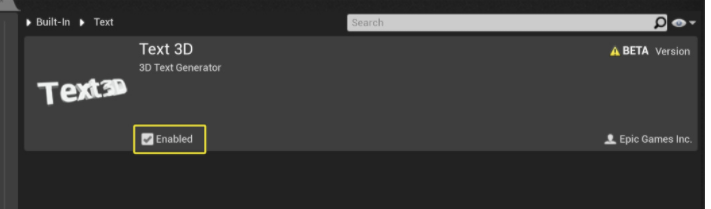
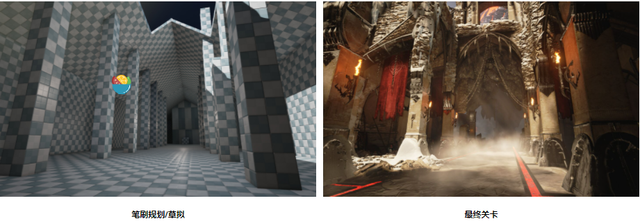
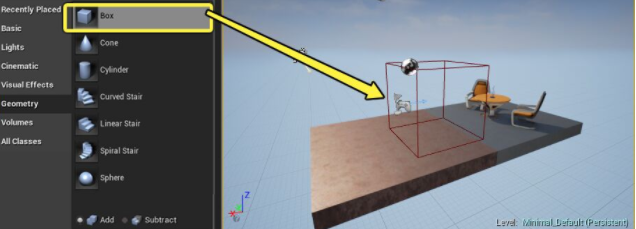

# Actor和几何体

## 常见的Actor类型

| 类型                              | 图标                                                         | 描述                                                         |
| :-------------------------------- | :----------------------------------------------------------- | :----------------------------------------------------------- |
| 网格物体 & 几何体Actor类型        |                                                              |                                                              |
| **StaticMeshActor**               | (convert:false) | **静态网格物体Actor** 是一种简单的Actor类型，用于在场景中显示一个网格物体。尽管其名称暗示该Actor是静态的或者是不能移动的，但是此名称中的 *静态* 是指这种网格物体类型使用的是StaticMesh（静态网格物体）。由于这些网格物体的几何体不能改变，所以这些网格物体是静态的。但是，实际上在游戏运行过程中可以通过其他方式来移动及修改Actor。这些Actor一般用作为 *世界几何体* 及装饰性网格物体，以创建关卡的场景。请参照[静态网格体Actor](https://docs.unrealengine.com/zh-CN/Basics/Actors/StaticMeshActor/index.html) 获得详细的应用信息。 |
| **Brush（画刷）**                 | (convert:false) | **画刷Actor** 是一种基本类型的Actor，用于在场景中显示简单的三维几何体。在关卡编辑器中，可以使用‘几何体编辑'模式修改这些Actor。BrushActors (或 *画刷*) 常用于快速设置场景原型，粗略构建出场景来测试游戏性。 |
| **SkeletalMeshActor**             | (convert:false) | **骨架网格物体Actor** ,这种Actor类型显示一个带动画的网格物体或骨架网格物体，它的几何体可以发生变形，变形一般通过应用创建的及从外部3D动画用程序中导入的动画序列来完成。这些Actor通常用于类似于角色、活动的生物、及复杂的机器这样的物体；及用于任何需要变形或显示复杂运动的物体。这些Actor也经常同Matinee结合使用，来创建过场动画序列 |
| 游戏性Actor类型                   |                                                              |                                                              |
| **PlayerStart**                   | (convert:false) | **Player Start（玩家起点）** 是一种放置在关卡中，用于指定游戏开始时玩家起始位置的Actor。 |
| **Triggers**                      | (convert:false) (convert:false) (convert:false) | **触发器** 是Actor，当它们与关卡的其他对象交互时，用于促使发生 事件。换言之，它们用于触发事件以响应关卡中的其他操作。所有默认 触发器通常是相同的，只是在影响区域的形状上有所不同，有盒体、胶囊体和球体，触发器使用该形状 来检测是否有其他对象激活了它。盒体触发器胶囊体触发器球体触发器请参照[触发Actor](https://docs.unrealengine.com/zh-CN/Basics/Actors/Triggers/index.html) 获得详细的应用信息。 |
| **MatineeActor**                  | (convert:false) | **Matinee Actors** 使您可以通过 **Matinee** 动画工具使得Actor的属性随着时间产生动画，从而创建动态的游戏性或者游戏中的过场动画。该系统是基于专用的动画轨迹的，您可以在该轨迹上放置关键帧来设置关卡中Actor的某些属性的值。Matinee动画编辑器和用于视频编辑的非线性编辑器类似，这使得它对于那些视频制作专业人员来说很熟悉。请参照[Matinee和过场动画](https://docs.unrealengine.com/zh-CN/AnimatingObjects/Matinee/index.html) 获得详细的应用信息。 |
| 光源Actor类型                     |                                                              |                                                              |
| **PointLight（点光源）**          | (convert:false) | **点光源** 的工作原理很像一个真实的灯泡，从灯泡的钨丝向四面八方发出光。然而，为了性能考虑，点光源被简化为从空间中的一个点均匀地向各个方向发射光。放置的点光源可以设置为三个移动设置之一：**静态（Static）** - （如左图所示）它意味着，不能在游戏中更改光源。这是最快的渲染方法，并且允许烘焙的光照。**静止（Stationary）** - （亦如左图所示）它意味着，光源将仅有自己的阴影和来自 **全局光照（Lightmass）** 烘焙的静态几何体的反射光照，所有其他光照都将为动态。该设置还允许光源在游戏中更改颜色和强度，但它不会移动且允许局部烘焙光照。**可移动（Moveable）** - （如左图所示）这意味着光是完全动态的，并考虑到了动态阴影。从渲染的角度看这是最慢的，但顾及到了游戏进程中的最大灵活性。 |
| **SpotLight（聚光源）**           | (convert:false) | **聚光源** 从圆锥形中的单个点发出光照。使用者可通过两个圆锥形来塑造光源的形状：**内圆锥角** 和 **外圆锥角**。在内圆锥角中，光照将达到完整亮度。从内半径的范围进入外圆锥角的范围中时将发生衰减，形成一个半影，或在聚光源照明圆的周围形成柔化效果。光照的半径将定义圆锥的长度。简单而言，它的工作原理类似于手电筒或舞台照明灯。和其他光源一样，聚光源可设为以下3种移动性设置中的一种：**静态**——（左图）即无法在游戏中改变光源。这是最快的渲染方法，可用于已烘焙的光照。**静止**——（同见左图）即光源通过Lightmass仅烘焙静态几何体的投影和反射光照。其他则为动态光源。此设置还会允许光源在游戏中改变颜色和强度，但其不会移动并允许部分烘焙光照。**可移动**——（左图）即为完全动态光源，可进行动态投影。这是最慢的渲染方法，但在游戏过程中拥有最高灵活性。 |
| **DirectionalLight（定向光源）**  | (convert:false) | **定向光源** 将模拟从无限远的源头处发出的光线。这意味着此光源投射出的阴影均为平行，因此适用于模拟太阳光。定向光源放置后，可对其 **移动性** 进行如下设置：**静态**——（左图）即无法在游戏中改变光源。这是速度最快的渲染方法，可用于已烘焙的光照。**静止**——（同见左图）即光源通过 **Lightmass** 只烘焙静态几何体的投影和反射光照。其他则为动态光源。此设置还允许光源在游戏中改变颜色和强度，但其并不会移动，且允许部分烘焙光照。**可移动**——（左图）即为完全动态光源，可进行动态投影。这是最慢的渲染方法，但在游戏过程中拥有最高灵活性。 |
| 特效Actor类型                     |                                                              |                                                              |
| **ParticleEmitter（粒子发射器）** | (convert:false) | **粒子发射器** 是一种用于通过以平面粒子（相机朝向的平面）或网格物体的方式生成粒子来创建特效(比如烟雾、火焰、火花等)的Actor。粒子的实际行为定义在特殊的资源[粒子系统](https://docs.unrealengine.com/zh-CN/RenderingAndGraphics/ParticleSystems/index.html) 中并由粒子系统进行控制，您可以在[内容浏览器](https://docs.unrealengine.com/zh-CN/Basics/ContentBrowser/index.html) 中创建粒子系统，在 [Cascade粒子编辑器](https://docs.unrealengine.com/zh-CN/RenderingAndGraphics/ParticleSystems/Cascade/index.html) 中编辑粒子系统。 |
| 音效Actor类型                     |                                                              |                                                              |
| **AmbientSound（环境音效）**      | (convert:false) | **环境音效Actors** 用于在世界中以 Sound Cue的形式播放音效。这些音效可以时循环播放的也可以是非循环播放的，可以具有空间化及衰减效果，但所有这些必须在SoundCue中进行设置，而没有暴露在环境音效Actor本身上。 |

### 3D文本

> 你可以利用 [Sequencer编辑器](https://docs.unrealengine.com/zh-CN/AnimatingObjects/Sequencer/index.html) 制作3D文本对象动画，同时直接在虚幻编辑器中创建示意图形。

#### 启用3D文本插件

要使用3D文本，必须先启用 **文本3D** 插件。

#### 文本3D Actor设置

| **文本（Text）**                       | 输入用于创建3D文本几何体的文本。按 **Shift+Enter** 创建直线。 |
| -------------------------------------- | ------------------------------------------------------------ |
| **挤压（Extrude）**                    | 设置几何体的深度：即文字从前到后的厚度                       |
| **斜面（Bevel）**                      | 设置沿着字幕边缘的斜面大小。                                 |
| **斜面类型（Bevel Type）**             | 设置边缘斜面的类型：用于锐利、平直斜面的线性或是用于圆形边缘的半圆形。 |
| **半圆分段数（Half Circle Segments）** | 设置创建半圆斜面所使用的分段数。                             |
| **正面材质（Front Material）**         | 选择给字母正面表面着色的材质。                               |
| **斜面材质（Bevel Material）**         | 选择给斜面表面着色的材质。                                   |
| **挤压材质（Extrude Material）**       | 选择给字母侧面着色的材质。                                   |
| **背面材质（Back Material）**          | 选择给字母背面着色的材质。                                   |
| **最大宽度（Max Width）**              | 设置文本的最大宽度。                                         |
| **最大高度（Max Height）**             | 设置文本的最大高度。                                         |
| **按比例缩放（Scale Proportionally）** | 将字母的高度和宽度锁定为当前比例。一旦启用，对字幕的高度或宽度的任何改动都会同时影响到两者。 |

#### 逐字母动画处理

文本3D Actor中的逐字母动画由 **Text3DCharacterTransform** 组件控制。你需要将这类组件添加到Actor，并设置其值。

若要设置逐字母动画：

1. 在视口或 **世界大纲视图（World Outliner）** 中选择文本3D Actor。

2. 在 **细节（Details）** 面板中，单击 **添加组件（Add Component）**，并选择 **Text3DCharacterTransform**。

3. 在 **细节（Details）** 面板顶部，选择新的 **Text3DCharacterTransform**，以访问其设置。

4. 启用位置、旋转和/或缩放变换，并调整其设置，以生成所需的动画效果。有关每种设置的说明，请参见下表。

5. 通常，你需要用 **关卡序列（Level Sequence）** 播放你设计的动画效果。这通常涉及将文本3D Actor添加到关卡序列中，为 **进度（Progress）** 设置创建新轨迹，然后在这些轨迹上创建关键帧，让数值随着时间在0到100之间变化

#### 文本3D角色变换设置

| **启用（Enabled）**                     | 确定 **Text3DCharacterTransform** 组件是否根据此分段中的值更新字母的位置、旋转或缩放。 |
| --------------------------------------- | ------------------------------------------------------------ |
| **进度（Progress）**                    | 确定文本动画在 **开始（Begin）** 和 **结束（End）** 状态之间的总进度。位于 `0` 时，文本的位置、旋转或缩放处于其 **开始（Begin）** 状态。位于 `100` 时，文本的位置、旋转或缩放处于其 **结束（Begin）** 状态。两者之间的值在 **开始（Begin）** 和 **结束（End）** 状态之间按比例内插位置、旋转或缩放。 |
| **顺序（Order）**                       | 确定文本字母在播放动画时的顺序。                             |
| **范围（Range）**                       | 确定相邻字母之间的动画同步程度。位于 `0` 时，每个字母会在下一个字母开始变换之前，完成从 **开始（Begin）** 状态到 **结束（End）** 状态的变换。位于 `100` 时，所有字母会同时开始和结束其转换。介于两者之间的值，例如位于 `50` 时，则会让相互衔接的字母在动画播放的时间上产生部分重叠。， |
| **开始（Begin）**                       | 为字母的旋转或缩放所设置的初始状态。所有方向轴数值均以文本3D Actor的局部空间表示。 |
| **结束（End）** 或 **距离（Distance）** | 为字母的位置、旋转或缩放设置所需的结束状态。                 |

### 几何体笔刷Actor

> 不建议将几何体笔刷视为关卡设计的最终方法。其并非必需步骤，但在创建早期阶段较为有用。

==几何体笔刷==是虚幻编辑器中最为基本的==关卡构建工具==。理论上建议将==几何体笔刷==视为**在关卡中填充和雕刻空间体积**。几何体笔刷之前为关卡设计的主要构件块。现在这个角色已由==静态网格体==替代，其效率远高于几何体笔刷。但在产品的早期阶段，几何体笔刷依旧有用，其可快速设置关卡和对象的原型，也可用于无法使用3D建模工具的关卡构建。本文档将介绍几何体笔刷的用途以及在关卡中的使用方法。

#### 几何体笔刷的用途

##### 规划关卡

创建关卡的==标准工作流程==大致为：

- 规划关卡和设计关卡路径
- 测试流程和gameplay
- 修改布局并重复测试
- 初始建模阶段
- 初始灯光阶段
- 碰撞和性能问题的测试
- 完善阶段

##### 简单填充几何体

关卡设计师创建关卡时，时常需要使用较为简单的几何体填充间隙或空间。若无用于填充控件的现成静态网格体，设计师可直接使用几何体笔刷进行填充，无需美术团队创建自定义网格体。尽管静态网格体性能更好，但对于简单几何体而言，偶尔使用几何体笔刷也不会造成严重影响。

#### 创建笔刷

使用 **模式（Mode）** 面板中的 **几何体（Geometry）** 选项卡创建笔刷：

1. 使用该面板底部的单选按钮选择[笔刷类型](https://docs.unrealengine.com/zh-CN/Basics/Actors/Brushes/index.html#笔刷类型) （叠加型或删减型）：

2. 将列表中的一个基元类型拖放到 **视口（Viewport）** 中：

    

3. 修改 **笔刷设置（Brush Settings）**，使用变换工具，或激活 **几何体编辑模式（Geometry Editing Mode）** 来重新设置笔刷形状和大小。参阅[修改笔刷](https://docs.unrealengine.com/zh-CN/Basics/Actors/Brushes/index.html#修改笔刷) 。

TODO ❎

关于笔刷的更多可见 https://docs.unrealengine.com/zh-CN/Basics/Actors/Brushes/index.html

### 静态网格体Actor

**静态网格体** 是虚幻引擎中一种基本类型的可渲染几何体。为了用这些网格体 来布置你的世界场景，需使用 **静态网格体Actor**。从 **内容浏览器** 中将静态网格体拖拽到关卡中，该网格体会 自动转换为静态网格体Actor。

> 尽管它们被称为静态网格体Actor，但这只是指静态网格体Actor的网格体是静态的。静态网格体Actor可以设置为可移动的，这样就可以创建电梯；或者也可设置为模拟物理表现，以便它和玩家发生碰撞。 

乏善可陈。🤐

​	

### 骨骼网格物体 Actor

使用虚幻引擎 4 (UE4) 开发的视频游戏中，游戏角色大多由一种特殊的网格物体所构成，其称为 **骨骼网格物体 Actor**。（尼玛就是模型）

骨骼网格物体 Actor 是一种特殊的 Actor，用于显示外部 3D 动画软件中创建的复杂动画数据。骨骼网格物体 Actor 和静态网格物体 Actor 不同，因为骨骼网格物体 Actor 内部有一套复杂的骨骼系统，此系统将移动骨骼网格物体的个体顶点，与当前播放的动画进行匹配。骨骼网格物体 Actor 能使用复杂的骨骼系统，因此他们多用于角色、生物、复杂机器、或其他需要变形和显示复杂动作的物体。在 UE4 中，骨骼网格物体 Actor 不仅可用于角色，还可结合 ==Matinee== 创建动画序列。

### 摄影机Actor

暂且不表。

### Player Start（玩家出生点）

乏善可陈。🤐

### 贴花Actor用户指南

延迟贴花提供了更好的性能和更方便的维护。

| 项目                                                         | 说明                                                         |
| :----------------------------------------------------------- | :----------------------------------------------------------- |
| **半透明（Translucent）**                                    | 它将混合完整材质，更新GBuffer，不适用于烘焙光照。            |
| **染色（Stain）**                                            | 它将调制基色，混合其余部分，更新GBuffer，不适用于烘焙光照。  |
| **法线（Normal）**                                           | 它将仅混合法线，更新GBuffer，不适用于烘焙光照。              |
| **自发光（Emissive）**                                       | 它仅适用于附加自发光。                                       |
| **DBuffer_半透明颜色、法线、粗糙度（DBuffer_Translucent Color, Normal, Roughness）** | 它适用于非金属，也可以放入DBuffer中用于烘焙光照。如果没有连接法线，那么它将成为DBM_TranslucentNormal。 |
| **DBuffer_半透明颜色（DBuffer_Translucent Color）**          | 它适用于非金属，也可以放入DBuffer中用于烘焙光照。            |
| **（DBuffer_半透明颜色、法线）DBuffer_Translucent Color, Normal** | 它适用于非金属，也可以放入DBuffer中用于烘焙光照。如果没有连接法线，那么它将成为DBM_DBuffer_Color。 |
| **DBuffer_半透明颜色、粗糙度（DBuffer_Translucent Color, Roughness）** | 它适用于非金属，也可以放入DBuffer中用于烘焙光照。            |
| **DBuffer_半透明法线（DBuffer_Translucent Normal）**         | 它适用于非金属，也可以放入DBuffer中用于烘焙光照。            |
| **DBuffer_半透明法线、粗糙度（DBuffer_Translucent Normal, Roughness）** | 它适用于非金属，也可以放入DBuffer中用于烘焙光照。如果没有连接法线，那么它将成为DBM_DBuffer_Roughness。 |
| **DBuffer_半透明粗糙度（DBuffer_Translucent Roughness）**    | 它适用于非金属，也可以放入DBuffer中用于烘焙光照。            |
| **（实验性）体积距离函数（Volumetric Distance Function (experimental)）** | 它将根据LightVector在不透明度中输出一个有向距离。            |

#### 当前局限

- 我们目前只支持延迟贴花，而且它们只对静态对象有效。
- 法线混合当前不能围绕对象。
- 流送尚未连接，所以请确保纹理没有流送。
- 遮罩贴花（不影响其他对象）没有完全实现。

### 触发Actor

乏善可陈。🤐

### 体积参考

**体积** 是三维 **Actor**，用于更改关卡中不同区域的行为。例如，体积可用于下述行为：

- 对体积中的玩家或其他Actor造成伤害。
- 作为碰撞表面，阻止特定Actor进入体积。
- 当某个Actor进入体积时打开门。
- 更改关卡计算其光照或可视性的方式。

| 阻挡体积                     | **阻挡体积（Blocking Volume）** 可作为碰撞形态，它被设计为Actor无法穿过。 |
| ---------------------------- | ------------------------------------------------------------ |
| 摄像机阻挡体积               | **摄像机阻挡体积（Camera Blocking Volume）** 是预配置的碰撞设置，可阻挡摄像机且忽略除摄像机以外的所有Actor的体积。它们旨在定义不可见边界，以将摄像机限制在合理范围之内 |
| 销毁Z体积                    | **销毁Z体积（Kill Z Volume）** 的目的是在特定类型的游戏中防止对象越界 |
| 伤害施加体积                 | **伤害施加体积（Pain-Causing Volume）** 是具有对玩家造成伤害的能力的物理体积。如果关卡中存在熔岩坑、有毒气体等玩家明显不应进入的区域，该体积非常有用。 |
| 物理体积                     | **物理体积（Physics Volume）** 是可在其中操控影响角色和其他物理对象的物理设置的体积。它们的一个常见用例是创建玩家需要在其中游动的有水环境。 |
| 触发器体积                   | **触发器体积（Trigger Volume）** 可以在玩家或其他对象进入或离开它们时引起事件。可快速将它们与 **关卡蓝图** 配合使用来测试事件和游戏性方案或功能，而无需更多蓝图。 |
| 音频体积                     | 让你可以控制和应用关卡中的各种声音。你也可以用它们来创建分隔性音频区域 |
| 等等........................ |                                                              |

TOTO 

:star:实际项目再进行学习

### 目标点 Actor

为游戏创建世界场景时，有时需要在其中放置和生成各种物体，以便玩家与它们进行互动。**目标点 Actor** 的作用正在于此，在世界场景中设定一个一般点，作为物体生成的点。如您对其他 3D 软件（如 3Ds Max 或 Maya）有所了解，便会发现目标点 Actor 与这些软件中的虚拟 Actor 十分相似。

目标点 Actor 在虚幻引擎 4 中的用途十分广泛。下列是目标点 Actor 的部分用途。

- 设定动画序列中摄像机对准的目标。
- 设定 AI 路径点。
- 设定 VFX（视觉特效）生成点。
- 设定可拾取道具（如回复品和物品）生成点。
- 设定世界场景中道具所在点/应放置点的视觉提示。