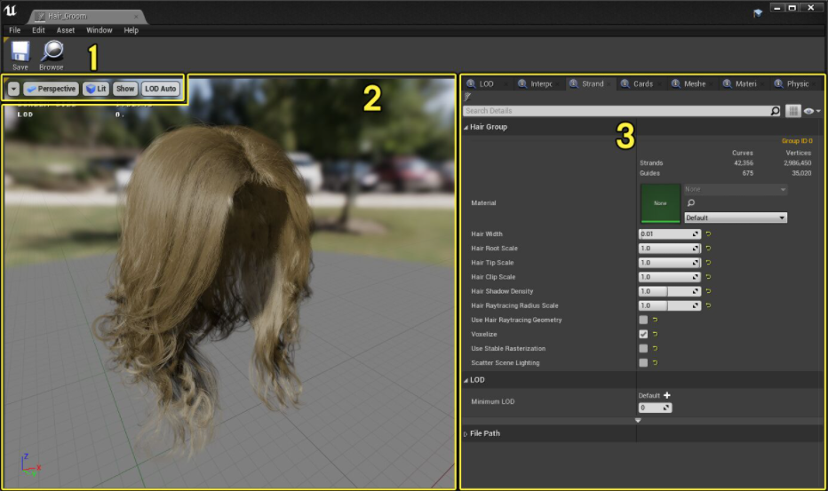
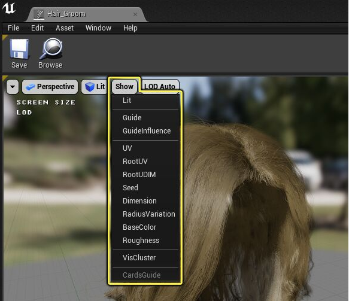
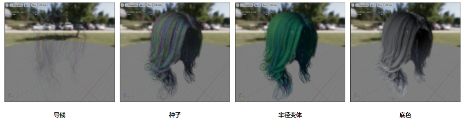

# 毛发渲染与模拟

## Groom资产编辑器用户指南

**Groom** 系统设计用于处理导入的groom Alembic（.abc）文件中的毛发发束。但是，出于**可延展性**方面的考虑，它还支持使用**发片**和**网格体**进行替代性的几何体呈现。所有这些几何体呈现都是在单个资产和组件中进行管理的，这样易于设置。

**Groom资产编辑器** 管理着groom的大部分方面，可用于修改groom的不同部分，以确定渲染方式、物理模拟处理方式、创建和管理细节层次（LOD）等等。

### Groom资产编辑器界面

#### 显示

**显示（Show）** 下拉菜单提供Groom资产编辑器的具体可视化选项，帮助你查看场景中要处理的数据类型，以及此groom的诊断错误或意外结果。

| 属性                             | 说明                                                         |
| :------------------------------- | :----------------------------------------------------------- |
| **导线（Guide）**                | 显示用于模拟的导线。                                         |
| **导线影响（Guide Influence）**  | 显示颜色可视化中的模拟块（所有受一个导线影响的发束）。       |
| **紫外线（UV）**                 | 显示每个发束上的紫外线。                                     |
| **根部紫外线（Root UV）**        | 显示每个发束根部的紫外线。                                   |
| **根部UDIM（Root UDIM）**        | 显示每个发束根部的UDIM。                                     |
| **有效维度（Dimension）**        | 显示每个发束的宽度/长度变体。                                |
| **种子（Seed）**                 | （用彩色）显示每个发束使用的随机种子。                       |
| **半径变体（Radius Variation）** | （用彩色）显示发束的大小。蓝色表示较细的发束。黄色表示较粗的发束。 |
| **底色（Base Color）**           | 显示每个顶点存储的底色。如果底色不是通过groom从建模应用程序中导出的，发束将显示为黑色。 |
| **粗糙度（Roughness）**          | 显示每个顶点存储的粗糙度。如果粗糙度不是通过groom从建模应用程序中导出的，发束将显示为黑色。 |
| **Vis群集（Vis Cluster）**       | 显示用于剔除和细节层次用途的毛发群集。                       |

**显示（Show）** 下拉菜单中有一些可视化示例。

